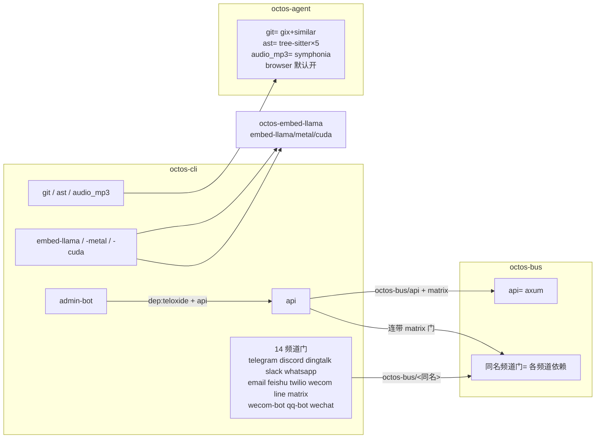

# 附录 D 事实表 — Feature Flags 全量采集(octos-book v2)

- **源码基准 commit**: `9c157101`(完整 hash `9c1571016e5ea86955b4b3486c04f0359dfff339`,octos main,提交时间 2026-09-02 19:37:40 +0800,只读实测)
- **统计日期**: 2026-09-03
- **源码仓库**: `/Users/zhangalex/Work/Projects/FW/octos`(只读,工作区 clean,`git status` 空)
- **统一生成命令**: 全量采集 `awk '/^\[features\]/{f=1;next} /^\[/{f=0} f&&/^[a-z]/' /Users/zhangalex/Work/Projects/FW/octos/crates/*/Cargo.toml`;单 crate 采集 `awk '/^\[features\]/{f=1;next} /^\[/{f=0} f&&/^[a-z]/' <Cargo.toml 全路径>`;有无 `[features]` 判定 `grep -q '\[features\]' <Cargo.toml 全路径>`
- **总量**: workspace 38 个 member 中 **12 个 crate 有 `[features]` 段**,共 **79 条 feature 定义**(70 个非 default feature + 9 条显式 `default =` 行;`octos-embed-llama`、`octos-services`、`octos-store` 无显式 default 行)。**频道门 14 个**(telegram、discord、dingtalk、slack、whatsapp、email、feishu、twilio、wecom、line、matrix、wecom-bot、qq-bot、wechat),在 octos-bus 定义、octos-cli 与 octos-server 各自转发一份
- **交叉核对**: 与 `chapters/ch14-runtime-modes.md` §14.7(`crates/octos-cli/Cargo.toml:142` 起、`api` 拉入 axum/rustls/prometheus 并连带 `octos-bus/api` 与 matrix、`embed-llama`/`-metal`/`-cuda` 控制本地嵌入、`Command::Serve` 被 `#[cfg(feature = "api")]` 门控于 `/Users/zhangalex/Work/Projects/FW/octos/crates/octos-cli/src/commands/mod.rs:398`)一致;与 `chapters/appendix-d-feature-flags.md` 旧稿对比:**旧稿漏 3 个 octos-cli feature**(`audio_mp3`)、漏 `octos-agent/browser`/`audio_mp3`、漏 `default = ["browser"]`、漏 `octos-diagnostics`/`octos-llm`/`octos-store`/`octos-services`/`octos-ffi`/`octos-uniffi`/`octos-pyo3`/`octos-server`/`octos-embed-llama` 共 9 个有 feature 的 crate,且"没有 [features] 的 crate"清单含已不存在的 `pipeline-guard`、漏 `octos-diagnostics`、`octos-fleet`、`octos-fleet-worker`、`octos-workflows`

---

## 1. octos-cli(23 条 = default + 22 个非 default;`/Users/zhangalex/Work/Projects/FW/octos/crates/octos-cli/Cargo.toml:142-177`)

spec 事实边界旧列 22 个(含 default、未含 `audio_mp3`);当前实取 23 条,`audio_mp3`(`:177`)为边界后新增。

生成命令: `awk '/^\[features\]/{f=1;next} /^\[/{f=0} f&&/^[a-z]/' /Users/zhangalex/Work/Projects/FW/octos/crates/octos-cli/Cargo.toml`

| feature | 拉入的依赖 / 下游 feature | 一句作用 | 默认 |
|---|---|---|---|
| `default` | `[]` | 默认最小集,不含 API/频道/工具 | 是 |
| `embed-llama` | `dep:octos-embed-llama`, `octos-embed-llama/embed-llama` | 进程内 llama.cpp GGUF 嵌入 provider(`create_embedder` 接 `embedding.provider = "llamacpp"`),跨平台默认 CPU 后端 | 否 |
| `embed-llama-metal` | `embed-llama`, `octos-embed-llama/metal` | 在 embed-llama 上叠加 Apple Metal 加速 | 否 |
| `embed-llama-cuda` | `embed-llama`, `octos-embed-llama/cuda` | 在 embed-llama 上叠加 NVIDIA CUDA 加速 | 否 |
| `api` | `dep:axum`, `dep:tower-http`, `dep:tokio-util`, `dep:futures`, `dep:tokio-tungstenite`, `dep:rustls`, `dep:rustls-native-certs`, `dep:rust-embed`, `dep:metrics-exporter-prometheus`, `dep:lettre`, `dep:rand`, `dep:sysinfo`, `dep:subtle`, `octos-bus/api`, `matrix` | REST API/dashboard/SSE/WS 控制面。**serve 子命令依赖它(`Command::Serve` 带 `#[cfg(feature = "api")]`,`/Users/zhangalex/Work/Projects/FW/octos/crates/octos-cli/src/commands/mod.rs:147-148`),漏掉则 octoscode 无法启动**(octoscode 默认命令 `octos serve --stdio --solo`,见 octoscode 仓 `/Users/zhangalex/Work/Projects/FW/octoscode/src/cli.rs:118`,转引自 `assets/ch14-facts.md` §2.1)。matrix 无条件连带:`/api/my/profile/matrix/*` handler 与管理台 Matrix 邀请 UI 引用 `octos_bus::MatrixInviteStore` 等 matrix-only 类型 | 否 |
| `admin-bot` | `dep:teloxide`, `dep:futures`, `api` | Telegram 管理 Bot;显式依赖 `api` | 否 |
| `telegram` | `octos-bus/telegram` | Telegram 频道门 | 否 |
| `discord` | `octos-bus/discord` | Discord 频道门 | 否 |
| `dingtalk` | `octos-bus/dingtalk` | 钉钉回调频道门 | 否 |
| `slack` | `octos-bus/slack` | Slack WebSocket 频道门 | 否 |
| `whatsapp` | `octos-bus/whatsapp` | WhatsApp WebSocket 频道门 | 否 |
| `email` | `octos-bus/email` | Email(IMAP/SMTP)频道门 | 否 |
| `feishu` | `octos-bus/feishu` | 飞书频道门 | 否 |
| `twilio` | `octos-bus/twilio` | Twilio webhook 频道门 | 否 |
| `wecom` | `octos-bus/wecom` | 企业微信回调频道门 | 否 |
| `line` | `octos-bus/line` | LINE webhook 频道门 | 否 |
| `matrix` | `octos-bus/matrix` | Matrix 频道门 | 否 |
| `wecom-bot` | `octos-bus/wecom-bot` | 企业微信 Bot WebSocket 频道门 | 否 |
| `qq-bot` | `octos-bus/qq-bot` | QQ Bot WebSocket 频道门 | 否 |
| `wechat` | `octos-bus/wechat` | WeChat bridge WebSocket 频道门 | 否 |
| `git` | `octos-agent/git` | Git 工具能力门(gix+similar) | 否 |
| `ast` | `octos-agent/ast` | AST 解析工具能力门(tree-sitter 五语言) | 否 |
| `audio_mp3` | `octos-agent/audio_mp3` | AudioNonSilent 工作区契约校验器的 mp3 解码;不带则 .mp3 工件返回 "feature not enabled"(`/Users/zhangalex/Work/Projects/FW/octos/crates/octos-agent/src/validators.rs`) | 否 |

## 2. octos-bus(16 个含 default;`/Users/zhangalex/Work/Projects/FW/octos/crates/octos-bus/Cargo.toml:9-26`)

生成命令: `awk '/^\[features\]/{f=1;next} /^\[/{f=0} f&&/^[a-z]/' /Users/zhangalex/Work/Projects/FW/octos/crates/octos-bus/Cargo.toml`

| feature | 拉入的依赖 | 一句作用 | 默认 |
|---|---|---|---|
| `default` | `[]` | 纯 bus 核心(会话/调度/去重),零频道 | 是 |
| `api` | `axum` | API/SSE/WS 接入所需 bus 类型(`ApiChannel` 等) | 否 |
| `telegram` | `teloxide` | TelegramChannel 实现 | 否 |
| `discord` | `serenity` | DiscordChannel 实现 | 否 |
| `dingtalk` | `axum` | DingTalkChannel 回调实现 | 否 |
| `slack` | `tokio-tungstenite` | SlackChannel WS 实现 | 否 |
| `whatsapp` | `tokio-tungstenite` | WhatsAppChannel WS 实现 | 否 |
| `feishu` | `tokio-tungstenite`, `axum`, `rustls`, `rustls-native-certs` | FeishuChannel WS+回调实现 | 否 |
| `line` | `axum` | LineChannel webhook 实现 | 否 |
| `twilio` | `axum` | TwilioChannel webhook 实现 | 否 |
| `wecom` | `axum` | WeComChannel 回调实现 | 否 |
| `matrix` | `axum` | MatrixChannel + MatrixUserChannel(含 `MatrixInviteStore`)实现 | 否 |
| `wecom-bot` | `tokio-tungstenite`, `rustls`, `rustls-native-certs` | WeComBotChannel WS 实现 | 否 |
| `qq-bot` | `tokio-tungstenite`, `rustls`, `rustls-native-certs` | QQBotChannel WS 实现 | 否 |
| `wechat` | `tokio-tungstenite` | WeChatChannel WS bridge 实现 | 否 |
| `email` | `async-imap`, `tokio-rustls`, `rustls`, `webpki-roots`, `lettre`, `mailparse` | EmailChannel IMAP/SMTP 实现 | 否 |

频道门运行期对应导出: `/Users/zhangalex/Work/Projects/FW/octos/crates/octos-bus/src/lib.rs:17-49`(类型导出)与 `:71-107`(mod 声明)逐 feature `#[cfg]` 门控,14 频道一一对齐。

## 3. octos-agent(5 个含 default;`/Users/zhangalex/Work/Projects/FW/octos/crates/octos-agent/Cargo.toml:117-131`)

生成命令: `awk '/^\[features\]/{f=1;next} /^\[/{f=0} f&&/^[a-z]/' /Users/zhangalex/Work/Projects/FW/octos/crates/octos-agent/Cargo.toml`

| feature | 拉入的依赖 | 一句作用 | 默认 |
|---|---|---|---|
| `default` | `["browser"]` | 默认开 browser(见下) | 是 |
| `browser` | `[]`(chromiumoxide 无条件编译) | 只切换 `web_search` 的无头 Chrome(CDP)兜底 provider;关掉则 HTTP-only 行为与旧版逐字节一致(推断自 Cargo.toml 注释) | **是** |
| `git` | `dep:gix`, `dep:similar` | Git 操作与 diff 能力 | 否 |
| `ast` | `dep:tree-sitter` + rust/python/javascript/typescript 四个 grammar | AST 代码结构分析 | 否 |
| `audio_mp3` | `dep:symphonia` | AudioNonSilent 校验器的 mp3 解码(WAV 走常开的 hound) | 否 |

运行期 `#[cfg]` 门: `browser`×10、`ast`×6、`git`×5、`audio_mp3`×1(命令: `grep -rn 'cfg(feature' /Users/zhangalex/Work/Projects/FW/octos/crates/octos-agent/src --include='*.rs'`)。

## 4. octos-server(16 个含 default;`/Users/zhangalex/Work/Projects/FW/octos/crates/octos-server/Cargo.toml:46-81`)

生成命令: `awk '/^\[features\]/{f=1;next} /^\[/{f=0} f&&/^[a-z]/' /Users/zhangalex/Work/Projects/FW/octos/crates/octos-server/Cargo.toml`

| feature | 拉入的依赖 / 下游 | 一句作用 | 默认 |
|---|---|---|---|
| `default` | `[]` | 最小 server 库 | 是 |
| `api` | `dep:axum`, `dep:tower-http`, `dep:tokio-util`, `dep:futures`, `dep:tokio-tungstenite`, `dep:rustls`, `dep:rustls-native-certs`, `dep:rust-embed`, `dep:metrics-exporter-prometheus`, `dep:lettre`, `dep:rand`, `dep:sysinfo`, `dep:subtle`, `octos-bus/api`, `matrix` | HTTP/WS API 层,镜像 octos-cli `api`;matrix 必选(handler 引用 matrix 类型) | 否 |
| `telegram`/`discord`/`dingtalk`/`slack`/`whatsapp`/`email`/`feishu`/`twilio`/`wecom`/`line`/`matrix`/`wecom-bot`/`qq-bot`/`wechat` | 各 `octos-bus/<同名>` | 频道门转发(网关运行期不走 HTTP `api` 层也可派发) | 否 |

## 5. octos-embed-llama(3 个;`/Users/zhangalex/Work/Projects/FW/octos/crates/octos-embed-llama/Cargo.toml:14-20`)

生成命令: `awk '/^\[features\]/{f=1;next} /^\[/{f=0} f&&/^[a-z]/' /Users/zhangalex/Work/Projects/FW/octos/crates/octos-embed-llama/Cargo.toml`

| feature | 拉入的依赖 | 一句作用 | 默认 |
|---|---|---|---|
| `embed-llama` | `dep:llama-cpp-2`, `dep:self_cell` | 从源码编译 llama.cpp(CMake+C++ 工具链),进程内 GGUF 嵌入;不开则 crate 近空 | 否 |
| `metal` | `llama-cpp-2/metal` | Apple Metal 加速 | 否 |
| `cuda` | `llama-cpp-2/cuda` | NVIDIA CUDA 加速 | 否 |

## 6. octos-ffi(4 个含 default;`/Users/zhangalex/Work/Projects/FW/octos/crates/octos-ffi/Cargo.toml:37-47`)

生成命令: `awk '/^\[features\]/{f=1;next} /^\[/{f=0} f&&/^[a-z]/' /Users/zhangalex/Work/Projects/FW/octos/crates/octos-ffi/Cargo.toml`

| feature | 拉入的依赖 / 下游 | 一句作用 | 默认 |
|---|---|---|---|
| `default` | `[]` | FFI 面保持纯 Rust | 是 |
| `embed-llama` | `dep:octos-embed-llama`, `octos-embed-llama/embed-llama` | 把 GGUF 后端编进 `octos_embed`,否则报 "embedding support not compiled in" | 否 |
| `embed-llama-metal` | `embed-llama`, `octos-embed-llama/metal` | FFI 侧 Metal 加速 | 否 |
| `embed-llama-cuda` | `embed-llama`, `octos-embed-llama/cuda` | FFI 侧 CUDA 加速 | 否 |

## 7. octos-uniffi(2 个含 default;`/Users/zhangalex/Work/Projects/FW/octos/crates/octos-uniffi/Cargo.toml:36-42`)

生成命令: `awk '/^\[features\]/{f=1;next} /^\[/{f=0} f&&/^[a-z]/' /Users/zhangalex/Work/Projects/FW/octos/crates/octos-uniffi/Cargo.toml`

| feature | 拉入的依赖 / 下游 | 一句作用 | 默认 |
|---|---|---|---|
| `default` | `[]` | uniffi 绑定保持纯 Rust | 是 |
| `embed-llama` | `octos-ffi/embed-llama` | 经 ffi 转发 `Runtime::embed`,否则返回 `NoEmbedder` | 否 |

## 8. octos-pyo3(4 个含 default;`/Users/zhangalex/Work/Projects/FW/octos/crates/octos-pyo3/Cargo.toml:42-52`)

生成命令: `awk '/^\[features\]/{f=1;next} /^\[/{f=0} f&&/^[a-z]/' /Users/zhangalex/Work/Projects/FW/octos/crates/octos-pyo3/Cargo.toml`

| feature | 拉入的依赖 / 下游 | 一句作用 | 默认 |
|---|---|---|---|
| `default` | `[]` | Python-less CI 上 `cargo build --workspace` 不破 | 是 |
| `python` | `dep:pyo3` | 编译 pyo3 面(拉 libpython) | 否 |
| `extension-module` | `python`, `pyo3/extension-module` | wheel 构建:python + 不链 libpython(宿主解释器解析符号) | 否 |
| `embed-llama` | `octos-ffi/embed-llama` | `Runtime.embed` 返回真实向量而非 NoEmbedder | 否 |

## 9. octos-diagnostics(2 个含 default;`/Users/zhangalex/Work/Projects/FW/octos/crates/octos-diagnostics/Cargo.toml:22-26`)

生成命令: `awk '/^\[features\]/{f=1;next} /^\[/{f=0} f&&/^[a-z]/' /Users/zhangalex/Work/Projects/FW/octos/crates/octos-diagnostics/Cargo.toml`

| feature | 拉入的依赖 | 一句作用 | 默认 |
|---|---|---|---|
| `default` | `[]` | Stage 1 零网络依赖 | 是 |
| `github` | `dep:reqwest`(workspace 同 pin,rustls-tls) | `update --check` 的 GitHub Releases 客户端(Stage 2;self-update 是 Stage 3 不在此) | 否 |

## 10. octos-llm(2 个含 default;`/Users/zhangalex/Work/Projects/FW/octos/crates/octos-llm/Cargo.toml:9-15`)

生成命令: `awk '/^\[features\]/{f=1;next} /^\[/{f=0} f&&/^[a-z]/' /Users/zhangalex/Work/Projects/FW/octos/crates/octos-llm/Cargo.toml`

| feature | 拉入的依赖 | 一句作用 | 默认 |
|---|---|---|---|
| `default` | `[]` | 生产构建不暴露测试面 | 是 |
| `test-utils` | `[]` | 暴露 `AdaptiveRouter::publish_failover_for_subscribers` 等测试助手;生产禁开 | 否 |

## 11. octos-store(1 个;`/Users/zhangalex/Work/Projects/FW/octos/crates/octos-store/Cargo.toml:26-30`)

生成命令: `awk '/^\[features\]/{f=1;next} /^\[/{f=0} f&&/^[a-z]/' /Users/zhangalex/Work/Projects/FW/octos/crates/octos-store/Cargo.toml`

| feature | 拉入的依赖 | 一句作用 | 默认 |
|---|---|---|---|
| `test-util` | `[]` | 暴露 `approvals_audit::read_audit_lines` 等测试助手;生产禁开 | 无显式 default 行 |

## 12. octos-services(1 个;`/Users/zhangalex/Work/Projects/FW/octos/crates/octos-services/Cargo.toml:26-31`)

生成命令: `awk '/^\[features\]/{f=1;next} /^\[/{f=0} f&&/^[a-z]/' /Users/zhangalex/Work/Projects/FW/octos/crates/octos-services/Cargo.toml`

| feature | 拉入的依赖 | 一句作用 | 默认 |
|---|---|---|---|
| `test-util` | `[]` | 暴露 crate 级 env-test 锁 `config_context::TEST_ENV_LOCK` 供下游测试串行化;生产禁开 | 无显式 default 行 |

---

## 13. Feature 传播关系(octos-cli → octos-bus / octos-agent)



三层结构:octos-cli 是唯一二进制入口,频道/工具 feature 全部转发到 octos-bus / octos-agent(与 ch14 §14.7「CLI 只做 feature 转发」一致);octos-server 的 `api` 与 14 频道门镜像同一套转发,供库级复用;`api → octos-bus/api + matrix`、`admin-bot → api`、`embed-llama-metal/-cuda → embed-llama` 是三条隐式依赖边。

## 14. 没有 `[features]` 的 crate(26 个)

生成命令: `for c in /Users/zhangalex/Work/Projects/FW/octos/crates/*/Cargo.toml /Users/zhangalex/Work/Projects/FW/octos/crates/app-skills/*/Cargo.toml /Users/zhangalex/Work/Projects/FW/octos/crates/platform-skills/*/Cargo.toml; do grep -q '\[features\]' "$c" || echo "$c"; done`

- 核心库(11): `/Users/zhangalex/Work/Projects/FW/octos/crates/octos-core/Cargo.toml`、`/Users/zhangalex/Work/Projects/FW/octos/crates/octos-memory/Cargo.toml`、`/Users/zhangalex/Work/Projects/FW/octos/crates/octos-workflows/Cargo.toml`、`/Users/zhangalex/Work/Projects/FW/octos/crates/octos-pipeline/Cargo.toml`、`/Users/zhangalex/Work/Projects/FW/octos/crates/octos-plugin/Cargo.toml`、`/Users/zhangalex/Work/Projects/FW/octos/crates/octos-sandbox/Cargo.toml`、`/Users/zhangalex/Work/Projects/FW/octos/crates/octos-swarm/Cargo.toml`、`/Users/zhangalex/Work/Projects/FW/octos/crates/octos-fleet/Cargo.toml`、`/Users/zhangalex/Work/Projects/FW/octos/crates/octos-fleet-worker/Cargo.toml`、`/Users/zhangalex/Work/Projects/FW/octos/crates/octos-dora-mcp/Cargo.toml`、`/Users/zhangalex/Work/Projects/FW/octos/crates/octos-wasm/Cargo.toml`
- App skills(14): `news`、`deep-search`、`deep-crawl`、`send-email`、`account-manager`、`time`、`weather`、`smart-home`、`wechat-bridge`、`skill-evolve`、`harness-starter-generic`、`harness-starter-report`、`harness-starter-audio`、`harness-starter-coding`(`/Users/zhangalex/Work/Projects/FW/octos/crates/app-skills/*/Cargo.toml`)
- Platform skills(1): `voice`(`/Users/zhangalex/Work/Projects/FW/octos/crates/platform-skills/voice/Cargo.toml`)

## 15. 常用生成/验证命令

```bash
# 全量 feature 清单
awk '/^\[features\]/{f=1;next} /^\[/{f=0} f&&/^[a-z]/' /Users/zhangalex/Work/Projects/FW/octos/crates/*/Cargo.toml

# octos-cli feature 与 spec 事实边界核对(实取 23 条 = default + 22)
awk '/^\[features\]/{f=1;next} /^\[/{f=0} f&&/^[a-z]/' /Users/zhangalex/Work/Projects/FW/octos/crates/octos-cli/Cargo.toml | wc -l   # = 23

# serve 子命令的 api 门
grep -n 'cfg(feature = "api")' /Users/zhangalex/Work/Projects/FW/octos/crates/octos-cli/src/commands/mod.rs   # :29 :74 :147-148 :398-399

# octos-bus 频道门 cfg 导出
grep -c 'cfg(feature' /Users/zhangalex/Work/Projects/FW/octos/crates/octos-bus/src/lib.rs   # = 33(17 个 :17-49 类型导出 + 16 个 :71-107 mod 声明;api 门在非 mod 行少一条)
```
