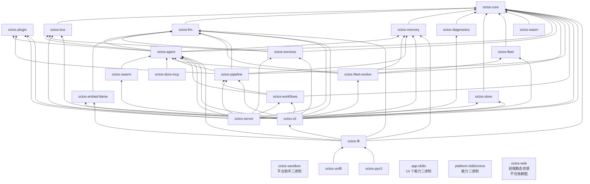

# 第 1 章事实表 — octos 架构与实现

- **源码基准 commit**: `9c157101`(`9c1571016e5ea86955b4b3486c04f0359dfff339`,main 分支)
- **统计日期**: 2026-09-02
- **源码仓库**: `/Users/zhangalex/Work/Projects/FW/octos`(只读;本书仓库与源码仓库是两个目录)
- 除特别注明外,所有命令均在 octos 仓库根执行。行数统计方式统一为:
  ```bash
  find crates/<name> -name '*.rs' | xargs wc -l | tail -1
  ```

---

## 1. 26 个 crate 总表

### 1.1 汇总数字

| 指标 | 值 | 生成命令 |
|---|---|---|
| crate 总数 | **26** | `ls crates \| wc -l` |
| 总行数 | **700,915** | `find crates -name '*.rs' \| xargs wc -l \| tail -1` |
| 频道数 | **17** | `ls crates/octos-bus/src/*_channel.rs \| wc -l` |
| 工具源文件数 | **59** | `ls crates/octos-agent/src/tools/*.rs \| wc -l` |

### 1.2 逐 crate 职责、行数、依赖

「职责出处」列:`desc` = 该 crate `Cargo.toml` 的 `description` 字段(逐字);`//!` = 无 description,取 `src/lib.rs` 或 `src/main.rs` 顶部 `//!` 文档注释首句。

| crate | 一句话职责 | 出处 | Rust 行数 | 依赖的 octos-* crate([dependencies]) |
|---|---|---|---|---|
| octos-core | Core types, task model, and protocols for octos | desc | 22,313 | —(零内部依赖) |
| octos-plugin | Plugin SDK: manifest parsing, discovery, and gating for octos plugins | desc | 5,165 | —(零内部依赖) |
| octos-bus | Message bus, channels, and session management for octos gateway | desc | 42,767 | octos-core |
| octos-llm | LLM provider abstraction for octos | desc | 35,087 | octos-core |
| octos-memory | Episodic memory layer for octos, extends codex-state | desc | 6,428 | octos-core |
| octos-diagnostics | Shared, product-agnostic diagnostics + update-planning for octos binaries (doctor) | desc | 2,243 | octos-core |
| octos-store | Self-contained persistence/state stores for octos (extracted from octos-cli) | desc | 2,664 | octos-core |
| octos-fleet | Fleet kernel store: durable transactional records + one-write-txn CAS ops + recovery reconciliation | desc | 16,888 | octos-core |
| octos-wasm | Browser/JS (wasm-bindgen) client-side binding for octos's protocol + utility types (octos-core). The agent loop runs server-side via `octos serve`. | desc | 883 | octos-core |
| octos-agent | Agent runtime, tool execution, and coordination for octos | desc | 191,985 | octos-core, octos-bus, octos-memory, octos-llm, octos-plugin |
| octos-services | Self-contained support services extracted from octos-cli (personas, souls, compaction, self-update, CLI-agent adapter, tenancy, workflow runtime) | desc | 3,223 | octos-core, octos-llm, octos-bus |
| octos-workflows | Workflow execution subsystem (workflow_runtime + families + delivery workflows) extracted from octos-cli | desc | 1,059 | octos-core, octos-agent, octos-pipeline |
| octos-pipeline | DOT-based pipeline orchestration engine for octos | desc | 32,799 | octos-core, octos-agent, octos-plugin, octos-llm, octos-memory |
| octos-server | HTTP/WebSocket API server + session runtime for octos (extracted from octos-cli). Server-core is ungated; the HTTP layer is behind the `api` feature. | desc | 21 | octos-core, octos-agent, octos-llm, octos-bus, octos-store, octos-services, octos-workflows, octos-pipeline, octos-plugin |
| octos-cli | CLI interface for octos | desc | 307,299 | octos-core, octos-bus, octos-llm, octos-memory, octos-agent, octos-diagnostics, octos-store, octos-services, octos-workflows, octos-pipeline, octos-swarm, octos-plugin, octos-fleet, octos-fleet-worker, octos-embed-llama |
| octos-embed-llama | Cross-platform in-process GGUF embedding provider backed by llama.cpp. | desc | 911 | octos-llm |
| octos-ffi | C-ABI bindings for embedding octos in non-Rust apps (Python/Node/Go/C). | desc | 1,372 | octos-core, octos-agent, octos-llm, octos-memory, octos-cli, octos-embed-llama |
| octos-uniffi | uniffi bindings (idiomatic Python/Swift/Kotlin from one Rust definition) for embedding octos, over the octos-ffi native core. | desc | 465 | octos-ffi |
| octos-pyo3 | Native pyo3 Python extension for embedding octos, over the octos-ffi native core. The recommended Python binding (vs the octos-uniffi reference Python). | desc | 756 | octos-ffi |
| octos-dora-mcp | Compatibility re-export crate for the dora bridge (canonical home: octos-agent::tools::dora_bridge) | desc | 11 | octos-agent |
| octos-swarm | Swarm orchestration primitive: fan-out / sequence / pipeline over MCP-backed sub-agents | desc | 4,980 | octos-agent |
| octos-fleet-worker | Closed, non-interactive fleet task worker: audited replay-safe tool registry + bounded pool over the fleet kernel store | desc | 6,842 | octos-agent, octos-core, octos-fleet, octos-llm, octos-memory |
| octos-sandbox | Platform sandbox helper for octos | desc | 1,468 | —(零内部依赖) |
| app-skills | 14 个技能二进制目录(无顶层 Cargo.toml),见 §3.1 | 目录说明 | 12,098 | —(各成员零 octos-* 依赖;4 个 harness-starter 的 octos-agent/octos-plugin 仅在 [dev-dependencies]) |
| platform-skills | 1 个技能二进制目录(voice),见 §3.1 | 目录说明 | 1,188 | —(voice 零 octos-* 依赖) |
| octos-web | octos-web SPA — Layer 1 reducer fixture testing infrastructure…(package.json) | 目录说明 | 0 | —(非 Rust,不在依赖图) |

行数生成命令(逐 crate,示例,其余同式):
```bash
find crates/octos-core -name '*.rs' | xargs wc -l | tail -1   # 22313
find crates/octos-cli   -name '*.rs' | xargs wc -l | tail -1  # 307299
```

依赖边生成命令(对每个 crate):
```bash
awk '/^\[dependencies\]/{f=1;next} /^\[/{f=0} f && /^octos-/{print $1}' crates/octos-core/Cargo.toml
```

### 1.3 行数全量清单(可逐条复现)

```text
app-skills: 12098
octos-agent: 191985
octos-bus: 42767
octos-cli: 307299
octos-core: 22313
octos-diagnostics: 2243
octos-dora-mcp: 11
octos-embed-llama: 911
octos-ffi: 1372
octos-fleet: 16888
octos-fleet-worker: 6842
octos-llm: 35087
octos-memory: 6428
octos-pipeline: 32799
octos-plugin: 5165
octos-pyo3: 756
octos-sandbox: 1468
octos-server: 21
octos-services: 3223
octos-store: 2664
octos-swarm: 4980
octos-uniffi: 465
octos-wasm: 883
octos-web: 0(无 .rs 文件,wc 无输出,记 0)
octos-workflows: 1059
platform-skills: 1188
合计: 700915
```

交叉核对:23 个含 `.rs` 的 crate 行数相加 = 700,915,与 workspace 总数一致(`find crates -name '*.rs' | xargs wc -l | tail -1`)。

---

## 2. 三处事实核查

### 2.1 octos-sandbox 是「平台助手二进制」,不是沙箱子系统

- `crates/octos-sandbox/Cargo.toml`:
  ```toml
  description = "Platform sandbox helper for octos"
  ```
  (1,468 行 Rust;`[dependencies]` 仅 clap、eyre,零 octos-* 依赖)
- 真正的沙箱子系统在 octos-agent 内部:
  ```bash
  ls crates/octos-agent/src/sandbox/
  # bwrap.rs  docker.rs  landlock.rs  macos.rs  mod.rs  windows.rs
  ```
- 结论:写「octos 沙箱」时应指 `octos-agent::sandbox`(覆盖 landlock/macos/docker/bwrap/windows 六平台),octos-sandbox 只是随平台分发的辅助二进制。

### 2.2 octos-web 不含 Rust、不是 workspace 成员

```bash
find crates/octos-web -name '*.rs' | wc -l
# 0
grep -n 'octos-web' Cargo.toml
# (无输出,退出码 1 —— workspace 根 Cargo.toml 的 members 列表中无 octos-web)
```
- octos-web 是 TypeScript 项目(`package.json` / `tsconfig.json` / `vitest.config.ts`),共 25 个文件、0 个 `.rs`。
- 其 `package.json` description:"octos-web SPA — Layer 1 reducer fixture testing infrastructure…"(前端静态资源,不在 Cargo 依赖图内)。

### 2.3 「无 harness crate」—— harness 是 octos-agent 内的模块

```bash
ls crates | grep -i harness
# (零命中,退出码 1)
ls crates/octos-agent/src/ | grep harness
# harness_errors.rs
# harness_events.rs
```
- octos-agent 的 `src/lib.rs` 第 30–31 行声明 `pub mod harness_errors;` 与 `pub mod harness_events;`(另有 `agent/`、`agents/`、`tools/` 等模块目录;`find crates/octos-agent -type d -name '*harness*'` 无命中,即没有独立 harness 目录,只有这两个平级模块文件)。
- 注意区分:`crates/app-skills/harness-starter-*` 四个是面向用户的脚手架二进制,不是 harness 本体。

---

## 3. app-skills / platform-skills 明细

### 3.1 结构说明

- `crates/app-skills/` 是**目录而非 crate**(无顶层 Cargo.toml),内含 14 个独立二进制 crate,全部列在 workspace members 中(逐项核对 §3.3:news、deep-search、deep-crawl、send-email、account-manager、time、weather、smart-home、wechat-bridge、skill-evolve + harness-starter-{generic,report,audio,coding} = 14)。
  - 核对命令:`find crates/app-skills -name Cargo.toml | wc -l` → 14;members 清单见 §3.3。
- `crates/platform-skills/` 同理,只含 1 个 crate:voice(在 members 中)。
- `ls crates | wc -l` = 26 的构成:23 个 octos-* crate + app-skills + platform-skills + octos-web。

### 3.2 技能二进制职责与依赖

| 二进制 | 一句话职责(Cargo.toml description) | 依赖的 octos-*([dependencies]) |
|---|---|---|
| app-skills/news | Standalone news fetcher: RSS, Hacker News API, Yahoo scraping, article deep-fetch | — |
| app-skills/deep-search | Deep multi-round web research: iterative search, parallel crawling, reference chasing | — |
| app-skills/deep-crawl | CDP-based recursive site crawler using headless Chrome | — |
| app-skills/send-email | Standalone send_email skill binary for SMTP and Feishu/Lark Mail | — |
| app-skills/account-manager | Standalone account management skill for sub-account CRUD | — |
| app-skills/time | Get current time in any timezone | — |
| app-skills/weather | Get current weather for any city worldwide | — |
| app-skills/smart-home | Standalone smart-home skill: list and control devices via the profile's configured bridge | — |
| app-skills/wechat-bridge | (无 description)`//! WeChat Bridge — persistent subprocess that maintains the WeChat long-poll connection.`(src/main.rs 首句) | — |
| app-skills/skill-evolve | Online skill self-correction: detects plugin tool failures and suggests SKILL.md improvements | — |
| app-skills/harness-starter-generic | Minimal starter for a single-artifact harnessed custom app | —(octos-agent、octos-plugin 仅在 [dev-dependencies]) |
| app-skills/harness-starter-report | Starter for a harnessed report-generator custom app | —(同上) |
| app-skills/harness-starter-audio | Starter for a harnessed audio-artifact custom app | —(同上) |
| app-skills/harness-starter-coding | Starter for a harnessed coding-assistant diff-artifact custom app | —(同上) |
| platform-skills/voice | Voice skill binary with external ASR routing and OMiniX TTS/model management | — |

依赖扫描命令(全量,含所有 Cargo.toml 与所在 section):
```bash
for c in $(ls crates); do for f in $(find crates/$c -name Cargo.toml); do
  awk -v crate="$c" -v file="$f" '/^\[/{sec=$0} /^octos-/{print crate" | "file" | "sec" | "$1}' "$f"
done; done
```
结论:全部 15 个技能二进制的 `[dependencies]` 中 octos-* 依赖为 **0 条**;唯一的 octos-* 出现是 4 个 harness-starter 的 `[dev-dependencies]`(octos-agent、octos-plugin,测试用)。

### 3.3 workspace members 原文(佐证)

根 `Cargo.toml`(共 39 个成员,按原文顺序):octos-core, octos-diagnostics, octos-memory, octos-llm, octos-agent, octos-bus, octos-workflows, octos-server, octos-store, octos-services, octos-cli, app-skills/{news, deep-search, deep-crawl, send-email, account-manager, time, weather, smart-home, wechat-bridge, skill-evolve, harness-starter-generic, harness-starter-report, harness-starter-audio, harness-starter-coding}, platform-skills/voice, octos-dora-mcp, octos-pipeline, octos-plugin, octos-sandbox, octos-swarm, octos-fleet, octos-fleet-worker, octos-embed-llama, octos-ffi, octos-uniffi, octos-wasm, octos-pyo3。
octos-web **不在** members 中(grep 退出码 1)。
注:26 个 `ls crates` 顶层条目中,app-skills/platform-skills 是多 crate 目录(合计 15 个成员 crate),octos-web 不是成员;26(目录)= 23 octos-* + 2 技能目录 + 1 前端目录。

---

## 4. 分层推导(从 [dependencies] 依赖方向)

推导原则:若 A 的 `[dependencies]` 含 octos-B,则 B 在 A 之下一层;零内部依赖者在最底层。技能二进制目录(app-skills、platform-skills)与 octos-web 是**能力二进制/前端资源,不属于核心库分层**。

**推导所用的依赖清单**(即 §1.2 第 5 列、§3.2 第 3 列,仅 [dependencies]):

```text
octos-core          -> (无)
octos-plugin        -> (无)
octos-sandbox       -> (无)
octos-bus           -> octos-core
octos-llm           -> octos-core
octos-memory        -> octos-core
octos-diagnostics   -> octos-core
octos-store         -> octos-core
octos-fleet         -> octos-core
octos-wasm          -> octos-core
octos-agent         -> octos-core, octos-bus, octos-memory, octos-llm, octos-plugin
octos-services      -> octos-core, octos-llm, octos-bus
octos-pipeline      -> octos-core, octos-agent, octos-plugin, octos-llm, octos-memory
octos-workflows     -> octos-core, octos-agent, octos-pipeline
octos-server        -> octos-core, octos-agent, octos-llm, octos-bus, octos-store,
                       octos-services, octos-workflows, octos-pipeline, octos-plugin
octos-cli           -> octos-core, octos-bus, octos-llm, octos-memory, octos-agent,
                       octos-diagnostics, octos-store, octos-services, octos-workflows,
                       octos-pipeline, octos-swarm, octos-plugin, octos-fleet,
                       octos-fleet-worker, octos-embed-llama
octos-embed-llama   -> octos-llm
octos-ffi           -> octos-core, octos-agent, octos-llm, octos-memory, octos-cli, octos-embed-llama
octos-uniffi        -> octos-ffi
octos-pyo3          -> octos-ffi
octos-dora-mcp      -> octos-agent
octos-swarm         -> octos-agent
octos-fleet-worker  -> octos-agent, octos-core, octos-fleet, octos-llm, octos-memory
app-skills/*        -> (无 octos-* 依赖;4 个 harness-starter 的 octos-agent/plugin 仅 dev-deps)
platform-skills/voice -> (无 octos-* 依赖)
octos-web           -> (非 Rust,不在依赖图)
```

**分层结果:严格最长路径层数为 8 层(L0–L7),自底向上**。每个 crate 的层 = 1 + max(其所有 octos-* 依赖的层),零内部依赖者为 L0(脚本可复现,推导规则如下表「判定依据」列):

| 层 | crate | 判定依据(最长依赖链) |
|---|---|---|
| L0 基础层 | octos-core, octos-plugin, octos-sandbox | 零 octos-* 依赖(sandbox 虽零依赖,但它是独立助手二进制,不被任何 crate 依赖,不参与上层链条) |
| L1 原语层 | octos-bus, octos-llm, octos-memory, octos-diagnostics, octos-store, octos-fleet, octos-wasm | 只依赖 octos-core(L0),深度 = 0+1 |
| L2 运行时层 | octos-agent(依赖 core+bus+memory+llm+plugin,最深 L1), octos-services(最深 L1), octos-embed-llama(→octos-llm L1) | 深度 = 1+1 |
| L3 编排层 | octos-pipeline, octos-swarm, octos-dora-mcp, octos-fleet-worker(四者均直接依赖 octos-agent L2) | 深度 = 2+1 |
| L4 工作流层 | octos-workflows(→octos-pipeline L3,此外还依赖 octos-agent L2、octos-core L0) | 深度 = 3+1 |
| L5 集成层 | octos-server(→workflows L4 等), octos-cli(→workflows L4 等) | 深度 = 4+1 |
| L6 嵌入核心层 | octos-ffi(→octos-cli L5、octos-embed-llama L2、octos-agent L2 等) | 深度 = 5+1 |
| L7 绑定层 | octos-uniffi, octos-pyo3(均只依赖 octos-ffi L6) | 深度 = 6+1 |
| 能力层(不计入层数) | app-skills(14 个能力二进制), platform-skills/voice, octos-web(前端) | 零 octos-* 依赖且不被任何 crate 依赖;不属于核心库分层 |

各 crate 的严格层数(1 + max(依赖层数),可直接核对):
core=0, plugin=0, sandbox=0;bus=1, llm=1, memory=1, diagnostics=1, store=1, fleet=1, wasm=1;agent=2, services=2, embed-llama=2;pipeline=3, swarm=3, dora-mcp=3, fleet-worker=3;workflows=4;server=5, cli=5;ffi=6;uniffi=7, pyo3=7。

---

## 5. Mermaid 拓扑图源边清单

边只取自各 crate `[dependencies]`(共 **63 条**)。方向:`A --> B` 表示 A 依赖 B。

### 5.1 完整边清单

```text
# octos-agent (5)
octos-agent --> octos-core
octos-agent --> octos-bus
octos-agent --> octos-memory
octos-agent --> octos-llm
octos-agent --> octos-plugin
# octos-bus (1)
octos-bus --> octos-core
# octos-cli (15)
octos-cli --> octos-core
octos-cli --> octos-bus
octos-cli --> octos-llm
octos-cli --> octos-memory
octos-cli --> octos-agent
octos-cli --> octos-diagnostics
octos-cli --> octos-store
octos-cli --> octos-services
octos-cli --> octos-workflows
octos-cli --> octos-pipeline
octos-cli --> octos-swarm
octos-cli --> octos-plugin
octos-cli --> octos-fleet
octos-cli --> octos-fleet-worker
octos-cli --> octos-embed-llama
# octos-diagnostics (1)
octos-diagnostics --> octos-core
# octos-dora-mcp (1)
octos-dora-mcp --> octos-agent
# octos-embed-llama (1)
octos-embed-llama --> octos-llm
# octos-ffi (6)
octos-ffi --> octos-core
octos-ffi --> octos-agent
octos-ffi --> octos-llm
octos-ffi --> octos-memory
octos-ffi --> octos-cli
octos-ffi --> octos-embed-llama
# octos-fleet (1)
octos-fleet --> octos-core
# octos-fleet-worker (5)
octos-fleet-worker --> octos-agent
octos-fleet-worker --> octos-core
octos-fleet-worker --> octos-fleet
octos-fleet-worker --> octos-llm
octos-fleet-worker --> octos-memory
# octos-llm (1)
octos-llm --> octos-core
# octos-memory (1)
octos-memory --> octos-core
# octos-pipeline (5)
octos-pipeline --> octos-core
octos-pipeline --> octos-agent
octos-pipeline --> octos-plugin
octos-pipeline --> octos-llm
octos-pipeline --> octos-memory
# octos-pyo3 (1)
octos-pyo3 --> octos-ffi
# octos-server (9)
octos-server --> octos-core
octos-server --> octos-agent
octos-server --> octos-llm
octos-server --> octos-bus
octos-server --> octos-store
octos-server --> octos-services
octos-server --> octos-workflows
octos-server --> octos-pipeline
octos-server --> octos-plugin
# octos-services (3)
octos-services --> octos-core
octos-services --> octos-llm
octos-services --> octos-bus
# octos-store (1)
octos-store --> octos-core
# octos-swarm (1)
octos-swarm --> octos-agent
# octos-uniffi (1)
octos-uniffi --> octos-ffi
# octos-wasm (1)
octos-wasm --> octos-core
# octos-workflows (3)
octos-workflows --> octos-core
octos-workflows --> octos-agent
octos-workflows --> octos-pipeline
```

计数核对:5+1+15+1+1+1+6+1+5+1+1+5+1+9+3+1+1+1+1+3(带 `*` 的行归一后仍计 1 条)= **63 条**;机器核对:`awk '/^\[dependencies\]/{f=1;next} /^\[/{f=0} f && /^octos-/'  crates/*/Cargo.toml | wc -l` → 63。

### 5.2 可直接粘贴的 Mermaid 源码(26 节点全画)



说明:
- 图含 26 个节点 = 23 个 octos-* crate + app-skills + platform-skills + octos-web;app-skills、platform-skills、octos-web、octos-sandbox 为**孤立节点**(不在 63 条依赖边内,sandbox 虽是 Rust crate 但零 octos-* 依赖)。
- Mermaid `graph BT`(bottom-up):箭头 `A --> B` 即 A 依赖 B,与 §5.1 清单一一对应。
