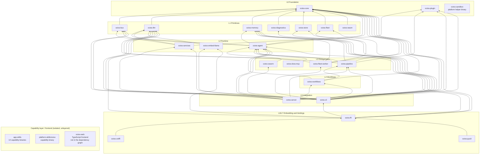

# Appendix A: The Complete Crate Dependency Graph

> **Positioning**: This appendix is the map page shared by all 21 chapters of the book. It gives the complete dependency picture of the octos workspace: 26 top-level entries, 23 `octos-*` crates, the full 63-edge internal dependency graph, a per-crate table of layer, line count, and dependency matrix, and an external-dependency inventory with feature-gate annotations. Prerequisite: Chapter 1 (1.3, workspace topology and the three fact corrections). When to come here: any time a chapter names a crate and you want to know where it sits globally, what it depends on, and what depends on it; and before contributing code to octos, to confirm dependency direction.

The data here shares its source and methodology with Chapter 1: the baseline is octos main @ `9c157101`, and the single data source is the repository facts table `assets/appendixA-facts.md` (its six summary numbers cross-check exactly against `assets/ch01-facts.md`; see A.1). Dependency edges count only the `octos-*` entries in each crate's `[dependencies]` section of its `Cargo.toml`, excluding `[dev-dependencies]` and `[build-dependencies]`; line counts follow `find crates/<name> -name '*.rs' | xargs wc -l | tail -1`. Both methodology sections include full reproduction commands, recorded in `assets/appendixA-facts.md`; this appendix does not repeat them, only states the conclusions.

## A.1 Summary numbers

| Metric | Value |
|---|---|
| Total dependency edges (`octos-*` in `[dependencies]`) | 63 |
| Top-level entries from `ls crates \| wc -l` | 26 |
| Of which `octos-*` crates | 23 |
| Workspace members in the root `Cargo.toml` | 38 |
| Layers (strict longest path, L0–L7) | 8 |
| Total lines of Rust (26 top-level entries) | 700,915 |

Machine-check commands (run at the root of the octos source repository):

```bash
awk '/^\[dependencies\]/{f=1;next} /^\[/{f=0} f && /^octos-/' crates/*/Cargo.toml | wc -l   # 63
ls crates | wc -l                              # 26
find crates -name '*.rs' | xargs wc -l | tail -1   # 700915 total
```

All six numbers match `assets/ch01-facts.md` sections 1/3/4/5 item by item; this appendix is the full expansion built on top of them.

## A.2 The internal dependency graph: 63 edges



The graph is isomorphic to the one in 1.3.4 of Chapter 1, and its 63 edges match the edge list in section 3 of `assets/appendixA-facts.md` one for one, no more, no fewer. An edge `A --> B` means A depends on B; read `graph BT` bottom-up, so crates closer to the top sit closer to the user. Edges per crate: octos-cli 15, octos-server 9, octos-ffi 6, octos-agent 5, octos-pipeline 5, octos-fleet-worker 5, octos-services 3, octos-workflows 3, and 1 each for the rest. The short names are mermaid node aliases; real package names all start with `octos-` (for example `diag` is `octos-diagnostics`).

Four reading notes. First, `octos-core` is depended on by 15 crates; it is the unique root and itself has zero internal dependencies (Chapter 2). `octos-agent` is depended on by 8 crates and is the second hub (Chapters 5 through 10). Second, every dependency points downward and the graph is acyclic; the layering is an invariant that `cargo` enforces at compile time, not a documentation convention. Third, the four isolated nodes, `octos-sandbox`, `app-skills`, `platform-skills/voice`, and `octos-web`, are outside the 63 edges: capability binaries and the frontend attach to the platform across process boundaries, not through Cargo dependencies. Fourth, two points the spec goes out of its way to clarify: `app-skills` and `platform-skills` are workspace members (counted in the 38 as directory members) but they are collections of capability binaries, not nodes expanded into the core crate graph; and the recent goal/peer/agent orchestration modules live in the tool layers under `crates/octos-cli/src/autonomy/` and `crates/octos-agent/src/`, so a crate node named `octos-autonomy` does not exist and must not be drawn (Chapter 18).

## A.3 Per-crate data table

"Layer" is the strict longest-path layer: 1 + max(layer of its `octos-*` dependencies), with zero internal dependencies meaning L0. "External deps" counts the non-`octos-*` entries in the `[dependencies]` section, feature-gated entries included; entries written as `name.workspace = true` are normalized and counted by package name.

| crate | Layer | Rust lines | octos-* dependencies ([dependencies]) | External deps |
|---|---|---|---|---|
| octos-core | L0 | 22,313 | (zero internal dependencies) | 7 |
| octos-plugin | L0 | 5,165 | (zero internal dependencies) | 7 |
| octos-sandbox | L0 | 1,468 | (zero internal dependencies) | 2 |
| octos-bus | L1 | 42,767 | octos-core | 31 |
| octos-llm | L1 | 35,087 | octos-core | 14 |
| octos-memory | L1 | 6,428 | octos-core | 11 |
| octos-diagnostics | L1 | 2,243 | octos-core | 4 |
| octos-store | L1 | 2,664 | octos-core | 12 |
| octos-fleet | L1 | 16,888 | octos-core | 8 |
| octos-wasm | L1 | 883 | octos-core | 5 |
| octos-agent | L2 | 191,985 | octos-core, octos-bus, octos-memory, octos-llm, octos-plugin | 47 |
| octos-services | L2 | 3,223 | octos-core, octos-llm, octos-bus | 11 |
| octos-embed-llama | L2 | 911 | octos-llm | 5 |
| octos-pipeline | L3 | 32,799 | octos-core, octos-agent, octos-plugin, octos-llm, octos-memory | 10 |
| octos-swarm | L3 | 4,980 | octos-agent | 11 |
| octos-dora-mcp | L3 | 11 | octos-agent | 0 |
| octos-fleet-worker | L3 | 6,842 | octos-agent, octos-core, octos-fleet, octos-llm, octos-memory | 5 |
| octos-workflows | L4 | 1,059 | octos-core, octos-agent, octos-pipeline | 6 |
| octos-server | L5 | 21 | octos-core, octos-agent, octos-llm, octos-bus, octos-store, octos-services, octos-workflows, octos-pipeline, octos-plugin | 22 |
| octos-cli | L5 | 307,299 | octos-core, octos-bus, octos-llm, octos-memory, octos-agent, octos-diagnostics, octos-store, octos-services, octos-workflows, octos-pipeline, octos-swarm, octos-plugin, octos-fleet, octos-fleet-worker, octos-embed-llama | 55 |
| octos-ffi | L6 | 1,372 | octos-core, octos-agent, octos-llm, octos-memory, octos-cli, octos-embed-llama | 4 |
| octos-uniffi | L7 | 465 | octos-ffi | 1 |
| octos-pyo3 | L7 | 756 | octos-ffi | 1 |

The three non-`octos-*` top-level entries are not in the table above; the conclusions are stated in prose instead (details in sections 1.3/3.2 of `assets/ch01-facts.md`): `crates/app-skills` is a directory of 14 capability binaries totaling 12,098 lines, with no top-level Cargo.toml; `crates/platform-skills` is a single skill binary, voice, at 1,188 lines; `crates/octos-web` is the TypeScript frontend, with 0 `.rs` files, and not a workspace member either. All three have 0 `octos-*` entries in `[dependencies]`. One example shows how to reproduce the per-crate line counts; the rest follow the same form: `find crates/octos-core -name '*.rs' | xargs wc -l | tail -1` → 22313.

## A.4 A guided tour of layers L0–L7

Layers are not a subjective classification by module size or importance; they are mechanically derived from the 63 edges as strict longest paths: a crate's layer equals the length of its longest dependency chain down to L0. This section tours the layers one by one, flagging the chapters that expand each.

### L0 Foundation: octos-core, octos-plugin, octos-sandbox

Three crates with zero internal dependencies, the roots of the whole dependency tree. `octos-core` defines the platform's domain language in the type system: the unified data contracts for sessions, messages, memory, and configuration (Chapter 2). It is depended on by 15 crates, so any interface change ripples through the entire repository, and its stability discipline is the strictest. `octos-plugin` defines the plugin contract and executable discovery (Chapter 9) and also keeps zero internal dependencies, so the extension mechanism can evolve independently of the core. `octos-sandbox` is a standalone Windows AppContainer helper binary that no crate depends on; it is a platform helper tool, not the sandbox subsystem, and the real sandbox implementation lives inside `octos-agent` (Chapter 7). This is one common misreading the v2 rewrite explicitly corrects.

### L1 Primitives: octos-bus, octos-llm, octos-memory, octos-diagnostics, octos-store, octos-fleet, octos-wasm

Seven domain primitives that depend only on L0, each wrapping one slice of the outside world: `octos-bus` is the multi-channel messaging abstraction built from 17 channel source files (Chapter 11) and the L1 crate with the most external dependencies in the repository (31 entries, including 11 gated channel integrations); `octos-llm` tames the chaos of LLM providers, unifying completion, streaming, and credential management (Chapter 3); `octos-memory` implements working and long-term memory with hybrid search (Chapter 4); `octos-store` provides session persistence (Chapter 15); `octos-diagnostics` handles diagnostics reporting (Chapter 15); `octos-fleet` is the persistence and plan-data layer of the Fleet kernel (Chapter 16); `octos-wasm` provides wasm bindings for the browser. What this layer shares: no crate here depends on another; all seven sit side by side, and changing one never ripples into the other six.

### L2 Runtime: octos-agent, octos-services, octos-embed-llama

The first vertical aggregation point. `octos-agent` is the largest crate in the repository (191,985 lines), aggregating the agent loop, 59 tool source files, the sandbox, context management, and the harness modules (the whole subject of Chapters 5 through 10); its 5 internal dependencies pull in core/bus/memory/llm/plugin. `octos-services` depends on core/llm/bus and provides production server-side capabilities (Chapter 15). `octos-embed-llama` depends only on `octos-llm`, wiring local llama.cpp embedded inference behind the unified LLM trait, and is not compiled by default (gated). The boundary matters: above L1, code that combines multiple primitives appears for the first time, but it still has no awareness of any concrete product shape.

### L3 Orchestration: octos-pipeline, octos-swarm, octos-dora-mcp, octos-fleet-worker

All four crates depend directly on `octos-agent` and compose single agents into larger execution structures. `octos-pipeline` is the DOT-driven pipeline engine with 12 IR node kinds (Chapter 13); `octos-swarm` implements contract fan-out and aggregation gates (Chapter 17); `octos-fleet-worker` is the worker side of the Fleet plan-execution kernel, with all 5 internal dependencies written as workspace inheritance (Chapter 16); `octos-dora-mcp` is the Dora/MCP tool bridge, at 11 lines of Rust with zero external dependencies, the smallest crate in the repository. Orchestration-layer code never faces the user directly; it is the raw material for L4/L5.

### L4 Workflows: octos-workflows

A single-node layer depending on core/agent/pipeline, wrapping pipeline execution into a reusable workflow unit. It exists so that `octos-server` and `octos-cli` can consume pipeline capability the same way instead of each orchestrating its own handlers. This is a classic "add a layer to buy decoupling" decision: the layer costs one more hop, and saves each integrator a duplicate.

### L5 Integration: octos-server, octos-cli

The two entry points where users and the outside world touch the system. `octos-cli` is the second-largest crate in the repository (307,299 lines); its 15 internal dependencies span every layer, and the runtime modules for goal/peer orchestration (Chapter 18), coding autonomy (Chapter 19), and the outer-loop OctoLoop (Chapter 20) live under its `src/autonomy/` and `src/peers/`; its 55 external dependencies are also the repository maximum. `octos-server` is just 21 lines of Rust: a thin HTTP/WebSocket server shell split out from cli, whose core capabilities still live in the crates it depends on, with the entire HTTP layer tucked behind the `api` feature gate (Chapter 15).

### L6 Embedding core: octos-ffi

The stable C ABI layer. It depends on 6 crates (core/agent/llm/memory/cli/embed-llama) and distills the platform's commonly used capability surface into one set of cross-language function boundaries. Note that it depends on L5's `octos-cli` rather than anything lower: embedders get "the full product capability," not "a kit of raw primitives." That trade makes the binding layer thinner and the ffi layer heavier, by design.

### L7 Bindings: octos-uniffi, octos-pyo3

The two outermost leaves, each depending only on `octos-ffi`: `octos-uniffi` targets Swift/Kotlin mobile, `octos-pyo3` targets Python (`pyo3@0.23`, configured in `crates/octos-pyo3/Cargo.toml`, gated as a whole). Adding a new language binding means adding one leaf crate at L7 and touching nothing inner. Splitting L6/L7 into two layers exists precisely to keep the blast radius of binding expansion minimal.

### The capability layer (unlayered)

`app-skills` (14 capability binaries), `platform-skills/voice`, and `octos-web` attach across process boundaries or as static assets, carry zero `octos-*` dependency edges, and therefore appear neither in the A.3 table nor among the 63 edges in A.2. They enjoy the workspace's unified toolchain and lint configuration without entering the core compile graph, so releases and builds never drag each other down.

## A.5 External dependency inventory

The table below lists every external dependency in each crate's `[dependencies]` section, in `name@version-requirement` form; a trailing `*` means feature-gated (`optional = true`, controlled by that crate's `[features]`, not compiled in the default build). Version requirements are quoted verbatim from the baseline commit's `[workspace.dependencies]` inheritance or the crate's inline declarations; `name.workspace = true` entries are resolved to their actual version requirements. The repository-wide external dependency total is 279 entries, consistent with the sum of the "External deps" column in A.3.

| crate | External dependencies (name@version, `*` = gated) |
|---|---|
| octos-core | serde@1, serde_json@1, chrono@0.4, uuid@1, eyre@0.6, tracing@0.1, sha2@0.10 |
| octos-plugin | serde@1, serde_json@1, eyre@0.6, tracing@0.1, which@7, tokio@1, metrics@0.24 |
| octos-sandbox | clap@4, eyre@0.6 |
| octos-bus | tokio@1, lru@0.16, async-trait@0.1, serde@1, serde_json@1, chrono@0.4, chrono-tz@0.10, uuid@1, cron@0.15, eyre@0.6, tracing@0.1, metrics@0.24, futures@0.3, reqwest@0.12, serde_yml@0.0.12, subtle@2, sha2@0.10, aes@0.8, cbc@0.1, base64@0.22; gated: teloxide@0.17\*, serenity@0.12\*, tokio-tungstenite@0.26\*, axum@0.8\*, async-imap@0.11\*, tokio-rustls@0.26\*, rustls@0.23\*, rustls-native-certs@0.8\*, webpki-roots@0.26\*, lettre@0.11\*, mailparse@0.16\* |
| octos-llm | async-trait@0.1, reqwest@0.12, tokio@1, serde@1, serde_json@1, eyre@0.6, futures@0.3, secrecy@0.10, tracing@0.1, base64@0.22, chrono@0.4, redb@2, metrics@0.24, jsonwebtoken@9 |
| octos-memory | regex@1, redb@2, tokio@1, serde@1, serde_json@1, chrono@0.4, uuid@1, eyre@0.6, tracing@0.1, hnsw_rs@0.3, bincode@1 |
| octos-diagnostics | serde@1, serde_json@1, eyre@0.6; gated: reqwest@0.12\* |
| octos-store | chrono@0.4, eyre@0.6, serde@1, serde_json@1, sha2@0.10, base64@0.22, tracing@0.1, redb@2, uuid@1, tokio@1, getrandom@0.2, constant_time_eq@0.3 |
| octos-fleet | eyre@0.6, redb@2, rusqlite@0.32, serde@1, serde_json@1, tokio@1, tracing@0.1, uuid@1 |
| octos-wasm | serde@1, serde_json@1, wasm-bindgen@0.2, serde-wasm-bindgen@0.6, js-sys@0.3 |
| octos-agent | async-trait@0.1, tokio@1, serde@1, serde_json@1, toml@0.8, chrono@0.4, eyre@0.6, tracing@0.1, metrics@0.24, glob@0.3, globset@0.4, shlex@1, which@7, dunce@1, regex@1, ignore@0.4, futures@0.3, reqwest@0.12, rmcp@1.8, tokio-util@0.7, oauth2@5, reqwest_rmcp@0.13 (inline entry, `package = "reqwest"` rename, default-features = false + features = ["rustls"]), tiny_http@0.12, webbrowser@1, keyring@3, url@2, htmd@0.5, dirs@5, sha2@0.10, flate2@1, tar@0.4, libc@0.2, base64@0.22, chromiumoxide@0.9, pdf-extract@0.9, tempfile@3, lettre@0.11, redb@2, hound@3; gated: gix@0.79\*, similar@2\*, tree-sitter@0.24\*, tree-sitter-rust@0.23\*, tree-sitter-python@0.23\*, tree-sitter-javascript@0.23\*, tree-sitter-typescript@0.23\*, symphonia@0.5\* |
| octos-services | chrono@0.4, eyre@0.6, serde@1, serde_json@1, tokio@1, tracing@0.1, reqwest@0.12, flate2@1, tar@0.4, dirs@5, futures@0.3 |
| octos-embed-llama | eyre@0.6, async-trait@0.1, tracing@0.1; gated: llama-cpp-2@0.1\*, self_cell@1\* |
| octos-pipeline | async-trait@0.1, tokio@1, serde@1, serde_json@1, eyre@0.6, futures@0.3, tracing@0.1, chrono@0.4, regex@1, glob@0.3 |
| octos-swarm | async-trait@0.1, chrono@0.4, eyre@0.6, metrics@0.24, redb@2, serde@1, serde_json@1, tokio@1, tracing@0.1, uuid@1, sha2@0.10 (`sha2.workspace = true` inheritance, `crates/octos-swarm/Cargo.toml:21`) |
| octos-dora-mcp | none (only octos-agent) |
| octos-fleet-worker | async-trait, eyre, serde_json, tokio, tracing; all five written as `name.workspace = true` inheritance (`crates/octos-fleet-worker/Cargo.toml:12-16`), with version requirements in the root `[workspace.dependencies]` |
| octos-workflows | chrono@0.4, eyre@0.6, serde@1, serde_json@1, tokio@1, tracing@0.1 |
| octos-server | async-trait@0.1, serde@1, serde_json@1, tokio@1, tracing@0.1, chrono@0.4, eyre@0.6, uuid@1, metrics@0.24; gated (HTTP layer, `api` feature): axum@0.8\*, tower-http@0.6\*, tokio-util@0.7\*, futures@0.3\*, tokio-tungstenite@0.26\*, rustls@0.23\*, rustls-native-certs@0.8\*, rust-embed@8\*, metrics-exporter-prometheus@0.16\*, lettre@0.11\*, rand@0.8\*, sysinfo@0.34\*, subtle@2\* |
| octos-cli | async-trait@0.1, clap@4, clap_complete@4, dirs@5, serde@1, serde_json@1, colored@2, chrono@0.4, iana-time-zone@0.1, tokio@1, eyre@0.6, uuid@1, color-eyre@0.6, tracing@0.1, tracing-subscriber@0.3, tracing-appender@0.2, rustyline@15, reqwest@0.12, url@2, sha2@0.10, fs2@0.4, getrandom@0.2, constant_time_eq@0.3, percent-encoding@2, open@5, zip@2, quick-xml@0.37, image@0.25, regex@1, tempfile@3, base64@0.22, toml@0.8, agent-client-protocol@1.2.0, keyring@3, flate2@1, qrcode@0.14, chacha20poly1305@0.10, argon2@0.5, tar@0.4, metrics@0.24, redb@2 (`redb.workspace = true` inheritance, `crates/octos-cli/Cargo.toml:112`); gated: subtle@2\*, axum@0.8\*, tower-http@0.6\*, tokio-util@0.7\*, futures@0.3\*, tokio-tungstenite@0.26\*, rustls@0.23\*, rustls-native-certs@0.8\*, rust-embed@8\*, metrics-exporter-prometheus@0.16\*, lettre@0.11\*, rand@0.8\*, teloxide@0.17\*, sysinfo@0.34\* |
| octos-ffi | tokio@1, serde@1, serde_json@1, libc@0.2 |
| octos-uniffi | uniffi@0.29 |
| octos-pyo3 | gated: pyo3@0.23\* (features = ["abi3-py39"]) |

Across the repository, feature-gated dependencies total 50 external entries, distributed as: octos-agent 8, octos-bus 11, octos-cli 14, octos-server 13, octos-diagnostics 1, octos-embed-llama 2, octos-pyo3 1, and 0 for every other crate (a repository-wide `optional = true` search hits 52 lines; the one extra line each in cli and ffi is the optional entry for the internal dependency octos-embed-llama, not counted as external gated). Three gate designs worth remembering: octos-bus's 11 gated entries are all channel integrations, so the default build pulls in none of the chat network stacks; octos-server's 13 gated entries form the complete HTTP layer behind the `api` feature, keeping server-core ungated (see the description at `crates/octos-server/Cargo.toml:7`); and octos-agent's gix/tree-sitter families turn Git and AST capability into explicit switches (Chapter 6). The full feature-flag propagation map is in Appendix D.

## A.6 Using this appendix as a tool

Three typical uses. Locate: given a crate name, look up its layer and dependency list in A.3 first, then its upstream and downstream in the A.2 graph, and you can size the blast radius of a change in 30 seconds. Check dependencies: before wiring in a new channel, check A.5 for which crate it lands in, whether it is gated, and whether the default build will pull it in. Settle disputes: whenever a chapter cites numbers about crates, this appendix and `assets/appendixA-facts.md` are the authority; when prose in a chapter disagrees with these numbers, first compare methodologies (dev-dependencies excluded or not, gated entries counted or not) before deciding which is wrong.

---

## Further reading

- Cargo Workspaces, official documentation: https://doc.rust-lang.org/cargo/reference/workspaces.html; the `members` inheritance and `[workspace.dependencies]` mechanisms.
- Cargo Features, official documentation: https://doc.rust-lang.org/cargo/reference/features.html; `optional = true` and the feature unification rules, read against the gated annotations in A.5.
- The UniFFI user guide: https://mozilla.github.io/uniffi-rs/; how the L7 binding layer generates its bindings.
- The pyo3 user guide: https://crates.io/crates/pyo3 (the entry page links the docs); the stable-ABI tradeoff of `abi3-py39`.
- Section 1.3 of Chapter 1 in this book: how the workspace topology was derived, and the three fact corrections.

## Exercises

1. In A.3, `octos-cli` at 307,299 lines and 55 external dependencies is more than ten thousand times the size of `octos-server`. If cli were split tomorrow into `octos-cli-core` and `octos-cli-app`, which of the 63 edges in A.2 would move, and how many layers would the stack become?
2. `octos-server` holds L5 with 21 lines. Defining "layer" as dependency depth rather than code volume: what does that buy a reader of architecture diagrams, and where does it mislead?
3. octos-bus gates all 11 channel dependencies, while octos-llm's reqwest stays ungated. What is your criterion for deciding whether a dependency belongs in the default build?
4. Suppose a new Kotlin binding crate `octos-kotlin` is added: should it sit at L7 depending on `octos-ffi`, or depend on `octos-core` directly? What does each choice change among the 63 edges?

---

### Version note

> **Version note**: This appendix analyzes octos main @ `9c157101` (measured 2026-09-03). Every number (63 edges, 26 top-level entries, 23 `octos-*` crates, 38 members, 8 layers, 700,915 lines, 279 external dependencies, 52 optional lines) comes from `assets/appendixA-facts.md`, measured at that commit, with reproduction commands recorded alongside the data.
>
> Relative to the v1 draft, this appendix makes three classes of updates. First, the dependency graph grew from v1's 11-crate core diagram to the full 23 `octos-*` crates: fleet, swarm, workflows, diagnostics, services, and store became standalone nodes after the old text was written, so the old edge count and node set are obsolete. Second, fact corrections: `octos-sandbox` is a platform helper binary, not the sandbox subsystem; `app-skills`/`platform-skills` are workspace-member collections of capability binaries, not nodes expanded into the core graph; the newest goal/peer/autonomy modules live inside `octos-cli` and `octos-agent`, no `octos-autonomy` crate exists, and the graph draws no node for it. Third, methodology upgrades: the external dependency table went from "key dependencies as examples" to the full 279-entry inventory with per-entry feature-gate annotations, and line counts and layers were recomputed under the same methodology as Chapter 1.
