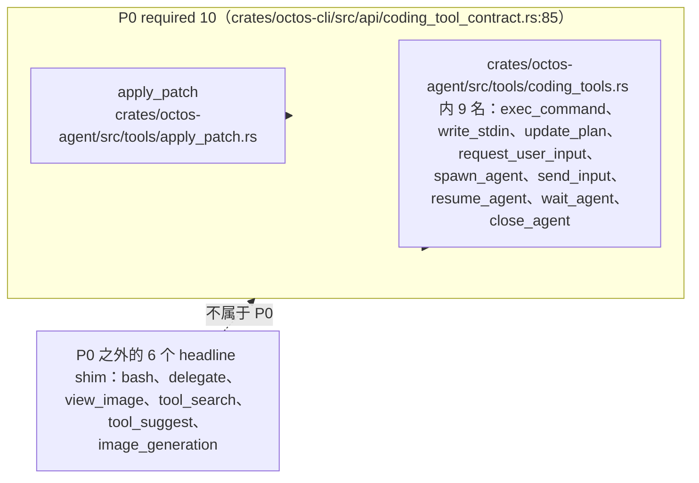

# Appendix B: Tool Quick Reference

> **Positioning**: This appendix is the data plane of the tool system in Chapter 6: it enumerates all 80 registered tool names visible to models on the current octos main branch (60 core + 20 admin), gives a guided tour across 10 capability domains, and pairs the P0 coding contract's ten required tools with their corresponding coding shims, the fleet worker's two tool subtables, and the 4 feature gates. Prerequisites: Chapter 6 (the tool system) and Chapter 7 (`group` policy and the sandbox). Who should read it: readers B/C/D configuring profiles or WorkerGrants, or debugging "why is this tool invisible": use it as an index, not a tutorial.

## B.0 Methodology: organized by registered name, not by fixed total

octos has no stable "total number of tools." The same `crates/octos-agent/src/tools/` directory yields three different counts under three measurement conventions, and this appendix uses the measured one throughout (commit `9c157101`, measured 2026-09-03):

- Directory convention: `crates/octos-agent/src/tools/` holds 58 entries (57 `.rs` files plus one `admin/` subdirectory), matching Chapter 6;
- Registered-name convention: under different construction paths, those 58 entries register 80 model-visible names: the 60 core + 20 admin of this table. `crates/octos-agent/src/tools/coding_tools.rs` alone carries 15 registered names, while support modules like `crates/octos-agent/src/tools/replacer.rs` and `crates/octos-agent/src/tools/write_grant.rs` carry none at all, so "file count equals tool count" fails in both directions;
- Grouping convention: policy grouping follows `TOOL_GROUPS` (10 groups) at `crates/octos-agent/src/tools/policy.rs:186`.

The old draft's approach of listing built-in tools by fixed count is retired: profile filtering, compile-time feature gates, the `spawn_only` marker, and chat-gateway registration all change which tool set a session actually sees, and remembering the layered registration model beats remembering a number. The "one-line duty" column in the table comes from each file's first `//!` doc line or its `fn description()` return string, verifiable row by row.

## B.1 Main table: the 80 registered names

Each row gives the registered name, a one-line duty, its capability domain, and its gate. The "Gate" column is filled only when the tool is constrained by a compile-time feature or a runtime environment variable; `-` means visible in a default build (still subject to profile and policy filtering). Capability domains follow the 10 domains of Chapter 6.

| Registered name | One-line duty | Domain | Gate |
|---|---|---|---|
| `read_file` | Read file contents | Filesystem | - |
| `write_file` | Create or overwrite a file | Filesystem | - |
| `edit_file` | Exact string-replacement editing | Filesystem | - |
| `diff_edit` | Apply unified-diff patches | Filesystem | - |
| `apply_patch` | Codex-style multi-file patch (#1773), P0 member | Filesystem | - |
| `list_dir` | List directory contents | Filesystem | - |
| `glob` | Find file paths by pattern | Filesystem | - |
| `grep` | Search file contents by regex | Filesystem | - |
| `workspace_log` | Read-only view of workspace git history | Filesystem | - |
| `workspace_show` | Read a file's historical version at a commit | Filesystem | - |
| `workspace_diff` | View the diff between two commits | Filesystem | - |
| `shell` | Execute shell commands under policy and sandbox constraints | Shell & execution | - |
| `exec_command` | Long-running execution with sessionized stdin and incremental output recovery, P0 member | Shell & execution | - |
| `write_stdin` | Write stdin to a running exec session and recover output, P0 member | Shell & execution | - |
| `bash` | Codex naming-aligned one-shot shell alias (#1172) | Shell & execution | - |
| `check` | Project static check (#1772, lite scope) | Shell & execution | - |
| `web_search` | Multi-provider web search | Web & research | - |
| `web_fetch` | Fetch a URL and extract text | Web & research | - |
| `browser` | chromiumoxide-based headless browser automation | Web & research | - |
| `search` | Deep search: web search plus parallel crawling, persisted to disk | Web & research | - |
| `synthesize_research` | Read search artifact files and produce a synthesis | Web & research | - |
| `deep_crawl` | CDP-based recursive site crawling | Web & research | - |
| `memory_note` | Append an observation worth remembering | Memory | - |
| `record_memory_use` | Report which memory entries actually informed the answer | Memory | - |
| `recall` | Retrieve tool outputs displaced by context compaction (#2131) | Memory | - |
| `recall_memory` | Load a full entity page from the memory bank | Memory | - |
| `save_memory` | Write or update a memory-bank entity page | Memory | - |
| `message` | Send messages across channels | Messaging & interaction | - |
| `send_file` | Deliver files to a chat channel | Messaging & interaction | - |
| `send_app_card` | Deliver structured mini-app card payloads | Messaging & interaction | - |
| `ask_user_question` | Structured mid-turn user question (UPCR-2026-023) | Messaging & interaction | - |
| `spawn` | Spawn a subagent, sync-wait or run in background | Peer & background tasks | - |
| `delegate_task` | Synchronous delegation tool (`delegate` is the coding-side alias) | Peer & background tasks | - |
| `peer_handoff` | LLM-initiated peer staging (#1801 v3) | Peer & background tasks | - |
| `peer_send_input` | Master injects cross-session input to a peer (#436) | Peer & background tasks | - |
| `peer_gather` | Read the peer blackboard (#1801 v3 fan-in) | Peer & background tasks | - |
| `peer_list` | Compact status index of the caller's peers | Peer & background tasks | - |
| `peer_respond` | Answer a BLOCKED peer (human in the loop) | Peer & background tasks | - |
| `peer_close` | Retire a peer you created | Peer & background tasks | - |
| `check_background_tasks` | Session-scoped background task check | Peer & background tasks | - |
| `read_task_output` | Selectively inspect background task output | Peer & background tasks | - |
| `code_structure` | tree-sitter-based code structure analysis | Code & structure | `feature = "ast"` (compile time) |
| `spawn_agent` | Launch a supervised Codex-compatible subagent, P0 member | Code & structure | - |
| `delegate` | One-stop wrapper of `spawn_agent` plus `wait_agent` (#1172) | Code & structure | - |
| `view_image` | Image metadata inspection within the workspace (#972) | Code & structure | - |
| `tool_search` | Dynamically discover tools from the live catalog (#1148) | Code & structure | - |
| `tool_suggest` | Recommend tools by task description (#1148) | Code & structure | - |
| `image_generation` | Image generation entry, currently returns typed `coding_tool_unsupported` (#1149) | Code & structure | - |
| `update_plan` | Update the visible task plan, P0 member | Code & structure | - |
| `request_user_input` | Request structured input from the host UI, P0 member | Code & structure | - |
| `send_input` | Send input to a subagent, P0 member (not real-time conversation delivery) | Code & structure | - |
| `resume_agent` | Resume a subagent handle, P0 member | Code & structure | - |
| `wait_agent` | Inspect or wait on subagents, P0 member | Code & structure | - |
| `close_agent` | Close a subagent handle, P0 member | Code & structure | - |
| `git` | Pure-Rust (gix) native git integration | Git | `feature = "git"` (compile time) |
| `manage_skills` | Skill management on the regular gateway | Skills & platform | - |
| `mofa_make` | Content-generation dispatcher (RFC-1, #1290), registered `spawn_only` | Skills & platform | - |
| `check_workspace_contract` | Read-only inspection of workspace contract state | Skills & platform | - |
| `configure_tool` | Persistent per-tool configuration access | Skills & platform | - |
| `model_check` | Model and provider inventory (registered by the chat gateway) | Skills & platform | - |
| `admin_platform_skills` | Server-level ASR/TTS engine management (ominix-api) | admin | - |
| `admin_list_profiles` | List profiles | admin | - |
| `admin_profile_status` | Query profile status | admin | - |
| `admin_start_profile` | Start a profile | admin | - |
| `admin_stop_profile` | Stop a profile | admin | - |
| `admin_restart_profile` | Restart a profile | admin | - |
| `admin_enable_profile` | Enable a profile | admin | - |
| `admin_update_profile` | Update a profile | admin | - |
| `admin_manage_skills` | Install or remove GitHub skills per profile | admin | - |
| `admin_list_sub_accounts` | List sub-accounts | admin | - |
| `admin_create_sub_account` | Create a sub-account | admin | - |
| `admin_view_logs` | View server logs | admin | - |
| `admin_system_health` | System health check | admin | - |
| `admin_provider_metrics` | Provider metrics | admin | - |
| `admin_manage_watchdog` | Watchdog management | admin | - |
| `admin_system_metrics` | System metrics | admin | - |
| `admin_view_sessions` | View sessions | admin | - |
| `admin_cron_status` | Scheduled-job status | admin | - |
| `admin_check_config` | Configuration check | admin | - |
| `admin_update_octos` | Check and apply octos updates via the serve API | admin | - |

Count reconciliation: Filesystem 11 + Shell & execution 5 + Web & research 6 + Memory 5 + Messaging & interaction 4 + Peer & background tasks 10 + Code & structure 13 + Git 1 + Skills & platform 5 = 60 core, plus 20 admin, 80 total.

## B.2 A guided tour of the ten capability domains

### B.2.1 Filesystem (fs)

The filesystem domain is the foundation of every writing and repository-reconnaissance capability: from the byte-level `read_file`/`write_file`, through exact-replacement `edit_file` and the patch-style `diff_edit`/`apply_patch`, to the directory-and-content trio (`list_dir`/`glob`/`grep`) and the read-only workspace-history trio. The policy group `group:fs` covers the 5 write-side tools among them (`read_file`, `write_file`, `apply_patch`, `edit_file`, `diff_edit`, `crates/octos-agent/src/tools/policy.rs:191-196`).

### B.2.2 Shell & execution (runtime)

The four registered names in the execution domain share one command policy and sandbox, so when any one path is denied, the rest die with it; `group:runtime` therefore always contains `shell`, `exec_command`, `write_stdin`, `bash` (`crates/octos-agent/src/tools/policy.rs:206`), and `check` is the parallel static-checking entry, sharing the shell session sandbox.

### B.2.3 Web & research (web/search/research)

This domain maps to three policy groups: the search-fetch-browser trio of `group:web` (`crates/octos-agent/src/tools/policy.rs:211`), the local-retrieval trio of `group:search` (`crates/octos-agent/src/tools/policy.rs:216`), and the multi-round deep-research trio `search`, `synthesize_research`, `deep_crawl` of `group:research` (`crates/octos-agent/src/tools/policy.rs:251`).

### B.2.4 Memory (memory)

The four tools of `group:memory` (`recall_memory`, `save_memory`, `memory_note`, `record_memory_use`) form the read-write loop of cross-session memory (`crates/octos-agent/src/tools/policy.rs:239-246`); `recall` is the same domain's tool pointing the other way: it re-materializes in-session tool output that compaction threw away.

### B.2.5 Messaging & interaction

The messaging domain boils the agent's outward-facing surface down to four openings: cross-channel text (`message`), file delivery (`send_file`), structured cards (`send_app_card`), and structured questioning (`ask_user_question`); the last is the synchronous, route-answers superset of `request_user_input` (UPCR-2026-023).

### B.2.6 Peer & background tasks (sessions)

`group:sessions` collects every subagent entry: `spawn`, `spawn_agent`, `send_input`, `resume_agent`, `wait_agent`, `close_agent`, `delegate` (`crates/octos-agent/src/tools/policy.rs:228-236`); add the five peer-lifecycle tools and the two background-task checks, and this domain is the complete index of multi-agent collaboration.

### B.2.7 Code & structure (coding)

This domain is the bulk of the Codex-compatible tool surface: `crates/octos-agent/src/tools/coding_tools.rs` carries 15 registered names in a single file, 9 of which enter the P0 contract, the other 6 being extension entries from #972/#1148/#1149; add the feature-gated `code_structure` and the domain totals 13 registered names; all 15 are registered in `with_builtins_and_permissions` at `crates/octos-agent/src/tools/registry.rs:1254` (registration body from 1283).

### B.2.8 Git

`git` is the only VCS registered name, using the pure-Rust gix implementation instead of shelling out, gated at compile time by `feature = "git"` (`crates/octos-agent/src/tools/mod.rs:861`), and rebound with the CWD binding list at `crates/octos-agent/src/tools/registry.rs:1466-1469`.

### B.2.9 Skills & platform

The skills-and-platform domain mixes two registration classes: the regular gateway's `manage_skills`, `configure_tool`, and the chat-gateway-registered `model_check` (the three forming `group:admin`, `crates/octos-agent/src/tools/policy.rs:253-257`), plus the `spawn_only`-registered content-generation dispatcher `mofa_make` and the workspace-contract inspection `check_workspace_contract`.

### B.2.10 The admin subdirectory

All 20 admin-domain registered names come from the 7 files of `crates/octos-agent/src/tools/admin/`, facing the operations surface of the Serve/Admin API: seven profile-lifecycle tools, eight system-observability tools, two sub-account tools, and three skills-and-platform update tools; ordinary profiles do not see them by default.

## B.3 The P0 required ten and their coding shims

The P0 required set declared by the Codex-compatible contract is defined in `CODING_P0_REQUIRED_TOOL_NAMES` at `crates/octos-cli/src/api/coding_tool_contract.rs:85`, ten names in all: `apply_patch`, `exec_command`, `write_stdin`, `update_plan`, `request_user_input`, `spawn_agent`, `send_input`, `resume_agent`, `wait_agent`, `close_agent`. Nine of the ten come from `crates/octos-agent/src/tools/coding_tools.rs`; the sole exception, `apply_patch`, is a native file tool (`crates/octos-agent/src/tools/apply_patch.rs`), outside coding_tools.rs.

The row-by-row relation between the ten headline shims (nine under the briefing convention, plus representatives of the six macro-registered ones) and P0 is tabulated below; the first three are P0 members, and each of the remaining six has a stated reason for exclusion:

| Registered name | Relation to P0 | Evidence (full path) |
|---|---|---|
| `exec_command` | P0 member | crates/octos-agent/src/tools/coding_tools.rs:382；crates/octos-cli/src/api/coding_tool_contract.rs:85 |
| `write_stdin` | P0 member | crates/octos-agent/src/tools/coding_tools.rs:739 |
| `spawn_agent` | P0 member | crates/octos-agent/src/tools/coding_tools.rs:1284 |
| `bash` | Outside P0, #1172 naming-aligned alias, shares policy and sandbox with `shell`/`exec_command`; deny one of the three and all three are denied | crates/octos-agent/src/tools/coding_tools.rs:1946；crates/octos-agent/src/tools/registry.rs:1281-1290 |
| `delegate` | Outside P0, #1172 one-stop wrapper (`DelegateAliasTool`, bound to `spawn_agent`, `group:sessions` member) | crates/octos-agent/src/tools/coding_tools.rs:2429；crates/octos-agent/src/tools/registry.rs:548,566,1284 |
| `view_image` | Outside P0, #972/M14-B P1 image inspection, read-only and constrained by filesystem_scope | crates/octos-agent/src/tools/coding_tools.rs:2801；crates/octos-agent/src/tools/registry.rs:1461-1464 |
| `tool_search` | Outside P0, #1148 dynamic-discovery entry, reads the live catalog | crates/octos-agent/src/tools/coding_tools.rs:3150 |
| `tool_suggest` | Outside P0, #1148 recommend-by-task entry | crates/octos-agent/src/tools/coding_tools.rs:3251 |
| `image_generation` | Outside P0, #1149/M14-B P2; currently returns typed `coding_tool_unsupported` (wire contract complete, no generation backend bound yet) | crates/octos-agent/src/tools/coding_tools.rs:3391；crates/octos-agent/src/tools/registry.rs:1368-1370 comment verbatim |

Two contract semantics deserve separate note. First, although `send_input` is listed in P0, it is not real-time conversation delivery today: it registers through the `simple_codex_tool!` macro (`crates/octos-agent/src/tools/coding_tools.rs:1839-1842`) and writes to a supervised task's input channel, not an interactive session. Second, `image_generation`'s typed unsupported is a deliberate contract posture: the caller receives a structured "not supported in this environment" envelope rather than a tool-not-found error, so a frontend can degrade its UI without breaking the protocol.

> **Engineering decision**: why aliases must join groups (#1172)
> The deny-wins policy matches by "registered name or group name." If aliases like `bash` and `delegate` stayed out of `group:runtime`/`group:sessions`, a profile that disabled execution or subagents could still loop back to the original capability through the alias. The fix writes the aliases into the group definitions (verbatim comment at `crates/octos-agent/src/tools/policy.rs:201-205`) and makes the fact that `delegate` holds an Arc handle to the bound `spawn_agent` part of the group comment as well: the policy layer covers "every entry point," not "every implementation file."

## B.4 The fleet worker's two subtables

The tool surface of a fleet worker (Chapter 16) is bounded by the constant tables in `crates/octos-fleet/src/grant.rs`; what the master can grant is capped by the allowlist:

| Subtable | Members | Evidence (full path) |
|---|---|---|
| BASE_TOOLS (default 7) | `read_file`, `write_file`, `edit_file`, `glob`, `grep`, `list_dir`, `shell` | crates/octos-fleet/src/grant.rs:27 |
| GRANTABLE_TOOLS (grantable 9) | the above 7 plus `web_fetch`, `web_search` | crates/octos-fleet/src/grant.rs:41 |
| WEB_TOOLS (network 2) | `web_fetch`, `web_search` (grantable only under a network grant) | crates/octos-fleet/src/grant.rs:56 |

Verification command: `sed -n '27,60p' crates/octos-fleet/src/grant.rs`.

The lean coding profile's tool surface is decided by the allow_list of `crates/octos-agent/src/assets/profiles/coding.json`, 12 entries in all (4 single names plus three groups plus 5 single names), which expand against `TOOL_GROUPS` to 20 registered names:

| allow_list entry | Expanded registered names |
|---|---|
| `read_file`, `write_file`, `edit_file`, `diff_edit` | the same 4 names |
| `group:runtime` | `shell`, `exec_command`, `write_stdin`, `bash` |
| `group:search` | `glob`, `grep`, `list_dir` |
| `group:memory` | `recall_memory`, `save_memory`, `memory_note`, `record_memory_use` |
| `spawn`, `ask_user_question`, `check`, `update_plan`, `tool_search` | the same 5 names |

The design intent is written verbatim in the json description: add the three previously missing loop tools `check`, `update_plan`, `tool_search`, and drop only `apply_patch` (`edit_file`/`diff_edit` cover its duty); when the excluded tools are needed again, restore with `--profile coding-full` rather than discovering at runtime. `run_pipeline` is registered `spawn_only` and is not in the allow_list (`crates/octos-agent/src/profile/mod.rs:874`). One convention discrepancy needs stating: the facts-table label says "19 names after expansion," but group-by-group expansion measures 20 (the table above totals 4+4+3+4+5); this table follows the group-by-group expansion.

## B.5 Feature gates: 2 compile-time + 2 runtime

Only 4 of the 80 registered names are gated, two in each class:

| Gate type | Registered name | Switch | Evidence (full path) |
|---|---|---|---|
| Compile-time feature | `git` | `feature = "git"` | crates/octos-agent/src/tools/mod.rs:861 |
| Compile-time feature | `code_structure` | `feature = "ast"` | crates/octos-agent/src/tools/mod.rs:864 |
| Runtime environment variable | `read_window` (internal, not a registered name) | `OCTOS_READ_WINDOW=1`, default off | crates/octos-agent/src/tools/read_window.rs:177-179 |
| Runtime environment variable | `read_paging_probe` (internal, not a registered name) | `OCTOS_READ_PAGING_PROBE=1`, not armed, not recorded | crates/octos-agent/src/tools/read_paging_probe.rs:131 |

Both runtime gates act on "internal components" rather than standalone registered names, consistent with Chapter 6's conclusion: tightening the read path starts with probes collecting data, then decides whether to become default behavior. The compile-time gates appear in the CWD binding list at `crates/octos-agent/src/tools/registry.rs:1466-1469` behind `#[cfg]`; without the feature enabled, even the rebinding list omits these two names.

## B.6 Further reading and exercises

Further reading: Chapter 6 (the capability-domain division of the 58 entries and the registration layers), Chapter 7 (`group` policy evaluation, the sandbox, and `write_grant`), Chapter 16 (fleet's WorkerGrant and its relation to this appendix's two subtables).

Exercises:

1. `group:delegated` is a deny table, not an allow table (`crates/octos-agent/src/tools/policy.rs:307-331`), yet it explicitly does not restrict command execution. Why is "recursive delegation breaks, command execution doesn't" a coherent boundary choice?
2. coding.json's allow_list has only 12 entries but expands to 20 names. When you want to add or remove a tool from the lean profile, which downstream effects differ between editing an allow_list entry and editing a `TOOL_GROUPS` member?
3. `image_generation` chose to return typed unsupported instead of being removed from the registry. If it were removed, what would frontend contract validation and user messaging each lose?

---

> **Version note**: This appendix's baseline is octos main @ `9c157101` (measured 2026-09-03). Data source: `assets/appendixB-facts.md` (commit `ad387d1`, same batch); all line numbers were re-verified by hand this session. Against the old draft: the retired convention listed "core built-in tools" by fixed count; the current registered-name total is 80 (60 core + 20 admin) across 10 capability domains, and the shim attribution of the P0 contract's ten, the fleet's two subtables, and the 4 feature gates were all newly collected this round; `bash`/`delegate` joining groups (#1172) and `image_generation`'s typed unsupported (#1149) are behavior changes that postdate the old draft.
