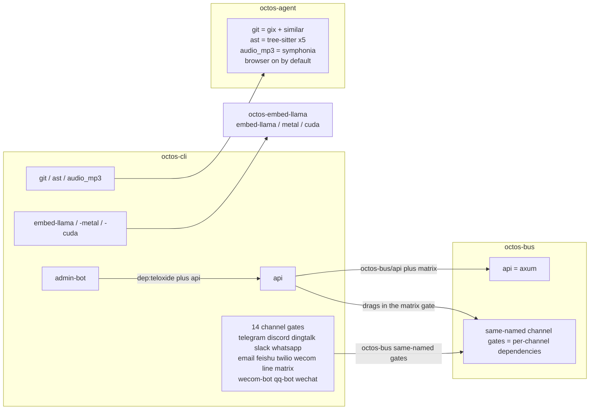

# Appendix D: Feature Flags Overview

> **Positioning**: This appendix is the complete mapping of every Cargo feature in the octos workspace: all 79 feature definitions across 12 crates, row by row (crate, dependencies pulled in, one-line purpose, whether it is on by default, source lines), plus the 14 message channel gates with their definitions and mirrored forwarding, the default chains, and the feature propagation graph. Prerequisites: Section 14.7 of Chapter 14 (the concept of the compile-time runtime surface) and Appendix A (the feature-gated dependency annotations in A.5). When to use it: deciding which features to enable before a deployment; diagnosing "why didn't this capability get compiled in"; locating the exact touch points before adding a channel or tool to octos.

This appendix shares its source and counting rules with Chapter 14 and Appendix A: the baseline is octos main @ `9c157101`, and the single data source is the repository facts table `assets/appendixD-facts.md`. Of the workspace's 38 members, 12 crates have a `[features]` section in their `Cargo.toml`, defining 79 features in total: 70 non-default features plus 9 explicit `default` lines (`octos-embed-llama`, `octos-store`, and `octos-services` carry no explicit default line). One command reproduces the full inventory; run it at the root of the octos source repository:

```bash
awk '/^\[features\]/{f=1;next} /^\[/{f=0} f&&/^[a-z]/' crates/*/Cargo.toml
```

Division of labor: Section 14.7 answers "why runtime-surface selection and capability trimming belong to two different stages"; this appendix answers "what each gate is, what it pulls in, and whether it is on by default". The two do not repeat each other; their meeting point is discussed in D.6.

## D.1 Master table: all 79 features

A "yes" in the default column means the feature appears in its crate's explicit `default` line. The source column points to the line range of the `[features]` section in that crate's `Cargo.toml`.

| crate | feature | dependencies / downstream features pulled in | what it does | default | source |
|---|---|---|---|---|---|
| octos-cli | `default` | `[]` | Minimal default set: no API, channels, or tools | yes | crates/octos-cli/Cargo.toml:142-177 |
| octos-cli | `embed-llama` | `dep:octos-embed-llama`, `octos-embed-llama/embed-llama` | In-process llama.cpp GGUF embedding provider (for `embedding.provider = "llamacpp"`), CPU backend by default | no | crates/octos-cli/Cargo.toml:142-177 |
| octos-cli | `embed-llama-metal` | `embed-llama`, `octos-embed-llama/metal` | Adds Apple Metal acceleration on top of embed-llama | no | crates/octos-cli/Cargo.toml:142-177 |
| octos-cli | `embed-llama-cuda` | `embed-llama`, `octos-embed-llama/cuda` | Adds NVIDIA CUDA acceleration on top of embed-llama | no | crates/octos-cli/Cargo.toml:142-177 |
| octos-cli | `api` | `dep:axum`, `dep:tower-http`, `dep:tokio-util`, `dep:futures`, `dep:tokio-tungstenite`, `dep:rustls`, `dep:rustls-native-certs`, `dep:rust-embed`, `dep:metrics-exporter-prometheus`, `dep:lettre`, `dep:rand`, `dep:sysinfo`, `dep:subtle`, `octos-bus/api`, `matrix` | REST API/dashboard/SSE/WS control plane; the serve subcommand depends on it, and without it octoscode cannot start (`Command::Serve` carries `#[cfg(feature = "api")]`, crates/octos-cli/src/commands/mod.rs:398-399; the octoscode default command is `octos serve --stdio --solo`, octoscode/src/cli.rs:118); matrix rides along unconditionally because API handlers and the admin console reference matrix-only types such as `octos_bus::MatrixInviteStore` | no | crates/octos-cli/Cargo.toml:142-177 |
| octos-cli | `admin-bot` | `dep:teloxide`, `dep:futures`, `api` | Telegram admin bot; depends explicitly on api | no | crates/octos-cli/Cargo.toml:142-177 |
| octos-cli | `telegram` | `octos-bus/telegram` | Telegram channel gate | no | crates/octos-cli/Cargo.toml:142-177 |
| octos-cli | `discord` | `octos-bus/discord` | Discord channel gate | no | crates/octos-cli/Cargo.toml:142-177 |
| octos-cli | `dingtalk` | `octos-bus/dingtalk` | DingTalk callback channel gate | no | crates/octos-cli/Cargo.toml:142-177 |
| octos-cli | `slack` | `octos-bus/slack` | Slack WebSocket channel gate | no | crates/octos-cli/Cargo.toml:142-177 |
| octos-cli | `whatsapp` | `octos-bus/whatsapp` | WhatsApp WebSocket channel gate | no | crates/octos-cli/Cargo.toml:142-177 |
| octos-cli | `email` | `octos-bus/email` | Email (IMAP/SMTP) channel gate | no | crates/octos-cli/Cargo.toml:142-177 |
| octos-cli | `feishu` | `octos-bus/feishu` | Feishu channel gate | no | crates/octos-cli/Cargo.toml:142-177 |
| octos-cli | `twilio` | `octos-bus/twilio` | Twilio webhook channel gate | no | crates/octos-cli/Cargo.toml:142-177 |
| octos-cli | `wecom` | `octos-bus/wecom` | WeCom callback channel gate | no | crates/octos-cli/Cargo.toml:142-177 |
| octos-cli | `line` | `octos-bus/line` | LINE webhook channel gate | no | crates/octos-cli/Cargo.toml:142-177 |
| octos-cli | `matrix` | `octos-bus/matrix` | Matrix channel gate | no | crates/octos-cli/Cargo.toml:142-177 |
| octos-cli | `wecom-bot` | `octos-bus/wecom-bot` | WeCom Bot WebSocket channel gate | no | crates/octos-cli/Cargo.toml:142-177 |
| octos-cli | `qq-bot` | `octos-bus/qq-bot` | QQ Bot WebSocket channel gate | no | crates/octos-cli/Cargo.toml:142-177 |
| octos-cli | `wechat` | `octos-bus/wechat` | WeChat bridge WebSocket channel gate | no | crates/octos-cli/Cargo.toml:142-177 |
| octos-cli | `git` | `octos-agent/git` | Git tool capability gate (gix + similar) | no | crates/octos-cli/Cargo.toml:142-177 |
| octos-cli | `ast` | `octos-agent/ast` | AST parsing tool capability gate (tree-sitter, five languages) | no | crates/octos-cli/Cargo.toml:142-177 |
| octos-cli | `audio_mp3` | `octos-agent/audio_mp3` | mp3 decoding for the AudioNonSilent workspace contract validator; without it, .mp3 artifacts fail with an error suggesting audio_mp3 or a switch to .wav (crates/octos-agent/src/validators.rs:2441-2445) | no | crates/octos-cli/Cargo.toml:142-177 |
| octos-bus | `default` | `[]` | Pure bus core (sessions/scheduling/dedup), zero channels | yes | crates/octos-bus/Cargo.toml:9-26 |
| octos-bus | `api` | `axum` | Bus types needed by API/SSE/WS access (`ApiChannel` and friends) | no | crates/octos-bus/Cargo.toml:9-26 |
| octos-bus | `telegram` | `teloxide` | TelegramChannel implementation | no | crates/octos-bus/Cargo.toml:9-26 |
| octos-bus | `discord` | `serenity` | DiscordChannel implementation | no | crates/octos-bus/Cargo.toml:9-26 |
| octos-bus | `dingtalk` | `axum` | DingTalkChannel callback implementation | no | crates/octos-bus/Cargo.toml:9-26 |
| octos-bus | `slack` | `tokio-tungstenite` | SlackChannel WS implementation | no | crates/octos-bus/Cargo.toml:9-26 |
| octos-bus | `whatsapp` | `tokio-tungstenite` | WhatsAppChannel WS implementation | no | crates/octos-bus/Cargo.toml:9-26 |
| octos-bus | `feishu` | `tokio-tungstenite`, `axum`, `rustls`, `rustls-native-certs` | FeishuChannel WS + callback implementation | no | crates/octos-bus/Cargo.toml:9-26 |
| octos-bus | `line` | `axum` | LineChannel webhook implementation | no | crates/octos-bus/Cargo.toml:9-26 |
| octos-bus | `twilio` | `axum` | TwilioChannel webhook implementation | no | crates/octos-bus/Cargo.toml:9-26 |
| octos-bus | `wecom` | `axum` | WeComChannel callback implementation | no | crates/octos-bus/Cargo.toml:9-26 |
| octos-bus | `matrix` | `axum` | MatrixChannel + MatrixUserChannel (including `MatrixInviteStore`) implementation | no | crates/octos-bus/Cargo.toml:9-26 |
| octos-bus | `wecom-bot` | `tokio-tungstenite`, `rustls`, `rustls-native-certs` | WeComBotChannel WS implementation | no | crates/octos-bus/Cargo.toml:9-26 |
| octos-bus | `qq-bot` | `tokio-tungstenite`, `rustls`, `rustls-native-certs` | QQBotChannel WS implementation | no | crates/octos-bus/Cargo.toml:9-26 |
| octos-bus | `wechat` | `tokio-tungstenite` | WeChatChannel WS bridge implementation | no | crates/octos-bus/Cargo.toml:9-26 |
| octos-bus | `email` | `async-imap`, `tokio-rustls`, `rustls`, `webpki-roots`, `lettre`, `mailparse` | EmailChannel IMAP/SMTP implementation | no | crates/octos-bus/Cargo.toml:9-26 |
| octos-agent | `default` | `["browser"]` | browser on by default | yes | crates/octos-agent/Cargo.toml:117-131 |
| octos-agent | `browser` | `[]` (chromiumoxide compiled unconditionally) | Toggles only the headless-Chrome (CDP) fallback provider of `web_search`; off, the HTTP-only behavior is byte-for-byte identical to the old version | yes | crates/octos-agent/Cargo.toml:117-131 |
| octos-agent | `git` | `dep:gix`, `dep:similar` | Git operations and diff capability | no | crates/octos-agent/Cargo.toml:117-131 |
| octos-agent | `ast` | `dep:tree-sitter` plus the four rust/python/javascript/typescript grammars | AST code-structure analysis | no | crates/octos-agent/Cargo.toml:117-131 |
| octos-agent | `audio_mp3` | `dep:symphonia` | mp3 decoding for the AudioNonSilent validator (WAV goes through the always-on hound) | no | crates/octos-agent/Cargo.toml:117-131 |
| octos-server | `default` | `[]` | Minimal server library | yes | crates/octos-server/Cargo.toml:46-81 |
| octos-server | `api` | dependency list identical to octos-cli `api` (13 optional dependencies plus `octos-bus/api` and `matrix`) | HTTP/WS API layer, mirroring octos-cli `api`; matrix is mandatory (handlers reference matrix types) | no | crates/octos-server/Cargo.toml:46-81 |
| octos-server | `telegram` | `octos-bus/telegram` | channel gate forwarding | no | crates/octos-server/Cargo.toml:46-81 |
| octos-server | `discord` | `octos-bus/discord` | channel gate forwarding | no | crates/octos-server/Cargo.toml:46-81 |
| octos-server | `dingtalk` | `octos-bus/dingtalk` | channel gate forwarding | no | crates/octos-server/Cargo.toml:46-81 |
| octos-server | `slack` | `octos-bus/slack` | channel gate forwarding | no | crates/octos-server/Cargo.toml:46-81 |
| octos-server | `whatsapp` | `octos-bus/whatsapp` | channel gate forwarding | no | crates/octos-server/Cargo.toml:46-81 |
| octos-server | `email` | `octos-bus/email` | channel gate forwarding | no | crates/octos-server/Cargo.toml:46-81 |
| octos-server | `feishu` | `octos-bus/feishu` | channel gate forwarding | no | crates/octos-server/Cargo.toml:46-81 |
| octos-server | `twilio` | `octos-bus/twilio` | channel gate forwarding | no | crates/octos-server/Cargo.toml:46-81 |
| octos-server | `wecom` | `octos-bus/wecom` | channel gate forwarding | no | crates/octos-server/Cargo.toml:46-81 |
| octos-server | `line` | `octos-bus/line` | channel gate forwarding | no | crates/octos-server/Cargo.toml:46-81 |
| octos-server | `matrix` | `octos-bus/matrix` | channel gate forwarding | no | crates/octos-server/Cargo.toml:46-81 |
| octos-server | `wecom-bot` | `octos-bus/wecom-bot` | channel gate forwarding | no | crates/octos-server/Cargo.toml:46-81 |
| octos-server | `qq-bot` | `octos-bus/qq-bot` | channel gate forwarding | no | crates/octos-server/Cargo.toml:46-81 |
| octos-server | `wechat` | `octos-bus/wechat` | channel gate forwarding | no | crates/octos-server/Cargo.toml:46-81 |
| octos-embed-llama | `embed-llama` | `dep:llama-cpp-2`, `dep:self_cell` | Compiles llama.cpp from source (CMake plus a C++ toolchain) for in-process GGUF embeddings; without it the crate is nearly empty | no | crates/octos-embed-llama/Cargo.toml:14-20 |
| octos-embed-llama | `metal` | `llama-cpp-2/metal` | Apple Metal acceleration | no | crates/octos-embed-llama/Cargo.toml:14-20 |
| octos-embed-llama | `cuda` | `llama-cpp-2/cuda` | NVIDIA CUDA acceleration | no | crates/octos-embed-llama/Cargo.toml:14-20 |
| octos-ffi | `default` | `[]` | Keeps the FFI surface pure Rust | yes | crates/octos-ffi/Cargo.toml:37-47 |
| octos-ffi | `embed-llama` | `dep:octos-embed-llama`, `octos-embed-llama/embed-llama` | Compiles the GGUF backend into `octos_embed`; otherwise it reports embedding support not compiled in | no | crates/octos-ffi/Cargo.toml:37-47 |
| octos-ffi | `embed-llama-metal` | `embed-llama`, `octos-embed-llama/metal` | Metal acceleration on the FFI side | no | crates/octos-ffi/Cargo.toml:37-47 |
| octos-ffi | `embed-llama-cuda` | `embed-llama`, `octos-embed-llama/cuda` | CUDA acceleration on the FFI side | no | crates/octos-ffi/Cargo.toml:37-47 |
| octos-uniffi | `default` | `[]` | Keeps the uniffi bindings pure Rust | yes | crates/octos-uniffi/Cargo.toml:36-42 |
| octos-uniffi | `embed-llama` | `octos-ffi/embed-llama` | Forwards `Runtime::embed` through ffi; otherwise returns `NoEmbedder` | no | crates/octos-uniffi/Cargo.toml:36-42 |
| octos-pyo3 | `default` | `[]` | Keeps `cargo build --workspace` unbroken on Python-less CI | yes | crates/octos-pyo3/Cargo.toml:42-52 |
| octos-pyo3 | `python` | `dep:pyo3` | Compiles the pyo3 surface (pulls libpython) | no | crates/octos-pyo3/Cargo.toml:42-52 |
| octos-pyo3 | `extension-module` | `python`, `pyo3/extension-module` | Wheel builds: python plus no libpython linking (the host interpreter resolves symbols) | no | crates/octos-pyo3/Cargo.toml:42-52 |
| octos-pyo3 | `embed-llama` | `octos-ffi/embed-llama` | `Runtime.embed` returns real vectors instead of `NoEmbedder` | no | crates/octos-pyo3/Cargo.toml:42-52 |
| octos-diagnostics | `default` | `[]` | Stage 1 with zero network dependencies | yes | crates/octos-diagnostics/Cargo.toml:22-26 |
| octos-diagnostics | `github` | `dep:reqwest` (workspace-pinned, rustls-tls) | GitHub Releases client for `update --check` (Stage 2; self-update is Stage 3, not here) | no | crates/octos-diagnostics/Cargo.toml:22-26 |
| octos-llm | `default` | `[]` | Production builds expose no test surface | yes | crates/octos-llm/Cargo.toml:9-15 |
| octos-llm | `test-utils` | `[]` | Exposes test helpers such as `AdaptiveRouter::publish_failover_for_subscribers`; keep off in production | no | crates/octos-llm/Cargo.toml:9-15 |
| octos-store | `test-util` | `[]` | Exposes test helpers such as `approvals_audit::read_audit_lines`; keep off in production | no (no explicit default line) | crates/octos-store/Cargo.toml:26-30 |
| octos-services | `test-util` | `[]` | Exposes the crate-level env-test lock `config_context::TEST_ENV_LOCK` for serializing downstream tests; keep off in production | no (no explicit default line) | crates/octos-services/Cargo.toml:26-31 |

Per-crate counts for the master table: octos-cli 23, octos-bus 16, octos-server 16, octos-agent 5, octos-embed-llama 3, octos-ffi 4, octos-uniffi 2, octos-pyo3 4, octos-diagnostics 2, octos-llm 2, octos-store 1, octos-services 1, totaling 79. The spec facts boundary for octos-cli previously listed 22 features (without `audio_mp3`); the current measurement takes 23, with `audio_mp3` (crates/octos-cli/Cargo.toml:177) added after the boundary was set.

## D.2 A guided tour of the twelve crates

Grouping the 79 features by crate reveals a clear layering discipline. The first group is the two entry points. octos-cli tops the workspace with 23 features, yet it implements almost none of the channels or tools itself: the 14 channel gates forward one by one to octos-bus, the three tool gates git, ast, and audio_mp3 forward to octos-agent, and the embed-llama trio forwards to octos-embed-llama. The one heavyweight gate that unfolds inside the crate is api, which pulls in 13 optional dependencies and drags two downstream gates along: `octos-bus/api` and matrix. octos-server is cli's library-level mirror: its 16 features share names and meanings with cli's, with api and the 14 channel gates each forwarding a copy, so host programs that bypass the CLI reuse the same assembly.

The second group is the runtime and the bus. Of octos-bus's 16 features, everything except default and api is a channel implementation body: network stacks such as teloxide, serenity, tokio-tungstenite, and async-imap enter compilation only when their channel gate is on; the default build contains no chat protocol stack at all. octos-agent has only 5 features but is the only business crate with a non-empty default: default = ["browser"] makes the headless-Chrome fallback the default behavior, while the browser gate itself adds and removes no dependency. chromiumoxide is compiled unconditionally; the gate only decides whether `web_search` uses it.

The third group is the embedding chain and the binding chain, five crates in all. octos-embed-llama's 3 features all revolve around llama.cpp: the base gate compiles C++ from source, while metal and cuda are backend overlay switches. octos-ffi's 4 features decide whether the FFI surface has GGUF embedding; octos-uniffi and octos-pyo3 each hold one embed-llama, proxying layer by layer to octos-ffi, and return `NoEmbedder` when it is off. The last group is four small crates: octos-diagnostics uses the github gate to keep reqwest, needed only for the Releases check, out of the default build; octos-llm's test-utils and octos-store's and octos-services' test-util are pure test surfaces, kept off in production builds; and the three crates embed-llama, store, and services have no explicit default line, zero features being their normal state.

## D.3 Channel gates: one definition, two forwards

octos-bus is the single definition point of the 14 channel gates (crates/octos-bus/Cargo.toml:9-26), and runtime exports map to the gates one to one: crates/octos-bus/src/lib.rs:17-49 gates type exports feature by feature with `#[cfg]`, and crates/octos-bus/src/lib.rs:71-107 gates the mod declarations, aligning one to one with the 14 channels (the file's `cfg(feature` hits 33 places: 17 type-export lines plus 16 mod lines, with the api gate one short on non-mod lines). octos-cli (crates/octos-cli/Cargo.toml:142-177) and octos-server (crates/octos-server/Cargo.toml:46-81) each forward the 14 gates once more: CLI for binary builds, server for library-level reuse, so a gateway runtime can dispatch channels without going through the HTTP api layer.

| channel gate | dependencies pulled in by octos-bus | access shape |
|---|---|---|
| telegram | teloxide | Bot API |
| discord | serenity | Bot API |
| dingtalk | axum | callback |
| slack | tokio-tungstenite | WebSocket |
| whatsapp | tokio-tungstenite | WebSocket |
| email | async-imap, tokio-rustls, rustls, webpki-roots, lettre, mailparse | IMAP/SMTP |
| feishu | tokio-tungstenite, axum, rustls, rustls-native-certs | WebSocket plus callback |
| twilio | axum | webhook |
| wecom | axum | callback |
| line | axum | webhook |
| matrix | axum | webhook plus `MatrixInviteStore` |
| wecom-bot | tokio-tungstenite, rustls, rustls-native-certs | WebSocket |
| qq-bot | tokio-tungstenite, rustls, rustls-native-certs | WebSocket |
| wechat | tokio-tungstenite | WebSocket bridge |

Three similarly named gates are easy to confuse: wecom and wecom-bot are two separate implementations (callback versus WebSocket), qq-bot is QQ's WebSocket implementation, and wechat is WeChat's WebSocket bridge. Each has a same-named forwarding gate in both cli and server; a channel counts as open only when the switch agrees in all three places.

## D.4 The default chains: one counterintuitive default and two proxy chains

Of the workspace's 9 explicit default lines, 8 are `default = []` (minimal set). The one non-empty case is octos-agent's `default = ["browser"]` (crates/octos-agent/Cargo.toml:117-131). The counterintuitive part: chromiumoxide is not gated and is always compiled; the browser gate only decides whether `web_search` falls back to headless Chrome after HTTP retrieval fails. To get pure HTTP behavior you must turn it off explicitly with `default-features = false` when depending on octos-agent, rather than assuming "no feature enabled means no browser code".

The embedding chain has four hops from outside in. The first hop sits in octos-cli and octos-ffi: both embed-llama features point at `octos-embed-llama/embed-llama`, which is what actually pulls in llama-cpp-2 and self_cell and requires CMake and a C++ toolchain on the build machine; metal and cuda are backend overlays on top, which is why embed-llama-metal and embed-llama-cuda both imply embed-llama. The second hop is octos-ffi's mirror trio, copying the same switches onto the FFI surface. The third and fourth hops are octos-uniffi's and octos-pyo3's single embed-llama each: neither touches llama.cpp directly, they only forward the switch to octos-ffi. If any layer is off, `Runtime.embed` returns `NoEmbedder` instead of a vector.

## D.5 Feature propagation



Three layers: octos-cli is the only binary entry; channel and tool features all forward to octos-bus and octos-agent (consistent with Section 14.7's "CLI only forwards features"); octos-server's api and 14 channel gates mirror the same forwarding for library-level reuse. Three implicit dependency edges in the graph are worth memorizing: api drags in `octos-bus/api` and matrix; admin-bot depends explicitly on api; embed-llama-metal and embed-llama-cuda both imply embed-llama. Missing an implicit edge is a common source of feature-trimming mistakes: turning off matrix without turning off api does not work, because the API layer's handlers reference matrix-only types.

## D.6 Division of labor with Section 14.7 of Chapter 14

Section 14.7 covers the two-layer relationship: runtime-surface selection happens at runtime (subcommand dispatch), capability trimming at compile time (feature gates), with three cli-side examples (api, channel gates, embed-llama) and the compile gate of the serve subcommand. This appendix does not repeat those arguments; it supplies the full data: 79 definitions, the dependency details of the 14 gates, the default chains, and the propagation graph. For "which gates should be on for a given runtime surface", see Section 14.7 and Chapter 13; for "what a gate pulls in and whether it is on by default", see D.1 here; for "the version and owning crate of a gated dependency", see A.5 of Appendix A.

## D.7 Crates without `[features]`: 26

The remaining 26 top-level entries have no `[features]` section in their `Cargo.toml`; their compile surface is fixed, with no gates to open:

- Core libraries (11): octos-core, octos-memory, octos-workflows, octos-pipeline, octos-plugin, octos-sandbox, octos-swarm, octos-fleet, octos-fleet-worker, octos-dora-mcp, octos-wasm (the Cargo.toml of the same-named directories under crates/).
- App skills (14): news, deep-search, deep-crawl, send-email, account-manager, time, weather, smart-home, wechat-bridge, skill-evolve, harness-starter-generic, harness-starter-report, harness-starter-audio, harness-starter-coding (the Cargo.toml of the same-named directories under crates/app-skills/).
- Platform skills (1): voice (crates/platform-skills/voice/Cargo.toml).

Capability binaries are not trimmed through Cargo features; they manage their distribution boundary with workspace members and skill manifests (see Chapter 9). Readers who previously debugged this list, note: the old draft counted 19 entries including the since-removed pipeline-guard; this edition re-lists them from the 9c157101 measurement.

## D.8 Build examples

```bash
# Minimal CLI: no API, channel integrations, or Git/AST tools
cargo build -p octos-cli --release

# CLI + Web API / dashboard (the serve subcommand becomes usable)
cargo build -p octos-cli --release --features api

# API + admin bot
cargo build -p octos-cli --release --features admin-bot

# A common gateway multi-channel combination
cargo build -p octos-cli --release --features "telegram,slack,email,feishu,wecom-bot,qq-bot,wechat"

# Let the AudioNonSilent validator accept .mp3 (effective via octos-agent/audio_mp3)
cargo build -p octos-cli --release --features audio_mp3
```

## Further reading

- The official Cargo features documentation: https://doc.rust-lang.org/cargo/reference/features.html — unified inference rules for optional dependencies and features, to read against the dependency column of D.1.
- Section 14.7 of Chapter 14: the two-layer relationship between the compile-time and runtime surfaces.
- Section A.5 of Appendix A: the full annotation of feature-gated external dependencies (50 entries) and the gate design of three crates.
- Appendix C: configuration field reference, for the runtime configuration that follows once a feature gate is open.

## Exercises

1. octos-agent's `default = ["browser"]` compiles chromiumoxide unconditionally and uses the browser gate only to switch behavior. If chromiumoxide became a truly gated dependency, how would the default build's dependency tree and semantics each change? Which approach better fits "a gate is a dependency boundary"?
2. api dragging in matrix is an implicit edge hard-coded in Cargo.toml. If the API layer had to compile without matrix, what would the code pay (handler splitting, type abstraction), and would it be worth it?
3. octos-server mirrors the 14 channel gates with its own forwarding. Imagine deleting server's channel gates and requiring host programs to depend on octos-bus directly to open them: what would happen to the assembly code? That explains what "mirrored forwarding" buys.
4. The three test-surface gates (octos-llm's test-utils, octos-store's and octos-services' test-util) all rely on discipline to stay off. Could a Cargo mechanism (say, doc(sqrt) or a feature naming convention) make accidental enabling in production builds harder?

---

### Version note

> This appendix analyzes octos main @ `9c157101` (full hash `9c1571016e5ea86955b4b3486c04f0359dfff339`, committed 2026-09-02, measured 2026-09-03); every number (79 features, 12 crates, 14 channel gates, 26 feature-less entries) comes from `assets/appendixD-facts.md`, with reproduction commands recorded alongside the data.
>
> Relative to the v1 draft, this appendix makes three classes of updates. First, coverage grows from 3 crates to 12: octos-diagnostics, octos-llm, octos-store, octos-services, octos-ffi, octos-uniffi, octos-pyo3, octos-server, and octos-embed-llama, nine crates with features, are added; the old draft's feature list contained none of them. Second, fact corrections: octos-cli gains six missing entries, embed-llama, embed-llama-metal, embed-llama-cuda, dingtalk, line, and audio_mp3 (23 features against the old draft's 17); octos-agent's browser and `default = ["browser"]` are added; the "crates without [features]" list drops the since-removed pipeline-guard, adds octos-fleet, octos-fleet-worker, and octos-workflows, and moves octos-diagnostics back to the feature side. Third, structural completion: a dedicated section on the 14 channel gates, default-chain notes, and a propagation graph are new, and the api row now states the serve subcommand dependency (`crates/octos-cli/src/commands/mod.rs:398-399`).
