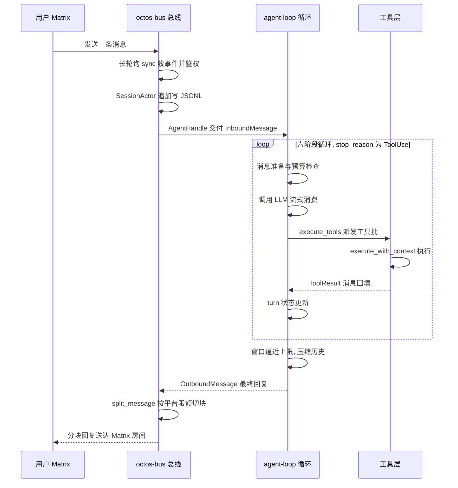
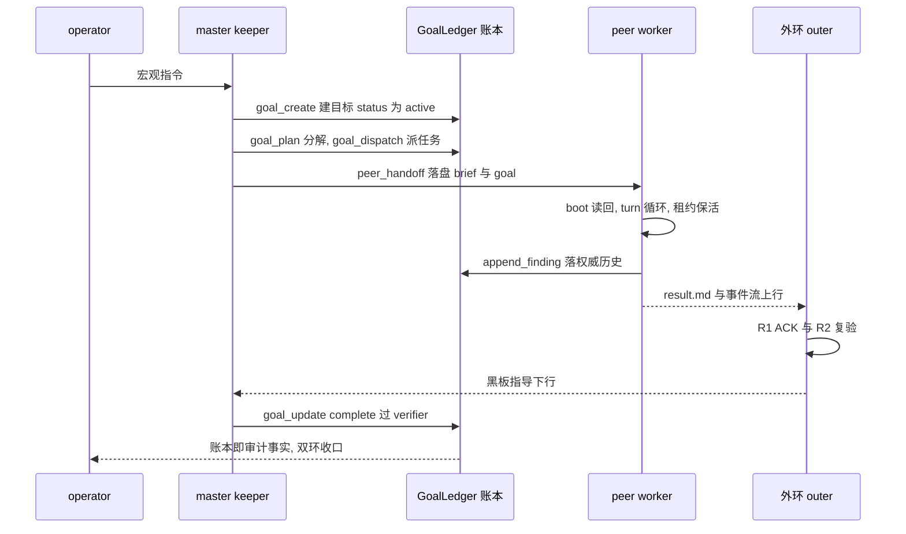

# Appendix F: OLP v2 Protocol Cheat Sheet

> **Positioning**: This appendix is the one-page cheat sheet for OLP (the octos outer-loop protocol, OctoLoop, current version `olp/v2`): the R-series rules, the ACK grammar, result.md frontmatter, the blackboard entry format, outer-loop onboarding and the post-restart checklist, fifth-channel parameters, and lane templates. Why the protocol is designed this way, the full carrier landscape, and the empirical analysis are in Chapter 20 and are not repeated here. This appendix does exactly one thing: it compresses the executable rules scattered across the protocol docs, the onboarding card, and the source into tables you can check against directly, each row carrying its source path and line numbers so every claim can be re-verified.

Terminology, defined once here and used without comment below: the outer loop (outer agent) is the external strong model that joins as planner, monitor, reviewer, and advisor; the inner loop (runtime) is the master/peers execution body driven by `octos serve`; the operator is the human; the blackboard is the `Active` section of each repo's `.octos/OUTER_LOOP_REVIEW.md`, the authoritative carrier of task-level guidance; the fifth channel is the MCP channel through which the inner loop questions the outer loop mid-turn. Data baseline: octoscode repo main @ 1129fa33.

Guide: F.1 is the R-series quick reference in R1-to-R7 order (R4b rides along as an R4 subclause); F.2 gives the ACK grammar and the rules for writing blackboard entries; F.3 is the six-field table for result.md frontmatter v1; F.4 is the outer-loop onboarding flow plus the hard checklist for the walk-through after an inner-loop restart; F.5 covers the fifth channel's parameters, anti-abuse constants, and the sub_providers lane templates. Suggested use: walk F.4 in order before your first shift as an outer loop; check F.2's entry elements before writing guidance; when reviewing a delivery, validate frontmatter against F.3 and re-check verification claims with R2 in F.1; consult F.5's pairing matrix when picking a model tier for a task.

## F.1 R-Series Rules Quick Reference

| Rule | Key semantics | Source lines |
|---|---|---|
| R1 ACK duty | Every item in the blackboard `Active` section must gain an ACK line under the entry once the inner loop has acted on it; no ACK counts as unread and the outer loop may return the delivery. Since v1 the grammar is pinned by the contract test `olp_ack_lines_match_v1_grammar` | octoscode/docs/OUTER_LOOP_PROTOCOL.md:52-58 |
| R2 honest verification claims | Every delivery must claim one of three verification levels: `verified` (ran `cargo test --all-targets` + clippy + fmt), `partially-verified` (list what ran), `unverified` (say why); a verified claim that fails re-verification is a protocol violation, returned and recorded on the blackboard | same, :67-70 |
| R3 escalation tiers | Escalation has three tiers: inner-loop self-resolution (retry, different approach) → outer-loop ruling (technical tradeoffs, plan approval) → operator ruling (permission approval, scope change, external action); the outer loop never approves on the operator's behalf, and an escalation stays parked while the operator is absent | same, :71-73 |
| R4 workspace coexistence | Multiple writers each `git add` only the files they changed; `git add -A` is forbidden; every change lands as an atomic commit; dirty files of unknown origin must be preserved and reported, never auto-cleaned or committed | same, :74-76 |
| R4b tree sovereignty and auto-fencing | With multiple goals in flight the main worktree belongs to exactly one goal: when a collision predicate hits (more than one active goal / a peer's target branch disagreeing with the main tree / the main tree holding an unfenced in-flight peer), a worktree fence opens automatically; the main-tree owner is persisted into the goal-ledger, and a non-owner session is always refused a cross-branch checkout on the main tree; collision protection is the system default, and outer-loop steer only patches the edges. Recorded as an R4 subclause, no protocol version bump | same, :77-88 |
| R5 guidance idempotence | Outer-loop items carry a date and a unique number and are actionable only in `Active`; once ACKed they move to the history section and are never replayed; duplicate delivery is deduplicated by the ACK | same, :89-90 |
| R6 version negotiation | The protocol doc header carries `protocol: olp/vN`; `AGENTS.md` references the same version; any change to channel semantics must bump the version | same, :103-104 |
| R7 lead-review OS exclusive lock | With multiple outer loops, lead-review authority is held by a per-project, session-lifetime OS lock: going on shift requires starting wrapped in `octoscode outer-duty hold --project P --signature S --duties D -- <agent>`; the lock is the authority; `check` only observes and never seizes; takeover of a live lock belongs to the operator alone (terminate the old holder, then acquire), with no agent self-service seizure; the metadata sidecar and every TTL are diagnostic only and never decide; Linux-only (non-Linux platforms exit 2 with an explicit unsupported error; Windows LockFileEx is a separate item), NFS excluded. Added in v2 (#38-r1) | same, :91-102 |

The source document orders these R1, R2, R3, R4, R4b, R5, R7, R6 (R7 sits before R6); this table re-sorts by number so the line numbers trace straight back.

## F.2 ACK Grammar and Blackboard Entry Format

ACK grammar (since v1, the `ACK` line is written under the blackboard entry the inner loop has just executed):

```
ACK(done|wontdo|blocked): <说明>
```

Source: octoscode/docs/OUTER_LOOP_PROTOCOL.md:56-58.

| Grammar | Semantics | Explanation field requirements | Source lines |
|---|---|---|---|
| `ACK(done): …` | Executed | What was done and the evidence (commit hash / test results) | same, :60 |
| `ACK(wontdo): …` | A reasoned objection; not executed | Why it will not be done; disagreement rule: the outer loop can only accept a wontdo or escalate to the operator, and may not return the same item a second time | same, :61-62 |
| `ACK(blocked): …` | Blocked, cannot execute | The blocking cause and what would unblock it | same, :63 |

Scope: the v1 grammar binds only ACK lines written on or after 2026-08-24; historical lines are not rewritten and are exempted by the contract test's effective-date boundary; the explanation is free text, it only has to be non-empty (same, :65-66).

Blackboard entry rules (source: octoscode/docs/OLP_OUTER_BOOT.md §1):

| Element | Rule | Source lines |
|---|---|---|
| Board location | One board per repo at `<repo>/.octos/OUTER_LOOP_REVIEW.md`; the same-named file under `docs/` is a frozen snapshot and must never be written | octoscode/docs/OLP_OUTER_BOOT.md:36-37 |
| Write path | Always through the atomic append helper `scripts/olp-board-append.sh <board-path>` (body fed on stdin), flock mutual exclusion plus self-write registration | same, :38-41 |
| Numbering | First `grep -oE '^### [0-9]+' <board> \| tail -1` for the current maximum number, then use the next one | same, :42 |
| Entry content | Self-contained: context, exact files and line numbers, fix direction, acceptance criteria, branch name (based on main) | same, :43-44 |
| Budget tier | Revision 5-10M / slice 10-20M / campaign 30-50M, stated in the entry | same, :44 |
| Push discipline | The entry states "commit only, never push; the lead reviewer pushes after re-verification" | same, :45 |

## F.3 result.md Frontmatter v1: The Six Fields

`peers/<slug>/result.md` is the inner loop's per-turn deliverable to the outer loop; since v1 its YAML frontmatter must contain exactly six fields, with the list pinned by the contract test `olp_result_schema_fields_documented` (source: octoscode/docs/OUTER_LOOP_PROTOCOL.md:354-358).

| Field | Type | Meaning | Source lines |
|---|---|---|---|
| `slug` | string | The peer's unique identifier (directory name) | same, :362 |
| `outcome` | string | Delivery outcome, one of `complete` / `partial` / `blocked` / `failed` | same, :363 |
| `updated_unix` | integer | Unix timestamp (seconds) of the most recent update | same, :364 |
| `turn` | integer | Number of turns this peer has run | same, :365 |
| `verified` | string | R2 verification level: `verified` / `partially-verified` / `unverified` | same, :366 |
| `protocol` | string | Protocol version in force when writing, currently `olp/v2` | same, :367 |

Consumer side: unknown fields must be ignored (forward compatibility); consumers read exactly the six fields above and neither interpret nor error on anything else; `verified` and `protocol` are written by the octos side (same, :369-373).

## F.4 Outer-Loop Onboarding and the Restart Hard Checklist

Onboarding flow (data sources: octoscode/docs/OLP_OUTER_BOOT.md and the OUTER_LOOP_PROTOCOL.md access checklist):

| Step | Content | Source lines |
|---|---|---|
| Signature | Pick a signature `outer(<name>)`; every blackboard write must carry it; with multiple outer loops in play each entry has exactly one lead reviewer, others may only sign annotations, and disagreements escalate to the operator | octoscode/docs/OLP_OUTER_BOOT.md:10-14 |
| Take the lead-review lock | Start wrapped in `octoscode outer-duty hold --project <project> --signature <signature> --duties <duties> -- <agent start command>`; `check` only observes, and its stdout is exactly one of VACANT/Held/ERROR | same, :74-81 |
| Fix the data root and tail the logs | Data root `~/.octos/instances/<cwd-hash>/profiles/<profile>/data`; tail the serve log filtered on `peer-goal:\|escalation\|transitioned goal\|ERROR`; observation splits into delivery, consumption, and execution layers, and watching one layer alone guarantees a misread | octoscode/docs/OUTER_LOOP_PROTOCOL.md:126-134 |
| Read the protocol and the board | Read the full protocol and the blackboard `Active` section for current guidance; the history section is for audit only | same, :135-136 |

The outer loop's hard checklist after an inner-loop restart, four steps checked item by item; "note it and patch it later" is forbidden (source: octoscode/docs/OLP_OUTER_BOOT.md:16-19):

| Step | Content | Source lines |
|---|---|---|
| 1. serve up | The operator runs it personally; starting serve without a sandbox is a trust decision and is never delegated to an agent | same, :20-21 |
| 2. `/loop resume` is the outer loop's to run | First `/loop list` for the id, then `/loop resume <id>`; a bare resume without an id is refused. While the maintenance heartbeat is paused the main machinery is still healthy, and the crippled fallback stays invisible until this walk-through finds it | same, :22-27 |
| 3. Mount both sentinels | The positive sentinel (ACK lines landing on the board) plus the negative sentinel (`goal_transition blocked` and escalation in events.jsonl); watching only the positive signal makes a fused goal's silence indistinguishable from "still working" | same, :28-30 |
| 4. Verify fallbacks and the session snapshot | Fallbacks are configured and the new session has taken its snapshot; changing config without a restart is paper insurance, because the tool table is snapshotted when the session is built and never backfilled | same, :31-32 |

## F.5 Fifth-Channel Parameters and Lane Templates

The fifth channel is served by the `octoscode olp-mcp-serve` subcommand (a pure Rust standard-library implementation since #31, source file octoscode/src/olp_mcp.rs, 406 lines total). It exposes exactly two MCP tools, letting the inner loop question the outer loop synchronously mid-turn or land a report on the board directly. The tool registry is at octoscode/src/olp_mcp.rs:328-352.

`ask_outer` parameters (all three required; the required declaration sits at octoscode/src/olp_mcp.rs:340):

| Parameter | Meaning | Validation | Source lines |
|---|---|---|---|
| `question` | The question for the outer loop | Rejected outright if empty | same, :197-198 |
| `context` | Where you are stuck, relevant state | No extra validation | same, :183, :336 |
| `tried` | What you already tried on your own | Rejected if empty (anti-outsourcing of thought: try first, then ask) | same, :186-188, :32 |

Anti-abuse constants and behavior:

| Item | Value | Behavior | Source lines |
|---|---|---|---|
| Timeout | 90 seconds (`ASK_TIMEOUT_SECS`) | On timeout returns a degraded directive: proceed on the blackboard's existing guidance, and if you cannot proceed, close with `ACK(blocked)` noting the inquiry id | same, :25, :30, :248-251 |
| Quota | 3 per slice (`ASK_QUOTA_PER_SLICE`) | Beyond quota returns a refusal telling you to proceed on your own or switch to `report_blocked` | same, :27, :31, :193-195 |
| Poll interval | 0.5 seconds (`ASK_POLL_INTERVAL_SECS`) | The polling cadence for the answer file | same, :26 |
| Mailbox | Under `~/.octos/outer/mcp/`, a questions / answers / consumed three-stage flow | Once the answer is taken, the pair is archived to consumed and the originals deleted | same, :109-111, :231-241 |
| Audit | Written to `OUTER_LOOP_MCP.md` with the fixed signature `MCP(ask_outer)` | Full trail | same, :24, :28 |

`report_blocked` parameters: `reason` (why blocked) and `needs` (what would unblock), both required, empty reason refused; it lands on the board directly, with no mailbox round-trip (same, :255-272, :344-352).

The sub_providers lane templates (v1 ships out-of-the-box templates, pinned by the contract test `olp_lane_template_parses`; source: octoscode/docs/OUTER_LOOP_PROTOCOL.md:375-391):

| Lane | model | description highlights | Source lines |
|---|---|---|---|
| cheap | kimi/kimi-k2-turbo | Low cost, high throughput: mechanical, low-risk, strongly rollback-able tasks (docs, test triage, log classification, formatting); the cost of getting it wrong is one re-run | same, :384-386 |
| strong | anthropic/claude-opus | Long reasoning chains and cross-file architecture judgment (review grading, wontdo re-checks, multi-step debugging); getting it wrong pollutes the mainline judgment | same, :388-390 |

Dual-loop pairing matrix (same, :393-400):

| Work type | Lane |
|---|---|
| Analysis (reading code, writing summaries, classification inventories) | cheap |
| Verification (running tests, re-checking R2 claims, mechanical assertions) | cheap |
| Implementation (production code, contract tests, schema changes) | primary (the main tier, no routing) |
| keeper (goal advancement, ledger bookkeeping, state judgment) | primary |

Why the matrix splits this way: analysis and verification output is caught by the outer review layer, so a mistake costs a re-run; implementation and keeper output goes straight into the mainline and the ledger, where errors are expensive, so they stay on the primary tier with quality held by R2 and the outer review (same, :402-403).

## F.6 End-to-End Traces (Across the Whole Book)

The first five sections are the protocol-side static reference; this section switches dimensions: two cross-cutting paths drawn from the book's 21 chapters, each following one user-visible action from entry to exit, to verify how the mechanisms covered chapter by chapter mesh in real execution order. The format is uniform: a sequence diagram first, then a stage-by-stage expansion, each stage labeled with its chapter and source paths; every line number reuses a citation already present in that chapter's body, none are new (the baseline is in the version note at the end of this section). The protocol mechanisms (R1 ACK, frontmatter, the lane matrix) already have quick-reference tables in F.1 through F.5 and are cited here, not re-expanded.

### Trace 1: How One Matrix User Message Becomes a Reply in the Channel

Chapters crossed: Chapter 11 (the message bus, inbound and sessions) → Chapter 5 (the Agent Loop's six stages) → Chapter 6 (tool-system execution) → Chapter 8 (context compaction), with the return leg through Chapter 11's outbound splitting. Scene: a user types "re-check the ch07 references" in a Matrix room and expects the agent to read the files, run the checks, and land the conclusion back in the same room.



**Stage one, inbound and the session ledger (Chapter 11).** In user-account mode the Matrix channel long-polls the homeserver's Client-Server `/sync` API with a 30-second timeout (`SYNC_TIMEOUT_MS`, `crates/octos-bus/src/matrix_user_channel.rs:44`): the request hangs open, returns only when an event arrives, and is re-issued immediately, so self-hosted servers without push permission still receive messages near-real-time. The message then passes two channel-layer gates: sender authorization `is_allowed()` runs before routing to the agent, allow-by-default with per-channel overrides (`crates/octos-bus/src/channel.rs:27-30`); inbound deduplication targets webhook-style platforms' timeout resends, with `MessageDedup` caching seen message IDs in an LRU of capacity 1,000 and TTL 60 seconds (`crates/octos-bus/src/dedup.rs:12-25`); Discord gateway-reconnect replays hang off the same instance (`crates/octos-bus/src/discord_channel.rs:32`). Every channel implements the same `Channel` trait, and of its 26 methods only `name()`, `start()`, and `send()` lack default implementations (`crates/octos-bus/src/channel.rs:17-265`), so a new channel can start running with just three methods.

The message then enters the session layer: `SessionActor` holds an independent `SessionHandle` per session, prefers the per-user layout, and migrates old files on open (`crates/octos-bus/src/session.rs:1611-1819`); the JSONL file's first line is `SessionMeta` metadata rather than a message, and every following line is a message (`crates/octos-bus/src/session.rs:560`); appends go through `append_to_disk()`, full rewrites through write-then-rename `rewrite()`, and a single session file caps at 10MB so runaway history cannot eat the disk (`crates/octos-bus/src/session.rs:792`); the durable commit observer after the write is best-effort fan-out, and failures do not roll back (`crates/octos-bus/src/session.rs:71`). Same-key writes are serialized through `persist_message_through_canonical_path()` under a per-key Tokio mutex (`crates/octos-bus/src/session.rs:2332-2420`), so multiple write entry points cannot double-count (`crates/octos-bus/src/session.rs:2332`). The bus and the processing layer decouple through the symmetric channels `AgentHandle` / `BusPublisher` (`crates/octos-bus/src/bus.rs:8-77`): once every channel's inbound sender is dropped, the receiving end's `recv()` returns `None`, the processing layer senses it and exits gracefully, with no separate shutdown signal needed.

**Stage two, entering the loop (Chapter 5).** The processing layer hands the message to the `process_message` family, and one turn advances through ① message preparation, ② budget check, ③ LLM call, ⑤ tool dispatch, ⑥ state update. Before ①, history goes through a repair pipeline whose entry is `prepare_conversation_messages` (`crates/octos-agent/src/agent/loop_compaction.rs:27`), unifying tool_call_id, fixing message order and tool pairing, so broken history does not trip provider validation. At the top of every iteration, ② runs `check_budget` (`crates/octos-agent/src/agent/budget.rs:100`), five gates in a fixed order, any hit returning `BudgetStop` (`crates/octos-agent/src/agent/budget.rs:13`); the order itself is the design: the atomic shutdown load answers first, the iteration cap next, the two timeouts depend on activity tracking (`crates/octos-agent/src/agent/activity.rs:16`), the token budget last. The whole call orchestration of ③ converges in the single main function `call_llm_with_hooks` (`crates/octos-agent/src/agent/llm_call.rs:22`), with tokens from retry attempts folded into the final usage accounting; streaming consumption is done by `pub(super)` `consume_stream_with_input_estimate` (`crates/octos-agent/src/agent/streaming.rs:73`). The error path is not scattered `unwrap`s: errors first go through `classify_loop_error` (`crates/octos-agent/src/agent/loop_runner.rs:313`) into a typed retry-bucket state machine, and callers receive only two coarse actions, Retry or Bail. The response's `stop_reason` decides the next hop: EndTurn returns, MaxTokens takes the continuation and self-healing path (the conversation loop's continuation branch sits near `crates/octos-agent/src/agent/loop_runner.rs:2171`, with a nudge continuation cap of 2), ToolUse goes back to tool dispatch.

**Stage three, intent becomes side effects (Chapter 6).** The tool-dispatch main entry `execute_tools` is `pub(super)` (`crates/octos-agent/src/agent/execution.rs:2483`); it decides serial versus parallel, computes the batch timeout, and runs pre- and post-hooks; cancellation and panic are both projected into a tool-result message the LLM can read rather than crashing the loop. Tool bodies implement the `Tool` trait (`crates/octos-agent/src/tools/mod.rs:609`); the execution layer goes through the typed entry `execute_with_context` introduced in M8.1 (`crates/octos-agent/src/tools/mod.rs:11-28`), with the legacy `execute` and the typed entry delegating to each other and one tool overriding at most one of them. Registration and lookup live in `ToolRegistry` (`register` at `crates/octos-agent/src/tools/registry.rs:536`, `register_arc` at `:558`), and the dispatch boundary stacks four defenses: provider policy refusal, an argument-size cap, `catch_unwind` panic isolation (a tool panic degrades to a failed ToolResult instead of killing the session actor), and a global execution timeout. Tools marked `spawn_only` are intercepted at the dispatch point and turned into background tasks (around `crates/octos-agent/src/agent/execution.rs:775`); the LLM receives a small `task_handle` envelope whose five read modes check intermediate output on demand without bloating context. In this scene, `read_file` and `bash` results are back-filled as ToolResult messages and the loop returns to ⑥: `LoopTurnState` (`crates/octos-agent/src/agent/turn_state.rs:59`) accumulates usage and stop reasons, and the next iteration continues.

**Stage four, window reclamation (Chapter 8).** After a dozen tool iterations the window nears its limit, and the loop triggers `CompactAndRetry` at the error-classification point, in-band, without the caller threading through compaction state (`crates/octos-agent/src/agent/loop_runner.rs:313`). Compaction cuts in layers: local placeholders, server-side cleanup, and a full summary, three tiers; the most recent messages are always kept, a full six of them, and the cut point never lands on a Tool message, falling back to tail truncation `fallback_truncate()` when it does not fit (`crates/octos-agent/src/agent/compaction.rs:319`). Compacted output is not lost: bytes are recallable by id, semantic summaries are archived as retrievable episodes, and entry compaction and intra-turn compaction each store once (`crates/octos-agent/src/agent/loop_runner.rs:1215`). After compaction the loop continues until `stop_reason` is EndTurn. In this scene, re-checking ch07's references means reading several facts-table files; without recall, the same source file would cycle through enter-window, truncate, compact, read-again; the three-tier reclamation turns this into one read plus many id-based retrievals.

**Stage five, the return leg (Chapter 11 outbound).** The final reply returns to the channel layer as an OutboundMessage; over the platform character limit, long messages go to coalescing: `split_message()` hunts breakpoints through five priority levels, paragraph, period, space, hard cut, first building a UTF-8-safe window then `rfind`-ing inside it (the two-step cut starting at `crates/octos-bus/src/coalesce.rs:68`), and `MAX_CHUNKS = 50` keeps an extremely long message from fragmenting into a flood of small ones (`crates/octos-bus/src/coalesce.rs:47`); a breakpoint equal to 0 is skipped, guaranteeing forward progress instead of cutting empty chunks at the same spot. Chunks are rendered by the channel and delivered to the Matrix room; channel health is exposed uniformly by `health_check()` for the admin panel (`crates/octos-bus/src/channel.rs:245`) rather than scattered across each channel's own admin interface. The message has now completed its full round trip from platform event to chunked reply: inbound dedup, session ledger, the six-stage loop, tool execution, context reclamation, outbound splitting, and every station carries its own failure projection.

The systemic facts this trace surfaces: entry and exit each hold an independent defense line (inbound dedup, outbound splitting), so a bad message neither gets in nor gets out; every organ of the loop is `pub(super)`, and the crate boundary exposes only the loop itself; context is managed as a fluid, with compaction, recall, and episodes as three tiers guaranteeing information only loses density, never disappears; every layer's failure (duplicate delivery, oversized messages, tool panic) has a degraded projection instead of breaking the chain.

### Trace 2: A Goal from Creation to Dual-Loop Closure

Chapters crossed: Chapter 18 (the goal/peer two threads) → Chapter 12 (the three concurrency layers and leases) → Chapter 18 (the three return channels) → Chapter 20 (outer-loop OLP observation and verdicts). Scene: the operator gives master one macro instruction, "add two end-to-end traces to Appendix F," and we follow it from goal creation through `goal_update complete` and the outer-loop ACK to closure.



**Stage one, opening the ledger (Chapter 18).** The keeper-side `goal_create` (GoalCreateTool, `crates/octos-cli/src/goal_tool.rs` at :1495/:1509, with the admission check serialized across both calls) is wired at `crates/octos-cli/src/runtime/profile.rs:1326`. The ledger is `GoalLedger` (`crates/octos-fleet/src/sqlite_ledger.rs:13`): a WAL-mode SQLite where master, the process manager, and peers are separate processes sharing the one `goal-ledgers/<goal_id>.db`; the 39 pub fns of `impl GoalLedger` fall into five groups by purpose, and every state transition, every finding, every escalation request, and every decision leaves an audit trail, which is how one ledger file reaches 6,360 lines. The ledger's state set is the six string states active, complete, blocked, budget_limited, paused, cleared (comment at `crates/octos-fleet/src/sqlite_ledger.rs:39`; terminal-state protection covers complete and cleared); `archived` is not in the ledger's state set, it is the supervisor event stream's terminal marker, and the two books never mix state sets. Then `goal_plan` decomposes the goal into a durable fleet and `goal_dispatch` ships ready tasks to the live worker pool (wired at `crates/octos-cli/src/runtime/profile.rs:1341` and `:1342`). The machine state of planning and execution lives in the fleet kernel (redb), goals and audit in GoalLedger (SQLite), two books that do not substitute for each other; the keeper putting goals into a ledger instead of the conversation context is the answer to this chapter's opening question, that long-horizon goals left in context rot.

**Stage two, dispatching the peer (Chapter 18 entry, on Chapter 12's concurrency base).** The model-side entry `peer_handoff` only validates arguments (`crates/octos-agent/src/tools/peer_handoff.rs:133`); staging is done by `stage_peer` (`crates/octos-cli/src/peers/mod.rs:1563`), writing worktree, originator, goal, brief, and name to disk in a fixed order; at peer boot, `read_peer_boot` (`crates/octos-cli/src/peers/host.rs:96`) reads the execution context back, and the originator is read exactly once so it cannot be rebound mid-run. Liveness semantics rest on Chapter 12's three-layer concurrency model: the peer/lease layer's `PeerTaskBinding` (`crates/octos-cli/src/peers/mod.rs:166`) binds the peer to the supervisor's `TaskLivenessLease`; the fleet-side `Lease` (`crates/octos-fleet/src/records.rs:250`) has only `owner_epoch` and `expires_at_ms` as its two fields, a daemon restart takes a new epoch and the old owner loses authority automatically; the supervisor event ledger `SupervisorStore` (`crates/octos-cli/src/autonomy/supervisor_store.rs` at :697) persists the supervised agent-group state, and `load_state` (:780) reads it back at restart. The peer session's tool surface is deliberately narrow: a goal-bound peer wires up only `goal_get` and `goal_update` (`crates/octos-cli/src/commands/chat.rs:859`), it can see the goal and record findings back into master's ledger, but it cannot reach plan or dispatch and has no authority to rewrite the plan.

**Stage three, execution and return flow (Chapter 18).** The peer has its own turn loop and token budget; Trace 1's six-stage loop is its baseline variant, differing only in the tool surface and the budget cap. The final deliverable is written back to the board by `write_peer_result_if_peer_session` (`crates/octos-cli/src/api/ui_protocol_transport.rs:14279`), with the runtime landing the four frontmatter fields slug/outcome/updated_unix/turn (`:14334`), the turn number derived from the `result-<n>.md` count plus one; a budget-exhausted peer writes an additional five-field checkpoint copy (`crates/octos-agent/src/agent/budget.rs:584`), with status/completed/iteration_budget/iterations_used/checkpoint_commit leaving "how far it got, how much was missing" for the next dispatch. There are three return channels, converging in `goal_get`: the live channel reads `peers/<slug>/result.md`, fast but overwritable; the durable channel goes through `GoalLedger::append_finding` (`crates/octos-fleet/src/sqlite_ledger.rs` at :1623), landed on disk the moment a goal-scoped peer finishes a turn, surviving restart, the authoritative history; the escalation channel writes `append_escalation` (:1635) when a peer parks, so even if master misses the live notification it sees who is waiting in `goal_get`'s `open_escalations`. External events are consumed by `fleet_wake` (`crates/octos-cli/src/autonomy/fleet_wake.rs`), which drains the fleet outbox into continuation requests, acks only after persistence succeeds (WakeCommit::Durable), and re-delivers unpersisted events after their lease expires; the request enqueue point is `crates/octos-cli/src/autonomy/agent_orchestrator.rs:12963`, and the `GoalContinue` and `GoalWrapUp` variants (`crates/octos-cli/src/autonomy/master_continuation_scheduler.rs` at :141/:147) drive the keeper's next tick, the latter being the wrap-up turn after budget exhaustion. A peer's end is marked with a `closed` tombstone (`peer_is_closed`, `:1317`); master collects accounts via `peer_gather` pulling result.md; the CLI observation surface `octos peer list` likewise reads the board directory directly, with zero serve dependency.

**Stage four, the outer verdict (Chapter 20).** The dual loop shares no memory; all collaboration runs over auditable persistent channels: upstream there are the event stream, result.md, goal-ledgers, escalation, git diff, and active inquiry; downstream there are `AGENTS.md`, the blackboard, atomic commits, the inbox doorbell, and TUI injection. Before going on shift the outer loop takes the lead-review lock, starting wrapped in `octoscode outer-duty hold`; the lock is the authority. Observation splits into three layers, delivery, consumption, execution, and watching one layer alone guarantees a misread, which is also the outer loop's most common mistake. The verdict's carrier is the ACK line under each item of the blackboard's Active section: a line must be added after execution, no ACK counts as unread, and the outer loop may return the delivery (from `octoscode/docs/OUTER_LOOP_PROTOCOL.md:52`, with the v1 grammar pinned by `octoscode/tests/olp_contract.rs:96`); delivery review re-checks result.md's `verified` claim against R2's three verification levels, and a verified claim that fails re-verification is a protocol violation, returned and recorded on the blackboard. The frontmatter's protocol schema is six fields (`octoscode/docs/OUTER_LOOP_PROTOCOL.md:354`, field list :362 through :367), consumers ignore unknown fields for forward compatibility, and the `verified` and `protocol` fields are written by the octos side. The inner loop's mid-turn inquiry goes through the fifth channel `ask_outer` (`octoscode/src/olp_mcp.rs:174`); timeout and quota behavior are in the F.5 table: on timeout, degrade by proceeding on the blackboard's existing guidance, and if you cannot proceed, close with ACK(blocked) noting the inquiry id; beyond quota the call is refused outright with a pointer to `report_blocked`. In this scene, the outer loop's review of the two F.6 draft sections traveled down through the blackboard and up through ACK, running in parallel with the goal ledger's state machine, neither blocking the other.

**Stage five, closure (Chapter 18).** master calls `goal_update` claiming complete (GoalUpdateTool, `crates/octos-cli/src/goal_tool.rs` at :1163/:1266, wired at `crates/octos-cli/src/runtime/profile.rs:1329`, hooking an independent verifier lane if one is configured), and the completion claim must pass the verifier to take effect. The single entry for state transitions, `cas_goal_status` (`crates/octos-fleet/src/sqlite_ledger.rs` at :899), embeds the budget rule inside the UPDATE statement: when a goal is active and `tokens_used >= token_budget`, it writes `budget_limited` directly instead of the caller's intended terminal state; `update_goal_status` (`:1498`) is the other, non-CAS transition path; complete and blocked are reachable only by the model, reopen accepts only the three entries blocked, paused, and budget_limited, and the ledger-side terminal-state protection covers complete and cleared. What the outer loop does after this step: go through the blackboard Active section's review items item by item, checking that ACKs landed and that the R2 claim's verification level matches the commands actually run, and only agree to let the operator push the branch after the re-check passes; on a wontdo disagreement, the F.1 disagreement rule allows only accepting or escalating to the operator, never returning the same item again. After `goal_update complete`, the ledger is the audit fact, and the outer loop's ACK and the blackboard history section are the human-readable counterpart, each loop keeping its own trace without overwriting the other; if the operator ever reopens the goal, the three reopen entries are all traceable in the ledger's transition records.

The systemic facts this trace surfaces: a goal's state lives in exactly one SQLite ledger, humans read the blackboard, the model reads tools, the outer loop reads files, three projections of one fact; ownership is expressed through leases and epochs, not in-process locks, and a restart self-corrects; "complete" is a claim that must pass independent verification, not a write; a missed notification is moved from the exception path to the ordinary read path, one `goal_get` call gathering the accounts of all three channels.

## Version note

- v0 to v1 (effective 2026-08-24): the R1 ACK grammar formalized (done/wontdo/blocked and the wontdo disagreement rule); the result.md frontmatter v1 schema fixed; the sub_providers lane templates (Appendices A and B finalized alongside). The v1 grammar binds only ACK lines written on or after the effective date (octoscode/docs/OUTER_LOOP_PROTOCOL.md:9-12).
- v1 to v2 (effective 2026-08-30, #38-r1): adds the R7 lead-review OS exclusive lock (outer-duty hold/check; the lock is the authority, check only observes, live-lock takeover belongs to the operator, metadata/TTL are diagnostic only; Linux-only single-machine flock plus PDEATHSIG, Windows is a separate item, NFS excluded); the `AGENTS.md` reference updated to v2 in sync (same, :14-17).
- R4b tree sovereignty and auto-fencing is a port of octos #20-20c, recorded as an R4 subclause with no protocol version bump (same, :88).
- What's next: the L3 platform extension (R7 lead-review lock on macOS) was approved on 2026-09-02, a guardian reaper process plus kqueue replicating the death coupling, channel semantics unchanged, no protocol version bump (same, :167-172).
- Every line number in this appendix is baselined on octoscode repo main @ 1129fa33; for later protocol evolution, defer to the docs in that repo. The F.6 traces share the book-wide baseline, octos main @ 9c157101.
