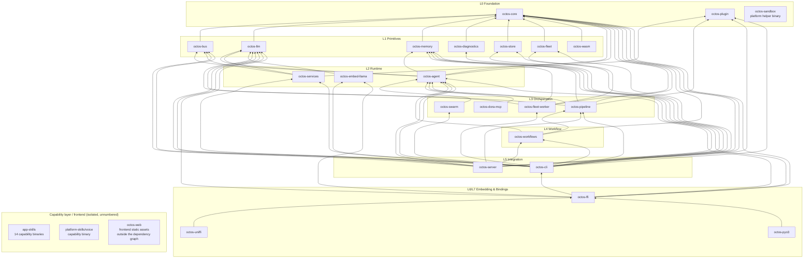

# Chapter 1: Why Rust? Why an Agent OS?

> **Positioning**: This chapter opens the book by answering two root questions: what exactly is hard about a multi-tenant AI agent platform, and why is octos written in Rust and shaped like today's 26-crate workspace? Prerequisites: none. All four reader profiles are served. **A** (Rust beginners) get a concrete picture of what problems Rust solves inside a real large system; **B** (experienced Rust developers) can jump straight to 1.3 for the workspace layering and dependency topology; **C** (AI/LLM application developers, no Rust background required) should focus on the problem space in 1.1; even if you end up choosing Python, these three challenges do not go away; **D** (contributors) should pay particular attention to the three fact corrections in 1.3.3, which are prerequisites for reading the repository correctly.

Open the octos source repository for the first time and `ls crates | wc -l` reports 26; `find crates -name '*.rs' | xargs wc -l | tail -1` reports 700,915 lines of Rust; the root `Cargo.toml` `members` list has 38 entries. Lying in there: a message bus (17 channel source files), an agent runtime (59 tool source files under `crates/octos-agent/src/tools/`), a DOT-driven pipeline engine, a Fleet plan-execution kernel, and a full binding chain for embedding from Python/Swift/Kotlin/browser/Node. Developers arriving from LangChain or AutoGen see this and their first reaction is to question the language choice; Go developers, staring at screens full of `tokio::spawn` and `Arc<Mutex<_>>`, suspect goroutines would have been easier.

This is not a debate about language taste. Push "AI agent" from a single-user toy toward a multi-tenant production platform and you face a set of entangled engineering constraints: **security isolation, concurrency, performance**. Each is manageable alone; with all three holding at once, the choice of language and engineering organization stops being a preference and becomes an architecture decision. This chapter first lays out the three challenges (1.1), then argues why Rust is the best current answer to this constraint set (1.2), then unfolds the octos workspace topology to build the global map for the remaining 20 chapters (1.3). Every scale number in this chapter carries its measurement methodology and can be reproduced line by line in the source repository with the commands given in 1.3.1.

---

## 1.1 Problem Space: Three Challenges of a Multi-Tenant AI Agent Platform

octos is not a chatbot framework; it is a multi-tenant AI agent operating system. One process serves multiple users and multiple agent instances, and every agent can call tools with side effects: execute shell commands, read and write files, make network requests, and spawn child agents. The three challenges grow straight out of this setup.

### 1.1.1 Challenge One: Security Isolation: 59 Tool Source Files Are 59 Attack-Surface Entries

Picture a real scenario: tenant A's agent, summarizing a web page, gets hit by prompt injection, and the malicious instruction tries to read tenant B's session history or run `rm -rf /`. In a multi-tenant environment this is not a theoretical risk. octos's attack surface can be quantified directly from the facts table: `crates/octos-agent/src/tools/` holds 59 tool source files (methodology: `ls crates/octos-agent/src/tools/*.rs | wc -l`). Note that this counts source files, not tools; it includes framework files such as `crates/octos-agent/src/tools/mod.rs`, `crates/octos-agent/src/tools/registry.rs`, and `crates/octos-agent/src/prompt_guard.rs`.

Every tool actually exposed to the LLM (`shell`, `browser`, `web_fetch`, `write_file`, `spawn`, and so on) is an independent attack path. Add the **17 `*crates/octos-bus/src/cli_channel.rs` channel source files** under `crates/octos-bus/src/` (Telegram, Discord, Slack, WhatsApp, Feishu, email, Matrix, WeCom, DingTalk, QQ Bot, Twilio, Line, and more; of which `crates/octos-bus/src/api_channel.rs` and `crates/octos-bus/src/cli_channel.rs` are two internal channels, not all external-facing), and the platform is physically "a code-executing graph wired into every external messaging network." Each channel added is one more trust boundary for inbound messages; each tool registered is one more channel for outbound side effects.

Security isolation in agent scenarios is harder than in traditional web services, for three reasons:

1. Tool calls are the core capability, not a side path. Dangerous operations in a web service usually converge into a handful of handlers; every iteration of an agent loop can trigger arbitrary tool combinations, and the call sequence is generated by an LLM and cannot be enumerated in advance. Defense must sink to per-call granularity, which is why octos implements a deny-wins policy engine and approval flow at the tool layer (see Chapters 6 and 7).
2. Prompt injection is a new attack vector. It operates at the natural-language layer, where WAF-style regex rules mostly fail. The payload can hide inside a document fetched by `web_fetch` and then land as file writes or command execution through tool calls.
3. The isolation boundary must be process-level. Permission checks at the language layer only block "abuse of legitimate APIs"; they cannot block the shell command itself. octos keeps the real sandbox subsystem inside `octos-agent` at `crates/octos-agent/src/sandbox/` (six files: `crates/octos-agent/src/sandbox/bwrap.rs`, `crates/octos-agent/src/sandbox/docker.rs`, `crates/octos-agent/src/sandbox/landlock.rs`, `crates/octos-agent/src/sandbox/macos.rs`, `crates/octos-agent/src/sandbox/windows.rs`, `crates/octos-agent/src/sandbox/mod.rs`), targeting Linux bubblewrap/Landlock, Docker, macOS sandbox-exec, and Windows AppContainer respectively (`crates/octos-agent/src/sandbox/mod.rs:1-23`). Chapter 7 takes them apart one by one.

These three defensive layers (language memory safety → tool policy → process sandbox) hold only if the runtime carrying them introduces no new memory-safety holes of its own. That is the first constraint on the language choice in 1.2.

### 1.1.2 Challenge Two: Concurrency: Three Concurrency Faces in One Process

The second challenge is equally quantifiable. In Gateway mode, inbound messages from 17 channels arrive simultaneously; octos uses one `tokio::sync::Semaphore` to hold concurrent sessions under the configured cap (default 10, `crates/octos-cli/src/config.rs:1633-1635`), and the semaphore is created at Gateway startup (`crates/octos-cli/src/commands/gateway/gateway_runtime.rs:1731-1732`):

```rust
// Semaphore to bound concurrent session processing
let concurrency_semaphore = Arc::new(Semaphore::new(gw_config.max_concurrent_sessions));
```

Rate limiting is only the first face of concurrency. The second is inside the agent loop: in a single iteration the LLM may issue several tool calls at once, and octos `tokio::spawn`s each call as an independent task, then `join_all`s them and preserves call order (`spawn_tool_task` at `crates/octos-agent/src/agent/execution.rs:598` and `execute_tools` at `:2483`). The third face is outside the process: background Cron/Heartbeat timers waking sessions, child agents in synchronous-blocking or background-async dual mode, and fleet workers consuming tasks as independent processes, all sharing the same session state and message bus.

Concurrency itself is not the problem; correctness under concurrency is:

- Session-level serialization: two messages in the same session must not concurrently rewrite state; a per-session lock order is required.
- Tool-level parallelism: independent tools within one batch must run in parallel, or latency stacks linearly.
- Graceful shutdown: on SIGTERM you cannot cut an in-flight conversation in half; octos threads an `AtomicBool` flag through signal handling and loop budget checks.
- No accidental sharing: spawned tasks may not borrow stack state; any data crossing an `.await` or a task boundary must move ownership explicitly or go through `Arc`.

Get any one of these four wrong and the symptom is not a crash but "sporadic, unreproducible data corruption." On a production multi-tenant platform, that is the most expensive class of failure.

### 1.1.3 Challenge Three: Performance: a Slow LLM Does Not Excuse a Slow Framework

"The LLM call takes seconds anyway, so framework performance doesn't matter" is the most popular misconception in agent engineering. It fails in three ways.

First, latency is multiplicative. One agent execution may run dozens of iterations, each with message construction, context compression, and tool scheduling. 50ms of extra framework latency per iteration, across dozens of iterations, becomes visible stutter. In streaming scenarios it decides whether the typewriter feel survives.

Second, memory is a hard multi-tenant constraint. Every session holds conversation history, tool state, and a context window. The runtime's per-session overhead times the number of concurrent sessions is capacity you must plan up front: interpreted runtimes usually carry a markedly higher per-session baseline than compiled ones; measure capacity at your target concurrency, because at 100 concurrent sessions that delta decides whether one more container fits.

Third, the hot path lives in the framework, not the LLM. SSE stream parsing, message-channel shard splitting, context-compression truncation, tool-output size estimation: all of these run on every iteration. A representative small function in octos-core is `truncate_utf8` (`crates/octos-core/src/utils.rs:6-16`):

```rust
pub fn truncate_utf8(s: &mut String, max_len: usize, suffix: &str) {
    if s.len() <= max_len { return; }
    let mut limit = max_len;
    while limit > 0 && !s.is_char_boundary(limit) {
        limit -= 1;
    }
    s.truncate(limit);
    s.push_str(suffix);
}
```

What it does is small: truncate safely at a UTF-8 character boundary. But it sits on every hot path: message trimming, channel sharding, tool-output capping. Note that it takes `&mut String` and truncates in place rather than returning a newly allocated `String`: on paths where every message may be truncated, what it saves is thousands of heap allocations per iteration. Unremarkable but everywhere; this class of overhead is the bulk of framework performance.

Those are the three challenges. What they share: none can be solved by "being careful while coding"; each demands structural guarantees from the language and the organization. Which brings us to the language choice.

---

## 1.2 Language Choice: Python, Go, and Rust Across Four Dimensions

octos's real candidate set had three entries: Python (the thickest LangChain/AutoGen ecosystem), Go (the smoothest cloud-native concurrency), Rust (the highest ceiling on safety and performance). The comparison below runs through four dimensions: safety, concurrency, performance, ecosystem. Conclusion first: Rust wins the first three, loses the fourth, and the fourth gap can be bridged with engineering.

### 1.2.1 Safety Dimension: Memory Safety Is Layer Zero of Defense in Depth

Of the three defensive layers in 1.1.1, the bottom one is "the runtime itself has no memory-safety holes." An agent runtime written in C/C++ can have the best sandbox in the world and still fall over first while parsing a maliciously crafted SSE shard or WebSocket frame, because parsing untrusted input is precisely where memory-safety vulnerabilities breed. octos's move is direct: the workspace root `Cargo.toml` sets lints workspace-wide (`Cargo.toml:50-51`):

```toml
[workspace.lints.rust]
unsafe_code = "deny"
```

One line of configuration, inherited by all 26 directories and 38 members; `unsafe` is compiler-rejected across the entire code base (unless explicitly exempted crate by crate). Python and Go each have a posture at this layer: the Python interpreter is written in C and has repeatedly shipped memory-safety CVEs from parsing malicious input; Go is memory-safe but its `unsafe` package and the cgo boundary remain surfaces where it can fail. The Rust difference is that "no unsafe" becomes a machine-checkable, whole-repository invariant, not a coding convention.

The type system carries a second value: making illegal states unrepresentable. The spots where agent systems breed the most bugs (message-role enums, task-state transitions, tool-result shapes) are all exhaustively matched `enum`s in octos-core; miss one branch and it does not compile. That moves the line of defense a full stage earlier than "runtime validation + test coverage."

### 1.2.2 Concurrency Dimension: Killing Data Races at Compile Time

Start with three snippets of language semantics (illustrative code, not octos source):

```go
// Go: two goroutines increment concurrently. Compiles; the data race lies in wait
go func() { counter++ }()
go func() { counter++ }()
```

```python
# Python: the CPython GIL prevents threads from executing CPU work in parallel
threads = [threading.Thread(target=process_chunk) for c in chunks]
```

```rust
// Rust: the same shape fails to compile; borrows crossing threads must be explicit
s.spawn(|| counter += 1);  // ❌ error: closure may outlive borrowed value
```

Go's goroutine model is the easiest to write, but correctness rests on discipline and `-race` detection. The race detector is a happens-before algorithm, a testing-time tool; paths it never covers stay unprotected. Python's GIL closes off "one process, parallel CPU threads" entirely; `asyncio` handles I/O concurrency but one synchronous call stalls the whole event loop, and the serialization cost of multiprocess designs conflicts with the fine-grained shared-state model that 1.1.2 requires.

Rust's answer encodes concurrency correctness into the type system: `Send` (movable across threads) and `Sync` (shareable across threads) are two marker traits inferred by the compiler, and holding a non-`Send` borrow across an `.await` is a compile error. Each of the four correctness requirements from 1.1.2 (session serialization, tool parallelism, graceful shutdown, no stack-state borrowing in tasks) has a compile-time enforcement form in Rust. The cost is the learning curve; the payoff is an entire class of failures disappearing from the production incident list.

### 1.2.3 Performance Dimension: Deterministic Latency Without a GC

An agent framework's performance profile is unusual: many short-lived allocations (messages, shards, tool results), long-lived tasks (sessions, channel connections), and streaming paths that must stay smooth (SSE parsing forwarding token by token). The classic symptom of GC languages under this profile: pauses themselves are infrequent, but which iteration a pause lands in is unpredictable. Load-test p99 looks fine today, tomorrow one session's long conversation triggers a major collection and the streaming output visibly hitches.

Rust has no GC: allocation and freeing follow ownership, determined at compile time, and `Drop` destructors make file descriptors, child-process handles, and lock releases happen deterministically. Section 1.1.3's `truncate_utf8` already showed the avoid-allocation idiom. One level up, here is the octos-agent tool trait signature (`crates/octos-agent/src/tools/mod.rs:609-642`, excerpt):

```rust
#[async_trait]
pub trait Tool: Send + Sync {
    fn name(&self) -> &str;
    fn description(&self) -> &str;
    fn input_schema(&self) -> serde_json::Value;
    async fn execute(&self, args: &serde_json::Value) -> Result<ToolResult>;
}
```

Note the `Tool: Send + Sync` bound. It is where the compile-time concurrency guarantees of 1.2.2 land on the tool system: any tool implementation that wants to be registered in the registry and shared across sessions is forced by the compiler to prove itself thread-safe. The performance and concurrency dimensions converge here: one type-system bound buys both parallel safety and zero-cost abstraction.

### 1.2.4 Ecosystem Dimension and the Price of the Choice

Honestly stated: the ecosystem is Rust's relative weak spot. LangChain/AutoGen tutorials and ready-made integrations are richer; Python is the de facto glue language of LLM work; Go is more mature in cloud-native infrastructure (the K8s ecosystem, metrics, deployment tooling). octos's response is to turn the ecosystem problem into an architecture problem. This explains the two chains in the 1.3 topology.

The first chain reaches outward to language ecosystems. Under `octos-ffi` (C-ABI) hang `octos-pyo3` / `octos-uniffi` / `octos-wasm`, letting Python, Swift/Kotlin, and the browser embed octos through native bindings; users of the Python ecosystem need not give up Python.

The second chain reaches outward to capability ecosystems: `octos-plugin` lets external capabilities plug in via manifest plus binary protocol, and the 14 capability binaries of `app-skills` carry zero `octos-*` dependencies and evolve fully independently. Rust handles only the core that Rust must handle; the edges are left to each ecosystem.

The price of the choice must be stated just as plainly: a steep learning curve (the borrow checker is unfriendly to newcomers; reader profile A should budget two weeks of frustration); long compile times (a full build of 700K lines takes patience, and incremental builds plus the 26-crate split are exactly the mitigations); some domain libraries (SDKs for emerging protocols, say) must be written yourself instead of pip-installed. What those prices buy is the structural guarantee of the previous three dimensions. For the "multi-tenant + executable code + long-lived process" class of workload, Rust's compile-time guarantees pay back more than the ecosystem costs.

---

## 1.3 Workspace Topology: An Eight-Layer Map of 26 Crates

The language settles "how to write it right"; the workspace settles "how to grow it right." octos organizes 26 top-level directories into one Cargo workspace. This section first fixes the measurement methodology, then derives the layering from dependency direction, then corrects the three most commonly garbled facts, and finally gives the full dependency topology graph.

### 1.3.1 Scale Baseline and Measurement Methodology

All scale numbers in this chapter refer to main branch commit `9c157101` of the source repository (measured 2026-09-02), each reproducible:

| Metric | Value | Methodology and command |
|---|---|---|
| Total crate directories | 26 | `ls crates \| wc -l`; = 23 `octos-*` crates + `app-skills` + `platform-skills` + `octos-web` |
| Total Rust lines | 700,915 | `find crates -name '*.rs' \| xargs wc -l \| tail -1`; counts `.rs` files only; `octos-web` counts 0 |
| Workspace members | 38 | length of the root `Cargo.toml` `members` list; of the 26 directories `app-skills`/`platform-skills` are multi-crate directories (14/1 members each), 23+14+1=38; `octos-web` is not a member |
| Message channel source files | 17 | `ls crates/octos-bus/src/*crates/octos-bus/src/cli_channel.rs \| wc -l` |
| Tool source files | 59 | `ls crates/octos-agent/src/tools/*.rs \| wc -l`; a file count, not a tool count (includes `crates/octos-agent/src/tools/mod.rs`, `crates/octos-agent/src/tools/registry.rs`, tests, and other framework files) |

The relation between 26 and 38 deserves its own emphasis: directory count ≠ member count ≠ core-library count. `crates/app-skills/` has no top-level `Cargo.toml`; it is a directory holding 14 independent binary crates; `platform-skills/` holds 1 (voice); `octos-web` has no Rust at all. Conflating these four numbers is the single most common first-layer misunderstanding outsiders have about octos's structure.

### 1.3.2 Eight Layers: L0–L7 Plus an Unnumbered Capability Layer

The layering is derived from dependency direction: each crate's layer = 1 + max(layer of every `octos-*` dependency in its `[dependencies]`); zero internal dependencies means L0. Under this rule the 26 directories fall into 8 layers (L0–L7) plus one capability layer that carries no layer number:

- L0 foundation: `octos-core` (core types, task model and protocols, 22,313 lines, the domain language of the whole repository), `octos-plugin` (plugin SDK: manifest parsing, discovery, gating, 5,165 lines), `octos-sandbox` (1,468 lines; note it is a platform helper binary, see 1.3.3).
- L1 primitives (depend only on core): `octos-bus` (message bus, 17 channels, session management, 42,767 lines), `octos-llm` (Provider abstraction, 35,087 lines), `octos-memory` (episodic memory, 6,428 lines), `octos-diagnostics` (diagnostics and update planning, 2,243 lines), `octos-store` (self-contained persistent storage, 2,664 lines), `octos-fleet` (Fleet kernel storage: transaction records + single-writer transaction CAS + recovery reconciliation, 16,888 lines), `octos-wasm` (browser-side protocol bindings, 883 lines).
- L2 runtime: `octos-agent` (agent runtime, tool execution and coordination, 191,985 lines, the heart of the repository, depends on core/bus/memory/llm/plugin), `octos-services` (support services extracted from the CLI, 3,223 lines), `octos-embed-llama` (in-process GGUF embedding, 911 lines).
- L3 orchestration (depend directly on agent): `octos-pipeline` (DOT pipeline engine, 32,799 lines), `octos-swarm` (fan-out/sequence/pipeline orchestration primitives, 4,980 lines), `octos-dora-mcp` (dora bridge compatibility re-export, 11 lines), `octos-fleet-worker` (closed non-interactive task worker, 6,842 lines).
- L4 workflow: `octos-workflows` (depends on pipeline, 1,059 lines).
- L5 integration: `octos-server` (HTTP/WebSocket API + session runtime, a facade of only 21 lines), `octos-cli` (CLI entry point, 307,299 lines, depending on 15 crates, the convergence point of the repository).
- L6 embedding core: `octos-ffi` (C-ABI bindings, 1,372 lines, depends on cli/agent/llm/memory/embed-llama and others).
- L7 bindings: `octos-uniffi` (Python/Swift/Kotlin, 465 lines), `octos-pyo3` (recommended Python binding, 756 lines).
- Capability layer (unnumbered): `app-skills` (14 capability binaries, 12,098 lines total), `platform-skills/voice` (1,188 lines), `octos-web` (frontend, 0 lines of Rust). Their shared trait: **zero `octos-*` dependencies, depended on by no crate**, hence excluded from core-library layering.

Two line-count extremes deserve a pause. `octos-server` stands at L5 with only 21 lines because it is a pure assembly facade; the real logic all lives in lower crates. `octos-cli` stands at L5 with 44% of the repository's lines because it is the front door, assembling the capabilities of 15 lower crates into runtime modes like `chat`/`gateway`/`serve`. Layer reflects dependency depth, not importance, and not lines of code.

### 1.3.3 Three Fact Corrections: Fix Three Impressions Before Reading the Repository

External material (including this book's v1 draft) carries three systematic misstatements about octos's structure. Correct them before reading the source.

Correction one: `octos-sandbox` is not the sandbox subsystem. Its `Cargo.toml` description reads "Platform sandbox helper for octos"; 1,468 lines; `[dependencies]` holds only clap and eyre, zero `octos-*` dependencies. It is a helper binary shipped with the platform. The real sandbox lives inside `octos-agent`: six files under `crates/octos-agent/src/sandbox/` (`crates/octos-agent/src/sandbox/bwrap.rs`, `crates/octos-agent/src/sandbox/docker.rs`, `crates/octos-agent/src/sandbox/landlock.rs`, `crates/octos-agent/src/sandbox/macos.rs`, `crates/octos-agent/src/sandbox/windows.rs`, `crates/octos-agent/src/sandbox/mod.rs`), covering Linux bubblewrap/Landlock, Docker, macOS sandbox-exec, Windows AppContainer, and a no-sandbox fallback (`crates/octos-agent/src/sandbox/mod.rs:1-23`). When anything says "the octos sandbox," it always means `octos-agent::sandbox`.

Correction two: `octos-web` contains no Rust and is not a workspace member. It is a TypeScript project (`package.json`/`tsconfig.json`/`vitest.config.ts`), zero `.rs` files; grep the root `Cargo.toml` `members` and `octos-web` does not appear. It is frontend static assets, outside the Cargo dependency graph, and an isolated node in the topology.

Correction three: there is no harness crate. `ls crates | grep harness` returns nothing. Harness is a module inside `octos-agent`: `crates/octos-agent/src/lib.rs:30-31` declares two sibling module files, `pub mod harness_errors;` and `pub mod harness_events;`. Do not mistake the four `app-skills/harness-starter-*` scaffolds for harness itself; they are user-facing starter templates, not the harness implementation. Chapter 10 covers Harness in full.

### 1.3.4 Dependency Topology: 63 Edges in One Graph

The graph below is the workspace's dependency topology: 63 dependency edges, not one more, not one fewer; every edge comes from the `[dependencies]` section of the corresponding crate's `Cargo.toml` (machine-check command: `awk '/^\[dependencies\]/{f=1;next} /^\[/{f=0} f && /^octos-/' crates/*/Cargo.toml | wc -l` → 63). `A --> B` means A depends on B; `graph BT` reads bottom-up: the higher a crate sits, the closer it is to the user.



How to read it. (1) `octos-core` is the only root depended on by 15 crates; it must keep zero internal dependencies and extreme stability (the subject of Chapter 2). (2) `octos-agent` is depended on by 8 crates (pipeline, swarm, dora-mcp, fleet-worker, workflows, server, ffi, cli), the de facto second hub. (3) The four isolated nodes (app-skills, platform-skills/voice, octos-web, octos-sandbox) are not among the 63 edges: capability binaries and the frontend attach through process boundaries, not Cargo dependencies. That is the formal statement of "they don't belong to core-library layering." (4) All dependencies point downward, with no cycles; adding any upward edge fails outright at `cargo`, so the layering is an invariant enforced by the toolchain.

> ### Engineering decision: mono-repo workspace vs multi-repo
>
> 26 crates and 63 internal dependency edges leave at least three organizational options on the table.
>
> Option A: multi-repo, one repository per crate. Upsides: clear permission boundaries, independent releases and trimmed CI per repository, a smaller clone surface for outside contributors. The downsides are fatal for octos: with 63 edges, cross-repository change is the norm, not the exception. A type-definition change in `octos-core` ripples into 15 downstream crates, and under multi-repo you open 16 PRs, maintain 16 version numbers and 16 lockfiles, atomic cross-repo refactoring becomes impossible, and CI recompiles shared dependencies in every repository. Semantic versioning does not stop the human error of "the interface changed but the version didn't bump correctly."
>
> Option B: a single mega-crate. Pack all 700K lines into one crate. Upsides: no cross-crate version problems, refactor freely. Equally fatal downsides: compile times run away (any one-line change triggers a full rebuild); non-Rust assets like `octos-web` have nowhere to live; the 14 `app-skills` binaries would be forced to drag in all core dependencies (they deliberately carry zero `octos-*` dependencies); feature-flag combinatorics explode, and one module flipping the wrong feature can pollute the global build.
>
> Option C (octos's choice): a Cargo workspace mono-repo. It keeps single-repository atomicity (a cross-crate refactor is one commit, one CI run) while crate boundaries preserve compile isolation and dependency direction: the root `Cargo.toml` unifies `members` (38 entries), `workspace.package` (version/edition 2024/rust-version 1.85.0), `workspace.lints` (`unsafe_code = "deny"` in one place, repository-wide), and `workspace.dependencies` managing internal path-dependency versions. Layering falls out of `[dependencies]` direction; `cargo` itself is the architecture guardian.
>
> The engineering dividend on the side: capability binaries (app-skills/platform-skills) join the workspace and enjoy the unified toolchain, yet with zero `octos-*` dependencies they never enter the core compile graph; if a crate ever needs to evolve independently, splitting it out of a workspace is far cheaper than splitting it out of a mega-crate. The tradeoffs: repository size grows, CI must do layered caching, and outside contributors face a 26-directory tree. octos hedges with directory layering (1.3.2) and this book's navigation (1.4).

---

## 1.4 A Tour of the Book

The v2 edition unfolds in four parts (foundation, engine, platform, dual loop) with 21 chapters plus appendices. Numbering follows the v2 rewrite plan (shifted from v1: the old Chapter 10 bus moved to Chapter 11, and Chapter 10 became the new Harness chapter):

| Part | Chapter | Topic |
|---|---|---|
| Part I Foundation | Ch1 | Why Rust? Why an Agent OS? (this chapter) |
| | Ch2 | octos-core: defining the domain language with the type system |
| | Ch3 | octos-llm: taming the chaos of LLM providers |
| | Ch4 | octos-memory: the engineering of hybrid search |
| Part II Engine | Ch5 | Agent loop: the full lifecycle of one conversation |
| | Ch6 | The tool system: design patterns behind 59 source files |
| | Ch7 | Defense in depth: from sandbox to prompt-injection defense |
| | Ch8 | Context management: working efficiently in a bounded window |
| | Ch9 | Extension mechanisms: the skills-and-plugins dual track |
| | Ch10 | Harness (new): validators, event ABI, schema versioning |
| Part III Platform | Ch11 | octos-bus: unified message abstraction over 17 channels |
| | Ch12 | Concurrency model: Tokio, supervisor, peer, lease: three layers of scheduling |
| | Ch13 | octos-pipeline: a DOT-graph-driven workflow engine (12 IR node kinds) |
| | Ch14 | Runtime modes and the configuration system (incl. stdio/solo) |
| | Ch15 | Production: octos-store / octos-services, authentication and monitoring |
| | Ch16 | Fleet (new): a recoverable plan-execution kernel |
| | Ch17 | Swarm (new): contract fan-out and aggregation gates |
| | Ch18 | Goal and Peer (new): moving objectives out of the context window |
| Part IV Dual Loop | Ch19 | octoscode (new): terminal client and the UI protocol |
| | Ch20 | OctoLoop (new): the outer-loop protocol OLP v2 |
| | Ch21 | herdr and outer-loop operations practice (new) |
| Appendices | A–D, F | Full 26-crate dependency graph, tool quick reference, configuration reference (mcp_servers/sub_providers/validators), feature flags, OLP v2 protocol quick reference (new) |

Suggested routes: reader profile A reads sequentially, with Ch1–Ch5 building the dual foundation of Rust plus agents; profile B can skip the language argument and go straight to Ch5, Ch12, Ch16; profile C prioritizes Ch1, Ch7, Ch11, Ch13 and skips the implementation sidebars; profile D reads this chapter and Appendix A before touching a first PR.

## 1.5 Chapter Recap

1. Problem space: a multi-tenant AI agent platform faces three entangled challenges: security isolation (an attack surface of 59 tool source files plus 17 channels), concurrency (correctness across the session/tool/process faces), performance (multiplicative latency, multi-tenant memory, framework hot paths). Together they make the choice an architecture decision.
2. Language choice: Rust wins on safety (repository-wide `deny(unsafe_code)` plus the type system), concurrency (`Send`/`Sync` compile-time guarantees), and performance (no GC, deterministic destructors, zero-allocation hot paths); the ecosystem gap is hedged with the FFI/binding chain (pyo3/uniffi/wasm) and the plugin/skill extension mechanisms.
3. Workspace topology: 26 directories = 23 `octos-*` crates + 2 skill directories + 1 frontend directory; 38 workspace members fall by dependency direction into 8 layers L0–L7 plus the unnumbered capability layer; 63 dependency edges, none cyclical, all pointing down. `octos-sandbox` is a helper binary (the real sandbox is the six files of `octos-agent::sandbox`), `octos-web` is non-Rust and not a member, and harness is a module inside `octos-agent`, not a crate. These three corrections are the right starting point for reading the repository.

From the next chapter we work bottom-up: first, how `octos-core` at L0 defines the domain language of the whole platform with the type system.

---

## Further reading

- Cargo workspaces: the official "Workspaces" chapter, https://doc.rust-lang.org/cargo/reference/workspaces.html; read against the members/lints/dependencies inheritance in 1.3.
- Rust ownership and concurrency: *The Rust Programming Language* Ch4 "Understanding Ownership" and Ch16 "Fearless Concurrency", https://doc.rust-lang.org/book/. The inference rules for `Send`/`Sync`.
- The Tokio tutorial: https://tokio.rs/tokio/tutorial, prerequisite for the concurrency model in Ch12.
- OWASP Top 10 for LLM Applications: https://owasp.org/www-project-top-10-for-large-language-model-applications/. The threat taxonomy of prompt injection and agent security.
- Appendix A of this book: the full 26-crate dependency graph (the complete version of this chapter's topology).

## Exercises

1. Attack-surface estimate: using the methodology of 1.1.1, estimate the attack surface of a homegrown agent service with 3 channels and 20 registered tools. Which boundaries need their own trust model? Which layer is weakest?
2. Compile-time vs runtime concurrency: which classes of error do Go's `-race` and Rust's `Send`/`Sync` each catch, and which do they miss? If a team migrates from Go to Rust, which tests can be deleted and which must stay?
3. Layering tradeoff: octos splits L6/L7 (ffi → uniffi/pyo3) into two layers instead of letting pyo3 depend on all core crates directly. What does the split make more expensive, and what cheaper? If a Kotlin binding landed tomorrow, which layer would change?
4. The value of an isolated capability layer: the 14 `app-skills` binaries carry zero `octos-*` dependencies. What engineering property does that buy? If they depended directly on `octos-agent`, what would happen to the compile graph and the release cadence?
5. Organizational mirror: following the topology graph in 1.3.4, draw the same dependency graph for a system you know well. Is its layering toolchain-enforced like octos's, or does it exist only in documentation? What are the long-term consequences of the difference?

---

## Version note

> **Version note**: This chapter analyzes the octos main workspace @ `9c157101` (measured 2026-09-02) with its 26 crates; the methodology and reproduction commands for every scale number (26 directories, 38 members, 700,915 lines of Rust, 17 channel source files, 59 tool source files, 63 dependency edges) are in `assets/ch01-facts.md`, verifiable line by line against the source repository.
>
> Relative to the v1 draft, this chapter makes three classes of updates. First, three fact corrections: `octos-sandbox` is a platform helper binary, not the sandbox subsystem (the real sandbox is the six files of `octos-agent::sandbox`); `octos-web` contains no Rust and is not a workspace member; there is no harness crate: harness is the internal `harness_errors`/`harness_events` module of `octos-agent`. Second, topology layering updated: the v1 four-layer architecture and its core-crate counting are void; v2 derives L0–L7, 8 layers plus the unnumbered capability layer, from `[dependencies]` direction. Third, book structure adjusted: Harness became its own Chapter 10, the old Chapter 10 bus moved to Chapter 11, and Chapters 16 onward are new.
