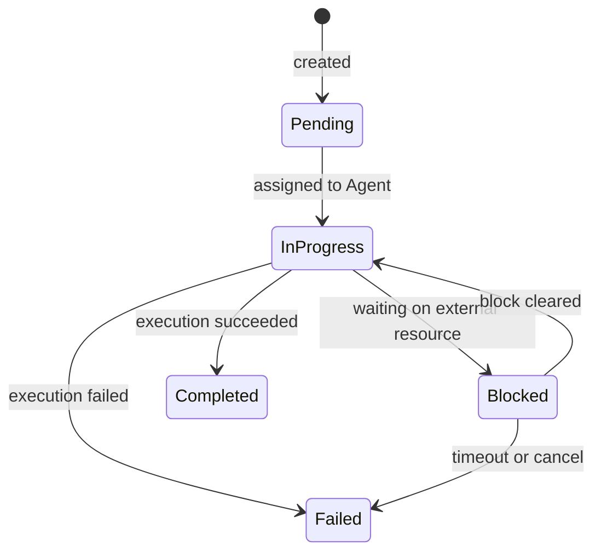
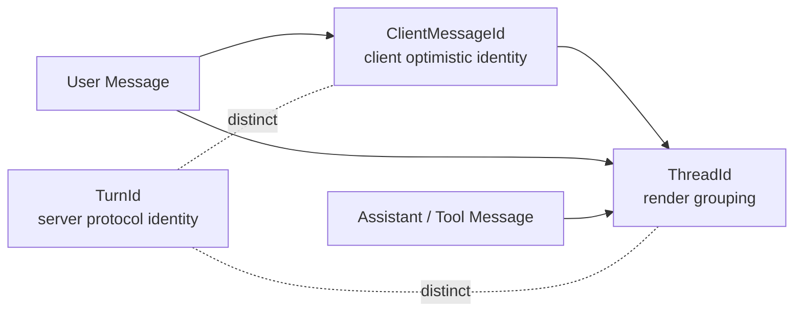
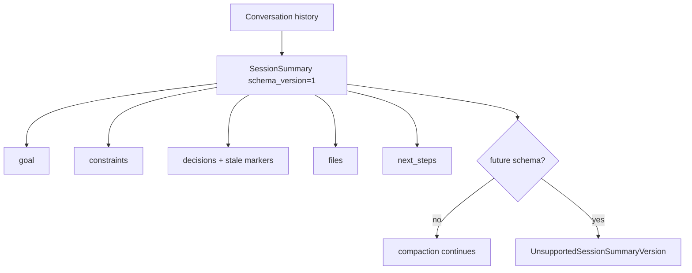

# Chapter 2: octos-core: Defining the Domain Language with the Type System

> **Positioning**: This chapter goes into octos's bottom layer, the octos-core crate (currently 22,313 lines of Rust source, about 15,005 lines after excluding the test file `crates/octos-cli/src/api/ui_protocol_tests.rs`, with most of the growth coming from UI Protocol wire types), and shows how the Rust type system builds the domain language of an AI agent platform. Prerequisites: Chapter 1. Intended for every reader who wants to understand octos's type foundation, especially reader **A**, learning Rust enums and error-handling design through a working system, and reader **B**, the experienced developer curious about the design philosophy of a zero-dependency core crate.

Think of octos as a city. octos-core is not its buildings or its roads but its language: the vocabulary and grammar residents use to talk to each other. `Task`, `Message`, `MessageRole`, `Error`, and the UI Protocol wire types define how every component in the system describes its state and intent. Every upper crate in octos depends on these types, while octos-core itself depends on no other crate in the workspace.

That zero-dependency constraint is deliberate. It keeps the boundary clean while the domain language evolves: when octos-llm refactors a Provider implementation or octos-bus reworks its channels, core absorbs only the wire identity and domain model that genuinely cross crates, never upper-layer implementation logic. This chapter starts with the Task state machine, walks through each foundational type, and closes with the engineering case for the zero-dependency strategy.

---

## 2.1 The Task State Machine: Encoding Legal States as an Enum

Every unit of work an AI agent performs in octos is modeled as a `Task`. Task is the system's work unit: from "write me some code" to "review this diff", every user request ends up as a Task.

### 2.1.1 The Task struct

Task is defined at `crates/octos-core/src/task.rs:11-29`:

```rust
pub struct Task {
    pub id: TaskId,                      // UUID v7, time-sortable by construction
    pub parent_id: Option<TaskId>,       // subtask hierarchy
    pub status: TaskStatus,              // current state
    pub kind: TaskKind,                  // task type
    pub context: TaskContext,            // execution context
    pub result: Option<TaskResult>,      // result, present once complete
    pub created_at: DateTime<Utc>,
    pub updated_at: DateTime<Utc>,
}
```

Several design choices stand out.

**`TaskId` uses UUID v7, not v4** (`crates/octos-core/src/types.rs:180-189`). UUID v4 is pure random, while the first 48 bits of a v7 encode a millisecond timestamp. A TaskId therefore sorts by creation time: during debugging and log analysis you can read task ordering straight off the ID, without a separate lookup of `created_at`.

**`parent_id: Option<TaskId>`** supports task hierarchy. When a complex task decomposes into subtasks (multi-step execution inside a Pipeline, say), each subtask points at its parent through `parent_id`, forming a tree.

**`result: Option<TaskResult>`** exists only after the Task completes. Rust's `Option` makes the compiler force callers to handle "the result may not exist yet": you cannot access the result of a Pending Task without checking first.

### 2.1.2 TaskStatus: Making Illegal Transitions Unrepresentable at Compile Time

TaskStatus is an enum that carries data (`crates/octos-core/src/task.rs:63-77`):

```rust
pub enum TaskStatus {
    Pending,
    InProgress { agent_id: AgentId },
    Blocked { reason: String },
    Completed,
    Failed { error: String },
}
```

The `InProgress` variant carries `agent_id`, so it records not just the state but who is executing the task. Likewise `Blocked` carries the reason and `Failed` carries the error. This pairing of state with contextual data is the core advantage Rust enums hold over the enums of other languages (Go's `iota` constants, or Java's traditional enum).

In Python you would model the same semantics with a string field `status: str` plus optional fields `agent_id: Optional[str]` and `error: Optional[str]`. That design admits illegal states: a Task with `status="pending"` but `agent_id="agent-1"`, or `status="completed"` with `error="something failed"`. Rust's enum makes such states impossible at the type level.

### 2.1.3 The state transition diagram

The legal Task state transitions are:



Figure 2-1: the Task state machine. Each transition corresponds to a distinct business event. Note that Pending can move only to InProgress (never straight to Completed), and InProgress is the only state that reaches Completed. Every completed task has therefore passed through execution.

### 2.1.4 TaskKind: five task types

TaskKind defines five kinds of work (`crates/octos-core/src/task.rs:79-99`):

```rust
pub enum TaskKind {
    Plan { goal: String },
    Code { instruction: String, files: Vec<PathBuf> },
    Review { diff: String },
    Test { command: String },
    Custom { name: String, params: serde_json::Value },
}
```

The first four cover the common predefined scenarios: Plan, Code, Review, Test. The fifth, `Custom`, is the extension point: `name` identifies the task type and `params` carries arbitrary JSON. This "a closed set of predefined cases plus an open extension" pattern recurs throughout octos (see Chapter 6 on the tool system and Chapter 9 on the extension mechanism).

### 2.1.5 TaskContext and TaskResult

TaskContext (`crates/octos-core/src/task.rs:102-115`) is a snapshot of the task's execution environment:

```rust
pub struct TaskContext {
    pub working_dir: PathBuf,
    pub git_state: Option<GitState>,      // branch, uncommitted changes, HEAD commit
    pub working_memory: Vec<Message>,      // recent conversation turns
    pub episodic_refs: Vec<EpisodeRef>,    // references to past episodes
    pub files_in_scope: Vec<PathBuf>,
}
```

The split between `working_memory` and `episodic_refs` deserves attention: `working_memory` is the current session's short-term memory (the most recent conversation turns), while `episodic_refs` are relevant fragments retrieved from long-term memory (see Chapter 4). This dual-memory architecture mirrors the human distinction between working memory and episodic memory.

TaskResult (`crates/octos-core/src/task.rs:125-157`) records the task's output across 7 fields: `schema_version` (the durable ABI version, covered in 2.3), `success`, `output`, `files_modified`, `files_to_send`, `subtasks`, and `token_usage`.

TokenUsage (`crates/octos-core/src/task.rs:159-173`) tracks more than input/output tokens: `reasoning_tokens` covers chain-of-thought tokens (used by reasoning models such as o1 and kimi-k2.5), and `cache_read_tokens`/`cache_write_tokens` cover Provider cache hits and writes. These five dimensions let upper layers compute cost precisely and tune caching. During serialization, zero-valued fields are skipped to keep the JSON compact.

---

## 2.2 Message and MessageRole: One Abstraction Across Providers

An AI agent platform has to talk to multiple LLM providers: Anthropic's Claude, OpenAI's GPT-4, Google's Gemini, a local Ollama. Each provider's API names and interprets message roles slightly differently. octos-core defines the unified `Message` and `MessageRole` types as the common denominator for all of them.

### 2.2.1 The Message struct

Message is defined at `crates/octos-core/src/types.rs:227-258`:

```rust
pub struct Message {
    pub role: MessageRole,
    pub content: String,
    pub media: Vec<String>,                         // image/audio file paths
    pub tool_calls: Option<Vec<ToolCall>>,           // tool calls requested by the LLM
    pub tool_call_id: Option<String>,                // call ID this tool response answers
    pub reasoning_content: Option<String>,           // chain-of-thought content
    pub client_message_id: Option<String>,           // client optimistic-UI / idempotency token
    pub thread_id: Option<String>,                   // AppUI thread rendering group key
    pub timestamp: DateTime<Utc>,
}
```

The `media` field (`crates/octos-core/src/types.rs:232-234`) supports multimodal input: when a user sends an image or audio, the file paths are stored here, and octos-llm converts them into the provider's format (base64 or a URL reference) when building the API request. An empty `media` vector is skipped during serialization.

`reasoning_content` (`crates/octos-core/src/types.rs:239-241`) exists for reasoning models (OpenAI o1, Kimi k2.5): these models emit an internal chain of reasoning before the final answer. Storing the reasoning separately from the answer lets upper layers decide whether to display the chain of thought.

`client_message_id` and `thread_id` are UI/persistence identity fields that matter on the current main branch (`crates/octos-core/src/types.rs:229-256`). They are not part of any provider's message format; they are cross-crate protocol fields shared by AppUI, the Gateway, and Session persistence: the former aligns a client's optimistic UI bubble with the server-persisted seq, the latter groups user/assistant/tool messages into one rendering thread.

### 2.2.2 Message identity: ClientMessageId, ThreadId, and TurnId are not interchangeable

The current source splits three similar-looking identities into three distinct types:

| Type | Defined at | Responsibility | Typical origin |
|------|----------|------|----------|
| `ClientMessageId` | `crates/octos-core/src/types.rs:12-64` | Optimistic-UI / idempotency token minted when the client submits a user message | Web/AppUI client |
| `ThreadId` | `crates/octos-core/src/types.rs:79-177` | Rendering group key that routes assistant/tool replies back to the originating user bubble | Usually rooted at a `ClientMessageId` |
| `TurnId` | `crates/octos-core/src/ui_protocol.rs:607-623` | Server-side turn identity of the UI Protocol | Created by the backend |



The separation is the typed fix for a real bug chain. `ClientMessageId` and `ThreadId` both wrap a `String`, but their semantics differ entirely; `TurnId` is a UUID-shaped protocol identity. Making them newtypes lets the compiler reject mistakes like using a client message id as a turn id (`crates/octos-core/src/types.rs:12-177`, `crates/octos-core/src/ui_protocol.rs:607-623`).

Message also offers constructors that bind identity explicitly:

```rust
pub fn user_with_cmid(content: impl Into<String>, cmid: ClientMessageId) -> Self
pub fn user_rooting_thread(content: impl Into<String>, cmid: ClientMessageId) -> Self
pub fn assistant_with_thread(content: impl Into<String>, thread_id: ThreadId) -> Self
pub fn tool_with_thread(content: impl Into<String>, tool_call_id: impl Into<String>, thread_id: ThreadId) -> Self
```

`assistant_with_thread()` and `tool_with_thread()` require the caller to pass the `ThreadId` explicitly (`crates/octos-core/src/types.rs:310-350`). This matches the Session write rules of Chapter 10: new Assistant/Tool writes can no longer guess the thread by "looking back at the most recent user message", because under concurrent turns that guess attaches a late delta or a tool result to the wrong bubble. The core crate states the constraint at the type level first; the upper persistence path then fails closed.

### 2.2.3 MessageRole: the dual implementation of as_str() and Display

MessageRole has only four variants (`crates/octos-core/src/types.rs:444-451`):

```rust
pub enum MessageRole {
    System,
    User,
    Assistant,
    Tool,
}
```

What matters is the pair of method implementations. `as_str()` (`crates/octos-core/src/types.rs:453-463`) returns a `&'static str`, mapping the four variants to `"system"`, `"user"`, `"assistant"`, and `"tool"` in an exhaustive `match` with no wildcard arm; adding a variant forces the compiler to make you update this mapping.

The `Display` trait implementation (`crates/octos-core/src/types.rs:465-469`) has a one-line body: `f.write_str(self.as_str())`. Why implement both? They serve different call sites:

- `as_str()` takes `self` by value and returns `&'static str`. That works because `MessageRole` implements the `Copy` trait: an enum of four data-less variants copies for the price of one byte. Pass-by-value suits zero-allocation paths, such as setting a JSON field value while building an API request.
- `Display` serves string formatting (`format!()`, `println!()`, and friends) and is the standard interface across the Rust ecosystem.

The pattern keeps serialization consistent across providers: whether the request goes to Anthropic or OpenAI, roles always serialize as the four lowercase strings `"system"`, `"user"`, `"assistant"`, `"tool"`. Provider differences (Anthropic putting the system message in its own field instead of the message array, for instance) are handled in octos-llm and never leak into the core type layer.

### 2.2.4 ToolCall and the metadata extension point

ToolCall (`crates/octos-core/src/types.rs:471-479`) is the data structure for an LLM requesting a tool call:

```rust
pub struct ToolCall {
    pub id: String,
    pub name: String,
    pub arguments: serde_json::Value,
    pub metadata: Option<serde_json::Value>,
}
```

The `metadata` field (`crates/octos-core/src/types.rs:476-478`) is the extension point reserved for provider-specific data. Google Gemini's tool calls, for example, carry a `thought_signature` field used to verify that the call came out of the model's reasoning. Storing such heterogeneous data in an `Option<Value>` spares the core types a per-provider field.

### 2.2.5 Convenience constructors

Message keeps three legacy convenience constructors (`crates/octos-core/src/types.rs:355-417`) used by tests, deserialization round-trips, and older call sites: `Message::user(content)`, `Message::assistant(content)`, and `Message::system(content)`, all with the signature `(content: impl Into<String>) -> Self`.

Note the parameter type: `impl Into<String>` rather than `String` or `&str`. Callers can pass a `String`, a `&str`, even a `Cow<str>`, and the compiler picks the most efficient conversion. This is a common Rust API design pattern: generics spare callers the type-conversion ceremony. All three constructors just wrap the content in a Message of the corresponding role; nothing more to say about them.

---

## 2.3 Durable ABI: schema_version on TaskResult and SessionSummary

octos-core now also carries a quieter responsibility: defining the stable ABI for cross-crate persisted payloads. Two examples stand out.

`TaskResult` carries `schema_version` (`crates/octos-core/src/task.rs:138-157`):

```rust
pub struct TaskResult {
    #[serde(default = "default_task_result_schema_version")]
    pub schema_version: u32,
    pub success: bool,
    pub output: String,
    pub files_modified: Vec<PathBuf>,
    #[serde(default, skip_serializing_if = "Vec::is_empty")]
    pub files_to_send: Vec<PathBuf>,
    pub subtasks: Vec<TaskId>,
    pub token_usage: TokenUsage,
}
```

This field is not a display version number; it is the durable ABI for task results, the workspace contract, and the harness as they cross disk and process boundaries. Payloads written before the field existed fall back through the serde default to `TASK_RESULT_SCHEMA_VERSION = 1`, so historical data stays readable.

The second example is `SessionSummary` (`crates/octos-core/src/task.rs:233-305`). It is the core payload of typed compaction in Chapter 8:

```rust
pub struct SessionSummary {
    #[serde(default = "default_session_summary_schema_version")]
    pub schema_version: u32,
    pub goal: String,
    #[serde(default, skip_serializing_if = "Vec::is_empty")]
    pub constraints: Vec<String>,
    #[serde(default, skip_serializing_if = "Vec::is_empty")]
    pub progress_done: Vec<String>,
    #[serde(default, skip_serializing_if = "Vec::is_empty")]
    pub progress_in_progress: Vec<String>,
    #[serde(default, skip_serializing_if = "Vec::is_empty")]
    pub decisions: Vec<DecisionRecord>,
    #[serde(default, skip_serializing_if = "Vec::is_empty")]
    pub files: Vec<FileRecord>,
    #[serde(default, skip_serializing_if = "Vec::is_empty")]
    pub next_steps: Vec<String>,
}
```

The point of `SessionSummary` is not "compress the chat log into a paragraph"; it stores goal, constraints, progress, decisions, files, and next_steps as separate fields so later compaction rounds can update the structured fields incrementally. A missing `schema_version` defaults to the current version; if a future version is read, `validate_schema_version()` returns the typed error `UnsupportedSessionSummaryVersion` instead of panicking or silently dropping fields (`crates/octos-core/src/task.rs:188-305`).



That is also why `SessionSummary` lives in octos-core rather than octos-agent: Chapter 8's compaction, Chapter 9's harness ABI, and Chapter 14's UI/runtime observability all reference it. What the core crate provides here is wire-stable domain language, not a concrete compaction algorithm.

---

## 2.4 Error Design: Why eyre and not anyhow

The Rust ecosystem has two mainstream error-handling libraries, `anyhow` and `eyre`. Both provide type-erased error reporting (`anyhow::Error` / `eyre::Report`), and octos picked `eyre`/`color-eyre`. The reasons are worth working through.

### 2.4.1 octos's error type

octos-core's Error is defined at `crates/octos-core/src/error.rs:10-17`:

```rust
pub struct Error {
    pub kind: ErrorKind,
    pub context: Option<String>,
    pub suggestion: Option<String>,
}
```

The key design is the three-layer structure: `kind` classifies the error, `context` adds execution context, and `suggestion` offers an actionable fix.

ErrorKind is an enum of 15 variants (`crates/octos-core/src/error.rs:20-56`) covering every error category in the system:

```rust
pub enum ErrorKind {
    TaskNotFound(String),
    AgentNotFound(String),
    InvalidStateTransition { from: String, to: String },
    LlmError { provider: String, message: String },
    ApiError { provider: String, status: u16, body: String },
    ToolError { tool: String, message: String },
    ConfigError(String),
    ApiKeyNotSet { provider: String, env_var: String },
    UnknownProvider(String),
    Timeout { operation: String, seconds: u64 },
    ChannelError { channel: String, message: String },
    SessionError(String),
    IoError(std::io::Error),
    SerializationError(String),
    Other(eyre::Report),
}
```

Note the last variant, `Other(eyre::Report)`: this is `eyre::Report`, not `anyhow::Error`.

### 2.4.2 eyre vs anyhow: the reasons

`anyhow` and `eyre` expose nearly identical core APIs, but two differences decided the choice.

**Custom error reporters.** `eyre` lets you install a custom reporter through `eyre::set_hook()`. `color-eyre` is such a reporter: on error it captures the `std::backtrace::Backtrace` and `tracing_error::SpanTrace` automatically and prints them in color. For a CLI tool, when an agent run fails, the developer gets a color-highlighted error chain and stack trace at once, which beats anyhow's plain-text output for debugging.

**Ecosystem alignment.** The octos workspace declares both `eyre` and `color-eyre` in its dependencies (`Cargo.toml:97-98`). `color-eyre` is initialized at the CLI entry point (`color_eyre::install()` in `main()`), while `eyre::Report` serves as the general-purpose error type across the code base. Mixing `anyhow::Error` with `eyre::Report` would force conversions at every boundary and add complexity for nothing.

### 2.4.3 Actionable error messages

The most instructive part of octos's error design is not the library choice but the principle of making error messages actionable. Consider one of the convenience constructors (`crates/octos-core/src/error.rs:80-173`):

```rust
pub fn api_key_not_set(provider: impl Into<String>, env_var: impl Into<String>) -> Self {
    let provider = provider.into();
    let env_var = env_var.into();
    Self::new(ErrorKind::ApiKeyNotSet {
        provider: provider.clone(),
        env_var: env_var.clone(),
    })
    .with_suggestion(format!(
        "Set the API key:\n    export {env_var}=your-api-key\n  Or add to .octos/config.json:\n    {{\"api_key_env\": \"{env_var}\"}}"
    ))
}
```

When a user forgets to set an API key, the error does not just say "key not set"; it says "set the `ANTHROPIC_API_KEY` environment variable, or configure it in config.json". Similarly, `api_error()` tailors the suggestion to the HTTP status: 401 says check the key, 429 says rate-limited, 504 says timeout.

The Display implementation (`crates/octos-core/src/error.rs:174-224`) formats the three layers into user-friendly output and uses `truncated_utf8()` to cut oversized API response bodies safely, so error logs never drown in a giant JSON dump.

---

## 2.5 truncate_utf8: the UTF-8 Safety Philosophy Behind One Small Function

`truncate_utf8` is among the smallest and most refined functions in octos-core. It is 10 lines long (`crates/octos-core/src/utils.rs:6-16`) and solves a problem that shows up constantly in multilingual AI applications: how to truncate a string that may contain multi-byte characters such as Chinese, Japanese, or emoji.

### 2.5.1 The problem: UTF-8's multi-byte trap

UTF-8 is a variable-length encoding: ASCII takes 1 byte, a Chinese character 3 bytes, an emoji 4 bytes. When you truncate a string to N bytes, the cut can land in the middle of a multi-byte character. Take the four-character Chinese greeting meaning "hello world": each character is 3 bytes, four characters total 12 bytes; truncated to 7 bytes you keep [E4 BD A0] [E5 A5 BD] plus a lone [E4], the first byte of the third character, which no longer forms a legal UTF-8 sequence.

In C/C++ such a truncation produces an invalid UTF-8 string that can crash downstream parsers. Python's `str[:7]` truncates by character instead of byte, which avoids the crash but gives up precise control over the byte budget.

### 2.5.2 Two variants: in-place and copying

octos provides two truncation functions.

**`truncate_utf8`** (`crates/octos-core/src/utils.rs:6-16`) truncates in place, mutating the original string:

```rust
pub fn truncate_utf8(s: &mut String, max_len: usize, suffix: &str) {
    if s.len() <= max_len {
        return;
    }
    let mut limit = max_len;
    while limit > 0 && !s.is_char_boundary(limit) {
        limit -= 1;
    }
    s.truncate(limit);
    s.push_str(suffix);
}
```

**`truncated_utf8`** (`crates/octos-core/src/utils.rs:21-30`) returns a new string and leaves the original untouched:

```rust
pub fn truncated_utf8(s: &str, max_len: usize, suffix: &str) -> String {
    if s.len() <= max_len {
        return s.to_string();
    }
    let mut limit = max_len;
    while limit > 0 && !s.is_char_boundary(limit) {
        limit -= 1;
    }
    format!("{}{}", &s[..limit], suffix)
}
```

The core algorithm is the same: walk back from position `max_len` until you hit a legal UTF-8 character boundary (`is_char_boundary()`), then append the suffix. Note that `max_len` in both functions does not include the suffix length, so the final string can exceed `max_len` after the suffix is appended. That is intentional: `max_len` caps the retained content, and the suffix is an extra marker. Callers must budget room for the suffix when setting `max_len`.

The two variants differ in ownership semantics:

- `truncate_utf8` takes `&mut String`, mutates in place, and allocates nothing extra (beyond appending the suffix)
- `truncated_utf8` takes `&str` (an immutable reference), returns a new `String`, and pays one heap allocation

Callers pick by situation: if you own the string and no longer need the original, use the in-place version; if the string is borrowed (a `&str` from an API response, say), use the copying version.

### 2.5.3 truncate_head_tail and TruncationReport: structured head-and-tail truncation

For tool output and error messages, keeping only the head is often not enough: the trailing error or conclusion matters just as much. After commit d8125d18 (2026-08-31), octos solves this with a pair of functions: `truncate_head_tail` (`crates/octos-core/src/utils.rs:91-96`) and the `truncate_head_tail_report` behind it (`crates/octos-core/src/utils.rs:105`).

`truncate_head_tail_report` is the real implementation; it returns a structured `TruncationReport`:

```rust
pub fn truncate_head_tail_report(s: &str, max_len: usize, head_ratio: f32) -> TruncationReport
```

Beyond the truncated `content`, the report carries every fact about the truncation: `truncated` flags whether truncation happened; `truncated_by` records which limit fired (only `TruncatedBy::Bytes` is reachable today; the `Lines` variant is reserved for future line-count truncation); `total_bytes` / `output_bytes` / `omitted_bytes` are the input length, output length, and bytes dropped; `max_len` and `head_ratio` record the parameters that actually took effect (`head_ratio` clamped to [0.1, 0.9]). The truncated output joins head and tail with a `\n\n... [N bytes omitted] ...\n\n` marker, where `omitted_bytes` is the exact number matching the N in the marker, and both cut points are UTF-8-safe through `is_char_boundary()`.

Why return the report at all? The source comment states the motive: if callers inferred the dropped amount as `total - content.len()`, they would miss the length of the omission marker itself. When an upper layer must tell the model honestly "what you see is trimmed output, and here is how much was cut" (Chapter 8's context management does exactly this), it should read the report rather than do its own subtraction.

`truncate_head_tail` is a thin wrapper that preserves the old interface; its body is one line:

```rust
pub fn truncate_head_tail(s: &str, max_len: usize, head_ratio: f32) -> String {
    truncate_head_tail_report(s, max_len, head_ratio).content
}
```

One implementation, two exits: old call sites that want a `String` keep the old name, callers that need the full report switch to the new function, and the same input yields a byte-identical `content`.

This family of functions serves several octos scenarios:

- Truncating tool output (stdout/stderr of shell commands)
- Truncating API response bodies inside error messages (`crates/octos-core/src/error.rs`)
- Truncating message digests during context compression (see Chapter 8)

### 2.5.4 tool_output_limit: per-tool truncation policy

`tool_output_limit` (`crates/octos-core/src/utils.rs:180-199`) assigns different byte limits to different tools:

| Tool | Limit | Rationale |
|------|------|------|
| `read_file` | 50,000 | source files can be large |
| `shell`, `grep` | 30,000 | command output is usually leaner |
| `web_fetch` | 40,000 | web pages are moderate in size |
| `web_search` | 20,000 | search results are summaries |
| `search`, `deep_search`, `news_fetch` | 200,000 | deep search aggregates source texts |
| `deep_research`, `spawn` | 50,000 | deep tasks need more context |
| default | 50,000 | safe cap |

`search` is the runtime tool name of the built-in deep-search skill, and `deep_search` is a contract slot reserved for a future variant; the source comment documents this deliberately defensive aliasing. The limits are not arbitrary. Plain search results are information-dense (every result is a useful summary), so 20,000 bytes suffice; source files have uneven information density (you may need a whole function body), so they get 50,000 bytes; deep-search output aggregates source texts from multiple origins, and trimming it would cut the evidence chain, so it gets 200,000 bytes. These limits work alongside the LLM context-window budget (see Chapter 8 on context management).

---

## 2.6 SessionKey: Designing the Multi-Tenant Session Identifier

SessionKey (`crates/octos-core/src/types.rs:489-567`) is the linchpin of session routing in a multi-tenant system. Its evolution tracks the expansion from a single channel to multiple channels, from a single profile to multiple profiles, and on to topic-branched sessions.

### 2.6.1 Format evolution

SessionKey supports four backward-compatible formats:

| Format | Example | Scenario |
|------|------|------|
| `channel:chat_id` | `telegram:12345` | base: single profile |
| `profile:channel:chat_id` | `work:telegram:12345` | multi-profile isolation |
| `channel:chat_id#topic` | `telegram:12345#research` | multiple topics in one session |
| `profile:channel:chat_id#topic` | `work:telegram:12345#research` | full form |

The `base_key()` method (`crates/octos-core/src/types.rs:525-528`) returns the part without the `#topic` suffix and is used for session persistence (different topics under the same base_key share a persistence file). The `topic()` method (`crates/octos-core/src/types.rs:530-533`) extracts the topic suffix.

### 2.6.2 Channel inference, not construction-time validation

The current source does not reject unknown channels in `SessionKey::new()`; the constructor only formats the string. The public `is_reserved_channel_name()` (`crates/octos-core/src/types.rs:603-630`, delegating internally to the private `is_channel_name()`) exists to help `split_base_key()` decide whether the first segment of a three-part key is a `profile_id` or a `channel`. The whitelist holds 19 known channels:

```
api, cli, dingtalk, discord, email, feishu, line, local, matrix, qq-bot,
slack, system, telegram, test, twilio, wechat, wecom, wecom-bot, whatsapp
```

The distinction matters: `SessionKey` solves the structured parsing of a session routing key, not global validation of channel configuration. Real channel/profile validation happens higher up, in the CLI/API configuration path; core offers only a low-dependency, serializable key shape.

---

## 2.7 AgentMessage: the Inter-Agent Coordination Protocol

AgentMessage (`crates/octos-core/src/message.rs:10-29`) defines the coordination protocol between agents:

```rust
pub enum AgentMessage {
    TaskAssign { task: Box<Task> },
    TaskUpdate { task_id: TaskId, status: TaskStatus },
    TaskComplete { task_id: TaskId, result: TaskResult },
    ContextRequest { task_id: TaskId, query: String },
    ContextResponse { task_id: TaskId, context: Vec<Message> },
}
```

Five message types cover the core coordination scenarios: assign a task, update status, notify completion, request context, return context. Note the `Box<Task>` in `TaskAssign`: the Task struct is large, and heap-allocating it with `Box` avoids the memory waste that uneven variant sizes would otherwise cause in the enum.

The `task_id()` method (`crates/octos-core/src/message.rs:31-42`) returns `Option<&TaskId>`, giving every variant one uniform access to the task ID. Callers read the associated task ID without pattern-matching each variant; they only handle the `Option`.

---

## 2.8 abort: Multilingual Interruption Detection

One small module deserves a look: `crates/octos-core/src/abort.rs` implements multilingual interruption detection for agents. When a user sends a plain "stop" mid-run, in English, Chinese, Japanese ("yamete"), or Russian ("stop" in Cyrillic), the system must recognize it at once and terminate the current operation.

The `ABORT_TRIGGERS` array (`crates/octos-core/src/abort.rs:32-71`) holds 28 trigger words across 9 languages (the comment at the top of the file says 30+; the array's actual count is authoritative). `is_abort_trigger()` (`crates/octos-core/src/abort.rs:6-13`) trims and lowercases the input, then matches exactly. `abort_response()` (`crates/octos-core/src/abort.rs:15-30`) returns a localized cancellation confirmation matching the trigger's language.

The code comment also records the words deliberately left out: "wait", "exit", and "para" appear too often in ordinary conversation and would cause false positives. The trade is pragmatic: rather than interrupt on a false positive, miss some abort signals and let the user repeat the command.

---

## 2.9 The Boundary of core: Seven Files Added in 2026

In the second half of 2026 octos-core took in seven more modules. On the surface core grew fatter, but the classification rule stayed the same: each is a single source of truth that multiple upper crates depend on while depending on no upper crate itself. One line of positioning per file:

| File | Lines | Positioning |
|---|---|---|
| `crates/octos-core/src/abort.rs` | 120 | multilingual abort-trigger detection: 28 cancel words across 9 languages; recognizes "stop" in chat messages to cancel in-flight agent operations |
| `crates/octos-core/src/app_ui.rs` | 445 | stable app-facing UI API layer, deliberately placed above the draft JSON-RPC wire protocol so TUI/App code depends on app concepts, not wire details |
| `crates/octos-core/src/app_ui_codec.rs` | 345 | shared JSON-RPC text-frame codec for AppUI: transport-neutral framing rules reused by WebSocket text frames and stdio NDJSON |
| `crates/octos-core/src/env_hygiene.rs` | 230 | subprocess environment hygiene: an injection-variable denylist, secret-name heuristics, and a `Command` sanitizer shared by the agent spawner and core's own git operations |
| `crates/octos-core/src/gateway.rs` | 182 | channel-based gateway message types: inbound/outbound messages and the origin marker `MessageOrigin` |
| `crates/octos-core/src/git_worktree.rs` | 1,579 | shared `git worktree` plumbing: lets the fleet-worker pool allocate a real worktree per task without depending on octos-agent |
| `crates/octos-core/src/session_scope.rs` | 1,880 | SessionScope: the single contract for octos component filesystem access; every component must derive its working directory through it and validate paths, instead of computing from raw input on its own |

`crates/octos-core/src/session_scope.rs` and `crates/octos-core/src/git_worktree.rs` merit a second look. The former pulls "how a component determines its working directory" out of ad-hoc raw-input inference and into one explicit contract: the two `ScopeMode` values `solo` / `multi_tenant`, path classification results, and safe session id validation all live in the types. The latter's header comment says outright that it is a pure additive module "soul-lifted" from octos-agent's spawn tooling: the agent-side implementation, heavily reviewed over time, stays as is; fleet workers take the new path; the two are not merged yet. These two examples show the actual test for core's boundary: what enters core is not "the smallest set of types" but "any contract whose per-crate copies would drift apart". The implementation details of all seven modules belong to later chapters; this chapter fixes their position only.

---

> ### Engineering decision: why the core crate has zero internal dependencies
>
> octos-core is the only foundational crate in the workspace that depends on no other octos crate (octos-plugin and octos-sandbox also lack internal dependencies, but nothing depends on them either). This "zero internal dependencies" constraint is a deliberate design choice.
>
> **Option 1: fat core (push more logic down into core)**
>
> Advantages:
> - All shared logic gathers in one place, cutting duplication across crates
> - Downstream crates get most capabilities by depending on core alone
>
> Disadvantages:
> - core's compile time grows with every feature, slowing incremental builds for every crate that depends on it
> - core churns more often, and each change recompiles the whole workspace
> - Unrelated features couple: touching LLM logic can disturb the Task types
>
> **Option 2: thin core (types and the most basic utility functions only)**
>
> Advantages:
> - Rarely changes; a stable type foundation
> - A clean compile boundary (octos-core is currently 22,313 lines of Rust source, about 15,005 lines after excluding `crates/octos-cli/src/api/ui_protocol_tests.rs`, with the bulk being UI Protocol wire types and their tests)
> - A clean dependency graph: every crate depends on core's types, and core depends on nobody
>
> Disadvantages:
> - Logic shared across crates must live elsewhere (utility functions in octos-agent, for instance)
> - Types that "should have been in core" may end up defined in an upper crate
>
> octos chose the thin core, for these reasons.
>
> octos-core's external dependencies are limited to the foundational libraries `serde`, `serde_json`, `chrono`, `uuid`, `eyre`, `tracing`, and `sha2`, covering serialization, time, error handling, structured logging, and hashing, all industry standards. octos-core therefore compiles fast, and every crate that depends on it (octos-llm, octos-memory, octos-agent, octos-bus, octos-pipeline, octos-cli) inherits that speed.
>
> The stronger argument is stability. Over octos's development, octos-llm went through several provider refactorings, octos-agent's tool system kept expanding, octos-bus added channel after channel, yet octos-core's central types (Task, Message, Error) stayed highly stable. The thin-core strategy is what made that stability possible.

---

## 2.10 Chapter Recap

With 22,313 lines of Rust source (about 15,005 lines after excluding `crates/octos-cli/src/api/ui_protocol_tests.rs`), octos-core defines the domain language of the whole system:

1. The Task state machine encodes legal states and transitions in Rust enums, eliminating illegal state combinations at the type level. UUID v7 gives time-ordered IDs, and the five-dimension TokenUsage supports precise cost tracking.

2. The Message abstraction unifies four roles (System/User/Assistant/Tool), and the dual `as_str()`/`Display` implementation keeps serialization consistent across providers. `ClientMessageId`, `ThreadId`, and `TurnId` separate optimistic UI messages, rendering groups, and protocol turn identity, preventing misattribution under concurrent turns.

3. Durable ABI: `TaskResult.schema_version` and `SessionSummary.schema_version` make task results and typed compaction summaries wire-stable, upgradeable payloads; future versions fail closed through a typed error.

4. Error design: eyre/color-eyre brings colored error reports and SpanTrace support, and the three-layer structure (kind + context + suggestion) makes error messages actionable.

5. UTF-8-safe utilities: the two `truncate_utf8` variants (in-place and copying) truncate safely through `is_char_boundary()`. `truncate_head_tail_report` returns a structured `TruncationReport`, and `truncate_head_tail` is its byte-identical thin wrapper.

6. Zero-dependency design: the thin-core strategy keeps the type foundation stable and compiles fast, letting upper crates evolve independently.
7. The boundary of core: the seven modules added in 2026 (abort, app_ui, app_ui_codec, env_hygiene, gateway, git_worktree, session_scope) entered core under the "single source of truth across upper layers" rule.

The next chapter enters octos-llm, where these core types go to work taming the chaos of multiple LLM provider interfaces.

---

## Further reading

- Rust enums and pattern matching: *The Rust Programming Language*, Chapter 6, "Enums and Pattern Matching", https://doc.rust-lang.org/book/ch06-00-enums.html
- eyre error handling: the eyre crate documentation, https://docs.rs/eyre/latest/eyre/
- color-eyre: the color-eyre crate documentation, https://docs.rs/color-eyre/latest/color_eyre/
- UUID v7 specification: RFC 9562, "Universally Unique IDentifiers (UUIDs)", Section 5.7
- UTF-8 encoding: *The Unicode Standard*, Chapter 3, "Conformance": understanding variable-length UTF-8 encoding is essential for safe truncation

## Exercises

1. Extending the state machine: to add a `Cancelled` state to Task (user-initiated cancellation), which states should be able to reach it? What would the addition do to the existing `match` expressions?

2. Fat core vs thin core: suppose octos-core also contained the `LlmProvider` trait, on the grounds that every upper crate needs it. What problems would follow? Hint: consider the transitive effect of dependencies such as `async-trait` and `reqwest`.

3. Error design tradeoffs: octos's `ErrorKind` has 15 variants. If the system grew to 50 variants, where would this design start to hurt? How would you restructure it?

4. Alternative truncation strategies: `truncate_utf8` truncates by byte and backs off to a character boundary. An alternative truncates by Unicode grapheme cluster. How do the two differ on emoji composition sequences such as 👨‍👩‍👧‍👦? Which fits LLM context management better?

---

## Version note

> **Version note**: This chapter is based on octos main @ `9c157101` (errata verified 2026-09-02): `crates/octos-core/src/*.rs` totals 22,313 lines (15 source files, including 7,308 lines of `crates/octos-cli/src/api/ui_protocol_tests.rs`), with external dependencies serde / serde_json / chrono / uuid / eyre / tracing / sha2; all cited line numbers were re-checked entry by entry against `assets/ch02-refcheck.md`.
>
> Errata in this pass: the `TurnId` range was updated to `crates/octos-core/src/ui_protocol.rs:607-623`; the `api_key_not_set` excerpt was rewritten per `crates/octos-core/src/error.rs:89-99` into the multi-line export / config.json suggestion; the Display range for Error was corrected to `crates/octos-core/src/error.rs:174-224`; 2.5.3 was rewritten per d8125d18 (2026-08-31) around `truncate_head_tail_report` / `TruncationReport` structured truncation; the `tool_output_limit` table was updated (search, deep_search, and news_fetch all at 200,000); the channel whitelist went from 15 to 19 (adding dingtalk, line, local, wechat); the eyre / color-eyre dependency declarations live at the root `Cargo.toml:97-98`; ABORT_TRIGGERS actually contains 28 trigger words; the dependency sidebar gained tracing and sha2; a new "boundary of core" section classifies the seven source files added in 2026.
>
> When reading later versions, check the cross-crate wire types beyond Task / Message / Error: the identity newtypes, the `SessionSummary` ABI, and the UI Protocol capabilities.
