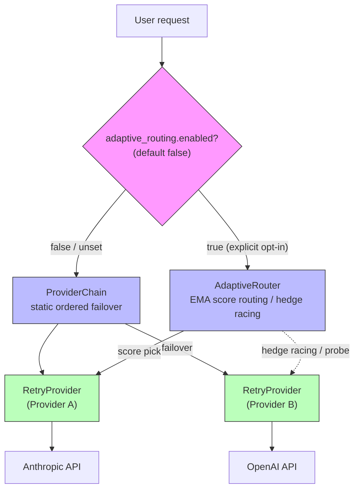
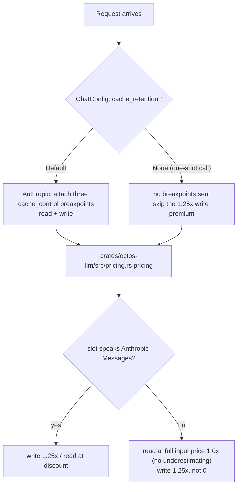

# Chapter 3: octos-llm: Taming the Chaos of LLM Providers

> **Positioning**: This chapter digs into the octos-llm crate: how a Rust trait abstraction unifies the divergent interfaces of many LLM providers, and how a three-tier fault-tolerance capability set, assembled in two layers, delivers production-grade reliability. Prerequisite: Chapter 2. It is written for AI application developers who want to understand multi-provider architecture (reader C), and for Rust developers interested in trait objects, async fault tolerance, credential rotation, and tiered model routing (reader B).

Every LLM provider has its own API style: Anthropic carries the system message as a standalone field while OpenAI puts it inside the message array; Gemini's tool-call format shares nothing with the other two; Ollama runs locally yet reuses octos's OpenAI-compatible adapter. When you must support a handful of dedicated protocol implementations plus a batch of providers riding OpenAI / Anthropic compatibility layers, the chaos is unavoidable, unless you build the right abstraction at the right layer.

octos-llm's answer has three parts, bottom up: the `LlmProvider` trait at the bottom unifies the calling interface; a provider registry in the middle implements model-name auto-detection and factory creation; a fault-tolerance assembly at the top provides production-grade reliability: every provider is always wrapped in a RetryProvider, and the outer layer then picks one of two options by configuration: a ProviderChain (static ordered failover, the default) or an AdaptiveRouter (score-based routing, requires explicit opt-in, and replaces the chain rather than stacking on it). The current main branch also folds provider metadata, HTTP timeout knobs, a credential pool, a content classifier, and the `routing.decision` event into this chain. This chapter walks the stack bottom up.

---

## 3.1 The LlmProvider trait: a minimal unified interface

### 3.1.1 The trait signature

`LlmProvider` is defined at `crates/octos-llm/src/provider.rs:16-121`:

```rust
#[async_trait]
pub trait LlmProvider: Send + Sync {
    // 核心方法：非流式对话
    async fn chat(
        &self,
        messages: &[Message],
        tools: &[ToolSpec],
        config: &ChatConfig,
    ) -> Result<ChatResponse>;

    // 流式对话（默认实现：调 chat() 后合成事件流）
    async fn chat_stream(
        &self,
        messages: &[Message],
        tools: &[ToolSpec],
        config: &ChatConfig,
    ) -> Result<ChatStream> { /* Text→ToolCall→Usage→Done 依次产出 */ }

    // 元数据查询
    fn context_window(&self) -> u32 { context::context_window_tokens(self.model_id()) }

    // 异步初始化钩子：见下文
    async fn ensure_ready(&self) {}

    fn max_output_tokens(&self) -> u32 { context::max_output_tokens(self.model_id()) }

    // #2143 part 3：估算本 provider 实际发出的请求 token 数（含序列化开销）
    fn estimate_request_tokens(
        &self,
        messages: &[Message],
        tools: &[crate::types::ToolSpec],
    ) -> u32 { /* 默认走基线估算，具体 provider 可收紧 */ }

    fn model_id(&self) -> &str;
    fn provider_name(&self) -> &str;
    fn provider_metadata(&self) -> ProviderMetadata;
    fn provider_metadata_for_index(&self, _provider_index: Option<usize>) -> ProviderMetadata;

    // 可选：指标上报
    fn export_metrics(&self) -> Option<serde_json::Value> { None }
    fn report_late_failure(&self) {}
    fn report_stream_metrics(&self, _output_tokens: u32, _stream_duration_us: u64) {}
}
```

The design follows a "minimal necessary interface" principle (the comment at `crates/octos-llm/src/provider.rs:13` says so explicitly): define only what every provider shares, and handle the differences in each implementation.

Several design choices deserve attention:

*The `Send + Sync` bound.* The trait requires implementors to be thread-safe, because provider instances are shared across async tasks through `Arc`. The constraint turns "a single-threaded provider accidentally used from many threads" into a compile-time error instead of a runtime one.

*The default `chat_stream()` implementation.* Not every provider supports streaming natively. The default (`crates/octos-llm/src/provider.rs:27-56`) calls the non-streaming `chat()`, then wraps the complete response as a synthetic stream that emits content, tool-call, usage, and done events one after another. A new provider that implements only `chat()` works from day one; native streaming can be added later.

*Provider metadata.* `provider_metadata()` and `provider_metadata_for_index()` are important additions on the current main branch (`crates/octos-llm/src/provider.rs:97-109`). They hand the actually-hit provider slot, model ID, and provider name up to callers, feeding observability, cost attribution, and precise per-slot metrics in multi-provider chains. `provider_metadata_for_index()` solves the composite-provider problem: when a `ProviderChain` internally picks its Nth slot, upper layers must not see only the chain's own name; they need to know which backend actually served the call. The signature is now `_provider_index: Option<usize>` (line 103): pass `Some(idx)` when you know the concrete slot, `None` when you only hold the provider object, so simple callers never have to fabricate an index.

*The metrics-reporting methods.* `export_metrics()`, `report_late_failure()`, and `report_stream_metrics()` all ship empty default implementations. They feed the AdaptiveRouter's EMA scoring system (see Section 3.3.3) without forcing every provider to implement them. This "optional hook" pattern keeps the trait from bloating.

*`ensure_ready()` and `estimate_request_tokens()`.* Two recent members of the baseline. `ensure_ready()` (`crates/octos-llm/src/provider.rs:65`) is an async initialization hook: the agent loop and the prompt-context bridge await it before the first window-dependent decision of each turn, so local context probing (see Section 3.7) can guarantee the real window resolves before the first compaction decision rather than after the first chat; wrappers delegate layer by layer. `estimate_request_tokens()` (`crates/octos-llm/src/provider.rs:82-89`, #2143 part 3) estimates the token count of the request this provider actually builds, including provider-specific serialization overhead (a separate system block, per-message content-block framing, cache-control metadata); with it, routing-admission guards no longer need a 12.5% safety margin standing in for that overhead. The default is a provider-agnostic baseline estimate; concrete providers override it to tighten, and wrappers again delegate to the inner layer.

### 3.1.2 Core data types

`ChatConfig` (`crates/octos-llm/src/config.rs:8-70`) holds every tunable of a single request:

- `max_tokens`: maximum output tokens
- `temperature`: sampling temperature (on the Anthropic protocol path, `Some(0.0)` counts as unset and stays off the wire)
- `tool_choice`: tool selection policy (auto/required/none/a named tool)
- `stop_sequences`: stop sequences
- `reasoning_effort`: reasoning effort for thinking models (none/low/medium/high/max, mapped to OpenAI reasoning.effort, the Anthropic thinking budget, and Gemini thinkingConfig)
- `response_format`: response format constraint (text/JSON/structured output)
- `context_management`: an Anthropic-specific opaque payload (such as `clear_tool_uses_20250919`) that lets the server do tier-2 tool-call cleanup; other providers ignore it
- `sampling_params`: an operator-supplied passthrough table of extra sampling parameters (mechanism below)
- `cache_retention`: the per-request prompt-cache retention preference (`None` means do not write cache this time; mechanism in Section 3.6)

The list deliberately omits two fields that look inevitable, `model` and `system_prompt`: the model is decided at provider construction time by the registry factory (see Section 3.2.3), and the system prompt travels through the `messages` array (exactly the protocol divergence this chapter opened with). The full mechanics of `sampling_params` and `cache_retention` unfold below in this section and in Section 3.6.

`ChatResponse` carries everything the LLM returned: content, stop reason, tool-call requests, token usage. `ChatStream` is an async stream (`Pin<Box<dyn Stream<Item = Result<StreamEvent>>>>`) that yields the streaming response event by event.

`sampling_params` (`crates/octos-llm/src/config.rs:44-57`) carries sampling parameters octos does not model, for example `{"repeat_penalty": 1.1, "top_p": 0.95}`. The OpenAI-compatible layer flattens them into the request body (`crates/octos-llm/src/openai.rs:635-640`, field docs at 908-909, tests at 1614-1616) and defensively strips keys that collide with fields octos already dedicates (#2172), so the streaming and non-streaming serialization paths cannot produce duplicated or diverged fields. The default is empty: flattening adds nothing, and cloud requests are unchanged. This cloud-safe sampler passthrough landed in commit b0072e70 (#2172/#2176) to serve local inference servers such as llama.cpp / vLLM / SGLang that accept non-standard sampling parameters.

The context window no longer has the static catalog as its only source. Commit 3e479ce3 (#2142) introduced per-profile `context_window` overrides, and the footprint spans two crates: the config struct `LlmModelSelectionConfig` (`crates/octos-cli/src/profiles.rs:824-875`, the field at 875), the `config.llm`-side fields (`crates/octos-cli/src/config.rs:39-46`, 489-492), and the assembly function `apply_context_window_override` (`crates/octos-cli/src/qos_catalog.rs:24-36`) all live in octos-cli; octos-llm only contributes the thin `ContextWindowOverride` wrapper in `crates/octos-llm/src/context_override.rs` (135 lines). It is stacked outermost on the wrapper stack, and its value overrides both the static catalog and runtime probing (#2135). The wiring of `config.llm.primary.context_window` / `fallbacks[i].context_window` in profiles lives mainly in octos-cli, not inside octos-llm; cite that cross-crate footprint as it is.

Provider factories also receive the LLM HTTP timeout knobs. `CreateParams::http_timeout()` (`crates/octos-llm/src/registry/mod.rs:110-118`) combines the two optional fields `llm_timeout_secs` and `llm_connect_timeout_secs` into an `Option<(u64, u64)>`: when either field is present, the missing one is filled from default constants; when both are absent it returns `None`. The constants live at `crates/octos-llm/src/provider.rs:158-172`: total LLM timeout 300 seconds, connect timeout 10 seconds (lowered from 30, so an unreachable endpoint fails over fast), streaming read-idle timeout 300 seconds (`DEFAULT_LLM_STREAM_IDLE_TIMEOUT_SECS`, line 165, applied through reqwest's `.read_timeout()`, reset on every read so a long stream that keeps producing tokens is never cut down by the total budget), embedding timeout 60 seconds, embedding connect timeout 15 seconds. Slow model inference and dead network connections are thus configured separately instead of piling into one unexplainable knob.

---

## 3.2 The provider registry: model-name auto-detection

When a user configures `model: "claude-sonnet-4"`, octos must work out on its own that this means the Anthropic provider. The mapping lives in the provider registry (`crates/octos-llm/src/registry/mod.rs`).

### 3.2.1 How detection works

Each provider registers its name, aliases, API-key environment variables (including aliases), default base URL, requirements, detection patterns, model-discovery capability, and a factory function (`crates/octos-llm/src/registry/mod.rs:121-167`, the `ProviderEntry` struct):

```rust
struct ProviderEntry {
    name: &'static str,
    aliases: &'static [&'static str],
    api_key_env: Option<&'static str>,
    key_env_aliases: &'static [&'static str],
    default_base_url: Option<&'static str>,
    requires_api_key: bool,
    requires_base_url: bool,
    requires_model: bool,
    detect_patterns: &'static [&'static str],
    model_discovery: ModelDiscovery,
    create: CreateFn,
}
```

`detect_provider()` (`crates/octos-llm/src/registry/mod.rs:244-260`) walks all providers in priority order and checks whether the model name contains a detection pattern. Two structural points stand out. `default_model` is no longer a static string on each entry; it is built from the rows marked `"default": true` in `model_catalog.json` into a family-to-default-model map (`crates/octos-llm/src/registry/mod.rs:24-65`). The `model_discovery` field declares the family's model-listing capability (a protocol, or "manual entry") and is resolved at runtime by `resolve_model_discovery(family, api_type)` at `crates/octos-llm/src/discovery.rs:134`: `api_type: "anthropic"` maps straight to the Anthropic Messages strategy, known families consult the registry declaration, and unknown or custom families fall back to the OpenAI-compatible strategy; the protocol is never inferred from a family literal alone.

| Provider | Detection pattern | Example matches |
|----------|---------|---------|
| Anthropic | `"claude"` | claude-sonnet-4, claude-haiku-4-5 |
| OpenAI | `"gpt"`, plus `o1`/`o3`/`o4` prefixes | gpt-4o, o4-mini |
| Gemini | `"gemini"` | gemini-2.5-flash, gemini-2.5-pro |
| DeepSeek | `"deepseek"` | deepseek-chat, deepseek-coder |
| Groq | `"llama"`, `"mixtral"` | llama-3.3-70b-versatile, mixtral-8x7b |
| Moonshot | `"kimi"`, `"moonshot"` | kimi-k2.5 |
| Dashscope | `"qwen"` | qwen-max |
| Minimax | `"minimax"` | MiniMax-Text-01 |
| Zhipu | `"glm"` | glm-4-plus |

Special case: the O-series. OpenAI's o1, o3, and o4 families need prefix matching rather than substring matching (`crates/octos-llm/src/registry/mod.rs:248-250`), because "o1" as a substring could match another provider's model name (imagine a model called `ro1and`).

One more point that is easy to misread: some providers ship an empty `detect_patterns` list. That is not an omission; it is a deliberate requirement that users reach them through an explicit provider name or alias. Typical examples: Vertex, R9s, OpenRouter, Z.AI, the two coding-plan families, NVIDIA, Ollama, vLLM, and local. Their model names tend to be cross-platform relay names, OpenAI-compatible names, or user-chosen local names, and blind substring detection would route them incorrectly. The coding-plan families (moonshot-coding, zai-coding) register ahead of the base families, so an explicit name resolves the coding endpoint before the plain one, and a coding-plan key is never silently sent to an endpoint that would reject it.

### 3.2.2 The full provider registry

octos currently registers 19 provider families (counted as the entries of `static ALL` in `crates/octos-llm/src/registry/mod.rs`, lines 186-210; the registry/ directory holds 20 files, which is 19 family modules plus crates/octos-llm/src/registry/mod.rs itself); array order is detection priority:

| # | family | protocol | aliases (examples) | detection patterns | default model (from catalog) |
|---|---------|------|------|---------|---------|
| 1 | anthropic | native | - | `claude` | claude-sonnet-4-20250514 |
| 2 | openai | native | - | `gpt`, `o1`/`o3`/`o4` prefixes | gpt-4o |
| 3 | gemini | native | `google` | `gemini` | gemini-2.5-flash |
| 4 | vertex | native (Gemini via Vertex SA) | `vertex-ai` | - | gemini-2.5-flash |
| 5 | r9s | OpenAI/Anthropic compatible | `r9s.ai` | - | claude-sonnet-4-6 |
| 6 | openrouter | OpenAI-compatible meta-router | - | - | anthropic/claude-sonnet-4-6 |
| 7 | deepseek | OpenAI-compatible | - | `deepseek` | deepseek-v4-flash |
| 8 | groq | OpenAI-compatible | - | `llama`, `mixtral` | llama-3.3-70b-versatile |
| 9 | moonshot-coding | OpenAI-compatible (coding endpoint) | `kimi-coding` | - | k3 |
| 10 | moonshot | OpenAI-compatible | `kimi` | `kimi`, `moonshot` | kimi-k2.5 |
| 11 | dashscope | OpenAI-compatible | `qwen` | `qwen` | qwen-max |
| 12 | minimax | OpenAI-compatible | - | `minimax` | MiniMax-M3 |
| 13 | zai-coding | Anthropic-compatible (coding endpoint) | `glm-coding` | - | glm-5.3 |
| 14 | zhipu | OpenAI-compatible | `glm` | `glm` | glm-4-plus |
| 15 | zai | Anthropic-compatible | `z.ai` | - | glm-5-turbo |
| 16 | nvidia | OpenAI-compatible | `nim` | - | meta/llama-3.3-70b-instruct |
| 17 | ollama | OpenAI-compatible | - | - | llama3.2 |
| 18 | vllm | OpenAI-compatible | - | - | user must supply a model explicitly |
| 19 | local | OpenAI-compatible | `llamacpp`, `lmstudio`, `openai-compatible`, etc. | - | local-default (placeholder) |

Compared with the old draft's 15, four families are new: vertex (Gemini on Vertex AI, credentials through the service-account JSON environment variable `VERTEX_SA_JSON`, no default base URL, model listing marked Unsupported), moonshot-coding / zai-coding (two coding-plan endpoints, matched only by explicit name, see above), and local (local servers such as llama.cpp / LM Studio, the most aliases, keyless by default, falls back to the placeholder `local-default` instead of erroring when no model is given, real window via runtime probing, see Section 3.7).

Anthropic, OpenAI, and Gemini use dedicated implementations; most other entries ride compatibility layers: Ollama, vLLM, OpenRouter, DeepSeek, and local reuse `OpenAIProvider`, Z.AI reuses the Anthropic Messages API, and R9s switches between the two protocols by model family. An `enum Provider` existed in historical drafts and no longer does. Registration is "add one file, add one line to `ALL`" (the module comment at `crates/octos-llm/src/registry/mod.rs:2-4`); each submodule exports `pub const ENTRY: ProviderEntry` and a `create()` factory. This architecture of a few dedicated implementations plus many compatible adapters keeps the cost of onboarding a new provider very low.

### 3.2.3 Provider factories

Once a provider is detected, the registry instantiates it through its factory function. Each factory reads the environment variables (`ANTHROPIC_API_KEY`, `OPENAI_API_KEY`, and so on) or credentials from the config file, and builds an HTTP client with the right base URL and auth headers.

The factory returns `Arc<dyn LlmProvider>`, and that is the dynamic-dispatch pivot. The registry does not know (and does not need to know) the concrete provider type, only that it implements the `LlmProvider` trait. Upper layers can then treat every provider uniformly, including dropping them into a fault-tolerance chain.

---

## 3.3 The fault-tolerance chain: three capability tiers, two assembly options

In production, LLM API calls fail for many reasons: rate limits (429), server overload (503/529), expired credentials (401), network timeouts. octos-llm splits tolerance into three capability tiers assembled in two layers: RetryProvider absorbs the transient failures of a single provider and is the always-present base of every slot; around it, the assembly layer picks one of two: ProviderChain for static ordered failover (the default assembly), or AdaptiveRouter for score-based routing (`adaptive_routing.enabled`, explicit opt-in, replacing the chain rather than stacking on it). The production assembly point is `crates/octos-cli/src/qos_catalog.rs:305-352`.



Figure 3-1: assembly of the fault-tolerance chain. Every element of the providers vector is already a RetryProvider-wrapped slot; the outer layer branches on `adaptive_routing.enabled`: the default falls back to the static ProviderChain, an explicit opt-in swaps in the AdaptiveRouter (replacement, not stacking). The circuit breakers are two independent sets: ProviderChain uses `ProviderSlot.failures` (crates/octos-llm/src/failover.rs), while AdaptiveRouter runs its own per-slot circuit breaker (around crates/octos-llm/src/adaptive.rs:1036).

The assembly-point facts: `crates/octos-cli/src/qos_catalog.rs:305-352` is the only fork; `crates/octos-cli/src/commands/gateway/profile_factory.rs:363,413`, `crates/octos-cli/src/commands/chat.rs:1210`, and `crates/octos-cli/src/tools/switch_model.rs:289` all call `ProviderChain::new(vec![RetryProvider...])`; no path exists where an AdaptiveRouter embeds multiple ProviderChains.

### 3.3.1 The base: RetryProvider, exponential backoff wrapped around every provider

RetryProvider (`crates/octos-llm/src/retry.rs:41-312`) handles the transient failures of a single provider.

The backoff algorithm (`crates/octos-llm/src/retry.rs:259-265`):

```rust
fn calculate_delay(&self, attempt: u32) -> Duration {
    let delay = self.config.initial_delay.as_secs_f64()
        * self.config.backoff_multiplier.powi(attempt as i32);
    let delay = Duration::from_secs_f64(delay);
    std::cmp::min(delay, self.config.max_delay)
}
```

Defaults (`crates/octos-llm/src/retry.rs:28-37`): at most 3 retries, initial delay 1 second, backoff multiplier 2.0, max delay 60 seconds. The retry loop is `for attempt in 0..=max_retries` (`crates/octos-llm/src/retry.rs:322`, the streaming variant is isomorphic), and it computes a delay and sleeps only while retry budget remains (`attempt < max_retries`) and the error is retryable. So the default sequence actually sleeps 1s → 2s → 4s, three waits; the 4th failed attempt throws the error upward without sleeping. The `2^3 = 8s` step is unreachable in the loop, and the 60-second clamp is never touched by the default exponential sequence either: it matters only when an operator raises the backoff parameters, or a 429 parses a retry-after above 60 seconds.

Which errors are retryable? (`crates/octos-llm/src/retry.rs:107-147`)

| HTTP status | Meaning | Retry? | Triggers failover? |
|------------|------|---------|-----------------|
| 429 | rate limit | yes (parses retry-after) | yes |
| 500, 502, 503 | server error | yes | yes |
| 529 | overloaded | yes | yes |
| 401, 403 | auth error | no | yes (immediate failover) |
| 504 | gateway timeout | yes (server may recover) | yes |
| 408 | request timeout | case by case | yes |
| reqwest timeout | network timeout | no (no local retry) | yes (immediate failover) |
| 400 | bad request | depends on the message | in some cases |

Note the special handling of reqwest-level network timeouts (connect timeout, read timeout): they are not retried locally, because the same provider will most likely time out again; they trigger failover upward at once so the ProviderChain switches to another provider. HTTP 504 (Gateway Timeout) is treated as retryable, because the server may recover after a brief overload.

Rate-limit parsing (`crates/octos-llm/src/retry.rs:267-311`): on a 429 response, RetryProvider tries to parse the recommended wait out of the error message (for example "Please try again in 29.159s"), adds a 1-second buffer, and waits that long. If parsing fails, it falls back to a fixed 30-second wait.

### 3.3.2 Assembly option A: ProviderChain, static ordered failover (the default)

ProviderChain (`crates/octos-llm/src/failover.rs:36-249`) manages the failover order of a group of providers.

Circuit breaker design (`crates/octos-llm/src/failover.rs:27-30`):

```rust
struct ProviderSlot {
    provider: Arc<dyn LlmProvider>,
    failures: AtomicU32,  // 连续失败计数器
}
```

Each provider carries an atomic counter of consecutive failures. When the count reaches the threshold (default 3), the provider is marked degraded. A successful call resets the counter to 0 (`record_success` @ `crates/octos-llm/src/failover.rs:111-114`, the `swap(0)` on line 114).

Failover logic (`crates/octos-llm/src/failover.rs:85-99`):

1. Try the first provider that is not degraded.
2. If every provider is degraded, pick the one with the fewest failures.
3. Skip degraded providers, unless one of them is the last choice left.

Late-failure reporting (`crates/octos-llm/src/failover.rs:378`): `report_late_failure()` covers a subtle case: the provider returned a 200 response, but stream parsing afterwards found the content empty or malformed. The provider is then punished retroactively: its failure count goes up, and later requests prefer other providers.

### 3.3.3 Assembly option B: AdaptiveRouter, EMA scoring and hedge racing (explicit opt-in)

AdaptiveRouter (the struct at `crates/octos-llm/src/adaptive.rs:803`, with the inherent impl running to the end of the file at 2795) is the peer assembly option to ProviderChain: when opted in, it receives the same providers vector a chain would have received (each element already RetryProvider-wrapped) and does score-based routing over it, rather than stacking a layer outside a chain.

Three modes (`crates/octos-llm/src/adaptive.rs:619-631`):

- Off (0): static priority order + circuit breaker, simplest and most reliable
- Hedge (1): score-based selection + hedge racing
- Lane (2): score-based lane switching, cheaper than hedge

#### The EMA scoring system

AdaptiveRouter keeps a live score per provider. Under the default configuration the score is a weighted combination of four factors (`score()` @ `crates/octos-llm/src/adaptive.rs:1766`, weight config fields at 42-64); the config field still carries the name `weight_latency`, but the second factor is actually a composite of quality and throughput, and the source never uses raw latency:

| Factor | Weight | Meaning | Data source |
|------|------|------|---------|
| Stability (error_rate) | 30% | error rate | live stats blended with the catalog baseline |
| Quality/throughput (`weight_latency`) | 30% | output quality + runtime throughput | 60% deep-search token count + 40% throughput |
| Priority (priority) | 20% | config order | user config |
| Cost (cost) | 20% | price | model catalog |

The blend design (`crates/octos-llm/src/adaptive.rs:1582` and 1772, the EMA blend inside score): the stability factor blends the catalog baseline with live data. The blend weight grows with call count, `min(total_calls / 20.0, 0.5)`, so the catalog baseline always keeps at least 50% of the influence. This defuses the cold-start problem: a provider with only a handful of calls cannot be judged unreliable off one or two accidental failures.

Worth a warning here: `score()` deliberately uses `throughput` rather than raw latency as the runtime speed signal, because single-request latency tracks task complexity too closely to serve as a direct quality signal across providers.

#### Hedge racing

In Hedge mode, AdaptiveRouter fires requests at two providers at once and takes whichever answers first (`hedged_chat()` @ `crates/octos-llm/src/adaptive.rs:2150`, the `tokio::select!` race around ~2220):

```rust
// 简化后的逻辑
tokio::select! {
    result = primary_future => {
        // 主 Provider 先返回
        // 备选 Provider 的 future 被 drop（取消）
        result
    }
    result = alternate_future => {
        // 备选 Provider 先返回
        // 主 Provider 的 future 被 drop（取消）
        result
    }
}
```

The alternate provider is chosen cheapest-first (to cut the cost of redundancy) and must differ in name from the primary (no duplicate requests to the same API). The current implementation records runtime metrics only for requests that complete; a future dropped by the race does not reliably produce complete metrics, so hedge improves tail latency at the price of observability.

The price of hedge racing is double API cost: the losing request still burns tokens, because the provider has usually started processing even after cancellation. Hedge mode suits latency-sensitive, cost-insensitive workloads. Lane mode reaches similar routing quality through score ordering without sending redundant requests.

#### The probe policy

To keep score data fresh for backup providers, AdaptiveRouter sends probe requests to non-optimal providers with some probability (default 10%) (`should_probe()` @ `crates/octos-llm/src/adaptive.rs:2097`, staleness check `is_stale` @ 337, defaults 0.1/60s in the config struct at lines 42-44 and 62-63), refreshing their performance metrics. The probe interval defaults to 60 seconds, keeping probing cost down.

### 3.3.4 Credential pool and content classifier: from provider failover to key and tier routing

On the current main branch the fault-tolerance chain does more than switch between providers: it rotates among multiple credentials of the same provider and picks model tiers by content complexity.

*Credential pool.* The module comment of `crates/octos-llm/src/credential_pool.rs` states the goal plainly as "persistent cooldown / rotation state" (`crates/octos-llm/src/credential_pool.rs:1-29`). Every credential carries cooldown, rate-limit counts, reset time, last used, usage count, and reservation state; rotation strategies include `FillFirst`, `RoundRobin`, `Random`, and `LeastUsed` (`crates/octos-llm/src/credential_pool.rs:166-189`). When AdaptiveRouter sees a 401/403 or authentication text, it classifies the failure as an auth failure; a 429 or rate-limit text is classified as a rate-limit failure, and the credential pool is notified to enter cooldown or refresh (`notify_credential_failure()` @ `crates/octos-llm/src/adaptive.rs:1081`, error-side entry `notify_credential_failure_from_error` @ 2352). Rotations also emit a stable harness event with schema `octos.harness.event.v1` and kind `credential_rotation` (`crates/octos-llm/src/credential_pool.rs:213-245`).

*Content classifier.* `crates/octos-llm/src/content_classifier.rs` is an I/O-free heuristic classifier, off by default; disabled it returns `Strong`, so an unused policy never routes complex work to a cheap model by accident (`crates/octos-llm/src/content_classifier.rs:1-18`, `crates/octos-llm/src/content_classifier.rs:61-80`). Enabled, it maps code blocks, message length, strong-model keywords, and URL signals to a `Cheap` or `Strong` tier: code blocks, length over a threshold, or keywords such as debug/refactor/architecture/prove/proof/analyze/design raise the tier to Strong; a URL is recorded as a reason but never triggers Strong on its own (`crates/octos-llm/src/content_classifier.rs:158-209`). AdaptiveRouter can mount the classifier and emit a `routing.decision` harness event through a callback before lane selection (`RoutingDecisionCallback` @ `crates/octos-llm/src/adaptive.rs:801`, install entry `set_routing_decision_callback` @ 1414). The upper harness can then explain why a turn went to the strong model, instead of only seeing the final provider.

---

## 3.4 SSE stream parsing: a byte-safe stateful parser

Streaming LLM responses travel over Server-Sent Events (SSE). SSE looks simple (events separated by `\n\n`, each data line prefixed with `data:`), but production use brings several engineering problems.

### 3.4.1 Why a stateful parser is needed

The HTTP response body arrives in chunks of arbitrary size. One SSE event may span several chunks, and one chunk may carry several events. More subtly, a chunk boundary can land in the middle of a UTF-8 multi-byte character.

Consider this scenario:

```
Chunk 1: data: {"text": "任务完
Chunk 2: 成后请检查结果"}\n\n
```

The characters `U+5B8C` ("wán", complete) and `U+6210` ("chéng", done) cause no problem here (each is a complete UTF-8 character), but if the chunk boundary happens to fall inside the three bytes of `U+5B8C`:

```
Chunk 1: data: {"text": "任务\xe5\xae
Chunk 2: \x8c成后请检查结果"}\n\n
```

then the `\xe5\xae` at the end of Chunk 1 is the first two bytes of `U+5B8C` and not valid UTF-8. Running `String::from_utf8()` per chunk yields a parse error or a replacement character (U+FFFD).

### 3.4.2 octos's byte-safe parser

The octos-llm SSE parser (`crates/octos-llm/src/sse.rs:16-72`) buffers at the byte level:

1. Accumulate raw bytes: append each chunk's raw bytes to a `Vec<u8>` buffer, with no UTF-8 conversion.
2. Detect event boundaries: search the raw bytes for `\n\n` or `\r\n\r\n` separators.
3. Convert per event: only after a complete event is found, convert that event's byte slice into a UTF-8 string.
4. Keep the remainder: trailing bytes that have not formed a complete event stay in the buffer.

This design guarantees that UTF-8 conversion happens only on complete events: the SSE protocol guarantees that event boundaries never fall inside a UTF-8 character (because `\n` is a one-byte ASCII character).

The parser is built as an async stream with `stream::unfold()`, carrying its state (byte stream + buffer) between yielded events.

### 3.4.3 The 1MB buffer cap

Safety consideration: a hostile or broken LLM provider could send an endless response that never contains `\n\n`, growing the buffer without bound. `MAX_BUFFER_SIZE` (`crates/octos-llm/src/sse.rs:6-7`) is set to 1MB; past it, the parser emits an error event and clears the buffer.

```rust
const MAX_BUFFER_SIZE: usize = 1024 * 1024; // 1MB
```

1MB is generous headroom for a single SSE event. In a normal LLM streaming response, each event carries tens to a few hundred bytes (the JSON representation of one token).

### 3.4.4 The UTF-8 split test: why byte-level buffering is not optional

The tests in `crates/octos-llm/src/sse.rs` (`crates/octos-llm/src/sse.rs:261-281`) construct an exact multi-byte split:

```
"完成后" 的 UTF-8 编码：
完 = [E5 AE 8C]   (3 bytes)
成 = [E6 88 90]   (3 bytes)
后 = [E5 90 8E]   (3 bytes)

故意在"成"字中间切开：
Chunk 1: data: {"text": "完[E6 88          ← "成"的前 2 字节
Chunk 2: 90]后"}\n\n                       ← "成"的第 3 字节 + "后"
```

With per-chunk `String::from_utf8()`, the `[E6 88]` at the end of Chunk 1 is not valid UTF-8; it becomes `U+FFFD` (the replacement character), and the original character `U+6210` is lost permanently.

The byte-level buffering strategy avoids the loss: the raw bytes of both chunks are concatenated and converted as a whole at the `\n\n` boundary, so the three-character sequence `U+5B8C U+6210 U+540E` reassembles correctly.

The risk is not theoretical: when an LLM streams a Chinese reply, each SSE event usually carries 1-3 tokens. HTTP chunked transfer encoding can cut at any byte position, indifferent to token boundaries. For an agent platform serving Chinese, Japanese, and Korean users, byte-level buffering is a requirement, not an optimization.

---

## 3.5 The model catalog and cost tracking

ModelCatalog (`crates/octos-llm/src/catalog.rs:48-274`) keeps metadata for every known model:

```rust
pub struct ModelInfo {
    pub id: String,
    pub name: String,
    pub provider: String,
    pub context_window: u32,
    pub capabilities: ModelCapabilities,  // vision, tool_use, streaming, reasoning
    pub cost: ModelCost,                  // input/output/cache 每百万 token 价格
    pub aliases: Vec<String>,
}
```

The alias system: besides full model IDs (such as `claude-sonnet-4-20250514`), the catalog also resolves aliases (`sonnet` → `claude-sonnet-4-20250514`). Lookup order (`crates/octos-llm/src/catalog.rs:72-74`): exact ID match → alias match → None.

Cost tracking: `ModelCost` records per-million-token prices for three token types: input, output, and cache reads. AdaptiveRouter's scoring system uses this data for the cost factor (see Section 3.3.3), trading latency against cost.

---

## 3.6 The cost layer: cache economics

The fault-tolerance chain answers "can the call go through"; the cost layer answers "what does this call cost". Commit f3aa07f0 (#2194) brought prompt-cache writes and pricing into this chain, starting from an asymmetry: cache writes bill at 1.25x the input price, cache reads get a discount, and a call that never replays its prefix (a compaction summary, a sub-agent rollup) pays the write premium for a cache nobody will ever read.

*Cache-write opt-out for one-shot calls.* `ChatConfig::cache_retention` (`crates/octos-llm/src/config.rs:58-75`, the `CacheRetention` enum at 74-92) declares the cache retention preference for a single request: `None` means this call writes no cache. On the Anthropic protocol, the concrete action is to send no `cache_control` breakpoints at all, because every breakpoint both reads and writes, and a write nobody reads still bills at 1.25x. `Default` keeps the provider's configured caching behavior (Anthropic's three ephemeral breakpoints). The default value stays `Default`, and `skip_serializing_if` keeps it off the wire, so the persisted `ChatConfig` JSON shape is unchanged. The assembly point is build_request in `crates/octos-llm/src/anthropic.rs` (cache_control assembly at 179-207; the no-cache branch for one-shot requests near line 148).

*Cache-write-aware pricing.* The pricing layer (`crates/octos-llm/src/pricing.rs:149-195`) models the difference by the answering slot's protocol: only the Anthropic Messages protocol reports `cache_creation_input_tokens` (write, 1.25x) and `cache_read_input_tokens` (read, discount). The cache-read discount of the other protocols (openai, openrouter, deepseek, local, unknown) is unknowable: the only OpenAI row in the catalog has `cache_read_per_mtok` as None, the discount varies with model generation, and applying one provider-level discount would be invented data for some models. So reads price at the full input rate (1.0x, overestimate rather than underestimate) and writes at 1.25x rather than 0 (`cache_write_tokens` is filled only by the Anthropic parser).



Figure 3-2: the cache-economics decision flow. The config layer decides whether to write; the pricing layer decides how to bill.

---

## 3.7 Lanes and routing: schedulers outside the fault-tolerance chain

Beyond the fault-tolerance chain, the baseline carries a group of modules built around "who takes this call". They are not layers of one chain; they are schedulers hung on the provider per scenario.

`crates/octos-llm/src/lane.rs` (per-topic model lanes, RFC-3 / #1292). Routes requests by conversation topic (such as `slides:*`, `code:*`, `research:*`) to different model tiers, so "make slides" and "write core code" need not share one primary/fallback pair.

`crates/octos-cli/src/api/router.rs` (provider routing for multi-model sub-agents). Dispatches LLM calls by a prefix scheme: sub-agents declare their model needs through prefixes, the router picks the matching backend, and the parent agent and sub-agents can use different models in parallel within one session.

`crates/octos-llm/src/call_policy.rs` (per-turn call policy). Voice turns wrap the agent run in `with_llm_call_policy(FailFast, ..)`: every provider wrapper and leaf provider short-circuits retry, failover, and hedge; low latency first. The policy is a per-turn task-level input, not a global switch.

`crates/octos-llm/src/throttle.rs` (semaphore throttling). Caps a provider's concurrent calls with a semaphore, protecting endpoints with strict concurrency quotas (spread across the pool when multiple credentials are configured). It governs "how many at once", orthogonal to the registry's "which one".

`crates/octos-llm/src/credential_pool.rs` (credential pool, M6.5). See Section 3.3.4: multi-credential rotation plus persistent cooldown, driven by 429/auth failures.

`crates/octos-llm/src/local_context_probe.rs` (local window probing, #2135). Introduced in commit 10022387. In the catalog, the window numbers of the local / ollama / vllm families are conservative guesses made at registration time (about 32K), because at registration nobody knows which engine the operator has started. The probe (a 1300-line module, `new` @ 201, `new_ollama` @ 226) asks the server for the real window in the background: OpenAI-compatible endpoints use the two URLs props and models, and native Ollama uses `GET /api/ps` (the allocated window of the running model, no key needed). The result resolves through the trait's `ensure_ready()` hook (`crates/octos-llm/src/provider.rs:65`) before the first compaction decision, so `context_window()` stops being a pure static lookup. To override the probed value, use the per-profile `context_window` override from Section 3.1.2 (operator override > probe > catalog).

---

> ### Engineering decision: `Arc<dyn Trait>` vs generics vs enum dispatch
>
> octos-llm leans on `Arc<dyn LlmProvider>` throughout the provider abstraction layer. The choice deserves a comparison with the two alternatives.
>
> Option one: generics (`impl LlmProvider` / `T: LlmProvider`)
>
> Strengths:
> - Zero runtime overhead: the compiler emits specialized code at every call site (monomorphization)
> - Method calls can be inlined
>
> Weaknesses:
> - Wrappers such as RetryProvider and ProviderChain would infect everything with generic parameters: `RetryProvider<T: LlmProvider>`
> - Fault-tolerance combinations would explode into types: `AdaptiveRouter<ProviderChain<RetryProvider<AnthropicProvider>>, ProviderChain<RetryProvider<OpenAIProvider>>>`
> - No runtime provider selection from user configuration (generics fix the concrete type at compile time)
>
> Option two: enum dispatch (`enum Provider { Anthropic(...), OpenAI(...), ... }`)
>
> Strengths:
> - All variants known at compile time, so branch prediction is friendlier
> - No vtable indirection
>
> Weaknesses:
> - Every new provider edits the enum definition and every match expression
> - With 19 provider families, the match blocks get huge
> - No user-defined providers (short of a `Custom` variant that degenerates back into a trait object)
>
> octos's choice: `Arc<dyn LlmProvider>`, for the following reasons.
>
> In an AI agent, the network latency of an LLM call (100ms-10s) dwarfs the cost of a vtable indirection (<1ns). The performance price of dynamic dispatch is negligible here.
>
> Composition matters more. The octos fault-tolerance chain is nested decoration: RetryProvider wraps any provider, ProviderChain manages a group of them, AdaptiveRouter routes across chains. `Arc<dyn LlmProvider>` lets these wrappers combine freely, unconstrained by generic parameters.
>
> And the provider lineup is only known at runtime: users specify which providers to use in config files, and the registry factory creates the instances dynamically. Runtime polymorphism of this kind is exactly what trait objects are for.

---

## 3.8 Chapter recap

octos-llm resolves the core challenges of LLM provider integration:

1. The LlmProvider trait: a minimal unified interface with the `chat()` + `chat_stream()` two-method design, and the `Send + Sync` bound for thread safety. Provider metadata lets upper layers see the actually-hit provider slot instead of only the composite wrapper.

2. The provider registry: model-name substring matching auto-detects the provider, and the factory pattern dynamically creates `Arc<dyn LlmProvider>` instances. O-series models get prefix matching, and providers whose `detect_patterns` are empty (R9s, OpenRouter, Z.AI, NVIDIA, Ollama, vLLM) are deliberately left to explicit provider / alias selection.

3. The fault-tolerance chain (three capability tiers, two assembly options):
   - RetryProvider: exponential backoff (1s→2s→4s), with smart parsing of retry-after in 429 responses
   - ProviderChain: ordered failover + circuit breaker (degraded after 3 consecutive failures), the default assembly
   - AdaptiveRouter: four-factor EMA scoring (stability 30% + quality/throughput 30% + priority 20% + cost 20%) + hedge racing + the probe policy; requires explicit opt-in and replaces the chain rather than stacking on it

4. Credential pool and content classifier: 429/auth failures enter the credential cooldown / refresh path; the content classifier emits the `routing.decision` event, exposing the Cheap/Strong tier choice to the harness.

5. The cost layer and schedulers: cache economics (`cache_retention` opt-out + cache-write-aware pricing) turns "write the cache or not" into an explicit decision; the six schedulers lane / router / call_policy / throttle / credential_pool / local_context_probe hang off the fault-tolerance chain per scenario.

6. SSE stream parsing: byte-level buffering avoids UTF-8 splitting, the 1MB cap prevents memory exhaustion, and `stream::unfold()` builds the stateful async stream.

7. The `Arc<dyn Trait>` choice: network latency dwarfs the vtable cost, and the composition and runtime flexibility that dynamic dispatch buys are worth far more than it costs.

The next chapter moves into octos-memory: how hybrid search (BM25 + HNSW vector index) gives an agent long-term memory (see Chapter 4).

---

## Further reading

- The async-trait crate: https://docs.rs/async-trait/latest/async_trait/ — how the `#[async_trait]` macro compiles async methods into a trait-object-compatible form
- The SSE protocol specification: the "Server-Sent Events" section of the HTML Living Standard, https://html.spec.whatwg.org/multipage/server-sent-events.html
- Exponential backoff: Google Cloud's "Truncated exponential backoff" documentation, https://cloud.google.com/storage/docs/exponential-backoff
- The Circuit Breaker pattern: Martin Fowler, "CircuitBreaker", https://martinfowler.com/bliki/CircuitBreaker.html
- Dynamic dispatch in Rust: *The Rust Programming Language*, Chapter 17, "Using Trait Objects That Allow for Values of Different Types"

## Exercises

1. Fault-tolerance layering: in octos's fault-tolerance assembly, what would happen if RetryProvider's retry duty were merged into ProviderChain (the chain managing bare providers directly and doing its own backoff)? What does the separation buy?

2. The cost model of hedge racing: suppose you have two providers: Provider A at $10/M tokens with 500ms average latency; Provider B at $3/M tokens with 1500ms average latency. Under what conditions is enabling hedge racing worth it?

3. SSE parser alternatives: what goes wrong if you process each chunk with `String::from_utf8_lossy()` instead of byte-level buffering? In which scenarios do those problems become observable?

4. The generics vs trait-object boundary: if octos only needed to support 3 providers (Anthropic, OpenAI, Gemini), would enum dispatch be the better choice? At how many providers does dynamic dispatch start to win?

---

> **Version note**: This chapter is based on `../octos` main @ 9c157101 (2026-09-02). Revision highlights: (1) the registry was re-listed from 15 providers to 19 provider families (adding vertex, moonshot-coding, zai-coding, and local), and the registration story was rewritten around the registry/ directory plus the model-discovery protocol at `crates/octos-llm/src/discovery.rs:134`; `enum Provider` no longer appears; (2) the trait gained `ensure_ready()` and `estimate_request_tokens()`, and the `provider_metadata_for_index` signature changed to `Option<usize>`; (3) the timeout story now covers `CreateParams::http_timeout()` and `DEFAULT_LLM_STREAM_IDLE_TIMEOUT_SECS`; (4) new Section 3.6 "the cost layer" (cache economics, commit f3aa07f0) and Section 3.7 "lanes and routing" (six scheduler modules and the 10022387 local window probe); (5) sampler passthrough (b0072e70) and the per-profile context_window override (3e479ce3, wiring mainly in octos-cli) were recorded in 3.1.2; (6) every reference was re-anchored line by line to 9c157101 (crates/octos-llm/src/adaptive.rs has grown to 2795 lines; crates/octos-llm/src/catalog.rs was corrected to 274 lines; see assets/ch03-refcheck.md). The provider registry and scoring weights may keep changing. This round of fixes (adjudicated items from the C2 report assets/ch03-techreview.md): (7) the fault-tolerance story was rewritten as three capability tiers and two assembly options (the mermaid diagram became a two-way branch; AdaptiveRouter replaces the ProviderChain in place rather than nesting over it); (8) the ChatConfig field list was re-derived from crates/octos-llm/src/config.rs:8-70 (dropping the nonexistent model/system_prompt, adding stop_sequences, reasoning_effort, context_management); (9) the backoff sequence was corrected to 1s → 2s → 4s (the 8s step and the 60s clamp are unreachable under the default sequence); (10) the chapter recap was renumbered from a duplicated 3.6 to 3.8. The three-tier progression of fault tolerance remains the main thread for understanding octos-llm.
