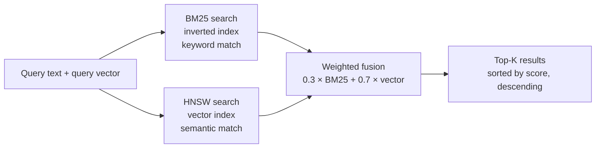

# Chapter 4: octos-memory: An Engineer's Hybrid Search

> **Positioning**: This chapter digs into the octos-memory crate (6,428 lines by `wc -l`, six source files, tests included) and shows how pure Rust builds an embedded BM25 + HNSW hybrid search engine that gives an agent long-term memory. Prerequisite: Chapter 2. It is written for AI application developers who want to understand what RAG (retrieval-augmented generation) looks like at the implementation level (reader C), and for Rust developers interested in embedded databases and search algorithms (reader B).

One of the real differences between an AI agent and a chatbot is memory. To a chatbot, every conversation is independent: the code it wrote for you last time, the decisions it made, the pitfalls it hit, all forgotten by the next turn. An agent needs memory to accumulate experience. What code style does this user prefer? Which files in this repository changed recently? What strategy worked three days ago on a bug like this one?

octos-memory implements that memory system in 6,428 lines (`wc -l`, tests and comments included). It depends on no external service: no Qdrant, no Milvus, no PostgreSQL. One redb embedded database file plus an in-memory hybrid search index is the whole system. This chapter starts at the storage layer and works up through BM25 full-text search, the HNSW vector index, and the engineering of hybrid rank fusion.

---

## 4.1 Storage choice: the redb embedded database

### 4.1.1 Why redb

octos-memory's persistence layer uses redb (`crates/octos-memory/src/store.rs`), an embedded key-value database written in pure Rust. The most obvious alternative was SQLite: the Rust ecosystem has mature `rusqlite` bindings.

In octos's context, redb's advantages over SQLite are clear-cut:

Zero C dependency. SQLite is C; `rusqlite` means compiling C code or linking a system library. That clashes with the workspace-wide `deny(unsafe_code)` policy in octos: SQLite's C code is excellent, but it sits outside the Rust compiler's safety checks. redb is pure Rust and fully inside the `deny(unsafe_code)` perimeter.

ACID transactions. redb provides full ACID transactions (with read and write transactions separated), which covers everything episode storage needs from persistence. octos has no need for SQL queries; all search happens on the in-memory hybrid index.

Single-file deployment. A redb database is one file (`episodes.redb`), with no extra WAL or SHM files. Deployment and backup stay simple.

### 4.1.2 Three tables

The Episode Store defines three tables in redb (`crates/octos-memory/src/store.rs:14-20`):

| Table | Key type | Value type | Purpose |
|------|---------|-----------|------|
| `EPISODES_TABLE` | `&str` (episode_id) | `&str` (JSON) | Episode metadata |
| `CWD_INDEX_TABLE` | `&str` (working directory path) | `&str` (JSON array) | Directory → episode index |
| `EMBEDDINGS_TABLE` | `&str` (episode_id) | `&[u8]` (bincode) | Vector embeddings |

The design stores episode data and vector embeddings separately. The payoff: when vector search is not needed (say the embedding provider is unavailable), reading and writing episodes is unaffected. Embeddings are serialized with `bincode` (far more compact than JSON), which cuts storage and I/O overhead.

`CWD_INDEX_TABLE` is an auxiliary index that groups episode IDs by working directory. When the agent works inside a project directory, episodes from that directory are searched first, which improves relevance.

---

## 4.2 The Episode: an agent's record of experience

### 4.2.1 The Episode struct

An Episode is the experience summary an agent produces after finishing a task (`crates/octos-memory/src/episode.rs:32-59`; the struct is preceded by the `EpisodeSource` enum, `crates/octos-memory/src/episode.rs:26-31`, which distinguishes task summaries from session-compaction summaries; `#[serde(default)]` keeps old data deserializing as-is):

```rust
pub struct Episode {
    pub schema_version: u32,     // data format version
    pub id: String,              // UUID v7
    pub task_id: TaskId,
    pub agent_id: AgentId,
    pub working_dir: PathBuf,    // directory the task ran in
    pub summary: String,         // task summary
    pub outcome: EpisodeOutcome, // result
    pub source: EpisodeSource,   // producer: task or session compaction
    pub key_decisions: Vec<String>,  // key decisions taken
    pub files_modified: Vec<PathBuf>,
    pub created_at: DateTime<Utc>,
}
```

EpisodeOutcome (`crates/octos-memory/src/episode.rs:86-98`) defines the four outcomes the memory layer can express: `Success`, `Failure`, `Blocked`, `Cancelled`. These resemble the terminal states of a Task in meaning, but you cannot infer from them that "the system necessarily writes every terminal state as an Episode"; whether anything lands in the store depends on the calling code. The current main agent loop in fact only writes `Success` episodes.

The `schema_version` field (`crates/octos-memory/src/episode.rs:36`, with `#[serde(default)]` at 35) is what makes the format forward-compatible. When the Episode format needs an upgrade (a new field, say), older data still parses correctly through the version number. The default is `1` (`crates/octos-memory/src/episode.rs:16-18`, the constant at 14); if the JSON lacks this field at deserialization, the default fills in.

### 4.2.2 When episodes are written

On the current main agent path, an Episode is created and stored only when an LLM response ends normally with `StopReason::EndTurn` or `StopSequence` and `save_episodes` is on (`crates/octos-agent/src/agent/loop_runner.rs:2457-2504`, the EndTurn arm starts at 2,457, the write block spans 2,474-2,504; the persistence logic lives at `crates/octos-memory/src/store.rs:371-423`). The write does three things:

1. Serialize the Episode to JSON and store it in `EPISODES_TABLE`
2. Update `CWD_INDEX_TABLE`, appending the episode ID to the list for its working directory
3. Update the in-memory hybrid search index (the text side)

Vectors are not written synchronously inside `store()`. The current implementation splits episode text and embedding into two phases: `store()` writes the JSON and the BM25 index first; `store_embedding()` later writes the `Vec<f32>` into `EMBEDDINGS_TABLE` with bincode and calls `HybridIndex::add_embedding()` to attach an HNSW vector to the existing document. An episode landing in the store therefore does not depend on the embedding provider being up.

At startup, `EpisodeStore::open()` scans `EPISODES_TABLE` and `EMBEDDINGS_TABLE` and rebuilds the in-memory `HybridIndex`. redb is the only persistent source; both the HNSW and the inverted index are rebuildable caches.

Corruption recovery (`crates/octos-memory/src/store.rs:84-111`): values in `CWD_INDEX_TABLE` are JSON arrays (`["id1", "id2", ...]`). If a previous write was interrupted by a crash, the JSON may be damaged. Rather than dropping the whole index, the code salvages episode IDs from the broken JSON by splitting on quotes. This defensiveness keeps index data alive even after an abnormal shutdown.

The deletion path (`crates/octos-memory/src/store.rs:757-825`): `delete_by_id()` removes the record from `EPISODES_TABLE`, `CWD_INDEX_TABLE`, and `EMBEDDINGS_TABLE`; on the in-memory side it calls `HybridIndex::remove()` (`crates/octos-memory/src/hybrid_search.rs:358-365`), which does not renumber HNSW's internal doc index but blanks `ids[pos]` as a tombstone, and search filters blank IDs out. This is a textbook ANN engineering trade: deletion is fast and the index stays stable, at the cost of rebuilding the index eventually to sweep tombstones.

---

## 4.3 BM25 full-text search

BM25 (Best Matching 25) is among the most established ranking algorithms in information retrieval. octos-memory keeps an inverted index in memory to run BM25 search (`crates/octos-memory/src/hybrid_search.rs`).

### 4.3.1 The inverted index structure

```rust
// crates/octos-memory/src/hybrid_search.rs:8-39 (simplified)
struct HybridIndex {
    inverted: HashMap<String, Vec<(usize, u32)>>,  // term → [(doc ID, term frequency)]
    doc_lengths: Vec<usize>,                         // length of each document
    total_len: usize,                                // sum of all document lengths
    avg_dl: f64,                                     // average document length
    ids: Vec<String>,                                // list of Episode IDs
    hnsw: Option<Hnsw<'static, f32, DistCosine>>,    // vector index (None without embeddings)
    dimension: usize,                                // vector width the index accepts
    // ... weight and vector-coverage fields
}
```

`inverted` is the heart of the inverted index: given a term (say, "refactoring"), it quickly yields every document containing that term and how often.

The tokenizer (`crates/octos-memory/src/hybrid_search.rs:731-737`):

```rust
fn tokenize(text: &str) -> Vec<String> {
    text.to_lowercase()
        .split(|c: char| !c.is_alphanumeric())
        .filter(|s| s.len() >= 2)
        .map(String::from)
        .collect()
}
```

Tokenizing is as simple as it gets: lowercase, split on non-alphanumeric characters, drop tokens shorter than 2. For Chinese, this does not split runs into single characters: contiguous Chinese text (the four characters for "Chinese test" run together) stays one token, breaking only at spaces, punctuation, or other non-alphanumeric characters; two Chinese words separated by a space become two tokens; a mixed CJK-Latin string (the characters for "refactor" glued to "parser") also stays one token. The quality is below a real segmenter (jieba, say), but it costs zero dependencies, which suits summary-grade experience retrieval. It also does not filter stop words; that fact returns in the hot-path discussion of 4.3.4.

### 4.3.2 The BM25 scoring formula

The core formula (`crates/octos-memory/src/hybrid_search.rs:636-722`, inside `bm25_score()`; the K1/B terms at 655-661):

```
score(q, d) = Σ IDF(qi) × (tf(qi, d) × (K1 + 1)) / (tf(qi, d) + K1 × (1 - B + B × |d| / avgdl))
```

The parameters octos uses (`crates/octos-memory/src/hybrid_search.rs:83-84`):

| Parameter | Value | Meaning |
|------|-----|------|
| K1 | 1.2 | Term-frequency saturation. Higher values give high-frequency terms more weight |
| B | 0.75 | Document-length normalization. B=0 ignores length differences; B=1 normalizes fully by length |

These two values are the classic defaults validated by decades of information-retrieval practice (from TREC evaluation experiments); octos adopts them as-is rather than tuning.

IDF (`crates/octos-memory/src/hybrid_search.rs:677`):

```rust
let idf = ((n - df + 0.5) / (df + 0.5) + 1.0).ln();
```

IDF (inverse document frequency) measures how discriminating a term is: words appearing in many documents ("code", "fix") get low IDF; words appearing in few ("deadlock", "HNSW") get high IDF.

### 4.3.3 Epsilon versus NaN

The score-normalization step of BM25 (`crates/octos-memory/src/hybrid_search.rs:703-706` and `718-721`) holds a subtle piece of engineering:

```rust
let max_score = result.iter().map(|&(_, s)| s).fold(0.0f64, f64::max);
if max_score < 1e-10 {
    return HashMap::new(); // every score is near zero; return empty results
}
// normalize to [0, 1]
let normalized = score / max_score;
```

The `1e-10` threshold check prevents division by a number close to zero. When every document's BM25 score is tiny (the query terms appear in no document, say), dividing straight by `max_score` amplifies floating-point noise. Returning empty results early sidesteps that.

It looks like a trivial detail, but NaN propagates relentlessly: once a NaN appears, every later sort and fusion produces wrong answers with no error raised (in floating-point arithmetic, any comparison against NaN returns false), and bugs of this kind are brutal to locate.

### 4.3.4 The retrieval hot path: dense accumulators and top-k partitioning

The two-pass cost of `bm25_score()` becomes a bottleneck on high document-frequency (df) queries. octos's tokenizer does not filter stop words, so the `the` in a query like `the fix` matches nearly every document (df ≈ n). The 2026-08 commit cc6744ba (#1855) rewrote this hot path: same results, measured 10x speedup on high-df queries.

The accumulator switches by touch count (`crates/octos-memory/src/hybrid_search.rs:645-699`). Before scoring, the code estimates how many postings the query will walk (`matched_postings`, L645-649):

- Dense branch (L671-686): when the query touches ≥ `n_docs / 8` (`DENSE_ACCUM_DIVISOR = 8`, L89), allocate a fixed-size `vec![0.0f64; n_docs]` array, track touched documents deduplicated in a `touched` vector, then collect. Hash overhead disappears entirely; the cost is one O(n) zeroing pass.
- Sparse branch (L688-699): selective queries stay on the `HashMap` accumulator, avoiding a whole-table zeroing pass for the sake of a few documents.

The comment on the branch choice says it plainly: hashing per posting dominates when a query touches most of the corpus, while dense zeroing for a selective query is pure overhead. Every BM25 term contribution is strictly positive (the IDF logarithm's argument exceeds 1 for all df ≤ n, and tf ≥ 1), so the dense path detects first touch by "score moved off 0", which is why `touched` never misses a document.

Top-k partitioning replaces the full sort (`crates/octos-memory/src/hybrid_search.rs:713-716`). The old implementation sorted every matching document, then truncated; a single high-df term could match the whole corpus, making the full sort the dominant cost of lexical queries. Now `select_nth_unstable_by(limit - 1, by_score_desc)` partitions in O(matches), then `truncate(limit)`. The return type is a `HashMap`; order within the surviving set was never part of the contract (the contract only constrains which candidates survive), so no sort is owed. `by_score_desc` (L726-728) uses `partial_cmp` and treats NaN as equal, echoing the NaN guard of 4.3.3.

---

## 4.4 The HNSW vector index

### 4.4.1 HNSW in brief

HNSW (Hierarchical Navigable Small World) is among the most widely used approximate-nearest-neighbor (ANN) search algorithms. It builds a multilayer graph:

- Layer 0 contains every data point, each connected to at most M nearest neighbors
- Upper layers (1, 2, ...) contain only a subset of the points and act as expressways: search starts at the top layer, homes in on the target region, then descends layer by layer for refinement

This hierarchy takes search complexity from linear O(N) down to O(log N).

### 4.4.2 HNSW configuration in octos

octos builds its vector index with the `hnsw_rs` crate (`crates/octos-memory/src/hybrid_search.rs:130-138`, four `HNSW_*` constants):

| Parameter | Value | Meaning |
|------|-----|------|
| `max_nb_connection` | 16 | Maximum edges per node (the M parameter) |
| `capacity` | 10,000 | Preallocated slots |
| `ef_construction` | 200 | Search width at construction (higher is more accurate and slower) |
| `max_layer` | 16 | Maximum layer count |

A capacity of 10,000 is generous for agent experience storage: at 10 tasks a day, you approach the ceiling only after nearly 3 years. The index prints warnings at 80% and 100% of capacity (`crates/octos-memory/src/hybrid_search.rs:277-290`, `tracing::warn!` inside `insert()`; it counts actual HNSW points, not documents, so BM25-only documents occupy no vector slots).

### 4.4.3 L2 normalization and cosine similarity

Vector search measures similarity with cosine similarity, while HNSW internally uses the `DistCosine` distance (generic parameter at `crates/octos-memory/src/hybrid_search.rs:20`). The relation:

```
similarity = 1.0 - distance
```

To keep cosine similarity correct, every embedding is L2-normalized before entering the index (`crates/octos-memory/src/hybrid_search.rs:741-747`):

```rust
fn l2_normalize(v: &[f32]) -> Option<Vec<f32>> {
    let norm: f32 = v.iter().map(|x| x * x).sum::<f32>().sqrt();
    if norm < f32::EPSILON {
        return None;  // a zero vector cannot be normalized
    }
    Some(v.iter().map(|x| x / norm).collect())
}
```

Zero-vector guard: the `norm < f32::EPSILON` check (`crates/octos-memory/src/hybrid_search.rs:743`) prevents division by zero. When an embedding provider returns an all-zero vector (a model error or empty input can cause this), the normalizer returns `None` and the document stays out of the vector index (BM25 search still finds it).

---

## 4.5 Hybrid rank fusion

The point of hybrid search is combining BM25's exact keyword matching with the vector side's semantic understanding. octos uses a plain weighted-fusion strategy.

### 4.5.1 The fusion pipeline



Figure 4-1: the hybrid search pipeline. The query runs through both BM25 and HNSW; the results merge by weighted sum.

### 4.5.2 Weight configuration

Default weights (`crates/octos-memory/src/hybrid_search.rs:92、94`):

```rust
const DEFAULT_VECTOR_WEIGHT: f32 = 0.7;
const DEFAULT_BM25_WEIGHT: f32 = 0.3;
```

The vector weight (0.7) outranks BM25 (0.3) because semantic similarity is usually more valuable than exact keyword match when retrieving agent experience. A query like "how do I break a concurrency deadlock" should surface an episode recorded as "used Mutex ordering to avoid circular waits", even though the two share no keywords.

Weights are configurable through `with_weights()` (`crates/octos-memory/src/hybrid_search.rs:250-254`) for different workloads.

### 4.5.3 The fusion algorithm

The fusion logic (`crates/octos-memory/src/hybrid_search.rs:465-481`, `has_vectors` branch):

```rust
// for each candidate document, compute the final score
for doc_id in all_candidates {
    let vec_score = vector_scores.get(doc_id).unwrap_or(&0.0);
    let bm25_score = bm25_scores.get(doc_id).unwrap_or(&0.0);
    let score = self.vector_weight * vec_score + self.bm25_weight * bm25_score;
    results.push((doc_id, score));
}
```

The candidate set is the union of both search paths: even a document that appears only in BM25 results (vector score 0) can still enter the final ranking on its BM25 score. Exact keyword matches never drown under semantic search.

One more detail of the current implementation: `vector_weight` / `bm25_weight` weighted fusion applies only when `vector_scores` is non-empty; if no vector results are available, the normalized BM25 scores pass through directly instead of being multiplied by 0.3 again. BM25-only fallback does not artificially depress every score.

### 4.5.4 Fallback without embeddings

When the embedding provider is unavailable (no API key configured, or the provider unreachable), the system falls back to pure BM25 search:

1. At insert: `insert()` takes `embedding: Option<&[f32]>`; when it is None, only the inverted index updates
2. At query: when `query_embedding` is None, all vector scores are 0 and the final score is entirely BM25's
3. Empty index: if the hybrid index holds no documents at all, the system falls back to scanning the redb database directly (branch decision at `crates/octos-memory/src/store.rs:461-467`, the scan implementation `find_relevant_db_scan` starting at `crates/octos-memory/src/store.rs:554`), providing basic retrieval through the CWD index and term matching

This three-tier fallback (hybrid search → BM25-only → DB scan) keeps memory answering queries under all conditions, with precision dropping tier by tier.

### 4.5.5 Making fallback visible: VectorCoverage

The three-tier fallback shares one problem: when degradation happens, results quietly get worse. A vector whose width does not match the index is dropped, the episode silently falls back to BM25-only recall, and nothing in the query output hints at it. 4ccdbe7e (#1851, following #1816, the fix for the 1536/768 wrong-width bug) turned this state from "infer it from the logs" into "query it":

- `VectorCoverage` (`crates/octos-memory/src/hybrid_search.rs:48-58`) is a four-field snapshot: `total` (documents in the index), `vectorized` (documents that actually reached HNSW), `dimension_mismatches` (vectors rejected for wrong width), and `dimension` (the width the index accepts). The methods `bm25_only()` / `ratio()` / `has_dimension_mismatch()` (L60-81) yield metrics a health check can report directly.
- Count instead of spam (`crates/octos-memory/src/hybrid_search.rs:36-38、318-337`): at startup the store rebuilds the index by re-inserting every persisted episode; after an embedding-model change, per-episode warnings would mean one log line per episode. Now, after the first warning, it only counts (the `mismatch_logged` flag), and `vector_coverage()` (`crates/octos-memory/src/hybrid_search.rs:231-243`; the store-side entry at `crates/octos-memory/src/store.rs:640`) reports the total.
- Startup summary (`crates/octos-memory/src/store.rs:289-300`): after the index rebuild completes, one summary warning: wrong-width embeddings were dropped, those episodes are BM25-only until re-embedded, and stored vectors cannot be converted, only regenerated.

The repair entry point that goes with this is `octos memory reindex` (9ad56caa, #1853; see 4.7.2).

---

## 4.6 MemoryStore: Markdown persistent memory

Beyond the Episode Store's structured memory, octos-memory ships MemoryStore (`crates/octos-memory/src/memory_store.rs`), a simple memory system built on Markdown files.

### 4.6.1 Three forms of memory

| Form | File | Behavior |
|------|------|------|
| Long-term memory | `MEMORY.md` | Single file, full replacement |
| Daily notes | `YYYY-MM-DD.md` | One file per day, append-only |
| Entity bank | `bank/entities/<slug>.md` | One file per topic; summary injection with full text on demand |

### 4.6.2 The 7-day window

`get_memory_context()` (`crates/octos-memory/src/memory_store.rs:571-573`, which just renders the three sections of `load_sections()` into a string; the token-budgeted version `get_injectable_context` starts at 583) builds the agent's memory context, and `load_sections()` reads the most recent 7 days of notes (`crates/octos-memory/src/memory_store.rs:520`):

```rust
let recent = self.read_recent(7).await?;
```

The 7-day window is a pragmatic choice: too short (1 day, say) loses recent context; too long (30 days) drags in noise and eats the LLM's context window. Seven days roughly matches a working week and covers most "last time I did something like this" recall needs.

Experience older than 7 days does not vanish: it still lives in the Episode Store, reachable through hybrid search. The window only governs how much context is auto-injected into the system prompt.

### 4.6.3 The Memory Bank: two-level retrieval

The current MemoryStore also has an entity-bank layer (`crates/octos-memory/src/memory_store.rs:673-841`). It splits stable facts into per-entity Markdown files at `memory/bank/entities/<slug>.md`. This mechanism is not full-text search; it is two-level prompt injection:

1. Level 1, the summary index. `get_bank_summary()` (`crates/octos-memory/src/memory_store.rs:785-841`) walks every entity file (directory located via `bank_dir` at 673, enumeration in `list_entities` at 685), skips YAML frontmatter (`extract_abstract`, 1222-1241), takes the first non-empty, non-heading line as an abstract of up to 100 characters, and injects `- **name**: abstract` into the system prompt. Both `chat` and `gateway` append this Memory Bank summary after the long-term memory and daily notes.
2. Level 2, full text on demand. When the abstract is not enough, the agent calls the `recall_memory` tool to read the full entity page. The tool trims the user-supplied name, lowercases it, replaces spaces with `-`, then reads the corresponding Markdown via `read_entity()`.

Writes go through the `save_memory` tool (persisted by `write_entity`, `crates/octos-memory/src/memory_store.rs:734`). It requires content to open with a heading and a one-line summary; when updating an existing entity it first reads the old content (`read_entity`, 718) and returns the old version in the tool result, reminding the caller not to overwrite established facts. `save_memory` runs at `Exclusive` concurrency, preventing a half-written Memory Bank when reads and writes land in the same batch of tool calls.

### 4.6.4 A content firewall: crates/octos-memory/src/guard.rs

Memory Bank content enters the system prompt of every future session, so one poisoned entry persists across restarts and channels. Multi-channel entry points (Telegram, email, web) mean third-party text can reach these stores through a single "remember this". The sixth source file of octos-memory, `crates/octos-memory/src/guard.rs` (325 lines), exists precisely as a two-sided gate over writes and rendering:

- The write gate (`crates/octos-memory/src/memory_store.rs:741` calling `first_threat` at `crates/octos-memory/src/guard.rs:117`): `write_entity` scans content for threat patterns and `bail!`s, refusing to persist on a hit.
- The render gate (`crates/octos-memory/src/memory_store.rs:815`): `get_bank_summary` scans each line about to be rendered into the bank index; lines carrying injection threats are skipped, not rendered. Name and abstract are checked separately, because rendering concatenates them into one `- **name**: abstract` line and the seam could reassemble an injection.

`first_threat` normalizes against two cheap evasions: zero-width characters are stripped and whitespace collapsed; separators like `_`/`-`/`.` map to spaces before a second scan, so de-separated forms like `ignore_all_previous_instructions` still hit. The policy leans strict on purpose: memory content is user-curated, and the cost of a false positive (the user rewrites after seeing the reason) is far below the cost of silently accepting one injection.

---

> ### Engineering decision: why not an external vector database like Qdrant/Milvus
>
> In the AI application space, vector databases like Qdrant, Milvus, and Pinecone are the mainstream choice. octos passes on them in favor of the embedded approach, for these reasons.
>
> Option A: an external vector database (Qdrant/Milvus/Pinecone)
>
> Strengths:
> - Scales to millions or even hundreds of millions of vectors
> - Rich index types and query capabilities (filtering, multi-vector, sparse vectors)
> - Distributed scaling
> - Mature operations tooling and monitoring
>
> Weaknesses:
> - More deployment complexity: the user now runs an extra service
> - Network latency (even a local deployment pays IPC overhead)
> - Operational cost (backup, upgrades, monitoring)
> - A startup dependency: the agent is dead if the vector store is down
>
> Option B: the embedded approach (redb + hnsw_rs)
>
> Strengths:
> - Zero deployment dependencies: `cargo install` or download the binary and you are running
> - Zero network latency: search happens in-process
> - Zero operations: the database is one file, backed up and migrated alongside the agent
> - Graceful degradation: BM25 search still works without an embedding provider
>
> Weaknesses:
> - A scale ceiling (10,000 vectors; single-machine memory limits)
> - Limited search features (no filtering, no multi-vector)
> - Not distributed (single instance)
>
> octos's choice: the embedded approach.
>
> The key insight is the difference in scale requirements. RAG applications search across millions of documents; that is the external vector store's home turf. Agent experience memory accumulates incrementally: a few to a few dozen episodes a day, maybe a few thousand in a year. The 10,000-cap leaves plenty of headroom for most usage.
>
> The bigger reason is deployment experience. octos targets individual developers and small teams who want to start an agent with one command, not stand up a vector-database infrastructure first. The embedded approach keeps octos download-and-go.

---

## 4.7 Chapter recap

octos-memory builds a self-contained agent memory system in six source files and 6,428 lines of Rust (`wc -l`):

1. redb embedded storage: three tables (episodes / CWD index / vector embeddings), pure Rust, ACID transactions, single-file deployment.

2. BM25 full-text search: classic K1=1.2/B=0.75 parameters, inverted index + IDF weighting, epsilon-guarded normalization against NaN.

3. HNSW vector index: the `hnsw_rs` crate provides layered graph search; L2 normalization keeps cosine similarity correct; the zero-vector guard keeps the index clean.

4. Hybrid rank fusion: 0.7 vector + 0.3 BM25 weighted sum, candidate set as the union, three-tier fallback (hybrid → BM25 → DB scan) keeps answers coming under all conditions.

5. Markdown + Memory Bank: `MEMORY.md`, daily notes, and the entity bank together form the prompt-side memory; entity abstracts inject automatically, full text loads on demand via `recall_memory`; `crates/octos-memory/src/guard.rs` blocks injected content on both the write and render sides.

### 4.7.1 Line-count methodology

This chapter's line counts were measured with `find crates/octos-memory -name '*.rs' | xargs wc -l | tail -1` (2026-09-02, baseline 9c157101): 6,428 lines across six source files (`crates/octos-memory/src/memory_store.rs` 2,417; `crates/octos-memory/src/store.rs` 1,940; `crates/octos-memory/src/hybrid_search.rs` 1,527; `crates/octos-memory/src/guard.rs` 325; `crates/octos-memory/src/episode.rs` 195; `crates/octos-memory/src/lib.rs` 24), tests and comments included. Two earlier figures ("about 1,750 lines" and "1,635 lines") correspond to an older baseline and a tokei code-only count respectively; this erratum standardizes on the raw `wc -l` count.

### 4.7.2 Operations: `octos memory reindex`

Switching embedding models means switching vector widths; old vectors cannot be converted, only regenerated. Before this existed, the only "fix" was deleting the entire `episodes.redb`. 9ad56caa (#1853) added the proper path: `octos memory reindex [--dry-run]` (entry at `crates/octos-cli/src/commands/memory.rs:44-51`, dispatch at L95, `run_reindex` from L148) re-embeds from the persisted `episode.summary`. The work list comes from `episodes_needing_vectors()` (`crates/octos-memory/src/store.rs:670`), computed against the database rather than the in-memory index: every episode missing an embedding or carrying a wrong-width one is listed (empty summaries are skipped), and backfill goes through `store_embedding()` (`crates/octos-memory/src/store.rs:712`). Without a configured embedder the command errors out immediately (L156); reindex takes the store write lock, so stop `octos serve` first.

The next chapter moves into octos-agent, where the main agent loop uses these types and memory capabilities to orchestrate a full conversation.

---

## Further reading

- The BM25 algorithm: Robertson & Zaragoza, "The Probabilistic Relevance Framework: BM25 and Beyond" (Foundations and Trends in IR, 2009)
- The HNSW algorithm: Malkov & Yashunin, their TPAMI 2020 paper on efficient approximate nearest neighbor search using hierarchical navigable small world graphs (IEEE TPAMI, 2020)
- redb: https://docs.rs/redb/latest/redb/, an embedded database in pure Rust
- hnsw_rs: https://docs.rs/hnsw_rs/latest/hnsw_rs/, the Rust HNSW implementation
- Hybrid search: Anthropic's "Contextual Retrieval" post on how BM25 and vector search complement each other

## Exercises

1. BM25 parameter tuning: if the agent mostly handles Chinese tasks, do K1 and B need adjusting? How does Chinese tokenization granularity (single characters vs word phrases) affect BM25 retrieval quality?

2. Choosing vector dimension: octos defaults to 1536-dimensional vectors (OpenAI text-embedding-3-small). What would switching to a lightweight 384-dimension model cost in retrieval quality and memory use, respectively?

3. Adaptive fusion weights: are fixed 0.7/0.3 weights optimal? Sketch a strategy that adjusts weights by query type: keyword-exact queries lean BM25, open-ended semantic queries lean vector search. What architectural changes would that need?

4. The scale ceiling: if octos had to support enterprise deployment (100,000 episodes), what would the embedded approach need rebuilt? Is there a middle path between "embedded" and "external database"?

---

> **Version note**: This chapter is based on octos main @ `9c157101` (2026-09-02); the octos-memory crate lives at `crates/octos-memory/src/`, six source files totaling 6,428 lines by `wc -l`. Errata in this revision (v2): (1) 24 source-line references re-anchored to `9c157101` (lines shifted overall after cc6744ba / 4ccdbe7e / 9ad56caa); (2) three new subsections added: the dense accumulator and top-k partitioning of cc6744ba (§4.3.4), the `VectorCoverage` fallback-visibility work of 4ccdbe7e (§4.5.5), and `octos memory reindex` of 9ad56caa (§4.7.2), plus the `crates/octos-memory/src/guard.rs` positioning section required by the spec's fact boundary (§4.6.4); (3) the L145 epsilon excerpt synced with the current implementation (`result.iter().map(|&(_, s)| s)` / initial value `0.0f64`); (4) the line count standardized to `wc -l` 6,428. Compared with the early version, MemoryStore's entity bank now connects to the `save_memory` / `recall_memory` tools with system-prompt summary injection; EpisodeStore supports write-then-embed, tombstone deletion, and fallback-visibility reporting.


