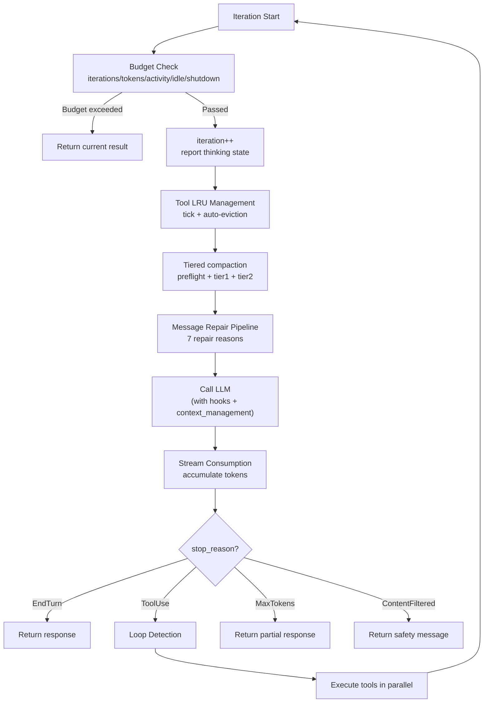
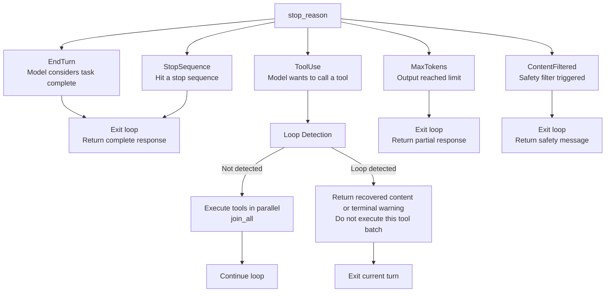
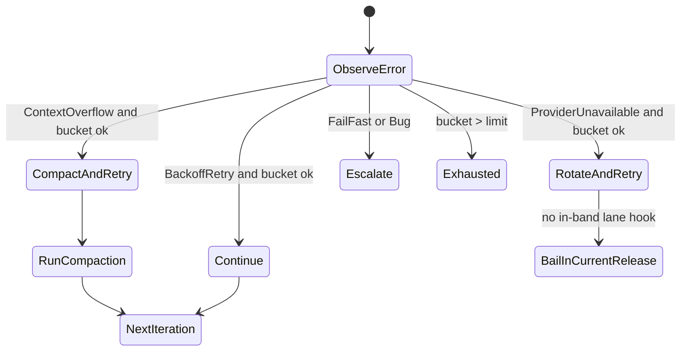

# Chapter 5: Agent Loop: The Complete Lifecycle of a Single Conversation

> **Positioning**: This is the most central chapter in the entire book -- a deep dive into octos-agent configuration and loop orchestration (`mod.rs` + `loop_runner.rs`), walking through the complete flow from message construction to tool invocation, context compaction, error recovery, and result delivery. Prerequisites: Chapter 3 (LLM Provider) and Chapter 4 (Memory System). Applicable to any reader who wants to understand AI Agent runtime mechanics, especially AI application developers (Reader C) and developers who want to contribute to octos core code (Reader D).

Having understood the octos-core type system (Chapter 2), octos-llm's Provider abstraction (Chapter 3), and octos-memory's memory system (Chapter 4), we finally arrive at the heart of the entire system -- the Agent Loop.

The "intelligence" of an AI Agent is essentially a loop: receive user message -> call LLM -> parse LLM's intent -> if the LLM wants to use a tool, execute it -> feed tool results back to the LLM -> repeat until the LLM considers the task complete. This loop appears simple, but a production-grade implementation must handle numerous edge cases: iteration limits, token budgets, idle progress timeout, context window overflow, message format repair, loop detection, graceful shutdown, and provider/harness error recovery.

This chapter walks through the core code in the `crates/octos-agent/src/agent/` directory, using approximately 200 lines of key code to illustrate the complete lifecycle of the Agent Loop.

---

## 5.1 The Agent Struct and Configuration

### 5.1.1 Components of an Agent

The Agent struct (`crates/octos-agent/src/agent/mod.rs:143-230`) holds all resources needed to execute a single conversation:

```rust
pub struct Agent {
    pub id: AgentId,                              // Unique Agent identifier
    pub llm: Arc<dyn LlmProvider>,                // LLM Provider (see Chapter 3)
    pub tools: Arc<ToolRegistry>,                 // Tool registry (see Chapter 6)
    pub memory: Arc<EpisodeStore>,                // Long-term memory (see Chapter 4)
    pub embedder: Option<Arc<dyn EmbeddingProvider>>,
    pub system_prompt: RwLock<String>,            // System prompt (supports hot-reloading)
    pub config: AgentConfig,                      // Execution configuration
    pub reporter: RwLock<Arc<dyn ProgressReporter>>, // Progress reporting
    pub hooks: Option<Arc<HookExecutor>>,         // Hook system (see Chapter 14)
    pub harness_event_sink: Option<String>,
    pub shutdown: Arc<AtomicBool>,                // Graceful shutdown flag
    pub persistent_retry_state: Option<Arc<Mutex<LoopRetryState>>>,
    pub tiered_compaction: Option<Arc<TieredCompactionRunner>>,
    pub file_state_cache: Option<Arc<FileStateCache>>,
    pub profile: Option<Arc<ProfileDefinition>>,
    // ...
}
```

Several design points are worth noting: `llm` and `tools` are wrapped in `Arc` because an Agent may be shared across multiple async tasks (during parallel tool execution). `system_prompt` uses `RwLock<String>` instead of a plain `String`, supporting hot configuration reloading (see Chapter 13) -- a running Agent can update its system prompt without restarting. `shutdown: Arc<AtomicBool>` is an atomic boolean flag shared across threads. When a SIGTERM signal is received, the main thread sets it to `true`, and the Agent Loop checks this flag at the beginning of each iteration -- if `true`, it exits gracefully rather than terminating abruptly (see Chapter 11).

Current main also makes several runtime states explicit: `persistent_retry_state` keeps retry buckets alive across turns, `tiered_compaction` drives the three-tier context compaction path, `file_state_cache` lets file tools share read/write state, and `profile` records the profile envelope applied during bootstrap. In other words, Agent is no longer a thin "LLM + tools" wrapper; it connects prompt-visible state, runtime control state, and durable evidence state.

### 5.1.2 AgentConfig

AgentConfig (`mod.rs:45-94`) controls the execution boundaries of an Agent:

| Field | Default | Description |
|-------|---------|-------------|
| `max_iterations` | 50 | Maximum number of iterations |
| `max_tokens` | None (unlimited) | Token budget cap |
| `max_timeout` | 1800 seconds (30 minutes) | Activity timeout: only fires when there has been no recent progress |
| `tool_timeout_secs` | 1800 | Default single-tool timeout, with the same 1800s maximum |
| `save_episodes` | true | Whether to save episodes to memory |
| `chat_max_tokens` | None | Per-call LLM output token override |
| `suppress_auto_send_files` | false | Whether background workers skip the generic files_to_send auto-send loop |

The 50-iteration limit (`mod.rs:82-94`) serves as a safety valve. A typical code modification task usually completes within 5-15 iterations (read file -> analyze -> modify -> test). If an Agent hasn't finished after 50 iterations, it has almost certainly fallen into some form of inefficient loop.

---

## 5.2 The Main Loop: Step-by-Step Walkthrough

The main loop is located at `crates/octos-agent/src/agent/loop_runner.rs:578-1057` for conversation mode and `loop_runner.rs:1060-1325` for task mode. Let's walk through it section by section.

### 5.2.1 Entry Points

The Agent has two entry points (`loop_runner.rs:33-41, 293-474`):

- **`process_message()`**: Conversation mode -- receives a user message and history, returns a `ConversationResponse`
- **`run_task()`**: Task mode -- receives a Task definition, returns a `TaskResult`

Both ultimately call the same internal loop `process_message_inner()`.

### 5.2.2 Iteration Flow

The complete flow of each iteration is as follows:



**Figure 5-1: Agent Loop single iteration flow.** The critical path is the ToolUse branch -- it is the only stop_reason that causes the loop to continue.

### 5.2.3 Budget Check

The first thing executed in each iteration is the budget check (`budget.rs:42-80`):

```rust
pub(super) fn check_budget(
    &self,
    iteration: u32,
    start: Instant,
    total_usage: &TokenUsage,
    activity: &LoopActivityState,
) -> Option<BudgetStop> {
    // 1. Graceful shutdown -- atomic read, O(1)
    if self.shutdown.load(Ordering::Acquire) {
        return Some(BudgetStop::Shutdown);
    }
    // 2. Iteration count -- simple comparison
    if iteration >= self.config.max_iterations {
        return Some(BudgetStop::MaxIterations);
    }
    // 3. Idle progress timeout -- no observable progress
    if activity.has_timed_out(idle_timeout) {
        return Some(BudgetStop::IdleProgressTimeout { limit: idle_timeout });
    }
    // 4. Activity timeout -- only if no recent progress exists
    if let Some(timeout) = self.config.max_timeout {
        if start.elapsed() > timeout && !activity.recently_active_within(timeout) {
            return Some(BudgetStop::ActivityTimeout { limit: timeout });
        }
    }
    // 5. Token budget -- requires addition
    if let Some(max_tokens) = self.config.max_tokens {
        let used = total_usage.input_tokens + total_usage.output_tokens;
        if used >= max_tokens {
            return Some(BudgetStop::MaxTokens { used, limit: max_tokens });
        }
    }
    None
}
```

The priority ordering of these five checks is carefully designed:

1. **Shutdown** comes first -- an atomic load takes ~1 CPU cycle, and user-initiated interrupts must be responded to immediately
2. **Iteration count** comes second -- a simple integer comparison, and the most common stop reason
3. **Idle progress timeout** comes third -- 300 seconds without any reporter activity means the loop may be wedged
4. **Activity timeout** comes fourth -- `max_timeout` is not an unconditional wall-clock kill; it only fires when total duration is over the limit and there has been no recent progress
5. **Token budget** comes last -- requires an addition operation, and most configurations don't set a token limit (`None`)

Each stop reason carries different context data (the `BudgetStop` enum, `budget.rs:12-17`):

```rust
pub(super) enum BudgetStop {
    Shutdown,
    MaxIterations,
    MaxTokens { used: u32, limit: u32 },     // Includes used and limit
    ActivityTimeout { limit: Duration },      // Total duration exceeded and no recent activity
    IdleProgressTimeout { limit: Duration },  // Default 300s without progress
}
```

This context data is passed to the `report_budget_stop()` method (`budget.rs:82-123`), which generates corresponding progress events to notify the user -- specific messages like "Reached max iterations", "Token budget exceeded (1000 of 500)", or "Activity timeout". `ActivityTrackingReporter` refreshes `last_activity_at` on every progress event (`activity.rs:60-82`), so long-running tasks are not killed merely because wall-clock time increased while useful progress was still being reported.

### 5.2.4 Message Repair Pipeline

Before each LLM call, message history goes through the preparation pipeline centralized in `prepare_conversation_messages()` (`loop_compaction.rs:17-53`), and each change is recorded as a `LoopRepairReason` (`turn_state.rs:47-56`):

1. **`trim_to_context_window()`**: Truncates overly long history messages to fit the model's context window
2. **`normalize_system_messages()`**: Merges multiple system messages, ensuring correct placement of the system prompt
3. **`repair_message_order()`**: Fixes message ordering (some Providers require strict user->assistant->user alternation)
4. **`repair_tool_pairs()`**: Ensures every tool call has a corresponding tool result
5. **`synthesize_missing_tool_results()`**: Generates placeholder responses for missing tool results (e.g., `"[result unavailable]"`)
6. **`truncate_old_tool_results()`**: Truncates older tool results to save context space
7. **`normalize_tool_call_ids()`**: Normalizes cross-Provider tool_call_id prefixes and character sets

Why are so many repairs needed? There are three reasons:

**Side effects of context compaction and concurrent writes.** When conversation history undergoes compaction (see Chapter 8), or when speculative / overflow branches write to the same session concurrently, tool calls and tool results can be scattered. `repair_message_order()` gathers matching tool results from the whole message list and places them back after the assistant message; `repair_tool_pairs()` and `synthesize_missing_tool_results()` handle orphaned or missing results.

**Provider format differences.** Anthropic requires tool results to immediately follow the assistant message containing the tool_call, with no other messages in between. OpenAI allows gaps between tool results and tool_calls. `repair_message_order()` reorders messages according to the current Provider's requirements.

**Unreliable LLM output.** LLMs sometimes generate duplicate tool_call_ids or return incompletely formatted tool calls. `normalize_tool_call_ids()` cleans up these issues before the LLM call, preventing Provider APIs from erroring due to duplicate IDs.

### 5.2.5 Tool Count Warning

During the first iteration, if the number of registered tools exceeds 25 (`loop_runner.rs:735-740`), the system prints a warning. This is because most LLMs perform worse with overly long tool lists -- potentially producing "empty responses" or experiencing decision paralysis. It is recommended to reduce active tool count through `always: false` strategies or `tool_policy` deny lists.

### 5.2.6 LLM Call and Empty Response Retry

The LLM call (`loop_runner.rs:754-814`) passes through the hooks system and includes intelligent retry logic:

```rust
let response = match self.call_llm_with_hooks(&messages, &tools, &config).await {
    Ok(r) => r,
    Err(e) if e.to_string().contains("empty response after") => {
        // Empty response -- retry once, AdaptiveRouter may switch to another Provider
        self.call_llm_with_hooks(&messages, &tools, &config).await?
    }
    Err(e) => return Err(e),
};
```

This retry logic handles a special scenario: the LLM returned an empty response (no text, no tool calls, no errors). This typically occurs when a Provider is overloaded or model processing fails. Retrying once gives the AdaptiveRouter an opportunity to select a different Provider (see Chapter 3).

Hooks allow users to inject custom logic before and after LLM calls (see Chapter 14). A before-hook can reject a call (returning exit code 1), and an after-hook can observe the response.

### 5.2.7 Stream Consumption and Adaptive Timeout

Stream response consumption (`streaming.rs:32-239`) uses `tokio::select!` to simultaneously await three events:

```rust
let event = tokio::select! {
    event = stream.next() => event,           // Stream event arrives
    _ = self.wait_for_shutdown() => {         // Graceful shutdown signal
        break;
    }
    _ = tokio::time::sleep(timeout) => {      // Timeout
        break;
    }
};
```

Three futures race, and whichever completes first determines the execution path. If a shutdown signal arrives during streaming, the Agent immediately stops consuming without waiting for the stream to end.

The stream response event types:

- **TextDelta**: Token-by-token text output, forwarded to the user in real time
- **ReasoningDelta**: Chain-of-thought output from reasoning models (e.g., o1's internal reasoning)
- **ToolCallDelta**: Incremental construction of tool call parameters -- tool names and argument JSON arrive in chunks
- **Usage**: Token usage updates
- **Done**: End-of-stream signal

**Adaptive timeout** (`streaming.rs:61-75`) uses a two-phase strategy:

```rust
let ttft_secs = (30 + input_tokens_estimate as u64 / 1000).min(180);
let timeout = if got_first_chunk {
    Duration::from_secs(30)       // Phase 2: 30s inter-token interval
} else {
    Duration::from_secs(ttft_secs) // Phase 1: TTFT = 30s + 1s/1K tokens
};
```

| Phase | Formula | 100K tokens input | Rationale |
|-------|---------|-------------------|-----------|
| TTFT | `30 + tokens/1000` (max 180s) | 130s | Model needs time to process large inputs |
| Inter-chunk | Fixed 30s | 30s | Once streaming starts, chunks should arrive continuously |

The adaptive TTFT design is critical: using a fixed 30-second timeout for a request containing an entire codebase context (100K+ tokens) would almost certainly trigger false positives. The `1s/1K tokens` linear growth makes the timeout proportional to input size.

---

## 5.3 The stop_reason Decision Tree

The `stop_reason` of the LLM response determines the loop's trajectory. octos defines five stop_reasons (`crates/octos-llm/src/types.rs:26-41`):



**Figure 5-2: The stop_reason decision tree.** ToolUse is the only branch that triggers loop continuation.

### 5.3.1 EndTurn / StopSequence

The model ends naturally (`loop_runner.rs:849-865`). This is the most common exit path -- the LLM considers the task complete and returns the final text.

### 5.3.2 ToolUse -- Tool Execution

This is the core path of the Agent Loop (`loop_runner.rs:866-1013`). When the LLM returns a tool call request:

1. **Loop detection**: Check whether the tool call pattern is repeating (see Section 5.4)
2. **Execution**: Delegate to `handle_tool_use()`, which executes tools and records files, tokens, and structured metadata
3. **Result injection**: Add tool results to the history as Tool-role messages
4. **spawn_only fast return**: If this turn started background-only work, return "background work started"
5. **Continue loop**: Ordinary tool results are added to history, then the loop starts the next iteration

### 5.3.3 MaxTokens

The LLM's output reached the `max_output_tokens` limit (`loop_runner.rs:1014-1029`). This typically means the LLM's response was truncated. The loop exits, returning the truncated content.

### 5.3.4 ContentFiltered

The LLM's safety filter intercepted the output (`loop_runner.rs:1030-1051`). This may be because the user's request involves sensitive content, or the LLM's output triggered the Provider's content policy. The loop exits, returning a safety message.

---

## 5.4 Loop Detection: Preventing the Agent from Getting Stuck in Infinite Loops

### 5.4.1 Problem Scenarios

An Agent can get stuck in infinite loops: repeatedly reading the same file, repeatedly executing the same failing command, or being unable to converge in a "modify -> test -> fail -> modify" cycle. Without detection, all 50 iterations would be wasted on meaningless repetition.

### 5.4.2 Detection Algorithm

LoopDetector (`crates/octos-agent/src/loop_detect.rs:11-16`) uses hash signatures to detect repetition in tool call patterns:

```rust
pub struct LoopDetector {
    signatures: Vec<u64>,  // Ring buffer of tool call hashes
    window: usize,         // Maximum window size (default 12)
}
```

For each tool call, `tool name + argument JSON` is hashed into a `u64` signature and appended to the buffer. The system then checks whether the most recent signature sequence contains repeating patterns of length 1, 2, or 3 (`loop_detect.rs:29-60`).

**Detection criteria** (`loop_detect.rs:74-81`): A pattern must occur **more than 3 consecutive times** to trigger detection. For example:

- Pattern length 1: `[A, A, A]` -> detected (same tool call repeated 3 times)
- Pattern length 2: `[A, B, A, B, A, B]` -> detected (AB pair repeated 3 times)
- Pattern length 3: `[A, B, C, A, B, C, A, B, C]` -> detected (ABC sequence repeated 3 times)

### 5.4.3 Post-Detection Handling

When a loop is detected (`loop_runner.rs:866-920`), the current `process_message` does not continue executing that tool batch. It first attempts `dispatch_shell_retry_recovery()`: if this is a repeated shell-attempt spiral, the runtime can return the latest usable shell output through `LoopRetryState`; otherwise it returns a deduplicated terminal warning:

```
⚠️ Loop detected: you appear to be repeating the same tool calls.
Please try a different approach.
```

This message is the current turn's returned content; it is not injected into history before continuing. `loop_detected_recently` ensures the same burst does not repeatedly emit the same warning; a second hit escalates to a terminal error (`agent/mod.rs:168-173`).

This is more conservative than the older "inject warning and continue" behavior: once a repeated tool pattern is detected, the loop stops the current turn before spending more tool calls and tokens. Legitimate polling should be modeled through background tasks, spawn_only handles, or explicit state queries rather than unbounded repetition in the main loop.

---

## 5.5 Token Budget Management

### 5.5.1 Cumulative Tracking

After each LLM call, token usage is accumulated into `total_usage` through `LoopTurnState::record_usage()` (`turn_state.rs:103-120`; call site `loop_runner.rs:843-847`):

```rust
turn.record_usage(
    response.usage.input_tokens,
    response.usage.output_tokens,
    tracker,
);
```

Tokens produced by tool execution (e.g., if a tool internally invokes a sub-Agent or LLM) are first aggregated by `execute_tools()`, then accumulated through the same `turn.record_usage()` call in `handle_tool_use()` (`execution.rs:1328-1348`; `loop_runner.rs:1428-1469`).

### 5.5.2 Real-Time Reporting

`TokenTracker` (`mod.rs:93-112`) uses atomic counters to update token usage in real time:

```rust
pub struct TokenTracker {
    pub input_tokens: AtomicU32,
    pub output_tokens: AtomicU32,
}
```

These atomic counters are read by the progress reporter (`ProgressReporter`) to display real-time token consumption in the CLI or Web UI. `Ordering::Relaxed` is sufficient -- token counts don't need strict ordering guarantees; eventual consistency is enough.

### 5.5.3 Cost Calculation

After stream consumption completes (`streaming.rs:242-258`), the system uses octos-llm's pricing module to calculate both the cost of the current response and the cumulative session cost, reporting them through the reporter. This allows users to see API costs in real time during interaction.

---

## 5.6 Adaptive Timeout for Stream Consumption

The timeout strategy for stream responses (`streaming.rs`) is more nuanced than a simple fixed timeout:

| Timeout Type | Formula | Maximum | Scenario |
|--------------|---------|---------|----------|
| First token (TTFT) | `30s + 1s/1K input tokens` | 180s | Waiting for LLM to begin responding |
| Inter-token interval | Fixed 30s | 30s | During normal streaming |

The adaptive TTFT design addresses a practical issue: the longer the input (e.g., containing large amounts of source code context), the longer the LLM takes to process it. A fixed 30-second timeout would frequently trigger false positives when processing 100K+ token inputs. The `1s/1K tokens` linear growth makes the timeout proportional to input size, while the 180s cap prevents indefinite waiting.

---

## 5.7 Source Code Walkthrough: The Core 200 Lines

Distilling the main loop's critical path into approximately 200 lines (from `loop_runner.rs`), with comments:

```rust
// === Key path inside process_message_inner (simplified) ===
loop {
    // 1. Budget check: iteration / token / activity / idle / shutdown
    if let Some(stop) = turn.check_budget(self, activity.as_ref()) {
        if !self.try_budget_grace_call(&stop, &mut retry_state, turn.iteration()) {
            turn.record_budget_stop(&stop);
            return Ok(ConversationResponse { content: stop.message(), /* ... */ });
        }
    }

    let iteration = turn.advance_iteration();
    self.beat_heartbeat(iteration)?;
    self.reporter().report(ProgressEvent::Thinking { iteration });

    // 2. Tool LRU and three-tier compaction
    self.tools.tick();
    self.tools.auto_evict();
    if iteration == 1 {
        self.maybe_run_preflight_compaction(&mut messages);
    }
    let protected_ids = collect_protected_tool_call_ids(&messages);
    self.run_tier1_compaction(&mut messages, &protected_ids);

    // 3. Message prep: trim + system normalize + tool pair/order repair + id normalize
    prepare_conversation_messages(self, &mut messages, &mut turn);
    self.maybe_run_turn_compaction(&mut messages, iteration);

    // 4. Call LLM. Anthropic can receive tier-2 context_management payload.
    let call_config = with_tier2_context_management(&config, self);
    let (mut response, streamed) = match self
        .call_llm_with_hooks(&messages, &tools_spec, &call_config, iteration, &total_usage, &mut turn)
        .await
    {
        Ok(r) => r,
        Err(e) => match self.handle_loop_error_with_dispatch(&e, &mut retry_state, iteration, &mut messages) {
            LoopErrorAction::Retry => continue,
            LoopErrorAction::Bail => return Err(e),
        },
    };
    Self::normalize_inline_invokes(&mut response);

    // 5. Accumulate token usage and synchronize TokenTracker.
    turn.record_usage(response.usage.input_tokens, response.usage.output_tokens, tracker);

    // 6. stop_reason decision
    match response.stop_reason {
        StopReason::EndTurn | StopReason::StopSequence => {
            self.emit_cost_update(turn.total_usage(), &response.usage);
            return Ok(ConversationResponse { /* ... */ });
        }
        StopReason::ToolUse => {
            // If a repeated tool pattern is detected, do not execute this batch.
            for tc in &response.tool_calls {
                if let Some(warning) = loop_detector.record(&tc.name, &tc.arguments) {
                    if let Some(recovered) =
                        self.dispatch_shell_retry_recovery(&messages, &mut retry_state, iteration)
                    {
                        return Ok(ConversationResponse { content: recovered, /* ... */ });
                    }
                    return Ok(ConversationResponse {
                        content: self.dedup_loop_warning(warning)?,
                        /* ... */
                    });
                }
            }

            if let Err(e) = self.handle_tool_use(&response, &mut messages, /* ... */).await {
                match self.handle_loop_error_with_dispatch(&e, &mut retry_state, iteration, &mut messages) {
                    LoopErrorAction::Retry => continue,
                    LoopErrorAction::Bail => return Err(e),
                }
            }

            if self.tools.spawn_only_was_invoked() {
                return Ok(ConversationResponse { content: "Background work started...".into(), /* ... */ });
            }
        }
        StopReason::MaxTokens => {
            return Ok(ConversationResponse { /* ... */ });
        }
        StopReason::ContentFiltered => {
            return Ok(ConversationResponse { content: safety_message(response), /* ... */ });
        }
    }
}
```

*Note: The code above has been simplified to highlight core logic. The actual implementation includes additional error handling, logging, and edge case management. See `crates/octos-agent/src/agent/loop_runner.rs` for the complete code.*

---

> ### Engineering Decision Sidebar: Why the Agent Loop Itself Is Not an Actor Model
>
> Many concurrent systems (such as Akka, Erlang/OTP) use the Actor Model -- each Agent is an Actor that communicates through message passing. octos does serialize same-session input through `SessionActor`, but the Agent Loop itself uses a more direct "typed async loop + explicit runtime state" model.
>
> **Option A: Actor Model**
>
> Advantages:
> - Natural state isolation -- each Actor encapsulates its own state
> - Message passing avoids shared state -- no locks needed
> - Mature error recovery patterns (supervision tree)
>
> Disadvantages:
> - Introducing an Actor framework (such as `actix`) adds dependencies and learning overhead
> - Tool execution requires request-response semantics; Actor's asynchronous message passing would add complexity
> - Agent state is fundamentally linear (message history + iteration count) and doesn't need Actor's concurrent state management
>
> **Option B: Typed async loop + session actor boundary (octos's choice)**
>
> Advantages:
> - Intuitive sequential logic -- each step of the loop naturally corresponds to a phase of Agent behavior
> - Tokio's async runtime already provides concurrency capabilities (`join_all` for parallel tool execution)
> - The session layer serializes same-session messages, while the Agent Loop focuses on the turn-local state machine
>
> Disadvantages:
> - Cross-Agent coordination requires explicit channel communication
> - No built-in supervision tree
>
> **octos's rationale:** The core of the Agent Loop is sequential -- receive -> think -> act -> observe -> think -> ... Concurrency appears during the "act" phase (parallel tool execution and background spawn_only delivery). Keeping the main path as a `loop` plus typed state machines makes budget, compaction, retry buckets, and harness events auditable instead of scattering that control plane across an Actor message protocol.

---

## 5.8 Mainline Evolution: Typed Recovery State Machine

The current main branch no longer treats the Agent Loop as only "call the LLM, execute tools, continue". Runtime failures are modelled as typed control flow: `HarnessError` classifies raw `eyre::Report` values into stable variants, `RecoveryHint` maps each variant to a recovery class, and `LoopDecision` tells the loop whether to continue, compact, escalate, or stop (`crates/octos-agent/src/harness_errors.rs:93-233`; `crates/octos-agent/src/agent/loop_state.rs:126-148`).

| Failure type | RecoveryHint | LoopDecision | Runtime meaning |
|--------------|--------------|--------------|-----------------|
| `RateLimited` / `Network` / `Timeout` | `BackoffRetry` | `Continue` | Transient failure; retry without reshaping context |
| `ContextOverflow` | `CompactContext` | `CompactAndRetry` | Compact first, then retry |
| `ProviderUnavailable` | `SwitchProvider` | `RotateAndRetry` | Semantically requests a provider-lane switch |
| `Authentication` / `InvalidRequest` / `ContentFiltered` | `FailFast` | `Escalate` | Configuration or request is not recoverable here |
| `DelegateDepthExceeded` | `FailFast` | `Escalate` | Stops recursive subtask expansion |
| `Internal` | `Bug` | `Escalate` | Runtime invariant is broken |

One boundary matters: `ProviderUnavailable` maps to `RotateAndRetry`, but the current `handle_loop_error_with_dispatch` implementation has no in-band provider-lane hook. It logs a warning and bails, leaving lane rotation to the outer provider chain or caller (`crates/octos-agent/src/agent/loop_runner.rs:336-350`). The book should not claim that the current loop automatically switches providers internally.

`LoopRetryState` is also not a single global retry counter. It owns one bounded bucket per `HarnessError` variant; once a bucket exceeds its hard limit, the decision becomes `Exhausted` and the loop stops retrying (`crates/octos-agent/src/agent/loop_state.rs:70-104`, `crates/octos-agent/src/agent/loop_state.rs:171-253`). `ContextOverflow` can only compact a bounded number of times, `DelegateDepthExceeded` converges quickly, and shell spiral detection enters the same retry ledger as `shell_spiral` even though it is not itself a `HarnessError`.



This path is wired into the loop today: the `CompactAndRetry` branch calls the turn compaction helper and then returns `Retry` to the outer loop (`crates/octos-agent/src/agent/loop_runner.rs:321-339`). Context compaction in Chapter 8 is therefore not only a token-budget optimization; it is one of the Agent Loop's recovery mechanisms.

Retry buckets can also survive across turns. `PersistentRetryStateGuard` hydrates from a shared `Arc<Mutex<LoopRetryState>>` on construction and writes back on drop; sessions without a persistent handle keep the legacy fresh-per-turn behavior (`crates/octos-agent/src/agent/loop_runner.rs:126-170`). This gives the chapter a useful state boundary: messages, summaries, and workspace contracts are prompt-visible state; retry buckets, grace eligibility, and task lifecycle are runtime control state; validator ledgers, harness event sinks, and cost ledgers are durable evidence state.

## 5.9 Agent Loop and Coding Harness Boundaries

The latest main branch adds a Codex-compatible coding tool contract plus agent/goal/loop control surfaces, but the Agent Loop itself remains the typed async loop described in this chapter. `apply_patch`, `exec_command`, `update_plan`, `request_user_input`, `spawn_agent`, and `wait_agent` enter through the normal ToolUse branch. Background completion, goal continuation, and loop fire events are scheduled through `TaskSupervisor`, `AgentOrchestrator`, and `MasterContinuationScheduler` as later turns; they do not bypass the loop and mutate model state directly.

This boundary matters:

- **Autonomous coding workflows are supported**: the model can use patching, command sessions, plans, user-input requests, child-agent lifecycle tools, and dynamic tool discovery for coding tasks.
- **This is not a hidden Actor runtime**: the main loop does not realtime-schedule arbitrary agent-to-agent conversations. Session actors and supervisors own runtime state, cancellation, artifacts, and continuations.
- **This is not a self-evolving optimizer**: pipeline validators, artifact ledgers, `skill-evolve`, and goal/loop primitives provide substrate, but the loop does not implement DSPy/GEPA-style prompt or program search.

The pragmatic framing is: Octos connects autonomous coding to the Agent Loop through a backend-supervised tool contract and controlled continuations, not by turning the loop into a self-evolving multi-agent society.

## 5.10 Chapter Summary

The Agent Loop is the soul of octos -- a carefully orchestrated while loop:

1. **Budget check**: Five gates (shutdown -> iterations -> idle progress timeout -> activity timeout -> tokens) ensure the Agent does not run indefinitely while avoiding false kills for long tasks that keep reporting progress. The 50-iteration limit is the default safety valve.

2. **Message repair**: 7 repair reasons normalize message history before each LLM call, handling side effects of context compression, concurrent writes, and format differences between Providers.

3. **stop_reason decision**: Of the five branches, only ToolUse triggers loop continuation. EndTurn is a normal exit, MaxTokens is a truncation exit, and ContentFiltered is a safety exit.

4. **Loop detection**: Hash signatures + pattern matching (lengths 1/2/3, 3 repetitions), stopping the current tool batch and returning shell recovery output when possible, otherwise a deduplicated terminal warning.

5. **Token tracking**: Atomic counters updated in real time, supporting cost display in CLI/Web UI.

6. **Stream timeout**: Adaptive TTFT (proportional to input size), avoiding false positives in long-context scenarios.

7. **Typed recovery**: `HarnessError`, `LoopRetryState`, and `LoopDecision` make recovery a bounded state machine. `CompactAndRetry` is wired into the loop; provider lane rotation is still handled by the outer provider chain.

8. **Coding harness boundary**: Codex-compatible tools and agent/goal/loop control surfaces enter through ToolUse, supervisors, and continuation scheduling. They support autonomous coding workflows, but not a complete self-evolving optimizer or arbitrary multi-agent runtime.

The next chapter dives into the tool system -- the core of the "act" phase in the Agent Loop: how built-in tools, plugin tools, and spawn_only background tasks are registered, invoked, and secured.

---

## Further Reading

- **ReAct Framework**: Yao et al., "ReAct: Synergizing Reasoning and Acting in Language Models" (2023) -- the theoretical foundation of Agent loops
- **Function Calling**: OpenAI "Function calling" documentation -- understanding how LLMs request tool calls
- **Tokio select!**: Tokio official documentation "select" section -- understanding the pattern of racing multiple futures
- **Circuit Breaker Pattern**: Michael Nygard, *Release It!* (Pragmatic Bookshelf) -- resilience patterns for production systems

## Discussion Questions

1. **Iteration limit trade-offs**: The 50-iteration limit is too high for simple tasks (like answering questions) and potentially too low for complex tasks (like large-scale refactoring). How would you design an adaptive iteration limit?

2. **Limitations of loop detection**: The current hash signature approach only detects exact repetitions. If the Agent passes slightly different parameters each time (e.g., a filename with an extra space), detection fails. How would you improve this?

3. **Necessity of message repair**: The 7 repair reasons handle a large number of edge cases. If octos only supported a single Provider (e.g., only Anthropic), which repairs could be eliminated?

4. **Actor Model scenarios**: The Engineering Decision Sidebar in this chapter chose a simple loop over the Actor Model. If octos needed to support multi-Agent collaboration (e.g., a planning Agent delegating tasks to multiple execution Agents), how would the design change?

---

> **Version Evolution Note**
> This chapter follows the current source in `../octos/crates/octos-agent/src/agent/`. Future reviews should check `loop_runner.rs`, `loop_state.rs`, `loop_compaction.rs`, `budget.rs`, `streaming.rs`, `harness_errors.rs`, plus the boundary to `octos-cli/src/api/agent_orchestrator.rs` and `master_continuation_scheduler.rs`. Agent Loop changes now concentrate around typed recovery, tiered compaction, idle progress timeout, background delivery, and coding-harness continuations.
