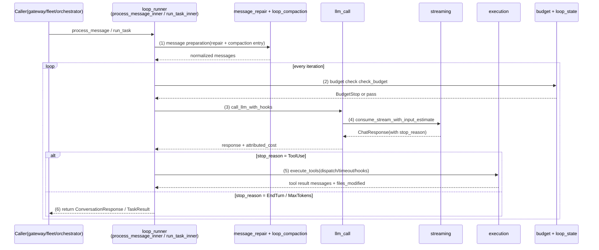
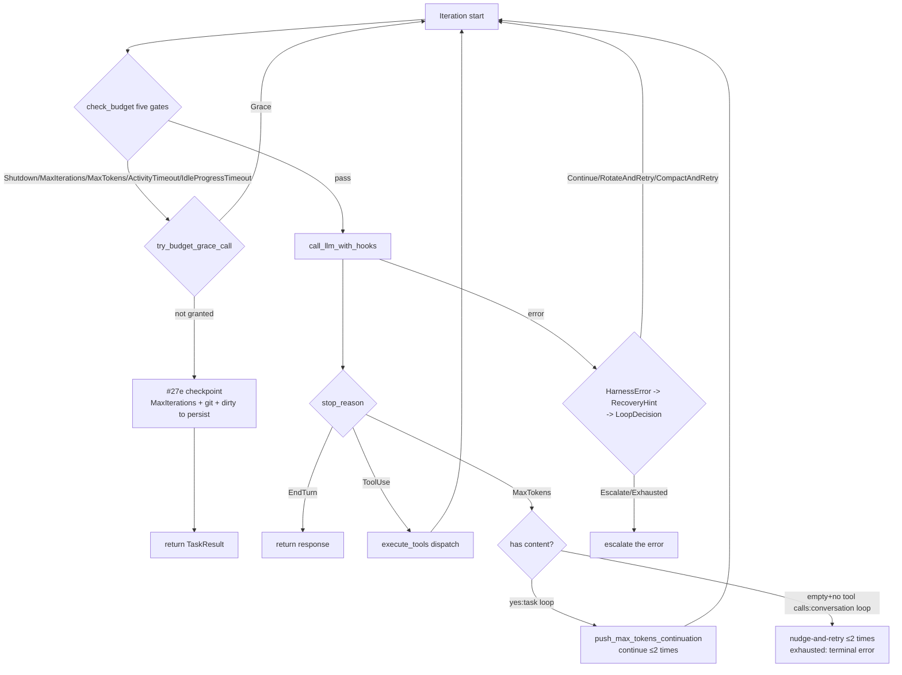
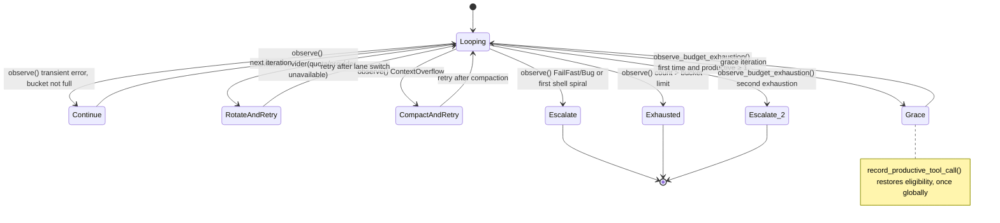

# Chapter 5: Agent Loop: The Full Lifecycle of One Conversation

> **Positioning**: This chapter rebuilds the complete narrative of the Agent Loop around the 20 modules in `crates/octos-agent/src/agent/`, following one `process_message` / `run_task` call from entry to stop_reason through its six-stage lifecycle: the five budget gates and the #27e checkpoint, the typed retry-bucket state machine, the three-layer type chain for error recovery, and the goal-layer continuation queue that bounds the loop. Prerequisites: Chapter 2 (octos-core types), Chapter 3 (the LlmProvider abstraction). Who should read it: AI application developers who want to know what the runtime actually does after a user message arrives (reader C), and contributors preparing a PR against the loop (reader D). Chapter 16's fleet worker and Chapter 18's goal continuation both build on this chapter's loop as their baseline variant.

The textbook definition of an agent loop is one line: receive a message, call the LLM, parse the intent, execute tools if any are requested, feed the results back, repeat until the task is done. The entire difficulty of a production implementation hides in that line's boundary conditions: iteration caps, token budgets, idle timeouts, context overflow, malformed messages, repetitive output, provider failures, graceful shutdown. octos distributes these boundary conditions across 20 modules in `crates/octos-agent/src/agent/`: excluding `*crates/octos-agent/src/agent/loop_runner_tests.rs`, 21,369 lines in total (methodology: `cat $(ls *.rs | grep -v '_tests') | wc -l`). The largest module is not the main loop file `crates/octos-agent/src/agent/loop_runner.rs` (3,979 lines) but tool dispatch, `crates/octos-agent/src/agent/execution.rs` (4,730 lines). That counter-intuitive fact is this chapter's point of entry: the value of the main loop is not the verb "loop" but the decision surface it orchestrates. Every line number and figure in this chapter comes from `assets/ch05-facts.md` (baseline: octos main @ `9c157101`, 2026-09-02); each source reference in the text (path plus line number) can be checked against the facts table and the source repository.

---

## 5.1 The Module Map: 20 Modules, 21,369 Lines

Read the directory as a map first. Each module's first `//!` doc comment is its self-declaration:

| # | Module | Lines | One-line responsibility (first doc comment) |
|---|------|------|------|
| 1 | `crates/octos-agent/src/agent/activity.rs` | 150 | Loop activity tracking for idle-timeout enforcement |
| 2 | `crates/octos-agent/src/agent/append_only_audit.rs` | 364 | Append-only context audit: does a turn's request history only ever GROW? |
| 3 | `crates/octos-agent/src/agent/budget.rs` | 821 | Budget tracking and enforcement for the agent loop |
| 4 | `crates/octos-agent/src/agent/compaction.rs` | 358 | Context window trimming and fallback truncation |
| 5 | `crates/octos-agent/src/agent/detection.rs` | 858 | Detection of repetitive output and retriable responses |
| 6 | `crates/octos-agent/src/agent/execution.rs` | 4,730 | Tool execution: dispatching tool calls with hooks and timeout handling |
| 7 | `crates/octos-agent/src/agent/llm_call.rs` | 988 | LLM call orchestration with lifecycle hooks and retry logic |
| 8 | `crates/octos-agent/src/agent/loop_compaction.rs` | 414 | Message preparation pipeline for long-turn loop calls |
| 9 | `crates/octos-agent/src/agent/loop_runner.rs` | 3,979 | Main agent loop: process_message and run_task orchestration |
| 10 | `crates/octos-agent/src/agent/loop_state.rs` | 768 | Typed retry-bucket state machine for the agent loop (M6.2, issue #489) |
| 11 | `crates/octos-agent/src/agent/memory.rs` | 1,062 | Initial message building and episodic memory context for the agent |
| 12 | `crates/octos-agent/src/agent/message_repair.rs` | 1,260 | Message normalization, ordering repair, and tool pair validation |
| 13 | `crates/octos-agent/src/tools/mod.rs` | 1,644 | Agent implementation |
| 14 | `crates/octos-agent/src/agent/prompt_segments.rs` | 233 | Ordered system-prompt segments |
| 15 | `crates/octos-agent/src/agent/realtime.rs` | 602 | Real-time agent loop extensions for robotic operation |
| 16 | `crates/octos-agent/src/agent/rich_output.rs` | 309 | Rich output: produce a self-contained HTML document from a short brief |
| 17 | `crates/octos-agent/src/agent/streaming.rs` | 1,491 | Stream consumption, shutdown handling, and cost reporting |
| 18 | `crates/octos-agent/src/agent/turn_failure.rs` | 69 | Voice-turn failure projection |
| 19 | `crates/octos-agent/src/agent/turn_state.rs` | 388 | Typed turn state for loop execution |
| 20 | `crates/octos-agent/src/agent/verifier.rs` | 881 | Optional inference-time verifier and compact structured turn ledger |

By responsibility they fall into three layers. The **nine core modules** carry all decisions of a single turn: `crates/octos-agent/src/agent/loop_runner.rs` (orchestration), `crates/octos-agent/src/agent/turn_state.rs` / `crates/octos-agent/src/agent/loop_state.rs` (typed state within a turn and across turns), `crates/octos-agent/src/agent/budget.rs` (budget and checkpoints), `crates/octos-agent/src/agent/llm_call.rs` / `crates/octos-agent/src/agent/streaming.rs` (calls and stream consumption), `crates/octos-agent/src/agent/execution.rs` (tool dispatch), `crates/octos-agent/src/agent/message_repair.rs` (message repair), and `crates/octos-agent/src/agent/detection.rs` (degeneration detection). The **supporting modules** each own one facet: `crates/octos-agent/src/agent/activity.rs` (idle timeout), `crates/octos-agent/src/agent/append_only_audit.rs` (append-only audit of request history), `crates/octos-agent/src/agent/memory.rs` (first-turn messages and episodic memory), `crates/octos-agent/src/agent/prompt_segments.rs` (system-prompt segments), `crates/octos-agent/src/agent/verifier.rs` (inference-time verification), and `crates/octos-agent/src/agent/realtime.rs` / `crates/octos-agent/src/agent/rich_output.rs` / `crates/octos-agent/src/agent/turn_failure.rs` (realtime, rich output, voice-failure projection). The **two compaction modules** (`crates/octos-agent/src/agent/compaction.rs` and `crates/octos-agent/src/agent/loop_compaction.rs`) get only their entry points here; the algorithms are covered in Chapter 8.

`crates/octos-agent/src/tools/mod.rs` is the assembly layer: the constructor and builder family of `pub struct Agent` (`with_reporter`, `with_hooks`, `with_snapshot_manager`, `with_realtime`, `with_compaction_runner`, `with_persistent_retry_state`, and others, from `crates/octos-agent/src/agent/mod.rs:691`) wire the modules' runtime state into the Agent struct; timeout and limit constants live in `AgentConfig` (first-token grace 180s, stream idle 90s, LLM call max 1200s, `crates/octos-agent/src/agent/mod.rs:148`).

A layering fact that is easy to miss: this directory's public surface is narrow. `execute_tools`, the tool-dispatch main entry in `crates/octos-agent/src/agent/execution.rs`, is `pub(super)` (`crates/octos-agent/src/agent/execution.rs:2483`); `consume_stream_with_input_estimate`, the stream-consumption main entry in `crates/octos-agent/src/agent/streaming.rs`, is likewise `pub(super)` (`crates/octos-agent/src/agent/streaming.rs:73`); and `crates/octos-agent/src/agent/message_repair.rs` exposes exactly one crate-public function, `normalize_tool_call_id` (`crates/octos-agent/src/agent/message_repair.rs:95`). The only fully public entries are the `process_message` / `run_task` families in `crates/octos-agent/src/agent/loop_runner.rs`. The crate boundary exposes the loop, not the loop's organs. There is an engineering motive behind this visibility design: the signatures of organ-level functions are still evolving (`execute_tools` already returns a tuple of seven elements, and every new dispatch product changes the signature). Make them `pub` and external callers weld the signature in place; every subsequent evolution becomes a breaking change. Publishing only the two entry families shrinks the stability promise of "how the loop orchestrates" to a minimal surface, and the internal modules stay free to be refactored. In fact `crates/octos-agent/src/agent/execution.rs` is larger than `crates/octos-agent/src/agent/loop_runner.rs`, yet not one line of it leaks outside the crate.

The split into nine core modules is itself worth questioning: why these nine, instead of gathering "the code that calls the LLM" into one file? The answer sits on the axes of change. `crates/octos-agent/src/agent/message_repair.rs` fixes malformed messages, and its change frequency follows provider protocol differences (Anthropic requires a tool result to immediately follow the assistant message; OpenAI allows gaps). `crates/octos-agent/src/agent/detection.rs` detects model-behavior degeneration, and its change frequency follows the model ecosystem (empty responses from small models and shapes of repetitive output keep producing new cases). `crates/octos-agent/src/agent/budget.rs` is pure decision logic and almost never changes. `crates/octos-agent/src/agent/execution.rs` follows the tool system's evolution (see Chapter 6), and `crates/octos-agent/src/agent/streaming.rs` follows SSE parsing and cost-reporting requirements. Five distinct axes of change; cramming them into one file means every provider protocol adjustment sends you hunting for context in two thousand lines of mixed code. Splitting modules along axes of change gives every file's diff a single theme.

## 5.2 The Lifecycle of One Turn

### 5.2.1 The entry families

Two entry families correspond to two driving modes. Conversational entries serve interactive scenarios: `process_message` (`crates/octos-agent/src/agent/loop_runner.rs:784`), `process_message_with_attachments` (L804), `process_message_tracked` (L817, refreshes the TokenTracker in real time for gateway status bars), and `process_message_tracked_with_attachments` (L834); all four converge on the private core `process_message_inner` (L852, whose loop body runs to L2242). Task entries serve orchestration scenarios: `run_task` (L2243) and `run_task_with_tracker` (L2254, which lets a fleet worker read the real token consumption even after an external timeout drops the future) converge on `run_task_inner` (L2262).

The four `process_message` variants are not over-design; each matches a real caller shape: the base version for the simplest chat path, the attachments version carrying this turn's attachment context, the tracked version wiring a TokenTracker, and the tracked_with_attachments version taking both. Keep only one full-parameter entry and simple callers must pass placeholder arguments like `TurnAttachmentContext::default()` and `None`; the compiler can no longer tell "the caller deliberately disabled this" from "the caller forgot to pass it." Converging on a single `process_message_inner` guarantees that all four variants share one loop body, so the interactive path and the tracked path cannot drift apart. The motive for `run_task_with_tracker` is more specific: on an external wall-clock timeout the fleet worker drops the future outright, the returned TaskResult goes with it, and the tracker is the only accounting channel that survives (the source comment explicitly requires the timeout-path settlement to be "never 0").

### 5.2.2 The six stages



**(1) Message preparation.** `prepare_conversation_messages` (`crates/octos-agent/src/agent/loop_compaction.rs:27`) and its task-side mirror `prepare_task_messages` (L71) feed the history into the repair pipeline. Seven `pub(crate)` functions in `crates/octos-agent/src/agent/message_repair.rs` each fix one class of breakage: `normalize_tool_call_ids` (L27, unifies tool_call_id prefixes and character sets across providers), `normalize_system_messages` (L108), `repair_message_order` (L189), `repair_tool_pairs` (L325), `synthesize_missing_tool_results` (L414), and `truncate_old_tool_results` (L513). Each repair class lands in one of the seven variants of `LoopRepairReason` (`crates/octos-agent/src/agent/turn_state.rs:48`, from `ContextTrimmed` to `ToolCallIdsNormalized`), making "what this turn touched" observable.

**(2) Budget check.** At the top of every iteration, `check_budget` runs (see 5.3).

**(3) LLM call.** The whole call orchestration converges on a single main function in `crates/octos-agent/src/agent/llm_call.rs`, `call_llm_with_hooks` (`crates/octos-agent/src/agent/llm_call.rs:22`); the rest of the module is almost entirely test mocks. In the triple it returns, `usage` merges the discarded retry attempts into the final attempt, and `attributed_cost_usd` prices the tokens per provider as they were actually consumed; the caller must book that figure directly instead of recomputing the merged totals with the winning provider's rate (the contract pinned by #1632 P2). Compressing the call orchestration into a single function is a deliberate choice: the hooks before and after the call, the retry ladder across providers, and cost attribution must mesh exactly, and any new logic inserted anywhere can break the invariant that retry attempts' tokens never vanish from the books. A single entry makes all call paths share one orchestration, and the test mocks only need to imitate one function's shape. If each call site orchestrated its own hooks and retries, the first oversight would open a black hole in cost accounting.

**(4) Stream consumption.** `consume_stream_with_input_estimate` (`crates/octos-agent/src/agent/streaming.rs:73`) consumes the SSE stream, handles the shutdown signal (`wait_for_shutdown`, L64); when it finishes, `response_usage_cost` (L555) and `emit_cost_update` (L581) report cost, and `response_to_message` (L669) converts the raw response into a message. The reason stream consumption is its own module: it owns two kinds of resource no other module should touch, the SSE connection's lifecycle (first-token timeout, inter-token timeout, interruption detection) and the estimation of input tokens. A streaming response cannot produce a complete usage block before it ends, yet cost reporting cannot wait for the end either, so a "estimate while consuming" component is required. Leaving this logic in the caller means every provider's retry path reimplements interruption detection; centralized in `crates/octos-agent/src/agent/streaming.rs`, the interruption semantics exist exactly once in the crate.

**(5) Tool dispatch.** `execute_tools` (`crates/octos-agent/src/agent/execution.rs:2483`) decides serial versus parallel, computes the batch timeout (`compute_batch_timeout_secs`, L209), runs before/after hooks, recognizes long-running tools (`is_long_running_tool`, L174), and handles spawn_only artifact files. Tool semantics themselves are Chapter 6's subject. This largest module, 4,730 lines, is the largest because it alone carries every engineering problem of turning LLM intent into side effects: batch scheduling (serial, parallel, and mixed paths, `run_serial_calls` L2738 and `execute_mixed_batch` L2846), timeout budgeting (the longest tool in a batch sets the whole batch's deadline), result projection for cancellation and panic (`cancelled_result` L3003, `timed_out_result` L3035, `panic_result` L3062; all three exceptions must become tool-result messages the LLM can read rather than crashing the loop), and snapshots (`snapshot_before_mutating_tools` L2457, keeping a baseline before mutating tools run). Keep these duties in loop_runner and the main loop file would blow past eight thousand lines with tool details mixed into every path; split out, loop_runner sees only the clean interface of "a batch of tool calls in, a batch of result messages out."

**(6) State update and stop decision.** `LoopTurnState` (`crates/octos-agent/src/agent/turn_state.rs:59`) holds iteration, total_usage, turn_spend_usd, the retry/repair reason lists, and terminal_reason; `record_usage` (L138) accumulates consumption and `record_budget_stop` (L187) records the termination. The response's `stop_reason` decides the next hop: EndTurn returns, ToolUse goes back to (1), and MaxTokens takes the continuation and self-healing paths (see 5.4 and 5.6). The reason turn state is its own type (rather than locals scattered through the loop body) sits in the two companion enums: `LoopRetryReason` (L41, three variants) and `LoopRepairReason` (L48, seven variants) turn "what this turn retried and repaired" into enumerable data. When a user asks why a task was slow, the answer is no longer guesswork over logs but the reason lists carried out at turn end. Locals cannot do this: they have no type and no serialization exit.

## 5.3 The Five Budget Gates and the #27e Checkpoint

### 5.3.1 check_budget: the order of the five gates

At the top of every iteration, `check_budget` (`crates/octos-agent/src/agent/budget.rs:100`) passes five gates in a fixed order; any hit returns a `BudgetStop`:

```rust
pub(super) fn check_budget(
    &self,
    iteration: u32,
    start: Instant,
    total_usage: &TokenUsage,
    activity: &LoopActivityState,
) -> Option<BudgetStop> {
    use std::sync::atomic::Ordering;

    if self.shutdown.load(Ordering::Acquire) {
        return Some(BudgetStop::Shutdown);
    }
    if iteration >= self.config.max_iterations {
        return Some(BudgetStop::MaxIterations {
            limit: self.config.max_iterations,
        });
    }
```

(From `crates/octos-agent/src/agent/budget.rs:100`; the remaining three gates are idle progress timeout, activity timeout, and the token budget.) The order itself is the design: shutdown is one atomic load, and a user interrupt must be answered first; the iteration count is the most common stop reason and costs one integer comparison next; the two timeouts depend on the activity tracking in `crates/octos-agent/src/agent/activity.rs` (`LoopActivityState`, `crates/octos-agent/src/agent/activity.rs:16`); the token budget comes last because `budget_tokens_used` (`crates/octos-agent/src/agent/budget.rs:90`) performs four saturating additions, and many deployments set no cap at all. Token accounting includes cache_read and cache_write: counting only input+output lets an Anthropic loop with prompt caching enabled blow through its budget by roughly ten times.

The five variants of `BudgetStop` (`crates/octos-agent/src/agent/budget.rs:13`) each carry user-meaningful context: `MaxIterations { limit }` carries the limit, `MaxTokens { used, limit }` carries both numbers, and the two timeouts carry their limit. `BudgetStop::message()` (L41) renders the variants into actionable termination messages, and `report_budget_stop` (L141) turns that into a `ProgressEvent`.

The four public functions on the budget side each guard one stretch; the division is not arbitrary. The `BudgetStop` enum (L13) defines "why we stopped" as data, its five variants being five user-distinguishable endings. `message()` (L41) is the only rendering point: termination copy is centralized here, and the budget-termination wording a user sees in any interface comes from this one place, so the CLI can never say "limit reached" while the gateway says "budget exceeded." `budget_tokens_used` (L90) is the only arithmetic point; change the cache inclusion rule once and it applies globally. `check_budget` (L100) is the only decision point; the five-gate order exists in exactly one function. `report_budget_stop` (L141) is the only reporting point. Decision, arithmetic, rendering, and reporting as four functions means any budget behavior change localizes to a single function, while the callers (the two loop bodies) face exactly one intermediate representation, `Option<BudgetStop>`. Spread those four duties into the loop bodies and the five-gate ordering constraint lives in two places; the two loops will sooner or later evolve different stop orders.

### 5.3.2 Grace: one reprieve before the hard stop

A budget hit does not always stop immediately. `try_budget_grace_call` (`crates/octos-agent/src/agent/loop_runner.rs:602`) first asks `LoopRetryState`: if this is the first hard budget exhaustion and at least one productive tool call has happened since the last grace, the state machine answers `Grace` (`observe_budget_exhaustion`, `crates/octos-agent/src/agent/loop_state.rs:303`) and the loop runs one more iteration, giving the Agent a chance to finish its sentence and its files. Grace fires once globally; the second time it goes straight to `Escalate`.

### 5.3.3 #27e: the on-disk checkpoint

When the budget truly runs out, the biggest risk is losing the work tree. #27e implements an on-disk checkpoint in the non-test section of `crates/octos-agent/src/agent/budget.rs` (from L484), with the main function `checkpoint_budget_exhaustion` (`crates/octos-agent/src/agent/budget.rs:546`):

```rust
pub(super) fn checkpoint_budget_exhaustion(
    workdir: Option<&std::path::Path>,
    stop: &BudgetStop,
    iteration: u32,
) -> Option<String> {
    // Only the ITERATION-cap stop checkpoints: MaxTokens/Shutdown/timeouts
    // have different re-dispatch semantics and stay on the legacy path.
    let BudgetStop::MaxIterations { limit } = stop else {
        return None;
    };
    let dir = workdir?;
    if !dir.join(".git").exists() {
        return None; // not a git worktree — nothing to checkpoint.
    }
```

(From `crates/octos-agent/src/agent/budget.rs:546`.) The trigger is a conjunction of three conditions: the stop must be `MaxIterations` (the else branch at L553 routes the other four to the legacy path), the workdir must be a git repository, and `git status --porcelain` must be non-empty. On a hit it does three things: atomically write a staged result via tmp+rename (`write_result_md_named`, L499; the tmp filename carries the `.tmp-27e` marker, L501), then `git add -A` and commit `wip: budget exhausted (#27e) — checkpointed mid-task` (a local commit, never pushed), and finally return the `budget_exhausted:{limit}` marker to be appended to TaskResult.output.

The non-triggers matter as much: a clean work tree produces no empty commit, a non-git directory returns directly, MaxTokens/Shutdown/the two timeouts do not take this path, and the default 50-iteration budget is not raised by any of this. The #27h write-ownership check also lives here: `result_md_owned_by_peer` (L532) reads the sidecar `.result-owner`; when its trimmed content is exactly `peer`, the checkpoint rewrites `result.checkpoint.md` (L579-581) and never touches the peer's `result.md`; a missing or unreadable sidecar is treated as no owner, fail-open. The only public entry of that check is `result_md_owner_content_is_peer` (L542); the cli-side #1824 safe-read path reuses the same function, so the two consumers can never drift.

The call site sits in the task loop's budget-termination branch (`crates/octos-agent/src/agent/loop_runner.rs:2328`): when Grace is not granted, it first runs `record_budget_stop` and `report_budget_stop`, then hands `workspace_root` to the checkpoint function; when the marker exists it is appended into TaskResult together with `stop.message()`.

The persistence-side call chain is equally one line of dependencies: `git_in` (L484) is the lowest-level command-execution primitive; both the dirty check and the commit go through it. `write_result_md_named` (L499) is the only way anything is written (tmp plus rename, the tmp name carrying the `.tmp-27e` suffix, L501); concurrent readers never see half a file. `result_md_owned_by_peer` (L532) and `result_md_owner_content_is_peer` (L542) form the two layers of the write-ownership check, the former reading the sidecar and the latter judging the content; only the latter is public, and the cli-side #1824 fd-anchored safe-read path feeds what it reads into the same judging function, so both consumers share one semantics. `checkpoint_budget_exhaustion` (L546) orchestrates at the top: first the MaxIterations conjunction short-circuit, then the git-repo and dirty checks, then choosing the filename by write ownership, atomically writing the staged result, add -A, the local commit, and returning the marker. Five functions in one dependency chain, each link independently testable (the atomic write has its own test module in `budget_checkpoint_tests` from L626). That is precisely why this logic is not inlined into loop_runner: testing checkpoint logic needs a real git repository environment, and living in `crates/octos-agent/src/agent/budget.rs` it can construct a temporary repository on its own instead of mocking an entire Agent.

## 5.4 The stop_reason Decision Tree

Draw one iteration's exits as a tree:



The task loop and the conversation loop treat MaxTokens asymmetrically. The task loop (`run_task_inner`) had continuation long before #2174: `push_max_tokens_continuation` (`crates/octos-agent/src/agent/loop_runner.rs:3912`) appends a "continue from where you stopped" prompt when content is truncated, capped by `MAX_TOKENS_CONTINUATION_LIMIT = 2` (L36), with the boundary check at `crates/octos-agent/src/agent/loop_runner.rs:2661`. The conversation loop (`process_message_inner`) used to return `content.unwrap_or_default()` directly, and an empty response let the process exit silently with no error; #2174 closed that path, see 5.6.

## 5.5 LoopDecision: the typed retry-bucket state machine

The heart of error recovery is `crates/octos-agent/src/agent/loop_state.rs`: `LoopRetryState` (`crates/octos-agent/src/agent/loop_state.rs:217`) holds a counter for each of the 16 error buckets (`LoopRetryCounters`, L186) and their limits (`LoopRetryLimits`, L81). The limits are deliberately tight: buckets for structural failures get almost no retries (authentication 1, quota 1, content_filtered 1, internal 1), transient failures get a few (rate_limited 5, network 4, provider_unavailable 4, timeout 3), and `shell_spiral` gets exactly 1.

Its verdict on the loop is `LoopDecision` (`crates/octos-agent/src/agent/loop_state.rs:131`) with six variants, each worth stating precisely. `Continue` (L134) means "this failure is expected to heal itself": a rate-limit burst, a network hiccup, a slow tool; retry keeps the context untouched because the problem is not in the request. `RotateAndRetry` (L138) means "the current lane is sick but the task is not": 5xx, interrupted streams, and burned quota are provider-level faults, and switching to another credential lane usually fixes them; rewriting the context would be waste. `CompactAndRetry` (L141) is the only verdict that rewrites context, and it serves only `ContextOverflow`: a bare retry of an over-window request is guaranteed to fail again, compaction is the only way out, and this variant's existence moves "which error class requires touching the context" out of caller judgment and into the type system. `Escalate` (L145) is the destination of the non-retriable classes: auth, invalid request, content filter, tool or plugin faults, internal bugs; continuing the loop only burns money, and throwing to the operator is the correct action. `Exhausted` (L149) corresponds to no error class at all; it corresponds to "the same bucket's count exceeded its limit," the typed expression of #489 invariant 2: the infinite loop is forcibly terminated here. `Grace` (L153) is the most special: it is not an error verdict but an extension of the budget verdict; after a hard budget exhaustion, if the loop has made at least one productive tool call, it gets one extra iteration to wrap up. The core decision is eight lines:

```rust
pub fn observe(&mut self, error: &HarnessError) -> LoopDecision {
    let (count, limit) = self.bump_counter(error);
    let decision = if count > limit {
        LoopDecision::Exhausted
    } else {
        decide_for_variant(error)
    };
    Self::record_metric(error.variant_name(), decision);
    decision
}
```

(From `crates/octos-agent/src/agent/loop_state.rs:266`.) While the bucket is not full, `decide_for_variant` (L431) maps by recovery hint: BackoffRetry to Continue, SwitchProvider to RotateAndRetry, CompactContext to CompactAndRetry, and FailFast and Bug both to Escalate.

Eight methods are each called at a fixed point of the lifecycle; assembled, they make a full turn. `new` (L234) builds the initial state at loop construction, all buckets zeroed and default limits installed. `with_limits` (L240) leaves an explicit override for tests and operations. Inside the loop, every successful tool return calls `record_productive_tool_call` (L253), incrementing the Grace-eligibility counter; the point of that eligibility is that grace goes only to loops that were doing work when the budget cut them off, not to spinning loops. On an LLM or tool error, `observe` (L266) is the main verdict entry: bump the bucket, compare the limit, emit the verdict, record the metric, in one call. Shell-retry degeneration goes through the dedicated entry `observe_shell_spiral` (L284): the first spiral escalates (stopping shell retries and throwing up the most recent output), and exceeding the limit is Exhausted; the count is held by the state machine, not a local in loop_runner, so operations reads the same ledger. On a budget hit, `observe_budget_exhaustion` (L303) decides Grace or Escalate on the test "first time and at least one productive call." At turn end or for debugging, `counters` (L319) exports a snapshot, and `emit_event` (L327) writes each verdict as a structured event into the harness event sink. In sequence, a typical turn calls: `new` (or restores from a persistent handle), some number of `record_productive_tool_call`, zero or more `observe`, possibly one `observe_budget_exhaustion`, and `emit_event` at any time. The whole state serializes through serde and round-trips with the session ledger; `PersistentRetryStateGuard` (around `crates/octos-agent/src/agent/loop_runner.rs:255`) loads at construction and writes back on drop, keeping bucket counts alive across turns: the three network retries burned yesterday in the same session still count toward the bucket today.



Every transition in the diagram maps to a nameable decision in the state machine. The five verdict transitions out of Looping are all decided by a single return of `observe()` (or `observe_shell_spiral()`): whether the bucket count exceeds its limit picks Exhausted, otherwise `decide_for_variant`'s mapping picks one of the other four. The three transitions from Continue / RotateAndRetry / CompactAndRetry back to Looping differ in "what the loop body does before the next iteration starts": Continue does nothing, RotateAndRetry advances the provider chain's lane pointer, and CompactAndRetry triggers one conversation compaction (done in-band by `dispatch_loop_error`, invisible to the caller). Grace's entry condition is the conjunction of two predicates (`grace_calls_fired == 0` and `productive_tool_calls_since_last_grace >= 1`); on entry the productive count resets and the fired count increments, two fields read-and-written so that "once globally" is guaranteed by the data structure itself rather than by caller discipline. Escalate_2 and Escalate share an endpoint but not an entrance: the former comes from a revisited budget exhaustion, the latter from an error verdict; they are drawn separately because their operational meanings differ. An error escalation is read by variant, a budget escalation by iteration.

> ### Engineering decision: why retry went from a bool to a typed bucket state machine
>
> The naive implementation is a "how many times retried" counter plus a backoff timer, with all errors sharing one allowance. That has two production failure modes. First, the allowance is consumed by the wrong errors: one 429 storm eats all the retries, and the genuinely structural 401 that follows has no retry budget left to negotiate with; conversely an auth error spins as retriable until the iteration cap. Second, the decision is unexplainable: monitoring shows "retried" but not why, how many retries remain, or what the next hop is. M6.2 (issue #489) answers with an independent bucket per error class, an independent limit per bucket, and each bucket mapping to a named verdict. `LoopDecision::as_str()` (`crates/octos-agent/src/agent/loop_state.rs:159`) emits stable snake_case for metrics and events, and `OCTOS_LOOP_RETRY_TOTAL` (L42) is the total-count metric name. The cost of typing is 16 fields and serde compatibility burden (the quota bucket was added later, and `default_quota_limit` has to backstop old JSON); the return is a stateable invariant: the same fault exceeding its bucket limit is necessarily Exhausted, and the infinite loop is blocked at the type level.

## 5.6 harness_errors: three layers of error-recovery types

`crates/octos-agent/src/harness_errors.rs` builds the recovery chain from three types: `RecoveryHint` (L47, five variants: `BackoffRetry` L50, `SwitchProvider` L53, `CompactContext` L56, `FailFast` L60, `Bug` L63) describes "how this class of error gets saved"; `HarnessError` (L93, fifteen variants, from `RateLimited` L96 to `Internal` L160) is the normalized error with frozen variant names that other milestones reference by name; `HarnessErrorEvent` (L166) writes errors as structured events into the sink. The chain runs: HarnessError through `recovery_hint()` (L240) yields RecoveryHint, which the loop-side state machine then decides into a LoopDecision.

Two mappings deserve a close look. `ProviderUnavailable` maps to `SwitchProvider` (`crates/octos-agent/src/harness_errors.rs:249`): 5xx, stream interruption, and model unavailability all fall into this variant; the agent has no extra provider-lane hook inside, and the actual lane switch is driven by the loop-side `RotateAndRetry` verdict advancing the ProviderChain. `Quota` also maps to `SwitchProvider` (L267, #27b): burned quota is a provider-level degradation, not a fatal error, and the fallback lanes on the chain may still be healthy; the true 401 `Authentication` stays FailFast, because a wrong key fails on every lane. A test pins this red line.

The entry into this chain lives in `crates/octos-agent/src/agent/loop_runner.rs`: `classify_loop_error` (`crates/octos-agent/src/agent/loop_runner.rs:313`) classifies an `eyre::Report` via `HarnessError::classify_report`, records the metric, and writes the event; `dispatch_loop_error` (L437) feeds the classified result into `LoopRetryState::observe` and writes one more retry event; the caller receives only a coarse two-way action, `LoopErrorAction` (L249, `Retry` or `Bail`), because `CompactAndRetry` completes in-band and the caller never has to see through the compaction state.

## 5.7 Loop self-healing: two degeneration case studies

Small models degenerate the loop in two ways; two commits fixed one each.

**The silent dead end of empty MaxTokens** (#2174, commit `9fe39f1b`, 2026-08-28). After one compaction, Qwen 3.8 spent the entire 16,384-token output budget on reasoning: no content and no tool calls, and `octos chat` exited cleanly, with no output and no error. The fix targets exactly that branch: when a MaxTokens response has empty content and no tool calls, run a bounded nudge-and-retry:

```rust
if content_empty
    && response.tool_calls.is_empty()
    && max_token_empty_recoveries < MAX_TOKENS_CONTINUATION_LIMIT
{
    max_token_empty_recoveries += 1;
    let mut assistant = Message::assistant(String::new());
    assistant.reasoning_content = response.reasoning_content.clone();
    messages.push(assistant);
    messages.push(Message::user(MAX_TOKENS_EMPTY_RECOVERY_PROMPT));
```

(From the conversation loop's MaxTokens branch around `crates/octos-agent/src/agent/loop_runner.rs:2171`; the nudge prompt constant is at L42, the cap remains 2, and on exhaustion the branch returns the terminal error message at L45 instead of an empty success. MaxTokens responses with content return untouched, so normal cloud-side truncation is unaffected.)

**Repetition collapse under forced greedy sampling** (#2172, commit `3c7ff8bf`, 2026-08-28). octos used to hardcode temperature=0.0 for every chat request; on local small models, greedy argmax deterministically re-emits the same tool call, and one measured response repeated the identical update_plan call 763 times. The fix added the `gateway.llm_temperature` configuration, threading through to `AgentConfig.chat_temperature` (`crates/octos-agent/src/agent/mod.rs:97`) and applied in the pure function `build_chat_config` (`crates/octos-agent/src/agent/loop_runner.rs:3957`). Cloud safety is guaranteed by construction: with the configuration absent, the function keeps `ChatConfig::default()`'s 0.0 and cloud requests stay byte-identical; an operator running local models sets, say, 0.7 to escape the collapse. Lifting the override semantics into a free function exists precisely so the invariant "the default leaves the default untouched" can be unit-tested without a full Agent.

The two cases together show the shape of loop self-healing: detect the degeneration condition (empty content, no progress), recover within a bound (≤2), and when recovery fails, produce a readable terminal state instead of an empty success or a silent exit.

## 5.8 Degeneration detection

`crates/octos-agent/src/agent/detection.rs` is the loop's immune layer, with five `pub(super)` functions: `is_retriable_response` (`crates/octos-agent/src/agent/detection.rs:60`, shapes such as empty responses that can be retried at the call layer), `normalize_inline_invokes` (L84), `is_repetitive_output` (L111, repetitive-text detection), `is_retryable_stream_error` (L146), and `is_truncated_tool_call_error` (L168). Add the sequence-level `LoopDetector` (window 12; a task-loop comment notes it is explicitly aligned with the conversation loop's window) and `SHELL_SPIRAL_VARIANT` in `crates/octos-agent/src/agent/loop_state.rs` (L180, the shell-spiral count held by the state machine), and you get three layers: response, sequence, and bucket. The actions on a hit are all typed: the response layer goes back to the call retry ladder, the sequence layer stops this turn's tool execution and throws up the most recent output, and the bucket layer takes the verdicts of 5.5.

## 5.9 The supporting modules at a glance

Four supporting modules, one paragraph each. `crates/octos-agent/src/agent/memory.rs` builds first-turn messages and recalls episodic memory: `build_initial_messages` (`crates/octos-agent/src/agent/memory.rs:249`), `recall_relevant_episodes` (L86), `save_conversation_episode` (L174), similarity threshold `MIN_EPISODE_SIMILARITY = 0.55` (L44); the retrieval mechanism is Chapter 4's subject. `crates/octos-agent/src/agent/prompt_segments.rs` maintains ordered system-prompt segments behind the `PromptSegmentProvider` trait (`crates/octos-agent/src/agent/prompt_segments.rs:25`), with named replacement and hot refresh. `crates/octos-agent/src/agent/verifier.rs` is an optional inference-time verifier plus a compact turn ledger: `TurnLedger` (L168) records an entry per tool batch, `should_verify_after_tool_batch` (L212) decides whether verification fires, and `ready_gate_active` (L243) implements the "may terminate only after verification passes" gate. `crates/octos-agent/src/agent/append_only_audit.rs` answers one question: whether a turn's request history only ever grows (the `Rewrite` enum, L162); it is off by default, enabled only by `OCTOS_APPEND_ONLY_AUDIT=1`, and it never rewrites requests. `crates/octos-agent/src/agent/realtime.rs` (heartbeat and sensor injection, `Heartbeat` L128, `SensorContextInjector` L238), `crates/octos-agent/src/agent/rich_output.rs` (self-contained HTML from a short brief, `author_html` L85), and `crates/octos-agent/src/agent/turn_failure.rs` (voice-turn failure projection, `TurnFailure` L9) serve specific runtime modes; see Chapter 14.

## 5.10 The continuation boundary: the goal layer's master_continuation_scheduler

After the loop returns a stop_reason, who decides to open another turn? The answer is not in the agent crate. `crates/octos-cli/src/autonomy/master_continuation_scheduler.rs` (1,416 lines) is a pure data structure: a delayed priority queue with no tokio dependency and no LLM calls. The enqueue reasons are the six variants of `MasterContinuationReason` (L137): `ChildCompleted`, `ScatterJoinComplete`, `LoopFire`, `GoalContinue`, `GoalWrapUp` (#1131, the wrap-up turn after budget exhaustion), and `External(String)`; the priority mapping is in `priority()` (L152): LoopFire highest, ChildCompleted and ScatterJoinComplete next, GoalContinue and GoalWrapUp tied, External lowest. The queue itself, `MasterContinuationScheduler` (L477), exposes `enqueue` (L525), `drain_ready` (L687), `drain_ready_for_session` (L706), and related interfaces.

`AgentOrchestrator` holds it as the state field `continuations` (`crates/octos-cli/src/autonomy/agent_orchestrator.rs:11783`); draining goes through `drain_ready_continuations_for_session` (L3027) into the internal `drain_ready_continuations_locked` (L3112). The only effect visible from the loop side: after one `run_task` returns, the orchestrator dispatches a new turn according to the ready queue and its priorities. The full semantics of "creating a turn after a turn ends" belong to the goal layer; see Chapter 18.

## 5.11 Chapter Recap

1. The module map: 20 modules and 21,369 lines in `agent/`, in a three-way split (nine core modules, supporting modules, two compaction modules); the public surface is only the `process_message` / `run_task` family in `crates/octos-agent/src/agent/loop_runner.rs`, with organ-level entries all `pub(crate)` / `pub(super)`.
2. The lifecycle: six stages, message preparation (seven repair functions), budget check (five gates), LLM call (one main function), stream consumption, tool dispatch, and state update; the main loop file orchestrates rather than implements.
3. Budget and checkpoint: the `check_budget` order is the design; Grace grants one reprieve before the hard stop; #27e, on the three-way conjunction of MaxIterations and git and dirty, commits a WIP locally and writes the staged result atomically (writing `result.checkpoint.md` when the peer holds write ownership), never pushes, and fails open.
4. Error recovery: the three-layer chain `HarnessError` (fifteen variants) → `RecoveryHint` (five variants) → `LoopDecision` (six variants), 16 buckets with independent limits; `ProviderUnavailable` and `Quota` switch lanes while `Authentication` stays FailFast.
5. Loop self-healing: the bounded nudge for empty MaxTokens (`9fe39f1b`) and the cloud-safe temperature override (`3c7ff8bf`); detect degeneration, recover within bounds, keep the terminal state readable.
6. The continuation boundary: the scheduler is a pure queue in the goal layer, and the loop's only duty is to hand the stop_reason back.

---

## Further reading

- `assets/ch05-facts.md`: the facts table behind every line number and figure in this chapter, with generation commands; each row is reproducible.
- Chapter 3's three-layer fault-tolerance chain (RetryProvider / ProviderChain / AdaptiveRouter): the mechanism that actually switches lanes after a `RotateAndRetry` verdict lands.
- Chapter 8: the layered compaction algorithms behind `crates/octos-agent/src/agent/compaction.rs` / `crates/octos-agent/src/agent/loop_compaction.rs`.
- Chapter 18: the consumer side of `MasterContinuationScheduler` and the full picture of goal continuation.
- The issue #489 (M6.2 typed retry bucket) and #2172 / #2174 commit messages: first-hand motivation for this chapter's state machine and the two self-healing cases.

## Exercises

1. If the five gates of `check_budget` were reordered (say, token budget first), which deployment shapes would see meaningful overhead or behavior regressions? Give your ordering rationale and the boundary conditions.
2. #27e fires only on `MaxIterations`. To give `MaxTokens` the same "exhaustion means checkpoint" semantics, what extra information would the re-dispatch semantics need? Is changing the trigger condition alone enough?
3. Among the 16 bucket limits, `provider_unavailable` gets 4 and `authentication` gets 1. Suppose a new "provider billing-window cooldown" error class appears: independent bucket, or folded into quota? What is your deciding criterion?
4. The conversation loop's empty-MaxTokens nudge cap is 2. Making that cap configurable: what are the gains and the risks? Who should own the setting: model operations, platform operations, or the user?
5. `execute_tools` is `pub(super)` while `process_message` is fully public. If an external caller needed to execute a batch of tools without going through the loop, should the crate boundary open a new entry, or should it reuse an existing public function like `execute_approved_tool` (`crates/octos-agent/src/agent/execution.rs:469`)? What is the audit-surface difference between the two choices?

---

## Version note

> **Version note**: This chapter analyzes octos main @ `9c157101` (`9c1571016e5ea86955b4b3486c04f0359dfff339`, measured 2026-09-02 19:37 +0800). The methodology and reproduction commands for every line number and scale figure (20 modules, 21,369 lines, `crates/octos-agent/src/agent/execution.rs` 4,730 lines, `crates/octos-agent/src/agent/loop_runner.rs` 3,979 lines, and others) are in `assets/ch05-facts.md`. Relative to the v1 draft, this chapter is a full rewrite: the narrative is reorganized around the 20-module map, replacing the old "walk one file section by section" skeleton; the budget checkpoint (#27e), Grace, the typed retry-bucket state machine (M6.2 #489), the two loop self-healing cases (#2172 / #2174), and the goal-layer continuation boundary are new; where the old draft's references such as `loop_detect` disagree with the current source, the facts table wins.
