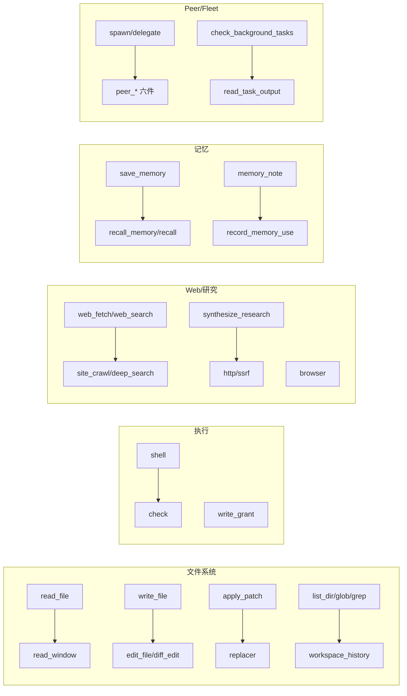
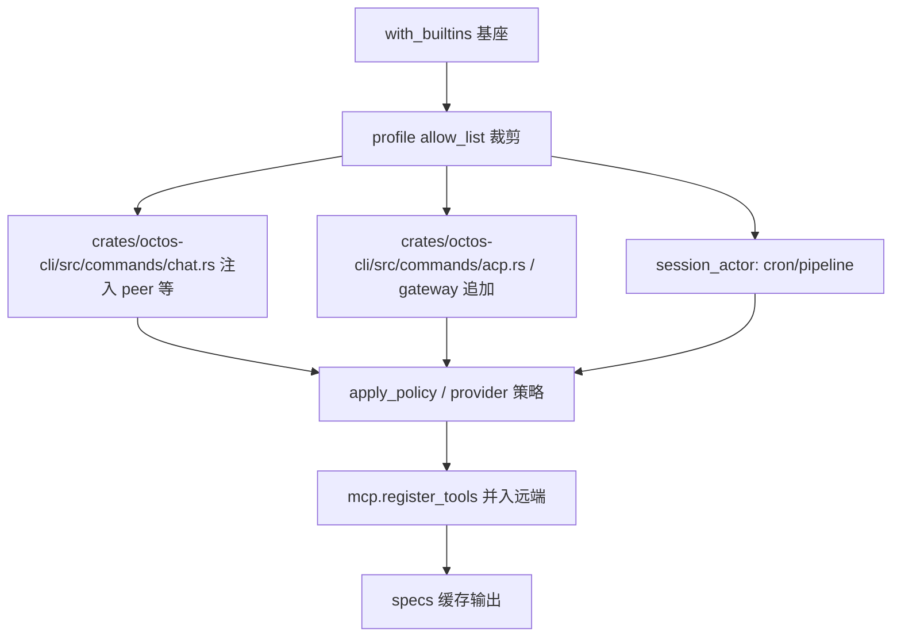

# Chapter 6: The Tool System: 58 Source Files Organized by Capability Domain

> **Positioning**: This chapter covers the "act" stage of the agent loop: the tool system. Instead of the old draft's linear inventory of built-in tools by fixed count, the narrative is reorganized around capability domains: first a survey of how the 58 entries under `crates/octos-agent/src/tools/` divide into 10 capability domains, then a descent into three skeleton files (`crates/octos-agent/src/tools/registry.rs` at 3,581 lines, `crates/octos-agent/src/tools/policy.rs` at 741 lines, `crates/octos-agent/src/tools/args.rs` at 479 lines) to explain the `Tool` trait contract, registration and lookup, exposure control, policy evaluation, and argument safety. Prerequisites: Chapter 5 (how the agent loop calls tools). Who should read it: AI application developers who want to understand agent tool architecture (reader C), and developers preparing to contribute a new tool to octos (reader D).

An agent's intelligence comes from the LLM; an agent's capabilities come from its tools. Without tools, an agent can only generate text. With tools, it can read and write files, run commands, search the web, manage Git repositories, and dispatch subagents.

First, the counting convention. Measured with `ls crates/octos-agent/src/tools/ | grep -v test`, the directory holds **58 entries**: 57 `.rs` files plus one `admin/` subdirectory (7 files inside, 3,424 lines together). The "59 source files" figure that appears on the blackboard and in early planning is the convention that counts test-class files and `crates/octos-agent/src/tools/mod.rs` in full (`ls crates/octos-agent/src/tools/*.rs | wc -l`). This chapter uses the structural convention throughout: 58 entries plus the 7 files of the `admin/` subdirectory. It also drops the old draft's long-dead fixed tool count: current source has no stable "total number of tools" at all. The same set of source files registers different tool surfaces under different construction paths, and understanding this layered registration model matters more than memorizing a number.

Capability brings risk: every tool call is a potential attack surface. octos answers with a three-line defense at the skeleton layer: `ToolPolicy` controls which tools are available (deny-wins), argument validation controls input safety (the 1 MB cap and structured error reporting), and symlink-safe I/O plus SSRF checks guard the filesystem and network boundaries. Chapter 7 covers the runtime semantics of the sandbox and `write_grant`; this chapter covers only the tool-side interface and registration.

---

## 6.1 The Capability-Domain Map: How 58 Entries Group

Per the facts table (`assets/ch06-facts.md`, commit `552be31`), the source files under tools/ divide into 10 capability domains. The table below is this chapter's navigation map; each domain gets its own subsection:

| Capability domain | Files | Source files |
|---|---|---|
| Filesystem | 12 | read_file, read_paging_probe, read_window, write_file, edit_file, apply_patch, diff_edit, list_dir, glob_tool, grep_tool, replacer, workspace_history |
| Shell/execution | 3 | shell, check, write_grant |
| Web/research | 9 | web_fetch, web_search, deep_search, synthesize_research, research_utils, site_crawl, http, ssrf, browser |
| Memory | 5 | memory_note, record_memory_use, recall, recall_memory, save_memory |
| Messaging/interaction | 4 | message, send_file, send_app_card, ask_user_question |
| Peer/Fleet | 10 | peer_handoff, peer_send_input, peer_gather, peer_list, peer_respond, peer_close, spawn, delegate, check_background_tasks, read_task_output |
| Code/structure | 2 | code_structure, coding_tools |
| Git | 1 | git |
| Skills/plugins | 3 | manage_skills, dora_bridge, mcp_agent |
| Platform misc | 6 | check_workspace_contract, tool_config, mofa_make, robot_groups, mod, admin/(7 files) |

How the totals add up: 58 entries = the 55 file-level entries across the 10 domains above (platform misc counts its actual 6 entries, with `admin/` as one) + the three skeleton files that belong to no domain (`registry`, `policy`, `args`).

Figure 6-1: capability-domain tool families (mermaid, rendered inline):



Several names don't match intuition, so settle them first. `crates/octos-agent/src/tools/glob_tool.rs` registers the tool named `glob`; `crates/octos-agent/src/tools/grep_tool.rs` registers `grep`; `crates/octos-agent/src/tools/workspace_history.rs` holds `workspace_log`; `crates/octos-agent/src/tools/site_crawl.rs` holds `deep_crawl`; `crates/octos-agent/src/tools/deep_search.rs` holds `search`; `crates/octos-agent/src/tools/delegate.rs` holds `delegate_task`. The file-name/tool-name split is a scar from this batch's early days of dodging Codex-compatible aliases. `crates/octos-agent/src/tools/coding_tools.rs` is stranger still: a single file implementing a whole group of Codex-compatible shims, `exec_command`, `write_stdin`, `spawn_agent`, `bash`, `delegate`, `view_image`, `tool_search`, `tool_suggest`, `image_generation`, and more (`crates/octos-agent/src/tools/coding_tools.rs:381`, `:738`, `:1283`, `:1945`, `:2428`, `:2800`, `:3149`, `:3250`, `:3388`). So "file count equals tool count" fails in both directions. `crates/octos-agent/src/tools/replacer.rs`, `crates/octos-agent/src/tools/read_paging_probe.rs`, `crates/octos-agent/src/tools/ssrf.rs`, `crates/octos-agent/src/tools/dora_bridge.rs`, `crates/octos-agent/src/tools/http.rs`, `crates/octos-agent/src/tools/read_window.rs`, `crates/octos-agent/src/tools/write_grant.rs` are not even standalone tools: they are support modules reused by other tools, or feature switches. That is the second axis of the capability-domain grouping: "who depends on whom," not just "what it's called."

Beyond the capability domains there is a second coordinate system to keep straight. The domains above are a factual division of file organization; `crates/octos-agent/src/tools/policy.rs` holds another grouping table, `TOOL_GROUPS`, divided by LLM-visible entry points (`crates/octos-agent/src/tools/policy.rs:187` onward, the `ToolGroupInfo` struct at `:179-183`, 10 groups in all), and the two do not coincide. `group:fs` admits only the five main entry points `read_file`, `write_file`, `edit_file`, `diff_edit`, `apply_patch`; more than half of the filesystem domain's 12 files are not in the group. The `bash` alias is implemented in `crates/octos-agent/src/tools/coding_tools.rs` (the code/structure domain) yet lands in `group:runtime` because of #1172. The seven members of `group:sessions` straddle the Peer/Fleet domain and the Codex-compatible shims. Groups are keyed by tool name, not file name, and the reason is direct: policy constrains the names the model can call, not where the source lives.

This static table carries one hard invariant. `group:delegated` (M6.7, `crates/octos-agent/src/tools/policy.rs:307` onward) is the standard deny table for delegated subagents and must cover every member of `group:sessions`; otherwise a subagent could spawn grandchildren and slip under the recursion guard. `expand_group` returns a flat static slice; the group mechanism has no group-within-group expansion, so supersets are maintained by hand. The test `group_delegated_supersets_session_spawn_family` checks it item by item on every build, and a comment records that this drift did happen: `spawn_agent`, `send_input`, the `*_agent` lifecycle tools, and the `delegate` wrapper were all reachable at one point. The same table deliberately excludes `shell`; the comment states in plain words that this is not a confinement boundary. Constraining command execution belongs to the sandbox layer, which the tool policy layer cannot manage and should not pretend to.

The domain-by-domain survey follows, one representative design point and source location per domain.

### 6.1.1 Filesystem (12 files)

The heaviest domain: `crates/octos-agent/src/tools/read_file.rs` at 2,366 lines and `crates/octos-agent/src/tools/write_file.rs` at 2,220 lines; these two files alone outweigh most whole domains. Three design points.

First, reading has multiple paths, not one. `read_file` handles ordinary reads; `crates/octos-agent/src/tools/read_paging_probe.rs` is a paging probe that observes without changing behavior (`crates/octos-agent/src/tools/read_paging_probe.rs:1-6`), built to answer the measurement question "does forced paging actually save tokens"; `crates/octos-agent/src/tools/read_window.rs` is windowed enforcement behind the `OCTOS_READ_WINDOW=1` feature switch (`crates/octos-agent/src/tools/read_window.rs:3`, `:178`), off by default, byte-for-byte identical to the old behavior without the environment variable. Three paths coexisting says: every tightening of the read path must earn its data first, its default second.

Second, writing has four layers. `write_file` writes whole files, `edit_file` does exact replacement, `diff_edit` matches by context, `apply_patch` accepts standard patch format. They share the cascading fuzzy-match chain in `crates/octos-agent/src/tools/replacer.rs` (#1771): the `old_string` the LLM provides often differs in whitespace, indentation, or escaping, and `edit_file` no longer hard-fails; it relaxes level by level, exact → line_trimmed → …, and takes the first matcher that produces a result (`crates/octos-agent/src/tools/replacer.rs:1-8`). This chain is the principle "tolerate the model's imprecision" made concrete.

Third, the three retrieval tools (`list_dir`/`glob`/`grep`) plus `crates/octos-agent/src/tools/workspace_history.rs` (registered as `workspace_log`, see `crates/octos-agent/src/tools/workspace_history.rs:101`) fill in "find files" and "view history."

### 6.1.2 Shell/execution (3 files)

`crates/octos-agent/src/tools/shell.rs` is 2,745 lines, registered as `shell`, the workhorse of the execution domain; the `bash` alias in the same domain lives at `crates/octos-agent/src/tools/coding_tools.rs:1945`. `crates/octos-agent/src/tools/check.rs` is the workspace checker (registered as `check`, `crates/octos-agent/src/tools/check.rs:526`). `crates/octos-agent/src/tools/write_grant.rs` is not a tool at all but the per-path write authorization structure introduced by #1976: `WritePathGrant` binds through the `with_write_grant` constructors of `write_file`/`edit_file`, turning "please don't write outside" from a polite request into a typed refusal (`crates/octos-agent/src/tools/write_grant.rs:53`, `:72`). Its runtime semantics and sandbox translation come in Chapter 7; here you only need one fact: the grant's match syntax is single-segment wildcards (`*`/`?` within one segment; `**`, `[...]`, `{...}` rejected).

### 6.1.3 Web/research (9 files)

From `web_fetch` single-page fetching and `web_search`, to `site_crawl` (registered as `deep_crawl`) and `deep_search` (registered as `search`) for site-level and multi-hop research, to `synthesize_research` assembling the findings into prose. Three support modules underneath: `crates/octos-agent/src/tools/http.rs` is the raw HTTP client (the tool name is passed in by the constructor, `crates/octos-agent/src/tools/http.rs:130`); `crates/octos-agent/src/tools/ssrf.rs` is the shared SSRF guard (`check_ssrf_with_addrs` at `crates/octos-agent/src/tools/ssrf.rs:24`, with DNS pinning against rebinding; `validate_answer_set` at `:69`; the redirect cap `SSRF_MAX_REDIRECTS = 10` at `:101`); `crates/octos-agent/src/tools/browser.rs` is the headless browser. Note that output limits are keyed by tool name: in `octos_core::tool_output_limit`, `read_file` gets 50,000 bytes, `shell` 30,000, `web_fetch` 40,000, `web_search` 20,000, and `search` (deep_search) 200,000 (`crates/octos-core/src/utils.rs:180-196`). Research tools get the widest allowance.

### 6.1.4 Memory (5 files)

`save_memory` writes, `recall_memory` recalls, `memory_note` takes notes, `record_memory_use` keeps the usage ledger. The new member is `crates/octos-agent/src/tools/recall.rs`, introduced by #2131: when context compaction replaces a tool output with a placeholder, `recall` rematerializes the full bytes from the content-addressed output ledger by `tool_call_id`, without re-running the call (`crates/octos-agent/src/tools/recall.rs:1-4`). It stays decoupled from octos-cli's ContextManager through the `ToolOutputLedger` trait (`crates/octos-agent/src/tools/recall.rs:15-21`), registered as `recall` (`:106`). This mechanism and Chapter 8's compaction ledger are two views of one design.

### 6.1.5 Messaging/interaction (4 files)

`message` sends text, `send_file` sends files, `send_app_card` sends cards, `ask_user_question` asks the user. The domain's defining trait: results are for humans, not the model. Output goes over the message bus rather than the tool-result channel (`MessageTool`/`SendAppCardTool` register sharing the same `tx` channel, `crates/octos-agent/src/tools/registry.rs:1735-1736`; `send_app_card`'s description states outright that `initial_state` must come from real tool data and must never be fabricated, `crates/octos-agent/src/tools/send_app_card.rs:130-140`). Chapter 10 develops this.

### 6.1.6 Peer/Fleet (10 files)

The largest domain. `crates/octos-agent/src/tools/spawn.rs` at 5,309 lines is the book's largest single-tool file (registered as `spawn`, `crates/octos-agent/src/tools/spawn.rs:2922`); `crates/octos-agent/src/tools/delegate.rs` (registered as `delegate_task`) is the single-call variant. The six tools `peer_handoff`/`peer_send_input`/`peer_gather`/`peer_list`/`peer_respond`/`peer_close` form the peer-channel primitives; `check_background_tasks` and `read_task_output` fill in background queries. This domain is the one most bound to `spawn_only` exposure control (6.3): calls to backgrounded tools are exactly what the execution loop intercepts and converts into background tasks.

### 6.1.7 Code/structure (2 files) and Git (1 file)

`crates/octos-agent/src/tools/code_structure.rs` emits a source-code symbol structure (registered as `code_structure`, with an internal 1 MB parse cap, `crates/octos-agent/src/tools/code_structure.rs:72`); `crates/octos-agent/src/tools/coding_tools.rs`, as above, is the Codex-compatible shim collection. `crates/octos-agent/src/tools/git.rs` registers as `git`, with the same 1 MB per-file cap on the diff side (`crates/octos-agent/src/tools/git.rs:291`).

### 6.1.8 Skills/plugins (3 files) and platform misc

`manage_skills` manages skill packages; `dora_bridge` bridges to the robot framework (tool names come from a mapping table, `crates/octos-agent/src/tools/dora_bridge.rs:178`); `mcp_agent` lets spawn dispatch tasks to any MCP backend (`crates/octos-agent/src/tools/mcp_agent.rs:1-6`). Among platform misc, `crates/octos-agent/src/tools/tool_config.rs` registers as `configure_tool` (`crates/octos-agent/src/tools/tool_config.rs:633`); `mofa_make` is a dispatcher (its target tools are hidden via `mark_internal_hidden`, 6.3); `crates/octos-agent/src/tools/robot_groups.rs` maintains robot safety tiers (`SafetyTier`: tools register in `RobotToolRegistry` at the minimum tier they require, and tier expansion automatically includes the lower tier's tools, `crates/octos-agent/src/tools/robot_groups.rs:26-38` and `:51-59`); the 7 files of the `admin/` subdirectory provide 20 `admin_*` operations tools (`admin_list_profiles`, `admin_system_health`, `admin_update_octos`, and others).

### Why split files by domain instead of one big file

Back to the grouping table that opened 6.1, one question deserves asking: why aren't the 12 filesystem tools merged into a single large file? What a domain shares is invariants and dependency direction, not volume. The filesystem domain shares three rules: every path must first normalize through the `resolve_path` family; every read and write must go through no-follow syscalls; every output must accept `tool_output_limit` truncation. Put those three in a shared module, put tool semantics in their own files, and adding a new read-path tool means implementing semantics, not re-copying defenses. Between domains, sharing is deliberately refused: the web domain's SSRF checks and the file domain's path checks do not reference each other, because their threat models differ (outbound request redirection versus local symlinks), and mixing them would turn a fix in one domain into a regression surface in the other. `crates/octos-agent/src/tools/spawn.rs` at 5,309 lines already demonstrates the cost of single-file bloat; `crates/octos-agent/src/tools/registry.rs` at 3,581 lines is the opposite extreme; the current per-domain split is the middle ground.

---

## 6.2 The Tool trait: the contract in crates/octos-agent/src/tools/mod.rs

Every tool implements the same trait (`crates/octos-agent/src/tools/mod.rs:609`):

```rust
#[async_trait]
pub trait Tool: Send + Sync {
    fn name(&self) -> &str;
    fn description(&self) -> &str;
    fn input_schema(&self) -> serde_json::Value;
    fn tags(&self) -> &[&str] { &[] }
    fn contexts(&self) -> &[String] { &[] }
    async fn execute(&self, args: &serde_json::Value) -> Result<ToolResult>;
    fn truncation_recovery(
        &self,
        args: &serde_json::Value,
        omitted_bytes: usize,
    ) -> Option<String> { None }
    async fn execute_with_context(
        &self,
        ctx: &ToolContext,
        args: &serde_json::Value,
    ) -> Result<ToolResult> { /* 默认委托 execute */ }
}
```

The contract has three layers. The declaration layer (`name` + `description` + `input_schema`) forms the `ToolSpec` sent to the LLM. The execution layer is two entry points: `execute` is the legacy args-only signature, `execute_with_context` is the typed entry introduced in M8.1 (the module docs at `crates/octos-agent/src/tools/mod.rs:11-28` record the migration in detail): the default implementations delegate to each other, and migrated tools override `execute_with_context` while letting `execute` re-enter with a zero-value context, so external callers see predictable behavior. A tool overrides at most one of the two; overriding both creates two independent paths the executor cannot reconcile. The governance layer is `tags()` (capability tags, consumed by `require_tags` filtering) and `contexts()` (declares which model contexts the tool appears in; an empty list means visible everywhere).

`truncation_recovery` deserves its own paragraph. Truncation happens in the execution loop, but the loop holds a bare string: it does not know which tool produced it, whether paging is supported, or what the arguments were. The tool knows how to continue reading but does not know it was truncated. This hook is the missing half: after truncating, the loop comes back with `args` and `omitted_bytes` to ask, and the tool returns a concrete "here is the next call to make" suggestion; the default `None` means there is no continuation path and none will be invented. The accompanying output cap is the `tool_output_limit` from 6.1.3 (`crates/octos-core/src/utils.rs:180`).

The typed context `ToolContext` (`crates/octos-agent/src/tools/mod.rs:261`) is an architecture autobiography in struct form: the reporter and harness event slots are UI channels; `agent_definitions`, `permissions`, `file_state_cache`, `notifications`, `app_state` are stubs pre-seeded in M8.1 and filled in by later milestones (each annotated with its owning issue); `subagent_output_router`/`subagent_summary_generator`/`task_supervisor`/`cost_accountant`/`parent_session_key` let spawned subagents and pipeline workers share the parent session's routing, summarization, supervision, and cost accounting; `spawn_depth` is the spawn-nesting guardrail from #607. Reading this struct's field order is close to reading half a year of octos evolution.

---

## 6.3 ToolRegistry: registration, lookup, and exposure control

`crates/octos-agent/src/tools/registry.rs` is 3,581 lines, with `ToolRegistry` defined at `crates/octos-agent/src/tools/registry.rs:127`. It is no simple name-to-tool dictionary; its field list (around `:127-235`) shows it managing seven jobs at once: the tool table, the workspace root, provider-level policy (filtering `specs()` without removing tools), the context tag filter, cached specs, the plugin-tool marker, and ownership of MCP transport handles.

These fields were not designed in one sitting; the issue numbers in the comments show the sediment layers. `spawn_only` and `spawn_only_messages` (`:164-166`) are survivors of RFC-0; `live_catalog` (`:179`) came with #1148: `tool_search` and `tool_suggest` need a catalog that refreshes in real time as the registry changes, while tool execution itself cannot reach a registry reference. So on every change (`register`, `apply_policy`, `mark_spawn_only`, etc., unified through `invalidate_cache`, `:1086`) the registry clones visible tools into this Mutex-guarded cell, and the query side takes a snapshot through `live_catalog_handle()` (`:1420`). A comment takes care to justify the Mutex: refreshing only clones a small Vec, and only when the registry changes. `internal_hidden` (`:206`) and the ownership semantics of `mcp_services` (#1886: visibility filtering must not decide transport lifetime) were bolted on by the RFC-1 fixup and the MCP merger respectively.

Beyond the fields there is a property easy to miss: `specs()` orders its output (`:746`). `tools` is a HashMap whose iteration order varies across processes and rebuilds, while providers replay this array verbatim into the LLM's prompt prefix; any reordering punches through the provider-side prompt cache (the tool array is the first segment of the cached prefix, as in Anthropic's `cache_control`). Sorting by name makes the serialized bytes stable for the same tool set, and only then does cache hit rate hold. This is an implementation detail promoted to an external contract: field order could have been arbitrary, but cache cost nailed it down.

### 6.3.1 Three constructors

```rust
pub fn with_builtins(cwd: impl AsRef<Path>) -> Self {
    Self::with_builtins_and_sandbox(cwd, Box::new(NoSandbox))
}

pub fn with_builtins_and_sandbox(cwd: impl AsRef<Path>, sandbox: Box<dyn Sandbox>) -> Self {
    let permissions = EffectivePermissions::workspace_write();
    Self::with_builtins_and_permissions(cwd, sandbox, permissions)
}
```

(excerpt from `crates/octos-agent/src/tools/registry.rs:1243-1252`)

`with_builtins` starts with a no-op sandbox; `with_builtins_and_sandbox` takes a custom sandbox but still workspace-write permissions; only `with_builtins_and_permissions` (`:1254`) hands over permissions too. The #1607 comment spells it out: under a no-op sandbox the agent-internal workspace validator runs argv directly, because there is nothing to escape from. The empty constructor `new()` (`:236`) starts from zero and is left to tests and special assemblies.

### 6.3.2 Registration and lookup

`register` (`:536`) takes ownership; `register_arc` (`:558`) takes `Arc<dyn Tool>`: when the same tool instance must appear in multiple registries at once (parent session and spawned subagent), the latter is mandatory. Lookup is `get`/`get_tool`; the dispatch boundary is `execute_with_context`, where four defenses stack: provider-policy refusal, the argument size cap (6.5), `catch_unwind` panic isolation (a panicking tool degrades to a failed ToolResult instead of killing the session actor and its children), and the global execution timeout (default 1,800 seconds; `set_tool_timeout_secs` at `:279`).

### 6.3.3 Exposure control: LRU is dead, spawn_only rules

The old draft spent pages on LRU tool lazy activation and `activate_tools`; state clearly first: that mechanism was deleted in RFC-0 (commit `172fb2be`, issue #1289) along with `activate_tools`; `find_evictable` and `ToolLifecycle` no longer exist. The current comment on `specs()` says it plainly: every enabled tool ships every turn, and the only remaining exclusions are internal-hidden, provider-policy refusal, and context-filter misses; nothing recency-based remains (`crates/octos-agent/src/tools/registry.rs:706-711`).

The surviving mechanism is `spawn_only` (`mark_spawn_only` at `:299`): tools so marked stay visible in `specs()` and callable by the LLM, but the call is intercepted at the execution loop's dispatch point, converted into a background task, and answered immediately with a task handle (`crates/octos-agent/src/agent/execution.rs:775-780` nearby). Figure 6-2 is the sequence:

```mermaid
sequenceDiagram
    participant LLM
    participant Loop as 执行循环
    participant Reg as ToolRegistry
    participant BG as 后台任务
    LLM->>Loop: tool_call(spawn_only 工具)
    Loop->>Reg: is_spawn_only(name)?
    Reg-->>Loop: true
    Loop->>Loop: provider 策略复查(拦截点)
    Loop->>BG: 起后台 tokio task 执行
    Loop-->>LLM: 立即返回 task_handle
    BG--)Loop: 完成回调(background_result_sender)
    Loop--)LLM: 下一轮注入结果消息
```

Supporting details: each registry holds a `spawn_only_invoked` atomic bool recording whether the mechanism was actually used this run; `background_result_sender` notifies the session actor when a task finishes; #896 fixed propagation of the filename inside the task_handle envelope so the LLM has a stable name to cite. Beyond those, two semantics are easy to miss. First, the marking can be cleared wholesale: `clear_spawn_only` (`crates/octos-agent/src/tools/registry.rs:355`) empties both sets and invalidates the specs cache; its comment says the purpose is subagent registries, where spawn_only tools should be directly callable, because a subagent is already a background context and backgrounding it again is meaningless. This directionality (parent session intercepts, child session permits) lines up with the layered registration paths of 6.3.4: exposure control is per-registry state, not an intrinsic property of the tool. Second, after M10 Phase 4 the LLM no longer receives that one free-text line plus full stdout, but a compact `task_handle` envelope built by `spawn_only_handle_message` (`crates/octos-agent/src/tools/registry.rs:388`): task id, expected artifact files, output directory, a `read_with: read_task_output` hint, and five read modes (head/tail/grep/line_range/file). Full output still lands on disk via M8.7's SubAgentOutputRouter and reaches the SPA; the change affects only what the model sees. The design goal: let the model inspect intermediate artifacts on demand without bloating context, complementary to `read_window`'s pre-limiting direction.

The RFC-0 trade-off that deleted LRU sits in the sidebar at this chapter's end.

`mark_internal_hidden` (`:324`) hides in the other direction: internal-hidden tools remain callable by internal forwarders but vanish from `specs()`, and no LLM-reachable "unhide" path exists; it is one-way. The dispatch targets of `mofa_make` (mofa_slides, mofa_cards, etc.) rely on it to stay reachable only through the dispatcher.

### 6.3.4 Six registration paths

"58 entries" does not mean "58 tools in every session." The same source files enter the registry through six paths, each appending or trimming:

1. Built-in base: the constructors (`crates/octos-agent/src/tools/registry.rs:1243-1254`) register the core tools: file, shell, retrieval, git, and others.
2. Profile roster: `crates/octos-agent/src/assets/profiles/coding.json` declares an allow_list (the lean coding roster, introduced in `9ecc5845`), applied by `crates/octos-agent/src/profile/mod.rs`; the list has only 12 entries but includes three group entries, `group:runtime`/`group:search`/`group:memory`, and deliberately reads back in `check`, `update_plan`, `tool_search`. The early lean list rejected those too, leaving the default coding session unable to run the workspace check or build a plan. `tool_search` is the escape hatch: the model can dynamically discover tools excluded by the allow_list.
3. chat command: `crates/octos-cli/src/commands/chat.rs:855`, `:1337` builds the registry with `with_builtins_and_permissions`, then injects runtime additions such as the peer tools.
4. ACP: `crates/octos-cli/src/commands/acp.rs:224`, `:501`, and several other places use `with_builtins_and_sandbox`.
5. gateway: `crates/octos-cli/src/commands/gateway/gateway_runtime.rs:823`; note that it calls `apply_policy` earlier than the session actor's registry reuse (the comment at `crates/octos-cli/src/session_actor.rs:2884` records this ordering contract).
6. MCP: `register_tools` at `crates/octos-agent/src/mcp.rs:532` merges remote tools in; a name colliding with a built-in is rejected outright, so a remote server cannot silently replace core functionality. Transport handles go to the registry before the tools do (#1886: visibility filtering must not decide transport lifetime, or a profile narrowing would kill the stdio child process as a side effect).

Figure 6-3: registration paths stacked (mermaid): base → profile roster → per-mode appends → policy trim → specs() output.



---

## 6.4 ToolPolicy: deny-wins and grouping

`crates/octos-agent/src/tools/policy.rs`, 741 lines. The core struct (`crates/octos-agent/src/tools/policy.rs:28-40`):

```rust
pub struct ToolPolicy {
    pub allow: Vec<String>,
    pub deny: Vec<String>,
    pub require_tags: Vec<String>,
    pub bash_file_writes: BashFileWrites,
}
```

Three dimensions of semantics plus one shell special case. Empty `allow` means "permitted unless explicitly denied"; `deny` always overrides `allow`; when `require_tags` is non-empty the tool must declare at least one matching tag, and **untagged tools fail outright (fail closed)**. That behavior changed after peer review; the comment on `is_allowed_with_tags` (`crates/octos-agent/src/tools/policy.rs:131-148`) preserves the record of this tightening. Figure 6-4 shows the evaluation flow:

```mermaid
flowchart TD
    S[evaluate(name)] --> D{deny 列表命中?}
    D -- 是 --> DR[Deny, reason=policy_deny<br/>或 robot_tier_gate]
    D -- 否 --> A{allow 为空?}
    A -- 是 --> OK[Allow]
    A -- 否 --> M{allow 命中?}
    M -- 是 --> OK
    M -- 否 --> DR2[Deny, 记 metric]
    OK --> T{require_tags 非空?}
    T -- 否 --> PASS[可见]
    T -- 是 --> TG{工具标签有交集?}
    TG -- 是 --> PASS
    TG -- 否 --> FAIL[不可见, fail closed]
```

`evaluate` (`crates/octos-agent/src/tools/policy.rs:77-128`) emits an `octos_tool_policy_denial_total` metric on denial, with reasons split between `robot_tier_gate` and `policy_deny`, so operators of robot integrations can alert on either.

Entries take three forms: tool names, `group:*` groups, and wildcards. The grouping table `TOOL_GROUPS` (`crates/octos-agent/src/tools/policy.rs:180` onward, `ToolGroupInfo`) sorts tools into `group:fs`, `group:runtime`, `group:web`, `group:search`, `group:sessions`, and others. The lesson of #1172 is written into `group:runtime`: the group must contain the Codex-compatible alias `bash`, or a profile that disables runtime can still slip through via `bash(cmd=…)`. Alias equivalence is a hard correctness constraint on policy.

`bash_file_writes` (#28b) is a three-position switch (`crates/octos-agent/src/tools/policy.rs:55-68`): `allow` (the default) changes nothing; `warn` appends a "use edit_file/diff_edit instead" hint to the tail of change receipts; `deny` refuses write-shaped commands after heuristic pre-screening, with a `# octos:allow-write` trailing-comment escape hatch.

Two application entry points must be distinguished. `apply_policy` (`crates/octos-agent/src/tools/registry.rs:869-875`) physically trims the registry with `retain`: trimmed tools are truly gone. `set_provider_policy` (`crates/octos-agent/src/tools/registry.rs:947-953`) only sets a filter: tools stay in the table, and `specs()` plus the dispatch boundary judge dynamically under deny-wins-then-allow semantics (alias equivalence included); `provider_policy_permits` additionally lets the workspace validator confirm "does provider policy permit the model to call this tool." The config key for provider-level policy is `tool_policy_by_provider` (`crates/octos-cli/src/config.rs:132`), mapping provider names to their own ToolPolicy; a policy fetched via `provider_policy()` propagates to subagent registries along with spawn.

---

## 6.5 Arguments and path safety

Three gates.

Gate one, size. The dispatch boundary rejects oversized arguments, cap 1 MB (`MAX_ARGS_SIZE = 1_048_576`), with `estimate_json_size` recursively estimating the serialized size (`crates/octos-agent/src/tools/registry.rs:1132-1143`; the estimator at `:95-119`). Note that this 1 MB lives in `crates/octos-agent/src/tools/registry.rs`, not `crates/octos-agent/src/tools/args.rs`. The facts table's reminder on this point is correct: the constant is not in `crates/octos-agent/src/tools/args.rs`.

`estimate_json_size` (`crates/octos-agent/src/tools/registry.rs:95-119`) is worth a closer look, because it demonstrates a trade-off that recurs. The obvious implementation is `serde_json::to_string(args).len()`, but that serializes the entire argument into a String first, allocating memory the size of the argument, just to obtain one number, then throws it away. At the dispatch boundary, crossed on every tool call of every turn, that allocation is pure waste. This function instead walks the `serde_json::Value` tree recursively, counting bytes per node: strings by content length plus escape overhead plus two quotes; arrays by 2 plus the sum of elements plus commas; objects by key length plus 3 (colon and quotes) plus the subtree, for each key. The estimate is exactly accurate enough for the one judgment "over the cap or not." Zero allocation, zero copy, good enough and stopping there: the shape boundary-checking code should have.

Gate two, structure. `crates/octos-agent/src/tools/args.rs`, 479 lines, is about error quality, not whether to error: on serde failure it reported only the first problem and ignored unknown fields, so the model either retried verbatim (an infinite loop, #1765) or guessed blindly at fixes. `parse_tool_args` keeps serde as the parsing source of truth, then on failure walks the raw JSON against the tool's own `input_schema()` and reports every problem at once: which required parameter is missing, which name is misspelled (with a did-you-mean), which type is wrong (`crates/octos-agent/src/tools/args.rs:1-30`). Errors reach the model as `ToolInputError`, capped at 4,096 bytes (`TOOL_INPUT_ERROR_MAX_BYTES` in `crates/octos-agent/src/tools/mod.rs`), so the model can self-repair while caller-controlled content cannot blow up the output limit (#2193 R4). These failures are also marked side-effect-free and non-cascading (#1690): one bad call does not drag down the good calls in the same batch.

Gate three, boundaries. Paths normalize through `resolve_path` (`crates/octos-agent/src/tools/mod.rs:972`) and its scoped variants (`:1014`, `:1052`, `:1061`) onto the session filesystem contract; file reads and writes go through `read_no_follow`/`write_no_follow` against symlink escape (usage visible around `crates/octos-agent/src/tools/edit_file.rs:182`); the network side is guarded by `crates/octos-agent/src/tools/ssrf.rs` (6.1.3). The full threat models of the three belong to Chapter 7.

### 6.5.1 The coding tool contract

What the frontend wants is not "roughly these tools" but a machine-checkable contract. `crates/octos-cli/src/api/coding_tool_contract.rs` defines `coding.tool_contract.v1` (`:12`), contract ID `codex-compatible-coding-v1`, policy ID `coding-v1`. The P0 required tool set `CODING_P0_REQUIRED_TOOL_NAMES` (`:85`) lists 10: `apply_patch`, `exec_command`, `write_stdin`, `update_plan`, `request_user_input`, `spawn_agent`, `send_input`, `resume_agent`, `wait_agent`, `close_agent`. The tool status vocabulary is `available`/`aliased`/`disabled_by_policy`/`missing`/`unimplemented`/`deferred` (`:21-34`), with `connected`/`connecting`/`failed`/`disabled` on the MCP side. The amusing detail: the comment on `deferred` still mentions LRU auto-eviction and `activate_tools` restoration (vocabulary kept for frontend compatibility), while the mechanism itself died with RFC-0. Do not conclude from the comment that LRU lives.

### 6.5.2 Three governance tools as samples

`write_grant` (#1976), `read_window` (#1638), and `recall` (#2131) mark the tool system's recent direction: fewer tools that "do more," more tools that "govern what was already done." `write_grant` sinks the fleet task's `fs.write` authorization into a kernel-side fence inside the tool; `read_window` is off by default and requires `OCTOS_READ_WINDOW=1`, with a documented parameter provenance: the 2,000-line cap comes from the pi harness's measured default, and the 48 KiB byte cap is back-derived to fit page footer plus content inside the 50,000-byte output limit (`crates/octos-agent/src/tools/read_window.rs:1-30`); `recall` makes compaction-replaced outputs retrievable by id, one design with Chapter 8's content-addressed ledger. All three share one prefix: change nothing by default, tighten only on opt-in.

---

## 6.6 Engineering decision sidebar: why LRU lazy activation was deleted

RFC-0 (commit `172fb2be`, #1289) deleted LRU not because it was broken but because the problem it answered had found a different answer. LRU assumed "tool schemas are a significant per-turn token cost; cold tools should hide, and the model fetches them back via `activate_tools` when needed." Three facts dissolved that assumption. First, the fetch-back path requires the model to know which tools it lacks, and the model least knows that after the tools are hidden. The `tool_search` escape hatch (now shipped with the lean coding roster by default) solves discovery at lower complexity. Second, lazy activation made tool visibility depend on session history: "which tools does this session have?" turned from a static question into a dynamic one, and contract validation, policy audit, and frontend rendering all paid for it. Third, what long-running tools that need "declare first, execute later" actually need is "don't block the foreground turn," which is precisely `spawn_only` auto-backgrounding semantics, unrelated to exposure control. After the deletion, `specs()` outputs in full every turn, and the cache mechanism (`cached_specs`, invalidated on registry change) absorbs the repeated serialization cost. The lesson: when two mechanisms appear to treat the same symptom, first ask whether each one's causal chain still holds.

---

## 6.7 Recap

This chapter surveyed the 58 entries and 10 domains of tools/, then descended into three skeleton files: the `Tool` trait's three-layer contract and the typed-context migration; `ToolRegistry`'s three constructors, six registration paths, and `spawn_only`-centered exposure control (LRU deleted); `ToolPolicy`'s deny-wins, grouping, alias equivalence, and the fail-closed tag gate; and the three safety gates of argument size, structured error reporting, and path/network boundaries. Chapter 7 completes the runtime semantics of sandbox and grants; Chapter 16's closed registry and Chapter 18's goal/peer tools both stand on this chapter's registration and policy semantics.

## Further reading

- The module docs atop `crates/octos-agent/src/tools/mod.rs`: the full design note for the typed `ToolContext` migration (M8.1).
- The `ToolRegistry` field comments in `crates/octos-agent/src/tools/registry.rs`: design rationale for MCP transport ownership (#1886) and panic isolation.
- `crates/octos-agent/src/tools/policy.rs`: the fail-closed revision comment on `is_allowed_with_tags`.
- Chapter 5 (the loop's tool-call cycle), Chapter 7 (sandbox and write_grant), Chapter 8 (recall and the compaction ledger).

## Exercises

1. The same `coding.json` allow_list behaves differently under `apply_policy` (physical trim) versus `set_provider_policy` (dynamic filter). In which scenario does the difference surface? Hint: consider MCP tools merging in afterward.
2. When `require_tags` is non-empty, untagged tools fail closed rather than pass. What security property does that unfriendliness buy?
3. `group:runtime` must contain the `bash` alias. If a new shell-entry alias is added but forgotten in the group, at which layer does the attack surface appear: policy, registry, or execution?
4. `recall` depends on a content-addressed ledger; `read_window` depends on windows plus page footers. Both work on "truncation" in opposite directions (one retrieves after the fact, one limits in advance). Which approach suits a tool like `grep`, whose output shape is unpredictable? Why?
5. RFC-0 deleted LRU but kept `spawn_only`. Deciding whether to mark a new tool `spawn_only`, what property of the tool should the criterion look at?

## Version note

> **Version note**: This chapter's baseline is octos source commit `9c157101` (measured 2026-09-03, main branch). Line numbers and structure follow `assets/ch06-facts.md` (commit `552be31`); all key line numbers were re-verified by hand. Historical note: LRU tool lazy activation and `activate_tools` were deleted in RFC-0 (`172fb2be`, #1289); the `deferred` status vocabulary in `crates/octos-cli/src/api/coding_tool_contract.rs` is retained for frontend compatibility and does not mean the mechanism survives.


