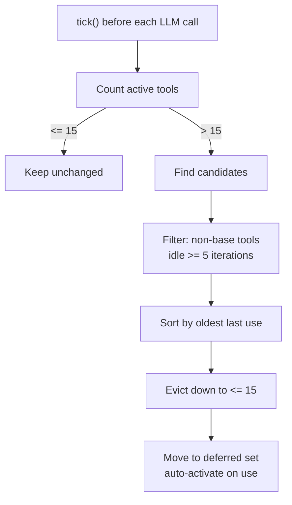
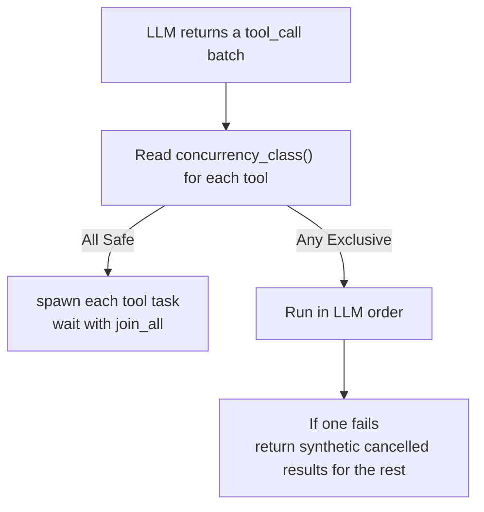

# Chapter 6: Tool System: Design Patterns of Built-in Tools

> **Positioning**: This chapter dives into the "act" phase of the Agent Loop: the tool system. It explains the `Tool` trait, layered `ToolRegistry` registration, LRU-style tool exposure control, ToolPolicy's deny-wins semantics, and parameter safety. Prerequisite: Chapter 5. Use when you need to understand octos tool architecture or contribute a new tool.

An Agent's intelligence comes from the LLM, but its capability comes from tools. Without tools, an Agent can only generate text. With tools, it can read and write files, run commands, search the web, and manage repositories. The current source can no longer be summarized as "15 base tools": `ToolRegistry::with_builtins_and_permissions()` registers traditional file/search/web/workspace tools, the Codex-compatible coding surface, dynamic tool discovery, and an `image_generation` typed stub with no backend bound yet. `git` and `code_structure` remain Cargo-feature gated, while `configure_tool`, `spawn`, `message`, `send_file`, `read_task_output`, `synthesize_research`, `manage_skills`, and `model_check` are layered in by chat, gateway, and session actors in different runtime modes (`../octos/crates/octos-agent/src/tools/registry.rs:1168-1284`, `../octos/crates/octos-cli/src/api/coding_tool_contract.rs:1-180`, `../octos/crates/octos-cli/src/commands/chat.rs`, `../octos/crates/octos-cli/src/commands/gateway/gateway_runtime.rs`, `../octos/crates/octos-cli/src/session_actor.rs`). Understanding this layered registration model is more important than memorizing a fixed number.

Tools also expand the attack surface. octos uses three main lines of defense: ToolPolicy controls which tools are available, parameter validation controls input size and shape, and symlink-safe I/O controls filesystem boundaries.

---

## 6.1 Tool Trait: A Minimal Tool Interface

The `Tool` trait (`../octos/crates/octos-agent/src/tools/mod.rs:436-492`) defines the shared interface for all tools:

```rust
pub trait Tool: Send + Sync {
    fn name(&self) -> &str;
    fn description(&self) -> &str;
    fn input_schema(&self) -> serde_json::Value;
    fn tags(&self) -> &[&str] { &[] }
    async fn execute(&self, args: &serde_json::Value) -> Result<ToolResult>;
    async fn execute_with_context(
        &self,
        _ctx: &ToolContext,
        args: &serde_json::Value,
    ) -> Result<ToolResult> { self.execute(args).await }
    fn as_any(&self) -> &dyn std::any::Any { &() }
    fn concurrency_class(&self) -> ConcurrencyClass { ConcurrencyClass::Safe }
}
```

The trait has three responsibilities.

**Declaration**: `name()`, `description()`, and `input_schema()` form the `ToolSpec` sent to the LLM. The schema is JSON Schema describing how to call the tool.

**Execution**: `execute()` receives model-generated JSON arguments and returns a `ToolResult`:

```rust
pub struct ToolResult {
    pub output: String,
    pub success: bool,
    pub file_modified: Option<PathBuf>,
    pub files_to_send: Vec<PathBuf>,
    pub tokens_used: Option<TokenUsage>,
    pub structured_metadata: Option<serde_json::Value>,
}
```

**Integration**: `execute_with_context()` lets migrated tools read typed `ToolContext` without breaking the older `execute()` signature. `tags()` labels tool capabilities. `as_any()` gives the framework a narrow downcast escape hatch; for example, `activate_tools` needs a back-reference to `ToolRegistry` after the Agent is built (`../octos/crates/octos-agent/src/agent/mod.rs:384-394`). `concurrency_class()` marks tools as `Safe` or `Exclusive` so the executor can choose parallel or serial admission.

`structured_metadata` is a newer host-side channel. It does not change the legacy text output, but lets tools such as `run_pipeline` attach per-node cost rows that the session actor can forward through UI/API completion metadata for the cost panel (`../octos/crates/octos-agent/src/tools/mod.rs:392-415`).

`tags()` affects at least two filters:

- `ToolPolicy::require_tags` filters provider-visible tools through `is_allowed_with_tags()`.
- `ToolRegistry::set_context_filter()` filters the `specs()` output by context tags.

Both paths treat tools with no tags as universal tools, so they remain visible unless a name policy denies them (`../octos/crates/octos-agent/src/tools/policy.rs:91-113`, `../octos/crates/octos-agent/src/tools/registry.rs:410-443`, `../octos/crates/octos-agent/src/tools/registry.rs:585-593`).

During the migration, tool context has two paths. Newer tools read typed `ToolContext` through `execute_with_context()`, while legacy plugin tools can still read the same context through the task-local `TOOL_CTX`. This keeps the trait evolution backwards-compatible while carrying progress reporting, attachments, permissions, file cache, and subagent routing (`../octos/crates/octos-agent/src/tools/mod.rs:3-30`, `../octos/crates/octos-agent/src/tools/mod.rs:214-307`, `../octos/crates/octos-agent/src/agent/execution.rs:963-1002`).

---

## 6.2 ToolRegistry: Registration and LRU Eviction

### 6.2.1 Registration

`ToolRegistry` (`../octos/crates/octos-agent/src/tools/registry.rs`) is not "all tools registered once". It provides a base registry, and chat, gateway, and session actors layer additional tools on top.

`with_builtins_and_permissions()` now registers two capability layers: the traditional base tools and the Codex-compatible coding surface.

| Layer | Tools | Boundary |
|-------|-------|----------|
| Files/editing | `read_file`, `write_file`, `edit_file`, `diff_edit`, `apply_patch` | Read, write, exact replacement, diff/patch editing; writes are gated by file-access policy |
| Runtime | `shell`, `exec_command`, `write_stdin`, `bash` | Run commands, hold PTY/long-running sessions, write stdin; `bash` is a Codex-compatible alias |
| Plan/input | `update_plan`, `request_user_input` | Structured plan state and user-input requests |
| Child-agent lifecycle | `spawn_agent`, `send_input`, `resume_agent`, `wait_agent`, `close_agent`, `delegate` | Codex-compatible subagent control; `delegate` wraps `spawn_agent + wait_agent` |
| Search/web | `glob`, `grep`, `list_dir`, `web_search`, `web_fetch`, `browser` | File search, content search, web search/fetch, browser automation |
| Workspace | `check_workspace_contract`, `workspace_log`, `workspace_show`, `workspace_diff` | Workspace contract checks and history/diff inspection |
| Image/discovery | `view_image`, `tool_search`, `tool_suggest`, `image_generation` | Image metadata inspection, live tool discovery; `image_generation` is currently a typed unsupported stub |
| Feature-gated | `git`, `code_structure` | Git and AST analysis, gated by `git` / `ast` features |

Runtime registration is layered:

| Layer | Location | Typical tools |
|-------|----------|---------------|
| Base | `../octos/crates/octos-agent/src/tools/registry.rs:1168-1284` | Traditional tools + Codex-compatible coding tools + dynamic discovery |
| Contract | `../octos/crates/octos-cli/src/api/coding_tool_contract.rs` | `coding.tool_contract.v1`, P0 required tools, tool status, and capability vocabulary |
| Config | `../octos/crates/octos-agent/src/tools/registry.rs` | `configure_tool`, configured web tools |
| Chat additions | `../octos/crates/octos-cli/src/commands/chat.rs:217-315` | `spawn`, `synthesize_research`, `recall_memory`, `save_memory`, `run_pipeline`, plugin/MCP tools |
| Gateway base additions | `../octos/crates/octos-cli/src/commands/gateway/gateway_runtime.rs:615-698` | account-scoped plugin/MCP tools, configured web/browser, provider policy |
| Per-session additions | `../octos/crates/octos-cli/src/session_actor.rs:2122-2310` | `read_task_output`, `message`, `send_file`, `spawn`, `cron`, per-session `run_pipeline` |

This is why `tools/mod.rs` can mislead readers. It exports available tool types; it is not the default runtime registry (`../octos/crates/octos-agent/src/tools/mod.rs:575-663`).

The registry also caches `specs()` output and invalidates that cache only when the registry changes (`../octos/crates/octos-agent/src/tools/registry.rs:66-68`, `../octos/crates/octos-agent/src/tools/registry.rs:410-443`). It also distinguishes cwd-bound tools from shared tools: `rebind_cwd()` rebuilds only the cwd-bound tools when switching to a per-user workspace, and the current cwd-bound set includes `check_workspace_contract` plus workspace history/diff tools.

### 6.2.2 Codex-Compatible Surface: Model-Visible, Not Frontend-Local

`coding_tool_contract.rs` declares this surface as `coding.tool_contract.v1`, with contract id `codex-compatible-coding-v1`. The P0 required tools are `apply_patch`, `exec_command`, `write_stdin`, `update_plan`, `request_user_input`, `spawn_agent`, `send_input`, `resume_agent`, `wait_agent`, and `close_agent`. These are stable names exposed to the model and AppUI; the frontend does not implement file editing, command execution, or subagent control itself.

The subagent tools need careful wording. `spawn_agent` can use the native spawn delegate and `TaskSupervisor` path when the runtime binds it; `wait_agent` and `close_agent` also work around supervised task state. But model-visible `send_input` currently records input in supervisor metadata and returns a structured `delivered: false` / `delivery: "supervisor_metadata"` envelope. It is not yet a live conversation channel into a running child Agent. So Octos already has the tool names, state contract, and supervised lifecycle needed by a Codex-compatible autonomous coding harness, but it is not a fully self-organizing multi-agent society.

`tool_search` and `tool_suggest` read from the registry's live catalog cell. Registry mutations refresh that catalog, so discovery reflects tools added by chat/gateway/profile/MCP/plugin wiring rather than a startup snapshot. `image_generation` is the opposite case: it is model-visible and returns a typed `coding_tool_unsupported` error because no image backend is bound for the active profile.

### 6.2.3 Exposure Control: Pre-Defer + LRU + Auto-Activation

LLM tool calling includes ToolSpecs in the request, and every ToolSpec consumes context-window tokens. Current octos does not rely on one mechanism to control tool growth. It combines three:

1. Startup pre-defers low-frequency groups with `defer_group()`.
2. Runtime LRU moves idle non-core tools into the deferred set.
3. `execute()` auto-activates a deferred tool's group when the model actually calls it.

The LRU state is held in `ToolLifecycle` (`../octos/crates/octos-agent/src/tools/mod.rs:498-560`):

```rust
pub struct ToolLifecycle {
    pub(crate) last_used: HashMap<String, u32>,
    pub(crate) iteration: u32,
    pub(crate) base_tools: HashSet<String>,
    pub(crate) max_active: usize,
    pub(crate) idle_threshold: u32,
}
```

| Parameter | Default | Meaning |
|-----------|---------|---------|
| `max_active` | 15 | Maximum simultaneously active tools |
| `idle_threshold` | 5 | Idle iterations before eviction eligibility |



`tick()` runs before each LLM request; `auto_evict()` then applies `find_evictable()` before the next ToolSpec list is built (`../octos/crates/octos-agent/src/agent/loop_runner.rs:703-708`, `../octos/crates/octos-agent/src/tools/registry.rs:755-797`).

The algorithm has three important properties:

- `base_tools` are never evicted, even if they occupy all active slots.
- `idle_threshold` prevents recently used tools from thrashing in and out.
- Eviction is minimal: only `active_count - max_active` tools are moved.

Reactivation is not a separate `activate_on_demand()` API. It happens inside `ToolRegistry::execute_with_context()`: if the target tool is deferred, the registry finds its group, calls `activate()`, then performs argument checking and execution (`../octos/crates/octos-agent/src/tools/registry.rs:823-897`).

`activate_tools` is optional. It exposes deferred tools to the LLM for explicit discovery and batch preloading, but it is not the only way to wake a tool. Gateway/ProfileFactory register it only when deferred tools exist, and `wire_activate_tools()` fills the registry back-reference after Agent construction (`../octos/crates/octos-cli/src/commands/gateway/gateway_runtime.rs:1025-1050`, `../octos/crates/octos-cli/src/commands/gateway/profile_factory.rs:743-755`, `../octos/crates/octos-agent/src/tools/activate_tools.rs:8-107`, `../octos/crates/octos-agent/src/agent/mod.rs:384-394`, `../octos/crates/octos-cli/src/session_actor.rs:2499-2500`).

LRU state is per-session. In Gateway/Serve mode, each session actor has its own `ToolRegistry`, so one session's tool usage does not affect another session.

`spawn_only` is not part of deferred/LRU. PluginLoader marks such tools as `spawn_only`; an old comment still says they are hidden from specs, but the current implementation explicitly does **not** defer them. The tools remain visible to the model, and the execution loop redirects the call into a background task at the call site (`../octos/crates/octos-agent/src/plugins/loader.rs:145-176`, `../octos/crates/octos-agent/src/plugins/loader.rs:362-456`).

In the main session, a `spawn_only` hit first enforces provider policy, then registers a supervised background task, and preferably returns a small `task_handle` JSON envelope to the LLM. Only when `read_task_output` is not visible does it fall back to the older free-text message. The full output still goes through `SubAgentOutputRouter` / `BackgroundResultSender` to the UI; if the LLM wants intermediate output, it should call `read_task_output(task_handle, mode=...)` instead of reloading the full background output into context (`../octos/crates/octos-agent/src/agent/execution.rs:220-307`, `../octos/crates/octos-agent/src/agent/execution.rs:924-960`, `../octos/crates/octos-agent/src/tools/registry.rs:165-209`, `../octos/crates/octos-cli/src/session_actor.rs:2122-2139`).

Inside subagents, `SpawnTool` calls `clear_spawn_only()` so those tools execute normally, because the subagent itself is already a background context (`../octos/crates/octos-agent/src/tools/spawn.rs:2148-2150`, `../octos/crates/octos-agent/src/tools/spawn.rs:2453-2455`).

Gateway also pins some names before the per-session tools exist. It adds `message`, `send_file`, `spawn`, and `activate_tools` to `base_tools` on the base registry. Because `ToolLifecycle` pins by name and `snapshot_excluding()` copies the base set, those tools remain non-evictable once injected by the session actor. `read_task_output` is pinned after registration in the session actor so the `task_handle` envelope never points at an LRU-evicted reader in long sessions (`../octos/crates/octos-cli/src/commands/gateway/gateway_runtime.rs:1001-1023`, `../octos/crates/octos-agent/src/tools/registry.rs:595-640`, `../octos/crates/octos-cli/src/session_actor.rs:2122-2139`).

### 6.2.4 Concurrency Admission: Safe in Parallel, Exclusive in Serial

The tool system now lifts concurrency into the trait. `ConcurrencyClass::Safe` means read-only or side-effect-free tools can run alongside other Safe calls. `ConcurrencyClass::Exclusive` means mutating or stateful tools must run serially (`../octos/crates/octos-agent/src/tools/mod.rs:392-492`).

When the Agent receives a batch of tool calls, it classifies the whole batch:



This is more conservative than running every call in parallel and more efficient than serializing everything. Reads and searches can still fan out; writes, shell, and stateful tools avoid same-turn interference (`../octos/crates/octos-agent/src/agent/execution.rs:1192-1272`).

---

## 6.3 ToolPolicy: Deny-Wins Semantics

`ToolPolicy` (`../octos/crates/octos-agent/src/tools/policy.rs:26-224`) controls availability through three dimensions:

```rust
pub struct ToolPolicy {
    pub allow: Vec<String>,
    pub deny: Vec<String>,
    pub require_tags: Vec<String>,
}
```

`allow` and `deny` decide name-level visibility. `require_tags` decides tag-level visibility. Combined evaluation still follows deny-wins, and denials carry metric reasons such as `policy_deny` or `robot_tier_gate` (`../octos/crates/octos-agent/src/tools/policy.rs:26-118`).

### 6.3.1 The Deny-Wins Rule

```rust
pub fn is_allowed(&self, tool_name: &str) -> bool {
    for entry in &self.deny {
        if entry_matches(entry, tool_name) {
            return false;
        }
    }
    if self.allow.is_empty() {
        return true;
    }
    self.allow.iter().any(|entry| entry_matches(entry, tool_name))
}
```

If a tool is both allowed and denied, it is denied. Explicit deny rules must not be overridden by broad allow rules.

### 6.3.2 Wildcards, Groups, and Tags

Policies support:

- Trailing wildcard: `web_*` matches `web_search` and `web_fetch`.
- Groups: `group:fs` expands to filesystem tools.
- Tag requirements: if `require_tags` is non-empty, tagged tools must match at least one required tag; untagged tools remain universal (`../octos/crates/octos-agent/src/tools/policy.rs:91-113`).

Current predefined groups include:

| Group | Tools |
|-------|-------|
| `group:fs` | read_file, write_file, apply_patch, edit_file, diff_edit |
| `group:runtime` | shell, exec_command, write_stdin, bash |
| `group:web` | web_search, web_fetch, browser |
| `group:search` | glob, grep, list_dir |
| `group:sessions` | spawn, spawn_agent, send_input, resume_agent, wait_agent, close_agent, delegate |
| `group:memory` | recall_memory, save_memory |
| `group:research` | search, synthesize_research, deep_crawl |
| `group:admin` | manage_skills, configure_tool, model_check |
| `group:media` | mofa_comic, mofa_slides, mofa_infographic, mofa_cards, fm_tts, fm_voice_list |
| `group:delegated` | delegate_task, spawn, send_message, message, save_memory, execute_code |

Groups are a global policy vocabulary, not a guarantee that every listed tool is registered in the current mode. For example, `group:admin` includes `manage_skills`, `configure_tool`, and `model_check`, but chat mode typically has only `configure_tool`; gateway mode may have all three. `group:delegated` is the canonical deny list for delegate children: it blocks re-delegation, background spawning, user messages, memory writes, and arbitrary code execution. `defer_group()` and `activate()` both skip names absent from the current registry (`../octos/crates/octos-agent/src/tools/policy.rs:153-224`, `../octos/crates/octos-agent/src/tools/registry.rs:656-690`).

### 6.3.3 Provider-Level Policy

The current config field is top-level `tool_policy_by_provider`, not the older `tools.byProvider`. Matching prefers exact model ID first, then provider name (`../octos/crates/octos-cli/src/config.rs:62-69`, `../octos/crates/octos-cli/src/commands/chat.rs:688-701`):

```json
{
  "tool_policy_by_provider": {
    "claude-sonnet-4-20250514": {
      "deny": ["browser", "deep_search"]
    },
    "gemini": {
      "allow": ["group:fs", "group:search"],
      "require_tags": ["code"]
    }
  }
}
```

Two APIs have different semantics:

- `apply_policy()` is a hard cut. It physically retains only allowed tools.
- `set_provider_policy()` is a soft filter. Tool objects stay in the registry, but `specs()` hides them and `execute()` rejects forbidden calls.

This lets global `tool_policy` enforce least privilege while `tool_policy_by_provider` adjusts visibility for different models without destroying the underlying registry. `retain()` also prunes stale `spawn_only`, `spawn_only_messages`, and `deferred` side state so policy pruning cannot leave behind backgrounding or activation ghosts (`../octos/crates/octos-agent/src/tools/registry.rs:460-498`, `../octos/crates/octos-agent/src/tools/registry.rs:567-582`, `../octos/crates/octos-agent/src/tools/registry.rs:839-896`).

---

## 6.4 Parameter Safety: 1MB Limit and Symlink-Safe I/O

### 6.4.1 Parameter Size Limit

Tool arguments are limited to 1MB (`../octos/crates/octos-agent/src/tools/registry.rs:876-886`):

```rust
const MAX_ARGS_SIZE: usize = 1_048_576; // 1 MB
```

This prevents the LLM from sending huge arguments, such as embedding an entire file into an edit request, and reduces memory exhaustion or downstream timeout risk.

### 6.4.2 `estimate_json_size`: Zero-Allocation Estimation

The size check does not allocate a serialized JSON string with `serde_json::to_string()`. It recursively walks the existing JSON tree and estimates the serialized size (`../octos/crates/octos-agent/src/tools/registry.rs:26-54`):

```rust
fn estimate_json_size(value: &serde_json::Value) -> usize {
    match value {
        serde_json::Value::Null => 4,
        serde_json::Value::Bool(true) => 4,
        serde_json::Value::Bool(false) => 5,
        serde_json::Value::Number(n) => n.to_string().len(),
        serde_json::Value::String(s) => {
            let escapes = s.bytes()
                .filter(|&b| matches!(b, b'\"' | b'\\' | b'\n' | b'\r' | b'\t'))
                .count();
            s.len() + escapes + 2
        }
        serde_json::Value::Array(arr) => {
            2 + arr.iter().map(estimate_json_size).sum::<usize>() + arr.len().saturating_sub(1)
        }
        serde_json::Value::Object(obj) => {
            2 + obj.iter().map(|(k, v)| k.len() + 3 + estimate_json_size(v)).sum::<usize>()
                + obj.len().saturating_sub(1)
        }
    }
}
```

The estimate is O(N) time and O(depth) stack space. Exact byte precision is less important than avoiding allocation while enforcing a safe upper bound.

### 6.4.3 Symlink-Safe I/O

Filesystem protection has two layers:

- `resolve_path()` normalizes paths and blocks absolute paths or `..` traversal. It does not touch the filesystem and does not resolve symlinks.
- `read_no_follow()` and `write_no_follow()` perform actual I/O and use `O_NOFOLLOW` on Unix to reject symlinks atomically. Directory tools such as `list_dir` add `reject_symlink()` as a defensive check.

The helpers live in `../octos/crates/octos-agent/src/tools/mod.rs:680-813`. `read_file`, `write_file`, and `edit_file` call these helpers rather than reimplementing path safety (`../octos/crates/octos-agent/src/tools/read_file.rs:97-150`, `../octos/crates/octos-agent/src/tools/write_file.rs:86-107`, `../octos/crates/octos-agent/src/tools/edit_file.rs:90-138`).

On Unix, the key flag is:

```rust
opts.custom_flags(libc::O_NOFOLLOW);
```

Without `O_NOFOLLOW`, a file can be checked first and then swapped for a symlink before open, creating a TOCTOU race. With `O_NOFOLLOW`, the open itself fails with `ELOOP` when the target is a symlink, so check and use collapse into one atomic operation.

---

> ### Engineering Sidebar: Why Pre-Defer + LRU
>
> Full registration is simple and gives the LLM every tool, but ToolSpecs for 30+ tools can consume thousands of tokens and overload smaller-context models.
>
> Pure manual loading saves context, but the model cannot ask for a tool it cannot see without an additional discovery round.
>
> octos therefore uses a hybrid: Gateway/ProfileFactory pre-defers lower-frequency groups such as `admin`, `sessions`, `web`, `runtime`, and `media`; runtime LRU reclaims idle non-core tools; direct execution of a deferred tool auto-activates its group (`../octos/crates/octos-cli/src/commands/gateway/gateway_runtime.rs:1025-1050`, `../octos/crates/octos-cli/src/commands/gateway/profile_factory.rs:743-755`). `activate_tools` remains useful for explicit discovery and prewarming, but it is not the only path.

---

## 6.5 Chapter Summary

1. **Tool trait**: `name()`, `description()`, and `input_schema()` form the LLM-visible `ToolSpec`; `execute()` and `execute_with_context()` perform work; `tags()`, `as_any()`, and `concurrency_class()` support filtering, framework integration, and concurrency admission.

2. **ToolRegistry**: The key is layered registration, not a fixed tool count. The base registry now includes the Codex-compatible coding surface; configuration injection, chat/gateway additions, and per-session additions still define the final tool set for a runtime mode.

3. **Tool exposure control**: Current behavior is pre-defer + LRU + auto-activation, not pure LRU. `activate_tools` is an explicit discovery entry point, but direct calls to deferred tools also wake their group. `spawn_only` is separate from deferred; the main session auto-backgrounds it and uses `task_handle` / `read_task_output` for context isolation.

4. **ToolPolicy**: Deny-wins covers `allow`, `deny`, and `require_tags`. `apply_policy()` is hard pruning; `set_provider_policy()` is soft provider filtering.

5. **Parameter and file safety**: 1MB argument limits and zero-allocation size estimation reduce DoS risk. `resolve_path()` blocks traversal, while `O_NOFOLLOW` prevents symlink TOCTOU during file I/O.

The next chapter expands the security model from tool-level controls to sandboxing, SSRF prevention, and prompt injection defense.

---

## Further Reading

- **JSON Schema**: https://json-schema.org/
- **TOCTOU race**: CWE-367 "Time-of-check Time-of-use"
- **LLM tool calling**: Anthropic "Tool use" documentation
- **LRU cache algorithm**: least recently used eviction

## Discussion Questions

1. If each ToolSpec averages 150 tokens, 15 active tools cost about 2,250 tokens. How would you reduce ToolSpec token cost for an 8K context model?

2. Deny-wins blocks direct tool calls, but a model may use `shell` to run `curl` instead of `web_fetch`. Which layer should handle this indirect bypass: ToolPolicy, SafePolicy, sandbox, or network egress control?

3. MCP and Plugin tools do not automatically inherit octos's `O_NOFOLLOW` helpers. What interface would you require from third-party tools before exposing them to the Agent?

---

> **Version Evolution Note**
> This chapter follows the current source. When reading future versions, verify `../octos/crates/octos-agent/src/tools/registry.rs:1168-1284`, `../octos/crates/octos-cli/src/api/coding_tool_contract.rs`, `../octos/crates/octos-agent/src/tools/coding_tools.rs`, the chat/gateway registration paths, and `session_actor.rs`, rather than relying on `tools/mod.rs` exports alone. Tool types will keep changing; layered registration, soft/hard policies, pre-defer plus runtime activation, and backend-authored coding tool contracts are the stable design lines.
