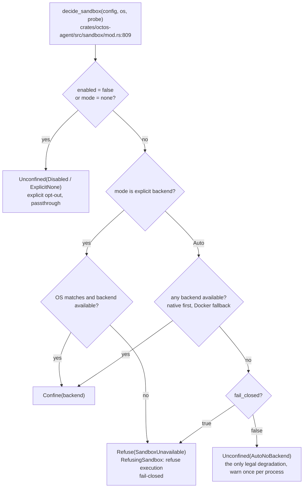
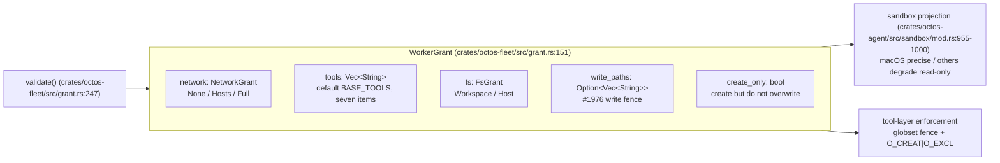

# Chapter 7: Defense in Depth: Fail-Closed Sandboxes, Injection Defense, and Capability Grants

> **Positioning**: This chapter walks octos's security system end to end from a defense-in-depth perspective: the fail-closed semantics of the process sandbox, command and dispatch policy, injection detection and output redaction, and the WorkerGrant capability model. Prerequisite: Chapter 6 (ToolPolicy and deny-wins semantics). It is written for readers who need to understand or extend sandbox backends and design capability grants for fleet workers (B/D), and for AI application developers who care about agent security practice (C).

## 7.0 What problem this chapter solves

What separates an agent from ordinary software is that it acts: it runs shell commands, reads and writes files, and makes network requests. Each is an attack surface, and the shell is the most dangerous of the three, because it reaches the full capability of the other two. That puts a concrete question in front of the security design: when the operator insists that "commands must run in a sandbox" and no usable sandbox exists on the host, what should the system do?

The old answer was best effort: if probing found no backend, it silently fell through to unsandboxed execution and the command ran anyway. That answer was overturned on 2026-08-31. `eb7c7221` (PR #2196, 14 files, +1621/−158) changed the decision to fail-closed: an explicitly requested mode that cannot be honored refuses to execute, and Auto mode with no backend still degrades but with a loud warning. In the same window, `ffcde205` tightened cargo grants, and `WorkerGrant` in `crates/octos-fleet/src/grant.rs` turned "what a worker may do" from scattered config keys into a validated type. This chapter unfolds the system in four layers: process sandbox → command and dispatch policy → injection and redaction → capability grants.

One crate boundary is easy to get wrong, so settle it first. The doc at `crates/octos-sandbox/src/main.rs:1` reads "octos-sandbox: platform sandbox helper binary": it is a platform helper binary. On Windows it creates or reuses an AppContainer profile and starts the command inside it; on Linux it applies Landlock filesystem rules plus a seccomp denylist and then execs; on macOS and other platforms it is a no-op passthrough. The real sandbox subsystem lives in `crates/octos-agent/src/sandbox/`, and all references below use full crates/ paths.

## 7.1 The process sandbox: seven impls and the fail-closed decision

### 7.1.1 Scale and shape

The six files of `crates/octos-agent/src/sandbox/` total 5,347 lines:

| File | Lines | First-line doc |
|---|---:|---|
| `crates/octos-agent/src/sandbox/mod.rs` | 2190 | `//! Sandboxing for shell command execution.` |
| `crates/octos-agent/src/sandbox/macos.rs` | 1767 | `//! macOS sandbox using sandbox-exec.` |
| `crates/octos-agent/src/sandbox/bwrap.rs` | 498 | `//! Linux sandbox using bubblewrap (bwrap).` |
| `crates/octos-agent/src/sandbox/docker.rs` | 392 | `//! Docker container sandbox.` |
| `crates/octos-agent/src/sandbox/windows.rs` | 325 | `//! Windows sandbox using AppContainer via helper binary.` |
| `crates/octos-agent/src/sandbox/landlock.rs` | 175 | `//! Linux container sandbox using the octos-sandbox Landlock/seccomp helper.` |

The core abstraction is `pub trait Sandbox` (`crates/octos-agent/src/sandbox/mod.rs:443`), with a single required method, `wrap_command(&self, shell_command: &str, cwd: &Path) -> Command`: wrap a shell command string into a restricted process launch. Around that trait sit exactly seven `impl Sandbox for` blocks: five real backends plus two sentinels.

| impl | Type | Role |
|---|---|---|
| `crates/octos-agent/src/sandbox/bwrap.rs:29` | `BwrapSandbox` | Linux bubblewrap, mount namespace isolation |
| `crates/octos-agent/src/sandbox/docker.rs:36` | `DockerSandbox` | Docker container isolation, works on any OS |
| `crates/octos-agent/src/sandbox/landlock.rs:27` | `LinuxContainerSandbox` | Delegates to the `octos-sandbox` helper for Landlock + seccomp |
| `crates/octos-agent/src/sandbox/macos.rs:185` | `MacosSandbox` | macOS sandbox-exec (SBPL profile) |
| `crates/octos-agent/src/sandbox/windows.rs:46` | `AppContainerSandbox` | Delegates to `octos-sandbox.exe` to create an AppContainer |
| `crates/octos-agent/src/sandbox/mod.rs:500` | `NoSandbox` | Sentinel: passthrough execution (`sh -c` / `cmd /C`) |
| `crates/octos-agent/src/sandbox/mod.rs:914` | `RefusingSandbox` | Sentinel: refuses execution, the fail-closed carrier |

The two sentinels deserve attention. `NoSandbox` is not the name of the concept "no sandbox"; it is a real type (`pub struct NoSandbox;` at `crates/octos-agent/src/sandbox/mod.rs:498`) whose `is_noop()` returns true so callers can check. `RefusingSandbox` (struct defined at `crates/octos-agent/src/sandbox/mod.rs:909`) has a `wrap_command` that never executes the requested command: it substitutes a command that prints refusal text to stderr and exits 1.

### 7.1.2 SandboxMode and MountMode

Two enums drive the configuration layer. `MountMode` (`crates/octos-agent/src/sandbox/mod.rs:408`) controls how the Docker backend mounts the workspace, with serde lowercase naming and three variants: `None` (:410, no mount), `ReadOnly` (:413, serde name `ro`), `ReadWrite` (:417, default, serde name `rw`).

`SandboxMode` (`crates/octos-agent/src/sandbox/mod.rs:423`) has seven variants:

- `Auto` (:426, default): the doc comment names "bwrap on Linux, sandbox-exec on macOS, AppContainer on Windows"
- `Bwrap` (:428), `Landlock` (:430), `Macos` (:432), `Docker` (:434)
- `AppContainer` (:437, serde name `appcontainer`)
- `None` (:439): no sandboxing, passthrough

`Auto` is the only mode allowed to degrade when it finds no backend; every explicit mode goes through fail-closed refusal. That asymmetry is the subject of 7.1.3.

Auto's probe order and fallback logic live in the `SandboxMode::Auto` branch of `decide_sandbox` (`crates/octos-agent/src/sandbox/mod.rs:875-901`): first pick the native backend for the OS (macOS probes `sandbox_exec`, Linux probes `bwrap` before the Landlock helper, Windows probes the AppContainer helper); only when no native backend exists does `docker().then_some(SandboxBackendChoice::Docker)` serve as the fallback; if that is absent too, the `fail_closed` flag routes the outcome to refusal or degradation. The order reflects two considerations. Native first because of isolation granularity: bwrap/sandbox-exec/AppContainer reuse kernel mechanisms directly, have no daemon dependency, and their failure mode is a one-time event at probe time; the Docker fallback works on any OS but depends on a daemon and an image. Probing itself comes in two grades of honesty: the `bwrap()` method of `HostBackendProbe` (`crates/octos-agent/src/sandbox/mod.rs:574`) documents "actually runs bwrap, not a PATH scan", and in `RealHostProbe` it calls `bwrap_works()` (`crates/octos-agent/src/sandbox/mod.rs:1140`), which runs a real bwrap with minimal mounts plus `/bin/true` to verify the kernel lets the current user create namespaces; `docker()` is merely a `which_exists("docker")` PATH scan. On Linux the difference matters most: unprivileged user namespaces are often disabled by distributions, so having bwrap on PATH does not mean bwrap runs. A PATH-style probe would fabricate a backend that fails on every spawn, and "configured yet failing every time" is exactly the class of silent failure `eb7c7221` set out to eliminate. Within Linux native backends, bwrap comes before Landlock: the granularity is similar, but bwrap does not depend on a helper binary, while a Landlock probe is only true once the helper answers `--probe-linux`.

### 7.1.3 decide_sandbox: a pure decision function and fail-closed

Before `eb7c7221`, `create_sandbox` interleaved `cfg!` platform probing with backend construction, which produced two problems: the cross-platform matrix could not be tested on a dev machine (you cannot test the Linux path on macOS), and explicit modes degraded silently. The refactor extracted the decision into a pure function, `pub fn decide_sandbox(config, os, probe)` (`crates/octos-agent/src/sandbox/mod.rs:809`):

```rust
pub fn decide_sandbox(
    config: &SandboxConfig,
    os: HostOs,
    probe: &dyn HostBackendProbe,
) -> SandboxDecision {
```

All host facts arrive as parameters (`HostOs` is a data enum, `crates/octos-agent/src/sandbox/mod.rs:534`; backend availability flows through the `HostBackendProbe` trait), so the complete matrix for every OS can be tested from any dev host. It returns a `SandboxDecision` (`crates/octos-agent/src/sandbox/mod.rs:744`) with three values: `Confine(SandboxBackendChoice)`, `Unconfined(UnconfinedReason)`, `Refuse(SandboxUnavailable)`. The contract is written directly in the function docs (`crates/octos-agent/src/sandbox/mod.rs:800-808`):

- `enabled = false` together with `mode = "none"` is an explicit opt-out: passthrough, and it takes priority over `fail_closed`
- An explicit backend mode that cannot be honored (wrong OS or missing backend) refuses; it never silently degrades to no isolation
- `Auto` picks the best available backend (native first, Docker fallback); with none available it degrades to passthrough but warns, and `fail_closed` can turn that degradation into refusal

`UnconfinedReason` (`crates/octos-agent/src/sandbox/mod.rs:664`) distinguishes three passthrough causes: `Disabled` (explicit opt-out set by `--danger-full-access`), `ExplicitNone` (`mode="none"`), and `AutoNoBackend` (Auto found no backend, the only legal degradation). `SandboxUnavailable` (`crates/octos-agent/src/sandbox/mod.rs:694`) is a typed refusal reason carrying `requested`, `reason`, and a per-OS `remediation` block (`remediation_for` at `crates/octos-agent/src/sandbox/mod.rs:754` gives install advice per OS).

How the refusal reaches the user splits by audience, a MUST-FIX from the #2196 review: the `Display` implementation faces the model and states "Shell/exec commands will keep refusing until then"; operator remediation advice goes only to logs and `octos doctor`, never into model context. `stderr_line()` (`crates/octos-agent/src/sandbox/mod.rs:724`) filters the refusal text down to `[A-Za-z0-9 ./:_=,-]`, so once embedded into `sh -c 'echo ... >&2; exit 1'` a quote escape back into command execution is impossible.

Fail-closed execution also has an earlier short-circuit. Exec-shaped tools check `refusal()` before spawning: `crates/octos-agent/src/tools/shell.rs:1069` and `crates/octos-agent/src/tools/coding_tools.rs:501`, `:625`, `:2068` all begin with `if let Some(refusal) = self.sandbox.refusal()`; on a hit they return the model-facing refusal text directly as the tool result, without starting a subprocess. So `RefusingSandbox`'s `wrap_command` (the impl starting at `crates/octos-agent/src/sandbox/mod.rs:914`) is only the backstop: commands that actually reach it (for example, wrapped through a third-party call site holding a bare `Box<dyn Sandbox>`) get the echo-plus-exit-1 substitute command. The two layers divide the work: the tool-layer short circuit guarantees the model sees a readable refusal rather than a bare exit-1 output, while the trait-layer backstop guarantees no call site can run a command without a sandbox.

The engineering motivation deserves the full story. The pre-`eb7c7221` behavior is on record in the refactor comment at `crates/octos-agent/src/sandbox/mod.rs:524-528`: `create_sandbox` interleaved `cfg!`-gated probing with backend construction, causing "two explicit modes silently degrade to no confinement". The concrete scenario: an operator pins `sandbox.mode = "bwrap"` in CI or fleet config, the host lacks bwrap, commands run unsandboxed, and the only clue is one easily drowned warn line in startup logs. Three properties stack to make this failure mode a must-fix: the configuration expresses an isolation intent that gets overridden (fail-open); the override is invisible (the user believes a sandbox is active); the behavior matrix is untestable (`cfg!` dispatch at compile time means a macOS dev machine has no Linux code path at all, so regressions could only be caught by real Linux CI). `decide_sandbox` parameterizes all three classes of fact (config, `HostOs`, probe), and one refactor fixes all three: an unfulfillable explicit mode returns `Refuse`, the refusal is visible to the operator with remediation attached, and the full cross-platform matrix can be enumerated in unit tests on any dev machine.

`create_sandbox` (`crates/octos-agent/src/sandbox/mod.rs:1005`) is the projection from decision to backend: `Confine` constructs the backend, `Unconfined` returns `NoSandbox` and logs per reason (`AutoNoBackend` goes through `warn_auto_unconfined_once`, `crates/octos-agent/src/sandbox/mod.rs:1039`, a `std::sync::Once` that warns once per process), and `Refuse` returns `RefusingSandbox`. The signature stays infallible, so the many construction sites need no changes; but every command on that result carries the typed `SandboxUnavailable` refusal.



**Figure 7-1: SandboxMode resolution and the fail-closed decision flow.** An explicit mode that cannot be honored always refuses; only Auto finding no backend may degrade to passthrough.

### 7.1.4 Implementation notes for the five backends

bwrap (Linux): the order inside `wrap_command` is: strip `BLOCKED_ENV_VARS` → `--ro-bind` read-only mounts for `/usr`, `/lib`, `/lib64`, `/bin`, `/sbin`, `/etc` → `--tmpfs /tmp` and `--tmpfs /var/tmp` (ordered before the workspace bind, so a workspace under /tmp is not undone by tmpfs semantics) → workspace `--bind` or `--ro-bind` (depending on `workspace_write`) → an optional `.git`-targeted rw bind (`repo_git_write`) → `--dev`, `--proc` → `--unshare-net` when `!allow_network` → `--unshare-pid`, `--die-with-parent`. The `repo_git_write` comment is explicit: this is a narrow grant that binds only `<repo>/.git`, never the whole `/`, because the latter would expose host AF_UNIX sockets such as `SSH_AUTH_SOCK` and `docker.sock` to processes inside the sandbox (field docs at `crates/octos-agent/src/sandbox/bwrap.rs:17-26`).

Landlock (Linux): `LinuxContainerSandbox` at `crates/octos-agent/src/sandbox/landlock.rs:27` applies no restrictions itself; it delegates everything to the `octos-sandbox` helper process so the Landlock and seccomp setup happens before the shell is exec'd. A missing helper is not a degradation but a refusal: it constructs an `echo 'sandbox error: octos-sandbox helper not found' >&2; exit 1` command (`crates/octos-agent/src/sandbox/landlock.rs:31-39`).

macOS sandbox-exec: the thickest backend (1,767 lines), generating an SBPL (sandbox profile language) profile. Injection defense sits at `crates/octos-agent/src/sandbox/macos.rs:205-212`: a cwd containing control characters or SBPL metacharacters (`(`, `)`, `\`, `"`) is refused outright, because the path has been verified quote-free and subsequent concatenation needs no escaping. macOS is also the only backend that can express the #1976 write fence precisely: each glob becomes an `(allow file-write* (regex ...))` rule (per the comment in `build_backend`, `crates/octos-agent/src/sandbox/mod.rs:1081-1085`).

Docker: the cross-platform fallback. It mounts the workspace per `MountMode` (`ReadWrite` → `-v cwd:/workspace`, `ReadOnly` → add `:ro`, `None` → no mount) and supports CPU/memory limits. `is_blocked_bind_source` (`crates/octos-agent/src/sandbox/docker.rs:20-30`) refuses `docker.sock`, `/etc`, `/proc`, `/sys`, and `/dev` as bind sources; a cwd that hits a dangerous source refuses the entire command.

AppContainer (Windows): `crates/octos-agent/src/sandbox/windows.rs:46` delegates to `octos-sandbox.exe` to create or reuse an AppContainer profile. Each octos profile has its own AppContainer SID, with deny-by-default filesystem access and configurable network isolation.

### 7.1.5 Environment variable scrubbing

All backends share `BLOCKED_ENV_VARS` (re-exported from `octos-core`, `crates/octos-agent/src/sandbox/mod.rs:33`), an 18-entry list grouped by injection surface: Linux dynamic-library injection (`LD_PRELOAD` and 2 others), macOS dylib injection (5 `DYLD_*` entries), runtime code injection (`NODE_OPTIONS`, `PYTHONSTARTUP`, and 5 others), and shell startup injection (`BASH_ENV`, `ENV`, `ZDOTDIR`). Where the list is enforced differs by backend: bwrap, Landlock, macOS (`crates/octos-agent/src/sandbox/macos.rs:478`), and Windows (`crates/octos-agent/src/sandbox/windows.rs:90`, `:139`) each call `env_remove` per entry; the Docker backend scrubs nothing, since container isolation itself carries the environment isolation.

### 7.1.6 cargo grants: from best-effort writes to lock-only

`ffcde205` (4 files, +140/−82) addresses a real tension for coding agents: the tighter the sandbox clamps writes, the more often `cargo build` dies before compiling. The fixed policy is lock-only by default: the writable set is just `~/.cargo/.package-cache` (what the lock file needs), while registry index/cache/src, git checkouts, and the rustup install are all read-only; only configuring `allow_network` adds the writes and network that downloads require. The companion `allow_toolchains` field (`crates/octos-agent/src/sandbox/mod.rs:149`, default true) grants the few write paths a toolchain needs to run, but explicitly withholds `~/.cargo/bin` (a writable shim on PATH is a persistence backdoor) and `~/.rustup/toolchains` (writable compiler binaries). Deny-wins applies here too: a read-only workspace or a #1976 write fence suppresses these grants wholesale.

> **Engineering decision**: why "best-effort sandboxing" was abandoned
>
> Under the old semantics, an operator wrote `sandbox.mode = "bwrap"`, the host had no bwrap, and the command ran unsandboxed anyway. From a security standpoint that is fail-open: the configuration expressed an isolation intent, and the system overrode it with "it runs, so it's fine". The problem is that the override was invisible; the user believed a sandbox was active. `eb7c7221` chose differently: an explicit mode that cannot be honored refuses execution and surfaces the conflict to the operator (with per-OS remediation and an `octos doctor` entry); Auto keeps its degradation ("best available" is its contract) but warns once per process, and the `sandbox.fail_closed` switch can turn the degradation into a refusal too. The cost is availability: users on a misconfigured host see every command refused. The team accepted that cost because the refusal text is itself actionable, while silent non-sandboxing is unfixable.

## 7.2 Command and dispatch policy: a gate on every path

The sandbox governs what environment a command runs in; the policy layer governs whether a command or tool runs at all.

`crates/octos-agent/src/policy.rs` (746 lines): command approval policy. `Decision` (`crates/octos-agent/src/policy.rs:16`) has three values, `Allow / Deny / Ask`; `ApprovalPolicy` (:28) decides whether `Ask` in unattended mode pops an approval or fails outright (`Never`); the `Workspace / Host` two-valued `FilesystemScope` (:46) reappears in the grant model of 7.4. ShellTool's SafePolicy (dangerous-command refusal, whitespace normalization, word-boundary detection) was covered in Chapter 6 and is not repeated here; what this chapter adds is that it explicitly calls itself "not a security boundary". The real boundaries are this section's sandbox and the next section's redaction.

`crates/octos-agent/src/dispatch_policy.rs` (566 lines): the pre-dispatch policy gate for MCP agents. The module docs (`crates/octos-agent/src/dispatch_policy.rs:1-10`) record its origin: before #714, the `agent_mcp` branch of `SpawnTool` dispatched directly, bypassing policy entirely, even when `octos serve` had installed a gate on the swarm side. Lifting the gate into this crate lets both call sites (the `SpawnTool::agent_mcp` branch and the `octos_swarm::Swarm` dispatcher) run the same shape of checks: tool policy, approval, sandbox-required, and env allow/deny lists. Every failure produces a labeled `GateDenial` (`crates/octos-agent/src/dispatch_policy.rs:253`, the `last_dispatch_outcome` field), where `approval_unavailable` (approval needed but no requester attached) and `sandbox_required` (policy requires a sandbox backend but the backend does not report one) both fail closed rather than falling through to dispatch.

`crates/octos-agent/src/permissions.rs` (167 lines): supervisory safety tiers for robotics tools. `SafetyTier` (`crates/octos-agent/src/permissions.rs:19`) orders four levels, low to high: `Observe < SafeMotion < FullActuation < EmergencyOverride`, enforced through `ToolPolicy`'s `group:robot:<tier>` grouping rather than standalone trait methods. Physical-world risk tiers share the same deny-wins machinery as this chapter's digital sandbox, and one paragraph here suffices.

Why the gate has this shape comes down to three design criteria, all written in `crates/octos-agent/src/dispatch_policy.rs`'s own docs. Criterion one, the gate must be shared, not copied: the module docs (`:1-10`) record the pre-#714 bypass, where the `SpawnTool` `agent_mcp` branch dispatched directly and a gate installed by `octos serve` on the swarm side could not stop it. Moving the gate into the `octos-agent` crate makes both call sites run the same shaped checks over the same shared types (`ToolPolicy`, `ToolApprovalRequester`, `McpAgentBackend`); when a third dispatch point appears, "write its own checks" is not an option on the table. Criterion two, no-op by default, explicit assembly in production: each gate of `DispatchPolicy` (`:121`) is independently optional; with all defaults, `is_noop()` (`:175`) is true and dispatch behavior is byte-for-byte identical to the old version, which avoids regressing existing callers. The production constructor `from_agent_gates` (`:223`) deliberately inherits only the two gates named by the #701 audit (workspace-level tool-name policy and the `BLOCKED_ENV_VARS` injection-environment deny list); the approval bridge and sandbox-required are intentionally not mirrored, for reasons in the constructor rustdoc (from `:197`): the native approval bridge `TOOL_APPROVAL_CTX` is a per-turn task-local, and at server startup there is no cloneable global requester; and no MCP backend yet reports a sandbox, so `require_sandboxed` exists only for forward compatibility (`:150-152`) — setting it true today would fail closed on every dispatch. Criterion three, fixed gate order and observable failure: the docs of `enforce_dispatch_gates` (from `:285`) fix the check order as sandbox-required (pure configuration, cheapest) → tool policy → env deny list → env allow list → approval (the only one that can block waiting on a human, so last); the deny list before the allow list prevents a permissive allow list from passing a known-bad key (`:144-146`). Every gate failure produces a stably labeled `GateDenial` (`:253`, the five-label enum in the field docs), and callers fold it into their own outcome shape; the crate's outward API surface is therefore gate semantics, not yet another failure type.

## 7.3 Injection detection and output redaction

### 7.3.1 prompt_guard: the detection layer for plaintext injection

`crates/octos-agent/src/prompt_guard.rs` (772 lines) scans tool output and user messages for injection patterns. `ThreatKind` (`crates/octos-agent/src/prompt_guard.rs:29`) has five classes: `SystemOverride` (overriding the system prompt), `RoleConfusion` ("System: you are now..." style role confusion), `ToolCallInjection` (injecting tool-call JSON/XML), `SecretExtraction` (fishing for the system prompt or secrets), and `InstructionInjection` ("you must / always respond with" generic instruction injection). The entry point `pub fn scan(text)` sits at :195.

The module's own docs (`crates/octos-agent/src/prompt_guard.rs:5-19`) open by positioning it: "**Not a security boundary.**" It regex-matches naive plaintext injection and can be bypassed by base64 encoding, URL encoding, HTML entities, Unicode homoglyphs, zero-width characters, and RTL override characters, all recorded in the test suite as known limitations. The real mitigations are architectural: sandbox isolation bounds tool-layer damage whatever the prompt state, tool policy restricts the callable tool set, and human-in-the-loop (the `before_tool_call` hook exiting 1) intercepts high-impact actions for human approval. prompt_guard provides the extra layer of logging and best-effort redaction, not a replacement for those three.

### 7.3.2 sanitize: scrubbing tool output before it reaches context

`sanitize_tool_output` (:90) in `crates/octos-agent/src/sanitize.rs` (245 lines) strips three classes of content before tool results are fed back to the LLM. Noise: base64 data URIs (`data:...;base64,<64+ chars>`, :13) and hex runs of 64+ characters (SHA-256, raw keys, :16), to save context. Credentials, seven regexes: OpenAI (`sk-` prefix, :24), Anthropic (`sk-ant-`), AWS (`AKIA` + 16 uppercase), GitHub (`ghp_`/`gho_`/`ghs_`/`ghr_`/`github_pat_`), GitLab (`glpat-`), Bearer tokens, and a generic assignment pattern (`password|secret|api_key|... = "..."`). `redact_credential` (:55) keeps the first 4 characters visible and appends a `[credential-redacted]` marker, recognizable without leaking. The comment on `scrub_credentials` (:62) stresses order: Anthropic is processed before OpenAI so `sk-ant-...` is not partially matched by the `sk-` rule.

### 7.3.3 SSRF: the entry check for network tools

`crates/octos-agent/src/tools/ssrf.rs` (620 lines) is shared by the `web_fetch` and `browser` tools. The flow of `check_ssrf_with_addrs` (:24): parse the URL → `is_private_host` (:228) blocks `localhost` and literal private IPs → domains go through DNS resolution, and the answer set passes `validate_answer_set` (:69) for DNS pinning (anti-rebinding: the addresses resolved at validation are bound to the actual fetch, so TOCTOU disappears). DNS failure is handled fail-closed as a block, with the comment stating why: an attacker can make DNS fail at validation time and succeed at fetch time.

The range list of `is_private_ip` (:258) goes beyond the std predicates: for IPv4, on top of `is_private`/`is_link_local`/`is_loopback`/`is_unspecified`, `is_special_purpose_v4` (:244) explicitly matches segments that only landed in later std versions: CGNAT 100.64.0.0/10 (carrier-grade NAT), 192.0.0.0/24 (IETF protocol assignments), 198.18.0.0/15 (benchmarking), 224.0.0.0/4 (multicast), and 240.0.0.0/4 (reserved). IPv6 covers loopback, `::`, multicast, ULA `fc00::/7`, link-local `fe80::/10`, and the deprecated site-local `fec0::/10`, plus two mapping rules: IPv4-mapped `::ffff:x.x.x.x` recurses into the IPv4 check, and IPv4-compatible `::x.x.x.x` is handled the same way. Missing the mapping rules is the classic bypass; the tests have dedicated cases (:580, :590).

The division of labor between prompt_guard and sanitize deserves its own statement: both act "before output enters context", but on different objects. `crates/octos-agent/src/prompt_guard.rs` governs instructions, whether someone in the text is trying to steer the model's next action; `crates/octos-agent/src/sanitize.rs` governs matter, whether the text carries bytes that should not be fed back (credentials, base64 data URIs, long hex). The two meet inside `sanitize_tool_output` (`crates/octos-agent/src/sanitize.rs:90-94`): the pipeline replaces data URIs, long hex, and the seven credential classes, and the final step calls `prompt_guard::sanitize_injection`, so injection defanging is the tail of the redaction pipeline, not a separate channel. On the execution side the call site is `crates/octos-agent/src/agent/execution.rs:2414`: every tool result passes through this one point after truncation and before the model sees it, and a single funnel means bypassing redaction requires bypassing the entire execution layer rather than picking an undefended tool. Detection granularity is layered too: `scan` (`crates/octos-agent/src/prompt_guard.rs:195`) produces a list of `Threat`s with three `Severity` levels (`:56`, Low/Medium/High); Low only logs, and redaction starts at Medium (inside `sanitize_injection`, filtered by `severity >= Medium`, `:262`), with replacements applied in reverse span order to preserve byte offsets (from `:270`). The threshold acknowledges the false-positive cost of regex detection: act only on medium-to-high confidence, and leave the "cannot detect" cases explicitly to the architectural controls (sandbox, tool policy, human-in-the-loop), consistent with the module's opening "Not a security boundary". Both modules are an extra layer in the depth, not the boundary itself.

## 7.4 WorkerGrant: capabilities as a type

The first three defensive layers all sit on the "restrict" side. The fleet architecture (assembly covered in Chapter 16) also needs the reverse capability: when a master dispatches a task to a worker, how do you state precisely "this worker may use the network and may write only these three paths"? The answer is `WorkerGrant` in `crates/octos-fleet/src/grant.rs` (714 lines), a validated type rather than scattered config keys.

### 7.4.1 Three axes of granularity

`NetworkGrant` (`crates/octos-fleet/src/grant.rs:76`) has three values: `None` (default, zero network), `Hosts(Vec<String>)` (a per-host allowlist), and `Full` (raw egress fully open). The key semantics sit in the method docs: `allows_raw_egress` is true only for `Full`; `Hosts` deliberately keeps raw egress off, and its permission is realized entirely through the granted web tools honoring the host allowlist, so shell can never `curl` beyond the allowlist. The docs also admit the v1 limitation: raw network is all-or-nothing, per-host filtering of raw traffic needs a kernel-level egress proxy, and `Hosts` covers only the web tools' HTTP(S). This is a recorded open problem.

`FsGrant` (`crates/octos-fleet/src/grant.rs:127`) is deliberately coarse: `Workspace` (default, read-write only in the worker's own attempt directory) or `Host` (full-disk read-write, requiring an explicit operator grant). v1 has no per-path filesystem allowlist, so an honest grant is two-valued.

`WorkerGrant` (`crates/octos-fleet/src/grant.rs:151`) assembles these axes into five fields, a serializable, validatable whole:

```rust
pub struct WorkerGrant {
    #[serde(default)]
    pub network: NetworkGrant,        // :154, default None
    #[serde(default = "base_tools_vec")]
    pub tools: Vec<String>,           // :157, default BASE_TOOLS, seven items
    #[serde(default)]
    pub fs: FsGrant,                  // :160, default Workspace
    #[serde(default, skip_serializing_if = "Option::is_none")]
    pub write_paths: Option<Vec<String>>, // :179, #1976 write fence
    #[serde(default, skip_serializing_if = "core::ops::Not::not")]
    pub create_only: bool,            // :189, create but do not overwrite
}
```

The `#[serde(default)]` on every field carries a design: old tasks persisted before grants existed (or a master that specified nothing) load as `WorkerGrant::minimal()`, so least privilege is the default and old records need no schema migration. `skip_serializing_if` makes a fence-less grant serialize byte-identically to the pre-#1976 shape, so old readers see no new keys in new records.

The five fields are not assembled at random; each answers a class of authorization question that must be answered explicitly, and missing one leaves a default-allow hole. Without `network`, egress for web tools and for shell cannot be distinguished, "no network" has nowhere to be expressed, and `WEB_TOOLS` could only be granted or disabled wholesale. Without `tools`, the registry shape is all-or-nothing, and the audit key `sorted_tools()` ("what the operator granted, not one more") has no ground to stand on. Without `fs`, the workspace/host filesystem boundary falls back to an implicit cwd convention, and an explicit operator trust decision like `FsGrant::Host` has nowhere to be written. Without `write_paths`, before #1976 "this worker writes only these files" could only be expressed through the `workspace_write` binary knob, all-writable or all-readonly. Without `create_only`, the anti-tampering semantics "create yes, overwrite no" (a replay-safety concern) is inexpressible in the type. The reverse bound holds too: there are only these five fields. v1 deliberately skips per-host raw network filtering (needs a kernel-level egress proxy) and arbitrary filesystem ACLs (the tool layer has no matching mechanism; the grant honestly reflects the range it can enforce). The field set is the exact union of authorization questions both enforcement layers can honor: one more field would be lying, one fewer would be a hole.

### 7.4.2 The #1976 write fence: three-level semantics

`write_paths` is the per-path write fence introduced by issue 1976, with three levels of meaning:

- `None` (default): no fence; the binary `fs` alone governs writes, byte-identical to a pre-#1976 worker
- `Some(vec![])`: a uniform read-only fence; nothing inside the workspace is writable
- `Some(list)`: the listed paths are writable, the rest of the workspace read-only

The v1 pattern syntax is deliberately narrow: workspace-relative paths, `/` separators, `*` (any characters) and `?` (single character) wildcards within a segment, and no `**`, `[...]`, or `{...}`. The reason is in the field docs: this syntax is exactly the intersection the tool-layer matcher (globset, `literal_separator`) and the sandbox translation (SBPL regex) can both express identically, so the two layers can never disagree about "what was granted". `validate_write_path_pattern` (`crates/octos-fleet/src/grant.rs:307`) rejects, item by item, absolute paths, `..`, control bytes, SBPL metacharacters, `:` (Docker mount separator / Windows drive letter), and both extended wildcard syntaxes.

`create_only: true` means paths in the allowlist may only be created, never overwritten/edited/deleted (the file tool layer's `O_CREAT|O_EXCL` semantics; `edit_file` is refused outright whether or not it is in the list). The sandbox layer can only enforce path fences; no OS backend can distinguish creation from overwrite, so the no-overwrite half of create_only is enforced by the tool layer, a documented degradation.

How each backend expresses the fence on the shell side differs, and deny-wins guarantees no backend widens it (three functions at `crates/octos-agent/src/sandbox/mod.rs:955-1000`): macOS expresses it precisely (per-glob SBPL regex); bwrap/Landlock/AppContainer cannot express per-glob shell writes, so the workspace drops to read-only for shell, and the granted paths stay writable only through the fenced file tools (`fence_degraded_workspace_write`, :955, warns once at construction); Docker likewise mounts `:ro` (`fence_degraded_docker`, :970); when the resolution result is no sandbox, a warning states the shell fence is entirely unenforced (`warn_fence_unenforced`).



**Figure 7-2: WorkerGrant structure and its two enforcement layers.**

### 7.4.3 validate: catching inconsistencies at parse time

`WorkerGrant::validate` (`crates/octos-fleet/src/grant.rs:247`) rejects five classes of inconsistency, each mapping to one variant of `GrantError` (`crates/octos-fleet/src/grant.rs:359`):

- `UnknownTool`: a granted tool not in the `GRANTABLE_TOOLS` catalog (an operator cannot grant a tool the host build cannot produce)
- `WebToolWithoutNetwork`: granting `web_fetch`/`web_search` under `NetworkGrant::None` (network tools without network)
- `EmptyHostAllowlist`: `Hosts(vec![])`, an empty allowlist. The comment names the fail-open trap: an empty list must never read as "no restriction"; an operator who listed no hosts means `None`
- The #1976 four: `WritePathsWithHostFs` (a fence combined with `fs: Host` is inconsistent; Host lets shell reach everything the fence forbids, and deny-wins refuses outright), `CreateOnlyWithoutWritePaths` (no list to apply it to), `EmptyWritePathsWithCreateOnly` (an empty list plus create_only grants nothing to create), and `InvalidWritePath { pattern, reason }` (patterns outside the syntax)

validate is called at two points: when the master's `goal_plan` parses, and defensively when the registry is built. The relation to Chapter 6's `crates/octos-agent/src/tools/write_grant.rs`: Chapter 6 covered per-argument write authorization for a single tool, while this chapter's `WorkerGrant` is the worker-level grant model; how the fleet assembles this grant into a closed tool registry and sandbox configuration is Chapter 16's subject.

> **Engineering decision**: why the grant is a type, not a config convention
>
> If "what a worker may do" were just several independent config keys (a network boolean, a tool list, a path list), inconsistent combinations would surface at runtime, or never (an empty allowlist read as unrestricted is exactly that case). `WorkerGrant` pulls the five axes into one struct, `validate` rejects cross-field inconsistencies at parse time with typed errors, and each of the seven `GrantError` variants converts directly into an operator-facing message. `minimal()` as the serde default makes least privilege the baseline that needs no declaration, and old records land there automatically. The cost: adding a capability means extending the `GRANTABLE_TOOLS` catalog, the validate rules, and the error variants in lockstep, three places that must stay synchronized. What it buys: "what was granted" stays consistent across the serialized shape, the registry audit key (`sorted_tools`), and the error messages.

## 7.5 Chapter recap

This chapter walked octos's defense in depth across four layers. The process sandbox layer: `crates/octos-agent/src/sandbox/`, six files and 5,347 lines, seven `impl Sandbox for` blocks (five backends plus the `NoSandbox`/`RefusingSandbox` sentinels); the pure function `decide_sandbox` (`crates/octos-agent/src/sandbox/mod.rs:809`) enforces the fail-closed contract: an explicit mode that cannot be honored refuses, and Auto's degradation warns once and can be escalated to refusal with `fail_closed`. The policy layer: command approval in `crates/octos-agent/src/policy.rs`, the MCP dispatch bypass closed by `crates/octos-agent/src/dispatch_policy.rs` (#714), and the robotics safety tiers of `crates/octos-agent/src/permissions.rs`. The injection and redaction layer: `crates/octos-agent/src/prompt_guard.rs` with its self-declared non-boundary plaintext detection, the seven credential regexes of `crates/octos-agent/src/sanitize.rs`, and the DNS-pinned SSRF check. The capability layer: `WorkerGrant`'s five fields (network/tools/fs/write_paths/create_only) with validate's five classes of inconsistency rejection, and the #1976 write fence enforced through both the sandbox projection and the tool layer.

One thread runs through the whole chapter: deny-wins and fail-closed reappear at every layer. Tool policy deny beats allow (Chapter 6); a sandbox mode that cannot be honored refuses rather than degrades; an empty allowlist is an error rather than "unrestricted"; a fence combined with Host fs refuses rather than taking the wider. The same principle taking the same shape at four levels of abstraction says more about this system's design consistency than any single point's strength.

---

## Further reading

- Landlock documentation and the seccomp BPF manual (`man 2 seccomp`): the two kernel mechanisms the helper delegated to by `crates/octos-agent/src/sandbox/landlock.rs` applies
- Apple Sandbox Guide (SBPL reference): the language of the profiles generated by `crates/octos-agent/src/sandbox/macos.rs`
- bubblewrap project documentation: the mount namespace and `--die-with-parent` semantics used by `crates/octos-agent/src/sandbox/bwrap.rs`
- OWASP SSRF Prevention Cheat Sheet: the comparison reference for the block ranges of `crates/octos-agent/src/tools/ssrf.rs`
- issue #1976, PR #2196 (`eb7c7221`), and the commit message of `ffcde205`: the original discussions behind this chapter's three threads

## Exercises

1. Why does `decide_sandbox` take `HostOs` and the backend probe as parameters instead of reading the environment inside the function? If the probe were a real global, which quality attribute breaks first?
2. `RefusingSandbox`'s `wrap_command` still constructs a real shell command (echo the refusal text and exit 1) instead of returning an error. What does keeping the `Sandbox` trait signature infallible buy? And which remaining problem of that design does the `refusal()` short circuit in exec-shaped tools solve?
3. `NetworkGrant::Hosts` deliberately denies shell raw egress; permission is realized entirely through the web tools' allowlist. If v2 wanted "git may only clone hosts in the allowlist", what infrastructure would it need?
4. `validate` treats "an empty `Hosts` allowlist" as an error rather than the equivalent of `None`. Argue for or against this choice from the operator's mental model.
5. Under the #1976 fence, the bwrap backend drops the workspace to read-only for shell (granted paths writable only through file tools). What happens to a worker that can only use shell tools under the fence? Is this degradation a design flaw or a reasonable trade?

---

## Version note

> **Version note**: This chapter is based on octos main @ `9c157101` (committed 2026-09-02). Main-line changes: `eb7c7221` (2026-08-31, PR #2196, 14 files) introduced fail-closed for explicit modes with Auto degradation warnings and refactored the sandbox decision into the pure function `decide_sandbox`; `ffcde205` (2026-08-26, 4 files) tightened the cargo grant default to lock-only, with downloads gated behind `allow_network`; issue #1976 introduced `WorkerGrant`'s per-path write fence and `create_only`. Line numbers and file line counts were measured against this baseline; the fact source is the `assets/ch07-facts.md` facts table.


