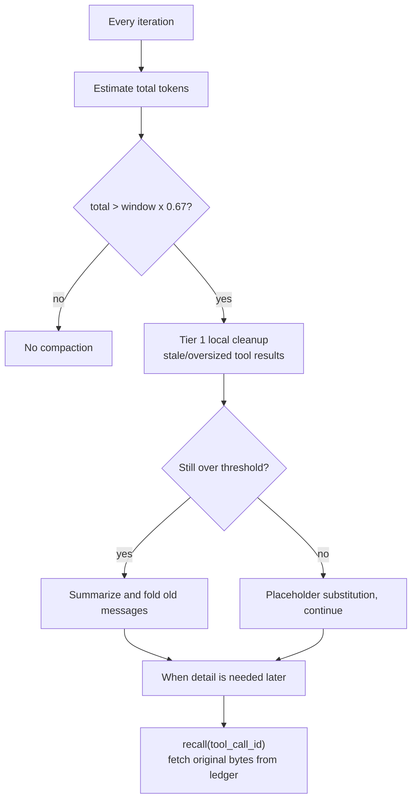
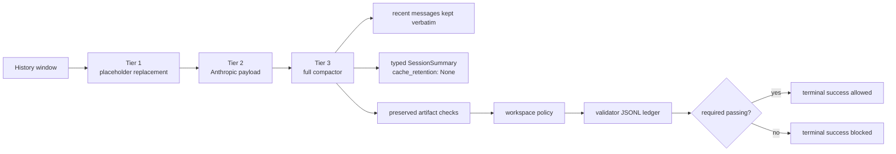

# Chapter 8: Context Management: Making an Agent Work Inside a Bounded Window

> **Positioning**: This chapter shows how octos works inside a bounded LLM context window: context compaction, recall rematerialization, the tiered compaction surface, fidelity grades, prompt layer assembly, steering, and the prompt guard that fends off tampered tool output. Prerequisite: Chapter 5 (where `CompactAndRetry` fires). It is written for developers who need to understand or tune an agent's context strategy.

The context window is a scarce resource. A 200K-token window can be exhausted after a dozen tool iterations: every call's arguments and results accumulate, and one `read_file` output can occupy thousands of tokens. As the window fills there are two exits: stop the task, or compact the history. octos compacts, and the answer on the current main branch has outgrown a single summarizer function into a system: reduce in tiers first (local placeholders, server-side cleanup, full summary), then fold old messages, and let compacted outputs be fetched back by id through the recall tool. This chapter follows that main line and covers the machinery that supports it: prompt layer assembly, steering injection, and the defanging of tool output that re-enters the prompt.

---

## 8.1 Context Compaction: the 80% Threshold plus recall

### 8.1.1 The trigger condition and its safety margin

The legacy trigger path is `trim_to_context_window()` (`crates/octos-agent/src/agent/compaction.rs:11-60`). The budget formula (`crates/octos-agent/src/agent/compaction.rs:25`):

```rust
let window = self.llm.context_window();
let budget = (window as f64 * 0.8 / crate::compaction::SAFETY_MARGIN) as u32;
```

`SAFETY_MARGIN = 1.2` (`crates/octos-agent/src/compaction.rs:45`). The effective budget is `window * 0.8 / 1.2 ≈ window * 67%`: 20% reserved for the next round of conversation, plus a buffer for token-estimation error. On a 128K-window model the trigger sits around 85K tokens. If the total is below budget, the function returns without touching the history.

### 8.1.2 The retention boundary: the last six messages and tool-group integrity

`find_recent_boundary()` (`crates/octos-agent/src/compaction.rs:68-89`) scans backward from the last message to decide which messages survive verbatim:

```rust
for i in (1..messages.len()).rev() {
    let msg_tokens = estimate_message_tokens(&messages[i]);
    count += 1;
    if count >= MIN_RECENT_MESSAGES
        && system_tokens + recent_tokens + msg_tokens > budget / 2
    {
        break;
    }
    recent_tokens += msg_tokens;
    split = i;
}
while split > 1 && messages[split].role == MessageRole::Tool {
    split -= 1;
}
```

`MIN_RECENT_MESSAGES = 6` (`crates/octos-agent/src/compaction.rs:48`). The six most recent messages are kept unconditionally, yet they may not exceed half the budget, leaving room for the summary of older messages. The trailing `while` loop backs the split point off any Tool message: once an Assistant/Tool pair is split apart, the orphaned Tool message fails provider validation or confuses the model.

### 8.1.3 Extractive summarization: stripping arguments, capturing first lines

Old messages go to `compact_messages()` (`crates/octos-agent/src/compaction.rs:99-153`), where each one passes through `summarize_message()` (`crates/octos-agent/src/compaction.rs:155-201`) and collapses into a single line. The highest compression ratio comes from tool-argument stripping: a `write_file` call's arguments can carry an entire file, thousands of tokens; after compaction only `- Called write_file` remains, roughly five tokens, a ratio near 200:1. The design has a security side effect: tool arguments are untrusted input, and stripping them means no malicious payload survives verbatim inside the summary.

Per-role rules:

| Message type | Summary shape |
|---------|---------|
| User | `> User: {first line}`, plus `[media omitted]` when media are attached |
| Assistant (with tool calls) | `- Called {tool name}` list |
| Assistant (plain text) | `> Assistant: {first line}` |
| Tool result | `-> {tool name}: {ok/error} - {first 100 chars of output}` |
| System | `> Context: {first line}` |

The ok/error test for tool results is plain: content starting with `Error:` counts as a failure (`crates/octos-agent/src/compaction.rs:180-188`). `find_tool_name()` (`crates/octos-agent/src/compaction.rs:219-234`) looks the tool name up from context by tool_call_id and degrades to `unknown_tool` when the lookup fails. First-line capture is an information-density bet: an LLM reply usually opens with its conclusion, so the first line carries the highest semantic density. `first_line()` (`crates/octos-agent/src/compaction.rs:203-216`) cuts at UTF-8 character boundaries and never slices a Chinese character in half. The summary targets 40% of the budget (`BASE_CHUNK_RATIO`, `crates/octos-agent/src/compaction.rs:51`); past that, per-message expansion stops and the remainder is recorded as `... (N earlier messages omitted)`.

A detail easy to miss: `compact_messages` first deducts the newest plan snapshot from the budget (#2132), so the retained block cannot push the summary past the ceiling (`crates/octos-agent/src/compaction.rs:104-114`). The comment spells it out: the deduction lives inside the producer, and every compaction path, AppUI, session actor, legacy agent channel, summarizer tiers, inherits it without point-to-point wiring.

If the recent messages alone already exceed the budget, the code falls back to `fallback_truncate()` tail truncation (`crates/octos-agent/src/agent/compaction.rs:319-358`): keep from the tail whatever fits, at least two non-system messages, again without splitting tool groups. The semantics are "summarize when possible, truncate only when it will not fit": summary first, but not unconditionally.

### 8.1.4 recall: rematerialization after compaction

The machinery above has an inherent cost: compacted output is gone. #2131 observed the pathology of one source file being read 66 times over, each read entering the window, being truncated, being compacted, and being read again. `e312e4c1` (merged 2026-08-27) added the recovery side: the recall tool.

An evicted tool result leaves behind a typed `ToolResultPlaceholder` (`crates/octos-agent/src/compaction.rs:346-361`) carrying the `tool_call_id`. `RecallTool` (`crates/octos-agent/src/tools/recall.rs:27-35`) uses that id to fetch the original bytes from the ledger, with no re-execution of the tool. The abstraction is the `ToolOutputLedger` trait (`crates/octos-agent/src/tools/recall.rs:19-24`): octos-agent depends only on the interface, the session side injects the implementation, and no cross-crate dependency is created. Large outputs return page by page (`render_page()`, `crates/octos-agent/src/tools/recall.rs:51-99`); the page footer states that the next page comes from `recall(tool_call_id=..., page=N)`, so no middle section is dropped silently.

The key ledger-side implementation is octos-cli's `ContextManager`: `recall_index` (`crates/octos-cli/src/api/context_manager.rs:391-398`) records `tool_call_id → (artifact_ref, model_visible_content)` at write time and is **not cleaned by compaction**. That is exactly the bug `825d6a52` fixed: early recall parsed from `items`, while `compact_context` prunes `items` to the most recent ~16 entries, so the outputs that had actually been evicted, the very reason recall exists, could not be fetched back, and the artifact bytes on disk were orphaned. The post-fix test `recall_survives_compaction_that_prunes_the_transcript` (`crates/octos-cli/src/api/context_manager.rs:2408-2440`) builds a 20KB output (above the inline threshold, so it spills to the ledger), compacts away its transcript envelope, then asserts the full bytes are retrievable. The read entry point is `tool_output_by_call_id()` (`crates/octos-cli/src/api/context_manager.rs:1192-1206`): outputs spilled to the content-addressed ledger return the complete original bytes; unspilled outputs return the model-visible content as recorded, truncation markers preserved so the model is not misled; an unknown id returns None.

Choosing `tool_call_id` over the content sha256 as the recall handle was a deliberate architecture call (the `e312e4c1` commit message): sha256 exists only in octos-cli's ledger envelope, and adding it to `octos_core::Message` would touch about 560 construction sites; `tool_call_id` already appears on every placeholder, at zero schema change.

### 8.1.5 The boundary between recall and the memory subsystem

octos has two similarly named tools: `recall` (this chapter) and `recall_memory` (Chapter 4). They address different time scales and share only the pager implementation. `recall` works on the current session's context ledger: tool output spilled to content-addressed storage is fetched back by id, and the scope ends with the session. `recall_memory` works on the cross-session memory store: it retrieves historical observations and facts by vector search, answering "what did earlier sessions learn".

The junction between the two is the persistence of compaction summaries. Each time the loop side completes a compaction, it archives the summary as a searchable episode (`save_conversation_episode`, #1587 on the write side; see the two call sites in `crates/octos-agent/src/agent/loop_runner.rs:1215-1245`: entry compaction and in-turn compaction each save one). The judgment is written in a comment: a conversation large enough to need compaction is worth being recalled by future sessions. Session-scoped recall fetches bytes; cross-session `recall_memory` fetches semantic summaries; together the two layers cover the full answer to "where does information go after compaction": bytes in the ledger, semantics in episodes, structured task state in `SessionSummary`.

recall rewrites "compaction is irreversible" as "compaction is lossy but recoverable on demand"; that is the second leg of the 8.1 pair.

### 8.1.6 Budget-aware reads: prevention before recovery

The other half of #2131 is prevention: when `read_file` reads a file larger than the tool-output budget without an explicit range, it returns a range hint instead of a body doomed to be truncated and then evicted (`crates/octos-agent/src/tools/read_file.rs:484-506`): how large the file is, what the budget is, and the advice to pass `start_line`/`end_line` or grep first. Reads with an explicit range are unaffected. This cuts the accept-then-evict loop at the source.



**Figure 8-1: the compaction-and-recall loop.** Compaction is no longer a one-way street.

---

## 8.2 The Tiered Compaction Surface: three tiers, one span each

`crates/octos-agent/src/compaction_tiered.rs` (1,271 lines, M8.5 #540) splits the compaction surface into three tiers; the module header states the motive: cheap tier-1 digests most of the pressure, and the expensive full summarizer should fire as rarely as possible (`crates/octos-agent/src/compaction_tiered.rs:1-34`).

| Tier | Mechanism | Trigger | Fidelity |
|------|------|------|--------|
| Tier 1 MicroCompaction | locally replaces stale/oversized tool results with `ToolResultPlaceholder` | every iteration (both conversation and task mode) | `tool_call_id` fully preserved, recall can restore |
| Tier 2 API MicroCompaction | attaches a `context_management` payload to Anthropic requests (`clear_tool_uses_20250919`) | when building `ChatConfig`, Anthropic-family providers only | server-side cleanup, client never rewrites history |
| Tier 3 FullCompactor | full summary plus contract artifact preservation checks | above the policy threshold | typed `SessionSummary` or an extractive summary |

Tier 1's policy lives in `MicroCompactionPolicy` (`crates/octos-agent/src/compaction_tiered.rs:72-106`): a result older than 5 user turns (`DEFAULT_TIER1_MAX_AGE_TURNS`) or larger than 8KB (`DEFAULT_TIER1_MAX_SIZE_BYTES_PER_RESULT`) is replaced with a placeholder; two #2131 additions ride along: the working set of the last 5 touched files is pinned (`pin_recent_files`, `crates/octos-agent/src/compaction_tiered.rs:78-88`), so read/write results of the file under active use are not evicted, otherwise the model must re-read it next turn, the exact cause of those 66 re-reads; duplicate reads of the same file and range keep only the newest entry, the rest become placeholders on the spot (`dedup_duplicate_reads`, `crates/octos-agent/src/compaction_tiered.rs:89-104`), clearing the trail of same-file stubs a re-read loop leaves behind. Replacement reasons are tagged `tier1_stale`/`tier1_oversized`/`tier1_superseded` (`crates/octos-agent/src/compaction_tiered.rs:237-241`). Callers of `prune()` must pass `protected_tool_call_ids` (`crates/octos-agent/src/compaction_tiered.rs:139-142`): results still referenced by a retry bucket or a contract artifact are untouched; M6's contract guarantee outranks compaction.

Tier 1 also respects the provider prefix cache (KV cache): stale results sit deep in history, and rewriting one invalidates the entire cached prefix, so that class of cleanup is concentrated in the first call of each turn; oversized results land near the prefix tail where rewriting is cheap, so that cleanup can run every iteration. The split shows up in `Tier1Pass::Full / OversizedOnly` (`crates/octos-agent/src/compaction_tiered.rs:47-57`) and the loop-side `tier1_pass()` (`crates/octos-agent/src/agent/loop_runner.rs:3846-3852`): iteration 1 runs Full, later iterations only OversizedOnly. Conversation mode and task mode (background workers) both run this tier before LLM calls (`crates/octos-agent/src/agent/loop_runner.rs:1227`, `crates/octos-agent/src/agent/loop_runner.rs:2366`).

Tier 2 is request-time decoration rather than a runtime loop: `ApiMicroCompactionConfig` (`crates/octos-agent/src/compaction_tiered.rs:428-457`) defaults off (`enabled: false`); when enabled, `into_context_management_json()` (`crates/octos-agent/src/compaction_tiered.rs:478-505`) produces the `clear_tool_uses_20250919` payload, keeping the last 10 turns by default (`DEFAULT_TIER2_KEEP_LAST_N_TURNS`, `crates/octos-agent/src/compaction_tiered.rs:419-421`); the loop side injects it while building the request (`with_tier2_context_management`, `crates/octos-agent/src/agent/loop_runner.rs:203-213`); non-Anthropic providers ignore it silently and no extra field is sent. octos does not re-implement Anthropic's server-side cleanup; it only ships the opt-in switch.

Tier 3 is a trait wrapper over the existing `CompactionRunner` (`FullCompactor`, `crates/octos-agent/src/compaction_tiered.rs:524-560`); the threshold check reuses `needs_preflight()` (`crates/octos-agent/src/compaction.rs:572-580`) and the execution reuses `run()` (`crates/octos-agent/src/compaction.rs:584-706`). Inside `run()`, placeholder cleanup runs first (`prune_tool_results()`, `crates/octos-agent/src/compaction.rs:709-796`), then the post-cleanup token count decides whether to summarize: if placeholder cleanup alone already pulled the conversation back within budget, no summary is produced, and nothing is compacted for compaction's sake (`crates/octos-agent/src/compaction.rs:597-612`). After summarization, `enforce_preservation()` checks that declared artifacts and invariants are still referenced in the message flow; a miss rolls back that round of compaction with an error (`crates/octos-agent/src/agent/compaction.rs:278-318`). `CompactionRunner` picks the summarizer per policy (`with_provider`, `crates/octos-agent/src/compaction.rs:494-514`) and resolves declared artifact names into concrete glob patterns through `with_workspace_policy()` (`crates/octos-agent/src/compaction.rs:538-556`). Each compaction emits an `octos.harness.event.v1 { kind: phase }` event, so operators can see the before/after token comparison at preflight and turn_end.

### 8.2.1 What the tiers mean: why three and not one

The three tiers are not one algorithm split into three steps; they are three operations with different cost structures. Tier 1 is pure local string replacement, no LLM call, no network round trip, done in microseconds, safe to run on every iteration without ceremony; the module header cites Claude Code's numbers: cheap tier-1 alone keeps 20-40% of turns from ever reaching the expensive summarizer (`crates/octos-agent/src/compaction_tiered.rs:5-8`). Tier 2 is free decoration: local history is untouched, one extra request field is sent, and Anthropic's servers do the cleanup. Tier 3 is the only tier that needs an LLM call to produce the summary, and the only one that can lose information.

The cost ordering dictates the trigger order: Tier 1 runs first every turn; if the post-cleanup load is under threshold, that is the end. Only above threshold does Tier 3 decide on the next LLM request whether to summarize. Most pressure is digested in the first tier. The failure domains are independent too: if Tier 3's LLM call fails or times out, it falls back to the extractive summary (`crates/octos-agent/src/compaction.rs:683-695`) and Tier 1's completed cleanup stands; if the server rejects Tier 2, the request still goes out, minus the server-side cleanup.

The tiers share one fidelity promise: `tool_call_id` is fully preserved in Tier 1 placeholders (`crates/octos-agent/src/compaction.rs:346-361`), and although Tier 3's summary body discards tool-output detail, the placeholders inside summarized messages still point at recall handles. Deeper tiers discard more, but everything discarded along the way is recoverable through recall, not lost. That property turns compaction from an irreversible operation into one that can back out tier by tier.

---

## 8.3 The Four Fidelity Grades

Post-compaction message fidelity comes in four grades:

| Grade | Kept | Discarded | Where it applies |
|------|---------|---------|---------|
| Full | the complete message | nothing | the last six messages, pinned working-set files |
| Truncate | content cut to N characters | the tail | mid-importance history |
| Compact | first line plus tool names | arguments, detailed output | distant history |
| Summary | typed `SessionSummary` or extractive summary | original message detail | task state across compaction rounds |

The implementation has two layers: the default `ExtractiveSummarizer` implements the Compact grade (`crates/octos-agent/src/summarizer.rs:66-85`); `LlmIterativeSummarizer` (M6.4, `crates/octos-agent/src/summarizer.rs:166-230`) calls the LLM to produce a typed `SessionSummary`, iteratively updating the existing summary, and after 3 consecutive failures (`DEFAULT_LLM_SUMMARIZER_FAILURE_THRESHOLD`, `crates/octos-agent/src/summarizer.rs:93-96`) latches back to extractive and logs a WARN. The latch is one-way: once set, this session never retries the LLM; only a successful call resets the counter. The Summary grade is an available option today, not a future reservation; extractive remains the fallback on every failure path. The trait deliberately keeps a synchronous signature (`crates/octos-agent/src/summarizer.rs:33-64`): async implementations bridge the runtime themselves, so callers never await inside the message-preparation pipeline.

`CompactionRunner` picks the summarizer per policy (`with_provider`, `crates/octos-agent/src/compaction.rs:500-514`) and can resolve declared artifact names into concrete glob patterns via `with_workspace_policy()` (`crates/octos-agent/src/compaction.rs:537-556`). Every compaction emits an `octos.harness.event.v1 { kind: phase }` event, giving operators the preflight-versus-turn_end token before/after comparison.

---

## 8.4 Prompt Layer: assembling the system prompt in layers

The system prompt is not one static string; it is assembled from layers. `PromptLayerBuilder`'s (`crates/octos-agent/src/prompt_layer.rs:23-56`) `discover()` (`crates/octos-agent/src/prompt_layer.rs:58-80`) stops at the first available file per category: project instructions in the order `CLAUDE.md` → `.octos/instructions.md` → `.claude/instructions.md`, agent descriptions in the order `AGENTS.md` → `.octos/agents.md` → `agents.md`. First-hit-wins means a project never loads two instruction files at once, and only layers passed in explicitly or discovered get concatenated.

The actual stacking happens in `build()` (`crates/octos-agent/src/prompt_layer.rs:83-102`): the base prompt, a `## Project Instructions` section, an `## Available Agents` section, and the runtime layers injected via `with_extra()` (skill prompts, tool notes, appended by the caller as needed). The per-file cap is 64KB (`MAX_PROMPT_FILE_SIZE`, `crates/octos-agent/src/prompt_layer.rs:11`); an oversized file is skipped whole rather than truncated, so a hostile or accidental monster file cannot eat the window. The system prompt is itself the fixed prefix of every per-turn request, and the part prompt caching can hit: this layer's size directly drives per-turn cache hit rate and cost.

---

## 8.5 Steering: injecting messages mid-conversation

Two steering primitives coexist. The type layer is `SteeringMessage` (`crates/octos-agent/src/steering.rs:80-90`): `FollowUp`, `SystemReminder`, `RequestPause`, `Cancel`, with a `channel()` (default buffer 16) and a non-blocking `drain_pending()` (`crates/octos-agent/src/steering.rs:92-105`). The enum interface is complete and tested, but the file-header TODO says the `SteeringReceiver` is not yet wired into the main loop.

The wired primitive is `SteerBuffer` (`crates/octos-agent/src/steering.rs:36-63`): the host (say `octos serve`'s `turn/steer` RPC) injects plain user messages through `SharedSteerBuffer`, and the agent loop drains them FIFO at the top of every iteration, before the next LLM call (`drain_pending_steer_input`, `crates/octos-agent/src/agent/loop_runner.rs:744-775`, called at `crates/octos-agent/src/agent/loop_runner.rs:1136`). Steering is not interruption: after the model finishes its answer, a non-empty buffer makes `steer_input_pending()` run the loop one extra round (`crates/octos-agent/src/agent/loop_runner.rs:776-781`).

---

## 8.6 Prompt Guard: the defang layer for returning tool output

Prompt Guard's injection detection was covered in Chapter 7. From the context-management side, where it sits in the pipeline matters more: the verified main path is `sanitize_tool_output()` (`crates/octos-agent/src/sanitize.rs:90-95`), which first strips base64 data URIs, long hex, and credential patterns, then calls `sanitize_injection()` (`crates/octos-agent/src/prompt_guard.rs:217`) to defang, and only then writes the tool result back into the conversation history. What it protects is the step where external text re-enters the prompt, not a blanket rewrite of all input. The module header says plainly "Not a security boundary" (`crates/octos-agent/src/prompt_guard.rs:1-19`): base64, Unicode homoglyphs, and zero-width characters all get through; the real controls are the sandbox, tool policy, and human-in-the-loop hooks.

---

## 8.7 Mainline Evolution: contract-gated compaction and the prompt_context bridge

### 8.7.1 CompactAndRetry lands

Chapter 5 showed `ContextOverflow` classified into `LoopDecision::CompactAndRetry`. The loop side (`crates/octos-agent/src/agent/loop_runner.rs:494-515`) runs the turn compaction helper first, then requests a re-prepared prompt with `PromptContextPhase::Retry`, then continues the loop. Compaction is therefore a recovery path of the Agent Loop, not a token optimization alone.

### 8.7.2 Three state layers and SessionSummary

Post-compaction state cannot be a paragraph of natural-language summary. The current source splits state into three layers:

| State layer | Examples | Enters the prompt? |
|--------|------|--------------|
| prompt-visible state | messages, typed `SessionSummary`, workspace contract summary | yes |
| runtime control state | retry bucket, grace eligibility, task lifecycle | no |
| durable evidence state | validator ledger, harness event sink, cost ledger | not written in directly, but must be replayable |

`SessionSummary` (`crates/octos-core/src/task.rs:217-263`) is the typed compaction summary: goal, constraints, progress, decisions, files, and next_steps are stored structurally; on iterative update, a decision is either kept verbatim or explicitly marked `[STALE]`, never silently dropped. It is not long-term memory; that belongs to Chapter 4's memory system.

### 8.7.3 prompt_context: the caller-owned bridge

`crates/octos-agent/src/prompt_context.rs` (64 lines) defines a phase-staged bridge interface that solves a layering problem: octos-agent deliberately stays low-level and does not depend on octos-cli's persistent `ContextManager`; yet the session runtime does own its own context ledger and must do final prompt preparation before each LLM call. `PromptContextPhase` has three phases, `TurnStart` / `Iteration` / `Retry` (`crates/octos-agent/src/prompt_context.rs:12-30`); the loop picks the phase by iteration number before each LLM call and invokes `prepare_prompt` (implementation in `crates/octos-agent/src/agent/compaction.rs:229-276`, call sites at `crates/octos-agent/src/agent/loop_runner.rs:1251-1258`). When the bridge is present, octos-agent's own legacy and tiered compaction paths all step aside (the early-exit checks at each entry: `crates/octos-agent/src/agent/compaction.rs:15-17`, `crates/octos-agent/src/agent/compaction.rs:90-93`, `crates/octos-agent/src/agent/compaction.rs:191-196`): the session runtime exclusively owns prompt compaction, and two components never mutate the same message vector at once. A bridge error is not fatal; the loop logs a WARN and keeps the existing prompt vector (`crates/octos-agent/src/agent/compaction.rs:263-270`).

`PromptContextReport` (`crates/octos-agent/src/prompt_context.rs:44-53`) reports whether replacement happened, message counts before and after, token estimates, and the generation number, so the caller can observe without intruding. This bridge is why the AppUI and serve/gateway paths get production-grade compaction, and also why `octos chat` differs: it has no ContextManager and still walks the legacy path.

The phases exist because "one interface, distinct pressure models". TurnStart (iteration 1) faces a conversation just loaded or restored from the persistent ledger, possibly far over budget, and the bridge has its best chance here for a thorough cleanup; Iteration (iteration 2 onward) faces a window that just gained a few tool results and usually needs incremental maintenance only; Retry is the dedicated phase of the `CompactAndRetry` recovery path, where the loop has just run the turn compaction helper and the bridge needs to know this preparation is part of overflow recovery, not normal progress. For a bridge implementer the three phases mean different compaction aggressiveness and different bookkeeping needs; one enum carries the whole context, and the caller passes nothing extra.

The design has a second motive: error isolation. The bridge returns `Result` rather than panicking or aborting the loop: the session runtime's ledger can be corrupted, its lock can be held, and neither failure should crash the agent loop. The trait's doc comment says "returning an error does not abort the agent loop; the agent logs and falls back to the existing prompt vector" (`crates/octos-agent/src/prompt_context.rs:55-58`). When the persistent layer on the production path dies, the worst case is a fallback to octos-agent's own legacy compaction, not a failed task.

### 8.7.4 Validator preservation and the evidence ledger

The constraint on the compaction strategy is "get shorter while keeping verifiable contracts". The outcomes of `crates/octos-agent/src/validators.rs` persist as schema-versioned JSONL in `.octos/validator_outcomes.jsonl` (`crates/octos-agent/src/workspace_git.rs:708-714`); workspace contract state reads that ledger, an unsatisfied required validator sets `ready = false` and blocks terminal success, while a failed optional validator only counts as a warning (`crates/octos-agent/src/workspace_git.rs:662-690`). The validator runner's safe execution path is in Chapter 9; the workflow artifact gate is in Chapter 12.

### 8.7.5 Cache economics: one-shot calls opt out of cache writes

Compaction and prompt caching interact. With prompt caching on by default, every request sets cache breakpoints, and cache writes are billed at 1.25x; a one-shot call like a compaction summary never replays its prefix, so paying that premium is pure waste. `f3aa07f0` (#2194) added `ChatConfig.cache_retention` for this: `CacheRetention::None` makes the provider send not a single `cache_control` block. The compaction summary call (`crates/octos-agent/src/compaction.rs:1192-1198`) and the iterative summarizer's LLM call (`crates/octos-agent/src/summarizer.rs:300-310`) have both opted out; the agent loop's main calls keep the cache, because their prefix really is replayed. The full cost-layer analysis is in Chapter 3.



**Figure 8-2: contract-gated tiered compaction.** The tiered compaction surface completes before the contract checks.

---

> ### Engineering decision: why a fixed 80% threshold
>
> Alternative one is a dynamic threshold: adapt the trigger point to task complexity. It requires predicting remaining iterations, which is barely predictable, and the complexity assessment itself consumes context. Alternative two is predictive: extrapolate from historical token growth. Tool-output size varies wildly; a wrong prediction buys either early compaction that loses information or late compaction that risks overflow.
>
> The strength of a fixed 80% is predictability: developers know when compaction will happen, operators know where to look. The 20% reserve comfortably fits one typical iteration (system prompt plus user message plus model response plus one tool result). In an agent system full of uncertainty, determinism at the infrastructure layer is itself a value. The 1.2 safety margin stacks on top, admitting that token estimation is never exact.

---

## 8.8 Chapter Recap

1. **The 80% threshold**: trigger at `window × 0.8 / 1.2 ≈ 67%`; the last six messages kept unconditionally at no more than half the budget, with the split point kept off tool groups.
2. **The recall pair**: budget-aware reads refuse at the source the whole-file reads that are doomed to eviction; recall fetches the original bytes by `tool_call_id` from `recall_index` (which compaction never cleans), turning compaction from irreversible into recoverable on demand.
3. **The tiered compaction surface**: Tier 1 local placeholders (with working-set pinning and read de-duplication), Tier 2 Anthropic server-side payload, Tier 3 full summary; Tier 1 splits cleanup timing by KV-cache friendliness.
4. **The four fidelity grades**: Full / Truncate / Compact / Summary; the LLM iterative typed summary is available, latching to the extractive fallback after 3 failures.
5. **Prompt Layer and Steering**: first-hit-wins discovery per category plus the 64KB cap; `SteerBuffer` is wired to the top of every iteration, the `SteeringMessage` enum remains an unwired extension point.
6. **Contract-gated compaction**: `CompactAndRetry` landing, three-layer state separation, the phased prompt_context bridge, the validator JSONL ledger, and the cache-write opt-out for one-shot calls together keep post-compaction task constraints recoverable and verifiable.
7. **The cost lens**: the compaction surface and prompt caching interact. Tier 1 concentrates stale cleanup at turn start to preserve the KV prefix cache; one-shot summary calls opt out of cache writes with `cache_retention: None`; the system-prompt layer hits the cached prefix. Every context-management decision is also a cost decision.

---

## Further reading

- Anthropic "Long context window tips": practical guidance on working with long contexts.
- Luhn's automatic summarization method: the theoretical root of extractive first-line summaries.
- Anthropic prompt caching documentation: cache-write pricing and the breakpoint mechanism.

## Exercises

1. recall depends on `tool_call_id` as its recovery handle. If the session restarts and the ledger cold-loads, are the spilled artifacts still on disk? What does recall return then?
2. Tier 1's `pin_recent_files` pins the last 5 files. If a task's real working set has 15 files, what behavior does this parameter produce? What is the cost of raising it?
3. When the prompt_context bridge is present, tiered compaction steps aside entirely. Why not let both layers work at once, each compacting a share?

---

> **Version note**: This chapter's baseline is octos main @ `9c157101` (measured and re-verified 2026-09-03). Three recent changes shaped its structure: `e312e4c1` (#2131, the recall tool plus budget-aware reads), `825d6a52` (#2131, recall_index surviving compaction), and `f3aa07f0` (#2194, cache-write opt-out for one-shot calls). The tiered compaction surface comes from M8.5 #540. When reading further, check first `crates/octos-agent/src/agent/compaction.rs` (1,932 lines), `crates/octos-agent/src/compaction_tiered.rs` (1,271 lines), `crates/octos-agent/src/agent/compaction.rs`, `crates/octos-agent/src/tools/recall.rs`, and the recall-related sections of `crates/octos-cli/src/api/context_manager.rs` (4,003 lines).

---

