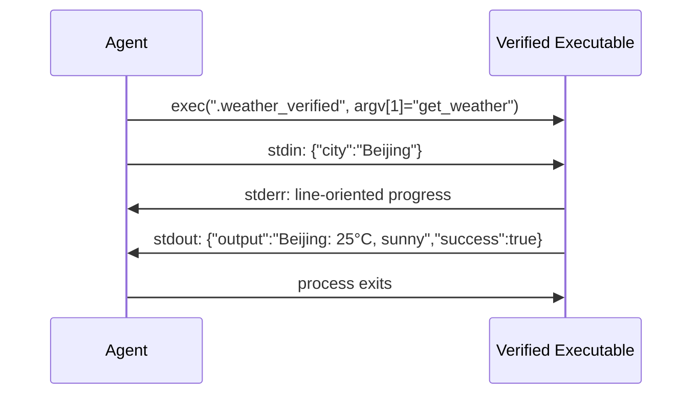

# Chapter 9: Extension Mechanisms: Skills, Plugins, and MCP

> **Positioning**: This chapter presents the three extension mechanisms in the current octos source: Skills (declarative Markdown), Plugins (local executable tools / skill package extras), and MCP (standard-protocol integration). Prerequisite: Chapter 6. It is written for contributors who want to write custom extensions for octos, and for developers who want to understand the architecture of agent extensibility.

An agent earns its value by adapting to different scenarios. Legal document review needs legal prompts; a research agent needs long-running background tasks; integrating remote services needs a standard protocol. Cramming every extension into one mechanism over-engineers the simple needs and forces the complex ones into an abstraction that does not fit.

octos's current answer is not "one universal plugin" but three complementary tracks:

- Skills: change the agent's prompts and context
- Plugins: wrap local executables as Tools, and carry skill package extras
- MCP: connect external tool servers through a standard protocol

---

## 9.1 The Skills Track: Declarative Markdown Extension

Skills are the lightest extension mechanism. A skill is, in essence, one `SKILL.md`, plus an optional `manifest.json`.

Start with the stark division of code volume between the two tracks: `crates/octos-agent/src/skills.rs` is 942 lines total, while the eight files of `crates/octos-agent/src/plugins/` add up to 14,675 lines. That gap is not an accident; it is a direct expression of the responsibility boundary. `crates/octos-agent/src/skills.rs` answers exactly one question: what does the model see. It discovers skill directories, parses the minimal frontmatter, checks availability, and compresses the result into an XML summary injected into the system prompt; it never touches processes, protocols, or security policy. `plugins/` answers a different question: what will the system execute. Manifest parsing, executable discovery and verification, the subprocess protocol, environment sanitization, approval, and concurrency control all pile up here; the execution protocol and its security constraints alone (`crates/octos-agent/src/plugins/tool.rs`, 3,219 lines) plus the matching tests (`crates/octos-agent/src/plugins/tool_tests.rs`, 4,406 lines) take more than half (51.96%). Running an external program safely costs far more than describing a prompt fragment. When a skill package directory holds both `SKILL.md` and `manifest.json`, that is exactly where the two tracks meet: `SkillsLoader` reads the former to inject prompts, `PluginLoader` reads the latter to register tools, and the `tools="true"` attribute in the XML index marks this seam.

### 9.1.1 The `SKILL.md` format

```markdown
---
name: code-review
description: Review code changes for bugs, security issues, and style
version: 1.0.0
requires_bins: rg,git
requires_env: GITHUB_TOKEN
---

When reviewing code, focus on:
1. Security vulnerabilities
2. Error handling completeness
3. Behavior regressions
```

`SkillsLoader` does not implement a full YAML parser. It does two simplified steps:

1. `split_frontmatter()` finds the frontmatter block between the leading and trailing `---` (`crates/octos-agent/src/skills.rs:301-320`)
2. `fm_value()` reads `name`, `description`, `requires_bins`, `requires_env`, `always`, `version`, `author`, and similar fields from simple `key: value` lines (`crates/octos-agent/src/skills.rs:322-343`)

`fm_value()` even strips inline comments and treats YAML empty values like `[]` / `""` / `~` as missing. The design goal of skill metadata is not maximal expressiveness but "stable enough, cheap enough": a full YAML parser would bring new dependencies and parsing ambiguities, while skill authors need only a handful of flat key-value pairs. The tests explicitly cover the edges (duplicate keys take the first, colons inside values, empty frontmatter; the test group at `crates/octos-agent/src/skills.rs:590-645`), which marks this simplified path as a maintained contract, not a stopgap.

The `available` verdict also comes from here: `parse_skill()` checks each command in `requires_bins` against PATH (`which_exists()`) and each variable in `requires_env` for being set; only when both pass does it set `available: true` (`crates/octos-agent/src/skills.rs:244-294,351-369`). Note this is an availability check, not a security boundary: a skill with missing dependencies is merely marked unavailable in the summary; it is not quarantined from execution.

### 9.1.2 Layered Directories and Load Order

`SkillsLoader` keeps one "list of skill directories," and directories added first have higher priority (`crates/octos-agent/src/skills.rs:62-116`). The actual assembly order of `list_skills()` is: load the compile-time `BUILTIN_SKILLS` first, then traverse the directories from lowest priority (scanned first) to highest priority (overwriting later), using `retain` to drop older same-named entries (`crates/octos-agent/src/skills.rs:118-173`). This "reverse traversal plus dedup" implementation buys one property: however many directory layers exist, a same-named skill keeps only the copy from the highest-priority source, and the loading logic never needs to know each directory layer's semantics.

The directory list itself is assembled on the deployment side: `Config::plugin_dirs_from_project()` collects `<octos_home>/plugins`, `<octos_home>/skills`, and `<octos_home>/bundled-app-skills/` in order, then appends the colon-separated directories of the `OCTOS_SKILLS_PATH` environment variable; the old `~/.octos/skills` HOME-global directory is no longer scanned and only triggers a one-time migration warning (`crates/octos-cli/src/config.rs:1330-1375`). At gateway startup, the app-skills / platform-skills bundled with the binary are bootstrapped into the layered directories (`crates/octos-cli/src/commands/gateway/gateway_runtime.rs:566-573`, `crates/octos-agent/src/bootstrap.rs:103-115`).

So this is not a fixed three-tier table of "workspace / global / builtin" but a layered view: deployment directories provide the shared baseline, account directories provide private installs, and the environment variable provides extra injection.

### 9.1.3 Skill layering v1: per-profile selective inheritance (9b1fc38f)

Layered directories answer "where skills come from"; skill layering v1 (commit `9b1fc38f`) answers "which of them this profile may load."

The configuration surface is a per-profile `skills` selection block, lowered into a crate-agnostic `SkillFilter` (`crates/octos-agent/src/skills.rs:12-36`):

- `AllExcept(ids)`: discover everything, minus a deny list
- `Only(ids)`: whitelist mode, load only the listed skills

This enum deliberately depends on no CLI types, so the prompt-side `SkillsLoader` and the tool-side plugin loader consume the same selection decision. Otherwise a dangerous inconsistency opens up: a skill's prompt card is disabled while its executable tool stays registered. The model cannot see the description, yet the tool remains callable.

The execution surface converges in three places (`crates/octos-agent/src/skills.rs:156-176,176-201`): `list_skills()` uses `retain` to drop disabled skills from the summary; `load_skill()` returns `None` outright for disabled names, so the body can never enter the prompt; `get_always_skills()` is filtered the same way because it goes through `list_skills()`. The plugin side honors the same filter: `load_into_with_options_and_filter()` skips an entire skill package whose manifest id hits the deny list, loading neither tools, hooks, nor prompt fragments (`crates/octos-agent/src/plugins/loader.rs:296-316`).

The wiring happens at gateway assembly: the runtime builds a filter from the resolved profile's `config.skills` and hands it to the account-level loader (`crates/octos-cli/src/commands/gateway/gateway_runtime.rs:646-648`); child bots inherit the same selection in `crates/octos-cli/src/commands/gateway/profile_factory.rs` (`crates/octos-cli/src/commands/gateway/profile_factory.rs:698-702`). `None` means there is no skills layer; everything behaves as before, fully backward compatible.

One distinction deserves emphasis: configuration inheritance is not local skill inheritance. A child account can inherit the parent profile's skill selection filter, but customer-installed skills are not inherited from the parent account. The account skills directory strictly resolves to the current account's own `data_dir/skills`, and plugin dirs likewise return only the current account's skills directory (`crates/octos-cli/src/skills_scope.rs:96-112`). A locally installed executable extension in the parent account will not silently enable itself in a child account.

### 9.1.4 The XML skill index

`build_skills_summary()` turns the filtered set of visible skills into XML injected into the system prompt (`crates/octos-agent/src/skills.rs:203-219`):

```xml
<skills>
  <skill available="true" tools="true">
    <name>deep-search</name>
    <description>Deep web research...</description>
    <location>/.../SKILL.md</location>
  </skill>
</skills>
```

Three points that are easy to get wrong:

- The current XML has no `name="..."` attribute; the name is a `<name>` child node
- `tools="true"` means "this skill directory contains a `manifest.json`," not "this skill is currently executing tools"
- `location` exposes the skill's real source path to the model, helping it tell builtin from external skills

The XML summary is therefore not a plain "list of available skills" but the skill catalog index visible to the model, already filtered by skill layering: a skill disabled by the profile is entirely invisible here; the model cannot even learn that it exists.

### 9.1.5 `spawn_only`: auto-backgrounding, not hidden tools

The `spawn_only` marker is defined on tool entries in the skill package manifest (`crates/octos-agent/src/plugins/manifest.rs:452-455`), but its runtime semantics live not in the manifest; they live in the registry and the agent execution loop:

- At load time `PluginLoader` calls `registry.mark_spawn_only(name, msg)` for these tool names (`crates/octos-agent/src/plugins/loader.rs:332-339`)
- `ToolRegistry` maintains custom prompt text and task-tracking state for them (`crates/octos-agent/src/tools/registry.rs:156-172`)
- When the main agent finds a tool call hitting `spawn_only`, it does not execute synchronously; it `tokio::spawn`s a background task and immediately returns `spawn_only_message` to the model (`crates/octos-agent/src/agent/execution.rs:579` onward)

So `spawn_only` is not "hidden from the ToolSpec." Under the current implementation these tools remain registered in the tool system and visible to the model; the difference is that invocation is auto-backgrounded. The model does not need to learn a new set of "task submission tools"; it issues a tool call as usual, and the runtime decides whether this call waits synchronously for the result or returns a handle immediately and keeps running in the background.

Going further, `resolve_extras()` injects the skill-card prompt fragment when the skill package contains `spawn_only` tools (`crates/octos-agent/src/plugins/extras.rs:39-45,449-456`). The model can thus see the tool and, at the same time, receive the prompt context for "when to use this background tool."

In the subagent scenario, the registry clears these markers, because "a subagent is itself background context"; there the tools execute directly like ordinary tools: wrapping another layer of backgrounding around already-backgrounded context would only lose the result handle, add a layer of scheduling overhead, and leave the child agent without the tool's return value.

---

## 9.2 The Plugins Track: Local Executable Tools and Skill Package Extras

If Skills change how the agent "thinks," Plugins make the agent actually call external programs to get work done.

### 9.2.1 The runtime manifest: more than a tool declaration

The runtime hot path uses the manifest structure from `crates/octos-agent/src/plugins/manifest.rs`:

```json
{
  "name": "weather",
  "version": "1.0.0",
  "tools": [
    {
      "name": "get_weather",
      "description": "Get current weather for a location",
      "input_schema": { "type": "object", "properties": { "city": { "type": "string" } } },
      "env": ["WEATHER_API_KEY"],
      "risk": "medium",
      "concurrency_class": "safe"
    }
  ],
  "sha256": "a1b2c3...",
  "timeout_secs": 600,
  "requires_network": true
}
```

Reading it as a "pure tool manifest" no longer suffices. The structure now also supports: `id`, `mcp_servers` (`SkillMcpServer`), `hooks` (`SkillHookDef`), `prompts.include`, `actions`, `binaries` (precompiled downloads keyed by `{os}-{arch}`), `spawn_only` / `spawn_only_message`, `env` / `env_allowlist`, `risk`, `concurrency_class`, `make_type`, and more (`crates/octos-agent/src/plugins/manifest.rs:8-110,387-477`). It is closer to a skill package runtime manifest: tools are just one payload type; MCP server declarations, lifecycle hooks, and prompt injection can each stand alone as a package. If `manifest.tools` is empty but extras are declared, `PluginLoader` skips the executable search and still installs the extras (`has_extras()`, `crates/octos-agent/src/plugins/manifest.rs:180-198`; the loading branch at `crates/octos-agent/src/plugins/loader.rs:607-626`). Put plainly: "a plugin without a binary" is a legal form; it degrades into a pure extras package.

### 9.2.2 The plugin binary protocol



Figure 9-1: Sequence diagram of the plugin binary protocol.

The implementation is a bit more involved than "stdin JSON / stdout JSON":

- what the runtime actually executes is the hash-verified copy written to disk after verification (`crates/octos-agent/src/plugins/tool.rs:109-131`)
- argv's first argument is the tool name
- stdin carries the JSON parameters
- stderr is read line by line and turned into progress events
- stdout is parsed as structured JSON first; when it is not valid JSON, the runtime falls back to "raw concatenated stdout + stderr text" (structured-field parsing around `crates/octos-agent/src/plugins/tool.rs:3117-3130`)

Reserving stderr as the progress stream is a pragmatic design: many off-the-shelf command-line tools already log to stderr, so a plugin author does not need to rewrite output logic; only the final result must land on stdout as JSON. The calling side receives streaming progress events, and a long task stops being a black-box wait.

Structured stdout also carries semantics richer than `output/success`: `file_modified` marks that the filesystem was touched, and `files_to_send` asks the runtime to deliver output files back into the conversation automatically (`crates/octos-agent/src/plugins/tool.rs:3117-3130`, `crates/octos-agent/src/plugins/tool.rs:1229-1307`). The runtime also tries to auto-detect generated files from the `out` argument or the output text.

The real value of the plugin protocol, then, is wrapping an "external process" into a Tool "that reports progress as a stream and returns files automatically."

### 9.2.3 Security and runtime constraints

Several security measures at the plugin layer must be stated precisely.

**Gate one: executable discovery is conservative.**
`PluginLoader` treats only "subdirectory + manifest.json" as candidates. To find the binary it tries the manifest name, then the directory name, then `main`, and only last falls back to scanning the directory (`crates/octos-agent/src/plugins/loader.rs:640-646,1189-1193`).

**Gate two: SHA-256 verification closes the TOCTOU window.**
The loader reads the raw bytes into memory once, hashes the in-memory bytes and compares against the manifest, writes the verified copy to disk, and records `load_time_hash`; a re-hash gate before execution re-verifies the same hash against the on-disk file, sealing the load→exec substitution window (`crates/octos-agent/src/plugins/loader.rs:649-712`, `crates/octos-agent/src/plugins/tool.rs:109-131`).

**Gate three: resource and environment constraints.**

- A 100MB cap on executable files, enforced before the file is read into memory (`MAX_EXECUTABLE_SIZE`, `crates/octos-agent/src/plugins/loader.rs:24,654-664`)
- The subprocess environment is sanitized by `sanitize_command_env` to strip injection vectors; tool-level `env` / `env_allowlist` uses strict semantics: secret-like variables are forwarded only when explicitly listed in the manifest, while non-secrets take the legacy compatibility path (`crates/octos-agent/src/plugins/tool.rs:85-91`)
- The runtime injects `OCTOS_WORK_DIR` for the plugin's output files
- The default timeout is 600 seconds, not 30 (`DEFAULT_TIMEOUT`, `crates/octos-agent/src/plugins/tool.rs:151-163`); the manifest's `timeout_secs` only overrides the default

**Gate four: risk and concurrency classes are not decorative fields.**
`risk` feeds the approval path: `high` / `critical` force interactive approval and are safely refused when the approval bridge is missing; `low` triggers no approval by default; `medium` / unknown mainly drives explicit display (`RiskLevel::classify` / `requires_approval`, `crates/octos-agent/src/plugins/manifest.rs:479-520`).

`concurrency_class` recognizes `safe` and `exclusive`. An unknown value is not optimistically treated as safe: `classify_concurrency_class()` returns `FailClosed`, the execution side falls back to `Exclusive`, and a manifest typo cannot let a mutually exclusive tool run in parallel (`crates/octos-agent/src/plugins/manifest.rs:569-609`).

**Gate five: symlinks rejected on Unix.**
`is_executable()` checks the file type with `symlink_metadata()` and accepts only regular files (`crates/octos-agent/src/plugins/loader.rs:1354-1365`). This is not the whole security boundary, but it shrinks the link-swap attack surface.

### 9.2.4 The boundary between the runtime `PluginLoader` and the `octos-plugin` SDK

The easiest mistake in this chapter is conflating the two layers of code in the repository into one.

The runtime hot path is `crates/octos-agent/src/plugins/` (8 files, 14,675 lines total, of which `crates/octos-agent/src/plugins/tool.rs` is 3,219 lines and `crates/octos-agent/src/plugins/tool_tests.rs` is 4,406 lines): it scans directories, loads manifests, resolves extras, verifies and registers executable tools, and merely `warn!`s and skips a single failed plugin.

`crates/octos-plugin` is an SDK / tooling crate providing another layer of abstraction:

- `discover_plugins()`: scans by source priority and deduplicates by manifest `id`; the first occurrence wins (`crates/octos-plugin/src/discovery.rs:47-59`)
- `check_requirements()`: performs the three gating classes `bins/env/os` (`crates/octos-plugin/src/gating.rs:42`)
- a richer manifest: `id/type/requires/install/...` (`crates/octos-plugin/src/manifest.rs:112`)

The two layers are related but must not be confused: the runtime loader has its own manifest types and paths, while `octos-plugin` serves toolchain consumers such as validators, marketplaces, and installers. One small but real detail: gating treats `darwin` and `macos` as equivalent aliases, so a mismatch between manifest strings and Rust platform strings does no damage (`crates/octos-plugin/src/gating.rs:73-78`).

---

## 9.3 MCP Integration: A Standard-Protocol Client on the rmcp SDK

MCP (Model Context Protocol) is a standardized tool-integration protocol. octos's MCP client lives at `crates/octos-agent/src/mcp.rs`, built on the official rmcp SDK (migration in commit `65486dad`; `crates/octos-agent/Cargo.toml:41-44`: `rmcp = { version = "1.8", ... }`, with a comment that says outright "stdio + streamable-HTTP + OAuth 2.1").

### 9.3.1 Why the rmcp migration: three spec gaps in the hand-written client

The module documentation of `crates/octos-agent/src/mcp.rs` is blunt: the old hand-written client had three protocol-level defects: a missing `notifications/initialized`, a hardcoded protocol version, and a one-response-line-per-request read that misaligns under concurrency (`crates/octos-agent/src/mcp.rs:1-22`).

Each gap has a real consequence. Without the `initialized` notification, any server that per spec waits for that signal before entering working state stays half-initialized forever. A hardcoded protocol version is either rejected or silently downgraded when the server negotiates a different version. And "read one line per call" under concurrent calls must misalign: JSON-RPC responses match requests by id, not arrival order, so once responses from two parallel tool calls interleave, line-by-line parsing attributes them to the wrong requests.

rmcp takes over all three: the full lifecycle handshake (`initialize` + `notifications/initialized`), protocol version negotiation, and multiplexing with id routing for concurrent requests over a single connection. Upstack, this means concurrent tool calls no longer queue behind the previous response; one slow tool does not block the other tools on the same server.

### 9.3.2 The three connection paths

`McpServerConfig` (`crates/octos-agent/src/mcp.rs:53-88`) dispatches by field into three connection paths:

| Path | Trigger | Where it goes |
|------|---------|--------|
| stdio | only `command`/`args`/`env` set | `connect_stdio()` (`crates/octos-agent/src/mcp.rs:452-485`) |
| streamable-HTTP (static headers) | `url` set, `oauth` off | `connect_http()` (`crates/octos-agent/src/mcp.rs:499-528`) |
| streamable-HTTP + OAuth 2.1 | `url` + `oauth: true` | `crates/octos-agent/src/mcp_auth.rs::connect_oauth()` (`crates/octos-agent/src/mcp.rs:501-504`, `crates/octos-agent/src/mcp_auth.rs:105-186`) |

The stdio path spawns a child process with `kill_on_drop`, tying the child's lifetime to the `Arc` references of the rmcp session: when the last reference drops, the transport closes and the child is reaped. The environment follows the same sanitization rule as every octos subprocess: injection-vector variables are stripped, only env names the operator explicitly listed are forwarded, and even explicitly listed names pass through a denylist again, so a config writing `LD_PRELOAD` cannot reopen the process-hijacking hole (`crates/octos-agent/src/mcp.rs:452-485`). The rmcp subprocess transport reads JSON-RPC frames with an unbounded `read_until`; the source comment concedes this drops the old client's single-line cap, justified because a stdio server is a local binary the operator named and trusted personally (`crates/octos-agent/src/mcp.rs:465-472`).

The HTTP path is not a "pure SSE channel": rmcp's `StreamableHttpClientTransport` follows streamable-HTTP semantics (POST requests, optionally streaming responses); static headers, including an `Authorization` bearer token, are carried as-is, and octos wraps SSRF protection around the outside (see 9.3.4).

The OAuth path serves remote servers that need real user authorization. Token acquisition and use split across two command surfaces: `octos mcp login <url>` interactively runs the OAuth 2.1 authorization-code flow (a loopback redirect receives the callback) and writes the access + refresh tokens into the OS keyring as serialized JSON; the keyring key is "normalized URL + sha256 prefix," so writing the same server differently still stores only one entry (`crates/octos-agent/src/mcp_auth.rs:30-95,186` onward). At runtime, `connect_oauth()` retrieves the token from the keyring and hands it to rmcp's `AuthClient`, refreshing automatically on expiry with no re-login; before connecting it enforces HTTPS and rejects literal private-network hosts (`crates/octos-agent/src/mcp_auth.rs:105-125`). One detail that is easy to miss: under OAuth there are two HTTP clients: the transport client carries configured headers through the SSRF filter, while the authorization-server endpoints (discovery / registration / token / refresh) go through a separate `SsrfOAuthHttpClient`, because those requests may legitimately point at a different host (`crates/octos-agent/src/mcp_auth.rs:126-135`).

### 9.3.3 Discovery, timeouts, and tool registration

Startup is fail-soft (`McpClient::start()`, `crates/octos-agent/src/mcp.rs:374-437`): servers are connected one by one; an unreachable server is logged as a warning and skipped, so one bad server cannot drag down the whole agent. Tool discovery also has a timeout: a server that completed `initialize` but keeps stalling on `tools/list` is skipped after `HANDSHAKE_TIMEOUT` (30 seconds), without blocking the servers behind it. This guard targets the pathological server that "completes the handshake but never returns the list," protocol-legal yet capable of wedging startup in engineering terms.

For each discovered tool, `validate_schema()` checks `input_schema`: nesting depth $\le 10$ (`MAX_SCHEMA_DEPTH`) and serialized size $\le 64\text{KB}$ (`MAX_SCHEMA_SIZE`, `crates/octos-agent/src/mcp.rs:47-49,296-322`). On the execution side, `McpTool::execute()` wraps `tools/call` in a 60-second timeout, and non-text content (images, resources) is dropped, because the agent's tool surface is currently text-only (`crates/octos-agent/src/mcp.rs:586-612`).

Two guards run before registration (`register_tools()`, `crates/octos-agent/src/mcp.rs:532-558`):

- **Name protection**: `PROTECTED_NAMES` lists 20 built-in tool names (shell, read_file, git, browser, and so on); a same-named MCP tool is skipped outright, preventing a remote server from silently hijacking core capabilities (`crates/octos-agent/src/mcp.rs:349-372`)
- **Transport liveness** (commit `3934aeb6`): transports are handed to the registry before tools (`keep_mcp_service_alive`). Otherwise the tool is the sole owner of the connection, and when a profile narrowing filters out the last MCP tool, it kills the child process as a side effect (issue #1886). A visibility filter should not have the side effect of terminating a connection

### 9.3.4 The SSRF line of defense on the HTTP path

Remote MCP is an outbound surface, and octos places two lines of defense there (`crates/octos-agent/src/mcp.rs:122-183`):

1. **Configuration level**: `reject_private_url_host()` rejects URLs whose host is a literal private/loopback IP or `localhost`. reqwest skips the custom resolver for literal-IP hosts; this layer exists to cover exactly that (`crates/octos-agent/src/mcp.rs:165-183`)
2. **Resolution level**: a custom `SsrfDnsResolver` is mounted into the HTTP client and re-checked on every resolution, rejecting private/loopback/link-local/metadata addresses and defeating DNS rebinding; the redirect policy is `none`, so a 3xx cannot smuggle a request to an internal host (`crates/octos-agent/src/mcp.rs:122-163`)

The OAuth path's line is wider: the authorization server's discovery / registration / token / refresh endpoints all go through the SSRF-validated HTTP client as well (`SsrfOAuthHttpClient`, `crates/octos-agent/src/mcp.rs:211-293`, `crates/octos-agent/src/mcp_auth.rs:126-135`). A self-declared public MCP server cannot point token traffic at `127.0.0.1` or the cloud metadata address `169.254.169.254`; otherwise an attacker could use a malicious server to probe the internal network or harvest credentials.

---

> ### Engineering decision: why three extension mechanisms
>
> | Dimension | Skills | Plugins | MCP |
> |------|--------|---------|-----|
> | Core role | change prompts and context | run local executable tools | connect external protocol-based tool servers |
> | Main carrier | `SKILL.md` | `manifest.json` + executable | rmcp session (stdio / HTTP / OAuth) |
> | Execution boundary | no separate execution boundary | external process + verified copy | local child process or remote connection |
> | Typical value | low-cost behavior customization | progress streams, file return, background tasks | reuse across agent platforms |
> | Security surface | availability check + profile filtering | hash verification + env sanitization + work dir | SSRF + schema validation + name protection |
>
> **Why can't they be unified into one?**
>
> Because they do not solve the same class of problem. Skills teach the model "how to think," Plugins teach the system "how to do," and MCP teaches the system "how to plug in someone else's capabilities."
>
> Making Skills a kind of Plugin would force pure prompt customization to carry the costs of binaries, protocols, and runtime security. Conversely, making Plugins pure Skills could not deliver real execution, progress streams, or file output. MCP and Plugins both look like "tool extension," but MCP pursues protocol interoperability rather than the lowest friction of local runtime integration.

---

## 9.4 Harness engineering contracts: see Chapter 10

Skills, Plugins, and MCP answer "how capabilities enter octos"; Harness answers how capabilities, once running, become verifiable, observable, upgradeable engineering contracts: ABI schema versioning, the `OCTOS_EVENT_SINK` JSONL side-channel, the validator runner, and starter app skills. Since v2 this material has its own chapter; see **Chapter 10**.

---

## 9.5 Configuration Lanes: `mcp_servers` and `sub_providers`

The two configuration lanes of the extension mechanisms both live on the CLI-side top-level `Config`. One decides "which external tool servers to connect"; the other decides "which models subagents use." Their names rhyme; their semantics do not.

### 9.5.1 `mcp_servers`

The top-level key `mcp_servers: Vec<octos_agent::McpServerConfig>` (`crates/octos-cli/src/config.rs:108-110`) reuses the agent crate's configuration type directly. This wiring is deliberate: the config-parsing surface and the runtime-consuming surface share one struct, so what `McpClient::start()` receives is exactly what the config file wrote. No second conversion in between, hence no room for "the config says one thing, the runtime understands another" drift. Each entry's fields are the three dispatch conditions from the table in 9.3.2 (`command`/`args`/`env`, or `url`/`headers`, or those plus `oauth`/`scopes`), plus an optional `concurrency_class` override (default `Safe`; unknown values likewise fail-safe to `Exclusive`). Minimal example:

```json
{
  "mcp_servers": [
    { "command": "uvx", "args": ["mcp-server-fetch"] },
    { "url": "https://mcp.example.com/mcp", "oauth": true, "scopes": ["read"] }
  ]
}
```

### 9.5.2 `sub_providers`

The top-level key `sub_providers: Vec<SubProviderConfig>` (`crates/octos-cli/src/config.rs:182-184`; struct definition `crates/octos-cli/src/config.rs:616-654`) declares the sub providers the spawn tool can choose from. Fields include `key` (a short reference name such as `cheap`, `strong`), `provider`, `model`, `api_key_env`, `base_url`, `description`, `default_context_window`, `max_output_tokens`, `api_type`. The `description` enters the spawn tool's schema alongside cost and capability metadata, and the model picks a model based on it; `default_context_window` decides how aggressively the subagent trims history. Minimal example:

```json
{
  "sub_providers": [
    { "key": "cheap", "provider": "openai", "model": "gpt-4o-mini", "api_key_env": "OPENAI_API_KEY" }
  ]
}
```

Reserved key `goal_verifier`: a `sub_providers` entry keyed `goal_verifier` routes goal-completion verdicts to that provider for verification (`GOAL_VERIFIER_LANE_KEY` and `build_goal_verifier_provider()`, `crates/octos-cli/src/runtime/profile.rs:128-190`). The point of this lane is separating "the model that does the work" from "the model that accepts it": unconfigured, it falls back to the scoring session's own provider (the pre-`#1935` behavior, kept as the compatibility default), where goal completion is attested by the same model; configured with an independent verifier, the verdict comes from a separate provider lane.

## 9.6 Chapter Recap

1. Skills: `SKILL.md` + simplified frontmatter parsing; layered directories deduplicate into one view, which the per-profile `SkillFilter` (layering v1, `9b1fc38f`) filters into the XML summary injected into the system prompt.

2. Plugins: the runtime manifest is already a skill package manifest; the verified copy seals TOCTOU, while env allowlisting, risk approval, fail-closed concurrency, and the 600-second default timeout together form the execution boundary.

3. `spawn_only`: not hidden tools but auto-backgrounding. The main agent returns `spawn_only_message` immediately; subagent contexts restore direct execution.

4. MCP: stdio + streamable-HTTP + OAuth 2.1 on the rmcp SDK (1.8) (`65486dad`); fail-soft startup, schema validation, `PROTECTED_NAMES`, the two-level SSRF line, and registry-held transports (`3934aeb6`).

5. Architecture boundary: `octos-agent/src/plugins/*` (14,675 lines) is the runtime hot path; `crates/octos-agent/src/skills.rs` (942 lines) is the prompt track; `octos-plugin` is the discovery/gating SDK.

6. Configuration lanes: `mcp_servers` decides which MCP servers to connect; `sub_providers` decides which models subagents use; `goal_verifier` is the reserved key of the latter.

This closes Part 2. The next chapter opens Part 3, moving from single-machine sessions to the message bus and multi-session orchestration.

---

## Further reading

- Model Context Protocol: https://modelcontextprotocol.io/
- rmcp (Rust MCP SDK): https://crates.io/crates/rmcp
- JSON-RPC 2.0: https://www.jsonrpc.org/specification

## Exercises

1. The convergence point of skill filtering: why must `load_skill()` return `None` for a disabled skill, rather than merely deleting it from the XML summary? If the model tries to load a disabled skill by name from "memory," what happens?

2. The plugin trust chain: the verified copy closes the load→exec TOCTOU, but if the manifest and the raw binary are replaced together, the hash still "agrees with itself." How would you push the trust chain one layer further out?

3. The rmcp tradeoff: migrating to rmcp fixed the three spec gaps but dropped the stdio single-line 1MB cap (unbounded `read_until`). Under what premise is this tradeoff safe? In what deployment shapes does it deserve a second look?

---

> **Version note**
> This chapter is written against octos main `9c157101` (measured 2026-09-03) and covers three recent evolutions: `65486dad` migrated the MCP client wholesale onto the rmcp SDK (stdio + streamable-HTTP + OAuth 2.1; `crates/octos-agent/src/mcp.rs` rewritten, `crates/octos-agent/src/mcp_auth.rs` added); `9b1fc38f` shipped skill layering v1 (per-profile selective inheritance, `crates/octos-agent/src/skills.rs`, `crates/octos-agent/src/plugins/loader.rs`); `3934aeb6` moved MCP transport ownership into the registry. When reading later versions, check first against `crates/octos-agent/src/skills.rs`, `crates/octos-agent/src/plugins/`, `crates/octos-agent/src/mcp.rs`, `crates/octos-agent/src/mcp_auth.rs`, `crates/octos-plugin/src/`, and `crates/octos-cli/src/config.rs`.
