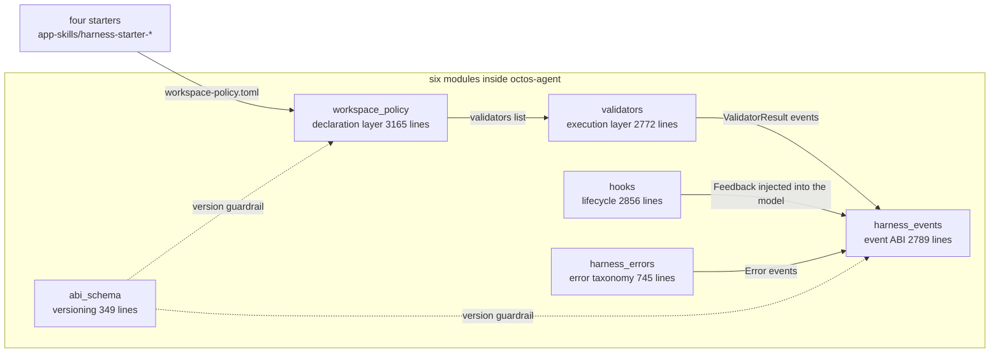
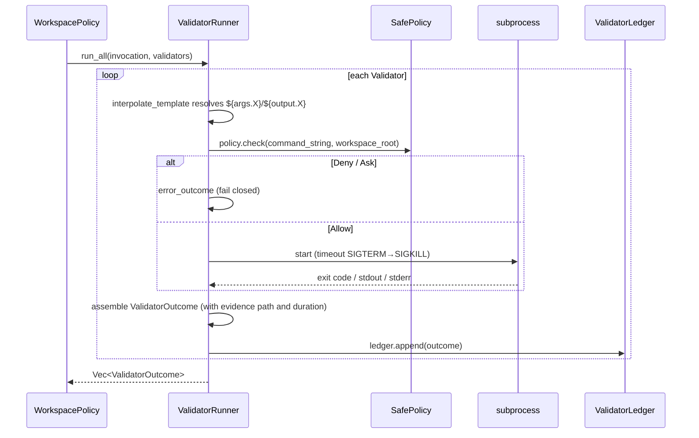
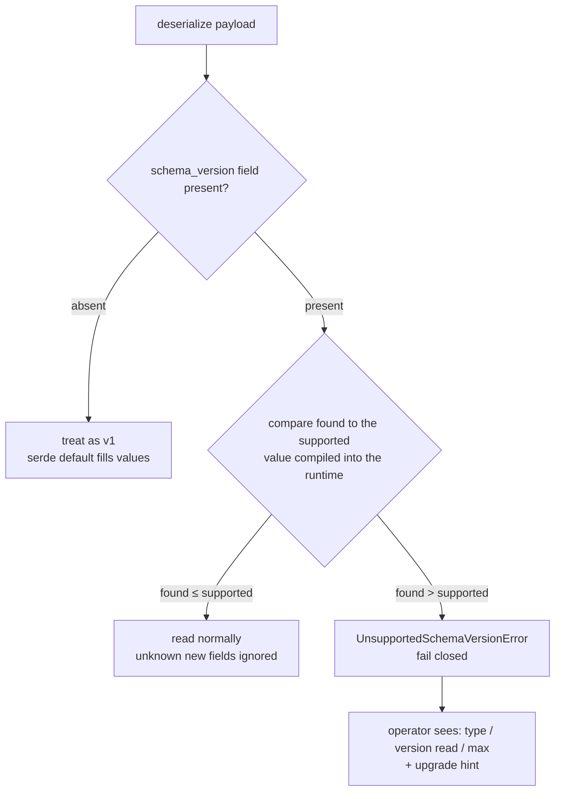

# Chapter 10: Harness: Turning "the model says it's done" into a Verifiable Contract

> **Positioning**: This chapter dissects the octos harness system: declarative validators, a structured event ABI, schema versioning, workspace policy, the structured error taxonomy, and lifecycle hooks. It starts by correcting a common misconception: there is no standalone harness crate; the harness is six modules inside `octos-agent` plus four starter scaffolds. Prerequisites: Chapter 5 (the error recovery chain), Chapter 6 (the `Tool` trait), Chapter 7 (the sandbox). Who should read it: anyone who needs the output of a long-running agent to be auditable, gated, and replayable.

Chapter 5 left a question open when it covered the agent loop: the model answers "done"; on what basis does the runtime believe it? Chapter 6's tools let an agent change the world; Chapter 7's sandbox constrains how far those changes may reach. But "did the changes meet the bar after they happened" stayed unanswered. The harness closes that gap. It does not make the model smarter; it turns "done" from a natural-language sentence into a machine-checkable contract.

First, the size of these six modules in the source tree (measured on octos main @ `9c157101`):

| Module | Lines | First-line `//!` doc |
|---|---|---|
| `crates/octos-agent/src/validators.rs` | 2,772 | `Declarative validator runner (harness M4.3).` |
| `crates/octos-agent/src/harness_events.rs` | 2,789 | `Structured harness event ABI and local sink transport.` |
| `crates/octos-agent/src/abi_schema.rs` | 349 | `Harness ABI schema versioning.` |
| `crates/octos-agent/src/workspace_policy.rs` | 3,165 | (no `//!`; first line is `use std::collections::BTreeMap;`) |
| `crates/octos-agent/src/harness_errors.rs` | 745 | `Structured harness error taxonomy (M6.1, issue #488).` |
| `crates/octos-agent/src/hooks.rs` | 2,856 | `Hook/lifecycle system for running shell commands at agent lifecycle points.` |

The total is 12,676 lines. There is no harness crate; these six files all live under `crates/octos-agent/src/`, and together with the four starter directories under `crates/app-skills/` (audio/coding/generic/report) they are the whole harness. That correction carries information on its own: the harness is not another abstraction box layered on top; it weaves validation, events, and versioning directly into the agent runtime.



The division of labor among the three pillars: `workspace_policy` declares what counts as done, `validators` executes the verdict, and `abi_schema` + `harness_events` make sure the process and the result of the verdict stay legible to components of different versions. Hooks and harness_errors are the two wings: the former turns lifecycle points into programmable seams, the latter gives every failure a type. The sections below take them one at a time.

---

## 10.1 Pillar One: Declarative Validators

### 10.1.1 Why Validation Is Data, Not Code

The first pillar answers "what counts as done." Start with what it rejects: the most intuitive way to make agent output verifiable is a `fn validate() -> bool`. But once validation logic is code, it locks to the host version: an old workspace meeting a new runtime gets a function signature mismatch; in the other direction, a runtime upgrade cannot interpret the validation intent written into old policy files. octos chose to make validators **data**: a table inside `WorkspacePolicy`, interpreted and executed by a single runner.

Three engineering reasons back this decision. First, serializability: policy files can be archived with the workspace, diffed, and migrated, and the `schema_version` field keeps old files readable in new runtimes (see 10.3). Second, sandboxability: the runner is the only execution entry point, so command validators uniformly pass through the shell safety layer (`SafePolicy`) and `BLOCKED_ENV_VARS` environment scrubbing, and policy authors cannot bypass either (for the sandbox itself and for the decisions in `b64bd532`/`bf6be8cc`, which pulled project-root validators into the sandbox and made the mcp-serve path fail-closed, see Chapter 7). Third, replayability: every execution result lands in a JSONL ledger that is re-read verbatim after a restart, with no dependence on transient in-process state. The cost is limited expressiveness: a complex verdict has to be decomposed into combinations of existing `ValidatorSpec` variants, or fall back to the `Command` variant calling an external program. Exercise 1 pushes on that trade-off.

### 10.1.2 The Declaration Layer: `Validator` and Three-Tier Semantics

The declaration lives in `ValidationPolicy` (`crates/octos-agent/src/workspace_policy.rs:115`), which holds both the old string validators and the typed validators:

```rust
/// Tiered validation checks run at different points in the turn lifecycle.
#[derive(Clone, Debug, Default, PartialEq, Serialize, Deserialize)]
pub struct ValidationPolicy {
    /// Tier 1: cheap checks run every turn (< 100ms). e.g. file_exists, build exit code.
    #[serde(default)]
    pub on_turn_end: Vec<String>,
    /// Tier 2: medium checks run when source files change (1-5s). e.g. preview render.
    #[serde(default)]
    pub on_source_change: Vec<String>,
    /// Tier 3: expensive checks run on completion/publish only (10-30s). e.g. Playwright.
    #[serde(default)]
    pub on_completion: Vec<String>,
    /// Typed declarative validators (M4.3). Runs via `ValidatorRunner`.
    #[serde(default, skip_serializing_if = "Vec::is_empty")]
    pub validators: Vec<Validator>,
}
```

The first three fields are string validators tiered by cost (every turn, on source change, on completion only); the fourth, `Vec<Validator>`, is the typed form the harness actually pushes. Each `Validator` (`crates/octos-agent/src/workspace_policy.rs:143`) carries a stable `id`, a timeout, and a run phase; its body, `spec`, is a `kind`-tagged enum `ValidatorSpec` (`crates/octos-agent/src/workspace_policy.rs:301`) that grows from running subprocesses, calling tools, and checking file existence out to HTTP probes, SHA-256 comparison, and audio non-silence detection.

The failure semantics carry the most design weight. Historically there was only the boolean `required`: true meant a failure blocks, false meant warn-only. After Wave-3a introduced `soft_fail`, the two fields collapse into a three-value `Required` (`crates/octos-agent/src/workspace_policy.rs:198`):

```rust
    pub fn tier(&self) -> Required {
        if self.soft_fail {
            Required::Soft
        } else if self.required {
            Required::Hard
        } else {
            Required::None
        }
    }
```

A Hard failure stops a spawn task from reaching terminal success; a Soft failure only leaves a ledger record and a warning, which serves partial-delivery contracts of the form "the primary artifact must ship, the byproducts are best-effort"; None gates exactly like Soft but the ledger explicitly marks it "informational." The old boolean fields stay for compatibility with old policy files, and this one function reconciles both generations of fields. The declarative design is what makes that smooth migration possible.

The criteria for the three tiers are written into the doc comment of the `Required` enum (`crates/octos-agent/src/workspace_policy.rs:198`), and two helper methods pin the semantics down: `is_hard()` decides whether a non-Pass result demotes a spawn task to Failed (true only for Hard); `is_warning_only()` decides warn-only behavior (true for both Soft and None). Operationally, this means a dashboard can slice failures into three classes by the tier label in the ledger: a hard failure needs immediate action, a soft failure needs a look at whether the byproduct affects anything downstream, a none failure is pure information. The practical question for choosing a tier is "if this check fails, is the deliverable still usable": file existence of the primary artifact takes Hard; preview files and supplementary reports take Soft; style checks take None. The stable labels emitted by `as_str()` (hard/soft/none) go straight into metrics and ledger records, so an operations panel can filter without understanding a Rust enum.

### 10.1.3 The Execution Layer: The Five-Step Sequence of `ValidatorRunner`

The execution layer centers on `ValidatorRunner` (`crates/octos-agent/src/validators.rs:441`). Its constructor reads like a safety checklist: evidence lands by default under `<workspace_root>/.octos/validator-evidence/` (the `EVIDENCE_SUBDIR` constant at `crates/octos-agent/src/validators.rs:46`), the command policy defaults to `SafePolicy`, and the ledger and sandbox are optional attachments. Tool dispatch is abstracted behind the `ValidatorToolDispatcher` trait (`crates/octos-agent/src/validators.rs:367`): production binds the full `ToolRegistry`, while tests and short-lived call sites use `MapToolDispatcher` to snapshot the few tools they need instead of cloning an entire registry to build a runner. The context shared by a batch of validators is `ValidatorInvocation` (`crates/octos-agent/src/validators.rs:167`), carrying the workspace root, repository label, run phase (`ValidatorPhase`, `crates/octos-agent/src/validators.rs:105`, with turn_end and completion values), and optional spawn task input and tool output. `run_all` runs the whole batch and returns results in declaration order. The processing path of a single command validator:



Every step of that sequence diagram maps to a method of ValidatorRunner. Five key steps. Template interpolation at `crates/octos-agent/src/validators.rs:677-696`: `${args.<key>}` comes from the spawn task input JSON, `${output.<key>}` from the tool's `named_outputs` (for example `deploy_url` from `mofa_publish`), which makes "verify the just-published URL is reachable" a first-class case; a missing key produces Error directly. The safety gate at `crates/octos-agent/src/validators.rs:719-734`: a `SafePolicy` verdict of Deny or Ask is treated as Error; over-blocking beats letting it through. Execution and timeout kill (SIGTERM escalating to SIGKILL on Unix, `taskkill /F /T` on Windows) live in `run_command` (`crates/octos-agent/src/validators.rs:661`). The result type `ValidatorOutcome` (`crates/octos-agent/src/validators.rs:236`) carries `schema_version`, duration, evidence path, and the tail of stderr, enough for after-the-fact audit. Booking to the ledger is done by `ValidatorLedger.append` (`crates/octos-agent/src/validators.rs:321`), one JSON record per line.

The ledger is append-only: `ValidatorLedger` (`crates/octos-agent/src/validators.rs:298`) exposes exactly two actions, `append` and `read_all`; the latter deserializes line by line and, along the way, normalizes pre-Wave-3a records into the new tier semantics. The contract test `should_persist_outcomes_and_replay_them_byte_for_byte` (`crates/octos-agent/tests/validator_runner.rs:490`) verifies exactly "what went in is what comes back on re-read." Replay does not rely on log archaeology; it relies on structured records.

The 17 cases of `crates/octos-agent/tests/validator_runner.rs` pin every edge of that sequence diagram: a required command validator failing must block (`crates/octos-agent/tests/validator_runner.rs:123`), an optional failure only warns (`:218`), a timeout kills the subprocess (`:329`), stderr lands in the result for the operator to read (`:293`), and `BLOCKED_ENV_VARS` are stripped even when set explicitly (`:531`).

> **Engineering decision**: why timeouts and refusals are Error, not Fail
> `ValidatorStatus` (`crates/octos-agent/src/validators.rs:131`) splits terminal states four ways: `Pass` / `Fail` / `Timeout` / `Error`. Fail means "the check ran to completion and the verdict is not acceptable"; Timeout and Error mean "the check never ran." The distinction matters for gating: an unacceptable artifact can be returned to the agent to fix, while a policy refusal or a broken environment would, if "returned," only set the agent spinning against a broken world. Consumers (the Chapter 16 gate among them) need a single condition, `required && status != Pass`, and the four terminal states fall into place.

### 10.1.4 Workspace Policy: One TOML Drives Everything

`WorkspacePolicy` (`crates/octos-agent/src/workspace_policy.rs:22`) is the master declaration: seven sections covering workspace type, versioning, tracking, validation, artifacts, spawn tasks, and compaction. Its `CompactionPolicy` (`crates/octos-agent/src/workspace_policy.rs:51`) declares the shape of compaction: target token budget, artifacts and invariants that must survive, summarizer flavor (`CompactionSummarizerKind`, `crates/octos-agent/src/workspace_policy.rs:104`, Extractive or LlmIterative), preflight thresholds, and how many rounds of old tool results to prune. When absent, the runtime falls back to the old extractive path, byte-for-byte identical to pre-M6.3 behavior. "Absent means old behavior" is the shared compatibility philosophy across harness modules (Chapter 8 covers how compaction is consumed at runtime).

The read side of `WorkspacePolicy` sits behind the same version guardrail: a missing `schema_version` in the file deserializes as v1, and a version above the maximum compiled into the runtime is rejected outright; details in 10.3. The four starters' `workspace-policy.toml` files are the minimal runnable samples of this declaration; 10.5 walks through them.

---

## 10.2 Pillar Two: The Event ABI: What Happened While It Ran

### 10.2.1 The `octos.harness.event.v1` Envelope

The first pillar answers the verdict at the end; the second answers the narrative of the process: what happened while it ran, and how external components hear about it. That need lands in `crates/octos-agent/src/harness_events.rs` (2,789 lines, the largest of the six modules). All events share one envelope:

```rust
#[derive(Debug, Clone, Serialize, Deserialize, PartialEq)]
pub struct HarnessEvent {
    pub schema: String,
    #[serde(flatten)]
    pub payload: HarnessEventPayload,
}
```

The `schema` field is always the constant `HARNESS_EVENT_SCHEMA_V1` (`crates/octos-agent/src/harness_events.rs:29`), whose value is the string `octos.harness.event.v1`, the stable identity consumers are meant to branch on. The payload, `HarnessEventPayload` (`crates/octos-agent/src/harness_events.rs:368`), is a `kind`-tagged, snake_case-named tagged union of a dozen-plus events: Progress, Phase, Artifact, ValidatorResult, Retry, Failure, McpServerCall, SubAgentDispatch, SwarmDispatch, SwarmReviewDecision, CostAttribution, RoutingDecision, CredentialRotation, SessionSanitized, SubagentProgress, Error. The pipeline progress events of Chapter 13 and the swarm gates of Chapter 17 both speak this vocabulary; this chapter establishes it.

Take the most used one, `HarnessProgressEvent` (`crates/octos-agent/src/harness_events.rs:461`): it carries `schema_version`, `session_id`, `task_id`, `phase`, an optional `message`, and an alias-compat field for `progress_fraction`: old producers write `progress_fraction`, new consumers read `fraction`, and one serde alias line settles it without a major-version bump.

### 10.2.2 Local Sink Transport

The transport is a local JSONL file: an external app skill process writes single-line events into the file pointed to by `OCTOS_EVENT_SINK`; the runtime validates the schema, tails the file, folds events into the task snapshot, and broadcasts typed frames to `/api/events/harness`. This side channel is separate from the stdout tool-result protocol: stdout answers "what did the tool return," the sink answers "what happened while it ran". One app skill process, two output channels, no mixing of duties. Two defenses guard the channel: events are schema-validated before they enter, and any line over the size cap is rejected whole, so dirty data never enters the stream; correlation context arrives via environment variables, `OCTOS_SESSION_ID` and `OCTOS_TASK_ID` (plus the equivalent `OCTOS_HARNESS_SESSION_ID` / `OCTOS_HARNESS_TASK_ID`), so every event traces back to a session and a task, and after-the-fact audits never have to guess provenance. For the fleet gates of Chapter 16 and the swarm aggregation of Chapter 17, this per-task event collection is the foundation they consume; this chapter sets the contract and leaves the consuming side alone.

Errors get their own event form: `HarnessErrorEvent` (`crates/octos-agent/src/harness_errors.rs:166`) rides under the same envelope as `kind: "error"`, carrying the snake_case variant identity and the recovery hint, with the schema version constant `HARNESS_ERROR_SCHEMA_VERSION` registered in abi_schema. The contract test `should_round_trip_harness_error_through_sink` (`crates/octos-agent/tests/harness_errors.rs:154`) verifies that an error event written through the sink and read back is unaltered; `should_emit_harness_event_on_error_classification` (`:126`) verifies that every error classification emits an event. The taxonomy itself (`RecoveryHint` at `crates/octos-agent/src/harness_errors.rs:47` and `HarnessError` at `crates/octos-agent/src/harness_errors.rs:93`, five hints and a dozen-plus variants) was covered with the recovery chain in Chapter 5; two points deserve emphasis here. First, the relation between the taxonomy and the event ABI is "classification determines the payload": `variant_name()` is frozen naming, and event consumers branch on it deterministically without touching the natural-language message. Second, the granularity of the taxonomy is designed for observability: `RecoveryHint` has exactly five values (backoff_retry, switch_provider, compact_context, fail_fast, bug) and can serve directly as Prometheus labels without cardinality explosion; `HarnessError` variants are fine-grained enough to separate "401 authentication failed" from "403 quota exhausted" (two 4xx cases), so the operator-facing hints differ: "check the API key" versus "top up or switch provider." The 18 cases of `crates/octos-agent/src/harness_errors.rs` pin this mapping firmly: 429 maps to RateLimited with BackoffRetry (`crates/octos-agent/tests/harness_errors.rs:26`), 5xx to ProviderUnavailable with SwitchProvider (`:58`), network errors to BackoffRetry (`:77`), identical inputs always classify identically (`:110`), 403 with a quota marker maps to Quota and without to Authentication (`:248`, `:271`). Classification survives a round trip through eyre unchanged (`:280`): the payoff of putting the classification in the type rather than at the failure site.

---

## 10.3 Pillar Three: Schema Versioning: Staying Legible Across Versions

Declarations get archived, events get replayed, so a third question arises: can components separated by a version still understand each other? That is the territory of the third pillar, `crates/octos-agent/src/abi_schema.rs`.

### 10.3.1 Five Durable Types and `check_supported`

The harness exposes five durable serialized types: `WorkspacePolicy`, `HookPayload`, `ProgressEvent` (the emitted shape), `TaskResult`, and `SessionSummary`. `crates/octos-agent/src/abi_schema.rs` maintains a version constant for each in one place, all currently 1. This 349-line module does one thing: the version guardrail. Its core function is nine lines (`crates/octos-agent/src/abi_schema.rs:159`):

```rust
pub fn check_supported(
    kind: &'static str,
    found: u32,
    supported: u32,
) -> Result<(), UnsupportedSchemaVersionError> {
    if found > supported {
        Err(UnsupportedSchemaVersionError {
            kind,
            found,
            supported,
        })
    } else {
        Ok(())
    }
}
```

The rule is one-directional: `found <= supported` always passes (old versions stay readable through defaulted fields), and `found > supported` is rejected with the typed error `UnsupportedSchemaVersionError` (`crates/octos-agent/src/abi_schema.rs:135`), whose Display message always contains the type name, the version actually read, and the supported maximum, plus the hint "upgrade octos to a newer release." No panic, no silent truncation. The caller can log, surface an actionable error to the operator, or fall back to a safe default.

### 10.3.2 The Version Negotiation Decision Flow



Why does this door close in only one direction? The risks of "old runtime reads new payload" and "new runtime reads old payload" are asymmetric by nature. Old data merely lacks new fields; serde fills defaults and reads it out safely, and what was read is the old shape, which is correct. An old runtime meeting a new payload faces fields that may carry semantic changes the old code cannot understand (a field turning from a single value into a list, say); any "best-effort parse" is guessing, and the cost of a wrong guess is a silent misread. The engineering trade-off therefore sits on the conservative side: better that the operator sees an error carrying the type name, the version read, and the supported maximum, and upgrades octos, than that bad data flows silently down the pipeline. That is also why `check_supported`'s error message always appends the "upgrade octos to a newer release" hint (the Display implementation at `crates/octos-agent/src/abi_schema.rs:144-151`): a fail-closed error must hand over the remedy, or it has only moved the failure to a different shape. The reverse direction, "new reads old," is handled by defaults: all five durable types mark their `schema_version` with `#[serde(default = "...")]`, so policy files from before April 2026 load unchanged, and upgrading octos needs no migration ceremony.

These semantics map one-to-one onto the five compatibility rules of `docs/OCTOS_HARNESS_ABI_VERSIONING.md`: a missing `schema_version` deserializes as v1; an unknown major version is rejected with a typed error, never a panic; within a major version, stable fields keep their meaning and newly added optional fields must default to empty; breaking changes must bump the major version and leave a dual-version transition window; external consumers branch on `schema_version` before reading version-specific fields. Of the guardrails, "missing field defaults to v1" keeps pre-April-2026 policy files loading today, and "above the maximum, reject" keeps an old runtime from misreading future payloads. `should_reject_future_workspace_policy_schema_version` (`crates/octos-agent/tests/abi_compat.rs:259`) and `should_default_workspace_policy_to_v1_when_schema_version_missing` (`:197`) pin one each. The 13 cases of `crates/octos-agent/tests/abi_compat.rs`, driven by fixture files, cover both ends, old and new, of the four durable types.

What is versioned is the runtime serialization shape, not a skill's or plugin's own release version (that is the `version` field of `manifest.json`); Chapter 9 drew that distinction, and this chapter is its enforcement mechanism.

---

## 10.4 The Two Wings: Hook Lifecycle and the Sandbox Crossover

### 10.4.1 Eleven Lifecycle Points

The session context for hooks travels in `HookContext` (`crates/octos-agent/src/hooks.rs:24`), holding just two optional fields, `session_id` and `profile_id`, injected by the gateway before the agent loop starts; it lets one hook configuration tell which session it serves, and it is the source of the session-isolated state keys in 10.4.2. `HookEvent` (`crates/octos-agent/src/hooks.rs:32`) enumerates eleven mount points: `user_prompt_submit`, `before/after_tool_call`, `before/after_llm_call`, `on_resume`, `on_turn_end`, plus the four points around spawn verification and completion/failure. Each `HookConfig` (`crates/octos-agent/src/hooks.rs:77`) declares the triggering event, an argv array (never shell-interpreted), a timeout (default 5000ms), an optional `tool_filter`, a `path_filter` glob (for example, restricting `cargo check` to after `**/*.rs` edits), and `requires_bin` (silently skip when the binary is not on PATH rather than forcing operators to install every linter).

The payload, `HookPayload` (`crates/octos-agent/src/hooks.rs:123`), carries `schema_version` plus the event, tool name, arguments, duration, model, and iteration count; integrators can implement `HookPayloadEnricher` (`crates/octos-agent/src/hooks.rs:671`) to inject domain data. The execution result is the six-state `HookResult` (`crates/octos-agent/src/hooks.rs:679`): Allow, Deny, Modified, Context, Error, Feedback.

`Feedback` shows the design trade-off best: when an after-hook exits with code 1 and output, that is the feedback channel working: a checker reporting diagnostics that belong in the model's session. A missing binary, a timeout, or an exit code >= 2 is an infrastructure failure, `Error`, and must never mix into model context; otherwise the agent reads "the hook broke" as "the code is wrong" and fixes the wrong thing. The coding feedback loop wired up by commits `9ebaf468` and `fb0f9eeb` follows exactly this rule: the `after_tool_call` hook feeds `cargo check` compiler errors back to the model as Feedback, closing an edit→check→correct loop, preserved per configuration order, so a later failing hook cannot overwrite the coding default hook's compiler errors (#2129 review items 8 and 9).

### 10.4.2 Circuit Breaker and Session Isolation

`HookExecutor` carries a built-in circuit breaker: enough consecutive failures disable the hook, so one broken hook cannot tax every turn. The #2153 fix is worth recording. The breaker and debounce state used to be one global copy inside the executor; with an `Arc<HookExecutor>` shared across all sessions, one workspace's infrastructure failure counted against everyone. After the fix, state is keyed by session (`crates/octos-agent/src/hooks.rs:716` onward), so one session's tripped breaker leaves its neighbors alone; the after-event debounce window works the same way, so several `edit_file` calls in one turn pay for one full-project `cargo check`.

### 10.4.3 The Security Crossover with Chapter 7

The harness's programmability carries inherent risk: the `.octos-workspace.toml` in a workspace is untrusted input, and the command validators it declares cannot run bare on the host. That is why `b64bd532` and `bf6be8cc` pulled project-root validators into the sandbox and made the mcp-serve path fail-closed (on Windows, where no safe argv-wrapping scheme exists, it errors out rather than bypassing the sandbox; the comment at `crates/octos-agent/src/validators.rs:735-749` states the decision plainly). The sandbox machinery itself belongs to Chapter 7 and is not expanded here.

---

## 10.5 Four Starters: Scaffolding for Users

Under `crates/app-skills/` sit four harness starters: `harness-starter-audio`, `harness-starter-coding`, `harness-starter-generic`, and `harness-starter-report`, all with the identical layout of six pieces: `Cargo.toml`, `manifest.json`, `SKILL.md`, `src/`, `tests/`, `workspace-policy.toml`. They are not toys in the reference-implementation sense; they are templates that assemble every concept in this chapter into a copyable starting point: the manifest declares tools and concurrency classes, the workspace policy declares artifacts and validation, and the smoke test in tests/ checks that neither declaration is lying.

Walk through `harness-starter-coding`. Its `manifest.json` declares one `spawn_only` tool, `propose_patch`, which renders a patch as a `patches/<slug>.diff` unified-diff file plus a `patches/<slug>.files.txt` preview manifest, with `concurrency_class = "exclusive"` to prevent concurrent write conflicts. Its `workspace-policy.toml` is a direct sample of the declarations from 10.1:

```toml
[validation]
on_turn_end = []
on_source_change = []
on_completion = ["file_exists:patches/*.diff"]

[artifacts]
primary = "patches/*.diff"
preview = "patches/*.files.txt"

[spawn_tasks.propose_patch]
artifacts = ["primary", "preview"]
on_verify = [
    "file_exists:$primary",
    "file_size_min:$primary:64",
    "file_exists:$preview",
]
```

Note the `$primary` reference: artifact declaration and validation rule are decoupled, so renaming an artifact touches one place. This TOML also shows how the three-tier string validation maps section by section onto `WorkspacePolicy`: `[validation]` is the validation layer, `[artifacts]` the artifact layer, and `[spawn_tasks.*]` assembles both into a task contract, with `on_verify` / `on_deliver` / `on_failure` attached to the verify, deliver, and fail moments respectively. The `file_size_min` of 64 bytes plugs the "a zero-byte diff still counts as delivered" hole: empty patch text passes `file_exists` but not the size floor. String validators (`on_completion`) and typed `validators` coexist here; new code should prefer the latter.

The other three starters get one paragraph each. `harness-starter-audio` shows the exclusive-resource contract: `synthesize_clip` writing `audio/<slug>.wav` must declare the exclusive concurrency class, and the primary artifact carries a `file_size_min` floor of 4096 bytes. `harness-starter-report` is the minimal report contract: `reports/*.md` as primary artifact, `file_exists` at completion, and `notify_user` on failure. `harness-starter-generic` is the blank template with the domain detail stripped out, fit as the starting point for a new app skill. When writing a new app skill, treat these four directories as an engineering checklist and verify item by item: manifest declaration, concurrency class, artifact contract, validation gate, failure notification; only start writing business code once nothing is missing.

From the user's point of view, the starters' value is that they collapse this chapter's machinery into a hands-on path of "copy the directory, edit two declaration files": `manifest.json` describes what the tool looks like (input schema, concurrency class, timeout), `workspace-policy.toml` describes what counts as output (artifact patterns, validation rules, failure notification), and the business code in `src/` just does the work, never knowing ValidatorRunner or the event envelope exists. Reading the four `workspace-policy.toml` files side by side also reveals a gradient of contract tightness: coding's `file_size_min:$primary:64` is a byte-level floor, audio's 4096 exists because the WAV header alone is not small, report uses only `file_exists` because a reasonable size for a Markdown report cannot be predicted, and generic leaves it empty for the user to fill. One mechanism, four tightness levels, adjusted entirely in the declaration layer's data without touching a line of runner code. This is 10.1.1's "validation is data, not code" cashed out on the user side.

---

## 10.6 Recap

1. **Fact correction**: there is no harness crate. The harness is six modules inside `octos-agent` (validators 2,772 lines, harness_events 2,789 lines, abi_schema 349 lines, workspace_policy 3,165 lines, harness_errors 745 lines, hooks 2,856 lines; 12,676 lines together) plus the four starters under `crates/app-skills/harness-starter-*`.

2. **Three pillars**: workspace_policy declares what counts as done, validators execute the verdict and produce a replayable ledger, and harness_events + abi_schema keep the process and result readable across versions. Hooks and harness_errors are the two wings; the starters are the user-facing scaffolding.

3. **Declarative validation**: validators are data, not code, bought at the price of limited expressiveness and repaid with serializability, sandboxability, and replayability; the three-value `Required` (Hard/Soft/None) reconciles the old and new fields, and Soft supports partial-delivery contracts.

4. **Event ABI**: the `octos.harness.event.v1` envelope plus a `kind`-tagged payload enum, transported over a local JSONL sink and validated before entering the stream; Chapter 13's pipeline progress and Chapter 17's swarm gates share this vocabulary.

5. **Version guardrail**: five durable types, the nine-line core of `check_supported`, missing fields defaulting to v1, and fail-closed above the maximum; 13 cases in `crates/octos-agent/tests/abi_compat.rs` pin both ends.

6. **Hooks and security**: eleven lifecycle points, a six-state result, Feedback and Error strictly separated; the circuit breaker is session-isolated (#2153); project-root validators run in the sandbox and mcp-serve is fail-closed (see Chapter 7).

Chapter 10 closes Part Two: from the one-conversation lifecycle of Chapter 5, through Chapter 6's tools, Chapter 7's security, Chapter 8's context, and Chapter 9's extensions, to this chapter's verifiable contract, the agent engine's internal machinery is now complete. Part Three moves from a single machine and a single session to the message bus and multi-session orchestration, and the event vocabulary the harness planted here will be reused heavily there.

---

## Further reading

- `docs/OCTOS_HARNESS_DEVELOPER_GUIDE.md`: the harness developer guide, the entry document for external skill authors.
- `docs/OCTOS_HARNESS_ABI_VERSIONING.md`: the ABI versioning contract, the stable/experimental field lists and deprecation rules (M4.6).
- `docs/OCTOS_HARNESS_MASTER_PLAN.md`: the harness master plan, the roadmap across three phases (background-task trust / Web persistence and reload reliability / free-form coding and a richer runtime).
- `docs/OCTOS_HARNESS_DEVELOPER_INTERFACE.md`: the developer interface conventions.
- `docs/OCTOS_HARNESS_SKILL_COMPAT.md`: the skill compatibility notes.

## Exercises

1. **The edge of the declarative approach**: suppose your validation needs to "run a domain-specific verdict program" (parse an internal format, then assert structure). Do you extend `ValidatorSpec` with a new variant, or fall back to the `Command` validator calling an external program? How do the two choices differ on sandboxing, timeouts, and evidence retention?

2. **The Soft-contract slippery slope**: `soft_fail` makes partial delivery a legal terminal state. If every validator on a team gets marked soft "while we're at it," how much gate value does the harness retain? What mechanism (review rules, policy lint, ledger audit) would you use to stop the slide?

3. **The one-way version gate**: `check_supported` rejects only future versions, never past ones. If one day v2 has to delete a v1 stable field (not add one), does the default-value strategy still hold? How should the dual-version transition window be designed so v1 producers and v2 consumers coexist for a release cycle?

---

> **Version note**: This chapter's baseline is octos main @ `9c157101` (verified 2026-09-03). Line numbers and code excerpts follow that commit; when reading later code, re-check `crates/octos-agent/src/{validators,harness_events,abi_schema,workspace_policy,harness_errors,hooks}.rs` and `crates/app-skills/harness-starter-*/` first. Milestone numbers (M4.3/M4.6/M6.1/M6.3/M6.5/M6.6/M7.6/M8.6/M8.7) follow the source comments and the phase divisions of `docs/OCTOS_HARNESS_MASTER_PLAN.md`.
