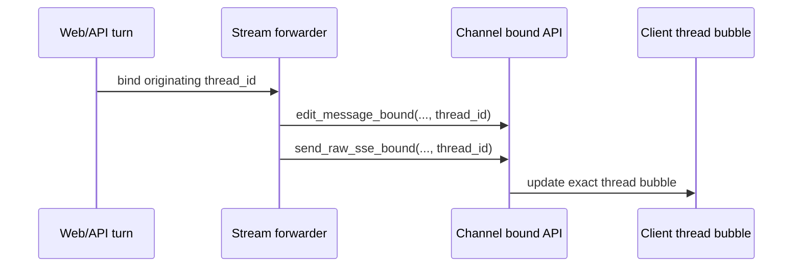
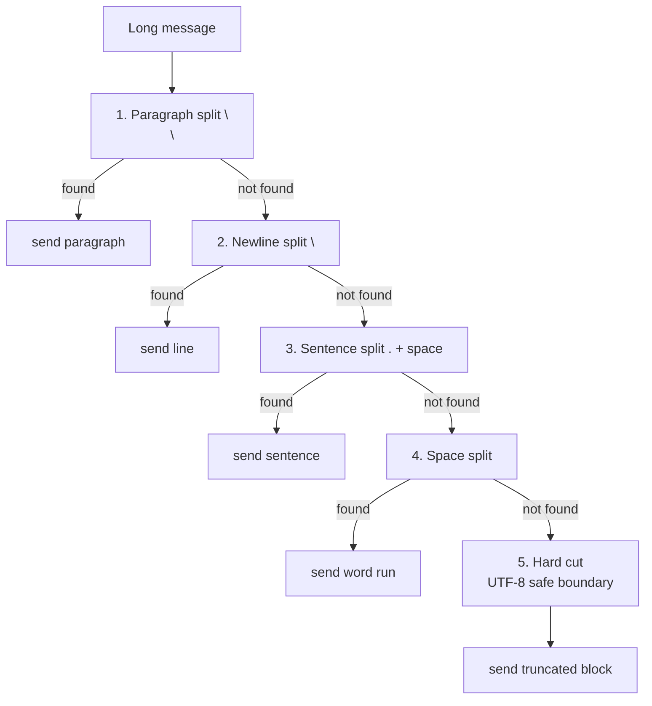
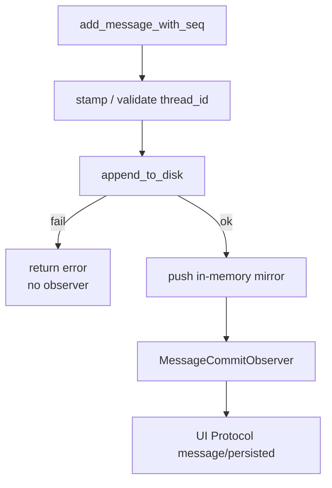

# Chapter 11: octos-bus: the Message Bus, the Channel Abstraction, and Session Persistence

> **Positioning**: This chapter goes into the octos-bus crate (currently `crates/octos-bus/`, roughly 40K lines of Rust source, 40,937 measured, of which 17 channel files total 18,207 lines): how one `Channel` trait abstracts very different messaging platforms, and how sessions, message splitting, thread-bound streaming, the durable commit observer, and the child-session contract are engineered. Prerequisite: Chapter 5. Who should read it: developers who want to understand the architecture of a multi-channel messaging platform (reader B), and contributors wiring in a new channel (reader D).

When an agent steps up from a single-user CLI to a multi-user platform, the messaging layer's complexity jumps. Telegram caps a message at 4,000 characters and Discord at 1,900; Slack formats with Block Kit and Feishu with Rich Text; email is asynchronous and WhatsApp wants template messages. octos-bus unifies all of it behind one `Channel` trait.

---

## 11.1 The Channel trait: one message interface

The Channel trait (`crates/octos-bus/src/channel.rs:17-265`) defines the interface every channel shares:

The current Channel trait has 26 methods, but only three of them lack a default implementation: `name()`, `start()`, and `send()`. Everything else hangs off the trait as a default, and a real channel overrides what it needs:

```rust
#[async_trait]
pub trait Channel: Send + Sync {
    fn name(&self) -> &str;
    async fn start(&self, inbound_tx: mpsc::Sender<InboundMessage>) -> Result<()>;
    async fn send(&self, msg: &OutboundMessage) -> Result<()>;
    fn max_message_length(&self) -> usize;  // default 4000, overridable
    fn is_allowed(&self, _sender_id: &str) -> bool { true }
    async fn send_typing(&self, _chat_id: &str) -> Result<()> { Ok(()) }
    fn supports_edit(&self) -> bool { false }
    async fn send_with_id(&self, msg: &OutboundMessage) -> Result<Option<String>> { ... }
    async fn edit_message(&self, ...) -> Result<()> { ... }
    async fn finish_stream(&self, ...) -> Result<()> { ... }
    async fn edit_message_bound(&self, ..., thread_id: Option<&str>) -> Result<()> { ... }
    async fn finish_stream_bound(&self, ..., thread_id: Option<&str>) -> Result<()> { ... }
    async fn send_raw_sse_bound(&self, ..., thread_id: Option<&str>) -> Result<()> { ... }
    async fn health_check(&self) -> Result<ChannelHealth> { ... }
    // + stop, send_typing_as, stop_typing, send_listening,
    //   delete_message, edit_message_with_metadata, reactions, embed, ...
}
```

This is a "wide trait, heavy defaults" design. A minimal channel works with the 3 base methods; a mature channel keeps overriding extension points such as `max_message_length()`, `supports_edit()`, `send_with_id()`, `edit_message()`, `format_outbound()`, and `health_check()`. The cost is a wide trait surface; the payoff is that every platform capability reaches the Gateway through a single abstraction.

The key methods: `start()` receives an `mpsc::Sender<InboundMessage>`, and the channel forwards incoming user messages through that sender to the agent processing layer; `send()` carries agent responses back out to the target channel; `max_message_length()` defaults to 4000, but the real implementations override it (Discord=1900, Slack=3900, Twilio=1600).

`send_with_id()` returns the platform message ID so the message can be edited later (for streaming, send a placeholder first and update it as tokens arrive). The default delegates to `send()` and returns `None`.

### 11.1.1 The three-step streaming edit

For channels that support message editing (`supports_edit()` returns `true`), octos streams output in three steps:

1. `send_with_id()`: send the initial message (possibly a few tokens) and capture the platform message ID
2. `edit_message()`: as the LLM streams, keep updating that same message (`crates/octos-bus/src/channel.rs:85-93`)
3. `finish_stream()`: when the stream ends, send the final version; the default still falls back to `edit_message()` (`crates/octos-bus/src/channel.rs:122-133`)

Users watch the reply form instead of waiting for one complete blob. Telegram and Discord both run this pattern; channels without editing (email) fall back to sending the whole response once at the end.

### 11.1.2 thread-bound streaming: binding each turn explicitly instead of trusting a sticky map

The Channel trait's streaming-edit surface is no longer a handful of edit conveniences. It now carries three bound variants:

- `edit_message_bound(chat_id, message_id, content, thread_id)`
- `finish_stream_bound(chat_id, message_id, content, thread_id)`
- `send_raw_sse_bound(chat_id, json, thread_id)`

The point is not one extra parameter. Under concurrent Web turns, these methods explicitly bind every streaming delta, the final message, and the raw SSE history to the originating `thread_id` (`crates/octos-bus/src/channel.rs:107-201`). The old path recovered the thread by decoding it from the message id or from a per-chat sticky map; when the same chat fires several turns in quick succession, the sticky map may already have rotated to the later turn, and the earlier turn's late delta lands in the later turn's bubble. The bound API's contract is that the caller already knows which turn this delta belongs to, so stop guessing from shared state.



The defaults still fall back to the old `edit_message()` / `send_raw_sse()`, so channels that don't care about threads, such as Telegram and Discord, stay compatible; the history API channel can override the bound methods and land events in the correct UI thread. One boundary to keep straight against Chapters 13 and 14: Serve/AppUI's public chat transport has already moved to `/api/ui-protocol/ws`; `send_raw_sse_bound()` is a compatibility and internal extension point kept in the bus trait, not a reason for new clients to use chat SSE. `health_check()` belongs to the same round of evolution: it lets the admin dashboard display channel health in one uniform way instead of scattering probes across each channel's own admin interface (`crates/octos-bus/src/channel.rs:245-251`; the `ChannelHealth` enum sits at 253-265 in the same file).

### 11.1.3 The AgentHandle symmetry

The bus uses `AgentHandle` / `BusPublisher` (`crates/octos-bus/src/bus.rs:8-77`) to connect channels to the agent processing layer:

```rust
// AgentHandle holds both directions
struct AgentHandle {
    in_rx: Receiver<InboundMessage>,      // the agent receives messages here
    out_tx: Sender<OutboundMessage>,      // the agent sends responses here
}

struct BusPublisher {
    in_tx: Sender<InboundMessage>,         // channels send messages to the agent here
    out_rx: Receiver<OutboundMessage>,     // channels receive agent responses here
}
```

The symmetry pays off at shutdown: when every Channel closes (all `inbound_tx` dropped), `inbound_rx.recv()` returns `None`, the agent processing layer learns there are no more messages, and it exits gracefully. No separate shutdown signal needed.

### 11.1.4 is_allowed: authenticating the sender

`is_allowed()` (`crates/octos-bus/src/channel.rs:27-30`) checks whether a sender may use the agent before a message is routed. The default returns `true` (everyone allowed); each channel can override it with custom logic, for example Telegram restricting access to specific `chat_id`s.

---

## 11.2 Message coalescing: the 5-level split strategy

When an agent reply exceeds a channel's character limit, it has to be split into shorter messages. The octos-bus coalescing algorithm (`crates/octos-bus/src/coalesce.rs:26-120`) tries five priority levels:



**Figure 10-1: the 5-level message split strategy.** Prefer semantic boundaries; the hard cut is the last resort.

MAX_CHUNKS = 50 keeps an extreme message from shattering into hundreds of tiny ones, which would be a DoS vector. When the cap is exceeded, the code does not append more text after the last chunk; it inserts a separate `"[message truncated - N chars omitted]"` truncation block (`crates/octos-bus/src/coalesce.rs:47`, with the `MAX_CHUNKS` constant at line 27 of the same file and a `warn!` log on truncation).

UTF-8 safety: the hard cut backs off with `is_char_boundary()` to a safe character boundary (the same strategy as octos-core's `truncate_utf8`; see Chapter 2).

Platform-specific limits (`crates/octos-bus/src/coalesce.rs:5-24`):

| Channel | Character limit | Config |
|------|---------|---------|
| Telegram | 4,000 | `ChunkConfig::telegram()` |
| Discord | 1,900 | `ChunkConfig::discord()` |
| Slack | 3,900 | `ChunkConfig::slack()` |
| Email | no limit | coalescing not invoked |
| Default | 4,000 | `ChunkConfig::default_limit()` |

### 11.2.1 find_break_point: the core split logic

`find_break_point()` (`crates/octos-bus/src/coalesce.rs:87-118`) is the heart of the split, but the actual cutting happens in two steps: first carve a UTF-8-safe search window within `max_chars`, then find the most natural break inside that window.

```rust
let mut limit = config.max_chars.min(remaining.len());
while limit > 0 && !remaining.is_char_boundary(limit) {
    limit -= 1;
}
let search = &remaining[..limit];
let break_at = find_break_point(search);

chunks.push(remaining[..break_at].trim_end().to_string());
remaining = remaining[break_at..].trim_start_matches('\n');
if remaining.starts_with(' ') && !remaining.starts_with("  ") {
    remaining = &remaining[1..];
}
```

Inside, `find_break_point(search)` runs `rfind()` (right to left) on `\n\n`, `\n`, `. `, then a space, and only hard-cuts when no natural boundary exists. Breaks land as close to the limit as possible while never splitting a multibyte character. The `trim_end()`, the `trim_start_matches('\n')`, and the "skip at most one leading space" handling keep the outgoing chunks clean instead of dragging raw separators into the head of the next message.

---

## 11.3 Session management

### 11.3.1 The Session struct

Session (`crates/octos-bus/src/session.rs:587-608`) is the persistence unit of a conversation:

```rust
pub struct Session {
    pub key: SessionKey,               // session identity (channel:chat_id)
    pub parent_key: Option<SessionKey>, // fork origin
    pub topic: Option<String>,          // multi-topic support
    pub title: Option<String>,          // sidebar title
    pub title_manual: bool,             // manual titles survive auto-overwrite
    pub child_contracts: Vec<ChildSessionContract>,
    pub messages: Vec<Message>,         // conversation history
    pub summary: Option<String>,        // session summary
    pub created_at: DateTime<Utc>,
    pub updated_at: DateTime<Utc>,
}
```

### 11.3.2 JSONL persistence and file naming

Session persistence in the current source is a bit more than "one JSONL file"; two facts anchor it.

First, the first line of a JSONL file is not a message. It is `SessionMeta` metadata, and only the lines after it are `Message`s (`crates/octos-bus/src/session.rs:560-584`, `crates/octos-bus/src/session.rs:1365-1381`, `crates/octos-bus/src/session.rs:2992-3060`). The format is a light log: one header line of schema/meta plus message lines, not a pure message stream. `SessionMeta` now carries `title`, `title_manual`, and `child_contracts`, so sidebar titles and background child-task state don't have to be smuggled through ordinary message text.

Second, the current code supports both the old and the new layout:

1. `SessionManager` still supports the legacy flat layout: `data/sessions/{encoded-key}[_{hash}]?.jsonl` (`crates/octos-bus/src/session.rs:1096-1146`)
2. The `SessionHandle` used by `SessionActor` prefers the per-user layout: `data/users/{encoded_base_key}/sessions/{topic_or_default}.jsonl`, migrating old files on open (`crates/octos-bus/src/session.rs:1611-1819`)

Only in the legacy flat layout is the file name built from these two parts:

1. The percent-encoded SessionKey (`crates/octos-bus/src/session.rs:129-140`): path-unsafe characters in the key (`/`, `:`, `#`) become `%2F`, `%3A`, `%23`
2. An FNV-1a 64-bit hash suffix (`crates/octos-bus/src/session.rs:116-127`, `crates/octos-bus/src/session.rs:1554-1610`): when the encoded name is long enough to need truncation, a stable hash is appended so truncated names with the same prefix don't collide

A long key in the old layout may land as `telegram%3A12345_0123ABCD....jsonl`; the new layout looks like `users/telegram%3A12345/sessions/default.jsonl`.

Schema version: `CURRENT_SESSION_SCHEMA = 1` (`crates/octos-bus/src/session.rs:15-16`), reserved for future format migration.

Writes also split into two classes:
- Routine message appends go through `append_to_disk()`: a new file writes metadata first, then appends message lines one by one (`crates/octos-bus/src/session.rs:1312-1388`, `crates/octos-bus/src/session.rs:2992-3060`)
- Whole-session rewrites go through `rewrite()`, using the write-then-rename atomic replacement pattern (`crates/octos-bus/src/session.rs:1914-1963`, `crates/octos-bus/src/session.rs:2862-2987`)

The rewrite temp file name got a concurrency fix: `rewrite_tmp_path()` builds `{target}.jsonl.{pid}-{seq}.tmp` from the process PID plus a monotonic counter, so multiple background child tasks rewriting the same parent session never share a single `.tmp` file (`crates/octos-bus/src/session.rs:90-117`). This is a correctness fix, not a performance one: a shared temp path lets two writers truncate each other, only one rename survives, and the other child task gets mislabeled as orphaned.

The 10MB file limit: a single session file is capped at 10MB, so runaway conversation history can't eat the disk (`crates/octos-bus/src/session.rs:792-793`, `crates/octos-bus/src/session.rs:1197-1208`, `crates/octos-bus/src/session.rs:1644-1649`).

### 11.3.3 The `/new` fork

When a user sends `/new` to start a fresh session, the underlying call is `fork(parent_key, new_chat_id, copy_messages)` (`crates/octos-bus/src/session.rs:1972-2010`). This is not "create a blank session":

1. Copy the most recent `copy_messages` messages from the parent session
2. Record `parent_key`
3. Rewrite a new session file under the new key

`/new` in the current implementation is thus closer to "a branch carrying recent context" than "inherit config only, no history".

### 11.3.4 SessionManager and the LRU cache

SessionManager (`crates/octos-bus/src/session.rs:903-905`) manages the session cache the admin and command side sees; on the live message path, `SessionActor` instead holds its own `SessionHandle`, so active sessions don't all share one big lock (`crates/octos-bus/src/session.rs:2426-2530`).

- LRU memory cache: active sessions stay in memory, cutting disk I/O
- Lazy loading: inactive sessions load from disk on demand
- Layout compatibility: scans both the legacy flat layout and the per-user layout
- User-list performance bound: `list_top_level_sessions*()` skips internal topics such as `child-*` and `*.tasks`, so a user directory full of background child sessions doesn't slow down `/api/sessions` (`crates/octos-bus/src/session.rs:965-1005`, `crates/octos-bus/src/session.rs:934-947`)
- Same-key write serialization: `persist_message_through_canonical_path()` serializes same-session writes from `SessionActor`, `ApiChannel`, and the `/chat` path through a per-key Tokio mutex, so independent `SessionHandle`s never read the same length and return duplicate sequence numbers (`crates/octos-bus/src/session.rs:2332-2420`)

### 11.3.5 thread_id persistence: new writes fail closed, old records get load-time synthesis

The AppUI chat surface no longer just appends messages into a session; it groups messages into threads. The current rules live in `derive_thread_id_for_new_write()` and `synthesize_thread_ids()` (`crates/octos-bus/src/session.rs:288` for `derive_thread_id_for_new_write`, and `crates/octos-bus/src/session.rs:328` for `synthesize_thread_ids`):

| Path | User | Assistant / Tool | System |
|------|------|------------------|--------|
| new write | `client_message_id`, or UUIDv7 if absent | caller must pre-stamp `thread_id`, otherwise the write is rejected | `None` |
| legacy load | backfilled from the old `client_message_id` or `synth_{seq}` | inherits the current thread, synthesizing a stable id if missing | `None` |

The split matters. The old implementation derived the thread for an Assistant/Tool write by "looking back at the most recent user"; under rapid-fire concurrent turns the in-memory history may already have been rewritten by another sibling user, and the assistant lands in the wrong bubble. The new write path therefore fails closed: an Assistant/Tool write without a pre-bound `thread_id` returns an error and bumps the `octos_session_persist_total{outcome="rejected_unbound_assistant"}` metric (`crates/octos-bus/src/session.rs:1676-1815`, `crates/octos-bus/src/session.rs:3061-3110`).

Legacy JSONL can't be held to this rule, because the historical files never had a `thread_id` field. At load time, `synthesize_thread_ids()` backfills old records in memory only, so old transcripts render by thread; the next new write then enters the fail-closed rule. In other words, octos-bus separates "compatibility with historical data" and "correctness of new writes" into two paths.

### 11.3.6 The durable commit observer: `message/persisted` fires only after a real commit

`MessageCommitObserver` is the Session layer's durable commit hook for the UI Protocol (`crates/octos-bus/src/session.rs:18-89`). The order inside `add_message_with_seq()`:

1. Derive `thread_id` for a User if needed, or require that Assistant/Tool is already pre-bound.
2. `append_to_disk()` first; on failure, return immediately.
3. Then update the in-memory `Session::messages`.
4. Finally fire the observer with the `SessionKey`, the `Message`, and the committed sequence.



An observer failure or panic does not roll the message back, because the durable commit already happened; it is best-effort fan-out (`crates/octos-bus/src/session.rs:71-89`). That boundary heads off a common misreading: `message/persisted` does not mean "about to be written"; it means "this line is now durably visible". The octos-cli UI Protocol tests pin this ordering and the dedup behavior (`crates/octos-cli/src/api/ui_protocol_ledger.rs` and the `ui_protocol_{transport,ledger,progress,task_output,reasoning_effort,alpha2_bridge,alpha9_bridge}.rs` split-file family; legacy `message/persisted` accounting sits at `crates/octos-cli/src/api/ui_protocol_ledger.rs:294-330`, the recovery-period skip at 1269-1423).

### 11.3.7 The child-session contract: background child tasks are not tracked by message text alone

Session metadata also persists `ChildSessionContract`, which writes the lifecycle of background spawns and subagents back into the parent session (`crates/octos-bus/src/session.rs:519-546`, `crates/octos-bus/src/session.rs:560-584`). It records:

- `task_id`, `task_label`
- `parent_session_key`, `child_session_key`
- `workflow_kind`, `current_phase`
- `terminal_state`: `Completed` / `RetryableFailure` / `TerminalFailure`
- `join_state`: `Joined` / `Orphaned`
- `failure_action`: `Retry` / `Escalate`
- `output_files`

A child session is not "a few ordinary messages plus a parent_key" and done. The parent needs a durable contract to decide whether a background task finished, whether it joined, and whether a failure should retry or escalate. The contract also explains why the rewrite temp path must be unique: several child tasks may write terminal outcomes into the same parent session metadata at the same time.

---

## 11.4 Coalescing source walkthrough

The full implementation of `split_message()` (`crates/octos-bus/src/coalesce.rs:34-82`) shows how it balances safety and readability:

```rust
pub fn split_message(text: &str, config: &ChunkConfig) -> Vec<String> {
    if text.len() <= config.max_chars {
        return if text.is_empty() { vec![] } else { vec![text.to_string()] };
    }

    let mut chunks = Vec::new();
    let mut remaining = text;

    while !remaining.is_empty() {
        if chunks.len() >= MAX_CHUNKS {
            chunks.push(format!(
                "[message truncated - {} chars omitted]",
                remaining.len()
            ));
            break;
        }

        if remaining.len() <= config.max_chars {
            chunks.push(remaining.to_string());
            break;
        }

        let mut limit = config.max_chars.min(remaining.len());
        while limit > 0 && !remaining.is_char_boundary(limit) {
            limit -= 1;
        }
        let search = &remaining[..limit];
        let break_at = find_break_point(search);

        chunks.push(remaining[..break_at].trim_end().to_string());
        remaining = remaining[break_at..].trim_start_matches('\n');
        if remaining.starts_with(' ') && !remaining.starts_with("  ") {
            remaining = &remaining[1..];
        }
    }

    chunks
}
```

Design points:

1. Early return: an empty string yields an empty `Vec`; a short message yields a single chunk
2. UTF-8-safe window first, semantic break second: `find_break_point()` never doubles as "logical break plus encoding boundary"
3. Boundary cleanup: `trim_end()`, leading-newline stripping, and at most one skipped space keep the visual seam between chunks natural

##### Window semantics: carve first, then find the point

The step most easily missed in the loop is the "window". `split_message()` does not search for a break across all remaining text; it first builds `search = &remaining[..limit]`, a search window of at most `max_chars`, and `find_break_point()` runs `rfind()` only inside it (`crates/octos-bus/src/coalesce.rs:72-73`). The two responsibilities separate: the window owns encoding safety (the `is_char_boundary()` fallback, `crates/octos-bus/src/coalesce.rs:68-71`), the break function owns semantic naturalness (`\n\n` → `\n` → `. ` → space → hard cut, `crates/octos-bus/src/coalesce.rs:87-118`). Fold them into one function and every candidate break re-checks the boundary, with an easy miss on the "exactly at the limit" path.

A second detail: `find_break_point()` rejects position 0. A break found by `rfind` at 0 is skipped and the next boundary level is tried (`crates/octos-bus/src/coalesce.rs:97-109`). That guarantees forward progress: if a paragraph boundary sits exactly at the start of the text, a cut there would emit an empty chunk and the loop would sit at the origin forever.

The cleanup after the cut deserves its own look: `trim_end()` only works the chunk tail, `trim_start_matches('\n')` eats the newlines accumulated at the seam, and then "at most one leading space is skipped, but two spaces stay" (`crates/octos-bus/src/coalesce.rs:76-78`). Two spaces mean a hard line break in Markdown; skipping one would change the rendering semantics. Skipping exactly one space is the compromise between "visually clean between blocks" and "don't break formatting".

##### Deduplication versus coalescing

Coalescing answers "one message too long"; deduplication answers "one message received twice". Webhook platforms (Feishu, Twilio, WeCom) can redeliver the same event on timeout retry, and `MessageDedup` records seen message IDs in an LRU cache of capacity 1,000 with a 60-second TTL (`crates/octos-bus/src/dedup.rs:12-25`; `is_duplicate` at lines 42-61). When the Discord gateway reconnects and replays events, the same `MessageDedup` instance also covers it at `crates/octos-bus/src/discord_channel.rs:32`. The two mechanisms are orthogonal: dedup at the inbound entrance, splitting at the outbound exit, each owning one end. Without entrance dedup, one duplicate message splits into twice the chunks; without exit splitting, any over-limit message is rejected outright by the platform API.

### 11.4.1 Unicode-safe boundary detection

The hard-cut branch (level 5) of `find_break_point()` uses the same character-boundary fallback as octos-core's `truncate_utf8`:

```rust
// hard cut: back off from max_len to a safe UTF-8 character boundary
let mut limit = max_len;
while limit > 0 && !text.is_char_boundary(limit) {
    limit -= 1;
}
limit
```

Split a message mixing Chinese and emoji on Telegram (4,000-character limit) and this guarantee holds: the cut never lands inside a 4-byte emoji and produces invalid UTF-8, so the follow-up API call never fails on encoding.

---

## 11.5 Channel implementations at a glance

octos-bus compiles each channel behind a feature flag. Each one implements the concrete methods of the `Channel` trait:

| Channel | Connection | Distinct capabilities |
|------|---------|---------|
| Telegram | Long polling (teloxide) | message editing, `AtomicBool` graceful shutdown |
| Discord | WebSocket gateway (serenity) | message deduplication (MessageDedup) |
| Slack | WebSocket (tokio-tungstenite) | Block Kit formatting |
| WhatsApp | Node.js bridge WebSocket | Baileys bridge, standalone bridge process |
| Email | IMAP/SMTP (async-imap + lettre) | async send/receive, attachments |
| Feishu / Lark | WebSocket / webhook + axum | encrypted-message verification, regional endpoints |
| Twilio | Webhook/API (axum) | SMS/MMS/RCS/WhatsApp Business |
| WeCom | HTTP webhook (axum) | encrypted messages |
| Matrix | HTTP API | AppService mode, multi-user bridging |
| WeCom Bot | WebSocket long connection | group-robot channel |
| QQ Bot | WebSocket gateway | Official QQ Bot API v2 |
| WeChat | WeChat bridge WebSocket | `wechat-bridge` subprocess integration |
| API | REST / UI Protocol WebSocket / legacy event hook (axum) | programmatic access and the AppUI control plane |
| DingTalk | custom-robot webhook sending + outgoing-robot webhook receiving (axum) | caches the session-level `sessionWebhook` for replies |
| LINE | webhook receiving + Messaging API sending (axum) | HMAC-SHA256 signature verification |
| Matrix User | Client-Server `/sync` long polling (reqwest) | user-account mode, no AppService registration; compiled under the `matrix` feature |
| CLI | stdin / stdout | local test channel; no separate feature, always compiled |

Four late additions each deserve a paragraph of positioning.

DingTalk (crates/octos-bus/src/dingtalk_channel.rs, 544 lines) runs a two-way pattern: send through a custom-robot webhook, receive through an outgoing-robot webhook. The crux is `sessionWebhook`: an outgoing event carries a short-lived session-level webhook URL, the channel caches it per session, and replies prefer that cached address over the globally configured webhook (crates/octos-bus/src/dingtalk_channel.rs:281, send-priority decision at 188-199; with no cache and no config, the error fires at line 196). The reason is DingTalk's outgoing model itself: a reply must go back to the exact robot conversation that initiated the exchange, which a global address cannot do, and the short-lived URL demands a fallback once the cache expires.

LINE (crates/octos-bus/src/line_channel.rs, 826 lines) is the standard webhook + Messaging API pair, and its security chain is signature verification: HMAC-SHA256 over the raw request body, Base64, then a constant-time comparison against the `X-Line-Signature` header (crates/octos-bus/src/line_channel.rs:87-95, with `ct_eq` from the subtle crate). Constant-time comparison rather than `==` blocks timing side channels from guessing the signature byte by byte; the raw body rather than a re-serialized string prevents JSON canonicalization differences from failing the check. Both choices are the standard answers platforms arrive at after repeated incidents.

Matrix User (crates/octos-bus/src/matrix_user_channel.rs, 1,525 lines) and the Matrix row in the section 11.5 table are two access modes for one platform. AppService mode requires registration on the homeserver side; user-account mode needs only an access token or password login, then long-polls the Client-Server `/sync` API with a 30-second timeout (`SYNC_TIMEOUT_MS` at crates/octos-bus/src/matrix_user_channel.rs:44). Long polling lets a self-hosted server without push permissions still receive messages near-real-time: the request hangs open, returns only when an event arrives, and the next one fires immediately. It has no separate Cargo feature and compiles under `matrix`, because the two share Markdown-to-HTML rendering and path-encoding infrastructure.

CLI (crates/octos-bus/src/cli_channel.rs, 137 lines) is the minimal reference implementation: line-based stdin reads and a stdout prompt (crates/octos-bus/src/cli_channel.rs:52-57), no network stack, no auth, no feature gate, always compiled. It exists to keep the `Channel` trait's minimal contract verifiable: a channel implementing only `name()`, `start()`, and `send()` runs the whole pipeline, and it is the cheapest template for new channel work.

Every channel implementation stands alone. A Telegram bug cannot touch Discord, because they are different code paths compiled behind different feature flags. One caveat: the CLI readline of `octos chat` is not among octos-bus's Cargo feature channels; the bus-side feature-gated channels currently number 15 (`api`, `telegram`, `discord`, `slack`, `whatsapp`, `email`, `feishu`, `dingtalk`, `line`, `twilio`, `wecom`, `matrix`, `wecom-bot`, `qq-bot`, `wechat`), with `crates/octos-bus/src/dingtalk_channel.rs` and `crates/octos-bus/src/line_channel.rs` the newer arrivals; `crates/octos-bus/src/matrix_user_channel.rs` has no separate feature and compiles under `matrix`; `crates/octos-bus/src/cli_channel.rs` is always compiled. Those three classes add up to 17 channel source files. This isolation is why most of octos-bus's roughly 40K lines of Rust source are independent per-channel implementations.

---

> ### Engineering decision: why JSONL instead of SQLite or one JSON file
>
> Option one: SQLite
>
> Pros: structured queries, indexes, transactions, easy cross-session analysis
> Cons: needs an explicit schema/migration layer; session files stop being inspectable with text tools; heavier abstraction than the current per-session, key-based access pattern
>
> Option two: one JSON file
>
> Pros: the most intuitive to implement, simple serialization/deserialization
> Cons: every write rewrites the whole file; the most fragile crash recovery; the likeliest hot lock under many sessions
>
> Option three: JSONL (octos's choice)
>
> Pros:
> - one metadata first line plus per-line messages supports both append and whole-session rewrite
> - easy to keep both paths, legacy flat layout and per-user layout
> - one file per session matches the "read/write by session key" access pattern
> - backup, migration, and debugging all work directly at the filesystem level
>
> Cons:
> - no index; cross-session queries scan every file
> - no database-grade transactions; weak at complex queries
>
> Why this option: reading the current source, octos's session access pattern is almost always "read one session by key, append new messages, rewrite the whole session when necessary, migrate layout on demand". JSONL covers exactly those paths and fits SessionActor's per-session file ownership naturally.

---

## 11.6 Persistence engineering details

### 11.6.1 FNV-1a hashing

In the legacy flat layout, when an encoded SessionKey must be truncated, the file name gets an FNV-1a 64-bit hash suffix (`crates/octos-bus/src/session.rs:116-127`, `crates/octos-bus/src/session.rs:1554-1610`). FNV-1a is not cryptographic; its virtues are a tiny implementation and stability across Rust versions. It serves no security purpose (no collision-attack resistance), only "truncated file names stay distinguishable".

```rust
fn fnv1a_64(data: &[u8]) -> u64 {
    let mut hash: u64 = 0xcbf29ce484222325;  // FNV offset basis
    for &byte in data {
        hash ^= byte as u64;
        hash = hash.wrapping_mul(0x100000001b3);  // FNV prime
    }
    hash
}
```

### 11.6.2 Percent-encoding

`encode_path_component()` (`crates/octos-bus/src/session.rs:129-140`) encodes the special characters of a SessionKey into URL-safe form. This stops a key like `telegram:12345` from being read as a directory path by the filesystem (`:` is special on some of them).

### 11.6.3 write-then-rename atomicity

The whole-session `rewrite()` path gets atomicity from two steps:

1. Write a unique temp file `{session_file}.{pid}-{seq}.tmp`
2. `rename()` the temp file onto the real one

On Unix/Linux, `rename()` is atomic: either it fully succeeds (the new file replaces the old one) or it fully fails (the old file stays untouched). A crash before `rename()` leaves only an orphaned `.tmp` file; the real session file is unaffected.

---

## 11.7 Chapter recap

1. **The Channel trait**: 26 methods today, but only `name()`, `start()`, and `send()` lack defaults; streaming edits, typing, embeds, and health checks are an override-as-needed extension layer.
2. **Coalescing**: 5-level semantic splitting (paragraph → newline → sentence → space → hard cut), MAX_CHUNKS=50 against DoS, UTF-8 safe, with a separate truncation chunk appended past the cap.
3. **Session**: the first line of a JSONL file is metadata, not a message; both the legacy flat layout and the per-user layout are supported, and `/new`/fork copies the most recent N messages and records `parent_key`.
4. Thread binding: the new write path requires Assistant/Tool to pre-bind `thread_id`, while legacy loads only backfill in memory; the bound channel API keeps concurrent-turn streaming deltas out of the wrong bubble.
5. **The durable observer and the child contract**: `message/persisted` fires after the disk write and the in-memory mirror update; background child tasks persist terminal/join/failure state through `ChildSessionContract`, not ordinary message text.

---

## Further reading

- Server-Sent Events: MDN "Using server-sent events": the streaming push pattern
- Telegram Bot API: https://core.telegram.org/bots/api: API details of the Telegram channel
- JSONL format: https://jsonlines.org/: the line-delimited JSON specification

## Exercises

1. The edge of the channel abstraction: some channels support rich text (Slack Block Kit, Feishu Rich Text), but `Channel::send()` accepts plain text only. How would you extend the trait to support rich text while staying backward compatible?
2. Session recovery: if the octos process crashes, the last line of a JSONL file may be incomplete. How would you implement crash recovery?

---

> **Version note**: This chapter is based on the current main branch of `../octos`. The octos-bus crate lives at `crates/octos-bus/src/`; compared with earlier versions, this chapter has been updated for thread-bound streaming, the per-user session layout, the durable commit observer, the child-session contract, the per-key persist lock, and the unique rewrite temp path of main.

---

> ### Version note
>
> This chapter's baseline is octos main @ `9c157101` (verified 2026-09-03). Against the older draft's "about 30K lines, 14 channels": the crate now stands at roughly 40K lines (40,937 lines, 18,207 of them in channel files, 17 in total), adding the DingTalk and LINE channels and the Matrix User account mode; `crates/octos-bus/src/session.rs` has grown to 3,417 lines, with the `SessionHandle` family concentrated around lines 2400-3100; on the octos-cli side, the former `crates/octos-cli/src/api/ui_protocol.rs` has been split into transport, ledger, and other files, 8 in total (7 implementation files plus 1 test file `crates/octos-cli/src/api/ui_protocol_tests.rs`). Line references in this chapter follow that baseline.

The line drift in crates/octos-bus/src/session.rs is not simple growth; it is an ownership-model refactor. In the old draft, reads and writes converged on the `SessionManager` big lock; today's code hands the online path to `SessionHandle` (crates/octos-bus/src/session.rs:2329 onward, concentrated around lines 2400-3100), with `SessionActor` holding an independent handle per session and zero lock contention across sessions (the doc comment above `struct SessionHandle` states this motivation). The former manager retreats to two duties: admin-side list queries, and cross-path write entry points like `persist_message_through_canonical_path()` (line 2388) that need per-key Tokio mutex serialization (the lock table at line 2360). The file grew mainly from the migration state machine (lines 2441-2460, three real cases) and the persistence branches the child-session contract brought in, not from unstructured accretion.
