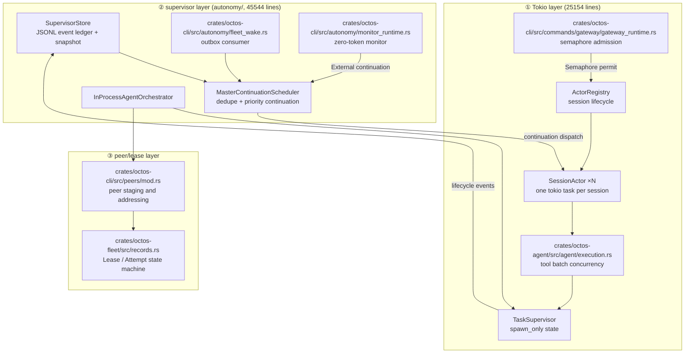
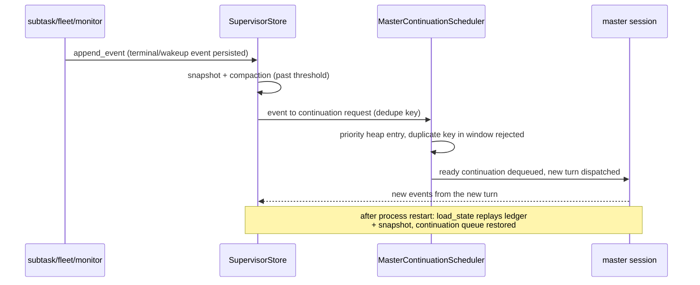
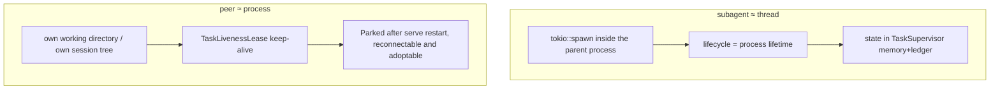

# Chapter 12: The Concurrency Model: A Production Three-Layer Scheduler

> **Positioning**: This chapter explains how octos's concurrency model works in three cooperating layers: the Tokio layer's session actors, semaphore admission, and tool-batch concurrency; the supervisor layer, which turns long-horizon orchestration into a restart-surviving event ledger plus continuation scheduling; and the peer/lease layer, which manages multiple agents through the process metaphor and leases. Prerequisites: Chapter 5 (Agent Loop), Chapter 10 (Harness and the event ABI). Who should read it: developers who want to see how Rust async concurrency lands in a production system, and operators who need to tune gateway concurrency parameters. The fleet state machine details are in Chapter 16; goal/peer orchestration semantics are in Chapter 18.

## 12.1 Start from a Set of Numbers

Split the concurrency-related source by responsibility and count it: 17 files, 74692 lines, 722 public symbols, in three layers.

| Layer | Files | Lines | Key symbols | Representative files |
|---|---|---|---|---|
| ① Tokio layer (session actor / semaphore / tool concurrency / shutdown) | 5 | 25154 | 170 | `crates/octos-cli/src/session_actor.rs` 10094 lines, `crates/octos-agent/src/agent/execution.rs` 4730 lines |
| ② supervisor layer (the ten files of `autonomy/`) | 10 | 45544 | 454 | `crates/octos-cli/src/autonomy/agent_orchestrator.rs` 33639 lines, `crates/octos-cli/src/autonomy/supervisor_store.rs` 3277 lines |
| ③ peer/lease layer | 2 | 3994 | 98 | `crates/octos-cli/src/peers/mod.rs` 3186 lines, `crates/octos-fleet/src/records.rs` 808 lines |

The three numbers tell one story: concurrency in octos moved past the "how to use Tokio" stage long ago. The Tokio layer holds one third of the lines; the bulk is the supervisor layer. 45,000 lines of code answer a question Tokio itself does not touch: after the process restarts, what happens to orchestration state?



The chapter follows the layering: the Tokio layer's session state ownership and concurrency boundaries first (12.2-12.5), then why the supervisor layer exists and how it is built (12.6), then the peer/lease layer's role as concurrency primitives (12.7), closing with graceful shutdown (12.8).

## 12.2 The Tokio Layer: Session Actors and Layered spawn

In single-user CLI mode the Agent executes sequentially; there is no concurrency problem. In Gateway or Serve mode, multiple users send messages at once, and each session interleaves cancellations, background subtask results, and status delivery. octos's answer is not to put a lock on shared state but to introduce the session actor. Each session is owned exclusively by one long-lived tokio task, and the core state has exactly one owner.

The entry point is `ActorRegistry` (`crates/octos-cli/src/session_actor.rs:2524`). It holds the actor table, a factory, and one semaphore; when a new session arrives it creates an actor and calls `tokio::spawn(actor.run())` (`crates/octos-cli/src/session_actor.rs:4122`). The actor itself, `struct SessionActor` at `crates/octos-cli/src/session_actor.rs:4455`, holds the session key, the tool registry, the working directory, and two shutdown flags (covered in 12.8). The outside world reaches the actor's mailbox through `ActorHandle` (`crates/octos-cli/src/session_actor.rs:2502`); mailbox messages are the `ActorMessage` enum (`crates/octos-cli/src/session_actor.rs:2443`):

```rust
pub enum ActorMessage {
    /// A user message to process.
    Inbound { message: InboundMessage, /* … */ },
    BackgroundResult { /* … */ },
    TaskStatusChanged { /* … */ },
    ApprovalExpired { request_id: String },
    Cancel,
}
```

Five messages cover every event class an actor must respond to: new input, background subtask results, task state changes, approval expiry, cancellation. Two messages for the same session can never modify history concurrently, because both queue in the same actor's mailbox and the actor processes them one at a time.

Layered spawn is this layer's backbone. `tokio::spawn()` appears at four levels in the source:

1. Session level: `ActorRegistry` starts an actor per new session, long-lived (`crates/octos-cli/src/session_actor.rs:4122`).
2. Message level: the actor spawns the current message's main Agent call as a separate task and keeps polling the mailbox, ready to receive `Cancel` and background results at any time.
3. Tool level: when one turn carries multiple tool calls, each tool gets its own task (`crates/octos-agent/src/agent/execution.rs:701`), aggregated by the batch policy (12.4).
4. Background level: the `spawn` tool's background mode starts a long-lived subagent whose visible state goes to `TaskSupervisor` (12.5).

The gateway side adds two auxiliary spawns: Ctrl+C signal handling (`crates/octos-cli/src/commands/gateway/gateway_runtime.rs:1653`) and async refresh of the system prompt (`crates/octos-cli/src/commands/gateway/gateway_runtime.rs:1713`). Dispatch parameters flow from gateway to actor through `DispatchParams` (`crates/octos-cli/src/session_actor.rs:86`).

The concurrency/serialization boundary is therefore sharp: fully concurrent across sessions (one task per actor); serialized within a session (mailbox queueing); parallel or serial per tool batch depending on the admission policy; background tasks leave the main conversation flow and rejoin through status reports.

> **Engineering decision**: shared Mutex vs spawn-per-message vs Session Actor
>
> The trade-off among three options:
>
> - Shared `Mutex<SessionState>`: fastest to implement, but lock granularity grows with the state; one message holding the lock across an await blocks other sessions' messages too, and cancel signals get harder to prioritize. The v1 draft described this layer as "per-session Mutex serialization"; the current source is no longer that model.
> - spawn-per-message (one stateless task per message): maximum concurrency, but session history, the tool registry, and the workspace must move to external shared storage, and state consistency becomes a locking problem again.
> - Session Actor: state ownership is unique, messages queue naturally, and a cancellation is just one `Cancel` in the mailbox. The cost is that the actor must manage its own lifecycle (idle recycling, preserving profile overrides across death-and-rebirth, see the `ActorHandle` field comments).
>
> octos picks the third; the cost is concentrated in `ActorRegistry`, and business code only ever faces `ActorMessage`.

## 12.3 Semaphore Admission: max_concurrent_sessions

The number of sessions needs an upper bound. The gateway creates a semaphore at startup with capacity taken straight from configuration:

```rust
// Semaphore to bound concurrent session processing
let concurrency_semaphore = Arc::new(Semaphore::new(gw_config.max_concurrent_sessions));
```

The location is `crates/octos-cli/src/commands/gateway/gateway_runtime.rs:1731-1732`, and the semaphore is handed to `ActorRegistry::new` immediately after. The limit comes from the `max_concurrent_sessions` config key, declared at `crates/octos-cli/src/config.rs:1548-1549`; the default function `default_max_concurrent_sessions()` is at `crates/octos-cli/src/config.rs:1633` and its body returns the literal `10` (verified in this session). Startup logs print the value (`crates/octos-cli/src/commands/gateway/gateway_runtime.rs:1666`).

The permit is consumed not in the gateway but at the actor's message-processing entry: two `self.semaphore.acquire().await` sites at `crates/octos-cli/src/session_actor.rs:7485` and `crates/octos-cli/src/session_actor.rs:9293`. That placement decides the queueing behavior: when more than 10 sessions are processing messages simultaneously, the 11th session's message task suspends on `acquire()` instead of being rejected; the actor stays alive and keeps receiving messages, only new message processing is held back by the semaphore. When one active session finishes processing and releases its permit, the next queued one gets it automatically.

Putting admission at the message-processing layer rather than session creation is deliberate: idle sessions consume no concurrency budget, and all 10 slots go to sessions actually running LLM calls.

## 12.4 Tool Concurrency: Three Batch Admission Policies

When a single LLM response carries multiple tool calls, `execute_tools` (`crates/octos-agent/src/agent/execution.rs:2483`, visibility `pub(super)`, a module-internal API) does not parallelize blindly. Each tool reports itself as `Safe` (read-only, no side effects) or `Exclusive` (writes) via `concurrency_class`, and the executor picks one of three policies based on the whole batch's composition (module docs `crates/octos-agent/src/agent/execution.rs:7-26`):

- All-Safe batch: every call is `tokio::spawn`ed as an independent task (`crates/octos-agent/src/agent/execution.rs:701`), and `futures::future::join_all` aggregates while preserving call order (`crates/octos-agent/src/agent/execution.rs:2992`).
- All-Exclusive batch: executed serially in the LLM's call order; after the first error (including hook rejections and panics) the remaining calls are skipped, each receiving a synthesized "cancelled because a sibling failed" result, so every `tool_call_id` gets an answer.
- Mixed batch (#1766): phase one runs all Safe calls in parallel, phase two runs the Exclusive calls serially in original order, and results are reassembled in the original call order.

The parallel path also carries a uniform timeout: `join_parallel_handles` (unrelated to `crates/octos-cli`; it starts at `crates/octos-agent/src/agent/execution.rs:2959`) applies the same deadline to every handle; on timeout it calls `abort()` first, waits a bounded grace period for cleanup, then returns a synthesized timeout result. The LLM always sees a one-to-one list of tool results; parallelism details never leak.

The two gates (semaphore and batch admission) address overload at different granularities, with different criteria. The semaphore gate's criterion is resources: LLM calls are expensive and slow, 10 concurrent sessions roughly matches the safe watermark of upstream quota and memory, past that you queue, and queueing is harmless. Batch admission's criterion is semantics: parallelism itself has no cost problem; the problem is order dependencies among Exclusive tools (write-then-write, write-then-read on the same file), where out-of-order execution is not slow but wrong. The semaphore therefore handles excess with waiting, and batch admission handles conflict by degrading to serial: one is backpressure, the other a correctness defense. Mixing the two produces a classic misreading: someone sees tools executing serially and concludes concurrency is insufficient, when in fact an Exclusive member is protecting semantics. The discriminator is the batch's composition: an all-Safe batch always runs in parallel; if anything runs serially, an Exclusive is involved (before #1766 mixed batches were wholly serial; after, only the necessary part is serial, which is the entire content of that optimization).

A subagent's concurrency shape is decided by the `spawn` tool's `mode` parameter: `"background"` (the default, `default_mode()` at `crates/octos-agent/src/tools/spawn.rs:1929`) or `"sync"` (field definition at `crates/octos-agent/src/tools/spawn.rs:1855`, JSON schema at `:3004`). Sync mode blocks the current turn until the subagent finishes, and its result enters this turn's context directly; background mode detaches the subagent from the main conversation flow, and its completion returns to the actor mailbox as a `BackgroundResult` message. The former fits "the next step depends on the subtask's output"; the latter fits "fire and collect later."

## 12.5 The spawn_only Lifecycle: TaskSupervisor

Background tasks are not fire-and-forget. `TaskSupervisor` (first-line doc "Background task lifecycle management for spawn_only tools.", `crates/octos-agent/src/task_supervisor.rs:1`) is a state library: it tracks spawn_only tasks from spawn to terminal state and explicitly declares that it does not run the workspace contract; contract validation happens first, and only after it passes does the supervisor state update (first six lines of the module docs). Runtime state is `TaskStatus` (`crates/octos-agent/src/task_supervisor.rs:140`):

```rust
pub enum TaskStatus {
    Spawned, Running, Completed, Failed,
    Cancelled,   // user cancel, terminal (:173 is_terminal)
    Parked,      // #27c: orphaned task after serve restart, awaiting client reconnection and adoption
}
```

Of the six states `Parked` is special: it is neither active (`is_active` covers only Spawned/Running, `crates/octos-agent/src/task_supervisor.rs:164`) nor terminal (`crates/octos-cli` is not involved; `is_terminal` is at `crates/octos-agent/src/task_supervisor.rs:173`), because the task's work products (the staged peer's brief and worktree) are still on disk, and after the client reconnects, `mark_running` can revive it. This is the most direct example of "whether state is persisted" shaping concurrency semantics.

Runaway growth has a hard cap: at most 200 registered child tasks per parent session (`MAX_CHILDREN_PER_PARENT`, `crates/octos-agent/src/task_supervisor.rs:43`), overridable at process start via the environment variable `OCTOS_MAX_CHILDREN_PER_PARENT` (docs at `:41`, the read at `:77`). Registration past the cap returns `RegisterTaskError` (`crates/octos-agent/src/task_supervisor.rs:90`).

The externally visible lifecycle projection is another enum, `TaskLifecycleState` (`crates/octos-agent/src/task_supervisor.rs:243`): Queued, Running, Verifying, Ready, Failed, Cancelled. `BackgroundTask::lifecycle_state()` (`crates/octos-agent/src/task_supervisor.rs:363`) translates the internal `TaskStatus` into this caller-facing set. The internal state machine asks "is the worker still there"; the projection asks "is the output trustworthy," and Verifying is the slot reserved for workspace contract validation. The mapping:

| Internal `TaskStatus` | Projected `TaskLifecycleState` | Semantic boundary |
|---|---|---|
| Spawned | Queued | registered, worker not started |
| Running | Running | worker executing |
| Completed | Ready (via Verifying) | validation passed, output trusted |
| Failed | Failed | execution failed |
| Cancelled | Cancelled | user-initiated cancel |
| Parked | Cancelled (#27c reuses the free projection slot, crates/octos-agent/src/task_supervisor.rs:373) | awaiting reconnect and adoption, neither terminal nor active |

This projection has two consumers. On the MCP side: `octos mcp-serve` exposes a single tool, `run_octos_session` (`crates/octos-agent/src/mcp_server.rs:66`); session dispatch reports Queued → Running → Verifying → Ready/Failed transitions through `SessionLifecycleObserver::mark_state` (`crates/octos-agent/src/mcp_server.rs:145`; trait docs at `:142-144`), and the outer MCP caller ultimately receives a session-level aggregate result (`final_state: TaskLifecycleState`, `:108`), not the internal tool event stream. On the harness side: the `McpServerCall` event carries an `outcome` field with values ready/failed/queued/running/verifying, one-to-one with `TaskLifecycleState` (`crates/octos-agent/src/harness_events.rs:651-652`, event variant definition near `:397`), so background task lifecycles enter harness events and metrics and become part of the operator's observable surface.

## 12.6 The Supervisor Layer: Long-Horizon Orchestration That Survives Restarts

A tokio task lives inside the process; when the process dies, everything evaporates. For "a tool call that runs ten minutes" that is fine; for a goal like "finish the twenty-one chapters of this book today" that spans hours and days, orchestration state must outlive the process. The supervisor layer's 45544 lines all answer this one question.

> **Engineering decision**: why long-horizon orchestration was promoted from Tokio task to persistent supervisor
>
> A long-horizon goal (say, dispatching 5 peers to write one chapter each) is inherently a stack of multiple process lifetimes: the master restarts, peers run long, results arrive late. If orchestration state lives only in an in-memory task tree, a restart wipes the memory and the only recovery is a human reissuing instructions.
>
> After the promotion, three things changed: state persists as an event ledger and recovers by replay after restart; "who should be woken to continue" moves from implicit task dependencies to an explicit continuation queue; and finishing a long task no longer requires any process to stay alive. The cost is that every state transition must be written as an event and must handle replay idempotency, which is why `crates/octos-cli/src/autonomy/supervisor_store.rs` and `crates/octos-cli/src/autonomy/master_continuation_scheduler.rs` together run to nearly five thousand lines.

### The Event Ledger: SupervisorStore

`SupervisorStore` (`crates/octos-cli/src/autonomy/supervisor_store.rs:697`) manages four paths: the event file, the rotated event file, the snapshot, and the lock. The event file name is fixed as `supervisor-events.jsonl` (constant at `:25`); compaction keeps a single `.old` generation (`:33`), and `.old` is for forensics only, never replayed; a downgrade to an older binary that does not understand snapshots sees a truncated view, and the comments state this compatibility cost bluntly.

The heart of crash recovery is `load_state` (`crates/octos-cli/src/autonomy/supervisor_store.rs:780`), barely a dozen lines: read the snapshot (if any) and take its `last_sequence` as the watermark; then read ledger rows and replay only the tail rows where `row.sequence > snapshot_last_sequence` (`:780-793`). Replay goes through `apply_ledger_row` (`:381`), which applies each row's event to the state machine; events are self-describing via serde's `type/payload` tags (the comment at `:300-304` explains why variants carry the full record by value: replay needs no boxing optimization on the hot path). Three design decisions underpin this replay.

First, snapshot cadence is row-count-triggered, not time-triggered. `SNAPSHOT_EVERY_APPENDS = 512` (`crates/octos-cli/src/autonomy/supervisor_store.rs:49`); the constant's comment gives the rationale: 512 rows keep the startup replay tail within a few hundred KB, parsed in milliseconds, while amortizing the full-serialization-plus-fsync cost over hundreds of appends; the counter counts ledger rows, not one process's appends, so with multiple writers sharing one ledger, compaction still fires whenever the tail crosses the line.

Second, `last_sequence` is a monotonic watermark, not a counter. `apply_ledger_row` takes the `max` per row applied (`:381-382`), and `load_state` also takes the `max` of the watermark from the snapshot and from state (`:784`). Rows arriving out of order or interleaved by multiple writers therefore never push the watermark backward; a snapshot only needs to declare "up to which sequence" to truncate replay safely.

Third, the single `.old` generation rotation is a forensics compromise, not a recovery path. After compaction moves applied rows into `.old`, an older binary (a pre-#1974 build that does not understand snapshots) replaying the live tail gets a truncated view; better that the downgraded reader sees less than that any version misreads, because builds that do understand snapshots refuse a snapshot with a newer `schema_version` (`load_snapshot`, `:876`) instead of guessing at the parse.

The four write-side methods close the loop on this read semantics: `write_snapshot` (`:905`), `snapshot_now` (`:920`, the locked forced-compaction entry), `append_event` (`:935`, which writes and checks the watermark to decide whether to trigger compaction). The ledger is thus a structure that appends fast and recovers in bounded time: in normal operation each event is one append write, and after a crash the recovery cost is pinned to an upper bound by the 512-row tail.

### Continuation Scheduling: MasterContinuationScheduler

The ledger records "what happened"; the scheduler decides "who runs next." `MasterContinuationScheduler` (`crates/octos-cli/src/autonomy/master_continuation_scheduler.rs:477`) holds a `BinaryHeap` plus a `pending_by_key` table indexed by dedupe key (impl from `:506`). Every continuation request carries identity and a dedupe key: `MasterContinuationId` (`:99`), `MasterContinuationDedupeKey` (`:112`), `MasterContinuationRequest` (`:221`).

Continuation reasons are prioritized: `MasterContinuationReason` (`:137`) enumerates ChildCompleted, ScatterJoinComplete, LoopFire, GoalContinue, GoalWrapUp, and External(String), mapped to `MasterContinuationPriority` (`:186`): LoopFire highest, the generic External wake lowest, and the comment says outright this is deliberate suppression "unless future wiring maps it to a typed reason." The struct also carries a TOCTOU guard field, `recently_claimed_external`: External continuations with the same key re-enqueued inside the window are rejected, preventing one terminal-state transition from being delivered twice by two paths (struct field docs at `:477`). Dedupe key plus priority heap is the concurrency skeleton of "creating a new turn after a turn ends"; Chapter 5 examined its consumer side from the loop's perspective, and the full semantics belong to Chapter 18.

### Outbox Wakes and the Zero-Token Monitor

Wakeups arrive via two external paths. In `crates/octos-cli/src/autonomy/fleet_wake.rs`, the background consumer `spawn_fleet_outbox_consumer` (`crates/octos-cli/src/autonomy/fleet_wake.rs:343`) uses `tokio::spawn` to run a 3-second interval loop (the constant `FLEET_WAKE_INTERVAL_SECS`, `:59`), repeatedly calling `drain_fleet_outbox_once` (`:235`) to convert wakeups from the fleet kernel's outbox into keeper continuation requests. Polling rather than pushing means that if the consumer crashes, the next tick recovers automatically and no wakeup is lost.

`crates/octos-cli/src/autonomy/monitor_runtime.rs` (introduced in commit `c4f03647`, #1977/#1988, 2026-08-12) provides the zero-token event monitor: `MonitorMode` (`crates/octos-cli/src/autonomy/monitor_runtime.rs:72`) has exactly two states; Poll mode runs a probe command every `interval_secs` and treats filtered stdout changes as events, while Stream mode follows the process's stdout line by line. The monitor spends no model tokens; only an observed change wakes the master through an External continuation, which pulls "waiting on an external condition" out of the conversation loop.

### AgentOrchestrator: The Orchestrator's RPC Surface

Multi-agent operations are unified in the `AgentOrchestrator` trait (`crates/octos-cli/src/autonomy/agent_orchestrator.rs:606`): `list_agents`, `read_agent_status`, `read_agent_output`, `list_agent_artifacts` are required methods, while `spawn_agent` (`:662`), `send_input` (`:675`), `wait_agent` (`:688`), `resume_agent` (`:699`) carry default implementations that all return `method_not_supported_error`. The trait defines a complete RPC surface, but not every implementation wires up every operation; reading the code, do not assume the four lifecycle methods are available everywhere.

The production implementation is `InProcessAgentOrchestrator` (`:746`, inner impl block from `:1451`, trait impl block at `:9462`). It mirrors `TaskSupervisor` background tasks as agent state; the core path `run_native_specialist` (`crates/octos-cli/src/autonomy/agent_orchestrator.rs:2471`) strings together one complete supervised specialist execution: register the native agent, run the subagent, push output and artifacts, then write back to the supervisor. `crates/octos-cli/src/autonomy/goal_loop_runtime.rs` (1562 lines) supplies the scheduling-policy primitives for goal and loop: `GoalId` (`crates/octos-cli/src/autonomy/goal_loop_runtime.rs:10`), `GoalRuntimePolicy` (`:239`, carrying cadence and max_continuations), `GoalRuntimeState` (`:265`, Active/Paused/Completed/Failed).

An honest boundary is that the current implementation is an orchestrator of "one master supervising a set of managed subagents, continuing on events," not an arbitrary-interconnect, real-time-conversing multi-agent society. The RPC surface invites overestimation; the four methods that default to errors are the reminder.



## 12.7 The Peer/Lease Layer: The Process Metaphor and Leases

The third layer solves isolation and recovery for "multiple quasi-agents coexisting." The first-line doc of `crates/octos-cli/src/peers/mod.rs` is "Peer-agent staging, addressing, and parked-prompt plumbing." (`crates/octos-cli/src/peers/mod.rs:1`); its second paragraph notes it was lifted verbatim from the api-gated `ui_protocol` tree (the Phase 3 peer-goal extraction changed only module location and visibility, not logic). The layer's concurrency-primitive role shows in `PeerTaskBinding` (`:166`): it binds a peer to a `TaskLivenessLease`, binding and retirement go through `bind_peer_supervised_task` (`:241`) and friends, so peer liveness is tied to the supervisor's lease.

The fleet side's concurrency primitives are two small structs. `Lease` (`crates/octos-fleet/src/records.rs:250`) has only `owner_epoch` and `expires_at_ms`: each daemon start gets a new epoch, and a foreign epoch or an expired lease is reclaimed by recovery reconciliation. In one sentence: after a restart, the old owner loses authority automatically. `Attempt` (`:256`) files one execution attempt, with the fleet id stored redundantly so `(child_id, attempt_id)` alone locates the child row.

One comparison diagram settles the peer-versus-subagent difference:



A subagent is like a thread: it shares the process's fate, is lightweight, and evaporates with the parent. A peer is like a process: it has its own address (slug), its own working directory, declares liveness through a lease, and after a process restart its work products wait on disk for adoption.

The fleet lease semantics deserve space in this chapter, because they are the smallest complete specimen of "how concurrent ownership crosses processes." The `Lease` struct has only two fields (`crates/octos-fleet/src/records.rs:250`): `owner_epoch` is this daemon start's identity, `expires_at_ms` the absolute expiry moment. Acquisition happens at dispatch: `crates/octos-fleet/src/store.rs`, constructing the `Attempt`, sets `status` to `Leased` and writes `lease { owner_epoch, expires_at_ms: now_ms + lease_ttl_ms }` (`crates/octos-fleet/src/store.rs:990-1001`; the TTL addition uses `checked_add` against overflow). Renewal is not an explicit API: when a worker enters execution via `mark_running` (`crates/octos-fleet/src/store.rs:1053`), the lease field persists with the attempt row, and what actually checks it are the predicates on every write path.

Surrender and reclamation rely on the same four-part predicate. `complete_child` (`crates/octos-fleet/src/store.rs:1158`) requires four conditions to hold simultaneously before committing a result: the child's `current_attempt_id` points at this attempt (the attempt-id fence, blocking same-generation retries), the attempt status is `Running`, `generation` equals the fleet's current generation (the generation fence, blocking stale attempts after replanning), and `lease.owner_epoch` equals the caller's epoch (the lease fence, blocking the old owner after a restart); the predicate body is at `:1230-1237`. If any fails, it returns `Superseded`, the result is dropped whole, and the books do not move. Reclamation happens at boot reconciliation: a non-terminal attempt whose lease carries a foreign, mismatched epoch or whose `expires_at_ms` has passed (the stale test at `crates/octos-fleet/src/store.rs:2276-2277`) is unconditionally set to `Interrupted` and its budget reservation released; the comments record the #1973 fix: before it, fleets in `Cancelled` state were skipped wholesale, pinning attempts and reservations forever.

The concurrency consequence of this design is that after the old process crashes, the new process negotiates with no one. A different epoch automatically loses authority; expiry automatically reclaims; correctness never depends on the crashed party's cooperation. The lease and the supervisor layer's event ledger are two answers to the same question: the ledger recovers "where the orchestration got to" by replay; the lease deposes "those who should no longer act" with fences. The full Lease/Attempt state machine is in Chapter 16; goal/peer orchestration semantics are in Chapter 18.

## 12.8 Graceful Shutdown: Two AtomicBools

Shutdown is layered with two atomic bools. `global_shutdown` and `cancelled` are fields of `SessionActor` (`crates/octos-cli/src/session_actor.rs:4500-4503`): the former is the process-level signal (Ctrl+C), the latter affects only the current session. The actor-facing `ActorHandle.shutdown` (`crates/octos-cli/src/session_actor.rs:2872`) likewise exposes an `Arc<AtomicBool>`.

The write side lives in the gateway's Ctrl+C handling task (`crates/octos-cli/src/commands/gateway/gateway_runtime.rs:1653`): after `ctrl_c().await` returns, `shutdown.store(true, Ordering::Release)`. The Release ordering guarantees that all prior writes are visible to whoever acquires; the read side loads with `Ordering::Acquire`, so when an actor sees the shutdown flag it also sees every state change made before the flag. One Release/Acquire pair is this control signal's entire memory-ordering contract; there are no locks.

Broadcast-style reclamation takes a different road: `ActorRegistry::shutdown_all` (`crates/octos-cli/src/session_actor.rs:2795`) drops all senders directly, and each actor exits naturally once its `recv()` returns `None` — the mailbox draining is the shutdown, no actor needs to poll a flag. The two paths complement each other: the AtomicBool gives running tasks a cooperative checkpoint; dropping senders gives waiting actors a deterministic end.

## 12.9 Summary

| Layer | Concurrency problem solved | Key mechanisms | Cost |
|---|---|---|---|
| Tokio layer | multi-session parallelism, within-session consistency | session actor exclusive state, semaphore admission, batch admission | actor lifecycle management |
| supervisor layer | long-horizon orchestration across restarts | event ledger + snapshot, dedupe priority continuation, outbox polling | nearly five thousand lines of persistence and replay code |
| peer/lease layer | multi-agent isolation and recovery | process metaphor, epoch lease, Parked adoption | state-machine complexity (see Chapter 16) |

The three layers stack rather than replace one another: a supervisor continuation still ends up dispatched back to some session actor to execute; peer liveness judgment reuses TaskSupervisor's state machine. Layering concurrency primitives is, in essence, paying separately for three orthogonal needs: "fast" (in-memory, microsecond scale), "durable" (on disk, across restarts), and "isolated" (process boundaries).

## Further reading

- Chapter 5: the Agent Loop's six-stage lifecycle and budget gates; the consumer-side view of the continuation queue.
- Chapter 10: the complete event ABI of harness events; this chapter's `McpServerCall` is one of its event families.
- Chapter 16: the full Lease/Attempt/Recovery state machine of the fleet.
- Chapter 18: the orchestration semantics of goal and peer, and `MasterContinuationScheduler`'s complete consumption chain.
- The Graceful Shutdown chapter of the official Tokio documentation: task cancellation and waiting semantics for runtime-level graceful shutdown.

## Exercises

1. If `max_concurrent_sessions` went from 10 to 100, what behavior would the permit consumption point in 12.3 (the message-processing layer) produce? What if the permit were acquired at session creation instead?
2. `TaskStatus::Parked` belongs to neither `is_active` nor `is_terminal`. Design a concurrency scenario showing what breaks if Parked were misclassified as terminal.
3. The mixed-batch policy (#1766) runs Safe calls in parallel first, then Exclusive calls serially. Why can't it be reversed? What do consumers rely on in the constraint that results are "reassembled in original LLM call order"?
4. `MasterContinuationScheduler`'s TOCTOU guard records only External keys. If a new internal producer also re-enqueued the same key within the window, what would happen? What does the comment's INVARIANT require of the new producer?
5. `shutdown_all` makes actors exit by dropping senders. If an actor is in the middle of a 30-minute tool call, how does this path behave differently from the `global_shutdown` flag path?

## Version note

> **Version note**: This chapter's analysis baseline is octos main @ `9c157101` (checked out 2026-09-02); all line numbers and figures were measured at that commit; the facts table is `assets/ch12-facts.md` (2026-09-03). Changes relative to the v1 draft (originally Chapter 11): the narrative was corrected from "per-session Mutex serialization" to the session actor state-ownership model; the supervisor layer (the ten files of `autonomy/`) and the peer/lease layer are new; `crates/octos-cli/src/autonomy/monitor_runtime.rs` was introduced in `c4f03647` (2026-08-12), and the current line numbers include offsets from the later commits `e2f999a0` (clippy formatting) and `0c44b26f` (OLP control channel). Four "to be verified by the writer" items in the facts table were verified in this session: `default_max_concurrent_sessions()` returns the literal `10`; both `crates/octos-agent/src/task_supervisor.rs` and `crates/octos-cli/src/config.rs` have `//!` docs on their first lines (the facts table's "none / not collected" was wrong); the skeleton line numbers 606/746/1451/2471/9462 of `crates/octos-cli/src/autonomy/agent_orchestrator.rs` all confirmed; and the outward entry of `crates/octos-agent/src/agent/execution.rs` is `pub(super) fn execute_tools` (`:2483`), which this chapter cites accordingly.
