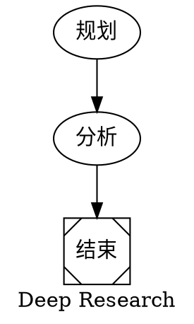
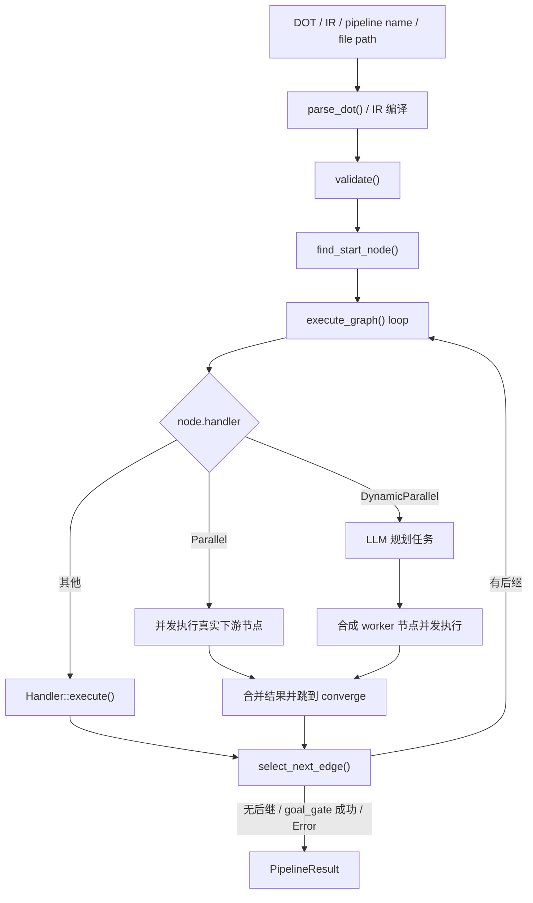

# Chapter 13: octos-pipeline: A DOT-Graph-Driven Workflow Engine

> **Positioning**: This chapter reads against `crates/octos-pipeline/src/` and explains how octos parses Graphviz DOT into the typed `PipelineGraph`, how the executor lands nine HandlerKinds, twelve IR node kinds, static parallelism, dynamic parallelism, checkpoint recovery, deadline guardrails, and parent-session resource inheritance, and how the `run_pipeline` tool exposes pipelines to the Agent. Prerequisites: Chapter 5, Chapter 8, Chapter 10, Chapter 11. Who should read it: developers who need to understand the mechanics of multi-step Agent orchestration.

Once a task outgrows "one Agent loop plus a few tool calls," it needs explicit workflow orchestration. The archetypal case: plan the research angles, fan out retrieval in parallel, converge on the analysis, then write the report. `octos-pipeline` exists for exactly this class of problem, but its current implementation does not match the intuitions of a "traditional DAG scheduler": it combines graph structure with runtime branch selection, concurrent convergence, model routing, and tool-policy inheritance. Through `PipelineHostContext` it also inherits the parent session's file cache, sub-agent output routing, task supervisor, and cost ledger, so pipeline nodes no longer run in the isolation that marked the early implementation.

---

## 13.1 How a DOT Graph Enters the Runtime

### 13.1.1 Why DOT

octos defines workflows in Graphviz DOT, not YAML/JSON. The reason is not fashion: DOT makes nodes and edges first-class semantics, so the same file can be parsed by the executor and rendered directly into a picture by Graphviz.



This example already shows the key capabilities the current parser supports:

- graph-level attributes: `graph [label=..., default_model=...]`
- node attributes: `handler`, `model`, `tools`, `converge`, `planner_model`, and friends
- edges: `A -> B`
- an implicit shape-to-Handler mapping, for example `Msquare` maps to `Noop`

### 13.1.2 A hand-written parser, not a third-party DOT library

The entry point is `parse_dot()` at `crates/octos-pipeline/src/parser.rs:21-23`; the real work happens in `DotParser::parse()` (struct defined at `crates/octos-pipeline/src/parser.rs:45`, impl at `:50`). This is a hand-written parser with no external DOT parsing dependency. The file has grown to 1,445 lines.

The current implementation is richer than the simplified story of "a small syntax subset":

- the `digraph` name is optional; if the model emits `digraph { ... }`, the parser sets the graph id to `"pipeline"` (`crates/octos-pipeline/src/parser.rs:63-65`)
- graph-level attributes `graph [key=value]` are supported. Beyond `label` and `default_model`, the parser now also accepts `max_total_tokens` (a run-level token budget), `default_timeout_secs` (the default wall-clock timeout per pipeline), and `result_fidelity` (a result-size downgrade annotation); all land in `apply_graph_attrs()` (`crates/octos-pipeline/src/parser.rs:520-537`)
- `subgraph name { ... }` is supported, and nodes inside a subgraph are archived into `PipelineGraph.subgraphs` (`crates/octos-pipeline/src/parser.rs:148-150`, `crates/octos-pipeline/src/graph.rs:48`)
- chained edges `a -> b -> c` are supported, and attributes apply to every edge in the chain (`crates/octos-pipeline/src/parser.rs:163`)
- comments: `//`, `/* */`, plus an extra `#` line-comment form; the last is clearly tolerance for LLM-generated DOT (`crates/octos-pipeline/src/parser.rs:479-502`)
- if an edge references a node that was never declared, the parser synthesizes a default node definition for it (`crates/octos-pipeline/src/parser.rs:110-127`)

The result of this layer is not a loose JSON tree but the semantic `PipelineGraph`. Its core structures live in `crates/octos-pipeline/src/graph.rs:10-54` (graph) and `:118-184` (node):

- `PipelineGraph` carries `id`, `label`, `default_model`, `max_total_tokens`, `default_timeout_secs`, `result_fidelity`, `nodes`, `edges`, `subgraphs`. The last three graph-level fields did not exist in the old draft
- `PipelineNode`, beyond `prompt` and `handler`, includes `model`, `context_window`, `max_output_tokens`, `max_iterations`, `tools`, `goal_gate`, `max_retries`, `timeout_secs`, `suggested_next`, `converge`, `worker_prompt`, `planner_model`, `max_tasks`, `deadline_secs`, `deadline_action`, `checkpoints`, plus `human_gate` (`:163`), `resolver` (`:166`), `artifact_refs` (`:169`), `checkpoint_refs` (`:172`), `continue_on_error` (`:184`)

### 13.1.3 Mapping attributes to node semantics

Node construction happens in `build_node()` (`crates/octos-pipeline/src/parser.rs:579-691`). Several implementation details shape the authoring experience of DOT:

- Handler resolution order: an explicit `handler=` wins first, then the `shape=`-to-Handler mapping (`crates/octos-pipeline/src/graph.rs:282-297`, string form `from_str` at `:270-279`), and finally the default `Codergen` (`crates/octos-pipeline/src/parser.rs:581-586`)
- `tools="a,b,c"` splits into a string list; if the user writes `tools=""`, the parse result is a deny-all marker consisting of one empty string, which the executor treats as "explicitly disable all tools" (`crates/octos-pipeline/src/parser.rs:588-602`)
- `timeout_secs` accepts plain integer seconds and suffixed forms like `900s`, `15m`, `2h` (`crates/octos-pipeline/src/parser.rs:551-570`)
- `goal_gate` accepts `true/false/yes/no/1/0` (`crates/octos-pipeline/src/parser.rs:619-623`)
- `deadline_secs` supports `ms/s/m/h` and fractional seconds (`crates/octos-pipeline/src/parser.rs:601-603`, the underlying `parse_duration_secs_f64` at `:665-689`); `deadline_action` accepts `abort`, `skip`, `escalate`, and `retry:N` or `retry(N)` (`crates/octos-pipeline/src/parser.rs:693-720`)
- `checkpoint="true"` or `checkpoint="name1,name2"` parses into `MissionCheckpoint` declarations (`crates/octos-pipeline/src/parser.rs:721-751`)
- `max_iterations` is now a writable node attribute (`crates/octos-pipeline/src/parser.rs:620`, field at `crates/octos-pipeline/src/graph.rs:140`); see 13.2.1

This makes DOT, inside octos, not a pure topology description but a lightweight workflow DSL.

---

## 13.2 Nine HandlerKinds and Twelve IR Node Kinds

The real `HandlerKind` enum lives at `crates/octos-pipeline/src/graph.rs:241-266`. The current source has 9 kinds; the old draft's 6 is stale:

| Kind | Runtime landing point | Key attributes | Role |
|------|-----------|---------|------|
| `Codergen` | `crates/octos-pipeline/src/handler.rs:641` (impl start) | `prompt` `model` `tools` `context_window` `max_output_tokens` | Spawns a full sub-agent |
| `Shell` | `crates/octos-pipeline/src/handler.rs:1054` | `prompt` `timeout_secs` | Runs shell commands, but is banned by a validation rule (see 13.2.2) |
| `Gate` | `crates/octos-pipeline/src/handler.rs:1190` | `prompt` | Evaluates a condition; no human wait |
| `Noop` | `crates/octos-pipeline/src/handler.rs:1226` | none | Passes input through |
| `Parallel` | `crates/octos-pipeline/src/executor.rs:2749` | `converge` | Static fan-out over existing downstream nodes |
| `DynamicParallel` | `crates/octos-pipeline/src/executor.rs:3122` | `prompt` `worker_prompt` `planner_model` `max_tasks` `converge` | Plans tasks first, then dynamic fan-out |
| `ShellCheck` | `crates/octos-pipeline/src/handler.rs:1247` | `command` `timeout_secs` | Runs a fixed command string, locked at compile time |
| `Notify` | `crates/octos-pipeline/src/handler.rs:1326` | `message` `channel` | Sends the user a notification |
| `Wait` | `crates/octos-pipeline/src/handler.rs:1365` | `seconds` `until_condition` | Waits a fixed number of seconds or polls a condition |

One easily missed but important fact: the `Handler` trait (`crates/octos-pipeline/src/handler.rs:257`) now has 7 implementations: `CodergenHandler` (`:641`), `ShellHandler` (`:1054`), `GateHandler` (`:1190`), `NoopHandler` (`:1226`), `ShellCheckHandler` (`:1247`), `NotifyHandler` (`:1326`), `WaitHandler` (`:1365`). `Parallel` and `DynamicParallel` are not standalone handler types; they are dedicated branches inside `PipelineExecutor::execute_graph()` (`crates/octos-pipeline/src/executor.rs:2749` / `:3122`).

The handler-name-to-string mapping grew to 9 entries in step with them, including `shell_check`, `notify`, `wait` (`crates/octos-pipeline/src/executor.rs:251-259`).

### 13.2.1 Codergen: a node is a sub-agent

`CodergenHandler` (struct at `crates/octos-pipeline/src/handler.rs:293`, impl `:641-1041`) creates a full `octos_agent::Agent` for the node rather than making one simplified LLM call. The node therefore inherits most of the main Agent's capabilities: tool calls, loop-style execution, token accounting, file-change reporting, progress events.

Its key behavior has several layers:

1. **Provider resolution.** If the node declares `model` and the executor is configured with a `ProviderRouter`, the handler goes through `router.resolve()`, then wraps the result with a capability-compatible fallback provider. This is not a plain "model name -> provider" mapping; it is resolution with a fallback chain.
2. **Context window override.** `context_window` is wrapped into a `ContextWindowOverride`.
3. **Tool registration.** The node's initial tool set comes from `ToolRegistry::with_builtins()`, then a once-cached plugin registration is applied, so each node does not repeat plugin SHA verification and executable reads (`crates/octos-pipeline/src/handler.rs:23-56`).
4. **Tool policy.** The node's own `tools=` decides the allowlist; the handler additionally denies `spawn`, `run_pipeline`, `send_file`, `message` so sub-nodes cannot recurse without bound; it then also clears spawn_only flags so plugin tools that were spawn_only execute synchronously inside the pipeline worker (`crates/octos-pipeline/src/handler.rs:125-130`).
5. **Parent-session resource inheritance.** When `run_pipeline` is triggered from inside a session actor, the node worker inherits the parent session's `FileStateCache`, `SubAgentOutputRouter`, `AgentSummaryGenerator`, `CostAccountant`, and the parent session key (`crates/octos-pipeline/src/host_context.rs:34-60`, `from_tool_context` at `:78`).
6. **Separation of system prompt and task input.** The executor first removes `{input}` from `prompt`, keeping only role/constraint text; the actual predecessor output reaches the sub-agent through `TaskKind::Code.instruction`.

One large divergence from the old draft is the iteration budget: early versions hardcoded `AgentConfig.max_iterations` to 30, leaving nodes no say. Now `PipelineNode.max_iterations` (`crates/octos-pipeline/src/graph.rs:140`) is a writable DOT attribute parsed directly by `build_node()` (`crates/octos-pipeline/src/parser.rs:620`). The field comment spells out the motive: the pipeline default of 30 iterations is too low for a synthesize node that reads findings files one by one and then writes the synthesis; the budget runs out navigating files, the result never ships, and the whole pipeline dies. `None` keeps the default.

Also, the default behavior of `max_output_tokens` is not "a global 4096." If the node omits the attribute, the handler falls back to the provider's own maximum output capability. That matters for long-report generation.

### 13.2.2 Shell: implemented, but banned by a validation rule

`ShellHandler` itself remains fully implemented (struct at `crates/octos-pipeline/src/handler.rs:1043`, impl `:1054-1135`): the command comes from `node.prompt`, runs under `sh -c` on non-Windows and `cmd /C` on Windows, with a default timeout of 300 seconds; a non-zero exit maps to `OutcomeStatus::Fail`, and a process-start failure or timeout maps to `OutcomeStatus::Error`.

But the current version has a ban chain the old draft never wrote: validation rule `rule_23_no_shell` (`crates/octos-pipeline/src/validate.rs:242`) rejects any graph with `handler="shell"` outright, on the grounds that shell is arbitrary code execution; meanwhile `build_handlers()` simply does not register the Shell handler (`crates/octos-pipeline/src/executor.rs:2409-2438`) as defense in depth: even if some graph slips past validation, there is no handler to dispatch. The command-execution entry that pipelines actually use is `ShellCheck` (13.2.7).

The split between "the test ran and failed" and "the command never started" still matters, because the executor retries only on `Error`:

- "the test ran and failed" is a business failure; no retry
- "the command never started" or "timed out" is a system error; retryable

### 13.2.3 Gate: a condition node, not a human-approval node

This is the easiest part of the chapter to get wrong.

What the executor registers is `GateHandler` (struct at `crates/octos-pipeline/src/handler.rs:1136`, `synthesize_predecessor_outcome` at `:1138`, impl `:1190-1222`), and its real semantics are:

- treat `node.prompt` as a conditional expression (when empty, `unwrap_or("true")` turns it into a pass-through gate, `crates/octos-pipeline/src/handler.rs:1192`)
- evaluate against the direct predecessors' `NodeOutcome`; a single predecessor keeps its original status, multiple predecessors aggregate as `Error > Fail > Skipped > Pass`
- return `Pass` or `Fail`, pass `content` through untouched, and initiate no human interaction

`crates/octos-pipeline/src/human_gate.rs` does exist, providing abstractions such as `HumanInputProvider` and `ChannelInputProvider`, with a default timeout of 5 minutes (`DEFAULT_INPUT_TIMEOUT`, `crates/octos-pipeline/src/human_gate.rs:14-15`). But the current source is unambiguous on this point: those abstractions are not wired into the `build_handlers()` or `execute_graph()` main path. So "Gate = human-approval node" is not an accurate description of the current implementation.

The accurate statement is:

- `GateHandler` is the wired-up condition node
- `crates/octos-pipeline/src/human_gate.rs` is a human-input abstraction the crate provides but that the default executor has not wired in

### 13.2.4 Parallel: static fan-out over real downstream nodes

`Parallel` does not dynamically spawn workers; it runs the graph's already-existing downstream nodes concurrently. The dedicated branch starts at `crates/octos-pipeline/src/executor.rs:2749`:

1. collect the targets of all outgoing edges of the current node as the concurrency set (`:2756-2763`)
2. require the current node to declare `converge`, otherwise error with "parallel node missing converge" (`:2751-2754`)
3. before dispatch, check the pipeline-lifecycle-wide fan-out total cap, default `MAX_PIPELINE_FANOUT_TOTAL = 500` (constant at `crates/octos-pipeline/src/executor.rs:102`, gate at `:2804`); exceeding the cap rejects the whole batch rather than starting half the workers
4. clone the `PipelineNode` for each target, perform variable substitution, and fill in `graph.default_model` when no model was declared
5. reserve cost budget for each LLM-call branch, then look up its own handler and execute concurrently (concurrency bounded by `ExecutorConfig.max_parallel_workers`, field `:405`, use site `:2849`; the `run_pipeline` tool defaults to 8)
6. merge content, tokens, summaries, and node outcomes
7. write the merged text back into the "current parallel node"'s `completed` result, then jump to the `converge` node (jump logic `:3108-3121`)

Two implementation details are worth remembering:

- worker timeouts are capped at `MAX_FANOUT_WORKER_SECS = 3600` seconds (`crates/octos-pipeline/src/executor.rs:121`)
- the executor uses `parallel_executed` to remember the real graph nodes that already ran during the fan-out phase; when sequential traversal later reaches them, it only picks an edge and does not re-execute

Result merging is more than string concatenation, too. After merging, the executor scans worker outputs for mentioned research directories and inlines the contents of `_search_results.md` into the merged result. The current implementation is clearly tuned for the "research fan-out -> synthesis converge" shape.

### 13.2.5 DynamicParallel: plan first, then synthesize worker nodes

The fundamental difference from `Parallel`: DynamicParallel does not run ready-made graph nodes. It first has an LLM plan a task list, then synthesizes a temporary `Codergen` node per task. The dedicated branch starts at `crates/octos-pipeline/src/executor.rs:3122`:

1. resolve the planner provider selection chain `planner_model -> node.model -> graph.default_model`
2. use `node.prompt` as the planning prompt; if empty, fall back to the built-in planner prompt
3. `plan_dynamic_tasks()` (`crates/octos-pipeline/src/executor.rs:1158-1272`) expects the model to return a plain JSON array; on parse failure or too few tasks it falls back to `fallback_tasks()` (`:1274-1300`)
4. substitute `{task}` in `worker_prompt` with the concrete task description, producing a batch of synthetic `Codergen` nodes
5. before dispatch, likewise check the fan-out total cap and reserve cost budget for each synthetic worker
6. execute these synthetic nodes concurrently, merge the results, and jump to `converge`

It also has a behavior the old draft got wrong: the old draft said DynamicParallel "does not wrap another semaphore the way Parallel does." Today every run entry (`run()`, `run_graph()`, `run_graph_with_handlers_throttled()`) first constructs a pipeline-level LLM semaphore (`pipeline_llm_semaphore()`, `crates/octos-pipeline/src/executor.rs:1640`), and DynamicParallel's workers pass through that gate as well. A single fan-out is still bounded mainly by `max_tasks` (default 8; field comments at `crates/octos-pipeline/src/graph.rs:118-184`), and the whole pipeline run is protected by `MAX_PIPELINE_FANOUT_TOTAL = 500`.

`node.model` can still be a comma-separated model pool (for example `"cheap,strong,cheap"`); the executor round-robins workers onto different models. That assignment now lives in `crates/octos-pipeline/src/model_assignment.rs` (see 13.3.5).

### 13.2.6 Noop: a placeholder that earns its keep

`NoopHandler` (struct at `crates/octos-pipeline/src/handler.rs:1223`, impl `:1226-1243`) returns `ctx.input` unchanged. Two common uses:

- structural nodes such as start / finish
- a convergence or pass-through point for certain conditional branches

Incidentally, in `build_handlers()` the registry entry for `DynamicParallel` is also a NoopHandler placeholder (`crates/octos-pipeline/src/executor.rs:2409-2438`); real execution goes through the executor branch, and the registration exists only so the registry lookup does not come up empty.

### 13.2.7 Three new handlers: ShellCheck, Notify, Wait

These three variants are real handlers added when the IR palette landed. One line each:

- `ShellCheckHandler` (`crates/octos-pipeline/src/handler.rs:1247`): executes one fixed command string, locked at compile time, with no LLM tool surface. In contrast to the banned `Shell` (arbitrary code execution), it serves read-only command cases such as "run the tests, check the build, count lines"; the command runs in the session workspace and the output becomes the node result
- `NotifyHandler` (`crates/octos-pipeline/src/handler.rs:1326`): sends the user a notification, `message` plus optional `channel` (e.g. telegram, slack), with essentially no LLM involvement
- `WaitHandler` (`crates/octos-pipeline/src/handler.rs:1365`): waits a fixed number of seconds, or polls an `until_condition` until true or timeout (default 300 seconds), with no LLM call

### 13.2.8 The IR palette: twelve IrNodeKinds

Exposing 9 HandlerKinds directly to the LLM has a problem: the variants mix execution mechanics (Parallel is an executor branch) with a security-sensitive surface (Shell is banned). After 6b0de6ca, `octos-pipeline` introduced a typed IR layer: `IrNodeKind` (`crates/octos-pipeline/src/ir.rs:57`, 673-line file) currently measures 12 variants:

```console
$ sed -n '/pub enum IrNodeKind/,/^}/p' crates/octos-pipeline/src/ir.rs | grep -cE '^\s{4}[A-Z]'
12
```

| # | IrNodeKind | Landing point | Semantics (source comment) |
|---|---|---|---|
| 1 | `Research` | Codergen class | Read-only research (web + file reads), cheap model; carries `max_iterations` (`:64`) |
| 2 | `Transform` | Codergen class | Pure transformation of predecessor output, cheap model |
| 3 | `Synthesize` | Codergen class | Final synthesis (read-only), strong model; carries `max_iterations` (`:75`) |
| 4 | `Report` | Codergen class | Synthesizes and persists via `write_file`, terminal step; carries `max_iterations` (`:84`) |
| 5 | `Gate` | Gate | Pure routing gate, no LLM; outgoing edge conditions decide the branch |
| 6 | `Fanout` | DynamicParallel | Plans N workers to run in parallel, then converge (`plan_prompt` / `worker_prompt` / `converge` / `max_tasks`) |
| 7 | `CodeReview` | Codergen class | Read-only code analysis (read/grep/glob), may carry `scope` |
| 8 | `CodeEdit` | Codergen class | Edits code, may carry expected `files` |
| 9 | `ShellCheck` | ShellCheck handler | Fixed command string, locked at compile time |
| 10 | `SubAgent` | spawn sub-agent | Sub-agent node with an independent LLM session (`task` / `tools` / `model`, model defaults to strong) |
| 11 | `Notify` | Notify handler | Sends a notification, `message` + optional `channel` |
| 12 | `Wait` | Wait handler | Waits a fixed number of seconds or polls `until_condition` |

Every IR node kind has a capability contract owned by code in `PaletteContract` (`crates/octos-pipeline/src/ir.rs:195`, lookup function `contract_for` at `:204`): which `HandlerKind` it lands on, an explicitly non-empty tool allowlist (an empty list would mean all built-in tools, so the contract forbids empty), and the default model. The comment is blunt: these fields are invisible to and unmodifiable by the LLM, looked up per kind at compile time.

One sentence in the IR enum's trailing note deserves quoting whole (`crates/octos-pipeline/src/ir.rs`, end of the `IrNodeKind` definition): **`human_gate` is deliberately absent.** The pipeline executor does not route human-input gates to a real approval handler (a bare Gate node's condition defaults to `true` and passes automatically); advertising a human_gate in the palette would offer a silent approval bypass. The note is explicit: it can come back only once a HumanInputProvider-backed handler is actually wired in.

The tool layer also exposes the IR to the LLM, not bare handlers: `run_pipeline`'s `input_schema()` has an `ir` parameter (a typed-IR workflow program, JSON), but it appears in the schema only when enabled; the test `input_schema_exposes_ir_only_when_enabled` (`crates/octos-pipeline/src/tool.rs:2917`) pins this behavior.

---

## 13.3 The execution engine is a graph traverser with routing, not a "topological sorter"



**Figure 13-1: the real main path of the current `PipelineExecutor`.** It does not first run a whole-graph topological sort and then mechanically execute every node; it starts from the start node, branches by node kind inside a loop, and re-decides the next edge at every step.

### 13.3.1 The actual phases of `run()`

The execution entry is now a family: `PipelineExecutor::run()` (`crates/octos-pipeline/src/executor.rs:1650-1672`) and `run_graph()` (`:1673`) both converge on `run_graph_with_handlers_throttled()` (`:1772`), which adds two things: constructing the pipeline-level LLM semaphore (`:1640`) and the in-process model assignment at the top (see 13.3.5). The overall flow still compresses into seven steps:

1. `parse_dot()` parses the DOT (or compiles the typed IR into a graph)
2. `validate()` runs the lint rules
3. `build_handlers()` builds the handler registry (`crates/octos-pipeline/src/executor.rs:2409-2438`)
4. `find_start_node()` decides the entry node
5. if a `CostAccountant` exists, open the pipeline-level budget reservation first
6. `execute_graph()` enters the main loop (from `:2520`)
7. if the pipeline succeeds, run terminal validators; only final success commits the pipeline-level cost attribution, otherwise the reservation is refunded automatically

The most important correction here: after step four there is no "topological traversal of the whole DAG," but an incremental traversal driven by `current_node_id`. That is why runtime routing strategies such as `suggested_next`, conditional edges, and label matching can work at all.

### 13.3.2 Validation rules: 23 of them, including the Shell ban

The validator lives in `crates/octos-pipeline/src/validate.rs` (entry `validate()` at `:181`, `validate_with_context()` at `:186`, `find_start_node()` at `:394`). The rule list has grown to 23 (`:210-232`); the more important ones:

- Rule 1: a start node must be findable (the `start` node, or the unique node with no incoming edges)
- Rule 2: unreachable nodes are a warning, not an error
- Rule 6: edge conditions must parse with the condition parser
- Rule 13 / 14: `parallel` and `dynamic_parallel` must both declare a valid `converge`
- Rule 18: model names must be known keys (`validate_model_name`, `crates/octos-pipeline/src/validate.rs:1046`; the old draft omitted this)
- Rule 23: `handler="shell"` is a direct Error (`:242`)
- the graph must be acyclic; cycle detection happens at validate time, not at execution time (`detect_cycles`, `crates/octos-pipeline/src/graph.rs:54`)

So octos-pipeline still requires a DAG, but its execution model is not a static DAG scheduler; it is a dynamic graph traverser constrained by a DAG.

### 13.3.3 The condition language and edge-selection order

The grammar of conditional expressions lives in `crates/octos-pipeline/src/condition.rs`. The core forms the runtime actually supports:

- `outcome.status == "pass"`
- `outcome.status != "fail"`
- `outcome.contains("keyword")`
- `!expr`, `expr && expr`, `expr || expr`

For example:

```dot
test -> deploy   [condition="outcome.status == \"pass\""]
test -> rollback [condition="outcome.status == \"fail\""]
report -> refine [condition="outcome.contains(\"missing data\")"]
```

The `success` / `failure` shorthand of the old draft no longer matches the current parser.

Edge selection is not "first match wins"; it is a 5-step algorithm (`select_next_edge()`, defined at `crates/octos-pipeline/src/executor.rs:4882`):

1. evaluate all conditional edges first
2. if multiple conditions hit, pick the highest `weight`
3. if no condition hits, check the node's `suggested_next`
4. next, check whether an edge label appears in the outcome content
5. last, pick by weight among unconditional edges; if still nothing, fall back to the edge with the smallest target name

One subtle implementation fact: `crates/octos-pipeline/src/condition.rs`'s grammar supports `context.key == "value"` (`:12-17`, `:32-34`), and the module offers a context-aware entry `evaluate_with_context()` (`:69`); but the main-path `select_next_edge()` and `GateHandler` still call `evaluate()`. In other words, `context.*` is currently in a "grammar defined, module accepts an explicit context argument, main path feeds no values" state; what remains stably usable are the `outcome.*` conditions.

### 13.3.4 Progress events: crates/octos-pipeline/src/events.rs and the event ABI

A block the old draft never mentioned: `crates/octos-pipeline/src/events.rs` (296 lines, exported at `crates/octos-pipeline/src/lib.rs:12`, re-exported at `:36`) defines the structured `PipelineEvent` enum (`crates/octos-pipeline/src/events.rs:14`):

- `PipelineStarted`: graph id, node count, edge count
- `NodeStarted`: node id, handler, model, label
- `NodeCompleted`: status, duration, token usage
- `EdgeSelected`: from, to, and the selection reason
- `ParallelFanOut` / `ParallelConverged`: fan-out target list and the convergence result
- `PipelineCompleted`: success or failure, total duration, total tokens, executed node count

The consumer side is a `PipelineEventHandler` trait; the crate ships two implementations, `TracingEventHandler` (logging) and `CollectingEventHandler` (collection). This event layer is the carrier that f26d2291 introduced for "structured per-node progress + ETA + previews over the harness event channel": per-node progress, estimated remaining time, and content previews no longer have to be guessed from string status text; they travel up along the event ABI. The versioning of the event protocol itself and consumer-side semantics belong to Chapter 10; the point here is that the pipeline's event channel and Chapter 10's harness event ABI are the same engineering line.

### 13.3.5 The model-selection path that is actually in effect: the throttled entry + crates/octos-pipeline/src/model_assignment.rs

The old draft said "model selection is jointly applied by `execute_graph()` and CodergenHandler," which is no longer accurate. The current main path:

1. graph-level default: `graph [default_model="cheap"]`
2. node override: `node [model="strong"]`
3. slots the LLM left empty are filled by one in-process model assignment at the top of `run_graph_with_handlers_throttled()` (`crates/octos-pipeline/src/executor.rs:1772`; the `model_assignment::assign_from_catalog_dir` call at `:1808`)

That assignment reads `model_catalog.json` / `pipeline_models.json` from the profile data directory, with the logic in the standalone `crates/octos-pipeline/src/model_assignment.rs` (564 lines; `assign_from_catalog_dir` at `:135`, `known_model_keys_from_catalog_dir` at `:155`, which also feeds Rule 18's model-name validation). The source comment explains the move from the historical pipeline-guard plugin's before_tool_call hook into the process: the plugin form degraded silently when manifest parsing failed (a load-order race at daemon startup), while cost/quality routing between strong and fast is correctness-critical, and only the in-process form is deterministic. DynamicParallel's model-pool round-robin is also owned by this layer.

The `ModelStylesheet` module itself still exists and supports selectors like `*` / `handler:codergen` / `node:critical_analysis` (`crates/octos-pipeline/src/stylesheet.rs:28`). I checked the current source: it is still only exported by `crates/octos-pipeline/src/lib.rs:28/64`; `PipelineExecutor`, `RunPipelineTool`, and `PipelineDiscovery` have no call sites. So the conclusion stands:

- `ModelStylesheet` is an exported capability of the crate
- the current default execution path uses `default_model + node.model + model_assignment backfill`

Writing ModelStylesheet up as the main path would overstate its actual standing in the current version.

### 13.3.6 Parent-session inheritance, the cost ledger, and workspace policy

The current `run_pipeline` does not "open an isolated set of resources inside the pipeline." The tool entry snapshots a `PipelineHostContext` from `TOOL_CTX` (`from_tool_context`, `crates/octos-pipeline/src/host_context.rs:78`, call site `crates/octos-pipeline/src/tool.rs:144`) and passes the parent session's shared resources to the executor:

- `FileStateCache`: node workers reuse the parent session's file-state cache instead of each node rebuilding its own view
- `SubAgentOutputRouter` / `AgentSummaryGenerator`: when a node triggers a background sub-agent, outputs and summaries still route through the parent session
- `TaskSupervisor`: sequential nodes register as `pipeline:<node_id>` subtasks (`crates/octos-pipeline/src/executor.rs:2263-2289`, the synthesized tool name at `:2289`), with status updates on completion, failure, or skip
- `CostAccountant`: the pipeline-level reservation opens at run start and commits with accumulated tokens on success; node-level reservations exist only for the pre-dispatch budget gate and become `node_costs` for UI / SSE after the node finishes (`PipelineContext` holds the ledger, defined at `crates/octos-pipeline/src/context.rs:59`)

At the same time, `RunPipelineTool` reads the workspace policy from the working directory and constructs the `PipelineContext` automatically. Pipeline nodes therefore inherit the compaction policy and run workspace validators in the terminal phase; when `validators_by_node` is configured, per-node validators also run after each single node finishes (`ValidatorsByNode` exported via `crates/octos-pipeline/src/lib.rs:35`).

This is the same engineering line as Chapter 8's context compaction and Chapter 11's `TaskSupervisor`: the pipeline is no longer just a "multi-node DAG"; it is inside the parent session's observation, budget, and workspace-contract boundaries.

### 13.3.7 Where `human_gate`, `checkpoint`, and `run_dir` really sit

These three modules are easily written up as "default capabilities." The accurate placement splits into layers: crate capability, executor-optional wiring, and the default tool path.

- `crates/octos-pipeline/src/human_gate.rs`: provides channel-based human-input abstractions with a default timeout of 5 minutes (`:14-15`), not wired into `PipelineExecutor`; the IR palette also deliberately excludes human_gate (13.2.8)
- `crates/octos-pipeline/src/checkpoint.rs`: provides the `CheckpointStore` trait (`:127`) and `FileSystemCheckpointStore` (`:154`); the executor has the optional field `ExecutorConfig.checkpoint_store` (`crates/octos-pipeline/src/executor.rs:427`, `ExecutorConfig` at `:387`), builds the resume skip set at run start via `build_resume_skip_set()` (`:272`, call site `:2555`), and persists the DOT-declared `checkpoint` after a node succeeds (`:4043`)
- `crates/octos-pipeline/src/run_dir.rs`: provides `RunDir` (`:17`), `NodeStatus` (`:23`), `PipelineRunSummary` (`:107`), and the convention that the run directory is `{working_dir}/.octos/runs/{run_id}/...`; but the default `RunPipelineTool` still has not wired it into an automatic run directory

So checkpoint is not purely an "unwired module": it is already an executor-optional capability, and only `RunPipelineTool` defaults `checkpoint_store` to `None` by default (default-path decision at `crates/octos-pipeline/src/executor.rs:1916`). The accurate conclusion: the default `run_pipeline` does no automatic human approval, writes no run_dir, and does not enable checkpoints by default; but a custom executor configuration can enable checkpoint resume / persist.

### 13.3.8 How the `run_pipeline` tool exposes pipelines to the Agent

For end users the most common entry is not constructing a `PipelineExecutor` directly but `RunPipelineTool` (struct at `crates/octos-pipeline/src/tool.rs:109`; the file has grown to 3,197 lines). It layers on several practical pieces of engineering:

- first tries the input as inline DOT; if parsing fails, it tries to resolve the graph name as a preset pipeline
- it auto-repairs common LLM DOT mistakes such as `digraph{`, a missing graph name, or code-fence wrapping
- pipelines resolve by name, path, or inline DOT. The search path is managed by `PipelineDiscovery` (struct at `crates/octos-pipeline/src/discovery.rs:84`, `new` `:98`, `resolve` `:184`): project-level `.octos/pipelines`, user-level `data_dir/pipelines`, `data_dir/skills`, optionally `octos_home/skills`; plus `add_bundled_pipelines_dir()` (`:147`) providing a lowest-priority bundled-pipelines mechanism, which the old draft omitted
- it clamps a total timeout over the whole pipeline, in the range **[60, 3600] seconds, default 1800** (comment at `crates/octos-pipeline/src/tool.rs:534`, clamp at `:1099`), no longer the earliest 60-1800; the default can be overridden by the DOT graph attribute `default_timeout_secs`; on finish it sets a shared shutdown flag to tell all workers to stop (`:1118-1119`)
- if the pipeline produced no markdown file but has text output, the tool synthesizes a temporary `.md` report (`.md` decision at `crates/octos-pipeline/src/tool.rs:1332`, file-name pattern `run_pipeline_{ts}_{pid}_{seq}.md` at `:1405`), guaranteeing the `spawn_only` delivery path has a sendable file
- `node_costs` is projected into `ToolResult.structured_metadata` (`:1259-1278`) so the session actor can carry per-node cost back into UI/API completion metadata
- the prompt wording of `input_schema()` (`:686`) has been rewritten: it states that the only currently sanctioned pipeline name is `deep_research` and recommends it over a single inline `web_search` for multi-source research; the typed-IR `ir` parameter is exposed only when enabled (test at `:2917`)

One "implementation vs. prompt" split is worth writing into the book: `input_schema()` advises the model not to write `model=` explicitly and says the system picks models automatically, but the runtime engine still supports `default_model` / `node.model`, and the model_assignment backfill is built on exactly those fields. The advice targets LLM authoring; no underlying engine capability was removed.

---

> **Engineering decision**: why DOT instead of YAML/JSON
>
> **YAML (e.g. GitHub Actions)**
>
> Strengths: familiar to humans, mature ecosystem.
> Weakness: graph structure is not first-class; dependency spellings like `needs:` get increasingly awkward under branching and convergence.
>
> **JSON (e.g. Step Functions)**
>
> Strengths: strongly structured, schema-friendly.
> Weakness: hostile to human authors, especially as node attributes and branch conditions multiply.
>
> **DOT (octos's choice)**
>
> Strengths:
> - nodes and edges are DOT's native concepts
> - the same definition renders directly in Graphviz
> - attributes like `handler` / `model` / `tools` / `converge` land naturally on nodes
> - for an LLM, generating a graph is often more stable than generating layered YAML/JSON
>
> Costs:
> - you must implement the parser and validator yourself
> - DOT is not most engineering teams' daily configuration language; the learning curve is slightly steeper

---

## 13.4 The division of labor between workflow and pipeline

The old draft never mentioned `octos-workflows`. After 543010be, the workflow subsystem was extracted from the pipeline crate into the standalone `crates/octos-workflows/`, depended on directly by `octos-server` (`Cargo.toml:18`) and `octos-cli` (`Cargo.toml:28`). Its src layout:

- `crates/octos-workflows/src/workflow_runtime.rs`: the workflow runtime
- `workflow_families/`: `crates/octos-agent/src/tools/registry.rs`, `crates/octos-workflows/src/workflow_families/deep_research.rs`, `crates/octos-workflows/src/workflows/research_podcast.rs`, `crates/octos-workflows/src/workflow_families/site.rs`, `crates/octos-workflows/src/workflow_families/slides.rs`
- `workflows/`: `crates/octos-workflows/src/workflows/research_podcast.rs`, `crates/octos-workflows/src/workflows/research_report.rs`, `crates/octos-workflows/src/workflows/site_delivery.rs`, `crates/octos-workflows/src/workflows/slides_delivery.rs`

The division of labor can be put this way: `octos-pipeline` is the general-purpose graph execution engine, handling DOT/IR parsing, handler dispatch, fan-out, budgets, and events; `octos-workflows` is the product layer built on top, orchestrating domain processes such as "deep research, podcast, site delivery, slides" into workflow families, registering them in the registry, and scheduling them from the server/CLI entries. Put differently, pipeline answers "how does one graph run"; workflow answers "which graphs, in what order, with what parameters, does this business line run." The Chapter 10 harness and this chapter's 13.3.4 event ABI are the shared observation foundation of the two layers.

---

## 13.5 Chapter Recap

1. `octos-pipeline` currently has 9 `HandlerKind`s, of which 7 have `Handler` trait implementations; `Parallel` / `DynamicParallel` are executor branches, and `Shell` is implemented but banned by Rule 23 and unregistered.
2. `IrNodeKind` has 12 variants, each with a compile-time `PaletteContract`; `human_gate` is deliberately absent, to prevent a silent approval bypass.
3. `Gate` is a condition node, not a wired-up human-approval node; `crates/octos-pipeline/src/human_gate.rs` is only an abstraction that exists but is not wired into the main execution path.
4. `PipelineHostContext` lets pipeline nodes inherit the parent session's cache, output routing, task supervision, and cost ledger; the pipeline is part of the session runtime.
5. The current main path of model selection is `graph.default_model + node.model + backfill by crates/octos-pipeline/src/model_assignment.rs at the throttled entry`; `ModelStylesheet` remains off the main path. `CheckpointStore` is executor-optional wiring, not enabled on the default tool path; `RunDir` remains an adjacent module.
6. Progress travels through structured events in `crates/octos-pipeline/src/events.rs`; workflow orchestration lives in the separate `octos-workflows` crate.

---

## Further reading

- Graphviz DOT Language: https://graphviz.org/doc/info/lang.html
- DAG scheduling: compare Airflow / Prefect against octos to see the difference between a "static DAG scheduler" and a "graph traverser with runtime routing"

## Exercises

1. `crates/octos-pipeline/src/condition.rs` already supports the `context.*` grammar and `evaluate_with_context()`, but the executor's main path does not feed in a context map. Would you wire that semantics into `select_next_edge()`, or keep the simpler outcome-only model?
2. `ShellCheck` trades a compile-time-locked command string for command execution that is safe to expose to the LLM. If graph authors could declare a "parameterizable read-only command," how wide should the parameter surface open before it collapses back into Shell's arbitrary-execution problem?
3. The IR palette deliberately excludes `human_gate`. To wire in real human approval, what would the event ABI and `PipelineResult` each need to gain?

---

> **Version note**: This chapter's analysis is based on the implementation in `crates/octos-pipeline/src/` at octos main @ 9c157101 (2026-09-03) (`src/*.rs` about 25,134 lines; `crates/octos-pipeline/src/executor.rs` 5,591 lines, `crates/octos-agent/src/plugins/tool.rs` 3,197 lines, `crates/octos-pipeline/src/handler.rs` 2,140 lines, `crates/octos-pipeline/src/parser.rs` 1,445 lines). Main evolution: 6b0de6ca expanded the DOT palette to 12 IR node kinds and added the ShellCheck / Notify / Wait handlers; 92175f53 introduced per-node `max_iterations`; f26d2291 introduced structured progress events; 543010be extracted the workflow subsystem into a standalone crate. Everywhere this book touches `Gate`, `ModelStylesheet`, `CheckpointStore`, `RunDir`, `PipelineHostContext`, the cost ledger, and workspace policy, it distinguishes "module exists," "executor-optional wiring," and "the default `RunPipelineTool` path," rather than concluding from module existence alone.
