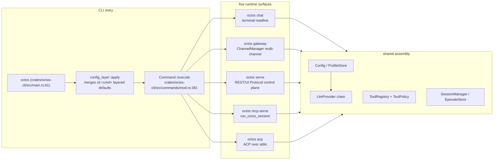
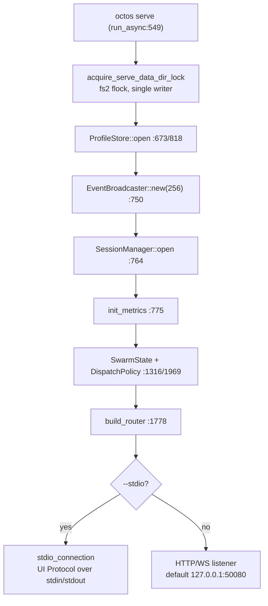
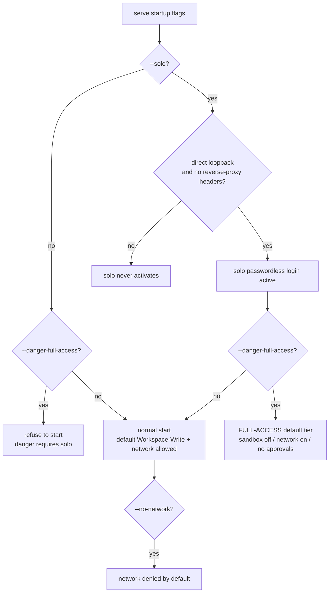
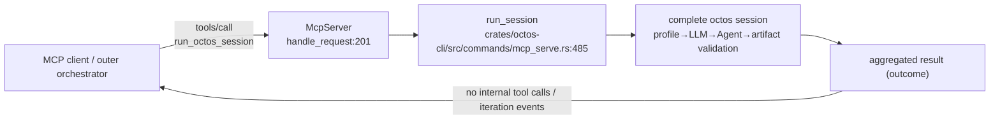
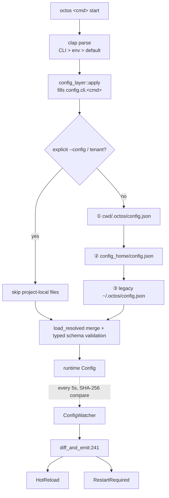

# Chapter 14: Runtime Modes and the Configuration System

> **Positioning**: This chapter explains how octos dispatches its five runtime surfaces (chat, gateway, serve, mcp-serve, acp) from a single CLI entry point, and how 11,944 lines of configuration code organize precedence, layered defaults, and hot reload. Prerequisites: Chapter 5 (the agent loop), Chapter 11 (octos-bus). Who should read it: operators who deploy octos and must choose a runtime posture, and developers who want to trace how the control plane is assembled and how configuration propagates. Orchestration-surface subcommands (goal, peer, ledger, steer) are only located here; their details are Chapter 18's subject.

One `octos` binary serves at least five very different postures: a terminal session for a human, a resident daemon behind ten messaging channels, a control plane exposing 67 REST endpoints, an MCP server for outer-loop orchestrators, and an ACP agent for editors such as Zed. Users see a subcommand choice; contributors see a set of entry files that share assembly logic: seven entry files totaling 19,485 lines (`crates/octos-cli/src/main.rs` 268 lines, `crates/octos-cli/src/commands/mod.rs` 468 lines, `crates/octos-cli/src/commands/chat.rs` 4,143 lines, the `crates/octos-cli/src/commands/gateway/` directory 7,595 lines, `crates/octos-cli/src/commands/serve.rs` 2,849 lines, `crates/octos-cli/src/commands/mcp_serve.rs` 1,138 lines, `crates/octos-cli/src/commands/acp.rs` 3,024 lines).

An earlier draft summarized this layer as "four runtime modes." Measured against `octos --help` on the main branch as of 2026-09-02, the binary has 28 user subcommands and the postures long since exceeded four: `octos serve` has become the convergence point for AppState and the control plane, with `--stdio` making it simultaneously the mount point for the UI Protocol; `octos mcp-serve` exposes a complete octos session as one coarse-grained MCP tool; `octos acp` targets Agent Client Protocol clients. This chapter rewrites the layer as five runtime surfaces and gives the full picture of the configuration system (`crates/octos-cli/src/config.rs` 3,790 lines + `crates/octos-cli/src/profiles.rs` 7,003 lines + `crates/octos-cli/src/config_watcher.rs` 608 lines + `crates/octos-cli/src/config_layer.rs` 543 lines).

---

## 14.1 One entry point, five runtime surfaces

### 14.1.1 From crates/octos-cli/src/main.rs to Command dispatch

All subcommands share one startup path. `fn main()` sits at `crates/octos-cli/src/main.rs:61` and does four things: install the error hook, parse clap arguments, merge layered defaults (`octos_cli::config_layer::apply`, `crates/octos-cli/src/main.rs:80`), and execute the subcommand (`args.command.execute()`, `crates/octos-cli/src/main.rs:101`).

The subcommand list is `pub enum Command` (`crates/octos-cli/src/commands/mod.rs:114`); 28 variants each map to a command struct. The `Executable for Command` `match` dispatch starts at `crates/octos-cli/src/commands/mod.rs:381`:

```rust
// crates/octos-cli/src/commands/mod.rs:381-399 (excerpt)
match self {
    Self::Account(cmd) => cmd.execute(),
    Self::Acp(cmd) => cmd.execute(),
    // …remaining subcommands, same shape…
    Self::McpServe(cmd) => cmd.execute(),
    #[cfg(feature = "api")]
    Self::Serve(cmd) => cmd.execute(),
```

Two details deserve attention. First, `Self::Serve` is gated by `#[cfg(feature = "api")]` (`crates/octos-cli/src/commands/mod.rs:398-399`): a binary compiled without the `api` feature has no serve subcommand, and the serve log-directory logic at `crates/octos-cli/src/main.rs:85-86` is gated the same way. Compile-time trimming is the first boundary of the runtime-surface system; the full list is in Appendix D. Second, commands that emit a machine-readable stream on stdout, such as ACP, MCP, and `chat --json`, have their console logs routed to stderr (`commands::reserve_stdout`), because one stray log line corrupts the protocol stream.

`octos --help` as measured lists 28 user subcommands: `account acp admin auth channels chat config cron doctor docs init inbox mcp memory profile mcp-serve serve skills status steer update gateway goal ledger clean completions office peer`. Five resident or session-oriented commands define the runtime surfaces; the rest are lifecycle management (`auth`, `profile`, `account`), diagnostics (`doctor`, `status`), and the orchestration surface (`goal`, `peer`, `ledger`, `steer`; see Chapter 18).

### 14.1.2 The five surfaces at a glance

| Runtime surface | Entry point | Size | First-line doc summary | Key symbols |
|---|---|---|---|---|
| chat (single-machine session) | `crates/octos-cli/src/commands/chat.rs` | 4,143 lines | interactive multi-turn conversation | `ChatCommand`:37, `execute`:1043, `run_chat_peer`:828 |
| gateway (multi-channel resident) | `crates/octos-cli/src/commands/gateway/` | 7,595 lines | persistent messaging daemon | `GatewayCommand`:45, `Gateway::init`:226, runtime `run`:1789 |
| serve (control plane + `--stdio`) | `crates/octos-cli/src/commands/serve.rs` | 2,849 lines | start the REST API server | `ServeCommand`:320, `execute`:539, `run_async`:549, `build_router`:1778 |
| mcp-serve (protocol service) | `crates/octos-cli/src/commands/mcp_serve.rs` | 1,138 lines | M7.2 — octos mcp-serve | `McpTransport`:72, `McpServeCommand`:79, `run_session`:485 |
| acp (protocol service) | `crates/octos-cli/src/commands/acp.rs` | 3,024 lines | run octos as an ACP agent over stdin/stdout | `AcpCommand`:100, `execute`:160, `run_async`:1163 |

All line numbers come from `assets/ch14-facts.md` (baseline 9c157101); the files all live under `crates/octos-cli/src/`.

### 14.1.3 The topology of the five surfaces



**Figure 14-1: the five runtime surfaces share one assembly.** What differs is the access layer (terminal, channels, HTTP, MCP, ACP); what is shared is configuration parsing, the provider chain, the tool registry, and session storage. This shared plane is exactly the Chapter 1 workspace layering projected onto the CLI: the entry files all live in `octos-cli`, and every capability comes from lower crates (dependency direction: Chapter 1, Section 1.3, and Appendix A).

### 14.1.4 Choosing a surface

The five surfaces are not five products; they are five access paths into one agent capability stack. The main variables are "who initiates the interaction" and "how long the process lives":

| Dimension | chat | gateway | serve | mcp-serve / acp |
|---|---|---|---|---|
| Interaction initiator | a human at a terminal | humans on messaging channels | Web/HTTP clients | an outer program |
| Process lifetime | one session | resident daemon | resident service | tied to the client session |
| Network exposure | none | outbound to channel platforms | listening port or stdio | stdio or a local port |
| Configuration consumed | one config | multiple profiles + sub-accounts | profile registry + layering | per-profile, loaded per task |
| Typical scenario | development, single-machine use | community bots, multi-channel assistants | self-hosted dashboards, API integration | invoked by an editor or orchestrator |

Two rules of thumb. First, surfaces stack but processes do not merge: a deployment can run a gateway (message entry) alongside a serve (dashboard entry); they read the same configuration system but each holds its own data-dir lock. Running gateway and serve in one process is not a currently supported shape. Second, start with the smallest surface: verify configuration and tool behavior in chat first, move to gateway or serve when you need a resident process, and bring in mcp-serve or acp only when a program must call you. Each surface adds operational burden in one direction only: channel credentials, ports, tokens, lock files.

---

## 14.2 chat: the single-machine session surface

`octos chat` is the surface closest to user intuition: a multi-turn conversation in a terminal. `ChatCommand` (`crates/octos-cli/src/commands/chat.rs:37`) supports `--cwd`, `--provider`, `--model`, `--max-iterations`, `--verbose`, and other overrides; `execute` (`crates/octos-cli/src/commands/chat.rs:1043`) builds the Tokio multi-thread runtime and enters the session loop; `run_chat_peer` (`crates/octos-cli/src/commands/chat.rs:828`) is the actual conversation driver. The agent loop's unfolding is Chapter 5's subject and is not repeated here.

chat earns its keep as the thinnest verification surface: configuration parsing, provider construction, tool registration, and sandbox policy all take effect at this layer, with no network exposure. When diagnosing a configuration problem, reproduce it in chat first and then investigate gateway or serve; that is the cheapest path.

chat is also one of the three commands that participate in layered defaults (`"chat"` in `LAYERED_COMMANDS`): defaults preset in `config.cli.chat` for `--provider`, `--model`, and friends take effect when the user supplies no explicit argument. That turns "which model `octos chat` uses by default on this machine" into a configuration file you can commit, instead of an alias in everyone's shell history. `run_chat_peer` (`crates/octos-cli/src/commands/chat.rs:828`) uses the same agent assembly as gateway and serve, so loop behavior observed in chat in Chapter 5's terms carries over to the other surfaces directly.

---

## 14.3 gateway: the multi-channel resident surface

The first-line doc of `octos gateway` says it plainly: persistent messaging daemon (`crates/octos-cli/src/commands/gateway/mod.rs`; the directory totals 7,595 lines). It starts a ChannelManager listening on multiple messaging channels and routes incoming messages to the agent of the matching profile. The channel abstraction itself (Telegram, Discord, Matrix, and the rest) is Chapter 10's subject; this section covers only two structural features of gateway as a runtime surface.

First, profiles and sub-account inheritance are structured. Gateway's multi-user support is not "one top-level config.json per person" but `ProfileConfig` (`crates/octos-cli/src/profiles.rs:181`) carrying structured sections: a sub-account inherits the parent profile's `config.llm` contract (`LlmProfileConfig`, `crates/octos-cli/src/profiles.rs:814`); absent sections inherit `search`, `deep_crawl`, and others; and the parent's `env_vars` serve as a base layer (resolved through the keychain, `crates/octos-cli/src/commands/gateway/profile_factory.rs:108/149`). The old draft's "sub-accounts inherit top-level provider/model fields" wording is obsolete: top-level fields are the legacy path; structured sections are the current main path.

Second, gateway is the primary consumer of hot reload. A resident process pays the highest cost for configuration changes (a restart interrupts every channel), so the `ConfigWatcher` event loop mainly serves this surface (see 14.6.3). The chain is `GatewayCommand::execute` (`crates/octos-cli/src/commands/gateway/mod.rs:159`) → `run_async` (`:178`) → `Gateway::init` (`:226`) → the runtime main loop `run` (`crates/octos-cli/src/commands/gateway/gateway_runtime.rs:1789`), with hot-reload state (`system_prompt`, `max_history`, `config_rx`) hung off GatewayRuntime's state.

---

## 14.4 serve: the control-plane convergence point

Reading `octos serve` as "an HTTP shell around chat" is the most common misreading. serve is the convergence point of the control plane: one process assembles a REST API, the UI Protocol WebSocket, event broadcast, profile management, tool policy, and swarm scheduling state. chat is merely one capability it hosts.

### 14.4.1 Startup assembly

`ServeCommand::execute` (`crates/octos-cli/src/commands/serve.rs:539`) builds the Tokio runtime and enters `run_async` (`crates/octos-cli/src/commands/serve.rs:549`). Key nodes of the assembly sequence (line numbers in the facts table):

- `ProfileStore::open` (`crates/octos-cli/src/commands/serve.rs:673/818`): the profile registry and model catalog
- `EventBroadcaster::new(256)` (`crates/octos-cli/src/commands/serve.rs:750`): global event broadcast
- `SessionManager::open` (`crates/octos-cli/src/commands/serve.rs:764`): session storage
- `init_metrics()` (`crates/octos-cli/src/commands/serve.rs:775`): Prometheus metrics
- `SwarmState` construction (`crates/octos-cli/src/commands/serve.rs:1316` onward): swarm scheduling state, where `DispatchPolicy::from_agent_gates(tool_policy, true)` (`crates/octos-cli/src/commands/serve.rs:1969`) projects `config.tool_policy` and the injected-environment-variable denylist into dispatch gates, so swarm backends cannot bypass the native tool policy (swarm details: Chapter 17)
- `build_router(state)` (`crates/octos-cli/src/commands/serve.rs:1778`): turns AppState into axum routes



**Figure 14-2: serve's control-plane assembly.** Note that the single-writer lock comes first in the sequence: redb is a single-writer, single-process database, and two serves pointed at the same data dir collide. On lock conflict the process emits a machine-greppable `OCTOS_DATA_DIR_LOCKED` marker (`DATA_DIR_LOCKED_MARKER`, around `crates/octos-cli/src/commands/serve.rs:487`); clients such as octoscode grep for that token to recognize the conflict and stop their restart loop, instead of silently crashing every 5 seconds.

### 14.4.2 `--stdio`: the UI Protocol mount surface

The branch at `crates/octos-cli/src/commands/serve.rs:1541` decides serve's two shapes:

```rust
// crates/octos-cli/src/commands/serve.rs:1541-1546
if self.stdio {
    crate::api::ui_protocol_transport::stdio_connection(state).await?;
    tracing::info!("stopping all gateway child processes");
    let _ = process_manager.stop_all().await;
    return Ok(());
}
```

`--stdio` mode binds no HTTP: `bind_http_listener` (`crates/octos-cli/src/commands/serve.rs:464-471`) returns a `None` listener under stdio, and the UI Protocol's JSON-RPC traffic flows over stdin/stdout. This is not a test backdoor; it is a production path. octoscode's default stdio chain is

```rust
// octoscode/src/cli.rs:118
pub const DEFAULT_STDIO_COMMAND: &str = "octos serve --stdio --solo";
```

The companion mechanism is `--instance-data-dir`: multiple stdio instances share one config/profile state home while each holds a private runtime data directory (redb, sessions, serve lock), so "one user with several editor windows open" does not self-collide. stdio mode also reuses serve's entire control-plane assembly (watcher, events, profiles); only the transport changes to pipes.

`--stdio` also redefines stdout ownership: once the protocol owns stdout, anything written to it is parsed by the client as a JSON-RPC frame, and one debug print is one protocol violation. Tracing logs, panics, and progress hints must all move to stderr; likewise, child processes spawned by serve on the stdio chain inherit stdout and would pollute the protocol stream unless explicitly redirected. This is the root reason the `reserve_stdout` mechanism exists: the separation of machine-readable streams from human-readable logs must be drawn once, at the entry point.

### 14.4.3 serve admission gates

The switches exposed by `octos serve --help` form a deliberately designed set of admission gates (measured output matches `assets/ch14-facts.md`):

| Switch | Semantics | Environment variable |
|---|---|---|
| `--solo` | single-user local passwordless login (`POST /api/auth/solo*`); takes effect only on direct loopback connections in Local mode; requests carrying reverse-proxy headers never qualify | `OCTOS_SOLO_LOGIN=1` |
| `--danger-full-access` | defaults every session to the FULL-ACCESS tier (sandbox off, network on, approvals skipped); must be paired with `--solo` | `OCTOS_DANGER_FULL_ACCESS=1` |
| `--no-network` | reverts from "network allowed by default" to deny by default | `OCTOS_NO_NETWORK=1` |
| `--swarm-backend <stdio\|http\|cli>` | swarm backend transport; unset, `/api/swarm/*` returns 503 | — |

Default bindings favor safety: `--host` defaults to `127.0.0.1` and `--port` to 50080 (`crates/octos-cli/src/commands/serve.rs:324`; the port sits in the IANA dynamic range to dodge common services such as Tomcat/Jenkins, see issue #417). Local sessions default to Workspace-Write with network allowed (the filesystem stays sandboxed; `npm install` and git work out of the box), and `--no-network` is the explicit opt-out; cloud/tenant deployments are always network-deny.



**Figure 14-3: serve's admission-gate decision flow.** An explicit `/permissions` choice inside a session always takes precedence over these default tiers.

### 14.4.4 coding/autonomy capabilities and the tool contract

serve does more than "hold conversations": UI Protocol's `SessionOpened.capabilities` projects a set of coding capabilities according to the features the client declares (constants at `crates/octos-cli/src/api/ui_protocol_transport.rs:2037-2060`, projected item by item via `has_ui_feature`):

- `coding.tool_contract.v1` (contract constant `crates/octos-cli/src/api/coding_tool_contract.rs:12`, contract id `codex-compatible-coding-v1`, `:13`)
- `coding.autonomy.v1` (`:2037`), `coding.agent_control.v1` (`:2042`), `coding.goal_runtime.v1` (`:2047`), `coding.loop_runtime.v1` (`:2052`), plus `coding.monitor_runtime.v1` (`:2057`)

The backend generates the tool contract dynamically from the current `ToolRegistry`, the deferred tool set, the policy view, and the tools known to be visible to the model, so AppUI can distinguish six tool states (`crates/octos-cli/src/api/coding_tool_contract.rs:19-28`): `available`, `aliased`, `deferred`, `disabled_by_policy`, `missing`, `unimplemented`. `deferred` means the tool is registered but sits in the LRU lazy-unload set; the model can restore it via `activate_tools`, so it still counts as available for contract purposes.

One boundary needs stating: these autonomy capabilities describe backend-supervised orchestration (goals, loops, and agent-control primitives all run under backend supervision), not an unattended self-evolving runtime. The internals of the goal/loop runtimes are Chapter 18's subject; this chapter only locates them on serve's capability surface.

### 14.4.5 The REST surface: 67 endpoints

Counted with `grep -rhoE '\.route\("[^"]+"' crates/octos-cli/src/api/*.rs | sort -u | wc -l` (two runs on 2026-09-02 both yielded 67), serve exposes 67 REST endpoints spread across 42 `.rs` files in the `api/` directory. The old draft's "91" no longer holds: endpoints keep being trimmed, and any specific number must carry its measurement command. An endpoint-level reference is Appendix C; the Web Dashboard's frontend is outside this book's scope.

---

## 14.5 The protocol-service surfaces: mcp-serve and acp

### 14.5.1 mcp-serve: exposing only run_octos_session

`octos mcp-serve` (`crates/octos-cli/src/commands/mcp_serve.rs`, 1,138 lines) exposes octos as an MCP server for outer-loop orchestrators. The MCP implementation lives in `crates/octos-agent/src/mcp_server.rs` (1,044 lines): `McpServer`:169, `handle_request`:201, HTTP transport `streamable_http_service`:268.

The boundary design is the heart of this surface: the server exposes exactly one session-level tool, `run_octos_session` (constant `RUN_OCTOS_SESSION_TOOL`, `crates/octos-agent/src/mcp_server.rs:66`). Each call runs one complete octos session (load profile, construct the LLM, create the agent, execute the prompt, validate artifacts), and what the outer loop receives is the aggregated result: it sees no internal tool calls, iteration events, or progress stream. octos's internal tool catalog (59 tools; see Chapter 6) is not exposed. This is the trade-off between a coarse-grained task boundary and a fine-grained tool proxy: the outer orchestrator decomposes the task; the octos session executes autonomously inside the boundary.



**Figure 14-4: mcp-serve's session-level dispatch.** The transport is one of two (`McpTransport`, `crates/octos-cli/src/commands/mcp_serve.rs:72`): the default `stdio`, whose trust model is parent-trust (the parent process is trusted; no token); or the `http` transport bound to `127.0.0.1:4033` (the `--bind` default), which requires `OCTOS_MCP_SERVER_TOKEN` and refuses to start if it is missing or empty (`crates/octos-cli/src/commands/mcp_serve.rs:185-186`).

### 14.5.2 acp: the agent for editors

`octos acp` (`crates/octos-cli/src/commands/acp.rs`, 3,024 lines) runs an agent over stdin/stdout per the Agent Client Protocol, serving the agent clients built into editors such as Zed. `AcpCommand`:100, `execute`:160, `run_async`:1163. The difference from mcp-serve lies in protocol and granularity: ACP is a session protocol between an editor and an agent (file context, permission requests, diff display), while MCP is task-level tool invocation. The two share the same configuration and agent assembly, and stdout stays a pure protocol stream in both.

acp and mcp-serve belong to the same "protocol-service surface" because they share a structural constraint: stdin/stdout is the protocol channel, one stray log line is one protocol violation, so both route console logs to stderr (`commands::reserve_stdout`); neither maintains human-facing UI state, and the presentation of the session (diffs, progress, approvals) is rendered entirely by the client. The difference is session ownership: an ACP session belongs to the editor's user, and permission requests surface to that user as protocol messages; an mcp-serve session belongs to the outer orchestrator, and its permission boundary is fixed once, in the startup configuration.

---

## 14.6 The configuration system: four files, 11,944 lines

| File | Lines | Responsibility | Key symbols |
|---|---|---|---|
| `crates/octos-cli/src/config.rs` | 3,790 | config file parsing and merging | `Config`:26, `load_with_context`:1740, `load_resolved`:1770 |
| `crates/octos-cli/src/profiles.rs` | 7,003 | multi-user profile management | `ProfileConfig`:181, `LlmProfileConfig`:814, `LlmRouteConfig`:881 |
| `crates/octos-cli/src/config_watcher.rs` | 608 | hot-reload polling | `ConfigChange`:17, `spawn`:87, `diff_and_emit`:241 |
| `crates/octos-cli/src/config_layer.rs` | 543 | startup-time layered defaults | `LAYERED_COMMANDS`:40, `apply`:48 |

### 14.6.1 The precedence chains

File-level parse precedence (from the `load_resolved` comment in `crates/octos-cli/src/config.rs`):

1. project-local `<cwd>/.octos/config.json` (read only in the default context)
2. `<config_home>/config.json`
3. legacy `~/.octos/config.json`

An explicit `--config` or a tenant context does not read the project-local file. Local-first precedence lets different projects use different providers and tool policies; the cost is that diagnosing "why does this machine behave differently" means checking one more file.

A second precedence chain operates at startup, on the CLI arguments themselves (module docs at `crates/octos-cli/src/config_layer.rs:5-8`):

```text
explicit CLI flag  >  env var  >  config.json `cli.<cmd>`  >  built-in default
```

clap already resolves "CLI > env > default"; `config_layer::apply` (called at `crates/octos-cli/src/main.rs:80`) fills in the middle layer: fields the user gave neither on the command line nor through an environment variable fall through to `config.cli.<cmd>`. Only three subcommands participate: `LAYERED_COMMANDS = ["serve", "gateway", "chat"]` (`crates/octos-cli/src/config_layer.rs:40`). "Was it explicit?" is decided by `clap::ArgMatches::value_source`, the one mechanism that covers both scalar defaults (`--port`) and bare boolean switches (`--solo`). Dangerous switches (`--danger-full-access`, `--yolo`) and secret fields are explicitly excluded from layering; they can come only from the command line.



**Figure 14-5: configuration resolution and hot reload.** The typed schema introduced in 3a567a4c changed inference parameters (profile/llm/*) from "silently drop unknown fields" to "reject": a mistyped key in the configuration now errors at startup instead of quietly falling back to defaults (comment around `crates/octos-cli/src/config.rs:273`). This is the configuration system's most important tightening in recent years.

### 14.6.2 Structured profile configuration

`crates/octos-cli/src/profiles.rs` (7,003 lines) is the configuration system's largest file and carries multi-user deployment: `ProfileConfig`:181 defines the structured sections, `ProfileConfigPatch`:741 supports patch semantics, and the three LLM pieces are `LlmProfileConfig`:814, `LlmModelSelectionConfig`:824, and `LlmRouteConfig`:881. What gateway sub-accounts inherit is precisely these structured sections plus the `env_vars` base (see 14.3), with sensitive variables resolved through the keychain (`crates/octos-cli/src/commands/gateway/profile_factory.rs:108/149`).

In `crates/octos-cli/src/config.rs`, `mcp_servers: Vec<McpServerConfig>` (`:110`) and `sub_providers: Vec<SubProviderConfig>` (`:184`, defined at `:618`) are only named here: the former is the mount configuration for external MCP tools (see Chapter 9), the latter the sub-provider chain; full field references for both are in Appendix C.

### 14.6.3 The hot-reload watcher

`ConfigWatcher` (`crates/octos-cli/src/config_watcher.rs:28`) polls the configuration files every 5 seconds and detects changes by comparing SHA-256 hashes (that is the first-line doc's stated semantics). Change classification is expressed by the `ConfigChange` enum (`:17`):

```rust
// crates/octos-cli/src/config_watcher.rs:17-25
pub enum ConfigChange {
    /// Fields that can be applied without restart.
    HotReload {
        system_prompt: Option<String>,
        max_history: Option<usize>,
    },
    /// Fields changed that require a restart. Log warning only.
    RestartRequired(Vec<String>),
}
```

`diff_and_emit` (`:241`) compares field by field and routes: `HotReload` has only two members, `system_prompt` and `max_history` (gateway sub-fields); everything else falls into `RestartRequired(Vec<String>)`, which only warns. The current restart-required list: `base_url`, `api_key_env` (they affect HTTP client construction), `sandbox`, `mcp_servers`, `hooks` (external connections must be rebuilt), `format_after_edit` (baked into AgentConfig at startup, #1774), `plugins` (the signature gate is consumed only at load), `gateway.queue_mode`, `gateway.channels` (they affect the message main loop).

The watcher's workflow has four steps. At startup, `ConfigWatcher::new` (`:44`) receives the set of paths to watch; in profile mode, `with_profile_defaults` (`:67`) also brings the global `profile-defaults.json` under watch, so editing the shared defaults layer triggers the same reload path; `spawn` (`:87`) starts the background task and its 5-second polling loop; each poll reads all existing files, concatenates them, and computes one SHA-256; if the hash is unchanged it skips, and only a changed hash triggers parsing the new configuration and handing it to `diff_and_emit` for classification. The classification goes out over a `tokio::sync::watch` channel; the consumer (mainly the gateway main loop) writes `system_prompt` into an `RwLock<String>` and `max_history` into an atomic counter on `HotReload`; neither write path needs to pause message processing.

Two robustness details are worth recording. First, the defaults layer keeps a last-known-good: if a previously valid `profile-defaults.json` is edited into an invalid one, the watcher keeps using the last correct parse rather than silently dropping the whole base layer; a file that was never valid stays `None`. Second, a main configuration that fails to parse likewise keeps the old value and warns; a broken configuration does not take down a running process.

provider/model file changes go down neither path: the watcher neither classifies them as HotReload for automatic application nor reports RestartRequired anymore; switching at runtime goes through an explicit path (the `model_check` tool triggering `SwappableProvider.swap`; see Chapter 3). The safe mental model: changing `system_prompt`/`max_history` takes effect within five seconds; changing provider/model means either an explicit in-session switch or a process restart; changing `base_url`/`hooks` and friends always means a restart.

Profile policy flips have a regression note against false positives (`crates/octos-cli/src/config_watcher.rs:136-150`): the presence of the parent-profile defaults layer makes a naive diff misjudge inherited values as changes, and the watcher special-cases this layer. The choice of polling over inotify is cross-platform: inotify is Linux-only, macOS uses kqueue, Windows uses ReadDirectoryChangesW, and a 5-second SHA-256 poll behaves identically on all three at negligible cost. The watcher also reads all files and hashes them together in one pass, avoiding the check-then-read TOCTOU race; on parse failure it keeps the last valid configuration and warns rather than crashing on a broken one.

---

> ### Engineering decision: why `--danger-full-access` must be paired with `--solo`
>
> `--danger-full-access` defaults every new session to FULL-ACCESS: sandbox off, network on, no approvals. Exposed on a network, that tier hands host execution to anyone who can reach the port. So its activation precondition is isomorphic to `--solo`'s: `--solo` itself takes effect only on a direct loopback connection in Local mode with no reverse-proxy headers on the request, and the two switches share one key, "local, single user." Binding the sandbox-free tier to single-user local login equates to binding it to the precondition "the attacker must first log into this machine's operating system." The environment variable (`OCTOS_DANGER_FULL_ACCESS=1`) cannot bypass this: a serve started without `--solo` is refused outright.
>
> The generalizable form of this binding: the gate on a dangerous capability should not be an independent boolean switch but a reuse of an already-audited chain of trust. A standalone `--danger-full-access` will sooner or later end up in a systemd unit bound to 0.0.0.0; with the binding, the state "remote + sandbox-free" is illegal at the entrance.

> ### Engineering decision: the boundary between hot reload and full restart
>
> Only `system_prompt` and `max_history` can hot-reload; the former is stateless text (effective on the next LLM call), the latter a count (atomically replaced). The list is short because every additional hot-reload item must answer two questions: "do in-flight sessions use the old value or the new one?" and "how do we roll back a failed replacement?" `base_url` and `api_key_env` affect connection pools and TLS; replacing them at runtime can tear in-flight requests. `hooks` carry circuit-breaker counters; swapping the command without resetting state leaves a tripped hook unrecoverable forever. `format_after_edit` is baked into AgentConfig at startup, copied separately by all three entry points (chat/gateway/serve), with no shared mutable point. The dividing principle: stateless or single-valued fields hot-reload; fields with connections, state, or baked-in copies require a restart. provider/model sits in between, so it takes a third path: no file hot-reload, but a controlled runtime switch interface.

---

## 14.7 Feature flags: the compile-time runtime surface

From `crates/octos-cli/Cargo.toml:142`, `[features] default = []`: the default build is the minimal set. `api` (`:154`) pulls in axum/rustls/prometheus and, with them, `octos-bus/api` and matrix; every messaging channel has its own gate (`telegram`, `discord`, `dingtalk`, `slack`, `whatsapp`, `email`, `feishu`, `twilio`, `wecom`, `line`, `matrix`, `wecom-bot`), each mapping to an octos-bus channel build; `embed-llama`/`-metal`/`-cuda` (`:147-149`) control the local embedding model. The very existence of `Command::Serve` is gated by `#[cfg(feature = "api")]` (`crates/octos-cli/src/commands/mod.rs:398`).

Its relation to the five runtime surfaces is two-layered: surface choice happens at runtime (subcommand dispatch), capability trimming at compile time (feature gates). Deploying a gateway that only connects to Telegram does not require compiling the REST server; conversely, a serve deployment need not compile unused channels. The full list is in Appendix D.

---

## 14.8 Chapter Recap

1. Five runtime surfaces: chat (single-machine session), gateway (multi-channel resident), serve (control-plane convergence + `--stdio` mount), and mcp-serve/acp (protocol services), all dispatched from `Command::execute` (`crates/octos-cli/src/commands/mod.rs:381`) and sharing configuration, the provider chain, the tool registry, and session storage; the entry files total 19,485 lines.
2. serve is the control-plane convergence point: it assembles ProfileStore, EventBroadcaster, SessionManager, metrics, SwarmState, and 67 REST endpoints (measurement command in the facts table); `--stdio` is octoscode's default production chain (`octos serve --stdio --solo`), and the single-writer lock marks conflicts with `OCTOS_DATA_DIR_LOCKED`.
3. serve admission gates: default 127.0.0.1:50080; `--solo` works only on loopback; `--danger-full-access` is forced to pair with `--solo`; network is allowed by default with `--no-network` as the opt-out; coding/autonomy capabilities are a projection of backend-supervised orchestration.
4. mcp-serve exposes only `run_octos_session`: a session-level aggregated result, with the internal tool catalog never exposed; stdio is parent-trust, and HTTP must carry a token.
5. The configuration system is an 11,944-line four-piece set: the file precedence chain (project-local > config_home > legacy), the startup layering chain (CLI > env > `cli.<cmd>` > default, with only serve/gateway/chat participating), the typed schema rejecting unknown fields, and the watcher's 5-second SHA-256 polling, with hot reload limited to `system_prompt`/`max_history`.

---

## Further reading

- The MCP specification (Model Context Protocol): https://modelcontextprotocol.io (the tools/call semantics that `run_octos_session` follows).
- Agent Client Protocol: https://agentclientprotocol.com (the session protocol between editors such as Zed and agents).
- The Config chapter of 12-Factor App: https://12factor.net/config (compare with this chapter's four-layer chain of "explicit CLI > env > config > default").
- Appendix C (configuration field reference) and Appendix D (feature flag survey) of this book.

## Exercises

1. `--stdio` mode reuses serve's entire control-plane assembly but serves a single client. To support "one data dir, eight editor windows," where should the shared/private boundary of `--instance-data-dir` be drawn? Which stores must be private, and which can be shared?
2. The watcher's `RestartRequired` only warns, never acts. To turn a `gateway.channels` change in gateway into a "planned restart" (drain in-flight messages, then self-restart), what preconditions are needed to guarantee no message loss?
3. mcp-serve's coarse-grained boundary leaves tool choice inside the octos session. If an outer orchestrator needs "approval before every tool call," does the boundary still hold? At which layer should the approval primitive be added?
4. `config_layer` uses `value_source` to tell "the user gave it explicitly" from "a default." Without that mechanism, judging emptiness yourself with `Option<T>` fields, what would the 28 command structs pay?

---

> **Version note**
> This chapter is written against octos main @ `9c157101` (committed 2026-09-02, measured 2026-09-03); reproduction commands for every line number and figure are in `assets/ch14-facts.md`. The main updates over the v1 draft (Chapter 13): first, "four runtime modes" was rebuilt as "five runtime surfaces," with acp and serve `--stdio` promoted to first-class citizens and the 28 `octos --help` subcommands verified word for word; second, the REST endpoint count was revised from 91 to 67 (measurement command included; the old number no longer holds); third, this chapter adds the serve admission gates (`--solo`/`--danger-full-access`/`--no-network`/`--swarm-backend`), the coding/autonomy capability projection and the tool contract's six states, the `OCTOS_DATA_DIR_LOCKED` single-writer lock, the config_layer layered-defaults chain, and the typed schema's reject semantics. The old draft's detailed `SwappableProvider` walkthrough moved to Chapter 3; this chapter keeps only its relation to the hot-reload boundary.
