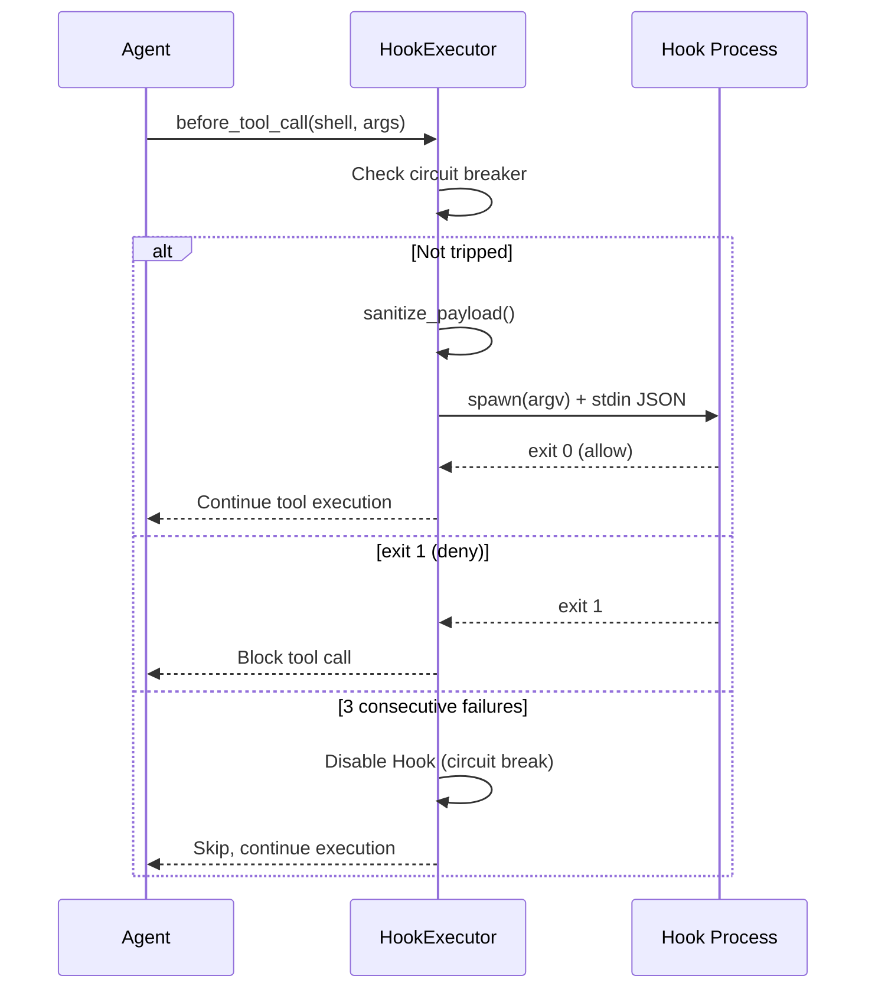
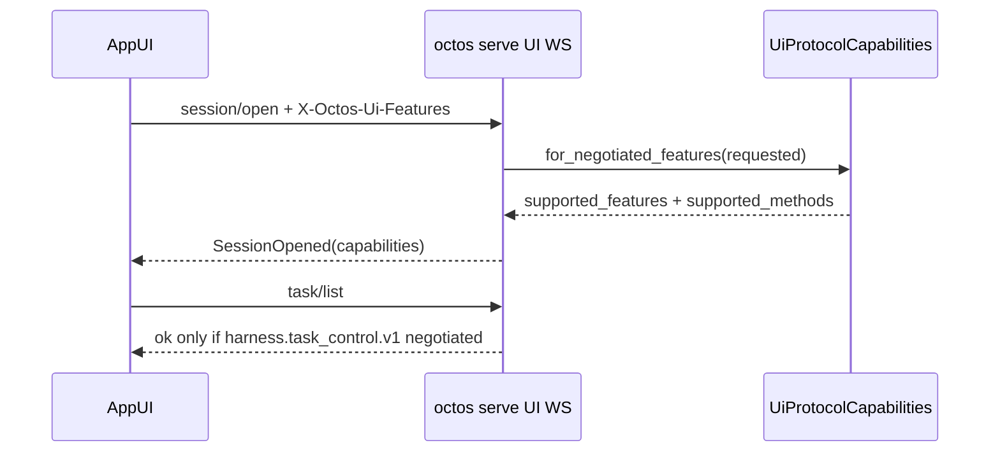
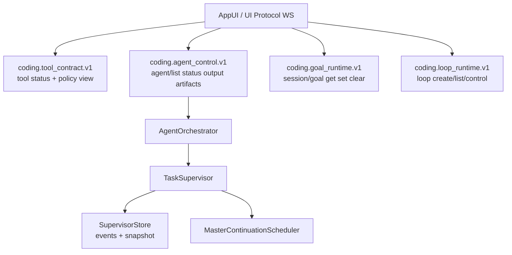
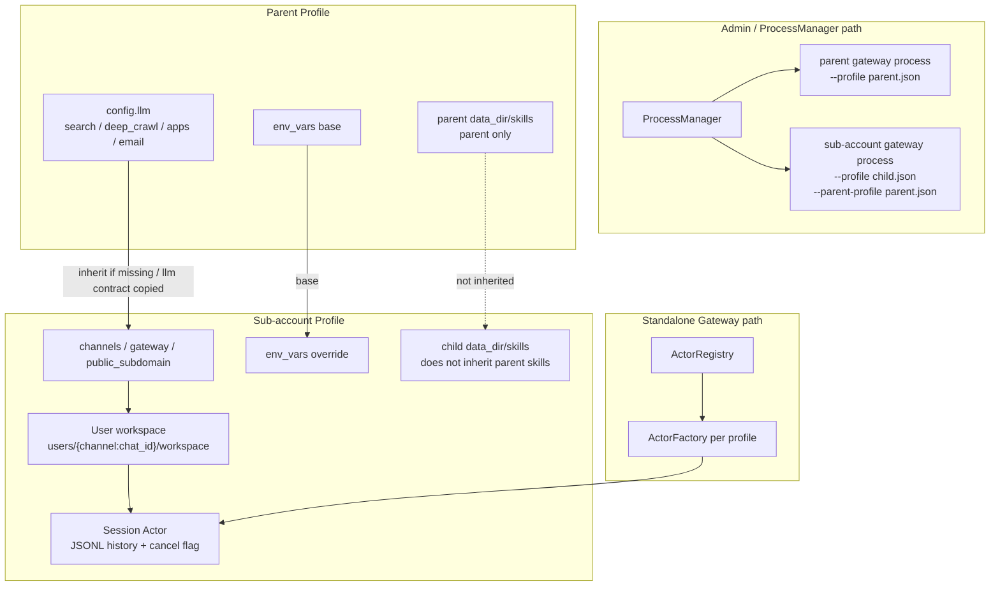
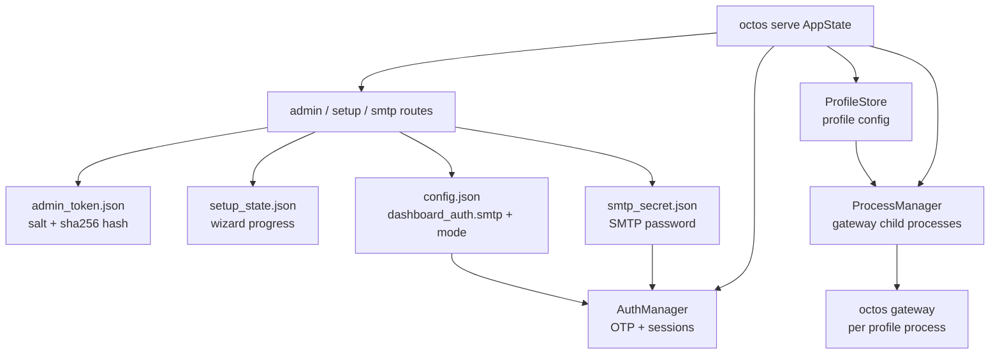

# Chapter 14: Production Readiness: Authentication, Monitoring, and Deployment

> **Positioning**: This chapter presents the final puzzle piece for taking octos from a development tool to a production system — authentication, Hooks lifecycle, monitoring, and multi-tenant configuration. Prerequisites: Chapter 13. Target audience: operators who need to deploy octos to production environments (Reader D), and developers who want to understand production-grade system design patterns (Reader B).

The distance between a system that "works" and one that's "production-ready" is often greater than the codebase size suggests. Authentication, monitoring, Hook systems, multi-tenant isolation — these aren't features; they're the infrastructure of trust.

---

## 14.1 Three Authentication Flows

### 14.1.1 OAuth PKCE

octos currently implements PKCE (Proof Key for Code Exchange) for **OpenAI**; other providers use the paste-token path (`../octos/crates/octos-cli/src/auth/oauth.rs`, `../octos/crates/octos-cli/src/commands/auth.rs`).

**The core idea of PKCE**: In the traditional OAuth authorization code flow, a malicious application can intercept the authorization code and impersonate the legitimate application. PKCE prevents this attack by embedding a "proof key" in the authorization request — only the application that knows the original verifier can exchange the code for a token.

**octos's PKCE implementation** (`../octos/crates/octos-cli/src/auth/oauth.rs:25-44`):

```rust
pub fn generate_pkce() -> PkceChallenge {
    // 1. Verifier = 2 UUID v4s concatenated = 64 hexadecimal characters
    let verifier = format!("{}{}", Uuid::new_v4().as_simple(), Uuid::new_v4().as_simple());

    // 2. Challenge = Base64-URL encoding (no padding) of SHA-256(verifier)
    let mut hasher = Sha256::new();
    hasher.update(verifier.as_bytes());
    let challenge = base64_url_encode(&hasher.finalize());

    PkceChallenge { verifier, challenge }
}
```

**Why concatenate 2 UUIDs?** RFC 7636 requires the verifier length to be between 43-128 characters. A single UUID v4 in simple format is 32 hexadecimal characters (not enough); two concatenated yield 64 (meeting the requirement).

The authorization flow in five steps:

1. Generate PKCE verifier + challenge pair
2. Generate a random state parameter (UUID v4, CSRF protection)
3. Open the browser to the Provider's authorization page (carrying the challenge)
4. Start a local HTTP server (`localhost:1455/auth/callback`, `../octos/crates/octos-cli/src/auth/oauth.rs:18-21`) to receive the callback
5. Exchange the authorization code + verifier for an access token

### 14.1.2 Device Code Flow

For browserless environments (such as remote servers), OpenAI device code flow is supported: octos displays a URL and code, and the user completes authentication on another device.

### 14.1.3 Paste-token

The simplest authentication method — the user directly pastes an API key. Suitable for Providers that don't support OAuth.

### 14.1.4 Credential Storage

Credentials are stored in `~/.octos/auth.json`; Unix saves use mode `0600` (owner read/write only) (`../octos/crates/octos-cli/src/auth/store.rs:1-20`, `../octos/crates/octos-cli/src/auth/store.rs:79-116`). Serve admin/test bearer-token comparison uses constant-time equality to avoid obvious timing side channels (`../octos/crates/octos-cli/src/api/router.rs:639-669`).

### 14.1.5 API Security

The Serve mode HTTP server binds to `127.0.0.1` by default (local access only). External access requires explicitly enabling it via `--host 0.0.0.0` — the secure-by-default principle.

---

## 14.2 Hooks Lifecycle



**Figure 14-1: Hook execution sequence.** before_tool_call is the most commonly used Hook event. The circuit breaker automatically disables the Hook after 3 consecutive failures.

Hooks let users inject custom logic at critical points during Agent execution (`../octos/crates/octos-agent/src/hooks.rs`).

### 14.2.1 Core and Extended Events

The four most common hot-path Agent events are:

| Event | Timing | Typical Use |
|-------|--------|------------|
| `before_tool_call` | Before tool invocation | Approval, argument modification, logging |
| `after_tool_call` | After tool invocation | Result filtering, auditing |
| `before_llm_call` | Before LLM invocation | Prompt modification, request interception |
| `after_llm_call` | After LLM invocation | Response filtering, monitoring |

Current `HookEvent` has more than four variants. It also includes `on_resume`, `on_turn_end`, `before_spawn_verify`, `on_spawn_verify`, `on_spawn_complete`, and `on_spawn_failure` for session resume, turn completion, and background/subtask lifecycle events (`../octos/crates/octos-agent/src/hooks.rs:28-42`). The four-event model is a useful teaching surface, but it is not the complete enum.

### 14.2.2 HookConfig and HookPayload

Each Hook's configuration (`../octos/crates/octos-agent/src/hooks.rs:44-57`):

```rust
pub struct HookConfig {
    pub event: HookEvent,        // lifecycle event to trigger on
    pub command: Vec<String>,    // argv array — no Shell interpretation
    pub timeout_ms: u64,         // timeout (default 5000ms)
    pub tool_filter: Vec<String>, // empty = all tools
}
```

`tool_filter` is a list, not a single optional string. For example, `["shell", "write_file"]` triggers only for those tools; an empty list means all tools.

**HookPayload** (`../octos/crates/octos-agent/src/hooks.rs:70-145`) is the JSON data passed to the Hook process:

| Event Type | Payload Fields |
|-----------|---------------|
| before_tool_call | `tool_name`, `arguments` (redacted/truncated), `tool_id` |
| after_tool_call | `tool_name`, `result` (redacted/truncated), `tool_id`, `success`, `duration_ms` |
| before_llm_call | `model`, `message_count`, `iteration` |
| after_llm_call | `model`, `iteration`, `stop_reason`, `has_tool_calls`, token counts, provider, latency, cumulative cost |
| resume/turn/spawn events | `turn_summary`, `task_id`, `task_label`, parent/child session keys, workflow phase, output files, failure action |
| all events | `session_id`, `profile_id` from `HookContext` |

`schema_version` is the durable Hook payload ABI version. `HookPayloadEnricher` can attach domain-specific `domain_data` before serialization; oversized JSON is replaced with `{"truncated": true}` so hook scripts always receive valid JSON (`../octos/crates/octos-agent/src/hooks.rs:63-75`, `../octos/crates/octos-agent/src/hooks.rs:538-557`, `../octos/crates/octos-agent/src/hooks.rs:607-635`).

### 14.2.3 Shell Protocol

Hook commands are executed as argv arrays (**no Shell interpretation**, preventing injection), receiving JSON payloads via stdin, and returning decisions via exit codes:

| Exit Code | Meaning | Behavior |
|-----------|---------|----------|
| 0 | Allow | Continue execution |
| 1 | Deny | Block only for `before_tool_call`, `before_llm_call`, or `before_spawn_verify`; after-hooks treat it as an error |
| 2 | Modify | Only for `before_tool_call` / `before_spawn_verify`; stdout is parsed as replacement payload JSON |
| Other | Error | Count as hook failure and may trip the circuit breaker |

**Sensitive data protection** (`../octos/crates/octos-agent/src/hooks.rs:148-183`):

```rust
const MAX_PAYLOAD_FIELD_BYTES: usize = 1024; // 1KB
const SENSITIVE_TOOLS: &[&str] = &["shell", "write_file", "read_file"];
```

- Sensitive tools' (shell, write_file, read_file) arguments are replaced with `{"redacted": true}`
- Other tools' arguments are truncated to 1KB (UTF-8 safe truncation)
- Prevents Hook processes (which may be third-party scripts) from seeing file contents or shell commands

Session context (`session_id`, `profile_id`) is injected into all payloads (`../octos/crates/octos-agent/src/hooks.rs:104-108`, `../octos/crates/octos-agent/src/hooks.rs:492-496`), allowing Hooks to implement differentiated policies based on session or user.

### 14.2.4 Hook Execution Source Code Walkthrough

`execute_hook()` (`../octos/crates/octos-agent/src/hooks.rs:767-848`) demonstrates the complete pattern for safely executing external processes:

```rust
async fn execute_hook(&self, hook: &HookConfig, payload_json: &str) -> Result<(i32, String)> {
    let (program, args) = hook.command.split_first()
        .ok_or_else(|| eyre!("empty hook command"))?;
    let program = expand_tilde(program);  // ~/script.sh -> /home/user/script.sh

    let mut cmd = tokio::process::Command::new(&program);
    let expanded_args: Vec<String> = args.iter().map(|a| expand_tilde(a)).collect();
    cmd.args(&expanded_args).stdin(Stdio::piped()).stdout(Stdio::piped()).stderr(Stdio::piped());
    sanitize_command_env(&mut cmd, &EnvAllowlist::empty());
    for var in BLOCKED_ENV_VARS { cmd.env_remove(var); }
    let mut child = cmd.spawn()?;

    if let Some(mut stdin) = child.stdin.take() {
        let _ = stdin.write_all(payload_json.as_bytes()).await;
        let _ = stdin.shutdown().await;
    }

    match tokio::time::timeout(Duration::from_millis(hook.timeout_ms), child.wait()).await {
        Ok(Ok(status)) => Ok((status.code().unwrap_or(2), stdout)),
        Err(_) => {
            let _ = child.kill().await;  // kill on timeout to prevent zombie processes
            Err(eyre!("hook timed out after {}ms", hook.timeout_ms))
        }
    }
}
```

**argv array instead of shell string**: `Command::new(program).args(args)` passes arguments directly to `execve()`, bypassing shell interpretation. This closes the shell injection attack surface.

**Tilde expansion**: Since the shell is bypassed, `~/script.sh` won't expand automatically. `expand_tilde()` safely replaces `~` with `$HOME`.

### 14.2.5 Circuit Breaker

Each Hook maintains an `AtomicU32` failure counter. The default threshold is 3, and tests/integrators can configure it through `HookExecutor::with_threshold()`. Once the threshold is reached, the hook is skipped and `compare_exchange` ensures the warning is emitted once (`../octos/crates/octos-agent/src/hooks.rs:575-590`, `../octos/crates/octos-agent/src/hooks.rs:657-677`):

```rust
let failures = hook_failures[i].fetch_add(1, Ordering::Relaxed) + 1;
if failures >= threshold {
    if hook_failures[i].compare_exchange(failures, threshold + 1, Ordering::Relaxed, Ordering::Relaxed).is_ok() {
        warn!("Hook {:?} disabled after {} failures", hook.command, threshold);
    }
    continue;
}
```

A successful call resets the counter to 0. This prevents buggy Hook processes from continuously crashing and slowing down the entire system. Once a hook is already tripped and continuously skipped, the current implementation does not run a background half-open probe; recovery requires configuration/process intervention.

---

## 14.3 Observability and Control Plane: Metrics, Tracing, Event Streams + AppUI

octos observability is not a single metrics endpoint. It is composed of Prometheus metrics, structured tracing, UI Protocol progress streams, and harness typed SSE, each covering a different operational need. The current main branch also adds a stronger interactive control plane: the UI Protocol WebSocket used by AppUI. It does not merely observe events; it lets the frontend operate sessions, approvals, diffs, and background tasks within explicit capability boundaries.

### 14.3.1 Prometheus Metrics

Serve mode exposes Prometheus metrics (`crates/octos-cli/src/api/metrics.rs:1-76`). `MetricsReporter` decorates the Agent's `ProgressReporter` trait: it records metrics while forwarding events downstream.

| Metric | Type | Labels | Purpose |
|--------|------|--------|---------|
| `octos_tool_calls_total` | Counter | `tool`, `success` | Tool call count and success rate |
| `octos_tool_call_duration_seconds` | Histogram | `tool` | Tool execution latency distribution |
| `octos_llm_tokens_total` | Counter | `direction` | Cumulative session token trend from `CostUpdate` |

These metrics answer the core production questions: which tool is slow, whether LLM activity is anomalous, and which tools are unreliable.

One implementation detail matters: `MetricsReporter` currently adds `session_input_tokens` / `session_output_tokens` into the counter, and these fields are already cumulative for the current session (`crates/octos-cli/src/api/metrics.rs:63-70`, `crates/octos-agent/src/agent/streaming.rs:242-257`). This is useful for trend monitoring, but it should not be treated as exact billing truth.

### 14.3.2 Structured Tracing

octos uses `tracing` for structured logs (`crates/octos-cli/src/main.rs:64-131`):

- **Log rotation**: daily logs with 7-day retention
- **JSON mode**: `OCTOS_LOG_JSON=1` switches the console layer to JSON for ELK/Loki-style ingestion
- **Compact mode**: the default human-readable format includes timestamp, level, and span context
- **Log directory**: Serve mode can write logs under `~/.octos/logs/serve.YYYY-MM-DD.log`

The current implementation uses explicit `tracing::info!` / `warn!` / `debug!` calls rather than pervasive `#[instrument]` annotations. Distributed tracing and cross-service trace-ID propagation are not yet implemented.

### 14.3.3 UI Protocol and Harness Events: Frontend Observability

On the current main branch, chat and turn-level frontend observability no longer use chat SSE. `router.rs` and `api/mod.rs` explicitly document that `POST /api/chat?stream=true`, `GET /api/chat/stream`, and `GET /api/sessions/:id/events/stream` were deleted as chat SSE transports; new chat clients should use `/api/ui-protocol/ws` (`crates/octos-cli/src/api/router.rs:97-107`, `crates/octos-cli/src/api/mod.rs:5-8`).

The discrete Agent progress events still exist. What changed is the transport: they now flow through UI Protocol WebSocket with ledger, cursor, and capability negotiation semantics. `BoundedChannelReporter` implements `ProgressReporter`, converts `ProgressEvent` values through `event_to_json()`, stamps bound turns with `thread_id`, and feeds the UI Protocol progress mapping and notification flow (`crates/octos-cli/src/api/ui_protocol.rs:1039-1088`, `crates/octos-cli/src/api/events.rs:120-190`, `crates/octos-cli/src/api/ui_protocol_progress.rs:648-670`).

The most useful progress events include:

| Progress event | When it fires | Payload shape |
|----------------|---------------|---------------|
| `tool_start` | A tool starts | `{"type":"tool_start","tool":"shell"}` |
| `tool_end` | A tool finishes | `{"type":"tool_end","tool":"shell","success":true}` |
| `tool_progress` | Tool progress | `{"type":"tool_progress","tool":"shell","message":"..."}` |
| `thinking` | LLM thinking starts | `{"type":"thinking","iteration":3}` |
| `response` | LLM response starts | `{"type":"response","iteration":3}` |
| `cost_update` | Token/cost update | `{"type":"cost_update","input_tokens":1234,"output_tokens":567,"session_cost":0.02}` |

This lets the dashboard show which iteration the Agent is in, which tool is running, how far tool execution has progressed, and how much cost has accumulated.

`cost_update` is operationally important: the Agent emits cumulative `session_cost` after LLM calls (`crates/octos-agent/src/agent/streaming.rs:242-257`), and the UI Protocol progress mapper projects it into token/cost status (`crates/octos-cli/src/api/ui_protocol_progress.rs:648-670`). This is more immediate than Prometheus trend metrics and allows users to decide during the conversation whether to continue.

The current main branch also exposes dedicated harness event SSE at `GET /api/events/harness`. This is not a generic log stream; it is a typed event stream for dashboards, validators, and live gates. The `kinds` filter normalizes spellings such as `SwarmDispatch`, `swarm_dispatch`, and `swarm-dispatch`, and it accepts both top-level `kind` and nested `payload.kind` frame shapes (`crates/octos-cli/src/api/events_harness.rs:32-130`).

| Layer | Entry point | Operational question |
|-------|-------------|----------------------|
| tracing | structured logs | developer debugging and incident reconstruction |
| Prometheus | `/metrics` | aggregate statistics, alerts, capacity trends |
| UI Protocol | `/api/ui-protocol/ws` | turn progress, ledger replay, capability-gated controls |
| harness events | `/api/events/harness` | typed realtime task / sub-agent / swarm events |

### 14.3.4 AppUI / UI Protocol: From Observation to Control

Serve mode also exposes `/api/ui-protocol/ws` (`crates/octos-cli/src/api/router.rs:95-101`). This is not a replacement for REST or SSE. It is AppUI's bidirectional control channel: the frontend sends JSON-RPC-style requests over WebSocket, and the backend returns structured results and session events.

`session/open` is the protocol entry point. The backend returns `SessionOpened`, including active profile, workspace root, cursor, pane snapshots, and negotiated capabilities (`crates/octos-core/src/ui_protocol.rs:1570-1597`; `crates/octos-cli/src/api/ui_protocol.rs:1450-1475`).

The negotiation details matter. If the client sends no feature header, the backend returns `first_server_slice` so older clients can still discover the server surface. If the client sends a feature header, the backend returns only the intersection of requested and supported features; unknown features are dropped. `task/list`, `task/cancel`, and `task/restart_from_node` appear in `supported_methods` only after `harness.task_control.v1` is negotiated (`crates/octos-core/src/ui_protocol.rs:748-825`; `crates/octos-cli/src/api/ui_protocol.rs:479-534`).



Two pieces are especially important:

- **Capability negotiation**: schema version is currently 2, and feature flags include `approval.typed.v1`, `pane.snapshots.v1`, `session.workspace_cwd.v1`, and `harness.task_control.v1` (`crates/octos-core/src/ui_protocol.rs:24-41`, `crates/octos-core/src/ui_protocol.rs:712-825`).
- **Method-level gates**: `task/list`, `task/cancel`, and `task/restart_from_node` require `harness.task_control.v1`; otherwise the backend returns unsupported capability instead of silently degrading (`crates/octos-core/src/ui_protocol.rs:55-69`).

This shifts production operation from "seeing what happened" to "intervening within explicit capability boundaries." For example, AppUI can list background tasks, cancel tasks, or restart from a node; the backend maps cancellation to `UiTaskRuntimeState::Cancelled` rather than merely writing a log line (`crates/octos-cli/src/api/ui_protocol.rs:2510-2650`).

### 14.3.5 Coding / Agent / Goal / Loop Control Plane

The latest main branch extends AppUI beyond task list/cancel/restart. `octos-core/src/ui_protocol.rs` declares `coding.tool_contract.v1`, `coding.autonomy.v1`, `coding.agent_control.v1`, `coding.goal_runtime.v1`, and `coding.loop_runtime.v1`, and gates methods such as `agent/list`, `agent/status/read`, `agent/output/read`, `agent/artifact/list`, `agent/artifact/read`, `session/goal/get`, `session/goal/set`, `session/goal/clear`, `loop/create`, and `loop/list`.

The important property is that capabilities are backend-derived. `coding.tool_contract.v1` reports tool states as `available`, `aliased`, `deferred`, `disabled_by_policy`, `missing`, or `unimplemented`. `coding.image_generation.v1` exists in the vocabulary but is not advertised as available because no backend is bound. This prevents the UI from rendering unimplemented tools as usable and lets the model receive typed unsupported errors rather than generic "tool not found" failures.

Agent lifecycle is backed by `AgentOrchestrator` and `TaskSupervisor`. Supervised background tasks, native specialists, and artifact updates are projected as agent state; `supervisor_store.rs` persists group/child/artifact/terminal/continuation state through append-only JSONL events plus snapshots; `master_continuation_scheduler.rs` deduplicates and prioritizes child-completion, scatter-join, goal, and loop wakeups. Together, they provide an observable, recoverable, capability-gated orchestration runtime.

This is not yet a full self-evolving / DSPy / GEPA system. The source has substrate pieces such as `skill-evolve`, pipeline validators, artifact ledgers, goal/loop primitives, and continuation scheduling, but it does not implement automatic prompt/program search, a GEPA-style reflection optimizer, or DSPy teleprompters. Production documentation should describe it as an evolution-ready runtime substrate, not as an already self-evolving optimizer.



**Figure 14-2: Coding autonomy control plane.** UI Protocol exposes only negotiated methods; authoritative task state remains in the backend supervisor/orchestrator/store/scheduler stack.

---

## 14.4 Multi-tenancy: Profile + Account + User + Session Isolation

octos multi-tenancy is not a single `tenant_id` field. It is a layered model built from profiles, sub-accounts, user workspaces, and session actors. The current main branch also requires distinguishing two runtime paths:

- **Standalone Gateway path**: one Gateway process manages multiple profiles/sessions through `ActorRegistry` and `ActorFactory`.
- **Admin/process-manager path**: `ProcessManager` starts an `octos gateway` child process per profile and passes `--profile`, `--parent-profile`, `--data-dir`, and `--cwd` into that child (`crates/octos-cli/src/process_manager.rs:241-283`).

In other words, configuration and data directories are profile/account scoped; whether the boundary is also process-level depends on the entry point.

### 14.4.1 Profile / Account Layer: Tenant Configuration and Sub-accounts

`UserProfile` (`crates/octos-cli/src/profiles.rs:18-40`) is the top-level tenant abstraction:

```rust
pub struct UserProfile {
    pub id: String,
    pub name: String,
    pub enabled: bool,
    pub data_dir: Option<String>,
    pub public_subdomain: Option<String>,
    pub parent_id: Option<String>,
    pub config: ProfileConfig,
    pub created_at: DateTime<Utc>,
    pub updated_at: DateTime<Utc>,
}
```

Each profile can have independent LLM contracts, tool policies, system prompts, and channel bindings.

**Sub-account creation**: `create_sub_account()` requires the parent profile to exist and rejects a sub-account owning further sub-accounts. Sub-account IDs use the `{parent_id}--{sub_account_id}` form and public subdomains are checked for conflicts (`crates/octos-cli/src/profiles.rs:1180-1228`). Admin API exposes `GET /api/admin/profiles/:id/accounts` for listing sub-accounts and `POST /api/admin/profiles/:id/accounts` for creating them (`crates/octos-cli/src/api/admin.rs:1290-1385`).

**Sub-account inheritance**: the inherited unit is no longer a set of old top-level `provider/model/base_url/api_key_env` fields. `resolve_effective_profile()` copies the parent's full `config.llm` contract; `search`, `deep_crawl`, `apps`, and `email` are inherited only when missing; `env_vars` are merged with the parent as base and sub-account values taking precedence (`crates/octos-cli/src/profiles.rs:1236-1273`). When process-manager starts a sub-account gateway, it also passes `--parent-profile` and injects parent env vars, while preserving sub-account override priority (`crates/octos-cli/src/process_manager.rs:275-291`).

The mental model is: **the parent account provides shared capability contracts; the sub-account provides its own entry points and overrides**.

**Customer-installed skills are not inherited**: sub-account skills/plugin directories are scoped strictly to the current account. `skills_scope.rs` explicitly states that sub-accounts do not inherit parent profile customer skills; `resolve_account_skills_dir()` and `build_account_plugin_dirs()` only return the current account's `data_dir/skills` (`crates/octos-cli/src/skills_scope.rs:1-38`).

### 14.4.2 User Layer: File-System Isolation

Inside a profile, each user identified by `channel:chat_id` has an independent workspace. The session actor builds per-user paths when created (`crates/octos-cli/src/session_actor.rs:518-534`):

```
{data_dir}/users/{encoded_base_key}/
├── workspace/
├── sessions/
│   ├── default.jsonl
│   └── research.jsonl
```

The important detail is that `workspace/` and `sessions/` are per-user. Long-term memory and memory bank still live under profile/global `data_dir/memory/`, not under a separate memory directory for each user (`crates/octos-memory/src/memory_store.rs:20-26`, `crates/octos-cli/src/commands/gateway/gateway_runtime.rs:386-392`).

Path isolation has two layers:

1. **Application layer**: file tools resolve paths into the user's `workspace/`.
2. **Kernel layer**: macOS `sandbox-exec` SBPL can restrict file-system access to the same workspace.

### 14.4.3 Session Layer: Runtime State Ownership

Below the user layer, each session has its own runtime state (see Chapter 11 for Session Actor details):

- **ToolRegistry**: each session actor has its own registry and LRU counters
- **Conversation history**: managed through `SessionHandle` and per-session JSONL files
- **Cancellation flag**: one session's `AtomicBool` cancellation does not cancel other sessions for the same user

`sender_user_id` propagates from the channel layer through `DispatchParams::sender_user_id` into the actor and outbound message metadata, allowing channels such as Matrix AppService to send as the user rather than only as the bot.

### 14.4.4 Isolation Summary



**Figure 14-3: Profile / sub-account / user / session isolation.** The parent account provides shared capability contracts. The sub-account inherits structured configuration but keeps its own channels, public subdomain, data directory, and customer skills. The production admin path can start a gateway child process per profile; standalone Gateway keeps actor/factory isolation inside one process.

The isolation boundaries are:

- **Profile / Account**: LLM contract, policies, channels, env, skills, and data directories are scoped by profile/account.
- **Process**: process-manager can start per-profile gateway child processes; standalone Gateway remains actor isolation inside one process.
- **User**: `workspace/` and `sessions/` are per-user, while long-term memory is still profile/global.
- **Session**: ToolRegistry, JSONL history, cancellation flag, and actor runtime state are per-session.

Resource isolation is still not container-level isolation. Even with process-manager splitting profiles into child processes, CPU and memory limits require cgroups, containers, or other system-level controls.

---

## 14.5 Production Control Plane: Setup, Admin Token, SMTP Secret, and Profile Processes

Viewed together, authentication, AppUI, multi-tenancy, and process-manager make Serve mode a production **control plane**. It is not just `/api/chat`; its `AppState` owns deployment-lifecycle stores and managers: `AdminTokenStore`, `SetupStateStore`, `ProfileStore`, `ProcessManager`, `UserStore`, `AuthManager`, and the resolved config path (`../octos/crates/octos-cli/src/api/mod.rs:123-149`, `../octos/crates/octos-cli/src/commands/serve.rs:487-496`).



**Figure 14-4: Production control plane.** Serve aggregates setup wizard state, admin token rotation, SMTP configuration, profile configuration, and gateway child-process management. The actual message-processing gateways can be started and stopped per profile through process-manager.

Important boundaries:

- `admin_token.json` is not plaintext. It stores a 16-byte random salt plus `sha256(salt || token)`, writes through a temp file + rename, and uses mode `0600` on Unix (`../octos/crates/octos-cli/src/admin_token_store.rs:13-54`, `../octos/crates/octos-cli/src/admin_token_store.rs:86-105`).
- Once `admin_token.json` exists, it is authoritative for admin auth; the bootstrap `auth_token` is ignored until an operator resets the token. If the file is corrupt, the admin branch fails closed (`../octos/crates/octos-cli/src/api/router.rs:639-655`).
- Setup wizard state lives in `setup_state.json` and records `wizard_completed_at`, `wizard_skipped`, and `wizard_last_step_reached`, allowing the dashboard to resume or skip first-run setup across sessions (`../octos/crates/octos-cli/src/setup_state_store.rs:1-21`, `../octos/crates/octos-cli/src/api/admin_setup.rs:83-155`).
- SMTP configuration is split: host/port/username/from_address go into `config.json` under `dashboard_auth.smtp`, while the password goes into `{data_dir}/smtp_secret.json`; the API never returns the password, only `password_configured` (`../octos/crates/octos-cli/src/api/admin_setup.rs:335-350`, `../octos/crates/octos-cli/src/api/admin_setup.rs:384-438`).
- `smtp_secret.json` keeps SMTP passwords out of launchd/systemd environment files. At startup, if the env var is absent, Serve can still resolve SMTP passwords from matching profile email config, profile env vars, or keychain fallback (`../octos/crates/octos-cli/src/smtp_secret_store.rs:1-10`, `../octos/crates/octos-cli/src/commands/serve.rs:162-200`, `../octos/crates/octos-cli/src/commands/serve.rs:405-413`).
- setup/admin/smtp/deployment-mode routes are mounted under the admin API (`../octos/crates/octos-cli/src/api/router.rs:312-341`). They should be treated as production control-plane state, not normal session data.

The tradeoff is deliberate: octos does not put every deployment-state item into one large config file. Long-lived configuration stays in `config.json` and the profile store; sensitive secrets and first-run state are split into dedicated small stores. That makes permission, rotation, and fail-closed behavior clearer, but operational backups must include the relevant `{data_dir}` stores, not only profile JSON.

---

> ### Engineering Decision Sidebar: Why Hooks Use Exit Codes Instead of JSON Responses
>
> **Option 1: JSON response (stdin/stdout all JSON)**
>
> Advantages: High expressiveness, can carry complex decision rationale and modified arguments
> Disadvantages: Hook authors need to output valid JSON — Shell scripts struggle to reliably generate JSON
>
> **Option 2: Exit code + optional stdout (octos's choice)**
>
> Advantages:
> - The simplest Hook only needs `exit 0` (allow) or `exit 1` (deny)
> - Shell scripts natively support exit codes
> - JSON stdout is only needed for exit 2 modify cases; most Hooks don't need to modify arguments
>
> Disadvantages:
> - Exit code semantics are limited (only allow/deny/modify)
> - Denial reasons cannot be conveyed via exit code (requires stderr logging)
>
> **Rationale:** The primary use cases for Hooks are approval and logging, where 90% of scenarios only need an allow/deny decision. Using exit codes makes the simplest Hook implementation extremely lightweight — a 3-line Shell script can implement approval logic. Only advanced scenarios requiring argument modification need JSON output.

---

## 14.6 Chapter Summary

1. **Three authentication flows**: OpenAI OAuth PKCE (browser environments), OpenAI Device Code (browserless), and paste-token for other providers. Credentials use 0600 permissions and Serve token checks use constant-time comparison.
2. **Hooks**: core tool/LLM events plus resume/turn/spawn lifecycle events, all using the shell protocol (argv execution, stdin JSON, exit code decisions). Circuit breaker auto-disables after repeated failures. Sensitive arguments are redacted.
3. **Observability**: Prometheus metrics, structured tracing, UI Protocol progress streams, and `/api/events/harness` typed SSE cover different operational needs.
4. **AppUI control plane**: UI Protocol WebSocket brings background tasks, approvals, diff operations, agent lifecycle, goal/loop primitives, and the coding tool contract into a structured capability-gated control plane.
5. **Multi-tenancy**: Profile/Account, User, and Session boundaries are separate. Sub-accounts inherit structured capability contracts but not customer-installed skills; process-level isolation depends on the process-manager path.
6. **Production control plane**: admin token, setup state, SMTP secret, profile config, and gateway/serve/process manager form the operational entry points after deployment.

This concludes the 14 chapters of the book. The appendices will provide the complete crate dependency graph, tool reference guide, configuration reference, and contribution guide.

---

## Further Reading

- **OAuth 2.0 PKCE**: RFC 7636 "Proof Key for Code Exchange by OAuth Public Clients"
- **Prometheus**: https://prometheus.io/docs/introduction/overview/ — Monitoring system and time-series database
- **Circuit Breaker**: Martin Fowler, "CircuitBreaker" — Understanding the design rationale of the circuit breaker pattern
- **Constant-time comparison**: `subtle` crate documentation — Preventing timing side-channel attacks

## Discussion Questions

1. **Hook security boundaries**: Currently Hooks execute via argv (no Shell), but the Hook command itself could be a malicious program. How would you verify the trustworthiness of Hook commands?
2. **Circuit Breaker recovery**: The current implementation resets the counter on successful calls. But if a Hook is disabled and never called again, it can never recover. How would you design a "tentative recovery" mechanism?
3. **Multi-tenant resource isolation**: process-manager can split profiles into gateway child processes, but resource limits are not automatic. If one profile consumes excessive CPU or memory, it can still affect other profiles on the same host. How would you implement resource-level isolation?

---

> **Version Evolution Note**
> This chapter is based on the current `../octos` main branch. Compared with earlier versions, current main includes UI Protocol capability negotiation, `/api/events/harness` typed SSE, coding/autonomy capabilities, agent/goal/loop control surfaces, setup/admin token stores, SMTP secret store, structured sub-account inheritance, and process-manager per-profile gateways. Resource isolation and a complete self-evolving optimizer still require additional implementation.
