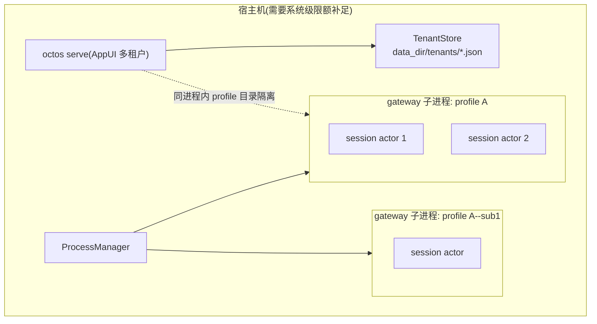
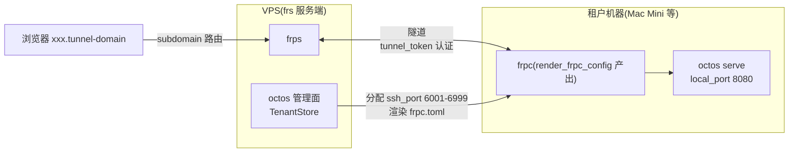
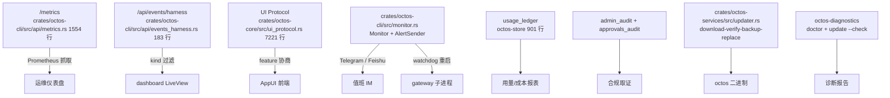

# Chapter 15: Production: Storage, Services, the Operations Plane, and Multi-Tenancy

> **Positioning**: This chapter analyzes the three pieces of infrastructure octos extracted on its way from a development tool to a production system: octos-store (persistence), octos-services (support services), and octos-diagnostics (diagnostics), plus tenant isolation and the frpc tunnel deployment path. Prerequisite: Chapter 14 (runtime modes). Intended readers: operators who need to deploy octos in production (reader D), and developers who want to see how a giant CLI crate can be split safely (reader B).

A system that runs and a system you can hand to someone else to operate for years are separated by a batch of unglamorous machinery: where credentials are stored, how audit trails are kept, how usage is metered, how failures are diagnosed, how tenants stay invisible to one another. No user ever asked for any of these features, but without any one of them the deployment stops one day.

octos reached production through three extractions. The first pulled the persistence code scattered across `octos-cli` into octos-store; the second pulled out support services as octos-services; the third pulled diagnostics and the update-planning logic into octos-diagnostics. This chapter follows those three crates, then the four-layer tenant isolation model and the frpc tunnel deployment path, and finally assembles the operations plane (metrics, event streams, alerting, self-update, doctor) into one complete production control plane.

The three authentication flows (OAuth PKCE, device code, paste-token) and the full Hooks lifecycle walkthrough are covered at their old chapter locations; this chapter keeps only the conclusions: credentials are stored in `~/.octos/auth.json` with `0o600` permissions on Unix (`crates/octos-cli/src/auth/store.rs:59-71`); bearer token comparison uses a constant-time implementation to avoid timing side channels (`crates/octos-cli/src/api/router.rs:1124-1233`); for Hooks' shell protocol (stdin JSON + exit code) and circuit breaker, see Chapter 10. The point of this arrangement is to spend the pages on what the extractions actually changed.

---

## 15.1 Why split: the extraction history of three crates

### 15.1.1 The state before extraction

Everything production-related used to live inside `octos-cli`: admin token storage at `crates/octos-store/src/admin_token_store.rs`, the setup wizard state at `crates/octos-store/src/setup_state_store.rs`, the SMTP password at `crates/octos-store/src/smtp_secret_store.rs`, tenant management at `crates/octos-services/src/tenant.rs`, self-update at `crates/octos-services/src/updater.rs`. These were all leaf modules with no dependency on the CLI command layer, yet they compiled and tested alongside thousands of lines of command code.

The problem was dependency direction. These storage modules depended only on serde and the file system, but because they lived in `octos-cli`, they were indirectly bound to the CLI's entire dependency closure. Running a unit test meant pulling in half the crate's build artifacts; reusing audit or install-method probing in another binary (octoscode's doctor, say) meant copying code.

The before/after shape change comes through in three cross-sections. First, dependency edge direction: after extraction, both crates point only at octos-core in the Cargo dependency graph (services additionally at octos-llm and octos-bus), with no edge back to octos-cli; before extraction these modules had no isolation from the command layer, and a one-line change to the `octos serve` AppState definition recompiled all eight stores. Second, test inputs: before the split, testing `AdminTokenStore` meant setting up tempdir fixtures inside octos-cli's test tree; after, the crate ships its own `#[cfg(test)]`, and the tests at the tail of crates/octos-store/src/admin_token_store.rs directly assert the `0o600` permission bits (`crates/octos-store/src/admin_token_store.rs:182`) with no external environment. Third, artifact granularity: tools beyond the CLI binary (diagnostics, reporting, the future CLI-agent adapter) can now link only store/services instead of dragging in the whole CLI. The motivation for extracting octos-diagnostics was more direct still: octoscode's doctor/install_method modules needed the same probes as the octos server, two copies would inevitably drift, so the product-agnostic part sank into a crate and product differences narrowed to the single `ProductSpec` entry point (see the ADR in the crate docs, octoscode#182).

### 15.1.2 octos-store: the persistence layer, 9 files, 2,664 lines

After extraction, `crates/octos-store/` is a pure persistence crate: 9 source files totaling 2,664 lines (`crates/octos-store/src/lib.rs` at 18 lines plus 8 store modules; line counts come from the facts table's tally against main @ 9c157101). The module docs of `crates/octos-store/src/lib.rs` state the provenance outright: "Self-contained persistence / state stores extracted from `octos-cli`".

| File | Lines | Responsibility | Key symbols |
|---|---|---|---|
| `crates/octos-store/src/admin_token_store.rs` | 184 | salt+hash storage of the admin token | `AdminTokenRecord`(:14) `AdminTokenStore`(:56) |
| `crates/octos-store/src/admin_audit_store.rs` | 270 | admin operations audit (redb) | `AdminAuditStore`(:109) |
| `crates/octos-store/src/approvals_audit.rs` | 414 | approval-decision audit (JSON-Lines append) | `ApprovalsAuditLog`(:119) |
| `crates/octos-store/src/login_allowlist.rs` | 258 | login allowlist (retry with lock) | `LoginAllowlistStore`(:28) |
| `crates/octos-store/src/setup_state_store.rs` | 151 | first-run wizard state | `SetupStateStore`(:24) |
| `crates/octos-store/src/smtp_secret_store.rs` | 133 | SMTP password file | `SmtpSecretStore`(:17) |
| `crates/octos-store/src/usage_ledger.rs` | 901 | usage ledger (redb) | `UsageEvent`(:42) `PersistentUsageLedger`(:323) |
| `crates/octos-store/src/user_store.rs` | 335 | multi-user management (one JSON per user) | `UserStore`(:40) |

Eight stores cover the full state surface of a production deployment: identity (token, user, allowlist), lifecycle (setup), secrets (smtp secret), audit (admin audit, approvals audit), billing (usage ledger). Note that the storage media split into two kinds: simple state uses single-file JSON, while high-append data (usage ledger at 901 lines, admin audit at 270) uses redb, an embedded KV store. That boundary is itself an engineering judgment; see this chapter's sidebar.

Take `crates/octos-store/src/admin_token_store.rs` as the shape of things after extraction. The file's front-page docs state: "Hashed admin auth token stored at `{data_dir}/admin_token.json`. Replaces the static config/env bootstrap token once rotated." The record struct has exactly four fields (`crates/octos-store/src/admin_token_store.rs:14-21`):

```rust
pub struct AdminTokenRecord {
    /// 16 random bytes, base64 (URL-safe, no padding).
    pub salt: String,
    /// sha256(salt_bytes || token_bytes), base64 (URL-safe, no padding).
    pub hash: String,
    pub created_at: DateTime<Utc>,
    pub created_by: String,
}
```

The verify function `verify()` rebuilds the expected hash from the salt, then compares with `constant_time_eq` (`crates/octos-store/src/admin_token_store.rs:39-45`); saving goes through a temp file plus rename, setting `0o600` on Unix (`crates/octos-store/src/admin_token_store.rs:96-104`). Not one line of CLI code is in the file, and the tests run with nothing more than a tempdir.

The largest, `crates/octos-store/src/usage_ledger.rs` (901 lines), is a ledger that records one row per LLM run: the `UsageEvent` struct sits at :42, the redb persistence entry point `PersistentUsageLedger` at :323. One field choice deserves attention: cache-read tokens are recorded separately. The doc comment explains that the prompt totals reported by providers include cache hits, while `TokenUsage` already subtracts the cached portion at the provider boundary, so the complete prompt count is `input_tokens + cache_read_tokens` (`crates/octos-store/src/usage_ledger.rs:52-66`). That makes "how much did caching actually save" a question answerable from historical data instead of a live probe against the API.

### 15.1.3 octos-services: the support-services layer, 8 files, 3,223 lines

The second extraction produced `crates/octos-services/`, 8 source files totaling 3,223 lines. The `crates/octos-store/src/lib.rs` docs likewise name the origin: "Self-contained support services extracted from `octos-cli`". There are 7 modules:

| File | Lines | Responsibility | Key symbols |
|---|---|---|---|
| `crates/octos-services/src/cli_agent_adapter.rs` | 587 | process boundary for a future CLI-agent adapter | `CliAgentProcess`(:145) |
| `crates/octos-agent/src/agent/compaction.rs` | 320 | session compaction | `maybe_compact`(:37) |
| `crates/octos-services/src/config_context.rs` | 698 | the single resolution entry for config/credential/data paths | `resolve_config_context`(:151) |
| `crates/octos-services/src/persona_service.rs` | 479 | periodically generates a communication-style profile | `PersonaService`(:97) |
| `crates/octos-services/src/soul_service.rs` | 139 | per-user personality storage | `read_soul`(:24) |
| `crates/octos-services/src/tenant.rs` | 512 | tenant tunnel management | `TenantStore`(:82) `render_frpc_config`(:255) |
| `crates/octos-services/src/updater.rs` | 473 | self-update: download, verify, backup, replace, rollback | `Updater`(:33) |

The two crates' dependencies were trimmed deliberately: octos-store and octos-services both depend only on octos-core (plus serde/eyre and similar infrastructure); because services must call the LLM and the message bus, it additionally depends on octos-llm and octos-bus (per the Cargo dependency check in facts table §2). In the post-extraction dependency graph both sit in the leaf direction and can no longer infect anyone else with the CLI's weight.

`crates/octos-services/src/config_context.rs` (698 lines) is the module in this batch most worth pausing over. Its docs call it "Canonical config/auth/data path resolver, the single source of truth": every config path, credential path, and data directory path must be resolved through `resolve_config_context`; modules are not allowed to assemble paths on their own. The rule answers an old pain point directly: the same path assembled separately in multiple modules drifts as soon as runtime modes multiply.

### 15.1.4 octos-diagnostics: diagnostics and update planning, 8 files, 2,243 lines

The newest extraction is `crates/octos-diagnostics/`, 8 files, 2,243 lines, landed in two stages: Stage 1 (commit `7f81fa5e`) delivered the crate itself and `octos doctor`; Stage 2 (commit `1801a9e9`) added the GitHub client plus `update --check` and the Network check.

One word recurs throughout this crate's module docs: product-agnostic. It is not octos-specific; the same diagnostic kernel must serve both the octos and octoscode binaries. The seam that makes this reuse work is `ProductSpec` in `crates/octos-diagnostics/src/spec.rs` (173-line file, facts table §3):

> Callers describe their product once via a `ProductSpec`; everything else (install-method labels/upgrade hints, PATH/shadow locating, asset selection) reads from it.

The docs then lay down a hard rule (the "Traps" section of the ADR): **the current version number must be passed in by the caller**. This crate must never read its own `CARGO_PKG_VERSION` to describe the product, or the diagnostic report would print the diagnostics crate's version instead of the diagnosed binary's (`crates/octos-diagnostics/src/spec.rs:7-9`).

The file inventory: crates/octos-diagnostics/src/checks.rs at 400 lines (local checks like terminal environment and config/data directories), crates/octos-diagnostics/src/github.rs at 321 lines (blocking GitHub Releases client), crates/octos-diagnostics/src/install_method.rs at 505 lines (install-method probing), crates/octos-diagnostics/src/locate.rs at 278 lines (PATH resolution and shadow detection), crates/octos-diagnostics/src/report.rs at 312 lines (report model, `CheckStatus`/`Check`), crates/octos-diagnostics/src/spec.rs at 173 lines (the `ProductSpec` seam), crates/octos-diagnostics/src/update.rs at 198 lines (semver parsing and a pure-function update planner).

### 15.1.5 The extraction criterion

Put the three crates side by side and the extraction criterion is stable: a module that does not depend on the CLI command layer, has independent test value, or needs reuse by a second binary is a candidate. Conversely, code that depends on AppState or routing (handlers, middleware) stayed in octos-cli and did not move. That is a reusable boundary: split by dependency direction, not by domain noun.

> **Engineering decision**: redb or JSON files?
>
> Two storage media coexist in octos-store: login/setup/admin_token/smtp_secret/user are single-file JSON, while usage_ledger and admin_audit use redb. The choice follows the write shape. The former are small states read and written whole: one file per dataset, human-readable, backup is file copy. The latter are append-only streams read by query predicate; appending to a JSON file either rewrites the whole file or degenerates into hand-rolled indexing, and redb's persistent B-tree lands exactly in between. When deciding the medium for a new store, ask the write shape first, then the data volume, and only then query complexity.

---

## 15.2 Multi-tenancy: four layers of isolation

octos multi-tenancy is not a tenant ID field; it is an isolation model stacked from four layers: Profile, Account, User, Session. The distribution of tenancy vocabulary across the code tells that story plainly: the word `tenant` hits 2,261 times under crates/, and the top file is not any tenant module but `crates/octos-cli/src/autonomy/agent_orchestrator.rs` (921 hits), followed by crates/octos-cli/src/api/admin.rs (138), crates/octos-cli/src/api/auth_handlers.rs (130), and crates/octos-cli/src/api/ui_protocol_transport.rs (102) (grep tallies from facts table §4). The tenant concept has soaked into orchestration, the admin API, authentication, and transport alike.

### 15.2.1 Where the boundary is defined

The isolation rules are defined at `crates/octos-core/src/session_scope.rs:46-68`. The docs are blunt: in multi-tenant mode (`octos serve` + the AppUI web client), multiple tenants share one octos process, each with its own profile directory `<config_dir>/profiles/<tenant_id>/`; cross-tenant access is rejected unconditionally; cross-session writes are rejected at the workspace layer; cross-session reads require an explicit user action (`/resume`, `recall`), with no implicit CWD scanning. Solo mode (`octos chat`) has no tenant boundary: session and workspace merge into the user's chosen CWD, and cross-session continuity is a feature.

### 15.2.2 Sub-accounts: what is inherited, what is not

Beneath tenants sits a sub-account layer. The creation entry is `create_sub_account` (`crates/octos-cli/src/profiles.rs:2048`), with three rules: the parent profile must exist; the parent must not itself be a sub-account (no multi-level nesting); the count is capped by `MAX_SUB_ACCOUNTS_PER_PARENT = 10` (`crates/octos-cli/src/profiles.rs:16`). Sub-account IDs look like `{parent_id}--{sub}`; on creation `config.llm` is set to None (`crates/octos-cli/src/profiles.rs:2092` vicinity), to be resolved through inheritance at runtime.

Inheritance happens in `resolve_effective_profile` (`crates/octos-cli/src/profiles.rs:2403-2450`), with rules in three tiers by field:

```rust
// Inherit the LLM contract from parent.
ec.llm = pc.llm.clone();
if ec.review.is_none() { ec.review = pc.review.clone(); }
// ...(search / deep_crawl / apps / email / tool_policy 同为 None 才继承)
// Merge env_vars: parent as base, sub-account overrides win
let mut merged_env = pc.env_vars.clone();
merged_env.extend(ec.env_vars.clone());
ec.env_vars = merged_env;
```

Tier one is `llm`: unconditional wholesale override; the parent's LLM contract is the child's LLM contract. Tier two is review/search/deep_crawl/apps/email/tool_policy: inherit only when the child leaves the field unset (None); if the child sets it, the child wins. Tier three is `env_vars`: the parent is the base, the child's same-named variables override, then merge.

One thing is explicitly not inherited: customer-installed skills. A sub-account's skills directory is resolved strictly against the current account and does not travel along `resolve_effective_profile`'s config inheritance chain (facts table §4 cites the skills layer semantics at `crates/octos-cli/src/profiles.rs:360-407`). The security implication is plain: a skill installed in the parent account does not mean every sub-account automatically gains the ability to execute it.

The mental model for this layering: the parent account provides the shared capability contract (LLM, search, email policy); sub-accounts provide the access surface and differentiated overrides (channel credentials, public subdomains, a handful of environment variables). Inheritance is explicit and per-field; "a sub-account is implicitly equal to its parent" is not a semantics that exists here.

### 15.2.3 The session actor and process-level isolation

Concurrency isolation inside one process falls to the session actor: the docs at `crates/octos-cli/src/session_actor.rs:1-3` describe an actor with one tokio task per session replacing the old spawn-per-message model; on the gateway side, `crates/octos-cli/src/commands/gateway/profile_factory.rs:1-4` builds a dedicated `ActorFactory` per profile, carrying its own LLM stack, tool registry, skills, and system prompt.

This replacement fixed a specific race, and the file's front-page docs name it: in the old spawn-per-message model, shared tools switched session context via `set_context()`, so when two messages arrived concurrently, the later set_context could route the earlier message into the wrong chat (the comment at crates/octos-cli/src/session_actor.rs:1-4, verbatim). The actor model's answer changes "who owns the tools" from shared mutable state to per-task private state: messages enter a mailbox, the task processes them serially, and context no longer survives across messages. The isolation boundary thus goes from "convention" to "structure": two sessions share no tool registry instance, so misrouting has nowhere to happen at the type level. profile_factory adds a layer on top: when a message arrives addressed to a specific profile (a Matrix sub-bot, say), it builds right there a factory carrying that profile's own LLM stack and tool registry, so a sub-account session gets a runtime fully independent of the parent's.

Process-level isolation is a second path: in process-manager mode, each profile launches its own `octos gateway` child process, with configuration passed via `--profile`, `--data-dir`, `--cwd`, and similar arguments. The two layers are not mutually exclusive; the production management plane usually goes through process-manager.

The limit of the isolation layers must be stated plainly as well: even split into child processes, without cgroups or system-level quotas, one profile's CPU or memory pressure still affects other profiles on the same host. The process boundary blocks filesystem and configuration cross-talk, not resource contention. When capacity-planning a multi-tenant host, system-level measures must be added separately.



**Figure 15-1: tenant and process, two layers of isolation.** Inside the serve process, isolation is per-profile directory; under process-manager, each profile additionally gets its own gateway child process; the resource boundary needs system-level quotas to complete.

---

## 15.3 The deployment path: frpc tunnels

To land multi-tenancy on a real deployment, octos chose an frp tunnel scheme. The vehicle is `crates/octos-services/src/tenant.rs` (512 lines), whose module docs describe "Tunnel tenant management for self-hosted Mac Mini deployments". The overall topology: the management plane runs on a VPS, each tenant's octos instance runs on its own machine, and frp tunnels connect the two.

### 15.3.1 TenantConfig and the port pool

The core tenant-config struct sits at :23, with fields id (slug), subdomain (the tunnel subdomain), tunnel_token (per-tenant tunnel token, a UUID), ssh_port (the SSH tunnel port allocated on the VPS side), local_port (the serve port on the tenant's machine, default 8080), auth_token, owner, and status timestamps.

The port pool is an explicit constant (`crates/octos-services/src/tenant.rs:14-15`):

```rust
pub const SSH_PORT_START: u16 = 6001;
pub const SSH_PORT_END: u16 = 6999;
```

The allocation algorithm is `next_ssh_port` (:185-194): list existing tenants, collect occupied ports, find the first free port sequentially from 6001, and error out when the pool is exhausted. The query family has four entries, `find_by_tunnel_token`(:197), `find_by_subdomain`(:203), `find_by_ssh_port`(:209), `find_by_owner`(:219), serving tunnel authentication, subdomain routing, port deduplication, and owner-scoped listing respectively.

The tenant ID validation is also worth a look: the test cases cover rejecting empty IDs, uppercase, leading/trailing hyphens, and path traversal (`../etc`, `..`, `foo/bar`, `.hidden` all rejected; the test group around `crates/octos-services/src/tenant.rs:270-310`). Because tenant IDs get concatenated directly into profile directory paths and file names, ID validation is the first gate of path safety.

### 15.3.2 render_frpc_config: template substitution

The tunnel-config generation entry sits at :255:

```rust
pub fn render_frpc_config(
    tenant: &TenantConfig,
    frps_server: &str,
    frps_port: u16,
    tunnel_domain: &str,
    frps_token: &str,
) -> String {
    let template = include_str!("../../../scripts/frp/tenant-frpc.toml.template");
    template
        .replace("{{FRPS_SERVER}}", frps_server)
        .replace("{{FRPS_PORT}}", &frps_port.to_string())
        .replace("{{FRPS_TOKEN}}", frps_token)
        .replace("{{SUBDOMAIN}}", &tenant.subdomain)
        .replace("{{LOCAL_PORT}}", &tenant.local_port.to_string())
        .replace("{{SSH_REMOTE_PORT}}", &tenant.ssh_port.to_string())
        .replace("{{TUNNEL_DOMAIN}}", tunnel_domain)
}
```

The implementation is a compile-time-embedded TOML template plus placeholder substitution, with seven placeholders covering the frps server, port, token, subdomain, local port, remote SSH port, and tunnel domain. `include_str!` ships the template inside the binary, so deployments need no extra template file. The use of tunnel_token is spelled out in the `TenantConfig` field comment: it serves as frpc.toml's `auth.token`, and the frps plugin validates `md5(tunnel_token + timestamp)` at the Login stage (`crates/octos-services/src/tenant.rs:29-30`).



**Figure 15-2: tenant tunnel deployment.** The management plane on the VPS maintains the TenantStore, allocates a subdomain and an SSH remote port per tenant, and renders the frpc config; the serve instance on the tenant's machine is exposed through the frp tunnel.

The scheme fits self-hosted small-scale deployments: one machine per tenant, with the management plane centrally allocating subdomains and ports. Scale further and the model, a port pool capped at 999 tenants and one tunnel per tenant, needs a redesign.

---

## 15.4 The operations plane: metrics, event streams, alerting, self-update, diagnostics

Assembling the three crates with the API layer yields a complete operations plane. Ordered from "reading state" to "acting to fix": Prometheus metrics and the harness event stream do the observing, monitor does alerting and restarts, updater and doctor do the repair.

### 15.4.1 Prometheus metrics: single process and multi-source aggregation

The metrics endpoint lives in `crates/octos-cli/src/api/metrics.rs` (1,554 lines), and the core is a few lines: `metrics_handler` renders text from the global `PrometheusHandle` (:29-34), and the handle is registered once in `init_metrics`(:18). The instrumentation entries split by event type: `record_tool_call` (tool-call counts and durations, :929), `record_llm_tokens` (token counts, :937), `record_routing_decision` (routing decisions, :947).

The bulk of the file is not exposing metrics but aggregating them: the `OperatorSummary` family (:106-139) scrapes /metrics from multiple gateway child processes and merges them into an operator digest. One detail leaks out of `OperatorSummaryCollection`'s field design: misconfigured gateways are listed separately as `configuration_error_gateways`, deliberately excluded from `running_gateways`, with a comment explaining that a broken config must not be read as a live process. In a multi-process deployment, "which profiles are alive, which carry an API port, how many scrapes failed" is the first screen of data an operator needs.

The design criterion behind the aggregation sits in `build_operator_summary_from_sources`(:139-193): the input is not a database but already-scraped `metrics_text`, which the function first runs through `parse_metric_samples`, then buckets by `source.scope == "gateway"`: only running gateways count toward api_port stats and scrape_failures, non-running ones go down a separate configuration_error branch (:161-178). The aggregation layer trusts no single signal: process alive (the process manager's running bit), API port present, scrape succeeded, samples non-empty, four conditions recorded independently. A gateway can be running but scrape failed (process up, metrics endpoint dead), or have an api_port but empty samples (endpoint up, instruments never registered). In troubleshooting, these four columns locate which layer the problem is in, instead of returning a single "unhealthy". This criterion also explains why the aggregation logic lives in crates/octos-cli/src/api/metrics.rs rather than on the Prometheus side: cross-process running state is known only to the process manager; Prometheus cannot scrape a process that should be alive but never came up.

### 15.4.2 The harness event stream: typed SSE

`crates/octos-cli/src/api/events_harness.rs` (183 lines) provides `GET /api/events/harness`: it subscribes to a shared EventBroadcaster and forwards frames as SSE; an optional `kinds` query parameter filters by the frame's `kind` field, case- and underscore-insensitive for compatibility with existing callers. The file-header comment preserves a piece of history: this endpoint was once described as a dashboard invariant yet was never registered in the router, so requests fell through to the static-file fallback returning a 307 redirect, trapping Playwright's apiRequestContext in a redirect loop until a regression test caught it and registration was added. Authentication inherits user_auth_middleware (admin Bearer or authenticated session); the handler only reads.

### 15.4.3 UI Protocol: capability negotiation as a gate

Front-end control goes through the UI Protocol (`crates/octos-core/src/ui_protocol.rs`, 7,221 lines). The negotiation mechanism is `for_negotiated_features` at :1658-1700: the requested feature list is intersected with the server's known registry, unknown features dropped; method-level gating matches the feature set, so `task/list`, `task/cancel`, `task/restart_from_node` appear in `supported_methods` only after `harness.task_control.v1` is negotiated (constant at :113). The comment gives the reason: if you advertise a method without advertising the feature, clients will call it and be rejected with `method_not_supported`; better for the two sides to agree.

`first_server_slice`(:1630) is the compatibility baseline with no feature header: V2 capabilities are known to the server but left out of the first response, otherwise the byte-level `session/open` response seen by old clients would change. The compatibility-versus-evolution tradeoff here: new capabilities appear only when explicitly requested.

### 15.4.4 monitor: alerting and watchdog

The `Monitor` at `crates/octos-cli/src/monitor.rs` (518 lines), :120, holds the profile store, process manager, alert channel, and toggles; `run()`(:164) starts the loop, `add_sender`(:159) registers senders, with built-in `TelegramAlertSender`(:357) and `FeishuAlertSender`(:390). It merges "someone must know when a process dies" and "try to bring it back up" into one component: health checks poll at `health_interval`, restart attempts are bounded by `max_restart_attempts`, alerts fan out to IM through the senders.

### 15.4.5 updater and doctor: two repair paths

Application-level self-update lives in `crates/octos-services/src/updater.rs` (473 lines), with the flow in `update`(:140): download, then verify, then backup, then replace, with rollback on failure. `check_latest`(:76) queries GitHub Releases; `Updater::new` supports `GITHUB_TOKEN` environment-variable authentication (:40-49).

The diagnostics path is independent of updating: `octos doctor` runs octos-diagnostics' check set (terminal environment, config/data, PATH/shadow, network) and produces a report in `[✓]/[!]/[✗]` form, with JSON support-bundle output; `update --check` goes through Stage 2's GitHub client and pure-function planner (the `plan` in crates/octos-diagnostics/src/update.rs) to compare semver, reporting only, never executing. Together the two paths cover "confirm the environment before upgrading" and "the upgrade itself".



**Figure 15-3: the operations plane at a glance.** The observation channels (Prometheus, SSE, UI Protocol) are read-only; the action channels (monitor restarts, updater replacement, doctor reports) each own one segment; storage and audit land in octos-store.

### 15.4.6 Control-plane state files

Finally, list the persistent state a serve process holds as a deployment checklist, all under data_dir: `admin_token.json` (admin credential, salt+hash, 0600), `setup_state.json` (wizard progress), `smtp_secret.json` (SMTP password, replacing the environment variable), `tenants/*.json` (tenant configs), `users/*.json` (users), `usage_ledger.redb` (usage), `approvals-*.log` and admin audit (audit). Deploying a serve instance means deploying the lifecycle of this set of files: backup policy, permissions, and rotation (approval logs default to 10 MiB rotation with 90-day retention, `crates/octos-store/src/approvals_audit.rs:23-27`) must each be provisioned.

> **Engineering decision**: why does smtp_secret get its own file?
>
> The most common way to store an SMTP password is an environment variable inside a launchd plist or systemd unit. The problem with that is not encryption strength but exposure: unit files are usually world-readable, land in configuration repositories, and get scooped up incidentally by `ps e` and crash dumps. The front-page docs of `crates/octos-store/src/smtp_secret_store.rs` name this motivation directly (replacing the `SMTP_PASSWORD` environment variable). The single-file approach narrows the secret to one 0600 file under data_dir, leaving only host/port/username in the configuration repository. The same reasoning applies to other secrets: environment variables suit passing launch parameters, not storing secrets long-term.

---

## 15.5 Boundaries with neighboring chapters

The storage and services this chapter covers are horizontal infrastructure, and a few boundaries are easy to confuse with the specialist chapters: the full security picture (fail-closed sandbox, injection defense, WorkerGrant) is Chapter 7, and this chapter only cites its conclusions (constant-time admin token comparison); the Harness event ABI, validators, and schema versioning are Chapter 10, and this chapter's harness SSE is their transport-layer consumer; runtime modes and the configuration system are Chapter 14, and this chapter's serve control plane is built on top of them; the 26-crate map in Chapter 1 gives the three crates' position in the global dependency graph, all hanging under octos-core and beside octos-cli. Also, the agent lifecycle, goal/loop primitives, and supervisor persistence mentioned in the spec belong to the orchestration substrate, the subject of Chapter 18; this chapter only brushes past it in the tenancy hit counts of crates/octos-cli/src/autonomy/agent_orchestrator.rs and does not expand.

## 15.6 Chapter recap

1. Three extractions: octos-store (9 files, 2,664 lines, persistence), octos-services (8 files, 3,223 lines, support services), octos-diagnostics (8 files, 2,243 lines, diagnostics and update planning); the criterion is dependency direction and reuse needs, not domain nouns.
2. Multi-tenancy in four layers: Profile directory isolation, explicit sub-account inheritance (llm inherited wholesale, the rest only when unset, env_vars merged), User file isolation, Session actor isolation; process-level isolation goes through process-manager, and resource quotas need system-level help.
3. frpc tunnels: TenantStore manages the port pool (6001-6999) and subdomains; `render_frpc_config` renders per-tenant configs from a compile-time-embedded template.
4. The operations plane: Prometheus multi-source aggregation, typed SSE event streams, UI Protocol negotiation gating, monitor alerting and watchdog, updater's five-step self-update, doctor's two-stage diagnostics.
5. Control-plane state files are the heart of the deployment checklist: backup, permissions, and rotation each provisioned in turn.

---

## Further reading

- **The frp project**: https://github.com/fatedier/frp, the underlying forwarding tool the tunnel scheme in crates/octos-services/src/tenant.rs depends on
- **redb**: https://github.com/cberner/redb, the embedded KV store octos-store uses for the usage ledger and admin audit
- **Prometheus text format**: https://prometheus.io/docs/instrumenting/exposition_formats/, the wire protocol that crates/octos-cli/src/api/metrics.rs renders and OperatorSummary parses
- **RFC 7636 (PKCE)**: https://datatracker.ietf.org/doc/html/rfc7636 — the challenge mechanism of the three authentication flows

## Exercises

1. usage_ledger uses redb; user_store uses single-file JSON. If admin_audit's write volume grew a hundredfold, would you keep redb or bring in a standalone database? What is the deciding criterion?
2. `resolve_effective_profile`'s inheritance has three tiers (inherit-when-None, unconditional inheritance, merge). To add a field where "parent disabled means child must be disabled," which tier does it belong in? How should the field's semantics be written so as not to conflict with the existing three?
3. The port pool caps at 999 tenants. If you moved to sharded VPSes, which TenantStore method signatures would have to change? What race does `next_ssh_port`'s sequential allocation have under concurrent creation?
4. The UI Protocol refuses to advertise methods whose features were not negotiated, and the comment's reason is avoiding method_not_supported. If you flipped it (advertise all methods, reject at runtime), which clients would be hurt, and how?

---

> **Version note**: This chapter analyzes octos main @ `9c157101` (committed 2026-09-02, re-verified 2026-09-03). Relative to the old Chapter 14: the three stores moved from octos-cli to `crates/octos-store/`, the multi-tenant implementation moved to `crates/octos-services/src/tenant.rs` (`render_frpc_config` :255 is the new deployment path), and diagnostics became its own `crates/octos-diagnostics/` (Stage 1 `7f81fa5e`, Stage 2 `1801a9e9`). The chapter number changed from 14 to 15; the three authentication flows are covered in 15.1, and Hooks in Chapter 10. All line numbers come from the facts table `assets/ch15-facts.md` or this session's read-only verification against the source.
