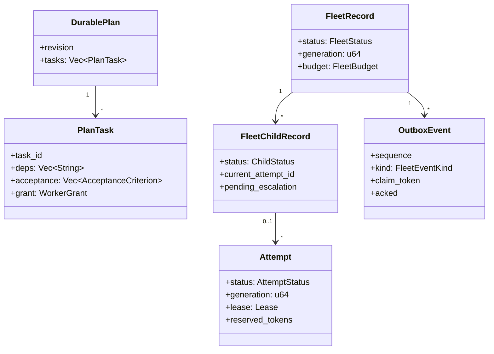
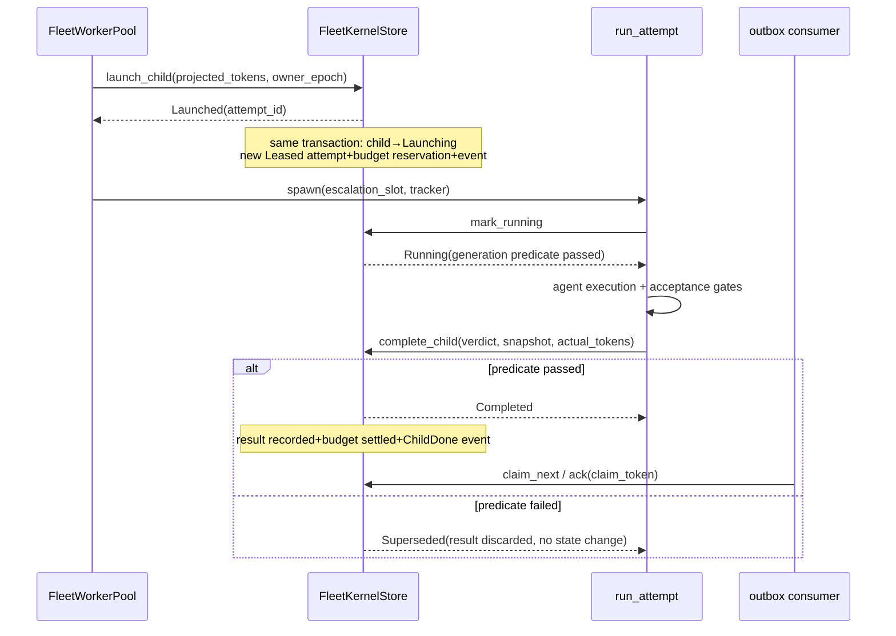
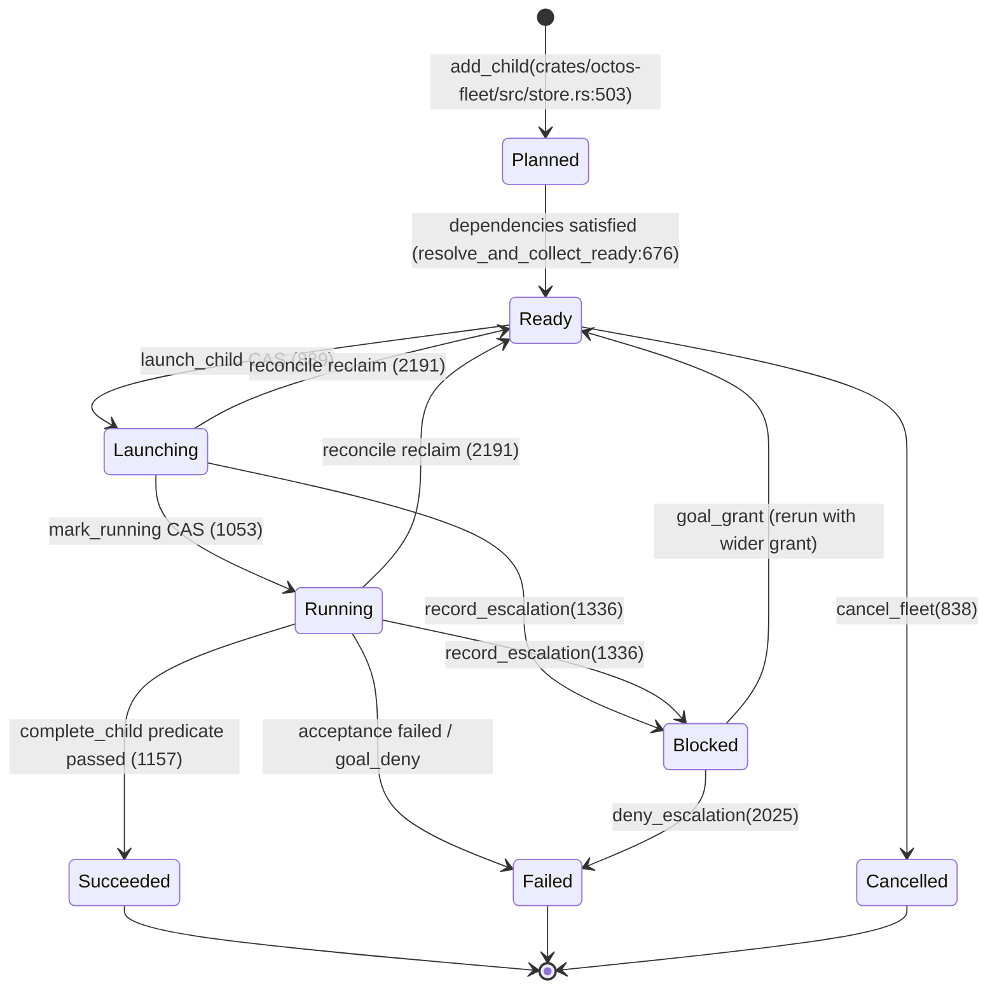

# Chapter 16: Fleet: A Recoverable Plan-Execution Kernel

> **Positioning**: This chapter covers the fleet kernel added in v2: how `crates/octos-fleet` (7 files, 16,888 lines) and `crates/octos-fleet-worker` (6 files, 6,842 lines) use redb transactions, the attempt/lease/generation state machine, and a durable outbox to move the execution progress of a set of long-horizon tasks out of the conversation context and into recoverable storage. Prerequisites: Chapter 7 (WorkerGrant capability grants), Chapter 12 (the supervisor event ledger and leases). Who should read it: developers building multi-agent orchestration runtimes, and anyone curious how "resume after the process crashes" gets engineered.

## 16.1 Where Execution State Lives

Chapter 18's goal feature drives a durable objective forward inside a single agent's conversation. Conversations get compacted, compaction is lossy, so the objective's execution state, the plan, the decisions, what is done, what remains, drains away as the task grows long. The objective still hangs on the system prompt while its progress rots. That is the failure mode named in the opening of `docs/FLEET-RUNTIME-ADR.md` (176 lines): objective survives, progress rots.

When that ADR was written, the repository already held three orchestration stacks that knew nothing about each other: peers are persistent interactive sessions, octos-swarm batch-dispatches to external one-shot agents, and octos-pipeline is the DOT-graph workflow engine (Chapter 13). Building goal directly on top of peers would have produced a fourth incompatible ledger, budget, retry, and lifecycle model. The ADR decided to build a shared durable kernel first: the task-state ledger, budget reservation, state machine, and acceptance gates all live in the kernel, while batch, DAG, and dynamic-forming fleets exist as planners on top of it. Workers come in two kinds; one-shot task workers landed first, dockable session workers were left for a later phase. This chapter's two crates are that kernel, specified in `docs/FLEET-KERNEL-V1-SPEC.md` (347 lines) and `docs/FLEET-KERNEL-FOUNDATION-SPEC.md` (219 lines).

"Progress rot" is not an abstract worry; it maps onto concrete objects. A goal's plan is a task list, its decisions are a set of reasoned judgments, its progress is "which task is at which step." If those three things live only in conversation history, one compaction can lose the conclusions of an intermediate task, and on retry the agent can only guess from a summary. The kernel materializes them as rows in redb: the plan is a `DurablePlan` in the `plans` table, decisions are append entries in `decision_log`, progress is the status fields of child and attempt rows. The conversation can compact freely; rows stay. Retry does not guess; it reads the table. That is the full meaning of "recoverable" at the data layer. The next three sections cover how these rows stay consistent under concurrency and crashes.

Scale and division of labor of the two crates:

| crate | Files | Lines | Responsibility |
|---|---|---|---|
| octos-fleet | 7 | 16,888 | Durable transactional kernel: records, CAS transitions, budget, outbox, recovery |
| octos-fleet-worker | 6 | 6,842 | The execution half: closed tool registry, one-shot attempt runner, bounded pool, escalate valve |

The module docs of `crates/octos-fleet/src/lib.rs` draw a hard boundary: this crate depends only on redb, serde, tokio, uuid, eyre, and octos-core, zero LLM dependencies, zero octos-agent dependencies, and every behavior can be unit-tested against a redb in a tempdir. The dependency complexity of the execution side is pushed wholesale into the worker crate.

The chapter runs along three pillars: the record model (16.2), transactions and the outbox (16.3), the state machine and recovery (16.4). Then we look at assembly and execution on the worker side (16.5, 16.6), and close with the `Fleet` surface and the boundary to neighboring chapters.

## 16.2 The Record Model: Everything Hits Disk First

The kernel's world is six redb tables, all defined in `crates/octos-fleet/src/store.rs:46-51`: `fleets` (fleet rows), `fleet_children` (child-task rows), `attempts` (attempt rows), `plans` (durable plans), `decision_log` (an append-only decision log), `outbox` (the event outbox). Keys are strings, values are JSON. Record types live in `crates/octos-fleet/src/records.rs` (808 lines); the key anchors:

| Symbol | Line | Contents |
|---|---|---|
| `SCHEMA_VERSION = 3` | crates/octos-fleet/src/records.rs:33 | Version tag carried by every row |
| `FleetBudget` | crates/octos-fleet/src/records.rs:119 | `token_budget` / `tokens_reserved` / `tokens_committed` / `hard` |
| `FleetRecord` | crates/octos-fleet/src/records.rs:145 | fleet row; carries the `generation` fence and keeper-wake metadata (:152) |
| `Lease` | crates/octos-fleet/src/records.rs:250 | `owner_epoch` + `expires_at_ms` |
| `Attempt` | crates/octos-fleet/src/records.rs:256 | attempt row; carries `generation` and `lease` |
| `DurablePlan` | crates/octos-fleet/src/records.rs:313 | plan; contains `PlanTask`:333, `AcceptanceCriterion`:356, `Verifier`:367, `EvidenceRef`:378 |
| `OutboxEvent` | crates/octos-fleet/src/records.rs:524 | durable event, `FleetEventKind`:545 |

The plan task is the heart of the whole model. A `PlanTask` carries more than a title and dependencies: it has an `acceptance` list of acceptance criteria and a per-task `grant` (a worker-level capability grant; `#[serde(default)]` makes old rows default to minimal permissions). Acceptance criteria are defined by `Verifier`, currently four kinds: `Manual`, `FileExists`, `CommandExit`, `ValidatorRef`. "Done" is data plus a verifier, not a boolean. `EvidenceRef` content-addresses the evidence (`sha256`), so the acceptance assertion cannot drift from what was actually observed.



**Figure 16-1: The record model.** The plan describes intent, child and attempt rows record execution, budget and generation hang on the fleet row, and the outbox handles outward notification.

The version-migration policy deserves its own paragraph. Every persisted row carries `schema_version`; loading discards only rows with a higher version (the high-version guard at crates/octos-fleet/src/records.rs:571), so an old binary encountering a new row drops what it does not recognize and never misparses it. The reason `SCHEMA_VERSION` went from 2 to 3 is in the comment at crates/octos-fleet/src/records.rs:25: PR B added a `Blocked` variant to `ChildStatus`. Adding a field is forward-compatible via `#[serde(default)]` and does not count as an upgrade; adding an enum variant is a breaking change, an old binary decoding `"Blocked"` gets an unknown-variant error instead of skipping gracefully, so the version must be raised and old binaries discard such rows as higher-version.

That criterion generalizes to every persistent schema, so it is worth unpacking. Adding a field widens the row: old code does not see the new key, serde fills in a default, the data survives, only the new feature is invisible. Adding an enum variant widens the value domain: old code's match has no such branch, deserialization fails outright, and it fails during whole-row decode, so one bad row drags down an entire scan. octos narrows the failure granularity to the row: the version guard probes only `schema_version` before full decode (the VersionProbe structure in crates/octos-fleet/src/records.rs), higher-version rows are dropped as `Ok(None)`, and the scan continues. The cost is lost data, but what is lost is "rows only a new binary can understand", an old binary could never handle them correctly anyway. Dropping is equivalent to blindness, and better than blindness pretending to see.

## 16.3 Transactions and the Outbox: One Write Transaction per Transition

`FleetKernelStore` (crates/octos-fleet/src/store.rs:195) is the transaction-primitive layer. The module docs (crates/octos-fleet/src/store.rs:6-8) fix the shape of every method: within one `begin_write`, read the current row, check the CAS predicate, write the next state; budget settlement and the outbox append happen in the same transaction, so no cross-store window exists. The CAS partition starts at the comment block at crates/octos-fleet/src/store.rs:880, with three core transitions.

`launch_child` (crates/octos-fleet/src/store.rs:889) starts a Ready child. The predicate has four gates: the child must be Ready with no in-flight attempt, the fleet must be non-terminal (the terminal fence added in the #1973 fix round), and the budget must admit. When all pass, one transaction writes the child's `Launching`, a new `Leased` attempt (`AttemptStatus::Leased` at crates/octos-fleet/src/store.rs:997, `Lease{owner_epoch}` at :998), the budget reservation, and one `ChildLaunching` outbox event. Any rejection leaves no half-state: a budget-rejected child is still Ready, never stranded in Launching.

`mark_running` (crates/octos-fleet/src/store.rs:1053) pushes Leased to Running; its four-part predicate includes `attempt.generation == fleet.generation` (crates/octos-fleet/src/store.rs:1122). `complete_child` (crates/octos-fleet/src/store.rs:1157) requires the child to be Running, the generation to match (:1236), and `lease.owner_epoch` to match (:1237); only on success does it write the result and settle the budget. The generation is a member epoch on the fleet row, incremented on replan; late events from an old generation are caught by the fence.

A CAS rejection is modeled as a value, not an error. The `Superseded` variants of `LaunchOutcome` / `CompleteOutcome` / `MarkRunningOutcome` (crates/octos-fleet/src/store.rs:59, 75, 102) are ordinary control flow the caller reasons over; `Err` is reserved for genuine infrastructure failures. Section 16.6 shows where this distinction pays off on the worker side.

The budget settles inside the transaction. `FleetBudget::admits` (crates/octos-fleet/src/records.rs:132) sums with checked arithmetic before comparing:

```rust
pub fn admits(&self, projected: u64) -> bool {
    match self
        .tokens_reserved
        .checked_add(self.tokens_committed)
        .and_then(|s| s.checked_add(projected))
    {
        Some(total) => total <= self.token_budget,
        None => false,
    }
}
```

A sum that overflows cannot be a legal budget, so it is rejected outright; saturating arithmetic would silently let `MAX + MAX + 1 <= MAX` pass as admitted (the P2-5 fix). v1's `hard = false` is soft admission: it rejects the next launch, it does not interrupt an in-flight run.

The outbox answers "the state changed; who gets told". `append_event` (crates/octos-fleet/src/store.rs:2518) appends inside each transition's own write transaction (the comment at crates/octos-fleet/src/store.rs:2806), with four event kinds: `ChildLaunching`, `ChildRunning`, `ChildDone`, `FleetDrained`. The consumption protocol is a real claim/ack: `claim_next` (crates/octos-fleet/src/store.rs:2547) claims the lowest-sequence unacknowledged event, stamps `claimed_by`, mints a fresh `claim_token`, and sets `claim_expires_at`; `ack` (crates/octos-fleet/src/store.rs:2603) must present the matching `(claimed_by, claim_token)` pair, and a mismatch returns `StaleClaim`. This token fence (P1-3) blocks a concrete race: if a consumer's lease has expired and the event has been re-claimed by someone else, the old consumer's late ack cannot pollute the new consumer's progress. The wake rides the MasterContinuationScheduler of Chapter 12; scheduling details are in Chapter 12, keeper semantics in Chapter 18.

The consumer side deserves its own walkthrough, because it completes the outbox's durable semantics into a full loop. `drain_fleet_outbox_once` (:235) in `crates/octos-cli/src/autonomy/fleet_wake.rs` (1,807 lines) is the testable core: it takes a store, a clock, a batch cap, and a `commit_wake` callback, and loops `claim_next` until the queue is empty or the cap is reached. The ack threshold is the two-value enum `WakeCommit` (:70): a wake persisted to disk is `Durable` and can be acked; a wake that lives only in memory, or whose persistence failed, is `NotDurable`, gets no ack, leaves the event in claimed state, and is redelivered automatically when the lease (30 seconds, :56) expires. A wake is never silently lost; the cost is at most one redelivery. The consumer loop `spawn_fleet_outbox_consumer` (:343) ticks every 3 seconds with a per-tick cap of 64 events (:63), so a backlogged outbox can neither monopolize the consumer nor pile up an unbounded continuation queue; the remainder waits for the next tick. Three special branches each carry a number: the #1973 fix round dictates that a cancelled fleet's `ChildDone` is acked without waking (the goal is already cleared; a wake would resurrect a dead controller with stale metadata, while late events for Complete / Failed still wake, letting the keeper self-check completion); a vanished fleet row is also acked directly, so the outbox never sticks on a missing record; non-terminal lifecycle events carry no wake semantics and are acked on claim. The wake content is not a raw event forward: `render_fleet_snapshot` (:99) first reads the plan and the ready set asynchronously and renders a `FleetKeeperSnapshot` (:84; objective, one line per task, the ready id list), so the synchronous prompt renderer only formats and never touches I/O. The fleet-side conclusion: the outbox guarantees event delivery, the consumption ring guarantees durable wakes, and the two layers each own one crash window.

The full timeline of one attempt, from launch to settlement:



**Figure 16-2: The timeline of one attempt.** Each box note is a single write transaction; a failed CAS returns as a value, not through the error channel.

The read-side hazard under cancellation is handled by the `io_gate`: every operation (including decision reads and scans) first acquires the gate's owned guard, then moves the guard into the `spawn_blocking` closure. A cancelled caller's uninterruptible blocking write can therefore never be reordered to land after subsequent reads (the spec v1.1 fix).

> ### Engineering decision: why redb transactions instead of in-memory state plus a log
>
> The alternative is to keep the state machine in process memory, write changes to a log, and replay on restart. It has three gaps. First, the read-decide-write steps are naturally separated in memory; a crash can land between decision and write, and the replayed state then contradicts the assumptions the decision was made under, forcing either compensation logic for every transition or acceptance of dirty state. Second, budget settlement is a read-modify-write; an in-memory scheme needs its own locking protocol, and that protocol itself has to survive crash testing. Third, multi-table consistency (fleet row, child row, attempt row, outbox) has no native answer without two-phase commit or an acceptance window. redb's single write transaction closes all three gaps at once: every write inside one `begin_write` becomes visible together or not at all, and crash recovery is delegated to the storage engine. The cost is that all access serializes, which is no bottleneck for the fleet kernel: its write rate is set by task lifecycles, not by any hot path. `docs/FLEET-KERNEL-V1-SPEC.md` names this shape one-write-transaction CAS and records that it was lifted verbatim from octos-swarm's redb persistence layer.

## 16.4 The State Machine and Recovery Coordination

Three state layers each own one segment: the fleet as a whole is `FleetStatus` (Active / Draining / Complete / Failed / Cancelled, crates/octos-fleet/src/records.rs:41-47); a child task is `ChildStatus` (Planned / Ready / Launching / Running / Blocked / Succeeded / Failed / Cancelled, crates/octos-fleet/src/records.rs:64); an attempt is `AttemptStatus` (Leased / Running / Done / Interrupted, crates/octos-fleet/src/records.rs:94). `Blocked` is the non-terminal state PR B added: the attempt yields to request a wider grant and waits for the keeper's decision (16.5).



**Figure 16-3: The child state machine.** Every edge lands on one CAS method in crates/octos-fleet/src/store.rs; the reconcile reclaim edges fire only on lease expiry or a foreign epoch.

Recovery coordination is `reconcile` (crates/octos-fleet/src/store.rs:2191; the report type `ReconcileReport` is at :160). At startup it scans every Launching / Running child with the current `owner_epoch` and the clock: a live fleet's attempt is reclaimed only when its lease is invalid (a foreign `owner_epoch`, or `expires_at_ms` already past); a terminal fleet's in-flight attempt is settled unconditionally (the #1973 fix round: before it, Cancelled fleets were skipped wholesale, pinning their attempts and budget reservations forever). The reclaim action is one transaction doing three things: the attempt is recorded `Interrupted`, the attempt's reservation is released from the fleet budget (`checked_sub`; an underflow means the accounting invariant is broken and errors immediately), and the child's `current_attempt_id` is cleared. A live fleet's child returns to Ready and waits for this startup to launch it again; a terminal fleet's child is recorded Cancelled and never revives (P2-7). An old attempt never comes back to life; a rerun always opens a new attempt.

Plan revision goes through a revision CAS: `replan` (crates/octos-fleet/src/store.rs:1512) carries `expected_revision`, increments the revision, and syncs each task's declared dependencies into the denormalized copy on the child rows; `retitle_task` (:1804) and `set_task_grant` (:1898) follow the same shape. The decision log (`append_decision`:2648, `list_decisions`:2697) appends by sequence number. `DecisionKind` is a closed set issued by the kernel, in contrast with the open `kind` string of `Finding` (crates/octos-fleet/src/records.rs:447; one falsifiable claim, with the component field as clustering key): kernel decisions are closed, exploration findings are open.

After recovery comes a second question: how does a restarted keeper learn "what happened before"? Reading every worker's transcript is neither feasible nor meaningful, and `crates/octos-fleet/src/digest.rs` (861 lines) exists as the bounded read side for exactly this. Its front-page doc states the failure mode plainly: the bottleneck of a goal is not a shortage of executors, it is the controller's context window placing a ceiling on problem complexity, and if synthesizing progress means reading every worker's output, the architect degenerates into a clerk relaying messages between workers. So the controller never reads a finding directly; it reads only the output of `digest(findings, opts)` (crates/octos-fleet/src/digest.rs:175), a view whose size does not grow with the project. The design is a pure function: no store, no LLM, no clock; the watermark (`since_seq`, the highest sequence the controller has already synthesized), the current configuration, and the character budget are all inputs, and the whole logic is table-testable. The budget is the design: `max_chars` defaults to 4,000 (crates/octos-fleet/src/digest.rs:56); when over the limit, sections are dropped and the drop is reported honestly (the `Dropped` structure at crates/octos-fleet/src/digest.rs:126 records which section lost how many entries), because silent truncation reads as "nothing more to see", which is worse than an explicitly cut list. Each section sorts newest first and the budget cuts from the tail; the oldest is what gets sacrificed. The output has five partitions: new findings, overturns, stale entries (a finding whose config has drifted from the current build; the `drift` function at crates/octos-fleet/src/digest.rs:156 does the comparison), cluster hints (a component referenced by how many paths; `cluster_min_paths` defaults to 2), and per-path cost, plus the watermark handed back to the controller as the next round's `since_seq`. digest's place in recovery follows: reconcile repairs the ledger back to self-consistency, and digest guarantees that afterwards the controller re-enters at constant cost.

## 16.5 Worker Assembly: The Closed Registry and an Always-On Safety Valve

The worker side's first module answers "which tools can a worker actually use". `build_fleet_worker_registry` (:92) in `crates/octos-fleet-worker/src/closed_registry.rs` (705 lines) starts from an empty registry and assembles the closed tool set per `WorkerGrant.sorted_tools()`; `ALLOWED` (:43) references `octos_fleet::BASE_TOOLS` directly (crates/octos-fleet/src/grant.rs:27). Tools outside the grant do not exist in the registry, so a replay assembles the same result. The four grant types live in `crates/octos-fleet/src/grant.rs`: `NetworkGrant` (:76, None / Hosts / Full), `FsGrant` (:127, Workspace / Host), `WorkerGrant` (:151, network / tools / fs / write_paths / create_only), `GrantError` (:359); `validate()` is at :247. These types match Chapter 7 line for line; semantics and validation rules are covered in Chapter 7, and this chapter only consumes their conclusions.

The module docs of `crates/octos-fleet-worker/src/lib.rs` add a boundary that is easy to misread: the closed registry is a rejection list over tool names, what it removes is docking, fan-out, and web tools; it is not itself a network or process boundary. The surviving `shell` under a Full grant can still reach the network and can still use shell-internal backgrounding to detach a subprocess, which no string check catches. The real boundary is the sandbox and its process-group reaping, which is why `AgentFactory::new` requires the sandbox factory to be passed explicitly and provides no silent empty implementation; passing an empty one is flagged by `tracing::warn!`, and production must supply a network-isolating sandbox. The requirement lives in API documentation; the type system cannot enforce it, and it is the operator's responsibility.

The second module is the escalate valve (`crates/octos-fleet-worker/src/escalate.rs`, 293 lines). When a closed worker lacks a capability (a host, a tool, filesystem access) it can neither widen its own grant nor dock and wait: it calls the `escalate` tool, writes an `EscalationRequest` (the requested grant plus a reason) into a shared slot (`EscalationSlot`:34, `EscalateTool`:37), and returns immediately. After the turn ends, `run_attempt` reads the slot; if it holds a value, it calls `record_escalation` (crates/octos-fleet/src/store.rs:1336, which likewise checks generation :1409 and lease :1410), the child enters `Blocked`, and the keeper decides: `goal_grant` moves the child back to Ready to rerun with the wider grant, while `goal_deny` pushes Blocked to Failed via `deny_escalation` (crates/octos-fleet/src/store.rs:2025). The return type of `deny_escalation` computes `fleet_un_completable` in the same write transaction as a side effect (the design comment near :2094): whether the fleet can no longer complete automatically is derived directly from the post-deny durable state, so the keeper need not repeat a read that could be skipped. The tool is always registered and never gated by the grant: a worker on minimal permissions must still be able to say "I am stuck". The request is advisory, and the keeper may grant less than asked.

## 16.6 run_attempt and the Bounded Pool

`run_attempt` (:177) in `crates/octos-fleet-worker/src/worker.rs` (2,575 lines) executes one attempt, with five terminal states (`AttemptOutcome`:146):

```rust
pub enum AttemptOutcome {
    Completed { verdict: AcceptanceVerdict },
    Superseded,
    Aborted { reason: String },
    RecordError { reason: String },
    Escalated { request: EscalationRequest },
}
```

The first step is `mark_running`, and its two failure modes are handled separately: `Superseded` means the attempt is genuinely not this one's, so it returns `Aborted` and the pool releases its guard; `Err` is an infrastructure failure, the Launching attempt may still be this one's, so it returns `RecordError`, the guard stays armed, and cleanup falls to Drop and recovery coordination. This two-path distinction (the round-4 P1 fix) builds directly on the value-versus-error separation of 16.3. The execution body is wrapped in a hard `tokio::time::timeout`, AgentFactory clamps every per-tool timeout to the deadline, the worker shell has a hard per-command cap, and the acceptance phase is also bound by the remaining time. In worktree mode (`WorktreeContext`:67), a deliverable is defined as a commit on a branch; an empty branch counts as no deliverable.

`FleetWorkerPool` (:109) in `crates/octos-fleet-worker/src/pool.rs` (2,186 lines) is the bounded launcher, configured in `PoolConfig` (:58): global concurrency, per-fleet concurrency, deadline, `owner_epoch`, lease TTL, reserved tokens, workspace root, keeper profile, and whether the backend supports repo writes. `dispatch` (:233) holds a preflight lock on each (fleet, task) pair across the whole span of "liveness check, worktree preparation, launch, spawn"; when two concurrent dispatches target the same Ready task, the loser sees the winner's in-flight attempt and is caught by launch's double-launch rejection. The worktree is a conditional path: only when the grant satisfies both Host filesystem and Full network, the fleet sits on a git repository, and the backend supports `.git` writes, all three true, does it open a real worktree on the task's stable branch, with resumption starting from the dead worker's last commit; any false falls back to a scratch directory. The reasoning for the full-trust threshold is in dispatch's comments: Host filesystem plus restricted network is not real isolation (a full filesystem can bridge any network fence), so full network is simply required, leaving both escape routes meaningless. Commit anchors: `eadee2ae` (#1875) introduced WorkerGrant; `8fc66202` (#1881) landed the worktree worker.

The pool's bound is kept by two semaphores: `global_sem` caps the process-wide total, while the `per_fleet` HashMap creates per-fleet semaphores on demand and never prunes entries (the ceiling is the number of tasks, not the number of runs). This design puts the truth of concurrency control in the pool rather than the kernel: the store's CAS guarantees no duplicates and no losses, but how many run at once, and how many per fleet, is the host's policy choice, which the kernel does not presuppose. A dispatch that cannot get a permit queues on the semaphore and produces no durable state; only real execution goes through launch's transaction. Conversely, after a restart the pool is empty and every permit is naturally available, there is no secondary problem of "the permit table also needs recovery": permits are in-memory semaphores, recovery is done by reconcile against durable state, and the two responsibilities do not overlap.

## 16.7 The Fleet Surface and Boundaries

`Fleet` (:190) in `crates/octos-fleet/src/fleet.rs` (3,062 lines) composes the store's CAS operations into whole-plan APIs over the store: `create` (:210), `bind` (:300), `view` (:324), `ready_tasks` (:375), `apply_edit` (:402), `record_outcome` (:542), `is_complete` (:583), `summary` (:595). It does not change store semantics; it is the surface that the future keeper and the `goal_get` / `goal_update` tools will program against.

The largest file in the crate is not store but `crates/octos-fleet/src/sqlite_ledger.rs` (6,360 lines, a bit more than a quarter of the two crates' combined 23,730), where `GoalLedger` (:13) lands. Why do redb and sqlite coexist in one codebase? The first three comment lines of the file give the reason: redb is a single-writer, single-process model, while SQLite via WAL supports multi-process access, which fits the peer architecture where the master and each peer, as independent processes, share one ledger. The split between the two persistence layers follows the readers: the fleet kernel's six tables (fleet, child, attempt, plan, decision, outbox) are written exclusively by the single serve process, and the single-write-transaction CAS shape fits redb's model exactly; the goal ledger (the goals, tasks, findings, and escalations tables, with the findings table indexed on both goal and task at crates/octos-fleet/src/sqlite_ledger.rs:409-410) is read and written by the keeper, workers, and transition sync alike, so SQL's row-level content addressing (`append_finding`:1623, `list_findings_since`:2132) and index queries are the more natural shape. The GoalLedger at `crates/octos-fleet/src/sqlite_ledger.rs:13` belongs to Chapter 18; we keep one engineering detail here: concurrently opening the same fresh WAL database has a millisecond-scale initialization race (`database is locked`, not covered by the busy handler), so `open` (:222) uses rusqlite's default 5-second busy_timeout, while `open_with_busy_retry` (:245), used only for goal state migration, does 3 bounded retries and squeezes the timeout to 1 second, running only on the blocking thread. The ledger and the store do not replace each other: one owns the multi-process shared goal ledger, the other the single-process exclusive execution state machine.

Swarm's fan-out topology is covered in Chapter 17; the supervisor's event ledger and wake scheduling in Chapter 12; the full WorkerGrant permission model in Chapter 7.

## 16.8 Chapter Recap

1. One kernel carries three topologies: the record model (six tables, `SCHEMA_VERSION = 3` with drop-higher-version policy), transactional CAS (the predicates and value-style rejections of `launch_child` / `mark_running` / `complete_child`), and recovery coordination (`reconcile`'s lease reclaim and never-revive rule), three pillars that move execution progress out of the conversation context and into redb.
2. A CAS rejection is a value, not an error: `Superseded` is control flow, `Err` is reserved for infrastructure failures, and the worker side distinguishes Aborted from RecordError accordingly.
3. Budget and outbox both live in the transition's write transaction: reservation, settlement, and event append have no cross-store window; claim/ack uses the `claim_token` fence to block late acknowledgments from expired consumers.
4. Workers assemble from an empty registry per grant, replay-consistently; the sandbox is the boundary and the registry is only a tool-name rejection list; escalate is always on, and Blocked waits for the keeper's decision.
5. The pool is bounded with serialized preflight: concurrent dispatches of one task are caught twice, by the lock and by double-launch; the worktree needs all three full-trust conditions, otherwise scratch is the fallback.

---

## Further reading

- redb: https://github.com/cberner/redb, the fleet kernel's embedded KV store; single write transactions are the foundation of this chapter's CAS shape
- `docs/FLEET-RUNTIME-ADR.md` (176 lines), the architecture decision record for one kernel, two worker kinds, three topologies
- `docs/FLEET-KERNEL-V1-SPEC.md` (347 lines), the implementation spec for one-write-transaction CAS and io_gate cancellation safety
- `docs/FLEET-KERNEL-FOUNDATION-SPEC.md` (219 lines), the kernel's foundation design, the layer below the ADR

## Exercises

1. `SCHEMA_VERSION` treats adding fields and adding enum variants differently. To add a `Paused` variant to `AttemptStatus` while also adding a `paused_by` field to `Attempt`, which changes need a version bump and which are covered by `#[serde(default)]`? Derive the behavior of an old binary on a new database.
2. The `claim_token` fence blocks late acks from expired consumers. If a consumer crashes before acking, how is the event redelivered? How do `claimed_by` and the token change after redelivery, and what does the old consumer's late ack get in return?
3. `reconcile` settles in-flight attempts of terminal fleets unconditionally and records children Cancelled, never to revive. If it instead returned terminal fleets' children to Ready, which paths would violate which invariants?
4. The worktree path requires Host filesystem and Full network together. To support a network-isolated worktree worker, what attack does the `.git` docking fence mentioned in the comments have to prevent? Why can a full filesystem bypass a network fence?
5. The budget's `hard = false` only rejects the next launch. If it became a hard budget that interrupts in-flight runs, what would `complete_child`'s predicate and `run_attempt`'s terminal enum each need to add?

---

> **Version note**: This chapter is new in v2; the analysis is based on octos main @ `9c157101` (collected and rechecked 2026-09-03). Both crates are new code: `octos-fleet` and `octos-fleet-worker` do not exist in the v1 draft; `WorkerGrant` entered the kernel with `eadee2ae` (#1875), and the worktree worker landed with `8fc66202` (#1881). All line numbers and counts come from the facts table `assets/ch16-facts.md` or from this session's read-only checks against the source; the fleet state machine was forward-referenced by Chapter 12 as "see Chapter 16" in earlier chapters, and this chapter is that destination.
