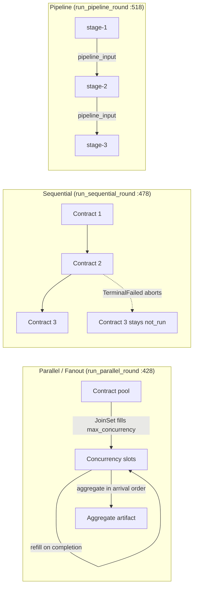
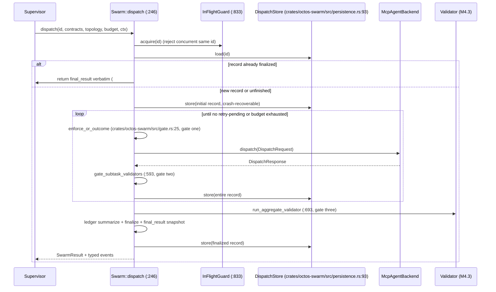
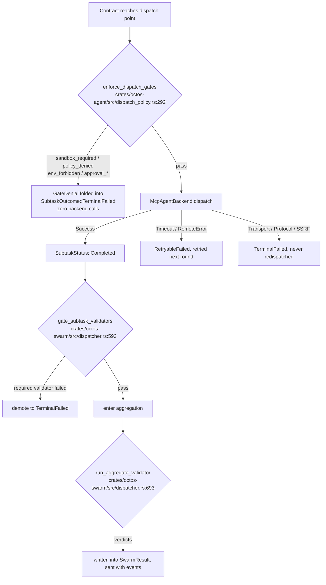

# Chapter 17: Swarm: Contract Fan-out and Aggregation Gates

> **Positioning**: This chapter reads `crates/octos-swarm` and shows how it collapses "a supervisor writes N contracts, distributes them to external agent backends, aggregates the artifacts, and runs them through validation gates" into one re-entrant orchestration primitive: three execution topologies, three gates, one idempotent ledger. Prerequisites: Chapter 10 (validators and the event ABI), Chapter 16 (Fleet). Who should read it: developers who need to delegate a batch of subtasks to external agents such as claude or codex and want results they can trust, costs they can account for, and replays that agree.

The octos harness has always run one pattern by hand: a PM-style supervisor splits work into N pieces, hands them to sub-agents, then compares, merges, and decides re-runs manually. The first line of the `octos-swarm` crate doc says it plainly: `Swarm orchestration primitive for octos (harness M7.5)` (`crates/octos-swarm/src/lib.rs:1`); the next line explains that it formalizes this "PM + swarm supervisor" pattern. The manual pattern hurts in three places: dispatch is unaccountable (no record of who received which task), artifacts are untrusted (a sub-agent says done, and that counts as done), and re-runs diverge (the second execution of the same batch has different boundaries than the first). These three map onto the chapter's three threads: contract fan-out, aggregation gates, idempotency and recovery.

The crate is small: 7 source files at 2,505 lines, 3 integration test files at 2,475 lines, 4,980 lines in total (facts table `assets/ch17-facts.md`, counted against main @ `9c157101` on 2026-09-03). Test lines run nearly level with source (1:0.99), and 36 integration cases cover topology, gates, idempotency, and recovery. That ratio previews the design signal that recurs throughout the chapter: every invariant has a name and a test.

| File | Lines | Responsibility |
|---|---|---|
| crates/octos-swarm/src/dispatcher.rs | 1,261 | Orchestration core: dispatch loop, gates, aggregation, idempotency |
| crates/octos-swarm/src/result.rs | 395 | Typed results: SwarmResult / SubtaskOutcome / AggregateArtifact |
| crates/octos-swarm/src/persistence.rs | 275 | redb persistence: the DispatchStore idempotent ledger |
| crates/octos-swarm/src/topology.rs | 229 | Topology and contracts: SwarmTopology / ContractSpec / FanoutPattern |
| crates/octos-swarm/src/ledger.rs | 115 | Cost ledger adapter (M7.5): CostLedger trait + Noop implementation |
| crates/octos-swarm/src/lib.rs | 111 | Crate facade and re-exports |
| crates/octos-swarm/src/gate.rs | 119 | Gate glue layer: enforce_or_outcome |

## 17.1 Contracts: the smallest unit of fan-out

Everything Swarm knows about "one subtask" fits in one struct. A **contract** (`ContractSpec`, `crates/octos-swarm/src/topology.rs:37`) has four fields:

```rust
pub struct ContractSpec {
    pub contract_id: String,
    pub tool_name: String,
    pub task: serde_json::Value,
    pub label: Option<String>,
}
```

`contract_id` is the stable key for retry deduplication and persistence; the caller must keep it unique within one dispatch. `task` is opaque to the primitive and is forwarded verbatim as the arguments of an MCP `tools/call`. `label` exists only for human-facing operations interfaces and plays no part in correlation. The design compresses "what the primitive needs to know" to the minimum: identity, target tool, payload. What a contract contains and how it is accepted is an agreement between supervisor and sub-agent, and the primitive does not interpret it.

One dispatch has a hard ceiling on total contracts: `MAX_CONTRACTS_PER_DISPATCH: usize = 128` (`crates/octos-swarm/src/topology.rs:27`), enforced at the `dispatch` entry point (`crates/octos-swarm/src/dispatcher.rs:246`). The ceiling guards against unbounded expansion in the fan-out pattern: `FanoutPattern` (`crates/octos-swarm/src/topology.rs:59`) clones one seed contract into N siblings, and `expand` (`crates/octos-swarm/src/topology.rs:72`) appends a `::variant` suffix to each `contract_id` and injects a `variant` field into `task`. The primitive never reads the payload; it stamps it, and the remote agent switches behavior on `variant`. The expanded contract table is produced uniformly by `resolve_contracts` (`crates/octos-swarm/src/topology.rs:133`): the Fanout topology replaces the seed table with the expansion, and the other topologies keep it unchanged.

## 17.2 Three orchestration primitives: Parallel, Sequential, Pipeline

`SwarmTopology` (`crates/octos-swarm/src/topology.rs:98`) has four variants but only three execution shapes (`Parallel` and `Fanout` share the fan-out execution path; they differ only in how the contract table is built). These three are the orchestration primitives: fan-out, sequence, pipeline.

- **Parallel**: `run_parallel_round` (`crates/octos-swarm/src/dispatcher.rs:428`) dispatches retry-pending contracts concurrently on a `JoinSet`, filling `max_concurrency` slots first and backfilling the moment one completes. Aggregation follows arrival order. For $n$ contracts at concurrency $c$, total dispatch wall time is roughly $\lceil n/c \rceil$ backend round-trips; when the backend is slow, concurrency is the only tunable lever.
- **Sequential**: `run_sequential_round` (`crates/octos-swarm/src/dispatcher.rs:478`) runs one contract at a time and stops at the first hard failure (`TerminalFailed`); the remaining contracts stay `not_run`. It fits batches that have order dependence but no artifact consumption, chains like "review the facts table, then the draft, then the citations" where an early failure voids everything after it.
- **Pipeline**: `run_pipeline_round` (`crates/octos-swarm/src/dispatcher.rs:518`) folds contract i's artifact into contract i+1's `pipeline_input` field; a successor is never dispatched unless its predecessor is `Completed`. The fold has two shapes (`crates/octos-swarm/src/dispatcher.rs:549-558`): when the task is itself an object, the `pipeline_input` key is injected directly; otherwise the task is wrapped as `{"original_task": ..., "pipeline_input": <predecessor output>}`, with the predecessor output injected as a string that the remote agent reads by convention.



**Figure 17-1: The three execution topologies.** Sequential and Pipeline both hold concurrency at 1 (`max_concurrency`, `crates/octos-swarm/src/topology.rs:143`); they differ not in concurrency but in failure semantics: Sequential aborts the whole batch, Pipeline cuts the chain and keeps the earlier artifacts.

Why cut three shapes instead of merging them into one parameterized executor? Parallel's design pressure is throughput: the backend round-trip is the batch bottleneck, and the slot-refill model (one finishes, one backfills) keeps slow contracts from blocking fast ones, at the cost of making aggregation order equal arrival order; callers who need a stable order re-sort on `contract_id` themselves. Sequential's pressure is waste: when later contracts presuppose earlier results (not content consumption but "if the predecessor failed, the successor is meaningless"), concurrency only produces artifacts destined for the trash; concurrency pinned at 1 pushes waste to zero, and abort on the first hard failure moves the decision point to the moment of failure. Pipeline's pressure is data dependence: the successor's input field is the predecessor's output, and any "successor completed with empty input" is silent corruption, so its invariant is the strictest: no dispatch unless the predecessor is `Completed`; it would rather idle the whole round than risk polluting the chain. Each primitive carries one invariant (tunable throughput, stop on failure, order equals dependency). Merging them into one parameterized executor would turn the three invariants into mutually exclusive configuration combinations, and the misconfigured combination is precisely the silently corrupting one. That is also why `SwarmTopology` is an enum, not a struct: at the type level the caller can pick only one shape; there is no self-contradictory "Sequential with concurrency 3".

Fanout is a variant of its own rather than callers cloning the contract table themselves, and the reason is idempotency: the `::variant` suffix rule is owned by the primitive, every expanded `contract_id` is stable and reproducible, the same pattern expands to the same set of ids twice, and only then can retry and recovery match rows in redb. A hand-rolled clone that changes the id format strands old state on the recovery path. The test `should_expand_fanout_pattern_into_variant_contracts` (`crates/octos-swarm/tests/swarm_dispatch.rs:707`) pins the expansion rule.

Pipeline's failure semantics deserve a paragraph of their own. In an early implementation, a retryable stage-2 failure still dispatched stage-3 in the same round with no input, and stage-3 was then recorded `Completed`: the chain broke silently. The fix (#1717, test `should_stop_pipeline_round_at_retryable_stage_and_resume_with_input`, `crates/octos-swarm/tests/swarm_dispatch.rs:763`; test references below omit the `crates/octos-swarm/tests/` prefix) added one precondition: a stage can be dispatched only when its predecessor is `Completed`, and recovery rounds obey the same rule. The test asserts that both stage-2 attempts link to stage-1's output and that stage-3 runs exactly once, with the recovered stage-2 output.

Sequential's abort semantics also survive a crash. Before processing each retry-pending slot, `run_sequential_round` scans every subtask ahead of it: on any `TerminalFailed`, the whole round returns the abort marker immediately (`crates/octos-swarm/src/dispatcher.rs:478`). The check looks redundant, since the loop already broke when aborting, but it guards the recovery path: when a record carrying a hard-failure marker is re-dispatched by a restarted process, the tail contracts must stay `not_run`, not get dispatched because "this round just started". The tests `should_not_resume_sequential_tail_after_persisted_terminal_failure` (`crates/octos-swarm/tests/swarm_dispatch.rs:1213`) and the Pipeline version (:1163) pin this boundary.

The retry budget is governed by `SwarmBudget` (`crates/octos-swarm/src/dispatcher.rs:66`), with the default ceiling `MAX_RETRY_ROUNDS: u32 = 3` (`crates/octos-swarm/src/dispatcher.rs:60`), clamped to 3: a larger value from the caller is pressed back down. Budget consumption was corrected once (#1717 review finding 5): only zero-progress rounds consume budget; a round that completed at least one new contract is free, because such rounds are naturally bounded by the total contract count and the loop still terminates. The budget check also moved from "after the round" to "before the round" (review finding 2): a record parked at the budget ceiling, when recovered, dispatches not even one round; otherwise every crash recovery gifts one extra round, and enough recoveries defeat the ceiling.

## 17.3 The full sequence of one dispatch

`Swarm::dispatch` (`crates/octos-swarm/src/dispatcher.rs:246`) takes five arguments: dispatch_id, the contract table, topology, budget, and context (`SwarmContext` carries session_id / task_id / workflow / phase for event routing). Construction goes through the `SwarmBuilder` returned by `Swarm::builder` (`crates/octos-swarm/src/dispatcher.rs:206`), which can optionally mount a cost ledger, aggregation validators, an event sink, and a dispatch policy; anything unmounted falls back to Noop defaults. The full sequence:



**Figure 17-2: the sequence of one dispatch.** Every step lands in a named method of `crates/octos-swarm/src/dispatcher.rs` or `crates/octos-swarm/src/persistence.rs` and maps onto a case in `crates/octos-swarm/tests/swarm_dispatch.rs`: entry idempotency to `should_survive_process_restart_mid_dispatch` (:560), concurrency rejection to `should_reject_concurrent_dispatch_with_same_id` (:1100), verbatim replay to `should_replay_finalized_result_verbatim_including_validator_verdicts` (:821).

At the end of every round, the entire record is written back to redb rather than batched into one final write. The cost is one serialized commit per round; the payoff is that the crash point can sit anywhere and recovery resumes from the most recent round snapshot. Events fire after finalize: `HarnessSwarmDispatchEvent` carries `SWARM_DISPATCH_SCHEMA_VERSION` (fixed at 1), and the event for a failed result promotes the first unfinished subtask's error into the message field, so the supervisor gets an actionable clue without paging through the record. The event ABI and schema versioning are covered in Chapter 10.

## 17.4 The backend abstraction: MCP sub-agents and CLI wiring

The dispatch target is a trait: `McpAgentBackend` (`crates/octos-agent/src/tools/mcp_agent.rs:411`), whose core method is `dispatch(DispatchRequest) -> DispatchResponse`. The request (:266) carries the tool name and the contract task; the response (:218) carries text output plus `files_to_send`; the single-shot outcome enum `DispatchOutcome` (:182) distinguishes Success, Timeout, TransportFailure, and kin. Swarm's understanding of backend results compresses into one mapping function (`SubtaskStatus::from_dispatch`, `crates/octos-swarm/src/result.rs:20`):

```rust
pub fn from_dispatch(outcome: DispatchOutcome) -> Self {
    match outcome {
        DispatchOutcome::Success => Self::Completed,
        DispatchOutcome::RemoteError | DispatchOutcome::Timeout => Self::RetryableFailed,
        DispatchOutcome::TransportError
        | DispatchOutcome::ProtocolError
        | DispatchOutcome::SsrfBlocked => Self::TerminalFailed,
    }
}
```

The three terminal classes (`crates/octos-swarm/src/result.rs:20`) map to three dispositions: `Completed` enters aggregation; `RetryableFailed` stays in the next round's retry-pending set; `TerminalFailed` is never redispatched. Remote errors and timeouts are retryable; transport errors, protocol errors, and SSRF blocks are terminal. This line confines "worth retrying" to network jitter and leaves no retry channel for security blocks. The full portrait of a subtask is recorded in `SubtaskOutcome` (`crates/octos-swarm/src/result.rs:58`): status, attempt count (starting at 1, first try plus retries within the ceiling), the result label of the last dispatch, output text, file list, and error message; slots never reached before budget exhaustion are recorded as `not_run`.

The wiring surface is the CLI. `octos serve` exposes four flags (`crates/octos-cli/src/commands/serve.rs:420`, :427, :433, :439):

Why an external MCP backend instead of reusing the local spawn of Chapter 12? A locally spawned sub-agent runs in the same process tree, sharing the harness tool registry, context manager, and evidence ledger: zero protocol overhead and naturally visible state. The price is that the sub-agent's failure domain is the host's failure domain: one sub-agent's memory bloat or infinite loop takes down the supervisor, and sub-agents are locked to octos's own runtime. Swarm faces a different problem: the executors may be heterogeneous agents such as claude and codex, each with its own tool surface and billing model; the supervisor must treat them as external systems, with requests passing gates, artifacts passing validation, and every step booked to a ledger. MCP turns this boundary into a protocol: the `tools/call` request/response shape is the whole coupling, swapping backend implementations does not touch a line of dispatcher code, and timeouts and transport errors have their own result classes that map onto retry semantics. The selection criterion follows directly: local spawn when in-process state must be shared and the executor is an octos agent; swarm when the executors are heterogeneous and a hard trust boundary is required.

```text
--swarm-backend <stdio|cli|http>   backend kind
--swarm-backend-cmd <path>         command for stdio/cli backends
--swarm-backend-arg <arg>          repeatable argument
--swarm-backend-url <url>          http backend endpoint
```

`build_swarm_state_from_flags` (`crates/octos-cli/src/commands/serve.rs:1867`) assembles the flags into Swarm state: stdio attaches an MCP subprocess, cli drives a one-shot agent CLI, http connects a remote MCP endpoint, and an unknown value errors out; omitting `--swarm-backend` returns `Ok(None)`, and the handler answers swarm requests with 503. This wiring closes the productionization requirement of audit #713; the dependency is declared at `crates/octos-cli/Cargo.toml:32`. Two details worth knowing: `dispatch_once` (`crates/octos-swarm/src/dispatcher.rs:1053`) tags every dispatch with `DispatchContextContract` (backend_kind=mcp, agent_id taken from contract_id, risk=medium), so the evidence ledger can identify each unmanaged dispatch without parsing free text (#1021/M17-C); and when a dispatch fails with empty output, the error body is copied into the output field so the next retry never receives a stale empty payload. The real dispatch is wrapped by `dispatch_with_budget` (`crates/octos-swarm/src/dispatcher.rs:971`): gates first, then budget reserve, then the backend call, then commit attribution; insufficient budget becomes a failed outcome rather than a panic.

Each of the three backends has its own fit. stdio suits hanging a swarm on a local MCP subprocess (for example `claude mcp serve`) whose lifetime follows the serve process; cli suits one-shot command-line agents (one process per dispatch, a nonzero exit code treated as retryable, test `should_dispatch_through_cli_backend_with_retry_on_nonzero_exit`, `crates/octos-swarm/tests/swarm_dispatch.rs:1462`); http suits a shared remote MCP endpoint that multiple serve instances pool. With one of the four flags missing, the assembly function errors outright (stdio/cli missing cmd, http missing url); it never silently falls back to some default backend.

## 17.5 Three gates

In the manual pattern, "the sub-agent got the task, so it runs"; the first requirement of formalizing the primitive is making "is it allowed to run" an explicit decision. Swarm has three gates, at different positions, over different objects, with different failure dispositions.

The first gate sits before dispatch and rules on "this dispatch itself". The glue layer `enforce_or_outcome` (`crates/octos-swarm/src/gate.rs:25`) calls octos-agent's shared check `enforce_dispatch_gates` (`crates/octos-agent/src/dispatch_policy.rs:292`, backend-aware variant :303) and folds a `GateDenial` into a swarm-local `SubtaskOutcome` (`TerminalFailed`, with last_dispatch_outcome recording the denial-reason label). The module doc of crates/octos-swarm/src/gate.rs states the motive: Swarm's dispatcher and the agent_mcp branch of `SpawnTool` go through the same checks, so no single bypass surface exists, which is exactly what audits #701 and #714 required. Internally the check runs five tests in a fixed order: sandbox requirement (cheapest, config only), tool policy (synchronous, no I/O), env denylist, env allowlist (denylist before allowlist, so a permissive allowlist cannot admit a known-bad key), approval (last, because it may block on a user). The five collapse into four policy faces (tool policy, approval, env allow/denylist, sandbox requirement), covering the four risks that external backends most realistically pose.



**Figure 17-3: the decision flow of the three gates.** Gate one rules on dispatch eligibility, gate two on individual artifacts, gate three on the merged artifact; denial labels (`policy_denied`, `approval_unavailable`, `sandbox_required`, and so on) flow stably into events and metrics.

The second gate sits at artifact reclamation. `gate_subtask_validators` (`crates/octos-swarm/src/dispatcher.rs:593`) runs completion-phase validators only on subtasks whose status is `Completed`; a failed required validator demotes `Completed` to `TerminalFailed` and writes the reason into `error`. Subtasks that already failed are not punished twice. Pipeline is the most sensitive to this gate: an unvalidated upstream artifact pollutes the `pipeline_input` of every downstream stage. The test `should_run_completion_validators_in_swarm_subtask` (`crates/octos-swarm/tests/subtask_contracts.rs:123`) points a validator requiring `required.txt` at an empty workspace and asserts every subtask is demoted.

The third gate fires after all subtasks reach a terminal state. `run_aggregate_validator` (`crates/octos-swarm/src/dispatcher.rs:693`) runs M4.3's `ValidatorRunner` on the aggregate artifact, configured by `AggregateValidator` (`crates/octos-swarm/src/dispatcher.rs:92`): runner, invocation, and validators. Validation results do not change subtask status; they are written as `validator_results` into `SwarmResult` (`crates/octos-swarm/src/result.rs:145`) and handed to the supervisor with the return value and the events. The validator system itself (declarative specs, evidence ledger, SafePolicy) is covered in Chapter 10; this chapter consumes only its conclusions.

Gate behavior is pinned by 9 cases in `crates/octos-swarm/tests/swarm_dispatch_policy.rs`: tool-policy denial on local and remote backends (:134, :180), fail-closed when approval lacks a requester (:224), approval denial blocking dispatch (:264), approval passage (:319), env allowlist intercepting a forbidden key (:366), require_sandboxed intercepting an unsandboxed backend (:428), no policy keeping the old behavior (:469), Sequential aborting on gate denial (:506). Case :469 is the regression anchor: under a default build (no policy), the backend dispatches as before and the outcome is `Success`; introducing the gates changed nothing for callers that configure no policy.

## 17.6 Idempotency and recovery: one ledger for three things

All idempotent state lives in `DispatchStore` (`crates/octos-swarm/src/persistence.rs:93`), a redb database (default file `swarm-state.redb`), one row per dispatch in `DispatchRecord` (:36); the record carries every subtask state transition, so after a crash, reopening the ledger is enough to resume. The schema version is `DISPATCH_RECORD_SCHEMA_VERSION: u32 = 1` (`crates/octos-swarm/src/persistence.rs:27`); a row with a higher version is treated as absent: forward compatibility is delegated to "discard" rather than "guess". redb is synchronous, so all reads and writes go through `spawn_blocking` and are serialized by the `io_gate` mutex, ensuring that a cancelled write still lands inside the gate before the next read sees it (`open`/`load`/`store` at :110, :147, :178).

Idempotency is guaranteed by three pieces working together:

1. **finalized + final_result** (#1718): at finalize, the computed `SwarmResult` is snapshotted verbatim into the record; replaying a finalized dispatch returns the snapshot directly, with validator verdicts and costs carried back unchanged. Old rows without a snapshot fall back to recomputation from subtask states. The fix motive is concrete: the old implementation recomputed on replay with empty validation results, which promoted a validator-failed `Partial` into `Success` on replay.
2. **contracts_fingerprint** (#1719): the record stores a fingerprint of the contract table; reusing an id with a changed contract table, changed task payload, or changed topology is rejected by `ensure_record_matches_dispatch` (near `crates/octos-swarm/src/dispatcher.rs:856`, defined adjacent to `InFlightGuard`). Before the fix, such a replay either panicked out of bounds or booked a slot's output against the wrong contract.
3. **InFlightGuard** (`crates/octos-swarm/src/dispatcher.rs:833`): an RAII registry of in-flight dispatch ids, registered on construction and released on every exit path including errors; a second concurrent caller is rejected outright instead of racing the load/store pair.

Each piece has a pinning test: verbatim replay (`should_replay_finalized_result_verbatim_including_validator_verdicts`, `crates/octos-swarm/tests/swarm_dispatch.rs:821`), changed payload rejected (`should_reject_same_id_with_changed_task_payload`, :1364), concurrent same id rejected (`should_reject_concurrent_dispatch_with_same_id`, :1100, which also asserts the id is reusable after the first run completes). The boundaries of recovery semantics have tests too: fewer contracts on recovery errors rather than panicking (:924), contract id mismatch errors (:1008), Sequential/Pipeline not resuming the tail after a persisted hard failure (:1163, :1213), and a recovery parked at the budget ceiling running no extra round (:1259).

The aggregate verdict comes from `build_aggregate` (`crates/octos-swarm/src/result.rs:228`) and `SwarmOutcomeKind` (`crates/octos-swarm/src/result.rs:117`): all complete with aggregate validation passing is `Success`, partial completion is `Partial` (the aggregate artifact is still usable; the caller may re-dispatch externally at its own discretion), zero completions is `Failed`, and early abort on a Sequential/Pipeline hard failure is `Aborted`. The aggregate artifact `AggregateArtifact` (`crates/octos-swarm/src/result.rs:100`) holds exactly three things: merged text, a merged file table, and free-form metadata. The primitive does not interpret metadata; routing info and supervisor annotations are stored by the caller as it sees fit.

## 17.7 The cost ledger: a thin adapter

`crates/octos-swarm/src/ledger.rs` is only 115 lines, a deliberately thin layer: the `CostLedger` trait (`attribute` books one entry, `summarize` totals them) plus the `NoopCostLedger` default implementation. The full `CostAttributionEvent` schema and persistence live in octos-agent's `PersistentCostLedger` (M7.4); the swarm side keeps only a narrow interface so the dispatcher need not depend on redb or the full attribution-event shape. The persistent ledger is swapped in only at `serve` wiring time (`PersistentCostLedger::open(data_dir)` inside `crates/octos-cli/src/commands/serve.rs:1867`); without it, `total_cost_usd` stays `None`. The test `should_record_cost_attribution_via_ledger_stub` (`crates/octos-swarm/tests/swarm_dispatch.rs:1527`) uses a spy ledger to verify that attribution records really pass through the trait. Per-subtask budget isolation goes through the reserve/commit API (`crates/octos-swarm/tests/subtask_contracts.rs:225`, :306).

> ### Engineering decision: why Swarm sits beside Fleet instead of on top of it
>
> Fleet (Chapter 16) is a redb-transactionalized recoverable plan kernel: the attempt/lease/generation state machine, outbox events, workers assembling closed tool sets per grant. Intuitively, swarm fan-out could be built on it: one subtask per attempt. octos declined, for three reasons. First, the failure models differ: a Fleet attempt is a recoverable execution unit with unlimited retries, while a swarm subtask is a contract whose three terminal grades (retryable / terminal failure / abort) map from MCP backend results, with a round-level rather than attempt-level retry budget; forcing one onto the other stirs two semantics together. Second, the trust boundaries differ: a Fleet worker runs in-process over a closed registry, while swarm's executors live out-of-process behind MCP backends, and the gates must handle questions unique to external backends: who receives the dispatch, with what environment, and whether approval is needed. Third, the evolution cadences differ: swarm's contracts, topology, and validation gates evolve independently, and stacking them on the Fleet state machine would drag the plan kernel's schema into every swarm-side change (Fleet's `SCHEMA_VERSION` is already at 3). The price of running side by side is two persistence files; the payoff is two kernels free to evolve under their own invariants. That is an acceptable trade.

## 17.8 Boundaries with neighboring chapters

The first gate reuses `DispatchPolicy`. Its relation to Chapter 6's tool policy (`ToolPolicy`, deny-wins): Chapter 6 covers the policy surface of an agent's inline tool calls, and this chapter is the same policy system's enforcement point on external MCP backend dispatch; `DispatchPolicy` bundles tool policy, approval, the env allowlist, and sandbox requirements for swarm to enforce before dispatch. Chapter 12's supervisor layer answers "what happens to orchestration state across a process restart" (event ledger and continuation scheduling), while swarm answers "distribution and aggregation of a batch of external contracts"; the two share the word supervisor but not the mechanism: swarm's ledger is a contract ledger, not an event ledger. Chapter 16's Fleet handles recoverable execution and this chapter handles fan-out and aggregation; the boundary is drawn in the sidebar above. Validators and the event ABI (M4.3, schema versioning) belong to Chapter 10, which this chapter only consumes via `ValidatorRunner` and `HarnessEventPayload::SwarmDispatch`. In the crate map of Chapter 1, octos-swarm hangs beside octos-agent and below octos-cli.

## 17.9 Chapter recap

1. Scale: 7 source files at 2,505 lines plus 3 test files at 2,475 lines, 36 integration cases; tests run nearly 1:1 with source, every invariant with a name and a test.
2. The contract is the smallest fan-out unit: `ContractSpec` has four fields, and task is opaque to the primitive; one dispatch caps at 128 contracts; `FanoutPattern` expands a seed with `::variant` suffixes.
3. Three primitives: Parallel (JoinSet refill, arrival-order aggregation), Sequential (abort on first hard failure, `not_run` preserved across recovery), Pipeline (dispatch only after the predecessor is `Completed`, `pipeline_input` folding); retry budget 3 rounds, consumed only by zero-progress rounds, checked before the round.
4. Three gates: pre-dispatch `enforce_or_outcome` through the shared `enforce_dispatch_gates` (five checks in fixed order, #701/#714 single bypass surface); at reclamation `gate_subtask_validators` demotes Completed subtasks that failed validation; after terminal states `run_aggregate_validator` runs M4.3 validation on the aggregate artifact.
5. The idempotency trio: finalized + final_result verbatim replay (#1718), contracts_fingerprint rejecting changed payloads (#1719), InFlightGuard rejecting concurrent same-id dispatch; ledger schema version 1, higher-version rows treated as absent.
6. Cost goes through a thin adapter: `CostLedger` trait + Noop default, with `PersistentCostLedger` swapped in only at serve wiring.

---

## Further reading

- MCP specification (Model Context Protocol): https://modelcontextprotocol.io, the normative source for the `tools/call` request/response shapes and stdio/http transports
- redb: https://github.com/cberner/redb, the embedded KV store behind swarm-state.redb, also used in Chapter 15
- Chapter 10, sections 10.1 to 10.3, the `ValidatorRunner` five-step sequence, evidence ledger, and schema versioning; the full background of this chapter's third gate
- Chapter 16, the Fleet kernel's attempt/lease/generation state machine, read alongside this chapter's sidebar

## Exercises

1. `SubtaskStatus::from_dispatch` classifies SSRF blocks as terminal-without-retry. If a backend with a high SSRF false-positive rate is onboarded, would you add "configurable terminal demotion" or keep the hardcoding? Where does each choice push the operational burden?
2. Of the idempotency trio, `contracts_fingerprint` rejects same-id changed payloads. If a supervisor wants to re-run the same batch with slightly tuned parameters, is the right move a new id or an "explicit invalidation" API? A new id bloats the historical ledger; explicit invalidation introduces a new transaction boundary. How do you weigh them?
3. The retry budget counts only zero-progress rounds. Construct a scenario where a malicious or pathological backend completes exactly one subtask per round, letting a dispatch run far beyond 3 rounds. Is that behavior a defect or a design? If a defect, what is the minimal fix?
4. When `DISPATCH_RECORD_SCHEMA_VERSION` goes to 2, old implementations treat existing rows as absent (discarding them). For a deployment that has run a week and holds thousands of finalized records in the ledger, what does the upgrade mean? Would you switch to "migrate" or "read-only retention", and by what criterion?

---

> **Version note**
> This chapter's analysis is based on octos main @ `9c157101` (statistics and re-verification 2026-09-03). `octos-swarm` is a new crate in the harness M7.5 phase: M7.4's persistent cost ledger (`PersistentCostLedger`) is already wired into serve, while `CostLedger` inside swarm remains a thin adapter. All line numbers come from the facts table `assets/ch17-facts.md` or this session's read-only checks against the source; the behavior of the four `--swarm-backend*` flags follows the assembly function at `crates/octos-cli/src/commands/serve.rs:1867`.
