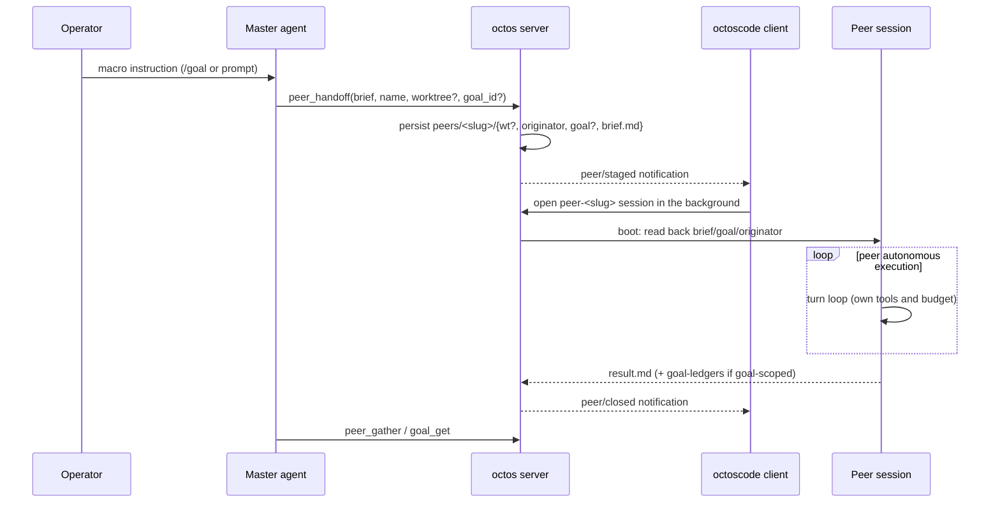
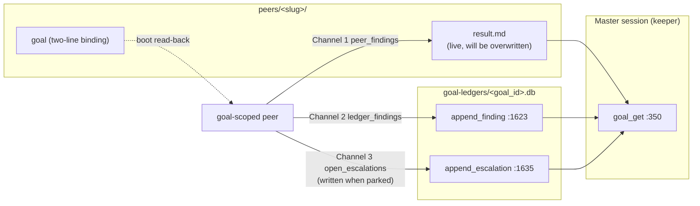

# Chapter 18: Goal and Peer: Moving Objectives Out of the Context Window

> **Positioning**: This chapter analyzes the two new lines added in v2: the goal line, 9 files totaling 52,445 lines (`crates/octos-cli/src/goal_tool.rs` 3,028, `crates/octos-fleet/src/sqlite_ledger.rs` 6,360, and others), and the peer line, 9 files totaling 5,969 lines (`crates/octos-cli/src/peers/mod.rs` 3,186 and others), close to sixty thousand lines of new code in all. Both answer one question: a long-horizon objective left in the model's conversational context rots, so where is it safe to keep it? Prerequisites: Chapter 5 (§5.10 the continuation boundary), Chapter 12 (supervisor and leases), Chapter 16 (the fleet kernel and the crate GoalLedger lives in). Who should read it: developers building multi-agent long-task systems, and architects who care about how an objective survives across sessions. This chapter is also a prerequisite for the outer loop in Part IV (Chapter 20): the outer loop observes and drives the inner loop through these primitives.

## 18.1 Why Move Objectives Out of the Context Window

The Claude Code style of goal implementation injects the goal text into the context every turn and relies on the model to keep honoring it through micro-level execution. In practice the model often does not: it stops after a few rounds, or gets pulled off course by the tool output in front of it. The goal text hangs on the system prompt while the progress is recorded in a conversational history that rots, one compaction pass can lose the intermediate conclusions. `octoscode/docs/PEER_GOAL_ARCHITECTURE.md` names this failure mode plainly: the objective survives, progress rots.

octos takes the goal out of the micro context and hands it to a server-side keeper that holds and advances it at the macro level. The keeper periodically dispatches work, collects results, and decides the next step through `GoalContinue` continuation ticks; each dispatched peer sees only a self-contained task brief in its own micro context, with no goal text inside. The persistence of the goal is guaranteed by structure, and one peer stopping does not stop the goal from advancing.

This design line lands in a division of labor between two systems. The goal line holds and advances objectives: `crates/octos-cli/src/goal_tool.rs` (3,028 lines, its first-line doc noting that it replaces the fragile prompt-based scheme of #1696), `commands/{goal,ledger}.rs` (1,116 + 240 lines), `autonomy/{goal_loop_runtime,master_continuation_scheduler,supervisor_store,fleet_wake}.rs` (1,562 + 1,416 + 3,277 + 1,807 lines), and `crates/octos-fleet/src/sqlite_ledger.rs` (6,360 lines). The peer line executes: `crates/octos-cli/src/peers/mod.rs` (3,186 lines), `crates/octos-cli/src/peers/host.rs` (502 lines), `crates/octos-cli/src/commands/peer.rs` (211 lines), and six peer tool files in `octos-agent` (2,070 lines together). The goal line's 9 files total 52,445 lines and the peer line's 9 files total 5,969 lines, a size gap of roughly nine times: the machinery that holds an objective is far more complex than the machinery that executes one. The ledger alone is 6,360 lines because every state transition, every finding, every escalation request, and every decision on an objective must leave an audit trail; the peer's entire protocol is just a dozen small files in one directory.

One detail of the layering is easy to misread: the goal's holder is not a standalone daemon but the keeper role inside `crates/octos-cli/src/autonomy/agent_orchestrator.rs` (33,639 lines). The `continuations` field (`:11783`) holds the scheduler; goal continuation, fleet dispatch, and ledger aggregation all happen in the master session's orchestrator. "Held on the server side" precisely means: the holder is not the model's conversational context, but persistent state in the orchestrator process plus two ledgers on disk. This is also why the outer loop (Chapter 20) can observe it: state that lives on the server has a stable query surface.

| Line | Files | Lines | Core files |
|---|---|---|---|
| goal line | 9 | 52,445 | `crates/octos-fleet/src/sqlite_ledger.rs` 6,360, `crates/octos-cli/src/goal_tool.rs` 3,028, `crates/octos-cli/src/autonomy/supervisor_store.rs` 3,277 |
| peer line | 9 | 5,969 | `crates/octos-cli/src/peers/mod.rs` 3,186, six peer tools 2,070 |

The division of labor with Chapter 16: the fleet kernel (redb) manages the execution state of plans and attempts, while `GoalLedger` (SQLite) manages the audit ledger of objectives, findings, and escalations, the two ledgers do not substitute for each other (the boundary was drawn in Chapter 16 §16.7). The division with Chapter 12: the supervisor manages the survival of in-session subtasks, while a peer is a process-level entity that spans sessions.

## 18.2 GoalLedger: The First Ledger of an Objective

`crates/octos-fleet/src/sqlite_ledger.rs:13` defines `pub struct GoalLedger`, whose module first-line comment states that it is the persistent ledger for goals, tasks, findings, and escalations. It is a WAL-mode SQLite database: the master, the process manager, and peers are independent processes sharing one `<data_dir>/goal-ledgers/<goal_id>.db` file. `impl GoalLedger` runs from `:206` to `:2241` with 39 pub fns, in five groups by purpose:

| Group | Representative methods | Lines |
|---|---|---|
| open | `open` / `open_with_busy_retry` | :222 / :245 |
| goal | `create_goal` :714, `upsert_goal` :811, `cas_goal_status` :899, `get_goal` :976, `update_goal_status` :1498, `stamp_goal_cleared` :2009 | - |
| task | `create_task` :1066, `create_task_if_absent` :1124, `get_task` :1166, `update_task_status` :1232, `settle_task_status` :1267, `tasks_for_goal` :1290 | - |
| append events | `append_finding` :1623, `append_escalation` :1635, `resolve_escalation` :1702, `list_open_escalations` :1745, `append_decision` :1807, `commit_state_with_audit` :1908 | - |
| stats | `list_findings_since` :2132, `task_status_counts` :2178, `total_cost_tokens` :2232 | - |

Two methods deserve a closer look. `cas_goal_status` (`:899`) is not a bare CAS: the UPDATE statement embeds a budget rule, when the goal is active and `tokens_used >= token_budget`, the status is written directly to `budget_limited` instead of whatever new status the caller asked for. The budget check runs at the single point of state transition and does not depend on caller discipline. `open_with_busy_retry` (`:245`, #1865) addresses a WAL initialization race observed in practice: when two connections initialize the same new database at the same time, contention on the wal-index recovery lock is not covered by the busy handler, a one-shot open can lose a millisecond-scale race and silently drop audit rows; this variant retries up to 3 times with 50ms between attempts, compresses busy_timeout to 1 second, and retries only when the error classifies as BUSY/LOCKED.

The operator exit from the state machine lives in `crates/octos-cli/src/commands/goal.rs` (1,116 lines, #25): `octos goal reopen` admits `blocked|paused|budget_limited` back to active, and `octos goal archive` admits any state into `archived`, with archived as an irreversible terminal state. The observation exit is in `crates/octos-cli/src/commands/ledger.rs`: `octos ledger tail` (`:80`) reads the goal-ledgers directory directly, with zero serve dependencies.

The budget is a soft limit. `budget_limited` stops only the self-driving `GoalContinue` tick; peers already running continue to completion, and external wakes still trigger continuation. The architecture document states this tradeoff plainly: do not kill a peer mid-work; let the user see partial results and then decide whether to raise the budget. The cost is that the budget may overshoot, operators must understand that budget limited is not stopped.

## 18.3 The goal Tool Family: The Keeper's Ten Handles

`crates/octos-cli/src/goal_tool.rs` defines 10 tools: 7 goal_* plus 3 monitor_* (#1977 zero-token monitors, keeper-gated: peers cannot arm them). Each tool's struct and `fn name()` line numbers are listed in the facts table:

| Tool | Struct | Lines | Responsibility |
|---|---|---|---|
| `goal_get` | `GoalGetTool` | :350 / :404 | Read the goal snapshot, folding in findings and escalations |
| `goal_plan` | `GoalPlanTool` | :561 / :575 | Decompose the goal into a persistent fleet |
| `goal_dispatch` | `GoalDispatchTool` | :766 / :780 | Dispatch ready tasks to the worker pool |
| `goal_grant` | `GoalGrantTool` | :861 / :875 | Approve a capability-expansion request from a Blocked task |
| `goal_deny` | `GoalDenyTool` | :1024 / :1050 | Deny an escalation request, moving the task to Failed |
| `goal_update` | `GoalUpdateTool` | :1163 / :1266 | State transitions; completion claims must pass an independent verifier |
| `goal_create` | `GoalCreateTool` | :1495 / :1509 | Create a goal; admission checks serialize across two calls |
| `monitor_create` / `monitor_list` / `monitor_delete` | :1634 / :1824 / :1893 | - | The three event monitors |

Wiring lives in `crates/octos-cli/src/runtime/profile.rs`: GoalGetTool `:1323` (with `.with_data_dir`), GoalCreateTool `:1326`, GoalUpdateTool `:1329-1337` (attaching a verifier lane if one is configured), GoalPlanTool `:1341`, GoalDispatchTool `:1342`, GoalGrantTool `:1349`, GoalDenyTool `:1353`. On the peer-session side the wiring is in `crates/octos-cli/src/commands/chat.rs:859` and `:1574-1577`: a goal-bound peer gets only `goal_get` and `goal_update`, it can see the goal and record findings back to the master's ledger, but it cannot get plan or dispatch and has no authority to rewrite the plan.

`goal_get` is where the three return channels converge (`:357`, `:491`, `:501`): it first scans the live peers under `<data_dir>/peers/` (`data_dir.join("peers")`), then reads the persistent findings from `<data_dir>/goal-ledgers/<goal_id>.db`, injecting them into the snapshot under the three keys `peer_findings`, `ledger_findings`, and `open_escalations` (#1967), with a ledger summary attached along the way (#1945). The keeper does not need to know where a peer is; one `goal_get` call settles the accounts.

The completion verdict lives in `crates/octos-cli/src/autonomy/goal_loop_runtime.rs`: `GoalCompletionVerdict` (`:282`, Done / NotDone) is delivered by an independent cheap-lane verifier. The #1935 comment quotes the loop-engineering principle directly: the agent's own claim of completion is only a claim, the verifier must independently return Done before a transition to Completed is allowed, and NotDone keeps the goal Active. The runtime types sit in the same file: `GoalId` (`:10`), `GoalRuntimePolicy` (`:239`, cadence plus max_continuations), `GoalRuntimeState` (`:265`, Active/Paused/Completed/Failed), and `GoalRuntime` (`:305`). The wrap-up instruction for an exhausted budget sits in the `wrap_up_prompt` field of `GoalBudgetResolution` (`:298`), passed through verbatim.

The verifier lane is injected at the wiring point: when `crates/octos-cli/src/runtime/profile.rs:1329-1337` registers GoalUpdateTool, it attaches `.with_verifier_provider` if the profile configures `goal_verifier_llm`. Without that configuration the completion check falls back to the no-verifier path, which makes this one setting the master switch for "double-verify completion or not" in a production deployment. The plan and dispatch tools are wired in the same batch (`:1341`, `:1342`, #1857 PR 5a): `goal_plan` decomposes the goal into a persistent fleet and `goal_dispatch` sends ready tasks to the live worker pool; the escalation verdicts `goal_grant` (`:1349`) and `goal_deny` (`:1353`) consume the exits of the Blocked task state machine, and a deny that leaves the fleet unable to complete also syncs the per-goal ledger (#1964). These four tools connect Chapter 16's fleet kernel into the keeper's tool surface; this chapter only covers their place in the goal narrative, and the state machine details return to Chapter 16.

## 18.4 Continuation: GoalContinue and GoalWrapUp

Chapter 5 §5.10 examined `MasterContinuationScheduler` from the loop's point of view; this section completes the goal side. The `MasterContinuationReason` (`:137`) in `crates/octos-cli/src/autonomy/master_continuation_scheduler.rs` (1,416 lines) has six variants, two of which belong to goal: `GoalContinue` (`:141`) is the self-driving continuation, and `GoalWrapUp` (`:147`, #1131) is the final turn after the budget runs out. It carries a wrap_up_prompt that must be rendered verbatim, not through the standard advancement template.

`priority()` (`:152`) maps both variants to the same lane (`:161`), and the comment gives the reason: a wrap-up is the last goal turn before the session pauses, not a privileged turn. The priority ranks (`:190-199`) come in four grades: External=0, GoalContinue=10, ChildOrScatterJoinComplete=20, LoopFire=30, smaller values dequeue first. `stable_name()` (`:169-176`) gives deduplication and persistence a stable string: `goal_continue` (`:171`) and `goal_wrap_up` (`:172`).

The enqueue point is `crates/octos-cli/src/autonomy/agent_orchestrator.rs:12963`: it constructs `MasterContinuationRequest::new("coding-autonomy-goal", ...)` with `.with_goal_id` carrying the goal's identity, and metadata carrying objective and status. The scheduler itself, `MasterContinuationScheduler` (`:477`), is held by the `continuations` field at `crates/octos-cli/src/autonomy/agent_orchestrator.rs:11783`; `enqueue_at` (`:532`) enqueues, and `drain_ready` (`:687`) and `drain_ready_for_session` (`:706`) dequeue by priority. One detail: the 30-second `RECENT_CLAIM_GUARD_WINDOW` (`:33-35`) exists to block duplicate deliveries of the same-key External, while LoopFire, GoalContinue, and ChildCompleted, loop reasons that re-enqueue every tick, are deliberately excluded from the guard and never rejected.

External events can wake the keeper too. `crates/octos-cli/src/autonomy/fleet_wake.rs` (1,807 lines) is the consumer of the fleet kernel's outbox (PR 4a): a background task claims persistent outbox events and converts them into continuation requests for the keeper. The durability rule is written into the module doc: an event is acked only after the wake has been persisted (`WakeCommit::Durable`); an unpersisted event stays in the claimed state and is redelivered when its lease expires, so a crash in between loses no wake. The doc is also honest about scope: as of this commit no real fleet events are written on the production path, and the consumer proves its correctness with synthetic events from unit tests, dormant but correct. Its wake precondition is narrow: the keeper's workspace is already loaded, meaning an interactive or connected goal session; rehydrating headless sessions is left to PR 4b. The pure-function core `drain_fleet_outbox_once` (`:235`) holds no singleton, the process loop `spawn_fleet_outbox_consumer` (`:343`) calls the orchestrator's `drain_fleet_outbox`, and the commit callback the latter supplies persists only for the instant the runtime state is locked.

Supervisor-side support comes from `crates/octos-cli/src/autonomy/supervisor_store.rs` (3,277 lines): `SupervisorStore` (`:697`) persists the state of supervised agent groups, and `load_state` (`:780`) reads it back on restart. Chapter 12 covered its division of labor with leases; here it is enough to remember that goal continuation requests travel the same persistent path, the fleet_wake doc states plainly that its commit callback reuses the persistence pipeline shared by peer and goal wakes.

Assembling this section's states, the goal state machine runs at two levels. At the ledger level: `cas_goal_status` and `update_goal_status` (`:1498`) manage the string states active, complete, blocked, budget_limited, paused, cleared (the state set is documented in the comment at `crates/octos-fleet/src/sqlite_ledger.rs:39`, with terminal-state protection for complete and cleared, provable from the WHERE clauses at `:914`/`:1512`). `archived` is not in the ledger's state set; it is a terminal marker on the supervisor event-stream side (the comment at `crates/octos-cli/src/commands/goal.rs:12-14` states outright that the authoritative source of goal state is the supervisor event stream, not the SQLite goals table), the two ledgers' state sets must not be conflated, and transition rules split into operator-reachable and model-reachable classes: the comments in `crates/octos-cli/src/commands/goal.rs` state that complete and blocked are reachable only by the model, archived only by the operator, and reopen admits exactly three entrances: blocked, paused, budget_limited. At the runtime level: the four states of `GoalRuntimeState` (Active, Paused, Completed, Failed) are the in-memory advancement view, and the two constructors of `GoalRuntimePolicy` give two cadences: `fixed_interval` heartbeats at a fixed interval while `self_paced` is signal-driven, both capped by `max_continuations`. The keeper aligns the two levels: every `GoalContinue` tick reads the ledger, compares the budget, and decides whether to enqueue the next tick or switch to wrap-up. The goal-side enqueue tests (`:1185`) also verify that the dedup key carries the goal_id, so two different goals in the same session cannot crowd each other out of the queue.

## 18.5 The Peer Lifecycle: Six Stages

The peer's mental model comes from operating systems: a subagent (`SpawnTool`/`DelegateTool`) is like a thread, spawned within the parent turn, sharing the parent's context and workspace, terminated when the parent turn ends. A peer is like a forked process: it has its own session, working directory, turn loop, and budget, and it keeps running even if the parent dies. The two share no memory and communicate through blackboard files, the equivalent of IPC.



The six stages each have a landing point:

1. **Stage**. `stage_peer` (`crates/octos-cli/src/peers/mod.rs:1563`) writes under `peers/<slug>/` in a fixed order: worktree (`:1598`), originator (`:1702`), goal (`:1729`), brief.md (`:1738`), name (`:1752`). The order is itself the publication invariant, expanded in 18.6. The model-side entry is the `peer_handoff` tool (`crates/octos-agent/src/tools/peer_handoff.rs:133`), which only validates parameters (brief cap, name cap of 64 characters, duplicate names rejected outright rather than auto-suffixed); the staging writes are performed by the host callback.
2. **Staged notification**. The server only stages; the session is opened by the client (session and client connection are coupled). The `peer/staged` notification means "persisted, please open it": on receipt the client opens a `peer-<slug>` session in the background. This division of responsibility is deliberate, the server does not know the client's window management, and the client does not know the staging file protocol.
3. Client opens. The peer session is established under its own topic, its session key identified by the `peer-<slug>` prefix, a prefix later reused by depth-1 governance.
4. **Boot read-back**. `read_peer_boot` at `crates/octos-cli/src/peers/host.rs:96` reads the execution context back from the blackboard: `:99-116` parses the goal file (line one goal_id, line two task_id; an empty goal_id discards the orphaned task_id so the agent is never handed a dangling subtask), originator is read once at boot to prevent rebinding mid-run, and the brief is read under the 1 MiB cap. Every field is independently optional: a peer with no goal or no brief is degraded, not dead, only a slug that is not a real staged directory returns empty.
5. **Run**. The peer has a full turn loop and toolset. The terminal artifact is written back to the blackboard by `write_peer_result_if_peer_session` at `crates/octos-cli/src/api/ui_protocol_transport.rs:14279`: four frontmatter fields (slug/outcome/updated_unix/turn, `:14334`), with the turn number derived by counting the existing `result-<n>.md` files plus one (`:14328-14329`) and the body capped at 256 KiB (`:14306`). A peer whose budget ran out writes a different five-field checkpoint copy (`crates/octos-agent/src/agent/budget.rs:584`: status/completed/iteration_budget/iterations_used/checkpoint_commit); work-in-progress survives as a commit on the branch, "not completed" is stated in three plain words, and the prompt says to raise the cap or split the task on re-dispatch. If the peer holds write ownership (`.result-owner: peer` sidecar, #27f/#27h), the runtime must not overwrite its terminal state; the peer's handwritten content is free-form, unconstrained by the four-field template.
6. Closed and gather. The `closed` tombstone file marks the terminal state (`peer_is_closed`, `:1317`), and the `peer/closed` notification tells the client to update its UI; the master pulls result.md with `peer_gather`, or settles accounts directly with `goal_get`. The command-line observation surface is `octos peer list` (`crates/octos-cli/src/commands/peer.rs:54`), which likewise reads the blackboard directory directly, with zero serve dependencies.

## 18.6 The Blackboard: The File Layout Is the Protocol

There is no shared memory between peer and master; the files under `peers/<slug>/` are the protocol itself:

```text
<data_dir>/
├── peers/<slug>/
│   ├── brief.md          # task contract, ≤64KB, the peer's entire input
│   ├── name              # display name, primary addressing key
│   ├── originator        # master session key, read once at boot
│   ├── goal              # two lines: goal_id and task_id, goal-scoped only
│   ├── result.md         # live result, will be overwritten
│   ├── result-<n>.md     # versioned copy (#435), count_peer_result_versions :2592
│   ├── result.checkpoint.md  # budget-checkpoint copy (#27e)
│   ├── turns.txt         # line-oriented turn index, parse_peer_turns_index :2649
│   ├── closed            # tombstone, peer_is_closed :1317
│   ├── model             # lane key, read_peer_model_lane :2189
│   └── wt/               # isolated clone in worktree mode
└── goal-ledgers/<goal_id>.db  # persistent ledger: findings and state transitions
```

The write order of `stage_peer` carries two invariants. First, brief.md is the visibility gate: `staged_peer_dir` (`:417`) decides whether a peer exists by the presence of brief.md, so brief.md must be written last, the peer "exists" only after it lands. Any failure before that goes through `cleanup_staged_peer` for wholesale recovery, never leaving a visible but incomplete peer. Second, originator is written before brief.md, guaranteeing that any fleet ownership scan that can see the peer can also read its owner; there is no "visible but unowned" window, whose harm is concrete: the synthesis triggered when a sibling peer completes would silently omit this peer. The goal file (`:1729`) likewise lands before brief.md. `name` (`:1752`) is the display name and primary addressing key; the staging brief is also recorded as the first entry of instruction history so that history starts where the work starts, while brief.md itself stays authoritative.

Those are not the only leaves. `result-<n>.md` is the versioned copy (#435): `count_peer_result_versions` (`:2592`) counts the `result-` prefixed files and the count is the version number, so a persistent peer running multiple rounds never silently overwrites old results. `result.checkpoint.md` is the sidecar of the #27e budget checkpoint, written by the peer itself when it holds write ownership; `turns.txt` is the line-oriented turn index, parsed line by line by `parse_peer_turns_index` (`:2649`); `closed` is the tombstone (`peer_is_closed`, `:1317`); `model` records the lane key (`read_peer_model_lane`, `:2189`).

The read path has symmetric defenses. All file reads are anchored on fds (openat plus atomic writes via renameat) and refuse symlinks; read caps are tiered: 64 KiB for small files (`PEER_FILE_READ_CAP_SMALL`, `:462`), 1 MiB for brief and result (`PEER_FILE_READ_CAP_LARGE`, `:457`); the brief write cap is 64 KB (`PEER_BRIEF_MAX_BYTES`, `:1422`). Addressing is keyed on name: `resolve_peer_name_to_slug` (`:1329`) resolves a human-readable name to a slug, case-insensitively. The blackboard's row view is `PeerBlackboardRow` (`:2676`: slug, name, brief, result, turn history, lane, closed, worktree presence), assembled by `read_peer_blackboard` (`:2714`) enumerating the directory, and rendered into peer_list output by `compose_peer_list_text` (`:2802`). Every read and write in this file protocol has a cap, atomicity, and versioning, that is the entire justification for the word "blackboard" carrying inter-process communication duty.

## 18.7 The Truth About Worktree: It Is a Clone, Not a Worktree

`--worktree` is nominally a worktree; the implementation is `git clone --no-hardlinks` (`crates/octos-cli/src/peers/mod.rs:1638` and `:1640`, with clone and --no-hardlinks as two arguments on their own lines). The source comment (from `:1624`) records why it must be so: the `.git` created by `git worktree add` is a file pointing at `<repo>/.git/worktrees/<name>`, a directory outside the peer's sandbox, so any git command run inside the peer reports `fatal: not a git repository`. The model will then "rescue" itself with `git init`, destroying the fence branch entirely, and the deliverable never lands on disk. A clone puts a complete `.git` inside `peers/<slug>/wt`: git works normally, the sandbox needs no widening, and one peer cannot reach another's refs.

The case for `--no-hardlinks` is likewise in the comment: the default local-clone optimization shares the object files' inodes between the child repository and the source, and a peer writing its own `.git` can corrupt the source repository's objects; isolation is the entire point of the feature, so the cost of one real object copy per peer is accepted. The cost is stated openly: if staging latency becomes a problem, revisit with evidence. After the clone, the peer's fence branch is checked out in its own clone (the `peer/<slug>` branch), and the clone inherits neither the source repository's LOCAL config.

## 18.8 Binding and the Three Return Channels

The connection between goal and peer lives in the handoff parameters and the goal file. `PeerHandoffRequest` (`crates/octos-agent/src/tools/peer_handoff.rs:35`) carries optional `goal_id` and `task_id`; the master passes them when handing off under an active goal, and the server writes them atomically into the two-line `peers/<slug>/goal` file. A peer without a goal file behaves exactly like an ordinary peer. The peer does not own the goal: after boot reads back the binding, its `goal_get` resolves directly by id to the master's goal via the recorded goal_id and originator session, and records its findings into the master's ledger.



The three return channels converge at `goal_get`: the live channel reads `peers/<slug>/result.md`, fast but overwritten; the durable channel goes through `GoalLedger::append_finding` (`:1623`), persisted every time a goal-scoped peer finishes a turn, surviving restarts as the authoritative history; the escalation channel writes `append_escalation` (`:1635`) when a peer parks on an approval or a question, so a master that missed the real-time notification can still see in `goal_get`'s `open_escalations` who is waiting, with approval via `peer_respond` or `goal_grant`. The design intent turns "missed the notification" from an exceptional path into an ordinary read path.

One trap found in engineering practice must go into the docs: the model does not pass `goal_id` automatically. When the master has no active goal, or the prompt does not ask for binding, the handoff produces an ordinary peer whose output never enters the goal ledger. Testing the return chain requires explicitly requesting the binding. That is why the architecture document flags it as an observed trap: the tool's default is "not bound," and the benefits of binding (durable history, `goal_get` accounting) exist only after the parameter is passed explicitly.

The lane parameter rides in the same request: `model` (`crates/octos-agent/src/tools/peer_handoff.rs:59`) is a key of the master profile's `sub_provider` (cross-referenced with Chapter 9); the host validates that the key exists, an unknown lane degrades to the primary model and is reported faithfully via `PeerHandoffStaged.model_note` (`:86`); a matching key is recorded in the `model` file (`record_peer_model_lane`, `:2205`), and the peer's turns resolve providers by that lane.

## 18.9 Governance: Three Hard Constraints

The peer mechanism gives the model the power to fork; the governance constraints are all enforced at the serve wiring point, not by prompt:

- **Depth-1**: a peer session's topic is identified by the `peer-` prefix, and `peer_handoff_allowed_for_session` (`crates/octos-cli/src/peers/mod.rs:1934`) rejects on sight; `peer_handoff` is absent from the peer's tool registry, the model cannot even see it. A peer cannot fork another peer; recursion is cut off at the tool-visibility layer (the comment at `crates/octos-agent/src/tools/peer_handoff.rs:12-13` documents itself).
- **Per-turn cap**: `PEER_HANDOFFS_PER_TURN_MAX = 4` (`:1928`), enforced at `:2062`; exceeding it returns an error. At most four peers dispatched per turn, so fan-out never runs away.
- **Brief cap**: `PEER_HANDOFF_BRIEF_MAX_BYTES = 64 * 1024` (`crates/octos-agent/src/tools/peer_handoff.rs:27`); the comment's framing is that a brief is a task contract, not blob storage; the server-side `PEER_BRIEF_MAX_BYTES` (`crates/octos-cli/src/peers/mod.rs:1422`) mirrors the same value.

The master-side tool family has six members covering the peer's full operating surface: `peer_handoff` (staging, `:133`), `peer_list` (roster, `:56`), `peer_gather` (collecting results, `:64`), `peer_respond` (answering a parked peer, `:148`, control channel), `peer_close` (`:62`), and `peer_send_input` (`:90`).

> **Engineering decision: peers are processes, subagents are threads**
> A subagent spawns inside the parent turn, shares context and workspace, and returns its result directly into the parent context as a tool result, dying with the parent turn if it is interrupted: thread semantics, lightweight, fate bound to the parent process. A peer has an independent session, an isolatable working directory, its own turn loop and token budget, and keeps running if the parent dies: process semantics, isolation bought with overhead. The selection criterion is the failure domain: should a crashed task take the parent session down with it, and should the deliverable still be on disk after a restart? Blackboard files are the IPC between the two: no shared memory, contract (brief) and result both plain files, readable by either side after the other crashes. `PeerTaskBinding` (`crates/octos-cli/src/peers/mod.rs:166`) ties a peer to a supervisor lease (`bind_peer_supervised_task`, `:241`; `retire_peer_supervised_task`, `:264`), so peer liveness rides on supervisor lease semantics, Chapter 12's lease semantics reused here.

## 18.10 Boundaries and Recap

With Chapter 5: the data structures of `MasterContinuationScheduler` were covered from the loop's perspective in Chapter 5 §5.10; this chapter adds the full set of goal-side variants and the external wake. The forward reference at the end of Chapter 5, "Chapter 18: the consumer side of `MasterContinuationScheduler` and the full picture of goal continuation", is hereby redeemed. With Chapter 12: the supervisor's event ledger and `SupervisorStore` (`:697`/`:780`) manage in-session subtasks, and `PeerTaskBinding` is the lifeline by which a peer borrows that machinery; the full lease state machine stays in Chapter 16. With Chapter 16: the fleet kernel's six redb tables manage plan execution, `GoalLedger` manages goal auditing, and `goal_plan`/`goal_dispatch` connect the two on top of the keeper; the grant verdicts on escalation (`goal_grant`/`goal_deny`) consume the exits of Chapter 16's Blocked state machine. The outer-loop protocol itself (Chapter 20) and TUI display (Chapter 19) are out of scope here.

Chapter recap:

1. Goals persist server-side: `GoalLedger`'s 39 pub fns in five groups manage objectives, tasks, events, and statistics; `cas_goal_status` embeds the budget rule into the single state-transition point, and budget_limited is a soft limit.
2. The keeper's ten handles: 7 goal_* tools plus 3 monitor_*; the peer side wires only `goal_get` and `goal_update`, planning authority is not delegated.
3. Continuation has priorities: GoalContinue and GoalWrapUp share a lane, wrap-up is the last turn, not a privileged one; fleet_wake persists a wake before acking it, losing no events.
4. The peer protocol is files: the write order (brief.md last) carries the visibility invariant, result exists as both a live copy and versioned copies, the terminal state has four frontmatter fields, the checkpoint five.
5. Worktree is really `git clone --no-hardlinks`: `.git` must land whole inside the sandbox, shared inodes would corrupt the source repository, and isolation outranks staging latency.
6. Binding is explicit and returns flow through three channels: the two-line `goal` file plus an explicitly passed goal_id; results converge on `goal_get` via peer_findings, ledger_findings, and open_escalations.
7. The three governance constraints are enforced at the wiring point: depth-1 via tool invisibility, a per-turn cap of 4, a brief cap of 64KB.

---

The database file `goal_ledger.sqlite` is held exclusively by the keeper process; workers and transitions read and write only through the WAL side. This holding relationship is the foundation of the recovery semantics.

## Further reading

- `octoscode/docs/PEER_GOAL_ARCHITECTURE.md`: the original architecture document, design lineage, binding and return channels, the soft budget limit; several figures in this chapter are drawn from it and verified against source.
- `crates/octos-fleet/src/sqlite_ledger.rs`: all 39 public methods of GoalLedger and the #1865 race-condition comment.
- `crates/octos-cli/src/peers/mod.rs:1624-1640`: the complete commented argument for clone instead of worktree.
- Chapter 16's `docs/FLEET-RUNTIME-ADR.md`: the architecture decision record for the goal/fleet layering.

## Exercises

1. `cas_goal_status` embeds the budget verdict in the UPDATE's CASE expression. If the same check moved to the tool layer (read tokens_used, then write status), which concurrency window would let an over-budget goal keep turning? What happens when two processes execute this UPDATE simultaneously under WAL?
2. brief.md is the visibility gate and must be written last. If the name file were written after brief.md and the process crashed before the staged notification, what state of peer would appear? How would `resolve_peer_name_to_slug` handle it?
3. `--no-hardlinks` pays one full object copy per peer. With 2 GB of objects in the source repository and 20 peers to dispatch, how do you estimate the staging cost? What scheme would cut that cost without reintroducing the inode-sharing corruption risk?
4. The model not passing `goal_id` automatically is an observed trap. Suppose `peer_handoff` added a policy of "bind by default when the master has an active goal": which validations would change? Which class of goal-agnostic delegation would this default hurt?
5. GoalWrapUp and GoalContinue share a priority lane. If wrap-up got its own higher priority, in what order would the closing turn at the moment of budget exhaustion compete with other sessions' GoalContinue? Why did the designers decide it should not be a privileged turn?

---

> **Version note**: This chapter is new in v2; the analysis baseline is octos main @ `9c157101` (collected and re-verified 2026-09-03). The goal and peer lines are both new code: the goal tool family comes from #1696 (replacing the prompt-based scheme), the peer mechanism from #1801 v3, continuation scheduling from M15, budget wrap-up from #1131, the monitor family from #1977, and peer-goal binding and return channels from #1967 and #1945. All line numbers and line counts come from the facts table `assets/ch18-facts.md` (committed in the same batch as 8a008e5) or from this session's read-only verification against the source; the forward references from Chapter 5 §5.10 and Chapter 12 land here. The measured shape of the result.md frontmatter (four fields on the runtime copy, five on the checkpoint copy) follows the source and does not carry over the six-field wording of the early spec.

