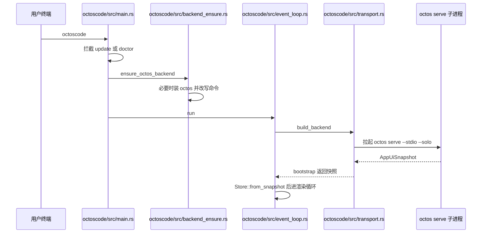
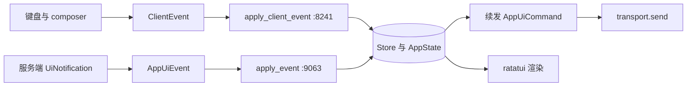
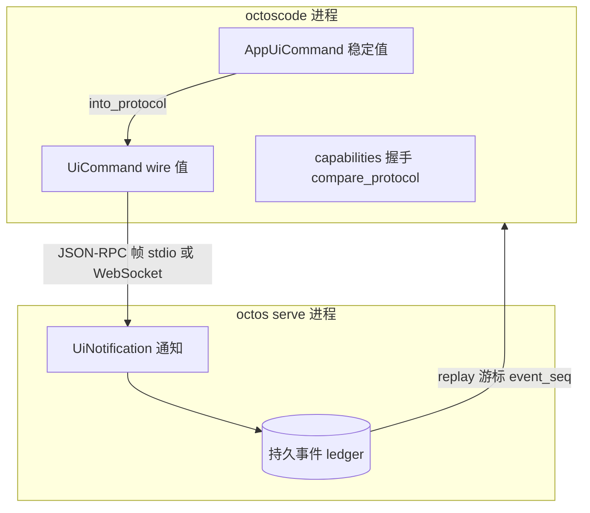

# Chapter 19: octoscode: Terminal Client and the UI Protocol

> **Positioning**: This chapter dissects octoscode, the terminal client of octos: it runs no agent, executes no tools, holds no ledger, and talks to `octos serve` only through the UI Protocol. The startup chain, the transport layer, the reducer, the protocol contract, the client side of goal/peer, and the observation surface for the outer loop all converge here into a single line. Prerequisites: Chapter 14 (the serve control plane and the stdio mount surface), Chapter 18 (the server-side goal/peer machinery). Who should read it: developers writing a client for octos, wiring the TUI into their own observation stack, or asking how thin a client can be.

## 19.1 The Client Boundary: A Terminal That Executes Nothing

The conclusion first: in protocol mode, octoscode is a dumb client. The Scope section of `octoscode/docs/ARCHITECTURE.md:3` draws the boundary in one sentence:

> octoscode is a standalone terminal client for the Octos UI Protocol. In protocol mode it does not run the Octos agent, execute tools, approve commands, maintain the durable ledger, or own provider/model configuration. Those responsibilities belong to the `octos serve` process.

As a checklist: it runs no agent, executes no tools, makes no approval decisions, maintains no durable ledger, holds no provider/model configuration; all five of those belong to the `octos serve` process. What the TUI owns is presentation only: terminal rendering and keyboard handling, local view state (focus, scrolling, expansion, composer drafts), optimistic display of user prompts, local slash commands (`/ps`, `/stop`, `/help`), and the translation of user interactions into stable `AppUiCommand` values. The server owns session creation and cwd validation, the agent runtime, shell/tool execution and sandbox policy, approval requests and decisions, the task supervisor and the background-task registry, the durable UI event ledger and replay, and the diff-preview and task-output data sources.

Architectural invariants back this boundary (the Architectural Invariants section starting at `octoscode/docs/ARCHITECTURE.md:713`): octoscode must not call Octos runtime internals directly; it must not depend on M9 server internals beyond AppUI; it must treat the server as the authority on tasks, approvals, diffs, tool results, cwd policy, sandbox policy, and replay; the server must not require TUI-specific behavior for protocol correctness; any new client-visible capability must first land in the UI Protocol types in `crates/octos-core` and only then in TUI rendering; prompt shaping for the coding experience belongs to the server-side profile or the harness prompt contract, not to the client. In other words, only one contract is allowed to exist between client and runtime: the protocol.

By size, octoscode's top-level `src/` holds 26 files totaling 96,124 lines (embedded tests included). The largest is `octoscode/src/store.rs` (43,935 lines, the reducer, with embedded tests), followed by `octoscode/src/model.rs` (12,884 lines), `octoscode/src/transport.rs` (12,214 lines), `octoscode/src/event_loop.rs` (8,655 lines), and `octoscode/src/app.rs` (6,286 lines); the subdirectories add `app/` with 5 files, `cmd/` with 8, and `menu/` with 10. Beyond the entry point there are a few peripheral facilities: `octoscode/src/backend_ensure.rs` (1,317 lines) manages automatic backend installation, `octoscode/src/autonomy.rs` (1,192 lines) parses the client side of goal/peer, `octoscode/src/tui_terminal.rs` (1,171 lines) is an inline-viewport terminal trimmed and ported from codex-rs, and `octoscode/src/insert_history.rs` (1,602 lines) writes finalized output back into the terminal's native scrollback. A client that "executes nothing" approaching a hundred thousand lines — that contrast is what this chapter explains: the thin part is the responsibility, not the code volume. Making interaction thick and permissions thin is itself heavy work.

A comparison helps locate where this boundary sits. The comparison model at the end of the architecture document (`octoscode/docs/ARCHITECTURE.md:666`) places the Codex-style local CLI and Octos's split side by side in one table: a Codex-style client process owns the runtime itself (tool execution in a local sandbox, approval policy local, sessions and replay local), and the model service provides inference only; Octos moves all of that into `octos serve`, leaving the client with rendering and interaction. Both can deliver a good coding experience. The difference is replaceability and observability: Octos's terminal application can be swapped out wholesale, every client speaks the same AppUI API, and runtime state concentrates on the server, where an external observer can read the ground truth without touching the client.

> **Engineering decision: the price of a dumb client**
> A dumb client gives up local autonomy: without a server, octoscode cannot run a single shell command for you (mock mode only renders test fixtures). What it buys is three things. First, a single security boundary: tool execution, sandboxing, and approvals are all enforced server-side; a compromised client holds no execution power, and policy does not need to be implemented twice at both ends. Second, a replaceable client: the comparison model at `octoscode/docs/ARCHITECTURE.md:666` sets the Codex-style local CLI (runtime inside the CLI process) against Octos's split, concluding that the terminal application can be replaced wholesale and every client speaks the same AppUI API. Third, externalized observation: state lives in the server and the protocol stream, so external processes can observe without intruding on the client (herdr in Chapter 21 exploits exactly this). The price is that the protocol itself must be thick enough — the 7,221 lines of wire types (see §19.5) are that bill.

## 19.2 The Startup Chain: From a 57-Line main to a 44,000-Line Reducer

The binary entry of octoscode is tiny. `octoscode/src/main.rs` is 57 lines in full, with `fn main()` at `octoscode/src/main.rs:4`:

```rust
fn main() -> Result<()> {
    color_eyre::install()?;
    install_terminal_restoring_panic_hook();
    // 拦截 update/doctor 子命令,命中则直接退出
    if let Some(code) = cmd::dispatch(std::env::args())? {
        std::process::exit(code);
    }
    let mut cli = Cli::parse()?;
    // 本地 stdio 启动且未安装 octos 时,先装好后端
    backend_ensure::ensure_octos_backend(&mut cli)?;
    octoscode::splash::play(&cli);
    event_loop::run(cli)
}
```

The order of the four steps is deliberate. Step one intercepts the `update`/`doctor` subcommands (`octoscode/src/main.rs:10`): these two must print while the terminal is still in normal mode, so they cannot enter the event loop. Step two, `ensure_octos_backend` (called at `octoscode/src/main.rs:22`, implemented at `octoscode/src/backend_ensure.rs:113`), must run before raw mode, and a comment states why: the installer's output needs to print cleanly to the terminal. Step three plays the startup splash. Step four finally enters `event_loop::run` (`octoscode/src/event_loop.rs:192`).

The conditions of `ensure_octos_backend` are deliberately restrained. Reading the implementation from `octoscode/src/backend_ensure.rs:113` yields four early returns: non-Protocol mode (mock spawns no subprocess) returns immediately; an empty `stdio_command` (WebSocket startup, no local backend to install) returns; a command other than a bare `octos` (user-managed path, PATH override, or a non-octos command, left alone) returns; a command already resolvable on PATH also returns. Only "protocol mode + bare octos + not installed locally" triggers the install, and after a fresh install the `cli.stdio_command` is rewritten to the explicit path `~/.octos/bin/octos`. That is what wires up the first-run experience: a user gets a new octoscode, types, and it installs the server itself.

The default spawn command is a constant, `octoscode/src/cli.rs:118`:

```rust
pub const DEFAULT_STDIO_COMMAND: &str = "octos serve --stdio --solo";
```

Default backfill happens at `octoscode/src/cli.rs:415` and `octoscode/src/cli.rs:849`. Chapter 14 already unpacked this command's semantics: `--stdio` keeps serve from binding HTTP and runs the UI Protocol's JSON-RPC over stdin/stdout; `--solo` pins the single-session posture. The full startup chain:



## 19.3 The Transport Layer: One Trait, Two Drivers

The whole abstraction of the transport layer is three methods, `octoscode/src/transport.rs:238`:

```rust
pub trait AppUiBackend {
    fn bootstrap(&mut self) -> Result<AppUiSnapshot>;
    fn send(&mut self, command: AppUiCommand) -> Result<()>;
    fn next_event(&mut self) -> Result<Option<ClientEvent>>;
}
```

`build_backend` (`octoscode/src/transport.rs:244`) picks one of two modes: mock goes to `MockAppUiBackend` (`octoscode/src/transport.rs:4542`, implemented at `octoscode/src/transport.rs:4699`); protocol goes to `ProtocolAppUiBackend` (`octoscode/src/transport.rs:311`, implemented at `octoscode/src/transport.rs:1585`, with the `AppUiBackend` impl block at `octoscode/src/transport.rs:2235`). The architecture document is blunt about mock's role: a deterministic rendering fixture, not to be used to validate server policy, sandboxing, provider configuration, ledger persistence, or tool execution.

The connection target is expressed by `AppUiEndpoint` (`octoscode/src/transport.rs:192`), two variants: `WebSocket { url, auth_token, profile_id }` and `Stdio { command }`. The corresponding drivers are `WebSocketTransportDriver` (`octoscode/src/transport.rs:556`) and `StdioTransportDriver` (`octoscode/src/transport.rs:566`). The CLI holds the choice: `--endpoint` names a UI Protocol v1 WebSocket endpoint (`octoscode/src/cli.rs:126`, parsed in the argument definitions starting at `octoscode/src/cli.rs:204`); without it, the stdio subprocess path is taken. The difference between the two paths goes beyond the medium. A WebSocket reconnect is only a reconnect: the server and its sessions stay alive; a stdio "reconnect" means respawning the subprocess. Fortunately the solo-mode data directory is anchored by the `OCTOSCODE_SHARED_INSTANCE` environment variable, so a respawn reattaches to the same directory instead of forking a new database (see the comment around `octoscode/src/transport.rs:997`). When the data directory is occupied, the server emits the `OCTOS_DATA_DIR_LOCKED` marker; the client recognizes this token and stops the restart loop. Chapter 14 covered the replay of this same mechanism from the serve side.

Reconnect backoff is exponential: a base delay before the first retry, doubling on each consecutive failure, capped at a limit (constants and comments from `octoscode/src/transport.rs:354`). Every stopped-driver error message carries the same phrasing, "reconnect will retry on next send/read", deferring the reconnect to the next read or write instead of spinning in the background.

What `bootstrap` does, in order, is informative (implementation from `octoscode/src/transport.rs:2235`): it connects first: with `--readonly`, a failed connection is not an error but a read-only offline snapshot for inspection; then sends the capabilities request (the protocol handshake, §19.5); with a profile attached, sends `ProfileLlmList`; with a session_id, sends `OpenSession` (`SessionOpenParams` carries session_id, profile_id, the requested cwd, and the known replay cursor); finally assembles the first-frame `AppUiSnapshot` from the startup arguments. The event loop takes the snapshot, and `Store::from_snapshot` (called at `octoscode/src/event_loop.rs:230`) completes the cold-start hydration.

## 19.4 Store: The 44,000-Line Reducer

The client's state machine is a functional reducer: `octoscode/src/store.rs:287` defines `pub struct Store` with a single field, `AppState`; `from_snapshot` at `octoscode/src/store.rs:423` folds the server snapshot into the initial state. Every state change afterwards goes through one of two entries, both returning `Option<AppUiCommand>`:

- `apply_client_event` (`octoscode/src/store.rs:8241`): consumes `ClientEvent`, the event as decoded by the transport layer;
- `apply_event` (`octoscode/src/store.rs:9063`): consumes `AppUiEvent`, the unified shape of server notifications and local events.

This is the largest single source file in the repository, 43,935 lines, thirty thousand lines more than the runner-up `octoscode/src/model.rs`, and the size is structural, not accumulated debt. Split its responsibilities by `AppState`'s field families and the reducer's fold covers the entire client-visible world: sessions and the thread tree, verbatim accumulation of messages and reasoning deltas, tool cards and diff previews, approval requests waiting and resolving, the background-task registry and output streams, composer drafts and multiple pending messages, the menu stack and Dock layout, the capability set and permission profile, the goal panel and peer roster. Each family corresponds to a group of notifications in the full `UiNotification` set; however many shapes the server emits, that is how many match arms `apply_event` has. This is why the reducer cannot be small: it is the complete consumer of the wire contract. The protocol is as thick as the state machine.

Beyond folding events, the store also translates raw user input into commands. The Client Layers table in the architecture document describes its job as "snapshots, RPC results, notifications, local commands, approvals, diffs, task output and queued prompts folded into AppState": eight classes of input, two entries. The slash-command dispatch chain also lives here: `Store::dispatch_slash_command` fans out to `dispatch_command_entry` and `dispatch_autonomy_slash`, and the doc comment around `octoscode/src/store.rs:291` defines the dispatch result `SlashCommandOutcome`: a command can parse into a known verb and still be rejected at dispatch (readonly mode blocks mutating methods, `/turn` is refused without an active turn, autonomy parsing errors out), and history is written only after genuine acceptance, the correctness precondition for composer command history. Queued prompts (pending messages) are enqueued and released inside the reducer as well: user input is not lost when the network drops, and after reconnect hydration it is resent in order.

One architectural constraint deserves a name: the store's two entries do not just mutate state, they produce follow-up commands, which makes the reducer both a state machine and a follow-up command constructor. The designers clearly understood the risk of 44,000 lines, and their answer was not to split the file but to converge all state transitions into a single point: any bypass that mutates `AppState` directly creates a second source of truth for replay and reconnect hydration. Chapter 18's server-side GoalLedger gathering state transitions into one impl block through 39 methods is the same discipline mirrored on the server: the entry to state transition must be unique, even if the impl block grows enormous for it.

The follow-up-capable return value is the key to this design: the reducer is not a pure fold; it can also produce the next action. The Turn Flow in the architecture document gives the canonical example: the user presses Enter in the composer, `compose_command` generates a new turn_id, optimistically appends the user message locally, and returns `AppUiCommand::SubmitPrompt`; the transport sends `turn/start`; the server streams turn, message, tool, approval, task, progress, and warning events; each event folds through `apply_client_event`, and a fold can trigger further commands; for example, when a diff approval request arrives, a `diff/preview/get` is sent automatically.

`ClientEvent` (`octoscode/src/client_event.rs:25`) is the client's internal event universe. Its first variant, `App(Box<AppUiEvent>)`, carries the `AppUiEvent` from `crates/octos-core/src/app_ui.rs:172` (five variants: Snapshot, Protocol, Progress, Status, Error); the remaining variants are RPC results decoded locally by the transport: capabilities, diff previews, the model list, MCP status, permission profile, session hydration, session list, launch resolution, and so on. `From<AppUiEvent> for ClientEvent` (`octoscode/src/client_event.rs:132`) connects the two. A division worth noting: the wire-layer `UiNotification` is decoded in the transport and never appears inside `ClientEvent`; server notifications uniformly enter the store as `AppUiEvent::Protocol`, and the client state machine is blind to the transport medium.

The event loop drives these two entries in one shape (`drain_backend_events` at `octoscode/src/event_loop.rs:755`): each tick drains at most `MAX_BACKEND_EVENTS_PER_TICK` events, handing each to `apply_client_event_and_send_followup` (`octoscode/src/event_loop.rs:816`): fold, then `send_command` if there is a follow-up. After draining, it calls `drain_pending_autonomy_hydration` (around `octoscode/src/event_loop.rs:830`) to resend, within the queue cap, the hydration commands the store parked during the disconnect (such as a session reopen). A send failure is never silent (`send_command` from `octoscode/src/event_loop.rs:833`): the #27 outer review concluded that failures must be reported to the user by method name; otherwise the TUI shows "reconnected" while input goes nowhere.

Before the first frame there is one one-time wait: `drain_initial_startup_events` (around `octoscode/src/event_loop.rs:786`) gives the capabilities handshake a bounded chance on first startup, because first-run onboarding is capability-gated and drawing the first frame before the handshake arrives flashes an empty composer; a regular startup (a local profile already exists, or `--profile-id` pins one) skips the wait and draws immediately. This detail shows how much the event loop trusts "server authority": it prefers a short wait to faking a known-capability illusion locally.



The easiest thing to miss in the reducer is the preservation of local state across replay. The Snapshot branch of `apply_event` (from `octoscode/src/store.rs:9063`), before rebuilding state from the new snapshot, explicitly clones and carries a batch of purely local fields: command history is a client-side ring buffer the server never echoes; the sub_providers list (the research lane) is not re-pushed by the server on reconnect, and omitting it would clear it after replay; composer drafts and pending messages likewise. The server is the authority, but what the authority does not own must be remembered by the client itself across replay: the dumb-client boundary mirrored inside the reducer.

One caution: the Client Layers table in `octoscode/docs/ARCHITECTURE.md` lists a line count per source file (event_loop 7,047 lines, store 37,021 lines), but that table lags the measured reality (8,655 lines, 43,935 lines; see `assets/ch19-facts.md`). Cite line counts from the facts table and repository measurements; the document table reflects its moment of writing.

## 19.5 The UI Protocol: A 7,221-Line Wire Contract

The entire contract shared by client and server lives in the main octos repository, `crates/octos-core/src/ui_protocol.rs` (7,221 lines, first-line doc "Draft client/runtime protocol types for M9"), at a scale of 24 pub enums, 223 pub structs, and 47 pub consts. This section reads it from the client's point of view; the full type-system analysis is in Chapter 2.

The on-wire envelope is standard JSON-RPC 2.0: `RpcRequest<T>` (`crates/octos-core/src/ui_protocol.rs:684`), `RpcResponse<T>` (`crates/octos-core/src/ui_protocol.rs:708`), `RpcNotification<T>` (`crates/octos-core/src/ui_protocol.rs:730`), `RpcError` (`crates/octos-core/src/ui_protocol.rs:752`); the event side has a unified envelope `EventEnvelope<P>` (`crates/octos-core/src/ui_protocol.rs:68`) carrying session_id, topic, thread_id, a monotonically increasing event_seq, event_type, and the payload; that monotonic sequence is the precondition that makes the replay cursor possible. The protocol identifier is the constant `UI_PROTOCOL_V1`, value `octos-ui/v1alpha1` (`crates/octos-core/src/ui_protocol.rs:20`).

By direction, `UiCommand` (`crates/octos-core/src/ui_protocol.rs:4197`) is the full set of client-to-server methods, variants running from `ProfileLocalCreate`, `SessionOpen`, `TurnStart`, `TurnInterrupt`, `ApprovalRespond` through task read/write, permission profile, diff preview, snapshot, thread, and goal-related methods, with serde tagging on `kind` in snake case; `UiNotification` (`crates/octos-core/src/ui_protocol.rs:6616`) is the full set of server-to-client notifications: `SessionOpened`, `TurnStarted`, message and reasoning deltas, visualized tasks, voice events, and more; `UiRpcResult` (`crates/octos-core/src/ui_protocol.rs:4760`) collects the replies. The octoscode side does not assemble these wire values directly: it holds its own stable value type `AppUiCommand` (`octoscode/src/model.rs:790`), whose variant shapes correspond to the wire side (`OpenSession`, `SubmitPrompt`, `InterruptTurn`, `RespondApproval`, and so on), converted to `UiCommand` via `into_protocol` at `crates/octos-core/src/app_ui.rs:146` and sent; `AppUiCommand::method()` (`octoscode/src/model.rs:915`) gives every command a stable method-name string. This indirection lets the client value type carry local semantics (for instance `LocalShellExec`, a method that never goes on the wire; the transport intercepts it first in the implementation at `octoscode/src/transport.rs:2280`), while the on-wire method set is defined entirely by octos-core.

Version and capability negotiation is the protocol's self-preservation mechanism. `UiProtocolVersion` (`crates/octos-core/src/ui_protocol.rs:1553`) carries the protocol family, schema version, and jsonrpc version, and `is_supported_by_current_runtime` validates all three; `UiProtocolCapabilities` (`crates/octos-core/src/ui_protocol.rs:1577`) declares supported_methods, supported_notifications, and supported_features in the handshake, and the `full_protocol` constructor additionally carries a whole string of feature constants (approval typed, pane snapshots, session cwd, sandbox, harness task control, artifacts, hydrate, thread graph, coding autonomy, goal runtime, and more); the comparator `compare_protocol` (`crates/octos-core/src/ui_protocol.rs:1814`) outputs the three-state `ProtocolCompat` (`crates/octos-core/src/ui_protocol.rs:1777`): different protocol families, or an older server schema, yields `SchemaIncompatible` (a newer server is allowed, additive forward compatibility); family and version compatible but a required feature missing yields `MissingFeatures`; only full satisfaction yields `Compatible`. A comment stresses that the comparator is a pure function, shared unchanged by client and server, so skew verdicts cannot fork into two logics; `octos-diagnostics` merely wraps the result into report lines.



Persistence and replay responsibilities are cut along the same boundary; the Durability and Replay section of the architecture document writes them as two checklists. The server must: write to the ledger before emitting the event; replay missed durable events by the client's cursor; never overwrite a fresher live snapshot with a stale disk replay; report lossy delivery honestly via `protocol/replay_lossy`. The client must: request replay with the latest known cursor when opening a session; tolerate duplicate durable notifications; treat `protocol/replay_lossy` as a refresh signal, not a chat message; and, after reconnect, never infer runtime truth from local optimistic UI state. These four client disciplines are the two sides of the same coin as the reducer's local-state preservation in the previous section.

## 19.6 The Client Side of goal and peer: autonomy Parsing

Chapter 18 covered the server-side goal/peer machinery; this section looks only at the client half: `octoscode/src/autonomy.rs` (1,192 lines, first-line doc "M15-E autonomy command parsing for /agents, /goal, and /loop"). It is a pure parsing layer that turns slash commands typed into the composer into structured values: `parse_autonomy_slash` (`octoscode/src/autonomy.rs:248`) accepts input with an optional leading slash and dispatches by header into six command families, with all enums defined in the same file: `AgentsCommand` (`:35`), `TaskCommand` (`:66`), `ThreadCommand` (`:83`), `TurnCommand` (`:90`), `GoalCommand` (`:97`), and `LoopCommand` (`:131`, with the cadence parameter `LoopCadence` at `:120`), converging into `AutonomyCommand` (`:158`); parse failures yield `AutonomyParseError` (`:170`).

The parse products ultimately become `AppUiCommand` values sent to the server; goal advancement, peer dispatch, and collection all execute server-side (Chapter 18). The client additionally owns two presentations: the goal panel showing the objective and budget state, and the Peer Dock showing each peer's liveness and latest output, all fed by the peer family of `UiNotification` notifications. The selector enums (`AgentArtifactSelector` `:59`, `TaskArtifactSelector` `:76`) support named references to artifacts, letting `/agents` and `/task` commands target exactly one artifact of one peer.

## 19.7 Being Seen by herdr: The Detection Contract

herdr, the protagonist of Chapter 21, reconstructs agent state from the terminal screen. Its detection contract for octoscode is a 40-line manifest file, `herdr/src/detect/manifests/octoscode.toml`, with three rules:

1. `approval_blocked` (state=blocked, priority=1100, region=whole_recent) at `herdr/src/detect/manifests/octoscode.toml:8`: keywords include `Approval | y once | s session | n deny`, `Waiting on you`, `Ctrl+R/Alt+A answer`, and the Chinese variant (shenpi for this once / this session);
2. `statusbar_working` (state=working, priority=1000, region=bottom_non_empty_lines(6)) at `:21`: a regex matching `state·Working` or containing `Esc interrupt`;
3. `statusbar_idle` (state=idle, priority=900, same region) at `:32`: a regex matching state Idle or Done, or containing `Tab agents | Ctrl+O expand`, `Ask Octos to change code`.

These prompt strings share one source with the `pub const HELP` at `octoscode/src/keymap.rs:1` ("Tab agents | Esc chat | PgUp/PgDn scroll | y/s/n approval ..."). The status-bar copy is written for humans and doubles as the observation interface for the outer-loop machine. The dumb-client architecture has a knock-on effect here: since the client is only a renderer of protocol state, stable on-screen copy faithfully reflects server state, and the outer loop can observe through OCR-style text matching without intruding on any process. The full semantics of the three rules and the general mechanisms of the herdr engine are left to Chapter 21.

## 19.8 Boundaries and Recap

With Chapter 10: the harness event ABI (`HarnessEvent` and its schema constants) is an event contract internal to the server runtime; what the client sees are only the notifications projected through `UiNotification`. The two layers version differently, and this chapter does not repeat that analysis. With Chapter 14: the serve-side stdio mount, stdout ownership, and the data-directory lock are referenced here only from the client side. With Chapter 18: the server-side goal/peer machinery (ledger, keeper, return channels) is entirely in Chapter 18; here there is only client-side parsing and presentation. With Chapters 20 and 21: the OLP protocol and herdr operations each have their own chapter.

Chapter recap:

1. The boundary precedes everything: octoscode runs no agent, executes no tools, makes no approvals, holds no ledger, manages no provider configuration; all five sit in `octos serve`, enforced by architectural invariants.
2. The startup chain has five ordered steps: intercept subcommands, ensure the backend (before raw mode), splash, `event_loop::run`; `DEFAULT_STDIO_COMMAND` is `octos serve --stdio --solo` (`octoscode/src/cli.rs:118`).
3. The transport layer is one trait with three methods and two drivers: the stdio subprocess and WebSocket, with exponential reconnect backoff and send failures reported by method name.
4. The state machine is a two-entry reducer: `apply_client_event` (`octoscode/src/store.rs:8241`) and `apply_event` (`:9063`) both produce follow-up commands; purely local state is preserved by the client itself across replay.
5. The 7,221-line protocol contract lives in octos-core: JSON-RPC envelopes, the two full sets `UiCommand`/`UiNotification`, three-state `ProtocolCompat` capability negotiation, and one comparator shared by client and server.
6. The client side of goal/peer is a pure parsing layer (`parse_autonomy_slash`); execution authority is never delegated.
7. The outer-loop observation surface: status-bar copy shares one source with herdr's three detection rules; the dumb client turns the screen into a machine-readable interface.

One more point worth spelling out within the word budget: what this dumb-client architecture means for multi-client collaboration. Every client consumes the same `UiNotification` universe, so a new server capability only has to extend the octos-core types first and project the notifications, and the TUI, a future web client, and outer-loop observers all benefit at once, with no per-client releases. Conversely, if any execution logic leaks into the client, the first alternative client forces a reimplementation of that logic, and the protocol boundary exists in name only. `docs/ARCHITECTURE.md` lists "new client-visible capabilities land in octos-core first" as an invariant precisely to guard against that erosion. This is also the thesis of Part IV: the outer loop (Chapters 20 and 21) can observe and drive the inner loop only because all inner-loop state already lives in the protocol and the ledger, not in some client's memory.

---

The thickness of a dumb client is all in the reducer and the protocol layer: permissions thin to zero, interaction thick to a hundred thousand lines.

## Further reading

- `octoscode/docs/ARCHITECTURE.md` (724 lines): the original statements of Scope, Runtime Topology, the Flows, and Architectural Invariants; this chapter paraphrases them in several places and verifies each against source
- `assets/ch19-facts.md`: the facts source for every line count and line number in this chapter, each with a replayable command
- `crates/octos-core/src/ui_protocol.rs`: the full wire contract; for the type-design perspective see Chapter 2
- Chapter 14 §14.4: the serve-side stdio mount surface and stdout ownership
- Chapter 18: the full server-side goal/peer machinery

## Exercises

1. `ensure_octos_backend` returns untouched when it sees a user-managed octos path. If it instead also detected and upgraded such installations, in what scenarios would it break the user's deployment? How does this restraint coexist with "install on first run"?
2. The Snapshot branch of `apply_event` must hand-clone command history and sub_providers to survive replay. If a new kind of purely local state were added but forgotten in the carry list, what symptoms would the user see? How would you lock the list down with a test?
3. `compare_protocol` allows the server schema to be newer than the client's (additive forward compatibility). If the client depends on a notification that only the new version has while the server is actually older, does the defect surface at the handshake or fail silently at runtime? Can `MissingFeatures` catch this case?
4. A stdio-driver reconnect respawns the subprocess; a WebSocket reconnect only reconnects the socket. What differs in their replay semantics? Why is anchoring the data directory with `OCTOSCODE_SHARED_INSTANCE` necessary in the stdio scenario?
5. herdr recognizes state from status-bar copy. If a refactor changed `state·Working` to `state: Working`, which links would break? How do the three copies (client, herdr manifest, and the keymap help string) stay in sync?

---

> **Version note**: This chapter is new in v2; the analysis baselines are octoscode main @ `1129fa33` (2026-09-03), octos main @ `9c157101` (2026-09-03), and herdr referenced only at the detection manifest @ `fefe5c4f`. All line counts and line numbers come from `assets/ch19-facts.md` and were re-verified by the author against those baselines; the line-count table embedded in `octoscode/docs/ARCHITECTURE.md` lags the measured values, as noted in the text. octoscode and the UI Protocol are both under active development, so line numbers drift with versions; anchor citations to symbol names.


