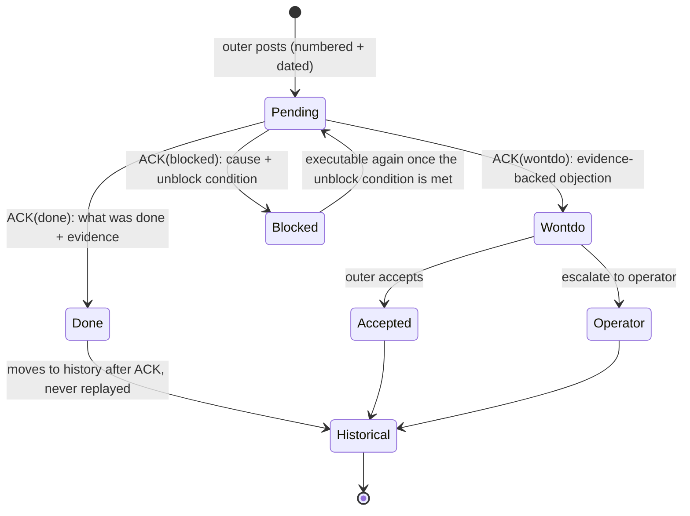
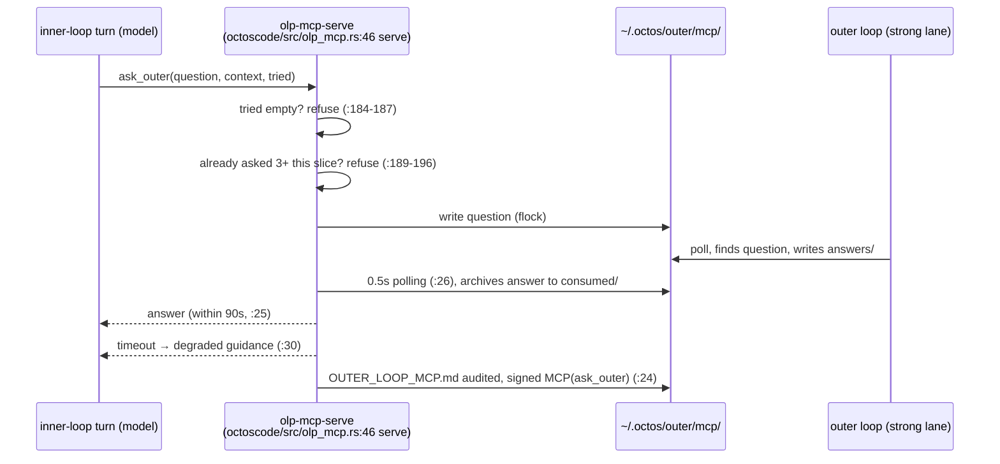
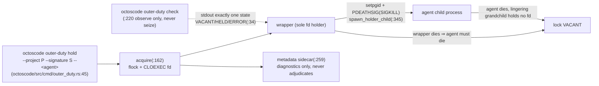

# Chapter 20: OctoLoop: The Outer-Loop Protocol OLP v2

> **Positioning**: This chapter analyzes every artifact of OLP (OctoLoop), the outer-loop protocol added in v2: 30 files in total, of which 7 are protocol documents (`octoscode/docs/OUTER_LOOP_PROTOCOL.md`, 403 lines, among others), 2 are workspace scaffolding, 9 are Rust sources (`octoscode/src/olp_mcp.rs` 406, `octoscode/src/outer_duty.rs` 476, among others), 3 are contract test files (25 cases), 5 are scripts and skills, and 4 cover the crossing surface into the octos main repo. One thesis carries the chapter: most of this protocol has no runtime implementation. It is a stack of three layers, protocol clauses plus Markdown conventions plus contract tests, and the few parts that do have code (the fifth channel, the reviewer duty lock) are exactly the parts that documentation alone cannot pin down. Prerequisite: Chapter 18 (the server-side mechanisms of goals and peers; this chapter only observes them from the outer loop's vantage point). Who should read it: builders who want an external strong model to supervise, coach, and accept the work of a fleet of cheaper models over the long run.

## 20.1 The Dual Loop: Spend the Expensive Model Only on Judgment

OctoLoop splits a long-horizon task across two rings of agents plus one human, and the model tiers of the three are deliberately mismatched. The role table at `octoscode/docs/OUTER_LOOP_PROTOCOL.md:19`: the operator (a human) owns macro directives and final review; the runtime (octos serve + master/peers) owns long-horizon execution on the cheap lane; the outer agent, the subject of this protocol (Claude Code, Codex, or any scriptable agent), owns planning, event-driven monitoring, delivery review, and coaching, on the strong lane. The design motive is written at `octoscode/docs/OCTOLOOP_GUIDE.md:248`: the inner loop is cheap and can be re-run again and again, so mistakes cost little; the outer loop is expensive and spends its budget on judgment only. Every commit passes two pairs of eyes, and push rights live only in the outer loop's hands. The protocol is indifferent to model brands: swap the outer-loop CLI or replace the whole set of inner lanes, and the protocol stays as it is.

The two rings share no memory; every collaboration goes through auditable, persistent channels. Downlink (outer to runtime), five of them: `AGENTS.md` standing constraints (injected automatically by the prompt layer at every session boot), task-level guidance on the blackboard, atomic git commits as accomplished facts, the inbox doorbell (read-once-destroyed, carrying only event notices and blackboard pointers), and herdr TUI injection (text lands in the composer at user-message level, equivalent to the operator typing it by hand). Uplink (runtime to outer), six: the serve log event stream, the `peers/<slug>/result.md` deliverables, the authoritative `goal-ledgers/<goal_id>` ledger, escalation requests, git log/diff, and the reverse-direction channel of Section 20.4, the fifth channel. The full matrix is at `octoscode/docs/OUTER_LOOP_PROTOCOL.md:27` (downlink `:29`, uplink `:39`).

```mermaid
flowchart TB
    OP["operator (human)<br/>macro directives / final review / approval"]
    subgraph OUTER["outer agent (strong lane)"]
        PLAN["plan / monitor / review / coach"]
    end
    subgraph INNER["runtime (octos serve + master/peers, cheap lane)"]
        KEEPER["goal keeper"]
        PEERS["peers working in parallel"]
    end
    BB[("&nbsp;.octos/OUTER_LOOP_REVIEW.md&nbsp;")<br/>blackboard: authoritative ledger]
    MCP["~/.octos/outer/mcp/<br/>fifth-channel mailbox"]
    OP -->|"/goal directives"| OUTER
    OP -->|"approval / final review"| OUTER
    OUTER -- "downlink 1 AGENTS.md, 2 blackboard, 3 commit, 4 doorbell, 5 TUI injection" --> INNER
    INNER -- "uplink 1 event stream, 2 result.md, 3 ledger, 4 escalation, 5 ask_outer, 6 git diff" --> OUTER
    OUTER <--> BB
    INNER <--> MCP <.-> OUTER
```

Observation itself comes in three layers, and this is where the outer loop misjudges most easily. The rule at `octoscode/docs/OLP_OUTER_BOOT.md:60`: delivery is not consumption is not execution: delivery means the notes file is emptied, consumption means the turn prompt reads it, execution means the deliverable or ACK lands. Watch any single layer and you will misjudge. Two "read but never executed" incidents in the field record settled the doorbell pattern into its final shape: the inbox carries pointers only, and content is always fetched from the blackboard.

This chapter reads the 30 artifacts through those three layers: the clause layer (roles, channels, the R rules; pure documentation), the Markdown convention layer (the blackboard, ACK, loop.md; not one line of Rust), and the contract test layer (three test files, 25 cases; the only mechanical enforcement). A few mechanisms span layers: ACK is clauses plus contract tests, and the duty lock is clauses plus implementation plus contract tests.

## 20.2 R1–R7: Seven Disciplines and the Lessons Behind Them

The semantic core of the protocol is seven rules, `octoscode/docs/OUTER_LOOP_PROTOCOL.md:52-103`. Behind each rule sits one real incident, and the protocol document writes the incident and the rule in the same file. That is what most separates it from the usual "spec first, implementation someday" documents.

**R1 ACK obligation** (`:52`). Every entry in the blackboard's Active section must be answered by the runtime with an ACK line appended under that entry. No ACK means the entry counts as unread, and the outer loop has the right to return the delivery. Since v1, ACK lines follow fixed grammar, `ACK(done|wontdo|blocked): <explanation>`, and each of the three states has its own semantics: done records what was done and the evidence (a commit hash or test results); wontdo is an objection backed by evidence, and the disagreement rule limits the outer loop to either accepting a wontdo or escalating it to the operator, never returning the same entry a second time; blocked records the blocking cause and the unblocking condition. Case: in the 2026-08-23 v0 experiment (from `:196`), all ten review entries on the blackboard closed with ACKs, and in entry 9 the inner loop declined a re-dispatch order with evidence (ACK wontdo); the outer loop reviewed it, accepted, and the inner loop turned out to be right. This rule is pure clauses plus contract tests: the grammar is pinned by `olp_ack_lines_match_v1_grammar` at `octoscode/tests/olp_contract.rs:96`, and the exemption boundary is pinned by `olp_ack_exemption_is_bounded_whitelist` at `:120` (the v1 grammar constrains only ACK lines written on or after 2026-08-24; historical lines are not rewritten) together with `olp_ack_rejects_unknown_status` at `:159`.

**R2 Honest verification claims** (`:67`). Every delivery must declare one of three levels: verified (ran `cargo test --all-targets` plus clippy plus fmt), partially-verified (list what actually ran), or unverified (state why). Claiming verified when a re-check disagrees is a protocol violation. The cases come from the v0 experiment and the performance campaign that followed (from `:212`), two kinds of counterexample: first, a peer declared "no toolchain on this machine" from inside its sandbox, when the truth was that the permission tiers 1-4 bwrap sandbox does not mount `~/.cargo` or `~/.rustup`, so every build command returns command not found; second, all-green tests do not mean correct on a real machine, as the snapshot mechanism passed every unit test yet bought nothing on the legacy big ledger, and the writer timeout re-drive passed the in-memory duplex tests while the real pipe corrupted the byte stream. The field amendment to R2 therefore reads: for anything touching IO or concurrency, outer-loop final review demands re-verification on real OS primitives (real pipes, real files); in-memory stand-ins qualify as smoke tests only.

**R3 Escalation tiers** (`:71`). Escalation has three levels: runtime decides alone (retry, change approach), the outer loop adjudicates (technical tradeoffs, approve or reject a plan), the operator adjudicates (permission approvals, scope changes, outward-facing actions). The outer loop must not press an approval in the operator's place; when the operator is absent, an escalation stays parked. Case: entry 10 of the v0 experiment, where the new dependency signal-hook went through an escalation request. The bigger lesson is the adjudication audit surface (from `:322`): in goal mode the master does not come back to the outer loop for things it believes it has resolved; in the historical sample, goal_03 had a wrong measurement methodology, neither master nor peer noticed, and nothing was reported, and it was the outer loop's document review that caught it. So the outer loop must actively audit the decisions and escalations tables of the ledger.

**R4 Workspace coexistence** (`:74`). When multiple writers share one workspace, each stages only the files it changed; `git add -A` is forbidden; a change becomes an atomic commit as it happens; dirty files of unknown origin are kept and reported, never cleaned up automatically. Case: during the performance campaign the outer loop ran probe experiments in the shared workspace, mixed compile breaks with the inner loop's fixes, and hit a SIGBUS race in diff-preview; from then on the rule settled that outer-loop diagnostics always use a separate git worktree.

R4b Tree ownership and auto-fencing (`:77`). When multiple goals collide on the same tree, the main working tree belongs to exactly one goal: the auto-fencing predicate (more than one active goal, a peer's target branch disagreeing with the main tree's branch, or an unfenced in-flight peer on the main tree) triggers an automatic worktree; tree ownership, granted to the first goal that lands on a non-default branch, persists into the goal-ledger and survives restarts; a session that does not own the tree is refused a cross-branch checkout on the main tree and told to open a fence. This demotes collision avoidance from "the outer loop watching and steering" to a system default, with the outer loop covering only the edges the predicate misses (handed over via octos #20-20c, as a sub-clause of R4, without a protocol version bump).

**R5 Idempotent guidance** (`:89`). Outer-loop opinions carry a date and a unique number and are executable only in the Active section; once ACKed they move into the history section and are never replayed, and duplicate deliveries are deduplicated by their ACK. This answers the known limitation (see `:339`) that the inbox's read-once-destroyed semantics once swallowed guidance: none of the R rules depends on the inbox.

**R6 Version negotiation** (`:103`). The protocol document header declares `protocol: olp/v2` (`octoscode/docs/OUTER_LOOP_PROTOCOL.md:7`), `octoscode/AGENTS.md:3` references the same version, and any change to channel semantics requires a version bump. Cross-document consistency is pinned by `olp_version_consistent_across_docs` at `octoscode/tests/olp_contract.rs:215`, the only version discipline among the rules that has mechanical verification behind it.

**R7 OS-exclusive reviewer duty lock** (`:91`, from olp/v2, #38-r1). When multiple outer loops coexist, reviewer authority is decided by a per-project, session-lifetime OS lock; see Section 20.5. The clause itself states the scope: Linux-only, single-machine flock plus PDEATHSIG plus /proc, not applicable on NFS, and Windows LockFileEx is a separate future item.

Beyond the clauses, the protocol document also fixes the rules for multiple coexisting outer loops: blackboard annotations always carry a signature (an unsigned annotation reads as the legacy-compatible default outer loop); each in-progress entry has exactly one reviewing outer loop, and everyone else can only leave signed comments; when two outer loops disagree they do not return each other's entries on the blackboard but each writes a signed comment and escalates to the operator (from `:253`). The v1-to-v2 change record is at `:12-15`; Appendix A fixes the six result.md frontmatter v1 fields (`:348`); Appendix B fixes the sub_providers lane templates and the dual-loop pairing matrix (`:369`/`:387`): analysis and verification run on the cheap lane while implementation and the keeper stay on the main tier, on the reasoning that the former's output is backstopped by outer review while the latter's output goes straight into the mainline and the ledger.

## 20.3 The Blackboard and ACK: Protocol Core with No Runtime

The blackboard is OLP's most central and most easily misunderstood mechanism. Start with what it is: one Markdown file per repository (`<repo>/.octos/OUTER_LOOP_REVIEW.md`), with numbered review entries in the Active section and ACKed history in the Historical section. It has no Rust implementation, no database, no server process. The only sanctioned way to append is `octoscode/scripts/olp-board-append.sh` (24 lines), whose core is three lines: `exec 9>"$LOCK"` (`:20`) opens the lock file, `flock -x 9` (`:21`) takes mutual exclusion, and the whole entry is appended in one shot with `cat >> "$BOARD"` (`:22`), the entry body fed in from stdin. flock keeps concurrent appends by multiple outer loops from tearing each other; the single-shot append makes an entry atomically visible.

The inner-loop counterpart is the `.octos/loop.md` maintenance loop contract: read the blackboard's Active section, take the lowest-numbered un-ACKed entry, execute it to completion, commit but never push, and append the `ACK(done|wontdo|blocked)` line. The copy of this loop contract in this book's own repository is 13 lines (octos-book/.octos/loop.md), and at the moment the book's v2 was started the outer review blackboard stood at 465 lines, 29 numbered entries, and 71 ACK lines (a living document; the numbers grow with each batch, and `.octos/OUTER_LOOP_REVIEW.md` is the real-time authority). The v2 rewrite of this book was driven exactly by this protocol: the outer loop posted numbered rectification entries per chapter, the inner loop executed them by number and ACKed, and the outer reviewer re-verified and pushed on behalf of the runtime. The blackboard's content does not belong in this chapter; the mechanism makes the point on its own.

The three ACK states form a small state machine: an entry is pending once posted, and after the inner loop executes it the ACK lands it in a terminal done, wontdo, or blocked state; on the wontdo branch the outer loop can only accept or escalate to the operator, and there is no edge for returning the entry again. All of the state machine's enforcement comes from contract tests: `octoscode/tests/olp_contract.rs` (367 lines, 8 cases) runs grep-style validation against the committed blackboard snapshot. `olp_ack_lines_match_v1_grammar` (`:96`) checks that ACK lines follow the v1 grammar, the exemption whitelist (`:120`) hard-codes the effective-date boundary, and unknown statuses are rejected (`:159`). In other words, a protocol violation is never intercepted at runtime; it simply turns into a red light the next time the tests run.



R5's idempotency semantics rely on ACK lines as the dedup key: when the same number is delivered again, an existing ACK makes the runtime skip it. This explains why the ACK must be fixed grammar while the explanation only needs to be non-empty free text: the machine greps the status word and the number, and never parses natural language.

The value of this convention shows up in incidents. The protocol's known-limitations section (`octoscode/docs/OUTER_LOOP_PROTOCOL.md:339`) records that the inbox's read-once-destroyed notes measurably swallowed guidance, which is why the R rules never depend on it; logs rotate by process start date rather than natural day, so a tail has to follow two days' files at once; and the session hash uses DefaultHasher, which is not stable across Rust versions, so the outer loop must not use it for durable addressing. All three limitations point to the same design conclusion: a channel that can silently drop things cannot carry protocol obligations. Obligations live only on the three carriers that survive a restart, the blackboard, git, and the ledger.

## 20.4 The Fifth Channel: The Inner Loop Calls Outward, Inside a Turn

The first four uplink channels (event stream, result.md, ledger, escalation) and the sixth, the code channel, all follow a pull model: the inner loop leaves a trace and the outer loop reads along the events. The fifth channel runs the other way; the inner loop pushes. It is one of the few OLP mechanisms with a complete Rust implementation: `octoscode/src/olp_mcp.rs` (406 lines, standard library only; the Python prototype from #31 onward is archived under `octoscode/scripts/reference/`) exposes exactly two MCP tools (`tools_schema` at `:328`): `ask_outer(question, context, tried)` (`:174`) and `report_blocked` (`:255`).

Three anti-abuse parameters are hard-coded constants. `ASK_TIMEOUT_SECS = 90.0` (`octoscode/src/olp_mcp.rs:25`): the question is synchronous within the turn, and on timeout the tool returns `DEGRADED_GUIDANCE` (`:30`), degraded guidance instead of a frozen turn, polling at `ASK_POLL_INTERVAL_SECS = 0.5` (`:26`). `ASK_QUOTA_PER_SLICE = 3` (`:27`): at most three questions per slice, and beyond that `QUOTA_REFUSAL` (`:31`) comes back, a guard against outsourcing the thinking. tried is mandatory: an empty tried is refused on the spot (`:184-187` returns `TRIED_REFUSAL`, `:32`); the model must first write down what it tried before it earns the right to ask. Transport runs through the mailbox directory `~/.octos/outer/mcp/` (`outer_root` at `:36`, overridable via `OLP_MCP_OUTER_ROOT`) with a three-stage flow through questions, answers, and consumed; the answer is archived to consumed once taken, the whole exchange is audited into `OUTER_LOOP_MCP.md` (`BOARD_RELATIVE` at `:28`), and the signature is fixed at `MCP(ask_outer)` (`SIGNATURE` at `:24`).



Mounting goes through the inner profile (`~/.octos/profiles/<id>.json`) at `config.mcp_servers`: `command` points at the octoscode binary and `args` is `["olp-mcp-serve"]`. The protocol's integration checklist (`octoscode/docs/OUTER_LOOP_PROTOCOL.md:131-137`) records three pitfalls found in practice: the config lives in the profiles JSON, not in the instances config.toml (nothing loads the latter); profile JSON timestamps must be RFC3339 with a Z, and without a timezone every parse fails; and the tool registry is snapshotted when a session is established, so after changing config or binary you must open a new session to see new tools. The CLI wiring sits at `octoscode/src/cmd/olp_mcp.rs:6` (the `OLP_MCP_TIMEOUT_SECS` environment variable overrides the default timeout, `:8-10`), with the subcommand registered at `octoscode/src/cmd/mod.rs:28`. The behavior contract is pinned by `octoscode/tests/olp_mcp_contract.rs` (290 lines, 7 cases, real subprocess stdio): handshake (`:98`), exactly two tools (`:115`), round trip (`:144`), timeout degradation (`:209`), quota refusal (`:227`), tried mandatory (`:246`), and report_blocked only landing on the board (`:266`).

## 20.5 The Reviewer Duty Lock: Linux-Only Honest Shrink

The biggest risk with multiple coexisting outer loops is two-headed command: a single outer loop's injections already land one turn late, so two of them will inevitably fight. olp/v2's answer is the R7 reviewer duty lock, implemented in `octoscode/src/outer_duty.rs` (476 lines). The first statement in the module is a compile-time one, `#![cfg(target_os = "linux")]` (`:23`): the whole module does not compile on macOS, and the CLI on non-Linux platforms exits with an explicit unsupported error. The code comment calls this honest shrink. Better to be honestly unavailable than to pretend the lock exists on macOS.

The lock's design density rewards a symbol-by-symbol read. `DutyState` (`:34`) is a three-state enum, Vacant/Held/Error; `as_str` (`:43`) emits the single-line machine-readable `VACANT`/`HELD`/`ERROR`, and the contract is explicit that Error never masquerades as VACANT. On bad input it would rather report an error than let the caller believe the duty is open. The lock file path is `~/.octos/outer/duty/<sha256>.lock` (`lock_path` at `:63`; a missing HOME fails closed), the digest is SHA-256 via `lock_digest` (`:83`), and the domain prefix is `LOCK_DOMAIN = "octoscode/outer-duty/v1"` (`:55`); the comment rules out DefaultHasher explicitly because it is unstable across Rust versions (the same root cause as the known limitation at `octoscode/docs/OUTER_LOOP_PROTOCOL.md:343-345`). `DutyHold` (`:99`) makes the fd the lock: a single holder, CLOEXEC stays set, no fd leaks. `acquire` (`:162`) flocks the file and tightens its permissions; `check` (`:220`) only observes and never seizes. The metadata sidecar (`write_metadata`/`read_metadata` at `:259`/`:311`) and every TTL serve diagnostics only and never adjudicate ownership, which prevents the split verdict of "the lock is still held but the sidecar says it expired".

Death coupling is the soul of this lock: `spawn_holder_child` (`:345`) binds agent to wrapper with setpgid plus `PR_SET_PDEATHSIG(SIGKILL)` and handles the race between fork and prctl (`:345-380`). The wrapper is the sole holder of the lock fd; if the wrapper dies, the agent must die with it and the lock goes VACANT. There is no split-brain where the agent lives while the lock reads idle; conversely, if the agent exits but a grandchild process lingers, the lock still goes VACANT, because the grandchild holds no fd. Live-lock takeover belongs to the operator alone: kill the old holder, then acquire again; no agent can grab the lock by itself.



Ten contract tests (`octoscode/tests/outer_duty_contract.rs`, 745 lines) pin this invariant set down: of two contenders exactly one wins (`:174`), wrapper death kills the agent and releases the lock (`:288`), a lingering grandchild still leaves VACANT (`:371`), check never disturbs the holder (`:446`), corrupted metadata does not affect ownership (`:475`), permission tightening (`:526`), bad input is never VACANT (`:579`), stdout stays a single line even under hostile metadata (`:605`), the digest golden value converges (`:650`), and a directory-creation failure is an Error (`:709`). Wiring consistency across the three surfaces (protocol, boot doc, skill) is guarded by the two cases at `octoscode/tests/olp_contract.rs:303` and `:329`.

The platform boundary is not hidden: the matrix at `octoscode/docs/OCTOLOOP_GUIDE.md:221` states full power on Linux (`:227`) and two gaps on macOS (`:229`), one of which is outer-duty being unavailable, so multi-outer-loop collaboration falls back to the duty-book discipline layer plus operator adjudication; the duty book on any platform is only an advisory directory and constitutes no ownership. A macOS process-reaper plan is already scoped, with the requirement file at `knowledge/requirements/req-olp-duty-macos.md` in the octoscode repo. In the current slice, fencing stops at the documentation-discipline layer; the hard gate that validates the lease on the write path is a later item.

Once you fall back to the duty book, the operating procedure changes with it. On Linux, running `outer-duty check` before going on duty gives you a machine-adjudicated VACANT or HELD; on macOS that action disappears, and the substitutes are three weak signals: signatures on recent blackboard entries, the process and idle state of the herdr pane, and the registration time in the duty book. All three can be stale, and `octoscode/docs/OCTOLOOP_GUIDE.md:233` closes the door: the duty book on any platform is only an advisory directory and constitutes no ownership. Multi-outer-loop collaboration on macOS therefore actually rests on two disciplines: every in-progress entry has a single reviewing outer loop and everyone else only signs comments, and shift handover must be explicitly confirmed by the operator, with the outgoing reviewer writing their exit and successor on the blackboard before the incoming one takes over. With the lock gone, adjudication authority moves up from the OS layer to the operator layer, and that is the full meaning of R7's platform matrix.

## 20.6 Where It Lands in octos: Budgets and Four Observation CLIs

Most of the protocol text lives in the octoscode repo, but what the outer loop actually observes and drives lives in the octos main repo. The crossing surface is four CLIs plus one budget touchpoint. The header comment of `crates/octos-cli/src/commands/steer.rs:1` identifies itself: `octos steer — external reviewer steer channel (OLP P2, slice 1)`. `STEER_MAX_BYTES` (`:22`) caps the payload at 64KB, and over the cap the enqueue is refused; delivery goes through the `.reviewer-notes` sidecar at user-message level, not as a system instruction. The header of `crates/octos-cli/src/commands/ledger.rs:1` likewise self-identifies: `octos ledger tail — read-only goal-ledger tail (OLP L1, slice 4)`, which the outer loop uses to audit the master's decisions and escalations tables (the R3 adjudication audit surface). `list_peers` in `crates/octos-cli/src/commands/peer.rs` (`:54`) and `GoalStatusArgs` in `crates/octos-cli/src/commands/goal.rs` (`:340`) complete the L1 read-only observation trio.

Goal budgets are a combination of convention and implementation: the outer loop sets per-entry budgets by tier in the task brief (revisions 5-10M, slices 10-20M, campaigns 30-50M tokens, `octoscode/docs/OLP_OUTER_BOOT.md:44`), and the octos side lands in `crates/octos-cli/src/autonomy/goal_loop_runtime.rs`: `GoalRuntimeState` (`:265`) is a four-state enum (Active/Paused/Completed/Failed), and budget_limited is not in the runtime enum. It is a string status on the SQLite ledger side, written by the budget rules of `cas_goal_status`; when the budget runs out, the runtime goes through `GoalBudgetResolution` (`:298`) into GoalWrapUp to close out (consistent with the ledger-versus-runtime two-layer state machine boundary drawn in Chapter 18) (`crates/octos-cli/src/autonomy/master_continuation_scheduler.rs:147`). The internals of these mechanisms belong to Chapter 18; this chapter keeps only one outer-loop consequence: budget exhaustion is not an incident. It is a named, recoverable state, and when the outer loop comes back online it settles accounts against the ledger.

The protocol also fixes the choice of driving mechanism (`octoscode/docs/OUTER_LOOP_PROTOCOL.md:289` onward): when the outer loop is online and watching an interactive push, it drives the master directly, injecting user messages through herdr, one turn per slice after slicing, which saves two hops compared with handing off to a peer and gathering; when the outer loop is offline on a long-horizon task, /goal carries it, with the keeper advancing across turns and escalation falling back on the durable goal ledger. Both shapes share the blackboard and ACK contract layer, and the choice depends only on whether the outer loop is online.

> **Engineering decision**: why the blackboard is Markdown and not a database
>
> The blackboard's requirement list: multiple writers appending concurrently without tearing, entries that are numbered and deduplicatable, an auditable history, git-versionability, and read/write access for any agent with zero dependencies to install. A Markdown file plus a flock append script satisfies all five, and Chapter 18's `GoalLedger` (`crates/octos-fleet/src/sqlite_ledger.rs:13`, 6,360 lines) has already shown what a structured ledger costs: 39 public methods, WAL for multi-process concurrency, and a state machine embedded in SQL. The blackboard's consumer is one strong outer model; it reads natural language and needs no query plan. The only mechanical properties needed are append atomicity and grep-verifiability; the first is solved by a 24-line shell script (`octoscode/scripts/olp-board-append.sh:22-24`), the second by the snapshot grep at `octoscode/tests/olp_contract.rs:96`. Turning the blackboard into a database would mean giving a file with a few dozen writes a day and exactly one model reader a storage layer that needs migrations, needs backups, and whose diffs git cannot see. The protocol document leaves this tradeoff implicit in the design: structured facts (goal state, findings, escalations) go into the ledger, narrative judgments (review opinions, objections, verdicts) stay on the blackboard, and each class of data keeps its own store.

## 20.7 Boundaries and Recap

Boundary with Chapter 18: the server-side mechanisms of goals and peers (GoalLedger, the keeper, continuation scheduling, the peer lifecycle) are Chapter 18's material; this chapter only takes their observation surfaces (ledger tail, peer list, goal status) and the budget touchpoint from the outer loop's vantage point, and the peer_handoff and worktree mechanisms that R4b's auto-fencing depends on were covered in Chapter 18, so only the protocol-layer semantics are discussed here. Boundary with Chapter 21: herdr's installation, cockpit configuration, and the operational details of the injection channel belong to the next chapter; herdr appears here only as one of the downlink channels. Boundary with Chapter 19: octoscode's UI Protocol and terminal-client architecture were covered in Chapter 19; this chapter takes from octoscode only its three OLP carriers (olp_mcp, outer_duty, the protocol documents).

Chapter recap:

1. OLP v2 is a three-layer stack: protocol clauses (roles, channels, R1-R7) are pure documentation; the blackboard, ACK, and loop.md are Markdown conventions with no Rust implementation; the only mechanical enforcement is three contract test files with 25 cases doing grep over snapshots and real-subprocess verification.
2. The only sanctioned blackboard append is the three flock lines at `octoscode/scripts/olp-board-append.sh:22-24`; the ACK grammar has three states, done/wontdo/blocked, and a wontdo can only be accepted or escalated, never returned again.
3. The fifth channel is the inner loop's only outward call: `octoscode/src/olp_mcp.rs` exposes exactly two tools, with a 90-second timeout that degrades (`:25`), a three-per-slice quota (`:27`), and tried mandatory (`:184-187`).
4. The reviewer duty lock shrinks honestly: the whole module at `octoscode/src/outer_duty.rs:23` is Linux-only, the fd is the lock, PDEATHSIG death coupling eliminates the split-brain of a live agent with an idle lock, check only observes and never seizes, and live-lock takeover belongs to the operator; macOS falls back to the duty-book discipline layer.
5. The expensive model spends itself on judgment: every channel of the dual loop is files, git, and CLIs, and the protocol is indifferent to model brands. Change the vendor and the protocol stays.

## Further reading

- `octoscode/docs/OUTER_LOOP_PROTOCOL.md`: the single authoritative protocol text, with the R1-R7 clauses, appendices A/B, and every lesson from the v0 experiment and both campaigns
- `octoscode/docs/OLP_OUTER_BOOT.md`: the outer loop's onboarding card, with the hard restart checklist, the three observation layers, safety red lines, and inner-loop selection
- `octoscode/docs/OCTOLOOP_GUIDE.md`: a guide and a mechanism manual in one, covering the platform support matrix and the goal state machine
- `octoscode/tests/outer_duty_contract.rs`: the ten invariants of lock semantics; reading it is faster than reading the docs for understanding the design intent

## Exercises

1. The ACK grammar greps the status word and never parses the explanation. If the inner loop writes "executed but the tests did not run" in the explanation yet tags done, can the current contract tests catch it? To get R2's verification level into the ACK line, how would the grammar and the exemption boundary have to change without breaking historical entries?
2. Is the "slice" in `ASK_QUOTA_PER_SLICE = 3` a turn or a slice from the task brief? If the count is per turn, how many times can the inner loop ask at most across a long task that spans many turns? What form of abuse does this quota guard against, and why is a 90-second timeout with degradation safer than waiting forever?
3. `lock_digest` dropped DefaultHasher for SHA-256 because it is unstable across Rust versions. Suppose every lock file mismatches after a Rust upgrade: what does the scene look like, the old holder still alive while the new check computes a different path? How would you use the approach of `duty_lock_digest_golden_and_convergence` to prevent this class of accident?
4. What extra machinery would replacing the blackboard with SQLite need to preserve its five current properties (concurrent append, numeric dedup, auditable history, git versioning, dependency-free read/write)? Estimate the engineering effort item by item, then judge whether it is worth it.
5. There is no outer-duty lock on macOS, and multiple outer loops coexist through the duty-book discipline layer. Design a flock-equivalent scheme that changes no Rust code (a shell script is enough), and explain why it cannot reach the death-coupling guarantee of PDEATHSIG.

---

> **Version note**: This chapter is based on octos main @ `9c157101`, octoscode main @ `1129fa33`, and herdr feat/octoscode-agent @ `fefe5c4f` (baselines taken 2026-09-03; every line number and constant re-verified against `assets/ch20-facts.md` and its generation commands). OLP v2 took effect on 2026-08-30 (#38-r1 added R7); the v1 ACK grammar and the six frontmatter v1 fields have been in effect since 2026-08-24. Protocol evolution is governed authoritatively by the version header at `octoscode/docs/OUTER_LOOP_PROTOCOL.md:7` and the reference at `octoscode/AGENTS.md:3`, with cross-document consistency guarded by `octoscode/tests/olp_contract.rs:215`; the hard gate (lease validation on the write path) and the macOS reaper (`knowledge/requirements/req-olp-duty-macos.md`) are in-flight items, and Section 20.5 will need an update once they land.
