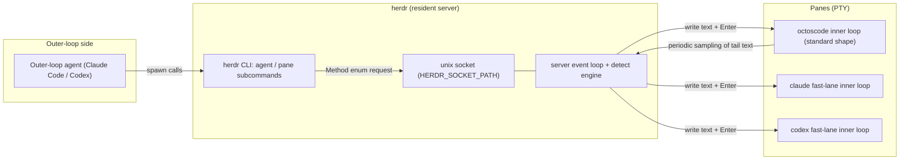
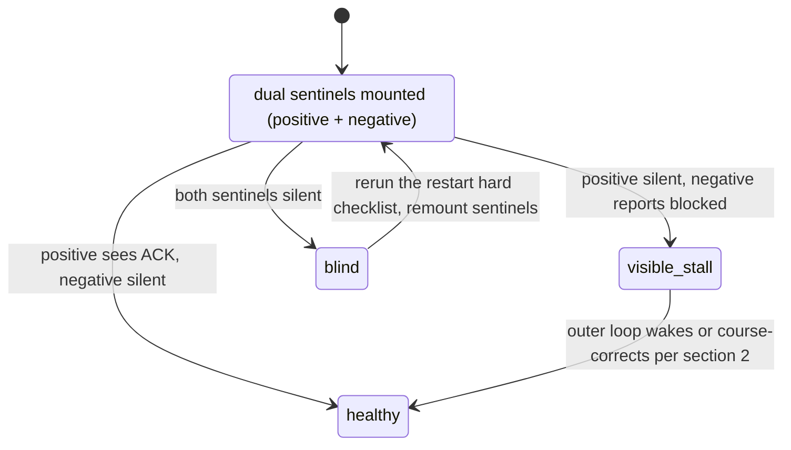

# Chapter 21: herdr and Outer-Loop Operations

> **Positioning**: This chapter covers herdr, the outer loop's cockpit: a background terminal-workspace service where the inner loop's panes live, discovered, injected into, and observed by the outer loop through a CLI and a socket API. The detection contract, the three primitives, the onboarding and restart checklists, the dual-sentinel recipe, platform pitfalls, and degraded modes come together here as one executable operations manual. Prerequisites: Chapter 19 (the octoscode client, the source of the text the detector matches) and Chapter 20 (the OLP protocol clauses). Who should read it: engineers building or operating a dual-loop system, writing toolchains that drive terminals with agents, or evaluating the "let an agent operate the terminal" route.

## 21.1 The Cockpit: Terminals Live Inside a Server

The previous two chapters covered both ends of the dual loop: Chapter 19's octoscode is the inner loop's terminal client, and Chapter 20's OLP v2 is the outer loop's behavioral contract. One piece is still missing. The outer loop is itself an agent process, with no eyes and no keyboard; how does it see what is on the inner loop's pane, and how does it type a prompt into the inner loop's input box? The answer is to give the terminal a server, so the terminal stops being an appendage of a process and becomes a resident of a service.

herdr's README defines itself as the runtime your coding agents live on (`herdr/README.md:29`). Unpacked, that definition is four promises (`herdr/README.md:31` through `herdr/README.md:34`):

1. always running: herdr is a background server, and terminals live inside it. Close the laptop, drop the network, reboot the machine; the agent keeps working, the session survives, and you reattach from any terminal or over ssh.
2. never hunt for the stuck one: every pane is marked working / blocked / idle; when an agent stops and waits for an answer, herdr flags it instead of making you hunt pane by pane.
3. agent-native: agents drive herdr through the CLI and the socket API, opening panes, prompting each other, waiting until another agent is genuinely blocked.
4. runs what you already run: herdr neither wraps nor replaces claude code, codex, cursor, opencode, grok, or any other tool; it only owns their terminals.

The fourth promise matters most for this book. herdr knows nothing about octos goals, ledgers, or blackboards; it hosts terminals, nothing more. Its entire understanding of an agent reduces to two questions: what is running in this pane, and what state is it in? The answers live in the detect module and a 40-line recognition manifest, the protagonists of the next two sections. Keyboard and mouse are both first-class citizens (`herdr/README.md:35`), the whole program is one rust binary, no electron (`herdr/README.md:37`); source builds use `cargo build --release`, unit tests run with `just test`, and maintenance checks with `just check` (the development section starting at `herdr/README.md:71`).

Set the size on the table first: herdr's `src/` holds 245 `.rs` files and 229,696 lines; the top level has 37 files and 29,927 lines. The largest subdirectory is `app` (54 files, 65,400 lines, among them `herdr/src/app/mod.rs` at 6,606 lines, `herdr/src/app/actions.rs` at 6,155, and `herdr/src/app/api.rs` at 2,303), followed by `server` (16 files, 19,166 lines, including the headless mode `herdr/src/server/headless.rs`), `ui` (17 files, 12,416 lines), `pane` (9 files, 10,540 lines), `integration` (13 files, 9,822 lines), and `api` (22 files, 8,957 lines). The CLI layer the outer loop talks to is thin by comparison: `herdr/src/cli/agent.rs` is 949 lines and `herdr/src/cli/pane.rs` is 2,108. The thinness is deliberate: the CLI does no business logic, only argument parsing and forwarding. Each subcommand function packs its arguments into a schema type, sends it through `send_request` (`herdr/src/cli.rs:762`) to the unix socket, and waits for the server to answer.

The topology:



Socket addressing has a fallback chain: `active_api_socket_path` (`herdr/src/session.rs:173`) reads the environment variable `HERDR_SOCKET_PATH` first (the constant is defined at `herdr/src/api/mod.rs:20`); if unset, it derives `<config_dir>/sessions/<name>/herdr.sock` from the session name (`api_socket_path_for`, `herdr/src/session.rs:169`); and the config directory respects `XDG_CONFIG_HOME` (`herdr/src/config/io.rs:30`). This chain explains how multiple instances coexist: one socket per session, and any outer-loop script that can name the session can find the channel. Thin-client mode has a dedicated `herdr-client.sock` (`client_socket_path_for`, `herdr/src/session.rs:183`); the client module describes itself as connects to the server's client socket (`herdr/src/client/mod.rs:1`).

Inside the server, the module first lines assemble the event flow: background tasks never touch the UI directly, they hand events over a channel to the main loop (`herdr/src/events.rs:1`, internal app events delivered via channel). The event enum `AppEvent` is defined at `herdr/src/events.rs:56`; the four variants that concern the outer loop are `PaneDied` (`:58`), `AgentProcessDetected` (`:60`), `StateChanged` (`:66`), and `HookStateReported` (`:76`). Pane layout is a BSP tree (`herdr/src/layout.rs:1`, BSP tree layout for tiling panes), and headless mode runs the event loop without a real terminal (`herdr/src/server/headless.rs:1`). Read these modules together and one event bus sits behind everything: the screen `herdr pane read` returns, the status `agent list` reports, and the completion signal of `agent wait` all ride the same stream; `StateChanged` fires on the detect engine's verdict, and the wait family (Section 21.3) subscribes to it to decide when a wait is satisfied.

The boundary with the neighboring chapters is drawn here: Chapter 19 covers octoscode itself, the thing being observed; this chapter only consumes its on-screen text. Chapter 20 covers the protocol clauses (R1 through R7, ACK syntax, the blackboard, the outer-reviewer lock); this chapter does not restate them, it covers the operational surface where those clauses are executed through herdr. herdr's plugin system and remote ssh are out of scope.

## 21.2 The Detection Contract: Inferring State from the Screen

Everything herdr knows about an agent comes from the screen. The detect module's documentation says it plainly (`herdr/src/detect/mod.rs:1`): the tail text of each pane's active buffer is read periodically and matched against the output patterns of known agents to produce a state. The state machine is the four-state `AgentState` (`herdr/src/detect/mod.rs:13`): `Idle` (`:15`), `Working` (`:17`), `Blocked` (`:18`), `Unknown` (`:19`). The first three deliver the README's promise; the fourth is reserved for plain shells and unrecognized programs.

The recognized programs are enumerated in `Agent`, 24 in all (`Agent::ALL`, starting at `herdr/src/detect/mod.rs:71`), and octoscode is one of them: `Agent::Octoscode` (`herdr/src/detect/mod.rs:67`). Note the version fact that this variant exists only on herdr's `feat/octoscode-agent` branch (this chapter's baseline `fefe5c4f`, whose commit title is exactly feat(detect): add octoscode as a supported agent); upstream master has not merged it yet. The agents matched through screen manifests number 22 (`SCREEN_MANIFEST_AGENTS`, `herdr/src/detect/mod.rs:98`, with `Self::Octoscode` at `:120`); each manifest is an embedded TOML compiled into the binary at `herdr/src/detect/manifest.rs:256` as ("octoscode", include_str!("manifests/octoscode.toml")). Labels and executable names each have a mapping: `agent_label` renders the variant as octoscode (`herdr/src/detect/mod.rs:124`, `:149`), `interactive_agent_executable` returns the launch executable (`:153`, `:184`), and `parse_agent_label` parses labels back, with octoscode and the alias octos-tui both resolving to the same variant (`herdr/src/detect/mod.rs:188`, `:225`).

Manifests also solved an engineering problem: recognition rules are data, not code. Supporting a new agent requires no change to the detect engine, only a new TOML file plus one enum variant hung on the list. The rules carry their own version (octoscode's is 2026.08.23.1) and min_engine_version (1), and the manifest update module (`herdr/src/detect/manifest_update.rs`) can evolve independently of the engine. The side that matters more to this book's readers is that recognition rules live on the opposite end from the thing recognized. If the octoscode team rewords its status bar once, herdr, and any tool doing the same thing, must follow with a rule change; nothing at compile time protects this coupling. The only guard is the single `herdr agent list` step in the smoke checklist.

The full octoscode detection contract is 40 lines (`herdr/src/detect/manifests/octoscode.toml`): the first 5 lines are manifest metadata, and the body is three rules:

```toml
id = "octoscode"
version = "2026.08.23.1"
min_engine_version = 1
updated_at = "2026-08-23T00:00:00Z"
aliases = ["octos-tui"]

[[rules]]
id = "approval_blocked"
state = "blocked"
priority = 1100
region = "whole_recent"
visible_blocker = true
any = [
  { contains = ["Approval | y once | s session | n deny"] },
  { contains = ["Waiting on you"] },
  { contains = ["Ctrl+R/Alt+A answer"] },
  { contains = ["审批 | y 本次 | s 本会话"] },
]

[[rules]]
id = "statusbar_working"
state = "working"
priority = 1000
region = "bottom_non_empty_lines(6)"
visible_working = true
any = [
  { line_regex = ['state\s*[·,]\s*Working'] },
  { contains = ["Esc interrupt"] },
]

[[rules]]
id = "statusbar_idle"
state = "idle"
priority = 900
region = "bottom_non_empty_lines(6)"
any = [
  { line_regex = ['state\s*[·✓,⚠]*\s*(Idle|Done)'] },
  { contains = ["Tab agents | Ctrl+O expand"] },
  { contains = ["Ask Octos to change code"] },
]
```

The three rules are worth taking apart field by field. id is the rule's stable identifier; state is what gets written to the pane when the rule hits; priority arbitrates when several rules hit at once, and blocked's 1100 outweighs working's 1000 and idle's 900, which matches intuition: an approval dialog on screen is more urgent than a status bar. region bounds where matching happens: the blocked rule watches whole_recent (the whole recent buffer, because an approval box can appear anywhere), while the two status-bar rules watch only bottom_non_empty_lines(6) (the bottom six non-empty lines, where the status bar lives). The `any` array is or-semantics: any clause matching makes the rule true. Two of the three booleans are arbitration signals: `visible_blocker` and `visible_working` assert that this state is genuinely visible on screen, and they feed the detect engine's source arbitration (the `AgentDetection` structure, starting at `herdr/src/detect/mod.rs:25`); screen evidence can override a non-blocked state reported by an integration.

Why can octoscode's detection be this thin? Chapter 19 gave the answer: the dumb-client architecture makes the on-screen text faithfully reflect server state, so the status bar is both a human interface and a machine observation surface. The same Working string reads as "busy" to a human eye and as state=working to herdr's regex. The maintenance duty follows from this: any status-bar rework on the octoscode side must update this manifest in the same change, or the outer loop's eyes go blind at once. The quick-verification manual depends on exactly this: the smoke section requires `herdr agent list` to show `octoscode | <pane> | idle` (`octoscode/docs/OLP_QUICKSTART.md:151`), and that idle is the `statusbar_idle` rule hitting; if the rule stops matching, the smoke test fails at step one.

## 21.3 The Outer Loop's Three Primitives: Discover, Inject, Observe

The CLI's dispatch structure is short. The top entry `maybe_run` (`herdr/src/cli.rs:95`) routes on the first argument: `"agent"` at `herdr/src/cli.rs:125`, `"pane"` at `herdr/src/cli.rs:127`. `run_agent_command` (`herdr/src/cli/agent.rs:12`) then dispatches 11 subcommands: list, get, read, send-keys, prompt, rename, focus, wait, attach, start, explain (`:19` through `:29`); `run_pane_command` (`herdr/src/cli/pane.rs:12`) dispatches list, get, read, split, send-keys, wait-output, run, and others. The outer loop's daily work sits on three to five of these commands, and they reduce to three primitives.

**Discovery**: `herdr agent list`, implemented by `agent_list` (`herdr/src/cli/agent.rs:438`, usage line `:440`), sends `Method::AgentList` (`herdr/src/api/schema.rs:107`). It returns each pane's agent label, pane number, and state. The outer loop's first act on shift is to run it, turning "which pane is my inner loop" into one line of output.

**Injection**: `herdr agent prompt <target> <text> [--wait] [--until STATUS]... [--timeout MS]`, implemented by `agent_prompt` (`herdr/src/cli/agent.rs:771`, usage line `:774`). `--until` and `--timeout` require `--wait` (a check at `:825` and another at `:828`); the request enters the server via `Method::AgentPrompt` (`herdr/src/api/schema.rs:127`), and the parameter type `AgentPromptParams` has three fields: target, text, and optional wait options (`herdr/src/api/schema/agents.rs:176`, fields at `:177` through `:180`).

**Observation**: `herdr pane read <pane_id> [--source visible|recent|recent-unwrapped|detection] [--lines N] ...`, implemented by `pane_read` (`herdr/src/cli/pane.rs:455`, USAGE constant `:473`), via `Method::PaneRead` (`herdr/src/api/schema.rs:175`). `--source detection` returns the detect engine's verdict directly, the first place to look when recognition misbehaves.

Beyond the three primitives there are three supporting commands. `herdr pane split ... --direction right|down --cwd PATH` (`pane_split`, `herdr/src/cli/pane.rs:623`, usage `:733`) opens a new pane; the function head also reads the `HERDR_PANE_ID` environment variable (`:624`), letting a program running inside a pane split relative to itself. `herdr pane run <pane_id> <command>` (`pane_run`, `herdr/src/cli/pane.rs:1047`, usage `:1049`) executes a command in a pane, with an implementation that is almost transparent: it packs the command text plus one Enter key into `Method::PaneSendInput` and sends it down (`:1050` through `:1056`). `herdr agent wait <target> [--until STATUS]... [--timeout MS]` (`agent_wait`, `herdr/src/cli/agent.rs:506`, usage `:508`) blocks until the state is reached; the server side is `wait_for_agent` (`herdr/src/api/wait.rs:132`), and the same family holds `wait_for_output` (`:22`), `prompt_agent` (`:177`), and `wait_for_event` (`:661`).

The full sequence of one injection, with the server's four gates in focus:

```mermaid
sequenceDiagram
    participant O as Outer-loop agent
    participant C as herdr CLI
    participant S as herdr server
    participant T as Inner-loop terminal (octoscode)

    O->>C: herdr agent prompt <pane> '<text>' --wait --until idle
    C->>S: agent.prompt(AgentPromptParams)
    S->>S: Gate 1 empty text → empty_agent_prompt
    S->>S: Gate 2 blocked → agent_blocked (interactive input required)
    S->>S: Gate 3 unrecognized or startup not ready → agent_not_ready
    S->>S: Gate 4 foreground process name mismatch → agent_not_ready
    alt all four gates pass
        S->>T: write text (encoded per terminal mode)
        S-->>T: Enter sent 300ms later
        T-->>S: status bar changes, detect matches the new state
        S-->>C: AgentPrompted; wait_for_agent satisfied
        C-->>O: success return
    else any gate rejects
        S-->>C: corresponding error code
        C-->>O: non-zero exit
    end
```

The four gates are what `handle_agent_prompt` (`herdr/src/app/api/agents.rs:62`) executes in order: empty text is rejected (`:63` through `:65`, error code empty_agent_prompt); a blocked target pane is rejected (`:81` through `:89`, error code agent_blocked, on the grounds that it wants interactive input, not a new task); an unrecognized agent or an unready managed start returns agent_not_ready (`:95` through `:98`); the fourth gate deserves the most attention. `runtime_hosts_agent` checks the pane's foreground process name (`herdr/src/app/api/agents.rs:105` through `:112`), and a mismatch reports agent is no longer the pane foreground process. That function lives at `herdr/src/app/agents.rs:421`; its implementation takes the pane child process's foreground job (`foreground_job`), recognizes the agent inside it, and compares against the expectation. This fourth gate is the second half of the double gate behind "silent injection loss" in the outer-loop docs: the first half requires the pane to be on the named-agent list (a known agent), the second requires that the foreground process right now is that agent (`octoscode/docs/OLP_QUICKSTART.md:162`). Miss either one and the injection is dropped, and dropped without a sound.

With all four gates passed, the write happens in two steps: the text is encoded per terminal mode and written, then an Enter follows after a 300 ms delay (the `AGENT_PROMPT_SUBMIT_DELAY` constant at `herdr/src/app/api/agents.rs:13`, used at `:126`). The delay gives the TUI one beat to take the text into its input box; an immediate Enter could race ahead of the render. One Copilot edge case proves what this machinery is made of: after losing focus it ignores synthetic Enter, so before injecting into it herdr sends a focus gained event first and then writes the text (starting at `herdr/src/app/api/agents.rs:112`). octoscode needs no such step, but the edge case shows that herdr's injection channel carries fine-grained, per-agent adaptations for specific TUI behaviors, with the switches dispatched server-side by agent.

> **Engineering decision: why injection goes through the TUI's user-message layer instead of giving octoscode an API**
> Chapter 19's conclusion pays off here: octoscode is a dumb client with no server-side API for "receive external text"; its input box is the only public entrance. If herdr built a bespoke API for octos, it would have to understand sessions, cursors, and replay, breaking the runs what you already run promise; going through the TUI input box treats claude, codex, and octoscode alike, and herdr's knowledge of any agent stops at the screen forever. The contrast with the other downstream channel makes this clearer: `octos steer` also injects outer-loop text as a standalone user message, but it targets sessions and goes through serve's internal channel (`octoscode/docs/OLP_OUTER_BOOT.md` section 2), suited to interjecting while the inner loop's turn is in progress; herdr prompt targets panes and goes through the screen, suited to waking an idle inner loop. Same user-message layer, different direction and timing; the two complement rather than replace each other. The price must also be stated: this channel depends on the detection contract's text staying stable and must clear the double gate; when either end drifts, injection turns from "success" into "silence".

The legal state values differ between the two layers, a trap when debugging. `AgentStatus` at the CLI and API layer (`herdr/src/api/schema/common.rs:151`) has five states: idle, working, blocked, done, unknown (`:152` through `:156`), and the CLI parse function accepts the same five (`herdr/src/cli.rs:897`, branches at `:899` through `:903`); the detect layer's `AgentState` has four, with no done. The pane-report-side parse `parse_pane_agent_state` (`herdr/src/cli.rs:910` through `:915`) also accepts only four. Waiting with `--until done` for a state the detect layer never produces can only end in a timeout.

## 21.4 From Primitives to Operations: Onboarding, Restarts, Opening Inner Loops

The three primitives are parts; the OLP documents assemble them into checklists. Start with the opening principle of the outer-loop onboarding card (`octoscode/docs/OLP_OUTER_BOOT.md`): environment details drift, so never hardcode pane numbers, instance hashes, or session keys; the checklists teach discovery methods, not fixed values.

The onboarding checklist (combining `octoscode/docs/OLP_QUICKSTART.md` sections 1 and 2 with `OLP_OUTER_BOOT.md` section 0):

1. Dependency check: herdr is a "no, recommended" level dependency (`octoscode/docs/OLP_QUICKSTART.md:35`); without it you can fall back to tmux send-keys, and to get octoscode pane recognition you currently build from the `feat/octoscode-agent` branch.
2. Run the olp-init scaffold in the project directory, which generates `.octos/loop.md` and the blackboard template.
3. serve is always started by the operator's own hand; sandbox-exempt authorization is a trust decision that is never delegated to an agent.
4. `/loop resume` is the outer loop's job: run `/loop list` first to get the id, then resume with it; a bare resume is rejected.
5. Mount the dual sentinels (expanded in the next section).
6. Verify the fallbacks configuration and confirm the new session has been snapshotted: changing configuration without restarting is insurance on paper only.

The post-restart inspection of the inner loop is a four-step hard checklist (`octoscode/docs/OLP_OUTER_BOOT.md` section 0b, `:16` through `:32`), and "note it down and patch later" is forbidden: step one, serve comes up, by the operator's hand; step two, `/loop resume`, always done by the outer loop; step three, mount the dual sentinels; step four, verify fallbacks and the new-session snapshot. Behind the checklist stands a real incident: the maintenance heartbeat sat paused for a full day unnoticed, exposed only when the nightly main lane broke supply, the goal circuit-breaker tripped, and the sentinel blind spot all failed at once, an outage of 8 hours. The lesson is written into the checklist itself: while the main mechanism is healthy, a dead fallback layer is completely invisible; a fallback's health can only be established by inspection, never by accident.

Opening an inner loop is agent-agnostic. The inner-loop contract has four clauses (`octoscode/.octos/loop.md:5` onward): read the blackboard's Active section, execute the lowest-numbered un-ACKed entry, commit but never push, and finish by writing the ACK (done|wontdo|blocked) formula. Any agent that can read files, run commands, and be driven by herdr can serve as the inner loop. Three shapes to choose from as needed (`octoscode/docs/OLP_OUTER_BOOT.md` section 6): octoscode plus a cheap model is the standard shape, with the full goal, peer, ledger, steer, and event-stream machinery; Claude Code panes with approval exemption are high quality, suited to hard fast-lane slices; codex panes are isolated from the main reviewer's brand, which helps cross review. The opening action is just `herdr pane run`:

```bash
# Standard shape: octoscode on octos serve
herdr pane run <pane> 'cd <repo> && octoscode --stdio-command "octos serve --stdio --solo --danger-full-access"'
# Fast-lane shape: claude with approval exemption (executed by the operator's own hand)
herdr pane run <pane> 'cd <repo> && claude --dangerously-skip-permissions'
```

After opening, send the inner loop's onboarding prompt, pointing at `loop.md` and the blackboard's Active section. From then on the inner loop's maintenance cycle is triggered entirely by herdr-injected prompts: one prompt is one round of "read the board, take a task, execute, write the ACK". The outer loop never polls the inner loop's internal state; it wakes the inner loop only when the outer loop itself needs progress.

The division of labor between waking and course correction (`octoscode/docs/OLP_OUTER_BOOT.md` section 2, `:47` through `:58`): when the inner loop is idle, wake it with `herdr agent prompt`, one sentence pointing at the new blackboard entry number; while the inner loop is mid-turn, interject with `octos steer` instead, which does not interrupt the action and is consumed on the next beat. steer locates the instance by cwd, so it must run inside the project directory, and the session key is decoded from the URL in the filenames under `ls <repo>/.octos/octos/sessions/`. The criterion for which channel to use is a single lookup: the state reported by `herdr agent list`.

## 21.5 The Sentinel Recipe: Three Layers of Observation and the Dual Sentinels

Observation upstream has three layers, and none can be skipped (`octoscode/docs/OLP_OUTER_BOOT.md` section 3, `:60` through `:72`): layer one is the live screen, `herdr pane read <pane>`; layer two is the event stream, `tail -f .../data/events.jsonl`, watching for steer_consumed, escalation, goal_transition, and other events; layer three is the structural surface, `octos goal status` and `octos peer list`. The documents' tone comes from scars: delivery is not consumption, and consumption is not execution; watching one layer guarantees a misjudgment. The three layers answer three questions: the screen says what it looks like right now, the event stream says what happened at the protocol level, and the structural surface says whether the goal and peer books balance.

The dual sentinels are step three of the restart hard checklist: a positive sentinel watches for ACKs landing on the board, and a negative sentinel watches events.jsonl for `goal_transition blocked` and escalation. With only the positive sentinel, the silence of a tripped goal circuit-breaker is indistinguishable from "still working"; the negative sentinel covers exactly that blind spot. The negative sentinel chain over events.jsonl carries one more operational fact: the files are laid out per instance and per profile (paths like `~/.octos/instances/<instance>/profiles/<profile>/data/events.jsonl`), the instance name is a hash of the project cwd, and if you do not want it, `ls -t ~/.octos/instances/` matches directories by modification time. Nobody restarts a dead sentinel process for you, and the files are not guaranteed to persist forever, so the right shape for the negative sentinel is a "re-acknowledgeable on remount" tail, not a "no-gap-assumed" parser; the outer loop's own liveness belongs on the restart hard checklist too. The dual sentinels' state space:



Of the three states, the most dangerous is both sentinels silent: the inner loop may simply have nothing to do, or the entire observation chain may be broken, and from the outer loop the two look identical. Combining the sentinels with the three observation layers is the only way out: when the sentinels go quiet, read the third layer, the structural surface; `octos goal status` tells you whether the goal is active or long since blocked, and `octos peer list` tells you whether dispatched workers still exist. Writing this recipe into step three of the restart hard checklist is the cheapest way to never repeat the 8-hour lesson that a dead fallback layer is invisible.

## 21.6 Common Pitfalls and Degraded Modes

An operations chapter closes with the pitfalls. The first is the fourth gate from Section 21.3: silent injection loss. The symptom is that `herdr agent prompt` goes out, the inner loop shows no reaction, and the command may not even report an error. Two causes: the pane is not on the named-agent list, or the foreground process name does not match the expected agent (`octoscode/docs/OLP_QUICKSTART.md:162`). The typical timing is the inner loop running a shell command at that moment, so the foreground process is transiently bash rather than octoscode, and the injection lands inside that window. The fix has two layers: before retrying, run `herdr agent list` to confirm the state; when herdr is absent from the environment or the gates keep rejecting, degrade to tmux send-keys, with `--` separating text whose first character is `-`. Degrade with eyes open: send-keys is ungated raw keystrokes. The double gate, state waiting, and `--until` semantics are all gone; you have stepped down from the cockpit to a remote control.

The second pitfall is platform divergence: OLP's outer-reviewer lock (outer-duty) depends on flock and PDEATHSIG, is Linux-only, does not compile on macOS, and multiple coexisting outer loops fall back to the duty-roster discipline layer (covered in Chapter 20; `octoscode/docs/OLP_OUTER_BOOT.md` section 3.5). This is not a herdr defect but the platform boundary of the whole toolchain: running the dual loop on a mac, the main-reviewer mutex is a convention, not a lock.

The third pitfall is on the install side: when the first-launch automatic download of the octos server fails, it is usually offline or proxy trouble; install manually with `npm i -g @octos-org/octos`, and set `OCTOSCODE_NO_AUTO_INSTALL=1` to disable auto-install (`octoscode/docs/OLP_QUICKSTART.md` section 6 fault table; the source is `OPT_OUT_ENV` at `octoscode/src/backend_ensure.rs:60`). The same table has one Linux-only entry: a linker SIGBUS or EDQUOT while building a large project is a tmpfs quota problem; point TMPDIR at a home-disk path. The fourth pitfall is the version one: octoscode recognition lives on the fork branch, and a herdr built from upstream master silently fails to recognize `--kind octoscode`; the pane state stays unknown forever, the smoke step `octoscode | <pane> | idle` fails, and tracing back from that symptom is fastest. The lesson of this pitfall is the price of silent degradation: an upstream-built herdr still allocates a PTY for the octoscode pane and still echoes the screen; the only thing missing is recognition, with no install warning, no version negotiation, and no alarm flag on the unknown state. An operator who runs `herdr agent prompt` before `herdr agent list` gets agent_not_ready as the first feedback and easily misdiagnoses it as the fourth gate's process-match problem, burning triage time on the wrong gate. The avoidance is to copy the dependency-table sentence "build from the feat/octoscode-agent branch" (`octoscode/docs/OLP_QUICKSTART.md:35`) into the environment-preparation checklist, and to agree that the day it merges into master is the day every machine reinstalls herdr.

When triaging these pitfalls, `herdr agent explain` (`herdr/src/cli/agent.rs:41`, usage `:91`) and `pane read --source detection` are the two handy tools: the former explains why a pane was judged into its current state, and the latter returns the detect engine's raw verdict, separating "misrecognized" from "the screen really changed". The full CLI entry table prints on demand with `herdr agent help`; the help table is hardcoded in `print_agent_help` (`herdr/src/cli/agent.rs:922`, body `:923` through `:941`). Error messages also lead the way: mistype any subcommand argument and the usage string is echoed verbatim (usage lines match the source word for word; every usage quoted in this chapter comes from sed spot-checks against the facts table), so fix accordingly.

## 21.7 Boundaries and Recap

With Chapter 19: octoscode's status-bar text is the source of the detection contract, and the client architecture is what makes the screen observable; this chapter only consumes that contract and does not repeat the client's internals. With Chapter 20: the semantics of the blackboard, ACK, R1 through R7, and the outer-reviewer lock all live in that chapter; this chapter covers only the operational surface, meaning which herdr commands put those clauses into effect. With Chapter 18: the server-side mechanisms of goal and peer are not here; observation uses only the two read-only commands `octos goal status` and `octos peer list`.

The chapter's thread: herdr is a terminal host, not an agent framework, and its knowledge of agents reduces to the detect engine plus one manifest; the outer loop's three primitives (discover, inject, observe) map to the three CLI subcommands `agent list`, `agent prompt`, and `pane read`, with the server's four gates deciding whether an injection lands; onboarding, restart, the dual sentinels, and the three inner-loop shapes assemble the parts into an executable operations manual; silent loss and platform divergence are the two most expensive tuition payments in this practice. The full picture of the dual loop closes here: the inner loop's every state lives in the protocol and on the screen (Chapter 19), the outer loop's every behavior lives in the clauses (Chapter 20), and the hand that connects them is herdr (this chapter).

## Further reading

- `herdr/README.md`: the original statements of the positioning promises and the development workflow
- `herdr/src/detect/mod.rs`: the detect engine: AgentState, the Agent enum, manifest wiring
- `herdr/src/detect/manifests/octoscode.toml`: this chapter's detection contract in full, 40 lines
- `octoscode/docs/OLP_OUTER_BOOT.md`: the outer-loop onboarding card: restart hard checklist, three observation layers, opening inner loops
- `octoscode/docs/OLP_QUICKSTART.md`: dependency table, smoke verification, fault quick-reference
- `assets/ch21-facts.md`: the facts source for every number and line reference in this chapter, each with a replay command

## Exercises

1. If an octoscode revision changed the status-bar text from `state·Working` to `state: Working`, which links in this chapter's chain would break, and at what moment? Propose an engineering scheme that keeps the text and the manifest from drifting apart.
2. Why must the second half of the double gate (foreground process name matching) exist? Sketch an attack or accident without it: could a malicious or buggy shell loop that prints a fake status bar fool a system with only the first gate?
3. `AgentStatus` has done and `AgentState` does not. Find in the herdr source where done comes from (integration reports or screen inference), and argue the design cost of the two layers disagreeing.
4. What three things does the tmux send-keys fallback lose? If you had to add a minimal liveness check to the fallback channel, which primitive from this chapter would you reuse?
5. The blind state where both sentinels are silent cannot, from the outer loop alone, be distinguished from "the inner loop is idle". If you could add one low-cost periodic signal on the inner-loop side, which layer (screen, event stream, structural surface) would be cheapest and hardest to forge?

---

> **Version note**: This chapter is new in v2; the analysis baseline is herdr `feat/octoscode-agent` @ `fefe5c4f` (version 0.8.2,2026-08-29) and octos main @ `9c157101` (2026-09-02). All line counts, line numbers, and usage strings come from `assets/ch21-facts.md` (2026-09-03) and were re-verified by the author against the above baselines; octoscode document references cite relative paths. octoscode pane recognition (`Agent::Octoscode` and `herdr/src/detect/manifests/octoscode.toml`) currently lives only on the fork branch; once it merges into upstream master, master becomes authoritative. herdr iterates quickly, and CLI usage and manifest rules may shift between versions; anchor citations to symbol names and rule ids.
