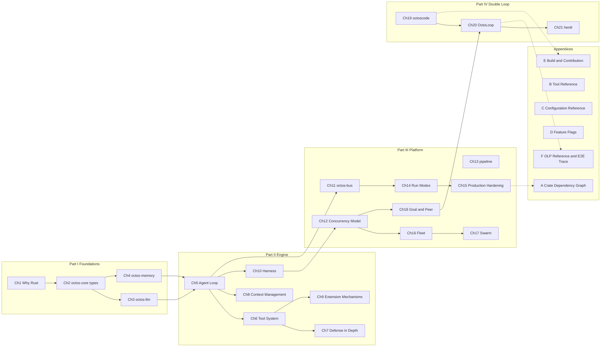

# Preface

## Why this book

AI agents are moving from demos to production. Most agent framework source you read along the way looks like a pile of scripts: prompts stitched from string concatenation, loose error handling, state that evaporates on every process restart. For a prototype, none of that matters. The moment you ask an agent to run long-lived, execute shell and file operations, and serve multiple tenants at once, what is missing is not a feature but operating-system-grade infrastructure: permission boundaries, concurrent scheduling, a recoverable execution ledger, an auditable protocol.

octos is an AI agent operating system built in Rust. The book tracks the main branch: roughly 700,000 lines of Rust across a 26-crate workspace, with `deny(unsafe_code)` at the workspace level. It is not a call-graph wrapper rewritten in yet another language; from its first line it was designed for multi-tenant isolation, production reliability, and scalable concurrency. The provider fault-tolerance chain ships credential rotation and circuit breakers (see Chapter 3); sandboxing and permissions are fail-closed (see Chapter 7); long-running tasks get an event ledger and resumption scheduling (see Chapter 12).

The second edition expands the book from 14 chapters to 21 and adds a fourth part on the double loop: how the outer loop (one supervising strong model plus an operations surface) drives the inner loop (a swarm of working models). Three chapters cover octoscode, the terminal client; OctoLoop outer protocol OLP v2; and herdr, the operations tool. Together they answer one question: when cheap models do the work in the inner loop, who reviews the result, and who takes over when they fail.

This book is not a user manual. It is a dissection of engineering decisions: each chapter digs into one subsystem, shows why it was designed that way, which alternatives were weighed, and what the choice cost. Every claim carries a source reference, so you can walk into the repository and check it yourself.

## Before you read

### Prerequisites

- Required: fluency in one mainstream programming language (Python, Go, Java, or C++), the ability to read code, and basic HTTP and JSON.
- Helpful but optional: elementary Rust. Chapter 2 uses traits and enums; Chapter 12 uses async/await. If Rust is new to you, do not stop here: Chapters 1-2 slow down on purpose, language details are explained in sidebars and comments where they appear, and skipping them does not break the main line.
- Helpful but optional: the basic vocabulary of LLM APIs (tokens, context window, tool calls). If you have never called one, you can still read this book: Chapter 3 starts from the provider abstraction and defines each concept as it is used.
- Not needed: machine-learning mathematics, model-training experience, compiler theory, or operating-system kernel development.

### Suggested reading paths

Path A: Rust beginner (learn Rust and agent engineering through one real, large project)
> Ch1 → Ch2 → Ch5 → Ch6 → then pick freely
> Ch1 explains why Rust was chosen, Ch2 shows how the type system defines a domain language, Ch5 walks a full conversation lifecycle, and Ch6 covers tool dispatch. After that, read by interest: Ch8 (context compaction) and Ch12 (concurrency model) are both good destinations. Give yourself two weeks to make peace with the borrow checker.

Path B: senior Rust developer (here for the architecture and concurrency of a large Rust system)
> Ch1 → Ch3 → Ch12 → then go deep
> Ch1's workspace topology and the argument for each choice are the map for the whole book; Ch3 covers the trait-object tradeoff in the provider abstraction; Ch12's three-layer concurrency scheduling (Tokio layer, supervisor layer, peer/lease layer) is the heart of this book's concurrency story. From there, branch by direction: security in Ch7 and Ch10, platform in Ch14 and Ch15, the multi-agent kernel in Ch16-18.

Path C: AI application developer (from calling the API to understanding the runtime inside)
> Ch1 → Ch5 → Ch6 → Ch14 → Ch19 → Ch20 → Ch21
> Ch5-6 answer what actually happens to the message you send; Ch14 settles run modes and configuration, and then you enter the double-loop part: the octoscode client (Ch19), the outer protocol OLP v2 (Ch20), and operations practice with herdr (Ch21). Ch18's goal/peer mechanisms are the server-side prerequisite for Ch20; read it first if time allows. Skipping implementation-detail sidebars costs nothing.

Path D: octos contributor (about to file your first PR against the repository)
> The whole book in order, plus Appendix A and Appendix E
> Appendix A's 26-crate dependency graph (63 edges) helps you locate the blast radius of a change; Appendix E covers building from source and the contribution process. The contract tests and event ABI in Chapter 10 are the interface most PRs cannot avoid.

### A knowledge map of the book

Two reading notes. First, Ch5 (the agent loop) is the hub of the book: the first four chapters lay its foundation, Chapters 6-10 unfold it, and the execution kernels of Chapters 12, 16, and 18 are all variants of it. Second, Part III runs on two tracks: Ch11-15 cover platform infrastructure (messaging, concurrency, workflows, configuration, production hardening) and Ch16-18 the multi-agent kernel (Fleet, Swarm, Goal/Peer); Part IV (Ch19-21) looks back over the whole book from the outer loop's vantage, and Chapter 20 depends on the server-side mechanisms of Chapter 18.

### Reading conventions

- Source references: full paths with line numbers, e.g. `crates/octos-agent/src/agent/execution.rs:2483`, locatable directly in the source repository. The repository keeps evolving and line numbers drift, so the text also names the symbol (function, type, or constant); when a line number stops matching, anchor on the symbol name.
- The three-layer annotation system (introduced in Chapter 20): when a mechanism is described, the text states which layer enforces it: a protocol clause (documentation only), a Markdown convention (blackboard, ACK, and other conventions with no runtime code), or a contract test (mechanical checks against a snapshot or a real subprocess). The distinction was first used for the outer protocol OLP v2, and it carries over when you read Parts III and IV: knowing who enforces a rule tells you what happens when it is broken.
- Engineering decision sidebars: one blockquote per chapter (starting with `>`) weighing 2-3 alternatives and stating the cost of the final choice.
- Version notes: each chapter ends with how that subsystem's mechanisms changed across versions, so you can reconcile differences against the release in your hands.
- Chapter positioning: a blockquote at the head of each chapter states its prerequisites and intended readers, enough to decide at a glance whether to skip it.
- Mermaid diagrams: architecture diagrams, state machines, and sequence diagrams appear throughout the text and render in any Mermaid-capable reader.
- Exercises: 2-5 open questions close each chapter, suited to team discussion or self-testing.

### The baseline of this book

Version baselines: octos main repository main @ `9c157101` (figures gathered 2026-09-02), octoscode @ `1129fa33`, and herdr branch `feat/octoscode-agent` @ `fefe5c4f`. All scale and line-count figures in this book (26 crates, roughly 700,000 lines of Rust, 63 dependency edges, per-module line counts) come from the per-chapter facts tables (`assets/chNN-facts.md`), each with a reproduction command, checkable against the corresponding baseline. The three repositories in Chapters 19-21 move fast; line-number drift is normal there, and references anchor on symbol names.

---

May this book leave you with more than an understanding of octos: a yardstick for judging agent infrastructure. Whenever you read about any agent system, carry four questions:

- Where is the security boundary: which process, which syscall, which line of code enforces it?
- Who enforces the protocol: the compiler, the runtime, a contract test, or a document that merely states it?
- Can state be recovered: after a crash, which checkpoint does the restart resume from, and which work is lost?
- Where do errors go: swallowed, logged, reported, or silently retried?
