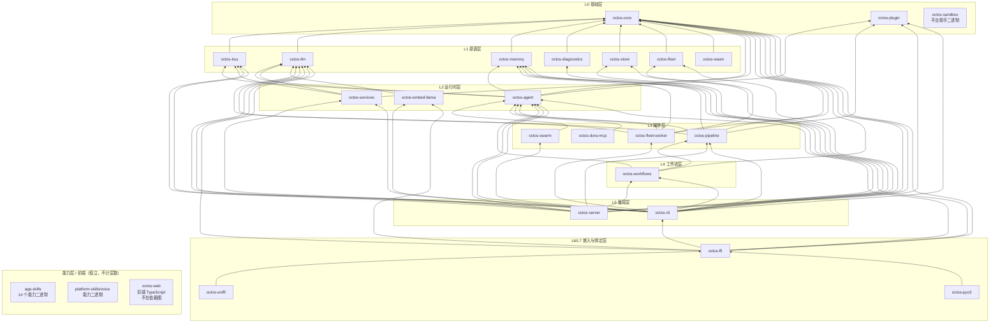

# 附录 A：octos 完整 Crate 依赖图

> **定位**：本附录是全书 21 章共用的地图页，给出 octos workspace 26 个顶层条目、23 个 `octos-*` crate 的完整依赖关系：63 条内部依赖边的全量图、逐 crate 的层数/行数/依赖矩阵，以及含 feature-gate 标注的外部依赖明细。前置依赖：第 1 章（1.3 节 workspace 拓扑与三处事实澄清）。适用场景：读任何一章想知道「这个 crate 在全局什么位置、它依赖谁、谁依赖它」时翻到这里；为 octos 贡献代码前想确认依赖方向时对照这里。

本附录数据与第 1 章同源同口径：统计基线为 octos main @ `9c157101`，唯一数据源是仓库事实表 `assets/appendixA-facts.md`（与 `assets/ch01-facts.md` 六项汇总数字交叉核对全部一致，见 A.1）。依赖边只取各 crate `Cargo.toml` 的 `[dependencies]` 段中的 `octos-*` 条目，排除 `[dev-dependencies]` 与 `[build-dependencies]`；行数统计口径为 `find crates/<name> -name '*.rs' | xargs wc -l | tail -1`。两个口径的完整复现命令都收录在 `assets/appendixA-facts.md` 中，本附录不重复罗列，只给结论。

## A.1 汇总数字

| 指标 | 数值 |
|---|---|
| 依赖边总数（`[dependencies]` 段 octos-\*） | 63 |
| `ls crates \| wc -l` 顶层条目 | 26 |
| 其中 `octos-*` crate | 23 |
| 根 `Cargo.toml` 的 workspace members | 38 |
| 分层数（严格最长路径，L0–L7） | 8 |
| 行数合计（26 个顶层条目） | 700,915 |

机器核对命令（在 octos 源码仓库根执行）：

```bash
awk '/^\[dependencies\]/{f=1;next} /^\[/{f=0} f && /^octos-/' crates/*/Cargo.toml | wc -l   # 63
ls crates | wc -l                              # 26
find crates -name '*.rs' | xargs wc -l | tail -1   # 700915 total
```

六个数字与 `assets/ch01-facts.md` 的 §1/§3/§4/§5 逐项一致，本附录是在其之上的全量展开。

## A.2 内部依赖全图：63 条边



图与第 1 章 1.3.4 节同构，63 条边与 `assets/appendixA-facts.md` §3 的边清单逐条一致，一条不多、一条不少。方向为 `A --> B` 即 A 依赖 B；`graph BT` 自底向上读，越靠上的 crate 越靠近用户。逐 crate 边数：octos-cli 15、octos-server 9、octos-ffi 6、octos-agent 5、octos-pipeline 5、octos-fleet-worker 5、octos-services 3、octos-workflows 3，其余各 1 条。图中的短名是 mermaid 节点别名，实际包名一律以 `octos-` 开头（如 `diag` 即 `octos-diagnostics`）。

四点读图提示。其一，`octos-core` 被 15 个 crate 依赖，是唯一的根，它自己零内部依赖（第 2 章）；`octos-agent` 被 8 个 crate 依赖，是第二枢纽（第 5 至 10 章）。其二，依赖全部指向下方、无环，分层是 `cargo` 在编译期强制的不变量，不是文档约定。其三，`octos-sandbox`、`app-skills`、`platform-skills/voice`、`octos-web` 四个孤立节点不在 63 条边内：能力二进制与前端通过进程边界而非 Cargo 依赖接入平台。其四，spec 特意澄清的两点：`app-skills` 与 `platform-skills` 虽是 workspace 成员（作为目录成员计入 38），但它们是能力二进制集合，不展开进核心 crate 图；近期 goal/peer/agent 编排的新模块落在 `crates/octos-cli/src/autonomy/` 与 `crates/octos-agent/src/` 的工具层，不存在也不应画出 `octos-autonomy` 这样的 crate 节点（第 18 章）。

## A.3 逐 crate 数据表

「层」= 严格最长路径层数：1 + max(其 octos-\* 依赖的层)，零内部依赖为 L0。「外部依赖数」= `[dependencies]` 段非 octos-\* 条目数，含 feature-gated 条目；`名称.workspace = true` 继承写法按包名归一计数。

| crate | 层 | Rust 行数 | 依赖的 octos-\*（[dependencies]） | 外部依赖数 |
|---|---|---|---|---|
| octos-core | L0 | 22,313 | —（零内部依赖） | 7 |
| octos-plugin | L0 | 5,165 | —（零内部依赖） | 7 |
| octos-sandbox | L0 | 1,468 | —（零内部依赖） | 2 |
| octos-bus | L1 | 42,767 | octos-core | 31 |
| octos-llm | L1 | 35,087 | octos-core | 14 |
| octos-memory | L1 | 6,428 | octos-core | 11 |
| octos-diagnostics | L1 | 2,243 | octos-core | 4 |
| octos-store | L1 | 2,664 | octos-core | 12 |
| octos-fleet | L1 | 16,888 | octos-core | 8 |
| octos-wasm | L1 | 883 | octos-core | 5 |
| octos-agent | L2 | 191,985 | octos-core, octos-bus, octos-memory, octos-llm, octos-plugin | 47 |
| octos-services | L2 | 3,223 | octos-core, octos-llm, octos-bus | 11 |
| octos-embed-llama | L2 | 911 | octos-llm | 5 |
| octos-pipeline | L3 | 32,799 | octos-core, octos-agent, octos-plugin, octos-llm, octos-memory | 10 |
| octos-swarm | L3 | 4,980 | octos-agent | 11 |
| octos-dora-mcp | L3 | 11 | octos-agent | 0 |
| octos-fleet-worker | L3 | 6,842 | octos-agent, octos-core, octos-fleet, octos-llm, octos-memory | 5 |
| octos-workflows | L4 | 1,059 | octos-core, octos-agent, octos-pipeline | 6 |
| octos-server | L5 | 21 | octos-core, octos-agent, octos-llm, octos-bus, octos-store, octos-services, octos-workflows, octos-pipeline, octos-plugin | 22 |
| octos-cli | L5 | 307,299 | octos-core, octos-bus, octos-llm, octos-memory, octos-agent, octos-diagnostics, octos-store, octos-services, octos-workflows, octos-pipeline, octos-swarm, octos-plugin, octos-fleet, octos-fleet-worker, octos-embed-llama | 55 |
| octos-ffi | L6 | 1,372 | octos-core, octos-agent, octos-llm, octos-memory, octos-cli, octos-embed-llama | 4 |
| octos-uniffi | L7 | 465 | octos-ffi | 1 |
| octos-pyo3 | L7 | 756 | octos-ffi | 1 |

三个非 `octos-*` 顶层条目不在上表中，以文字说明结论（详见 `assets/ch01-facts.md` §1.3/§3.2）：`crates/app-skills` 是 14 个能力二进制目录，共 12,098 行，无顶层 Cargo.toml；`crates/platform-skills` 是 1 个技能二进制 voice，1,188 行；`crates/octos-web` 是 TypeScript 前端，0 个 .rs 文件，也不是 workspace 成员。三者的 `[dependencies]` octos-\* 依赖均为 0。逐 crate 行数用一例说明复现方式，其余同式：`find crates/octos-core -name '*.rs' | xargs wc -l | tail -1` → 22313。

## A.4 L0–L7 分层导览

层不是按模块大小或重要性的主观分类，而是从 63 条边机械推导出的严格最长路径：一个 crate 的层等于它到 L0 的最长依赖链长度。这一节逐层给出导览，并标注展开该层的章节。

### L0 基础层：octos-core、octos-plugin、octos-sandbox

三个零内部依赖的 crate，整个依赖树的根。`octos-core` 用类型系统定义平台领域语言：会话、消息、记忆、配置的统一数据契约（第 2 章），被 15 个 crate 依赖，任何接口变动都会波及全库，因此它的稳定性纪律最严格。`octos-plugin` 定义插件契约与可执行文件发现逻辑（第 9 章），同样保持零内部依赖，让扩展机制可以独立于核心演进。`octos-sandbox` 是一个独立的 Windows AppContainer 助手二进制，不被任何 crate 依赖，它是平台助手工具而非沙箱子系统，真正的沙箱实现在 `octos-agent` 内部（第 7 章），这是 v2 重写作了显式澄清的一处常见误读。

### L1 原语层：octos-bus、octos-llm、octos-memory、octos-diagnostics、octos-store、octos-fleet、octos-wasm

七个只依赖 L0 的领域原语，每个封装一类外部世界：`octos-bus` 是 17 个频道源文件组成的多频道消息抽象（第 11 章），也是全库外部依赖最多的 L1 crate（31 项，含 11 项 gated 的频道集成）；`octos-llm` 驯服 LLM Provider 的混乱，统一补全、流式与凭据管理（第 3 章）；`octos-memory` 实现混合搜索的工作记忆与长期记忆（第 4 章）；`octos-store` 提供会话持久化（第 15 章）；`octos-diagnostics` 承担诊断上报（第 15 章）；`octos-fleet` 是 Fleet 内核的持久化与计划数据层（第 16 章）；`octos-wasm` 面向浏览器场景提供 wasm 绑定。这一层的共性是：彼此之间互不依赖，全部横向平行，改动任何一个不会波及其余六个。

### L2 运行时层：octos-agent、octos-services、octos-embed-llama

第一个纵向聚合点。`octos-agent` 是全库最大的 crate（191,985 行），聚合 agent loop、59 个工具源文件、沙箱、上下文管理与 harness 模块（第 5 至 10 章的全部主题），5 条内部依赖汇聚 core/bus/memory/llm/plugin。`octos-services` 依赖 core/llm/bus 三者，提供生产环境的服务侧能力（第 15 章）。`octos-embed-llama` 只依赖 `octos-llm`，把本地 llama.cpp 嵌入推理接到统一的 LLM trait 之后，且默认不编译（gated）。这一层的边界意义在于：L1 之上开始出现「组合多个原语」的代码，但仍然不感知具体产品形态。

### L3 编排层：octos-pipeline、octos-swarm、octos-dora-mcp、octos-fleet-worker

四个 crate 都直接依赖 `octos-agent`，把单个 Agent 组合成更大的执行结构。`octos-pipeline` 是 DOT 驱动的流水线引擎，12 种 IR 节点（第 13 章）；`octos-swarm` 实现契约扇出与聚合门禁（第 17 章）；`octos-fleet-worker` 是 Fleet 计划执行内核的 worker 侧，5 条内部依赖全部为 workspace 继承写法（第 16 章）；`octos-dora-mcp` 是 Dora/MCP 工具桥，只有 11 行 Rust、零外部依赖，是全库最小的 crate。编排层的代码不直接面对用户，它们是 L4/L5 的备料。

### L4 工作流层：octos-workflows

单节点的一层，依赖 core/agent/pipeline 三者，把流水线执行封装为可复用的工作流单元。它的存在使 `octos-server` 与 `octos-cli` 可以用同一种方式消费 pipeline 能力，而不必各自编排 handler。这是典型的「加一层换解耦」决策：层多了一跳，但集成方少了一份重复。

### L5 集成层：octos-server、octos-cli

用户与外部世界接触的两个入口。`octos-cli` 是全库第二大 crate（307,299 行），15 条内部依赖横跨所有层，goal/peer 编排（第 18 章）、coding autonomy（第 19 章）与外环 OctoLoop（第 20 章）的运行时模块都在它的 `src/autonomy/`、`src/peers/` 之下；55 项外部依赖也是全库之最。`octos-server` 只有 21 行 Rust，它是从 cli 拆出的 HTTP/WebSocket 服务端薄壳，核心能力仍在其依赖的 crate 中，HTTP 层整体装进 `api` feature 门后（第 15 章）。

### L6 嵌入核心层：octos-ffi

C ABI 稳定层。依赖 6 个 crate（core/agent/llm/memory/cli/embed-llama），把平台的常用能力面收敛为一组跨语言函数边界。注意它依赖 L5 的 `octos-cli` 而非更底层：嵌入方拿到的是「完整产品能力」而非「原语拼装件」，这个取舍让绑定层变薄、让 ffi 层变重，是有意的。

### L7 绑定层：octos-uniffi、octos-pyo3

最外的两个叶子，各自只依赖 `octos-ffi`：`octos-uniffi` 面向 Swift/Kotlin 移动端，`octos-pyo3` 面向 Python（`pyo3@0.23`，配置见 `crates/octos-pyo3/Cargo.toml`，整体 gated）。每新增一种语言绑定只需在 L7 加一个叶子 crate，不触碰任何内层。L6/L7 拆两层正是为了让绑定扩展的改动半径最小。

### 能力层（不计层数）

`app-skills`（14 个能力二进制）、`platform-skills/voice`、`octos-web` 通过进程边界或静态资源方式接入，零 octos-\* 依赖边，因此不出现在 A.3 的表与 A.2 的 63 条边中。它们享受 workspace 的统一工具链与 lint 配置，却不进入核心编译图，发布与编译互不拖累。

## A.5 外部依赖明细表

下表列出每个 crate `[dependencies]` 段的全部外部依赖，格式为 `名称@版本要求`；加 `*` 后缀 = feature-gated（`optional = true`，由该 crate 的 `[features]` 控制，默认构建不编译）。版本要求逐字摘自基准 commit 的 `[workspace.dependencies]` 继承或 crate 内联写法；`名称.workspace = true` 继承条目已解析为实际版本要求。全库外部依赖合计 279 项，与 A.3 的「外部依赖数」列合计一致。

| crate | 外部依赖（名称@版本，`*` = gated） |
|---|---|
| octos-core | serde@1, serde_json@1, chrono@0.4, uuid@1, eyre@0.6, tracing@0.1, sha2@0.10 |
| octos-plugin | serde@1, serde_json@1, eyre@0.6, tracing@0.1, which@7, tokio@1, metrics@0.24 |
| octos-sandbox | clap@4, eyre@0.6 |
| octos-bus | tokio@1, lru@0.16, async-trait@0.1, serde@1, serde_json@1, chrono@0.4, chrono-tz@0.10, uuid@1, cron@0.15, eyre@0.6, tracing@0.1, metrics@0.24, futures@0.3, reqwest@0.12, serde_yml@0.0.12, subtle@2, sha2@0.10, aes@0.8, cbc@0.1, base64@0.22; gated: teloxide@0.17\*, serenity@0.12\*, tokio-tungstenite@0.26\*, axum@0.8\*, async-imap@0.11\*, tokio-rustls@0.26\*, rustls@0.23\*, rustls-native-certs@0.8\*, webpki-roots@0.26\*, lettre@0.11\*, mailparse@0.16\* |
| octos-llm | async-trait@0.1, reqwest@0.12, tokio@1, serde@1, serde_json@1, eyre@0.6, futures@0.3, secrecy@0.10, tracing@0.1, base64@0.22, chrono@0.4, redb@2, metrics@0.24, jsonwebtoken@9 |
| octos-memory | regex@1, redb@2, tokio@1, serde@1, serde_json@1, chrono@0.4, uuid@1, eyre@0.6, tracing@0.1, hnsw_rs@0.3, bincode@1 |
| octos-diagnostics | serde@1, serde_json@1, eyre@0.6; gated: reqwest@0.12\* |
| octos-store | chrono@0.4, eyre@0.6, serde@1, serde_json@1, sha2@0.10, base64@0.22, tracing@0.1, redb@2, uuid@1, tokio@1, getrandom@0.2, constant_time_eq@0.3 |
| octos-fleet | eyre@0.6, redb@2, rusqlite@0.32, serde@1, serde_json@1, tokio@1, tracing@0.1, uuid@1 |
| octos-wasm | serde@1, serde_json@1, wasm-bindgen@0.2, serde-wasm-bindgen@0.6, js-sys@0.3 |
| octos-agent | async-trait@0.1, tokio@1, serde@1, serde_json@1, toml@0.8, chrono@0.4, eyre@0.6, tracing@0.1, metrics@0.24, glob@0.3, globset@0.4, shlex@1, which@7, dunce@1, regex@1, ignore@0.4, futures@0.3, reqwest@0.12, rmcp@1.8, tokio-util@0.7, oauth2@5, reqwest_rmcp@0.13（内联表，`package = "reqwest"` 重命名，default-features = false + features = ["rustls"]）, tiny_http@0.12, webbrowser@1, keyring@3, url@2, htmd@0.5, dirs@5, sha2@0.10, flate2@1, tar@0.4, libc@0.2, base64@0.22, chromiumoxide@0.9, pdf-extract@0.9, tempfile@3, lettre@0.11, redb@2, hound@3; gated: gix@0.79\*, similar@2\*, tree-sitter@0.24\*, tree-sitter-rust@0.23\*, tree-sitter-python@0.23\*, tree-sitter-javascript@0.23\*, tree-sitter-typescript@0.23\*, symphonia@0.5\* |
| octos-services | chrono@0.4, eyre@0.6, serde@1, serde_json@1, tokio@1, tracing@0.1, reqwest@0.12, flate2@1, tar@0.4, dirs@5, futures@0.3 |
| octos-embed-llama | eyre@0.6, async-trait@0.1, tracing@0.1; gated: llama-cpp-2@0.1\*, self_cell@1\* |
| octos-pipeline | async-trait@0.1, tokio@1, serde@1, serde_json@1, eyre@0.6, futures@0.3, tracing@0.1, chrono@0.4, regex@1, glob@0.3 |
| octos-swarm | async-trait@0.1, chrono@0.4, eyre@0.6, metrics@0.24, redb@2, serde@1, serde_json@1, tokio@1, tracing@0.1, uuid@1, sha2@0.10（`sha2.workspace = true` 继承，`crates/octos-swarm/Cargo.toml:21`） |
| octos-dora-mcp | （无外部依赖，仅 octos-agent） |
| octos-fleet-worker | async-trait、eyre、serde_json、tokio、tracing——五条均为 `名称.workspace = true` 继承写法（`crates/octos-fleet-worker/Cargo.toml:12-16`），版本要求在根 `[workspace.dependencies]` |
| octos-workflows | chrono@0.4, eyre@0.6, serde@1, serde_json@1, tokio@1, tracing@0.1 |
| octos-server | async-trait@0.1, serde@1, serde_json@1, tokio@1, tracing@0.1, chrono@0.4, eyre@0.6, uuid@1, metrics@0.24; gated（HTTP 层 `api` feature）: axum@0.8\*, tower-http@0.6\*, tokio-util@0.7\*, futures@0.3\*, tokio-tungstenite@0.26\*, rustls@0.23\*, rustls-native-certs@0.8\*, rust-embed@8\*, metrics-exporter-prometheus@0.16\*, lettre@0.11\*, rand@0.8\*, sysinfo@0.34\*, subtle@2\* |
| octos-cli | async-trait@0.1, clap@4, clap_complete@4, dirs@5, serde@1, serde_json@1, colored@2, chrono@0.4, iana-time-zone@0.1, tokio@1, eyre@0.6, uuid@1, color-eyre@0.6, tracing@0.1, tracing-subscriber@0.3, tracing-appender@0.2, rustyline@15, reqwest@0.12, url@2, sha2@0.10, fs2@0.4, getrandom@0.2, constant_time_eq@0.3, percent-encoding@2, open@5, zip@2, quick-xml@0.37, image@0.25, regex@1, tempfile@3, base64@0.22, toml@0.8, agent-client-protocol@1.2.0, keyring@3, flate2@1, qrcode@0.14, chacha20poly1305@0.10, argon2@0.5, tar@0.4, metrics@0.24, redb@2（`redb.workspace = true` 继承，`crates/octos-cli/Cargo.toml:112`）; gated: subtle@2\*, axum@0.8\*, tower-http@0.6\*, tokio-util@0.7\*, futures@0.3\*, tokio-tungstenite@0.26\*, rustls@0.23\*, rustls-native-certs@0.8\*, rust-embed@8\*, metrics-exporter-prometheus@0.16\*, lettre@0.11\*, rand@0.8\*, teloxide@0.17\*, sysinfo@0.34\* |
| octos-ffi | tokio@1, serde@1, serde_json@1, libc@0.2 |
| octos-uniffi | uniffi@0.29 |
| octos-pyo3 | gated: pyo3@0.23\*（features = ["abi3-py39"]） |

feature-gated 依赖全库共 50 项外部条目，分布：octos-agent 8、octos-bus 11、octos-cli 14、octos-server 13、octos-diagnostics 1、octos-embed-llama 2、octos-pyo3 1，其余 crate 为 0（全仓 `optional = true` 命中 52 行，其中 cli 与 ffi 各多出的 1 行是内部依赖 octos-embed-llama 的 optional 条目，不计入外部 gated）。三组值得记住的 gate 设计：octos-bus 的 11 项 gated 全部是频道集成，默认构建不拉入任何一个聊天网络栈；octos-server 的 13 项 gated 构成完整的 HTTP 层 `api` feature，server-core 保持 ungated（见 `crates/octos-server/Cargo.toml:7` 的 description）；octos-agent 的 gix/tree-sitter 系列把 Git 与 AST 能力做成显式开关（第 6 章）。Feature flag 的完整传播关系见附录 D。

## A.6 把本附录当工具用

三种典型用法。查位置：拿到一个 crate 名，先在 A.3 查它的层与依赖列，再看 A.2 图里它的上下游，30 秒内确定改动波及面。查依赖：接入一个新频道前，到 A.5 看它落在哪个 crate、是否 gated、默认构建会不会被拉重。查历史：任何一章引用 crate 间的数字口径，以本附录与 `assets/appendixA-facts.md` 为准；数字与某章正文出现出入时，先核对统计口径（是否排除 dev-dependencies、是否含 gated）再判断对错。

---

## 延伸阅读

- Cargo Workspaces 官方文档：https://doc.rust-lang.org/cargo/reference/workspaces.html ，members 继承与 `[workspace.dependencies]` 机制。
- Cargo Features 官方文档：https://doc.rust-lang.org/cargo/reference/features.html ，`optional = true` 与 feature 统一推导规则，对照 A.5 的 gated 标注。
- UniFFI 用户指南：https://mozilla.github.io/uniffi-rs/ ，L7 绑定层的生成原理。
- pyo3 用户指南：https://crates.io/crates/pyo3 （条目页含文档入口），`abi3-py39` 的稳定 ABI 取舍。
- 本书第 1 章 1.3 节：workspace 拓扑的推导过程与三处事实澄清。

## 思考题

1. A.3 中 `octos-cli` 307,299 行、外部依赖 55 项，是 `octos-server` 的一万多倍。如果明天要把 cli 拆成 `octos-cli-core` 与 `octos-cli-app` 两层，A.2 的 63 条边里哪些边要移动？分层会变成几层？
2. `octos-server` 只有 21 行却占 L5。把「层」定义为依赖深度而非代码量，给读架构图的人带来什么好处、什么误导？
3. octos-bus 把 11 项频道依赖全部 gated，而 octos-llm 的 reqwest 不 gated。判断一条依赖该不该进默认构建，你的标准是什么？
4. 假设要新增 Kotlin 绑定 crate `octos-kotlin`：它应该放 L7 依赖 `octos-ffi`，还是直接依赖 `octos-core`？两种选择分别改变了 63 条边中的什么？

---

### 版本演化说明

> 本章分析基于 octos main @ `9c157101`（2026-09-03 统计）。全部数字（63 边、26 顶层条目、23 个 octos-\* crate、38 members、8 层、700,915 行、279 项外部依赖、52 行 optional）均出自 `assets/appendixA-facts.md`，在该 commit 上实测，复现命令随数据收录。
>
> 相对 v1 旧稿，本附录做了三类更新。其一，依赖图从 v1 的 11-crate 核心图扩为 23 个 octos-\* crate 全量：fleet、swarm、workflows、diagnostics、services、store 六个 crate 在旧稿成文后已独立成节点，旧图中的边数与节点集均作废。其二，事实纠正：`octos-sandbox` 是平台助手二进制而非沙箱子系统；`app-skills`/`platform-skills` 是 workspace 成员的能力二进制集合，不展开进核心图；最新 goal/peer/autonomy 模块落在 `octos-cli` 与 `octos-agent` 内部，不存在 `octos-autonomy` crate，图中不为其设节点。其三，数据口径升级：外部依赖表从「关键依赖举例」改为 279 项全量清单，并逐项标注 feature-gate；行数与层数均按第 1 章同口径复算。
