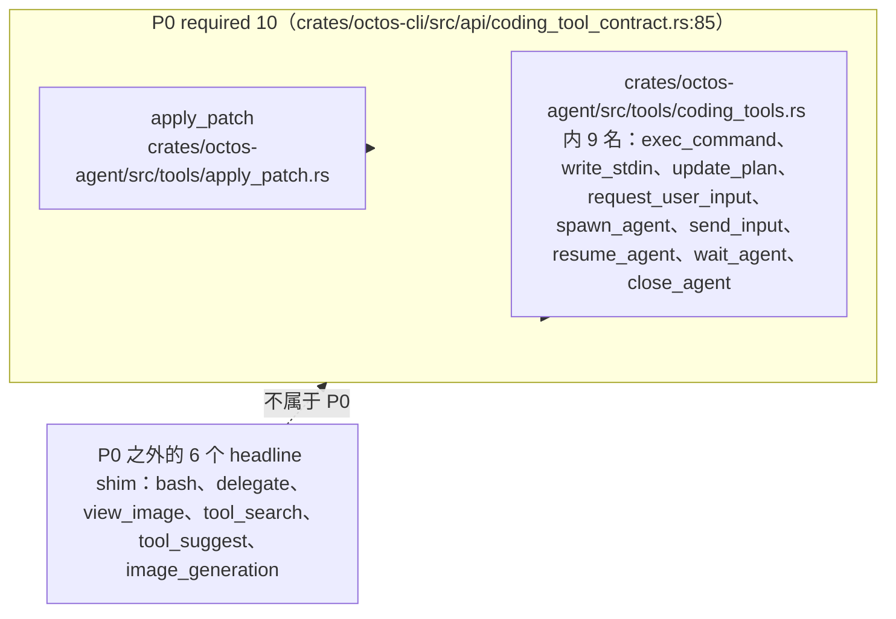

# 附录 B：工具速查表

> **定位**：本附录是第 6 章工具系统的数据面：逐一列出 octos 当前 main 分支注册的 80 个工具注册名（核心 60 + admin 20），按 10 个能力域给出导览，并配套 P0 coding 合约十项与 coding shim 的对应关系、fleet worker 的两张工具子表与 4 个 feature 门。前置依赖：第 6 章（工具系统）、第 7 章（`group` 策略与沙箱）。适用场景：配置 profile、WorkerGrant 或排查"某个工具为什么不可见"的读者 B/C/D，把它当索引用，不当教程读。

## B.0 口径：按注册名组织，不按固定总数组织

octos 的工具面没有一个稳定的"总工具数"。同一个 `crates/octos-agent/src/tools/` 目录，从三个口径数会得到三个数字，本附录全部采用实测口径（commit `9c157101`，2026-09-03）：

- 目录口径：`crates/octos-agent/src/tools/` 共 58 个条目（57 个 `.rs` 文件加 1 个 `admin/` 子目录），与第 6 章一致；
- 注册名口径：这 58 个条目在不同构造路径下注册出 80 个模型可见的注册名，即本表的核心 60 + admin 20。`crates/octos-agent/src/tools/crates/octos-agent/src/tools/coding_tools.rs` 一个文件就承载 15 个注册名，而 `crates/octos-agent/src/tools/replacer.rs`、`crates/octos-agent/src/tools/write_grant.rs` 这类支撑模块一个注册名都没有，所以"文件数不等于工具数"在两个方向上同时成立；
- 分组口径：策略分组以 `crates/octos-agent/src/tools/policy.rs:186` 的 `TOOL_GROUPS`（10 组）为准。

旧稿按固定数量罗列内置工具的写法已废弃：profile 过滤、feature 编译门、`spawn_only` 标记和 chat 网关注册都会改变一次会话实际可见的工具集合，记住分层注册模型比记住一个数字有用。表中的"一句话职责"取自各文件首行 `//!` 文档或 `fn description()` 返回串，逐条可复核。

## B.1 主表：80 个注册名

每行给出注册名、一句话职责、所属域与门。"门"列仅在工具受编译期 feature 或运行期环境变量约束时标注，`—` 表示默认构建即可见（仍受 profile 与策略过滤）。所属域沿用第 6 章的 10 个能力域。

| 注册名 | 一句话职责 | 所属域 | 门 |
|---|---|---|---|
| `read_file` | 读取文件内容 | 文件系统 | — |
| `write_file` | 创建或覆写文件 | 文件系统 | — |
| `edit_file` | 精确字符串替换编辑 | 文件系统 | — |
| `diff_edit` | 应用 unified diff 格式补丁 | 文件系统 | — |
| `apply_patch` | Codex 风格多文件补丁（#1773），P0 成员 | 文件系统 | — |
| `list_dir` | 列出目录内容 | 文件系统 | — |
| `glob` | 按模式查找文件路径 | 文件系统 | — |
| `grep` | 按正则搜索文件内容 | 文件系统 | — |
| `workspace_log` | 只读查看工作区 git 历史 | 文件系统 | — |
| `workspace_show` | 按 commit 读取文件历史版本 | 文件系统 | — |
| `workspace_diff` | 查看两个 commit 之间的差异 | 文件系统 | — |
| `shell` | 在策略与沙箱约束下执行 shell 命令 | Shell 与执行 | — |
| `exec_command` | 长任务执行，会话化 stdin 与分段回收输出，P0 成员 | Shell 与执行 | — |
| `write_stdin` | 向运行中的 exec 会话写入 stdin 并回收输出，P0 成员 | Shell 与执行 | — |
| `bash` | Codex 命名对齐的一次性 shell 别名（#1172） | Shell 与执行 | — |
| `check` | 项目静态检查（#1772，lite 范围） | Shell 与执行 | — |
| `web_search` | 多供应商网页搜索 | Web 与研究 | — |
| `web_fetch` | 抓取 URL 内容并抽取文本 | Web 与研究 | — |
| `browser` | 基于 chromiumoxide 的无头浏览器自动化 | Web 与研究 | — |
| `search` | 深度搜索：网页搜索加并行爬取并落盘 | Web 与研究 | — |
| `synthesize_research` | 读取搜索产物文件并生成综述 | Web 与研究 | — |
| `deep_crawl` | 基于 CDP 的递归站点爬取 | Web 与研究 | — |
| `memory_note` | 追加式记录值得记住的观察 | 记忆 | — |
| `record_memory_use` | 申报哪些记忆条目实际影响了回答 | 记忆 | — |
| `recall` | 取回被上下文压缩替换的工具输出（#2131） | 记忆 | — |
| `recall_memory` | 加载记忆库的完整实体页 | 记忆 | — |
| `save_memory` | 写入或更新记忆库实体页 | 记忆 | — |
| `message` | 跨频道发送消息 | 消息与交互 | — |
| `send_file` | 向聊天频道投递文件 | 消息与交互 | — |
| `send_app_card` | 投递结构化 mini-app 卡片载荷 | 消息与交互 | — |
| `ask_user_question` | 结构化的中途用户提问（UPCR-2026-023） | 消息与交互 | — |
| `spawn` | 派生子代理，同步等待或后台执行 | Peer 与后台任务 | — |
| `delegate_task` | 同步委派工具（`delegate` 是 coding 侧的别名） | Peer 与后台任务 | — |
| `peer_handoff` | LLM 发起的 peer 编组（#1801 v3） | Peer 与后台任务 | — |
| `peer_send_input` | master 向 peer 注入跨会话输入（#436） | Peer 与后台任务 | — |
| `peer_gather` | 读取 peer 黑板（#1801 v3 扇入） | Peer 与后台任务 | — |
| `peer_list` | 调用者 peer 的紧凑状态索引 | Peer 与后台任务 | — |
| `peer_respond` | 回答处于 BLOCKED 的 peer（人在环） | Peer 与后台任务 | — |
| `peer_close` | 退役自己创建的 peer | Peer 与后台任务 | — |
| `check_background_tasks` | 会话级后台任务检查 | Peer 与后台任务 | — |
| `read_task_output` | 选择性查看后台任务输出 | Peer 与后台任务 | — |
| `code_structure` | 基于 tree-sitter 的代码结构分析 | 代码与结构 | `feature = "ast"`（编译期） |
| `spawn_agent` | 启动受监督的 Codex 兼容子代理，P0 成员 | 代码与结构 | — |
| `delegate` | `spawn_agent` 加 `wait_agent` 的一站式 wrapper（#1172） | 代码与结构 | — |
| `view_image` | 工作区内图片元数据检视（#972） | 代码与结构 | — |
| `tool_search` | 从 live catalog 动态发现工具（#1148） | 代码与结构 | — |
| `tool_suggest` | 按任务描述推荐工具（#1148） | 代码与结构 | — |
| `image_generation` | 图像生成入口，当前返回 typed `coding_tool_unsupported`（#1149） | 代码与结构 | — |
| `update_plan` | 更新可见任务计划，P0 成员 | 代码与结构 | — |
| `request_user_input` | 请求宿主 UI 的结构化输入，P0 成员 | 代码与结构 | — |
| `send_input` | 向子代理发送输入，P0 成员（非实时对话投递） | 代码与结构 | — |
| `resume_agent` | 恢复子代理句柄，P0 成员 | 代码与结构 | — |
| `wait_agent` | 巡检或等待子代理，P0 成员 | 代码与结构 | — |
| `close_agent` | 关闭子代理句柄，P0 成员 | 代码与结构 | — |
| `git` | 纯 Rust（gix）原生 git 集成 | Git | `feature = "git"`（编译期） |
| `manage_skills` | 常规网关的技能管理 | 技能与平台 | — |
| `mofa_make` | 内容生成调度器（RFC-1，#1290），`spawn_only` 注册 | 技能与平台 | — |
| `check_workspace_contract` | 工作区合约状态的只读检查 | 技能与平台 | — |
| `configure_tool` | 每工具的持久配置存取 | 技能与平台 | — |
| `model_check` | 模型与供应商清点（chat 网关注册） | 技能与平台 | — |
| `admin_platform_skills` | server 级 ASR/TTS 引擎管理（ominix-api） | admin | — |
| `admin_list_profiles` | 列出 profile | admin | — |
| `admin_profile_status` | 查询 profile 状态 | admin | — |
| `admin_start_profile` | 启动 profile | admin | — |
| `admin_stop_profile` | 停止 profile | admin | — |
| `admin_restart_profile` | 重启 profile | admin | — |
| `admin_enable_profile` | 启用 profile | admin | — |
| `admin_update_profile` | 更新 profile | admin | — |
| `admin_manage_skills` | 按 profile 安装或移除 GitHub 技能 | admin | — |
| `admin_list_sub_accounts` | 列出子账号 | admin | — |
| `admin_create_sub_account` | 创建子账号 | admin | — |
| `admin_view_logs` | 查看 server 日志 | admin | — |
| `admin_system_health` | 系统健康检查 | admin | — |
| `admin_provider_metrics` | 供应商指标 | admin | — |
| `admin_manage_watchdog` | 看门狗管理 | admin | — |
| `admin_system_metrics` | 系统指标 | admin | — |
| `admin_view_sessions` | 查看会话 | admin | — |
| `admin_cron_status` | 定时任务状态 | admin | — |
| `admin_check_config` | 配置检查 | admin | — |
| `admin_update_octos` | 经 serve API 检查并应用 octos 更新 | admin | — |

计数核对：文件系统 11 + Shell 与执行 5 + Web 与研究 6 + 记忆 5 + 消息与交互 4 + Peer 与后台任务 10 + 代码与结构 13 + Git 1 + 技能与平台 5 = 核心 60，admin 20，合计 80。

## B.2 十个能力域导览

### B.2.1 文件系统（fs）

文件系统域是全部写作与仓库勘察能力的地基：从逐字节的 `read_file`/`write_file`，到精确替换的 `edit_file` 与补丁式的 `diff_edit`/`apply_patch`，再到目录与内容检索三件（`list_dir`/`glob`/`grep`）和只读的 workspace 历史三件；策略分组 `group:fs` 覆盖其中 5 个写侧工具（`read_file`、`write_file`、`apply_patch`、`edit_file`、`diff_edit`，`crates/octos-agent/src/tools/policy.rs:191-196`）。

### B.2.2 Shell 与执行（runtime）

执行域的四个注册名共用同一套命令策略与沙箱，所以任何一条路径被 deny，其余路径同生共死；`group:runtime` 因此固定包含 `shell`、`exec_command`、`write_stdin`、`bash` 四名（`crates/octos-agent/src/tools/policy.rs:206`），`check` 是并列的静态检查入口，与 shell 共享会话沙箱。

### B.2.3 Web 与研究（web/search/research）

这一域对应三张策略分组：`group:web` 的搜索、抓取与浏览器三件（`crates/octos-agent/src/tools/policy.rs:211`），`group:search` 的本地检索三件（`crates/octos-agent/src/tools/policy.rs:216`），以及 `group:research` 的多轮深度研究三件 `search`、`synthesize_research`、`deep_crawl`（`crates/octos-agent/src/tools/policy.rs:251`）。

### B.2.4 记忆（memory)

`group:memory` 四件（`recall_memory`、`save_memory`、`memory_note`、`record_memory_use`）构成跨会话记忆的读写闭环（`crates/octos-agent/src/tools/policy.rs:239-246`），`recall` 则是同一域里方向相反的工具：它把被压缩丢弃的会话内工具输出重新物化回来。

### B.2.5 消息与交互

消息域把 Agent 的对外面收拢为四个口：跨频道文本（`message`）、文件投递（`send_file`）、结构化卡片（`send_app_card`）与结构化提问（`ask_user_question`）；后者是 `request_user_input` 的同步、答案可路由超集（UPCR-2026-023）。

### B.2.6 Peer 与后台任务（sessions）

`group:sessions` 收录全部子代理入口：`spawn`、`spawn_agent`、`send_input`、`resume_agent`、`wait_agent`、`close_agent`、`delegate`（`crates/octos-agent/src/tools/policy.rs:228-236`），本域再加上 peer 生命周期五件与后台任务检查两件，构成多代理协作的完整索引。

### B.2.7 代码与结构（coding）

这一域是 Codex 兼容工具面的主体：`crates/octos-agent/src/tools/crates/octos-agent/src/tools/coding_tools.rs` 单文件承载 15 个注册名，其中 9 个进入 P0 合约，其余 6 个是 #972/#1148/#1149 的扩展入口，加上 feature 门控的 `code_structure`，共 13 个注册名；所有 15 名都在 `crates/octos-agent/src/tools/registry.rs:1254` 的 `with_builtins_and_permissions`（注册体自 1283 起）注册。

### B.2.8 Git

`git` 是唯一的 VCS 注册名，走纯 Rust 的 gix 实现而非 shell 外调，受编译期 `feature = "git"` 门控（`crates/octos-agent/src/tools/mod.rs:861`），并在 `crates/octos-agent/src/tools/registry.rs:1466-1469` 随 CWD 绑定列表重绑。

### B.2.9 技能与平台

技能与平台域混合了两类注册：常规网关的 `manage_skills`、`configure_tool` 与 chat 网关注册的 `model_check`（三者构成 `group:admin`，`crates/octos-agent/src/tools/policy.rs:253-257`），以及 `spawn_only` 注册的内容生成调度器 `mofa_make` 和工作区合约检查 `check_workspace_contract`。

### B.2.10 admin 子目录

admin 域的 20 个注册名全部来自 `crates/octos-agent/src/tools/admin/` 的 7 个文件，面向 Serve/Admin API 的运维面：profile 生命周期七件、系统可观测八件、子账号两件、技能与平台更新三件，普通 profile 默认不可见。

## B.3 P0 required 十项与 coding shim 的关系

Codex 兼容合约声明的 P0 必备集定义在 `crates/octos-cli/src/api/coding_tool_contract.rs:85` 的 `CODING_P0_REQUIRED_TOOL_NAMES`，共十项：`apply_patch`、`exec_command`、`write_stdin`、`update_plan`、`request_user_input`、`spawn_agent`、`send_input`、`resume_agent`、`wait_agent`、`close_agent`。十项中九项由 `crates/octos-agent/src/tools/crates/octos-agent/src/tools/coding_tools.rs` 提供，唯一例外 `apply_patch` 是原生文件工具（`crates/octos-agent/src/tools/apply_patch.rs`），不在 crates/octos-agent/src/tools/coding_tools.rs 内。

十个 headline shim（简报口径九个，加上宏注册的六个里的代表）与 P0 的逐条关系如下表；前三个是 P0 成员，其余六个各有明确的不入选理由：

| 注册名 | 与 P0 的关系 | 依据（全路径） |
|---|---|---|
| `exec_command` | P0 成员 | crates/octos-agent/src/tools/crates/octos-agent/src/tools/coding_tools.rs:382；crates/octos-cli/src/api/coding_tool_contract.rs:85 |
| `write_stdin` | P0 成员 | crates/octos-agent/src/tools/crates/octos-agent/src/tools/coding_tools.rs:739 |
| `spawn_agent` | P0 成员 | crates/octos-agent/src/tools/crates/octos-agent/src/tools/coding_tools.rs:1284 |
| `bash` | P0 之外，#1172 命名对齐别名，与 `shell`/`exec_command` 共享策略与沙箱，三者一处 deny 处处 deny | crates/octos-agent/src/tools/crates/octos-agent/src/tools/coding_tools.rs:1946；crates/octos-agent/src/tools/registry.rs:1281-1290 |
| `delegate` | P0 之外，#1172 一站式 wrapper（`DelegateAliasTool`，绑定 `spawn_agent`，`group:sessions` 成员） | crates/octos-agent/src/tools/crates/octos-agent/src/tools/coding_tools.rs:2429；crates/octos-agent/src/tools/registry.rs:548,566,1284 |
| `view_image` | P0 之外，#972/M14-B P1 图像检视，只读并受 filesystem_scope 约束 | crates/octos-agent/src/tools/crates/octos-agent/src/tools/coding_tools.rs:2801；crates/octos-agent/src/tools/registry.rs:1461-1464 |
| `tool_search` | P0 之外，#1148 的动态发现入口，读 live catalog | crates/octos-agent/src/tools/crates/octos-agent/src/tools/coding_tools.rs:3150 |
| `tool_suggest` | P0 之外，#1148 的按任务推荐入口 | crates/octos-agent/src/tools/crates/octos-agent/src/tools/coding_tools.rs:3251 |
| `image_generation` | P0 之外，#1149/M14-B P2；当前返回 typed `coding_tool_unsupported`（wire 合约完整，尚无生成后端绑定） | crates/octos-agent/src/tools/crates/octos-agent/src/tools/coding_tools.rs:3391；crates/octos-agent/src/tools/registry.rs:1368-1370 注释原文 |

两点合约语义需要单独说明。其一，`send_input` 虽列名 P0，但当前不是实时对话投递：它以 `simple_codex_tool!` 宏注册（`crates/octos-agent/src/tools/crates/octos-agent/src/tools/coding_tools.rs:1839-1842`），写入的是受监督任务的输入通道而非交互式会话。其二，`image_generation` 的 typed unsupported 是有意的合约姿态：调用方得到的是结构化的"此环境不支持"信封，而不是 tool not found 错误，前端可以据此降级 UI 而不破坏协议。

> **工程决策侧栏：为什么别名必须进组（#1172）**
> deny-wins 策略按"注册名或组名"匹配。`bash` 与 `delegate` 这类别名若不进 `group:runtime`/`group:sessions`，一个禁用了执行或子代理的 profile 仍会从别名绕回原能力。修复方式是把别名写进组定义（`crates/octos-agent/src/tools/policy.rs:201-205` 注释原文），并让 `delegate` 持有被绑定 `spawn_agent` 的 Arc 句柄这一事实也成为组注释的一部分：策略层覆盖的是"每一个入口"，而不是"每一个实现文件"。

## B.4 fleet worker 的两张子表

fleet worker（第 16 章）的工具面由 `crates/octos-fleet/src/grant.rs` 的常量表约束，master 能授予的工具以白名单封顶：

| 子表 | 成员 | 依据（全路径） |
|---|---|---|
| BASE_TOOLS（默认 7） | `read_file`、`write_file`、`edit_file`、`glob`、`grep`、`list_dir`、`shell` | crates/octos-fleet/src/grant.rs:27 |
| GRANTABLE_TOOLS（可授 9） | 上述 7 个加 `web_fetch`、`web_search` | crates/octos-fleet/src/grant.rs:41 |
| WEB_TOOLS（网络 2） | `web_fetch`、`web_search`（仅在 network grant 下可授） | crates/octos-fleet/src/grant.rs:56 |

复核命令：`sed -n '27,60p' crates/octos-fleet/src/grant.rs`。

lean coding profile 的工具面由 `crates/octos-agent/src/assets/profiles/coding.json` 的 allow_list 决定，共 12 条（4 个单名加三个组加 5 个单名），按 `TOOL_GROUPS` 展开后为 20 个注册名：

| allow_list 条目 | 展开后的注册名 |
|---|---|
| `read_file`、`write_file`、`edit_file`、`diff_edit` | 同名 4 个 |
| `group:runtime` | `shell`、`exec_command`、`write_stdin`、`bash` |
| `group:search` | `glob`、`grep`、`list_dir` |
| `group:memory` | `recall_memory`、`save_memory`、`memory_note`、`record_memory_use` |
| `spawn`、`ask_user_question`、`check`、`update_plan`、`tool_search` | 同名 5 个 |

该 profile 的设计意图写在 json description 原文里：加入 `check`、`update_plan`、`tool_search` 三个此前缺失的循环工具，只丢弃 `apply_patch`（`edit_file`/`diff_edit` 覆盖其职责）；被排除的工具重面时用 `--profile coding-full` 恢复，而不是运行时发现。`run_pipeline` 为 `spawn_only` 注册且不在 allow_list 内（`crates/octos-agent/src/profile/mod.rs:874`）。一处口径差需要指明：事实表标签写"展开后 19 名"，但逐组展开实测为 20 名（上表合计 4+4+3+4+5），本表以逐组展开为准。

## B.5 feature 门：编译期 2 + 运行期 2

80 个注册名中只有 4 个受门控，两类各两个：

| 门类型 | 注册名 | 开关 | 依据（全路径） |
|---|---|---|---|
| 编译期 feature | `git` | `feature = "git"` | crates/octos-agent/src/tools/mod.rs:861 |
| 编译期 feature | `code_structure` | `feature = "ast"` | crates/octos-agent/src/tools/mod.rs:864 |
| 运行期环境变量 | `read_window`（内部，非注册名） | `OCTOS_READ_WINDOW=1`，默认关 | crates/octos-agent/src/tools/read_window.rs:177-179 |
| 运行期环境变量 | `read_paging_probe`（内部，非注册名） | `OCTOS_READ_PAGING_PROBE=1`，不武装不记录 | crates/octos-agent/src/tools/read_paging_probe.rs:131 |

两个运行期门都作用于"内部件"而非独立注册名，这与第 6 章的结论一致：读路径的收紧先以探针取数，再决定是否成为默认行为。编译期门则在 `crates/octos-agent/src/tools/registry.rs:1466-1469` 以 `#[cfg]` 出现在 CWD 绑定列表里，未开启 feature 时连重绑列表都不含这两个名字。

## B.6 延伸阅读与思考题

延伸阅读：第 6 章（58 个条目的能力域划分与注册分层）、第 7 章（`group` 策略判定、沙箱与 `write_grant`）、第 16 章（fleet 的 WorkerGrant 与本附录两张子表的关系）。

思考题：

1. `group:delegated` 是一张 deny 表而非 allow 表（`crates/octos-agent/src/tools/policy.rs:307-331`），但它明确不限制命令执行。为什么"递归委派要断、命令执行不断"是自洽的边界选择？
2. coding.json 的 allow_list 只有 12 条却展开出 20 个名字。当你想给 lean profile 增删一个工具时，改 allow_list 条目和改 `TOOL_GROUPS` 成员各会影响哪些下游？
3. `image_generation` 选择返回 typed unsupported 而不是从注册表移除。如果移除，前端合约校验和用户提示分别会损失什么？

---

> **版本演化说明**
> 本章基线为 octos main @ `9c157101`（2026-09-03 实测）。数据源为 `assets/appendixB-facts.md`（commit `ad387d1` 同批），行号均经本轮会话亲测复核。相对旧稿：旧版按固定数量罗列"核心内置工具"的口径已废弃，当前注册名总数 80（核心 60 + admin 20），能力域 10 个，P0 合约十项的 shim 归属、fleet 两张子表与 4 个 feature 门均为本轮新采集；`bash`/`delegate` 入组（#1172）与 `image_generation` 的 typed unsupported（#1149）是旧稿成书后新发生的行为变化。
