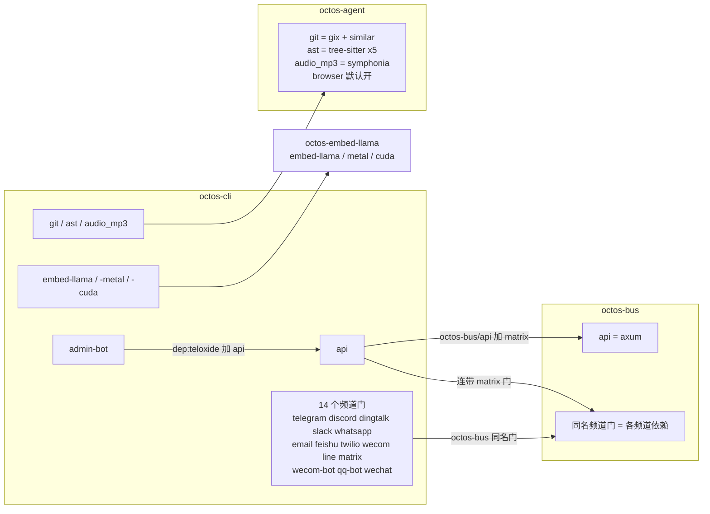

# 附录 D:Feature Flags 一览

> **定位**:本附录是 octos workspace 全部 Cargo feature 的对照表:12 个 crate 的 79 条 feature 定义逐条列出(crate、拉入的依赖、一句作用、是否默认开启、来源行号),外加 14 个消息频道门的定义与镜像转发、default 链、feature 传播图。前置依赖:第 14 章 14.7 节(编译期运行面的概念)、附录 A(A.5 节的 feature-gated 依赖标注)。适用场景:部署前决定开哪些 feature;排查「这个功能为什么没编译进去」;为 octos 新增频道或工具前确定改动落点。

本附录与第 14 章、附录 A 同源同口径:统计基线为 octos main @ `9c157101`,唯一数据源是仓库事实表 `assets/appendixD-facts.md`。workspace 38 个 member 中,12 个 crate 的 `Cargo.toml` 里有 `[features]` 段,共 79 条 feature 定义:70 条非默认 feature 加 9 条显式 `default` 行(`octos-embed-llama`、`octos-store`、`octos-services` 无显式 default 行)。全量口径的复现命令只有一条,在 octos 源码仓库根执行:

```bash
awk '/^\[features\]/{f=1;next} /^\[/{f=0} f&&/^[a-z]/' crates/*/Cargo.toml
```

分工边界:14.7 节回答「运行面选择与能力裁剪为什么分属两个时期」,本附录回答「每一个门具体是什么、拉什么、默认开不开」。两处不重复展开,交叉点在 D.6 说明。

## D.1 主表:79 条 feature 全量

「默认」列的「是」表示该 feature 出现在所在 crate 的显式 `default` 行里。「来源」列指向该 crate `Cargo.toml` 中 `[features]` 段的行号范围。

| crate | feature | 拉入的依赖 / 下游 feature | 一句作用 | 默认 | 来源 |
|---|---|---|---|---|---|
| octos-cli | `default` | `[]` | 默认最小集,不含 API/频道/工具 | 是 | crates/octos-cli/Cargo.toml:142-177 |
| octos-cli | `embed-llama` | `dep:octos-embed-llama`、`octos-embed-llama/embed-llama` | 进程内 llama.cpp GGUF 嵌入 provider(接 `embedding.provider = "llamacpp"`),默认 CPU 后端 | 否 | crates/octos-cli/Cargo.toml:142-177 |
| octos-cli | `embed-llama-metal` | `embed-llama`、`octos-embed-llama/metal` | 在 embed-llama 上叠加 Apple Metal 加速 | 否 | crates/octos-cli/Cargo.toml:142-177 |
| octos-cli | `embed-llama-cuda` | `embed-llama`、`octos-embed-llama/cuda` | 在 embed-llama 上叠加 NVIDIA CUDA 加速 | 否 | crates/octos-cli/Cargo.toml:142-177 |
| octos-cli | `api` | `dep:axum`、`dep:tower-http`、`dep:tokio-util`、`dep:futures`、`dep:tokio-tungstenite`、`dep:rustls`、`dep:rustls-native-certs`、`dep:rust-embed`、`dep:metrics-exporter-prometheus`、`dep:lettre`、`dep:rand`、`dep:sysinfo`、`dep:subtle`、`octos-bus/api`、`matrix` | REST API/dashboard/SSE/WS 控制面;serve 子命令依赖它,漏掉则 octoscode 无法启动(`Command::Serve` 带 `#[cfg(feature = "api")]`,crates/octos-cli/src/commands/mod.rs:398-399;octoscode 默认命令是 `octos serve --stdio --solo`,octoscode/src/cli.rs:118);matrix 无条件连带,因为 API handler 与管理台引用 `octos_bus::MatrixInviteStore` 等 matrix-only 类型 | 否 | crates/octos-cli/Cargo.toml:142-177 |
| octos-cli | `admin-bot` | `dep:teloxide`、`dep:futures`、`api` | Telegram 管理 Bot;显式依赖 api | 否 | crates/octos-cli/Cargo.toml:142-177 |
| octos-cli | `telegram` | `octos-bus/telegram` | Telegram 频道门 | 否 | crates/octos-cli/Cargo.toml:142-177 |
| octos-cli | `discord` | `octos-bus/discord` | Discord 频道门 | 否 | crates/octos-cli/Cargo.toml:142-177 |
| octos-cli | `dingtalk` | `octos-bus/dingtalk` | 钉钉回调频道门 | 否 | crates/octos-cli/Cargo.toml:142-177 |
| octos-cli | `slack` | `octos-bus/slack` | Slack WebSocket 频道门 | 否 | crates/octos-cli/Cargo.toml:142-177 |
| octos-cli | `whatsapp` | `octos-bus/whatsapp` | WhatsApp WebSocket 频道门 | 否 | crates/octos-cli/Cargo.toml:142-177 |
| octos-cli | `email` | `octos-bus/email` | Email(IMAP/SMTP)频道门 | 否 | crates/octos-cli/Cargo.toml:142-177 |
| octos-cli | `feishu` | `octos-bus/feishu` | 飞书频道门 | 否 | crates/octos-cli/Cargo.toml:142-177 |
| octos-cli | `twilio` | `octos-bus/twilio` | Twilio webhook 频道门 | 否 | crates/octos-cli/Cargo.toml:142-177 |
| octos-cli | `wecom` | `octos-bus/wecom` | 企业微信回调频道门 | 否 | crates/octos-cli/Cargo.toml:142-177 |
| octos-cli | `line` | `octos-bus/line` | LINE webhook 频道门 | 否 | crates/octos-cli/Cargo.toml:142-177 |
| octos-cli | `matrix` | `octos-bus/matrix` | Matrix 频道门 | 否 | crates/octos-cli/Cargo.toml:142-177 |
| octos-cli | `wecom-bot` | `octos-bus/wecom-bot` | 企业微信 Bot WebSocket 频道门 | 否 | crates/octos-cli/Cargo.toml:142-177 |
| octos-cli | `qq-bot` | `octos-bus/qq-bot` | QQ Bot WebSocket 频道门 | 否 | crates/octos-cli/Cargo.toml:142-177 |
| octos-cli | `wechat` | `octos-bus/wechat` | WeChat bridge WebSocket 频道门 | 否 | crates/octos-cli/Cargo.toml:142-177 |
| octos-cli | `git` | `octos-agent/git` | Git 工具能力门(gix+similar) | 否 | crates/octos-cli/Cargo.toml:142-177 |
| octos-cli | `ast` | `octos-agent/ast` | AST 解析工具能力门(tree-sitter 五语言) | 否 | crates/octos-cli/Cargo.toml:142-177 |
| octos-cli | `audio_mp3` | `octos-agent/audio_mp3` | AudioNonSilent 工作区契约校验器的 mp3 解码;不带则 .mp3 工件报错,提示启用 audio_mp3 或改用 .wav(crates/octos-agent/src/validators.rs:2441-2445) | 否 | crates/octos-cli/Cargo.toml:142-177 |
| octos-bus | `default` | `[]` | 纯 bus 核心(会话/调度/去重),零频道 | 是 | crates/octos-bus/Cargo.toml:9-26 |
| octos-bus | `api` | `axum` | API/SSE/WS 接入所需 bus 类型(`ApiChannel` 等) | 否 | crates/octos-bus/Cargo.toml:9-26 |
| octos-bus | `telegram` | `teloxide` | TelegramChannel 实现 | 否 | crates/octos-bus/Cargo.toml:9-26 |
| octos-bus | `discord` | `serenity` | DiscordChannel 实现 | 否 | crates/octos-bus/Cargo.toml:9-26 |
| octos-bus | `dingtalk` | `axum` | DingTalkChannel 回调实现 | 否 | crates/octos-bus/Cargo.toml:9-26 |
| octos-bus | `slack` | `tokio-tungstenite` | SlackChannel WS 实现 | 否 | crates/octos-bus/Cargo.toml:9-26 |
| octos-bus | `whatsapp` | `tokio-tungstenite` | WhatsAppChannel WS 实现 | 否 | crates/octos-bus/Cargo.toml:9-26 |
| octos-bus | `feishu` | `tokio-tungstenite`、`axum`、`rustls`、`rustls-native-certs` | FeishuChannel WS+回调实现 | 否 | crates/octos-bus/Cargo.toml:9-26 |
| octos-bus | `line` | `axum` | LineChannel webhook 实现 | 否 | crates/octos-bus/Cargo.toml:9-26 |
| octos-bus | `twilio` | `axum` | TwilioChannel webhook 实现 | 否 | crates/octos-bus/Cargo.toml:9-26 |
| octos-bus | `wecom` | `axum` | WeComChannel 回调实现 | 否 | crates/octos-bus/Cargo.toml:9-26 |
| octos-bus | `matrix` | `axum` | MatrixChannel + MatrixUserChannel(含 `MatrixInviteStore`)实现 | 否 | crates/octos-bus/Cargo.toml:9-26 |
| octos-bus | `wecom-bot` | `tokio-tungstenite`、`rustls`、`rustls-native-certs` | WeComBotChannel WS 实现 | 否 | crates/octos-bus/Cargo.toml:9-26 |
| octos-bus | `qq-bot` | `tokio-tungstenite`、`rustls`、`rustls-native-certs` | QQBotChannel WS 实现 | 否 | crates/octos-bus/Cargo.toml:9-26 |
| octos-bus | `wechat` | `tokio-tungstenite` | WeChatChannel WS bridge 实现 | 否 | crates/octos-bus/Cargo.toml:9-26 |
| octos-bus | `email` | `async-imap`、`tokio-rustls`、`rustls`、`webpki-roots`、`lettre`、`mailparse` | EmailChannel IMAP/SMTP 实现 | 否 | crates/octos-bus/Cargo.toml:9-26 |
| octos-agent | `default` | `["browser"]` | 默认开 browser | 是 | crates/octos-agent/Cargo.toml:117-131 |
| octos-agent | `browser` | `[]`(chromiumoxide 无条件编译) | 只切换 `web_search` 的无头 Chrome(CDP)兜底 provider;关掉则 HTTP-only 行为与旧版逐字节一致 | 是 | crates/octos-agent/Cargo.toml:117-131 |
| octos-agent | `git` | `dep:gix`、`dep:similar` | Git 操作与 diff 能力 | 否 | crates/octos-agent/Cargo.toml:117-131 |
| octos-agent | `ast` | `dep:tree-sitter` 加 rust/python/javascript/typescript 四个 grammar | AST 代码结构分析 | 否 | crates/octos-agent/Cargo.toml:117-131 |
| octos-agent | `audio_mp3` | `dep:symphonia` | AudioNonSilent 校验器的 mp3 解码(WAV 走常开的 hound) | 否 | crates/octos-agent/Cargo.toml:117-131 |
| octos-server | `default` | `[]` | 最小 server 库 | 是 | crates/octos-server/Cargo.toml:46-81 |
| octos-server | `api` | 依赖清单与 octos-cli `api` 相同(13 个 optional 依赖加 `octos-bus/api` 与 `matrix`) | HTTP/WS API 层,镜像 octos-cli `api`;matrix 必选(handler 引用 matrix 类型) | 否 | crates/octos-server/Cargo.toml:46-81 |
| octos-server | `telegram` | `octos-bus/telegram` | 频道门转发 | 否 | crates/octos-server/Cargo.toml:46-81 |
| octos-server | `discord` | `octos-bus/discord` | 频道门转发 | 否 | crates/octos-server/Cargo.toml:46-81 |
| octos-server | `dingtalk` | `octos-bus/dingtalk` | 频道门转发 | 否 | crates/octos-server/Cargo.toml:46-81 |
| octos-server | `slack` | `octos-bus/slack` | 频道门转发 | 否 | crates/octos-server/Cargo.toml:46-81 |
| octos-server | `whatsapp` | `octos-bus/whatsapp` | 频道门转发 | 否 | crates/octos-server/Cargo.toml:46-81 |
| octos-server | `email` | `octos-bus/email` | 频道门转发 | 否 | crates/octos-server/Cargo.toml:46-81 |
| octos-server | `feishu` | `octos-bus/feishu` | 频道门转发 | 否 | crates/octos-server/Cargo.toml:46-81 |
| octos-server | `twilio` | `octos-bus/twilio` | 频道门转发 | 否 | crates/octos-server/Cargo.toml:46-81 |
| octos-server | `wecom` | `octos-bus/wecom` | 频道门转发 | 否 | crates/octos-server/Cargo.toml:46-81 |
| octos-server | `line` | `octos-bus/line` | 频道门转发 | 否 | crates/octos-server/Cargo.toml:46-81 |
| octos-server | `matrix` | `octos-bus/matrix` | 频道门转发 | 否 | crates/octos-server/Cargo.toml:46-81 |
| octos-server | `wecom-bot` | `octos-bus/wecom-bot` | 频道门转发 | 否 | crates/octos-server/Cargo.toml:46-81 |
| octos-server | `qq-bot` | `octos-bus/qq-bot` | 频道门转发 | 否 | crates/octos-server/Cargo.toml:46-81 |
| octos-server | `wechat` | `octos-bus/wechat` | 频道门转发 | 否 | crates/octos-server/Cargo.toml:46-81 |
| octos-embed-llama | `embed-llama` | `dep:llama-cpp-2`、`dep:self_cell` | 从源码编译 llama.cpp(CMake 加 C++ 工具链),进程内 GGUF 嵌入;不开则 crate 近空 | 否 | crates/octos-embed-llama/Cargo.toml:14-20 |
| octos-embed-llama | `metal` | `llama-cpp-2/metal` | Apple Metal 加速 | 否 | crates/octos-embed-llama/Cargo.toml:14-20 |
| octos-embed-llama | `cuda` | `llama-cpp-2/cuda` | NVIDIA CUDA 加速 | 否 | crates/octos-embed-llama/Cargo.toml:14-20 |
| octos-ffi | `default` | `[]` | FFI 面保持纯 Rust | 是 | crates/octos-ffi/Cargo.toml:37-47 |
| octos-ffi | `embed-llama` | `dep:octos-embed-llama`、`octos-embed-llama/embed-llama` | 把 GGUF 后端编进 `octos_embed`,否则报 embedding support not compiled in | 否 | crates/octos-ffi/Cargo.toml:37-47 |
| octos-ffi | `embed-llama-metal` | `embed-llama`、`octos-embed-llama/metal` | FFI 侧 Metal 加速 | 否 | crates/octos-ffi/Cargo.toml:37-47 |
| octos-ffi | `embed-llama-cuda` | `embed-llama`、`octos-embed-llama/cuda` | FFI 侧 CUDA 加速 | 否 | crates/octos-ffi/Cargo.toml:37-47 |
| octos-uniffi | `default` | `[]` | uniffi 绑定保持纯 Rust | 是 | crates/octos-uniffi/Cargo.toml:36-42 |
| octos-uniffi | `embed-llama` | `octos-ffi/embed-llama` | 经 ffi 转发 `Runtime::embed`,否则返回 `NoEmbedder` | 否 | crates/octos-uniffi/Cargo.toml:36-42 |
| octos-pyo3 | `default` | `[]` | Python-less CI 上 `cargo build --workspace` 不破 | 是 | crates/octos-pyo3/Cargo.toml:42-52 |
| octos-pyo3 | `python` | `dep:pyo3` | 编译 pyo3 面(拉 libpython) | 否 | crates/octos-pyo3/Cargo.toml:42-52 |
| octos-pyo3 | `extension-module` | `python`、`pyo3/extension-module` | wheel 构建:python 加不链 libpython(宿主解释器解析符号) | 否 | crates/octos-pyo3/Cargo.toml:42-52 |
| octos-pyo3 | `embed-llama` | `octos-ffi/embed-llama` | `Runtime.embed` 返回真实向量而非 `NoEmbedder` | 否 | crates/octos-pyo3/Cargo.toml:42-52 |
| octos-diagnostics | `default` | `[]` | Stage 1 零网络依赖 | 是 | crates/octos-diagnostics/Cargo.toml:22-26 |
| octos-diagnostics | `github` | `dep:reqwest`(workspace 同 pin,rustls-tls) | `update --check` 的 GitHub Releases 客户端(Stage 2;self-update 是 Stage 3,不在此) | 否 | crates/octos-diagnostics/Cargo.toml:22-26 |
| octos-llm | `default` | `[]` | 生产构建不暴露测试面 | 是 | crates/octos-llm/Cargo.toml:9-15 |
| octos-llm | `test-utils` | `[]` | 暴露 `AdaptiveRouter::publish_failover_for_subscribers` 等测试助手;生产禁开 | 否 | crates/octos-llm/Cargo.toml:9-15 |
| octos-store | `test-util` | `[]` | 暴露 `approvals_audit::read_audit_lines` 等测试助手;生产禁开 | 否(无显式 default 行) | crates/octos-store/Cargo.toml:26-30 |
| octos-services | `test-util` | `[]` | 暴露 crate 级 env-test 锁 `config_context::TEST_ENV_LOCK` 供下游测试串行化;生产禁开 | 否(无显式 default 行) | crates/octos-services/Cargo.toml:26-31 |

主表逐 crate 计数:octos-cli 23、octos-bus 16、octos-server 16、octos-agent 5、octos-embed-llama 3、octos-ffi 4、octos-uniffi 2、octos-pyo3 4、octos-diagnostics 2、octos-llm 2、octos-store 1、octos-services 1,合计 79。octos-cli 的 spec 事实边界旧列 22 个(未含 `audio_mp3`);当前实取 23 条,`audio_mp3`(crates/octos-cli/Cargo.toml:177)为边界后新增。

## D.2 十二个 crate 的导览

把 79 条 feature 按 crate 归组,能看到一条清晰的分层纪律。第一组是两个入口。octos-cli 以 23 条 feature 居全库之首,但它自己几乎不实现任何频道与工具:14 个频道门逐个转发到 octos-bus,git、ast、audio_mp3 三个工具门转发到 octos-agent,embed-llama 三连转发到 octos-embed-llama;唯一在本 crate 内展开的重量级门是 api,它拉入 13 个 optional 依赖,并连带 `octos-bus/api` 与 matrix 两个下游门。octos-server 是 cli 的库级镜像,16 条 feature 与 cli 同名同义,api 与 14 个频道门各自转发一份,让不走 CLI 的宿主程序复用同一套装配。

第二组是运行时与总线。octos-bus 的 16 条 feature 里,除 default 与 api 外全是频道实现本体:teloxide、serenity、tokio-tungstenite、async-imap 这些网络栈只在对应频道门打开时才进入编译,默认构建不含任何一个聊天协议栈。octos-agent 只有 5 条,却是唯一 default 非空的业务 crate:default = ["browser"] 让无头 Chrome 兜底成为默认行为,而 browser 门本身不增删任何依赖,chromiumoxide 是无条件编译的,门只决定 `web_search` 要不要用它。

第三组是嵌入链与绑定链,共五个 crate。octos-embed-llama 的 3 条 feature 全部围绕 llama.cpp:本体门从源码编译 C++,metal 与 cuda 只是后端叠加开关。octos-ffi 的 4 条决定 FFI 面里有没有 GGUF 嵌入;octos-uniffi 与 octos-pyo3 各持一条 embed-llama,层层代理到 octos-ffi,不开就返回 `NoEmbedder`。最后一组是四个小 crate:octos-diagnostics 用 github 门把 Releases 检查所需的 reqwest 挡在默认构建之外;octos-llm 的 test-utils 与 octos-store、octos-services 的 test-util 是纯测试面,生产构建禁开;embed-llama、store、services 三个 crate 没有显式 default 行,零 feature 是它们的常态。

## D.3 频道门:一处定义、两处转发

octos-bus 是 14 个频道门的唯一定义点(crates/octos-bus/Cargo.toml:9-26),运行期导出与门一一对应:crates/octos-bus/src/lib.rs:17-49 逐 feature `#[cfg]` 门控类型导出,crates/octos-bus/src/lib.rs:71-107 门控 mod 声明,14 个频道一一对齐(该文件 `cfg(feature` 共命中 33 处:17 个类型导出行加 16 个 mod 行,api 门在非 mod 行少一条)。octos-cli(crates/octos-cli/Cargo.toml:142-177)与 octos-server(crates/octos-server/Cargo.toml:46-81)把 14 个门各转发一份:CLI 面向二进制构建,server 面向库级复用,网关运行期不走 HTTP api 层也能派发频道。

| 频道门 | octos-bus 拉入的依赖 | 接入形态 |
|---|---|---|
| telegram | teloxide | Bot API |
| discord | serenity | Bot API |
| dingtalk | axum | 回调 |
| slack | tokio-tungstenite | WebSocket |
| whatsapp | tokio-tungstenite | WebSocket |
| email | async-imap、tokio-rustls、rustls、webpki-roots、lettre、mailparse | IMAP/SMTP |
| feishu | tokio-tungstenite、axum、rustls、rustls-native-certs | WebSocket 加回调 |
| twilio | axum | webhook |
| wecom | axum | 回调 |
| line | axum | webhook |
| matrix | axum | webhook 加 `MatrixInviteStore` |
| wecom-bot | tokio-tungstenite、rustls、rustls-native-certs | WebSocket |
| qq-bot | tokio-tungstenite、rustls、rustls-native-certs | WebSocket |
| wechat | tokio-tungstenite | WebSocket bridge |

三个名字相邻的门容易混淆:wecom 与 wecom-bot 是两套实现(回调对 WebSocket),qq-bot 是 QQ 的 WebSocket 实现,wechat 是微信的 WebSocket bridge。它们在 cli 与 server 中各自有同名转发门,开关必须三处一致才算打开一条频道。

## D.4 default 链:一个反直觉默认与两条代理链

workspace 的 9 条显式 default 行里,8 条是 `default = []`(最小集),唯一非空的是 octos-agent 的 `default = ["browser"]`(crates/octos-agent/Cargo.toml:117-131)。这个默认与直觉相反之处在于:chromiumoxide 不受门控、始终编译,browser 门只决定 `web_search` 在 HTTP 检索失败后是否落到无头 Chrome。想要纯 HTTP 行为,要在依赖 octos-agent 时用 `default-features = false` 显式关掉,而不是以为「不开 feature 就没有浏览器代码」。

嵌入链从外到内共四跳。第一跳在 octos-cli 与 octos-ffi:两者的 embed-llama 都指向 `octos-embed-llama/embed-llama`,后者才真正拉入 llama-cpp-2 与 self_cell,并要求构建机具备 CMake 与 C++ 工具链;metal、cuda 是在此之上的后端叠加,所以 embed-llama-metal 与 embed-llama-cuda 都隐含 embed-llama。第二跳是 octos-ffi 的镜像三连,把同样的开关复制到 FFI 面。第三、四跳是 octos-uniffi 与 octos-pyo3 各自唯一的 embed-llama,它们不直接接触 llama.cpp,只把开关转发给 octos-ffi;任一层没开,`Runtime.embed` 就返回 `NoEmbedder` 而不是向量。

## D.5 feature 传播关系



三层结构:octos-cli 是唯一二进制入口,频道与工具 feature 全部转发到 octos-bus 与 octos-agent(与 14.7 节「CLI 只做 feature 转发」一致);octos-server 的 api 与 14 频道门镜像同一套转发,供库级复用。图中有三条隐式依赖边需要记住:api 连带 `octos-bus/api` 与 matrix;admin-bot 显式依赖 api;embed-llama-metal 与 embed-llama-cuda 都隐含 embed-llama。漏掉隐式边是 feature 裁剪出错的常见来源:只关 matrix 不关 api 是关不掉的,因为 API 层的 handler 引用了 matrix-only 类型。

## D.6 与第 14 章 14.7 节的分工

14.7 节讲双层关系:运行面选择发生在运行期(子命令分派),能力裁剪发生在编译期(feature 门),并给了 cli 侧三个例子(api、频道门、embed-llama)与 serve 子命令的编译门。本附录不重复这些论证,只补全量数据:79 条定义、14 个门的依赖明细、default 链与传播图。查「某种运行面该开哪些门」翻 14.7 节与第 13 章;查「某个门拉了什么、默认开不开」翻本附录 D.1;查「某条 gated 依赖的版本与归属 crate」翻附录 A 的 A.5。

## D.7 没有 `[features]` 的 crate:26 个

其余 26 个顶层条目的 `Cargo.toml` 没有 `[features]` 段,编译面固定、无门可开:

- 核心库(11):octos-core、octos-memory、octos-workflows、octos-pipeline、octos-plugin、octos-sandbox、octos-swarm、octos-fleet、octos-fleet-worker、octos-dora-mcp、octos-wasm(crates/ 下同名目录的 Cargo.toml)。
- App skills(14):news、deep-search、deep-crawl、send-email、account-manager、time、weather、smart-home、wechat-bridge、skill-evolve、harness-starter-generic、harness-starter-report、harness-starter-audio、harness-starter-coding(crates/app-skills/ 下同名目录的 Cargo.toml)。
- Platform skills(1):voice(crates/platform-skills/voice/Cargo.toml)。

能力二进制不走 Cargo feature 裁剪,它们用 workspace member 与 skill manifest 管理分发边界(第 9 章)。给这份清单排过错的读者请注意:旧稿把它列成 19 个且含已不存在的 pipeline-guard,本版按 9c157101 实测重列。

## D.8 编译示例

```bash
# 最小 CLI:不启用 API、频道集成、Git/AST 工具
cargo build -p octos-cli --release

# CLI + Web API / dashboard(serve 子命令随之可用)
cargo build -p octos-cli --release --features api

# API + 管理 Bot
cargo build -p octos-cli --release --features admin-bot

# Gateway 常见多频道组合
cargo build -p octos-cli --release --features "telegram,slack,email,feishu,wecom-bot,qq-bot,wechat"

# 让 AudioNonSilent 校验器支持 .mp3(经 octos-agent/audio_mp3 生效)
cargo build -p octos-cli --release --features audio_mp3
```

## 延伸阅读

- Cargo Features 官方文档:https://doc.rust-lang.org/cargo/reference/features.html ,optional 依赖与 feature 统一推导规则,对照 D.1 的依赖列。
- 本书第 14 章 14.7 节:编译期运行面与运行期运行面的双层关系。
- 本书附录 A A.5 节:feature-gated 外部依赖的全量标注(50 项)与三个 crate 的 gate 设计。
- 本书附录 C:配置字段参考,feature 开门之后的运行期配置。

## 思考题

1. octos-agent 的 `default = ["browser"]` 让 chromiumoxide 无条件编译、browser 门只切行为。如果把 chromiumoxide 改成真正的 gated 依赖,默认构建的依赖树和语义分别会怎么变?哪种做法更符合「门即依赖边界」?
2. api 连带 matrix 是硬编码在 Cargo.toml 里的隐式边。如果要让 API 层在无 matrix 时也能编译,代码层要付出什么代价(handler 拆分、类型抽象),值得吗?
3. octos-server 把 14 个频道门镜像转发了一份。设想删掉 server 的频道门、要求宿主程序直接依赖 octos-bus 开门,装配代码会发生什么?这解释了「镜像转发」换来了什么。
4. 三个测试面门(octos-llm 的 test-utils、octos-store 与 octos-services 的 test-util)都靠纪律禁开。能不能用 Cargo 机制(如 doc(sqrt) 或 feature 命名约定)让生产构建更难误开?

---

### 版本演化说明

> 本附录分析基于 octos main @ `9c157101`(完整 hash `9c1571016e5ea86955b4b3486c04f0359dfff339`,2026-09-02 提交,2026-09-03 统计),全部数字(79 条 feature、12 个 crate、14 个频道门、26 个无 feature 条目)出自 `assets/appendixD-facts.md`,复现命令随数据收录。
>
> 相对 v1 旧稿,本附录做了三类更新。其一,覆盖面从 3 个 crate 扩到 12 个:补入 octos-diagnostics、octos-llm、octos-store、octos-services、octos-ffi、octos-uniffi、octos-pyo3、octos-server、octos-embed-llama 九个有 feature 的 crate,旧稿的 feature 清单不含它们。其二,事实纠正:octos-cli 补入 embed-llama、embed-llama-metal、embed-llama-cuda、dingtalk、line、audio_mp3 六个缺失条目(23 条对旧稿 17 条);补入 octos-agent 的 browser 与 `default = ["browser"]`;「没有 [features] 的 crate」清单移除已不存在的 pipeline-guard,补列 octos-fleet、octos-fleet-worker、octos-workflows,并把 octos-diagnostics 移回有 feature 一侧。其三,结构补齐:新增 14 频道门专节、default 链说明与传播关系图,api 行写明 serve 子命令依赖(`crates/octos-cli/src/commands/mod.rs:398-399`)。
