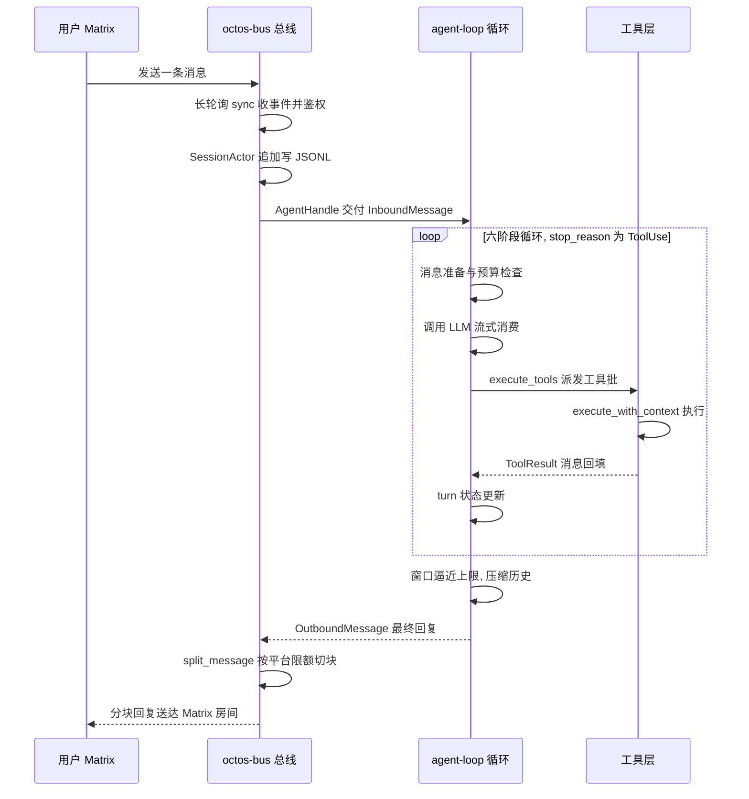
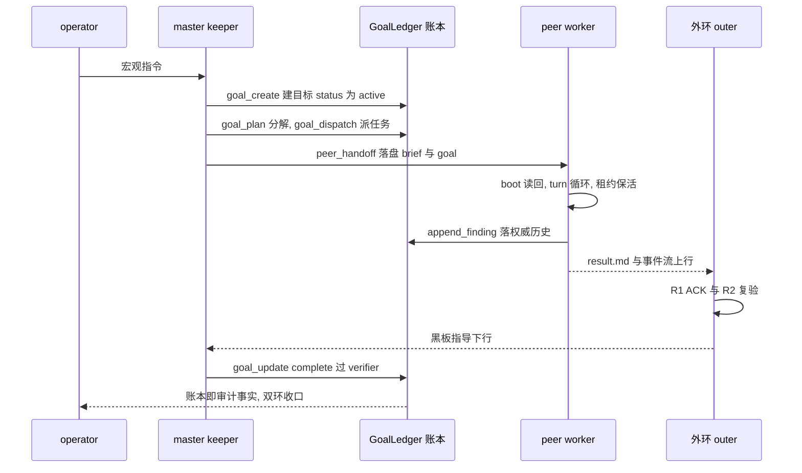

# 附录 F：OLP v2 协议速查

> **定位**:本附录是 OLP(octos 外环协议 OctoLoop,当前版本 `olp/v2`)的一页纸速查:R 系列条款、ACK 定式、result.md frontmatter、黑板条目格式、外环上岗与重启清单、第五信道参数与车道模板。协议为什么这样设计、载体全景与实证分析见第 20 章,此处不重复;本附录只做一件事,把散在协议文档、上岗卡与源码里的可执行规则压成可直接对照的表,每张表附来源路径与行号,便于逐条复核。

术语约定(首次出现处统一解释,后文不再重复):外环(outer agent)指以计划、监控、审查、指导身份接入的外部强模型;内环(runtime)指 `octos serve` 驱动的 master/peers 执行体;operator 指人类操作者;黑板指各仓库 `.octos/OUTER_LOOP_REVIEW.md` 的 `Active` 区,是任务级指导的权威载体;第五信道指内环在 turn 内主动向外环发问的 MCP 问询信道。数据基线:octoscode 仓库 main @ 1129fa33。

导览:F.1 是 R 系列条款速查,按 R1 至 R7 顺序排列(R4b 为 R4 子条款一并收录);F.2 给出 ACK 定式语法与黑板条目的写入规范;F.3 是 result.md frontmatter v1 的六字段表;F.4 是外环上岗流程与内环重启后的巡检硬清单;F.5 是第五信道的参数、防滥用常量与 sub_providers 车道模板。使用方式建议:新外环上岗前按 F.4 顺序走一遍;写指导意见前对照 F.2 的条目要素;审查交付时用 F.3 校验 frontmatter、用 F.1 的 R2 复核验证声明;为任务选模型档位时查 F.5 的配对矩阵。

## F.1 R 系列条款速查

| 条款 | 关键语义 | 来源行号 |
|---|---|---|
| R1 ACK 义务 | 黑板 `Active` 区每条意见,内环执行后必须在条目下补一行 ACK;无 ACK 视为未读,外环有权打回交付。v1 起定式语法由契约测试 `olp_ack_lines_match_v1_grammar` 钉住 | octoscode/docs/OUTER_LOOP_PROTOCOL.md:52-58 |
| R2 诚实验证声明 | 每个交付必须声明三档验证级别之一:`verified`(跑过 `cargo test --all-targets` + clippy + fmt)、`partially-verified`(列出跑了什么)、`unverified`(说明原因);声称 verified 但复验不符视为协议违例,打回并记黑板 | 同上 :67-70 |
| R3 升级分级 | escalation 三级:内环自决(重试/换法)→ 外环裁决(技术取舍、方案批准)→ operator 裁决(权限审批、范围变更、对外动作);外环不得代按审批,operator 缺席时 escalation 保持 park | 同上 :71-73 |
| R4 工作区共存 | 多写者各自只 `git add` 自己改的文件,禁止 `git add -A`;改动即原子 commit;来源不明的 dirty 文件必须保留并报告,不得自动清理或提交 | 同上 :74-76 |
| R4b 树主权与自动围栏 | 多 goal 并行时主工作树只属一个 goal:撞车谓词(active goal 多于一个 / peer 目标分支与主树不符 / 主树有未围栏在途 peer)命中即自动开 worktree 围栏;主树 owner 持久化进 goal-ledger,非 owner 会话在主树跨分支 checkout 一律拒绝;防撞成为系统默认,外环 steer 只做边界补位。作为 R4 子条款,不升协议版本 | 同上 :77-88 |
| R5 指导幂等 | 外环意见带日期与唯一编号,只在 `Active` 区可执行;ACK 后移入历史区永不重放,重复投递以 ACK 为去重依据 | 同上 :89-90 |
| R6 版本协商 | 协议文档头部 `protocol: olp/vN`,`AGENTS.md` 引用同版本;信道语义变更必须升版本 | 同上 :103-104 |
| R7 主审权 OS 独占锁 | 多外环的主审权以 per-project 会话寿命 OS 锁为准:上岗必须经 `octoscode outer-duty hold --project P --signature S --duties D -- <agent>` 包裹启动,锁即 authority;`check` 仅观察绝不夺取;活锁接管只归 operator(终止旧 holder 后再 acquire),无 agent 自助强夺;metadata sidecar 与一切 TTL 仅诊断、绝不参与裁定;Linux-only(非 Linux 平台显式 unsupported 退出 2,Windows LockFileEx 另立条目),NFS 不适用。v2 新增(#38-r1) | 同上 :91-102 |

原文条目顺序为 R1、R2、R3、R4、R4b、R5、R7、R6(R7 插在 R6 之前),本表按编号重排,行号可径直回查。

## F.2 ACK 定式与黑板条目格式

ACK 定式语法(v1 起,`ACK` 行写在内环刚执行完的黑板条目之下):

```
ACK(done|wontdo|blocked): <说明>
```

来源:octoscode/docs/OUTER_LOOP_PROTOCOL.md:56-58。

| 定式 | 语义 | 说明字段要求 | 来源行号 |
|---|---|---|---|
| `ACK(done): …` | 已执行 | 写做了什么与证据(commit hash / 测试结果) | 同上 :60 |
| `ACK(wontdo): …` | 带证据的异议,不执行 | 写为何不做;分歧规则:外环对 wontdo 只能接受或升级 operator 裁决,不得对同一条目再次打回 | 同上 :61-62 |
| `ACK(blocked): …` | 被阻塞无法执行 | 写阻塞原因与解除条件 | 同上 :63 |

生效边界:v1 语法只约束 2026-08-24 起新增的 ACK 行,历史行不重写,由契约测试的生效日期分界豁免;说明部分自由文本,非空即可(同上 :65-66)。

黑板条目写入规范(来源:octoscode/docs/OLP_OUTER_BOOT.md §1):

| 要素 | 规范 | 来源行号 |
|---|---|---|
| 板位置 | 每仓库一块 `<repo>/.octos/OUTER_LOOP_REVIEW.md`;`docs/` 下同名文件是冻结快照,严禁写入 | octoscode/docs/OLP_OUTER_BOOT.md:36-37 |
| 写入方式 | 必须走原子追加助手 `scripts/olp-board-append.sh <板路径>`(正文从 stdin 喂),flock 互斥加自写登记 | 同上 :38-41 |
| 编号 | 先 `grep -oE '^### [0-9]+' <板> \| tail -1` 取当前最大号,加一使用 | 同上 :42 |
| 条目内容 | 自包含:背景、精确文件/行号、修法方向、验收标准、分支名(基于 main) | 同上 :43-44 |
| 预算档 | 修订 5-10M / 切片 10-20M / 战役 30-50M,条目中写明 | 同上 :44 |
| 推送纪律 | 条目写明「只 commit 不 push,主审复验后代推」 | 同上 :45 |

## F.3 result.md frontmatter v1 六字段

`peers/<slug>/result.md` 是内环到外环的每轮交付物,v1 起其 YAML frontmatter 必须包含恰好六个字段,契约测试 `olp_result_schema_fields_documented` 钉住该清单(来源:octoscode/docs/OUTER_LOOP_PROTOCOL.md:354-358)。

| 字段 | 类型 | 含义 | 来源行号 |
|---|---|---|---|
| `slug` | string | peer 的唯一标识(目录名) | 同上 :362 |
| `outcome` | string | 交付结论,取值 `complete` / `partial` / `blocked` / `failed` | 同上 :363 |
| `updated_unix` | integer | 最近更新的 Unix 时间戳(秒) | 同上 :364 |
| `turn` | integer | 该 peer 已运行的 turn 数 | 同上 :365 |
| `verified` | string | R2 验证级别:`verified` / `partially-verified` / `unverified` | 同上 :366 |
| `protocol` | string | 写入时遵循的协议版本,当前 `olp/v2` | 同上 :367 |

消费侧约定:未知字段必须忽略(forward compatibility),消费方按上述六字段取数,对其他字段不解释、不报错;`verified` 与 `protocol` 由 octos 侧写入(同上 :369-373)。

## F.4 外环上岗与重启硬清单

上岗流程(数据源:octoscode/docs/OLP_OUTER_BOOT.md 与 OUTER_LOOP_PROTOCOL.md 接入清单):

| 步骤 | 内容 | 来源行号 |
|---|---|---|
| 署名 | 选定署名 `外环(<名字>)`,所有黑板写入必须署名;多外环并存时每条目单一主审,他人条目只可署名批注,分歧升级 operator | octoscode/docs/OLP_OUTER_BOOT.md:10-14 |
| 取主审锁 | 以 `octoscode outer-duty hold --project <项目> --signature <署名> --duties <职责> -- <agent 启动命令>` 包裹启动;`check` 仅观察,stdout 恰一态 VACANT/Held/ERROR | 同上 :74-81 |
| 定数据根与监听 | 数据根 `~/.octos/instances/<cwd-hash>/profiles/<profile>/data`;tail serve 日志过滤 `peer-goal:\|escalation\|transitioned goal\|ERROR`;观测分投递、消费、执行三层,只看一层必误判 | octoscode/docs/OUTER_LOOP_PROTOCOL.md:126-134 |
| 读协议与黑板 | 读协议全文与黑板 `Active` 区了解当前指导,历史区仅用于审计 | 同上 :135-136 |

内环重启后的外环巡检硬清单,四步逐项核对,禁止「记一笔稍后补」(来源:octoscode/docs/OLP_OUTER_BOOT.md:16-19):

| 步骤 | 内容 | 来源行号 |
|---|---|---|
| 1. serve 起 | operator 亲手执行;免沙箱启动属信任决策,永不由 agent 代劳 | 同上 :20-21 |
| 2. `/loop resume` 外环必代 | 先 `/loop list` 取 id,再 `/loop resume <id>`;裸 resume 缺 id 会被拒。maintenance 心跳暂停时主机制仍健康,兜底瘫痪不可见,只能靠巡检发现 | 同上 :22-27 |
| 3. 双哨挂载 | 正信号哨(ACK 落板)加负信号哨(events.jsonl 的 `goal_transition blocked` 与 escalation);只盯正信号时,goal 熔断的沉默与「还在干活」不可区分 | 同上 :28-30 |
| 4. fallbacks 与会话快照核对 | fallbacks 已配置且新会话已完成快照;改配置不重启等于纸面保险,工具表在会话建立时快照、不回补 | 同上 :31-32 |

## F.5 第五信道参数与车道模板

第五信道由 `octoscode olp-mcp-serve` 子命令提供(#31 起纯 Rust 标准库实现,源文件 octoscode/src/olp_mcp.rs,共 406 行),暴露恰好两个 MCP 工具,供内环在 turn 内同步向外环发问或直通落板。工具注册表见 octoscode/src/olp_mcp.rs:328-352。

`ask_outer` 参数(三参全必填,required 声明在 octoscode/src/olp_mcp.rs:340):

| 参数 | 语义 | 校验 | 来源行号 |
|---|---|---|---|
| `question` | 问外环的问题 | 为空直接拒绝 | 同上 :197-198 |
| `context` | 卡在何处、相关状态 | 无额外校验 | 同上 :183、:336 |
| `tried` | 已自行尝试过什么 | 为空拒绝(防思考外包:先试再问) | 同上 :186-188、:32 |

防滥用常量与行为:

| 项 | 值 | 行为 | 来源行号 |
|---|---|---|---|
| 超时 | 90 秒(`ASK_TIMEOUT_SECS`) | 超时返回降级指引:按黑板既有指导推进,无法推进则以 `ACK(blocked)` 收场并注明问询 id | 同上 :25、:30、:248-251 |
| 配额 | 每片 3 次(`ASK_QUOTA_PER_SLICE`) | 超出返回拒绝话术,提示自行推进或改用 `report_blocked` | 同上 :27、:31、:193-195 |
| 轮询间隔 | 0.5 秒(`ASK_POLL_INTERVAL_SECS`) | 答案文件轮询节奏 | 同上 :26 |
| 信箱 | `~/.octos/outer/mcp/` 下 questions、answers、consumed 三级流转 | 取答后问答对归档 consumed 并删除原文件 | 同上 :109-111、:231-241 |
| 审计 | 落 `OUTER_LOOP_MCP.md`,署名固定 `MCP(ask_outer)` | 全程留痕 | 同上 :24、:28 |

`report_blocked` 参数:`reason`(为何阻塞)与 `needs`(需要什么解除),二者必填,空 reason 拒绝;直通落板,无信箱往返(同上 :255-272、:344-352)。

sub_providers 车道模板(v1 附开箱模板,契约测试 `olp_lane_template_parses` 钉住;来源:octoscode/docs/OUTER_LOOP_PROTOCOL.md:375-391):

| 车道 | model | description 要点 | 来源行号 |
|---|---|---|---|
| cheap | kimi/kimi-k2-turbo | 低成本高吞吐:机械、低风险、强可回滚的任务(文档、测试诊断、日志分类、格式化),做错代价是一次重跑 | 同上 :384-386 |
| strong | anthropic/claude-opus | 长链推理与跨文件架构判断(审查定级、wontdo 复核、多步调试),做错会污染主线判断 | 同上 :388-390 |

双环搭配矩阵(同上 :393-400):

| 工作性质 | 车道 |
|---|---|
| 分析(读代码、写摘要、分类盘点) | cheap |
| 验证(跑测试、复验 R2 声明、机械断言) | cheap |
| 实施(写生产代码、契约测试、schema 改动) | primary(主档,不走路由) |
| keeper(goal 推进、ledger 记账、状态判断) | primary |

矩阵理由:分析与验证的产出被外层审查兜底,错了可重跑;实施与 keeper 的产出直接进主线与账本,错误成本高,留在主档由 R2 与外层审查控质(同上 :402-403)。

## F.6 端到端追踪(全书贯穿)

前五节是协议侧的静态速查,本节换一个维度:从全书 21 章里挑两条横切链路,把一个用户可见的动作从入口追到出口,验证各章分别讲过的机制在真实执行顺序里如何咬合。写法统一:先给时序图,再按阶段展开,每阶段标注所属章节与源码路径;行号全部沿用各章正文已有的引用,不新造行号(基线见本节末尾版本演化说明)。协议机制(R1 ACK、frontmatter、车道矩阵)F.1 至 F.5 已有速查表,此处只引用、不重复展开。

### Trace 1:一条 Matrix 用户消息如何变成频道里的回复

贯穿章节:第 11 章(消息总线,入站与会话)→ 第 5 章(Agent Loop 六阶段)→ 第 6 章(工具系统执行)→ 第 8 章(上下文压缩),回程再经第 11 章的出口切块机制。场景:用户在 Matrix 房间里发一句「把 ch07 的引用核对一遍」,期待 agent 读完文件、跑检查、把结论回到同一个房间。



**阶段一,入站与落账(第 11 章)。** 用户账号模式下 Matrix 频道对 homeserver 的 Client-Server `/sync` API 做长轮询,超时 30 秒(`SYNC_TIMEOUT_MS`,`crates/octos-bus/src/matrix_user_channel.rs:44`):请求挂着,有事件才返回,返回后立刻发下一个,没有推送权限的自建服务器也能近实时收消息。收到的消息先过频道层的两道门:发送者鉴权 `is_allowed()` 在路由给 Agent 之前执行,默认放行、各频道按需覆盖(`crates/octos-bus/src/channel.rs:27-30`);入站去重针对的是 webhook 类平台的超时重发,`MessageDedup` 用容量 1,000、TTL 60 秒的 LRU 缓存已见消息 ID(`crates/octos-bus/src/dedup.rs:12-25`),Discord 网关重连重放挂的是同一个实例(`crates/octos-bus/src/discord_channel.rs:32`)。所有频道实现同一个 `Channel` trait,26 个方法里只有 `name()`、`start()`、`send()` 没有默认实现(`crates/octos-bus/src/channel.rs:17-265`),所以新频道可以只写三个方法先跑起来。随后消息进入会话层:`SessionActor` 每会话持独立 `SessionHandle`,优先 per-user 布局并在打开时自动迁移旧文件(`crates/octos-bus/src/session.rs:1611-1819`);同 key 写入经 `persist_message_through_canonical_path()` 以 per-key Tokio mutex 串行化,避免多个写入口重复计数(`crates/octos-bus/src/session.rs:2332-2420`)。总线与处理层的解耦靠对称通道 `AgentHandle` / `BusPublisher`(`crates/octos-bus/src/bus.rs:8-77`):所有频道的 inbound 发送端 drop 后,接收端 `recv()` 返回 `None`,处理层自动感知可以优雅退出,不需要额外的 shutdown 信号。

随后消息进入会话层:`SessionActor` 每会话持独立 `SessionHandle`,优先 per-user 布局并在打开时自动迁移旧文件(`crates/octos-bus/src/session.rs:1611-1819`);JSONL 文件头一行是 `SessionMeta` 元数据而非消息,后续每行才是消息(`crates/octos-bus/src/session.rs:560`),追加走 `append_to_disk()`、整体重写走 write-then-rename 的 `rewrite()`,单个会话文件 10MB 封顶防止失控历史耗尽磁盘(`crates/octos-bus/src/session.rs:792`);落盘后的 durable commit observer 只是 best-effort fan-out,失败不回滚(`crates/octos-bus/src/session.rs:71`)。同 key 写入经 `persist_message_through_canonical_path()` 以 per-key Tokio mutex 串行化,避免多个写入口重复计数(`crates/octos-bus/src/session.rs:2332`)。总线与处理层的解耦靠对称通道 `AgentHandle` / `BusPublisher`(`crates/octos-bus/src/bus.rs:8-77`):所有频道的 inbound 发送端 drop 后,接收端 `recv()` 返回 `None`,处理层自动感知可以优雅退出,不需要额外的 shutdown 信号。

**阶段二,进入循环(第 5 章)。** 处理层拿到消息后走 `process_message` 家族,一次 turn 按 ①消息准备、②预算检查、③LLM 调用、⑤工具派发、⑥状态更新推进。①之前历史先送修复管线,入口是 `prepare_conversation_messages`(`crates/octos-agent/src/agent/loop_compaction.rs:27`),统一 tool_call_id、修复消息顺序与工具配对,避免破损历史触发 provider 校验失败。②每次迭代开头跑 `check_budget`(`crates/octos-agent/src/agent/budget.rs:100`),五道闸按固定顺序,任何一道命中即返回 `BudgetStop`(`crates/octos-agent/src/agent/budget.rs:13`),顺序本身就是设计:shutdown 原子加载最先响应,迭代上限次之,两种超时依赖活动跟踪(`crates/octos-agent/src/agent/activity.rs:16`),token 预算最后。③整个调用编排收敛在单一主函数 `call_llm_with_hooks`(`crates/octos-agent/src/agent/llm_call.rs:22`),重试尝试的 token 并入最终 usage 记账;流式消费由 `pub(super)` 的 `consume_stream_with_input_estimate`(`crates/octos-agent/src/agent/streaming.rs:73`)完成。错误路径不是散落的 `unwrap`,而是先经 `classify_loop_error`(`crates/octos-agent/src/agent/loop_runner.rs:313`)归类进 typed retry-bucket 状态机,调用侧拿到的只有 Retry 或 Bail 两个粗粒度动作。响应的 `stop_reason` 决定下一跳:EndTurn 返回、MaxTokens 走续跑与自愈(对话循环的续跑分支在 `crates/octos-agent/src/agent/loop_runner.rs:2171` 附近,nudge 提示续跑上限 2 次)、ToolUse 回到工具派发。

**阶段三,意图变成副作用(第 6 章)。** 工具派发主入口 `execute_tools` 是 `pub(super)`(`crates/octos-agent/src/agent/execution.rs:2483`),它决定串行还是并行、计算批超时、执行前后 hook;取消与 panic 都要投影成 LLM 能读的工具结果消息而不是让循环崩掉。工具本体实现 `Tool` trait(`crates/octos-agent/src/tools/mod.rs:609`),执行层走 M8.1 引入的类型化入口 `execute_with_context`(`crates/octos-agent/src/tools/mod.rs:11-28`),遗留的 `execute` 与类型化入口互相委托、一个工具至多覆写其一。注册与查找在 `ToolRegistry`(`crates/octos-agent/src/tools/registry.rs:536` 的 `register`、`:558` 的 `register_arc`),派发边界叠四层防线:provider 策略拒绝、参数体积上限、`catch_unwind` 的 panic 隔离(一个工具 panic 只降级为失败的 ToolResult,不再连带杀死 session actor)、全局执行超时。被标记 `spawn_only` 的工具在派发点被拦截转后台任务(`crates/octos-agent/src/agent/execution.rs:775` 附近),LLM 拿到的是小型 `task_handle` 信封,五种读法按需检查中间产物而不撑大上下文。本场景里 `read_file` 与 `bash` 的结果作为 ToolResult 消息回填,循环回到 ⑥:`LoopTurnState`(`crates/octos-agent/src/agent/turn_state.rs:59`)累积 usage 与终止原因,下一轮迭代继续。

**阶段四,窗口回收(第 8 章)。** 十几次工具迭代后窗口逼近上限,循环在错误分类处触发 `CompactAndRetry`,带内完成、调用方无须穿透压缩状态(`crates/octos-agent/src/agent/loop_runner.rs:313`)。压缩分层削减:本地占位符、服务端清理、完整摘要三档;最近消息无条件保留满六条且切割点不落在 Tool 消息上,放不下时退回尾部截断 `fallback_truncate()`(`crates/octos-agent/src/agent/compaction.rs:319`)。压缩掉的输出并非丢失:字节可凭 id 用 recall 取回,语义摘要作为可检索 episode 存档,入口压缩与轮内压缩各存一次(`crates/octos-agent/src/agent/loop_runner.rs:1215`)。压缩完成后循环继续,直到 `stop_reason` 为 EndTurn。本场景里 ch07 的引用核对要读多个事实表文件,若没有 recall 机制,同一个源文件会进窗口、被截断、被压缩、再被读取地循环;三层回收把这变成一次读加多次凭 id 取回。

**阶段五,回程(第 11 章出口)。** 最终回复作为 OutboundMessage 回到频道层,超过平台字符限制时长消息交给 coalescing:`split_message()` 按段落、句号、空格、硬切五级优先级找断点,先构造 UTF-8 安全窗口再在窗口内 `rfind`(`crates/octos-bus/src/coalesce.rs:68` 起的两步切割),`MAX_CHUNKS = 50` 防止极长消息碎片化成小消息洪水(`crates/octos-bus/src/coalesce.rs:47`);断点若等于 0 会被跳过,保证向前推进,不会在同一位置切出空块。分块经频道渲染送达 Matrix 房间;频道健康由 `health_check()` 统一暴露给管理面板(`crates/octos-bus/src/channel.rs:245`),而不是散落在各频道自己的管理接口。至此一条消息完成了从平台事件到分块回复的完整往返:入口去重、会话落账、六阶段循环、工具执行、上下文回收、出口切块,每一站都有自己的失败投影。

这条追踪揭示的系统性事实:入口与出口各有一道独立防线(入站去重、出站切块),坏消息进不来也出不去;循环的器官全部 `pub(super)`,crate 边界只暴露循环本身;上下文被当作流体管理,压缩、recall、episode 三层保证信息只降密度不丢失;每一层的失败(重复投递、超限消息、工具 panic)都有降级投影,而不是中断整条链路。

### Trace 2:一个 goal 从创建到双环收口

贯穿章节:第 18 章(goal/peer 双线)→ 第 12 章(并发三层与租约)→ 第 18 章(三条回流通道)→ 第 20 章(外环 OLP 观测与判词)。场景:operator 给 master 一句宏观指令「把附录 F 补两条端到端追踪」,从建目标到 `goal_update complete` 加外环 ACK 收口。



**阶段一,建账(第 18 章)。** keeper 侧的 `goal_create`(GoalCreateTool,`crates/octos-cli/src/goal_tool.rs` 的 :1495/:1509,准入检查跨两次调用串行化)接线在 `crates/octos-cli/src/runtime/profile.rs:1326`。落账走 `GoalLedger`(`crates/octos-fleet/src/sqlite_ledger.rs:13`):WAL 模式 SQLite,master、进程管理器、peers 是独立进程,共享同一个 `goal-ledgers/<goal_id>.db`;`impl GoalLedger` 的 39 个 pub fn 按用途分五组,目标的每次状态转移、每条发现、每个升级请求、每条决策都留审计痕迹,一个账本文件 6,360 行的体量由此而来。账本状态集是 active、complete、blocked、budget_limited、paused、cleared 六个字符串状态(`crates/octos-fleet/src/sqlite_ledger.rs:39` 注释,终态保护为 complete 与 cleared 两种);`archived` 不在账本状态集里,它是 supervisor 事件流侧的终态标记,两本账的状态集不混写。随后 `goal_plan` 把目标分解到持久 fleet、`goal_dispatch` 把就绪任务发到活的 worker 池(接线 `crates/octos-cli/src/runtime/profile.rs:1341` 与 `:1342`)。计划与执行的机器状态在 fleet 内核(redb),目标与审计在 GoalLedger(SQLite),两本账互不替代;keeper 把目标放进账本而不是对话上下文,正是对「长程目标放在上下文里会腐烂」这一章首问题的回答。

**阶段二,派 peer(第 18 章入口,第 12 章的并发底座)。** 模型侧入口 `peer_handoff` 只做参数校验(`crates/octos-agent/src/tools/peer_handoff.rs:133`),staging 由 `stage_peer`(`crates/octos-cli/src/peers/mod.rs:1563`)按固定顺序落盘 worktree、originator、goal、brief、name;peer boot 时 `read_peer_boot`(`crates/octos-cli/src/peers/host.rs:96`)读回执行上下文,originator 只读一次防止运行中被重绑定。存活语义由第 12 章的三层并发模型托底:peer/lease 层的 `PeerTaskBinding`(`crates/octos-cli/src/peers/mod.rs:166`)把 peer 绑到 supervisor 的 `TaskLivenessLease` 上;fleet 侧的 `Lease`(`crates/octos-fleet/src/records.rs:250`)只有 `owner_epoch` 与 `expires_at_ms` 两个字段,daemon 重启拿新 epoch,旧主人自动失权;supervisor 事件账本 `SupervisorStore`(`crates/octos-cli/src/autonomy/supervisor_store.rs` 的 :697)持久化受监管 agent 组状态,`load_state`(:780)在重启时读回。peer 会话的工具面被刻意收窄:goal 绑定的 peer 只接线 `goal_get` 与 `goal_update`(`crates/octos-cli/src/commands/chat.rs:859`),看得到目标、能把发现记回 master 的账本,拿不到 plan 与 dispatch,无权改写计划。

**阶段三,执行与回流(第 18 章)。** peer 有自己的 turn 循环与 token 预算,Trace 1 的六阶段循环就是它的基准变体,区别只在工具面与预算上限。终局产物由 `write_peer_result_if_peer_session`(`crates/octos-cli/src/api/ui_protocol_transport.rs:14279`)写回黑板,运行时落 frontmatter 四字段 slug/outcome/updated_unix/turn(`:14334`),turn 号由 `result-<n>.md` 计数加一推出;预算耗尽的 peer 另写五字段检查点副本(`crates/octos-agent/src/agent/budget.rs:584`),status/completed/iteration_budget/iterations_used/checkpoint_commit 五个字段把「跑到哪、差多少」留给下一次派发。回流通道有三条,在 `goal_get` 汇聚:live 通道读 `peers/<slug>/result.md`,快但会被覆盖;durable 通道走 `GoalLedger::append_finding`(`crates/octos-fleet/src/sqlite_ledger.rs` 的 :1623),goal-scoped peer 完成 turn 即落盘,重启仍在,是权威历史;escalation 通道在 peer park 时写 `append_escalation`(:1635),master 错过实时通知也能在 `goal_get` 的 `open_escalations` 里看到谁在等。外部事件经 `fleet_wake`(`crates/octos-cli/src/autonomy/fleet_wake.rs`)消费 fleet outbox 转成续跑请求,只有持久化成功(WakeCommit::Durable)才 ack,未持久化的事件租约过期后重投;请求入队点在 `crates/octos-cli/src/autonomy/agent_orchestrator.rs:12963`,`GoalContinue` 与 `GoalWrapUp` 两个变体(`crates/octos-cli/src/autonomy/master_continuation_scheduler.rs` 的 :141/:147)驱动 keeper 下一 tick,后者是预算耗尽后的收尾 turn。peer 终局以 `closed` 墓碑标记(`peer_is_closed`,`:1317`),master 用 `peer_gather` 拉取 result.md 收账;命令行观察面 `octos peer list` 同样直读黑板目录,零 serve 依赖。

**阶段四,外环判词(第 20 章)。** 双环不共享内存,一切协作走可审计的持久信道:上行有事件流、result.md、goal-ledgers、escalation、git diff 与主动问询,下行有 `AGENTS.md`、黑板、原子 commit、inbox 门铃与 TUI 注入。外环上岗前先取主审权锁,以 `octoscode outer-duty hold` 包裹启动,锁即 authority。观测分三层:投递、消费、执行,只看一层必误判,这也是外环最容易犯的错。判词的载体是黑板 Active 区每条意见的 ACK 行:执行后必须补一行,无 ACK 视为未读,外环有权打回交付(`octoscode/docs/OUTER_LOOP_PROTOCOL.md:52` 起,v1 定式语法由 `octoscode/tests/olp_contract.rs:96` 钉住);交付审查按 R2 三档验证级别复核 result.md 的 `verified` 声明,声称 verified 但复验不符视为协议违例,打回并记黑板。frontmatter 的协议 schema 为六字段(`octoscode/docs/OUTER_LOOP_PROTOCOL.md:354`,字段清单 :362 至 :367),消费侧忽略未知字段以保前向兼容,`verified` 与 `protocol` 两字段由 octos 侧写入。内环在 turn 内主动问询走第五信道 `ask_outer`(`octoscode/src/olp_mcp.rs:174`),超时与配额行为见 F.5 表:超时降级按既有黑板指导推进,无法推进则以 ACK(blocked) 收场并注明问询 id;配额超出直接拒绝,提示改用 `report_blocked`。本场景里外环对 F.6 两节初稿的评审意见正是经黑板下行、经 ACK 上行,与 goal 账本的状态机并行运转、互不阻塞。

**阶段五,收口(第 18 章)。** master 调 `goal_update` 主张 complete(GoalUpdateTool,`crates/octos-cli/src/goal_tool.rs` 的 :1163/:1266,接线 `crates/octos-cli/src/runtime/profile.rs:1329`,若配置 verifier 车道则挂独立校验),完成主张要过 verifier 才生效。状态转移的唯一入口 `cas_goal_status`(`crates/octos-fleet/src/sqlite_ledger.rs` 的 :899)在 UPDATE 语句里内嵌预算规则:目标 active 且 `tokens_used >= token_budget` 时直接写 `budget_limited` 而不是调用者要写的终态;`update_goal_status`(`:1498`)走另一条非 CAS 的转移路径,complete 与 blocked 只有模型可到,reopen 只认 blocked、paused、budget_limited 三种入口,账本侧的终态保护是 complete 与 cleared 两种。外环在这一步之后做什么:黑板 Active 区的评审项逐条核对 ACK 是否落地、R2 声明的验证档位是否与实际跑过的命令相符,复核通过才同意 operator 代推分支;若有 wontdo 分歧,按 F.1 的分歧规则只能接受或升级 operator,不得对同一条目再次打回。`goal_update complete` 之后,账本是审计事实,外环的 ACK 与黑板历史区是人可读的对照面,两圈各自留痕、互不覆写;若日后 operator 重开此目标,reopen 的三种入口也都能在账本的状态转移记录里找到出处。

这条追踪揭示的系统性事实:目标的状态只活在一本 SQLite 账里,人读黑板、模型读工具、外环读文件,三种读者看同一个事实的三种投影;所有权用租约与 epoch 表达,不依赖进程内锁,重启即自动纠偏;「完成」是一个要过独立验证的主张,不是一次写操作;错过通知被从异常路径变成普通读路径,`goal_get` 一次调用把三通道的账收齐。

## 版本演化说明

- v0 至 v1(2026-08-24 生效):R1 ACK 定式语法化(done/wontdo/blocked 与 wontdo 分歧规则);result.md frontmatter v1 schema 固化;sub_providers 车道模板(附录 A、B 随之定稿)。v1 语法只约束生效日起新增的 ACK 行(octoscode/docs/OUTER_LOOP_PROTOCOL.md:9-12)。
- v1 至 v2(2026-08-30 生效,#38-r1):新增 R7 主审权 OS 独占锁(outer-duty hold/check;锁即 authority、check 仅观察、活锁接管归 operator、metadata/TTL 仅诊断;Linux-only 单机 flock 加 PDEATHSIG,Windows 另立条目,NFS 不适用);`AGENTS.md` 引用同步 v2(同上 :14-17)。
- R4b 树主权与自动围栏系 octos #20-20c 移植,作为 R4 子条款收录,不升协议版本(同上 :88)。
- 后续:L3 平台扩展(R7 主审锁 macOS 支持)已于 2026-09-02 立项,守护 reaper 进程加 kqueue 复刻死亡耦合,信道语义不变、不升协议版本(同上 :167-172)。
- 本附录全部行号以 octoscode 仓库 main @ 1129fa33 为基线,后续协议演进请以仓库内文档为准。F.6 追踪基线同全书 octos main @ 9c157101。
