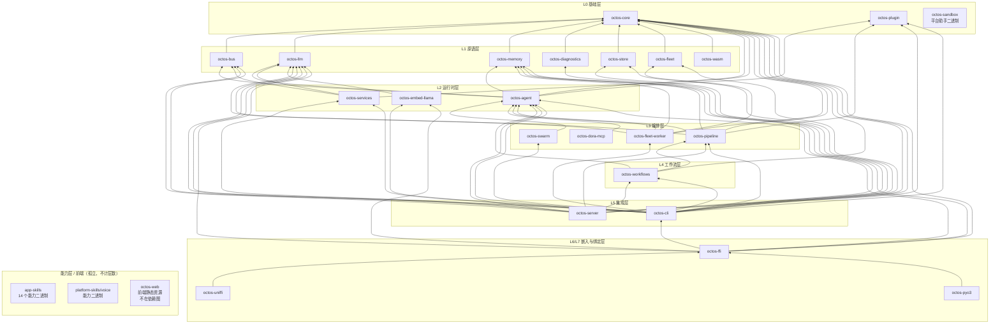

# 第 1 章：为什么是 Rust？为什么是 Agent OS？

> **定位**：本章是全书开篇，回答两个根本问题：多租户 AI Agent 平台究竟难在哪里？为什么 octos 用 Rust 写、又为什么长成今天这个 26 个 crate 的形状？前置依赖：无。适合全部四类读者：**A**（Rust 初学者）能借此建立「Rust 在真实大型系统里解决什么问题」的直观图景；**B**（资深 Rust 开发者）可以直接跳到 1.3 节看 workspace 分层与依赖拓扑；**C**（AI/LLM 应用开发者，不要求 Rust 背景）重点读 1.1 的问题空间，即使最终选择 Python，这三大挑战也绕不过去；**D**（贡献者）请特别留意 1.3.3 的三处事实澄清，它们是读懂仓库结构的前提。

当你第一次打开 octos 的源码仓库，`ls crates | wc -l` 会给出 26；`find crates -name '*.rs' | xargs wc -l | tail -1` 会给出 700,915 行 Rust；根 `Cargo.toml` 的 `members` 列表有 38 个成员。这里躺着一个消息总线（17 个频道源文件）、一个 Agent 运行时（`crates/octos-agent/src/tools/` 下 59 个工具源文件）、一个 DOT 驱动的流水线引擎、一个 Fleet 计划执行内核，以及供 Python/Swift/Kotlin/浏览器/Node 嵌入的整条绑定链。看到这些，从 LangChain 或 AutoGen 过来的开发者第一反应是质疑语言选型；看到满屏的 `tokio::spawn` 与 `Arc<Mutex<_>>`，Go 开发者则会怀疑 goroutine 是不是更省事。

这不是语言品味之争。当你把「AI Agent」从单用户玩具推向多租户生产平台，你面对的是一组相互纠缠的工程约束——**安全隔离、并发、性能**。任何一条单独看都不难，三条同时成立时，语言与工程组织的选型就从偏好问题变成了架构决策。本章先讲清楚这三大挑战（1.1），再论证为什么 Rust 是当前对这组约束最合适的答案（1.2），然后展开 octos 的 workspace 拓扑，为后续 20 章建立全局地图（1.3）。本章所有规模数字都标注了统计口径，均可按第 1.3.1 节给出的命令在源码仓库逐条复现。

---

## 1.1 问题空间：多租户 AI Agent 平台的三大挑战

octos 不是 chatbot 框架，而是一个多租户 AI Agent 操作系统：同一份进程要为多个用户、多个 Agent 实例服务，而每个 Agent 都能调用带副作用的工具：执行 Shell、读写文件、发起网络请求、再派生子 Agent。三大挑战正是从这里生长出来的。

### 1.1.1 挑战一：安全隔离，59 个工具源文件就是 59 个攻击面入口

设想一个真实场景：租户 A 的 Agent 在总结一篇网页时被 prompt 注入，恶意指令试图读取租户 B 的会话历史，或者执行 `rm -rf /`。在多租户环境里这不是理论风险。octos 的攻击面可以从事实表直接量化：`crates/octos-agent/src/tools/` 下有 59 个工具源文件（口径：`ls crates/octos-agent/src/tools/*.rs | wc -l`）。注意这是源文件数，不是工具数，其中包含 `mod.rs`、`registry.rs`、`policy.rs` 这类框架文件。

每个真正暴露给 LLM 的工具（`shell`、`browser`、`web_fetch`、`write_file`、`spawn` 等）都是一条独立的攻击路径。再加上 `crates/octos-bus/src/` 下的 **17 个 `*_channel.rs` 频道源文件**（Telegram、Discord、Slack、WhatsApp、飞书、邮件、Matrix、企业微信、钉钉、QQ Bot、Twilio、Line 等；其中 `api_channel.rs` 与 `cli_channel.rs` 是两个内部通道，并非全部对外），平台在物理上就是「一张接满了外部消息网络的、能执行代码的图」。每接入一个频道，就多一个入站消息的信任边界；每注册一个工具，就多一个出站副作用的通道。

Agent 场景的安全隔离比传统 Web 服务难，原因有三：

1. 工具调用是核心能力而非旁路。Web 服务的危险操作通常收敛到少数几个 handler；Agent 的每一次循环迭代都可能触发任意工具组合，且调用序列由 LLM 生成、不可预先枚举。防御必须下沉到「每次调用」的粒度，octos 因此在工具层实现了 deny-wins 的策略引擎与审批流（详见第 6、7 章）。
2. Prompt 注入是新型攻击向量。它发生在自然语言层面，WAF 式的正则规则基本失效。攻击载荷可以藏在一篇被 `web_fetch` 抓回来的文档里，再借工具调用落地为文件写入或命令执行。
3. 隔离边界必须是进程级的。语言层的权限检查只能挡「合法 API 的滥用」，挡不住 Shell 命令本身。octos 把真正的沙箱子系统放在 `octos-agent` 内部的 `crates/octos-agent/src/sandbox/`（六个文件：`bwrap.rs`、`docker.rs`、`landlock.rs`、`macos.rs`、`windows.rs`、`mod.rs`），分别对接 Linux 的 bubblewrap/Landlock、Docker、macOS 的 sandbox-exec 与 Windows 的 AppContainer（`../octos/crates/octos-agent/src/sandbox/mod.rs:1-23`）。第 7 章会逐个拆解。

这三层防御（语言内存安全 → 工具策略 → 进程沙箱）能成立的前提，是承载它们的运行时本身不引入新的内存安全漏洞。这正是 1.2 节语言选型的第一个约束。

### 1.1.2 挑战二：并发，同一进程里的三重并发面

第二个挑战同样可以量化。Gateway 模式下，17 个频道的入站消息同时到达；octos 用一个 `tokio::sync::Semaphore` 把并发会话数压在配置上限内（默认 10，`../octos/crates/octos-cli/src/config.rs:1633-1635`），信号量在 Gateway 启动时创建（`../octos/crates/octos-cli/src/commands/gateway/gateway_runtime.rs:1731-1732`）：

```rust
// Semaphore to bound concurrent session processing
let concurrency_semaphore = Arc::new(Semaphore::new(gw_config.max_concurrent_sessions));
```

但「限流」只是并发的第一重。第二重在 Agent 循环内部：单次迭代里 LLM 可能一次下发多个工具调用，octos 把每个调用 `tokio::spawn` 成独立任务再 `join_all` 聚合、保持调用顺序（`../octos/crates/octos-agent/src/agent/execution.rs:598` 的 `spawn_tool_task` 与 `:2483` 的 `execute_tools`）。第三重在进程外：后台 Cron/Heartbeat 定时唤醒会话、子 Agent 同步阻塞或后台异步双模式、fleet worker 独立进程消费任务，它们共享同一套会话状态与消息总线。

并发本身不是问题，并发中的正确性才是：

- 会话级串行化：同一会话的两条消息不能并发改写状态，需要 per-session 锁序；
- 工具级并行：同一批次内互不依赖的工具必须并行，否则延迟线性叠加；
- 优雅关停：收到 SIGTERM 时不能腰斩进行中的对话，octos 用 `AtomicBool` 标志位贯穿信号处理与循环预算检查；
- 无共享不误会：派生出的任务（spawned task）不允许借用栈上状态，一切跨 `.await` 与跨任务的数据都必须显式所有权转移或 `Arc`。

这四条里任何一条写错，症状都不是「崩溃」而是「偶发的、无法复现的数据错乱」。在生产多租户平台上，这是最贵的一类故障。

### 1.1.3 挑战三：性能，LLM 慢不代表框架可以慢

「LLM 调用都要几秒钟，框架性能无所谓」是 Agent 工程里最流行的误解。它错在三个地方：

第一，延迟是乘性的。 一次 Agent 执行可能跑几十次迭代，每次迭代都有消息构建、上下文压缩、工具调度。框架层每迭代多 50ms，几十次迭代就是肉眼可见的卡顿。在流式场景里，这直接决定「打字机手感」的成败。

第二，内存是多租户的硬约束。 每个会话都持有对话历史、工具状态与上下文窗口。运行时本身每会话的开销乘上并发会话数，就是必须提前规划的容量：解释型运行时的每会话基线开销通常显著高于编译型，具体差多少要按目标并发数实测容量，100 个并发会话时这笔差值直接决定还能不能再挤进一个容器。

第三，热路径在框架里，不在 LLM 里。 SSE 流式解析、消息频道的分片切割、上下文压缩的截断、工具输出的尺寸估算，这些都在每次迭代里执行。octos-core 里有一个典型的小函数 `truncate_utf8`（`../octos/crates/octos-core/src/utils.rs:6-16`）：

```rust
pub fn truncate_utf8(s: &mut String, max_len: usize, suffix: &str) {
    if s.len() <= max_len { return; }
    let mut limit = max_len;
    while limit > 0 && !s.is_char_boundary(limit) {
        limit -= 1;
    }
    s.truncate(limit);
    s.push_str(suffix);
}
```

它做的事很小：在 UTF-8 字符边界安全截断。但它出现在消息裁剪、频道分片、工具输出限幅等所有热路径上。注意它接收 `&mut String` 原地截断而不是返回新分配的 `String`：在每条消息都可能被截断的路径上，省掉的是每次迭代里成千上万次的堆分配。这类「不惊人但无处不在」的开销，恰恰是框架性能的主体。

三大挑战讲完了。它们的共性是：都不能靠「写代码时小心」解决，必须靠语言与组织的结构性保证。这就引出语言选型。

---

## 1.2 语言选型：Python、Go 与 Rust 的四维对比

octos 的候选集其实只有三个：Python（LangChain/AutoGen 生态最厚）、Go（云原生并发最顺手）、Rust（安全与性能的上限最高）。下面按安全、并发、性能、生态四个维度逐一对照，结论先行：Rust 赢在前三维，输在第四维，而第四维的缺口可以用工程手段弥补。

### 1.2.1 安全维度：内存安全是防御纵深的第零层

1.1.1 节的三层防御中，最底层是「运行时自身无内存安全漏洞」。一个用 C/C++ 写的 Agent 运行时，沙箱做得再好，也可能在解析恶意构造的 SSE 分片或 WebSocket 帧时自己先倒下，因为解析不可信输入正是内存安全漏洞的高发区。octos 的做法很直接：workspace 根 `Cargo.toml` 统一 lint（`../octos/Cargo.toml:50-51`）：

```toml
[workspace.lints.rust]
unsafe_code = "deny"
```

一行配置，26 个目录、38 个成员全部继承，`unsafe` 在整个代码库被编译器拒绝（除非逐 crate 显式豁免）。Python 与 Go 在这一层各有姿态：Python 解释器由 C 实现，历史上多次出现解析恶意输入导致的内存安全 CVE；Go 自带内存安全，但 `unsafe` 包与 cgo 交界处同样存在失守面。Rust 的差异在于把「无 unsafe」变成可机器验证的全库不变量，而不是编码规约。

类型系统的另一重价值是「让非法状态不可表示」。Agent 领域最容易出 bug 的地方（消息角色的枚举、任务状态的迁移、工具结果的形状）在 octos-core 里都是穷尽匹配的 `enum`，漏一个分支编译不过。这比「运行时校验 + 测试覆盖」的防线提前了整整一个阶段。

### 1.2.2 并发维度：把数据竞争消灭在编译期

先看三段语言语义的对照（示意代码，非 octos 源码）：

```go
// Go:两个 goroutine 并发自增。编译通过,数据竞争潜伏
go func() { counter++ }()
go func() { counter++ }()
```

```python
# Python:CPython GIL 使线程无法并行执行 CPU 工作
threads = [threading.Thread(target=process_chunk) for c in chunks]
```

```rust
// Rust:同样的写法无法通过编译,借用在跨线程时必须显式
s.spawn(|| counter += 1);  // ❌ error: closure may outlive borrowed value
```

Go 的 goroutine 模型写起来最省事，但正确性依赖纪律与 `-race` 检测。race detector 基于 happens-before 算法，本质上是测试期工具，覆盖不到的路径不受保护。Python 的 GIL 则直接封死了「单进程多线程并行」这条路，`asyncio` 能处理 I/O 并发但一个同步调用就会卡住整个事件循环，多进程方案的序列化开销又与 1.1.2 要求的细粒度共享状态模型相抵触。

Rust 的答案是把并发正确性编码进类型系统：`Send`（可跨线程转移）与 `Sync`（可跨线程共享）两个 marker trait 由编译器自动推导，跨 `.await` 持有非 `Send` 的借用会直接编译失败。1.1.2 节那四条正确性要求（会话串行化、工具并行、优雅关停、任务不借用栈状态）在 Rust 里每一条都有对应的编译期保障形态。代价是学习曲线，收益是整类故障从生产事故清单上消失。

### 1.2.3 性能维度：无 GC 的确定性延迟

Agent 框架的性能画像很特殊：大量短生命周期分配（消息、分片、工具结果）、长驻任务（会话、频道连接）、以及必须平滑的流式路径（SSE 解析逐 token 转发）。GC 语言在这种画像下的典型症状是：停顿本身不频繁，但停顿发生在哪次迭代里不可预测：今天压测 p99 很好，明天某条会话的长对话触发大回收，流式输出肉眼可见地卡一下。

Rust 无 GC：分配与释放跟随着所有权在编译期确定，`Drop` 析构让文件描述符、子进程句柄、锁的释放都确定性地发生。1.1.3 节的 `truncate_utf8` 已经展示了「避免分配」的写法；再往上一层，octos-agent 的工具 trait 签名（`../octos/crates/octos-agent/src/tools/mod.rs:609-642`，节选）：

```rust
#[async_trait]
pub trait Tool: Send + Sync {
    fn name(&self) -> &str;
    fn description(&self) -> &str;
    fn input_schema(&self) -> serde_json::Value;
    async fn execute(&self, args: &serde_json::Value) -> Result<ToolResult>;
}
```

注意 `Tool: Send + Sync` 这个约束，它是 1.2.2 节的编译期并发保证在工具系统上的落点：任何工具实现想被注册进注册表并在多会话间共享，编译器就强制它证明自己线程安全。性能与并发两个维度在这里合流：同一个类型系统约束，同时买到了并行安全与零开销抽象。

### 1.2.4 生态维度与选型代价

诚实地说，生态是 Rust 的相对短板：LangChain/AutoGen 的教程与现成集成更丰富，Python 是 LLM 事实上的「胶水语言」；Go 在云原生基础设施（K8s 生态、指标、部署工具链）上更成熟。octos 的应对是把生态问题转化为架构问题。这解释了 1.3 节拓扑里的两条链。

第一条链向外接语言生态：`octos-ffi`（C-ABI）之下挂 `octos-pyo3` / `octos-uniffi` / `octos-wasm`，让 Python、Swift/Kotlin、浏览器以原生绑定嵌入 octos，Python 生态的用户不必放弃 Python。

第二条链接能力生态：`octos-plugin` 让外部能力以 manifest + 二进制协议接入，`app-skills` 14 个能力二进制干脆零 `octos-*` 依赖、完全独立演进。Rust 只负责必须由 Rust 负责的核心，边缘留给各个生态自己。

选型的代价同样要写明：学习曲线陡（借用检查器对新人不友好，读者 A 请预期前两周的挫败感）；编译时间长（全量构建 70 万行代码需要耐心，增量构建与 26 crate 的拆分正是缓解手段）；部分领域库（如某些新兴协议的 SDK）需要自己写而不是 pip install。这些代价换来的是上面三个维度的结构性保证。对「多租户 + 可执行代码 + 长驻进程」这三类工作负载，Rust 的编译期保证收益大于生态成本。

---

## 1.3 Workspace 拓扑：26 个 crate 的八层地图

语言解决「怎么写得对」，workspace 解决「怎么长得对」。octos 用一个 Cargo workspace 组织 26 个顶层目录，本节先立统计口径，再按依赖方向推导分层，然后澄清三处最容易搞错的事实，最后给出完整的依赖拓扑图。

### 1.3.1 规模基准与统计口径

本章所有规模数字以源码仓库 main 分支 commit `9c157101`（2026-09-02 统计）为准，逐条可复现：

| 指标 | 值 | 口径与命令 |
|---|---|---|
| crate 目录总数 | 26 | `ls crates \| wc -l`；= 23 个 `octos-*` crate + `app-skills` + `platform-skills` + `octos-web` 三个目录 |
| Rust 总行数 | 700,915 | `find crates -name '*.rs' \| xargs wc -l \| tail -1`；仅统计 `.rs` 文件，`octos-web` 计 0 |
| workspace 成员数 | 38 | 根 `Cargo.toml` `members` 列表长度；26 目录中 `app-skills`/`platform-skills` 是多 crate 目录（各含 14/1 个成员），23+14+1=38，`octos-web` 不是成员 |
| 消息频道源文件 | 17 | `ls crates/octos-bus/src/*_channel.rs \| wc -l` |
| 工具源文件 | 59 | `ls crates/octos-agent/src/tools/*.rs \| wc -l`；是文件数不是工具数（含 `mod.rs`、`registry.rs`、测试等框架文件） |

26 与 38 的关系值得单独强调：目录数 ≠ 成员数 ≠ 核心库数。`crates/app-skills/` 没有顶层 `Cargo.toml`，它是一个装着 14 个独立二进制 crate 的目录；`platform-skills/` 装 1 个（voice）；`octos-web` 连 Rust 都没有。把这四个数字混为一谈，是外部读者对 octos 结构最常见的第一重误解。

### 1.3.2 八层分层：L0–L7 加一层「能力层」

分层由依赖方向推导得出：每个 crate 的层 = 1 + max(其 `[dependencies]` 中所有 `octos-*` 依赖的层)，零内部依赖者为 L0。按此规则，26 个目录落入 8 层（L0–L7）加一个不计层数的能力层：

- L0 基础层：`octos-core`（核心类型、任务模型与协议，22,313 行，全库的领域语言）、`octos-plugin`（插件 SDK：manifest 解析、发现、门控，5,165 行）、`octos-sandbox`（1,468 行；注意它是平台助手二进制，见 1.3.3）。
- L1 原语层（只依赖 core）：`octos-bus`（消息总线、17 个频道、会话管理，42,767 行）、`octos-llm`（Provider 抽象，35,087 行）、`octos-memory`（情景记忆，6,428 行）、`octos-diagnostics`（诊断与更新规划，2,243 行）、`octos-store`（自包含持久化存储，2,664 行）、`octos-fleet`（Fleet 内核存储：事务记录 + 单写事务 CAS + 恢复对账，16,888 行）、`octos-wasm`（浏览器端协议绑定，883 行）。
- L2 运行时层：`octos-agent`（Agent 运行时、工具执行与协调，191,985 行，全库心脏，依赖 core/bus/memory/llm/plugin）、`octos-services`（从 CLI 抽出的支撑服务，3,223 行）、`octos-embed-llama`（进程内 GGUF embedding，911 行）。
- L3 编排层（直接依赖 agent）：`octos-pipeline`（DOT 流水线引擎，32,799 行）、`octos-swarm`（fan-out/sequence/pipeline 编排原语，4,980 行）、`octos-dora-mcp`（dora 桥兼容 re-export，11 行）、`octos-fleet-worker`（封闭非交互任务 worker，6,842 行）。
- L4 工作流层：`octos-workflows`（依赖 pipeline，1,059 行）。
- L5 集成层：`octos-server`（HTTP/WebSocket API + 会话运行时，门面薄层仅 21 行）、`octos-cli`（CLI 入口，307,299 行，依赖 15 个 crate，是全库汇聚点）。
- L6 嵌入核心层：`octos-ffi`（C-ABI 绑定，1,372 行，依赖 cli/agent/llm/memory/embed-llama 等）。
- L7 绑定层：`octos-uniffi`（Python/Swift/Kotlin，465 行）、`octos-pyo3`（推荐 Python 绑定，756 行）。
- 能力层（不计层数）：`app-skills`（14 个能力二进制，合计 12,098 行）、`platform-skills/voice`（1,188 行）、`octos-web`（前端，0 行 Rust）。它们的共同特征：**零 `octos-*` 依赖、不被任何 crate 依赖**，因此不参与核心库分层。

两个行数悬殊值得停下来看一眼：`octos-server` 只有 21 行却站在 L5，因为它是纯粹的组装门面，真正逻辑全在下层 crate；`octos-cli` 占全库 44% 站在 L5，因为它是「前门」，把 15 个下层 crate 的能力装配成 `chat`/`gateway`/`serve` 等运行模式。层反映的是依赖深度，不是重要性，更不是代码量。

### 1.3.3 三处事实澄清：读仓库前先纠正三个印象

外部材料（包括本书 v1 版稿）对 octos 结构有三处系统性误传，读源码前必须纠正：

澄清一：`octos-sandbox` 不是沙箱子系统。 它的 `Cargo.toml` description 是 "Platform sandbox helper for octos"，1,468 行，`[dependencies]` 只有 clap 和 eyre，零 `octos-*` 依赖。它是随平台分发的辅助二进制。真正的沙箱在 `octos-agent` 内部：`crates/octos-agent/src/sandbox/` 下六个文件（`bwrap.rs`、`docker.rs`、`landlock.rs`、`macos.rs`、`windows.rs`、`mod.rs`），覆盖 Linux bubblewrap/Landlock、Docker、macOS sandbox-exec、Windows AppContainer 与无沙箱回退（`../octos/crates/octos-agent/src/sandbox/mod.rs:1-23`）。谈「octos 沙箱」，指的永远是 `octos-agent::sandbox`。

澄清二：`octos-web` 不含 Rust、不是 workspace 成员。 它是 TypeScript 项目（`package.json`/`tsconfig.json`/`vitest.config.ts`），0 个 `.rs` 文件；根 `Cargo.toml` 的 `members` 里 grep 不到 `octos-web`。它是前端静态资源，不在 Cargo 依赖图内，拓扑图里它是孤立节点。

澄清三：不存在 harness crate。 `ls crates | grep harness` 零命中。harness 是 `octos-agent` 内部的模块：`src/lib.rs:30-31` 声明 `pub mod harness_errors;` 与 `pub mod harness_events;` 两个平级模块文件。别把 `app-skills/harness-starter-*` 四个脚手架当成 harness 本体，它们是面向用户的起步模板，不是 harness 实现。第 10 章会专门讲 Harness。

### 1.3.4 依赖拓扑图：63 条边一张图

下图是整个 workspace 的依赖拓扑，63 条依赖边一条不多、一条不少，每条边都来自对应 crate `Cargo.toml` 的 `[dependencies]` 段（机器核对命令：`awk '/^\[dependencies\]/{f=1;next} /^\[/{f=0} f && /^octos-/' crates/*/Cargo.toml | wc -l` → 63）。方向为 `A --> B` 即 A 依赖 B，`graph BT` 自底向上读：越靠上的 crate 越靠近用户。



读图要点：（1） `octos-core` 是唯一被 15 个 crate 依赖的根，它必须保持零内部依赖与极高稳定性（第 2 章的主题）。（2） `octos-agent` 被 8 个 crate 依赖（pipeline、swarm、dora-mcp、fleet-worker、workflows、server、ffi、cli），是事实上的第二枢纽。（3） 四个孤立节点（app-skills、platform-skills/voice、octos-web、octos-sandbox）不在 63 条边内：能力二进制与前端通过进程边界而非 Cargo 依赖接入，这正是它们「不属于核心库分层」的形式化表述。（4） 依赖全部指向下方，无环；新增任何一条向上的边都会在 `cargo` 那里直接报错，分层是被工具链强制的不变量。

> ### 工程决策侧栏：mono-repo workspace vs multi-repo
>
> 26 个 crate、63 条内部依赖边，摆在面前的组织方案至少有三种：
>
> 方案 A：multi-repo，每 crate 一仓。 优点：权限边界清晰、每仓可独立发版与裁剪 CI、外部贡献者 clone 面小。缺点对 octos 是致命的：63 条边意味着跨仓改动是常态而非例外：改一处 `octos-core` 的类型定义会波及 15 个下游 crate，multi-repo 下你要开 16 个 PR、维护 16 个版本号与 16 份 lockfile，跨仓原子重构不可能，CI 还要在每仓重复编译公共依赖。语义化版本挡不住「接口变了但版本没升对」的人祸。
>
> 方案 B：single mega-crate。 把全部 70 万行塞进一个 crate。优点：无跨 crate 版本问题、重构随便改。缺点同样致命：编译时间失控（任何一行改动触发全量重编）；`octos-web` 这类非 Rust 资产无处安放；`app-skills` 的 14 个二进制会被迫拖上全部核心依赖（它们本来零 `octos-*` 依赖）；feature flag 组合爆炸，任何一个模块开错 feature 都可能污染全局编译。
>
> 方案 C（octos 的选择）：Cargo workspace mono-repo。 既保留了单仓的原子性（跨 crate 重构是一个 commit、一次 CI），又用 crate 边界保住了编译隔离与依赖方向：根 `Cargo.toml` 统一 `members`（38 项）、统一 `workspace.package`（version/edition 2024/rust-version 1.85.0）、统一 `workspace.lints`（`unsafe_code = "deny"` 一处生效全库）、统一 `workspace.dependencies` 管内部 path 依赖版本。分层靠 `[dependencies]` 的方向自然成立，`cargo` 本身就是架构守护者。
>
> 附带的工程红利：能力二进制（app-skills/platform-skills）作为 workspace 成员享受统一工具链，却因零 `octos-*` 依赖而不进入核心编译图；将来若某个 crate 需要独立演进，从 workspace 拆出也远比从 mega-crate 拆出便宜。取舍：mono-repo 的代价是仓库体积增长、CI 必须做分层缓存、外部贡献者面对的是一棵 26 目录的大树，octos 用目录分层（1.3.2）与本书的导航（1.4）来对冲。

---

## 1.4 全书导览

本书 v2 版按「地基 → 引擎 → 平台 → 双环」四部分展开，共 21 章 + 附录。编号以 v2 重写计划为准（相对 v1 有平移：原第 10 章 bus 移至第 11 章，第 10 章成为新增的 Harness 章）：

| 部分 | 章 | 主题 |
|---|---|---|
| 第一部分 地基 | Ch1 | 为什么是 Rust？为什么是 Agent OS？（本章） |
| | Ch2 | octos-core：用类型系统定义领域语言 |
| | Ch3 | octos-llm：驯服 LLM Provider 的混乱 |
| | Ch4 | octos-memory：混合搜索的工程实现 |
| 第二部分 引擎 | Ch5 | Agent Loop：一次对话的完整生命周期 |
| | Ch6 | 工具系统：59 个源文件背后的设计模式 |
| | Ch7 | 安全纵深：从沙箱到 Prompt 注入防御 |
| | Ch8 | 上下文管理：让 Agent 在有限窗口中高效工作 |
| | Ch9 | 扩展机制：Skills 与 Plugins 双轨制 |
| | Ch10 | Harness（新增）：校验器、事件 ABI、schema 版本化 |
| 第三部分 平台 | Ch11 | octos-bus：17 频道的统一消息抽象 |
| | Ch12 | 并发模型：Tokio、supervisor、peer、lease 三层调度 |
| | Ch13 | octos-pipeline：DOT 图驱动的工作流引擎（12 种 IR 节点） |
| | Ch14 | 三种运行模式与配置体系（含 stdio/solo） |
| | Ch15 | 生产化：octos-store / octos-services、认证与监控 |
| | Ch16 | Fleet（新增）：可恢复的计划执行内核 |
| | Ch17 | Swarm（新增）：契约扇出与聚合门禁 |
| | Ch18 | Goal 与 Peer（新增）：把目标从上下文里搬出来 |
| 第四部分 双环 | Ch19 | octoscode（新增）：终端客户端与 UI Protocol |
| | Ch20 | OctoLoop（新增）：外环协议 OLP v2 |
| | Ch21 | herdr 与外环运维实务（新增） |
| 附录 | A–D、F | 26 crate 依赖全图、工具速查、配置参考（mcp_servers/sub_providers/validators）、Feature Flags、OLP v2 协议速查（新增） |

阅读路线建议：A 类读者按顺序读，Ch1–Ch5 建立 Rust + Agent 的双基础；B 类读者可跳过语言论证直达 Ch5、Ch12、Ch16；C 类读者优先 Ch1、Ch7、Ch11、Ch13，跳过实现细节侧栏；D 类贡献者请先读完本章与附录 A 再动第一个 PR。

## 1.5 本章回顾

1. 问题空间：多租户 AI Agent 平台的安全隔离（59 个工具源文件 + 17 个频道的攻击面）、并发（会话/工具/进程三重并发面的正确性）、性能（乘性延迟、多租户内存、框架热路径）三大挑战相互纠缠，决定了选型是架构决策。
2. 语言选型：Rust 在安全（全库 `deny(unsafe_code)` + 类型系统）、并发（`Send`/`Sync` 编译期保证）、性能（无 GC、确定性析构、零分配热路径）三维胜出；生态短板用 FFI/绑定链（pyo3/uniffi/wasm）与 plugin/skill 扩展机制对冲。
3. Workspace 拓扑：26 目录 = 23 个 `octos-*` crate + 2 个技能目录 + 1 个前端目录；38 个 workspace 成员按依赖方向落入 L0–L7 八层加不计层数的能力层；63 条依赖边无一环、全部向下。`octos-sandbox` 是助手二进制（真沙箱在 `octos-agent::sandbox` 六文件）、`octos-web` 非 Rust 非成员、harness 是 `octos-agent` 内模块而非 crate，三处澄清是读仓库的正确起点。

从下一章开始自底向上：先看 L0 的 `octos-core` 如何用类型系统为整个平台定义领域语言。

---

## 延伸阅读

- Cargo Workspaces：官方文档 "Workspaces" 章，https://doc.rust-lang.org/cargo/reference/workspaces.html ，对照 1.3 的 members/lints/dependencies 继承机制。
- Rust 所有权与并发：*The Rust Programming Language* Ch4 "Understanding Ownership" 与 Ch16 "Fearless Concurrency"，https://doc.rust-lang.org/book/ ，`Send`/`Sync` 的推导规则。
- Tokio 教程：https://tokio.rs/tokio/tutorial ，Ch12 并发模型的前置。
- OWASP Top 10 for LLM Applications：https://owasp.org/www-project-top-10-for-large-language-model-applications/ ，prompt 注入与 Agent 安全的威胁分类。
- 本书附录 A：26 crate 完整依赖图（本章拓扑图的全量版）。

## 思考题

1. 攻击面估算：以 1.1.1 的口径为方法，为一个「接入 3 个频道、注册 20 个工具」的自建 Agent 服务估算攻击面：哪些边界需要独立信任模型？哪一层最薄弱？
2. 并发的编译期 vs 运行期：Go 的 `-race` 检测与 Rust 的 `Send`/`Sync` 各自兜住哪类错误、漏掉哪类？如果团队从 Go 迁到 Rust，哪些测试可以删，哪些必须保留？
3. 层数权衡：octos 的 L6/L7（ffi → uniffi/pyo3）拆成两层，而不是让 pyo3 直接依赖全部核心 crate。这样拆让什么变贵、让什么变便宜？如果明天要加一个 Kotlin 绑定，改哪一层？
4. 能力层的隔离价值：`app-skills` 的 14 个二进制零 `octos-*` 依赖。这带来什么工程性质？如果让它们直接依赖 `octos-agent`，编译图与发布节奏会发生什么变化？
5. 组织镜像：对照 1.3.4 的拓扑图，为一个你熟悉的系统画出同样的依赖图。它的分层是像 octos 一样被工具链强制，还是只存在于文档里？差异会带来什么长期后果？

---

## 版本演化说明

> 本章分析基于 octos main @ `9c157101`（2026-09-02 统计）的 26 crate 工作区；所有规模数字（26 目录、38 成员、700,915 行 Rust、17 个频道源文件、59 个工具源文件、63 条依赖边）的统计口径与复现命令见 `assets/ch01-facts.md`，逐条可在源码仓库核对。
>
> 相对本书 v1 旧稿，本章作了三类更新。其一，三处事实纠正：`octos-sandbox` 是平台助手二进制而非沙箱子系统（真沙箱是 `octos-agent::sandbox` 的六个文件）；`octos-web` 不含 Rust、不是 workspace 成员；不存在 harness crate，harness 是 `octos-agent` 内部的 `harness_errors`/`harness_events` 模块。其二，拓扑层数更新：旧稿的四层架构与核心 crate 数口径作废，v2 按 `[dependencies]` 依赖方向推导为 L0–L7 共 8 层加不计层数的能力层。其三，全书结构调整：Harness 独立成第 10 章，原第 10 章 bus 平移至第 11 章，第 16 章起为新增章。
