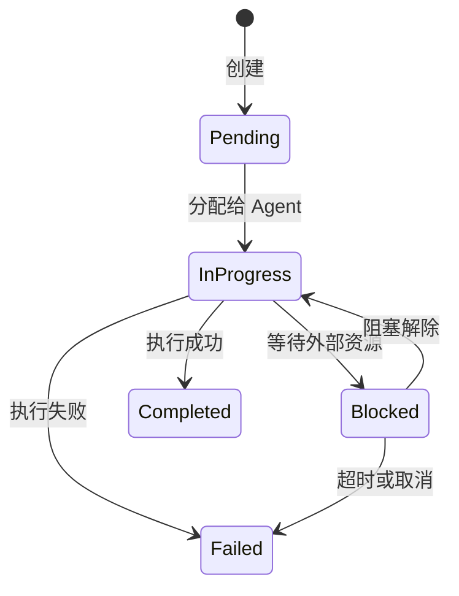
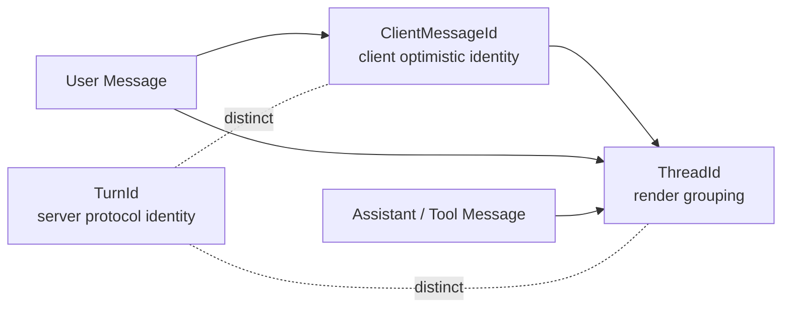
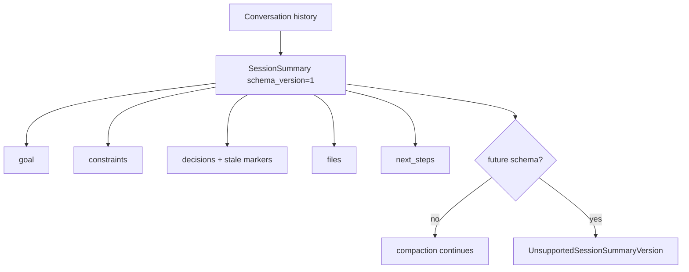

# 第 2 章：octos-core：用类型系统定义领域语言

> **定位**：本章深入 octos 最底层的 crate octos-core（当前 22,313 行 Rust 源文件，剔除 crates/octos-cli/src/api/ui_protocol_tests.rs 测试后约 15,005 行，主要增长来自 UI Protocol wire 类型），展示如何用 Rust 类型系统构建 AI Agent 平台的领域语言。前置依赖：第 1 章。适用场景：想理解 octos 类型基础的所有读者，尤其是希望通过实战项目学习 Rust 枚举和错误处理设计的读者（读者 A），以及想了解"零依赖 core crate"设计哲学的资深开发者（读者 B）。

如果把 octos 比作一座城市，octos-core 就是它的语言——不是建筑、不是道路，而是居民用来交流的词汇和语法。`Task`、`Message`、`MessageRole`、`Error`、UI Protocol wire 类型，这些类型定义了系统中所有组件如何描述自己的状态和意图。octos 的上层 crate 都依赖这些类型，但 octos-core 本身不依赖 workspace 中的任何其他 crate。

这个零依赖约束不是偶然的。它是一个刻意的架构决策，确保领域语言演进时仍保持清晰边界：当 octos-llm 重构 Provider 实现或 octos-bus 调整频道时，core 只承接真正跨 crate 的 wire identity 与 domain model，而不吸收上层实现逻辑。本章将从 Task 状态机开始，逐个解析这些基础类型的设计，最后讨论这个零依赖策略的工程意义。

---

## 2.1 Task 状态机：用枚举编码合法状态

每个 AI Agent 执行的工作在 octos 中被建模为一个 `Task`。Task 是整个系统的工作单元：从"帮我写一段代码"到"审查这个 diff"，所有用户请求最终都被转化为 Task。

### 2.1.1 Task 结构体

Task 的定义位于 `crates/octos-core/src/task.rs:11-29`：

```rust
pub struct Task {
    pub id: TaskId,                      // UUID v7，自带时间排序
    pub parent_id: Option<TaskId>,       // 子任务层级
    pub status: TaskStatus,              // 当前状态
    pub kind: TaskKind,                  // 任务类型
    pub context: TaskContext,            // 执行上下文
    pub result: Option<TaskResult>,      // 完成后的结果
    pub created_at: DateTime<Utc>,
    pub updated_at: DateTime<Utc>,
}
```

几个值得注意的设计选择：

**`TaskId` 使用 UUID v7 而非 v4**（`crates/octos-core/src/types.rs:180-189`）。UUID v4 是纯随机的，而 v7 的前 48 位编码了毫秒级时间戳。这意味着 TaskId 天然按创建时间排序：在调试和日志分析中，你可以直接通过 ID 判断任务的先后顺序，无需额外查询 `created_at` 字段。

**`parent_id: Option<TaskId>`** 支持任务层级。当一个复杂任务需要分解为多个子任务时（例如，Pipeline 中的多步骤执行），每个子任务通过 `parent_id` 指向父任务，形成树状结构。

**`result: Option<TaskResult>`** 只在 Task 完成后存在。这利用了 Rust 的 `Option` 类型在编译期强制调用者处理"结果可能不存在"的情况：你无法在未检查的情况下访问一个 Pending 状态 Task 的结果。

### 2.1.2 TaskStatus：编译期防止非法转换

TaskStatus 是一个带数据的枚举（`crates/octos-core/src/task.rs:63-77`）：

```rust
pub enum TaskStatus {
    Pending,
    InProgress { agent_id: AgentId },
    Blocked { reason: String },
    Completed,
    Failed { error: String },
}
```

注意 `InProgress` 变体携带 `agent_id`，这不只是状态标记，还记录了谁在执行这个任务。同样，`Blocked` 携带阻塞原因，`Failed` 携带错误信息。这种"状态 + 上下文数据"的组合是 Rust 枚举相比其他语言的 enum（如 Go 的 `iota` 常量或 Java 的传统 enum）的核心优势。

在 Python 中，你可能会用一个字符串字段 `status: str` 加上几个可选字段 `agent_id: Optional[str]`、`error: Optional[str]` 来表达同样的语义。但这种设计允许非法状态：比如一个 `status="pending"` 但 `agent_id="agent-1"` 的 Task，或者 `status="completed"` 但 `error="something failed"` 的 Task。Rust 的枚举让这些状态在类型层面就不可能存在。

### 2.1.3 状态转换图

Task 的合法状态转换如下：



图 2-1：Task 状态机。 每个状态转换对应一个明确的业务事件。注意 Pending 只能转向 InProgress（不能直接跳到 Completed），InProgress 是唯一可以到达 Completed 的路径。这确保了每个完成的任务都经历过执行阶段。

### 2.1.4 TaskKind：五种任务类型

TaskKind 定义了五种工作类型（`crates/octos-core/src/task.rs:79-99`）：

```rust
pub enum TaskKind {
    Plan { goal: String },
    Code { instruction: String, files: Vec<PathBuf> },
    Review { diff: String },
    Test { command: String },
    Custom { name: String, params: serde_json::Value },
}
```

前四种是预定义的常见场景：规划（Plan）、编码（Code）、审查（Review）、测试（Test）。第五种 `Custom` 是扩展点：通过 `name` 标识任务类型，`params` 携带任意 JSON 数据。这种"有限预定义 + 开放扩展"的模式在 octos 中反复出现（详见第 6 章工具系统和第 9 章扩展机制）。

### 2.1.5 TaskContext 与 TaskResult

TaskContext（`crates/octos-core/src/task.rs:102-115`）是任务执行时的环境快照：

```rust
pub struct TaskContext {
    pub working_dir: PathBuf,
    pub git_state: Option<GitState>,      // 分支、未提交变更、HEAD commit
    pub working_memory: Vec<Message>,      // 近期对话轮次
    pub episodic_refs: Vec<EpisodeRef>,    // 过往 episode 引用
    pub files_in_scope: Vec<PathBuf>,
}
```

`working_memory` 和 `episodic_refs` 的区别值得关注：`working_memory` 是当前会话的短期记忆（最近几轮对话），而 `episodic_refs` 是从长期记忆中检索出的相关片段（详见第 4 章）。这种双记忆架构模仿了人类的工作记忆（working memory）和情景记忆（episodic memory）的区分。

TaskResult（`crates/octos-core/src/task.rs:125-157`）记录任务的产出，共 7 个字段：`schema_version`（durable ABI 版本，见 2.3 节）、`success`、`output`、`files_modified`、`files_to_send`、`subtasks`、`token_usage`。

TokenUsage（`crates/octos-core/src/task.rs:159-173`）值得特别关注。它不只追踪 input/output tokens，还包含 `reasoning_tokens`（思维链 token，用于 o1、kimi-k2.5 等推理模型）和 `cache_read_tokens`/`cache_write_tokens`（Provider 缓存命中/写入）。这五个维度让上层可以精确计算成本和优化缓存策略。序列化时，为零的字段会被跳过，避免 JSON 膨胀。

---

## 2.2 Message 与 MessageRole：跨 Provider 的统一抽象

AI Agent 平台需要对接多个 LLM Provider：Anthropic 的 Claude、OpenAI 的 GPT-4、Google 的 Gemini、本地的 Ollama。每个 Provider 的 API 对消息角色的命名和语义略有不同。octos-core 定义了统一的 `Message` 和 `MessageRole` 类型，作为所有 Provider 的公约数。

### 2.2.1 Message 结构体

Message 的定义位于 `crates/octos-core/src/types.rs:227-258`：

```rust
pub struct Message {
    pub role: MessageRole,
    pub content: String,
    pub media: Vec<String>,                         // 图片/音频文件路径
    pub tool_calls: Option<Vec<ToolCall>>,           // LLM 请求的工具调用
    pub tool_call_id: Option<String>,                // 工具响应对应的调用 ID
    pub reasoning_content: Option<String>,           // 思维链内容
    pub client_message_id: Option<String>,           // 客户端乐观 UI / 幂等 token
    pub thread_id: Option<String>,                   // AppUI thread 渲染分组 key
    pub timestamp: DateTime<Utc>,
}
```

`media` 字段（`crates/octos-core/src/types.rs:232-234`）支持多模态：当用户发送图片或语音时，文件路径存储在这里，由 octos-llm 在构建 API 请求时转换为对应 Provider 的格式（base64 编码或 URL 引用）。序列化时，空的 `media` 向量会被跳过。

`reasoning_content`（`crates/octos-core/src/types.rs:239-241`）是为推理模型（如 OpenAI o1、Kimi k2.5）设计的：这些模型会先输出一段内部推理过程，然后才给出最终回答。将推理内容与正式回答分离存储，让上层可以选择是否展示思维链。

`client_message_id` 和 `thread_id` 是当前主分支里很重要的 UI / 持久化 identity 字段（`crates/octos-core/src/types.rs:229-256`）。它们不是 Provider 消息格式的一部分，而是 AppUI、Gateway、Session 持久化共同依赖的跨 crate 协议字段：前者用于把客户端乐观 UI 气泡和服务端持久化 seq 对齐，后者用于把 user / assistant / tool 消息归入同一个渲染 thread。

### 2.2.2 Message identity：ClientMessageId、ThreadId、TurnId 不能混用

当前源码把三种看似相近的 identity 拆成三个不同类型：

| 类型 | 定义位置 | 职责 | 典型来源 |
|------|----------|------|----------|
| `ClientMessageId` | `crates/octos-core/src/types.rs:12-64` | 客户端提交 user message 时生成的乐观 UI / 幂等 token | Web/AppUI client |
| `ThreadId` | `crates/octos-core/src/types.rs:79-177` | 渲染分组 key，让 assistant/tool 回复落回 originating user bubble | 通常 root at `ClientMessageId` |
| `TurnId` | `crates/octos-core/src/ui_protocol.rs:607-623` | UI Protocol 的服务器端 turn identity | backend 创建 |



这个分离是一次真实 bug 链的类型化修复。`ClientMessageId` 和 `ThreadId` 都包的是 `String`，但语义完全不同；`TurnId` 则是 UUID 形态的协议 identity。把它们做成 newtype，可以让编译器阻止“把 client message id 当 turn id 用”这类错误（`crates/octos-core/src/types.rs:12-177`，`crates/octos-core/src/ui_protocol.rs:607-623`）。

Message 也提供了显式绑定构造函数：

```rust
pub fn user_with_cmid(content: impl Into<String>, cmid: ClientMessageId) -> Self
pub fn user_rooting_thread(content: impl Into<String>, cmid: ClientMessageId) -> Self
pub fn assistant_with_thread(content: impl Into<String>, thread_id: ThreadId) -> Self
pub fn tool_with_thread(content: impl Into<String>, tool_call_id: impl Into<String>, thread_id: ThreadId) -> Self
```

其中 `assistant_with_thread()` 和 `tool_with_thread()` 要求调用方显式传入 `ThreadId`（`crates/octos-core/src/types.rs:310-350`）。这和 Ch10 的 Session 写入规则是一致的：Assistant/Tool 新写入不能再靠“回看最近一个 user”来猜 thread，因为并发 turn 下这个猜测会把 late delta 或工具结果归到错误气泡。core crate 在类型层先表达这个约束，上层持久化路径再 fail closed。

### 2.2.3 MessageRole：as_str() 与 Display 的双重实现

MessageRole 只有四个变体（`crates/octos-core/src/types.rs:444-451`）：

```rust
pub enum MessageRole {
    System,
    User,
    Assistant,
    Tool,
}
```

关键在于它的两个方法实现。`as_str()`（`crates/octos-core/src/types.rs:453-463`）返回 `&'static str`，四个变体分别映射为 `"system"`、`"user"`、`"assistant"`、`"tool"`，一个穷尽的 `match`，没有通配分支，新增变体时编译器会强制补齐这里的映射。

`Display` trait 实现（`crates/octos-core/src/types.rs:465-469`）的函数体只有一行 `f.write_str(self.as_str())`。为什么要同时实现这两个？因为它们服务于不同场景：

- `as_str()` 接受 `self`（按值传递），返回 `&'static str`。这是可行的因为 `MessageRole` 实现了 `Copy` trait：枚举只有四个无数据变体，拷贝成本等同于拷贝一个字节。按值传递用于需要零分配的场景，比如构建 API 请求时设置 JSON 字段值。
- `Display` 用于格式化字符串（`format!()`、`println!()` 等），是 Rust 生态的标准接口。

这种模式确保了跨 Provider 的一致性：无论是发送给 Anthropic 还是 OpenAI，消息角色始终序列化为 `"system"`、`"user"`、`"assistant"`、`"tool"` 这四个小写字符串。各 Provider 的差异（比如 Anthropic 的 system message 是独立字段而非消息数组的一部分）在 octos-llm 中处理，不会泄漏到核心类型层。

### 2.2.4 ToolCall 与元数据扩展

ToolCall（`crates/octos-core/src/types.rs:471-479`）是 LLM 请求调用工具时的数据结构：

```rust
pub struct ToolCall {
    pub id: String,
    pub name: String,
    pub arguments: serde_json::Value,
    pub metadata: Option<serde_json::Value>,
}
```

`metadata` 字段（`crates/octos-core/src/types.rs:476-478`）是为 Provider 特定数据预留的扩展点。例如，Google Gemini 的工具调用会携带 `thought_signature` 字段，用于验证工具调用是否来自模型的推理过程。通过 `Option<Value>` 存储这些异构数据，核心类型无需为每个 Provider 添加特定字段。

### 2.2.5 便捷构造函数

Message 仍保留了三个 legacy 便捷构造函数（`crates/octos-core/src/types.rs:355-417`），用于测试、反序列化 round-trip 和旧调用点：`Message::user(content)`、`Message::assistant(content)`、`Message::system(content)`，签名均为 `(content: impl Into<String>) -> Self`。

注意参数类型是 `impl Into<String>` 而非 `String` 或 `&str`。这让调用者可以传入 `String`、`&str`、甚至 `Cow<str>`，编译器会自动选择最高效的转换路径。这是 Rust 中常见的 API 设计模式：通过泛型减少调用者的类型转换负担。三个构造器的函数体都只是把 content 包进对应 role 的 Message，不再赘述。

---

## 2.3 Durable ABI：TaskResult 与 SessionSummary 的 schema_version

octos-core 现在还承担一类更隐蔽的职责：给跨 crate 持久化 payload 定义 stable ABI。两个例子最典型。

`TaskResult` 带有 `schema_version`（`crates/octos-core/src/task.rs:138-157`）：

```rust
pub struct TaskResult {
    #[serde(default = "default_task_result_schema_version")]
    pub schema_version: u32,
    pub success: bool,
    pub output: String,
    pub files_modified: Vec<PathBuf>,
    #[serde(default, skip_serializing_if = "Vec::is_empty")]
    pub files_to_send: Vec<PathBuf>,
    pub subtasks: Vec<TaskId>,
    pub token_usage: TokenUsage,
}
```

这个字段不是展示用版本号，而是 Harness / workspace contract / task result 在磁盘和进程边界上传递时的 durable ABI。旧 payload 没有该字段时，会通过 serde default 回到 `TASK_RESULT_SCHEMA_VERSION = 1`，保证历史数据可读。

第二个例子是 `SessionSummary`（`crates/octos-core/src/task.rs:233-305`）。它是 Ch8 里 typed compaction 的核心载体：

```rust
pub struct SessionSummary {
    #[serde(default = "default_session_summary_schema_version")]
    pub schema_version: u32,
    pub goal: String,
    #[serde(default, skip_serializing_if = "Vec::is_empty")]
    pub constraints: Vec<String>,
    #[serde(default, skip_serializing_if = "Vec::is_empty")]
    pub progress_done: Vec<String>,
    #[serde(default, skip_serializing_if = "Vec::is_empty")]
    pub progress_in_progress: Vec<String>,
    #[serde(default, skip_serializing_if = "Vec::is_empty")]
    pub decisions: Vec<DecisionRecord>,
    #[serde(default, skip_serializing_if = "Vec::is_empty")]
    pub files: Vec<FileRecord>,
    #[serde(default, skip_serializing_if = "Vec::is_empty")]
    pub next_steps: Vec<String>,
}
```

`SessionSummary` 的设计重点不是“把聊天记录压成一段摘要”，而是把 goal、constraints、progress、decisions、files、next_steps 分开保存，让后续 compaction 可以迭代更新结构化字段。缺失 `schema_version` 时默认到当前版本；如果读到未来版本，`validate_schema_version()` 返回 `UnsupportedSessionSummaryVersion` typed error，而不是 panic 或静默丢字段（`crates/octos-core/src/task.rs:188-305`）。



这也是为什么 `SessionSummary` 放在 octos-core 而不是 octos-agent：Ch8 的 compaction、Ch9 的 Harness ABI、Ch14 的 UI/runtime 观测都会引用它。core crate 在这里提供的是 wire-stable domain language，而不是具体 compaction 算法。

---

## 2.4 Error 设计：为什么选 eyre 而不是 anyhow

Rust 生态中有两个主流的错误处理库：`anyhow` 和 `eyre`。它们都提供类型擦除的错误报告（`anyhow::Error` / `eyre::Report`），但 octos 选择了 `eyre`/`color-eyre`。这个选择值得深入分析。

### 2.4.1 octos 的错误类型

octos-core 的 Error 定义在 `crates/octos-core/src/error.rs:10-17`：

```rust
pub struct Error {
    pub kind: ErrorKind,
    pub context: Option<String>,
    pub suggestion: Option<String>,
}
```

这里的关键设计是三层结构：`kind` 分类错误类型，`context` 添加执行上下文，`suggestion` 提供可操作的修复建议。

ErrorKind 是一个 15 变体的枚举（`crates/octos-core/src/error.rs:20-56`），覆盖了系统中所有错误类别：

```rust
pub enum ErrorKind {
    TaskNotFound(String),
    AgentNotFound(String),
    InvalidStateTransition { from: String, to: String },
    LlmError { provider: String, message: String },
    ApiError { provider: String, status: u16, body: String },
    ToolError { tool: String, message: String },
    ConfigError(String),
    ApiKeyNotSet { provider: String, env_var: String },
    UnknownProvider(String),
    Timeout { operation: String, seconds: u64 },
    ChannelError { channel: String, message: String },
    SessionError(String),
    IoError(std::io::Error),
    SerializationError(String),
    Other(eyre::Report),
}
```

注意最后一个变体 `Other(eyre::Report)`：这里使用了 `eyre::Report` 而非 `anyhow::Error`。

### 2.4.2 eyre vs anyhow：选型理由

`anyhow` 和 `eyre` 的核心 API 几乎相同，但有两个关键差异：

**差异一：自定义错误报告器。** `eyre` 支持通过 `eyre::set_hook()` 安装自定义的错误报告器。`color-eyre` 就是这样一个报告器，它在错误发生时自动捕获 `std::backtrace::Backtrace` 和 `tracing_error::SpanTrace`，并以彩色格式输出。对于一个 CLI 工具来说，当 Agent 执行失败时，开发者能立即看到彩色高亮的错误链和调用栈，这比 anyhow 的纯文本输出提供了更好的调试体验。

**差异二：生态对齐。** octos 的 workspace 依赖声明中同时使用了 `eyre` 和 `color-eyre`（`Cargo.toml:97-98`）。这是因为 `color-eyre` 在 CLI 入口初始化（`main()` 中调用 `color_eyre::install()`），而 `eyre::Report` 作为通用错误类型在整个代码库中使用。如果混用 `anyhow::Error` 和 `eyre::Report`，需要在边界处做转换，增加不必要的复杂度。

### 2.4.3 可操作的错误消息

octos 的错误设计最值得学习的不是库的选择，而是"让错误消息可操作"的理念。看几个便捷构造函数的实现（`crates/octos-core/src/error.rs:80-173`）：

```rust
pub fn api_key_not_set(provider: impl Into<String>, env_var: impl Into<String>) -> Self {
    let provider = provider.into();
    let env_var = env_var.into();
    Self::new(ErrorKind::ApiKeyNotSet {
        provider: provider.clone(),
        env_var: env_var.clone(),
    })
    .with_suggestion(format!(
        "Set the API key:\n    export {env_var}=your-api-key\n  Or add to .octos/config.json:\n    {{\"api_key_env\": \"{env_var}\"}}"
    ))
}
```

当用户忘记设置 API Key 时，错误消息不只告诉你"key 没设"，还告诉你"设置 `ANTHROPIC_API_KEY` 环境变量，或在 config.json 中配置"。同样，`api_error()` 会根据 HTTP 状态码给出不同的建议：401 提示检查 key，429 提示被限流，504 提示超时。

Display 实现（`crates/octos-core/src/error.rs:174-224`）将这三层信息格式化为用户友好的输出，并使用 `truncated_utf8()` 安全截断过长的 API 响应体，避免错误日志中出现巨大的 JSON dump。

---

## 2.5 truncate_utf8：一个小函数背后的 UTF-8 安全哲学

`truncate_utf8` 是 octos-core 中最小但最精巧的函数之一。它只有 10 行代码（`crates/octos-core/src/utils.rs:6-16`），却解决了一个在多语言 AI 应用中极其常见的问题：如何安全地截断可能包含中文、日文、emoji 等多字节字符的字符串。

### 2.5.1 问题：UTF-8 的多字节陷阱

UTF-8 是一种变长编码：ASCII 字符占 1 字节，中文字符占 3 字节，emoji 占 4 字节。当你需要将字符串截断到 N 个字节时，截断点可能正好落在一个多字节字符的中间。以"你好世界"为例：每个汉字 3 字节，四个字共 12 字节；若截断到 7 字节，保留的是 [E4 BD A0] [E5 A5 BD] 加上孤立的 [E4]，最后这个字节是"世"的第一个字节，不再构成合法的 UTF-8 序列。

在 C/C++ 中，这种截断会产生无效的 UTF-8 字符串，可能导致下游解析崩溃。Python 的 `str[:7]` 按字符而非字节截断，避免了这个问题但无法精确控制字节预算。

### 2.5.2 两个变体：in-place 与 copying

octos 提供了两个截断函数：

**`truncate_utf8`**（`crates/octos-core/src/utils.rs:6-16`）原地截断，修改原字符串：

```rust
pub fn truncate_utf8(s: &mut String, max_len: usize, suffix: &str) {
    if s.len() <= max_len {
        return;
    }
    let mut limit = max_len;
    while limit > 0 && !s.is_char_boundary(limit) {
        limit -= 1;
    }
    s.truncate(limit);
    s.push_str(suffix);
}
```

**`truncated_utf8`**（`crates/octos-core/src/utils.rs:21-30`）返回新字符串，不修改原始数据：

```rust
pub fn truncated_utf8(s: &str, max_len: usize, suffix: &str) -> String {
    if s.len() <= max_len {
        return s.to_string();
    }
    let mut limit = max_len;
    while limit > 0 && !s.is_char_boundary(limit) {
        limit -= 1;
    }
    format!("{}{}", &s[..limit], suffix)
}
```

核心算法相同：从 `max_len` 位置向前回退，直到找到一个合法的 UTF-8 字符边界（`is_char_boundary()`）。截断后追加 suffix。注意这两个函数的 `max_len` 不包含 suffix 的长度，追加 suffix 后最终字符串可能超过 `max_len`。这是有意的设计：`max_len` 控制的是保留内容的上限，suffix 是额外的标记。调用者需要在设置 `max_len` 时预留 suffix 的空间。

两个变体的区别在于所有权语义：
- `truncate_utf8` 接受 `&mut String`，原地修改，零额外分配（除了 suffix 追加）
- `truncated_utf8` 接受 `&str`（不可变引用），返回新 `String`，需要一次堆分配

调用者根据场景选择：如果拥有字符串所有权且不再需要原始内容，用 in-place 版本；如果字符串是借用的（比如来自 API 响应的 `&str`），用 copying 版本。

### 2.5.3 truncate_head_tail 与 TruncationReport：结构化的首尾截断

对于工具输出和错误消息，仅保留开头往往不够：尾部的错误信息或结论同样重要。2026-08-31 的提交 d8125d18 之后，octos 用一对函数解决这个问题：`truncate_head_tail`（`crates/octos-core/src/utils.rs:91-96`）与它背后的 `truncate_head_tail_report`（`crates/octos-core/src/utils.rs:105`）。

`truncate_head_tail_report` 是真正的实现，返回结构化的 `TruncationReport`：

```rust
pub fn truncate_head_tail_report(s: &str, max_len: usize, head_ratio: f32) -> TruncationReport
```

报告除了截断后的 `content`，还携带这次截断的全部事实：`truncated` 标记是否发生了截断；`truncated_by` 记录触发的是哪条上限（当前只有 `TruncatedBy::Bytes` 可达，`Lines` 变体为未来的行数截断预留）；`total_bytes` / `output_bytes` / `omitted_bytes` 分别是输入长度、输出长度和丢弃的字节数；`max_len` 与 `head_ratio` 回记实际生效的参数（`head_ratio` 已钳位到 [0.1, 0.9]）。截断输出中间以 `\n\n... [N bytes omitted] ...\n\n` 标记连接首尾，`omitted_bytes` 就是与标记中 N 一致的准确数字，两端的切点都经 `is_char_boundary()` 保证 UTF-8 安全。

为什么要把报告带回来？源码注释写明了动机：调用方若用 `total - content.len()` 反推丢弃量，会漏算省略标记自身的长度。上层需要向模型如实告知"你看到的是裁剪过的输出、裁掉了多少"时（第 8 章的上下文管理正是这样用），应从报告里读，而不是自己做减法。

`truncate_head_tail` 则是保持旧接口的薄包装，整个函数体只有一行：

```rust
pub fn truncate_head_tail(s: &str, max_len: usize, head_ratio: f32) -> String {
    truncate_head_tail_report(s, max_len, head_ratio).content
}
```

一份实现，两个出口：只要 `String` 的旧调用点继续用旧名字，需要完整报告的调用方换新函数，同样的输入产出字节一致的 `content`。

这个函数家族在 octos 的多个场景中使用：
- 工具输出截断（Shell 命令的 stdout/stderr）
- 错误消息中的 API 响应体截断（`crates/octos-core/src/error.rs`）
- 上下文压缩时的消息摘要（详见第 8 章）

### 2.5.4 tool_output_limit：按工具类型定制的截断策略

`tool_output_limit`（`crates/octos-core/src/utils.rs:180-199`）为不同工具设置了不同的字节上限：

| 工具 | 上限 | 理由 |
|------|------|------|
| `read_file` | 50,000 | 源码文件可能很大 |
| `shell`, `grep` | 30,000 | 命令输出通常更精简 |
| `web_fetch` | 40,000 | 网页内容适中 |
| `web_search` | 20,000 | 搜索结果是摘要 |
| `search`, `deep_search`, `news_fetch` | 200,000 | 深度搜索要聚合多源原文 |
| `deep_research`, `spawn` | 50,000 | 深度任务需要更多上下文 |
| 默认 | 50,000 | 安全上限 |

`search` 是内建 deep-search 技能的运行时工具名，`deep_search` 是为未来变体保留的契约槽位，源码注释写明了这层防御性别名关系。这些限制不是任意的：普通搜索结果的信息密度高（每条结果都是有用的摘要），20,000 字节足够；源码文件的信息分布不均（可能需要看到完整的函数体），给 50,000 字节；深度搜索的输出是聚合了多个来源的原文，截短会砍断证据链，因此给到 200,000 字节。这些限制与 LLM 的上下文窗口预算配合使用（详见第 8 章上下文管理）。

---

## 2.6 SessionKey：多租户会话标识的设计

SessionKey（`crates/octos-core/src/types.rs:489-567`）是多租户系统中会话路由的关键。它的设计演进反映了从单频道到多频道、从单 Profile 到多 Profile，再到 topic 分支会话的需求扩展。

### 2.6.1 格式演变

SessionKey 支持四种格式，向后兼容：

| 格式 | 示例 | 场景 |
|------|------|------|
| `channel:chat_id` | `telegram:12345` | 基础：单 Profile |
| `profile:channel:chat_id` | `work:telegram:12345` | 多 Profile 隔离 |
| `channel:chat_id#topic` | `telegram:12345#research` | 同一会话的多主题 |
| `profile:channel:chat_id#topic` | `work:telegram:12345#research` | 完整形式 |

`base_key()` 方法（`crates/octos-core/src/types.rs:525-528`）返回去掉 `#topic` 后缀的部分，用于会话持久化（同一个 base_key 的不同 topic 共享持久化文件）。`topic()` 方法（`crates/octos-core/src/types.rs:530-533`）提取主题后缀。

### 2.6.2 Channel 推断，而不是构造期验证

当前源码没有在 `SessionKey::new()` 构造时拒绝未知 channel；构造函数只是格式化字符串。公开的 `is_reserved_channel_name()`（`crates/octos-core/src/types.rs:603-630`，内部委托私有 `is_channel_name()`）的职责是帮助 `split_base_key()` 判断三段式 key 里的第一段究竟是 `profile_id` 还是 `channel`。白名单包含 19 个已知 channel：

```
api, cli, dingtalk, discord, email, feishu, line, local, matrix, qq-bot,
slack, system, telegram, test, twilio, wechat, wecom, wecom-bot, whatsapp
```

这个细节很重要：`SessionKey` 解决的是 session routing key 的结构化解析，不是 channel 配置合法性的全局验证。真正的 channel / profile 配置校验发生在更上层的 CLI/API 配置路径中；core 这里只提供低依赖、可序列化的 key 形态。

---

## 2.7 AgentMessage：Agent 间协调协议

AgentMessage（`crates/octos-core/src/message.rs:10-29`）定义了 Agent 之间的协调协议：

```rust
pub enum AgentMessage {
    TaskAssign { task: Box<Task> },
    TaskUpdate { task_id: TaskId, status: TaskStatus },
    TaskComplete { task_id: TaskId, result: TaskResult },
    ContextRequest { task_id: TaskId, query: String },
    ContextResponse { task_id: TaskId, context: Vec<Message> },
}
```

五种消息类型涵盖了 Agent 协调的核心场景：分配任务、更新状态、完成通知、请求上下文、返回上下文。注意 `TaskAssign` 中的 `Box<Task>`：Task 结构体较大，使用 `Box` 堆分配避免了枚举变体之间的大小不均导致的内存浪费。

`task_id()` 方法（`crates/octos-core/src/message.rs:31-42`）返回 `Option<&TaskId>`，为所有变体提供统一的任务 ID 访问接口。调用者无需对每个变体做模式匹配就能获取关联的任务 ID，只需处理 `Option` 即可。

---

## 2.8 abort：多语言中断检测

一个有趣的小模块：`crates/octos-core/src/abort.rs` 实现了多语言的 Agent 中断检测。当用户在 Agent 执行过程中发送"停"、"stop"、"やめて"、"стоп"等中断信号时，系统需要立即识别并终止当前操作。

`ABORT_TRIGGERS` 数组（`crates/octos-core/src/abort.rs:32-71`）包含 9 种语言、28 个触发词（源文件顶部注释写 30+，以数组实际条目数为准）。`is_abort_trigger()`（`crates/octos-core/src/abort.rs:6-13`）对输入进行 trim + lowercase 后精确匹配。`abort_response()`（`crates/octos-core/src/abort.rs:15-30`）返回与触发语言匹配的本地化取消确认。

代码注释还记录了故意排除的词："wait"、"exit"、"para" 在正常对话中出现频率太高，会导致误判。这是一个务实的设计选择：宁可漏掉一些中断信号（用户可以再说一次），也不要在正常对话中误触发中断。

---

## 2.9 core 的边界：2026 年新增的七个文件

octos-core 在 2026 年下半年又收进了七个模块。表面上看 core 变胖了，归类判据却是一致的：它们都是"被多个上层 crate 共同依赖、自身又不依赖任何上层"的单一事实源。逐个给出一句话定位：

| 文件 | 行数 | 定位 |
|---|---|---|
| `crates/octos-core/src/abort.rs` | 120 | 多语言中断触发词检测：9 种语言 28 个取消词，识别聊天消息里的"停"，用于取消在途 Agent 操作 |
| `crates/octos-core/src/app_ui.rs` | 445 | 面向 App 客户端的稳定 UI API 层，刻意位于 draft JSON-RPC wire 协议之上，让 TUI / App 依赖 app 概念而非 wire 细节 |
| `crates/octos-core/src/app_ui_codec.rs` | 345 | AppUI 共享的 JSON-RPC 文本帧编解码：传输中立的帧规则，供 WebSocket 文本帧与 stdio NDJSON 复用 |
| `crates/octos-core/src/env_hygiene.rs` | 230 | 子进程环境卫生：进程注入变量 denylist、秘密名启发式与 `Command` 消毒器，agent spawner 与 core 自身的 git 操作共用一份 |
| `crates/octos-core/src/gateway.rs` | 182 | 基于频道的网关消息类型：入站 / 出站消息与来源标记 `MessageOrigin` |
| `crates/octos-core/src/git_worktree.rs` | 1,579 | 共享 `git worktree` 管道：让 fleet-worker 池为每个任务分配真实 worktree，而无需依赖 octos-agent |
| `crates/octos-core/src/session_scope.rs` | 1,880 | SessionScope：octos 组件文件系统访问的单一契约，所有组件必须由它派生工作目录并校验路径，禁止各自从 raw 输入推算 |

`crates/octos-core/src/session_scope.rs` 和 `crates/octos-core/src/git_worktree.rs` 值得多看一眼。前者把"组件如何确定工作目录"从各自为政的 raw 输入推算，收拢成一份显式契约：`solo` / `multi_tenant` 两种 `ScopeMode`、路径分类结果、安全 session id 校验都在类型里。后者的顶部注释明说这是从 octos-agent 的 spawn 工具"借魂"上来的纯增量模块：agent 侧经过重重审查的旧实现保持原样，fleet-worker 走新路径，两者暂不合并。这两个例子给出了 core 边界的实际判据：进 core 的不是"最小的类型集"，而是"任何上层各留一份副本都会漂移的契约"。七个模块各自的实现细节属于后续章节，本章只做定位。

---

> ### 工程决策侧栏：为什么 core crate 零内部依赖
>
> octos-core 是 workspace 中唯一没有依赖其他 octos crate 的基础 crate（octos-plugin 和 octos-sandbox 也无内部依赖，但它们不被其他 crate 依赖）。这个"零内部依赖"约束是刻意的设计选择。
>
> **方案一：胖 core（把更多逻辑下沉到 core）**
>
> 优势：
> - 所有公共逻辑集中在一处，减少 crate 间的重复
> - 下游 crate 只需依赖 core 就能获得大部分能力
>
> 劣势：
> - core 的编译时间随功能膨胀而增加，影响所有依赖它的 crate 的增量编译速度
> - core 的变更频率增加，每次修改都触发全 workspace 重编译
> - 不相关的功能被耦合，修改 LLM 相关逻辑可能影响 Task 类型
>
> **方案二：瘦 core（只放类型定义和最基础的工具函数）**
>
> 优势：
> - 极少变更，提供稳定的类型基础
> - 编译边界清晰（octos-core 当前 22,313 行 Rust 源文件，剔除 crates/octos-cli/src/api/ui_protocol_tests.rs 后约 15,005 行，其中大头是 UI Protocol wire 类型与配套测试）
> - 依赖图清晰：所有 crate 依赖 core 的类型，但 core 不依赖任何人
>
> 劣势：
> - 跨 crate 共享的逻辑需要放在其他地方（比如 octos-agent 中的工具函数）
> - 可能出现"本应在 core 中"的类型被定义在上层 crate 的情况
>
> octos 的选择：瘦 core，理由如下。
>
> octos-core 的外部依赖仅限于 `serde`、`serde_json`、`chrono`、`uuid`、`eyre`、`tracing`、`sha2` 这几个基础库，分别覆盖序列化、时间、错误处理、结构化日志与哈希，均为行业标准。这意味着 octos-core 的编译时间极短，而所有依赖它的 crate（octos-llm、octos-memory、octos-agent、octos-bus、octos-pipeline、octos-cli）都能从这个快速编译中获益。
>
> 更重要的是稳定性保证。在 octos 的开发历程中，octos-llm 经历了多次 Provider 重构，octos-agent 的工具系统不断扩展，octos-bus 新增了多个频道——但 octos-core 的核心类型（Task、Message、Error）保持了高度稳定。瘦 core 策略使得这种稳定性成为可能。

---

## 2.10 本章回顾

octos-core 用 22,313 行 Rust 源文件（剔除 crates/octos-cli/src/api/ui_protocol_tests.rs 后约 15,005 行）定义了整个系统的领域语言：

1. Task 状态机：用 Rust 枚举编码合法状态和转换，在类型层面消除非法状态组合。UUID v7 提供时间排序，五维 TokenUsage 支持精细的成本追踪。

2. Message 抽象：四角色统一模型（System/User/Assistant/Tool）+ `as_str()`/`Display` 双重实现，确保跨 Provider 的序列化一致性。`ClientMessageId`、`ThreadId`、`TurnId` 则把 UI 乐观消息、渲染分组和协议 turn identity 分开，避免并发 turn 下的错误归属。

3. Durable ABI：`TaskResult.schema_version` 和 `SessionSummary.schema_version` 让 task result 与 typed compaction summary 成为可升级的 wire-stable payload；未来版本通过 typed error fail closed。

4. Error 设计：选择 eyre/color-eyre 获取彩色错误报告和 SpanTrace 支持。三层结构（kind + context + suggestion）让错误消息可操作。

5. UTF-8 安全工具：`truncate_utf8` 的两个变体（in-place 和 copying）通过 `is_char_boundary()` 保证截断安全。`truncate_head_tail_report` 返回结构化 `TruncationReport`，`truncate_head_tail` 是其字节一致的薄包装。

6. 零依赖设计：瘦 core 策略确保类型基础稳定、编译快速，支撑上层 crate 的独立演进。
7. core 的边界：2026 年新增的七个模块（abort、app_ui、app_ui_codec、env_hygiene、gateway、git_worktree、session_scope）按"跨上层的单一事实源"判据归入 core。

下一章，我们将进入 octos-llm，看看这些核心类型如何被用来驯服多个 LLM Provider 的混乱接口。

---

## 延伸阅读

- Rust 枚举与模式匹配：*The Rust Programming Language* 第 6 章 "Enums and Pattern Matching"，https://doc.rust-lang.org/book/ch06-00-enums.html
- eyre 错误处理：eyre crate 文档，https://docs.rs/eyre/latest/eyre/
- color-eyre：color-eyre crate 文档，https://docs.rs/color-eyre/latest/color_eyre/
- UUID v7 规范：RFC 9562 "Universally Unique IDentifiers (UUIDs)"，Section 5.7
- UTF-8 编码：*The Unicode Standard* Chapter 3 "Conformance"：理解 UTF-8 变长编码对安全截断至关重要

## 思考题

1. 状态机扩展：如果要为 Task 添加一个 `Cancelled` 状态（用户主动取消），它应该从哪些状态可达？添加这个状态会对现有的 `match` 表达式产生什么影响？

2. 胖 core vs 瘦 core：假设 octos-core 把 `LlmProvider` trait 也放进来（因为所有上层 crate 都需要它），会带来什么问题？提示：考虑 `async-trait`、`reqwest` 等依赖的传递效应。

3. 错误设计权衡：octos 的 `ErrorKind` 有 15 个变体。如果系统继续增长到 50 个变体，这种设计会遇到什么问题？你会如何重构？

4. 截断策略的替代方案：`truncate_utf8` 按字节截断并回退到字符边界。另一种方案是按 Unicode 字素簇（grapheme cluster）截断。两种方案在处理 emoji 组合序列（如 👨‍👩‍👧‍👦）时有什么区别？哪种更适合 LLM 上下文管理场景？

---

## 版本演化说明

> 本章分析基于 octos main @ `9c157101`（2026-09-02 勘误核对）：`crates/octos-core/src/*.rs` 全量 22,313 行（15 个源文件，其中 `crates/octos-cli/src/api/ui_protocol_tests.rs` 7,308 行），外部依赖为 serde / serde_json / chrono / uuid / eyre / tracing / sha2，全部引用行号经 `assets/ch02-refcheck.md` 逐条复核。
>
> 本次勘误要点：`TurnId` 区间更新为 `crates/octos-core/src/ui_protocol.rs:607-623`；`api_key_not_set` 摘录按 `crates/octos-core/src/error.rs:89-99` 源码改写为多行 export / config.json 提示；Error 的 Display 区间修正为 `crates/octos-core/src/error.rs:174-224`；2.5.3 按 d8125d18（2026-08-31）改写为 `truncate_head_tail_report` / `TruncationReport` 结构化截断；`tool_output_limit` 限额表更新（search、deep_search、news_fetch 均为 200,000）；channel 白名单 15 改 19（补 dingtalk、line、local、wechat）；eyre / color-eyre 依赖声明位于根 `Cargo.toml:97-98`；ABORT_TRIGGERS 实为 28 个触发词；依赖侧栏补 tracing、sha2；新增「core 的边界」小节归类 2026 年新增的七个源文件。
>
> 阅读后续版本时，除了 Task / Message / Error，还应核对 identity newtypes、`SessionSummary` ABI、UI Protocol capabilities 这些跨 crate wire 类型。
