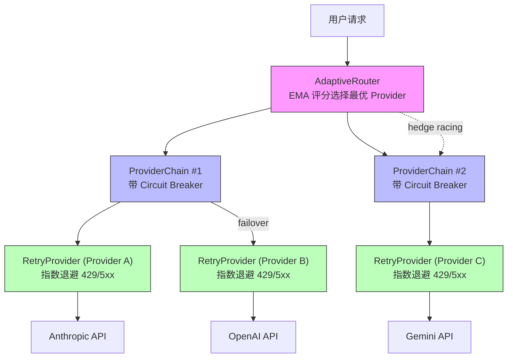
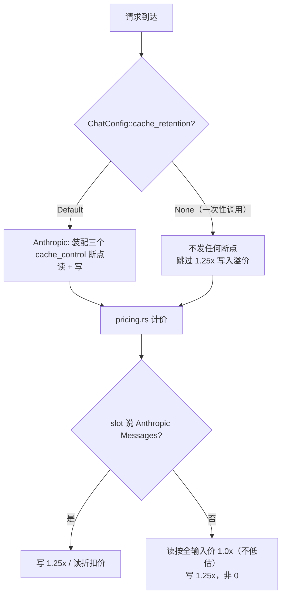

# 第 3 章：octos-llm：驯服 LLM Provider 的混乱

> **定位**：本章深入 octos-llm crate，展示如何用 Rust trait 抽象统一多种 LLM Provider 的混乱接口，以及如何构建三层容错链实现生产级可靠性。前置依赖：第 2 章。适用场景：想理解多 Provider 架构设计的 AI 应用开发者（读者 C），以及对 trait object、异步容错、凭据轮换和模型分层路由感兴趣的 Rust 开发者（读者 B）。

每个 LLM Provider 都有自己的 API 风格：Anthropic 把 system message 作为独立字段，OpenAI 把它放在消息数组里；Gemini 的工具调用格式与其他两家完全不同；Ollama 虽然是本地部署，但在 octos 里复用了 OpenAI 兼容接入层。当你需要同时支持少数专用协议实现，再加上一批复用 OpenAI / Anthropic 兼容层的 Provider 时，混乱是不可避免的——除非你在正确的层次建立正确的抽象。

octos-llm 的解决方案分三层：底层的 `LlmProvider` trait 统一调用接口，中层的 Provider 注册表实现模型名自动检测和工厂创建，顶层的三级容错链（RetryProvider → ProviderChain → AdaptiveRouter）提供生产级可靠性。当前主分支还把 provider metadata、HTTP timeout knobs、credential pool、content classifier 和 `routing.decision` 事件纳入这条链路。本章将自底向上逐层展开。

---

## 3.1 LlmProvider trait：最小化的统一接口

### 3.1.1 trait 签名

`LlmProvider` 的定义位于 `../octos/crates/octos-llm/src/provider.rs:16-121`：

```rust
#[async_trait]
pub trait LlmProvider: Send + Sync {
    // 核心方法：非流式对话
    async fn chat(
        &self,
        messages: &[Message],
        tools: &[ToolSpec],
        config: &ChatConfig,
    ) -> Result<ChatResponse>;

    // 流式对话（默认实现：调 chat() 后合成事件流）
    async fn chat_stream(
        &self,
        messages: &[Message],
        tools: &[ToolSpec],
        config: &ChatConfig,
    ) -> Result<ChatStream> { /* Text→ToolCall→Usage→Done 依次产出 */ }

    // 元数据查询
    fn context_window(&self) -> u32 { context::context_window_tokens(self.model_id()) }

    // 异步初始化钩子：见下文
    async fn ensure_ready(&self) {}

    fn max_output_tokens(&self) -> u32 { context::max_output_tokens(self.model_id()) }

    // #2143 part 3：估算本 provider 实际发出的请求 token 数（含序列化开销）
    fn estimate_request_tokens(
        &self,
        messages: &[Message],
        tools: &[crate::types::ToolSpec],
    ) -> u32 { /* 默认走基线估算，具体 provider 可收紧 */ }

    fn model_id(&self) -> &str;
    fn provider_name(&self) -> &str;
    fn provider_metadata(&self) -> ProviderMetadata;
    fn provider_metadata_for_index(&self, _provider_index: Option<usize>) -> ProviderMetadata;

    // 可选：指标上报
    fn export_metrics(&self) -> Option<serde_json::Value> { None }
    fn report_late_failure(&self) {}
    fn report_stream_metrics(&self, _output_tokens: u32, _stream_duration_us: u64) {}
}
```

这个 trait 的设计遵循了"最小必要接口"原则（`provider.rs:13` 的注释明确说明了这一点）：只定义所有 Provider 共同的能力，差异在各实现中处理。

几个值得关注的设计选择：

`Send + Sync` 约束。 trait 要求实现者是线程安全的，因为 Provider 实例会被多个异步任务通过 `Arc` 共享。这个约束在编译期保证了不会出现单线程 Provider 实现被意外用在多线程场景的错误。

`chat_stream()` 的默认实现。 不是所有 Provider 都原生支持流式响应。默认实现（`provider.rs:27-56`）调用非流式的 `chat()` 方法，然后将完整响应包装为一个合成流：按内容、工具调用、usage、done 事件依次输出。这让新 Provider 只需实现 `chat()` 就能基本工作，流式支持可以后续优化。

Provider metadata。 `provider_metadata()` 与 `provider_metadata_for_index()` 是当前主分支新增的重要接口（`provider.rs:97-109`）。它们把实际命中的 provider slot、模型 ID、provider name 等信息交给上层，用于观测、成本归因和多 provider chain 的精确指标记录。`provider_metadata_for_index()` 解决的是组合 Provider 的问题：当一个 `ProviderChain` 内部选中了第 N 个 slot，上层不能只看到 chain 本身的名字，而必须知道真正被调用的是哪一个后端。签名现在是 `_provider_index: Option<usize>`（103 行）：调用方知道具体 slot 时传 `Some(idx)`，只知道 provider 本体时传 `None`，简单调用方不必伪造下标。

指标上报方法。 `export_metrics()`、`report_late_failure()`、`report_stream_metrics()` 三个方法都有空的默认实现。它们为 AdaptiveRouter 的 EMA 评分系统提供数据源（见 3.4 节），但不强制所有 Provider 实现。这种"可选钩子"模式避免了 trait 膨胀。

`ensure_ready()` 与 `estimate_request_tokens()`。 这是基线上两个较新的成员。`ensure_ready()`（`provider.rs:65`）是异步初始化钩子：agent loop 与 prompt-context 桥在每 turn 第一次依赖窗口数的决策前 await 它，本地上下文探测（见 3.7 节）借此保证真实窗口在首次 compaction 决策前 resolve，而不是在第一次 chat 之后；包装器逐层委托。`estimate_request_tokens()`（`provider.rs:82-89`，#2143 part 3）估算该 provider 实际构建的请求 token 数，含 provider 特有序列化开销（独立 system 块、逐消息 content-block 框架、cache-control 元数据），路由适配守卫据此不再需要用 12.5% 的安全余量顶替这部分开销；默认是 provider 无关的基线估算，具体 provider 覆写收紧，包装器同样委托内层。

### 3.1.2 核心数据类型

`ChatConfig`（`../octos/crates/octos-llm/src/config.rs`）封装了所有可调参数：

- `model`: 模型 ID
- `temperature`: 采样温度
- `max_tokens`: 最大输出 token 数
- `system_prompt`: 系统提示
- `response_format`: 响应格式约束（文本/JSON/结构化输出）
- `tool_choice`: 工具选择策略（auto/required/none/指定工具）
- `cache_retention`: 单次请求的 prompt-cache 保留偏好（`None` 表示这一次不写缓存，见 3.6 节）
- `sampling_params`: 运营者透传的额外采样参数表（见下文）

`ChatResponse` 包含 LLM 返回的完整信息：内容、stop reason、工具调用请求、token 使用量。`ChatStream` 是一个异步流（`Pin<Box<dyn Stream<Item = Result<StreamEvent>>>>`），逐事件产出流式响应。

`sampling_params`（`config.rs:44-57`）承载 octos 不建模的采样参数，例如 `{"repeat_penalty": 1.1, "top_p": 0.95}`。OpenAI 兼容层把它们展平注入请求体（`openai.rs:635-640`，字段文档 908-909，测试 1614-1616），并防御性剔除 octos 已有专用字段的同名键（#2172），避免流式与非流式两条序列化路径出现重复或分叉的字段。默认为空，展平后什么都不加，云端请求不变。这套 cloud-safe sampler passthrough 由提交 b0072e70（#2172/#2176）引入，服务 llama.cpp / vLLM / SGLang 这类接受非标采样参数的本地推理服务。

上下文窗口也不再只有静态目录一个来源。提交 3e479ce3（#2142）引入 per-profile `context_window` 覆盖，落点跨两个 crate：配置结构 `LlmModelSelectionConfig`（`crates/octos-cli/src/profiles.rs:824-875`，字段 875 行）、`config.llm` 侧字段（`crates/octos-cli/src/config.rs:39-46`、489-492）与装配函数 `apply_context_window_override`（`crates/octos-cli/src/qos_catalog.rs:24-36`）都在 octos-cli；octos-llm 只提供 `context_override.rs`（135 行）的 `ContextWindowOverride` 薄包装。它被套在包装栈最外层，值同时压过静态目录与运行时探测（#2135）。profile 里 `config.llm.primary.context_window` / `fallbacks[i].context_window` 的接线主体在 octos-cli，不是 octos-llm 内部，引用时须如实标注这个跨 crate 落点。

Provider 工厂还接收 LLM HTTP timeout knobs。`CreateParams::http_timeout()`（`../octos/crates/octos-llm/src/registry/mod.rs:110-118`）把 `llm_timeout_secs`、`llm_connect_timeout_secs` 两个可选字段合成 `Option<(u64, u64)>`：任一字段缺省时用默认常量补齐，两者都缺省时返回 `None`。默认常量在 `provider.rs:158-172` 定义：LLM 总超时 300 秒、连接超时 10 秒（从 30 秒下调，连不上就尽快 failover），流式读空闲超时 300 秒（`DEFAULT_LLM_STREAM_IDLE_TIMEOUT_SECS`，165 行，经 reqwest 的 `.read_timeout()` 生效，每次读到数据即重置，持续产 token 的长流不会被总时长截断），embedding 总超时 60 秒、连接超时 15 秒。这把"模型推理慢"和"网络连接失败"分开处理，避免所有超时都挤在一个不可解释的配置项里。

---

## 3.2 Provider 注册表：模型名自动检测

当用户配置 `model: "claude-sonnet-4"` 时，octos 需要自动确定使用 Anthropic Provider。这个映射由 Provider 注册表实现（`../octos/crates/octos-llm/src/registry/mod.rs`）。

### 3.2.1 检测机制

每个 Provider 注册时声明自己的名称、别名、API key 环境变量（含别名）、默认 base URL、各项要求、检测模式、模型发现能力和工厂函数（`registry/mod.rs:121-167`，`ProviderEntry` 结构体）：

```rust
struct ProviderEntry {
    name: &'static str,
    aliases: &'static [&'static str],
    api_key_env: Option<&'static str>,
    key_env_aliases: &'static [&'static str],
    default_base_url: Option<&'static str>,
    requires_api_key: bool,
    requires_base_url: bool,
    requires_model: bool,
    detect_patterns: &'static [&'static str],
    model_discovery: ModelDiscovery,
    create: CreateFn,
}
```

`detect_provider()` 方法（`registry/mod.rs:244-260`）按优先级顺序遍历所有 Provider，检查模型名是否包含检测模式。两处结构值得注意：`default_model` 不再是每个条目上的静态字符串，而是从 `model_catalog.json` 中标 `"default": true` 的行构建 `family -> default model` 映射（`registry/mod.rs:24-65`）；`model_discovery` 字段声明该 family 的模型列举能力（协议或"手动输入"），由 `discovery.rs:134` 的 `resolve_model_discovery(family, api_type)` 在运行时解析：`api_type: "anthropic"` 直接命中 Anthropic Messages 策略，已知 family 查注册表声明，未知或 custom family 回落 OpenAI 兼容策略，协议从不由单个 family 字面量推断。

| Provider | 检测模式 | 匹配示例 |
|----------|---------|---------|
| Anthropic | `"claude"` | claude-sonnet-4, claude-haiku-4-5 |
| OpenAI | `"gpt"`，以及 `o1`/`o3`/`o4` 前缀 | gpt-4o, o4-mini |
| Gemini | `"gemini"` | gemini-2.5-flash, gemini-2.5-pro |
| DeepSeek | `"deepseek"` | deepseek-chat, deepseek-coder |
| Groq | `"llama"`, `"mixtral"` | llama-3.3-70b-versatile, mixtral-8x7b |
| Moonshot | `"kimi"`, `"moonshot"` | kimi-k2.5 |
| Dashscope | `"qwen"` | qwen-max |
| Minimax | `"minimax"` | MiniMax-Text-01 |
| Zhipu | `"glm"` | glm-4-plus |

特殊处理：O 系列模型。 OpenAI 的 o1、o3、o4 系列需要前缀匹配而非子串匹配（`registry/mod.rs:248-250`），因为 "o1" 作为子串可能匹配到其他 Provider 的模型名中（如 `ro1and` 假设模型名）。

另一个容易误读的点是：有些 Provider 的 `detect_patterns` 为空，这不是遗漏，而是明确要求用户通过显式 provider 名或 alias 命中。典型例子包括 Vertex、R9s、OpenRouter、Z.AI、两个 coding-plan family、NVIDIA、Ollama、vLLM 和 local。它们的模型名往往是跨平台转发名、OpenAI 兼容名或用户本地自定义名，盲目做子串检测会产生错误路由。coding-plan family（moonshot-coding、zai-coding）注册在基础 family 之前，显式点名时 coding 端点先于普通端点解析，避免 coding-plan 密钥被静默送到会拒绝它的普通端点。

### 3.2.2 完整 Provider 注册表

octos 当前注册 19 个 provider family（口径：`registry/mod.rs` 中 `static ALL` 的条目数，186-210 行；registry/ 目录 20 个文件 = 19 个 family 模块 + mod.rs 本身），按数组顺序即检测优先级：

| 序 | family | 协议 | 别名（示例） | 检测模式 | 默认模型（取自目录） |
|---|---------|------|------|---------|---------|
| 1 | anthropic | 原生 | - | `claude` | claude-sonnet-4-20250514 |
| 2 | openai | 原生 | - | `gpt`, `o1`/`o3`/`o4` 前缀 | gpt-4o |
| 3 | gemini | 原生 | `google` | `gemini` | gemini-2.5-flash |
| 4 | vertex | 原生（Gemini via Vertex SA） | `vertex-ai` | - | gemini-2.5-flash |
| 5 | r9s | OpenAI/Anthropic 兼容 | `r9s.ai` | - | claude-sonnet-4-6 |
| 6 | openrouter | OpenAI 兼容元路由 | - | - | anthropic/claude-sonnet-4-6 |
| 7 | deepseek | OpenAI 兼容 | - | `deepseek` | deepseek-v4-flash |
| 8 | groq | OpenAI 兼容 | - | `llama`, `mixtral` | llama-3.3-70b-versatile |
| 9 | moonshot-coding | OpenAI 兼容（coding 端点） | `kimi-coding` | - | k3 |
| 10 | moonshot | OpenAI 兼容 | `kimi` | `kimi`, `moonshot` | kimi-k2.5 |
| 11 | dashscope | OpenAI 兼容 | `qwen` | `qwen` | qwen-max |
| 12 | minimax | OpenAI 兼容 | - | `minimax` | MiniMax-M3 |
| 13 | zai-coding | Anthropic 兼容（coding 端点） | `glm-coding` | - | glm-5.3 |
| 14 | zhipu | OpenAI 兼容 | `glm` | `glm` | glm-4-plus |
| 15 | zai | Anthropic 兼容 | `z.ai` | - | glm-5-turbo |
| 16 | nvidia | OpenAI 兼容 | `nim` | - | meta/llama-3.3-70b-instruct |
| 17 | ollama | OpenAI 兼容 | - | - | llama3.2 |
| 18 | vllm | OpenAI 兼容 | - | - | 用户必须显式提供 model |
| 19 | local | OpenAI 兼容 | `llamacpp`, `lmstudio`, `openai-compatible` 等 | - | local-default（占位符） |

相比旧稿的 15 个，新增 4 个 family：vertex（Vertex AI 上的 Gemini，凭据走 service-account JSON 环境变量 `VERTEX_SA_JSON`，无 base URL 默认值，模型列举标记 Unsupported）、moonshot-coding / zai-coding（两个 coding-plan 端点，显式点名命中，见上文）、local（llama.cpp / LM Studio 等本地服务器，别名最多，keyless 默认，缺模型时用占位符 `local-default` 而不是报错，真实窗口靠运行时探测，见 3.7 节）。

Anthropic、OpenAI、Gemini 使用专用实现；其余多数条目通过兼容层接入，其中 Ollama、vLLM、OpenRouter、DeepSeek、local 等复用 `OpenAIProvider`，Z.AI 复用 Anthropic Messages API，R9s 则按模型族在两种协议间自动切换。旧稿历史版本曾有 `enum Provider` 枚举，现已不存在。注册方式是"加一个文件 + 在 `ALL` 里加一行"（`registry/mod.rs:2-4` 的模块注释），每个子模块导出 `pub const ENTRY: ProviderEntry` 和 `create()` 工厂。这种"少数专用实现 + 多数兼容适配"架构让新 Provider 的接入成本极低。

### 3.2.3 Provider 工厂

检测到 Provider 后，注册表通过工厂函数创建具体实例。每个工厂函数读取对应的环境变量（`ANTHROPIC_API_KEY`、`OPENAI_API_KEY` 等）或配置文件中的凭据，构造带有正确 base URL 和认证头的 HTTP 客户端。

工厂返回的类型是 `Arc<dyn LlmProvider>`——这是动态分发的关键点。注册表不知道（也不需要知道）具体的 Provider 类型，只知道它实现了 `LlmProvider` trait。这让上层代码可以用统一的方式处理所有 Provider，包括将它们放入容错链中。

---

## 3.3 三层容错链

生产环境中，LLM API 调用可能因为多种原因失败：速率限制（429）、服务器过载（503/529）、认证失效（401）、网络超时。octos-llm 用三层容错链处理这些故障，每一层解决不同级别的问题。



图 3-1：三层容错链架构。 请求从 AdaptiveRouter 进入，经 ProviderChain 路由到具体 Provider，每个 Provider 包裹在 RetryProvider 中处理瞬时故障。

### 3.3.1 第一层：RetryProvider — 指数退避

RetryProvider（`../octos/crates/octos-llm/src/retry.rs:41-312`）处理单个 Provider 的瞬时故障。

退避算法（`retry.rs:259-265`）：

```rust
fn calculate_delay(&self, attempt: u32) -> Duration {
    let delay = self.config.initial_delay.as_secs_f64()
        * self.config.backoff_multiplier.powi(attempt as i32);
    let delay = Duration::from_secs_f64(delay);
    std::cmp::min(delay, self.config.max_delay)
}
```

默认配置（`retry.rs:28-37`）：最多重试 3 次，初始延迟 1 秒，退避乘数 2.0，最大延迟 60 秒。实际退避序列为 1s → 2s → 4s → 8s（但被 60s 上限钳位）。

哪些错误可重试？（`retry.rs:107-147`）

| HTTP 状态码 | 含义 | 是否重试 | 是否触发 failover |
|------------|------|---------|-----------------|
| 429 | 速率限制 | 是（解析 retry-after） | 是 |
| 500, 502, 503 | 服务器错误 | 是 | 是 |
| 529 | 过载 | 是 | 是 |
| 401, 403 | 认证错误 | 否 | 是（立即 failover） |
| 504 | Gateway 超时 | 是（服务器可能恢复） | 是 |
| 408 | 请求超时 | 看具体情况 | 是 |
| reqwest timeout | 网络超时 | 否（本地不重试） | 是（立即 failover） |
| 400 | 请求错误 | 看具体消息 | 部分情况 |

注意 reqwest 级别的网络超时（连接超时、读超时）的特殊处理：不在本地重试（因为同一个 Provider 大概率还是超时），而是立即向上层触发 failover，让 ProviderChain 切换到另一个 Provider。HTTP 504（Gateway Timeout）则被视为可重试，因为服务器可能在短暂过载后恢复。

速率限制解析（`retry.rs:267-311`）：当收到 429 响应时，RetryProvider 会尝试从错误消息中解析推荐的等待时间（如 "Please try again in 29.159s"），加上 1 秒缓冲后等待。如果无法解析，回退到 30 秒固定等待。

### 3.3.2 第二层：ProviderChain — 有序故障转移

ProviderChain（`../octos/crates/octos-llm/src/failover.rs:36-249`）管理一组 Provider 的故障转移顺序。

Circuit Breaker 设计（`failover.rs:27-30`）：

```rust
struct ProviderSlot {
    provider: Arc<dyn LlmProvider>,
    failures: AtomicU32,  // 连续失败计数器
}
```

每个 Provider 维护一个原子计数器记录连续失败次数。当失败次数达到阈值（默认 3），该 Provider 被标记为"降级"（degraded）。成功调用后计数器重置为 0（`record_success` @ `failover.rs:111-114`，`swap(0)` 在 114 行）。

故障转移逻辑（`failover.rs:85-99`）：

1. 首先尝试第一个未降级的 Provider
2. 如果所有 Provider 都降级了，选择失败次数最少的那个
3. 跳过已降级的 Provider，除非它是最后的选择

延迟故障上报（`failover.rs:378`）：`report_late_failure()` 处理一种微妙的场景：Provider 返回了 200 响应，但流式解析后发现内容为空或格式错误。这时需要回溯性地惩罚该 Provider，增加其失败计数，让后续请求优先选择其他 Provider。

### 3.3.3 第三层：AdaptiveRouter — EMA 评分与对冲竞赛

AdaptiveRouter（`adaptive.rs:803` 起的 struct，inherent impl 延伸至文件尾 2795 行）是容错链的最高层，实现了智能路由。

三种模式（`adaptive.rs:619-631`）：

- Off (0)：静态优先级排序 + circuit breaker，最简单可靠
- Hedge (1)：基于评分选择 + 对冲竞赛（hedge racing）
- Lane (2)：基于评分的车道切换，比 hedge 更节省成本

#### EMA 评分系统

AdaptiveRouter 为每个 Provider 维护一个实时评分。默认配置下，评分由四个因子的加权组合决定（`score()` @ `adaptive.rs:1766` 起，权重配置字段 @ 42-64）；其中配置字段仍保留 `weight_latency` 这个名字，但第二项实际是"质量 + 吞吐"的复合因子，源码并不直接使用原始 latency：

| 因子 | 权重 | 含义 | 数据来源 |
|------|------|------|---------|
| 稳定性 (error_rate) | 30% | 错误率 | 实时统计 + 目录基线混合 |
| 质量/吞吐 (`weight_latency`) | 30% | 输出质量 + 运行时吞吐 | 60% 深度搜索 token 数 + 40% 吞吐量 |
| 优先级 (priority) | 20% | 配置顺序 | 用户配置 |
| 成本 (cost) | 20% | 价格 | 模型目录 |

混合权重设计（`adaptive.rs:1582` 与 1772，score 内的 EMA 混合）：稳定性因子使用"目录基线 + 实时数据"的混合计算。混合权重按调用次数递增：`min(total_calls / 20.0, 0.5)`，这意味着目录基线始终至少占 50% 的影响力。这个设计防止了"冷启动"问题：新 Provider 只有少量调用时，不会因为一两次偶然失败就被判为不可靠。

这里要特别注意：`score()` 明确用 `throughput` 而不是原始 latency 做运行时速度信号，因为单次请求延迟更容易受任务复杂度影响，不适合作为跨 Provider 的直接质量指标。

#### 对冲竞赛（Hedge Racing）

在 Hedge 模式下，AdaptiveRouter 会同时向两个 Provider 发起请求，取先返回的结果（`hedged_chat()` @ `adaptive.rs:2150` 起，`tokio::select!` 竞赛在 ~2220）：

```rust
// 简化后的逻辑
tokio::select! {
    result = primary_future => {
        // 主 Provider 先返回
        // 备选 Provider 的 future 被 drop（取消）
        result
    }
    result = alternate_future => {
        // 备选 Provider 先返回
        // 主 Provider 的 future 被 drop（取消）
        result
    }
}
```

备选 Provider 的选择优先选最便宜的（减少冗余成本），且必须与主 Provider 不同名（避免向同一 API 发重复请求）。当前实现只记录完成请求的运行时指标；输掉竞赛而被 drop 的 future 不会可靠地产生完整指标，因此 hedge 能改善尾延迟，但会降低观测数据的完整性。

对冲竞赛的代价是双倍的 API 调用成本（输掉竞赛的请求仍然消耗 token，即使被取消，Provider 通常已经开始处理）。因此 Hedge 模式适用于延迟敏感、成本不敏感的场景。Lane 模式则通过评分排序实现类似的路由优化，但不发送冗余请求。

#### 探针策略（Probe）

为了保持备用 Provider 的评分数据新鲜，AdaptiveRouter 以一定概率（默认 10%）向非最优 Provider 发送"探针"请求（`should_probe()` @ `adaptive.rs:2097`，陈旧判定 `is_stale` @ 337，默认值 0.1/60s 在配置结构 42-44 与 62-63 行），刷新其性能指标。探针间隔默认 60 秒，避免频繁探测带来的成本。

### 3.3.4 Credential Pool 与 Content Classifier：从 Provider failover 到 key / tier 路由

当前主分支的容错链不只是在 Provider 之间切换，还会在同一 Provider 的多组凭据之间轮换，并根据内容复杂度选择模型 tier。

Credential pool。 `credential_pool.rs` 的模块注释明确把目标定义为"持久化 cooldown / rotation state"（`../octos/crates/octos-llm/src/credential_pool.rs:1-29`）。每个凭据都有 cooldown、rate-limit 计数、reset 时间、last used、usage count、reservation 等状态；轮换策略包括 `FillFirst`、`RoundRobin`、`Random`、`LeastUsed`（`credential_pool.rs:166-189`）。当 AdaptiveRouter 发现 401/403 或认证文本时，会把失败分类为 auth failure；发现 429 或 rate limit 文本时，会分类为 rate-limit failure，并通知 credential pool 进入 cooldown 或刷新流程（`notify_credential_failure()` @ `adaptive.rs:1081` 起，错误侧入口 `notify_credential_failure_from_error` @ 2352）。轮换结果还会发出稳定的 harness event，schema 为 `octos.harness.event.v1`，kind 为 `credential_rotation`（`credential_pool.rs:213-245`）。

Content classifier。 `content_classifier.rs` 是一个无 I/O 的启发式分类器，默认关闭；关闭时返回 `Strong`，避免因为未启用策略而误把复杂任务路由到便宜模型（`../octos/crates/octos-llm/src/content_classifier.rs:1-18`, `content_classifier.rs:61-80`）。启用后，它根据代码块、消息长度、强模型关键词和 URL 信号产生 `Cheap` 或 `Strong` tier：代码块、长度超过阈值、命中 debug/refactor/architecture/prove/proof/analyze/design 等关键词会升到 Strong；URL 只作为 reason 记录，不单独触发 Strong（`content_classifier.rs:158-209`）。AdaptiveRouter 可挂载 classifier，并在选择 lane 之前通过 callback 发出 `routing.decision` harness event（`RoutingDecisionCallback` 类型 @ `adaptive.rs:801`，安装入口 `set_routing_decision_callback` @ 1414）。这让上层 harness 可以解释"为什么这个 turn 走强模型"，而不是只能看到最终 provider。

---

## 3.4 SSE 流式解析：字节安全的有状态解析器

LLM 的流式响应以 Server-Sent Events（SSE）协议传输。SSE 看似简单（每个事件以 `\n\n` 分隔，每行以 `data:` 前缀标记数据），但在生产环境中，有几个工程挑战需要解决。

### 3.4.1 为什么需要有状态解析

HTTP 响应的 body 以任意大小的字节块（chunk）到达。一个 SSE 事件可能跨越多个 chunk，一个 chunk 也可能包含多个事件。更微妙的是，chunk 的边界可能正好切开一个 UTF-8 多字节字符。

考虑以下场景：

```
Chunk 1: data: {"text": "任务完
Chunk 2: 成后请检查结果"}\n\n
```

"完" 和 "成" 之间不会有问题（它们各自是完整的 UTF-8 字符），但如果 chunk 边界恰好落在"完"字的三个字节中间：

```
Chunk 1: data: {"text": "任务\xe5\xae
Chunk 2: \x8c成后请检查结果"}\n\n
```

此时 Chunk 1 末尾的 `\xe5\xae` 是"完"字的前两个字节，不是合法的 UTF-8。如果逐 chunk 做 `String::from_utf8()`，就会得到一个解析错误或替换字符（U+FFFD）。

### 3.4.2 octos 的字节安全解析器

octos-llm 的 SSE 解析器（`../octos/crates/octos-llm/src/sse.rs:16-72`）采用字节级缓冲策略：

1. 原始字节累积：将每个 chunk 的原始字节追加到 `Vec<u8>` 缓冲区，不做 UTF-8 转换
2. 事件边界检测：在原始字节中搜索 `\n\n` 或 `\r\n\r\n` 分隔符
3. 按事件转换：找到完整事件后，才将该事件的字节块转换为 UTF-8 字符串
4. 剩余字节保留：未形成完整事件的尾部字节保留在缓冲区中

这种设计保证了 UTF-8 转换只发生在完整事件上：SSE 协议保证事件边界不会落在 UTF-8 字符中间（因为 `\n` 是 ASCII 单字节字符）。

解析器使用 `stream::unfold()` 构建为一个异步流，保持状态（字节流 + 缓冲区）在 yield 事件之间传递。

### 3.4.3 1MB 缓冲上限

安全考量：如果恶意或异常的 LLM Provider 发送一个永远不包含 `\n\n` 的超长响应，缓冲区会无限增长。`MAX_BUFFER_SIZE`（`sse.rs:6-7`）设为 1MB，超过后解析器发出错误事件并清空缓冲区。

```rust
const MAX_BUFFER_SIZE: usize = 1024 * 1024; // 1MB
```

1MB 对于单个 SSE 事件来说绰绰有余。正常的 LLM 流式响应中，每个事件通常只有几十到几百字节（一个 token 的 JSON 表示）。

### 3.4.4 UTF-8 分割测试：为什么字节级缓冲不可省略

`sse.rs` 的测试（`sse.rs:261-281`）构造了一个精确的多字节分割场景：

```
"完成后" 的 UTF-8 编码：
完 = [E5 AE 8C]   (3 bytes)
成 = [E6 88 90]   (3 bytes)
后 = [E5 90 8E]   (3 bytes)

故意在"成"字中间切开：
Chunk 1: data: {"text": "完[E6 88          ← "成"的前 2 字节
Chunk 2: 90]后"}\n\n                       ← "成"的第 3 字节 + "后"
```

如果逐 chunk 做 `String::from_utf8()`，Chunk 1 末尾的 `[E6 88]` 不是合法 UTF-8，会被替换为 `U+FFFD`（替换字符），"成"字永久丢失。

字节级缓冲策略避免了这个问题：两个 chunk 的原始字节被拼接后，在 `\n\n` 边界整体转换，"完成后" 被正确重组。

这不是一个理论风险：当 LLM 流式输出中文回复时，每个 SSE 事件通常只包含 1-3 个 token。HTTP 的 chunked transfer encoding 可能在任何字节位置切割，与 token 边界无关。对于一个服务中文、日文、韩文用户的 Agent 平台，字节级缓冲是必需的而非优化。

---

## 3.5 模型目录与成本追踪

ModelCatalog（`../octos/crates/octos-llm/src/catalog.rs:48-274`）为每个已知模型维护元数据：

```rust
pub struct ModelInfo {
    pub id: String,
    pub name: String,
    pub provider: String,
    pub context_window: u32,
    pub capabilities: ModelCapabilities,  // vision, tool_use, streaming, reasoning
    pub cost: ModelCost,                  // input/output/cache 每百万 token 价格
    pub aliases: Vec<String>,
}
```

别名系统：除了完整的模型 ID（如 `claude-sonnet-4-20250514`），目录还支持别名查找（如 `sonnet` → `claude-sonnet-4-20250514`）。查找顺序（`catalog.rs:72-74`）：精确 ID 匹配 → 别名匹配 → None。

成本追踪：`ModelCost` 记录输入、输出、缓存读取三种 token 类型的百万 token 价格。AdaptiveRouter 的评分系统使用这些数据计算成本因子（见 3.3.3 节），在延迟和成本之间做权衡。

---

## 3.6 成本层：cache 经济学

容错链解决"能不能调通"，成本层解决"这次调用花多少钱"。提交 f3aa07f0（#2194）把 prompt cache 的写入与计价纳入这条链路，出发点是一个不对称的事实：cache 写按 1.25 倍输入价计费，cache 读有折扣，而一次不再重放前缀的调用（compaction 摘要、子 agent 汇总）写了缓存也不会有人读，写入的溢价是纯损失。

一次性调用的 cache-write 退出。 `ChatConfig::cache_retention`（`config.rs:58-75`，`CacheRetention` 枚举 74-92 行）为单次请求声明缓存保留偏好：`None` 表示这次不写缓存。Anthropic 协议上的具体动作是不发任何 `cache_control` 断点，因为每个断点既读又写，一次没人读的写仍按 1.25 倍计费。`Default` 维持 provider 配置的缓存行为（Anthropic 的三个 ephemeral 断点）。默认值保持 `Default` 且 `skip_serializing_if` 不上 wire，持久化的 `ChatConfig` JSON 形状不变。装配点在 `anthropic.rs` 的 build_request（cache_control 装配 179-207 行；一次性请求不写 cache 的分支见 148 行附近）。

cache-write 感知定价。 定价层（`pricing.rs:149-195`）按应答 slot 的协议区别建模：只有 Anthropic Messages 协议上报 `cache_creation_input_tokens`（写，1.25 倍）与 `cache_read_input_tokens`（读，折扣）；其他协议（openai、openrouter、deepseek、local、未知）的缓存读折扣不可知：目录中唯一的 OpenAI 行 `cache_read_per_mtok` 为 None，折扣随模型代次变化，套一个 provider 级折扣等于替部分模型编数。因此读按全输入价（1.0 倍，宁可高估不低估）计，写按 1.25 倍而非 0 计（`cache_write_tokens` 只有 Anthropic 解析器会填）。



图 3-2：cache 经济学决策流。 配置层决定写不写，计价层决定怎么算。

---

## 3.7 车道与路由：容错链之外的调度件

容错链之外，基线上还有一组围绕"谁来接这次调用"的模块。它们不是同一条链的层，而是按场景挂在 provider 之上的调度件。

lane.rs（per-topic 模型车道，RFC-3 / #1292）。 按会话主题（如 `slides:*`、`code:*`、`research:*`）把请求路由到不同模型档位，让"做幻灯片"和"写核心代码"不必共享同一个 primary/fallback 组合。

router.rs（多模型子 agent 的 provider 路由）。 按前缀方案把 LLM 调用分派给不同子 provider：子 agent 用不同前缀声明自己的模型需求，路由器据此选中对应后端，母 agent 与子 agent 可以在同一会话内并行使用不同模型。

call_policy.rs（每 turn 调用策略）。 语音 turn 把 agent run 包在 `with_llm_call_policy(FailFast, ..)` 里：每个 provider 包装器与叶子 provider 都短路 retry、failover 与 hedge，低延迟优先。策略是 per-turn 的任务级输入，不是全局开关。

throttle.rs（信号量节流）。 用信号量限制 provider 的并发调用数，保护有严格并发配额的端点（多凭据时按池分摊）。它管的是"同时几条"，与 registry 管的"用哪个"正交。

credential_pool.rs（凭据池，M6.5）。 见 3.3.3 节：多凭据轮换 + 持久化 cooldown，429/auth 失败驱动。

local_context_probe.rs（本地窗口探测，#2135）。 提交 10022387 引入。目录里 local / ollama / vllm 家族的窗口数是注册时的保守猜测（约 32K），因为注册时没人知道运营者启动了什么引擎。探测器（1300 行模块，`new` @ 201，`new_ollama` @ 226）在后台问服务器拿真实窗口：OpenAI 兼容端点走 props/models 两个 URL，Ollama 原生走 `GET /api/ps`（取运行中模型的分配窗口，无需 key）。探测结果经 trait 的 `ensure_ready()` 钩子（`provider.rs:65`）在首次 compaction 决策前 resolve，`context_window()` 不再是纯静态查表。要压过探测值，用 3.1.2 节的 per-profile `context_window` 覆盖（操作员覆盖 > 探测 > 目录）。

---

> ### 工程决策侧栏：Arc\<dyn Trait\> vs 泛型 vs 枚举分发
>
> octos-llm 在 Provider 抽象层大量使用 `Arc<dyn LlmProvider>`。这个选择值得与两种替代方案对比。
>
> 方案一：泛型（`impl LlmProvider` / `T: LlmProvider`）
>
> 优势：
> - 零运行时开销：编译器在每个调用点生成特化代码（单态化）
> - 方法调用可被内联优化
>
> 劣势：
> - RetryProvider、ProviderChain 等包装器需要泛型参数传染：`RetryProvider<T: LlmProvider>`
> - 容错链的组合会产生类型爆炸：`AdaptiveRouter<ProviderChain<RetryProvider<AnthropicProvider>>, ProviderChain<RetryProvider<OpenAIProvider>>>`
> - 无法在运行时基于用户配置动态选择 Provider（泛型在编译期就确定了具体类型）
>
> 方案二：枚举分发（`enum Provider { Anthropic(...), OpenAI(...), ... }`）
>
> 优势：
> - 编译期确定所有变体，分支预测更友好
> - 无 vtable 间接调用开销
>
> 劣势：
> - 每增加一个 Provider 就需要修改枚举定义和所有 match 表达式
> - 对于 19 个 provider family，match 块会非常庞大
> - 无法支持用户自定义 Provider（除非用 `Custom` 变体退化回 trait object）
>
> octos 的选择：`Arc<dyn LlmProvider>`，原因如下。
>
> 在 AI Agent 场景中，LLM 调用的网络延迟（100ms-10s）远大于 vtable 间接调用的开销（<1ns）。动态分发的性能代价在这里完全可以忽略。
>
> 更重要的是组合性。octos 的容错链本质上是装饰器模式的嵌套组合：RetryProvider 包装任意 Provider，ProviderChain 管理一组 Provider，AdaptiveRouter 在多个 Chain 之间路由。`Arc<dyn LlmProvider>` 让这些包装器可以自由组合，不受泛型参数的限制。
>
> 最后，Provider 的种类在运行时才确定：用户通过配置文件指定使用哪些 Provider，注册表工厂根据配置动态创建实例。这种"运行时多态"正是 trait object 的核心使用场景。

---

## 3.6 本章回顾

octos-llm 解决了 LLM Provider 集成的核心挑战：

1. LlmProvider trait：最小化的统一接口，`chat()` + `chat_stream()` 双方法设计，`Send + Sync` 约束保证线程安全。Provider metadata 让上层能看到实际命中的 provider slot，而不是只看到组合包装器。

2. Provider 注册表：模型名子串匹配自动检测 Provider，工厂模式动态创建 `Arc<dyn LlmProvider>` 实例。特殊处理 O 系列模型的前缀匹配，并明确把 R9s、OpenRouter、Z.AI、NVIDIA、Ollama、vLLM 这类 `detect_patterns` 为空的 Provider 留给显式 provider / alias 选择。

3. 三层容错链：
   - RetryProvider：指数退避（1s→2s→4s），智能解析 429 响应的 retry-after 头
   - ProviderChain：有序故障转移 + circuit breaker（3 次连续失败触发降级）
   - AdaptiveRouter：四因子 EMA 评分（稳定性 30% + 质量/吞吐 30% + 优先级 20% + 成本 20%）+ 对冲竞赛 + 探针策略

4. Credential pool 与 content classifier：429/auth failure 会进入凭据 cooldown / refresh 路径；content classifier 发出 `routing.decision` 事件，把 Cheap/Strong tier 的选择暴露给 harness。

5. 成本层与调度件：cache 经济学（`cache_retention` 退出 + cache-write 感知定价）把"写不写缓存"变成显式决策；lane / router / call_policy / throttle / credential_pool / local_context_probe 六个调度件按场景挂在容错链之外。

6. SSE 流式解析：字节级缓冲避免 UTF-8 分割问题，1MB 上限防止内存耗尽，`stream::unfold()` 构建有状态异步流。

7. `Arc<dyn Trait>` 选择：网络延迟远大于 vtable 开销，动态分发换来的组合性和运行时灵活性物超所值。

下一章将进入 octos-memory，看看混合搜索（BM25 + HNSW 向量索引）如何为 Agent 提供长期记忆能力。

---

## 延伸阅读

- async-trait crate：https://docs.rs/async-trait/latest/async_trait/ — 了解 `#[async_trait]` 宏如何将 async 方法编译为 trait object 兼容的形式
- SSE 协议规范：HTML Living Standard "Server-Sent Events" 章节，https://html.spec.whatwg.org/multipage/server-sent-events.html
- 指数退避算法：Google Cloud 的 "Truncated exponential backoff" 文档，https://cloud.google.com/storage/docs/exponential-backoff
- Circuit Breaker 模式：Martin Fowler, "CircuitBreaker"，https://martinfowler.com/bliki/CircuitBreaker.html
- Rust 动态分发：*The Rust Programming Language* 第 17 章 "Using Trait Objects That Allow for Values of Different Types"

## 思考题

1. 容错层次设计：octos 的三层容错链中，如果把 RetryProvider 和 ProviderChain 合并为一层会怎样？分离的好处是什么？

2. 对冲竞赛的成本模型：假设你有两个 Provider：Provider A 价格 $10/M tokens、平均延迟 500ms；Provider B 价格 $3/M tokens、平均延迟 1500ms。在什么条件下开启 hedge racing 是划算的？

3. SSE 解析器的替代方案：如果不用字节级缓冲，而是用 `String::from_utf8_lossy()` 处理每个 chunk，会产生什么问题？在什么场景下这些问题会变得可观测？

4. 泛型 vs trait object 的边界：如果 octos 只需要支持 3 个 Provider（Anthropic、OpenAI、Gemini），枚举分发是否是更好的选择？支持多少个 Provider 时动态分发才开始胜出？

---

> 版本演化说明
> 本章分析基于 `../octos` main @ 9c157101（2026-09-02）。本次修订要点：① 注册表从 15 个 Provider 重列为 19 个 provider family（新增 vertex、moonshot-coding、zai-coding、local），注册叙事改为 registry/ 目录 + `discovery.rs:134` 的模型发现协议，不再出现 `enum Provider`；② trait 补入 `ensure_ready()` 与 `estimate_request_tokens()`，`provider_metadata_for_index` 签名改为 `Option<usize>`；③ timeout 叙事改讲 `CreateParams::http_timeout()` 与 `DEFAULT_LLM_STREAM_IDLE_TIMEOUT_SECS`；④ 新增 3.6「成本层」（cache 经济学，提交 f3aa07f0）与 3.7「车道与路由」（六个调度件模块与 10022387 本地窗口探测）；⑤ sampler passthrough（b0072e70）与 per-profile context_window 覆盖（3e479ce3，接线主体在 octos-cli）写入 3.1.2；⑥ 全部引用行号按 9c157101 逐条重标（adaptive.rs 已扩至 2795 行，catalog.rs 勘误为 274 行，见 assets/ch03-refcheck.md）。Provider 注册表与评分权重可能继续调整，但三层容错架构仍是理解 octos-llm 的主线。
