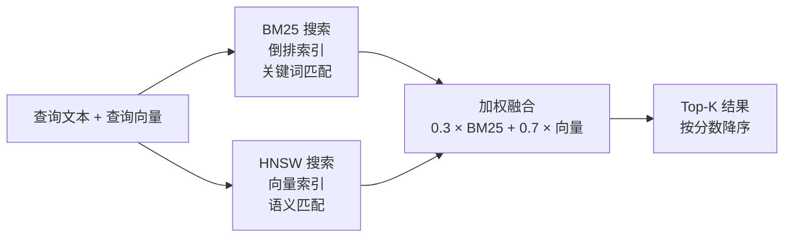

# 第 4 章：octos-memory：混合搜索的工程实现

> **定位**：本章深入 octos-memory crate（`wc -l` 口径 6,428 行，六个源文件，含测试），展示如何用纯 Rust 构建嵌入式 BM25 + HNSW 混合搜索引擎，为 Agent 提供长期记忆能力。前置依赖：第 2 章。适用场景：想理解 RAG（检索增强生成）底层实现的 AI 应用开发者（读者 C），以及对嵌入式数据库和搜索算法感兴趣的 Rust 开发者（读者 B）。

AI Agent 和 chatbot 的根本区别之一在于记忆。chatbot 的每次对话都是独立的——上一次帮你写的代码、做过的决策、踩过的坑，下一次全部忘记。Agent 需要记忆来积累经验：上次用户偏好什么代码风格？这个仓库最近修改了哪些文件？三天前解决一个类似 bug 时采取了什么策略？

octos-memory 用 6,428 行代码（`wc -l` 口径，含测试与注释）实现了这个记忆系统。它不依赖任何外部服务——没有 Qdrant，没有 Milvus，没有 PostgreSQL。一个 redb 嵌入式数据库文件加一个内存中的混合搜索索引，就是全部。本章将从存储层开始，逐步深入 BM25 全文搜索、HNSW 向量索引和混合排名融合的工程实现。

---

## 4.1 存储选型：redb 嵌入式数据库

### 4.1.1 为什么是 redb

octos-memory 的持久化层使用 redb（`crates/octos-memory/src/store.rs`），一个纯 Rust 实现的嵌入式键值数据库。在选型时，最直接的替代方案是 SQLite：Rust 生态中有成熟的 `rusqlite` 绑定。

redb 相比 SQLite 的优势在 octos 的场景中非常明确：

零 C 依赖。 SQLite 是 C 实现的，`rusqlite` 需要编译 C 代码或链接系统库。这与 octos workspace 级别的 `deny(unsafe_code)` 策略冲突：虽然 SQLite 的 C 代码质量极高，但它不受 Rust 编译器的安全检查。redb 是纯 Rust 实现，完全在 `deny(unsafe_code)` 的保护范围内。

ACID 事务。 redb 提供完整的 ACID 事务支持（读事务和写事务分离），足以满足 episode 存储的持久化需求。octos 不需要 SQL 查询，所有搜索都在内存中的混合索引上进行。

单文件部署。 redb 数据库是一个文件（`episodes.redb`），不需要额外的 WAL 文件或 SHM 文件。这简化了部署和备份。

### 4.1.2 三张表结构

Episode Store 在 redb 中定义了三张表（`store.rs:14-20`）：

| 表名 | Key 类型 | Value 类型 | 用途 |
|------|---------|-----------|------|
| `EPISODES_TABLE` | `&str` (episode_id) | `&str` (JSON) | Episode 元数据 |
| `CWD_INDEX_TABLE` | `&str` (工作目录路径) | `&str` (JSON 数组) | 目录→Episode 索引 |
| `EMBEDDINGS_TABLE` | `&str` (episode_id) | `&[u8]` (bincode) | 向量嵌入 |

这个设计把 Episode 数据和向量嵌入分开存储。好处是当不需要向量搜索时（比如 embedding provider 不可用），Episode 的存取不受影响。向量嵌入使用 `bincode` 序列化（比 JSON 紧凑得多），减少存储和 I/O 开销。

`CWD_INDEX_TABLE` 是一个辅助索引，按工作目录聚合 Episode ID。当 Agent 在某个项目目录下工作时，优先检索该目录下的历史 episode，提高相关性。

---

## 4.2 Episode：Agent 的经验记录

### 4.2.1 Episode 结构体

Episode 是 Agent 完成一个任务后的经验摘要（`crates/octos-memory/src/episode.rs:32-59`；结构体前新增了 `EpisodeSource` 枚举，`episode.rs:26-31`，区分任务摘要与会话压缩摘要，`#[serde(default)]` 让旧数据照常反序列化）：

```rust
pub struct Episode {
    pub schema_version: u32,     // 数据格式版本
    pub id: String,              // UUID v7
    pub task_id: TaskId,
    pub agent_id: AgentId,
    pub working_dir: PathBuf,    // 任务执行目录
    pub summary: String,         // 任务摘要
    pub outcome: EpisodeOutcome, // 结果
    pub source: EpisodeSource,   // 产生者：任务或会话压缩
    pub key_decisions: Vec<String>,  // 关键决策记录
    pub files_modified: Vec<PathBuf>,
    pub created_at: DateTime<Utc>,
}
```

EpisodeOutcome（`episode.rs:86-98`）定义了内存层可表达的四种结果：`Success`、`Failure`、`Blocked`、`Cancelled`。它和 Task 的几类终态语义相近，但不能反推"系统一定会把所有终态都写成 Episode"；是否落库取决于上层调用点。当前主 Agent loop 实际只会写入 `Success` episode。

`schema_version` 字段（`episode.rs:36`，`#[serde(default)]` 在 35）是前向兼容的关键。当 Episode 的格式需要升级时（比如新增字段），旧版本的数据仍然可以通过版本号正确解析。默认值为 `1`（`episode.rs:16-18`，常量在 14），反序列化时如果 JSON 中没有这个字段，自动填充默认值。

### 4.2.2 写入时机

在当前主 Agent 路径里，Episode 只会在 LLM 响应以 `StopReason::EndTurn` 或 `StopSequence` 正常结束，且 `save_episodes` 打开时创建并存储（`crates/octos-agent/src/agent/loop_runner.rs:2457-2504`，EndTurn 臂从 2,457 起，写入块在 2,474-2,504；落库逻辑位于 `crates/octos-memory/src/store.rs:371-423`）。写入过程：

1. 将 Episode 序列化为 JSON，存入 `EPISODES_TABLE`
2. 更新 `CWD_INDEX_TABLE`，将 Episode ID 追加到对应工作目录的列表中
3. 更新内存中的混合搜索索引（文本部分）

向量并不是在 `store()` 中同步写入的。当前实现把 episode 文本和 embedding 分成两个阶段：`store()` 先写 JSON 和 BM25 索引；`store_embedding()` 再把 `Vec<f32>` 用 bincode 写入 `EMBEDDINGS_TABLE`，并调用 `HybridIndex::add_embedding()` 给已有文档补上 HNSW 向量。这让 episode 落库不依赖 embedding provider 的可用性。

启动时，`EpisodeStore::open()` 会扫描 `EPISODES_TABLE` 和 `EMBEDDINGS_TABLE`，重建内存中的 `HybridIndex`。这意味着 redb 是唯一持久源，HNSW 和倒排索引都是可重建缓存。

腐败恢复（`store.rs:84-111`）：`CWD_INDEX_TABLE` 中的值是 JSON 数组（`["id1", "id2", ...]`）。如果之前的写入因为崩溃被中断，JSON 可能是损坏的。代码会尝试从损坏的 JSON 中按引号分割抢救 Episode ID，而不是丢弃整个索引。这种防御性编程确保了即使在非正常关闭后也不会丢失索引数据。

删除路径（`store.rs:757-825`）：`delete_by_id()` 会从 `EPISODES_TABLE`、`CWD_INDEX_TABLE` 和 `EMBEDDINGS_TABLE` 中删除对应数据；内存索引侧调用 `HybridIndex::remove()`（`hybrid_search.rs:358-365`），但它不会重排 HNSW 的内部 doc index，而是把 `ids[pos]` 清空作为 tombstone，搜索时过滤空 ID。这是一个典型的 ANN 索引工程取舍：删除快、索引稳定，代价是需要在未来重建索引来清理 tombstone。

---

## 4.3 BM25 全文搜索

BM25（Best Matching 25）是信息检索领域最经典的排名算法之一。octos-memory 在内存中维护一个倒排索引来实现 BM25 搜索（`crates/octos-memory/src/hybrid_search.rs`）。

### 4.3.1 倒排索引结构

```rust
// hybrid_search.rs:8-39（简化）
struct HybridIndex {
    inverted: HashMap<String, Vec<(usize, u32)>>,  // 词项 → [(文档ID, 词频)]
    doc_lengths: Vec<usize>,                         // 每个文档的长度
    total_len: usize,                                // 所有文档长度之和
    avg_dl: f64,                                     // 平均文档长度
    ids: Vec<String>,                                // Episode ID 列表
    hnsw: Option<Hnsw<'static, f32, DistCosine>>,    // 向量索引（无 embedding 时为 None）
    dimension: usize,                                // 索引接受的向量宽度
    // ... 权重与向量覆盖统计字段
}
```

`inverted` 是倒排索引的核心：给定一个词项（如"重构"），可以快速找到包含该词项的所有文档及其出现频率。

分词策略（`hybrid_search.rs:731-737`）：

```rust
fn tokenize(text: &str) -> Vec<String> {
    text.to_lowercase()
        .split(|c: char| !c.is_alphanumeric())
        .filter(|s| s.len() >= 2)
        .map(String::from)
        .collect()
}
```

采用最简单的分词方式：转小写后按非字母数字字符分割，过滤掉长度小于 2 的词项。对于中文，这并不会自动按单字切开：连续中文（如 `中文测试`）会保留成一个 token，只有遇到空格、标点等非字母数字字符才会断开，所以 `中文 测试` 会分成 `中文` 和 `测试` 两个 token；中英混写串（如 `重构parser模块`）也会连成一个 token。效果不如专业分词器（如 jieba），但胜在零依赖，适合摘要式经验检索。它也不过滤停用词，这一点会在 4.3.4 节的热路径优化里再出现。

### 4.3.2 BM25 评分公式

BM25 的核心公式（`hybrid_search.rs:636-722`，`bm25_score()` 内；K1/B 项在 655-661）：

```
score(q, d) = Σ IDF(qi) × (tf(qi, d) × (K1 + 1)) / (tf(qi, d) + K1 × (1 - B + B × |d| / avgdl))
```

octos 使用的参数（`hybrid_search.rs:83-84`）：

| 参数 | 值 | 含义 |
|------|-----|------|
| K1 | 1.2 | 词频饱和度控制。值越大，高频词的权重越高 |
| B | 0.75 | 文档长度归一化。B=0 时忽略长度差异，B=1 时完全按长度归一化 |

这两个参数值是信息检索领域经过数十年实践验证的经典默认值（源自 TREC 评测实验），octos 直接采用而非自行调优。

IDF 计算（`hybrid_search.rs:677`）：

```rust
let idf = ((n - df + 0.5) / (df + 0.5) + 1.0).ln();
```

IDF（逆文档频率）衡量一个词项的区分度：出现在越多文档中的词（如"代码"、"修改"）IDF 越低，出现在越少文档中的词（如"deadlock"、"HNSW"）IDF 越高。

### 4.3.3 epsilon 防 NaN

BM25 的评分归一化步骤（`hybrid_search.rs:703-706` 与 `718-721`）中有一个微妙的工程细节：

```rust
let max_score = result.iter().map(|&(_, s)| s).fold(0.0f64, f64::max);
if max_score < 1e-10 {
    return HashMap::new(); // 所有分数接近零，直接返回空结果
}
// 归一化到 [0, 1]
let normalized = score / max_score;
```

`1e-10` 阈值检查的作用是防止除以接近零的数。当所有文档的 BM25 分数都极小时（比如查询词没有出现在任何文档中），直接除以 `max_score` 会放大浮点噪声。通过提前返回空结果，避免了这个问题。

这看起来是一个微不足道的细节，但 NaN 的传播性极强：一旦出现 NaN，后续的排序和融合都会产生错误结果，且不会报错（浮点运算中 NaN 与任何值比较都返回 false），这类 bug 极难定位。

### 4.3.4 检索热路径：dense 累加器与 top-k 分区

`bm25_score()` 的两遍开销在高文档频率（df）查询下会成为瓶颈。octos 的分词器不过滤停用词，查询 `the fix` 里的 `the` 会命中几乎全部文档（df ≈ n）。2026-08 的 cc6744ba 提交（#1855）改写了这条热路径，结果不变，高 df 查询实测 10 倍加速。

累加器按触达量切换（`hybrid_search.rs:645-699`）。打分前先预估查询会遍历多少 postings（`matched_postings`，L645-649）：

- dense 分支（L671-686）：触达 ≥ `n_docs / 8` 时（`DENSE_ACCUM_DIVISOR = 8`，L89），分配 `vec![0.0f64; n_docs]` 定长数组，用 `touched` 向量去重记录碰过的文档，最后回收。彻底消除哈希开销，代价是一次 O(n) 清零。
- sparse 分支（L688-699）：选择性查询留在 `HashMap` 累加器上，避免为少数几个文档付出整表清零的成本。

分支选择的注释写得很直白：哈希每个 posting 的开销在查询触达大半语料时占主导，而 selective 查询做 dense 清零是纯开销。BM25 每项贡献恒为正（IDF 对数参数对一切 df ≤ n 都大于 1，tf ≥ 1），dense 路径靠"分数从 0 变非 0"检测首次触碰，`touched` 因此不会漏。

top-k 分区替代全排序（`hybrid_search.rs:713-716`）。旧的实现把所有命中文档全量排序再截断；单个高 df 词就能命中整个语料，全排序成了词法查询的最大成本。现在用 `select_nth_unstable_by(limit - 1, by_score_desc)` 做 O(matches) 分区后 `truncate(limit)`。返回类型是 `HashMap`，保留集内的顺序本来就不在契约里，契约只约束哪些候选存活，所以不需要排序。`by_score_desc`（L726-728）用 `partial_cmp` 并把 NaN 视为相等，与 4.3.3 的防 NaN 措施呼应。

---

## 4.4 HNSW 向量索引

### 4.4.1 HNSW 算法简介

HNSW（Hierarchical Navigable Small World）是目前最流行的近似最近邻（ANN）搜索算法之一。它构建一个多层图结构：

- 底层（Layer 0）：包含所有数据点，每个点连接到最多 M 个最近邻
- 上层（Layer 1, 2, ...）：只包含部分数据点，形成"高速公路"：搜索从最高层开始，快速定位到目标区域，然后逐层下降进行精细搜索

这种分层结构让搜索复杂度从线性 O(N) 降低到对数 O(log N)。

### 4.4.2 octos 中的 HNSW 配置

octos 使用 `hnsw_rs` crate 构建向量索引（`hybrid_search.rs:130-138`，四个 `HNSW_*` 常量）：

| 参数 | 值 | 含义 |
|------|-----|------|
| `max_nb_connection` | 16 | 每个节点的最大边数（M 参数） |
| `capacity` | 10,000 | 预分配的槽位数 |
| `ef_construction` | 200 | 构建时的搜索宽度（越大越准确但越慢） |
| `max_layer` | 16 | 最大层数 |

10,000 的容量对于 Agent 的经验存储来说绰绰有余：即使每天执行 10 个任务，也需要近 3 年才会达到上限。索引在容量达到 80% 和 100% 时会打印警告（`hybrid_search.rs:277-290`，`insert()` 内的 `tracing::warn!`；计数的是 HNSW 实际点数而非文档总数，BM25-only 文档不占向量槽位）。

### 4.4.3 L2 归一化与 cosine similarity

向量搜索的距离度量使用 cosine similarity（余弦相似度），但 HNSW 内部使用的是 `DistCosine` 距离（泛型参数见 `hybrid_search.rs:20`）。两者的关系是：

```
similarity = 1.0 - distance
```

为了确保 cosine similarity 的正确性，所有嵌入向量在插入索引前都经过 L2 归一化（`hybrid_search.rs:741-747`）：

```rust
fn l2_normalize(v: &[f32]) -> Option<Vec<f32>> {
    let norm: f32 = v.iter().map(|x| x * x).sum::<f32>().sqrt();
    if norm < f32::EPSILON {
        return None;  // 零向量无法归一化
    }
    Some(v.iter().map(|x| x / norm).collect())
}
```

零向量保护：`norm < f32::EPSILON` 检查（`hybrid_search.rs:743`）防止除以零。当 embedding provider 返回全零向量时（可能因为模型错误或空输入），归一化函数返回 `None`，该文档不会被加入向量索引（但仍然可以通过 BM25 搜索到）。

---

## 4.5 混合排名融合

混合搜索的核心价值在于结合 BM25 的精确关键词匹配和向量搜索的语义理解。octos 采用简单的加权融合策略。

### 4.5.1 融合流程



图 4-1：混合搜索流程。 查询同时走 BM25 和 HNSW 两路，结果通过加权求和融合。

### 4.5.2 权重配置

默认权重（`hybrid_search.rs:92、94`）：

```rust
const DEFAULT_VECTOR_WEIGHT: f32 = 0.7;
const DEFAULT_BM25_WEIGHT: f32 = 0.3;
```

向量搜索权重（0.7）高于 BM25（0.3），因为语义相似性在 Agent 经验检索中通常比精确关键词匹配更有价值。例如，查询"如何解决并发死锁"应该能找到之前记录的"用 Mutex 排序避免循环等待"的 episode，即使两者没有共同的关键词。

权重可通过 `with_weights()` 方法配置（`hybrid_search.rs:250-254`），适应不同场景需求。

### 4.5.3 融合算法

融合逻辑（`hybrid_search.rs:465-481`，`has_vectors` 分支）：

```rust
// 对每个候选文档，计算最终分数
for doc_id in all_candidates {
    let vec_score = vector_scores.get(doc_id).unwrap_or(&0.0);
    let bm25_score = bm25_scores.get(doc_id).unwrap_or(&0.0);
    let score = self.vector_weight * vec_score + self.bm25_weight * bm25_score;
    results.push((doc_id, score));
}
```

候选集是两路搜索结果的并集：即使一个文档只出现在 BM25 结果中（向量分数为 0），它仍然可以通过 BM25 分数进入最终排名。这确保了精确关键词匹配不会被语义搜索完全淹没。

当前实现还有一个细节：只有当 `vector_scores` 非空时才使用 `vector_weight` / `bm25_weight` 做加权融合；如果没有可用向量结果，则直接采用归一化后的 BM25 分数，而不是把 BM25 再乘以 0.3。这避免了 BM25-only 降级时所有分数被人为压低。

### 4.5.4 无 embedding 时的降级策略

当 embedding provider 不可用时（未配置 API key，或 provider 暂时不可达），系统自动降级为纯 BM25 搜索：

1. 插入时：`insert()` 接受 `embedding: Option<&[f32]>`，为 None 时只更新倒排索引
2. 搜索时：`query_embedding` 为 None 时，向量分数全部为 0，最终分数完全由 BM25 决定
3. 索引为空时：如果混合索引中没有任何文档，退回到直接扫描 redb 数据库（判定分支 `store.rs:461-467`，扫描实现 `find_relevant_db_scan` 在 `store.rs:554` 起），通过 CWD 索引和词项匹配提供基础检索

这种三级降级（混合搜索 → BM25 only → DB 扫描）确保了记忆系统在任何条件下都能提供结果，只是精度逐级降低。

### 4.5.5 降级的可见性：VectorCoverage

三级降级有一个共同的问题：降级发生时，搜索结果是"悄悄变差"的。一条宽度与索引不符的向量被丢弃，该 episode 静默回落到 BM25-only 召回，查询结果里没有任何迹象。4ccdbe7e（#1851，承接修 1536/768 错宽 bug 的 #1816）把这种状态从"靠翻日志推断"变成"可查询"：

- `VectorCoverage`（`hybrid_search.rs:48-58`）是一个四字段快照：`total`（索引内文档数）、`vectorized`（真正进了 HNSW 的文档数）、`dimension_mismatches`（因宽度不符被拒绝的向量数）、`dimension`（索引接受的宽度）。方法 `bm25_only()` / `ratio()` / `has_dimension_mismatch()`（L60-81）给出健康检查可直接上报的指标。
- 计数而非刷屏（`hybrid_search.rs:36-38、318-337`）：store 启动重建索引时会重新插入每条持久化 episode，换过 embedding 模型后逐条告警意味着启动日志一条 episode 一行。现在第一条警告后只计数（`mismatch_logged` 标志），由 `vector_coverage()`（`hybrid_search.rs:231-243`；store 侧入口 `store.rs:640`）汇出总数。
- 启动汇总（`store.rs:289-300`）：索引重建完成后打一条汇总警告：错宽 embedding 已丢弃、这些 episode 在重新嵌入前是 BM25-only、存储的向量无法转换只能再生。

配套的修复入口是 `octos memory reindex`（9ad56caa，#1853，见 4.7.2）。

---

## 4.6 MemoryStore：Markdown 持久化记忆

除了 Episode Store 的结构化记忆，octos-memory 还提供了 MemoryStore（`crates/octos-memory/src/memory_store.rs``），一个基于 Markdown 文件的简单记忆系统。

### 4.6.1 三种记忆形式

| 形式 | 文件 | 特点 |
|------|------|------|
| 长期记忆 | `MEMORY.md` | 单文件，全量替换 |
| 每日笔记 | `YYYY-MM-DD.md` | 按天分文件，追加写入 |
| 实体库 | `bank/entities/<slug>.md` | 按主题分文件，支持摘要注入与按需全文召回 |

### 4.6.2 7 天窗口记忆

`get_memory_context()`（`memory_store.rs:571-573`，只是把 `load_sections()` 的三段渲染成字符串；带 token 预算的版本 `get_injectable_context` 在 583 起）构建 Agent 的记忆上下文时，`load_sections()` 读取最近 7 天的笔记（`memory_store.rs:520`）：

```rust
let recent = self.read_recent(7).await?;
```

7 天窗口是一个务实的选择：太短（如 1 天）会丢失近期上下文；太长（如 30 天）会引入过多噪音并占用 LLM 的上下文窗口。7 天大致对应一个工作周，覆盖了大部分"上次我做过类似的事"的记忆需求。

超过 7 天的经验不会消失：它们仍然存在于 Episode Store 中，可以通过混合搜索检索到。7 天窗口只影响自动注入到系统提示中的上下文量。

### 4.6.3 Memory Bank：二级检索

当前 MemoryStore 还有一层 entity bank（`memory_store.rs:673-841`）。它把稳定事实按实体拆成 Markdown 文件，路径为 `memory/bank/entities/<slug>.md`。这套机制不是全文搜索，而是两级提示注入：

1. Level 1：摘要索引。 `get_bank_summary()`（`memory_store.rs:785-841`）遍历所有 entity 文件（目录定位 `bank_dir` 673、枚举 `list_entities` 685），跳过 YAML frontmatter（`extract_abstract`，1222-1241），提取第一个非空、非标题行作为最多 100 字符的摘要，然后把 `- **name**: abstract` 注入系统提示。`chat` 和 `gateway` 都会在长期记忆/每日笔记之后追加这段 Memory Bank 摘要。
2. Level 2：按需全文。 当摘要不够时，Agent 调用 `recall_memory` 工具读取完整 entity 页面。工具会把用户传入的名字 trim、转小写、空格替换成 `-`，再从 `read_entity()` 读取对应 Markdown。

写入由 `save_memory` 工具完成（落盘在 `write_entity`，`memory_store.rs:734`）。它要求内容以标题和一行摘要开头；更新已有 entity 时会先读出旧内容（`read_entity`，718），在工具结果中返回旧版本，提醒调用方不要覆盖掉已有事实。`save_memory` 的并发等级是 `Exclusive`，避免同一批工具调用中读写 Memory Bank 产生半写状态。

### 4.6.4 内容防线：guard.rs

Memory Bank 的内容会进入每一次未来会话的系统提示，一条被投毒的条目会跨重启、跨渠道持续存在。多渠道入口（Telegram、邮件、web）意味着第三方文本可以借一句"记住这个"到达这些存储。octos-memory 的第六个源文件 `guard.rs`（325 行）就是为此设的写入与渲染双侧闸门：

- 写入闸（`memory_store.rs:741` 调 `guard.rs:117` 的 `first_threat`）：`write_entity` 对内容做威胁模式扫描，命中即 `bail!` 拒绝落盘。
- 渲染闸（`memory_store.rs:815`）：`get_bank_summary` 逐行扫描将要渲染进 bank 索引的行，含注入威胁的行被跳过而不是渲染。名称与摘要分开发检查，因为渲染时拼成 `- **name**: abstract` 一行，拼接缝隙可能重组出注入。

`first_threat` 的归一化处理两类廉价绕过：零宽字符被过滤、空白折叠；`_`/`-`/`.` 等分隔符映射为空格再扫一遍，让 `ignore_all_previous_instructions` 这类去分隔形式仍能命中。策略明确偏向严格：记忆内容是用户策展的，误报的代价（用户看到理由后改写）远小于静默接受一次注入。

---

> ### 工程决策侧栏：为什么不用 Qdrant/Milvus 等外部向量数据库
>
> 在 AI 应用领域，Qdrant、Milvus、Pinecone 等向量数据库是主流选择。octos 放弃它们而选择嵌入式方案，理由如下。
>
> 方案一：外部向量数据库（Qdrant/Milvus/Pinecone）
>
> 优势：
> - 支持百万甚至亿级向量规模
> - 丰富的索引类型和查询能力（过滤、多向量、稀疏向量）
> - 分布式扩展能力
> - 成熟的运维工具和监控
>
> 劣势：
> - 增加部署复杂度：用户需要额外运行一个服务
> - 网络延迟（即使本地部署也有 IPC 开销）
> - 运维成本（备份、升级、监控）
> - 启动依赖：向量库不可用时整个 Agent 无法工作
>
> 方案二：嵌入式方案（redb + hnsw_rs）
>
> 优势：
> - 零部署依赖：`cargo install` 或下载二进制即可使用
> - 零网络延迟：搜索在进程内完成
> - 零运维：数据库是一个文件，随 Agent 一起备份和迁移
> - 优雅降级：即使没有 embedding provider，BM25 搜索仍然可用
>
> 劣势：
> - 规模上限（10,000 个向量，单机内存限制）
> - 搜索功能有限（无过滤、无多向量支持）
> - 非分布式（单实例）
>
> octos 的选择：嵌入式方案。
>
> 关键洞察是规模需求的差异。RAG 应用需要在百万文档中搜索，这是外部向量库的主战场。但 Agent 的经验记忆是增量积累的：每天几个到几十个 episode，一年下来可能只有几千个。10,000 的容量上限对于绝大多数使用场景绰绰有余。
>
> 更重要的是部署体验。octos 的目标用户包括个人开发者和小团队，他们可能只想用一个命令启动 Agent，而不是先部署一套向量数据库基础设施。嵌入式方案让 octos 保持了"下载即用"的简洁性。

---

## 4.7 本章回顾

octos-memory 用六个源文件、`wc -l` 口径 6,428 行 Rust 构建了一个自包含的 Agent 记忆系统：

1. redb 嵌入式存储：三张表（Episodes/CWD 索引/向量嵌入），纯 Rust 实现，ACID 事务保证，单文件部署。

2. BM25 全文搜索：经典 K1=1.2/B=0.75 参数，倒排索引 + IDF 加权，epsilon 防 NaN 归一化。

3. HNSW 向量索引：`hnsw_rs` crate 提供分层图搜索，L2 归一化保证 cosine similarity 正确性，零向量保护防止索引污染。

4. 混合排名融合：0.7 向量 + 0.3 BM25 加权求和，候选集取并集，三级降级（混合→BM25→DB 扫描）确保任何条件下都能返回结果。

5. Markdown + Memory Bank：`MEMORY.md`、每日笔记和 entity bank 共同组成提示侧记忆；entity 摘要自动注入，全文通过 `recall_memory` 按需加载；`guard.rs` 在写入与渲染两侧拦截注入内容。

### 4.7.1 行数口径

本章行数统一按 `find crates/octos-memory -name '*.rs' | xargs wc -l | tail -1` 实测（2026-09-02，基线 9c157101）：6,428 行，六个源文件（`memory_store.rs` 2,417、`store.rs` 1,940、`hybrid_search.rs` 1,527、`guard.rs` 325、`episode.rs` 195、`lib.rs` 24），含测试与注释。此前"约 1,750 行"与"1,635 行"两个数字分别对应旧基线与 tokei 代码行口径，本次勘误统一为 `wc -l` 原始口径。

### 4.7.2 运维：`octos memory reindex`

换 embedding 模型等于换向量宽度，旧向量无法转换只能再生。在此之前唯一的"修复"手段是删掉整个 `episodes.redb`。9ad56caa（#1853）补上了正路：`octos memory reindex [--dry-run]`（入口 `crates/octos-cli/src/commands/memory.rs:44-51`，分发 L95，`run_reindex` L148 起）用已持久化的 `episode.summary` 重新嵌入。工作清单由 `episodes_needing_vectors()`（`store.rs:670`）从数据库而非内存索引计算：缺失 embedding 或宽度不符（跳过空摘要）的 episode 全部列出，回填走 `store_embedding()`（`store.rs:712`）。未配置 embedder 时直接报错退出（L156）；reindex 需要 store 写锁，先停 `octos serve` 再跑。

下一章将进入 octos-agent，看看 Agent 主循环如何利用这些类型和记忆能力编排一次完整的对话。

---

## 延伸阅读

- BM25 算法：Robertson & Zaragoza, "The Probabilistic Relevance Framework: BM25 and Beyond"（Foundation and Trends in IR, 2009）
- HNSW 算法：Malkov & Yashunin, "Efficient and Robust Approximate Nearest Neighbor using Hierarchical Navigable Small World Graphs"（IEEE TPAMI, 2020）
- redb：https://docs.rs/redb/latest/redb/ — 纯 Rust 嵌入式数据库
- hnsw_rs：https://docs.rs/hnsw_rs/latest/hnsw_rs/ — Rust HNSW 实现
- 混合搜索：Anthropic 的 "Contextual Retrieval" 博文讨论了 BM25 + 向量搜索的互补价值

## 思考题

1. BM25 参数调优：如果 Agent 主要处理中文任务，K1 和 B 参数需要调整吗？中文的分词粒度（单字 vs 词组）如何影响 BM25 的检索效果？

2. 向量维度选择：octos 默认使用 1536 维向量（OpenAI text-embedding-3-small）。如果切换到 384 维的轻量模型，对检索质量和内存占用的影响分别是什么？

3. 混合权重的动态调整：固定的 0.7/0.3 权重是否最优？设想一种根据查询类型动态调整权重的策略：关键词精确查询偏向 BM25，开放式语义查询偏向向量搜索。这需要在架构上做什么修改？

4. 规模瓶颈：如果 octos 需要支持企业级部署（10 万个 episode），当前的嵌入式方案需要做哪些改造？有没有介于"嵌入式"和"外部数据库"之间的中间方案？

---

> **版本演化说明**
> 本章分析基于 octos main @ `9c157101`（2026-09-02），octos-memory crate 位于 `crates/octos-memory/src/`，六个源文件按 `wc -l` 口径共 6,428 行。本次勘误（v2）：① 24 处源码行号引用按 `9c157101` 重标（cc6744ba / 4ccdbe7e / 9ad56caa 三个提交后行号整体下移）；② 补写三处新面：cc6744ba 的 dense 累加器与 top-k 分区（§4.3.4）、4ccdbe7e 的 `VectorCoverage` 降级可见性（§4.5.5）、9ad56caa 的 `octos memory reindex`（§4.7.2），以及 spec 事实边界要求的 `guard.rs` 定位段（§4.6.4）；③ L145 epsilon 摘录与现实现同步（`result.iter().map(|&(_, s)| s)` / 初值 `0.0f64`）；④ 行数口径统一为 `wc -l` 6,428。相比早期版本，MemoryStore 的 entity bank 已经接入 `save_memory` / `recall_memory` 工具和系统提示摘要注入；EpisodeStore 支持 embedding 后写入、tombstone 删除与降级可见性上报。
