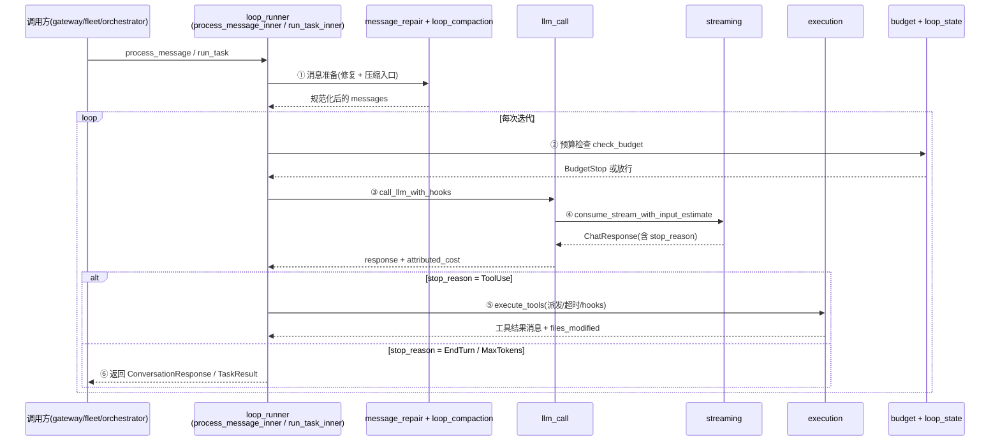
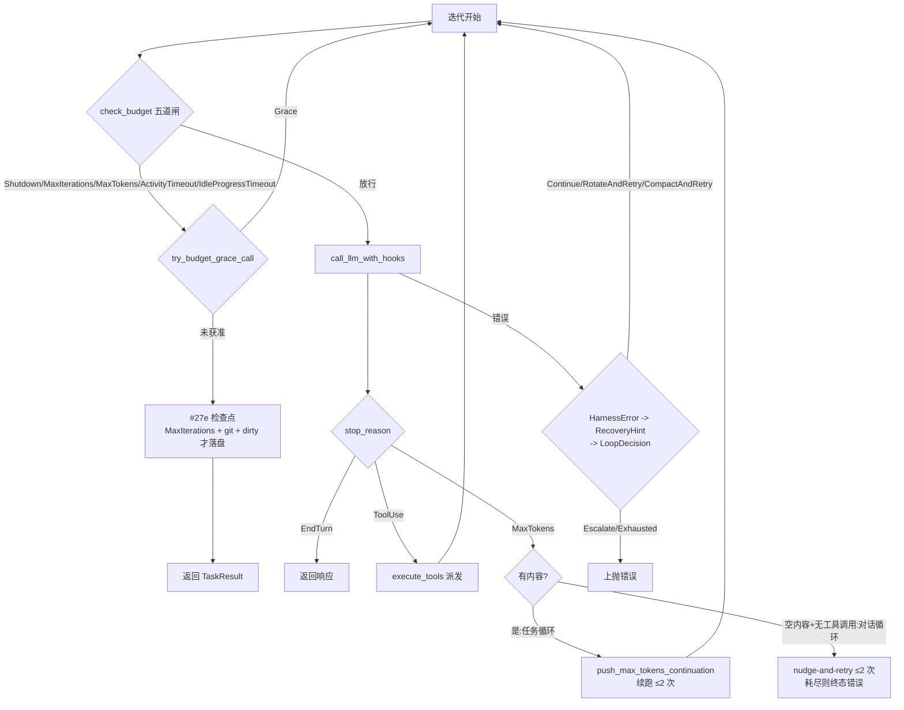
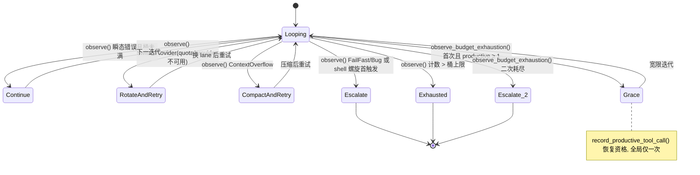

# 第 5 章：Agent Loop：一次对话的完整生命周期

> **定位**：本章按 `crates/octos-agent/src/agent/` 的 20 个模块重组 Agent Loop 的完整叙事，讲清一次 `process_message` / `run_task` 从入口到 stop_reason 的六阶段生命周期、预算五道闸与 #27e 落盘检查点、typed retry-bucket 状态机、错误恢复三层类型，以及 goal 层续跑队列与循环的边界。前置依赖：第 2 章（octos-core 类型）、第 3 章（LlmProvider 抽象）。适用场景：想知道「一条用户消息进来之后运行时到底做了什么」的 AI 应用开发者（读者 C），以及要给 loop 提 PR 的贡献者（读者 D）；第 16 章 fleet worker 与第 18 章 goal 续跑都以本章循环为基准变体。

Agent loop 的教科书定义只有一行：收到消息，调用 LLM，解析意图，要工具就执行工具，把结果喂回去，重复直到任务完成。生产级实现的全部难度藏在这行字的边界条件里：迭代上限、token 预算、空闲超时、上下文溢出、消息格式破损、重复输出、provider 故障、优雅关停。octos 把这些边界条件拆进了 `crates/octos-agent/src/agent/` 的 20 个模块：排除 `*crates/octos-agent/src/agent/loop_runner_tests.rs` 后共 21,369 行（口径：`cat $(ls *.rs | grep -v '_tests') | wc -l`），最大模块不是主循环文件 `crates/octos-agent/src/agent/loop_runner.rs`（3,979 行），而是工具派发 `crates/octos-agent/src/agent/execution.rs`（4,730 行）。这个反直觉的事实本身就是本章的切入点：主循环的价值不在「循环」这个动词，而在它编排的决策面。本章所有行号与数字来自 `assets/ch05-facts.md`（基准 octos main @ `9c157101`，2026-09-02），正文中每个源码引用(路径加行号)都可在事实表与源码仓库核对。

---

## 5.1 模块地图：20 个模块、21,369 行

先把目录读成一张地图。每个模块的首行 `//!` 文档注释就是它的自我声明：

| # | 模块 | 行数 | 一句话职责（首行文档注释） |
|---|------|------|------|
| 1 | `crates/octos-agent/src/agent/activity.rs` | 150 | Loop activity tracking for idle-timeout enforcement |
| 2 | `crates/octos-agent/src/agent/append_only_audit.rs` | 364 | Append-only context audit: does a turn's request history only ever GROW? |
| 3 | `crates/octos-agent/src/agent/budget.rs` | 821 | Budget tracking and enforcement for the agent loop |
| 4 | `crates/octos-agent/src/agent/compaction.rs` | 358 | Context window trimming and fallback truncation |
| 5 | `crates/octos-agent/src/agent/detection.rs` | 858 | Detection of repetitive output and retriable responses |
| 6 | `crates/octos-agent/src/agent/execution.rs` | 4,730 | Tool execution: dispatching tool calls with hooks and timeout handling |
| 7 | `crates/octos-agent/src/agent/llm_call.rs` | 988 | LLM call orchestration with lifecycle hooks and retry logic |
| 8 | `crates/octos-agent/src/agent/loop_compaction.rs` | 414 | Message preparation pipeline for long-turn loop calls |
| 9 | `crates/octos-agent/src/agent/loop_runner.rs` | 3,979 | Main agent loop: process_message and run_task orchestration |
| 10 | `crates/octos-agent/src/agent/loop_state.rs` | 768 | Typed retry-bucket state machine for the agent loop (M6.2, issue #489) |
| 11 | `crates/octos-agent/src/agent/memory.rs` | 1,062 | Initial message building and episodic memory context for the agent |
| 12 | `crates/octos-agent/src/agent/message_repair.rs` | 1,260 | Message normalization, ordering repair, and tool pair validation |
| 13 | `crates/octos-agent/src/tools/mod.rs` | 1,644 | Agent implementation |
| 14 | `crates/octos-agent/src/agent/prompt_segments.rs` | 233 | Ordered system-prompt segments |
| 15 | `crates/octos-agent/src/agent/realtime.rs` | 602 | Real-time agent loop extensions for robotic operation |
| 16 | `crates/octos-agent/src/agent/rich_output.rs` | 309 | Rich output: produce a self-contained HTML document from a short brief |
| 17 | `crates/octos-agent/src/agent/streaming.rs` | 1,491 | Stream consumption, shutdown handling, and cost reporting |
| 18 | `crates/octos-agent/src/agent/turn_failure.rs` | 69 | Voice-turn failure projection |
| 19 | `crates/octos-agent/src/agent/turn_state.rs` | 388 | Typed turn state for loop execution |
| 20 | `crates/octos-agent/src/agent/verifier.rs` | 881 | Optional inference-time verifier and compact structured turn ledger |

按职责可以分三层。**主线九模块**承担一次 turn 的全部决策：`crates/octos-agent/src/agent/loop_runner.rs`（编排）、`crates/octos-agent/src/agent/turn_state.rs` / `crates/octos-agent/src/agent/loop_state.rs`（turn 内与跨 turn 的 typed 状态）、`crates/octos-agent/src/agent/budget.rs`（预算与检查点）、`crates/octos-agent/src/agent/llm_call.rs` / `crates/octos-agent/src/agent/streaming.rs`（调用与流消费）、`crates/octos-agent/src/agent/execution.rs`（工具派发）、`crates/octos-agent/src/agent/message_repair.rs`（消息修复）、`crates/octos-agent/src/agent/detection.rs`（退化检测）。**支线模块**各管一个侧面：`crates/octos-agent/src/agent/activity.rs`（空闲超时）、`crates/octos-agent/src/agent/append_only_audit.rs`（请求历史只增审计）、`crates/octos-agent/src/agent/memory.rs`（首轮消息与情节记忆）、`crates/octos-agent/src/agent/prompt_segments.rs`（系统提示分段）、`crates/octos-agent/src/agent/verifier.rs`（推理期校验）、`crates/octos-agent/src/agent/realtime.rs` / `crates/octos-agent/src/agent/rich_output.rs` / `crates/octos-agent/src/agent/turn_failure.rs`（实时、富输出、语音失败投影）。**压缩双模块**（`crates/octos-agent/src/agent/compaction.rs` 与 `crates/octos-agent/src/agent/loop_compaction.rs`）本章只交代入口，算法细节详见第 8 章。

`crates/octos-agent/src/tools/mod.rs` 是装配层：`pub struct Agent` 的构造与 builder 家族（`with_reporter`、`with_hooks`、`with_snapshot_manager`、`with_realtime`、`with_compaction_runner`、`with_persistent_retry_state` 等，`crates/octos-agent/src/agent/mod.rs:691` 起）把上述模块的运行时状态接进 Agent 结构体；超时与限额常量集中在 `AgentConfig`（first-token grace 180s、stream idle 90s、LLM call max 1200s，`crates/octos-agent/src/agent/mod.rs:148`）。

一个容易被忽略的分层事实：这个目录对外的公开面很窄。`crates/octos-agent/src/agent/execution.rs` 的工具派发主入口 `execute_tools` 是 `pub(super)`（`crates/octos-agent/src/agent/execution.rs:2483`），`crates/octos-agent/src/agent/streaming.rs` 的流消费主入口 `consume_stream_with_input_estimate` 同样是 `pub(super)`（`crates/octos-agent/src/agent/streaming.rs:73`），`crates/octos-agent/src/agent/message_repair.rs` 只有 `normalize_tool_call_id` 一个全 crate 公开函数（`crates/octos-agent/src/agent/message_repair.rs:95`）。真正的全公开入口只有 `crates/octos-agent/src/agent/loop_runner.rs` 的 `process_message` / `run_task` 家族。换句话说，crate 边界上只暴露「循环」，不暴露循环的器官。这个可见性设计有一层工程动机：器官级函数的签名还在演化（`execute_tools` 的返回元组已经长到七个元素，每加一种派发产物就要动签名），若把它们开成 `pub`，外部调用方会立刻把签名焊死，此后每次演化都是破坏性变更。只公开两个入口家族，等于把「循环怎么编排」的稳定性承诺收缩到最小面，内部模块得以自由重构——事实上 `crates/octos-agent/src/agent/execution.rs` 比 `crates/octos-agent/src/agent/loop_runner.rs` 更大，却没有一行代码泄漏到 crate 外。

主线九模块的拆分本身也值得追问：为什么是这九个，而不是按「调用 LLM 的代码」聚成一个文件？答案藏在变更轴上。`crates/octos-agent/src/agent/message_repair.rs` 修的是消息格式破损，变化频率跟随 Provider 协议差异（Anthropic 要求 tool result 紧跟 assistant、OpenAI 允许间隔）；`crates/octos-agent/src/agent/detection.rs` 检测的是模型行为退化，变化频率跟随模型生态（小模型的空响应、重复输出形态一直在出新）；`crates/octos-agent/src/agent/budget.rs` 是纯决策逻辑，几乎不变；`crates/octos-agent/src/agent/execution.rs` 跟随工具系统演化（详见第 6 章）；`crates/octos-agent/src/agent/streaming.rs` 跟随 SSE 解析与成本上报需求。五类变更轴互不相同，塞进一个文件意味着每次 Provider 协议调整都要在两千行混合代码里找上下文。按变更轴拆模块，让每个文件的 diff 都有单一主题。

## 5.2 一次 turn 的生命周期

### 5.2.1 入口家族

两个入口家族对应两种驱动方式。对话式入口给交互场景：`process_message`（`crates/octos-agent/src/agent/loop_runner.rs:784`）、`process_message_with_attachments`（L804）、`process_message_tracked`（L817，实时刷新 TokenTracker 供网关状态条）、`process_message_tracked_with_attachments`（L834），四者全部收敛到私有核心 `process_message_inner`（L852，循环体绵延至 L2242）。任务式入口给编排场景：`run_task`（L2243）与 `run_task_with_tracker`（L2254，供 fleet worker 在外部超时丢弃 future 后仍能读到真实 token 消耗）收敛到 `run_task_inner`（L2262）。

四个 `process_message` 变体不是过度设计，每个都对应一个真实调用方形态：基础版给最简单的聊天路径，attachments 版携带本轮附件上下文，tracked 版接 TokenTracker，tracked_with_attachments 版两者都要。若只留一个全参数入口，简单调用方就得传 `TurnAttachmentContext::default()` 与 `None` 之类的占位参数，编译器无法帮忙区分「调用方有意禁用」与「调用方忘了传」。收敛到单一 `process_message_inner` 则保证四个变体共享同一个循环体，不会出现交互路径与追踪路径行为漂移。`run_task_with_tracker` 的存在动机更具体：fleet worker 在外部墙钟超时会直接丢弃 future，返回的 TaskResult随之丢失，tracker 是唯一能存活下来的记账通道（源码注释明确要求超时路径的结算「never 0」）。

### 5.2.2 六个阶段



①消息准备：`prepare_conversation_messages`（`crates/octos-agent/src/agent/loop_compaction.rs:27`）与任务侧镜像 `prepare_task_messages`（L71）把历史送进修复管线。`crates/octos-agent/src/agent/message_repair.rs` 的七个 `pub(crate)` 函数各修一类破损：`normalize_tool_call_ids`（L27，统一跨 Provider 的 tool_call_id 前缀与字符集）、`normalize_system_messages`（L108）、`repair_message_order`（L189）、`repair_tool_pairs`（L325）、`synthesize_missing_tool_results`（L414）、`truncate_old_tool_results`（L513）。每类修复记入 `LoopRepairReason` 的七个变体（`crates/octos-agent/src/agent/turn_state.rs:48`，从 `ContextTrimmed` 到 `ToolCallIdsNormalized`），让「这次 turn 动过什么」可观测。

②预算检查：每次迭代开头跑 `check_budget`（见 5.3 节）。

③LLM 调用：整个调用编排收敛在 `crates/octos-agent/src/agent/llm_call.rs` 的单一主函数 `call_llm_with_hooks`（`crates/octos-agent/src/agent/llm_call.rs:22`），模块其余部分几乎全是测试 mock。它返回的三元组里，`usage` 把被丢弃的重试尝试合并进最终尝试，`attributed_cost_usd` 则按实际消耗 token 的 provider 分别计价，调用方必须直接记账而不是用胜出者费率重算合并总量（这是 #1632 P2 钉住的契约）。把调用编排压成单一函数是个自觉的选择：调用前后的 hook、跨 provider 的重试梯、成本归因三者必须严格咬合，任何一处插入新逻辑都可能破坏「重试尝试的 token 不丢账」这条不变量。单一入口让所有调用路径共享同一份编排逻辑，测试 mock 也只需模拟一个函数的形态。若每个调用点自行编排 hook 与重试，第一处遗漏就会造成成本统计黑洞。

④流消费：`consume_stream_with_input_estimate`（`crates/octos-agent/src/agent/streaming.rs:73`）消费 SSE 流，处理 shutdown 信号（`wait_for_shutdown`，L64），结束后由 `response_usage_cost`（L555）与 `emit_cost_update`（L581）上报成本，`response_to_message`（L669）把原始响应转成消息。流消费独立成模块的动机是它管着两类别的模块都不该管的资源：SSE 连接的生命周期（首 token 超时、token 间隔超时、中断检测）与输入 token 的估计。流式响应在结束前拿不到完整的 usage 块，而成本上报又不能等流结束，于是需要一个「边消费边估」的组件。把这段逻辑留在调用方意味着每个 provider 的重试路径都要重复实现一次中断检测；集中在 crates/octos-agent/src/agent/streaming.rs，中断语义全 crate 只有一份。

⑤工具派发：`execute_tools`（`crates/octos-agent/src/agent/execution.rs:2483`）决定串行还是并行、计算批超时（`compute_batch_timeout_secs`，L209）、执行前后 hook、识别长时工具（`is_long_running_tool`，L174）、处理 spawn_only 产物文件。工具语义本身详见第 6 章。这个 4,730 行的最大模块之所以最大，是因为它独自承担了「把 LLM 的意图变成副作用」的全部工程问题：批量调度（串行、并行、混合三路，`run_serial_calls` L2738 与 `execute_mixed_batch` L2846）、超时预算（批内最长工具决定整批时限）、取消与 panic 的结果投影（`cancelled_result` L3003、`timed_out_result` L3035、`panic_result` L3062，三种异常都要变成 LLM 能读的工具结果消息而不是让循环崩掉）、快照（`snapshot_before_mutating_tools` L2457，变更类工具执行前留底）。若这些职责留在 loop_runner，主循环文件会突破八千行且每条路径都混着工具细节；拆出来后 loop_runner 只看到「一批工具调用进、一批结果消息出」的干净接口。

⑥状态更新与 stop 判定：`LoopTurnState`（`crates/octos-agent/src/agent/turn_state.rs:59`）持有 iteration、total_usage、turn_spend_usd、retry/repair 原因列表与 terminal_reason，`record_usage`（L138）累积消耗，`record_budget_stop`（L187）记录终止。响应的 `stop_reason` 决定下一跳：EndTurn 返回、ToolUse 回到 ①、MaxTokens 走续跑与自愈（见 5.4 与 5.6 节）。turn 状态独立成类型（而非散落在循环体的局部变量）的动机在两个伴生枚举：`LoopRetryReason`（L41，三个变体）与 `LoopRepairReason`（L48，七个变体）把「这次 turn 重试过什么、修复过什么」变成可枚举的数据。当用户抱怨「这个任务为什么慢」，答案不再是翻日志猜，而是直接读 turn 结束时携带的原因列表。局部变量做不到这件事：它们没有类型，也没有序列化出口。

## 5.3 预算五道闸与 #27e 检查点

### 5.3.1 check_budget：五道闸的顺序

每次迭代开头，`check_budget`（`crates/octos-agent/src/agent/budget.rs:100`）按固定顺序过五道闸，任何一道命中即返回 `BudgetStop`：

```rust
pub(super) fn check_budget(
    &self,
    iteration: u32,
    start: Instant,
    total_usage: &TokenUsage,
    activity: &LoopActivityState,
) -> Option<BudgetStop> {
    use std::sync::atomic::Ordering;

    if self.shutdown.load(Ordering::Acquire) {
        return Some(BudgetStop::Shutdown);
    }
    if iteration >= self.config.max_iterations {
        return Some(BudgetStop::MaxIterations {
            limit: self.config.max_iterations,
        });
    }
```

（摘自 `crates/octos-agent/src/agent/budget.rs:100`，续后依次为 idle progress timeout、activity timeout、token 预算三道闸。）顺序本身就是设计：shutdown 是一次原子加载，用户中断必须最先响应；迭代数是最常见的停止原因，一次整数比较次之；两种超时依赖 `crates/octos-agent/src/agent/activity.rs` 的活动跟踪（`LoopActivityState`，`crates/octos-agent/src/agent/activity.rs:16`）；token 预算最后，因为 `budget_tokens_used`（`crates/octos-agent/src/agent/budget.rs:90`）要做四次饱和加法，且很多部署根本不设上限。token 统计把 cache_read 与 cache_write 一并计入：只加 input+output 会让开了 prompt caching 的 Anthropic 循环把预算跑穿约十倍。

`BudgetStop`（`crates/octos-agent/src/agent/budget.rs:13`）五个变体各携带对用户有意义的上下文：`MaxIterations { limit }` 带上限值，`MaxTokens { used, limit }` 带双方数字，两种 timeout 带 limit。`BudgetStop::message()`（L41）负责把这些变体渲染成可操作的终止消息；`report_budget_stop`（L141）再把它变成 `ProgressEvent` 上报。

预算侧四个公开函数各守一段，分工不是随手切的。`BudgetStop` 枚举（L13）把「为什么停」定义成数据，五个变体就是五种用户可区分的结局；`message()`（L41）是唯一的渲染点，终止文案集中在这里，用户在任何界面看到的预算终止话术都出自同一处，不会出现 CLI 说「达到上限」而网关说「budget exceeded」的分裂；`budget_tokens_used`（L90）是唯一的算术点，cache 计入规则改一处即全局生效；`check_budget`（L100）是唯一的判定点，五道闸顺序只在这一个函数里存在；`report_budget_stop`（L141）是唯一的上报点。判定、算术、渲染、上报四件事各一个函数，意味着预算行为的任何变更都能定位到单一函数，而调用方（两个循环体）只需面对 `Option<BudgetStop>` 这一种中间表示。若把这四件事摊进循环体，五道闸的顺序约束就会散落两处，两个循环迟早演化出不同的停止顺序。

### 5.3.2 Grace：硬停前的一次宽限

预算命中不总是立刻停。`try_budget_grace_call`（`crates/octos-agent/src/agent/loop_runner.rs:602`）先问 `LoopRetryState`：如果这是首次硬预算耗尽、且自上次宽限以来至少有过一次生产性工具调用，状态机回 `Grace`（`observe_budget_exhaustion`，`crates/octos-agent/src/agent/loop_state.rs:303`），循环多跑一轮，让 Agent 有机会把话说完、把文件写完。全局只宽限一次，第二次直接 `Escalate`。

### 5.3.3 #27e：落盘检查点

预算真正耗尽时的最大风险是丢工作树。#27e 在 `crates/octos-agent/src/agent/budget.rs` 的非测试段落（L484 起）实现落盘检查点，主函数 `checkpoint_budget_exhaustion`（`crates/octos-agent/src/agent/budget.rs:546`）：

```rust
pub(super) fn checkpoint_budget_exhaustion(
    workdir: Option<&std::path::Path>,
    stop: &BudgetStop,
    iteration: u32,
) -> Option<String> {
    // Only the ITERATION-cap stop checkpoints: MaxTokens/Shutdown/timeouts
    // have different re-dispatch semantics and stay on the legacy path.
    let BudgetStop::MaxIterations { limit } = stop else {
        return None;
    };
    let dir = workdir?;
    if !dir.join(".git").exists() {
        return None; // not a git worktree — nothing to checkpoint.
    }
```

（摘自 `crates/octos-agent/src/agent/budget.rs:546`。）触发条件是三个合取：stop 必须是 `MaxIterations`（L553 的 else 分支让其余四种走 legacy 路径）、workdir 必须是 git 仓库、`git status --porcelain` 必须非空。命中后做三件事：先以 tmp+rename 原子写 staged result（`write_result_md_named`，L499；tmp 文件名含 `.tmp-27e` 标记，L501），再 `git add -A` 并提交 `wip: budget exhausted (#27e) — checkpointed mid-task`（本地提交，永不 push），最后返回 `budget_exhausted:{limit}` 标记拼进 TaskResult.output。

不触发同样重要：clean 工作树不会产生空提交，非 git 目录直接返回，MaxTokens/Shutdown/两种 timeout 不走这条路径，默认 50 次的迭代预算不因此提高。#27h 的写权判定也在这里：`result_md_owned_by_peer`（L532）读 sidecar `.result-owner`，内容 trim 后恰为 `peer` 时，检查点改写 `result.checkpoint.md`（L579-581）而不碰 peer 的 `result.md`；sidecar 缺失或不可读按无 owner 处理，fail-open。该判定的唯一公开入口是 `result_md_owner_content_is_peer`（L542），cli 侧 #1824 安全读路径复用同一函数，保证两个消费者永不漂移。

调用点在任务循环的预算终止分支（`crates/octos-agent/src/agent/loop_runner.rs:2328`）：Grace 未获准时，先 `record_budget_stop` 与 `report_budget_stop`，再取 `workspace_root` 交给检查点函数，marker 存在时与 `stop.message()` 一起拼进 TaskResult。

落盘侧的调用链同样一条线：`git_in`（L484）是最底层的命令执行原语，dirty 判断与 commit 都走它；`write_result_md_named`（L499）是唯一的落盘写法（tmp 加 rename，tmp 名含 `.tmp-27e` 后缀，L501），并发读者永远看不到半个文件；`result_md_owned_by_peer`（L532）与 `result_md_owner_content_is_peer`（L542）构成写权判定的两层，前者负责读 sidecar、后者负责判断内容，公开的只有后者，cli 侧 #1824 的 fd 锚定安全读路径把读到的内容喂给同一个判断函数，两个消费者共享一份语义；`checkpoint_budget_exhaustion`（L546）在最上层编排：先做 MaxIterations 合取短路，再判 git 仓库、判 dirty，然后依写权选文件名、原子写 staged result、add -A、本地提交、返回 marker。五个函数一条依赖链，每个环节独立可测（原子写在 L626 起的 `budget_checkpoint_tests` 有独立测试模块），这正是不把整段逻辑内联进 loop_runner 的原因：检查点逻辑的测试需要真实的 git 仓库环境，放在 crates/octos-agent/src/agent/budget.rs 里可以独立构造临时仓库跑，而不用模拟整个 Agent。

## 5.4 stop_reason 决策树

把一次迭代的出口画成一棵树：



任务循环与对话循环对 MaxTokens 的处理不对称。任务循环（`run_task_inner`）早在 #2174 之前就有续跑：`push_max_tokens_continuation`（`crates/octos-agent/src/agent/loop_runner.rs:3912`）在内容被截断时追加「从停下的地方继续」提示，上限 `MAX_TOKENS_CONTINUATION_LIMIT = 2`（L36），边界检查在 `crates/octos-agent/src/agent/loop_runner.rs:2661`。对话循环（`process_message_inner`）原来直接返回 `content.unwrap_or_default()`，空响应会让进程无错无声退出；#2174 补齐了这条路，见 5.6 节。

## 5.5 LoopDecision：typed retry-bucket 状态机

错误恢复的心脏在 `crates/octos-agent/src/agent/loop_state.rs`：`LoopRetryState`（`crates/octos-agent/src/agent/loop_state.rs:217`）持有 16 个错误桶各自的计数器（`LoopRetryCounters`，L186）与上限（`LoopRetryLimits`，L81）。上限刻意压低：结构性故障的桶几乎不给重试机会（authentication 1、quota 1、content_filtered 1、internal 1），瞬态故障给几次（rate_limited 5、network 4、provider_unavailable 4、timeout 3），`shell_spiral` 只有 1。

对循环的裁决是 `LoopDecision`（`crates/octos-agent/src/agent/loop_state.rs:131`）六个变体，每个变体的裁决语义都值得单独说清。`Continue`（L134）的含义是「失败预期会自愈」：限流突发、网络抖动、慢工具，重试时上下文原样保留，因为问题不在请求内容；`RotateAndRetry`（L138）是「当前 lane 病了但任务没病」：5xx、流中断、配额烧穿都属于 provider 级故障，换一条 credential lane 大概率就好，改写上下文反而浪费；`CompactAndRetry`（L141）是唯一的「改写上下文」裁决，且只服务 `ContextOverflow`：请求超窗时裸重试必然再失败，压缩是唯一出路，这个变体的存在把「哪类错误需要动上下文」从调用方判断收进类型系统；`Escalate`（L145）是不可重试类的归宿：auth、invalid request、content filter、工具或插件故障、内部 bug，继续循环只会烧钱，上抛给操作者才是正确动作；`Exhausted`（L149）不对应任何错误类别，它对应的是「同一桶的计数超过了上限」，这是 #489 不变量 2 的类型化表达：无限循环在这里被强制终结；`Grace`（L153）是最特殊的一个，它不是错误裁决而是预算裁决的延伸，硬预算耗尽后若循环至少做过一次生产性工具调用，多给一轮收尾。核心判定只有八行：

```rust
pub fn observe(&mut self, error: &HarnessError) -> LoopDecision {
    let (count, limit) = self.bump_counter(error);
    let decision = if count > limit {
        LoopDecision::Exhausted
    } else {
        decide_for_variant(error)
    };
    Self::record_metric(error.variant_name(), decision);
    decision
}
```

（摘自 `crates/octos-agent/src/agent/loop_state.rs:266`。）桶未满时交给 `decide_for_variant`（L431）按恢复提示映射：BackoffRetry 到 Continue、SwitchProvider 到 RotateAndRetry、CompactContext 到 CompactAndRetry、FailFast 与 Bug 都到 Escalate。

八个方法各在生命周期的固定位置被调用，拼起来才是一个完整的 turn。`new`（L234）在循环构造时建立初始态，全桶清零、装默认上限；`with_limits`（L240）给测试与运维留显式覆盖口；进入循环后，每次工具成功返回都调用 `record_productive_tool_call`（L253），把 Grace 资格计数器加一，这个资格的意义是：宽限只给「在干活却被预算掐断」的循环，不给空转的循环；LLM 或工具报错时 `observe`（L266）是主裁决入口，入桶、比限、出裁决、记指标，一次调用完成；shell 重试的退化走专用入口 `observe_shell_spiral`（L284），第一次螺旋就 Escalate（停住 shell 重试、上抛最近输出），超限则 Exhausted，计数由状态机持有而非 loop_runner 的局部变量，运维在 ledger 里看到的是同一本账；预算命中时 `observe_budget_exhaustion`（L303）决定 Grace 还是 Escalate，判据是「首次且生产性调用至少一次」；turn 结束或调试时 `counters`（L319）导出快照；`emit_event`（L327）把每次裁决写成结构化事件进 harness event sink。时序上一次典型 turn 的调用序是：new（或从持久句柄恢复）、若干次 record_productive_tool_call、零或数次 observe、可能一次 observe_budget_exhaustion、随时的 emit_event。整个状态经 serde 序列化，可随 session ledger 往返；`PersistentRetryStateGuard`（`crates/octos-agent/src/agent/loop_runner.rs:255` 附近）在构造时加载、drop 时写回，让桶计数跨 turn 存活，同一 session 里昨天烧掉的三次 network 重试今天仍然计入桶。



图里每条转移对应状态机里一个可指认的判定。五个从 Looping 出发的裁决转移全部由 `observe()`（或 `observe_shell_spiral()`）的一次返回值决定：桶计数与上限的比较结果决定走 Exhausted 还是按 `decide_for_variant` 的映射走其余四个；`Continue` / `RotateAndRetry` / `CompactAndRetry` 三个回到 Looping 的转移差别在「下一迭代开始前循环体做了什么」：Continue 什么都不做，RotateAndRetry 推进 provider chain 的 lane 指针，CompactAndRetry 触发一次对话压缩（由 `dispatch_loop_error` 在带内完成，调用方无感）。Grace 的进入条件是两个谓词的合取（`grace_calls_fired == 0` 且 `productive_tool_calls_since_last_grace >= 1`），进入即清零生产计数、自增 fired 计数，两个字段一读一写保证「全局仅一次」由数据结构自身而不是调用纪律来保证。Escalate_2 与 Escalate 终点相同但入口不同：前者来自预算耗尽的重访，后者来自错误裁决，分开画是因为两者的运维含义不同，错误上抛要看 variant，预算上抛要看 iteration。

> ### 工程决策侧栏：为什么把 retry 从 bool 提升为 typed bucket 状态机
>
> 朴素实现是一个「已重试几次」的计数器加一个退避计时器，全部错误共享额度。这在生产里有两个失败模式。其一，额度被错误的错误消耗：一次 429 风暴吃掉全部重试次数，后面真正的结构性 401 反而没有重试预算可谈；反过来 auth 错误被当作可重试错误空转，直到迭代上限。其二，决策不可解释：监控里只能看到「重试了」，看不到为什么重试、还能重试几次、下一跳是什么。M6.2（issue #489）的答案是给每类错误一个独立桶、每桶独立上限、每桶映射到带名字的裁决。`LoopDecision::as_str()`（`crates/octos-agent/src/agent/loop_state.rs:159`）输出稳定 snake_case 供指标与事件用，`OCTOS_LOOP_RETRY_TOTAL`（L42）是总计数指标名。类型化的代价是 16 个字段与 serde 兼容负担（quota 桶后加，还要 `default_quota_limit` 兜住旧 JSON），换来的是不变量可陈述：同一故障超过桶上限必然 Exhausted，无限循环在类型层面被挡住。

## 5.6 harness_errors：错误恢复的三层类型

`crates/octos-agent/src/harness_errors.rs` 用三个类型搭起恢复链：`RecoveryHint`（L47，五变体：`BackoffRetry` L50、`SwitchProvider` L53、`CompactContext` L56、`FailFast` L60、`Bug` L63）描述「这类错误该怎么救」；`HarnessError`（L93，十五变体，从 `RateLimited` L96 到 `Internal` L160）是规范化错误，变体名冻结，其他里程碑按名引用；`HarnessErrorEvent`（L166）把错误写成结构化事件进 sink。链路是 HarnessError 经 `recovery_hint()`（L240）得到 RecoveryHint，再由 loop 侧状态机裁决成 LoopDecision。

两处映射值得细看。`ProviderUnavailable` 映射到 `SwitchProvider`（`crates/octos-agent/src/harness_errors.rs:249`）：5xx、流中断、模型不可用都归此变体，agent 内部没有额外的 provider lane hook，实际换 lane 由 loop 侧 `RotateAndRetry` 裁决驱动 ProviderChain 前进。`Quota` 也映射到 `SwitchProvider`（L267，#27b）：配额烧穿是 provider 级降级而非致命错误，链上的 fallback lane 可能还健康；而真正的 401 `Authentication` 保持 FailFast，因为错误密钥在每条 lane 上都会失败。这条红线有测试钉住。

进入这条链的入口在 `crates/octos-agent/src/agent/loop_runner.rs`：`classify_loop_error`（`crates/octos-agent/src/agent/loop_runner.rs:313`）把 `eyre::Report` 经 `HarnessError::classify_report` 归类、记指标、写事件；`dispatch_loop_error`（L437）把归类结果喂给 `LoopRetryState::observe` 并再写一条 retry 事件；调用侧拿到的只是二选一的粗粒度动作 `LoopErrorAction`（L249，`Retry` 或 `Bail`），`CompactAndRetry` 在带内完成，调用方无须穿透压缩状态。

## 5.7 循环自愈：两个退化实例

小模型会让循环以两种方式退化，两个提交各修一种。

**空 MaxTokens 的静默死路**（#2174，提交 `9fe39f1b`，2026-08-28）。Qwen 3.8 在一次压缩后把 16,384 token 的输出预算全部花在 reasoning 上，没有内容也没有工具调用，`octos chat` 干净地退出，无输出无错误。修复只针对这个退化分支：MaxTokens 响应空内容且无工具调用时，做有界 nudge-and-retry：

```rust
if content_empty
    && response.tool_calls.is_empty()
    && max_token_empty_recoveries < MAX_TOKENS_CONTINUATION_LIMIT
{
    max_token_empty_recoveries += 1;
    let mut assistant = Message::assistant(String::new());
    assistant.reasoning_content = response.reasoning_content.clone();
    messages.push(assistant);
    messages.push(Message::user(MAX_TOKENS_EMPTY_RECOVERY_PROMPT));
```

（摘自 `crates/octos-agent/src/agent/loop_runner.rs:2171` 附近的对话循环 MaxTokens 分支；nudge 提示常量在 L42，上限仍是 2，耗尽后改为返回 L45 的终态错误消息而非空成功。带内容的 MaxTokens 响应原样返回，云端正常截断不受影响。）

**强制贪心采样的重复坍缩**（#2172，提交 `3c7ff8bf`，2026-08-28）。octos 曾对每个 chat 请求硬编码 temperature=0.0，本地小模型上贪心 argmax 会确定性重发同一工具调用，实测一条响应里重复了 763 次相同的 update_plan 调用。修复加了 `gateway.llm_temperature` 配置项，穿透到 `AgentConfig.chat_temperature`（`crates/octos-agent/src/agent/mod.rs:97`），在纯函数 `build_chat_config`（`crates/octos-agent/src/agent/loop_runner.rs:3957`）里应用。云端安全是构造保证：配置缺省时函数保持 `ChatConfig::default()` 的 0.0，云端请求逐字节不变；本地模型运维方设置如 0.7 即可避开坍缩。把覆盖语义提为自由函数，正是为了让「缺省不动默认值」这条不变量可以脱离完整 Agent 做单元测试。

这两个实例共同说明循环自愈的形状：检测退化条件（空内容、无进展），有界恢复（≤2 次），恢复不了就给可读的终态而不是空成功或静默退出。

## 5.8 退化检测

`crates/octos-agent/src/agent/detection.rs` 是循环的免疫层，五个 `pub(super)` 函数：`is_retriable_response`（`crates/octos-agent/src/agent/detection.rs:60`，空响应等可在调用层重试的形态）、`normalize_inline_invokes`（L84）、`is_repetitive_output`（L111，重复文本检测）、`is_retryable_stream_error`（L146）、`is_truncated_tool_call_error`（L168）。加上工具序列层面的 `LoopDetector`（窗口 12，任务循环注释明确对齐对话循环窗口）与 `crates/octos-agent/src/agent/loop_state.rs` 的 `SHELL_SPIRAL_VARIANT`（L180，shell 螺旋计数由状态机持有），构成三层：响应层、序列层、桶层。检测命中后的动作都已类型化：响应层回到调用重试梯，序列层停住本轮工具执行并上抛最近输出，桶层走 5.5 节的裁决。

## 5.9 支线模块一览

四个支线模块各用一段交代。`crates/octos-agent/src/agent/memory.rs` 负责首轮消息构建与情节记忆召回：`build_initial_messages`（`crates/octos-agent/src/agent/memory.rs:249`）、`recall_relevant_episodes`（L86）、`save_conversation_episode`（L174），相似度阈值 `MIN_EPISODE_SIMILARITY = 0.55`（L44）；检索机制详见第 4 章。`crates/octos-agent/src/agent/prompt_segments.rs` 用 `PromptSegmentProvider` trait（`crates/octos-agent/src/agent/prompt_segments.rs:25`）维护有序系统提示段，支持具名替换与热刷新。`crates/octos-agent/src/agent/verifier.rs` 是可选的推理期校验器加紧凑 turn ledger：`TurnLedger`（L168）逐工具批记录条目，`should_verify_after_tool_batch`（L212）决定是否触发校验，`ready_gate_active`（L243）实现「校验通过才许终止」的门。`crates/octos-agent/src/agent/append_only_audit.rs` 回答一个问题：一次 turn 的请求历史是否只增不减（`Rewrite` 枚举，L162），默认关闭，`OCTOS_APPEND_ONLY_AUDIT=1` 才开启且绝不改写请求。`crates/octos-agent/src/agent/realtime.rs`（心跳与传感器注入，`Heartbeat` L128、`SensorContextInjector` L238）、`crates/octos-agent/src/agent/rich_output.rs`（从短 brief 生成自包含 HTML，`author_html` L85）、`crates/octos-agent/src/agent/turn_failure.rs`（语音 turn 失败投影，`TurnFailure` L9）服务特定运行模式，详见第 14 章。

## 5.10 续跑边界：goal 层的 master_continuation_scheduler

循环返回 stop_reason 之后，谁决定再开一个 turn？答案不在 agent crate。`crates/octos-cli/src/autonomy/master_continuation_scheduler.rs`（1,416 行）是一个纯数据结构：延迟优先队列，无 tokio 依赖、无 LLM 调用。入队原因 `MasterContinuationReason`（L137）六变体：`ChildCompleted`、`ScatterJoinComplete`、`LoopFire`、`GoalContinue`、`GoalWrapUp`（#1131，预算耗尽的收尾 turn）、`External(String)`；优先级映射在 `priority()`（L152）：LoopFire 最高，ChildCompleted 与 ScatterJoinComplete 次之，GoalContinue 与 GoalWrapUp 同级，External 最低。队列本体 `MasterContinuationScheduler`（L477）提供 `enqueue`（L525）、`drain_ready`（L687）、`drain_ready_for_session`（L706）等接口。

它被 `AgentOrchestrator` 持有为状态字段 `continuations`（`crates/octos-cli/src/autonomy/agent_orchestrator.rs:11783`），出队走 `drain_ready_continuations_for_session`（L3027）到内部 `drain_ready_continuations_locked`（L3112）。loop 侧唯一可见的效果是：一次 `run_task` 返回后，orchestrator 依据 ready 队列与优先级再次派发新 turn。「turn 结束后再创造 turn」的完整语义属于 goal 层，详见第 18 章。

## 5.11 本章回顾

1. 模块地图：`agent/` 20 模块 21,369 行，三层分工（主线九模块、支线模块、压缩双模块），公开面只有 `crates/octos-agent/src/agent/loop_runner.rs` 的 `process_message` / `run_task` 家族，器官级入口全部 `pub(crate)` / `pub(super)`。
2. 生命周期：消息准备（修复七函数）、预算检查（五道闸）、LLM 调用（单一主函数）、流消费、工具派发、状态更新六阶段，主循环文件编排而不实现。
3. 预算与检查点：`check_budget` 顺序即设计；Grace 给硬停前一次宽限；#27e 在 MaxIterations 且 git 且 dirty 三条件合取时本地提交 WIP、原子写 staged result（peer 持有写权时写 `result.checkpoint.md`）、永不 push、fail-open。
4. 错误恢复：`HarnessError`（十五变体）→ `RecoveryHint`（五变体）→ `LoopDecision`（六变体）三层链路，16 桶独立上限，`ProviderUnavailable` 与 `Quota` 换 lane、`Authentication` 保持 FailFast。
5. 循环自愈：空 MaxTokens 的有界 nudge（`9fe39f1b`）与云端安全的 temperature 覆盖（`3c7ff8bf`），检测退化、有界恢复、终态可读。
6. 续跑边界：scheduler 是 goal 层纯队列，loop 只负责把 stop_reason 交回去。

---

## 延伸阅读

- `assets/ch05-facts.md`：本章全部行号与数字的事实表，附生成命令，可逐条复现。
- 第 3 章的三层容错链（RetryProvider / ProviderChain / AdaptiveRouter）：`RotateAndRetry` 裁决落地后实际换 lane 的机制。
- 第 8 章：`crates/octos-agent/src/agent/compaction.rs` / `crates/octos-agent/src/agent/loop_compaction.rs` 背后的分层压缩算法。
- 第 18 章：`MasterContinuationScheduler` 的消费侧与 goal 续跑全貌。
- issue #489（M6.2 typed retry bucket）与 #2172 / #2174 的提交说明：本章状态机与两个自愈实例的第一手动机。

## 思考题

1. `check_budget` 的五道闸顺序如果重排（比如把 token 预算放最前），会在什么部署形态下引入可观开销或行为回退？给出你的排序理由与边界条件。
2. #27e 只在 `MaxIterations` 触发。若要让 `MaxTokens` 也支持「耗尽即检查点」，re-dispatch 语义需要哪些额外信息？改触发条件本身够吗？
3. 16 个桶的上限里，`provider_unavailable` 给 4 次、`authentication` 给 1 次。假如引入一种新的「provider 计费窗口冷却」错误，你会给它独立桶还是并入 quota？判断标准是什么？
4. 对话循环的空 MaxTokens nudge 上限是 2。把这个上限做成可配置，收益与风险各是什么？谁应该是这个配置的所有者：模型运维、平台运维，还是用户？
5. `execute_tools` 是 `pub(super)` 而 `process_message` 是全公开。如果外部调用方需要绕过循环直接执行一批工具，应该在 crate 边界上开新口，还是复用 `execute_approved_tool`（`crates/octos-agent/src/agent/execution.rs:469`）这样的既有公开函数？两种选择的审计面差异在哪里？

---

## 版本演化说明

> 本章分析基于 octos main @ `9c157101`（`9c1571016e5ea86955b4b3486c04f0359dfff339`，2026-09-02 19:37 +0800 统计）。所有行号与规模数字（20 模块、21,369 行、`crates/octos-agent/src/agent/execution.rs` 4,730 行、`crates/octos-agent/src/agent/loop_runner.rs` 3,979 行等）的口径与复现命令见 `assets/ch05-facts.md`。相对 v1 旧稿，本章整章重写：按 20 模块地图重组叙事，取代旧稿「单文件逐段走读」骨架；预算检查点（#27e）、Grace 宽限、typed retry-bucket 状态机（M6.2 #489）、循环自愈两实例（#2172 / #2174）与 goal 层续跑边界为新增内容；旧稿引用的 `loop_detect` 等行号如与新版源码不符，以事实表为准。
