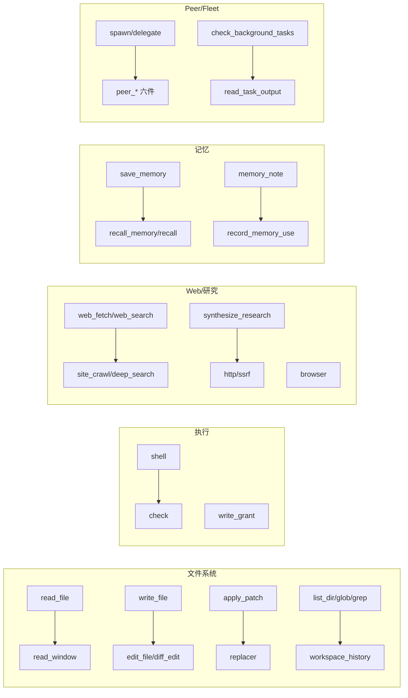
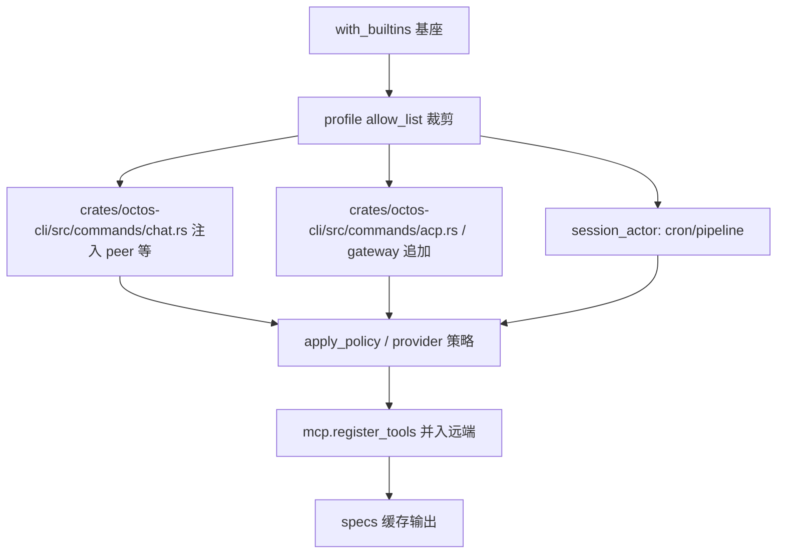

# 第 6 章 工具系统：按能力域组织的 58 个源文件

> **定位**：本章深入 Agent Loop 中"行动"阶段的核心,即工具系统。与旧稿按固定数量罗列内置工具的线性清单写法不同，本章按能力域重组叙事：先纵览 `crates/octos-agent/src/tools/` 的 58 个条目如何划分成 10 个能力域，再下沉到三个骨架文件(`crates/octos-agent/src/tools/registry.rs` 3,581 行、`crates/octos-agent/src/tools/policy.rs` 741 行、`crates/octos-agent/src/tools/args.rs` 479 行)讲清 `Tool` trait 契约、注册与查找、曝光控制、策略判定与参数安全。前置依赖：第 5 章(agent loop 如何调用工具)。适用场景：想理解 Agent 工具架构的 AI 应用开发者(读者 C)，以及想为 octos 贡献新工具的开发者(读者 D)。

Agent 的"智能"来自 LLM,但 Agent 的"能力"来自工具。没有工具,Agent 只能生成文本;有了工具,Agent 可以读写文件、执行命令、搜索网页、管理 Git 仓库、派出子代理。

先统一口径。以 `ls crates/octos-agent/src/tools/ | grep -v test` 实测,tools/ 下共 **58 个条目**:57 个 `.rs` 文件加一个 `admin/` 子目录(内含 7 个文件,合计 3,424 行)。黑板与早期规划里出现的"59 个源文件"是把测试类文件与 `crates/octos-agent/src/tools/mod.rs` 计满后的口径(`ls crates/octos-agent/src/tools/*.rs | wc -l`)。本章统一采用"58 条目 + admin 子目录 7 文件"的结构口径,不再沿用旧稿那个早已失效的固定工具数:当前源码里本来就不存在一个稳定的"总工具数":同一批源文件在不同构造路径下注册出不同的工具面,理解这个分层注册模型,比记住一个固定数字更重要。

工具带来能力的同时也带来风险:每个工具调用都是一个潜在的攻击面。octos 的答案是一道骨架三防线:`ToolPolicy` 控制哪些工具可用(deny-wins),参数验证控制输入安全(1 MB 上限与结构化报错),symlink-safe I/O 与 SSRF 校验控制文件系统与网络边界。第 7 章会展开沙箱与 `write_grant` 的运行时语义,本章只讲工具侧的接口与注册。

---

## 6.1 能力域全景:58 个条目怎么分组

按事实表(`assets/ch06-facts.md`,commit `552be31`)的归属,tools/ 下的源文件可以划分成 10 个能力域。下表是本章的导航图,每个能力域随后各有一小节:

| 能力域 | 文件数 | 源文件 |
|---|---|---|
| 文件系统 | 12 | read_file, read_paging_probe, read_window, write_file, edit_file, apply_patch, diff_edit, list_dir, glob_tool, grep_tool, replacer, workspace_history |
| Shell/执行 | 3 | shell, check, write_grant |
| Web/研究 | 9 | web_fetch, web_search, deep_search, synthesize_research, research_utils, site_crawl, http, ssrf, browser |
| 记忆 | 5 | memory_note, record_memory_use, recall, recall_memory, save_memory |
| 消息/交互 | 4 | message, send_file, send_app_card, ask_user_question |
| Peer/Fleet | 10 | peer_handoff, peer_send_input, peer_gather, peer_list, peer_respond, peer_close, spawn, delegate, check_background_tasks, read_task_output |
| 代码/结构 | 2 | code_structure, coding_tools |
| Git | 1 | git |
| 技能/插件 | 3 | manage_skills, dora_bridge, mcp_agent |
| 平台杂项 | 6 | check_workspace_contract, tool_config, mofa_make, robot_groups, mod, admin/(7 文件) |

表的合计口径:58 个条目 = 上表 10 域的 55 个文件级条目(平台杂项按实际清单 6 条,`admin/` 整体算 1 条)+ 不归属任何域的骨架三件(`registry`、`policy`、`args`)。

图 6-1 能力域工具家族(mermaid,正文渲染):



有几个名字与直觉不符,值得先说清。`crates/octos-agent/src/tools/glob_tool.rs` 注册的工具名是 `glob`,`crates/octos-agent/src/tools/grep_tool.rs` 是 `grep`,`crates/octos-agent/src/tools/workspace_history.rs` 里是 `workspace_log`,`crates/octos-agent/src/tools/site_crawl.rs` 是 `deep_crawl`,`crates/octos-agent/src/tools/deep_search.rs` 是 `search`,`crates/octos-agent/src/tools/delegate.rs` 是 `delegate_task`。文件名与工具名分离,是这批文件早期为避让 Codex 兼容别名留下的痕迹。`crates/octos-agent/src/tools/coding_tools.rs` 更特殊:一个文件里实现了 `exec_command`、`write_stdin`、`spawn_agent`、`bash`、`delegate`、`view_image`、`tool_search`、`tool_suggest`、`image_generation` 等一整组 Codex 兼容 shim(`crates/octos-agent/src/tools/coding_tools.rs:381`、`:738`、`:1283`、`:1945`、`:2428`、`:2800`、`:3149`、`:3250`、`:3388`),所以"文件数不等于工具数"在两个方向都成立。`crates/octos-agent/src/tools/replacer.rs`、`crates/octos-agent/src/tools/read_paging_probe.rs`、`crates/octos-agent/src/tools/ssrf.rs`、`crates/octos-agent/src/tools/dora_bridge.rs`、`crates/octos-agent/src/tools/http.rs`、`crates/octos-agent/src/tools/read_window.rs`、`crates/octos-agent/src/tools/write_grant.rs` 甚至不是独立工具,而是被其他工具复用的支撑模块或特性开关,这也是能力域分组的第二个维度:按"谁依赖谁"而不只按"叫什么名字"。

能力域之外还有第二套坐标系要认清。上面的域是文件组织的事实划分,`crates/octos-agent/src/tools/policy.rs` 里另有一张按 LLM 可见入口划分的策略分组表 `TOOL_GROUPS`(`crates/octos-agent/src/tools/policy.rs:187` 起,`ToolGroupInfo` 结构在 `:179-183`,共 10 组),两套并不重合。`group:fs` 只收 `read_file`、`write_file`、`edit_file`、`diff_edit`、`apply_patch` 五个主入口,文件系统域的 12 个文件里过半不在组内;`bash` 别名的实现在 `crates/octos-agent/src/tools/coding_tools.rs`(代码/结构域),却因 #1172 被收进 `group:runtime`;`group:sessions` 的七个成员横跨 Peer/Fleet 域与 Codex 兼容 shim。分组按工具名而非文件名,理由直接:策略要约束的是模型喊得到的名字,不是源码存放的位置。

这张静态表有一条硬不变量。`group:delegated`(M6.7,`crates/octos-agent/src/tools/policy.rs:307` 起)是委派子代理的标准 deny 表,必须覆盖 `group:sessions` 的全部成员,否则子代理能再派孙代理,从递归护栏底下穿过去。`expand_group` 返回扁平静态切片,组机制没有组内组展开,超集只能手工维护,测试 `group_delegated_supersets_session_spawn_family` 在每次构建时逐项核对,注释里记录了这次漂移确实发生过:`spawn_agent`、`send_input`、`*_agent` 生命周期工具与 `delegate` 包装器一度全部可达。同一张表还故意不收 `shell`,注释原文写明这里不是 confinement boundary,命令执行的约束交给沙箱层,工具策略层管不了也不该装作能管。

下面按域速览,每域点出代表性设计与源码位置。

### 6.1.1 文件系统(12 个)

这是最重的一域:`crates/octos-agent/src/tools/read_file.rs` 2,366 行、`crates/octos-agent/src/tools/write_file.rs` 2,220 行,单文件就超过多数域的总和。设计要点有三。

第一,读有多条路径而不是一条。`read_file` 负责常规读取,`crates/octos-agent/src/tools/read_paging_probe.rs` 是一个"只观察不改变行为"的分页探针(`crates/octos-agent/src/tools/read_paging_probe.rs:1-6`),用来回答"强制分页到底省不省 token"这个测量问题;`crates/octos-agent/src/tools/read_window.rs` 是特性开关 `OCTOS_READ_WINDOW=1` 才启用的窗口化强制(`crates/octos-agent/src/tools/read_window.rs:3`、`:178`),默认关闭,不设环境变量时行为与旧版逐字节一致。三者并存说明:读路径的每一次收紧都必须先拿数据,再拿默认值。

第二,写有四个层次。`write_file` 全量写,`edit_file` 精确替换,`diff_edit` 按上下文匹配,`apply_patch` 接受标准 patch 格式。它们共用 `crates/octos-agent/src/tools/replacer.rs` 的级联模糊匹配链(#1771):LLM 给出的 `old_string` 常有空白、缩进、转义差异,`edit_file` 不再硬失败,而是按 exact → line_trimmed → … 的顺序逐级放宽,用第一个有结果的匹配器(`crates/octos-agent/src/tools/replacer.rs:1-8`)。这条链是"容忍模型的不精确"这一原则的落地。

第三,检索三件(`list_dir`/`glob`/`grep`)与 `crates/octos-agent/src/tools/workspace_history.rs`(注册名 `workspace_log`,见 `crates/octos-agent/src/tools/workspace_history.rs:101`)补齐"找文件"与"看历史"。

### 6.1.2 Shell/执行(3 个)

`crates/octos-agent/src/tools/shell.rs` 2,745 行,注册名 `shell`,是执行域的主力;同域的 `bash` 别名在 `crates/octos-agent/src/tools/coding_tools.rs:1945`。`crates/octos-agent/src/tools/check.rs` 是工作区检查器(注册名 `check`,`crates/octos-agent/src/tools/check.rs:526`)。`crates/octos-agent/src/tools/write_grant.rs` 不是工具而是 #1976 引入的按路径写授权结构:`WritePathGrant` 通过 `write_file`/`edit_file` 的 `with_write_grant` 构造器绑定,让"写越界"从礼貌请求变成类型化拒绝(`crates/octos-agent/src/tools/write_grant.rs:53`、`:72`)。它的运行时语义与沙箱翻译在第 7 章,这里只需要知道:授权的匹配语法是单段通配(`*`/`?` 限一段,拒绝 `**`、`[...]`、`{...}`)。

### 6.1.3 Web/研究(9 个)

从 `web_fetch` 单页抓取、`web_search` 搜索,到 `site_crawl`(注册名 `deep_crawl`)与 `deep_search`(注册名 `search`)的站点级/多跳研究,再到 `synthesize_research` 汇总成文。支撑模块三个:`crates/octos-agent/src/tools/http.rs` 是原始 HTTP 客户端(工具名由构造器传入,`crates/octos-agent/src/tools/http.rs:130`),`crates/octos-agent/src/tools/ssrf.rs` 是共享的 SSRF 防护(`check_ssrf_with_addrs` 在 `crates/octos-agent/src/tools/ssrf.rs:24`,含 DNS pinning 防重绑定,`validate_answer_set` 在 `:69`,重定向上限 `SSRF_MAX_REDIRECTS = 10` 在 `:101`),`crates/octos-agent/src/tools/browser.rs` 是无头浏览器。注意输出限额按工具名区分:`octos_core::tool_output_limit` 里 `read_file` 50,000 字节、`shell` 30,000、`web_fetch` 40,000、`web_search` 20,000、`search`(deep_search)200,000(`crates/octos-core/src/utils.rs:180-196`)(研究类工具拿到的是最宽的额度)。

### 6.1.4 记忆(5 个)

`save_memory` 写入、`recall_memory` 召回、`memory_note` 记笔记、`record_memory_use` 记使用账;`crates/octos-agent/src/tools/recall.rs` 是 #2131 引入的新成员:当上下文压缩把某次工具输出替换成占位符后,`recall` 凭 `tool_call_id` 从内容寻址的输出台账里把完整字节重新物化,而不必重跑那次调用(`crates/octos-agent/src/tools/recall.rs:1-4`)。它通过 `ToolOutputLedger` trait 与 octos-cli 的 ContextManager 保持独立(`crates/octos-agent/src/tools/recall.rs:15-21`),注册名 `recall`(`:106`)。这条机制与第 8 章的压缩台账直接呼应。

### 6.1.5 消息/交互(4 个)

`message` 发文本、`send_file` 发文件、`send_app_card` 发卡片、`ask_user_question` 向用户提问。这一域的特点是"结果不是给模型的,是给人的":输出走消息总线而非工具结果(`MessageTool`/`SendAppCardTool` 共享同一个 `tx` 通道注册,`crates/octos-agent/src/tools/registry.rs:1735-1736`;`send_app_card` 的描述里明确要求 `initial_state` 必须来自真实工具数据、严禁编造,`crates/octos-agent/src/tools/send_app_card.rs:130-140`),第 10 章展开。

### 6.1.6 Peer/Fleet(10 个)

最大的一域。`crates/octos-agent/src/tools/spawn.rs` 5,309 行,是全书最大的单工具文件(注册名 `spawn`,`crates/octos-agent/src/tools/spawn.rs:2922`);`crates/octos-agent/src/tools/delegate.rs`(注册名 `delegate_task`)是单次调用版。`peer_handoff`/`peer_send_input`/`peer_gather`/`peer_list`/`peer_respond`/`peer_close` 六件构成 peer 通道原语,`check_background_tasks` 与 `read_task_output` 补齐后台查询。这一域与 `spawn_only` 曝光控制(6.3 节)绑定最深:后台化工具的调用正是被执行循环拦截转成后台任务的。

### 6.1.7 代码/结构(2 个)与 Git(1 个)

`crates/octos-agent/src/tools/code_structure.rs` 输出源码符号结构(注册名 `code_structure`;内部有 1 MB 解析上限,`crates/octos-agent/src/tools/code_structure.rs:72`),`crates/octos-agent/src/tools/coding_tools.rs` 如上是 Codex 兼容 shim 集合。`crates/octos-agent/src/tools/git.rs` 注册名 `git`,diff 侧同样有 1 MB 单文件上限(`crates/octos-agent/src/tools/git.rs:291`)。

### 6.1.8 技能/插件(3 个)与平台杂项

`manage_skills` 管理技能包,`dora_bridge` 接机器人框架(工具名来自映射表,`crates/octos-agent/src/tools/dora_bridge.rs:178`),`mcp_agent` 让 spawn 能把任务派给任何 MCP 后端(`crates/octos-agent/src/tools/mcp_agent.rs:1-6`)。平台杂项里 `crates/octos-agent/src/tools/tool_config.rs` 注册名是 `configure_tool`(`crates/octos-agent/src/tools/tool_config.rs:633`),`mofa_make` 是分发器(其目标工具被 `mark_internal_hidden` 隐藏,6.3 节),`crates/octos-agent/src/tools/robot_groups.rs` 维护机器人安全分级(`SafetyTier`:工具在 `RobotToolRegistry` 里按最低所需档位注册,档位展开时低档自动包含高档工具,`crates/octos-agent/src/tools/robot_groups.rs:26-38、51-59`),`admin/` 子目录 7 文件提供 20 个 `admin_*` 运维工具(`admin_list_profiles`、`admin_system_health`、`admin_update_octos` 等)。

### 为什么按域拆文件,而不是一个大文件

回到 6.1 开头的分组表,值得问一句:12 个文件系统工具为什么不并成单个大文件?域内共享的是不变量与依赖方向,不是代码量。文件系统域共享三条:路径必须先过 `resolve_path` 族归一;读写必须走 no-follow 系调用;输出必须接受 `tool_output_limit` 截断。把这三条放进一个共享模块、把工具语义放进各自的文件,新增一个读路径工具时只需要实现语义,不用重抄防线。反过来,域与域之间刻意不共享:Web 域的 SSRF 校验与文件域的路径校验互不引用,因为两者的威胁模型不同(前者是外发请求重定向,后者是本地符号链接),混装会让一个域的修改变成另一个域的回归面。`crates/octos-agent/src/tools/spawn.rs` 5,309 行已经证明单文件膨胀的代价,`crates/octos-agent/src/tools/registry.rs` 3,581 行是另一个极端,中间态就是按域分文件的现状。

---

## 6.2 Tool trait:契约在 crates/octos-agent/src/tools/mod.rs

所有工具实现同一个 trait(`crates/octos-agent/src/tools/mod.rs:609`):

```rust
#[async_trait]
pub trait Tool: Send + Sync {
    fn name(&self) -> &str;
    fn description(&self) -> &str;
    fn input_schema(&self) -> serde_json::Value;
    fn tags(&self) -> &[&str] { &[] }
    fn contexts(&self) -> &[String] { &[] }
    async fn execute(&self, args: &serde_json::Value) -> Result<ToolResult>;
    fn truncation_recovery(
        &self,
        args: &serde_json::Value,
        omitted_bytes: usize,
    ) -> Option<String> { None }
    async fn execute_with_context(
        &self,
        ctx: &ToolContext,
        args: &serde_json::Value,
    ) -> Result<ToolResult> { /* 默认委托 execute */ }
}
```

契约分三层。声明层(`name` + `description` + `input_schema`)构成发给 LLM 的 `ToolSpec`。执行层是两个入口:`execute` 是遗留的仅参数签名,`execute_with_context` 是 M8.1 引入的类型化入口(`crates/octos-agent/src/tools/mod.rs:11-28` 的模块文档详细记录了这次迁移):默认实现互相委托,迁移后的工具覆写 `execute_with_context` 并让 `execute` 以零值上下文重入,保证外部调用者行为可预测。一个工具至多覆写其一,同时覆写会产生执行器无法调和的两条独立路径。治理层是 `tags()`(能力标签,供 `require_tags` 过滤)与 `contexts()`(声明本工具只在哪些模型上下文曝光,空列表表示处处可见)。

`truncation_recovery` 值得单说。截断发生在执行循环,而执行循环拿到的是裸字符串,不知道哪个工具产出、是否支持分页、参数叫什么;工具知道怎么续读,却不知道自己被截了。这个钩子是缺失的另一半:循环截断后带着 `args` 与 `omitted_bytes` 来问,工具返回一条"下一步该怎么调"的具体建议,默认 `None` 表示没有续读路径,不编造。配套的输出上限正是 6.1.3 提到的 `tool_output_limit`(`crates/octos-core/src/utils.rs:180`)。

类型化上下文 `ToolContext`(`crates/octos-agent/src/tools/mod.rs:261`)本身是一份架构自传:reporter 与 harness 事件槽是 UI 通道,`agent_definitions`、`permissions`、`file_state_cache`、`notifications`、`app_state` 是 M8.1 预埋、后续里程碑逐一填充的桩(各自标注了归属 issue),`subagent_output_router`/`subagent_summary_generator`/`task_supervisor`/`cost_accountant`/`parent_session_key` 让 spawn 子代理与流水线 worker 共享父会话的路由、汇总、监督与成本台账,`spawn_depth` 是 #607 的 spawn 嵌套深度护栏。读这个 struct 的字段顺序,基本等于读 octos 半年的演进史。

---

## 6.3 ToolRegistry:注册、查找与曝光控制

`crates/octos-agent/src/tools/registry.rs` 3,581 行,`ToolRegistry` 定义在 `crates/octos-agent/src/tools/registry.rs:127`。它不是"名字到工具"的简单字典,字段清单(`:127-235` 附近)暴露了它同时管着七件事:工具表、workspace 根、provider 级策略(过滤 `specs()` 但不移除工具)、上下文标签过滤器、缓存过的 specs、插件工具标记、MCP 传输句柄所有权。

这些字段不是一次设计出来的,读注释里的 issue 编号能看出沉积顺序。`spawn_only` 与 `spawn_only_messages`(`:164-166`)是 RFC-0 之后的幸存者;`live_catalog`(`:179`)是 #1148 加的:`tool_search` 与 `tool_suggest` 需要一个随注册表变更实时刷新的目录,而工具本身的执行又拿不到注册表引用,于是注册表在每次变更(`register`、`apply_policy`、`mark_spawn_only` 等,统一经 `invalidate_cache`,`:1086`)时把可见工具克隆进这个 Mutex 保护的单元,查询侧持 `live_catalog_handle()`(`:1420`)取快照。注释特意说明 Mutex 在这里是合适的:刷新只是克隆一个小 Vec,且只发生在注册表变更时。`internal_hidden`(`:206`)与 `mcp_services` 的所有权语义(#1886,可见性过滤不得决定传输生命周期)分别是 RFC-1 fixup 与 MCP 并入时补上的。

字段之外还有一条容易被忽略的性质:`specs()` 对输出排序(`:746`)。`tools` 是 HashMap,迭代顺序随进程与重建变化,而 provider 会把这个数组原样重放进 LLM 的 prompt 前缀,顺序一变就打穿 provider 侧的 prompt 缓存(工具数组是缓存前缀的首段,如 Anthropic 的 `cache_control`)。按名字排序后,同一工具集的序列化字节稳定,缓存命中才成立。这是"实现细节变成对外契约"的例子:字段顺序本可随意,缓存成本把它钉死了。

### 6.3.1 三种构造

```rust
pub fn with_builtins(cwd: impl AsRef<Path>) -> Self {
    Self::with_builtins_and_sandbox(cwd, Box::new(NoSandbox))
}

pub fn with_builtins_and_sandbox(cwd: impl AsRef<Path>, sandbox: Box<dyn Sandbox>) -> Self {
    let permissions = EffectivePermissions::workspace_write();
    Self::with_builtins_and_permissions(cwd, sandbox, permissions)
}
```

(摘自 `crates/octos-agent/src/tools/registry.rs:1243-1252`)

`with_builtins` 用 no-op 沙箱启动,`with_builtins_and_sandbox` 接自定义沙箱但权限仍是工作区可写,只有 `with_builtins_and_permissions`(`:1254`)把权限也交出来。#1607 的注释写明:no-op 沙箱下 Agent 内部的工作区校验器直接跑 argv,因为没有可逃逸的东西。空构造 `new()`(`:236`)则从零开始,留给测试与特殊组装。

### 6.3.2 注册与查找

`register`(`:536`)接所有权注册,`register_arc`(`:558`)接 `Arc<dyn Tool>`:同一个工具实例要同时出现在多个注册表(父会话与 spawn 子代理)时必须走后者。查找是 `get`/`get_tool`,分派边界在 `execute_with_context`,那里叠着四层防线:provider 策略拒绝、参数体积上限(6.5 节)、`catch_unwind` 的 panic 隔离(一个工具 panic 只降级为失败的 ToolResult,不再连带杀死 session actor 与其子代理)、全局执行超时(默认 1,800 秒,`set_tool_timeout_secs` 在 `:279`)。

### 6.3.3 曝光控制:LRU 已死,spawn_only 当立

旧稿花了大量篇幅讲 LRU 工具延迟激活与 `activate_tools`,必须先明确:该机制已在 RFC-0(commit `172fb2be`,issue #1289)中连同 `activate_tools` 一并删除,`find_evictable` 与 `ToolLifecycle` 已不存在。`specs()` 的当前注释写得很直白:每轮发出所有启用的工具,剩余的排除项只有 internal-hidden、provider 策略拒绝与上下文过滤器 miss,不再有任何基于近因的延迟(`crates/octos-agent/src/tools/registry.rs:706-711`)。

存活下来的机制是 `spawn_only`(`mark_spawn_only` 在 `:299`):被标记的工具在 `specs()` 里始终可见、LLM 始终可调,但调用在执行循环的分派点被拦截,转成后台任务并立即返回任务句柄(`crates/octos-agent/src/agent/execution.rs:775-780` 附近)。图 6-2 是这条路径的时序:

```mermaid
sequenceDiagram
    participant LLM
    participant Loop as 执行循环
    participant Reg as ToolRegistry
    participant BG as 后台任务
    LLM->>Loop: tool_call(spawn_only 工具)
    Loop->>Reg: is_spawn_only(name)?
    Reg-->>Loop: true
    Loop->>Loop: provider 策略复查(拦截点)
    Loop->>BG: 起后台 tokio task 执行
    Loop-->>LLM: 立即返回 task_handle
    BG--)Loop: 完成回调(background_result_sender)
    Loop--)LLM: 下一轮注入结果消息
```

配套细节:每注册表持 `spawn_only_invoked` 原子布尔记录本运行是否真的用过;`background_result_sender` 让 session actor 在任务完成时收到通知;#896 修复了文件名在 task_handle 信封里的传播,让 LLM 有稳定文件名可引用。配套细节之外还有两个容易漏看的语义。其一,标记可以被整体清除:`clear_spawn_only`(`crates/octos-agent/src/tools/registry.rs:355`)会清空两个集合并让 specs 缓存失效,注释写明它的用途是子代理注册表,在那里 spawn_only 工具应当可以直接调用,因为子代理本身就是后台上下文,再后台化一次没有意义。这个方向性(父会话拦截、子会话放行)与 6.3.4 的注册路径分层对上:曝光控制是每注册表一份的状态,不是工具的固有属性。其二,M10 Phase 4 之后 LLM 拿到的不再是那行自由文本加完整 stdout,而是 `spawn_only_handle_message`(`crates/octos-agent/src/tools/registry.rs:388`)构造的小型 `task_handle` 信封:任务 id、期望产物文件、输出目录、以及一个 `read_with: read_task_output` 的提示和五种读法(head/tail/grep/line_range/file)。完整输出仍经 M8.7 的 SubAgentOutputRouter 落盘并送达 SPA,这条改动只影响模型看到什么。设计动机是让模型能按需检查中间产物而不撑大上下文,与 `read_window` 的预限制方向互补。

RFC-0 删 LRU 的取舍放在本章末的侧栏。

`mark_internal_hidden`(`:324`)是另一个方向的隐藏:internal-hidden 工具仍可被内部转发器调用,但从 `specs()` 消失,且没有 LLM 可达的"取消隐藏"路径,即单向。`mofa_make` 的分发目标(mofa_slides、mofa_cards 等)靠它保证只经分发器可达。

### 6.3.4 注册路径六处

"58 个条目"并不等于"每次会话都有 58 个工具"。同一批源文件经由六条路径进入注册表,每条路径都会追加或裁剪:

1. 内置基座:构造器(`crates/octos-agent/src/tools/registry.rs:1243-1254`)注册文件/shell/检索/git 等核心工具。
2. profile 名册:`crates/octos-agent/src/assets/profiles/coding.json` 声明 allow_list(lean coding roster,`9ecc5845` 引入),`crates/octos-agent/src/profile/mod.rs` 负责应用;名单只有 12 项但含 `group:runtime`/`group:search`/`group:memory` 三个组条目,并特意补回 `check`、`update_plan`、`tool_search`。早期 lean 名单把后者也拒了,导致默认 coding 会话跑不了工作区检查、建不了计划。`tool_search` 是逃生口:模型可动态发现被 allow_list 排除的工具。
3. chat 命令:`crates/octos-cli/src/commands/chat.rs:855`、`:1337` 用 `with_builtins_and_permissions` 起 registry,再补 peer 工具等运行时注入。
4. ACP:`crates/octos-cli/src/commands/acp.rs:224`、`:501` 等多处用 `with_builtins_and_sandbox`。
5. gateway:`crates/octos-cli/src/commands/gateway/gateway_runtime.rs:823`;注意它调 `apply_policy` 的时机早于 session actor 复用注册表(`crates/octos-cli/src/session_actor.rs:2884` 的注释记录了这一顺序约定)。
6. MCP:`crates/octos-agent/src/mcp.rs:532` 的 `register_tools` 把远端工具并入,名字与内置冲突即拒绝,防止远端服务器静默替换核心功能;传输句柄在工具之前先交给注册表持有(#1886:可见性过滤不得决定传输生命周期,否则 profile 收窄会顺手杀掉 stdio 子进程)。

图 6-3 注册路径叠加(mermaid):基座 → profile 名册 → 各运行模式的追加 → 策略裁剪 → specs() 输出。



---

## 6.4 ToolPolicy:deny-wins 与分组

`crates/octos-agent/src/tools/policy.rs` 741 行。核心结构(`crates/octos-agent/src/tools/policy.rs:28-40`):

```rust
pub struct ToolPolicy {
    pub allow: Vec<String>,
    pub deny: Vec<String>,
    pub require_tags: Vec<String>,
    pub bash_file_writes: BashFileWrites,
}
```

三维语义加一个 shell 专项。`allow` 空表示"未显式拒绝即允许";`deny` 永远压过 `allow`;`require_tags` 非空时工具必须声明至少一个匹配标签,**无标签的工具直接失败(fail closed)**。这是 peer 评审后改过的行为,`is_allowed_with_tags`(`crates/octos-agent/src/tools/policy.rs:131-148`)的注释保留了这次安全收紧的记录。判定流程见图 6-4:

```mermaid
flowchart TD
    S[evaluate(name)] --> D{deny 列表命中?}
    D -- 是 --> DR[Deny, reason=policy_deny<br/>或 robot_tier_gate]
    D -- 否 --> A{allow 为空?}
    A -- 是 --> OK[Allow]
    A -- 否 --> M{allow 命中?}
    M -- 是 --> OK
    M -- 否 --> DR2[Deny, 记 metric]
    OK --> T{require_tags 非空?}
    T -- 否 --> PASS[可见]
    T -- 是 --> TG{工具标签有交集?}
    TG -- 是 --> PASS
    TG -- 否 --> FAIL[不可见, fail closed]
```

`evaluate`(`crates/octos-agent/src/tools/policy.rs:77-128`)在拒绝时发 `octos_tool_policy_denial_total` 指标,拒绝原因区分 `robot_tier_gate` 与 `policy_deny`,机器人集成的运维可据此告警。

条目支持三种形态:工具名、`group:*` 分组、通配。分组表 `TOOL_GROUPS`(`crates/octos-agent/src/tools/policy.rs:180` 起,`ToolGroupInfo`)把工具归成 `group:fs`、`group:runtime`、`group:web`、`group:search`、`group:sessions` 等。#1172 的教训写在 `group:runtime` 里:组内必须包含 Codex 兼容别名 `bash`,否则禁用 runtime 的 profile 仍可经 `bash(cmd=…)` 绕过。别名等价是策略正确性的硬约束。

`bash_file_writes`(#28b)是三档开关(`crates/octos-agent/src/tools/policy.rs:55-68`):`allow`(默认)零行为变化;`warn` 在变更回执尾部追加"改用 edit_file/diff_edit"的提示;`deny` 用启发式预筛拒绝写形命令,带 `# octos:allow-write` 行尾注释逃生口。

两个应用入口要分清。`apply_policy`(`crates/octos-agent/src/tools/registry.rs:869-875`)用 `retain` 物理裁剪注册表:被裁的工具真的没了;`set_provider_policy`(`crates/octos-agent/src/tools/registry.rs:947-953`)只设一个过滤器,工具留在表里,`specs()` 与分派边界按 deny-wins-then-allow 语义(含别名等价)动态判断,`provider_policy_permits` 还供工作区校验器确认"provider 策略是否允许模型调这个工具"。provider 级策略的配置键是 `tool_policy_by_provider`(`crates/octos-cli/src/config.rs:132`),按 provider 名映射到各自的 ToolPolicy,`provider_policy()` 取出的策略会随 spawn 传播到子代理注册表。

---

## 6.5 参数与路径安全

三道闸门。

第一道,体积。分派边界拒绝超限参数,上限 1 MB(`MAX_ARGS_SIZE = 1_048_576`),`estimate_json_size` 递归估算序列化体积(`crates/octos-agent/src/tools/registry.rs:1132-1143`,估算函数在 `:95-119`)。注意这个 1 MB 在源码里的位置是 crates/octos-agent/src/tools/registry.rs 而非 crates/octos-agent/src/tools/args.rs。事实表对此的口径提醒是对的,`crates/octos-agent/src/tools/args.rs` 里没有这个常量。

值得停在 `estimate_json_size`(`crates/octos-agent/src/tools/registry.rs:95-119`)的实现上多看一眼,因为它示范了一类常见取舍。最省事的做法是 `serde_json::to_string(args).len()`,但那要先把整个参数序列化成 String,分配一块与参数等大的内存,只为得到一个数字,然后扔掉。在分派边界这个每轮工具调用都要过的位置,这个分配纯属浪费。这个函数改为递归走查 `serde_json::Value` 树按节点计字节:字符串按内容长度加转义开销加两个引号,数组按 2 加元素和加逗号,对象对每个键值加键长加 3(冒号与引号)再加子树,拿到的估算值恰好够做"是否超限"这一个判断。零分配、零拷贝、够用即止,是边界检查类代码该有的形状。

第二道,结构。`crates/octos-agent/src/tools/args.rs` 479 行解决的是"报错质量"而非"报不报错":serde 失败时只说第一个问题且无视未知字段,模型要么原样重试(死循环,#1765)要么瞎猜修法。`parse_tool_args` 保持 serde 为解析真源,失败后对照工具自己的 `input_schema()` 走查原始 JSON,一次性报出全部问题:缺哪个必填参数、哪个参数名拼错(附 did-you-mean)、哪个类型不对(`crates/octos-agent/src/tools/args.rs:1-30`)。错误经 `ToolInputError` 送达模型,消息上限 4,096 字节(`crates/octos-agent/src/tools/mod.rs` 的 `TOOL_INPUT_ERROR_MAX_BYTES`),既保证模型能自我修复,又保证调用方可控内容不会把错误撑爆输出限额(#2193 R4)。同时这类失败被标记为无副作用、不级联(#1690):一次坏调用不连坐同批好调用。

第三道,边界。路径经 `resolve_path`(`crates/octos-agent/src/tools/mod.rs:972`)及带 scope 的变体(`:1014`、`:1052`、`:1061`)归一到会话文件系统契约;文件读写走 `read_no_follow`/`write_no_follow` 防 symlink 逃逸(`crates/octos-agent/src/tools/edit_file.rs:182` 附近可见其用法);网络侧由 `crates/octos-agent/src/tools/ssrf.rs` 把关(6.1.3 节)。这三者的完整威胁模型在第 7 章。

### 6.5.1 编码工具契约

前端要的可不是"大概这些工具",而是一份机器可校验的契约。`crates/octos-cli/src/api/coding_tool_contract.rs` 定义 `coding.tool_contract.v1`(`:12`),契约 ID `codex-compatible-coding-v1`,策略 ID `coding-v1`。P0 必备工具集 `CODING_P0_REQUIRED_TOOL_NAMES`(`:85`)列出 10 项:`apply_patch`、`exec_command`、`write_stdin`、`update_plan`、`request_user_input`、`spawn_agent`、`send_input`、`resume_agent`、`wait_agent`、`close_agent`。工具状态词汇是 `available`/`aliased`/`disabled_by_policy`/`missing`/`unimplemented`/`deferred`(`:21-34`),MCP 侧另有 `connected`/`connecting`/`failed`/`disabled`。有趣的是 `deferred` 的注释仍提到 LRU 自动淘汰与 `activate_tools` 恢复(那是契约词汇表为前端兼容保留的历史语义),机制本身已随 RFC-0 删除,不要据此以为 LRU 还在。

### 6.5.2 三个治理工具的样本

`write_grant`(#1976)、`read_window`(#1638)、`recall`(#2131)代表了工具系统近期的演化方向:不再加"能做更多事"的工具,而加"把已做的事管起来"的工具。`write_grant` 把 fleet 任务的 `fs.write` 授权下沉为工具内的内核侧栅栏;`read_window` 默认关闭、需 `OCTOS_READ_WINDOW=1` 显式启用,参数来源有据可查。2,000 行上限取自 pi harness 的实测默认,字节上限 48 KiB 是为连页脚一起塞进 50,000 字节的输出上限反推的(`crates/octos-agent/src/tools/read_window.rs:1-30`);`recall` 让被压缩替换的输出可凭 id 取回,与第 8 章的内容寻址台账一体。三者共同的前缀是:默认不改变现有行为,启用才收紧。

---

## 6.6 工程决策侧栏:为什么删掉 LRU 延迟激活

RFC-0(commit `172fb2be`,#1289)删 LRU,不是因为它坏了,而是因为它解决的问题换了答案。LRU 的假设是"工具 schema 是显著的每轮 token 开销,冷工具应藏起来,需要时由模型经 `activate_tools` 取回"。三个事实瓦解了这个假设:其一,取回路径本身要求模型知道自己缺什么工具,而模型恰恰在被藏起来后不知道。`tool_search` 逃生口(现随 lean coding roster 默认提供)以更低的复杂度解决了发现问题;其二,延迟激活让工具面的可见性变得依赖会话历史,"这个会话里到底有哪些工具"从静态问题变成动态问题,契约校验、策略审计、前端渲染都要为此买单;其三,真正需要"先声明后执行"的长任务工具,需求其实是"别阻塞前台轮次",这正是 `spawn_only` 自动后台化的语义,与曝光控制无关。删掉后,`specs()` 每轮全量输出,缓存机制(`cached_specs`,注册表变更时失效)把重复序列化的开销吃掉。教训:当两个机制看似解决同一个症状时,先问它们各自的因果链是否还成立。

---

## 6.7 小结

本章按能力域纵览了 tools/ 的 58 个条目与 10 个域,再下沉到三个骨架文件:`Tool` trait 的三层契约与类型化上下文迁移,`ToolRegistry` 的三种构造、六条注册路径与以 `spawn_only` 为核心的曝光控制(LRU 已删),`ToolPolicy` 的 deny-wins、分组、别名等价与 fail-closed 标签门,以及参数体积、结构化报错、路径与网络三道安全闸。第 7 章把沙箱与授权的运行时语义补全,第 16 章的封闭注册表与第 18 章的 goal/peer 工具,都建立在本章的注册与策略语义上。

## 延伸阅读

- `crates/octos-agent/src/tools/mod.rs` 顶部模块文档:typed `ToolContext` 迁移(M8.1)的完整设计说明。
- `crates/octos-agent/src/tools/registry.rs` 的 `ToolRegistry` 字段注释:MCP 传输所有权(#1886)与 panic 隔离的设计依据。
- `crates/octos-agent/src/tools/policy.rs`:`is_allowed_with_tags` 的 fail-closed 修订注释。
- 第 5 章(agent loop 的工具调用循环)、第 7 章(沙箱与 write_grant)、第 8 章(recall 与压缩台账)。

## 思考题

1. 同一份 `coding.json` allow_list 在 `apply_policy`(物理裁剪)与 `set_provider_policy`(动态过滤)两种应用方式下,行为差异会在什么场景暴露?提示:考虑 MCP 工具随后并入的情形。
2. `require_tags` 非空时,无标签工具 fail closed 而不是 pass,这个"不友好"的选择换来了什么安全性质?
3. `group:runtime` 必须包含 `bash` 别名。如果新增一个 shell 入口别名而忘了进组,攻击面在哪一层出现:策略层、注册表层,还是执行层?
4. `recall` 依赖内容寻址台账,`read_window` 依赖窗口加页脚。两者都在"截断"上做文章,但方向相反(一个取回,一个预先限制)。哪种更适合迁移到 `grep` 这类输出形态不可预测的工具?为什么?
5. RFC-0 删 LRU 时保留了 `spawn_only`。假如你要为新工具决定是否标 `spawn_only`,判据应该看工具的什么性质?

## 版本演化说明

本章基线为 octos 源码 commit `9c157101`(2026-09-03 实测,main 分支)。行号与结构以 `assets/ch06-facts.md`(commit `552be31`)为准,关键行号均经亲测复核。历史注记:LRU 工具延迟激活与 `activate_tools` 已于 RFC-0(`172fb2be`,#1289)删除;`crates/octos-cli/src/api/coding_tool_contract.rs` 的 `deferred` 状态词汇为前端兼容保留,不代表机制存续。
