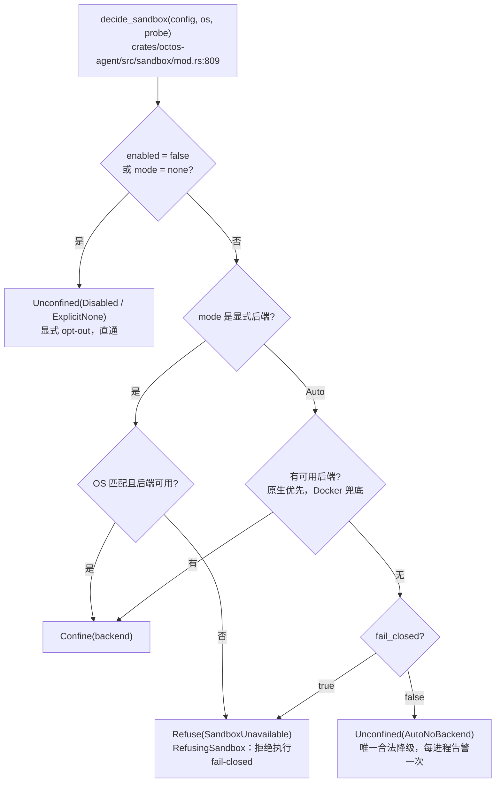
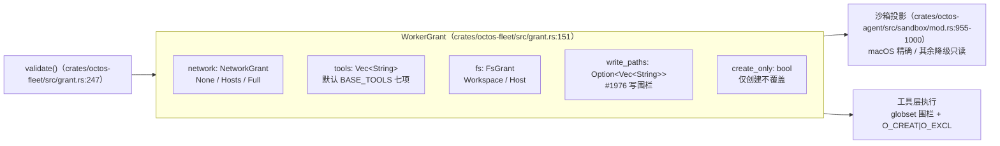

# 第 7 章：安全纵深：沙箱 fail-closed、注入防御与能力授予

> **定位**：本章从纵深防御的视角完整展示 octos 的安全体系：进程沙箱的 fail-closed 语义、命令与派发策略、注入检测与输出脱敏，以及 WorkerGrant 能力授予模型。前置依赖：第 6 章（ToolPolicy 与 deny-wins 语义）。适用场景：需要理解或扩展沙箱后端、为 fleet worker 设计能力授予的读者（B/D 类），以及关心 Agent 安全实践的 AI 应用开发者（C 类）。

## 7.0 本章解决什么问题

Agent 与普通软件的区别在于它执行动作：运行 shell 命令、读写文件、发起网络请求。每一项都是攻击面，而其中 shell 命令最危险，它能触达前两者的全部能力。安全设计因此面临一个具体问题：当操作者要求「命令必须在沙箱里跑」而宿主机上根本没有可用沙箱时，系统应该怎么办？

旧版本的答案是尽力而为：探测不到后端就静默降级为无沙箱直通，命令照跑。这个答案在 2026-08-31 被推翻。`eb7c7221`（PR #2196，14 个文件，+1621/−158）把决策改成了 fail-closed：显式指定的模式无法兑现时拒绝执行，Auto 模式找不到后端时降级照旧但告警响亮。同一时期的 `ffcde205` 收紧了 cargo 授权，`crates/octos-fleet/src/grant.rs` 的 `WorkerGrant` 则把「worker 能做什么」从配置文件变成了带验证的类型。本章按四层展开这套体系：进程沙箱 → 命令与派发策略 → 注入与脱敏 → 能力授予。

先澄清一个容易搞错的 crate 边界。`crates/octos-sandbox/src/main.rs:1` 的文档写着「octos-sandbox: platform sandbox helper binary」：它是一个平台助手二进制，Windows 上创建/复用 AppContainer profile 并在其中启动命令，Linux 上应用 Landlock 文件系统规则加 seccomp 拒绝清单后再 exec，macOS 与其他平台上是 no-op 直通。真正的沙箱子系统在 `crates/octos-agent/src/sandbox/`，下文的引用均使用完整 crates/ 路径。

## 7.1 进程沙箱：七个 impl 与 fail-closed 决策

### 7.1.1 规模与全貌

`crates/octos-agent/src/sandbox/` 目录六个文件合计 5,347 行：

| 文件 | 行数 | 首行文档 |
|---|---:|---|
| `crates/octos-agent/src/sandbox/mod.rs` | 2190 | `//! Sandboxing for shell command execution.` |
| `crates/octos-agent/src/sandbox/macos.rs` | 1767 | `//! macOS sandbox using sandbox-exec.` |
| `crates/octos-agent/src/sandbox/bwrap.rs` | 498 | `//! Linux sandbox using bubblewrap (bwrap).` |
| `crates/octos-agent/src/sandbox/docker.rs` | 392 | `//! Docker container sandbox.` |
| `crates/octos-agent/src/sandbox/windows.rs` | 325 | `//! Windows sandbox using AppContainer via helper binary.` |
| `crates/octos-agent/src/sandbox/landlock.rs` | 175 | `//! Linux container sandbox using the octos-sandbox Landlock/seccomp helper.` |

核心抽象是 `pub trait Sandbox`（`crates/octos-agent/src/sandbox/mod.rs:443`），只有一个必须实现的方法 `wrap_command(&self, shell_command: &str, cwd: &Path) -> Command`：把 shell 命令字符串包装成受限的进程启动。围绕这个 trait 有恰好七个 `impl Sandbox for`：五个真后端加两个哨兵。

| impl 位置 | 类型 | 定位 |
|---|---|---|
| `crates/octos-agent/src/sandbox/bwrap.rs:29` | `BwrapSandbox` | Linux bubblewrap，mount namespace 隔离 |
| `crates/octos-agent/src/sandbox/docker.rs:36` | `DockerSandbox` | Docker 容器隔离，任何 OS 可用 |
| `crates/octos-agent/src/sandbox/landlock.rs:27` | `LinuxContainerSandbox` | 委托 `octos-sandbox` 助手施加 Landlock + seccomp |
| `crates/octos-agent/src/sandbox/macos.rs:185` | `MacosSandbox` | macOS sandbox-exec（SBPL profile） |
| `crates/octos-agent/src/sandbox/windows.rs:46` | `AppContainerSandbox` | 委托 `octos-sandbox.exe` 创建 AppContainer |
| `crates/octos-agent/src/sandbox/mod.rs:500` | `NoSandbox` | 哨兵：直通执行（`sh -c` / `cmd /C`） |
| `crates/octos-agent/src/sandbox/mod.rs:914` | `RefusingSandbox` | 哨兵：拒绝执行，fail-closed 的载体 |

两个哨兵值得注意：`NoSandbox` 不是「没有沙箱」这个概念的名字，而是一个真的类型（`pub struct NoSandbox;` 在 `crates/octos-agent/src/sandbox/mod.rs:498`），`is_noop()` 返回 true 让调用方可以检查；`RefusingSandbox`（`crates/octos-agent/src/sandbox/mod.rs:909` 定义 struct）的 `wrap_command` 永远不执行请求的命令，而是替换成一个打印拒绝文本到 stderr 并 exit 1 的命令。

### 7.1.2 SandboxMode 与 MountMode

配置层由两个枚举驱动。`MountMode`（`crates/octos-agent/src/sandbox/mod.rs:408`）控制 Docker 后端如何挂载 workspace，serde 小写命名，三个变体：`None`（:410，不挂载）、`ReadOnly`（:413，serde 名 `ro`）、`ReadWrite`（:417，默认，serde 名 `rw`）。

`SandboxMode`（`crates/octos-agent/src/sandbox/mod.rs:423`）七个变体：

- `Auto`（:426，默认）：文档注释写明「bwrap on Linux, sandbox-exec on macOS, AppContainer on Windows」
- `Bwrap`（:428）、`Landlock`（:430）、`Macos`（:432）、`Docker`（:434）
- `AppContainer`（:437，serde 名 `appcontainer`）
- `None`（:439）：不沙箱，直通

`Auto` 是唯一「找不到后端可以降级」的模式，其余显式模式都走 fail-closed 拒绝。这个不对称是 7.1.3 的主题。

Auto 的探测序与回退逻辑全在 `decide_sandbox` 的 `SandboxMode::Auto` 分支（`crates/octos-agent/src/sandbox/mod.rs:875-901`）：先按 OS 找原生后端（macOS 查 `sandbox_exec`，Linux 先查 `bwrap` 再查 Landlock 助手，Windows 查 AppContainer 助手），原生全无才用 `docker().then_some(SandboxBackendChoice::Docker)` 兜底，再无则按 `fail_closed` 分流为拒绝或降级。这个顺序有两层考量。原生优先是因为隔离粒度：bwrap/sandbox-exec/AppContainer 直接复用内核机制，无守护进程依赖，失败模式是探测期一次性的；Docker 兜底任何 OS 都可用但依赖守护进程与镜像。探测本身分诚实度两档：`HostBackendProbe`（`crates/octos-agent/src/sandbox/mod.rs:574`）的 `bwrap()` 文档写明「actually runs bwrap, not a PATH scan」，`RealHostProbe` 里它调 `bwrap_works()`（`crates/octos-agent/src/sandbox/mod.rs:1140`）真实跑一次带最小挂载的 bwrap 加 `/bin/true`，验证内核允许当前用户建 namespace；而 `docker()` 只是 `which_exists("docker")` 的 PATH 扫描。Linux 上这个差别尤其重要：unprivileged user namespace 常被发行版关闭，PATH 里有 bwrap 不等于 bwrap 能跑，PATH 式探测会造出一个每次 spawn 都失败的假后端，而「配置了却每次失败」正是 `eb7c7221` 要消灭的那类静默失败。Linux 原生内部 bwrap 优先于 Landlock，两者粒度相近，但 bwrap 不依赖助手二进制，Landlock 探测要等助手应答 `--probe-linux` 才为真。

### 7.1.3 decide_sandbox：纯函数决策与 fail-closed

`eb7c7221` 之前，`create_sandbox` 把 `cfg!` 平台探测与后端构造交织在一起，结果是两个问题：跨平台矩阵没法在开发机上测试（你在 macOS 上测不了 Linux 路径），以及显式模式悄悄降级。重构把决策抽成纯函数 `pub fn decide_sandbox(config, os, probe)`（`crates/octos-agent/src/sandbox/mod.rs:809`）：

```rust
pub fn decide_sandbox(
    config: &SandboxConfig,
    os: HostOs,
    probe: &dyn HostBackendProbe,
) -> SandboxDecision {
```

所有宿主机事实（`HostOs` 是数据枚举，`crates/octos-agent/src/sandbox/mod.rs:534`；后端可用性走 `HostBackendProbe` trait）都以参数传入，每个 OS 的完整矩阵可以从任何开发主机测试。返回 `SandboxDecision`（`crates/octos-agent/src/sandbox/mod.rs:744`）三值：`Confine(SandboxBackendChoice)`、`Unconfined(UnconfinedReason)`、`Refuse(SandboxUnavailable)`。契约直接写在函数文档里（`crates/octos-agent/src/sandbox/mod.rs:800-808`）：

- `enabled = false` 与 `mode = "none"` 是显式 opt-out，直通且优先于 `fail_closed`
- 显式后端模式无法兑现（OS 不对或后端缺失）时拒绝，绝不静默降级为无隔离
- `Auto` 选最佳可用后端（原生优先，Docker 兜底）；全无时降级为直通但要告警；`fail_closed` 可把降级变成拒绝

`UnconfinedReason`（`crates/octos-agent/src/sandbox/mod.rs:664`）区分三种直通原因：`Disabled`（`--danger-full-access` 设置的显式 opt-out）、`ExplicitNone`（`mode="none"`）、`AutoNoBackend`（Auto 全无后端，唯一合法的降级）。`SandboxUnavailable`（`crates/octos-agent/src/sandbox/mod.rs:694`）是类型化的拒绝理由，携带 `requested`、`reason` 和 per-OS 的 `remediation` 块（`remediation_for` 在 `crates/octos-agent/src/sandbox/mod.rs:754`，按 OS 给安装建议）。

拒绝如何到达用户分两个受众，这是 #2196 review 的 MUST-FIX：`Display` 实现面向模型，写明「Shell/exec commands will keep refusing until then」；操作者修复建议只进日志和 `octos doctor`，不进模型上下文。`stderr_line()`（`crates/octos-agent/src/sandbox/mod.rs:724`）把拒绝文本过滤到只剩 `[A-Za-z0-9 ./:_=,-]`，确保嵌入 `sh -c 'echo ... >&2; exit 1'` 时不可能被引号逃逸重新变成命令执行。

fail-closed 的执行还有一条更早的短路路径。exec 形态的工具在 spawn 之前先查 `refusal()`：`crates/octos-agent/src/tools/shell.rs:1069` 与 `crates/octos-agent/src/tools/coding_tools.rs:501`、`:625`、`:2068` 都是 `if let Some(refusal) = self.sandbox.refusal()` 开头，命中就直接把模型侧拒绝文本作为工具结果返回，连子进程都不起。也就是说 `RefusingSandbox` 的 `wrap_command`（`crates/octos-agent/src/sandbox/mod.rs:914` 起的 impl）只是兜底：真正到达它的命令（例如经第三方调用点直接拿 `Box<dyn Sandbox>` 包装的）才会走 echo 加 exit 1 的替身命令。两层设计的分工是，工具层短路保证模型看到可读的拒绝而非一条 exit 1 的裸输出，trait 层兜底保证任何调用点都不可能把命令无沙箱跑出去。

这个改动的工程动机值得展开。`eb7c7221` 之前的行为由 `crates/octos-agent/src/sandbox/mod.rs:524-528` 的重构注释记录在案：`create_sandbox` 把 `cfg!` 门控的探测与后端构造交织在一起，导致「两个显式模式静默降级为无隔离」。具体场景是操作者在 CI 或 fleet 配置里写死 `sandbox.mode = "bwrap"`，宿主机没装 bwrap，命令照跑无沙箱，唯一的线索是启动日志里一行容易淹没的 warn。故障模式有三个叠加属性使它必须修：配置表达了隔离意图而被覆盖（fail-open）；覆盖不可见（用户以为有沙箱）；行为矩阵不可测（`cfg!` 编译期分派意味着 macOS 开发机上根本没有 Linux 的代码路径，回归只能靠真实 Linux CI 撞出来）。`decide_sandbox` 把三类事实全部参数化（配置、`HostOs`、probe），一次重构同时解决三个：显式模式不可兑现返回 `Refuse`，拒绝对操作者可见且带修复建议，全平台矩阵可以在任何开发机的单元测试里穷举。

`create_sandbox`（`crates/octos-agent/src/sandbox/mod.rs:1005`）是决策到后端的投影：`Confine` 构造后端，`Unconfined` 返回 `NoSandbox` 并按原因记日志（`AutoNoBackend` 走 `warn_auto_unconfined_once`，`crates/octos-agent/src/sandbox/mod.rs:1039`，`std::sync::Once` 保证每进程只告警一次），`Refuse` 返回 `RefusingSandbox`。签名保持不可失败，大量构造点不用改；但结果上的每条命令都会带着类型化的 `SandboxUnavailable` 拒绝。



**图 7-1：SandboxMode 解析与 fail-closed 决策流。** 显式模式不可兑现必然拒绝；只有 Auto 找不到后端才可能降级为直通。

### 7.1.4 五个后端各自的实现要点

bwrap（Linux）：`wrap_command` 的顺序是：清掉 `BLOCKED_ENV_VARS` → `--ro-bind` 只读挂 `/usr`、`/lib`、`/lib64`、`/bin`、`/sbin`、`/etc` → `--tmpfs /tmp` 和 `--tmpfs /var/tmp`（先于 workspace bind，防止 workspace 在 /tmp 下时被 tmpfs 语义反噬）→ workspace `--bind` 或 `--ro-bind`（取决于 `workspace_write`）→ 可选的 `.git` 定向 rw bind（`repo_git_write`）→ `--dev`、`--proc` → `!allow_network` 时 `--unshare-net` → `--unshare-pid`、`--die-with-parent`。`repo_git_write` 的注释写得很清楚：这是窄授权，只 bind `<repo>/.git`，绝不 bind 整个 `/`，因为后者会把 `SSH_AUTH_SOCK`、`docker.sock` 这类宿主 AF_UNIX socket 暴露给沙箱内进程（`crates/octos-agent/src/sandbox/bwrap.rs:17-26` 的字段文档）。

Landlock（Linux）：`crates/octos-agent/src/sandbox/landlock.rs:27` 的 `LinuxContainerSandbox` 不自己施加任何限制，全部委托给 `octos-sandbox` 助手进程，让 Landlock 与 seccomp 的设置发生在 exec shell 之前。找不到助手时不是降级而是拒绝：构造一条 `echo 'sandbox error: octos-sandbox helper not found' >&2; exit 1` 命令（`crates/octos-agent/src/sandbox/landlock.rs:31-39`）。

macOS sandbox-exec：最厚的后端（1,767 行），生成 SBPL（sandbox profile 语言）profile。注入防御在 `crates/octos-agent/src/sandbox/macos.rs:205-212`：cwd 含控制字符或 SBPL 元字符（`(`、`)`、`\`、`"`）时直接拒绝执行，因为路径已验证不含引号，后续拼接无需转义。macOS 也是唯一能精确表达 #1976 写围栏的后端：每个 glob 变成一条 `(allow file-write* (regex ...))` 规则（`build_backend` 的注释，`crates/octos-agent/src/sandbox/mod.rs:1081-1085`）。

Docker：跨平台兜底。按 `MountMode` 挂 workspace（`ReadWrite` → `-v cwd:/workspace`，`ReadOnly` → 加 `:ro`，`None` → 不挂），支持 CPU/内存限制。`is_blocked_bind_source`（`crates/octos-agent/src/sandbox/docker.rs:20-30`）拒绝把 `docker.sock`、`/etc`、`/proc`、`/sys`、`/dev` 作为 bind source，cwd 命中危险源时整个命令拒绝执行。

AppContainer（Windows）：`crates/octos-agent/src/sandbox/windows.rs:46` 委托 `octos-sandbox.exe` 创建/复用 AppContainer profile。每个 octos profile 有自己的 AppContainer SID，提供默认拒绝的文件系统访问与可配置的网络隔离。

### 7.1.5 环境变量清理

所有后端共享 `BLOCKED_ENV_VARS`（从 `octos-core` 转发，`crates/octos-agent/src/sandbox/mod.rs:33`），一个 18 项的清单，按注入面分组：Linux 动态库注入（`LD_PRELOAD` 等 3 项）、macOS dylib 注入（`DYLD_*` 5 项）、运行时代码注入（`NODE_OPTIONS`、`PYTHONSTARTUP` 等 7 项）、shell 启动注入（`BASH_ENV`、`ENV`、`ZDOTDIR` 3 项）。清单的执行点因后端而异：bwrap、Landlock、macOS（`crates/octos-agent/src/sandbox/macos.rs:478`）与 Windows（`crates/octos-agent/src/sandbox/windows.rs:90`、`:139`）都会逐项 `env_remove`；Docker 后端反而一处不清理，容器隔离本身承担了环境隔离。

### 7.1.6 cargo 授权：从尽力写到 lock-only

`ffcde205`（4 个文件，+140/−82）解决的是编码 agent 的一个实际矛盾：沙箱把写权限收得越紧，`cargo build` 越容易死在编译之前。修复后的策略是默认 lock-only：可写集仅 `~/.cargo/.package-cache`（锁文件所需），registry index/cache/src、git checkout、rustup 安装全部只读；只有配置 `allow_network` 时才补上下载所需的写权限与网络。配套的 `allow_toolchains` 字段（`crates/octos-agent/src/sandbox/mod.rs:149`）默认 true，授予工具链运转必需的少量写路径，但 `~/.cargo/bin`（PATH 上的可写 shim 等于持久化后门）与 `~/.rustup/toolchains`（可写编译器二进制）明确不授。deny-wins 在这里同样生效：只读 workspace 或 #1976 写围栏会整体压制这些授予。

> **工程决策侧栏：为什么放弃「尽力而为的沙箱」**
>
> 旧语义下，操作者写 `sandbox.mode = "bwrap"`，宿主机上没有 bwrap，结果是命令无沙箱照跑。从安全角度这是 fail-open：配置表达了隔离意图，系统用「能跑就行」覆盖了它。问题在于这条路径不可见，用户以为有沙箱。`eb7c7221` 的取舍是：显式模式不可兑现就拒绝执行，把矛盾暴露给操作者（附 per-OS 修复建议与 `octos doctor` 入口）；Auto 保持降级（「最佳可用」本就是它的契约）但每进程告警一次，并提供 `sandbox.fail_closed` 开关把降级也变成拒绝。代价是可用性：装错环境的用户会看到命令全部拒绝。团队接受这个代价，理由是拒绝文本本身可操作，而静默无沙箱不可修复。

## 7.2 命令与派发策略：每条路径都有门

沙箱管「命令在什么环境里跑」，策略层管「命令/工具能不能跑」。

`crates/octos-agent/src/policy.rs`（746 行）：命令审批策略。`Decision`（`crates/octos-agent/src/policy.rs:16`）三值 `Allow / Deny / Ask`，`ApprovalPolicy`（:28）决定 `Ask` 在无人值守时是弹审批还是直接失败（`Never`），`FilesystemScope`（:46）的 `Workspace / Host` 二值在 7.4 节的 grant 模型里会再次出现。ShellTool 的 SafePolicy（危险命令拒绝、whitespace 归一化、词边界检测）在第 6 章已展开，这里不重复；本章强调的是它明确自称「不是安全边界」，真正的边界是本节的沙箱与下一节的脱敏。

`crates/octos-agent/src/dispatch_policy.rs`（566 行）：MCP-agent 派发前策略门。模块文档（`crates/octos-agent/src/dispatch_policy.rs:1-10`）记录了它的来历：#714 之前 `SpawnTool` 的 `agent_mcp` 分支直接派发，完全绕过策略，哪怕 `octos serve` 在 swarm 侧装了门。把门提到本 crate 让两个调用点（`SpawnTool::agent_mcp` 分支与 `octos_swarm::Swarm` 派发器）执行同一形状的检查：工具策略、审批、sandbox-required、env 允许/拒绝清单。每个失败产生带稳定标签的 `GateDenial`（`crates/octos-agent/src/dispatch_policy.rs:253`，`last_dispatch_outcome` 字段），其中 `approval_unavailable`（需要审批但没有接审批器）与 `sandbox_required`（策略要求沙箱后端但后端不自报沙箱）都 fail-closed，不落空到派发。

`crates/octos-agent/src/permissions.rs`（167 行）：机器人工具的监督安全分级。`SafetyTier`（`crates/octos-agent/src/permissions.rs:19`）四级从低到高 `Observe < SafeMotion < FullActuation < EmergencyOverride`，通过 `ToolPolicy` 的 `group:robot:<tier>` 分组执行而非独立 trait 方法。物理世界的风险分级与本章的数字沙箱共用同一套 deny-wins 机制，此处一段带过。

为什么这扇门长成这样，设计判据有三条，全部写在 `crates/octos-agent/src/dispatch_policy.rs` 自身的文档里。判据一，门必须共享而不是复制：模块文档（`:1-10`）记录了 #714 之前的旁路，`SpawnTool` 的 `agent_mcp` 分支直接派发，`octos serve` 在 swarm 侧装了门也拦不住；把门提进 `octos-agent` crate，两个调用点对同一组共享类型（`ToolPolicy`、`ToolApprovalRequester`、`McpAgentBackend`）执行同一形状检查，将来出现第三个派发点时没有「自己再写一套检查」这个选项。判据二，默认 no-op、生产显式装配：`DispatchPolicy`（`:121`）每个门独立可选，全默认值时 `is_noop()`（`:175`）为真、派发行为与旧版逐字节一致，这是为了不回归既有调用方；生产构造器 `from_agent_gates`（`:223`）则刻意只继承 #701 审计点名的两道门（工作区级工具名策略与 `BLOCKED_ENV_VARS` 注入环境拒绝清单），审批桥与 sandbox-required 故意不镜像，理由写在构造器 rustdoc（`:197` 起）：原生审批桥 `TOOL_APPROVAL_CTX` 是 per-turn task-local，服务器启动时没有可克隆的全局请求器；尚无 MCP 后端自报沙箱，`require_sandboxed` 只是为前向兼容保留（`:150-152`），今日置真等于每次派发都 fail-closed。判据三，门序固定且失败可观测：`enforce_dispatch_gates` 的文档（`:285` 起）规定检查顺序为 sandbox-required（纯配置，最便宜）→ 工具策略 → env 拒绝清单 → env 允许清单 → 审批（唯一可能阻塞等人的，放最后），拒绝清单先于允许清单是防宽松允许清单放过已知坏键（`:144-146`）；每道失败产生带稳定标签的 `GateDenial`（`:253`，五个标签枚举在字段文档里），调用方把它折进自己的 outcome 形状，本 crate 对外的 API 面因此只是门语义，不是又一套失败类型。

## 7.3 注入检测与输出脱敏

### 7.3.1 prompt_guard：明文注入的检测层

`crates/octos-agent/src/prompt_guard.rs`（772 行）扫描工具输出与用户消息中的注入模式。`ThreatKind`（`crates/octos-agent/src/prompt_guard.rs:29`）五类：`SystemOverride`（覆盖系统提示）、`RoleConfusion`（「System: you are now...」式角色混淆）、`ToolCallInjection`（注入工具调用 JSON/XML）、`SecretExtraction`（套取系统提示或密钥）、`InstructionInjection`（「you must / always respond with」式通用指令注入）。入口 `pub fn scan(text)` 在 :195。

这个模块的文档（`crates/octos-agent/src/prompt_guard.rs:5-19`）第一句就自我定位：「**Not a security boundary.**」它用正则匹配朴素明文注入，可被 base64 编码、URL 编码、HTML 实体、Unicode 同形字、零宽字符、RTL 覆盖字符绕过，这些都记录在测试套件里作为已知局限。真正的缓解是架构性的：沙箱隔离保证不管 prompt 状态如何工具层损害有限，工具策略限制可调用的工具集，human-in-the-loop（`before_tool_call` hook exit 1）拦截高影响动作待人工批准。prompt_guard 提供的是日志与尽力脱敏这层额外防线，不是前三者的替代品。

### 7.3.2 sanitize：工具输出进上下文前的清洗

`crates/octos-agent/src/sanitize.rs`（245 行）的 `sanitize_tool_output`（:90）在工具结果回喂 LLM 前剥掉三类内容。噪声类：base64 data URI（`data:...;base64,<64+ 字符>`，:13）与 64 位以上连续 hex（SHA-256、原始密钥，:16），目的是省上下文。凭据类七个正则：OpenAI（`sk-` 前缀，:24）、Anthropic（`sk-ant-`）、AWS（`AKIA` + 16 位大写）、GitHub（`ghp_`/`gho_`/`ghs_`/`ghr_`/`github_pat_`）、GitLab（`glpat-`）、Bearer token、以及通用赋值模式（`password|secret|api_key|... = "..."`）。`redact_credential`（:55）保留前 4 个可见字符加 `[credential-redacted]` 标记，兼顾可辨识与不泄漏。`scrub_credentials`（:62）的注释强调顺序：Anthropic 先于 OpenAI 处理，避免 `sk-ant-...` 被 `sk-` 规则截断匹配。

### 7.3.3 SSRF：网络工具的入口检查

`crates/octos-agent/src/tools/ssrf.rs`（620 行）被 `web_fetch` 与 `browser` 两个工具共享。`check_ssrf_with_addrs`（:24）的流程：解析 URL → `is_private_host`（:228）拦 `localhost` 与字面私有 IP → 域名走 DNS 解析，答案集经 `validate_answer_set`（:69）做 DNS pinning（防 rebinding：校验时解析到的地址绑定到实际抓取，TOCTOU 不复存在）。DNS 失败 fail-closed 当作阻断处理，注释写明原因：攻击者可以让校验时 DNS 失败、抓取时成功。

`is_private_ip`（:258）的范围清单超出 std 谓词：IPv4 除 `is_private`/`is_link_local`/`is_loopback`/`is_unspecified` 外，`is_special_purpose_v4`（:244）显式匹配 std 夜行版才有的段：CGNAT 100.64.0.0/10（运营商级 NAT）、192.0.0.0/24（IETF 协议分配）、198.18.0.0/15（基准测试）、224.0.0.0/4（组播）与 240.0.0.0/4（保留）。IPv6 覆盖 loopback、`::`、组播、ULA `fc00::/7`、链路本地 `fe80::/10`、废弃的站点本地 `fec0::/10`，以及两条映射规则：IPv4-mapped `::ffff:x.x.x.x` 递归回 IPv4 检查，IPv4-compatible `::x.x.x.x` 同样处理。漏掉映射规则是经典绕过，测试里有专门用例（:580、:590）。

prompt_guard 与 sanitize 的分工边界值得单独说清：两个模块都在「输出进上下文之前」动手，但管的对象不同。`crates/octos-agent/src/prompt_guard.rs` 管指令，即文本里是否有人试图操纵模型的下一步行为；`crates/octos-agent/src/sanitize.rs` 管物质，即文本里是否携带不该回喂的字节（凭据、base64 data URI、长 hex）。分工的接点在 `sanitize_tool_output`（`crates/octos-agent/src/sanitize.rs:90-94`）：流水线依次替换 data URI、长 hex、七类凭据，最后一步调用 `prompt_guard::sanitize_injection`，注入 defang 因此是清洗流水线的末段而不是一条独立通道；执行侧的调用点是 `crates/octos-agent/src/agent/execution.rs:2414`，每条工具结果在截断之后、回喂模型之前统一过这一道，单点漏斗意味着绕过清洗需要绕过整个执行层，而不是挑某个不设防的工具。检测粒度同样分层：`scan`（`crates/octos-agent/src/prompt_guard.rs:195`）产出带 `Severity` 三档（`:56`，Low/Medium/High）的 `Threat` 列表，Low 只记日志，Medium 起才动手脱敏（`sanitize_injection` 内部按 `severity >= Medium` 过滤，`:262`），替换按 span 逆序进行以保住字节偏移（`:270` 起）。这套阈值承认的是正则检测的误报成本：宁可只对中高置信度动手，把「检测不到的情形」明确留给架构性控制（沙箱、工具策略、human-in-the-loop），与模块文档第一句「Not a security boundary」的自我定位一致。两个模块都是纵深里的额外一层，不是边界本身。

## 7.4 WorkerGrant：能力授予的类型化

前三层防御都在「限制」侧。fleet 架构（第 16 章讲装配）还需要反向的能力：master 派任务给 worker 时，如何精确表达「这个 worker 可以用网络、只能写这三个路径」？答案是 `crates/octos-fleet/src/grant.rs`（714 行）的 `WorkerGrant`，一个带验证的类型，而不是散落的配置项。

### 7.4.1 三个粒度轴

`NetworkGrant`（`crates/octos-fleet/src/grant.rs:76`）三值：`None`（默认，零网络）、`Hosts(Vec<String>)`（按主机允许表）、`Full`（原始出网全开）。关键语义在方法注释里：`allows_raw_egress` 仅对 `Full` 为真，`Hosts` 刻意保持原始出网关闭，它的许可完全通过被授予的 web 工具按主机允许表实现，shell 永远 `curl` 不到允许表之外。文档同时坦承 v1 局限：原始网络是全有或全无，按主机过滤原始流量需要内核级 egress proxy，`Hosts` 只覆盖 web 工具的 HTTP(S)，这是记录在案的未解问题。

`FsGrant`（`crates/octos-fleet/src/grant.rs:127`）刻意粗粒度：`Workspace`（默认，仅 worker 自己的尝试目录可读写）或 `Host`（全盘读写，须操作者显式授予）。v1 不做按路径的文件系统允许表，所以诚实的授予也是二值的。

`WorkerGrant`（`crates/octos-fleet/src/grant.rs:151`）五个字段把这些轴组装成一个可序列化、可验证的整体：

```rust
pub struct WorkerGrant {
    #[serde(default)]
    pub network: NetworkGrant,        // :154，默认 None
    #[serde(default = "base_tools_vec")]
    pub tools: Vec<String>,           // :157，默认 BASE_TOOLS 七项
    #[serde(default)]
    pub fs: FsGrant,                  // :160，默认 Workspace
    #[serde(default, skip_serializing_if = "Option::is_none")]
    pub write_paths: Option<Vec<String>>, // :179，#1976 写围栏
    #[serde(default, skip_serializing_if = "core::ops::Not::not")]
    pub create_only: bool,            // :189，仅创建不覆盖
}
```

每个字段的 `#[serde(default)]` 有一层设计：grant 出现之前持久化的旧任务（或什么都没指定的 master）加载为 `WorkerGrant::minimal()`，最小权限是默认值，旧记录无需 schema 升级就可读。`skip_serializing_if` 让无围栏的 grant 序列化出与 pre-#1976 逐字节相同的形状，旧读者读新记录看不到新键。

五个字段不是随手凑的，每一条对应一类必须显式回答的授权问题，缺一个就留一个默认放行的洞。没有 `network`，web 工具与 shell 的出网能力无法区分，「不给网络」无处表达，`WEB_TOOLS` 只能授予或整体禁用；没有 `tools`，注册表形状就只能全有或全无，`sorted_tools()` 这个审计键（「操作者授予了什么，一个不多」）没有存在基础；没有 `fs`，workspace 与 host 的文件系统边界退回隐式的 cwd 约定，`FsGrant::Host` 这种操作者的显式信任决定无处落笔；没有 `write_paths`，#1976 之前「worker 只能写这几个文件」只能靠 `workspace_write` 二值粗调，要么全 workspace 可写要么全只读；没有 `create_only`，「创建可以、覆盖不行」这个防篡改语义（重放安全的关注点）在类型上不可表达。反过来，字段也只有这五个：v1 刻意不做按主机的原始网络过滤（需要内核级 egress proxy）、不做文件系统的任意 ACL（工具层没有对应机制，grant 诚实反映它能执行的范围）。字段集合等于「两层执行机制都能兑现的授权问题」的精确并集，多一个是撒谎，少一个是漏洞。

### 7.4.2 #1976 写围栏：三层语义

`write_paths` 是 issue 1976 引入的按路径写围栏，三种取值各有语义：

- `None`（默认）：无围栏，二值 `fs` 独自管辖写权限，行为与 pre-#1976 worker 逐字节一致
- `Some(vec![])`：一致的只读围栏，workspace 内什么都不能写
- `Some(列表)`：列表内可写，workspace 其余部分只读

v1 模式语法刻意收窄：workspace 相对路径、`/` 分隔、段内 `*`（任意字符）与 `?`（单字符）通配，没有 `**`、`[...]`、`{...}`。原因写在字段文档里：这个语法是工具层匹配器（globset，`literal_separator`）与沙箱翻译（SBPL regex）能完全相同表达的交集，两层对「授予了什么」永远不可能产生分歧。`validate_write_path_pattern`（`crates/octos-fleet/src/grant.rs:307`）逐条拒绝绝对路径、`..`、控制字节、SBPL 元字符、`:`（Docker mount 分隔符/Windows 盘符）与两类通配语法。

`create_only: true` 表示允许表内的路径只能创建不能覆盖/编辑/删除（文件工具层的 `O_CREAT|O_EXCL` 语义；`edit_file` 无论是否在表内都直接拒绝）。沙箱层只能执行路径围栏，没有 OS 后端能区分创建与覆盖，所以 create_only 的不覆盖一半由工具层执行，这是文档写明的降级。

围栏下各后端的 shell 侧表达不一，deny-wins 保证没有后端放宽围栏（`crates/octos-agent/src/sandbox/mod.rs:955-1000` 三个函数）：macOS 精确表达（per-glob SBPL regex）；bwrap/Landlock/AppContainer 无法表达按 glob 的 shell 写，workspace 对 shell 整体降为只读，授予路径仅通过受围栏的文件工具保持可写（`fence_degraded_workspace_write`，:955，构造时告警一次）；Docker 同理挂 `:ro`（`fence_degraded_docker`，:970）；解析结果是无沙箱时告警 shell 围栏完全未执行（`warn_fence_unenforced`）。



**图 7-2：WorkerGrant 结构与两个执行层。**

### 7.4.3 validate：把不一致挡在解析时

`WorkerGrant::validate`（`crates/octos-fleet/src/grant.rs:247`）拒绝五类不一致，每类对应 `GrantError`（`crates/octos-fleet/src/grant.rs:359`）一个变体：

- `UnknownTool`：授予的工具有不在 `GRANTABLE_TOOLS` 目录里的（操作者不能授予宿主构建不出的工具）
- `WebToolWithoutNetwork`：`NetworkGrant::None` 下授予 `web_fetch`/`web_search`（无网络的网络工具）
- `EmptyHostAllowlist`：`Hosts(vec![])` 空允许表。注释点名这是 fail-open 陷阱：空表绝不能读作「无限制」，操作者没列主机就是 `None`
- #1976 四连：`WritePathsWithHostFs`（围栏配 `fs: Host` 不一致，Host 让 shell 够得着围栏禁止的一切，deny-wins 直接拒）、`CreateOnlyWithoutWritePaths`（无表可应用）、`EmptyWritePathsWithCreateOnly`（空表加 create_only 等于授予创建无）、`InvalidWritePath { pattern, reason }`（语法外模式）

validate 在两个时点调用：master 的 `goal_plan` 解析时，以及防御性地在 registry 构建时。与第 6 章 `crates/octos-agent/src/tools/write_grant.rs` 的关系：第 6 章讲了单工具的参数级写授权，本章的 `WorkerGrant` 是 worker 级的整体授予模型；fleet 如何把这个 grant 装配成封闭工具注册表与沙箱配置，详见第 16 章。

> **工程决策侧栏：为什么 grant 是类型而不是配置约定**
>
> 「worker 能做什么」如果只是若干独立配置项（一个网络布尔、一个工具列表、一个路径列表），不一致组合要到运行时才暴露，甚至永远不暴露（空允许表被读成无限制就是实例）。`WorkerGrant` 把五轴收进一个 struct，`validate` 把跨字段不一致在解析时类型化拒绝，`GrantError` 七个变体每个都能直接转成给操作者的错误消息。`minimal()` 作为 serde 默认值把最小权限变成无需声明的基线，旧记录自动落入。代价是新增能力要同时扩 `GRANTABLE_TOOLS` 目录、validate 规则与错误变体，三处必须同步；换来的是「授予了什么」在序列化形状、注册表审计键（`sorted_tools`）与错误消息三处始终一致。

## 7.5 本章回顾

本章沿四层展示了 octos 的安全纵深。进程沙箱层：`crates/octos-agent/src/sandbox/` 六文件 5,347 行、七个 `impl Sandbox for`（五后端加 `NoSandbox`/`RefusingSandbox` 两哨兵），`decide_sandbox` 纯函数（`crates/octos-agent/src/sandbox/mod.rs:809`）执行 fail-closed 契约，显式模式不可兑现即拒绝，Auto 降级告警一次且可用 `fail_closed` 升级为拒绝。策略层：`crates/octos-agent/src/policy.rs` 的命令审批、`crates/octos-agent/src/dispatch_policy.rs` 补上 MCP 派发旁路（#714）、`crates/octos-agent/src/permissions.rs` 的机器人安全分级。注入与脱敏层：`crates/octos-agent/src/prompt_guard.rs` 自认非安全边界的明文检测、`crates/octos-agent/src/sanitize.rs` 的七凭据正则与 DNS pinning 的 SSRF 检查。能力层：`WorkerGrant` 五字段（network/tools/fs/write_paths/create_only）配 `validate` 的五类不一致拒绝，#1976 写围栏经沙箱投影与工具层双层执行。

贯穿全章的一条线是 deny-wins 与 fail-closed 在每一层的重复出现：工具策略 deny 优先于 allow（第 6 章），沙箱显式模式不可兑现拒绝而非降级，空允许表拒绝而非读作无限制，围栏配 Host fs 拒绝而非取宽者。同一原则在四个抽象层级上的相同形状，比任何单点的强度更能说明这套体系的设计一致性。

## 延伸阅读

- Landlock 文档与 seccomp BPF 手册（`man 2 seccomp`）：`crates/octos-agent/src/sandbox/landlock.rs` 委托助手所施加的两类内核机制
- Apple Sandbox Guide（SBPL 参考）：`crates/octos-agent/src/sandbox/macos.rs` 生成 profile 的语言
- bubblewrap 项目文档：`crates/octos-agent/src/sandbox/bwrap.rs` 使用的 mount namespace 与 `--die-with-parent` 语义
- OWASP SSRF Prevention Cheat Sheet：`crates/octos-agent/src/tools/ssrf.rs` 阻断范围清单的对照参考
- issue #1976 与 PR #2196（`eb7c7221`）、`ffcde205` 的 commit message：本章三个主线的原始讨论

## 思考题

1. `decide_sandbox` 为什么把 `HostOs` 与后端探测做成参数而不是在函数内读环境？如果 probe 是真实全局的，哪个质量属性先坏掉？
2. `RefusingSandbox` 的 `wrap_command` 仍然构造一条真的 shell 命令（echo 拒绝文本并 exit 1），而不是返回错误。保持 `Sandbox` trait 签名不可失败带来了什么好处？exec 形态工具经 `refusal()` 短路又解决了这个设计的哪个剩余问题？
3. `NetworkGrant::Hosts` 刻意不让 shell 获得原始出网，许可全部经 web 工具的允许表实现。如果 v2 要支持「git 只能 clone 允许表内的主机」，需要什么基础设施？
4. `validate` 把「`Hosts` 空允许表」列为错误而不是等价于 `None`。从操作者心理模型出发论证或反驳这个选择。
5. bwrap 后端在 #1976 围栏下把 workspace 对 shell 降为只读（授予路径仅文件工具可写）。一个只能用 shell 工具完成任务的 worker 在围栏下会遇到什么？这个降级是设计缺陷还是合理取舍？

## 版本演化说明

本章分析基线为 octos main @ `9c157101`（2026-09-02 提交）。主线变化：`eb7c7221`（2026-08-31，PR #2196，14 个文件）引入显式模式 fail-closed 与 Auto 降级告警，并把沙箱决策重构为纯函数 `decide_sandbox`；`ffcde205`（2026-08-26，4 个文件）将 cargo 授权默认收紧为 lock-only、下载经 `allow_network` 门控；issue #1976 引入 `WorkerGrant` 按路径写围栏与 `create_only`。行号与文件行数均以此基准实测，事实来源为 `assets/ch07-facts.md` 事实表。
