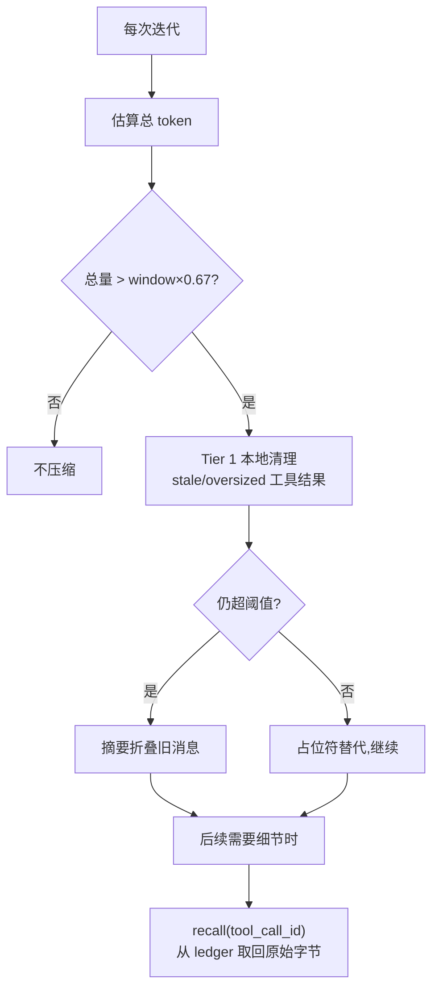
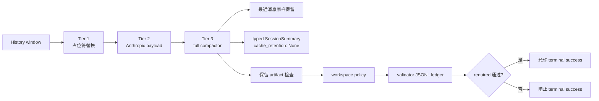

# 第 8 章：上下文管理：让 Agent 在有限窗口中高效工作

> **定位**：本章展示 octos 如何通过上下文压缩（compaction）、recall 重物化、分层压缩面（tiered compaction）、保真度分级（fidelity）、提示层构建（prompt layer）、steering 与系统提示防篡改（prompt guard），在有限的 LLM 上下文窗口中高效工作。前置依赖：第 5 章（`CompactAndRetry` 触发点）。适用场景：需要理解或调优 Agent 上下文策略的开发者。

LLM 的上下文窗口是稀缺资源。一个 200K token 的窗口，在十几次工具迭代后就可能耗尽：每次调用的参数和结果都在累积，一次 `read_file` 的输出可能就占数千 token。窗口接近满时只有两条路，停止任务，或压缩历史。octos 选择压缩，但当前主分支的答案已经从单一摘要函数演进成一套体系：先分层削减（本地占位符、服务端清理、完整摘要三档），再折叠旧消息，压缩掉的输出还能通过 recall 工具凭 id 重新取回。本章沿这条主线展开，并覆盖支撑它的提示层构建、steering 注入与工具输出防篡改。

---

## 8.1 Context Compaction：80% 阈值加 recall 的双机制

### 8.1.1 触发条件与安全边际

legacy 触发路径在 `trim_to_context_window()`（[`../octos/crates/octos-agent/src/agent/compaction.rs:11-60`]）。预算公式（[`../octos/crates/octos-agent/src/agent/compaction.rs:25`]）：

```rust
let window = self.llm.context_window();
let budget = (window as f64 * 0.8 / crate::compaction::SAFETY_MARGIN) as u32;
```

`SAFETY_MARGIN = 1.2`（[`../octos/crates/octos-agent/src/compaction.rs:45`]）。实际预算是 `window * 0.8 / 1.2 ≈ window * 67%`：一边预留 20% 给新一轮对话，一边为 token 估算误差再留缓冲。128K 窗口的模型，触发点约在 85K tokens。总量低于预算就直接返回，不动历史。

### 8.1.2 保留边界：最近六条与工具组完整性

`find_recent_boundary()`（[`../octos/crates/octos-agent/src/compaction.rs:68-89`]）从最后一条消息向前扫描，决定哪些消息原样保留：

```rust
for i in (1..messages.len()).rev() {
    let msg_tokens = estimate_message_tokens(&messages[i]);
    count += 1;
    if count >= MIN_RECENT_MESSAGES
        && system_tokens + recent_tokens + msg_tokens > budget / 2
    {
        break;
    }
    recent_tokens += msg_tokens;
    split = i;
}
while split > 1 && messages[split].role == MessageRole::Tool {
    split -= 1;
}
```

`MIN_RECENT_MESSAGES = 6`（[`../octos/crates/octos-agent/src/compaction.rs:48`]）。最近消息无条件保留满六条，同时不允许超过预算的一半，给旧消息的摘要留出空间。末尾的 `while` 回退保证切割点不落在 Tool 消息上：Assistant 与 Tool 的配对组一旦拆开，孤立的 Tool 消息会让 provider 校验失败或让模型困惑。

### 8.1.3 提取式摘要：参数剥离与首行截取

旧消息交给 `compact_messages()`（[`../octos/crates/octos-agent/src/compaction.rs:99-153`]），逐条经 `summarize_message()`（[`../octos/crates/octos-agent/src/compaction.rs:155-201`]）压成一行。压缩比最高的是**工具参数剥离**：一次 `write_file` 调用的参数可能包含整份文件内容，上千 token，压缩后只剩 `- Called write_file`，约五个 token，压缩比接近 200:1。这个设计还有一个安全副作用：工具参数是不受信输入，剥掉它意味着压缩摘要里不会残留恶意 payload 的原文。

各消息角色的处理规则：

| 消息类型 | 摘要形态 |
|---------|---------|
| User | `> User: {首行}`，带媒体时附 `[media omitted]` |
| Assistant（有工具调用） | `- Called {工具名}` 列表 |
| Assistant（纯文本） | `> Assistant: {首行}` |
| Tool 结果 | `-> {工具名}: {ok/error} - {输出前 100 字符}` |
| System | `> Context: {首行}` |

工具结果的 ok/error 判定很朴素：内容以 `Error:` 开头即视为失败（[`../octos/crates/octos-agent/src/compaction.rs:180-188`]）。`find_tool_name()`（[`../octos/crates/octos-agent/src/compaction.rs:219-234`]）从上下文反查 tool_call_id 对应的工具名，查不到时降级为 `unknown_tool`。首行截取的理由是信息密度：LLM 的回复通常以结论开头，首行携带最高的语义密度。`first_line()`（[`../octos/crates/octos-agent/src/compaction.rs:203-216`]）按 UTF-8 字符边界截断，不会把一个汉字切成两半。摘要目标占预算的 40%（`BASE_CHUNK_RATIO`，[`../octos/crates/octos-agent/src/compaction.rs:51`]），超出后停止逐条展开，剩余消息记为 `... (N earlier messages omitted)`。

一个容易被漏掉的细节：`compact_messages` 会先把最新的 plan 快照从预算里扣除（#2132），保证保留块不会把摘要顶出预算上界（[`../octos/crates/octos-agent/src/compaction.rs:104-114`]）。注释里写得很清楚：这个扣除发生在生产者内部，AppUI、session actor、legacy agent channel、summarizer tiers 所有压缩路径自动继承，不需要逐点接线。

如果最近消息本身已超预算，代码退回 `fallback_truncate()` 尾部截断（[`../octos/crates/octos-agent/src/agent/compaction.rs:319-358`]）：从尾部向前保留能放下的消息，至少留两条非系统消息，同样避免拆开工具组。压缩的语义是「能摘要就摘要，放不下才截断」，摘要优先但不是无条件。

### 8.1.4 recall：压缩之后重新物化

以上机制有一个固有代价：被压缩的输出不可逆。#2131 观测到的病态是同一个源文件被反复读取 66 次，每次读取的结果进窗口、被截断、被压缩、再被读取。`e312e4c1`（2026-08-27 合入）补上了恢复侧：recall 工具。

被逐出的工具结果在窗口里留下一个带类型的 `ToolResultPlaceholder`（[`../octos/crates/octos-agent/src/compaction.rs:346-361`]），其中携带 `tool_call_id`。`RecallTool`（[`../octos/crates/octos-agent/src/tools/recall.rs:27-35`]）凭这个 id 从 ledger 取回原始字节，不需要重新执行工具。抽象层是 `ToolOutputLedger` trait（[`../octos/crates/octos-agent/src/tools/recall.rs:19-24`]），octos-agent 只依赖这个接口，具体实现由 session 侧注入，避免了跨 crate 依赖。大输出按页返回（`render_page()`，[`../octos/crates/octos-agent/src/tools/recall.rs:51-99`]），页脚标明「下一页调 recall(tool_call_id=…, page=N)」，不静默丢中间段。

ledger 侧的关键实现在 octos-cli 的 `ContextManager`：`recall_index`（[`../octos/crates/octos-cli/src/api/context_manager.rs:391-398`]）在记录时写入 `tool_call_id → (artifact_ref, model_visible_content)`，并且**不被 compaction 清理**。这正是 `825d6a52` 修的问题：早期 recall 从 `items` 解析，而 `compact_context` 会把 `items` 清到最近约 16 条，导致真正被逐出的输出（恰恰是 recall 存在的理由）反而取不回，磁盘上的 artifact 字节成了孤儿。修复后的测试 `recall_survives_compaction_that_prunes_the_transcript`（[`../octos/crates/octos-cli/src/api/context_manager.rs:2408-2440`]）先构造 20KB 输出（超过 inline 阈值，spill 到 ledger）、压掉其 transcript 信封、再断言完整字节可取回。读取入口是 `tool_output_by_call_id()`（[`../octos/crates/octos-cli/src/api/context_manager.rs:1192-1206`]）：spill 到内容寻址 ledger 的输出返回完整原始字节；未 spill 的返回记录时的模型可见内容（截断标记保留，不误导模型）；未知 id 返回 None。

recall 句柄选 `tool_call_id` 而不是内容 sha256，是一个刻意的架构决定（`e312e4c1` 提交说明）：sha256 只存在于 octos-cli 的 ledger 信封，把它加到 `octos_core::Message` 需要改动约 560 处构造点；而 `tool_call_id` 已经出现在每个占位符上，零 schema 变更。

### 8.1.5 recall 与记忆子系统的边界

octos 里有两个名字相近的工具：`recall`（本章）和 `recall_memory`（第 4 章）。它们解决不同时间尺度的问题，共用的只有分页器实现。`recall` 作用于当前 session 的 context ledger：工具输出 spill 到内容寻址存储后，凭 id 取回原始字节，作用域随 session 结束。`recall_memory` 作用于跨 session 的 memory store：向量检索历史观察与事实，服务于「上次会话学到什么」。

两者的衔接点在压缩摘要的持久化。loop 侧每完成一次压缩，会把摘要作为可检索的 episode 存档（`save_conversation_episode`，#1587 写侧，见 [`../octos/crates/octos-agent/src/agent/loop_runner.rs:1215-1245`] 的两处调用：入口压缩与轮内压缩各存一次）。判断逻辑写在注释里：一段对话大到需要压缩，就值得被未来的会话回想起。这样 session 内的 recall 取回字节，跨 session 的 recall_memory 取回语义摘要，两层合起来覆盖「压缩之后信息去了哪里」的完整答案：字节在 ledger，语义在 episode，结构化任务状态在 `SessionSummary`。

recall 把「压缩不可逆」改写成「压缩后有损但可按需恢复」，这是 8.1 双机制的第二条腿。

### 8.1.6 预算感知读取：预防先于恢复

#2131 的另一半是预防：`read_file` 在未指定范围读取一个超过工具输出预算的文件时，不返回注定被截断再被逐出的正文，而是返回范围提示（[`../octos/crates/octos-agent/src/tools/read_file.rs:484-506`]）：文件多大、预算多少、建议传 `start_line`/`end_line` 或先 grep。已经显式指定范围的读取不受影响。这一步把「接受再逐出」的死循环在源头掐断。



**图 8-1：压缩与 recall 回路。** 压缩不再是一条单行道。

---

## 8.2 分层压缩面：三个档位各管一段

`compaction_tiered.rs`（1,271 行，M8.5 #540）把压缩面拆成三档，动机写在模块头：便宜的 tier-1 就能消化大部分压力，昂贵的完整摘要尽量少触发（[`../octos/crates/octos-agent/src/compaction_tiered.rs:1-34`]）。

| 档位 | 机制 | 触发 | 保真度 |
|------|------|------|--------|
| Tier 1 MicroCompaction | 本地把过期/超大工具结果替换为 `ToolResultPlaceholder` | 每轮迭代（会话与任务模式都跑） | `tool_call_id` 完整保留，recall 可恢复 |
| Tier 2 API MicroCompaction | 给 Anthropic 请求附加 `context_management` payload（`clear_tool_uses_20250919`） | 构造 `ChatConfig` 时，仅 Anthropic 系 provider | 服务端清理，客户端不重写历史 |
| Tier 3 FullCompactor | 完整摘要 + contract artifact 保留检查 | 超过 policy 阈值时 | typed `SessionSummary` 或提取式摘要 |

Tier 1 的策略结构是 `MicroCompactionPolicy`（[`../octos/crates/octos-agent/src/compaction_tiered.rs:72-106`]）：超过 5 个用户轮（`DEFAULT_TIER1_MAX_AGE_TURNS`）或单结果超过 8KB（`DEFAULT_TIER1_MAX_SIZE_BYTES_PER_RESULT`）即替换为占位符；同时带 #2131 的两个补充：最近触碰的 5 个文件的工作集钉住（`pin_recent_files`，[`../octos/crates/octos-agent/src/compaction_tiered.rs:78-88`]），正在操作的文件的读写结果不逐出，否则模型下一轮还得重读它，正是那 66 次重读的成因；同文件同范围的重复读取只保留最新一条，其余当场变占位符（`dedup_duplicate_reads`，[`../octos/crates/octos-agent/src/compaction_tiered.rs:89-104`]），消掉重读循环留下的一堆同文件残根。被替换的原因标注为 `tier1_stale`/`tier1_oversized`/`tier1_superseded`（[`../octos/crates/octos-agent/src/compaction_tiered.rs:237-241`]）。`prune()` 的调用方必须传 `protected_tool_call_ids`（[`../octos/crates/octos-agent/src/compaction_tiered.rs:139-142`]）：retry bucket 或 contract artifact 还引用的结果一个都不动，M6 的契约保证先于压缩。

Tier 1 还照顾了 provider 前缀缓存（KV cache）：过期结果位于历史深处，改写它会使整个缓存前缀失效，所以这类清理集中在每轮第一次调用做；超大结果刚落在前缀尾部附近，改写代价小，每轮迭代都可做。这个区分体现在 `Tier1Pass::Full / OversizedOnly`（[`../octos/crates/octos-agent/src/compaction_tiered.rs:47-57`]）和 loop 侧的 `tier1_pass()`（[`../octos/crates/octos-agent/src/agent/loop_runner.rs:3846-3852`]）：iteration 1 跑 Full，之后只跑 OversizedOnly。会话模式与任务模式（后台 worker）都在 LLM 调用前跑这档清理（[`../octos/crates/octos-agent/src/agent/loop_runner.rs:1227`]、[`../octos/crates/octos-agent/src/agent/loop_runner.rs:2366`]）。

Tier 2 是请求期装饰而非运行时循环：`ApiMicroCompactionConfig`（[`../octos/crates/octos-agent/src/compaction_tiered.rs:428-457`]）默认关闭（`enabled: false`），开启后由 `into_context_management_json()`（[`../octos/crates/octos-agent/src/compaction_tiered.rs:478-505`]）产出 `clear_tool_uses_20250919` payload，默认保留最近 10 轮（`DEFAULT_TIER2_KEEP_LAST_N_TURNS`，[`../octos/crates/octos-agent/src/compaction_tiered.rs:419-421`]）；loop 侧在构造请求时注入（`with_tier2_context_management`，[`../octos/crates/octos-agent/src/agent/loop_runner.rs:203-213`]）；非 Anthropic provider 静默忽略，不发任何多余字段。octos 不复刻 Anthropic 的服务端清理逻辑，只做选择加入的开关。

Tier 3 是既有 `CompactionRunner` 的 trait 包装（`FullCompactor`，[`../octos/crates/octos-agent/src/compaction_tiered.rs:524-560`]），阈值判断复用 `needs_preflight()`（[`../octos/crates/octos-agent/src/compaction.rs:572-580`]），执行复用 `run()`（[`../octos/crates/octos-agent/src/compaction.rs:584-706`]）。`run()` 内部先做占位符清理（`prune_tool_results()`，[`../octos/crates/octos-agent/src/compaction.rs:709-796`]），再按清理后的 token 量决定是否摘要：占位符清理本身已把对话压回预算时，就不做摘要，不为压缩而压缩（[`../octos/crates/octos-agent/src/compaction.rs:597-612`]）。摘要完成后 `enforce_preservation()` 检查声明的 artifact 与 invariant 是否仍在消息流中被引用，缺失即报错回滚该轮压缩（[`../octos/crates/octos-agent/src/agent/compaction.rs:278-318`]）。`CompactionRunner` 按 policy 选择 summarizer（`with_provider`，[`../octos/crates/octos-agent/src/compaction.rs:494-514`]），并可通过 `with_workspace_policy()` 把声明的 artifact 名解析为具体 glob 模式（[`../octos/crates/octos-agent/src/compaction.rs:538-556`]）。每次压缩发出 `octos.harness.event.v1 { kind: phase }` 事件，运维可以看到 preflight 与 turn_end 的 token 前后对比。

### 8.2.1 分层的语义：为什么三档而不是一档

三档不是把一个算法拆成三步，而是三个不同成本结构的操作。Tier 1 是纯本地字符串替换，无 LLM 调用、无网络往返，微秒级完成，可以对每轮迭代无脑执行；模块头的估算引用了 Claude Code 的数据：仅便宜的 tier-1 就让 20-40% 的轮次永远不必触达昂贵的摘要器（[`../octos/crates/octos-agent/src/compaction_tiered.rs:5-8`]）。Tier 2 是零成本附加：不改本地历史，只在请求里多带一个字段，清理由 Anthropic 服务端做。Tier 3 才需要一次 LLM 调用生成摘要，也是唯一可能丢信息的一档。

代价排序决定了触发顺序：每轮先跑 Tier 1，清理后没超阈值就到此为止；超了才在下一轮 LLM 请求时由 Tier 3 判断是否摘要。绝大多数压力在第一档就被消化掉。同时三档的失败域互相独立：Tier 3 的 LLM 调用失败或超时会退回提取式摘要（[`../octos/crates/octos-agent/src/compaction.rs:683-695`]），不影响 Tier 1 已完成的清理；Tier 2 被服务端拒绝时请求照常发送，只是没有服务端清理。

三档还有一个共同的保真度承诺：`tool_call_id` 在 Tier 1 占位符里完整保留（[`../octos/crates/octos-agent/src/compaction.rs:346-361`]），Tier 3 的摘要正文虽然丢弃工具输出细节，但被摘要消息里的占位符仍指向 recall 句柄。换句话说，档位越深丢的越多，但每一步丢弃的都是「可通过 recall 找回」的内容，不是永久丢失。这个性质把「压缩」从不可逆操作变成可分层回退的操作。

---

## 8.3 Fidelity 四档模式

压缩后的消息保真度分四档：

| 档位 | 保留内容 | 丢弃内容 | 适用场景 |
|------|---------|---------|---------|
| Full | 完整消息 | 无 | 最近六条消息、被钉住的工作集文件 |
| Truncate | 内容截断到 N 字符 | 尾部内容 | 中等重要历史 |
| Compact | 首行 + 工具名 | 参数、详细输出 | 远期历史 |
| Summary | typed `SessionSummary` 或提取式摘要 | 原始消息细节 | 跨压缩轮次的任务状态 |

实现分两层：默认的 `ExtractiveSummarizer` 走 Compact 档（[`../octos/crates/octos-agent/src/summarizer.rs:66-85`]）；`LlmIterativeSummarizer`（M6.4，[`../octos/crates/octos-agent/src/summarizer.rs:166-230`]）调用 LLM 产出 typed `SessionSummary`，迭代更新已有摘要，连续 3 次失败（`DEFAULT_LLM_SUMMARIZER_FAILURE_THRESHOLD`，[`../octos/crates/octos-agent/src/summarizer.rs:93-96`]）后锁定回提取式并记录 WARN。锁定是单向的：latch 置位后本 session 不再尝试 LLM，成功调用才会重置计数器。Summary 档已是可用选项，不是未来预留；但提取式仍是所有失败路径的兜底。trait 本身刻意保持同步签名（[`../octos/crates/octos-agent/src/summarizer.rs:33-64`]）：异步实现自己桥接 runtime，调用方不必在消息准备管线里 await。

`CompactionRunner` 按 policy 选择 summarizer（`with_provider`，[`../octos/crates/octos-agent/src/compaction.rs:500-514`]），并可通过 `with_workspace_policy()` 把声明的 artifact 名解析为具体 glob 模式（[`../octos/crates/octos-agent/src/compaction.rs:537-556`]）。每次压缩发出 `octos.harness.event.v1 { kind: phase }` 事件，运维可以看到 preflight 与 turn_end 的 token 前后对比。

---

## 8.4 Prompt Layer：分层系统提示构建

系统提示不是一个静态字符串，由多层信息组装。`PromptLayerBuilder`（[`../octos/crates/octos-agent/src/prompt_layer.rs:23-56`]）的 `discover()`（[`../octos/crates/octos-agent/src/prompt_layer.rs:58-80`]）按类别命中第一个可用文件即停：项目指令按 `CLAUDE.md` → `.octos/instructions.md` → `.claude/instructions.md` 顺序，Agent 描述按 `AGENTS.md` → `.octos/agents.md` → `agents.md` 顺序。命中即停意味着项目目录里不会同时装进两份指令文件；且只有显式传入或发现到的层才会拼接。

真正叠加的是 `build()`（[`../octos/crates/octos-agent/src/prompt_layer.rs:83-102`]）里的四类内容：base prompt、`## Project Instructions` 段、`## Available Agents` 段，以及 `with_extra()` 注入的运行时层（技能提示、工具说明等由调用方按需追加）。单文件上限 64KB（`MAX_PROMPT_FILE_SIZE`，[`../octos/crates/octos-agent/src/prompt_layer.rs:11`]），超限文件整体跳过而非截断，防止恶意或意外的大文件把窗口吃光。系统提示本身是每轮请求的固定前缀，也正是 prompt caching 能命中的部分：这层的体积直接影响每轮的 cache 命中率与成本。

---

## 8.5 Steering：会话中消息注入

steering 有两套并存的原语。类型层是 `SteeringMessage`（[`../octos/crates/octos-agent/src/steering.rs:80-90`]）：`FollowUp`、`SystemReminder`、`RequestPause`、`Cancel`，配套 `channel()`（缓冲默认 16）与非阻塞 `drain_pending()`（[`../octos/crates/octos-agent/src/steering.rs:92-105`]）。这套 enum 接口定义齐备且有测试，但文件头的 TODO 说明 `SteeringReceiver` 尚未接入主循环。

已接线的是 `SteerBuffer`（[`../octos/crates/octos-agent/src/steering.rs:36-63`]）：宿主（如 `octos serve` 的 `turn/steer` RPC）经 `SharedSteerBuffer` 注入纯 user 消息，agent loop 在每轮迭代顶部、下一次 LLM 调用之前 FIFO 排干（`drain_pending_steer_input`，[`../octos/crates/octos-agent/src/agent/loop_runner.rs:744-775`]，调用点在 [`../octos/crates/octos-agent/src/agent/loop_runner.rs:1136`]）。steering 不是中断：模型回答结束后若 buffer 非空，`steer_input_pending()` 让循环多跑一轮（[`../octos/crates/octos-agent/src/agent/loop_runner.rs:776-781`]）。

---

## 8.6 Prompt Guard：工具输出回流的 defang 层

Prompt Guard 的注入检测在第 7 章已介绍。上下文管理视角下它的接线位置更关键：已验证主路径是 `sanitize_tool_output()`（[`../octos/crates/octos-agent/src/sanitize.rs:90-95`]），先剥 base64 data URI、长 hex、凭据模式，再调用 `sanitize_injection()`（[`../octos/crates/octos-agent/src/prompt_guard.rs:217`]）做 defang，最后才把工具结果写回对话历史。它保护的是外部文本回流这一步，不是统一改写所有输入。模块头明确写着 "Not a security boundary"（[`../octos/crates/octos-agent/src/prompt_guard.rs:1-19`]）：base64、Unicode 同形字、零宽字符都能绕过；真正的控制是 sandbox、tool policy 和 human-in-the-loop hook。

---

## 8.7 主干演进：contract-gated compaction 与 prompt_context 桥

### 8.7.1 CompactAndRetry 的承接

第 5 章看到 `ContextOverflow` 经分类器进入 `LoopDecision::CompactAndRetry`。loop 侧的处理（[`../octos/crates/octos-agent/src/agent/loop_runner.rs:494-515`]）先跑 turn compaction helper，再以 `PromptContextPhase::Retry` 请求重备提示，然后继续循环。压缩因此是 Agent Loop 的恢复路径，不只是 token 优化。

### 8.7.2 三层状态与 SessionSummary

压缩后的状态不能只是一段自然语言摘要。当前源码把状态分三层：

| 状态层 | 例子 | 是否进 prompt |
|--------|------|--------------|
| prompt-visible state | messages、typed `SessionSummary`、workspace contract 摘要 | 是 |
| runtime control state | retry bucket、grace eligibility、task lifecycle | 否 |
| durable evidence state | validator ledger、harness event sink、cost ledger | 不直接写入，但必须可回放 |

`SessionSummary`（[`../octos/crates/octos-core/src/task.rs:217-263`]）是 typed compaction summary：goal、constraints、progress、decisions、files、next_steps 结构化保存，迭代更新时决策要么原文保留要么显式标 `[STALE]`，不允许静默丢弃。它不是长期记忆，长期记忆归第 4 章的 memory 系统。

### 8.7.3 prompt_context：caller-owned 桥

`prompt_context.rs`（64 行）定义了阶段化的桥接口，解决一个分层问题：octos-agent 刻意保持低层，不依赖 octos-cli 的持久 `ContextManager`；但 session 运行时确实拥有自己的 context ledger，需要在每次 LLM 调用前做最终 prompt 准备。`PromptContextPhase` 分 `TurnStart` / `Iteration` / `Retry`（[`../octos/crates/octos-agent/src/prompt_context.rs:12-30`]）三阶段，loop 在每轮 LLM 调用前按迭代号选择阶段调用 `prepare_prompt`（实现见 [`../octos/crates/octos-agent/src/agent/compaction.rs:229-276`]，调用点在 [`../octos/crates/octos-agent/src/agent/loop_runner.rs:1251-1258`]）。桥存在时，octos-agent 自带的 legacy 与 tiered 压缩路径全部让位（各入口的早退检查在 [`../octos/crates/octos-agent/src/agent/compaction.rs:15-17`]、[`../octos/crates/octos-agent/src/agent/compaction.rs:90-93`]、[`../octos/crates/octos-agent/src/agent/compaction.rs:191-196`]）：session 运行时独家负责 prompt 压缩，两个组件不同时改同一条消息向量。桥返回错误不致命，loop 记 WARN 后沿用现有 prompt 向量（[`../octos/crates/octos-agent/src/agent/compaction.rs:263-270`]）。

`PromptContextReport`（[`../octos/crates/octos-agent/src/prompt_context.rs:44-53`]）回报替换是否发生、消息前后数量、token 估计与 generation 号，让调用方可观测而不必侵入。这个桥是 AppUI 与 serve/gateway 路径走生产级压缩的原因，也是 `octos chat` 与其不同的根源：后者没有 ContextManager，仍走 legacy 路径。

阶段化的动机是「同一接口、不同压力模型」。TurnStart（iteration 1）面对的是刚从持久 ledger 加载或恢复的对话，可能远超预算，桥此时最有机会做一次彻底的整理；Iteration（iteration 2 起）面对的是刚追加了几条工具结果的窗口，通常只需要增量维护；Retry 是 `CompactAndRetry` 恢复路径的专用阶段，loop 刚跑完 turn compaction helper，桥需要知道这次准备是溢出恢复的一部分，而非正常推进。三个阶段对桥的实现方意味着不同的压缩激进度与不同的记账需求，接口上一枚枚举就把上下文带全了，不需要调用方额外传参。

这个设计的另一层动机是错误隔离。桥返回 `Result` 而不是直接 panic 或中止循环：session 运行时的 ledger 可能损坏、锁可能被占，任何一种失败都不应该让 agent loop 崩溃。trait 的文档注释写明「返回错误不会中止 agent loop，agent 记录日志并回退到现有 prompt 向量」（[`../octos/crates/octos-agent/src/prompt_context.rs:55-58`]）。生产路径的持久层挂掉时，最坏结果是退化到 octos-agent 自己的 legacy 压缩，而不是整轮任务失败。

### 8.7.4 validator preservation 与 evidence ledger

压缩策略的约束是「变短的同时保住可验证契约」。`validators.rs` 的 outcome 以 schema version JSONL 持久化到 `.octos/validator_outcomes.jsonl`（[`../octos/crates/octos-agent/src/workspace_git.rs:708-714`]）；workspace contract 状态读取 ledger，required validator 不满足则 `ready = false` 阻止 terminal success，optional validator 失败只计入 warning（[`../octos/crates/octos-agent/src/workspace_git.rs:662-690`]）。validator runner 的安全执行路径在第 9 章，workflow artifact gate 在第 12 章展开。

### 8.7.5 cache 经济学：一次性调用退出缓存写入

压缩与 prompt caching 有交互。prompt caching 默认开启时每个请求都打缓存断点，缓存写入按 1.25 倍计价；而压缩摘要这类一次性调用的前缀永远不会被重放，付这笔溢价纯属浪费。`f3aa07f0`（#2194）为此加了 `ChatConfig.cache_retention`：`CacheRetention::None` 让 provider 一个 `cache_control` 块都不发。压缩摘要调用（[`../octos/crates/octos-agent/src/compaction.rs:1192-1198`]）和迭代 summarizer 的 LLM 调用（[`../octos/crates/octos-agent/src/summarizer.rs:300-310`]）都已选择退出；agent loop 主调用因为前缀确实会被重放，保持缓存。成本层的完整分析见第 3 章。



**图 8-2：contract-gated tiered compaction。** 三档压缩面在 contract 检查之前完成。

---

> ### 工程决策侧栏：为什么 80% 固定阈值
>
> 备选方案一是动态阈值：按任务复杂度调整触发点。它需要预测剩余迭代数，这几乎不可准确预测，复杂度评估本身还要消耗上下文。方案二是预测式：按历史 token 增长率外推。工具输出大小高度可变，预测错误换来的是提前压缩丢信息或延迟压缩冒溢出风险。
>
> 固定 80% 的优势是可预测：开发者知道什么时候会发生压缩，运维知道怎么定位。20% 预留足以容纳一次典型迭代（系统提示加用户消息加模型响应加一次工具结果）。在充满不确定性的 Agent 系统里，基础设施层的确定性本身就是价值。安全边际 1.2 再叠一层，承认 token 估算永远不精确。

---

## 8.8 本章回顾

1. **80% 阈值**：`window × 0.8 / 1.2 ≈ 67%` 触发，最近六条无条件保留且不超预算一半，切割点避开工具组。
2. **recall 双机制**：预算感知读取在源头拒绝注定被逐出的整读；recall 凭 `tool_call_id` 从 `recall_index`（压缩不清理）取回原始字节，压缩从不可逆变为可按需恢复。
3. **分层压缩面**：Tier 1 本地占位符（含工作集钉住与读去重）、Tier 2 Anthropic 服务端 payload、Tier 3 完整摘要；Tier 1 按 KV cache 友好性区分清理时机。
4. **Fidelity 四档**：Full / Truncate / Compact / Summary；LLM iterative typed summary 可用，3 次失败锁定提取式兜底。
5. **Prompt Layer 与 Steering**：按类别命中即停的发现逻辑加 64KB 上限；`SteerBuffer` 已接线到每轮迭代顶部，`SteeringMessage` enum 仍是未接线的扩展点。
6. **contract-gated compaction**：`CompactAndRetry` 承接、三层状态分离、prompt_context 阶段化桥、validator JSONL ledger、一次性调用的 cache 写退出，共同保证压缩后任务约束仍可恢复可验证。

7. **成本视角**：压缩面与 prompt caching 互相作用。Tier 1 把过期清理集中在轮首以保住 KV 前缀缓存；一次性摘要调用以 `cache_retention: None` 退出缓存写入；系统提示层命中缓存前缀。上下文管理的每个决定同时是成本决定。

---

## 延伸阅读

- Anthropic "Long context window tips"：长上下文使用的实践建议
- Luhn 的自动文摘方法：提取式首行摘要的理论源头
- Anthropic prompt caching 文档：cache-write 定价与断点机制

## 思考题

1. recall 依赖 `tool_call_id` 作恢复句柄。如果 session 重启后 ledger 冷加载，spill 的 artifact 还在磁盘上吗？此时 recall 返回什么？
2. Tier 1 的 `pin_recent_files` 钉住最近 5 个文件。如果一个任务真正的工作集有 15 个文件，这个参数会带来什么行为？调大它的代价是什么？
3. prompt_context 桥存在时 tiered 压缩全部让位。为什么不让两层同时工作，各压缩一部分？

---

> **版本演化说明**
> 本章分析基线为 octos main @ `9c157101`（2026-09-03 实测核对）。三个近期变更塑造了本章结构：`e312e4c1`（#2131，recall 工具 + 预算感知读取）、`825d6a52`（#2131，recall_index 压缩存活）、`f3aa07f0`（#2194，一次性调用的 cache-write 退出）。分层压缩面来自 M8.5 #540。后续阅读优先核对 `compaction.rs`（1,932 行）、`compaction_tiered.rs`（1,271 行）、`agent/compaction.rs`、`tools/recall.rs` 与 `octos-cli/src/api/context_manager.rs`（4,003 行）的 recall 相关段落。