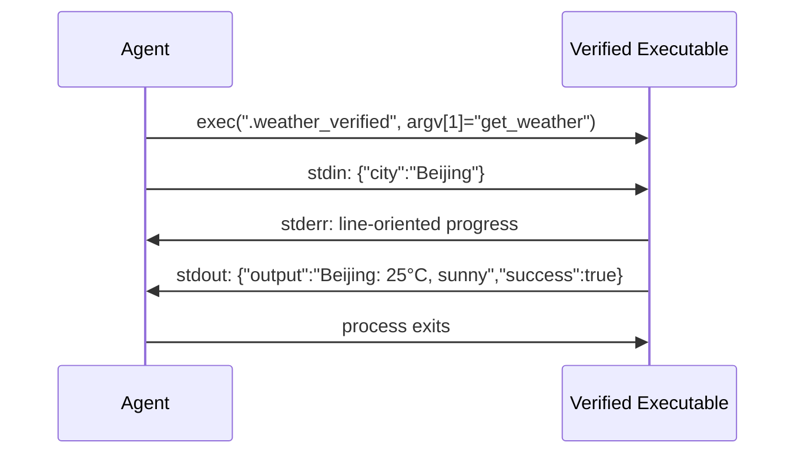

# 第 9 章：扩展机制：Skills、Plugins 与 MCP

> **定位**：本章展示 octos 当前源码中的三种扩展机制：Skills（Markdown 声明式）、Plugins（本地可执行工具 / skill package extras）、MCP（标准化协议集成）。前置依赖：第 6 章。适用场景：想为 octos 编写自定义扩展的贡献者，以及想理解 Agent 扩展架构设计的开发者。

Agent 的价值来自适配不同场景的能力。法律文书审查需要法律提示，研究 Agent 需要长时后台任务，远程服务集成又需要标准协议。把所有扩展都塞进同一种机制，会让简单需求过度工程化，也会让复杂需求被迫挤进不合适的抽象。

octos 当前的答案不是"一种万能插件"，而是三条互补轨道：

- Skills：改变 Agent 的提示与上下文
- Plugins：把本地可执行程序包装成 Tool，并承载 skill package extras
- MCP：通过标准协议连接外部工具服务器

---

## 9.1 Skills 轨道：Markdown 声明式扩展

Skills 是最轻量的扩展机制。一个 skill 的核心就是一个 `SKILL.md`，外加可选的 `manifest.json`。

先看两条轨道在代码量上的悬殊分工：`crates/octos-agent/src/skills.rs` 全文 942 行，而 `crates/octos-agent/src/plugins/` 八个文件合计 14,675 行。这个数量差不是偶然，而是职责边界的直接体现。`skills.rs` 只回答一个问题：模型能看见什么。它负责发现技能目录、解析极简 frontmatter、判断可用性、把结果压成一个 XML 摘要注入系统提示，全程不碰进程、不碰协议、不碰安全策略。`plugins/` 回答的则是另一个问题：系统会执行什么。manifest 解析、可执行文件发现与校验、子进程协议、环境清理、审批与并发控制全部堆在这里；其中光是执行协议与安全约束（`tool.rs` 3,219 行）加上对应测试（`tool_tests.rs` 4,406 行）就占了近八成，可见"安全地跑一个外部程序"远比"描述一个提示片段"昂贵。一个 skill package 目录里同时放着 `SKILL.md` 与 `manifest.json` 时，正是这两条轨道的汇合点：`SkillsLoader` 读前者注入提示，`PluginLoader` 读后者注册工具，XML 索引里的 `tools="true"` 属性标记的就是这条接缝。

### 9.1.1 `SKILL.md` 格式

```markdown
---
name: code-review
description: Review code changes for bugs, security issues, and style
version: 1.0.0
requires_bins: rg,git
requires_env: GITHUB_TOKEN
---

When reviewing code, focus on:
1. Security vulnerabilities
2. Error handling completeness
3. Behavior regressions
```

`SkillsLoader` 并没有实现完整 YAML 解析器。它做的是两步简化处理：

1. 用 `split_frontmatter()` 找到首尾 `---` 之间的 frontmatter 块（`../octos/crates/octos-agent/src/skills.rs:301-320`）
2. 用 `fm_value()` 从简单的 `key: value` 行里读取 `name`、`description`、`requires_bins`、`requires_env`、`always`、`version`、`author` 等字段（`../octos/crates/octos-agent/src/skills.rs:322-343`）

`fm_value()` 甚至会剥掉行内注释、把 `[]` / `""` / `~` 这类 YAML 空值当缺失处理。这意味着 skill 元数据的设计目标不是"表达力最大"，而是"足够稳定、足够便宜"：引入完整 YAML 解析器会带来新依赖与解析歧义，而 skill 作者实际需要的只是几个扁平的键值对。测试里专门覆盖了重复键取首个、冒号出现在值里、空 frontmatter 这些边界（`../octos/crates/octos-agent/src/skills.rs:590-645` 的测试组），说明这条简化路径是被当作契约来维护的，不是权宜之计。

`available` 的判断也来自这里：`parse_skill()` 逐项检查 `requires_bins` 里的命令是否在 PATH（`which_exists()`），`requires_env` 里的变量是否已设置，两者全过才置 `available: true`（`../octos/crates/octos-agent/src/skills.rs:244-294,351-369`）。注意这是可用性检查而非安全边界：一个缺依赖的 skill 只是从摘要里标成不可用，并不会被隔离执行。

### 9.1.2 分层目录与加载顺序

`SkillsLoader` 只维护一个"技能目录列表"，先加的目录优先级高（`../octos/crates/octos-agent/src/skills.rs:62-116`）。`list_skills()` 的实际组装顺序是：先装入编译内置的 `BUILTIN_SKILLS`，再按"低优先级目录先扫描、高优先级目录后覆盖"遍历，用 `retain` 删同名旧条目（`../octos/crates/octos-agent/src/skills.rs:118-173`）。这个"倒序遍历加去重"的实现换来一个性质：无论目录有多少层，同名技能最终只保留最高优先级来源的一份，且加载逻辑不需要知道每层目录的语义。

目录列表本身来自部署面的拼装：`Config::plugin_dirs_from_project()` 依次收集 `<octos_home>/plugins`、`<octos_home>/skills`、`<octos_home>/bundled-app-skills/`，再追加分号分隔的 `OCTOS_SKILLS_PATH` 环境变量目录；旧的 `~/.octos/skills` HOME 全局目录已不再扫描，只发一次性迁移警告（`../octos/crates/octos-cli/src/config.rs:1330-1375`）。gateway 启动时还会把二进制里携带的 app-skills / platform-skills 引导到分层目录（`../octos/crates/octos-cli/src/commands/gateway/gateway_runtime.rs:566-573`、`../octos/crates/octos-agent/src/bootstrap.rs:103-115`）。

所以这不是"工作区 / 全局 / 内置"三层固定表，而是一个 layered view：部署目录提供共享基线，账号目录提供私有安装，环境变量提供额外注入。

### 9.1.3 skill layering v1：per-profile 选择继承（9b1fc38f）

分层目录解决"技能从哪来"，skill layering v1（提交 `9b1fc38f`）解决"这个 profile 允许加载哪些"。

配置面是 per-profile 的 `skills` 选择块，lowering 成 crate 无关的 `SkillFilter`（`../octos/crates/octos-agent/src/skills.rs:12-36`）：

- `AllExcept(ids)`：全发现，减去禁用名单
- `Only(ids)`：白名单模式，只加载列出的技能

这个枚举被刻意设计成不依赖任何 CLI 类型，为的是让提示侧的 `SkillsLoader` 与工具侧的 plugin loader 消费同一个选择决定。否则会出现一种危险的不一致：技能的提示卡被禁了，它的可执行工具却还注册着，模型看不到说明但工具仍然可调。

执行面有三处一致收敛（`../octos/crates/octos-agent/src/skills.rs:156-176,176-201`）：`list_skills()` 用 `retain` 把被禁技能从摘要里删掉；`load_skill()` 对被禁名字直接返回 `None`，正文永远进不了 prompt；`get_always_skills()` 因走 `list_skills()` 同样被过滤。plugin 侧同一个 filter 也生效：`load_into_with_options_and_filter()` 对 manifest id 命中禁用名单的 skill package 整体跳过，工具、hooks、prompt fragments 一并不加载（`../octos/crates/octos-agent/src/plugins/loader.rs:296-316`）。

接线发生在 gateway 组装处：runtime 从已解析 profile 的 `config.skills` 生成 filter，传给账号级 loader（`../octos/crates/octos-cli/src/commands/gateway/gateway_runtime.rs:646-648`）；子 bot 在 `profile_factory.rs` 里继承同一选择（`../octos/crates/octos-cli/src/commands/gateway/profile_factory.rs:698-702`）。`None` 表示没有 skills 层，一切照旧，完全向后兼容。

这里需要特别区分配置继承和本地 skill 继承：子账号可以继承父 profile 的 skill 选择 filter，但 customer-installed skills 不从父账号继承。account skills 目录严格解析为当前账号自己的 `data_dir/skills`，plugin dirs 也只返回当前账号的 skills 目录（`../octos/crates/octos-cli/src/skills_scope.rs:96-112`）。父账号安装的本地可执行扩展不会在子账号中静默启用。

### 9.1.4 XML 技能索引

`build_skills_summary()` 把过滤后的可见技能转成 XML 注入系统提示（`../octos/crates/octos-agent/src/skills.rs:203-219`）：

```xml
<skills>
  <skill available="true" tools="true">
    <name>deep-search</name>
    <description>Deep web research...</description>
    <location>/.../SKILL.md</location>
  </skill>
</skills>
```

三个容易写错的点：

- 当前 XML 里没有 `name="..."` 属性，而是 `<name>` 子节点
- `tools="true"` 的含义是"该 skill 目录包含 `manifest.json`"，不是"这个 skill 正在执行工具"
- `location` 把 skill 的真实来源路径暴露给模型，帮助它区分 builtin 与外部 skill

因此 XML 摘要不是单纯的"可用技能列表"，它是模型可见的技能目录索引，且已经被 skill layering 过滤过：被 profile 禁用的技能在这里完全不可见，模型连"它存在"这个事实都拿不到。

### 9.1.5 `spawn_only`：自动后台化，而不是隐藏工具

`spawn_only` 标记定义在 skill package manifest 的工具项上（`../octos/crates/octos-agent/src/plugins/manifest.rs:452-455`），但它的运行时语义不在 manifest 里，而在 registry 和 agent 执行循环里：

- `PluginLoader` 装载时为这些工具名调用 `registry.mark_spawn_only(name, msg)`（`../octos/crates/octos-agent/src/plugins/loader.rs:332-339`）
- `ToolRegistry` 为它们维护自定义提示文案和任务跟踪状态（`../octos/crates/octos-agent/src/tools/registry.rs:156-172`）
- 主 agent 发现某次 tool call 命中 `spawn_only` 时，不同步执行，而是 `tokio::spawn` 一个后台任务，立刻向模型返回 `spawn_only_message`（`../octos/crates/octos-agent/src/agent/execution.rs:579` 起）

这意味着 `spawn_only` 不是"从 ToolSpec 里隐藏掉"。按当前实现它们仍然注册在工具系统里并对模型可见；差别只是调用时被自动后台化。模型 therefore 不需要学习一套新的"任务提交工具"，它照常发起 tool call，运行时替它决定这次调用是同步等待结果，还是立刻返回句柄转后台继续跑。

更进一步，`resolve_extras()` 在 skill package 含有 `spawn_only` 工具时注入技能卡 prompt fragment（`../octos/crates/octos-agent/src/plugins/extras.rs:39-45,449-456`）。这样模型既能看到工具，也能同时拿到"什么时候该用这个后台工具"的提示上下文。

而到了 subagent 场景，registry 会清空这些标记，因为"subagent 本身就是后台上下文"，此时工具会像普通工具一样直接执行：在已经后台化的上下文里再套一层后台化只会丢失结果句柄，白增加一层调度开销，还让子 agent 无法拿到工具返回值。

---

## 9.2 Plugins 轨道：本地可执行工具与 skill package extras

如果说 Skills 负责改变 Agent 的"思维方式"，Plugins 负责的就是让 Agent 真正调用外部程序完成工作。

### 9.2.1 runtime manifest：不只是工具声明

当前 runtime 热路径使用的是 `../octos/crates/octos-agent/src/plugins/manifest.rs` 中的 manifest 结构：

```json
{
  "name": "weather",
  "version": "1.0.0",
  "tools": [
    {
      "name": "get_weather",
      "description": "Get current weather for a location",
      "input_schema": { "type": "object", "properties": { "city": { "type": "string" } } },
      "env": ["WEATHER_API_KEY"],
      "risk": "medium",
      "concurrency_class": "safe"
    }
  ],
  "sha256": "a1b2c3...",
  "timeout_secs": 600,
  "requires_network": true
}
```

但把它理解为"纯工具 manifest"已经不够了。当前这个结构还支持：`id`、`mcp_servers`（`SkillMcpServer`）、`hooks`（`SkillHookDef`）、`prompts.include`、`actions`、`binaries`（按 `{os}-{arch}` 键的预编译下载）、`spawn_only` / `spawn_only_message`、`env` / `env_allowlist`、`risk`、`concurrency_class`、`make_type` 等（`../octos/crates/octos-agent/src/plugins/manifest.rs:8-110,387-477`）。因此它更接近一个 skill package runtime manifest：工具只是其中一种载荷，MCP server 声明、生命周期 hooks、prompt 注入同样可以独立成包。如果 `manifest.tools` 为空但声明了 extras，`PluginLoader` 会跳过可执行文件搜索，照样把 extras 装进系统（`has_extras()`，`../octos/crates/octos-agent/src/plugins/manifest.rs:180-198`；装载分支 `../octos/crates/octos-agent/src/plugins/loader.rs:607-626`）。换句话说，"没有二进制的 plugin"是合法形态，它退化为纯 extras 包。

### 9.2.2 Plugin 二进制协议



图 9-1：Plugin 二进制协议时序图。

这里的实现细节比"stdin JSON / stdout JSON"稍复杂：

- runtime 实际执行的是经过 hash 校验后落盘的 verified 副本（`../octos/crates/octos-agent/src/plugins/tool.rs:109-131`）
- argv 第一个参数是 tool name
- stdin 发送 JSON 参数
- stderr 逐行读出并转成进度事件
- stdout 优先按结构化 JSON 解析；不是合法 JSON 时退回"原样拼接 stdout + stderr 文本"（`../octos/crates/octos-agent/src/plugins/tool.rs:3117-3130` 附近的结构化字段解析）

把 stderr 单独留作进度流是个务实的设计：很多现成命令行工具本来就会往 stderr 打日志，plugin 作者不需要重写输出逻辑，只要保证最终结果以 JSON 落在 stdout 即可；而调用侧拿到的是流式进度事件，长任务不再是一个黑盒等待。

结构化 stdout 还支持比 `output/success` 更丰富的语义：`file_modified` 标记文件系统被改动，`files_to_send` 请求把产出文件自动回传会话（`../octos/crates/octos-agent/src/plugins/tool.rs:3117-3130`、`../octos/crates/octos-agent/src/plugins/tool.rs:1229-1307`）。runtime 还会尝试从 `out` 参数或输出文本里自动探测生成文件。

所以 Plugin 协议的真实价值是：把"外部进程"包装成"可流式报告进度、可自动回传文件的 Tool"。

### 9.2.3 安全与运行时约束

Plugin 这一层的安全措施有几道必须写清楚。

**第一道：可执行发现是保守的。**
`PluginLoader` 只把"子目录 + manifest.json"当成候选项。找二进制时依次尝试 manifest 名、目录名、`main`，最后才是目录扫描（`../octos/crates/octos-agent/src/plugins/loader.rs:640-646,1189-1193`）。

**第二道：SHA-256 校验封 TOCTOU 窗口。**
Loader 把原始字节一次读进内存，对内存字节算 hash 与 manifest 比对，落盘 verified 副本并记录 `load_time_hash`；执行前的 re-hash gate 再对盘上文件复验同一 hash，封住 load→exec 的替换窗口（`../octos/crates/octos-agent/src/plugins/loader.rs:649-712`、`../octos/crates/octos-agent/src/plugins/tool.rs:109-131`）。

**第三道：资源与环境约束。**

- 100MB 可执行文件上限，超限在读入内存前就拒绝（`MAX_EXECUTABLE_SIZE`，`../octos/crates/octos-agent/src/plugins/loader.rs:24,654-664`）
- 子进程环境经 `sanitize_command_env` 清理注入向量；tool 级 `env` / `env_allowlist` 采用严格语义：secret-like 变量必须被 manifest 显式列出才转发，非 secret 走 legacy 兼容路径（`../octos/crates/octos-agent/src/plugins/tool.rs:85-91`）
- 运行时注入 `OCTOS_WORK_DIR` 给 plugin 放输出文件
- 默认超时是 600 秒，不是 30 秒（`DEFAULT_TIMEOUT`，`../octos/crates/octos-agent/src/plugins/tool.rs:151-163`）；manifest 的 `timeout_secs` 只是覆盖默认值

**第四道：风险与并发类别不是装饰字段。**
`risk` 会进入审批路径：`high` / `critical` 强制交互式 approval，缺少 approval bridge 时安全拒绝；`low` 默认不触发审批，`medium` / unknown 主要用于显式呈现（`RiskLevel::classify` / `requires_approval`，`../octos/crates/octos-agent/src/plugins/manifest.rs:479-520`）。

`concurrency_class` 识别 `safe` 和 `exclusive`。未知值不被乐观当作 safe：`classify_concurrency_class()` 返回 `FailClosed`，执行侧落到 `Exclusive`，声明笔误不会把互斥工具放成并行（`../octos/crates/octos-agent/src/plugins/manifest.rs:569-609`）。

**第五道：Unix 上的符号链接拒绝。**
`is_executable()` 用 `symlink_metadata()` 检查文件类型，只接受普通文件（`../octos/crates/octos-agent/src/plugins/loader.rs:1354-1365`）。这不是全部安全边界，但能缩小 link-swap 攻击面。

### 9.2.4 runtime `PluginLoader` 与 `octos-plugin` SDK 的边界

这一章最容易写错的地方，是把仓库里的两层代码混成一层。

当前 runtime 热路径是 `../octos/crates/octos-agent/src/plugins/`（8 文件合计 14,675 行，其中 `tool.rs` 3,219 行、`tool_tests.rs` 4,406 行）：扫描目录、加载 manifest、解析 extras、校验并注册可执行工具，单个 plugin 失败只 `warn!` 跳过。

`../octos/crates/octos-plugin` 则是 SDK / tooling crate，提供另一层抽象：

- `discover_plugins()`：按来源优先级扫描并按 manifest `id` 去重，首个出现者优先（`../octos/crates/octos-plugin/src/discovery.rs:47-59`）
- `check_requirements()`：做 `bins/env/os` 三类 gating（`../octos/crates/octos-plugin/src/gating.rs:42`）
- richer manifest：`id/type/requires/install/...`（`../octos/crates/octos-plugin/src/manifest.rs:112`）

两层有关联但不能混为一谈：runtime 加载有自己的 manifest 类型与路径，`octos-plugin` 面向校验器、市场、安装器这类工具链。还有一个很小但真实的细节：gating 把 `darwin` 和 `macos` 当等价别名，避免 manifest 与 Rust 平台字符串不一致时误伤（`../octos/crates/octos-plugin/src/gating.rs:73-78`）。

---

## 9.3 MCP 集成：rmcp SDK 上的标准协议客户端

MCP（Model Context Protocol）是标准化的工具集成协议。octos 的 MCP client 位于 `../octos/crates/octos-agent/src/mcp.rs`，整体构建在官方 rmcp SDK 之上（提交 `65486dad` 迁移；`crates/octos-agent/Cargo.toml:41-44`：`rmcp = { version = "1.8", ... }`，注释明确写着 "stdio + streamable-HTTP + OAuth 2.1"）。

### 9.3.1 为什么迁 rmcp：自研客户端的三个 spec 缺口

`mcp.rs` 模块文档写得很直白：旧的手写客户端存在三个协议级缺陷——缺 `notifications/initialized`、硬编码协议版本、每请求一行的读取方式在并发下会错位（`../octos/crates/octos-agent/src/mcp.rs:1-22`）。

三个缺口各有真实后果。缺 `initialized` 通知时，按规范等待该信号才进入工作状态的 server 会永远停在半初始化；硬编码协议版本则在 server 协商出不同版本时要么被拒、要么静默降级；而"一次调用读一行响应"在并发调用下必然错位：JSON-RPC 响应靠 id 匹配请求，不是靠到达顺序，两个并行 tool call 的响应一旦交错，逐行读取的解析就会张冠李戴。

rmcp 把这三件事全部接管：完整生命周期握手（`initialize` + `notifications/initialized`）、协议版本协商，以及单连接上的并发请求多路复用与 id 路由。对上层意味着并发 tool call 不再需要排队等前一个响应读完，一个慢工具不会阻塞同 server 上的其他工具。

### 9.3.2 三种接入方式

`McpServerConfig`（`../octos/crates/octos-agent/src/mcp.rs:53-88`）按字段分派到三条连接路径：

| 路径 | 触发条件 | 走哪里 |
|------|---------|--------|
| stdio | 只配 `command`/`args`/`env` | `connect_stdio()`（`mcp.rs:452-485`） |
| streamable-HTTP（静态头） | 配 `url`，`oauth` 未开 | `connect_http()`（`mcp.rs:499-528`） |
| streamable-HTTP + OAuth 2.1 | `url` + `oauth: true` | `mcp_auth.rs::connect_oauth()`（`mcp.rs:501-504`、`../octos/crates/octos-agent/src/mcp_auth.rs:105-186`） |

stdio 路径 spawn 子进程并设 `kill_on_drop`，子进程的存活与 rmcp 会话的 `Arc` 引用绑定：最后一个引用释放时传输关闭、子进程被回收。环境沿用与所有 octos 子进程相同的清理规则：剥掉注入向量变量，只转发 operator 显式列出的 `env` 名，连显式列出的名字也要再过一遍 denylist，防止配置里写 `LD_PRELOAD` 重新打开进程劫持口子（`../octos/crates/octos-agent/src/mcp.rs:452-485`）。值得注意的是 rmcp 的子进程传输用无界 `read_until` 读 JSON-RPC 帧，源码注释承认这丢掉了旧客户端的单行上限，接受的理由是 stdio server 是 operator 自己点名信任的本地二进制（`../octos/crates/octos-agent/src/mcp.rs:465-472`）。

HTTP 路径不是"纯 SSE 通道"：rmcp 的 `StreamableHttpClientTransport` 走 streamable-HTTP 语义（POST 请求、可流式响应），静态头（包括一条 `Authorization` bearer token）原样携带，octos 在外面套了 SSRF 防护（见 9.3.4）。

OAuth 路径服务那些需要真实用户授权的远端 server。token 的取得与使用分成两个命令面：`octos mcp login <url>` 交互式跑一遍 OAuth 2.1 授权码流程（本地回环 redirect 接收回调），把 access + refresh token 以 JSON 序列化写进 OS keyring，keyring 键是"规范化 URL + sha256 前缀"，同一 server 换写法也不会存出两份（`../octos/crates/octos-agent/src/mcp_auth.rs:30-95,186` 起）。运行时 `connect_oauth()` 从 keyring 取回 token 交给 rmcp 的 `AuthClient`，过期自动刷新，全程无需重新登录；连接前强制 HTTPS 并拒绝字面私网主机（`../octos/crates/octos-agent/src/mcp_auth.rs:105-125`）。这里有一个容易漏掉的细节：OAuth 下 HTTP 客户端有两份，传输客户端带配置头走 SSRF 过滤，而授权服务器端点（discovery / registration / token / refresh）走单独的 `SsrfOAuthHttpClient`，因为那些请求本来就可能指向另一台主机（`../octos/crates/octos-agent/src/mcp_auth.rs:126-135`）。

### 9.3.3 发现、超时与工具注册

启动流程是 fail-soft 的（`McpClient::start()`，`../octos/crates/octos-agent/src/mcp.rs:374-437`）：逐个 connect，连不上的 server 记 warning 跳过，不让一个坏 server 拖死整个 agent。工具发现也加了超时：一个完成了 `initialize` 却迟迟不答 `tools/list` 的 server 会在 `HANDSHAKE_TIMEOUT`（30 秒）后被跳过，不阻塞后面的 server。这层保护针对的是"握手成功但列表永不返回"的病态 server，它在协议上合法，在工程上却能把启动卡死。

对每个发现的 tool，`validate_schema()` 检查 `input_schema`：嵌套深度 $\le 10$（`MAX_SCHEMA_DEPTH`）、序列化大小 $\le 64\text{KB}$（`MAX_SCHEMA_SIZE`，`../octos/crates/octos-agent/src/mcp.rs:47-49,296-322`）。执行侧 `McpTool::execute()` 把 `tools/call` 包在 60 秒超时里，非文本 content（图片、资源）会被丢弃，因为 agent 工具面当前是纯文本的（`../octos/crates/octos-agent/src/mcp.rs:586-612`）。

注册前有两道保护（`register_tools()`，`../octos/crates/octos-agent/src/mcp.rs:532-558`）：

- **名称保护**：`PROTECTED_NAMES` 列出 20 个内置工具名（shell、read_file、git、browser 等），同名 MCP tool 直接跳过，防止远端 server 静默劫持核心能力（`../octos/crates/octos-agent/src/mcp.rs:349-372`）
- **传输存活**（提交 `3934aeb6`）：transports 先于 tools 移交 registry 持有（`keep_mcp_service_alive`）。否则工具是连接的唯一 owner，profile 收窄把最后一个 MCP tool 滤掉时会顺带杀掉子进程（issue #1886）。一个可见性过滤器不应该有终结连接的副作用

### 9.3.4 HTTP 路径的 SSRF 防线

远程 MCP 是外呼面，octos 在这一层放了两级防线（`../octos/crates/octos-agent/src/mcp.rs:122-183`）：

1. **配置级**：`reject_private_url_host()` 拒绝字面私网/回环 IP 或 `localhost` 的 URL。reqwest 对字面 IP 主机会跳过自定义 resolver，这层专门补上（`mcp.rs:165-183`）
2. **解析级**：自定义 `SsrfDnsResolver` 挂进 HTTP client，每次解析都重新检查，命中私网/回环/link-local/元数据地址即拒，同时挫败 DNS rebinding；重定向策略设为 `none`，3xx 不能把请求走私到内网主机（`mcp.rs:122-163`）

OAuth 路径的防线更宽：授权服务器的 discovery / registration / token / refresh 端点也全部经过 SSRF 校验的 HTTP client（`SsrfOAuthHttpClient`，`../octos/crates/octos-agent/src/mcp.rs:211-293`、`../octos/crates/octos-agent/src/mcp_auth.rs:126-135`）。一个自称公网的 MCP server 不能把 token 流量指向 `127.0.0.1` 或云元数据地址 `169.254.169.254`，否则攻击者可以用一个恶意 server 探测内网甚至收割凭证。

---

> ### 工程决策侧栏：为什么需要三种扩展机制
>
> | 维度 | Skills | Plugins | MCP |
> |------|--------|---------|-----|
> | 核心作用 | 改提示与上下文 | 跑本地可执行工具 | 接外部协议化工具服务器 |
> | 主要载体 | `SKILL.md` | `manifest.json` + executable | rmcp 会话（stdio / HTTP / OAuth） |
> | 运行边界 | 无独立执行边界 | 外部进程 + verified copy | 本地子进程或远程连接 |
> | 典型增值点 | 低成本行为定制 | 进度流、文件回传、后台任务 | 跨 Agent 平台复用 |
> | 安全面 | 可用性检查 + profile 过滤 | hash 校验 + env 清理 + work dir | SSRF + schema 验证 + 名称保护 |
>
> **为什么不能统一成一种？**
>
> 因为它们解决的不是同一类问题。Skills 让模型学会"怎么想"，Plugin 让系统学会"怎么做"，MCP 让系统学会"怎么接别人的能力"。
>
> 如果把 Skills 也做成 Plugin，会让纯提示定制被迫带上二进制、协议和运行时安全成本。反过来，如果把 Plugin 做成纯 Skill，又无法提供真实执行、进度流和文件产出。MCP 看起来和 Plugin 都像"工具扩展"，但它追求的是协议互操作，而不是本地 runtime 集成的最低摩擦。

---

## 9.4 Harness 工程契约：详见第 10 章

Skills、Plugins 和 MCP 解决的是"能力如何进入 octos"；Harness 解决的是能力运行之后如何变成可验证、可观测、可升级的工程契约——ABI schema versioning、`OCTOS_EVENT_SINK` JSONL side-channel、validator runner 和 starter app skills。自 v2 起这部分独立成章，见 **第 10 章**。

---

## 9.5 配置车道：`mcp_servers` 与 `sub_providers`

扩展机制的两条配置车道都在 CLI 侧的顶层 `Config` 上。它们一个决定"接哪些外部工具服务器"，一个决定"子 agent 用哪些模型"，名字像但语义完全不同。

### 9.5.1 `mcp_servers`

顶层键 `mcp_servers: Vec<octos_agent::McpServerConfig>`（`../octos/crates/octos-cli/src/config.rs:108-110`）直接复用 agent crate 的配置类型。这是个刻意的接线选择：配置解析面与运行时消费面共享同一个 struct，`McpClient::start()` 收到的就是配置文件里写的东西，中间不存在第二次转换，也就不存在"配置写了一套、运行时理解另一套"的漂移空间。每个条目的字段就是 9.3.2 表里的三分派条件（`command`/`args`/`env` 或 `url`/`headers` 或再加 `oauth`/`scopes`），外加可选的 `concurrency_class` 覆盖（缺省 `Safe`，未知值同样 fail-safe 落 `Exclusive`）。最小示例：

```json
{
  "mcp_servers": [
    { "command": "uvx", "args": ["mcp-server-fetch"] },
    { "url": "https://mcp.example.com/mcp", "oauth": true, "scopes": ["read"] }
  ]
}
```

### 9.5.2 `sub_providers`

顶层键 `sub_providers: Vec<SubProviderConfig>`（`../octos/crates/octos-cli/src/config.rs:182-184`；结构体定义 `../octos/crates/octos-cli/src/config.rs:616-654`）声明可供 spawn 工具选择的子 provider。字段包括 `key`（引用短名，如 `cheap`、`strong`）、`provider`、`model`、`api_key_env`、`base_url`、`description`、`default_context_window`、`max_output_tokens`、`api_type`。其中 `description` 会连同成本与能力元数据一起进 spawn 工具的 schema，模型据此挑模型；`default_context_window` 决定子 agent 裁剪历史的激进程度。最小示例：

```json
{
  "sub_providers": [
    { "key": "cheap", "provider": "openai", "model": "gpt-4o-mini", "api_key_env": "OPENAI_API_KEY" }
  ]
}
```

保留键 `goal_verifier`：一个 `sub_providers` 条目若以 `goal_verifier` 为 key，goal 完成判定会路由到这个 provider 上验证（`GOAL_VERIFIER_LANE_KEY` 与 `build_goal_verifier_provider()`，`../octos/crates/octos-cli/src/runtime/profile.rs:128-190`）。这条车道的意义在于把"干活的模型"和"验收的模型"分开：未配置时回落到评分会话自身的 provider（`#1935` 之前的旧行为，作为兼容默认保留），此时目标完成与否由同一个模型自证，而配置了独立 verifier 后，判定由另一条 provider 车道给出。

## 9.6 本章回顾

1. Skills：`SKILL.md` + 简化 frontmatter 解析，分层目录去重合成一个视图，再由 per-profile 的 `SkillFilter`（layering v1，`9b1fc38f`）过滤出 XML 摘要注入系统提示。

2. Plugins：runtime manifest 已是 skill package manifest；verified copy 封 TOCTOU，env allowlist、risk 审批、concurrency fail-closed、600 秒默认超时共同构成执行边界。

3. `spawn_only`：不是隐藏工具，而是自动后台化。主 agent 立即返回 `spawn_only_message`，subagent 上下文里恢复直接执行。

4. MCP：rmcp SDK（1.8）上的 stdio + streamable-HTTP + OAuth 2.1 三接入（`65486dad`）；fail-soft 启动、schema 验证、`PROTECTED_NAMES`、SSRF 双级防线，registry 持有传输（`3934aeb6`）。

5. 架构边界：`octos-agent/src/plugins/*`（14,675 行）是 runtime 热路径；`skills.rs`（942 行）是提示轨道；`octos-plugin` 是 discovery/gating SDK。

6. 配置车道：`mcp_servers` 决定接哪些 MCP server，`sub_providers` 决定子 agent 用哪些模型，`goal_verifier` 是后者的保留键。

Part 2 到此结束。下一章开始 Part 3，从单机会话推进到消息总线与多会话编排。

---

## 延伸阅读

- Model Context Protocol：https://modelcontextprotocol.io/
- rmcp（Rust MCP SDK）：https://crates.io/crates/rmcp
- JSON-RPC 2.0：https://www.jsonrpc.org/specification

## 思考题

1. Skill 过滤的收敛点：为什么 `load_skill()` 对被禁技能必须返回 `None`，而不只是从 XML 摘要里删掉？如果模型凭"记忆"直接点名加载一个被禁技能，会发生什么？

2. Plugin 信任链：verified copy 解决了 load→exec 的 TOCTOU，但如果 manifest 与原始二进制一起被替换，hash 仍然会"自洽"。你会如何把信任链再往前推进一层？

3. rmcp 的取舍：迁到 rmcp 修复了三个 spec 缺口，但也丢掉了 stdio 单行 1MB 上限（无界 `read_until`）。这个取舍在什么前提下是安全的？什么部署形态下需要重新审视？

---

> **版本演化说明**
> 本章基于 `octos` 主分支 `9c157101`（2026-09-03 实测）撰写，覆盖三处近期演化：`65486dad` MCP 客户端整体迁到 rmcp SDK（stdio + streamable-HTTP + OAuth 2.1，`mcp.rs` 重写、新增 `mcp_auth.rs`）；`9b1fc38f` skill layering v1（per-profile 选择继承，`skills.rs`、`plugins/loader.rs`）；`3934aeb6` registry 持有 MCP 传输。后续阅读时优先核对 `crates/octos-agent/src/skills.rs`、`crates/octos-agent/src/plugins/`、`crates/octos-agent/src/mcp.rs`、`crates/octos-agent/src/mcp_auth.rs`、`crates/octos-plugin/src/` 与 `crates/octos-cli/src/config.rs`。
