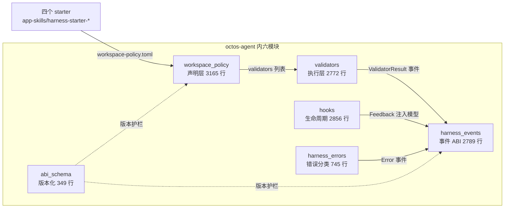
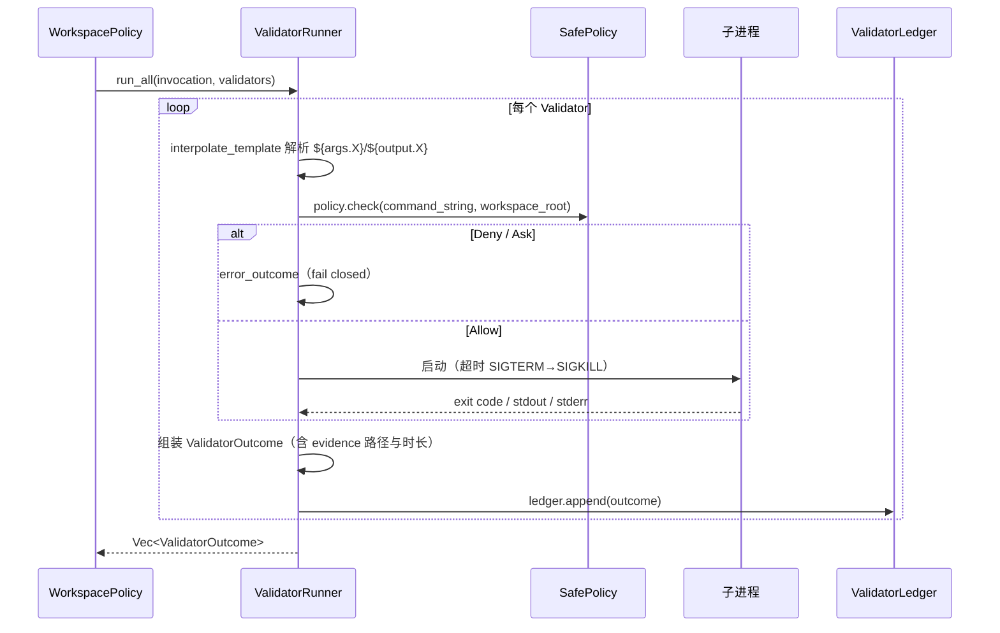
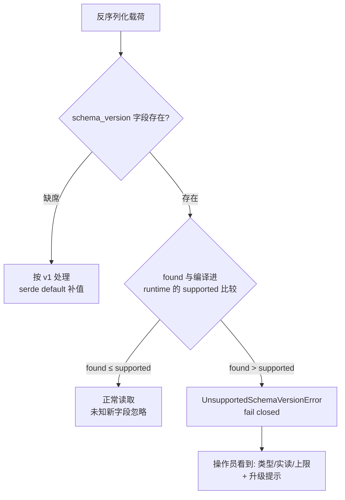

# 第 10 章：Harness：把「模型说做完了」变成可验证契约

> **定位**：本章解剖 octos 的 harness 体系:声明式校验器、结构化事件 ABI、schema 版本化、工作区策略、结构化错误分类与生命周期 hooks。先澄清一个常见误解：不存在独立的 harness crate；harness 是 `octos-agent` 内的六个模块加上四个 starter 脚手架。前置依赖：第 5 章（错误恢复链）、第 6 章（Tool trait）、第 7 章（沙箱）。适用场景：需要让长跑 Agent 的产出可审计、可门禁、可回放的读者。

第 5 章讲 Agent Loop 时留了一个口子：模型回答「做完了」，运行时凭什么信？第 6 章的工具让 Agent 能改变世界，第 7 章的沙箱约束它能改到什么程度，但「改完之后是否达标」仍是空白。harness 补上这块：它不提升模型能力，而是把「完成」从一句自然语言变成机器可判定的契约。

先看这六个模块在源码中的体量（octos main @ `9c157101` 实测）：

| 模块 | 行数 | 首行 `//!` 文档 |
|---|---|---|
| `validators.rs` | 2,772 | `Declarative validator runner (harness M4.3).` |
| `harness_events.rs` | 2,789 | `Structured harness event ABI and local sink transport.` |
| `abi_schema.rs` | 349 | `Harness ABI schema versioning.` |
| `workspace_policy.rs` | 3,165 | （无 `//!`，首行为 `use std::collections::BTreeMap;`） |
| `harness_errors.rs` | 745 | `Structured harness error taxonomy (M6.1, issue #488).` |
| `hooks.rs` | 2,856 | `Hook/lifecycle system for running shell commands at agent lifecycle points.` |

合计 12,676 行。没有 harness crate,这六份文件都住在 `crates/octos-agent/src/` 下，加上 `crates/app-skills/` 里的四个 starter 目录（audio/coding/generic/report），才是 harness 的全部。这个澄清本身有信息量：harness 不是又一层抽象盒子，而是把校验、事件、版本化直接织进 Agent 运行时。



三支柱的分工可以这样记：`workspace_policy` 声明什么算完成，`validators` 执行判定，`abi_schema` + `harness_events` 保证判定的过程与结果能被不同版本的组件听懂。hooks 与 harness_errors 是两翼：前者把生命周期变成可编程点，后者给一切失败配上类型。下面逐一展开。

---

## 10.1 支柱一：声明式校验器

### 10.1.1 为什么校验是数据，不是代码

harness 的第一支柱回答「什么算完成」。先看它反对什么：让 Agent 的产出可验证，最直觉的做法是写一个 `fn validate() -> bool`。但校验逻辑一旦写成代码，它就跟宿主版本锁死：旧 workspace 遇上新 runtime，函数签名对不上；反过来，runtime 升级也无法解释旧策略文件里的校验意图。octos 的选择是把校验器做成**数据**：`WorkspacePolicy` 里的一张表，由统一的 runner 解释执行。

三个工程理由支撑这个决策。第一，可序列化：策略文件能随 workspace 存档、diff、迁移，`schema_version` 字段让旧文件在新 runtime 里继续可读（见 10.3）。第二，可沙箱：runner 是唯一执行入口，命令型校验器统一过 shell 安全层（`SafePolicy`）与 `BLOCKED_ENV_VARS` 环境变量清洗，策略作者无法绕过（详见第 7 章的沙箱与 `b64bd532`/`bf6be8cc` 将 project-root 校验器收进沙箱、mcp-serve 路径 fail-closed 的决策）。第三，可回放：每条执行结果落成 JSONL 台账，重启后原样重读，不依赖进程内存里的瞬时状态。代价是表达力受限，复杂判定要拆成现有 `ValidatorSpec` 变体的组合，或者退到 `Command` 变体调用外部程序；这个取舍在思考题 1 里继续追问。

### 10.1.2 声明层：`Validator` 与三层语义

声明写进 `ValidationPolicy`（`crates/octos-agent/src/workspace_policy.rs:115`），它同时容纳旧式字符串校验与类型化校验器两套写法：

```rust
/// Tiered validation checks run at different points in the turn lifecycle.
#[derive(Clone, Debug, Default, PartialEq, Serialize, Deserialize)]
pub struct ValidationPolicy {
    /// Tier 1: cheap checks run every turn (< 100ms). e.g. file_exists, build exit code.
    #[serde(default)]
    pub on_turn_end: Vec<String>,
    /// Tier 2: medium checks run when source files change (1-5s). e.g. preview render.
    #[serde(default)]
    pub on_source_change: Vec<String>,
    /// Tier 3: expensive checks run on completion/publish only (10-30s). e.g. Playwright.
    #[serde(default)]
    pub on_completion: Vec<String>,
    /// Typed declarative validators (M4.3). Runs via `ValidatorRunner`.
    #[serde(default, skip_serializing_if = "Vec::is_empty")]
    pub validators: Vec<Validator>,
}
```

前三行是按成本分层的字符串校验（每轮跑、源码变了跑、完成时才跑），第四行的 `Vec<Validator>` 才是 harness 主推的类型化形态。每个 `Validator`（`crates/octos-agent/src/workspace_policy.rs:143`）有稳定 `id`、超时与运行相位，正文 `spec` 是一个按 `kind` 标注的枚举 `ValidatorSpec`（`crates/octos-agent/src/workspace_policy.rs:301`），从跑子进程、调工具、查文件存在，到 HTTP 探测、SHA-256 比对、音频非静音检测逐级扩展。

最有设计感的是失败语义。历史上只有布尔 `required`：true 失败即拦，false 仅告警。Wave-3a 引入 `soft_fail` 后，两个字段坍缩成三档 `Required`（`crates/octos-agent/src/workspace_policy.rs:198`）：

```rust
    pub fn tier(&self) -> Required {
        if self.soft_fail {
            Required::Soft
        } else if self.required {
            Required::Hard
        } else {
            Required::None
        }
    }
```

Hard 失败阻止 spawn 任务到达终态成功；Soft 失败只留台账与告警，用于「主产物必须交付、副产物尽力而为」的部分交付契约；None 的门禁行为与 Soft 相同，但台账里明确标注「仅供参考」。旧布尔字段原样保留以兼容旧策略文件，新旧两套字段由这一个函数收拢。声明式设计让这种平滑迁移成为可能。

三档的判据写在 `Required` 枚举（`crates/octos-agent/src/workspace_policy.rs:198`）的文档注释里，两个辅助方法把语义钉死：`is_hard()` 决定非 Pass 结果是否把 spawn 任务降级为 Failed，只有 Hard 为真；`is_warning_only()` 决定是否仅告警，Soft 与 None 都是。运维上这意味着 dashboard 可以按台账里的 tier 标签把失败切成三类：hard 失败要立刻处理，soft 失败要看副产物是否影响下游，none 失败纯属信息。选档的实用判据是问一句「这个校验不过，交付物还能用吗」：主产物文件存在性选 Hard，预览文件、附加报告选 Soft，风格类检查选 None。`as_str()` 输出的稳定标签（hard/soft/none）直接进指标与台账记录，运维面板不需要理解 Rust 枚举就能过滤。

### 10.1.3 执行层：`ValidatorRunner` 的五步时序

执行层的核心是 `ValidatorRunner`（`crates/octos-agent/src/validators.rs:441`）。它的构造函数本身就是一份安全清单：证据默认落在 `<workspace_root>/.octos/validator-evidence/`（常量 `EVIDENCE_SUBDIR` 定义在 `crates/octos-agent/src/validators.rs:46`），命令策略默认 `SafePolicy`，台账与沙箱可选挂载。工具调度被抽成 `ValidatorToolDispatcher` trait（`crates/octos-agent/src/validators.rs:367`）：生产路径绑定完整的 `ToolRegistry`，测试与短生命周期调用点用 `MapToolDispatcher` 只快照需要的几个工具，不必为构造 runner 克隆整个注册表。一批校验器共享的上下文是 `ValidatorInvocation`（`crates/octos-agent/src/validators.rs:167`），携带工作区根、仓库标签、运行相位（`ValidatorPhase`，`crates/octos-agent/src/validators.rs:105`，分 turn_end 与 completion 两档）以及可选的 spawn 任务输入与工具输出。`run_all` 一次跑完整批并按声明顺序返回结果，单条命令校验器的处理流程是：



这张时序图的每一步都能在 ValidatorRunner 的方法里找到落点。五个关键步骤如下。模板插值在 `crates/octos-agent/src/validators.rs:677-696`：`${args.<key>}` 取自 spawn 任务输入 JSON，`${output.<key>}` 取自工具产出的 `named_outputs`（如 `mofa_publish` 的 `deploy_url`），这让「校验刚发布的 URL 可达」成为一等公民；缺 key 直接产出 Error。安全闸门在 `crates/octos-agent/src/validators.rs:719-734`：`SafePolicy` 判 Deny 或 Ask 都按 Error 处理，宁可误拦不可放行。执行与超时杀进程（Unix 走 SIGTERM 转 SIGKILL，Windows 走 `taskkill /F /T`）对应 `run_command`（`crates/octos-agent/src/validators.rs:661`）。结果类型 `ValidatorOutcome`（`crates/octos-agent/src/validators.rs:236`）带 `schema_version`、时长、证据路径与 stderr 尾部，信息量刚好够事后审计。落账由 `ValidatorLedger.append`（`crates/octos-agent/src/validators.rs:321`）完成，一行一条 JSON。

台账是 append-only 的：`ValidatorLedger`（`crates/octos-agent/src/validators.rs:298`）只提供 `append` 与 `read_all` 两个动作，后者逐行反序列化并顺手把 Wave-3a 之前的旧记录归一化成新 tier 语义。契约测试 `should_persist_outcomes_and_replay_them_byte_for_byte`（`crates/octos-agent/tests/validator_runner.rs:490`）验证的就是「写进去什么样、重读回来就什么样」。回放不靠日志考古，靠结构化记录。

17 个用例的 `validator_runner.rs` 把这张时序图的每条边都钉住了：required 命令校验失败要拦（`crates/octos-agent/tests/validator_runner.rs:123`）、optional 失败只告警（`:218`）、超时杀子进程（`:329`）、stderr 进结果供操作员查看（`:293`）、`BLOCKED_ENV_VARS` 即便显式设置也被剥掉（`:531`）。

> **工程决策：为什么超时与拒答都算 Error 而不是 Fail**
> `ValidatorStatus`（`crates/octos-agent/src/validators.rs:131`）把终态分为 `Pass` / `Fail` / `Timeout` / `Error` 四档：Fail 表示「校验跑完了、结论是不合格」，Timeout 与 Error 表示「校验根本没跑成」。这个区分对门禁语义至关重要:产物不合格可以打回让 Agent 修，而策略拒绝或环境损坏时「打回」只会让 Agent 对着坏环境空转。消费方（如 Ch16 的门禁）只需要看 `required && status != Pass` 这一个条件，四种终态就能各归其位。

### 10.1.4 工作区策略：一张 TOML 驱动全部

`WorkspacePolicy`（`crates/octos-agent/src/workspace_policy.rs:22`）是声明层的总纲：工作区类型、版本控制、追踪、校验、产物、spawn 任务、压缩策略七个段。其中 `CompactionPolicy`（`crates/octos-agent/src/workspace_policy.rs:51`）声明压缩的形状,包括目标 token 预算、必须存活的产物与不变量、摘要器风味（`CompactionSummarizerKind`，`crates/octos-agent/src/workspace_policy.rs:104`，可选 Extractive 或 LlmIterative）、preflight 阈值、旧工具结果的修剪轮数。缺席时运行时退回旧抽取式路径，行为与 M6.3 之前逐字节一致。「缺省即旧行为」是 harness 各模块共享的兼容哲学（压缩的运行时消费详见第 8 章）。

`WorkspacePolicy` 的读取端同样受版本护栏保护：文件里的 `schema_version` 缺席时按 v1 反序列化，超出编译进 runtime 的上限则整体拒绝，细节在 10.3 节。四个 starter 的 `workspace-policy.toml` 是这套声明的最小可运行样本，10.5 节走读。

---

## 10.2 支柱二：事件 ABI：运行中说了什么

### 10.2.1 `octos.harness.event.v1` 信封

第一支柱回答终点判定，第二支柱回答过程叙事：运行中都发生了什么、外部组件如何听到。这份需求落在 `harness_events.rs`（2,789 行，六模块中最大）。所有事件共用一个信封：

```rust
#[derive(Debug, Clone, Serialize, Deserialize, PartialEq)]
pub struct HarnessEvent {
    pub schema: String,
    #[serde(flatten)]
    pub payload: HarnessEventPayload,
}
```

`schema` 字段恒为常量 `HARNESS_EVENT_SCHEMA_V1`（`crates/octos-agent/src/harness_events.rs:29`），值是字符串 `octos.harness.event.v1`,这是消费者应当分支判断的稳定标识。载荷 `HarnessEventPayload`（`crates/octos-agent/src/harness_events.rs:368`）以 `kind` 标注、按 snake_case 命名，是十几种事件的tagged union：Progress、Phase、Artifact、ValidatorResult、Retry、Failure、McpServerCall、SubAgentDispatch、SwarmDispatch、SwarmReviewDecision、CostAttribution、RoutingDecision、CredentialRotation、SessionSanitized、SubagentProgress、Error。第 13 章的 pipeline 进度事件与第 17 章的 swarm 门禁都会以这套词汇表为共享语言，本章先立词汇。

以最常用的 `HarnessProgressEvent`（`crates/octos-agent/src/harness_events.rs:461`）为例，它自带 `schema_version`、`session_id`、`task_id`、`phase` 与可选 `message`，还有一个 `progress_fraction` 的别名兼容字段:老生产者写 `progress_fraction`、新消费者读 `fraction`，serde alias 一行解决，不需要 bump 大版本。

### 10.2.2 本地 sink 传输

事件的传递通道是本地 JSONL 文件：外部 app skill 进程把单行事件写进 `OCTOS_EVENT_SINK` 指向的文件，runtime 校验 schema 后 tail 并折叠进任务快照，再向 `/api/events/harness` 广播类型化帧。这条 side-channel 与 stdout 工具结果协议分离：stdout 回答「工具返回了什么」，sink 回答「运行中发生了什么」。所以同一个 app skill 进程有两类输出通道，职责不混。这条通道上还有两道防线：事件写入前先做 schema 校验，单行超过大小上限的记录整条拒绝，脏数据进不了流；关联上下文由环境变量注入，`OCTOS_SESSION_ID` 与 `OCTOS_TASK_ID`（以及等价的 `OCTOS_HARNESS_SESSION_ID` / `OCTOS_HARNESS_TASK_ID`）让每条事件都能归到具体会话与任务，事后审计不用猜来源。对第 16 章的 fleet 门禁与第 17 章的 swarm 聚合而言，这套按任务归集事件的能力就是它们消费数据的地基，本章只立契约，不展开消费侧。

错误也有专属事件形态：`HarnessErrorEvent`（`crates/octos-agent/src/harness_errors.rs:166`）作为 `kind: "error"` 挂在同一个信封下，携带 snake_case 的变体标识与恢复提示，schema 版本常量 `HARNESS_ERROR_SCHEMA_VERSION` 注册在 abi_schema。契约测试 `should_round_trip_harness_error_through_sink`（`crates/octos-agent/tests/harness_errors.rs:154`）验证错误事件经 sink 写入再读回不变形；`should_emit_harness_event_on_error_classification`（`:126`）验证每次错误分类都产生事件。错误分类学本身（`RecoveryHint` `crates/octos-agent/src/harness_errors.rs:47` 与 `HarnessError` `crates/octos-agent/src/harness_errors.rs:93` 的五提示十数变体）第 5 章已随恢复链讲透，本章只强调两点。其一，错误分类与事件 ABI 的关系是「分类决定事件载荷」：`variant_name()` 是冻结的命名，事件消费者据此做确定性分支，不碰自然语言 message。其二，分类的粒度是为可观测性设计的：`RecoveryHint` 只有五个值（backoff_retry、switch_provider、compact_context、fail_fast、bug），可以直接当 Prometheus 标签用而不会基数爆炸；`HarnessError` 的变体则细到能区分「401 认证失败」与「403 配额耗尽」这两种 4xx 的情况，让操作员看到的提示分别是「检查 API key」与「充值或换供应商」。18 个用例的 `harness_errors.rs` 把这套映射钉得很实：429 归 RateLimited 配 BackoffRetry（`crates/octos-agent/tests/harness_errors.rs:26`），5xx 归 ProviderUnavailable 配 SwitchProvider（`:58`），网络错误归 BackoffRetry（`:77`），同样的输入永远分到同样的变体（`:110`），403 带 quota 标记归 Quota、不带归 Authentication（`:248`、`:271`）。同一分类经 eyre 中转也不失真（`:280`），这是把分类放进类型而不放进出错现场的回报。

---

## 10.3 支柱三：schema 版本化：不同版本还能互相听懂

### 10.3.1 五个耐久类型与 `check_supported`

声明会被存档，事件会被回放，于是第三个问题出现了：跨了版本的组件还能不能听懂彼此？这是第三支柱 `abi_schema.rs` 的领地。harness 对外暴露五个耐久序列化类型：`WorkspacePolicy`、`HookPayload`、`ProgressEvent`（发出形状）、`TaskResult`、`SessionSummary`。`abi_schema.rs` 为每个类型集中维护版本常量，全部当前值为 1。这 349 行的小模块只干一件事：版本护栏。核心函数只有九行（`crates/octos-agent/src/abi_schema.rs:159`）：

```rust
pub fn check_supported(
    kind: &'static str,
    found: u32,
    supported: u32,
) -> Result<(), UnsupportedSchemaVersionError> {
    if found > supported {
        Err(UnsupportedSchemaVersionError {
            kind,
            found,
            supported,
        })
    } else {
        Ok(())
    }
}
```

规则是单向的：`found <= supported` 一律放行（旧版本靠缺省字段保持可读），`found > supported` 拒绝并返回类型化错误 `UnsupportedSchemaVersionError`（`crates/octos-agent/src/abi_schema.rs:135`），其 Display 消息固定含类型名、实际版本与支持上限，并提示「升级 octos 到更新版本」。不是 panic，不是静默截断。调用方可以记日志、向操作员呈现可行动的错误，或退回安全缺省。

### 10.3.2 版本协商决策流



为什么这扇门只朝一个方向关？「旧 runtime 读新 payload」与「新 runtime 读旧 payload」的风险天然不对称：旧数据缺的只是新字段，serde 缺省值补零即可安全读出，读到的语义是「老形状」，正确；而旧 runtime 遇上新 payload，新字段可能是旧代码无法理解的语义变更（比如一个字段从单值变成列表），任何「尽力解析」都是在猜，猜错的代价是静默错读。工程权衡因此落在保守侧：宁可让操作员看到一条带类型名、实读版本与支持上限的报错并升级 octos，也不让坏数据无声流过整条管线。这也是 `check_supported` 的错误消息固定附带「upgrade octos to a newer release」提示的原因（`crates/octos-agent/src/abi_schema.rs:144-151` 的 Display 实现）：fail closed 的报错必须同时给出解法，否则只是把故障换个形态。反向的「新读旧」则交给缺省值：五个耐久类型的 `schema_version` 字段全部用 `#[serde(default = "...")]` 标注，2026 年 4 月前的旧策略文件零改动继续加载，升级 octos 不需要迁移仪式。

这套语义与 `docs/OCTOS_HARNESS_ABI_VERSIONING.md` 的五条兼容规则逐条对应：缺 `schema_version` 按 v1 反序列化；未知大版本用类型化错误拒绝、绝不 panic；同一大版本内 stable 字段含义不变，新增可选字段必须缺省为空；破坏性变更必须 bump 大版本并留双版本过渡窗口；外部消费者应先分支 `schema_version` 再读版本特定字段。三条护栏中「缺字段默认 v1」让 2026 年 4 月之前的旧策略文件今天照常加载；「超上限拒绝」保证旧 runtime 不会错读未来 payload。`should_reject_future_workspace_policy_schema_version`（`crates/octos-agent/tests/abi_compat.rs:259`）与 `should_default_workspace_policy_to_v1_when_schema_version_missing`（`:197`）把两条各钉一钉。13 个用例的 `abi_compat.rs` 用 fixture 文件驱动，覆盖四个耐久类型的新旧两端。

版本化的对象是 runtime 序列化形状，不是 skill/plugin 自己的发布版本（那是 `manifest.json` 的 version 字段），第 9 章曾区分过这两个概念，本章是它的执行机制。

---

## 10.4 两翼：hooks 生命周期与沙箱交叉

### 10.4.1 十一个生命周期点

hooks 的会话上下文由 `HookContext`（`crates/octos-agent/src/hooks.rs:24`）携带，只有 `session_id` 与 `profile_id` 两个可选字段，由 gateway 在 Agent Loop 启动前注入；它让同一份 hook 配置在不同会话里能区分自己服务的是谁，也是 10.4.2 节会话隔离状态键的来源。`HookEvent`（`crates/octos-agent/src/hooks.rs:32`）枚举了十一个可挂载点：`user_prompt_submit`、`before/after_tool_call`、`before/after_llm_call`、`on_resume`、`on_turn_end`，外加 spawn 验证前后与完成/失败四点。每个 `HookConfig`（`crates/octos-agent/src/hooks.rs:77`）声明触发事件、argv 数组（不经 shell 解释）、超时（默认 5000ms）、可选的 `tool_filter`、`path_filter` glob（如把 `cargo check` 限定在 `**/*.rs` 编辑之后）与 `requires_bin`（二进制不在 PATH 就静默跳过，不强迫操作员装齐所有 linter）。

载荷 `HookPayload`（`crates/octos-agent/src/hooks.rs:123`）自带 `schema_version` 与事件、工具名、参数、时长、模型、迭代数等上下文；集成方可实现 `HookPayloadEnricher`（`crates/octos-agent/src/hooks.rs:671`）注入领域数据。执行结果是六态 `HookResult`（`crates/octos-agent/src/hooks.rs:679`）：Allow、Deny、Modified、Context、Error、Feedback。

其中 `Feedback` 最能体现设计取舍：after-hook 以 exit 1 且有输出退出时，那是反馈通道在正常工作：检查器在报告诊断，应注入模型会话；而缺二进制、超时、exit >= 2 属于基础设施故障 `Error`，绝不能混进模型上下文，否则 Agent 会把「hook 坏了」当成「代码有错」去修。提交 `9ebaf468` 与 `fb0f9eeb` 接通的编码反馈回路正是这条：`after_tool_call` 钩子把 `cargo check` 的编译错误作为 Feedback 喂回模型，形成「编辑→检查→修正」的循环，且按配置顺序逐条保留，后来的失败钩子不能覆盖编码缺省钩子的编译错误（#2129 评审第 8、9 条）。

### 10.4.2 断路器与会话隔离

`HookExecutor` 内建断路器：连续失败达到阈值即停用该钩子，避免一条坏 hook 拖垮每个 turn。值得记录的是 #2153 修复。断路器与去抖状态原先是执行器全局一份，`Arc<HookExecutor>` 跨所有会话共享时，一个工作区的基础设施故障会向全体会话计数。修复后状态按 session key 隔离（`crates/octos-agent/src/hooks.rs:716` 起），一个会话的熔断不再波及邻居；after 事件去抖窗口同理，一轮多次 `edit_file` 只付一次全项目 `cargo check`。

### 10.4.3 与第 7 章的安全交叉

harness 的可编程性天然带风险：workspace 里的 `.octos-workspace.toml` 是不可信输入，它声明的命令校验器不能裸跑在宿主机上。`b64bd532` 与 `bf6be8cc` 由此把 project-root 校验器收进沙箱，mcp-serve 路径 fail-closed（Windows 上无安全 argv 包装方案时宁可报错也不绕过沙箱，`crates/octos-agent/src/validators.rs:735-749` 的注释把这条决策写得很清楚）。沙箱机制本身是第 7 章的内容，此处不展开。

---

## 10.5 四个 starter：面向用户的脚手架

`crates/app-skills/` 下有四个 harness starter：`harness-starter-audio`、`harness-starter-coding`、`harness-starter-generic`、`harness-starter-report`，目录结构完全一致，都是 `Cargo.toml`、`manifest.json`、`SKILL.md`、`src/`、`tests/`、`workspace-policy.toml` 六件套。它们不是参考实现意义上的玩具，而是把本章全部概念装配成可复制起点的模板：manifest 声明工具与并发类，workspace-policy 声明产物与校验，tests 里的 smoke test 则核对这两份声明没有说谎。

以 `harness-starter-coding` 走读。`manifest.json` 声明一个 `spawn_only` 的 `propose_patch` 工具，把补丁渲染成 `patches/<slug>.diff` 统一差分文件,外加一份 `patches/<slug>.files.txt` 预览清单，`concurrency_class = "exclusive"` 防止并发写冲突。`workspace-policy.toml` 则是 10.1 节声明的直接样本：

```toml
[validation]
on_turn_end = []
on_source_change = []
on_completion = ["file_exists:patches/*.diff"]

[artifacts]
primary = "patches/*.diff"
preview = "patches/*.files.txt"

[spawn_tasks.propose_patch]
artifacts = ["primary", "preview"]
on_verify = [
    "file_exists:$primary",
    "file_size_min:$primary:64",
    "file_exists:$preview",
]
```

注意 `$primary` 引用：产物声明与校验规则解耦，改名产物只动一处。这个 TOML 还展示了字符串校验的三层结构如何与 `WorkspacePolicy` 的段一一对应：`[validation]` 是校验层，`[artifacts]` 是产物层，`[spawn_tasks.*]` 把两者装配成任务契约，`on_verify` / `on_deliver` / `on_failure` 分别挂在验证、交付、失败三个时点。`file_size_min` 64 字节堵住「零字节 diff 也算交付」的漏洞。空补丁文本恰好过 `file_exists`，但过不了大小下限。字符串校验（`on_completion`）与类型化 validators 两轨在此并存，新代码建议走后者。

其余三个 starter 各占一段：`harness-starter-audio` 展示独占资源契约：`synthesize_clip` 写 `audio/<slug>.wav` 必须声明 exclusive 并发类，primary 产物配 `file_size_min` 4096 字节的下限校验；`harness-starter-report` 是最小报告契约:`reports/*.md` 主产物、completion `file_exists`、failure 时 `notify_user`；`harness-starter-generic` 则是剥掉领域细节的空白模板，适合作为新 app skill 的起点。写新 app skill 时应把这四个目录当工程清单逐项核对：manifest 声明、并发类、产物契约、校验门禁、失败通知，一项不缺再动手写业务代码。

从用户视角看，starter 的价值在于把本章机制收敛成「复制目录、改两份声明文件」的动手路径：`manifest.json` 描述工具长什么样（输入 schema、并发类、超时），`workspace-policy.toml` 描述产出怎么算数（产物模式、校验规则、失败通知），`src/` 里的业务代码只管干活，不需要知道 ValidatorRunner 或事件信封的存在。四份 `workspace-policy.toml` 放在一起读还能看出契约松紧的梯度：coding 的 `file_size_min:$primary:64` 是字节级下限，audio 提到 4096 因为 WAV 头本身就不小，report 只用 `file_exists` 因为 Markdown 报告的合理大小无法预判，generic 则留空让用户自己填。同一个机制，四种松紧，全靠声明层的数据调整，一行 runner 代码不用改，这正是 10.1.1 节「校验是数据不是代码」在用户侧的兑现。

---

## 10.6 本章回顾

1. **事实澄清**：不存在 harness crate。harness 是 `octos-agent` 内六模块（validators 2,772 行、harness_events 2,789 行、abi_schema 349 行、workspace_policy 3,165 行、harness_errors 745 行、hooks 2,856 行，合计 12,676 行）加 `crates/app-skills/harness-starter-*` 四个 starter。

2. **三支柱**：workspace_policy 声明什么算完成，validators 执行判定并产出可回放台账，harness_events + abi_schema 让判定过程与结果跨版本可读。hooks 与 harness_errors 是两翼，starter 是面向用户的脚手架。

3. **声明式校验**：校验器是数据不是代码，换来可序列化、可沙箱、可回放三重工程收益；`Required` 三档（Hard/Soft/None）收拢新旧字段，Soft 支持部分交付契约。

4. **事件 ABI**：`octos.harness.event.v1` 信封 + `kind` 标注的载荷枚举，本地 JSONL sink 传输，validate 后入流；第 13 章 pipeline 进度与第 17 章 swarm 门禁共用这套词汇。

5. **版本护栏**：五个耐久类型、`check_supported` 九行核心、缺字段默认 v1、超上限 fail closed；`abi_compat.rs` 13 用例钉住两端。

6. **hooks 与安全**：十一个生命周期点、六态结果、Feedback 与 Error 严格分流；断路器按会话隔离（#2153）；project-root 校验器进沙箱、mcp-serve fail-closed（详见第 7 章）。

第 10 章是第二部分的收官：从第 5 章的一次对话生命周期，到第 6 章的工具、第 7 章的安全、第 8 章的上下文、第 9 章的扩展，再到本章的可验证契约，Agent 引擎的内部机制到此完整。第三部分从单机会话走向消息总线与多会话编排，harness 埋下的事件词汇会在那里被大量复用。

---

## 延伸阅读

- `docs/OCTOS_HARNESS_DEVELOPER_GUIDE.md`：harness 开发者指南，外部 skill 作者的入口文档
- `docs/OCTOS_HARNESS_ABI_VERSIONING.md`：ABI 版本化契约，stable/experimental 字段清单与废弃规则（M4.6）
- `docs/OCTOS_HARNESS_MASTER_PLAN.md`：harness 总体规划，三阶段（后台任务信任 / Web 持久化与重载可靠性 / 自由编码与更丰富运行时）的路线图
- `docs/OCTOS_HARNESS_DEVELOPER_INTERFACE.md`：开发者接口约定
- `docs/OCTOS_HARNESS_SKILL_COMPAT.md`：skill 兼容性说明

## 思考题

1. **声明式的边界**：如果你的校验需要「跑一段领域特定的判定程序」（比如解析内部格式再断言结构），你会扩展 `ValidatorSpec` 加一个新变体，还是退回 `Command` 校验器调外部程序？两种做法在沙箱、超时、证据留存上的差异是什么？

2. **Soft 契约的滑坡**：`soft_fail` 让部分交付成为合法终态。如果团队里每个 validator 都被「顺手」标成 soft，harness 的门禁价值还剩多少？你会用什么机制（评审规则、策略 lint、台账审计）防止这种滑坡？

3. **版本护栏的单向门**：`check_supported` 只拒未来版本、不拒过去版本。假如某天 v2 需要删除一个 v1 的 stable 字段（而不是新增），缺省值策略还能兜住吗？双版本过渡窗口应该怎么设计，才能让 v1 生产者与 v2 消费者共存一个发布周期？

---

> **版本演化说明**
> 本章基于 octos main @ `9c157101`（2026-09-03 核对）。行号与代码摘录以该 commit 为准；后续阅读时优先复核 `crates/octos-agent/src/{validators,harness_events,abi_schema,workspace_policy,harness_errors,hooks}.rs` 与 `crates/app-skills/harness-starter-*/`。里程碑编号（M4.3/M4.6/M6.1/M6.3/M6.5/M6.6/M7.6/M8.6/M8.7）沿用源码注释与 `docs/OCTOS_HARNESS_MASTER_PLAN.md` 的阶段划分。
