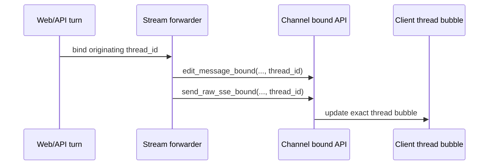
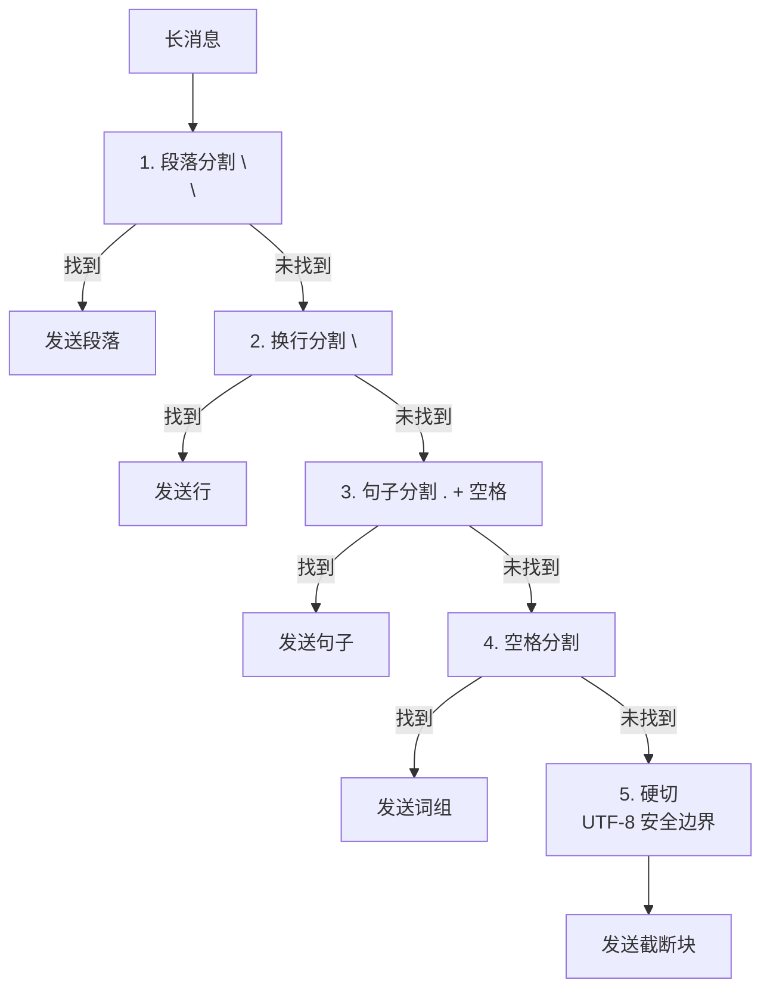
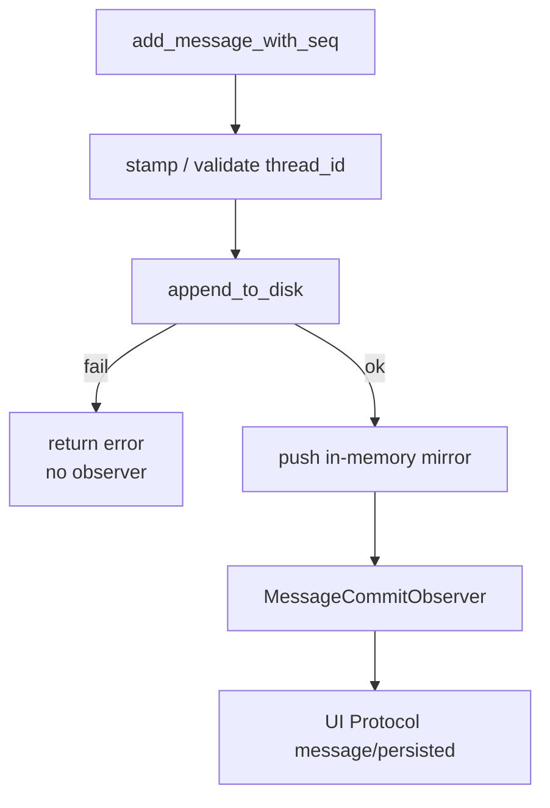

# 第 11 章：octos-bus：消息总线、频道抽象与会话持久化

> **定位**：本章深入 octos-bus crate（当前 `../octos/crates/octos-bus/` 约 40K 行 Rust 源文件（实测 40,937 行，其中 17 个频道文件 18,207 行）），展示如何用 `Channel` trait 抽象统一多种消息频道，以及会话管理、消息分片、thread-bound streaming、durable commit observer 和 child-session contract 的工程实现。前置依赖：第 5 章。适用场景：想理解多频道消息平台架构的开发者（读者 B），以及需要接入新频道的贡献者（读者 D）。

当 Agent 从单用户 CLI 走向多用户平台时，消息接入层的复杂度急剧上升。Telegram 的消息长度限制是 4,000 字符，Discord 是 1,900；Slack 用 Block Kit 格式化消息，飞书用 Rich Text；邮件是异步的，WhatsApp 需要模板消息。octos-bus 用一个 `Channel` trait 统一了这些差异。

---

## 11.1 Channel trait：统一消息接口

Channel trait（`../octos/crates/octos-bus/src/channel.rs:17-265`）定义了所有频道的统一接口：

当前版本的 Channel trait 一共有 26 个方法，但真正**没有默认实现**的只有 3 个：`name()`、`start()`、`send()`。其余能力都以默认实现挂在 trait 上，真实频道按需覆盖：

```rust
#[async_trait]
pub trait Channel: Send + Sync {
    fn name(&self) -> &str;
    async fn start(&self, inbound_tx: mpsc::Sender<InboundMessage>) -> Result<()>;
    async fn send(&self, msg: &OutboundMessage) -> Result<()>;
    fn max_message_length(&self) -> usize;  // 默认 4000，可覆盖
    fn is_allowed(&self, _sender_id: &str) -> bool { true }
    async fn send_typing(&self, _chat_id: &str) -> Result<()> { Ok(()) }
    fn supports_edit(&self) -> bool { false }
    async fn send_with_id(&self, msg: &OutboundMessage) -> Result<Option<String>> { ... }
    async fn edit_message(&self, ...) -> Result<()> { ... }
    async fn finish_stream(&self, ...) -> Result<()> { ... }
    async fn edit_message_bound(&self, ..., thread_id: Option<&str>) -> Result<()> { ... }
    async fn finish_stream_bound(&self, ..., thread_id: Option<&str>) -> Result<()> { ... }
    async fn send_raw_sse_bound(&self, ..., thread_id: Option<&str>) -> Result<()> { ... }
    async fn health_check(&self) -> Result<ChannelHealth> { ... }
    // + stop, send_typing_as, stop_typing, send_listening,
    //   delete_message, edit_message_with_metadata, reactions, embed, ...
}
```

这是一种典型的“大 trait + 多默认实现”设计：简单频道只实现 3 个基础方法就能工作；成熟频道则会继续覆盖 `max_message_length()`、`supports_edit()`、`send_with_id()`、`edit_message()`、`format_outbound()`、`health_check()` 等扩展点。这样做的代价是 trait 面会比较宽，但收益是所有平台能力都能通过一个统一抽象暴露给 Gateway。

关键方法：`start()` 接收一个 `mpsc::Sender<InboundMessage>`，频道将收到的用户消息通过这个 sender 发送给 Agent 处理层；`send()` 负责把 Agent 响应发送回目标频道；`max_message_length()` 虽然有默认值 4000，但 Discord、Slack、Twilio、WeCom 等真实实现都会覆盖它（例如 Discord=1900，Slack=3900，Twilio=1600）。

`send_with_id()` 返回消息 ID，支持后续编辑（流式输出场景下先发送占位消息，再逐步更新内容）。默认实现委托给 `send()` 并返回 `None`。

### 11.1.1 流式编辑三步法

对于支持消息编辑的频道（`supports_edit()` 返回 `true`），octos 使用三步法实现流式输出：

1. `send_with_id()`：发送初始消息（可能只有几个 token），返回平台消息 ID
2. `edit_message()`：随着 LLM 流式输出，不断更新同一条消息的内容（`../octos/crates/octos-bus/src/channel.rs:85-93`）
3. `finish_stream()`：流结束后发送最终版本；默认实现仍回退到 `edit_message()`（`../octos/crates/octos-bus/src/channel.rs:122-133`）

这种模式让用户看到 Agent 的回复逐渐生成，而不是等待完整响应后一次性显示。Telegram 和 Discord 都支持这种模式。对于不支持编辑的频道（如邮件），退回到等待完整响应后一次性发送。

### 11.1.2 thread-bound streaming：显式绑定 turn，而不是依赖 sticky map

当前 `Channel` trait 的流式编辑接口已经不只是一组“编辑消息”的便捷方法。它新增了三类带绑定参数的默认方法：

- `edit_message_bound(chat_id, message_id, content, thread_id)`
- `finish_stream_bound(chat_id, message_id, content, thread_id)`
- `send_raw_sse_bound(chat_id, json, thread_id)`

这些方法的核心不是多传一个字段，而是在并发 Web turn 下把每个流式增量、最终消息和历史 raw SSE 事件都显式绑定到 originating `thread_id`（`../octos/crates/octos-bus/src/channel.rs:107-201`）。旧路径会从 message id 解码或从 per-chat sticky map 里恢复 thread；当同一个 chat 连续快速发起多个 turn 时，sticky map 可能已经被后一个 turn 旋转，导致前一个 turn 的 late delta 被写进后一个气泡。bound API 的语义是：调用方已经知道这个增量属于哪个 turn，就不要再从共享状态里猜。



默认实现仍会退回旧的 `edit_message()` / `send_raw_sse()`，所以 Telegram、Discord 等不关心 thread 的频道保持兼容；历史 API channel 可以覆盖 bound 方法，把事件稳定落到正确的 UI thread。这里需要和第 13、14 章区分：当前 Serve/AppUI 的公开 chat transport 已经迁到 `/api/ui-protocol/ws`，`send_raw_sse_bound()` 是 bus trait 中保留的兼容/内部扩展点，不代表新客户端还应该使用 chat SSE。`health_check()` 也是同一轮演进的一部分：它让 admin dashboard 可以以统一方式展示频道健康状态，而不是把健康探测散落到每个频道自己的管理接口里（`../octos/crates/octos-bus/src/channel.rs:245-251`；`ChannelHealth` 枚举在同文件 253-265）。

### 11.1.3 AgentHandle 对称设计

消息总线使用 `AgentHandle` / `BusPublisher`（`../octos/crates/octos-bus/src/bus.rs:8-77`）连接频道和 Agent 处理层：

```rust
// AgentHandle 包含双向通道
struct AgentHandle {
    in_rx: Receiver<InboundMessage>,      // Agent 从这里接收消息
    out_tx: Sender<OutboundMessage>,      // Agent 从这里发送响应
}

struct BusPublisher {
    in_tx: Sender<InboundMessage>,         // 频道从这里发送消息给 Agent
    out_rx: Receiver<OutboundMessage>,     // 频道从这里接收 Agent 响应
}
```

这种对称设计的优势是：当所有 Channel 关闭时（所有 `inbound_tx` 被 drop），`inbound_rx.recv()` 返回 `None`，Agent 处理层自动感知到没有更多消息，可以优雅退出。不需要额外的 shutdown 信号。

### 11.1.4 is_allowed：发送者鉴权

`is_allowed()`（`../octos/crates/octos-bus/src/channel.rs:27-30`）在消息路由到 Agent 之前检查发送者是否有权使用 Agent。默认实现返回 `true`（允许所有人），各频道可以覆盖实现自定义鉴权逻辑，例如 Telegram 可以限制只有特定 chat_id 的用户才能访问。

---

## 11.2 消息 Coalescing：5 级切割策略

当 Agent 的回复超过频道的字符限制时，需要将长消息分割为多个短消息。octos-bus 的 coalescing 算法（`../octos/crates/octos-bus/src/coalesce.rs:26-120`）按 5 个优先级尝试切割：



**图 10-1：5 级消息切割策略。** 优先在语义边界切割，硬切是最后手段。

MAX_CHUNKS = 50：防止极长消息被分割为数百个小消息导致 DoS。超过上限时，代码不会继续在最后一块后面追加文本，而是单独插入一个 `"[message truncated - N chars omitted]"` 的截断块（`../octos/crates/octos-bus/src/coalesce.rs:47`（`MAX_CHUNKS` 常量在同文件 27 行，截断时打 `warn!` 日志））。

UTF-8 安全：硬切时使用 `is_char_boundary()` 回退到安全的字符边界（与 octos-core 的 `truncate_utf8` 使用相同的策略，详见第 2 章）。

**平台特定限制**（`../octos/crates/octos-bus/src/coalesce.rs:5-24`）：

| 频道 | 字符限制 | 配置方法 |
|------|---------|---------|
| Telegram | 4,000 | `ChunkConfig::telegram()` |
| Discord | 1,900 | `ChunkConfig::discord()` |
| Slack | 3,900 | `ChunkConfig::slack()` |
| Email | 无限制 | 不调用 coalescing |
| 默认 | 4,000 | `ChunkConfig::default_limit()` |

### 11.2.1 find_break_point：核心分割逻辑

`find_break_point()`（`../octos/crates/octos-bus/src/coalesce.rs:87-118`）是切割的核心,但真正的切割过程分两步：先在 `max_chars` 以内找一个 UTF-8 安全的搜索窗口，再在这个窗口内寻找最自然的断点。

```rust
let mut limit = config.max_chars.min(remaining.len());
while limit > 0 && !remaining.is_char_boundary(limit) {
    limit -= 1;
}
let search = &remaining[..limit];
let break_at = find_break_point(search);

chunks.push(remaining[..break_at].trim_end().to_string());
remaining = remaining[break_at..].trim_start_matches('\n');
if remaining.starts_with(' ') && !remaining.starts_with("  ") {
    remaining = &remaining[1..];
}
```

`find_break_point(search)` 内部依次对 `\n\n`、`\n`、`. `、空格做 `rfind()`（从右向左搜索），只有完全找不到自然边界时才硬切。这保证断点尽量靠近上限，同时避免把多字节字符切坏。`trim_end()`、`trim_start_matches('\n')` 和“最多跳过一个前导空格”的小处理，则让最终发出去的块看起来更干净，不会把原始分隔符原样带到下一条消息开头。

---

## 11.3 Session 管理

### 11.3.1 Session 结构体

Session（`../octos/crates/octos-bus/src/session.rs:587-608`）是对话的持久化单元：

```rust
pub struct Session {
    pub key: SessionKey,               // 会话标识（channel:chat_id）
    pub parent_key: Option<SessionKey>, // fork 来源
    pub topic: Option<String>,          // 多主题支持
    pub title: Option<String>,          // 侧边栏标题
    pub title_manual: bool,             // 手动标题不被自动覆盖
    pub child_contracts: Vec<ChildSessionContract>,
    pub messages: Vec<Message>,         // 对话历史
    pub summary: Option<String>,        // 会话摘要
    pub created_at: DateTime<Utc>,
    pub updated_at: DateTime<Utc>,
}
```

### 11.3.2 JSONL 持久化与文件命名

当前源码的 Session 持久化比“一个 JSONL 文件”稍复杂一些，核心有两个事实。

第一，JSONL 文件的第一行不是消息，而是 `SessionMeta` 元数据，后续每一行才是 `Message`（`../octos/crates/octos-bus/src/session.rs:560-584`、`../octos/crates/octos-bus/src/session.rs:1365-1381`、`../octos/crates/octos-bus/src/session.rs:2992-3060`）。所以它不是“纯消息流”，而是“头一行 schema/meta + 后续消息行”的轻量日志格式。`SessionMeta` 现在也承载 `title`、`title_manual` 与 `child_contracts`，这使侧边栏标题和后台子任务状态不必塞进普通消息文本。

第二，**当前代码同时支持旧布局和新布局**：

1. `SessionManager` 仍支持 legacy flat layout：`data/sessions/{encoded-key}[_{hash}]?.jsonl`（`../octos/crates/octos-bus/src/session.rs:1096-1146`）
2. `SessionActor` 使用的 `SessionHandle` 优先采用 per-user layout：`data/users/{encoded_base_key}/sessions/{topic_or_default}.jsonl`，并在打开时自动迁移旧文件（`../octos/crates/octos-bus/src/session.rs:1611-1819`）

只有在 legacy flat 布局里，文件名才由下面这两部分构成：

1. Percent-encoded SessionKey（`../octos/crates/octos-bus/src/session.rs:129-140`）：将 SessionKey 中的路径不安全字符（`/`、`:`、`#`）编码为 `%2F`、`%3A`、`%23`
2. FNV-1a 64-bit hash 后缀（`../octos/crates/octos-bus/src/session.rs:116-127`、`../octos/crates/octos-bus/src/session.rs:1554-1610`）：当编码后的名字过长、需要截断时，追加稳定哈希，避免“截断后同名前缀”碰撞

例如，旧布局中的长 key 可能落成 `telegram%3A12345_0123ABCD....jsonl`；而新布局则更像 `users/telegram%3A12345/sessions/default.jsonl`。

Schema 版本：`CURRENT_SESSION_SCHEMA = 1`（`../octos/crates/octos-bus/src/session.rs:15-16`），为未来格式迁移预留。

写入也分两类：
- 日常追加消息走 `append_to_disk()`，新文件先写 metadata，再逐条 append message 行（`../octos/crates/octos-bus/src/session.rs:1312-1388`、`../octos/crates/octos-bus/src/session.rs:2992-3060`）
- 需要重写整个会话时走 `rewrite()`，使用 write-then-rename 的原子替换模式（`../octos/crates/octos-bus/src/session.rs:1914-1963`、`../octos/crates/octos-bus/src/session.rs:2862-2987`）

当前 rewrite 的临时文件名也做了并发修正：`rewrite_tmp_path()` 使用进程 PID + 单调 counter 生成 `{target}.jsonl.{pid}-{seq}.tmp`，避免同一个父 session 被多个后台子任务同时 rewrite 时共享单一 `.tmp` 文件（`../octos/crates/octos-bus/src/session.rs:90-117`）。这不是性能优化，而是正确性修复：共享 temp path 会让两个 writer 互相截断，最后只有一个 rename 成功，另一个子任务可能被误标成 orphaned。

10MB 文件限制：单个会话文件最大 10MB，防止失控的对话历史耗尽磁盘（`../octos/crates/octos-bus/src/session.rs:792-793`、`../octos/crates/octos-bus/src/session.rs:1197-1208`、`../octos/crates/octos-bus/src/session.rs:1644-1649`）。

### 11.3.3 `/new` Fork 机制

用户发送 `/new` 命令创建新会话时，底层对应的是 `fork(parent_key, new_chat_id, copy_messages)`（`../octos/crates/octos-bus/src/session.rs:1972-2010`）。它不是“新建一个空白会话”，而是：

1. 从父会话复制最近 `copy_messages` 条消息
2. 记录 `parent_key`
3. 为新 key 重写一个新的 session 文件

这意味着 `/new` 在当前实现里更接近“带最近上下文的分支”，而不是“只继承配置、不带历史”。

### 11.3.4 SessionManager 与 LRU 缓存

SessionManager（`../octos/crates/octos-bus/src/session.rs:903-905`）管理 admin/命令侧看到的会话缓存；而真正在线处理消息时，`SessionActor` 会转而持有自己的 `SessionHandle`，避免所有活跃会话共用一个大锁（`../octos/crates/octos-bus/src/session.rs:2426-2530`）。

- LRU 内存缓存：活跃会话在内存中保持，减少磁盘 I/O
- **惰性加载**：不活跃的会话按需从磁盘加载
- **布局兼容**：同时扫描 legacy flat layout 和 per-user layout
- **用户列表性能边界**：`list_top_level_sessions*()` 会跳过 `child-*` 与 `*.tasks` 等内部 topic，避免用户目录下大量后台子会话拖慢 `/api/sessions`（`../octos/crates/octos-bus/src/session.rs:965-1005`、`../octos/crates/octos-bus/src/session.rs:934-947`）
- 同 key 写入串行化：`persist_message_through_canonical_path()` 通过 per-key Tokio mutex 串行化 `SessionActor`、`ApiChannel` 与 `/chat` 路径的同 session 写入，避免多个独立 `SessionHandle` 同时看到相同长度并返回重复 sequence（`../octos/crates/octos-bus/src/session.rs:2332-2420`）

### 11.3.5 thread_id 持久化：新写入 fail closed，旧记录 load-time synthesis

AppUI 的聊天界面不再只是“一个 session 里顺序追加消息”，而是把消息分组成 thread。当前规则写在 `derive_thread_id_for_new_write()` 与 `synthesize_thread_ids()`（`../octos/crates/octos-bus/src/session.rs:288`（`derive_thread_id_for_new_write`）与 `../octos/crates/octos-bus/src/session.rs:328`（`synthesize_thread_ids`））：

| 路径 | User | Assistant / Tool | System |
|------|------|------------------|--------|
| new write | `client_message_id`，缺失则 UUIDv7 | 必须由调用方预先 stamp `thread_id`，否则拒绝写入 | `None` |
| legacy load | 用旧 `client_message_id` 或 `synth_{seq}` 补齐 | 继承当前 thread，缺失时合成稳定 id | `None` |

这个分裂很重要。旧实现会在写 Assistant/Tool 时“回看最近一个 user”来推导 thread；在 rapid-fire 并发 turn 下，内存历史可能已经被另一个 sibling user 改写，导致 assistant 被归到错误气泡。新写入路径因此 fail closed：Assistant/Tool 没有预先绑定 `thread_id` 就返回错误，并打 `octos_session_persist_total{outcome="rejected_unbound_assistant"}` 指标（`../octos/crates/octos-bus/src/session.rs:1676-1815`、`../octos/crates/octos-bus/src/session.rs:3061-3110`）。

legacy JSONL 不能直接套用这个规则，因为历史文件本来没有 `thread_id` 字段。加载时的 `synthesize_thread_ids()` 只在内存里补齐旧记录，让旧 transcript 能按 thread 渲染；下一次新写入再进入 fail-closed 规则。也就是说，octos-bus 把“兼容历史数据”和“保护新写入正确性”拆成了两条路径。

### 11.3.6 durable commit observer：`message/persisted` 只在真正提交后发出

`MessageCommitObserver` 是 Session 层给 UI Protocol 的 durable commit hook（`../octos/crates/octos-bus/src/session.rs:18-89`）。`add_message_with_seq()` 的顺序是：

1. 必要时给 User 派生 `thread_id`，或要求 Assistant/Tool 已经预绑定。
2. 先 `append_to_disk()`，失败则直接返回。
3. 再更新内存 `Session::messages`。
4. 最后触发 observer，携带 `SessionKey`、`Message` 和 committed sequence。



observer 失败或 panic 不会回滚消息，因为 durable commit 已经完成；它只是 best-effort fan-out（`../octos/crates/octos-bus/src/session.rs:71-89`）。这条边界能避免一个常见错误：不要把 `message/persisted` 理解成“准备写入”，它表示“这一行已经 durable visible”。`octos-cli` 的 UI Protocol 测试也锁定了这个顺序和去重行为（`../octos/crates/octos-cli/src/api/ui_protocol_ledger.rs` 等 `ui_protocol_{transport,ledger,progress,task_output,reasoning_effort,alpha2_bridge,alpha9_bridge}.rs` 拆分文件家族（legacy `message/persisted` 记账在 `crates/octos-cli/src/api/ui_protocol_ledger.rs:294-330`，恢复期跳过在 `1269-1423`））。

### 11.3.7 child-session contract：后台子任务不是只靠消息文本追踪

Session metadata 还持久化 `ChildSessionContract`，用于把 background spawn / subagent 的生命周期回写到父 session（`../octos/crates/octos-bus/src/session.rs:519-546`、`../octos/crates/octos-bus/src/session.rs:560-584`）。它记录：

- `task_id`、`task_label`
- `parent_session_key`、`child_session_key`
- `workflow_kind`、`current_phase`
- `terminal_state`：`Completed` / `RetryableFailure` / `TerminalFailure`
- `join_state`：`Joined` / `Orphaned`
- `failure_action`：`Retry` / `Escalate`
- `output_files`

这说明 child session 不是“几条普通消息加一个 parent_key”就结束了。父 session 需要 durable contract 来判断后台任务是否完成、是否 joined、失败后应重试还是升级。这个 contract 也解释了为什么 rewrite temp path 必须唯一：多个子任务可能同时把 terminal outcome 写回同一个父 session metadata。

---

## 11.4 Coalescing 源码走读

让我们深入 `split_message()` 的完整实现（`../octos/crates/octos-bus/src/coalesce.rs:34-82`），理解它如何在安全性和可读性之间取得平衡：

```rust
pub fn split_message(text: &str, config: &ChunkConfig) -> Vec<String> {
    if text.len() <= config.max_chars {
        return if text.is_empty() { vec![] } else { vec![text.to_string()] };
    }

    let mut chunks = Vec::new();
    let mut remaining = text;

    while !remaining.is_empty() {
        if chunks.len() >= MAX_CHUNKS {
            chunks.push(format!(
                "[message truncated - {} chars omitted]",
                remaining.len()
            ));
            break;
        }

        if remaining.len() <= config.max_chars {
            chunks.push(remaining.to_string());
            break;
        }

        let mut limit = config.max_chars.min(remaining.len());
        while limit > 0 && !remaining.is_char_boundary(limit) {
            limit -= 1;
        }
        let search = &remaining[..limit];
        let break_at = find_break_point(search);

        chunks.push(remaining[..break_at].trim_end().to_string());
        remaining = remaining[break_at..].trim_start_matches('\n');
        if remaining.starts_with(' ') && !remaining.starts_with("  ") {
            remaining = &remaining[1..];
        }
    }

    chunks
}
```

关键设计点：

1. **提前返回**：空字符串直接返回空 `Vec`，短消息返回单块
2. 先做 UTF-8 安全窗口，再找语义断点：避免把 `find_break_point()` 变成“逻辑断点 + 编码边界”双重职责
3. **边界清洗**：`trim_end()`、去掉前导换行、最多跳过一个空格，让 chunk 之间的视觉边界更自然

##### 窗口语义:先裁剪、再寻点

切割循环里最容易被忽略的是「窗口」这一步。`split_message()` 不是在整个剩余文本上找断点，而是先构造 `search = &remaining[..limit]` 这个不超过 `max_chars` 的搜索窗口，`find_break_point()` 只在这个窗口内做 `rfind()`（`../octos/crates/octos-bus/src/coalesce.rs:72-73`）。两层职责由此分开：窗口负责编码安全（`is_char_boundary()` 回退，crates/octos-bus/src/coalesce.rs:68-71），断点函数负责语义自然（`

` → `
` → `. ` → 空格 → 硬切，crates/octos-bus/src/coalesce.rs:87-118）。如果把两者混在一个函数里，每个候选断点都要重复做边界检查，而且很容易在「恰好卡在上限」的路径上漏掉一次。

另一个细节是 `find_break_point()` 对位置 0 的拒绝：`rfind` 找到的断点若等于 0 会被跳过，继续尝试下一级边界（crates/octos-bus/src/coalesce.rs:97-109）。这保证了向前推进：如果段落边界恰好是文本开头，切一刀切出空块，循环会永远停在原点。

切割之后的清洗也值得单独看：`trim_end()` 只作用于块尾，`trim_start_matches('\n')` 吃掉交界处累积的换行，然后「最多跳过一个前导空格、但两个空格不动」（crates/octos-bus/src/coalesce.rs:76-78）。两个空格在 Markdown 里意味着硬换行，跳过它会改变渲染语义；只跳一个空格是在「块间视觉干净」和「不破坏格式」之间取的折中。

##### 去重与 Coalescing 的关系

Coalescing 解决「一条太长」，去重解决「一条收到两次」。Webhook 类平台（飞书、Twilio、企业微信）在超时重试时可能投递同一事件多次，`MessageDedup` 用容量 1,000、TTL 60 秒的 LRU 缓存记录已见过的消息 ID（`../octos/crates/octos-bus/src/dedup.rs:12-25`；`is_duplicate` 在 42-61 行）。Discord 网关重连后重放事件，也在 `crates/octos-bus/src/discord_channel.rs:32` 挂了同一个实例。两个机制正交：去重发生在 inbound 入口，切割发生在 outbound 出口，各管一段。入口不去重，一条重复消息会被切割成两倍量的块；出口不切割，任何一条超限消息直接被平台 API 拒收。

### 11.4.1 Unicode 安全的边界检测

`find_break_point()` 的硬切分支（第 5 级）使用了与 octos-core `truncate_utf8` 相同的字符边界回退算法：

```rust
// 硬切:从 max_len 向前回退到安全的 UTF-8 字符边界
let mut limit = max_len;
while limit > 0 && !text.is_char_boundary(limit) {
    limit -= 1;
}
limit
```

这保证了即使在中文、日文、emoji 等多字节字符的任意位置切割，也不会产生无效的 UTF-8 序列。考虑一个包含中文和 emoji 的消息在 Telegram（4000 字符限制）中的切割场景。没有这个保护，切割点可能恰好落在一个 4 字节的 emoji 中间，导致后续的 API 调用因为无效 UTF-8 而失败。

---

## 11.5 频道实现概览

octos-bus 通过 feature flags 按需编译各频道实现。每个频道实现 `Channel` trait 的具体方法：

| 频道 | 连接方式 | 特殊能力 |
|------|---------|---------|
| Telegram | Long polling (teloxide) | 消息编辑、`AtomicBool` 优雅关停 |
| Discord | WebSocket gateway (serenity) | 消息去重（MessageDedup） |
| Slack | WebSocket (tokio-tungstenite) | Block Kit 格式支持 |
| WhatsApp | Node.js bridge WebSocket | Baileys bridge、独立桥接进程 |
| Email | IMAP/SMTP (async-imap + lettre) | 异步收发、附件 |
| 飞书 / Lark | WebSocket / webhook + axum | 加密消息验证、区域化 endpoint |
| Twilio | Webhook/API (axum) | SMS/MMS/RCS/WhatsApp Business |
| 企业微信 | HTTP webhook (axum) | 加密消息 |
| Matrix | HTTP API | AppService 模式、多用户桥接 |
| WeCom Bot | WebSocket long connection | 群机器人通道 |
| QQ Bot | WebSocket gateway | Official QQ Bot API v2 |
| WeChat | WeChat bridge WebSocket | `wechat-bridge` 子进程接入 |
| API | REST / UI Protocol WebSocket / 兼容事件 hook (axum) | 编程式接入与 AppUI 控制面 |
| DingTalk | 自定义机器人 webhook 发送 + outgoing-robot webhook 接收（axum） | 缓存会话级 `sessionWebhook` 回信 |
| LINE | Webhook 接收 + Messaging API 发送（axum） | HMAC-SHA256 签名校验 |
| Matrix User | Client-Server `/sync` 长轮询（reqwest） | 用户账号模式，无需 AppService 注册；随 `matrix` feature 编译 |
| CLI | stdin / stdout | 本地测试通道；无独立 feature，始终编译 |


表中较晚接入的四个频道值得各花一段说清定位。

DingTalk（crates/octos-bus/src/dingtalk_channel.rs，544 行）走「自定义机器人发送 + outgoing-robot webhook 接收」的双通道模式。关键在 `sessionWebhook`：outgoing 事件里携带一个短期有效的会话级 webhook URL，频道按会话缓存它，回复优先发往这个缓存地址而不是全局配置的 webhook（crates/octos-bus/src/dingtalk_channel.rs:281、发送优先级判定 188-199；无缓存且无配置时报错于 196 行）。这样设计是因为钉钉的 outgoing 模式下，回复必须回到「发起这次对话的那个机器人会话」，全局地址做不到这一点，而短期 URL 又要求缓存失效后能回退。

LINE（crates/octos-bus/src/line_channel.rs，826 行）是标准的 webhook + Messaging API 组合，安全链路在签名校验：对原始请求体做 HMAC-SHA256，Base64 后与 `X-Line-Signature` 头做常数时间比较（crates/octos-bus/src/line_channel.rs:87-95，`ct_eq` 来自 subtle crate）。用常数时间比较而不是 `==`，是防时序侧信道逐字节猜签名；用原始 body 而不是反序列化后的字符串，是防 JSON 规整化差异导致验签失败。这两个选择都是平台集成里反复踩坑后的标准答案。

Matrix User（crates/octos-bus/src/matrix_user_channel.rs，1,525 行）与第 11.5 节表格里的 Matrix 行是同一平台的两种接入形态。AppService 模式需要 homeserver 侧注册，用户账号模式只需要 access token 或密码登录，然后对 Client-Server `/sync` API 做长轮询，超时 30 秒（crates/octos-bus/src/matrix_user_channel.rs:44 的 `SYNC_TIMEOUT_MS`）。长轮询让没有推送权限的自建服务器也能近实时收消息：请求挂着，有事件才返回，返回后立刻发下一个。它没有独立的 Cargo feature，随 `matrix` 一起编译，因为两者共享 Markdown-to-HTML 渲染和路径编码等基础设施。

CLI（crates/octos-bus/src/cli_channel.rs，137 行）是最小实现样本：stdin 按行读、stdout 写提示符（crates/octos-bus/src/cli_channel.rs:52-57），没有网络栈、没有鉴权、没有 feature 门控，始终编译。它存在的意义是让 `Channel` trait 的最小契约可验证：一个频道只需实现 `name()`、`start()`、`send()` 三个方法就能跑通全链路，也是新频道开发时最便宜的参照物。

每个频道实现都是独立的——Telegram 频道的 bug 不会影响 Discord，因为它们是不同的代码路径，通过不同的 feature flag 编译。需要注意的是，`octos chat` 的 CLI readline 不在 `octos-bus` 的 Cargo feature 频道列表中；bus 侧 feature-gated 频道当前为 `api`、`telegram`、`discord`、`slack`、`whatsapp`、`email`、`feishu`、`dingtalk`、`line`、`twilio`、`wecom`、`matrix`、`wecom-bot`、`qq-bot`、`wechat` 共 15 个，其中 `crates/octos-bus/src/dingtalk_channel.rs` 与 `crates/octos-bus/src/line_channel.rs` 是较新的接入；`crates/octos-bus/src/matrix_user_channel.rs` 没有独立 feature，随 `matrix` 一起编译；`crates/octos-bus/src/cli_channel.rs` 始终编译，三类合计 17 个频道源文件。这种隔离设计是 octos-bus 约 40K 行 Rust 源文件中大部分来自各频道独立实现的原因。

---

> ### 工程决策侧栏：为什么 JSONL 而非 SQLite / 单 JSON 文件
>
> 方案一：SQLite
>
> 优势：结构化查询、索引、事务、跨会话分析方便
> 劣势：需要显式 schema / migration 层；会话文件不再能直接用文本工具检查；和当前“每个会话按 key 读写”的访问模式相比，抽象更重
>
> 方案二：单个 JSON 文件
>
> 优势：实现最直观，序列化/反序列化简单
> 劣势：任何一次写入都要重写整个文件；崩溃恢复最脆弱；多会话下最容易形成热点锁
>
> 方案三：JSONL（octos 的选择）
>
> 优势：
> - 第一行 metadata、后续逐行消息，既能 append，也能整会话 rewrite
> - 易于保留 legacy flat layout 与 per-user layout 两套路径
> - 每个会话一个文件，更贴合“按 session key 读写”的访问模式
> - 备份、迁移、排障都可以直接在文件系统层面完成
>
> 劣势：
> - 无索引，跨会话查询需要扫描所有文件
> - 没有数据库级事务；复杂查询能力弱
>
> **选择理由：** 从当前源码看，octos 的会话访问模式几乎总是“按 key 读取一个 session、append 新消息、必要时 rewrite 整个 session、按需迁移布局”。JSONL 正好覆盖这些路径，而且能自然配合 SessionActor 的 per-session file ownership。

---

## 11.6 Session 持久化的工程细节

### 11.6.1 FNV-1a 哈希

在 legacy flat layout 里，当编码后的 SessionKey 需要截断时，文件名会追加 FNV-1a 64-bit 哈希后缀（`../octos/crates/octos-bus/src/session.rs:116-127`、`../octos/crates/octos-bus/src/session.rs:1554-1610`）。这是一个非密码学哈希函数，优势在于实现极简且跨 Rust 版本稳定。它不用于安全目的（不防碰撞攻击），只用于“截断后文件名仍然可区分”。

```rust
fn fnv1a_64(data: &[u8]) -> u64 {
    let mut hash: u64 = 0xcbf29ce484222325;  // FNV offset basis
    for &byte in data {
        hash ^= byte as u64;
        hash = hash.wrapping_mul(0x100000001b3);  // FNV prime
    }
    hash
}
```

### 11.6.2 Percent-encoding

`encode_path_component()`（`../octos/crates/octos-bus/src/session.rs:129-140`）将 SessionKey 中的特殊字符编码为 URL 安全格式。这防止了 `telegram:12345` 这样的 key 被文件系统解释为目录路径（因为 `:` 在某些文件系统中是特殊字符）。

### 11.6.3 write-then-rename 原子性

整会话 `rewrite()` 路径的原子性通过两步操作实现：

1. 写入唯一临时文件 `{session_file}.{pid}-{seq}.tmp`
2. `rename()` 临时文件为正式文件

在 Unix/Linux 上，`rename()` 是原子操作——要么完全成功（新文件替换旧文件），要么完全失败（旧文件保持不变）。即使进程在 `rename()` 之前崩溃，也只会留下一个孤立的 `.tmp` 文件，不影响正式会话文件。

---

## 11.7 本章回顾

1. **Channel trait**：当前是 26 方法接口，但只有 `name()`、`start()`、`send()` 没有默认实现；流式编辑、typing、embed、health check 都是按需覆盖的扩展层。
2. **Coalescing**：5 级语义切割（段落→换行→句子→空格→硬切），MAX_CHUNKS=50 防 DoS，UTF-8 安全，超限时会追加独立的 truncation chunk。
3. **Session**：JSONL 文件第一行是 metadata，不是消息；当前同时兼容 legacy flat layout 和 per-user layout，`/new`/fork 会复制最近 N 条消息并记录 `parent_key`。
4. Thread binding：新写入路径要求 Assistant/Tool 预先绑定 `thread_id`，legacy load 则只做内存补齐；bound channel API 防止并发 turn 的流式增量落到错误气泡。
5. **Durable observer 与 child contract**：`message/persisted` 在磁盘写入和内存 mirror 更新后发出；后台子任务通过 `ChildSessionContract` 持久化 terminal/join/failure 状态，而不是只靠普通消息文本。

---

## 延伸阅读

- Server-Sent Events：MDN "Using server-sent events" — 理解流式消息推送模式
- Telegram Bot API：https://core.telegram.org/bots/api — Telegram 频道的 API 细节
- JSONL 格式：https://jsonlines.org/ — 行分隔 JSON 格式规范

## 思考题

1. **频道抽象的边界**：某些频道支持富文本（Slack Block Kit、飞书 Rich Text），但 `Channel::send()` 只接受纯文本。你会如何扩展 trait 以支持富文本，同时保持向后兼容？
2. **会话恢复**：如果 octos 进程崩溃，JSONL 文件的最后一行可能不完整。你会如何实现崩溃恢复？

---

> **版本演化说明**
> 本章分析基于 `../octos` 当前 main 分支源码。octos-bus crate 位于 `../octos/crates/octos-bus/src/`；相较早期版本，本章已更新 thread-bound streaming、per-user session layout、durable commit observer、child-session contract、per-key persist lock 与唯一 rewrite temp path 等主分支语义。

---

> ### 版本演化说明
>
> 本章基线为 octos main @ `9c157101`（2026-09-03 核对）。相对旧稿的“约 30K 行、14 频道”口径：crate 现为约 40K 行（40,937 行，频道文件 18,207 行、共 17 个），新增 DingTalk、LINE 频道与 Matrix User 用户账号模式；`crates/octos-bus/src/session.rs` 扩至 3,417 行，`SessionHandle` 家族集中在约 2400-3100 行段；`octos-cli` 侧原 `crates/octos-cli/src/api/ui_protocol.rs` 已拆分为 transport、ledger 等 7 个文件。本章行号引用以该基线为准。

crates/octos-bus/src/session.rs 的行号漂移不是简单膨胀，而是所有权模型重构的结果。旧稿写作时，读写都汇聚在 `SessionManager` 的大锁上；现在的代码把在线路径拆给 `SessionHandle`（crates/octos-bus/src/session.rs:2329 起，集中在约 2400-3100 行段），`SessionActor` 每会话持有独立 handle，跨会话零锁竞争（`struct SessionHandle` 上方的 doc 注释写明这一动机）。原 manager 退到两件事上：admin 侧列表查询，以及 `persist_message_through_canonical_path()`（2388 行）这类需要 per-key Tokio mutex 串行化的跨路径写入口（锁表在 2360 行）。文件变长，主要是迁移状态机（2441-2460 行的三种真实情形）和 child-session contract 带来的持久化分支，不是无序生长。
