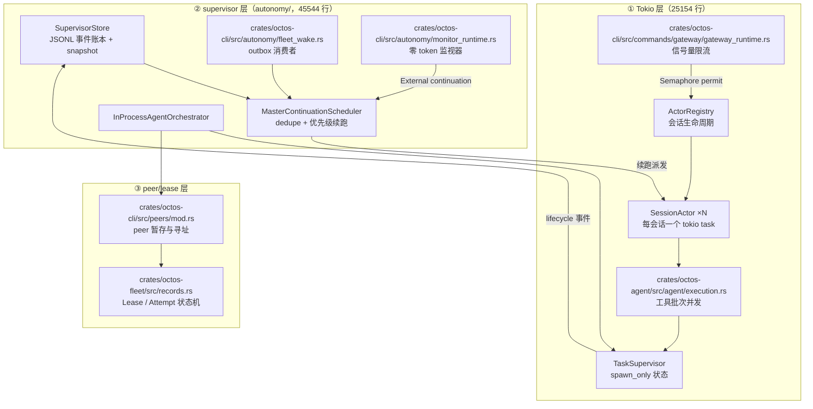
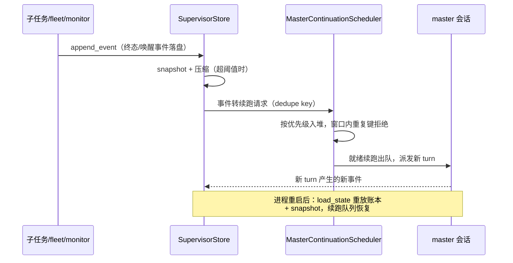
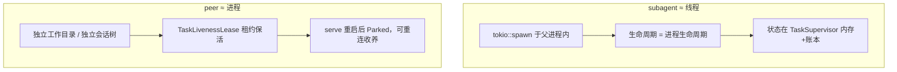

# 第 12 章：并发模型：三层调度的生产实现

> **定位**：本章讲 octos 的并发模型如何分三层协同：Tokio 层的 session actor、信号量限流与工具批次并发；supervisor 层把长程编排做成重启幸存的事件账本与续跑调度；peer/lease 层用进程隐喻和租约管理多 agent。前置依赖：第 5 章（Agent Loop）、第 10 章（Harness 与事件 ABI）。适用场景：想看 Rust 异步并发在生产系统里如何落地的开发者，以及需要调优 gateway 并发参数的运维者。fleet 状态机细节详见第 16 章，goal/peer 编排详见第 18 章。

## 12.1 从一组数字说起

把并发相关源码按职责切开数一遍：17 个文件、74692 行、722 个公开符号，分成三层。

| 层 | 文件数 | 行数 | 关键符号数 | 代表文件 |
|---|---|---|---|---|
| ① Tokio 层（session actor / 信号量 / 工具并发 / 关停） | 5 | 25154 | 170 | `crates/octos-cli/src/session_actor.rs` 10094 行、`crates/octos-agent/src/agent/execution.rs` 4730 行 |
| ② supervisor 层（`autonomy/` 十文件） | 10 | 45544 | 454 | `crates/octos-cli/src/autonomy/agent_orchestrator.rs` 33639 行、`crates/octos-cli/src/autonomy/supervisor_store.rs` 3277 行 |
| ③ peer/lease 层 | 2 | 3994 | 98 | `crates/octos-cli/src/peers/mod.rs` 3186 行、`crates/octos-fleet/src/records.rs` 808 行 |

三个数字说明一件事：并发在 octos 里早已越过「怎么用 Tokio」的阶段。Tokio 层只占三分之一行数，真正的大头是 supervisor 层：4.5 万行代码在解决一个 Tokio 本身不管的问题：进程重启之后，编排状态怎么办。



本章按这个分层走：先讲 Tokio 层的会话状态所有权与并发分界（12.2–12.5），再讲 supervisor 层为什么存在、怎么落地（12.6），最后交代 peer/lease 层作为并发原语的角色（12.7），12.8 收在优雅关停。

## 12.2 Tokio 层：会话 actor 与分层 spawn

单用户 CLI 模式下 Agent 顺序执行，没有并发问题。Gateway 或 Serve 模式下，多个用户同时发消息，每个会话还夹杂取消、后台子任务结果与状态投递。octos 的答案不是给共享状态加锁，而是 session actor：每个会话由一个长期存活的 tokio 任务独占管理，核心状态只有这一个 owner。

入口在 `ActorRegistry`（`crates/octos-cli/src/session_actor.rs:2524`）。它持有 actor 表、工厂和一把信号量；新会话到来时创建 actor 并 `tokio::spawn(actor.run())`（`crates/octos-cli/src/session_actor.rs:4122`）。actor 本体 `struct SessionActor` 在 `crates/octos-cli/src/session_actor.rs:4455`，持有会话键、工具注册表、工作目录，以及两个关停标志（12.8 展开）。外部世界通过 `ActorHandle`（`crates/octos-cli/src/session_actor.rs:2502`）向 actor 的信箱发消息，信箱消息就是 `ActorMessage` 枚举（`crates/octos-cli/src/session_actor.rs:2443`）：

```rust
pub enum ActorMessage {
    /// A user message to process.
    Inbound { message: InboundMessage, /* … */ },
    BackgroundResult { /* … */ },
    TaskStatusChanged { /* … */ },
    ApprovalExpired { request_id: String },
    Cancel,
}
```

五种消息覆盖了 actor 要响应的全部事件类别：新输入、后台子任务结果、任务状态变化、审批过期、取消。同一会话的两条消息不可能并发修改历史，因为它们都在同一个 actor 的信箱里排队，由 actor 依次处理。

分层 spawn 是这层的主干。`tokio::spawn()` 在源码里出现在四个层级：

1. 会话级：`ActorRegistry` 为新 session 起 actor，长期存活（`crates/octos-cli/src/session_actor.rs:4122`）。
2. 消息级：actor 把当前消息的主 Agent 调用派生成独立任务，自己继续轮询信箱，随时能接住 `Cancel` 与后台结果。
3. 工具级：单轮多个 tool call 时每个工具各起一个任务（`crates/octos-agent/src/agent/execution.rs:701`），再按批次策略聚合（12.4）。
4. 后台级：`spawn` 工具的 background 模式起长期子 Agent，可见状态交给 `TaskSupervisor`（12.5）。

gateway 侧还有两个辅助 spawn：Ctrl+C 信号处理（`crates/octos-cli/src/commands/gateway/gateway_runtime.rs:1653`）与系统提示词的异步刷新（`crates/octos-cli/src/commands/gateway/gateway_runtime.rs:1713`）。派发参数统一由 `DispatchParams`（`crates/octos-cli/src/session_actor.rs:86`）从 gateway 传到 actor。

并发与串行的分界因此非常清楚：跨会话完全并发（每个 actor 一个任务）；会话内串行（信箱排队）；单轮工具调用按批次准入策略选择并行或串行；后台任务脱离主对话流，靠状态回投汇合。

> **工程决策：共享 Mutex、spawn-per-message 与 Session Actor**
>
> 三种方案的取舍：
>
> - 共享 `Mutex<SessionState>`：实现最快，但锁粒度随状态膨胀，一条消息持锁跨 await 会把其他会话的消息也堵住，取消信号更难插队。旧稿 v1 时代曾按「per-session Mutex 序列化」描述，当前源码已不是这个模型。
> - spawn-per-message（每条消息一个无状态任务）：并发度最高，但会话历史、工具注册表、工作区必须外置到共享存储，状态一致性重新变成锁问题。
> - Session Actor：状态所有权唯一，消息天然排队，取消只是信箱里的一条 `Cancel`。代价是 actor 自身要管理生命周期（空闲回收、死亡重生时保留 profile 覆盖，见 `ActorHandle` 字段注释）。
>
> octos 选第三种，代价被 `ActorRegistry` 集中承担，业务侧只面对 `ActorMessage`。

## 12.3 信号量限流：max_concurrent_sessions

会话数量要有上界。gateway 启动时创建信号量，容量直接取配置：

```rust
// Semaphore to bound concurrent session processing
let concurrency_semaphore = Arc::new(Semaphore::new(gw_config.max_concurrent_sessions));
```

位置在 `crates/octos-cli/src/commands/gateway/gateway_runtime.rs:1731-1732`，紧随其后就把这把信号量交给 `ActorRegistry::new`。上限来自配置项 `max_concurrent_sessions`，serde 声明在 `crates/octos-cli/src/config.rs:1548-1549`，默认值函数 `default_max_concurrent_sessions()` 在 `crates/octos-cli/src/config.rs:1633`，函数体返回字面量 `10`（本会话亲测）。启动日志会打印这个值（`crates/octos-cli/src/commands/gateway/gateway_runtime.rs:1666`）。

permit 的消费点不在 gateway，而在 actor 侧的消息处理入口：`crates/octos-cli/src/session_actor.rs:7485` 与 `crates/octos-cli/src/session_actor.rs:9293` 两处 `self.semaphore.acquire().await`。这个位置决定了排队行为：超过 10 个会话同时在处理消息时，第 11 个会话的消息任务在 `acquire()` 上挂起等待，而不是被拒绝；actor 本身还活着、还能收消息，只是新消息的处理被信号量挡住。等某个活跃会话的处理结束、permit 释放，排队中的下一个自动获得执行权。

把限流放在消息处理层而非会话创建层，是一个有意识的选择：空闲会话不占并发额度，10 个名额全部留给真正在跑 LLM 调用的会话。

## 12.4 工具并发：批次准入三策略

单轮 LLM 响应包含多个 tool call 时，`execute_tools`（`crates/octos-agent/src/agent/execution.rs:2483`，可见性为 `pub(super)`，模块内部 API）不盲目并行。每个工具通过 `concurrency_class` 报告自己是 `Safe`（只读、无副作用）还是 `Exclusive`（写操作），执行器按整批构成选三种策略之一（模块文档 `crates/octos-agent/src/agent/execution.rs:7-26`）：

- All-Safe 批：每个调用 `tokio::spawn` 成独立任务（`crates/octos-agent/src/agent/execution.rs:701`），`futures::future::join_all` 聚合并保持调用顺序（`crates/octos-agent/src/agent/execution.rs:2992`）。
- All-Exclusive 批：按 LLM 调用顺序串行执行；首个错误（含 hook 拒绝与 panic）之后剩余调用跳过，各自收到合成的「因兄弟任务出错而取消」结果，保证每个 `tool_call_id` 都有应答。
- 混合批（#1766）：第一阶段并行跑所有 Safe 调用，第二阶段按原顺序串行跑 Exclusive 调用，最终按原始调用顺序重组结果。

并行路径还带统一超时：`join_parallel_handles`（`crates/octos-cli` 无关，位于 `crates/octos-agent/src/agent/execution.rs:2959` 起）对每个 handle 施加同一 deadline，超时先 `abort()`，再给一段有界的清理宽限等待，然后返回合成超时结果。LLM 看到的永远是一一对应的工具结果列表，并行细节不外泄。

两道闸（信号量与批次准入）解决的是不同粒度的过载，判据也不同。信号量闸的判据是资源：LLM 调用贵且慢，10 个并发会话大致对应上游配额与内存的安全水位，超了就该排队，排队无害。批次准入的判据是语义：并行本身没有成本问题，问题是 Exclusive 工具之间有顺序依赖（同一文件的写与写、写与读），乱序执行的结果不是慢而是错。所以信号量用「等待」处理超限，批次准入用「降级为串行」处理冲突，一个是背压，一个是正确性防御。把两者混在一处会出现经典误判：有人看到工具串行执行以为是并发不够，实际是批次里有 Exclusive 成员在保护语义。判别方法是看批次的构成：全 Safe 批永远并行，出现串行必有 Exclusive 参与（#1766 之前混合批整体串行，之后只串行必要部分，这是那次优化的全部内容）。

子 Agent 的并发形态由 `spawn` 工具的 `mode` 参数决定：`"background"`（默认，`crates/octos-agent/src/tools/spawn.rs:1929` 的 `default_mode()`）或 `"sync"`（`crates/octos-agent/src/tools/spawn.rs:1855` 的字段定义，JSON schema 在 `:3004`）。sync 模式阻塞当前轮次等子 Agent 完成，结果直接进本轮上下文；background 模式把子 Agent 剥离主对话流，完成后以 `BackgroundResult` 消息回到 actor 信箱。前者适合「下一步依赖子任务产出」的场景，后者适合「发了就不用管、晚点收结果」的场景。

## 12.5 spawn_only 生命周期：TaskSupervisor

后台任务不是 fire-and-forget。`TaskSupervisor`（首行文档「Background task lifecycle management for spawn_only tools.」，`crates/octos-agent/src/task_supervisor.rs:1`）是一个状态库：跟踪 spawn_only 任务从派生到终态，并明确声明自己不执行 workspace contract：契约校验先发生，校验通过才更新 supervisor 状态（模块文档前六行）。运行状态用 `TaskStatus`（`crates/octos-agent/src/task_supervisor.rs:140`）：

```rust
pub enum TaskStatus {
    Spawned, Running, Completed, Failed,
    Cancelled,   // 用户取消，终态（:173 is_terminal）
    Parked,      // #27c：serve 重启后的孤儿任务，等待客户端重连收养
}
```

六个状态里 `Parked` 最特殊：它既非活跃（`is_active` 只含 Spawned/Running，`crates/octos-agent/src/task_supervisor.rs:164`）也非终态（`crates/octos-cli` 不涉及；`is_terminal` 在 `crates/octos-agent/src/task_supervisor.rs:173`），因为任务的工作成果（staged peer 的 brief 与 worktree）还在磁盘上，客户端重连后 `mark_running` 能把它救活。这正是「状态要不要持久化」影响并发语义的直接例子。

防失控有硬上限：每父会话最多 200 个注册子任务（`MAX_CHILDREN_PER_PARENT`，`crates/octos-agent/src/task_supervisor.rs:43`），可用环境变量 `OCTOS_MAX_CHILDREN_PER_PARENT` 在进程启动时覆盖（`:41` 的文档与 `:77` 的读取）。超限注册返回 `RegisterTaskError`（`crates/octos-agent/src/task_supervisor.rs:90`）。

对外的生命周期投射是另一个枚举 `TaskLifecycleState`（`crates/octos-agent/src/task_supervisor.rs:243`）：Queued、Running、Verifying、Ready、Failed、Cancelled。`BackgroundTask::lifecycle_state()`（`crates/octos-agent/src/task_supervisor.rs:363`）把内部 `TaskStatus` 翻译成这组面向调用方的状态。内部状态机关心「worker 还在不在」，投射状态关心「产出可不可信」，Verifying 这一态就是给 workspace contract 校验留的位置。两套状态的映射关系如下：

| 内部 `TaskStatus` | 投射 `TaskLifecycleState` | 语义分界 |
|---|---|---|
| Spawned | Queued | 已注册，worker 未起 |
| Running | Running | worker 在跑 |
| Completed | Ready（经 Verifying） | 校验通过，产出可信 |
| Failed | Failed | 执行失败 |
| Cancelled | Cancelled | 用户主动取消 |
| Parked | Cancelled（#27c 复用空闲投射槽，crates/octos-agent/src/task_supervisor.rs:373） | 等待重连收养，非终态非活跃 |

这个投射有两个消费面。MCP 侧：`octos mcp-serve` 只暴露一个工具 `run_octos_session`（`crates/octos-agent/src/mcp_server.rs:66`），会话派发通过 `SessionLifecycleObserver::mark_state`（`crates/octos-agent/src/mcp_server.rs:145`）上报 Queued → Running → Verifying → Ready/Failed 的迁移（trait 文档在 `:142-144`）；外层 MCP caller 最终收到的是会话级聚合结果（`final_state: TaskLifecycleState`，`:108`），不是内部工具事件流。Harness 侧：`McpServerCall` 事件携带 `outcome` 字段，取值 `ready/failed/queued/running/verifying`，与 `TaskLifecycleState` 一一对应（`crates/octos-agent/src/harness_events.rs:651-652`，事件变体定义见 `:397` 附近），后台任务的生命周期由此进入 harness events 与 metrics，成为 operator 可观测面的一部分。

## 12.6 supervisor 层：重启幸存的长程编排

Tokio task 活在进程里，进程一死全部蒸发。对「跑十分钟的工具调用」这无所谓；对「今天要把这本书二十一章写完」这种跨小时跨天的目标，编排状态必须比进程活得久。supervisor 层的 45544 行代码都在回答这一个问题。

> **工程决策：为什么把长程编排从 Tokio task 提升为持久化 supervisor**
>
> 一个长程目标（比如派 5 个 peer 各写一章）天然是多次进程生命周期的叠加：master 会重启，peer 会跑很久，结果会晚到。如果编排状态只存在于内存里的 task 树，重启即失忆，唯一的恢复手段是让人重新下达指令。
>
> 提升为持久化 supervisor 后，三件事变了：状态落盘为事件账本，重启后重放恢复；「谁该被唤醒继续跑」从隐式的 task 依赖变成显式的续跑队列；长任务的完成不再要求任何进程持续存活。代价是所有状态迁移都要写成事件、都要处理重放幂等，这正是 `crates/octos-cli/src/autonomy/supervisor_store.rs` 与 `crates/octos-cli/src/autonomy/master_continuation_scheduler.rs` 加起来近五千行的原因。

### 事件账本：SupervisorStore

`SupervisorStore`（`crates/octos-cli/src/autonomy/supervisor_store.rs:697`）管理四个路径：事件文件、轮转事件文件、snapshot 与锁。事件文件名固定 `supervisor-events.jsonl`（常量在 `:25`），压缩后保留单代 `.old`（`:33`），且 `.old` 只用于取证、永不重放；降级到不认识 snapshot 的旧二进制时，它看到的会是截断视图，注释里把这个兼容性代价写得很直白。

崩溃恢复的设计核心在 `load_state`（`crates/octos-cli/src/autonomy/supervisor_store.rs:780`）里，只有十几行：先读 snapshot（若有），取其 `last_sequence` 作为水位线；再读账本行，只重放 `row.sequence > snapshot_last_sequence` 的尾部行（`:780-793`）。重放靠 `apply_ledger_row`（`:381`）把每行事件应用到状态机，事件以 serde 的 `type/payload` 标签自包含（`:300-304` 的注释解释了为什么变体按值携带完整记录：重放不需要热路径上的装箱优化）。三个设计决策撑起这套重放：

第一，快照节奏是行数触发而非时间触发。`SNAPSHOT_EVERY_APPENDS = 512`（`crates/octos-cli/src/autonomy/supervisor_store.rs:49`），常量注释给出了取值依据：512 行让启动重放尾巴保持在几百 KB、毫秒级解析，同时把全量序列化加 fsync 的代价摊到数百次 append 上；计数对象是账本里的行数而非单进程的 append 次数，多个写者共享一个账本时仍会在尾巴越线时统一压缩。

第二，`last_sequence` 是单调水位线而不是计数器。`apply_ledger_row` 每应用一行就取 `max`（`:381-382`），`load_state` 装载时也对 snapshot 与状态里的水位线取 `max`（`:784`）。这意味着乱序到达或多写者交错写入的行不会让水位线回退，snapshot 只需声明「截至哪个序号」就能安全截断重放。

第三，`.old` 一代轮转是取证妥协而不是恢复路径。压缩把已应用的行移入 `.old` 后，旧二进制（不认识 snapshot 的 pre-#1974 构建）重放 live 尾巴会得到截断视图；宁可让降级者看到少，也不让任何版本误读，因为认识 snapshot 的构建会拒绝 `schema_version` 更新的快照（`load_snapshot`，`:876`）而不是猜着解析。

写侧的四个方法在这套读语义上闭合：`write_snapshot`（`:905`）、`snapshot_now`（`:920`，带锁的强制压缩入口）、`append_event`（`:935`，写入同时按水位线判断是否触发压缩）。账本因此是一个「append 快、恢复有界」的结构：正常运行时每次事件只是一次追加写，崩溃后恢复成本被 512 行的尾巴钉死在上界。

### 续跑调度：MasterContinuationScheduler

账本记录「发生了什么」，调度器决定「接下来谁跑」。`MasterContinuationScheduler`（`crates/octos-cli/src/autonomy/master_continuation_scheduler.rs:477`）内部是一个 `BinaryHeap` 加一个按 dedupe key 索引的 `pending_by_key` 表（`:506` 起的 impl）。每个续跑请求带身份与去重键：`MasterContinuationId`（`:99`）、`MasterContinuationDedupeKey`（`:112`）、`MasterContinuationRequest`（`:221`）。

续跑原因是有优先级的：`MasterContinuationReason`（`:137`）枚举 ChildCompleted、ScatterJoinComplete、LoopFire、GoalContinue、GoalWrapUp 与 External(String)，映射到 `MasterContinuationPriority`（`:186`）：LoopFire 最高，泛化 External 唤醒最低，注释明说这是「刻意压低，除非未来接线把它映射到类型化原因」。结构体里还有一个 TOCTOU 防护字段 `recently_claimed_external`：同键的 External 续跑在窗口内重复入队会被拒绝，防止一次终态迁移被两条路径重复投递（`:477` 结构体字段文档）。去重键加优先级堆，就是「turn 结束后再创造 turn」的并发骨架；第 5 章从 loop 视角看过它的消费侧，完整语义属于第 18 章。

### outbox 唤醒与零 token 监视器

唤醒有两条外部通路。`crates/octos-cli/src/autonomy/fleet_wake.rs` 的后台消费者 `spawn_fleet_outbox_consumer`（`crates/octos-cli/src/autonomy/fleet_wake.rs:343`）用 `tokio::spawn` 起一个每 3 秒的 interval 循环（常量 `FLEET_WAKE_INTERVAL_SECS`，`:59`），反复调用 `drain_fleet_outbox_once`（`:235`）把 fleet 内核 outbox 里的唤醒提交转成 keeper 的续跑请求。轮询而非推送，换来的是消费端崩溃后下一 tick 自动恢复，不丢唤醒。

`crates/octos-cli/src/autonomy/monitor_runtime.rs`（引入于 commit `c4f03647`，#1977/#1988，2026-08-12）提供零 token 的事件监视器：`MonitorMode`（`crates/octos-cli/src/autonomy/monitor_runtime.rs:72`）只有两态，Poll 模式按 `interval_secs` 周期执行探针命令、对 stdout 过滤后以「变化」为事件，Stream 模式跟随进程 stdout 逐行产出。监视器不花模型 token，只有观测变化时才通过 External 续跑唤醒 master，把「等一个外部条件」从对话循环里剥了出去。

### AgentOrchestrator：编排器的 RPC 面

多 agent 操作统一在 `AgentOrchestrator` trait（`crates/octos-cli/src/autonomy/agent_orchestrator.rs:606`）：`list_agents`、`read_agent_status`、`read_agent_output`、`list_agent_artifacts` 是必选方法，`spawn_agent`（`:662`）、`send_input`（`:675`）、`wait_agent`（`:688`）、`resume_agent`（`:699`）四个带默认实现，默认全部返回 `method_not_supported_error`。也就是说 trait 定义了完整的 RPC 面，但并非每个实现都接线了全部操作，读代码时不能假设四个生命周期方法处处可用。

生产实现是 `InProcessAgentOrchestrator`（`:746`，内部 impl 块从 `:1451` 起，trait 实现块在 `:9462`）。它把 `TaskSupervisor` 的后台任务镜像成 agent 状态，核心路径 `run_native_specialist`（`crates/octos-cli/src/autonomy/agent_orchestrator.rs:2471`）串起完整一次受监督专家执行：注册 native agent、运行子 Agent、推送 output 与 artifact、最后回写 supervisor。`crates/octos-cli/src/autonomy/goal_loop_runtime.rs`（1562 行）则提供 goal 与 loop 的调度策略原语：`GoalId`（`crates/octos-cli/src/autonomy/goal_loop_runtime.rs:10`）、`GoalRuntimePolicy`（`:239`，含 cadence 与 max_continuations）、`GoalRuntimeState`（`:265`，Active/Paused/Completed/Failed）。

诚实边界：当前实现是「一个 master 监督一组受管子 agent、按事件续跑」的编排器，不是任意互联、实时对话的 multi-agent society。RPC 面的存在容易让人高估它，四个默认返回错误的方法就是提醒。



## 12.7 peer/lease 层：进程隐喻与租约

第三层解决「多个 quasi-agent 并存」的隔离与恢复。`crates/octos-cli/src/peers/mod.rs` 的首行文档是「Peer-agent staging, addressing, and parked-prompt plumbing.」（`crates/octos-cli/src/peers/mod.rs:1`），第二段注明它是从 `api` 门控的 `ui_protocol` 树里逐字提升出来的（Phase 3 peer-goal 提取，只改模块位置与可见性，逻辑未动）。peer 的并发原语角色体现在 `PeerTaskBinding`（`:166`）：把一个 peer 绑定到一条 `TaskLivenessLease` 上，绑定与退役走 `bind_peer_supervised_task`（`:241`）等函数，peer 的存活因此与 supervisor 的租约一致。

fleet 侧的并发原语是两个小结构体。`Lease`（`crates/octos-fleet/src/records.rs:250`）只有 `owner_epoch` 与 `expires_at_ms` 两个字段：daemon 每次启动拿到新 epoch，外来 epoch 或已过期的租约会由 recovery reconciliation 回收。一句话，重启后的旧主人自动失权。`Attempt`（`:256`）给一次执行尝试建档案，fleet id 冗余存储，使 `(child_id, attempt_id)` 就能定位 child 行。

peer 与 subagent 的差异可以用一张对比图说清：



subagent 像线程：共享进程命运，轻量，随父进程蒸发。peer 像进程：有自己的地址（slug）、自己的工作目录，靠租约声明存活，进程重启后工作成果仍在磁盘上等待收养。

fleet 侧的租约语义值得在本章展开，因为它是「并发所有权如何跨进程传递」的最小完整样本。`Lease` 结构体本身只有两个字段（`crates/octos-fleet/src/records.rs:250`）：`owner_epoch` 是本次 daemon 启动的身份，`expires_at_ms` 是绝对过期时刻。获取发生在派发时：`crates/octos-fleet/src/store.rs` 构造 `Attempt` 时把 `status` 置为 `Leased`、写入 `lease { owner_epoch, expires_at_ms: now_ms + lease_ttl_ms }`（`crates/octos-fleet/src/store.rs:990-1001`，TTL 加法用 `checked_add` 防溢出）。续期不是显式 API：worker 转入执行态走 `mark_running`（`crates/octos-fleet/src/store.rs:1053`），租约字段随 attempt 行持久存在，真正检查它的是所有写路径上的谓词。

让渡与回收靠同一个四部谓词。`complete_child`（`crates/octos-fleet/src/store.rs:1158`）提交结果前要求四个条件同时成立：child 的 `current_attempt_id` 指向本 attempt（attempt-id 栅栏，挡住同代重试）、attempt 状态为 `Running`、`generation` 等于 fleet 当前代（代栅栏，挡住重规划后的旧尝试）、`lease.owner_epoch` 等于调用者 epoch（租约栅栏，挡住重启后的旧主人），谓词本体在 `:1230-1237`。任一不满足就返回 `Superseded`，结果整个丢弃、账面零变动。回收则发生在 boot reconciliation：非终态 attempt 若租约的外来 epoch 不匹配或 `expires_at_ms` 已过（`crates/octos-fleet/src/store.rs:2276-2277` 的 stale 判定），被无条件置为 `Interrupted` 并释放预算预留；注释里记录了 #1973 修复：此前 `Cancelled` 的 fleet 被整体跳过，attempt 与预留被永久钉死。

这套设计的并发含义：旧进程崩溃后，新进程不需要与任何人协商：epoch 不同就自动失权，过期就自动回收，正确性不依赖崩溃方配合。租约与 supervisor 层的事件账本是同一命题的两个答案：账本用重放恢复「编排到哪了」，租约用栅栏废黜「不该再动的人」。Lease/Attempt 的完整状态机详见第 16 章，goal/peer 的编排语义详见第 18 章。

## 12.8 优雅关停：两个 AtomicBool

关停用两个原子布尔分层。`global_shutdown` 与 `cancelled` 是 `SessionActor` 的字段（`crates/octos-cli/src/session_actor.rs:4500-4503`）：前者是进程级信号（Ctrl+C），后者只影响当前会话。actor 对外的 `ActorHandle.shutdown`（`crates/octos-cli/src/session_actor.rs:2872`）暴露的也是 `Arc<AtomicBool>`。

写入侧在 gateway 的 Ctrl+C 处理任务里（`crates/octos-cli/src/commands/gateway/gateway_runtime.rs:1653`）：`ctrl_c().await` 返回后 `shutdown.store(true, Ordering::Release)`。Release 序保证此前的所有写入对获取者可见；读取侧用 `Ordering::Acquire` load，保证 actor 看到关停标志时也看到标志前的全部状态变更。一对 Release/Acquire 就是这条控制信号的全部内存序契约，没有锁。

广播式回收走另一条路：`ActorRegistry::shutdown_all`（`crates/octos-cli/src/session_actor.rs:2795`）直接 drop 全部 sender，actor 的 `recv()` 返回 `None` 后自然退出——信箱耗尽即关停，不需要每个 actor 轮询标志。两条路径互补：AtomicBool 给运行中的任务一个协作式检查点，drop sender 给等待中的 actor 一个确定性的终结。

## 12.9 小结

| 层 | 解决的并发问题 | 关键机制 | 代价 |
|---|---|---|---|
| Tokio 层 | 多会话并行、会话内一致 | session actor 独占状态、信号量限流、批次准入 | actor 生命周期管理 |
| supervisor 层 | 跨重启的长程编排 | 事件账本 + snapshot、dedupe 优先级续跑、outbox 轮询 | 近五千行持久化与重放代码 |
| peer/lease 层 | 多 agent 隔离与恢复 | 进程隐喻、epoch 租约、Parked 收养 | 状态机复杂度（详见第 16 章） |

三层不是替代关系而是叠加关系：supervisor 的续跑最终还是要派发回某个 session actor 执行；peer 的存活判断复用 TaskSupervisor 的状态机。并发原语的分层，本质是把「快」（内存态、微秒级）、「久」（磁盘态、跨重启）、「隔离」（进程边界）三种正交需求分开买单。

## 延伸阅读

- 第 5 章：Agent Loop 的六阶段生命周期与预算闸；续跑队列的消费侧视角。
- 第 10 章：harness events 的完整事件 ABI，本章的 `McpServerCall` 是其中一个事件族。
- 第 16 章：fleet 的 Lease/Attempt/Recovery 状态机全貌。
- 第 18 章：goal 与 peer 的编排语义，`MasterContinuationScheduler` 的完整消费链。
- Tokio 官方文档 Graceful Shutdown 章节：运行时级优雅停机的任务取消与等待语义。

## 思考题

1. 若把 `max_concurrent_sessions` 从 10 调到 100，第 12.3 节的 permit 消费位置（消息处理层）会导致什么现象？如果 permit 改在会话创建层获取呢？
2. `TaskStatus::Parked` 不属于 `is_active` 也不属于 `is_terminal`。设计一个并发场景，说明若把 Parked 误归为终态会破坏什么。
3. 混合批策略（#1766）先并行 Safe 再串行 Exclusive，为什么不能反过来？结果按「原始 LLM 调用顺序重组」这一约束，消费方依赖它做什么？
4. `MasterContinuationScheduler` 的 TOCTOU 防护只记录 External 键。若一个新的 Internal 生产者也会在窗口内重复入队同键，会发生什么？注释里的 INVARIANT 要求新生产者怎么做？
5. `shutdown_all` 靠 drop sender 让 actor 退出。如果一个 actor 正在执行一个 30 分钟的工具调用，这条路径的表现与 `global_shutdown` 标志路径有何不同？

## 版本演化说明

- 本章分析基线：octos main @ `9c157101`（2026-09-02 检出），行号与数字均为该 commit 实测；事实表见 `assets/ch12-facts.md`（2026-09-03）。
- 相对 v1 旧稿（原第 11 章）的变化：叙事从「per-session Mutex 序列化」纠正为 session actor 状态所有权模型；新增 supervisor 层（`autonomy/` 十文件）与 peer/lease 层两章内容；`crates/octos-cli/src/autonomy/monitor_runtime.rs` 引入于 `c4f03647`（2026-08-12），当前行号含后续 `e2f999a0`（clippy 格式化）与 `0c44b26f`（OLP control channel）两次提交的偏移。
- 事实表四条「待 writer 核」已在本会话亲测：`default_max_concurrent_sessions()` 返回字面量 `10`；`crates/octos-agent/src/task_supervisor.rs` 与 `crates/octos-cli/src/config.rs` 首行均有 `//!` 文档（事实表原记「无/未采集」有误）；`crates/octos-cli/src/autonomy/agent_orchestrator.rs` 骨架行号 606/746/1451/2471/9462 全部确认；`crates/octos-agent/src/agent/execution.rs` 对外入口为 `pub(super) fn execute_tools`（`:2483`），本章按此口径引用。
