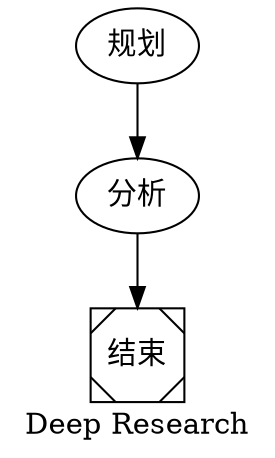
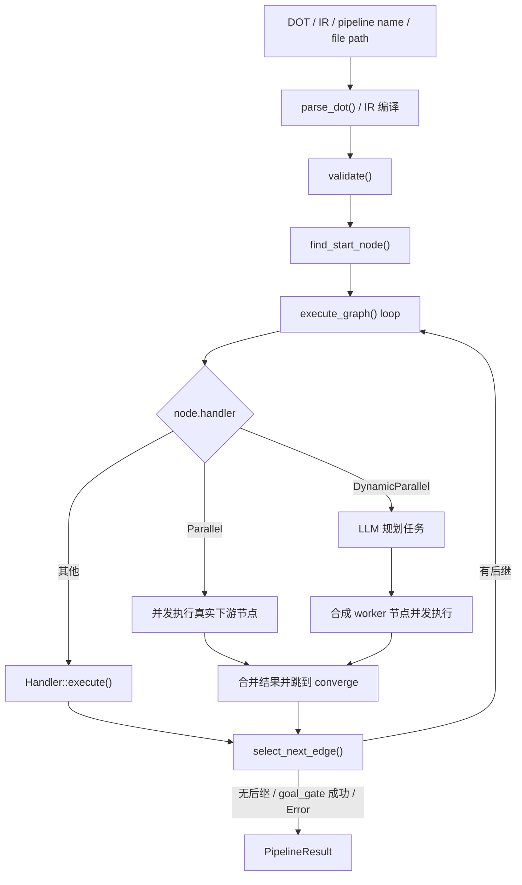

# 第 13 章：octos-pipeline：DOT 图驱动的工作流引擎

> **定位**：本章对照 `crates/octos-pipeline/src/`，解释 octos 如何把 Graphviz DOT 图解析成带类型的 `PipelineGraph`，执行器如何在九种 HandlerKind、十二种 IR 节点、静态并行、动态并行、检查点恢复、deadline 护栏和父会话资源继承之间落地，以及 `run_pipeline` 工具把 pipeline 暴露给 Agent 的方式。前置依赖：第 5 章、第 8 章、第 10 章、第 11 章。适用场景：需要理解多步骤 Agent 编排机制的开发者。

当任务已经不是"单个 Agent 循环 + 几次工具调用"能解决的问题时，就需要显式的工作流编排。典型例子是：先规划研究角度，再并发检索，再汇总分析，最后生成报告。`octos-pipeline` 解决的就是这类问题，但它的当前实现和"传统 DAG 调度器"的直觉并不完全一样：它既有图结构，也有运行时分支选择、并发汇合、模型路由和工具策略继承；同时还通过 `PipelineHostContext` 继承父 session 的文件缓存、子 Agent 输出路由、任务监督器和成本账本，让 pipeline 节点不再像早期实现那样孤立运行。

---

## 13.1 DOT 图如何进入运行时

### 13.1.1 为什么是 DOT

octos 用 Graphviz DOT 定义工作流，而不是 YAML/JSON。原因不是"DOT 更潮"，而是它天然把节点和边作为一等语义：同一个文件既能被执行器解析，也能直接被 Graphviz 渲染成图。



这个例子已经体现了当前 parser 支持的几类关键能力：

- 图级属性：`graph [label=..., default_model=...]`
- 节点属性：`handler`、`model`、`tools`、`converge`、`planner_model` 等
- 边：`A -> B`
- 形状到 Handler 的隐式映射，例如 `Msquare` 会映射到 `Noop`

### 13.1.2 手写 parser，而不是第三方 DOT 库

入口是 `crates/octos-pipeline/src/parser.rs:21-23` 的 `parse_dot()`，真实工作发生在 `DotParser::parse()`（struct 定义在 `crates/octos-pipeline/src/parser.rs:45`，impl 在 `:50`）。这是一个手写 parser，不依赖外部 DOT 解析库。当前文件已增长到 1,445 行。

当前实现比"只支持一小撮语法"的简化说法要丰富一些：

- `digraph` 名称是可选的；如果模型生成了 `digraph { ... }`，parser 会把图 ID 设成 `"pipeline"`（`crates/octos-pipeline/src/parser.rs:63-65`）
- 支持图级属性 `graph [key=value]`，除了 `label` 和 `default_model`，现在还接受 `max_total_tokens`（运行级 token 预算）、`default_timeout_secs`（每条 pipeline 的默认墙钟超时）和 `result_fidelity`（结果体积降级注解），落点都在 `apply_graph_attrs()`（`crates/octos-pipeline/src/parser.rs:520-537`）
- 支持 `subgraph name { ... }`，并把子图中的节点归档到 `PipelineGraph.subgraphs`（`crates/octos-pipeline/src/parser.rs:148-150`、`crates/octos-pipeline/src/graph.rs:48`）
- 支持边链式写法 `a -> b -> c`，属性会应用到链上的每一条边（`crates/octos-pipeline/src/parser.rs:163`）
- 支持 `//`、`/* */`，以及额外的 `#` 行注释；后者明显是在为 LLM 生成的 DOT 做容错（`crates/octos-pipeline/src/parser.rs:479-502`）
- 如果边引用了未显式声明的节点，parser 会自动补出默认节点定义（`crates/octos-pipeline/src/parser.rs:110-127`）

这一层的结果不是"松散的 JSON 树"，而是带语义的 `PipelineGraph`。其核心结构在 `crates/octos-pipeline/src/graph.rs:10-54`（图）和 `:118-184`（节点）：

- `PipelineGraph` 有 `id`、`label`、`default_model`、`max_total_tokens`、`default_timeout_secs`、`result_fidelity`、`nodes`、`edges`、`subgraphs`。后三个 graph 级字段是旧稿没有的
- `PipelineNode` 除了 `prompt` 和 `handler`，还包含 `model`、`context_window`、`max_output_tokens`、`max_iterations`、`tools`、`goal_gate`、`max_retries`、`timeout_secs`、`suggested_next`、`converge`、`worker_prompt`、`planner_model`、`max_tasks`、`deadline_secs`、`deadline_action`、`checkpoints`，以及 `human_gate`（`:163`）、`resolver`（`:166`）、`artifact_refs`（`:169`）、`checkpoint_refs`（`:172`）、`continue_on_error`（`:184`）

### 13.1.3 属性到节点语义的映射

节点构建发生在 `build_node()`（`crates/octos-pipeline/src/parser.rs:579-691`）。这里有几个实现细节决定了 DOT 的"作者体验"：

- Handler 解析顺序是：显式 `handler=` 优先，其次是 `shape=` 到 Handler 的映射（`crates/octos-pipeline/src/graph.rs:282-297`，字符串形式 `from_str` 在 `:270-279`），最后默认 `Codergen`（`crates/octos-pipeline/src/parser.rs:581-586`）
- `tools="a,b,c"` 会被拆成字符串列表；如果用户写了 `tools=""`，解析结果是一个只含空字符串的 deny-all 标记，执行器把它当成"显式禁用所有工具"处理（`crates/octos-pipeline/src/parser.rs:588-602`）
- `timeout_secs` 不只接受整数秒，也接受 `900s`、`15m`、`2h` 这类后缀写法（`crates/octos-pipeline/src/parser.rs:551-570`）
- `goal_gate` 允许用 `true/false/yes/no/1/0` 表达（`crates/octos-pipeline/src/parser.rs:619-623`）
- `deadline_secs` 支持 `ms/s/m/h` 和小数秒（`crates/octos-pipeline/src/parser.rs:601-603`，底层 `parse_duration_secs_f64` 在 `:665-689`）；`deadline_action` 支持 `abort`、`skip`、`escalate`、`retry:N` 和 `retry(N)` 两种写法（`crates/octos-pipeline/src/parser.rs:693-720`）
- `checkpoint="true"` 或 `checkpoint="name1,name2"` 会解析成 `MissionCheckpoint` 声明（`crates/octos-pipeline/src/parser.rs:721-751`）
- `max_iterations` 现在是可写的节点属性（`crates/octos-pipeline/src/parser.rs:620`，字段在 `crates/octos-pipeline/src/graph.rs:140`），见 13.2.1

这意味着 DOT 在 octos 里不是"纯拓扑描述"，而是一个轻量的工作流 DSL。

---

## 13.2 九种 HandlerKind 与十二种 IR 节点

`HandlerKind` 的真实枚举在 `crates/octos-pipeline/src/graph.rs:241-266`。当前源码是 9 种，旧稿写的 6 种已经过时：

| 类型 | 运行时落点 | 关键属性 | 作用 |
|------|-----------|---------|------|
| `Codergen` | `crates/octos-pipeline/src/handler.rs:641`（impl 起） | `prompt` `model` `tools` `context_window` `max_output_tokens` | 派生完整子 Agent |
| `Shell` | `crates/octos-pipeline/src/handler.rs:1054` | `prompt` `timeout_secs` | 执行 shell 命令，但被验证规则封禁（见 13.2.2） |
| `Gate` | `crates/octos-pipeline/src/handler.rs:1190` | `prompt` | 计算条件，不做人机等待 |
| `Noop` | `crates/octos-pipeline/src/handler.rs:1226` | 无 | 透传输入 |
| `Parallel` | `crates/octos-pipeline/src/executor.rs:2749` | `converge` | 对已有下游节点做静态 fan-out |
| `DynamicParallel` | `crates/octos-pipeline/src/executor.rs:3122` | `prompt` `worker_prompt` `planner_model` `max_tasks` `converge` | 先规划任务，再动态 fan-out |
| `ShellCheck` | `crates/octos-pipeline/src/handler.rs:1247` | `command` `timeout_secs` | 跑固定命令串，编译期锁死 |
| `Notify` | `crates/octos-pipeline/src/handler.rs:1326` | `message` `channel` | 给用户发通知 |
| `Wait` | `crates/octos-pipeline/src/handler.rs:1365` | `seconds` `until_condition` | 等固定秒数或轮询条件 |

还有一个容易忽略但很重要的事实：`Handler` trait（`crates/octos-pipeline/src/handler.rs:257`）的实现现在是 7 个：`CodergenHandler`（`:641`）、`ShellHandler`（`:1054`）、`GateHandler`（`:1190`）、`NoopHandler`（`:1226`）、`ShellCheckHandler`（`:1247`）、`NotifyHandler`（`:1326`）、`WaitHandler`（`:1365`）。`Parallel` 和 `DynamicParallel` 不是独立 handler 类型，而是 `PipelineExecutor::execute_graph()` 里的专门分支（`crates/octos-pipeline/src/executor.rs:2749` / `:3122`）。

handler 名到字符串的映射同步扩到 9 项，含 `shell_check`、`notify`、`wait`（`crates/octos-pipeline/src/executor.rs:251-259`）。

### 13.2.1 Codergen：节点就是一个子 Agent

`CodergenHandler`（struct `crates/octos-pipeline/src/handler.rs:293`，impl `:641-1041`）会为节点创建一个完整的 `octos_agent::Agent`，而不是做一次简化版 LLM 调用。这意味着节点天然继承了主 Agent 的很多能力：工具调用、循环式执行、token 统计、文件修改回传、进度事件上报。

它的关键行为有几层：

1. **Provider 解析。** 如果节点声明了 `model`，并且执行器配置了 `ProviderRouter`，handler 会走 `router.resolve()`，然后再包一层 capability-compatible fallback provider。这不是单纯的"model name -> provider"映射，而是带回退链的解析。
2. **上下文窗口覆盖。** `context_window` 会包装成 `ContextWindowOverride`。
3. **工具注册。** 节点初始工具集来自 `ToolRegistry::with_builtins()`，然后应用一次性缓存的 plugin registration，避免每个节点重复做插件 SHA 校验和可执行文件读取（`crates/octos-pipeline/src/handler.rs:23-56`）。
4. **工具策略。** 节点自己的 `tools=` 决定 allowlist；handler 仍会额外 deny `spawn`、`run_pipeline`、`send_file`、`message`，避免子节点递归失控；随后还会清理 spawn_only 标记，让原本 spawn_only 的插件工具在 pipeline worker 内同步执行（`crates/octos-pipeline/src/handler.rs:125-130`）。
5. **父会话资源继承。** 如果 `run_pipeline` 从 session actor 内触发，节点 worker 会继承父会话的 `FileStateCache`、`SubAgentOutputRouter`、`AgentSummaryGenerator`、`CostAccountant` 和 parent session key（`crates/octos-pipeline/src/host_context.rs:34-60`、`from_tool_context` 在 `:78`）。
6. **系统提示词与任务输入分离。** 执行器会先把 `{input}` 从 `prompt` 中移除，只保留角色/约束类说明；真正的前驱输出通过 `TaskKind::Code.instruction` 传给子 Agent。

和旧稿差异很大的一点是迭代预算：早期版本把 `AgentConfig.max_iterations` 硬编码成 30，节点无法干预。现在 `PipelineNode.max_iterations`（`crates/octos-pipeline/src/graph.rs:140`）是可写的 DOT 属性，`build_node()` 直接解析（`crates/octos-pipeline/src/parser.rs:620`）。字段注释写明了动机：pipeline 默认 30 次迭代对"逐个读 findings 文件再综合"的 synthesize 节点太低，预算耗尽在导航文件上、结果没发出来就把整条 pipeline 拖死。`None` 保持默认值。

另外，`max_output_tokens` 的默认行为也不是"全局 4096"。如果节点没写这个属性，handler 会退回到 provider 自身的最大输出能力。这对长报告生成很关键。

### 13.2.2 Shell：实现了，但被验证规则封禁

`ShellHandler` 本身仍是完整实现（struct `crates/octos-pipeline/src/handler.rs:1043`，impl `:1054-1135`）：命令来源是 `node.prompt`，非 Windows 下 `sh -c`、Windows 下 `cmd /C`，默认超时 300 秒，非零退出码映射成 `OutcomeStatus::Fail`，进程启动失败或超时映射成 `OutcomeStatus::Error`。

但当前版本里它有一条旧稿没写的封禁链：验证规则 `rule_23_no_shell`（`crates/octos-pipeline/src/validate.rs:242`）直接拒绝任何 `handler="shell"` 的图，理由是"shell 是任意代码执行"；同时 `build_handlers()` 干脆不注册 Shell handler（`crates/octos-pipeline/src/executor.rs:2409-2438`），作为纵深防御：即使某个图绕过了验证，也没有 handler 可派发。真正给 pipeline 用的命令执行入口是 `ShellCheck`（13.2.7）。

"测试跑了但失败"和"命令根本没起来"的区分仍然重要，因为执行器只对 `Error` 做重试：

- "测试跑了但失败"是业务失败，不重试
- "命令根本没起来"或"超时"才是系统错误，可重试

### 13.2.3 Gate：当前是条件节点，不是人工审批节点

这是本章最容易写错的一块。

执行器注册的是 `GateHandler`（struct `crates/octos-pipeline/src/handler.rs:1136`，`synthesize_predecessor_outcome` 在 `:1138`，impl `:1190-1222`），真实语义是：

- 把 `node.prompt` 当成条件表达式（为空时 `unwrap_or("true")`，变成 pass-through gate，`crates/octos-pipeline/src/handler.rs:1192`）
- 对直接前驱的 `NodeOutcome` 求值；单前驱保持原始状态，多前驱按 `Error > Fail > Skipped > Pass` 聚合
- 返回 `Pass` 或 `Fail`，`content` 直接透传，不发起人机交互

`crates/octos-pipeline/src/human_gate.rs` 的确存在，提供 `HumanInputProvider`、`ChannelInputProvider` 等抽象，默认超时 5 分钟（`DEFAULT_INPUT_TIMEOUT`，`crates/octos-pipeline/src/human_gate.rs:14-15`）。但我对照当前源码后可以明确说：这些抽象没有接进 `build_handlers()` 或 `execute_graph()` 主路径。所以"Gate = 人工审批节点"不是当前实现的准确说法。

更准确的表述是：

- `GateHandler` 是已接线的条件节点
- `crates/octos-pipeline/src/human_gate.rs` 是 crate 已提供、但尚未接入默认执行器的人机输入抽象

### 13.2.4 Parallel：静态 fan-out，执行真实下游节点

`Parallel` 不是"动态生成 worker"，而是把图里已经存在的下游节点并发跑掉。专门分支从 `crates/octos-pipeline/src/executor.rs:2749` 开始：

1. 收集当前节点所有 outgoing edges 的 target，作为并发目标（`:2756-2763`）
2. 要求当前节点必须声明 `converge`，否则报错"parallel node missing converge"（`:2751-2754`）
3. 派发前检查 pipeline 生命周期级 fan-out 总量上限，默认 `MAX_PIPELINE_FANOUT_TOTAL = 500`（常量在 `crates/octos-pipeline/src/executor.rs:102`，闸门 `:2804`）；超过上限直接拒绝整批派发，避免半批 worker 已经启动
4. 为每个目标节点克隆 `PipelineNode`，做变量替换，并在未显式声明模型时填入 `graph.default_model`
5. 为每个 LLM-call 分支预留成本预算，然后查它自己的 handler 并并发执行（并发度受 `ExecutorConfig.max_parallel_workers` 限制，字段 `:405`、使用点 `:2849`；`run_pipeline` 工具默认 8）
6. 合并内容、token、summary 和 node outcome
7. 把汇总后的文本写回"当前 parallel 节点"的 `completed` 结果，再跳到 `converge` 节点（跳转逻辑 `:3108-3121`）

两个实现细节值得记住：

- worker 的超时被 `MAX_FANOUT_WORKER_SECS = 3600` 秒封顶（`crates/octos-pipeline/src/executor.rs:121`）
- 执行器会用 `parallel_executed` 记住那些已经在 fan-out 阶段跑过的真实图节点，后续顺序遍历遇到它们时只选边，不重复执行

此外，结果合并不只是字符串拼接。合并之后还会自动扫描 worker 输出里提到的研究目录，把 `_search_results.md` 的内容内联进 merge 结果。这说明当前实现已经针对"研究型 fan-out -> 汇总型 converge"做了专门优化。

### 13.2.5 DynamicParallel：先规划，再合成 worker 节点

`DynamicParallel` 和 `Parallel` 的根本区别是：它不直接跑现成的图节点，而是先让 LLM 规划出任务列表，再为每个任务合成一个临时 `Codergen` 节点。专门分支从 `crates/octos-pipeline/src/executor.rs:3122` 开始：

1. 解析 `planner_model -> node.model -> graph.default_model` 的 planner provider 选择链
2. 用 `node.prompt` 作为规划提示词；若为空则退回内置 planner prompt
3. `plan_dynamic_tasks()`（`crates/octos-pipeline/src/executor.rs:1158-1272`）期望模型返回纯 JSON 数组；若解析失败或任务太少，退回 `fallback_tasks()`（`:1274-1300`）
4. 把 `worker_prompt` 里的 `{task}` 替换为具体任务说明，生成一批 synthetic `Codergen` 节点
5. 派发前同样检查 fan-out 总量上限，并为每个 synthetic worker 预留成本预算
6. 并发执行这些 synthetic 节点，合并结果后跳到 `converge`

它还有一个旧稿写错的行为：旧稿说 DynamicParallel "没有像 Parallel 那样再套一层 semaphore"。现在所有 run 入口（`run()`、`run_graph()`、`run_graph_with_handlers_throttled()`）都会先构造 pipeline 级 LLM semaphore（`pipeline_llm_semaphore()`，`crates/octos-pipeline/src/executor.rs:1640`），DynamicParallel 的 worker 同样要过这道闸。单次 fan-out 仍主要依赖 `max_tasks`（默认 8，字段注释见 `crates/octos-pipeline/src/graph.rs:118-184`），跨整个 pipeline 运行受 `MAX_PIPELINE_FANOUT_TOTAL = 500` 保护。

`node.model` 仍可写成逗号分隔的 model pool（例如 `"cheap,strong,cheap"`），执行器把 worker 轮询分配到不同模型上；这层分配现在由 `crates/octos-pipeline/src/model_assignment.rs` 承担（见 13.3.5）。

### 13.2.6 Noop：占位，但也很实用

`NoopHandler`（struct `crates/octos-pipeline/src/handler.rs:1223`，impl `:1226-1243`）就是把 `ctx.input` 原样返回。它有两个常见用途：

- 作为 start / finish 这类结构节点
- 作为某些条件分支的汇合点或透传点

顺带一提，`build_handlers()` 里 `DynamicParallel` 注册的也是 NoopHandler 占位（`crates/octos-pipeline/src/executor.rs:2409-2438`）；真执行走的是 executor 分支，注册只是让 registry 查找不落空。

### 13.2.7 三个新 handler：ShellCheck、Notify、Wait

这三个变体是 IR 调色板落地时新增的真 handler，各自一句话定位：

- `ShellCheckHandler`（`crates/octos-pipeline/src/handler.rs:1247`）：执行一条固定的命令串，命令在编译期锁死，没有 LLM 工具面。与被禁的 `Shell`（任意代码执行）相对，对应"跑测试、检查构建、数行数"这类只读命令场景，命令在 session workspace 里执行，输出作为节点结果
- `NotifyHandler`（`crates/octos-pipeline/src/handler.rs:1326`）：给用户发通知，`message` 加可选 `channel`（如 telegram、slack），基本不涉及 LLM
- `WaitHandler`（`crates/octos-pipeline/src/handler.rs:1365`）：等待固定秒数，或轮询一个 `until_condition` 条件直到为真或超时（默认 300 秒），无 LLM 调用

### 13.2.8 IR 调色板：十二种 IrNodeKind

直接给 LLM 暴露 9 种 HandlerKind 有一个问题：变体里混着执行机制（Parallel 是 executor 分支）和安全敏感面（Shell 被禁）。6b0de6ca 之后，`octos-pipeline` 引入了一层类型化 IR：`IrNodeKind`（`crates/octos-pipeline/src/ir.rs:57`，文件 673 行）当前实测 12 个变体：

```console
$ sed -n '/pub enum IrNodeKind/,/^}/p' crates/octos-pipeline/src/ir.rs | grep -cE '^\s{4}[A-Z]'
12
```

| # | IrNodeKind | 落点 | 语义（源码注释） |
|---|---|---|---|
| 1 | `Research` | Codergen 类 | 只读研究（web + file reads），cheap 模型；带 `max_iterations`（`:64`） |
| 2 | `Transform` | Codergen 类 | 对前驱输出做纯变换，cheap 模型 |
| 3 | `Synthesize` | Codergen 类 | 最终综合（只读），strong 模型；带 `max_iterations`（`:75`） |
| 4 | `Report` | Codergen 类 | 综合并经 `write_file` 落盘，terminal 步；带 `max_iterations`（`:84`） |
| 5 | `Gate` | Gate | 纯路由门，无 LLM，出边条件决定分支 |
| 6 | `Fanout` | DynamicParallel | 规划 N 个 worker 并行跑后 converge（`plan_prompt` / `worker_prompt` / `converge` / `max_tasks`） |
| 7 | `CodeReview` | Codergen 类 | 只读代码分析（read/grep/glob），可带 `scope` |
| 8 | `CodeEdit` | Codergen 类 | 改代码，可带预期 `files` |
| 9 | `ShellCheck` | ShellCheck handler | 固定命令串、编译期锁死 |
| 10 | `SubAgent` | spawn 子代理 | 独立 LLM 会话的子代理节点（`task` / `tools` / `model`，模型默认 strong） |
| 11 | `Notify` | Notify handler | 发通知，`message` + 可选 `channel` |
| 12 | `Wait` | Wait handler | 等固定秒数或轮询 `until_condition` |

每种 IR 节点在 `PaletteContract`（`crates/octos-pipeline/src/ir.rs:195`，查表函数 `contract_for` 在 `:204`）里有代码拥有的能力契约：落到哪个 `HandlerKind`、显式非空的工具 allowlist（空列表意味着全部内建工具，所以契约里不允许空）、默认模型。注释写得很直白：这些字段 LLM 永远看不到也改不了，按 kind 在编译期查表。

IR 枚举尾注里有一句值得整段抄进书里（`crates/octos-pipeline/src/ir.rs`，`IrNodeKind` 定义末尾）：**`human_gate` 是故意不加的**。因为 pipeline 执行器并不会把人工输入门路由到真正的审批 handler（裸 Gate 节点条件默认 `true`、自动通过），如果调色板里宣传一个 human_gate，等于提供了一条静默绕过审批的路径。尾注明确：只有等 HumanInputProvider 支撑的 handler 真正接线后才能加回来。

工具层对 LLM 暴露的也是 IR 而不是裸 handler：`run_pipeline` 的 `input_schema()` 有一个 `ir` 入参（typed-IR workflow program，JSON），但只在启用时出现在 schema 里，测试 `input_schema_exposes_ir_only_when_enabled`（`crates/octos-pipeline/src/tool.rs:2917`）固定了这个行为。

---

## 13.3 执行引擎不是"拓扑排序器"，而是带路由的图遍历器



**图 13-1：当前 `PipelineExecutor` 的真实主路径。** 它不是先做一次全图拓扑排序，再机械执行所有节点；而是从 start node 出发，在循环里按节点类型分流，并在每一步重新决定下一条边。

### 13.3.1 `run()` 的实际阶段

执行入口现在是一个家族：`PipelineExecutor::run()`（`crates/octos-pipeline/src/executor.rs:1650-1672`）、`run_graph()`（`:1673`）最终都收敛到 `run_graph_with_handlers_throttled()`（`:1772`），后者多做了两件事：构造 pipeline 级 LLM semaphore（`:1640`），以及开头那段 in-process 模型赋值（见 13.3.5）。整体流程仍可概括成七步：

1. `parse_dot()` 解析 DOT（或把 typed-IR 编译成图）
2. `validate()` 跑 lint 规则
3. `build_handlers()` 构建 handler registry（`crates/octos-pipeline/src/executor.rs:2409-2438`）
4. `find_start_node()` 决定入口节点
5. 如有 `CostAccountant`，先打开 pipeline 级预算 reservation
6. `execute_graph()` 进入主循环（`:2520` 起）
7. 若 pipeline 成功，跑 terminal validators；最终成功才提交 pipeline 级成本归因，否则 reservation 自动退款

这里最重要的纠偏是：第四步之后不是"拓扑遍历整个 DAG"，而是 `current_node_id` 驱动的增量遍历。这也是为什么 `suggested_next`、条件边、label 匹配这些运行时路由策略都能生效。

### 13.3.2 验证规则：23 条，含 Shell 封禁

验证器在 `crates/octos-pipeline/src/validate.rs`（入口 `validate()` `:181`、`validate_with_context()` `:186`、`find_start_node()` `:394`）。规则清单已经扩到 23 条（`:210-232`），比较重要的几条：

- Rule 1：必须能找到 start node（`start` 节点，或唯一一个无入边节点）
- Rule 2：不可达节点只是 warning，不是 error
- Rule 6：边条件必须能被 condition parser 解析
- Rule 13 / 14：`parallel` 和 `dynamic_parallel` 都必须声明有效的 `converge`
- Rule 18：模型名必须是已知键（`validate_model_name`，`crates/octos-pipeline/src/validate.rs:1046`，旧稿没写这条）
- Rule 23：`handler="shell"` 直接 Error（`:242`）
- 图中不能有环；环检测发生在 validate 阶段，不等执行时才爆炸（`detect_cycles`，`crates/octos-pipeline/src/graph.rs:54`）

这意味着 octos-pipeline 当前仍然要求 DAG，但执行方式不是"静态 DAG 调度器"，而是"受 DAG 约束的动态图遍历器"。

### 13.3.3 条件语言和边选择顺序

条件表达式的 grammar 写在 `crates/octos-pipeline/src/condition.rs`。当前运行时真正支持的核心写法是：

- `outcome.status == "pass"`
- `outcome.status != "fail"`
- `outcome.contains("keyword")`
- `!expr`、`expr && expr`、`expr || expr`

例如：

```dot
test -> deploy   [condition="outcome.status == \"pass\""]
test -> rollback [condition="outcome.status == \"fail\""]
report -> refine [condition="outcome.contains(\"missing data\")"]
```

旧稿里那种 `success` / `failure` 简写已经不符合当前 parser。

执行器选边不是"第一个命中就走"，而是一个 5 步算法（`select_next_edge()`，定义在 `crates/octos-pipeline/src/executor.rs:4882`）：

1. 先评估所有带条件的边
2. 如果有多个条件命中，按 `weight` 选最高权重
3. 若无条件命中，检查节点的 `suggested_next`
4. 再看 edge label 是否出现在 outcome content 里
5. 最后才在无条件边里按权重选；如果还没有，就退回目标名最小的边

还有一个微妙但重要的实现现状：`crates/octos-pipeline/src/condition.rs` 的 grammar 支持 `context.key == "value"`（`:12-17`、`:32-34`），模块也提供了带上下文的求值入口 `evaluate_with_context()`（`:69`）；但执行主路径的 `select_next_edge()` 和 `GateHandler` 走的还是 `evaluate()`。也就是说，`context.*` 目前是"语法已定义、模块具备显式 context 入参、主路径未喂值"的状态；真正稳定可用的还是 `outcome.*` 相关条件。

### 13.3.4 进度事件：crates/octos-pipeline/src/events.rs 与事件 ABI

旧稿完全没提的一块：`crates/octos-pipeline/src/events.rs`（296 行，`crates/octos-pipeline/src/lib.rs:12` 导出、`:36` 再导出）定义了结构化的 `PipelineEvent` 枚举（`crates/octos-pipeline/src/events.rs:14`）：

- `PipelineStarted`：图 ID、节点数、边数
- `NodeStarted`：节点 ID、handler、模型、label
- `NodeCompleted`：状态、耗时、token 用量
- `EdgeSelected`：从哪到哪、选择原因
- `ParallelFanOut` / `ParallelConverged`：fan-out 目标列表与汇合结果
- `PipelineCompleted`：成功与否、总耗时、总 token、执行节点数

消费侧是一个 `PipelineEventHandler` trait，crate 自带 `TracingEventHandler`（日志）和 `CollectingEventHandler`（收集）两个实现。这层事件是 f26d2291 引入的"结构化 per-node 进度 + ETA + previews 经 harness 事件通道"的载体：per-node 进度、预估剩余时间、内容预览不再靠字符串状态文案猜，而是按事件 ABI 往上送。事件协议本身的版本化与消费端语义见第 10 章，这里只强调一点：pipeline 的事件通道和第 10 章的 harness 事件 ABI 是同一条工程线。

### 13.3.5 当前生效的模型选择路径：throttled 入口 + crates/octos-pipeline/src/model_assignment.rs

旧稿写"模型选择由 `execute_graph()` 与 CodergenHandler 联合应用"，这已经不准确。当前主路径是：

1. 图级默认：`graph [default_model="cheap"]`
2. 节点覆盖：`node [model="strong"]`
3. LLM 没填的空位，由 `run_graph_with_handlers_throttled()`（`crates/octos-pipeline/src/executor.rs:1772`）开头的一次 in-process 模型赋值补齐（`model_assignment::assign_from_catalog_dir` 调用在 `:1808`）

这次赋值读 profile 数据目录下的 `model_catalog.json` / `pipeline_models.json`，逻辑在独立的 `crates/octos-pipeline/src/model_assignment.rs`（564 行；`assign_from_catalog_dir` `:135`、`known_model_keys_from_catalog_dir` `:155`，后者也喂给 Rule 18 的模型名校验）。源码注释解释了为什么从历史 pipeline-guard 插件的 before_tool_call 钩子搬进进程内：插件形态在 manifest 解析失败时会静默退化（daemon 启动时的加载顺序竞态），而 strong 与 fast 之间的成本/质量路由是正确性关键，搬进来才确定性的。DynamicParallel 的 model pool 轮询分配也归这层管。

`ModelStylesheet` 模块本身仍存在，支持 `*` / `handler:codergen` / `node:critical_analysis` 这类 selector（`crates/octos-pipeline/src/stylesheet.rs:28`）。我对照当前源码，它仍只被 `crates/octos-pipeline/src/lib.rs:28/64` 导出，`PipelineExecutor`、`RunPipelineTool`、`PipelineDiscovery` 都没有调用点。所以结论保持：

- `ModelStylesheet` 是 crate 已导出的能力
- 当前默认执行路径用的是 `default_model + node.model + model_assignment 补位`

如果书里把 ModelStylesheet 写成主路径，会高估它在当前版本里的实际地位。

### 13.3.6 父会话继承、成本账本与 workspace policy

当前 `run_pipeline` 不是"在 pipeline 内部重新开一套孤立资源"。工具入口会从 `TOOL_CTX` 快照 `PipelineHostContext`（`from_tool_context`，`crates/octos-pipeline/src/host_context.rs:78`，调用点 `crates/octos-pipeline/src/tool.rs:144`），把父 session 的共享资源传给执行器：

- `FileStateCache`：节点 worker 复用父会话的文件状态缓存，避免每个节点重新建立一套视图
- `SubAgentOutputRouter` / `AgentSummaryGenerator`：节点里再触发后台子 Agent 时，输出和摘要仍走父会话的路由
- `TaskSupervisor`：顺序节点注册成 `pipeline:<node_id>` 子任务（`crates/octos-pipeline/src/executor.rs:2263-2289`，合成工具名 `:2289`），并在完成、失败或跳过时更新状态
- `CostAccountant`：pipeline 级 reservation 在运行开始打开，成功后以累计 token 提交；节点级 reservation 只用于派发前预算闸门，节点完成后形成 `node_costs` 给 UI / SSE 使用（`PipelineContext` 持有账本，定义在 `crates/octos-pipeline/src/context.rs:59`）

同时，`RunPipelineTool` 会从工作目录读取 workspace policy，自动构造 `PipelineContext`。这让 pipeline 节点继承 compaction policy，terminal 阶段跑 workspace validators；配置了 `validators_by_node` 时，单个节点完成后也会跑 per-node validators（`ValidatorsByNode` 经 `crates/octos-pipeline/src/lib.rs:35` 导出）。

这部分和第 8 章的上下文压缩、第 11 章的 `TaskSupervisor` 是同一条工程线：pipeline 不再只是"多节点 DAG"，而是被纳入父 session 的观测、预算和 workspace contract 边界。

### 13.3.7 `human_gate`、`checkpoint`、`run_dir` 的真实位置

这一节三个模块容易被写成"默认能力"，更准确的定位要拆成两层：crate 能力、执行器可选接线、默认工具路径。

- `crates/octos-pipeline/src/human_gate.rs`：提供 channel-based human input 抽象，默认超时 5 分钟（`:14-15`），未接入 `PipelineExecutor`；IR 调色板也故意不含 human_gate（13.2.8）
- `crates/octos-pipeline/src/checkpoint.rs`：提供 `CheckpointStore` trait（`:127`）与 `FileSystemCheckpointStore`（`:154`）；执行器有 `ExecutorConfig.checkpoint_store` 可选字段（`crates/octos-pipeline/src/executor.rs:427`，`ExecutorConfig` 在 `:387`），运行开始经 `build_resume_skip_set()`（`:272`，调用点 `:2555`）构造 resume 跳过集，节点成功后持久化 DOT 中声明的 `checkpoint`（`:4043`）
- `crates/octos-pipeline/src/run_dir.rs`：提供 `RunDir`（`:17`）、`NodeStatus`（`:23`）、`PipelineRunSummary`（`:107`），约定运行目录是 `{working_dir}/.octos/runs/{run_id}/...`，但默认 `RunPipelineTool` 仍没有把它接成自动 run directory

所以不能说 checkpoint 完全是"未接线模块"：它已经是执行器的可选能力，只是 `RunPipelineTool` 默认把 `checkpoint_store` 设为 `None`（默认路径判断 `crates/octos-pipeline/src/executor.rs:1916`）。准确结论是：默认 `run_pipeline` 不自动做人机审批、不自动写 run_dir，也不默认启用 checkpoint；但自定义 executor 配置可以启用 checkpoint resume / persist。

### 13.3.8 `run_pipeline` 工具如何把 pipeline 暴露给 Agent

对最终用户来说，最常见的入口不是直接 new `PipelineExecutor`，而是 `RunPipelineTool`（struct `crates/octos-pipeline/src/tool.rs:109`；文件已增长到 3,197 行）。它有几层很实际的工程化包装：

- 先尝试把输入当成 inline DOT；若 parse 失败，再尝试把图名解析成预置 pipeline
- 会自动修正常见的 LLM DOT 错误，比如 `digraph{`、缺图名、代码围栏包裹
- 可按名称、路径或内联 DOT 解析 pipeline。搜索路径由 `PipelineDiscovery` 管理（struct `crates/octos-pipeline/src/discovery.rs:84`，`new` `:98`，`resolve` `:184`）：项目级 `.octos/pipelines`、用户级 `data_dir/pipelines`、`data_dir/skills`，可再挂 `octos_home/skills`；另有 `add_bundled_pipelines_dir()`（`:147`）提供 bundled-pipelines 最低优先级机制，旧稿没写
- 对整个 pipeline 施加总超时钳制，区间 **[60, 3600] 秒、默认 1800**（`crates/octos-pipeline/src/tool.rs:534` 注释、`:1099` 钳制处），不再是最早的 60-1800；默认值可被 DOT 图属性 `default_timeout_secs` 覆盖；结束后置位共享 shutdown flag，通知所有 worker 停止（`:1118-1119`）
- 如果 pipeline 没产出 markdown 文件但有文本输出，工具会合成一个临时 `.md` 报告（`.md` 判定 `crates/octos-pipeline/src/tool.rs:1332`，文件名模式 `run_pipeline_{ts}_{pid}_{seq}.md` 在 `:1405`），保证 `spawn_only` 交付路径有可发送文件
- `node_costs` 投射到 `ToolResult.structured_metadata`（`:1259-1278`），供 session actor 把 per-node cost 带回 UI/API completion metadata
- `input_schema()`（`:686`）的提示词措辞已经大改：说明当前唯一 sanctioned 的 pipeline 名是 `deep_research`，并建议多源研究优先用它而不是单次内联 `web_search`；typed-IR `ir` 入参只在启用时暴露（`:2917` 测试）

这里还有一个值得写进书里的"实现与提示词分离"现象：`input_schema()` 建议模型不要显式写 `model=`、系统会自动选模型，但运行时引擎本身依然支持 `default_model` / `node.model`，且 model_assignment 补位逻辑就建立在这些字段之上。也就是说，这是对 LLM authoring 的建议，不是底层引擎能力被移除了。

---

> ### 工程决策侧栏：为什么选 DOT 而不是 YAML/JSON
>
> **YAML（例如 GitHub Actions）**
>
> 优势：人类熟悉，生态成熟。
> 劣势：图结构不是一等语义，`needs:` 这类依赖写法在分支和汇合场景下会越来越别扭。
>
> **JSON（例如 Step Functions）**
>
> 优势：结构化强，schema 友好。
> 劣势：对人类作者不友好，特别是当节点属性和分支条件越来越多时。
>
> **DOT（octos 的选择）**
>
> 优势：
> - 节点和边本身就是 DOT 的原生概念
> - 同一份定义可直接被 Graphviz 渲染
> - `handler` / `model` / `tools` / `converge` 这类属性自然落在节点上
> - 对 LLM 来说，生成一张图往往比生成层层嵌套的 YAML/JSON 更稳定
>
> 代价：
> - 需要自己实现 parser 和验证器
> - DOT 不是大多数工程团队的日常配置语言，学习成本略高

---

## 13.4 workflow 与 pipeline 的分工

旧稿完全没有 `octos-workflows` 这个词。543010be 之后，workflow 子系统已经从 pipeline crate 里抽出去，独立成 `crates/octos-workflows/`，被 `octos-server`（`Cargo.toml:18`）和 `octos-cli`（`Cargo.toml:28`）直接依赖。它的 src 布局是：

- `crates/octos-workflows/src/workflow_runtime.rs`：workflow 运行时
- `workflow_families/`：`crates/octos-agent/src/tools/registry.rs`、`crates/octos-workflows/src/workflow_families/deep_research.rs`、`crates/octos-workflows/src/workflows/research_podcast.rs`、`crates/octos-workflows/src/workflow_families/site.rs`、`crates/octos-workflows/src/workflow_families/slides.rs`
- `workflows/`：`crates/octos-workflows/src/workflows/research_podcast.rs`、`crates/octos-workflows/src/workflows/research_report.rs`、`crates/octos-workflows/src/workflows/site_delivery.rs`、`crates/octos-workflows/src/workflows/slides_delivery.rs`

分工可以这样表述：`octos-pipeline` 是通用的图执行引擎，管 DOT/IR 解析、handler 派发、fan-out、预算与事件；`octos-workflows` 是建在它上面的产品层，把"深度研究、播客、站点交付、幻灯片"这类领域流程编排成 workflow family，注册进 registry，由 server/CLI 的入口调度。换句话说，pipeline 回答"一张图怎么跑"，workflow 回答"这条业务线由哪几张图、按什么顺序、带什么参数跑"。第 10 章 harness 与本章 13.3.4 的事件 ABI，是两层共享的观测底座。

---

## 13.5 本章回顾

1. `octos-pipeline` 当前是 9 种 `HandlerKind`，其中 7 种有 `Handler` trait 实现；`Parallel` / `DynamicParallel` 是执行器分支，`Shell` 有实现但被 Rule 23 封禁且不注册。
2. `IrNodeKind` 有 12 个变体，每种带编译期 `PaletteContract`；`human_gate` 是故意缺席的，防止静默绕过审批。
3. `Gate` 是条件节点，不是默认接线的人机审批节点；`crates/octos-pipeline/src/human_gate.rs` 只是已存在但尚未接入执行主路径的抽象。
4. `PipelineHostContext` 让 pipeline 节点继承父 session 的缓存、输出路由、任务监督和成本账本；pipeline 是 session runtime 的一部分。
5. 模型选择的当前主路径是 `graph.default_model + node.model + crates/octos-pipeline/src/model_assignment.rs 在 throttled 入口的补位`；`ModelStylesheet` 仍非主路径。`CheckpointStore` 是执行器可选接线，默认工具路径未启用；`RunDir` 仍是相邻模块。
6. 进度走 `crates/octos-pipeline/src/events.rs` 的结构化事件，workflow 编排在独立的 `octos-workflows` crate。

---

## 延伸阅读

- Graphviz DOT Language：https://graphviz.org/doc/info/lang.html
- DAG 调度：可以对照 Airflow / Prefect 看"静态 DAG 调度器"和 octos 这种"带运行时路由的图遍历器"之间的差异

## 思考题

1. `crates/octos-pipeline/src/condition.rs` 已经支持 `context.*` grammar 和 `evaluate_with_context()`，但执行器主路径没有把上下文 map 接进去。你会把这层语义接到 `select_next_edge()`，还是保留 outcome-only 的简单模型？
2. `ShellCheck` 用编译期锁死的命令串换来了可安全暴露给 LLM 的命令执行。如果要让图作者声明"可参数化的只读命令"，参数面应该开多大才不退回 `Shell` 的任意执行问题？
3. IR 调色板故意不含 `human_gate`。若要真正接线人工审批，事件 ABI 和 `PipelineResult` 各需要补什么？

---

> 版本演化说明
> 本章分析基于 octos main @ 9c157101（2026-09-03）中 `crates/octos-pipeline/src/` 的实现（`src/*.rs` 约 25,134 行；`crates/octos-pipeline/src/executor.rs` 5,591 行、`crates/octos-agent/src/plugins/tool.rs` 3,197 行、`crates/octos-pipeline/src/handler.rs` 2,140 行、`crates/octos-pipeline/src/parser.rs` 1,445 行）。主要演化：6b0de6ca 把 DOT 调色板扩到 12 种 IR 节点并新增 ShellCheck / Notify / Wait handler；92175f53 引入 per-node `max_iterations`；f26d2291 引入结构化进度事件；543010be 把 workflow 子系统抽成独立 crate。书中凡是涉及 `Gate`、`ModelStylesheet`、`CheckpointStore`、`RunDir`、`PipelineHostContext`、成本账本和 workspace policy 的地方，都应区分"模块存在""执行器可选接线"和"默认 `RunPipelineTool` 路径"，而不是仅凭模块是否存在来下结论。
