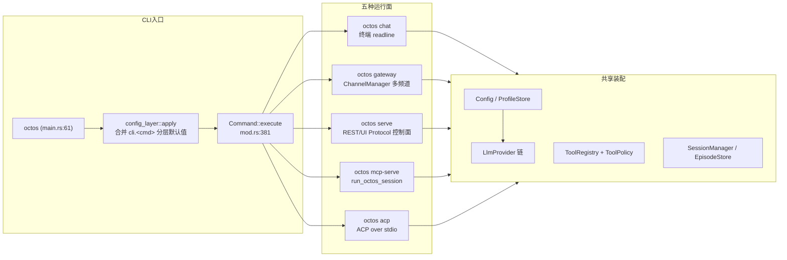
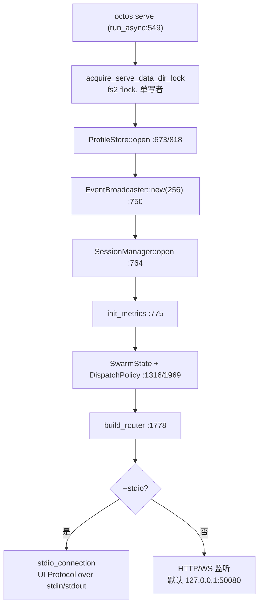
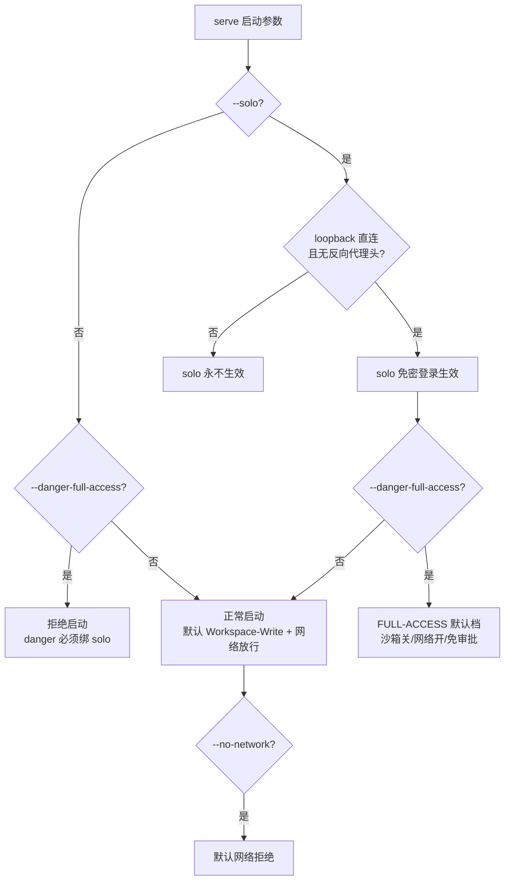
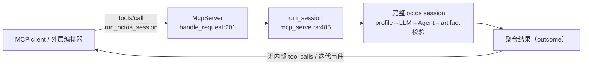
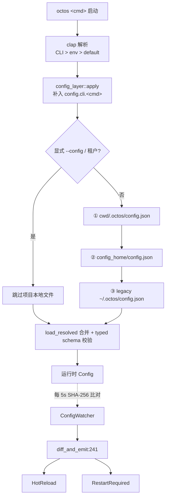

# 第 14 章：运行模式与配置体系

> **定位**：本章解释 octos 的五种运行面（chat、gateway、serve、mcp-serve、acp）如何从同一个 CLI 入口分派出来，以及 11,944 行配置体系如何组织优先级、分层默认值与热加载。前置依赖：第 5 章（Agent Loop）、第 11 章（octos-bus）。适用场景：需要部署、选型运行姿态的运维者（读者 D），以及想理解控制面装配与配置传播路径的开发者（读者 B）。编排面子命令（goal、peer、ledger、steer）本章只点名定位，细节见第 18 章。

同一个 `octos` 二进制，至少有五种差异很大的运行姿态：给人用的终端会话、挂在十个消息频道后面的常驻进程、暴露 67 个 REST 端点的控制面、给外层编排器调用的 MCP server、给 Zed 这类编辑器用的 ACP agent。用户面对的是子命令选择，贡献者面对的是一组共享装配逻辑的入口文件：七个入口文件合计 19,485 行（`crates/octos-cli/src/main.rs` 268 行、`crates/octos-cli/src/commands/mod.rs` 468 行、`crates/octos-cli/src/commands/chat.rs` 4,143 行、`crates/octos-cli/src/commands/gateway/` 目录 7,595 行、`crates/octos-cli/src/commands/serve.rs` 2,849 行、`crates/octos-cli/src/commands/mcp_serve.rs` 1,138 行、`crates/octos-cli/src/commands/acp.rs` 3,024 行）。

旧稿把这套体系概括为「四种运行模式」。以 2026-09-02 main 分支的 `octos --help` 实测，这个二进制有 28 个用户子命令，运行姿态也早已超过四类：`octos serve` 已经成为 AppState 与控制面的汇聚点，`--stdio` 让它同时是 UI Protocol 的挂载面；`octos mcp-serve` 把完整的 octos session 暴露为一个粗粒度 MCP 工具；`octos acp` 则面向 Agent Client Protocol 客户端。本章按「五种运行面」重写这一层，并给出配置体系（`crates/octos-cli/src/config.rs` 3,790 行 + `crates/octos-cli/src/profiles.rs` 7,003 行 + `crates/octos-cli/src/config_watcher.rs` 608 行 + `crates/octos-cli/src/config_layer.rs` 543 行）的完整图景。

---

## 14.1 一个入口，五种运行面

### 14.1.1 从 crates/octos-cli/src/main.rs 到 Command 分派

所有子命令共用一条启动路径。`fn main()` 位于 `../octos/crates/octos-cli/src/main.rs:61`，做四件事：安装错误钩子、解析 clap 参数、合并分层默认值（`octos_cli::config_layer::apply`，`main.rs:80`）、执行子命令（`args.command.execute()`，`main.rs:101`）。

子命令清单是 `pub enum Command`（`../octos/crates/octos-cli/src/commands/mod.rs:114`），27 个变体每个对应一个命令结构体。`Executable for Command` 的 `match` 分派在 `mod.rs:381` 起：

```rust
// commands/mod.rs:381-399（节选）
match self {
    Self::Account(cmd) => cmd.execute(),
    Self::Acp(cmd) => cmd.execute(),
    // …其余子命令同构…
    Self::McpServe(cmd) => cmd.execute(),
    #[cfg(feature = "api")]
    Self::Serve(cmd) => cmd.execute(),
```

两处细节值得注意。其一，`Self::Serve` 被 `#[cfg(feature = "api")]` 门控（`crates/octos-cli/src/commands/mod.rs:398-399`）：不开 `api` feature 编译出的二进制没有 serve 子命令，`crates/octos-cli/src/main.rs:85-86` 的 serve 日志目录逻辑同样被门控。编译期裁剪是运行面体系的第一道边界，完整列表见附录 D。其二，ACP、MCP、`chat --json` 这类在 stdout 上输出机器可读流的命令，控制台日志被路由到 stderr（`commands::reserve_stdout`），一行杂散日志就会污染协议流。

`octos --help` 实测列出 28 个用户子命令：`account acp admin auth channels chat config cron doctor docs init inbox mcp memory profile mcp-serve serve skills status steer update gateway goal ledger clean completions office peer`。其中直接定义「运行面」的是五个常驻或会话型命令，其余是生命周期管理（`auth`、`profile`、`account`）、诊断（`doctor`、`status`）、以及编排面（`goal`、`peer`、`ledger`、`steer`，详见第 18 章）。

### 14.1.2 五种运行面一览

| 运行面 | 入口 | 规模 | 首行文档摘要 | 关键符号 |
|---|---|---|---|---|
| chat（单机会话） | `crates/octos-cli/src/commands/chat.rs` | 4,143 行 | interactive multi-turn conversation | `ChatCommand`:37、`execute`:1043、`run_chat_peer`:828 |
| gateway（多频道常驻） | `crates/octos-cli/src/commands/gateway/` | 7,595 行 | persistent messaging daemon | `GatewayCommand`:45、`Gateway::init`:226、runtime `run`:1789 |
| serve（控制面 + `--stdio`） | `crates/octos-cli/src/commands/serve.rs` | 2,849 行 | start the REST API server | `ServeCommand`:320、`execute`:539、`run_async`:549、`build_router`:1778 |
| mcp-serve（协议服务） | `crates/octos-cli/src/commands/mcp_serve.rs` | 1,138 行 | M7.2 — octos mcp-serve | `McpTransport`:72、`McpServeCommand`:79、`run_session`:485 |
| acp（协议服务） | `crates/octos-cli/src/commands/acp.rs` | 3,024 行 | run octos as an ACP agent over stdin/stdout | `AcpCommand`:100、`execute`:160、`run_async`:1163 |

行号均出自 `assets/ch14-facts.md`（基准 9c157101），文件均在 `../octos/crates/octos-cli/src/` 下。

### 14.1.3 五种运行面的拓扑



**图 14-1：五种运行面共享同一套装配。** 差异在接入层（终端、频道、HTTP、MCP、ACP），共享的是配置解析、Provider 链、工具注册表与会话存储。这个「共享面」正是第 1 章 workspace 分层在 CLI 层的投影：入口文件全部位于 `octos-cli`，能力全部来自下层 crate（依赖方向见第 1 章 1.3 节与附录 A）。

### 14.1.4 怎么选运行面

五个面不是五个产品，而是同一个 Agent 能力栈的五类接入方式。选择的主要变量是「谁来发起交互」和「进程活多久」：

| 维度 | chat | gateway | serve | mcp-serve / acp |
|---|---|---|---|---|
| 交互发起方 | 终端里的人 | 消息频道里的人 | Web/HTTP 客户端 | 外层程序 |
| 进程生命周期 | 一次会话 | 常驻守护 | 常驻服务 | 随客户端会话 |
| 网络暴露 | 无 | 出站到频道平台 | 监听端口或 stdio | stdio 或本地端口 |
| 配置消费 | 单份 config | 多 profile + 子账号 | profile 注册表 + 分层 | 按 profile 逐任务加载 |
| 典型场景 | 开发调试、单机使用 | 社群 bot、多频道助理 | 自建面板、API 集成 | 被编辑器或编排器调用 |

两条经验法则。第一，面可以叠加但进程不合并：一个部署完全可以同时跑一个 gateway（消息入口）和一个 serve（面板入口），它们读同一份配置体系但各持各的 data dir 锁；「在同一进程里同时跑 gateway 和 serve」不是当前支持的形态。第二，从最小面开始：先用 chat 验证配置与工具行为，需要常驻再上 gateway 或 serve，需要被程序调用才引入 mcp-serve 或 acp。每个面引入的运维面（频道凭证、端口、token、锁文件）是单向递增的。

---

## 14.2 chat：单机会话面

`octos chat` 是最接近用户直觉的面：一个终端里的多轮对话。`ChatCommand`（`crates/octos-cli/src/commands/chat.rs:37`）支持 `--cwd`、`--provider`、`--model`、`--max-iterations`、`--verbose` 等覆盖项；`execute`（`crates/octos-cli/src/commands/chat.rs:1043`）构造 Tokio 多线程运行时后进入会话循环；`run_chat_peer`（`crates/octos-cli/src/commands/chat.rs:828`）是真正的对话驱动逻辑，Agent Loop 的展开见第 5 章，此处不重复。

chat 的价值在于它是最薄的验证面：配置解析、Provider 构造、工具注册、沙箱策略在这一层全部生效，但没有任何网络暴露。诊断配置问题时，先在 chat 里复现，再排查 gateway 或 serve，是成本最低的路径。

chat 也是三个参与分层默认值的命令之一（`LAYERED_COMMANDS` 里的 `"chat"`）：`config.cli.chat` 里预置的 `--provider`、`--model` 等默认值，会在用户未显式给参数时生效。这让「这台机器上 `octos chat` 默认走哪个模型」成为一份可提交进版本库的配置，而不是每个人 shell 历史里的别名。`run_chat_peer`（`crates/octos-cli/src/commands/chat.rs:828`）与 gateway/serve 使用同一套 Agent 装配，所以第 5 章讲的循环行为在 chat 里的观察结果可以直推到其他面。

---

## 14.3 gateway：多频道常驻面

`octos gateway` 的首行文档说得很直白：persistent messaging daemon（`crates/octos-cli/src/commands/gateway/mod.rs`，目录共 7,595 行）。它启动 ChannelManager 监听多个消息频道，把到达的消息路由给对应 profile 的 Agent。频道抽象本身（Telegram、Discord、Matrix 等）是第 10 章的内容；本节只讲 gateway 作为运行面的两个结构特征。

第一，profile 与子账号继承是结构化的。Gateway 的多用户不是「每人一份顶层 config.json」，而是 `ProfileConfig`（`crates/octos-cli/src/profiles.rs:181`）承载结构化 sections：子账号继承父 profile 的 `config.llm` contract（`LlmProfileConfig`，`crates/octos-cli/src/profiles.rs:814`），缺省时继承 `search`、`deep_crawl` 等 sections，同时把父级 `env_vars` 作为 base 层（经 keychain 解析，`crates/octos-cli/src/commands/gateway/profile_factory.rs:108/149`）。旧稿中「子账号继承顶层 provider/model 字段」的写法已过时：顶层字段是 legacy 路径，结构化 sections 才是当前主路径。

第二，gateway 是热加载的主要消费者。常驻进程改配置的成本最高（重启会中断所有频道），所以 `ConfigWatcher` 的事件循环主要服务这一面（见 14.6.4）。`GatewayCommand::execute`（`crates/octos-cli/src/commands/gateway/mod.rs:159`）→ `run_async`（`:178`）→ `Gateway::init`（`:226`）→ runtime 主循环 `run`（`crates/octos-cli/src/commands/gateway/gateway_runtime.rs:1789`），热加载状态（`system_prompt`、`max_history`、`config_rx`）挂在 GatewayRuntime 的状态里。

---

## 14.4 serve：控制面汇聚点

把 `octos serve` 理解成「chat 的 HTTP 外壳」是最常见的误读。serve 是控制面（control plane）的汇聚点：一个进程装配出 REST API、UI Protocol WebSocket、事件广播、profile 管理、工具策略和 swarm 调度状态，chat 只是它承载的诸多能力之一。

### 14.4.1 启动装配

`ServeCommand::execute`（`crates/octos-cli/src/commands/serve.rs:539`）建 Tokio 运行时后进入 `run_async`（`crates/octos-cli/src/commands/serve.rs:549`）。装配序列的关键节点（行号见事实表）：

- `ProfileStore::open`（`crates/octos-cli/src/commands/serve.rs:673/818`）：profile 注册表与模型目录
- `EventBroadcaster::new(256)`（`crates/octos-cli/src/commands/serve.rs:750`）：全局事件广播
- `SessionManager::open`（`crates/octos-cli/src/commands/serve.rs:764`）：会话存储
- `init_metrics()`（`crates/octos-cli/src/commands/serve.rs:775`）：Prometheus 指标
- `SwarmState` 构建（`crates/octos-cli/src/commands/serve.rs:1316` 起）：swarm 调度状态，其中 `DispatchPolicy::from_agent_gates(tool_policy, true)`（`crates/octos-cli/src/commands/serve.rs:1969`）把 `config.tool_policy` 与注入型环境变量 denylist 投影成调度门，避免 swarm backend 绕过 native tool policy（swarm 细节见第 17 章）
- `build_router(state)`（`crates/octos-cli/src/commands/serve.rs:1778`）：把 AppState 变成 axum 路由



**图 14-2：serve 的控制面装配。** 注意单写者锁在装配最前面：redb 是单写者单进程数据库，两个 serve 指向同一 data dir 会撞库。锁冲突时进程输出机器可检索的 `OCTOS_DATA_DIR_LOCKED` 标记（`DATA_DIR_LOCKED_MARKER`，`crates/octos-cli/src/commands/serve.rs:487` 附近），octoscode 等客户端靠 grep 这个 token 识别冲突并停止重启循环，而不是每 5 秒静默崩溃一次。

### 14.4.2 `--stdio`：UI Protocol 挂载面

`crates/octos-cli/src/commands/serve.rs:1541` 的分支决定了 serve 的两种形态：

```rust
// commands/serve.rs:1541-1546
if self.stdio {
    crate::api::ui_protocol_transport::stdio_connection(state).await?;
    tracing::info!("stopping all gateway child processes");
    let _ = process_manager.stop_all().await;
    return Ok(());
}
```

`--stdio` 模式不绑定 HTTP：`bind_http_listener`（`crates/octos-cli/src/commands/serve.rs:464-471`）在 stdio 下直接返回 `None` listener，UI Protocol 的 JSON-RPC 流量走 stdin/stdout。这不是测试后门，而是生产路径：octoscode 的默认 stdio 链就是

```rust
// octoscode/src/cli.rs:118
pub const DEFAULT_STDIO_COMMAND: &str = "octos serve --stdio --solo";
```

配套机制是 `--instance-data-dir`：多个 stdio 实例共享一个 config/profile 的 state home，各自持有私有的 runtime 数据目录（redb、sessions、serve lock），所以「一个用户开多个编辑器窗口」不会互相撞库。stdio 模式还复用了 serve 的整套控制面装配（watcher、事件、profile），只是传输层换成了管道。

`--stdio` 还重新定义了 stdout 的所有权：stdout 被协议独占后，任何写向它的内容都会被客户端当成 JSON-RPC 帧去解析，一行调试打印就是一次协议破坏。tracing 日志、panic 信息、进度提示必须全部改走 stderr；同理，serve 在 stdio 链上派生的子进程若继承 stdout，其输出也会混进协议流，需要显式重定向。这也是前文 `reserve_stdout` 机制存在的根本原因：机器可读流与人读日志的信道分离，要在入口处一次划清。

### 14.4.3 serve 门禁

`octos serve --help` 暴露的安全开关构成一组刻意设计的门禁（实测输出与 `assets/ch14-facts.md` 一致）：

| 开关 | 语义 | 环境变量 |
|---|---|---|
| `--solo` | 单人本地免密登录（`POST /api/auth/solo*`），仅 loopback 直连 + Local-mode 生效，带反向代理头的请求永不生效 | `OCTOS_SOLO_LOGIN=1` |
| `--danger-full-access` | 默认 FULL-ACCESS 权限档（沙箱关、网络开、免审批），必须绑 `--solo` | `OCTOS_DANGER_FULL_ACCESS=1` |
| `--no-network` | 从「默认允许网络」回退为默认拒绝 | `OCTOS_NO_NETWORK=1` |
| `--swarm-backend <stdio\|http\|cli>` | swarm 后端传输；未设时 `/api/swarm/*` 返回 503 | — |

默认绑定是安全优先的：`--host` 默认 `127.0.0.1`，`--port` 默认 50080（`crates/octos-cli/src/commands/serve.rs:324`，端口落在 IANA 动态区段以避开 Tomcat/Jenkins 这类常见服务，见 issue #417）。本地会话默认 Workspace-Write 且网络放行（文件系统仍在沙箱内，`npm install`、git 开箱可用），`--no-network` 是显式退出；云/租户部署恒为网络拒绝。



**图 14-3：serve 门禁决策流。** 会话内显式 `/permissions` 选择永远优先于这些默认档。

### 14.4.4 coding/autonomy capability 与工具契约

serve 不只是「能聊天」：UI Protocol 的 `SessionOpened.capabilities` 会按客户端声明的 feature 投影出一组 coding 能力（常量在 `../octos/crates/octos-cli/src/api/ui_protocol_transport.rs:2037-2060`，经 `has_ui_feature` 逐项投影）：

- `coding.tool_contract.v1`（契约常量 `crates/octos-cli/src/api/coding_tool_contract.rs:12`，契约 id `codex-compatible-coding-v1`，`:13`）
- `coding.autonomy.v1`（`:2037`）、`coding.agent_control.v1`（`:2042`）、`coding.goal_runtime.v1`（`:2047`）、`coding.loop_runtime.v1`（`:2052`），另有 `coding.monitor_runtime.v1`（`:2057`）

工具契约由后端根据当前 `ToolRegistry`、deferred 工具集、policy 视图与已知模型可见工具动态生成，AppUI 因此能区分六种工具状态（`crates/octos-cli/src/api/coding_tool_contract.rs:19-28`）：`available`、`aliased`、`deferred`、`disabled_by_policy`、`missing`、`unimplemented`。其中 `deferred` 表示工具已注册但处于 LRU 惰性卸载集，模型可以通过 `activate_tools` 恢复，对契约而言仍算可用。

边界要说清楚：这些 autonomy capability 描述的是 backend-supervised orchestration（目标、循环、Agent 控制等原语都在后端监督下运行），不是无人值守的自演化运行时。goal/loop 运行时的内机制是第 18 章的主题，本章只定位它们挂在 serve 的 capability 面上。

### 14.4.5 REST 面：67 个端点

以 `grep -rhoE '\.route\("[^"]+"' crates/octos-cli/src/api/*.rs | sort -u | wc -l` 口径统计（2026-09-02 复跑两次均为 67），serve 暴露 67 个 REST 端点，分布在 `api/` 目录的 42 个 `.rs` 文件里。旧稿的「91 个」作废：端点在持续裁剪，任何具体数字都必须附口径。端点级参考见附录 C，Web Dashboard 的前端实现不在本书范围。

---

## 14.5 协议服务面：mcp-serve 与 acp

### 14.5.1 mcp-serve：只暴露 run_octos_session

`octos mcp-serve`（`crates/octos-cli/src/commands/mcp_serve.rs`，1,138 行）把 octos 暴露成 MCP server，供外层编排器调度。MCP 实现在 `../octos/crates/octos-agent/src/mcp_server.rs`（1,044 行）：`McpServer`:169、`handle_request`:201、HTTP 传输 `streamable_http_service`:268。

边界设计是这一面的核心：server 只暴露一个 session 级工具 `run_octos_session`（常量 `RUN_OCTOS_SESSION_TOOL`，`crates/octos-agent/src/mcp_server.rs:66`）。每次调用跑一个完整的 octos session（加载 profile、构造 LLM、创建 Agent、执行 prompt、校验 artifact），外层拿到的是聚合结果：它看不到内部 tool calls、iteration events 或进度流。octos 的内部工具目录（59 个工具，见第 6 章）不直接外翻，这是「粗粒度任务边界」对「细粒度工具代理」的取舍：外层编排器负责分解任务，octos session 负责在边界内自主执行。



**图 14-4：mcp-serve 的 session 级分派。** 传输层二选一（`McpTransport`，`crates/octos-cli/src/commands/mcp_serve.rs:72`）：默认 `stdio`，认证模型是 parent-trust（父进程可信，不设 token）；`http` 传输绑定 `127.0.0.1:4033`（`--bind` 默认值），且必须设置 `OCTOS_MCP_SERVER_TOKEN`，缺失或为空直接拒绝启动（`crates/octos-cli/src/commands/mcp_serve.rs:185-186`）。

### 14.5.2 acp：面向编辑器的 agent

`octos acp`（`crates/octos-cli/src/commands/acp.rs`，3,024 行）按 Agent Client Protocol 在 stdin/stdout 上运行一个 agent，服务 Zed 这类编辑器内置的 agent 客户端。`AcpCommand`:100、`execute`:160、`run_async`:1163。与 mcp-serve 的差异在协议与粒度：ACP 是编辑器与 agent 的会话协议（文件上下文、权限申请、diff 展示），MCP 是任务级工具调用；两者共享同一套配置与 Agent 装配，stdout 同样保持纯协议流。

把 acp 与 mcp-serve 放在同一个「协议服务面」里，是因为它们有共同的结构约束：stdin/stdout 是协议信道，一行杂散日志就是一次协议破坏，所以两者的控制台日志都路由到 stderr（`commands::reserve_stdout`）；两者都不维护面向人的 UI 状态，会话的呈现（diff、进度、审批）完全交给客户端渲染。差异则在于会话归属：ACP 的会话由编辑器用户拥有，权限申请会以协议消息形式弹给用户；mcp-serve 的会话由外层编排器拥有，权限边界在启动配置里一次性定死。

---

## 14.6 配置体系：四个文件，11,944 行

| 文件 | 行数 | 职责 | 关键符号 |
|---|---|---|---|
| `crates/octos-cli/src/config.rs` | 3,790 | 配置文件解析与合并 | `Config`:26、`load_with_context`:1740、`load_resolved`:1770 |
| `crates/octos-cli/src/profiles.rs` | 7,003 | 多用户 profile 管理 | `ProfileConfig`:181、`LlmProfileConfig`:814、`LlmRouteConfig`:881 |
| `crates/octos-cli/src/config_watcher.rs` | 608 | 热加载轮询 | `ConfigChange`:17、`spawn`:87、`diff_and_emit`:241 |
| `crates/octos-cli/src/config_layer.rs` | 543 | 启动期分层默认值 | `LAYERED_COMMANDS`:40、`apply`:48 |

### 14.6.1 优先级链

文件层的解析优先级（`crates/octos-cli/src/config.rs` 的 `load_resolved` 注释）：

1. 项目本地 `<cwd>/.octos/config.json`（仅 default context 读取）
2. `<config_home>/config.json`
3. legacy `~/.octos/config.json`

显式 `--config` 或租户上下文不读项目本地文件。本地优先允许不同项目用不同 provider 与工具策略，代价是「为什么这台机器行为不一样」的诊断要多查一个文件。

启动期还有第二条优先级链，作用于 CLI 参数本身（`crates/octos-cli/src/config_layer.rs:5-8` 的模块文档）：

```text
显式 CLI flag  >  env var  >  config.json `cli.<cmd>`  >  built-in default
```

clap 已解决「CLI > env > default」，`config_layer::apply`（`crates/octos-cli/src/main.rs:80` 调用）补上中间层：用户没在命令行给、也没从环境变量来的字段，落到 `config.cli.<cmd>`。参与的子命令只有三个：`LAYERED_COMMANDS = ["serve", "gateway", "chat"]`（`crates/octos-cli/src/config_layer.rs:40`）。判断「是否显式」靠 `clap::ArgMatches::value_source`，这是唯一同时覆盖标量默认值（`--port`）和裸布尔开关（`--solo`）的机制。危险开关（`--danger-full-access`、`--yolo`）与密钥字段被显式排除在分层之外，只能来自命令行。



**图 14-5：配置解析与热加载链路。** 3a567a4c 引入的 typed schema 让推理参数（profile/llm/*）从「静默丢弃未知字段」改为「拒绝」：配置里拼错的键名现在会在启动时报错，而不是悄悄退回默认值（`crates/octos-cli/src/config.rs:273` 附近注释）。这是配置体系近年最重要的一次收紧。

### 14.6.2 profile 结构化配置

`crates/octos-cli/src/profiles.rs`（7,003 行）是配置体系最大的文件，承载多用户部署：`ProfileConfig`:181 定义结构化 sections，`ProfileConfigPatch`:741 支持 patch 语义，LLM 相关的三件套是 `LlmProfileConfig`:814、`LlmModelSelectionConfig`:824、`LlmRouteConfig`:881。Gateway 子账号继承的就是这些结构化 sections 加 `env_vars` base（见 14.3），敏感变量经 keychain 解析（`crates/octos-cli/src/commands/gateway/profile_factory.rs:108/149`）。

`crates/octos-cli/src/config.rs` 里的 `mcp_servers: Vec<McpServerConfig>`（`:110`）与 `sub_providers: Vec<SubProviderConfig>`（`:184`，定义在 `:618`）只在本章点名：前者是外部 MCP 工具的挂载配置（见第 9 章），后者是子 provider 链，两者完整的字段参考都在附录 C。

### 14.6.3 热加载 watcher

`ConfigWatcher`（`crates/octos-cli/src/config_watcher.rs:28`）每 5 秒轮询配置文件，用 SHA-256 哈希比对检测变更（首行文档即此语义）。变更分类由 `ConfigChange` 枚举表达（`:17`）：

```rust
// config_watcher.rs:17-25
pub enum ConfigChange {
    /// Fields that can be applied without restart.
    HotReload {
        system_prompt: Option<String>,
        max_history: Option<usize>,
    },
    /// Fields changed that require a restart. Log warning only.
    RestartRequired(Vec<String>),
}
```

`diff_and_emit`（`:241`）逐字段比对后分流：`HotReload` 只有两个成员，`system_prompt` 与 `max_history`（gateway 子字段）；其余落入 `RestartRequired(Vec<String>)`，仅告警。当前的重启项清单：`base_url`、`api_key_env`（影响 HTTP 客户端构造）、`sandbox`、`mcp_servers`、`hooks`（外部连接需重建）、`format_after_edit`（启动期烘焙进 AgentConfig，#1774）、`plugins`（签名门只在加载时消费）、`gateway.queue_mode`、`gateway.channels`（影响消息主循环）。

watcher 的完整工作流分四步。启动时 `ConfigWatcher::new`（`:44`）接收要监视的路径集合；profile 模式下 `with_profile_defaults`（`:67`）会把全局 `profile-defaults.json` 一并纳入监视，这样编辑共享默认值层也能触发同一条 reload 路径；`spawn`（`:87`）起后台任务进入 5 秒轮询循环；每次轮询读入全部现存文件、拼接后算一次 SHA-256，哈希不变就直接跳过，变了才解析新配置并交给 `diff_and_emit` 分类。分类结果通过 `tokio::sync::watch` 通道发出，消费端（主要是 gateway 主循环）收到 `HotReload` 后把 `system_prompt` 写进 `RwLock<String>`、把 `max_history` 写进原子计数，两条写路径都不需要停顿消息处理。

两个健壮性细节值得单独记下。其一，defaults 层保留 last-known-good：一个此前合法的 `profile-defaults.json` 被改坏时，watcher 沿用上一次的正确解析，而不是把整个 base 层静默丢掉；从未合法过的新文件则保持 `None`。其二，解析失败的主配置同样保留旧值并告警，坏配置不会击穿正在运行的进程。

provider/model 的文件变更两条路都不走：watcher 既不把它归入 HotReload 自动应用，也不再报 RestartRequired；运行中切换走显式路径（`model_check` 工具触发 `SwappableProvider.swap`，见第 3 章）。安全的心智模型是：改 `system_prompt`/`max_history` 五秒内生效；改 provider/model 要么会话内显式切换，要么重启进程；改 `base_url`/`hooks` 等一定重启。

profile 的 policy 翻转有防误报回归注释（`crates/octos-cli/src/config_watcher.rs:136-150`）：父 profile defaults 层的存在会让朴素的 diff 把继承值误判为变更，watcher 对这一层做了专门处理。轮询而非 inotify 的选择与跨平台有关：inotify 是 Linux 特有的，macOS 用 kqueue，Windows 用 ReadDirectoryChangesW，5 秒 SHA-256 轮询在三个平台行为一致且开销可忽略。此外 watcher 一次读入全部文件再统一哈希，避免了先检查再读取的 TOCTOU 竞态；解析失败时保留上一份有效配置并告警，不会带着坏配置崩溃。

---

> ### 工程决策侧栏：为什么 `--danger-full-access` 必须绑 `--solo`
>
> `--danger-full-access` 把每个新会话默认成 FULL-ACCESS：沙箱关、网络开、审批全免。这样的档位如果暴露在网络上，任何能到达端口的人就获得了主机的执行权。所以它的生效前提与 `--solo` 完全同构：`--solo` 本身只在 loopback 直连、Local-mode、且请求不带反向代理头时生效，两个开关共享同一把「本地单用户」的钥匙。把免沙箱档绑在单人本地登录上，等价于把它绑在「攻击者必须先登录这台机器的操作系统」这一前提上。环境变量（`OCTOS_DANGER_FULL_ACCESS=1`）绕不开这一点：不带 `--solo` 的 serve 启动直接拒绝。
>
> 这条绑定的可推广形式：危险能力的门禁不应该是独立的布尔开关，而应该复用一条已经过审计的信任链。单独的 `--danger-full-access` 迟早会被写进某个 systemd unit 暴露在 0.0.0.0 上；绑定之后，「远程 + 免沙箱」这个状态在入口处就不合法。

> ### 工程决策侧栏：热加载与全重启的边界
>
> 能热加载的只有 `system_prompt` 与 `max_history`，前者是无状态文本（下一次 LLM 调用生效），后者是一个计数（原子替换）。这个清单之所以短，是因为每多一项热加载，就要回答「进行中的会话用旧值还是新值」「替换失败怎么回滚」两个问题。`base_url` 与 `api_key_env` 影响连接池与 TLS，运行时替换可能撕裂进行中的请求；`hooks` 携带熔断计数器，只换命令不重置状态会让被熔断的 hook 永不恢复；`format_after_edit` 在启动期烘焙进 AgentConfig，三处入口（chat/gateway/serve）各自拷贝，没有共享的可变点。边界划分的原则：无状态或单值的字段热加载，有连接、有状态、有烘焙的字段重启。provider/model 处在中间，所以走的是第三条路：不热加载文件，但提供受控的运行时切换接口。

---

## 14.7 Feature Flags：编译期运行面

`crates/octos-cli/Cargo.toml:142` 起 `[features] default = []`：默认编译是最小集。`api`（`:154`）拉入 axum/rustls/prometheus 等，并连带 `octos-bus/api` 与 matrix；每个消息频道有自己的门（`telegram`、`discord`、`dingtalk`、`slack`、`whatsapp`、`email`、`feishu`、`twilio`、`wecom`、`line`、`matrix`、`wecom-bot`），对应 octos-bus 的通道编译；`embed-llama`/`-metal`/`-cuda`（`:147-149`）控制本地嵌入模型。`Command::Serve` 的存在性本身就被 `#[cfg(feature = "api")]` 门控（`crates/octos-cli/src/commands/mod.rs:398`）。

这与五种运行面的关系是双层的：运行面选择发生在运行期（子命令分派），能力裁剪发生在编译期（feature gates）。部署一个只接 Telegram 的 gateway，不需要编译 REST 服务器；反之 serve 部署不必编译未使用的频道。完整列表见附录 D。

---

## 14.8 本章回顾

1. 五种运行面：chat（单机会话）、gateway（多频道常驻）、serve（控制面汇聚 + `--stdio` 挂载面）、mcp-serve/acp（协议服务面），从 `Command::execute`（`crates/octos-cli/src/commands/mod.rs:381`）统一分派，共享配置、Provider 链、工具注册表与会话存储；入口文件合计 19,485 行。
2. serve 是控制面汇聚点：装配 ProfileStore、EventBroadcaster、SessionManager、metrics、SwarmState 与 67 个 REST 端点（口径命令见事实表）；`--stdio` 是 octoscode 的默认生产链（`octos serve --stdio --solo`），单写者锁用 `OCTOS_DATA_DIR_LOCKED` 标记冲突。
3. serve 门禁：默认 127.0.0.1:50080；`--solo` 仅 loopback 生效；`--danger-full-access` 强制绑 `--solo`；网络默认放行可 `--no-network` 回退；coding/autonomy capability 是 backend-supervised orchestration 的投影。
4. mcp-serve 只暴露 `run_octos_session`：session 级聚合结果，内部工具目录不外翻；stdio 是 parent-trust，HTTP 必须带 token。
5. 配置体系 11,944 行四件套：文件优先级链（项目本地 > config_home > legacy）、启动分层链（CLI > env > `cli.<cmd>` > 默认，仅 serve/gateway/chat 参与）、typed schema 拒绝未知字段、watcher 5 秒 SHA-256 轮询，热加载仅 `system_prompt`/`max_history`。

---

## 延伸阅读

- MCP 规范（Model Context Protocol）：https://modelcontextprotocol.io — `run_octos_session` 所遵循的 tools/call 语义。
- Agent Client Protocol：https://agentclientprotocol.com — Zed 等编辑器与 agent 的会话协议。
- 12-Factor App 的 Config 章：https://12factor.net/config — 对照本章「显式 CLI > env > config > 默认」的四层链。
- 本书附录 C（配置字段参考）与附录 D（Feature Flags 一览）。

## 思考题

1. `--stdio` 模式复用 serve 的全部控制面装配但只服务一个客户端。如果要支持「一个 data dir、八个编辑器窗口」，`--instance-data-dir` 的共享/私有边界应该划在哪里？哪些 store 必须私有，哪些可以共享？
2. watcher 的 `RestartRequired` 只告警不动作。如果要在 gateway 里把 `gateway.channels` 变更做成「计划内重启」（drain 在途消息后自重启），需要哪些前提才能保证不丢消息？
3. mcp-serve 的粗粒度边界把工具选择权留给了 octos session 内部。如果一个外层编排器需要「逐步审批每次工具调用」，这个边界还成立吗？应该在哪一层加审批原语？
4. `config_layer` 用 `value_source` 区分「用户显式给」与「默认值」。如果不用这个机制，改用 `Option<T>` 字段自己判空，27 个命令结构体要付出什么代价？

---

> **版本演化说明**
> 本章分析基于 octos main @ `9c157101`（2026-09-02 提交，2026-09-03 统计），全部行号与数字的复现命令见 `assets/ch14-facts.md`。相对 v1 旧稿（第 13 章）的主要更新：其一，「四种运行模式」重构为「五种运行面」，acp 与 serve `--stdio` 升为一等公民，`octos --help` 的 28 个子命令逐字核对；其二，REST 端点数由 91 修订为 67（口径命令随附，旧数作废）；其三，补充 serve 门禁（`--solo`/`--danger-full-access`/`--no-network`/`--swarm-backend`）、coding/autonomy capability 投影与工具契约六状态、`OCTOS_DATA_DIR_LOCKED` 单写者锁、config_layer 分层默认值链与 typed schema 拒绝语义。旧稿的 `SwappableProvider` 代码细讲移至第 3 章，本章只保留其与热加载边界的关系。
