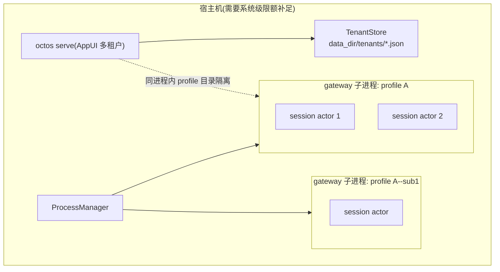
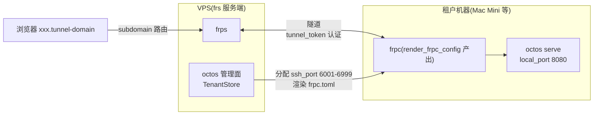
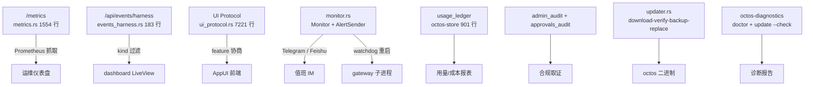

# 第 15 章:生产化:存储、服务、运维面与多租户

> **定位**:本章分析 octos 从开发工具走向生产系统时抽出的三块基础设施:octos-store(持久化)、octos-services(支撑服务)、octos-diagnostics(诊断),以及租户隔离与 frpc 隧道部署路径。前置依赖:第 13 章(运行模式)。适用场景:需要把 octos 部署到生产环境的运维人员(读者 D),以及想理解「巨型 CLI crate 如何安全拆分」的开发者(读者 B)。

一个系统能跑起来,和它能被交给别人长期运维,中间隔着一批不性感的东西:凭据怎么存、审计怎么留、用量怎么记、坏了怎么诊断、多个租户怎么互相看不见。这些功能没有一个是用户主动要求的,但缺了任何一个,部署都会在某一天停下来。

octos 的生产化经历了两次抽取。第一次把散在 `octos-cli` 里的持久化代码拉出来,成为 octos-store;第二次把支撑服务拉出来,成为 octos-services;最近一次把诊断和自更新计划逻辑拉出来,成为 octos-diagnostics。本章按这三个 crate 展开,再看多租户的四层隔离与 frpc 隧道部署路径,最后把运维面(指标、事件流、告警、自更新、doctor)拼成一张完整的生产控制面。

认证三流(OAuth PKCE、device code、paste-token)与 Hooks 生命周期的完整走读分别在旧章位置已有覆盖,本章只保留结论性引用:凭据存储在 `~/.octos/auth.json`,Unix 下 `0o600` 权限(`crates/octos-cli/src/auth/store.rs:59-71`);bearer token 比较用常量时间实现,避免时序侧信道(`crates/octos-cli/src/api/router.rs:1124-1233`);Hooks 的 shell 协议(stdin JSON + exit code)与熔断器详见第 10 章。这样安排的目的是把篇幅留给「这次抽取到底改变了什么」。

---

## 15.1 为什么要拆:两个 crate 的抽取史

### 15.1.1 抽取前的状态

生产化相关的代码原本全部住在 `octos-cli` 里:admin token 存储是 `admin_token_store.rs`,setup 向导状态是 `setup_state_store.rs`,SMTP 密码是 `smtp_secret_store.rs`,租户管理是 `tenant.rs`,自更新是 `updater.rs`。它们都是叶子模块,不依赖 CLI 的命令层,却和几千行的命令代码一起编译、一起测试。

问题在依赖方向。这些存储模块只依赖 serde 和文件系统,却因为住在 `octos-cli` 里,被间接绑定了整个 CLI 的依赖闭包。想做单元测试,得拉起半个 crate 的编译产物;想在别的二进制(比如 octoscode 的 doctor)里复用审计或安装方式探测,只能复制代码。

拆分前后的形状变化可以用三个切面说清。第一是依赖边方向:抽取后两个 crate 在 Cargo 依赖图上只指向 octos-core(services 再加 octos-llm、octos-bus),不再有任何边指回 octos-cli;抽取前这些模块与命令层之间没有隔离,`octos serve` 改一行 AppState 定义,八个 store 全部重编。第二是测试输入:拆前测 `AdminTokenStore` 要在 octos-cli 的测试树里搭 tempdir 夹具;拆后 crate 内自带 `#[cfg(test)]`,admin_token_store.rs 文件尾部的测试直接断言 `0o600` 权限位(`crates/octos-store/src/admin_token_store.rs:182`),不依赖任何外部环境。第三是编译产物粒度:CLI 二进制之外的工具(诊断、报表、未来的 CLI-agent 适配)现在可以只链 store/services,不必拖进整个 CLI。octos-diagnostics 的抽取动机更直接:octoscode 的 doctor/install_method 模块与 octos 服务端要做同一套探测,复制两份必然漂移,于是把「产品无关」部分下沉,产品差异收窄到 `ProductSpec` 一个入口(ADR 见 crate 文档,octoscode#182)。

### 15.1.2 octos-store:持久化层,9 文件 2,664 行

抽取后的 `crates/octos-store/` 是一个纯持久化 crate,9 个源文件共 2,664 行(`lib.rs` 18 行 + 8 个 store 模块,行数来自事实表对 main @ 9c157101 的统计)。`lib.rs` 的模块文档直接说明了出身:"Self-contained persistence / state stores extracted from `octos-cli`"。

| 文件 | 行数 | 职责 | 关键符号 |
|---|---|---|---|
| `admin_token_store.rs` | 184 | admin token 的 salt+hash 存储 | `AdminTokenRecord`(:14) `AdminTokenStore`(:56) |
| `admin_audit_store.rs` | 270 | admin 操作审计(redb) | `AdminAuditStore`(:109) |
| `approvals_audit.rs` | 414 | 审批决策审计(JSON-Lines 追加) | `ApprovalsAuditLog`(:119) |
| `login_allowlist.rs` | 258 | 登录白名单(带锁重试) | `LoginAllowlistStore`(:28) |
| `setup_state_store.rs` | 151 | 首启向导状态 | `SetupStateStore`(:24) |
| `smtp_secret_store.rs` | 133 | SMTP 密码文件 | `SmtpSecretStore`(:17) |
| `usage_ledger.rs` | 901 | 用量台账(redb) | `UsageEvent`(:42) `PersistentUsageLedger`(:323) |
| `user_store.rs` | 335 | 多用户管理(每用户一 JSON) | `UserStore`(:40) |

八种存储覆盖了生产部署的全部状态面:身份(token、user、allowlist)、生命周期(setup)、密件(smtp secret)、审计(admin audit、approvals audit)、计费(usage ledger)。注意存储介质分了两种:简单状态用单文件 JSON,高追加量数据(usage ledger 901 行、admin audit 270 行)用 redb 嵌入式 KV。这个分界本身就是一条工程判断,详见本章侧栏。

以 `admin_token_store.rs` 为例看抽取后的形态。文件首页文档写明:"Hashed admin auth token stored at `{data_dir}/admin_token.json`. Replaces the static config/env bootstrap token once rotated." 记录结构只有四个字段(`crates/octos-store/src/admin_token_store.rs:14-21`):

```rust
pub struct AdminTokenRecord {
    /// 16 random bytes, base64 (URL-safe, no padding).
    pub salt: String,
    /// sha256(salt_bytes || token_bytes), base64 (URL-safe, no padding).
    pub hash: String,
    pub created_at: DateTime<Utc>,
    pub created_by: String,
}
```

校验函数 `verify()` 先从 salt 重建期望 hash,再用 `constant_time_eq` 比较(`crates/octos-store/src/admin_token_store.rs:39-45`);保存路径是临时文件 + rename,Unix 下设 `0o600`(`crates/octos-store/src/admin_token_store.rs:96-104`)。文件里没有一行 CLI 代码,测试用 tempdir 就能跑完。

规模最大的 `usage_ledger.rs`(901 行)是给「每个 LLM run 记一行」的台账,`UsageEvent` 结构在 :42,redb 持久化入口 `PersistentUsageLedger` 在 :323。字段设计有一个值得留意的点:cache 读取 token 被单独记录,文档注释明确说明 provider 报告的 prompt 总数里含缓存命中,而 `TokenUsage` 在 provider 边界就把缓存部分减掉了,所以完整 prompt 数是 `input_tokens + cache_read_tokens`(`crates/octos-store/src/usage_ledger.rs:52-66`)。这让「缓存到底省了多少钱」成为事后可查的数据,而不必现场探测 API。

### 15.1.3 octos-services:支撑服务层,8 文件 3,223 行

第二个抽出的是 `crates/octos-services/`,8 个源文件共 3,223 行。`lib.rs` 文档同样点明出身:"Self-contained support services extracted from `octos-cli`"。模块共 7 个:

| 文件 | 行数 | 职责 | 关键符号 |
|---|---|---|---|
| `cli_agent_adapter.rs` | 587 | 未来 CLI-agent 适配的进程边界 | `CliAgentProcess`(:145) |
| `compaction.rs` | 320 | 会话压缩 | `maybe_compact`(:37) |
| `config_context.rs` | 698 | 配置/凭据/数据路径的唯一解析入口 | `resolve_config_context`(:151) |
| `persona_service.rs` | 479 | 定期生成沟通风格画像 | `PersonaService`(:97) |
| `soul_service.rs` | 139 | 每用户 personality 存储 | `read_soul`(:24) |
| `tenant.rs` | 512 | 租户隧道管理 | `TenantStore`(:82) `render_frpc_config`(:255) |
| `updater.rs` | 473 | 自更新:下载、校验、备份、替换、回滚 | `Updater`(:33) |

两个 crate 的依赖关系经过裁剪:octos-store 与 octos-services 都只依赖 octos-core(加上 serde/eyre 等基础设施);services 因为要调 LLM 与消息总线,额外依赖 octos-llm 与 octos-bus(事实表 §2 的 Cargo 依赖核对)。抽取后的依赖图里,它们都是叶子方向,不会再把 CLI 的重量传染给别人。

`config_context.rs`(698 行)是这批模块里最值得停下来的一个。文档自称 "Canonical config/auth/data path resolver — the single source of truth":所有配置路径、凭据路径、数据目录路径必须经 `resolve_config_context` 解析,不允许各模块自行拼接。这条规则直接回应了旧版的一个痛点:同一路径在多个模块各拼一遍,运行模式一多就漂移。

### 15.1.4 octos-diagnostics:诊断与更新计划,8 文件 2,243 行

最新的抽取是 `crates/octos-diagnostics/`,8 个文件 2,243 行,分两个阶段进入主干:Stage 1(commit `7f81fa5e`)交付 crate 本体与 `octos doctor`;Stage 2(commit `1801a9e9`)加入 GitHub client 与 `update --check`、Network check。

这个 crate 的模块文档里有一个反复强调的词:product-agnostic。它不为 octos 专有,同一个诊断内核要同时服务 octos 与 octoscode 两个二进制。实现这条复用的接缝是 `spec.rs` 里的 `ProductSpec`(:173 行文件,事实表 §3):

> Callers describe their product once via a `ProductSpec`; everything else (install-method labels/upgrade hints, PATH/shadow locating, asset selection) reads from it.

文档接着给出一条硬规则(ADR「Traps」节):**当前版本号必须由调用方传入**,这个 crate 永远不读自己的 `CARGO_PKG_VERSION` 来描述产品,否则诊断报告会打出 diagnostics crate 自己的版本而不是被诊断二进制的版本(`crates/octos-diagnostics/src/spec.rs:7-9`)。

文件清单:checks.rs 400 行(终端环境、config/data 目录等本地检查)、github.rs 321 行(blocking GitHub Releases client)、install_method.rs 505 行(安装方式探测)、locate.rs 278 行(PATH 解析与 shadow 检测)、report.rs 312 行(报告模型,`CheckStatus`/`Check`)、spec.rs 173 行(ProductSpec 接缝)、update.rs 198 行(semver 解析与纯函数更新计划器)。

### 15.1.5 抽取的判据

三个 crate 放在一起看,抽取判据是稳定的:模块不依赖 CLI 命令层、有独立测试价值、或者要被第二个二进制复用。反过来,依赖 AppState 或路由的代码(handler、middleware)留在 octos-cli,没有跟着搬。这是一条可复用的边界:按依赖方向拆,而不是按领域名词拆。

> ### 工程决策侧栏:redb 还是 JSON 文件?
>
> octos-store 里两种存储介质并存:login/setup/admin_token/smtp_secret/user 是单文件 JSON,usage_ledger 与 admin_audit 用 redb。选择依据是写入形态。前者是「整体读、整体写」的小状态,一份数据一个文件,人工可读、备份就是复制文件;后者是「只追加、按查询条件读」的流水,JSON 文件追加写要么整文件重写,要么退化成自己维护索引,redb 提供的持久 B 树正好落在中间。判断一个新存储该用哪种介质时,先问写入形态,再问数据量,最后才是查询复杂度。

---

## 15.2 多租户:四层隔离

octos 的多租户不是一个 tenant ID 字段,而是 Profile、Account、User、Session 四层叠出来的隔离模型。代码侧的 tenancy 词汇分布很能说明问题:全词 `tenant` 在 crates/ 下命中 2,261 次,其中最多的不是任何 tenant 模块,而是 `octos-cli/src/autonomy/agent_orchestrator.rs`(921 次),其次才是 admin.rs(138)、auth_handlers.rs(130)与 ui_protocol_transport.rs(102)(事实表 §4 的 grep 统计)。租户概念已经渗透进编排、管理 API、认证与传输各层。

### 15.2.1 边界的定义位置

隔离规则的定义在 `crates/octos-core/src/session_scope.rs:46-68`。文档写得很直接:多租户模式(`octos serve` + AppUI web client)下,多个租户共享一个 octos 进程,每个租户有自己的 profile 目录 `<config_dir>/profiles/<tenant_id>/`;跨租户访问无条件拒绝;跨 session 写在 workspace 层拒绝;跨 session 读需要显式用户动作(`/resume`、`recall`),不做隐式 CWD 扫描。solo 模式(`octos chat`)则没有租户边界,session 与 workspace 合并为用户选定的 CWD,跨 session 连续性是特性。

### 15.2.2 子账号:继承什么,不继承什么

租户之下还有子账号层。创建入口是 `create_sub_account`(`crates/octos-cli/src/profiles.rs:2048`),规则有三条:父 profile 必须存在;父自己不能已是子账号(禁止多层嵌套);数量受 `MAX_SUB_ACCOUNTS_PER_PARENT = 10` 上限约束(`profiles.rs:16`)。子账号 ID 形如 `{parent_id}--{sub}`,创建时 `config.llm` 置 None(`profiles.rs:2092` 附近),等运行时解析继承。

继承发生在 `resolve_effective_profile`(`profiles.rs:2403-2450`),规则按字段分三档:

```rust
// Inherit the LLM contract from parent.
ec.llm = pc.llm.clone();
if ec.review.is_none() { ec.review = pc.review.clone(); }
// ...(search / deep_crawl / apps / email / tool_policy 同为 None 才继承)
// Merge env_vars: parent as base, sub-account overrides win
let mut merged_env = pc.env_vars.clone();
merged_env.extend(ec.env_vars.clone());
ec.env_vars = merged_env;
```

一档是 `llm`:无条件整体覆盖,父的 LLM contract 就是子的 LLM contract。二档是 review/search/deep_crawl/apps/email/tool_policy:子未配置(None)才继承,子自己配了就以子为准。三档是 `env_vars`:父作 base、子覆盖同名变量后合并。

有一项明确不继承:customer-installed skills。子账号的 skills 目录严格按当前 account 解析,不随 `resolve_effective_profile` 的 config 继承链传递(事实表 §4 引 `profiles.rs:360-407` 的 skills layer 语义)。安全含义直白:父账号装了一个 skill,不代表每个子账号都自动获得执行它的能力。

这个分层的心智模型:父账号提供共享能力契约(LLM、搜索、邮件策略),子账号提供接入面与差异化覆盖(频道凭据、公开子域、少量环境变量)。继承是显式的、逐字段的,不存在「子账号天然等同父账号」的隐含语义。

### 15.2.3 Session actor 与进程级隔离

同进程内的并发隔离靠 session actor:`crates/octos-cli/src/session_actor.rs:1-3` 的文档说明每 session 一个 tokio task 的 actor 替换了旧的 spawn-per-message 模型;gateway 侧由 `profile_factory.rs:1-4` 按 profile 构建 dedicated `ActorFactory`,自带 LLM stack、tool registry、skills 与 system prompt。

这次替换修的是一个具体竞态,文件首页文档点破了它:旧的 spawn-per-message 模型里共享的 tools 会通过 `set_context()` 切换会话上下文,两条消息并发到达时,后到的 set_context 可能把前一条消息路由到错误的聊天(session_actor.rs:1-4 的注释原文)。actor 模型的解法是把「谁拥有工具」从共享可变状态改为每 task 私有:消息进 mailbox,task 串行处理,context 不再跨消息存活。隔离边界因此从「约定」变成「结构」:两个 session 之间没有共享的 tool registry 实例,误路由在类型层面就没有发生的位置。profile_factory 在其上加一层:收到指向特定 profile 的消息(比如 Matrix 子 bot)时,当场构建带该 profile 自己 LLM 栈与工具注册表的 factory,子账号会话拿到的运行时与父账号完全独立。

进程级隔离是另一条路径:process-manager 模式下,每个 profile 启动独立的 `octos gateway` 子进程,通过 `--profile`、`--data-dir`、`--cwd` 等参数传递配置。两层并不互斥,生产管理面通常走 process-manager。

隔离层次的边界也要说清:即使拆成了子进程,只要没有 cgroup 或系统级限额,一个 profile 的 CPU/内存压力仍会影响同宿主的其他 profile。进程边界挡住的是文件系统与配置串扰,挡不住资源竞争。这点在规划多租户宿主机容量时要单独补系统层手段。



**图 15-1:租户与进程两层隔离。** serve 进程内按 profile 目录隔离;process-manager 之下再加每 profile 一个 gateway 子进程;资源边界需系统级限额补足。

---

## 15.3 部署路径:frpc 隧道

多租户落地到真实部署,octos 选择的是 frp 隧道方案。载体是 `crates/octos-services/src/tenant.rs`(512 行),模块文档自称 "Tunnel tenant management for self-hosted Mac Mini deployments",整体拓扑:管理面跑在 VPS,租户的 octos 实例跑在各自机器上,中间用 frp 隧道连接。

### 15.3.1 TenantConfig 与端口池

租户配置的核心结构在 :23,字段包括 id(slug)、subdomain(隧道子域)、tunnel_token(每租户隧道令牌,UUID)、ssh_port(VPS 侧分配的 SSH 隧道端口)、local_port(租户机器上的 serve 端口,缺省 8080)、auth_token、owner 与状态时间戳。

端口池是显式的常量(`crates/octos-services/src/tenant.rs:14-15`):

```rust
pub const SSH_PORT_START: u16 = 6001;
pub const SSH_PORT_END: u16 = 6999;
```

分配算法在 `next_ssh_port`(:185-194):列出现有租户,收集已占端口,从 6001 起顺序找第一个空闲口,池满时报错退出。查询族有四个入口,`find_by_tunnel_token`(:197)、`find_by_subdomain`(:203)、`find_by_ssh_port`(:209)、`find_by_owner`(:219),分别服务于隧道认证、子域路由、端口去重与按属主列举。

租户 ID 的校验也值得一看:测试用例覆盖了拒绝空 ID、拒绝大写、拒绝首尾连字符、拒绝路径穿越(`../etc`、`..`、`foo/bar`、`.hidden` 全部拒绝,`tenant.rs:270-310` 附近的测试组)。因为租户 ID 会直接拼进 profile 目录路径与文件名,ID 校验就是路径安全的第一道闸。

### 15.3.2 render_frpc_config:模板替换

隧道配置的生成入口在 :255:

```rust
pub fn render_frpc_config(
    tenant: &TenantConfig,
    frps_server: &str,
    frps_port: u16,
    tunnel_domain: &str,
    frps_token: &str,
) -> String {
    let template = include_str!("../../../scripts/frp/tenant-frpc.toml.template");
    template
        .replace("{{FRPS_SERVER}}", frps_server)
        .replace("{{FRPS_PORT}}", &frps_port.to_string())
        .replace("{{FRPS_TOKEN}}", frps_token)
        .replace("{{SUBDOMAIN}}", &tenant.subdomain)
        .replace("{{LOCAL_PORT}}", &tenant.local_port.to_string())
        .replace("{{SSH_REMOTE_PORT}}", &tenant.ssh_port.to_string())
        .replace("{{TUNNEL_DOMAIN}}", tunnel_domain)
}
```

实现是编译期内嵌 TOML 模板加占位符替换,七个占位符对应 frps 服务端、端口、令牌、子域、本地端口、远端 SSH 端口与隧道域名。`include_str!` 保证模板随二进制分发,部署侧不需要额外携带模板文件。tunnel_token 的用途在 `TenantConfig` 字段注释里写明:作为 frpc.toml 的 `auth.token`,frps 插件在 Login 阶段校验 `md5(tunnel_token + timestamp)`(`crates/octos-services/src/tenant.rs:29-30`)。



**图 15-2:租户隧道部署。** 管理面在 VPS 上维护 TenantStore,为每个租户分配子域与 SSH 远端端口,渲染 frpc 配置;租户机器上的 serve 实例经 frp 隧道对外暴露。

这个方案的适用场景是自托管小规模部署:每租户一台机器,管理面集中分配子域与端口。规模再往上,端口池上限 999 个、每租户一条隧道的模型就需要重新设计。

---

## 15.4 运维面:指标、事件流、告警、自更新、诊断

把三个 crate 和 API 层拼起来,得到的是一张完整的运维面。按「读状态」到「动手修」排列:Prometheus 指标与 harness 事件流负责观察,monitor 负责告警与重启,updater 与 doctor 负责修复。

### 15.4.1 Prometheus 指标:单进程与多源聚合

指标端点实现在 `crates/octos-cli/src/api/metrics.rs`(1,554 行),核心只有几行:`metrics_handler` 从全局 `PrometheusHandle` 渲染文本(:29-34),句柄在 `init_metrics`(:18)注册一次。埋点入口按事件类型分:`record_tool_call`(工具调用计数与耗时,:929)、`record_llm_tokens`(token 计数,:937)、`record_routing_decision`(路由决策,:947)。

这个文件的大头不是暴露指标,而是聚合:`OperatorSummary` 系列(:106-139)把多个 gateway 子进程的 /metrics 抓回来合并成运维摘要。`OperatorSummaryCollection` 的字段设计暴露了一个细节:配置错误的 gateway 被单列为 `configuration_error_gateways`,刻意不计入 `running_gateways`,注释解释是防止坏配置被读成活进程。多进程部署下,「哪些 profile 活着、哪些带 API 端口、抓取失败几个」就是运维要的第一屏数据。

聚合的设计判据在 `build_operator_summary_from_sources`(:139-193)的实现里:输入不是数据库而是已经抓回来的 `metrics_text` 文本,函数先 `parse_metric_samples` 解析出样本,再按 `source.scope == "gateway"` 分桶计数——running 的才计入 api_port 统计与 scrape_failures,非 running 的单走 configuration_error 分支(:161-178)。也就是说聚合层不信任单一信号:进程活着(process manager 的 running 位)、带 API 端口、抓取成功、样本非空,四个条件各自独立记录。一个 gateway 可以 running 但 scrape failed(进程在、指标端点挂了),也可以有 api_port 但样本为空(端点在、埋点没注册)。运维排障时这四列能直接定位问题在哪一层,而不是只得到一个「不健康」。这个判据也解释了为什么聚合逻辑放在 metrics.rs 而不是 Prometheus 侧:跨进程的 running 状态只有 process manager 知道,Prometheus 抓不到「该活着但没起来」的进程。

### 15.4.2 harness 事件流:typed SSE

`crates/octos-cli/src/api/events_harness.rs`(183 行)提供 `GET /api/events/harness`,订阅共享 EventBroadcaster 并按 SSE 逐帧转发;可选 `kinds` 查询参数按帧的 `kind` 字段过滤,大小写与下划线不敏感,兼容既有调用方。文件头注释里留了一段历史:这个端点曾被描述为 dashboard 的不变量,却从未注册进 router,请求落到静态文件 fallback 返回 307 跳转,把 Playwright 的 apiRequestContext 困在重定向循环里,直到回归测试抓到才补上注册。认证继承 user_auth_middleware(admin Bearer 或已认证 session),handler 只读不写。

### 15.4.3 UI Protocol:能力协商作为门控

前端控制走 UI Protocol(`crates/octos-core/src/ui_protocol.rs`,7,221 行)。能力协商的机制在 :1658-1700 的 `for_negotiated_features`:请求的 feature 列表与服务器已知注册表取交集,未知 feature 直接丢弃;方法级门控与 feature 集保持一致,`task/list`、`task/cancel`、`task/restart_from_node` 只有协商到 `harness.task_control.v1`(常量在 :113)才会出现在 `supported_methods` 里。注释给出了理由:如果广告了方法却不广告 feature,客户端会调用然后被 `method_not_supported` 拒绝,不如两边一致。

`first_server_slice`(:1630)是无 feature header 的兼容基线:V2 能力服务器已知,但不放进首个响应,否则会改变老客户端看到的字节级 `session/open` 响应。兼容性与演进在这里的取舍是:新能力必须显式请求才出现。

### 15.4.4 monitor:告警与看门狗

`crates/octos-cli/src/monitor.rs`(518 行)的 `Monitor`(:120)持有 profile store、process manager、告警通道与开关位,`run()`(:164)启动循环,`add_sender`(:159)注册发送器,内置 `TelegramAlertSender`(:357)与 `FeishuAlertSender`(:390)。它把「进程死了要有人知道」和「死了要试着拉起来」合并成一个组件:健康检查按 `health_interval` 轮询,重启次数受 `max_restart_attempts` 约束,告警经 sender 分发到 IM。

### 15.4.5 updater 与 doctor:两条修复路径

应用层自更新在 `crates/octos-services/src/updater.rs`(473 行),流程在 `update`(:140):download 到 verify 到 backup 到 replace,失败走 rollback。`check_latest`(:76)查 GitHub Releases,`Updater::new` 支持 `GITHUB_TOKEN` 环境变量鉴权(:40-48)。

诊断路径独立于更新:`octos doctor` 走 octos-diagnostics 的检查集(终端环境、config/data、PATH/shadow、网络),按 `[✓]/[!]/[✗]` 产出报告,支持 JSON support-bundle 输出;`update --check` 走 Stage 2 的 GitHub client 与纯函数计划器(update.rs 的 `plan`)比对 semver,只报告不执行。两条路径合起来覆盖了「升级前确认环境」与「升级本身」两步。



**图 15-3:运维面全景。** 观察通道(Prometheus、SSE、UI Protocol)只读;动作通道(monitor 重启、updater 替换、doctor 报告)各管一段;存储与审计落在 octos-store。

### 15.4.6 控制面状态文件

最后把 serve 进程持有的持久状态列成一张部署清单,全部位于 data_dir 下:`admin_token.json`(admin 凭据,salt+hash,0600)、`setup_state.json`(向导进度)、`smtp_secret.json`(SMTP 密码,替代环境变量)、`tenants/*.json`(租户配置)、`users/*.json`(用户)、`usage_ledger.redb`(用量)、`approvals-*.log` 与 admin audit(审计)。部署一个 serve 实例,等于部署这组文件的生命周期:备份策略、权限、轮转(审批日志默认 10 MiB 轮转、90 天保留,`approvals_audit.rs:23-27`)都要逐一配套。

> ### 工程决策侧栏:为什么 smtp_secret 要单独成文件?
>
> SMTP 密码最常见的存法是塞进 launchd plist 或 systemd unit 的环境变量。这种存法的问题不在加密强度,在暴露面:unit 文件通常全员可读、会进配置仓库、被 `ps e` 与崩溃转储顺带捞走。`smtp_secret_store.rs` 的首页文档直接点名这个动机(替代 `SMTP_PASSWORD` 环境变量)。单文件方案把密件收窄到 data_dir 下一个 0600 文件,配置仓库里只剩 host/port/username。同样的思路也适用于其他 secret:环境变量适合传启动参数,不适合长期存密件。

---

## 15.5 与相邻章的边界

本章讲的存储与服务是横向基础设施,几处容易与专章混淆的边界:安全机制全景(沙箱 fail-closed、注入防御、WorkerGrant)见第 7 章,本章只引用其结论(admin token 常量时间比较);Harness 事件 ABI、校验器与 schema 版本化见第 10 章,本章的 harness SSE 是它的传输层消费端;运行模式与配置体系见第 13 章,本章的 serve 控制面建立在其上;第 1 章的 26 crate 地图给出了三 crate 在全局依赖图中的位置,它们都挂在 octos-core 之下、octos-cli 之旁。另外,spec 提到的 agent lifecycle、goal/loop primitive 与 supervisor 持久化属于 orchestration substrate,是第 18 章的主题;本章只在 agent_orchestrator.rs 的 tenancy 命中统计里与它擦肩,不展开。

## 15.6 本章回顾

1. 三次抽取:octos-store(9 文件 2,664 行,持久化)、octos-services(8 文件 3,223 行,支撑服务)、octos-diagnostics(8 文件 2,243 行,诊断与更新计划),判据是依赖方向与复用需求,不是领域名词。
2. 多租户四层:Profile 目录隔离、子账号显式继承(llm 全继承、其余 None 才继承、env_vars 合并)、User 文件隔离、Session actor 隔离;进程级隔离靠 process-manager,资源限额要系统层补。
3. frpc 隧道:TenantStore 管端口池(6001-6999)与子域,`render_frpc_config` 用编译期内嵌模板渲染每租户配置。
4. 运维面:Prometheus 多源聚合、typed SSE 事件流、UI Protocol 能力协商门控、monitor 告警与看门狗、updater 五步自更新、doctor 两阶段诊断。
5. 控制面状态文件是部署清单的核心:备份、权限、轮转逐一配套。

---

## 延伸阅读

- **frp 项目**:https://github.com/fatedier/frp — tenant.rs 隧道方案依赖的底层转发工具
- **redb**:https://github.com/cberner/redb — octos-store 用于 usage ledger 与 admin audit 的嵌入式 KV 存储
- **Prometheus 文本格式**:https://prometheus.io/docs/instrumenting/exposition_formats/ — metrics.rs 渲染与 OperatorSummary 解析的线协议
- **RFC 7636(PKCE)**:https://datatracker.ietf.org/doc/html/rfc7636 — 认证三流的 challenge 机制

## 思考题

1. usage_ledger 用 redb、user_store 用单文件 JSON。如果 admin_audit 的写入量增长一百倍,你会保持 redb 还是引入独立数据库?判断依据是什么?
2. `resolve_effective_profile` 的继承分三档(None 才继承、无条件继承、合并)。如果要加一个「父禁用则子必禁用」的字段,应该放哪一档?字段语义如何写才不与现有三档冲突?
3. 端口池上限 999 个租户。改成分片多 VPS 时,TenantStore 的哪些方法签名必须变?`next_ssh_port` 的顺序分配在并发创建下有什么竞态?
4. UI Protocol 拒绝广告未协商 feature 的方法,注释的理由是避免 method_not_supported。如果反过来(广告全部方法、运行时拒绝),会对哪些客户端造成什么伤害?

---

> **版本演化说明**
> 本章分析基于 octos main @ `9c157101`(2026-09-02 提交,2026-09-03 复核)。相对旧版第 14 章:三个存储已从 octos-cli 迁至 `crates/octos-store/`,多租户实现迁至 `crates/octos-services/src/tenant.rs`(`render_frpc_config` :255 是新的部署路径),诊断独立成 `crates/octos-diagnostics/`(Stage 1 `7f81fa5e`、Stage 2 `1801a9e9`)。本章编号由 14 改为 15,认证三流与 Hooks 详见第 7 章与第 10 章。所有行号来自事实表 `assets/ch15-facts.md` 或本次会话对源码的只读核对。
